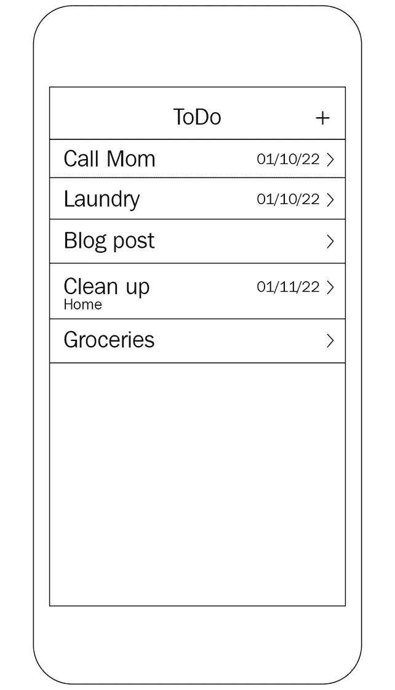
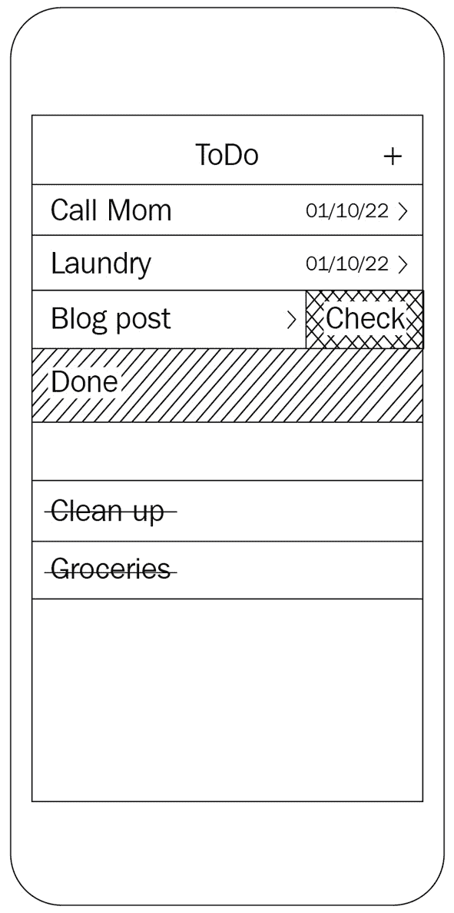
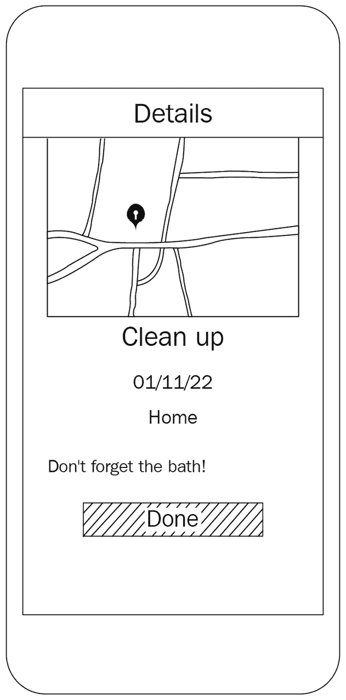
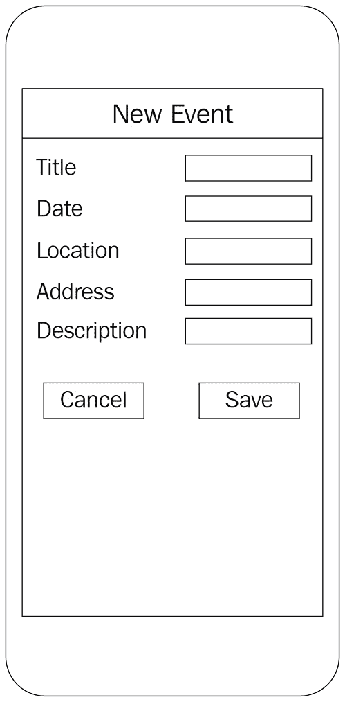
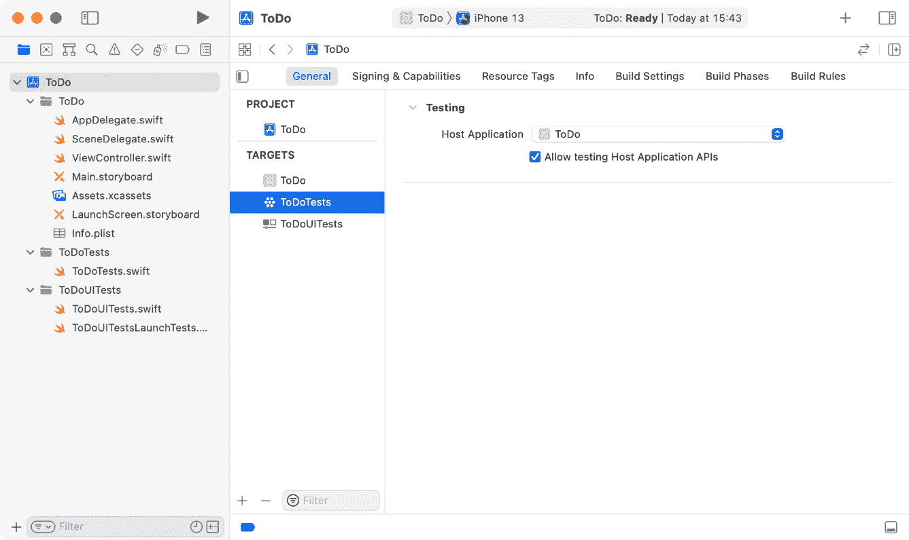
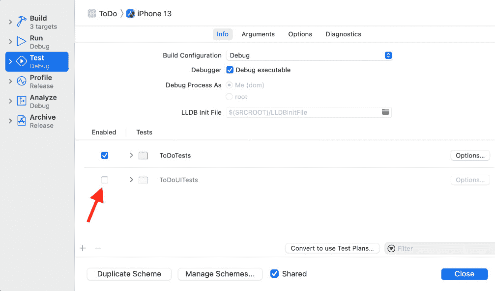
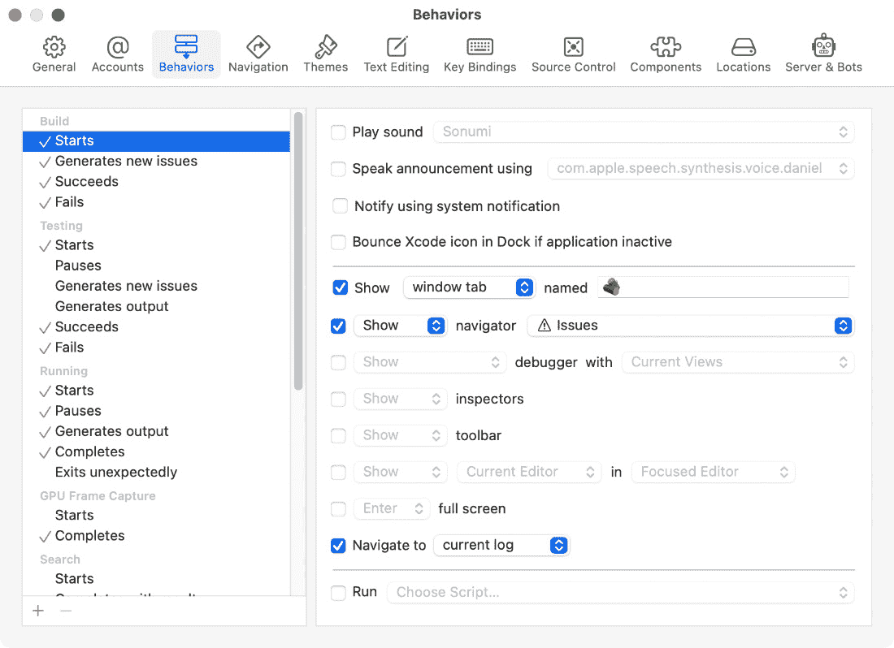
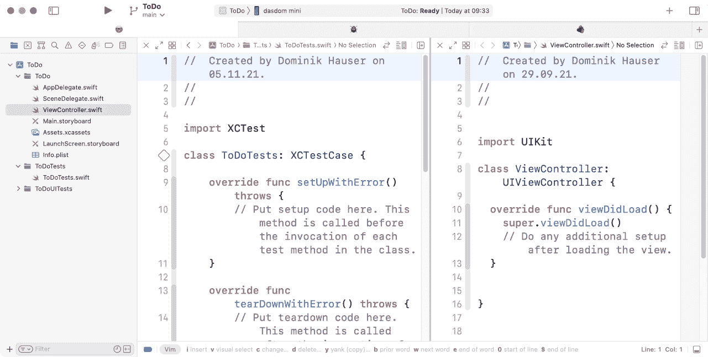

# 第四章：*第四章*：我们将要构建的应用

在前面的章节中，你学习了如何编写单元测试，并看到了**测试驱动开发**（**TDD**）的一个简单示例。当开始 TDD 时，对大多数人来说编写单元测试很容易。困难的部分是将知识从编写测试转移到驱动开发。可以假设什么？在我们编写第一个测试之前应该做什么？我们应该测试什么才能最终得到一个完整的应用？

作为开发者，你习惯于从代码的角度思考。当你看到应用需求列表上的一个功能时，你的大脑已经开始为这个功能规划代码。对于 iOS 开发中反复出现的问题（如构建表格视图），你很可能已经开发了自己的最佳实践。

在 TDD 中，你在编写测试时不应考虑代码。测试必须描述被测试单元应该做什么，而不是它应该如何做。应该能够在不破坏测试的情况下更改实现。这种思维方式是 TDD 的难点。你需要练习才能使它变得自然。

为了练习这种开发方法，我们将在这本书的剩余部分开发一个简单的待办事项列表应用。故意让它变得无聊且简单。我们想专注于 TDD 工作流程，而不是复杂的实现。一个有趣的应用会分散本书的重点——如何执行 TDD。

本章介绍了我们将要构建的应用，并展示了完成应用将拥有的视图。

这是本章的主要主题：

+   待办事项列表

+   待办事项详情视图

+   添加待办事项的视图

+   应用的结构

+   在 Xcode 中开始

# 技术要求

本章中的所有代码都已上传（完整形式）在此：

[`github.com/PacktPublishing/Test-Driven-iOS-Development-with-Swift-Fourth-Edition/tree/main/chapter04`](https://github.com/PacktPublishing/Test-Driven-iOS-Development-with-Swift-Fourth-Edition/tree/main/chapter04)

# 待办事项列表

当启动应用（我们将要构建的应用）时，用户会在他们的 iOS 设备屏幕上看到待办事项列表。列表中的项目包括标题、可选的位置和截止日期。可以通过使用添加（**+**）按钮将新项目添加到列表中，该按钮显示在视图的导航栏中。任务列表视图将看起来像这样：

图 4.1 – 待办事项列表

作为用户，我有以下要求：

+   我想在打开应用时看到待办事项列表。

+   我想将待办事项添加到列表中。

在待办事项列表应用中，用户显然需要在完成事项时能够勾选它们。勾选的事项会显示在未勾选事项下方，并且可以再次取消勾选。应用使用表格视图的用户界面中的**删除**按钮来勾选和取消勾选事项。勾选的事项将被放在列表末尾的**完成**标题部分。待办事项列表的用户界面看起来如下：

图 4.2 – 可以勾选待办事项为完成

作为用户，我有以下要求：

+   我想要勾选一个待办事项以标记它为完成。

+   我想要看到所有勾选的事项都跟在未勾选事项之后。

+   我想要取消勾选一个待办事项。

+   我想要删除所有待办事项。

当用户点击一个条目时，该条目的详细信息将在任务详情视图中显示。

# 待办事项详情视图

任务详情视图显示了存储在待办事项中的所有信息。信息包括标题、截止日期、位置（名称和地址）以及描述。如果提供了地址，则会显示带有地址的地图。详情视图还允许勾选事项为完成。**详情**视图看起来如下：

图 4.3 – 待办事项详情视图

作为用户，我有以下要求：

+   我在列表中点击了一个待办事项，并想要看到它的详情。

+   我想要从详情视图中勾选待办事项。

您需要能够将待办事项添加到列表中。下一节将展示这个输入视图将看起来是什么样子。

# 添加待办事项的视图

当用户在列表视图中选择添加（**+**）按钮时，将显示任务输入视图。用户可以为任务添加信息。标题是必需的。只有提供了标题时，才能选择**保存**按钮。无法添加列表中已经存在的任务。**取消**按钮将关闭视图。任务输入视图将看起来如下：

图 4.4 – 添加待办事项到列表的视图

作为用户，我有以下要求：

+   假设我在项目列表中点击了添加（**+**）按钮，我想要看到一个表单来输入待办事项的详情（标题、可选日期、可选位置名称、可选地址和可选描述）。

+   我想要通过点击**保存**按钮将待办事项添加到待办事项列表中。

我们将不会实现任务的编辑和删除功能，但当你完全阅读完这本书后，通过先编写测试，你将很容易自己添加这个功能。

请记住，我们不会测试应用的外观和设计。单元测试无法确定应用是否看起来符合预期。单元测试可以测试功能，而这些功能与其展示是独立的。原则上，我们可以为 UI 元素的定位和颜色编写单元测试，但这些事情在开发早期阶段很可能会有很大变化。我们不希望仅仅因为按钮移动了 10 个点就出现失败的测试。

然而，我们将测试视图中的 UI 元素是否存在。如果你的用户看不到任务的信息，或者无法添加任务的所有信息，那么该应用不符合要求。

在下一节中，我们将讨论我们将要构建的应用的结构。

# 应用结构

在我们开始实现待办应用的不同视图之前，我们需要考虑应用的结构。故意使应用保持简单，以帮助集中关注本书的主要主题：使用 TDD 构建应用。

## 表格视图控制器、代理和数据源

在 iOS 应用中，数据通常使用表格视图来展示。表格视图在性能上高度优化；它们易于使用和实现。我们将使用表格视图来展示待办事项列表。

表格视图通常由`UITableViewController`表示，它也是表格视图的数据源和代理。这通常会导致一个庞大的表格视图控制器，因为它做了太多事情：展示视图、导航到其他视图控制器，以及管理表格视图中数据的展示。

为了减轻表格视图控制器的责任，我们将使用协调器模式。这样，协调器负责在应用的不同视图之间导航。由于我们的应用相当简单，我们只需要一个协调器来管理整个应用。

表格视图控制器与协调器类之间的通信将通过协议来定义。协议定义了一个类的接口看起来是什么样子。这有一个很大的好处：如果我们需要用更好的版本替换实现（可能是因为你学会了以更好的方式实现功能），我们只需要针对清晰的**应用程序编程接口**（**API**）进行开发。其他类的内部工作方式并不重要。

## 表格视图单元格

如前述截图所示，待办事项列表项有一个标题，并且可选地可以有一个截止日期和位置名称。表格视图单元格应仅显示设置的数据。我们将通过实现我们自己的自定义表格视图单元格来完成这一点。

## 模型

应用程序的模型由待办事项、位置和项目管理者组成，它允许添加和删除项目，并负责管理项目。因此，控制器将向项目管理者请求要显示的项目。项目管理者还将负责在磁盘上存储项目。

初学者往往倾向于在控制器内管理模型对象。然后，控制器有一个对项目集合的引用，项目的添加和删除直接由控制器完成。这不被推荐，因为如果我们决定更改项目的存储（例如，使用 Core Data），它们的添加和删除必须在控制器内进行更改。这样的类很难保持概览，因为它做了许多不同且不相关的事情；因此，它可能是一个错误源。

在控制器和模型对象之间有一个清晰的接口要容易得多，因为如果我们需要更改模型对象的管理方式，控制器可以保持不变。如果我们只是保持接口不变，甚至可以替换整个模型层。本书的后面，我们将看到这种解耦也有助于使测试更容易。

## 其他视图

应用程序将有两个额外的视图：任务详情视图和任务输入视图。

当用户在列表中点击待办事项时，该事项的详细信息将在任务详情视图控制器中显示。从**详情**屏幕，用户将能够勾选一个事项。

新的待办事项将通过输入视图添加到列表中。此视图将使用 SwiftUI 实现。

## 开发策略

在本书中，我们将从内到外构建应用程序。我们将从模型开始，然后构建控制器和网络。本书的结尾，我们将把所有东西组合在一起。

通常，在进行 TDD 时，你可能会按功能一个接一个地构建应用程序，但通过按层而不是按功能分离，更容易跟踪和了解正在发生的事情。当你后来需要刷新记忆时，你需要的相关信息更容易找到。

在下一节中，我们将设置 Xcode 中的应用程序并调整一些 Xcode 的行为。

# 在 Xcode 中开始

现在，让我们通过创建一个项目开始我们的旅程，我们将使用 TDD 来实现它。按照以下步骤进行：

1.  打开 Xcode 并使用**应用程序**模板创建一个新的 iOS 项目。

1.  在“`ToDo`”作为产品名称时，选择“`Storyboard`”界面和“`Swift`”作为语言，并勾选**包含测试**旁边的框。让**使用 Core Data**框保持未勾选。

Xcode 创建了一个包含三个目标的 iOS 项目：一个用于实现代码，一个用于单元测试，一个用于 UI 测试。模板包含在屏幕上显示单个视图的代码。

1.  要查看应用目标与测试目标如何配合，请在项目导航器中选择项目，然后选择 `ToDoTests` 目标。在 **General** 选项卡中，你会找到一个设置，用于指定测试目标应该能够测试的 **Host Application**。它看起来像这样：

图 4.5 – 测试目标的常规设置

Xcode 已经正确设置了测试目标，以便我们可以测试将要写入应用目标中的实现。

1.  不幸的是，Xcode 还为 UI 测试创建了一个测试目标。UI 测试对于 TDD 来说太慢了。为了保持测试运行时的快速反馈，我们需要禁用主方案中的 UI 测试。点击 Xcode 窗口顶部的 **Build** 信息栏中的方案，并选择 **Test** 阶段。接下来，取消勾选 UI 测试目标旁边的复选框。这个过程在下面的屏幕截图中有说明：

图 4.6 – 禁用 UI 测试

## 设置有用的 Xcode 测试行为

Xcode 有一个名为 **Behaviors** 的功能。通过使用行为和标签，Xcode 可以根据其状态显示有用的信息。

通过导航到 **Xcode** | **Behaviors** | **Edit Behaviors** 打开 **Behaviors** 窗口。在左侧可以看到你可以添加行为的不同阶段（**Build**、**Testing**、**Running** 等等）。这些行为在进行 TDD 时非常有用。

这里显示的行为是我认为有用的。尝试调整设置，找到对你最有用的那些。总的来说，我推荐使用行为，因为我认为它们可以加快开发速度。

## 有用的构建行为

当构建开始时，Xcode 编译文件并将它们链接在一起。要查看正在发生的事情，你可以在构建开始时激活 **Build** 日志。建议你在新标签页中打开 **Build** 日志，因为这样可以在构建过程中没有错误发生时切换回代码编辑器：

1.  选择 **Starts** 阶段，并勾选 **window tab** 的 **Show** 选项。

1.  将名称 `Log` 输入到 **named** 字段或使用一个表情符号。

1.  选择 **navigator** 和 **Issues** 的 **Show** 选项。

1.  在窗口底部，勾选 **Navigate to** 并选择 **current log**。在做出这些更改后，设置窗口将看起来像这样：

图 4.7 – 在构建开始时显示构建日志的行为

1.  构建并运行以查看行为的外观。

## 测试行为

我有一个用于编码的窗口标签。这个标签的名称是 🤓。通常，在这个标签中，测试在左侧打开，而在 **Assistant Editor** 中是待测试的代码（或者在 TDD 的情况下，是待编写的代码）。它看起来像这样：

图 4.8 – 🤓 选项卡

当测试开始时，我们希望再次看到代码编辑器。因此，我们添加了一个显示🤓标签的行为。除此之外，我们还想看到带有控制台视图的**测试**导航器和调试器。

当测试成功时，Xcode 应该显示一个边框来通知我们所有测试都已通过。导航到**测试** | **成功**阶段，并检查**使用系统通知通知**设置。除此之外，它还应该隐藏导航器和调试器，因为我们想专注于重构或编写下一个测试。

如果测试失败（在 TDD 中这种情况经常发生），Xcode 应该再次显示通知。我喜欢隐藏调试器，因为通常情况下，它不是找出失败测试中发生什么情况的最佳位置。在大多数 TDD 的情况下，我们 already know what the problem is.

你甚至可以让你的 Mac 朗读公告。检查**使用朗读公告**并选择你喜欢的声音，但要注意不要惹恼你的同事。你将来可能需要他们的帮助。

现在，项目和 Xcode 已经设置好了，我们可以开始我们的 TDD 之旅了。

# 摘要

在本章中，我们查看了一下我们将在本书的整个过程中构建的应用程序。我们查看了一下完成应用后屏幕将如何显示。我们创建了一个稍后将要使用的项目，并了解了 Xcode 的行为。

在下一章中，我们将使用 TDD 开发应用程序的数据模型。我们将在可能的地方使用结构体来表示模型，因为模型在 Swift 中最好用值类型来表示。

# 练习

1.  使用 Xcode 中的故事板复制模拟屏幕。

1.  修改行为，以便你可以在不查看屏幕的情况下确定测试是否失败或所有测试是否通过。
