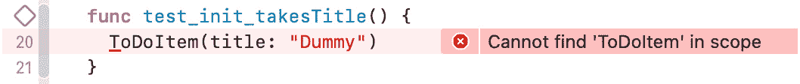

# *第五章*：构建待办事项的结构

iOS 应用通常使用一种称为 **模型-视图-控制器**（**MVC**）的设计模式进行开发。在这个模式中，每个类、结构体或枚举要么是模型对象、视图，要么是控制器。模型对象负责存储数据。它们应该独立于 UI 提供的展示方式。例如，应该能够使用相同的模型对象在 iOS 应用和 macOS 的命令行工具中使用。

视图对象呈现数据。它们负责使对象对用户可见（或在启用了语音覆盖的应用中可听），对于应用运行在的设备而言，视图是特殊的。在跨平台应用中，视图对象不能共享。每个平台都需要实现视图层。

控制器对象在模型和视图对象之间进行通信。它们负责使模型对象可展示。

我们将使用 MVC 为我们的待办事项应用设计，因为它是最容易的设计模式之一，并且苹果在它的示例代码中广泛使用。

本章从我们的应用模型层开始，引领我们进入 TDD 领域。到本章结束时，我们将有一个可以存储待办事项所有信息的结构，包括可选的位置。

在本章中，我们将涵盖以下主题：

+   实现 `ToDoItem` 结构体

+   实现 `Location` 结构体

# 技术要求

本章的所有代码都可以在这里找到（完整形式）：[`github.com/PacktPublishing/Test-Driven-iOS-Development-with-Swift-Fourth-Edition/tree/main/chapter05`](https://github.com/PacktPublishing/Test-Driven-iOS-Development-with-Swift-Fourth-Edition/tree/main/chapter05)。

# 实现 `ToDoItem` 结构体

为了有用，待办事项需要一组最小信息。在本节中，我们将创建一个结构体来保存这些信息，同时使用测试来指导其开发。

一个待办事项应用需要一个模型类/结构体来存储待办事项的信息：

1.  我们将首先向单元测试目标添加一个新的测试用例。打开我们在 *第四章* 的 *开始使用 Xcode* 部分创建的待办事项项目，选择 **ToDoTests** 组。

1.  前往 `ToDoItemTests`，将其设置为 `XCTestCase` 的子类，选择 **Swift** 作为语言，然后点击 **下一步**。

1.  在下一个窗口中，点击 **创建**。

1.  现在，删除 `ToDoTests.swift` 模板测试用例。

## 添加标题属性

待办事项需要一个 `title`。按照以下步骤向我们的 `ToDoItem` 结构体添加一个：

1.  打开 `ToDoItemTests.swift` 文件，并在 `import XCTest` 语句下方添加以下导入表达式：

    ```swift
    @testable import ToDo
    ```

这是为了能够测试 `ToDo` 模块。`@testable` 关键字使 `ToDo` 模块的内部方法对测试用例可访问。或者，您可以使用 `public` 或 `open` 访问级别从测试目标中使方法可访问。但您应该只在需要这些访问级别时这样做，因为例如，该方法是一个 Swift 包的一部分。

1.  删除两个模板测试方法，`testExample()` 和 `testPerformanceExample()`。

1.  待办事项的 `title` 字符串是必需的。让我们编写一个测试来确保存在一个初始化器，它将接受一个 `title` 字符串。将以下测试方法添加到测试用例的末尾（但仍在 `ToDoItemTests` 类中）：

    ```swift
    // ToDoItemTests.swift
    func test_init_takesTitle() {
      ToDoItem(title: "Dummy")
    }
    ```

1.  集成到 Xcode 中的静态分析器会抱怨它 `在作用域中找不到 'ToDoItem'`：



图 5.1 – Xcode 告诉我们找不到 ToDoItem 类型

我们无法编译此代码，因为 Xcode 找不到 `ToDoItem` 类型。一个无法编译的测试是一个失败的测试；一旦我们有一个失败的测试，我们就需要编写实现代码来使测试通过。

1.  要添加实现代码的文件，首先，在 **项目** 导航器中点击 **ToDo** 组。否则，添加的文件将被放入测试组。

1.  打开 `ToDoItem.swift` 文件，确保文件已添加到 `ToDo` 目标，而不是 `ToDoTests` 目标，并点击 **创建**：

![图 5.2 – 将文件添加到主目标]

](img/Figure_5.02_B18127.jpg)

图 5.2 – 将文件添加到主目标

1.  在编辑器中打开 `ToDoItem.swift` 并添加以下代码：

    ```swift
    // ToDoItem.swift
    struct ToDoItem {
    }
    ```

这段代码是一个名为 `ToDoItem` 的结构的完整实现。因此，Xcode 现在应该能够找到 `ToDoItem` 标识符。

1.  通过访问 `ToDoItem` 来运行测试，如下所示：

    ```swift
    let item = ToDoItem()
    ```

1.  然而，我们希望有一个接受标题的初始化器。我们需要添加一个名为 `title` 的 `String` 类型的属性来存储标题字符串：

    ```swift
    // ToDoItem.swift
    struct ToDoItem {
      let title: String
    }
    ```

再次运行测试；它将通过。我们已经使用 TDD 实现了我们待办事项应用的第一微功能——而且这并不困难。在这本书的其余部分，我们将反复这样做，直到应用完成。但首先，我们需要检查现有的测试和实现代码中是否有任何需要重构的内容。测试和代码都是干净且简单的，所以目前没有需要重构的内容。

小贴士

总是记得在测试变绿后检查是否需要重构。

然而，关于测试还有一些需要注意的事项。首先，Xcode 显示一个警告，指出 `_ = ToDoItem(title: "Foo")`。这告诉 Xcode 我们知道我们在做什么。我们想调用 `ToDoItem` 的初始化器，但我们不关心它的返回值。

其次，测试中没有 `XCTAssert` 函数调用。要添加断言，我们可以将测试重写如下：

```swift
func test_init_takesTitle() {
  let item = ToDoItem(title: "Dummy")
  XCTAssertNotNil(item, "item should not be nil")
}
```

但在 Swift 中，一个非失败的初始化器不能返回 `nil`。它总是返回一个有效的实例。这意味着 `XCTAssertNotNil()` 方法是没有用的。我们不需要它来确保我们已经编写了足够的代码来实现测试的微特性。它不是驱动开发所必需的，而且它不会使代码变得更好。

在我们进行接下来的几个测试之前，让我们以使 TDD 工作流程更简单、更快捷的方式设置编辑器。首先，在编辑器中打开 `ToDoItemTests.swift`。然后，打开 `ToDoItem.swift` 以在辅助编辑器中打开它。根据你的屏幕大小和偏好，你可能更喜欢再次隐藏导航器。使用这种设置，你可以将测试和代码并排放置，从测试切换到代码以及反之，都无需花费任何时间。此外，由于在编写代码时相关测试是可见的，它可以指导实现。

## 添加 `itemDescription` 属性

一个待办事项可以有一个描述。我们希望有一个初始化器，它也接受一个描述字符串。让我们开始：

1.  为了驱动实现，我们需要一个失败的测试来验证这个初始化器的存在：

    ```swift
    // ToDoItemTests.swift
    func test_init_takesTitleAndDescription() {
      _ = ToDoItem(title: "Dummy",
                   itemDescription: "Dummy Description")
    }
    ```

再次，这段代码无法编译，因为在调用中有一个额外的名为 `itemDescription` 的参数。

1.  为了使这个测试通过，我们必须向 `ToDoItem` 添加一个 `String?` 类型的 `itemDescription` 属性：

    ```swift
    // ToDoItem.swift
    struct ToDoItem {
      let title: String
      let itemDescription: String?
    }
    ```

1.  运行测试。`test_init_takesTitle()` 测试将会失败（也就是说，它将无法编译），因为有一个 `init` 方法也可以为参数设置默认值。你将使用这个特性，如果初始化器中没有为 `itemDescription` 设置参数，则将其设置为 `nil`。

1.  将以下代码添加到 `ToDoItem` 中：

    ```swift
    // ToDoItem.swift
    init(title: String,
         itemDescription: String? = nil) {
      self.title = title
      self.itemDescription = itemDescription
    }
    ```

这个初始化器有两个参数。第二个参数有一个默认值，所以我们不需要提供两个参数。当省略第二个参数时，将使用默认值。

1.  现在，运行测试以确保两个测试都通过。

## 移除隐藏的错误来源

为了能够只通过设置标题来使用简短的初始化器，我们需要自己定义它。但这同时也引入了一个新的潜在错误来源。我们可以移除我们已实现的两个微特性，并且两个测试仍然可以通过。要查看这是如何工作的，请打开 `ToDoItem.swift` 并注释掉初始化器中的属性和赋值：

```swift
struct ToDoItem {
//  let title: String
//  let itemDescription: String?

  init(title: String,
       itemDescription: String? = nil) {

//    self.title = title
//    self.itemDescription = itemDescription
  }
}
```

运行测试。两个测试仍然会通过。原因在于它们并没有检查初始化器参数的值是否被设置到了任何 `ToDoItem` 属性上。我们可以轻松地扩展测试以确保这些值被设置。首先，让我们将第一个测试的名称改为 `test_init_whenGivenTitle_setsTitle()` 并替换为以下代码：

```swift
// ToDoItemTests.swift
func test_init_whenGivenTitle_setsTitle() {
  let item = ToDoItem(title: "Dummy")
  XCTAssertEqual(item.title, "Dummy")
}
```

这个测试无法编译，因为 `ToDoItem` 没有标题属性（它是被注释掉的）。这表明测试现在正在测试我们的意图。移除标题属性的注释符号和在初始化器中标题的赋值，然后再次运行测试。所有的测试都会通过。现在，用这个测试替换第二个测试：

```swift
// ToDoItemTests.swift
func test_init_whenGivenDescription_setsDescription() {
  let item = ToDoItem(title: "Dummy",
                      itemDescription: "Dummy Description")
  XCTAssertEqual(item.itemDescription, "Dummy Description")
}
```

移除 `ToDoItem` 中的剩余注释符号，再次运行测试。这两个测试都会再次通过，并且现在它们测试初始化器是否工作。

小贴士

使用可读的测试方法名是一个好主意——也就是说，能够讲述测试故事的名称。使用如 `test_<方法名>_<前提条件>_<预期行为>` 这样的模式是很常见的。这样，当测试失败时，方法名就告诉你所有关于测试你需要知道的信息。在这本书中，我们将尝试遵循这个模式，但由于空间有限，我们将在代码难以阅读时省略一些信息（例如，前提条件）。你应该开发一个模式并在所有测试中使用它。

## 添加时间戳属性

一个待办事项也可以有一个由 `timestamp` 属性表示的截止日期：

1.  添加以下测试以确保我们可以使用 `timestamp` 初始化 `ToDoItem` 的实例：

    ```swift
    // ToDoItemTests.swift
    func test_init_setsTimestamp() {
      let dummyTimestamp: TimeInterval = 42.0
      let item = ToDoItem(title: "Dummy",
                          timestamp: dummyTimestamp)
      XCTAssertEqual(item.timestamp, dummyTimestamp)
    }
    ```

再次，这个测试无法编译，因为初始化器中有一个额外的参数。从其他属性的实现中，我们知道我们必须在 `ToDoItem` 中添加一个 `timestamp` 属性并在初始化器中设置它。

1.  将 `ToDoItem` 改成如下所示：

    ```swift
    // ToDoItem.swift
    struct ToDoItem {
      let title: String
      let itemDescription: String?
      let timestamp: TimeInterval?

      init(title: String,
           itemDescription: String? = nil,
           timestamp: TimeInterval? = nil) {

        self.title = title
        self.itemDescription = itemDescription
        self.timestamp = timestamp
      }
    }
    ```

1.  运行测试。如果有点运气，所有的测试都会通过。但如果它们在你的电脑上没有通过，会发生什么呢？这种情况的原因可能是因为我们使用 `XCTAssertEqual(_:_:)` 来比较两个 `TimeInterval` 结构。`TimeInterval` 是 `Double` 类型的一个别名。双精度浮点数是浮点数，因此很难相互比较。通常，你无法判断两个浮点数是否相等。你只能判断它们在某种精度下是否相等。这就是为什么 `XCTest` 提供了一个具有精度的断言方法。

1.  将 `test_init_setsTimestamp()` 中的断言方法调用替换为以下方法调用：

    ```swift
    XCTAssertEqual(item.timestamp!,
                   dummyTimestamp,
                   accuracy: 0.000_001)
    ```

运行测试。你会看到所有的测试都通过了。

你可能已经注意到，我们必须强制解包 `item.timestamp` 来在具有精度的断言方法中使用它。这是因为，与 `XCTAssertEqual(_:_:)` 相比，`XCTAssertEqual(_:_:accuracy:)` 不能比较可选值。`ToDoItem` 中的 `timestamp` 是可选的，这样就可以创建没有截止日期的待办事项。在单元测试中强制解包一个值并不像在生产代码中那样有问题，因为测试中的崩溃只对开发者可见。

然而，苹果还是为 `XCTest` 添加了一个功能来更好地处理可选值。这对于本书的其余部分来说非常重要，因此值得单独成章。

## 在单元测试中处理可选值

在 Xcode 11 中，Apple 将`XCTUnwrap(_:)`函数引入到`XCTest`中。这个函数展开其参数并返回展开后的值。如果参数是`nil`，这个函数会抛出一个错误。在本节中，我们将使用这个函数来改进我们的测试代码。用以下代码替换`test_init_setsTimestamp()`测试方法：

```swift
// ToDoItemTests.swift
func test_init_setsTimestamp() throws {
  let dummyTimestamp: TimeInterval = 42.0
  let item = ToDoItem(title: "Dummy",
                      timestamp: dummyTimestamp)
  let timestamp = try XCTUnwrap(item.timestamp)
  XCTAssertEqual(timestamp,
                 dummyTimestamp,
                 accuracy: 0.000_001)
} 
```

这段代码中有几处变化。让我们逐一查看：

+   该方法现在被标记为`throws`。这样做的原因是我们调用了一个可能会抛出错误的函数。当一个带有`throws`标记的测试方法在执行过程中抛出错误而没有被捕获时，该测试方法会失败。

+   使用`try XCTUnwrap(item.timestamp)`，我们尝试展开`item.timestamp`的值。

+   结果被分配给一个变量，该变量用于`XCTAssertEqual`方法。

当你在测试代码中必须处理可选值时，这是首选的方式。这样，在值意外为`nil`的情况下，你可以获得最有价值的信息。

## 添加位置属性

我们希望在`ToDoItem`的初始化器中设置的最后一个属性是它的`Location`。位置有一个名称，并且可以可选地有一个坐标。我们将使用一个结构体来封装这些数据到一个类型中。让我们开始吧：

1.  将以下代码添加到`ToDoItemTests`：

    ```swift
    // ToDoItemTests.swift
    func test_init_whenGivenLocation_setsLocation() {
      let dummyLocation = Location(name: "Dummy Name")
    }
    ```

测试尚未完成，但它已经失败了，因为 Xcode 中的`Location`还没有完成。

1.  打开`Location.swift`到`ToDoItem`结构体，我们已经知道需要什么来使测试通过。

1.  将以下代码添加到`Location.swift`：

    ```swift
    // Location.swift
    struct Location {
      let name: String
    }
    ```

这定义了一个名为`Location`的结构体，并带有`name`属性，使得测试代码再次可编译。但测试还没有完成。

1.  将以下代码添加到`test_init_whenGivenLocation_setsLocation()`：

    ```swift
    // ToDoItemTests.swift
    func test_init_whenGivenLocation_setsLocation() {
      let dummyLocation = Location(name: "Dummy Name")
      let item = ToDoItem(title: "Dummy Title",
                          location: dummyLocation)
      XCTAssertEqual(item.location?.name,
                     dummyLocation.name)
    }
    ```

不幸的是，我们目前还不能使用位置本身来检查相等性，所以下面的断言不起作用：

```swift
XCTAssertEqual(item.location, dummyLocation)
```

原因是`XCTAssertEqual()`的前两个参数必须符合`Equatable`协议。我们将在下一章中添加协议的符合性。

同样，这不能编译，因为`ToDoItem`的初始化器没有名为`Location`的参数。

1.  将`location`属性和初始化器参数添加到`ToDoItem`中。结果应该看起来像这样：

    ```swift
    // ToDoItem.swift
    struct ToDoItem {
      let title: String
      let itemDescription: String?
      let timestamp: TimeInterval?
      let location: Location?

      init(title: String,
           itemDescription: String? = nil,
           timestamp: TimeInterval? = nil,
           location: Location? = nil) {

        self.title = title
        self.itemDescription = itemDescription
        self.timestamp = timestamp
        self.location = location
      }
    }
    ```

1.  再次运行测试。所有测试都将通过，并且没有需要重构的地方。我们现在已经使用 TDD 实现了一个结构体来持有`ToDoItem`。

在下一节中，我们将实现一个结构体来存储待办事项的位置数据。

# 实现`Location`结构体

在上一节中，我们添加了一个结构体来存储关于位置的信息。现在我们将添加测试以确保`Location`具有所需的属性和初始化器。

这些测试可以添加到`ToDoItemTests`中，但当测试类与实现类/结构体相匹配时，它们更容易维护。因此，我们需要一个新的测试用例类。

打开 `ToDoTests` 组，并添加一个名为 `LocationTests` 的单元测试用例类。确保您进入 **iOS** | **源** | **单元测试用例类**，因为我们想测试 iOS 代码，而 Xcode 有时会导航到 **OS X** | **源**。

设置编辑器以在左侧显示 `LocationTests.swift`，并在右侧的辅助编辑器中显示 `Location.swift`。在测试类中添加 `@testable import ToDo` 并删除 `testExample()` 和 `testPerformanceExample()` 模板测试。

## 添加坐标属性

待办事项的位置将在应用中用于在详情中显示地图。地图上的位置可以使用 `latitude` 和 `longitude` 值进行存储。在以下步骤中，我们将添加一个 `coordinate` 属性来存储此信息：

1.  为了驱动 `Coordinate` 属性的添加，我们需要一个失败的测试。对于坐标，我们将使用 Core Location 框架中的 `CLLocationCoordinate2D` 类型。

1.  在现有导入语句下方导入 `CoreLocation`：

    ```swift
    // LocationTests.swift
    import XCTest
    @testable import ToDo
    import CoreLocation
    ```

1.  将以下测试添加到 `LocationTests`:

    ```swift
    // LocationTests.swift
    func test_init_setsCoordinate() throws {
      let coordinate = CLLocationCoordinate2D(latitude: 1,
                                              longitude: 2)
      let location = Location(name: "",
                              coordinate: coordinate)
      let resultCoordinate = try XCTUnwrap(location.coordinate)
      XCTAssertEqual(resultCoordinate.latitude, 1,
                     accuracy: 0.000_001)
      XCTAssertEqual(resultCoordinate.longitude, 2,
                     accuracy: 0.000_001)
    }
    ```

首先，我们创建了一个坐标并使用它创建了一个 `Location` 实例。然后，我们断言位置坐标的 `latitude` 和 `longitude` 值已被设置为正确的值。我们在 `CLLocationCoordinate2D` 的初始化器中使用 `1` 和 `2` 的值，因为该类还有一个不接受任何参数的初始化器（`CLLocationCoordinate2D()`），并将 `longitude` 和 `latitude` 值设置为零。我们需要确保 `Location` 的初始化器在测试中将坐标参数分配给其属性。

注意

你可能已经注意到我们在 `XCTAssertEqual()` 函数中省略了 `message` 参数。这是因为使用的断言已经提供了足够的信息，帮助我们了解测试中期望的内容。我们期望两个值相同。没有必要在消息中重复该信息。如果你觉得这个信息有用，你可以自己添加消息。

测试无法编译，因为 `Location` 还没有 `coordinate` 属性。类似于 `ToDoItem`，我们希望有一个只有 `name` 参数的简短初始化器。因此，我们需要自己实现初始化器，而不能使用 Swift 提供的初始化器。

1.  将 `Location.swift` 的内容替换为以下代码行：

    ```swift
    // Location.swift
    import Foundation
    import CoreLocation

    struct Location {
      let name: String
      let coordinate: CLLocationCoordinate2D?

      init(name: String,
           coordinate: CLLocationCoordinate2D? = nil) {

        self.name = ""
        self.coordinate = coordinate
      }
    }
    ```

1.  现在，运行测试。所有测试都将通过。

注意，我们故意在初始化器中将 `name` 设置为空字符串。这是使测试通过的最简单实现。但这不是我们想要的。初始化器应该将位置名称设置为 `name` 参数中的值。因此，我们需要另一个测试来确保 `name` 设置正确。

1.  将以下测试添加到 `LocationTests`:

    ```swift
    // LocationTests.swift
    func test_init_setsName() {
      let location = Location(name: "Dummy")
      XCTAssertEqual(location.name, "Dummy")
    }
    ```

1.  运行测试以确保它失败。为了使测试通过，将 `Location` 的初始化器中的 `self.name = ""` 改为 `self.name = name`。再次运行测试以检查它们现在是否都通过了。测试中没有需要重构的部分，它们的实现也没有问题。

现在，`Location` 结构可以存储一个名称以及可选的坐标，这些坐标将用于应用的用户界面。

你可能自己问过自己，为什么我们在实现该功能时从 `coordinate` 属性而不是 `name` 属性开始？我们之所以从坐标开始，是因为这对我们来说是新领域。我们不知道如何处理测试 `Double` 值。有时，先处理最困难的问题可以是一种解脱。这取决于你如何编写代码。测试帮助我们迈出小步，因此有助于使困难问题更容易解决。

我想先向您展示如何测试坐标，以解决眼前的问题。如果你觉得先做简单的测试会让你感觉更好，那就去做吧。但不要写不必要的简单测试来拖延时间，避免处理困难的测试。

# 概述

在本章中，我们使用 TDD 创建了一个结构来存储待办事项的信息。我们了解到 TDD 意味着始终在测试代码和生产代码之间切换。此外，我们还意识到，当我们需要比较浮点数时，应该使用具有精度参数的断言方法。本章所学的内容将帮助您编写更好、更健壮的单元测试。

在下一章中，我们将构建一个结构来管理待办事项。它们需要存储在某个地方，我们还需要一种方法来添加和勾选待办事项。

# 练习

1.  尝试编写一个使用 `XCTAssertEqual(_:_:)` 失败的测试，即使值相等，也因为比较浮点数时出现问题。提示：当你使用简单的数学函数，如加法和乘法时，你经常遇到这个问题。

1.  使 `ToDoItem` 遵守 `Equatable` 协议，并重写断言以利用该协议。
