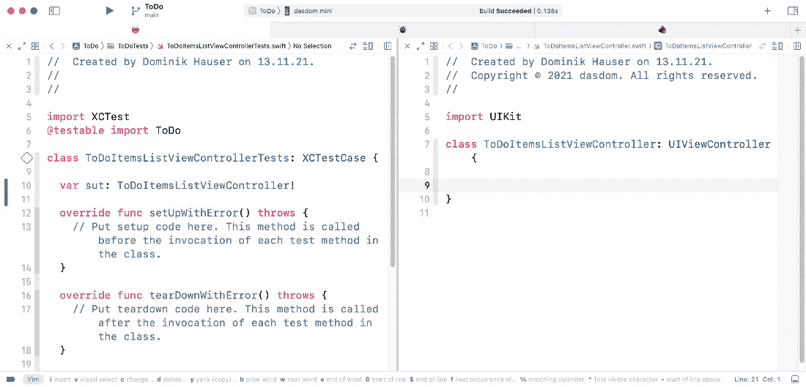
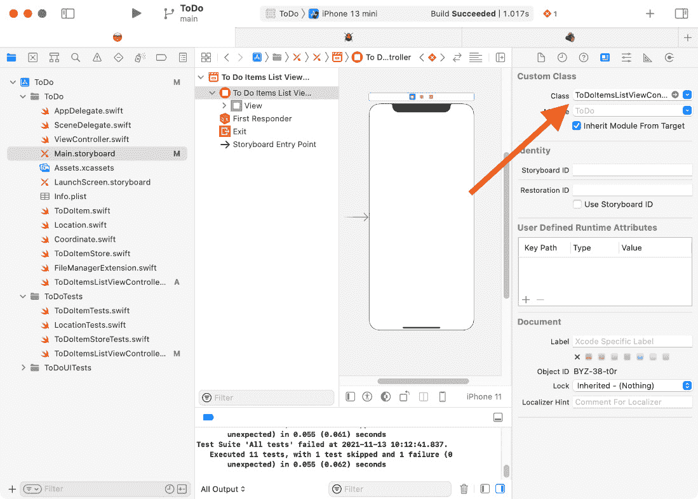
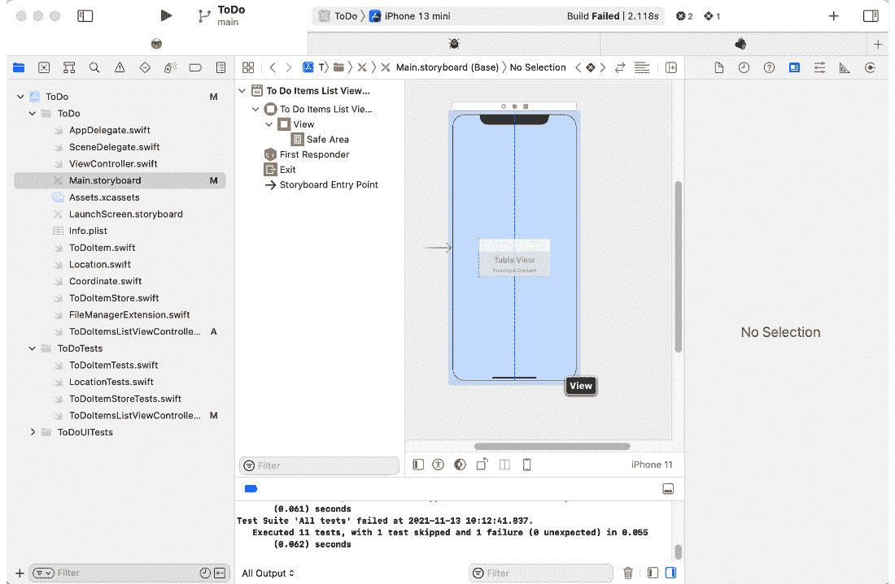

# 第七章：*第七章*：为待办事项构建表格视图控制器

如果你曾与其他 iOS 开发者讨论过单元测试以及 iOS 应用程序的测试驱动开发，你可能已经听到过这样的观点：iOS 应用的用户界面不可测试，也不应该进行测试。许多开发者表示，在开发过程中运行应用程序并手动测试就足以检查用户界面是否正确。

这可能适用于用户界面的初始实现。在开发过程中，你经常在 iOS 模拟器或测试设备上运行应用程序，用户界面中的大多数错误和错误都非常明显。

然而，具有单元测试支持的用户界面的主要好处是能够无畏地重构不再完美的代码。作为一名开发者，你每天都在积累经验，每年，Apple 都会发布新的 API，使我们的代码更容易理解，有时也更容易编写。长期存在的应用程序需要不断重构，以保持其可管理性。

这是在 iOS 开发中为用户界面编写测试的主要论据。当你确信用户界面背后有良好的测试支持时，你可以执行极端的重构而不会破坏已测试的功能。

在本章中，我们将构建一个表格视图控制器，用于显示待办事项的信息。这个视图控制器是应用程序的主要部分，因此从它开始是一个好主意。本章的结构如下：

+   添加待办事项的表格视图

+   测试表格视图的数据源

+   重构为可差异数据源

+   展示两个部分

+   实现表格视图的代理

在完成本章内容后，你将能够为表格视图控制器和表格视图单元格编写单元测试。

# 技术要求

本章的源代码在此处可用：[`github.com/PacktPublishing/Test-Driven-iOS-Development-with-Swift-Fourth-Edition/tree/main/chapter07`](https://github.com/PacktPublishing/Test-Driven-iOS-Development-with-Swift-Fourth-Edition/tree/main/chapter07)。

# 添加待办事项的表格视图

和往常一样，我们从测试开始。但在我们可以编写测试之前，我们需要一个新的测试类。按照以下步骤为显示待办事项的视图控制器添加一个测试类：

1.  选择 `ToDoItemsListViewControllerTests`。

1.  在创建的文件中，添加 `@testable import ToDo` 并删除两个模板测试方法。

1.  为待测试的系统（`sut`）添加一个属性：

    ```swift
    // ToDoItemsListViewControllerTests.swift
    class ToDoItemsListViewControllerTests: XCTestCase {

      var sut: ToDoItemsListViewController!

      override func setUpWithError() throws {
        // Put setup code here. This ...
      }

      override func tearDownWithError() throws {
        // Put teardown code here. This ...
      }
    }
    ```

Xcode 抱怨它 **在作用域中找不到类型 'ToDoItemsListViewController'**。这是预期的，因为我们还没有添加这个类。

1.  在 **类** 字段中选择 `ToDoItemsListViewController` 并将其设置为 **子类**：**UIViewController**。确保 **也创建 XIB 文件** 复选框未被勾选。

![图 7.1 – ToDoItemsListViewController 的选项

![img/Figure_7.01_B18127.jpg]

图 7.1 – ToDoItemsListViewController 的选项

从 `ToDoItemsListViewController` 类中删除所有模板代码。

1.  我们将多次在 `ToDoItemsListViewController` 和其测试类之间切换。因此，同时打开这两个文件可能是个好主意。在 Xcode 中，您可以通过在项目导航器中点击 `ToDoItemsListViewControllerTests.swift` 文件，然后按住 `Option` 键并点击 `ToDoItemsListViewController.swift` 文件来实现。Xcode 然后在辅助编辑器中打开第二个文件。




图 7.2 – Test code and production code side by side in Xcode

1.  在我们可以在视图控制器中测试任何内容之前，我们需要设置系统测试。将 `setUpWithError()` 方法替换为以下代码：

    ```swift
    // ToDoItemsListViewControllerTests.swift
    override func setUpWithError() throws {
      let storyboard = UIStoryboard(name: "Main", bundle: nil)
      sut = try XCTUnwrap(
        storyboard.instantiateInitialViewController()
        as? ToDoItemsListViewController
      )
      sut.loadViewIfNeeded()
    }
    ```

由于视图控制器将在 `Main` 故事板中设置，我们需要在设置代码中从故事板中加载它。请注意，对 `loadViewIfNeeded()` 的调用是实际加载视图。如果我们不调用该方法，视图将不会加载，并且所有出口都是 `nil`。

1.  为了成为一个好公民，我们还需要在每个测试后进行清理。将 `tearDownWithError()` 方法替换为以下代码：

    ```swift
    // ToDoItemsListViewControllerTests.swift
    override func tearDownWithError() throws {
      sut = nil
    }
    ```

从故事板加载可能会出错。让我们添加一个测试来确保这可以工作。

1.  将以下测试添加到 `ToDoItemsListViewControllerTests`：

    ```swift
    // ToDoItemsListViewControllerTests.swift
    func test_shouldBeSetup() {
      XCTAssertNotNil(sut)
    }
    ```

此测试断言在从故事板加载后，系统测试不为空。

运行测试以确保设置系统测试工作。此测试在 `setupWithError` 中失败。

设置方法无法从故事板实例化 `ToDoItemsListViewController` 的实例，因为故事板中的初始视图控制器是 `ViewController` 类型。让我们修复它。

1.  打开 `ToDoItemsListViewController`。




图 7.3 – 在 Main 故事板中更改初始视图控制器

再次运行测试以确认现在所有测试都通过。

最后，我们准备好在这个新的测试类中编写第一个测试。在以下步骤中，我们添加一个测试来断言视图控制器具有用于待办事项的 `tableView` 属性。让我们开始吧：

1.  将以下测试方法添加到 `ToDoItemsListViewControllerTests`：

    ```swift
    // ToDoItemsListViewControllerTests.swift
    func test_shouldHaveTableView() {
      XCTAssertTrue(sut.tableView.isDescendant(of: sut.view))
    }
    ```

`isDescendant(of:)` 方法定义在 `UIView` 上，如果被调用的视图位于传入参数的视图的层次结构中，则返回 `true`。这意味着这个测试断言 `tableView` 被添加到 `sut.view` 或其子视图中。

Xcode 抱怨 `ToDoItemsListViewController` 的 `tableView` 属性。

1.  在界面构建器中打开 **Main.storyboard**，然后通过点击工具栏中的加号按钮并拖动一个表格视图到视图控制器的视图中来打开库。




图 7.4 – 将表视图添加到视图控制器

1.  使用`ToDoItemsListViewController`类打开助手编辑器。

![Figure 7.5 – Dragging a connection from the storyboard into the class

![Figure 7.05_B18127.jpg]

图 7.5 – 从故事板拖动连接到类

1.  将此属性的名称设置为`tableView`并点击**连接**。

运行所有测试。所有测试都通过。我们已经将表视图添加到视图控制器的视图中。

表视图由数据源和代理管理。在下一节中，我们将实现表视图数据源的部分。

# 测试表视图的数据源

在本节中，我们将使用测试驱动开发来实现表视图数据源的部分。我们将使用传统的通过使用视图控制器作为数据源的方法。在下一节中，我们将切换到可变数据源。本节中的挑战是编写测试，使它们独立于数据源的实际实现。

但首先，我们需要谈谈测试替身。

## 添加测试替身

在电影行业中，替身在演员无法参与的危险场景中使用。替身必须看起来和表现得像演员。在软件测试中，我们也有类似的东西：测试替身。测试替身看起来和表现得像一段代码，但可以在测试中完全控制。例如，为了测试我们的表视图的数据源，我们需要将视图控制器与待办项存储连接起来。我们可以使用我们已实现的存储。但这样会使表视图的测试依赖于`ToDoItemStore`的实现。最好有一个可以用于`ToDoItemsListViewController`测试的`ToDoItemStore`测试替身。

按照以下步骤为`ToDoItemStore`添加测试替身：

1.  实现`ToDoItemStore`测试替身的第一步是创建一个定义我们的视图控制器期望的接口的协议。将以下协议添加到`ToDoItemStore.swift`中：

    ```swift
    // ToDoItemStore.swift
    protocol ToDoItemStoreProtocol {
      var itemPublisher:
        CurrentValueSubject<[ToDoItem], Never>
          { get set }
      func check(_: ToDoItem)
    }
    ```

协议定义了视图控制器需要的元素。它需要订阅项目的变化，并且还需要一种检查待办项的方式。

1.  现在我们有了协议，我们可以将协议的符合性添加到`ToDoItemStore`中：

    ```swift
    // ToDoItemStore.swift
    class ToDoItemStore: ToDoItemStoreProtocol {
      // …
    }
    ```

1.  接下来，我们需要一个符合该协议的测试替身。选择`ToDoItemStoreProtocolMock`。用以下代码替换该文件的内容：

    ```swift
    // ToDoItemStoreProtocolMock.swift
    import Foundation
    import Combine
    @testable import ToDo

    class ToDoItemStoreProtocolMock: ToDoItemStoreProtocol {
      var itemPublisher =
        CurrentValueSubject<[ToDoItem], Never>([])

      var checkLastCallArgument: ToDoItem?
      func check(_ item: ToDoItem) {
        checkLastCallArgument = item
      }
    }
    ```

使用这个测试替身的实现，我们可以控制在视图控制器中使用的存储的行为。我们将在下一个测试中看到如何使用这个测试替身。

## 使用测试替身实现行数

表视图数据源需要提供两种类型的信息：首先，给定部分中的行数；其次，给定项的单元格。当然，`UITableViewDataSource`协议中定义了其他方法，但这些是可选的。

让我们从给定部分的行数开始。在默认情况下，表格视图中的部分数是 1。这意味着我们感兴趣的是第一和唯一部分的行数。按照以下步骤实现表格视图的正确行数：

1.  将以下属性添加到`ToDoItemsListViewControllerTests`：

    ```swift
    // ToDoItemsListViewControllerTests.swift
    var toDoItemStoreMock: ToDoItemStoreProtocolMock!
    ```

1.  接下来，在`setUpWithError()`中设置它，并使系统测试使用它：

    ```swift
    // ToDoItemsListViewControllerTests.swift
    override func setUpWithError() throws {
      let storyboard = UIStoryboard(name: "Main", bundle: nil)
      sut = try XCTUnwrap(
        storyboard.instantiateInitialViewController()
        as? ToDoItemsListViewController
      )
      toDoItemStoreMock = ToDoItemStoreProtocolMock()
      sut.toDoItemStore = toDoItemStoreMock
      sut.loadViewIfNeeded()
    }
    ```

此代码无法编译，因为`toDoItemStore`在`ToDoItemsListViewController`中缺失。

1.  在编辑器中打开`ToDoItemsListViewController`并添加缺少的属性：

    ```swift
    // ToDoItemsListViewController.swift 
    class ToDoItemsListViewController: UIViewController { 

      @IBOutlet weak var tableView: UITableView! 
      var toDoItemStore: ToDoItemStoreProtocol? 
    }
    ```

1.  接下来，将以下测试添加到`ToDoItemsListViewControllerTests`：

    ```swift
    // ToDoItemsListViewControllerTests.swift
    func test_numberOfRows_whenOneItemIsSent_shouldReturnOne() {
      toDoItemStoreMock.itemPublisher
        .send([ToDoItem(title: "dummy 1")])
      let result = sut.tableView.numberOfRows(inSection: 0)
      XCTAssertEqual(result, 1)
    }
    ```

在这个测试中，我们使用其`itemPublisher`发送一个`ToDoItem`实例。我们期望表格视图在零区应有行。

运行所有测试以确认这个新测试失败。

1.  目前，表格视图没有设置数据源。`dataSource`属性为 nil。为了使此测试通过，我们首先需要将`ToDoItemsListViewController`分配给表格视图的`dataSource`属性。将以下方法添加到`ToDoItemsListViewController`：

    ```swift
    // ToDoItemsListViewController.swift
    override func viewDidLoad() {
      super.viewDidLoad()
      tableView.dataSource = self
    }
    ```

Xcode 抱怨`ToDoItemsListViewController`尚未符合`UITableViewDataSource`协议。

1.  将以下扩展添加到`ToDoItemsListViewController.swift`：

    ```swift
    // ToDoItemsListViewController.swift
    extension ToDoItemsListViewController: 
      UITableViewDataSource {
      func tableView(
        _ tableView: UITableView,
        numberOfRowsInSection section: Int) -> Int {

          return 1
        }

      func tableView(
        _ tableView: UITableView,
        cellForRowAt indexPath: IndexPath) -> UITableViewCell {

          return UITableViewCell()
        }
    }
    ```

这是使`ToDoItemsListViewController`符合`UITableViewDataSource`协议并使测试通过的最小代码。

你可能想知道为什么我们从`tableView(_:numberOfRowsInSection:)`返回一个硬编码的固定值。这显然是错误的，并且不会导致应用程序正常工作。耐心点。目前，我们的任务是使测试通过，这是我们完成的事情。我们觉得这种实现是错误的只是意味着我们需要另一个测试来确保实现是正确的。

1.  将以下测试方法添加到`ToDoItemsListViewControllerTests`：

    ```swift
    // ToDoItemsListViewControllerTests.swift
    func test_numberOfRows_whenTwoItemsAreSent_shouldReturnTwo() 
    {
      toDoItemStoreMock.itemPublisher
        .send([
          ToDoItem(title: "dummy 1"),
          ToDoItem(title: "dummy 2")
        ])
      let result = sut.tableView.numberOfRows(inSection: 0)
      XCTAssertEqual(result, 2)
    }
    ```

为了在不破坏任何先前测试的情况下使此测试通过，我们需要在视图控制器中处理由项目发布者发送的项目。

1.  首先，导入 Combine 并添加两个属性，`items`和`token`，到`ToDoItemsListViewController`：

    ```swift
    // ToDoItemsListViewController.swift
    class ToDoItemsListViewController: UIViewController {

      @IBOutlet weak var tableView: UITableView!
      var toDoItemStore: ToDoItemStoreProtocol?
      private var items: [ToDoItem] = []
      private var token: AnyCancellable?

      // …
    }
    ```

`items`属性将保留由项目发布者发送的项目，而`token`属性将保留订阅该发布者的订阅者的引用。如果没有订阅者的引用，`Combine`会在我们使用它之前将其销毁。

1.  接下来，更改`ToDoItemsListViewController`中的`viewDidLoad()`，使其看起来像这样：

    ```swift
    // ToDoItemsListViewController.swift
    override func viewDidLoad() {
      super.viewDidLoad()
      tableView.dataSource = self
      token = toDoItemStore?.itemPublisher
        .sink(receiveValue: { [weak self] items in
          self?.items = items
      })
    }
    ```

使用此代码，我们订阅了由`toDoItemStore`的项目发布者发送的变化。我们将发送的项目存储在刚刚添加的`items`属性中。

1.  最后，我们可以在`tableView(_:numberOfRowsInSection:)`中返回项目数量：

    ```swift
    // ToDoItemsListViewController.swift
    func tableView(
      _ tableView: UITableView,
      numberOfRowsInSection section: Int) -> Int {
        return items.count
      }
    ```

运行测试。所有测试都通过。

接下来，我们将使用我们的测试替身来实现表格视图的待办事项单元格。

## 使用测试替身来实现设置待办事项单元格

像往常一样，在实现一个新的微功能时，我们需要一个测试。按照以下步骤添加失败的测试和使测试通过的实现：

1.  将以下测试方法添加到 `ToDoItemsListViewControllerTests.swift`：

    ```swift
    // ToDoItemsListViewControllerTests.swift
    func test_cellForRowAt_shouldReturnCellWithTitle() throws 
    {
      let titleUnderTest = "dummy 1"
      toDoItemStoreMock.itemPublisher
        .send([ToDoItem(title: titleUnderTest)])
      let tableView = try XCTUnwrap(sut.tableView)
      let indexPath = IndexPath(row: 0, section: 0)
      let cell = try XCTUnwrap(
        tableView.dataSource?
          .tableView(tableView,
                     cellForRowAt: indexPath)
        as? ToDoItemCell
      )
    }
    ```

这不是一个完整的测试，但我们需要在这里暂停，因为 `ToDoItemCell` 类型尚未定义。

1.  选择 `ToDoItemCell` 并将其设置为 `UITableViewCell`。移除类中的模板代码。

1.  返回到 `ToDoItemsListViewControllerTests` 并添加测试断言，如下所示：

    ```swift
    // ToDoItemsListViewControllerTests.swift
    func test_cellForRowAt_shouldReturnCellWithTitle1() throws {
      let titleUnderTest = "dummy 1"
      toDoItemStoreMock.itemPublisher
        .send([ToDoItem(title: titleUnderTest)])
      let tableView = try XCTUnwrap(sut.tableView)
      let indexPath = IndexPath(row: 0, section: 0)
      let cell = try XCTUnwrap(
        tableView.dataSource?
          .tableView(tableView,
                     cellForRowAt: indexPath)
        as? ToDoItemCell
      )
      XCTAssertEqual(cell.titleLabel.text, titleUnderTest)
    }
    ```

在这个测试中，我们使用测试替身发布一个包含一个待办事项的列表。然后我们执行表格视图数据源中定义的 `tableView(_:cellForRowAt:)` 方法。返回的表格视图单元格应该显示由发布者发送的待办事项的标题。这个测试目前无法编译，因为单元格没有名为 `titleLabel` 的属性。

1.  将属性添加到 `ToDoItemCell`：

    ```swift
    // ToDoItemCell.swift
    class ToDoItemCell: UITableViewCell {
      let titleLabel = UILabel()
    }
    ```

现在测试可以编译了。运行测试以确认新的测试失败。

如果你是一个经验丰富的 iOS 开发者，你可能已经意识到这段代码还不够。标签已初始化，但尚未添加到单元格中。我们将在本节稍后修复这个问题。

1.  我们刚刚添加的测试失败，因为表格视图的数据源没有返回 `ToDoItemCell` 类型的单元格。转到 `ToDoItemsListViewController` 并将 `tableView(_:cellForRowAt:)` 方法替换为以下代码：

    ```swift
    // ToDoItemsListViewController.swift
    func tableView(
      _ tableView: UITableView,
      cellForRowAt indexPath: IndexPath) -> UITableViewCell {
        let cell = ToDoItemCell()
        cell.titleLabel.text = "dummy 1"
        return cell
      }
    ```

尽管这段代码使所有测试通过（运行测试以确认），但这几行代码有几个问题。一个问题是在 `titleLabel` 中的文本是硬编码为测试期望的字符串。写这样的代码可能看起来很愚蠢，但这对 TDD 来说是基本必要的。使用硬编码值使测试通过的代码告诉我们需要更多的测试。

1.  将以下测试添加到 `ToDoItemsListViewController`：

    ```swift
    // ToDoItemsListViewControllerTests.swift
    func test_cellForRowAt_shouldReturnCellWithTitle2() throws 
    {
      let titleUnderTest = "dummy 2"
      toDoItemStoreMock.itemPublisher
        .send([
          ToDoItem(title: "dummy 1"),
          ToDoItem(title: titleUnderTest)
        ])
      let tableView = try XCTUnwrap(sut.tableView)
      let indexPath = IndexPath(row: 1, section: 0)
      let cell = try XCTUnwrap(
        tableView.dataSource?
          .tableView(tableView,
                     cellForRowAt: indexPath)
        as? ToDoItemCell
      )
      XCTAssertEqual(cell.titleLabel.text, titleUnderTest)
    }
    ```

你应该尝试为这个测试找一个更好的名字。我在这里使用这个名字是为了让方法名尽可能短。长方法名在打印的书籍中看起来不好。

在这个测试中，我们向系统测试发送两个待办事项，并检查第二个单元格中的文本。运行测试。这个新的测试失败，因为 `titleLabel` 中的文本是硬编码的。

1.  修改 `tableView(_:cellForRowAt:)` 的实现，使其看起来像这样：

    ```swift
    // ToDoItemsListViewController.swift
    func tableView(
      _ tableView: UITableView,
      cellForRowAt indexPath: IndexPath) -> UITableViewCell {
        let cell = ToDoItemCell()
        let item = items[indexPath.row]
        cell.titleLabel.text = item.title
        return cell
      }
    ```

在此代码中，我们从 `items` 属性中获取该行的项，并将其标题分配给 `titleLabel` 属性的文本。运行测试以确认所有测试通过。

实现代码仍然存在问题。表格视图中的单元格应该被重用，以提高表格视图的渲染性能。让我们重构代码，同时不破坏测试。

1.  要启用 `UITableView` 的单元格重用功能，请将以下代码行添加到 `ToDoItemsListViewController` 的 `viewDidLoad()` 中：

    ```swift
    // ToDoItemsListViewController.swift
    tableView.register(
      ToDoItemCell.self,
      forCellReuseIdentifier: "ToDoItemCell"
    )
    ```

通过这个调用，我们将 `ToDoItemCell` 注册到表格视图的重用队列中。

1.  现在，我们可以要求表格视图在`tableView(_:cellForRowAt:)`中出队这样的单元格：

    ```swift
    // ToDoItemsListViewController.swift
    func tableView(
      _ tableView: UITableView,
      cellForRowAt indexPath: IndexPath) -> UITableViewCell {
        let cell = tableView.dequeueReusableCell(
          withIdentifier: "ToDoItemCell",
          for: indexPath
        ) as! ToDoItemCell
        let item = items[indexPath.row]
        cell.titleLabel.text = item.title
        return cell
      }
    ```

运行测试以确认我们没有破坏任何东西。

`ToDoItemCell`的实现不足以使单元格在用户界面中显示标题。我们已经初始化了标签，但还没有将其添加到任何视图中。这就是我们接下来要做的。

我们可以编写测试来检查标签是否在视图控制器的测试中添加到表格视图单元格。但如果我们仔细想想，它们应该属于针对单元格本身的专用测试。按照以下步骤添加测试和实现，以使测试通过：

1.  在**类**旁边的**文本**字段中选择`ToDoItemCellTests`并创建文件。删除创建的文件中的两个模板测试。

1.  在现有的导入语句下方，添加对`ToDo`模块的可测试导入：

    ```swift
    // ToDoItemCellTests.swift
    import XCTest
    @testable import ToDo
    ```

1.  在我们可以测试与表格视图单元格相关的任何内容之前，我们需要设置它。将`ToDoItemCellTests`类的实现替换为以下代码：

    ```swift
    // ToDoItemCellTests.swift
    class ToDoItemCellTests: XCTestCase {

      var sut: ToDoItemCell!

      override func setUpWithError() throws {
        sut = ToDoItemCell()
      }

      override func tearDownWithError() throws {
        sut = nil
      }
    }
    ```

1.  现在，我们准备好向这个新的测试类添加第一个测试。添加以下测试方法：

    ```swift
    // ToDoItemCellTests.swift
    func test_hasTitleLabelSubview() {
      let subview = sut.titleLabel
      XCTAssertTrue(subview.isDescendant(of: sut.contentView))
    }
    ```

`isDescendant(of:)`方法是在`UIView`上定义的。我们已经在本章前面编写测试时看到了这个调用，当时我们断言表格视图被添加到视图控制器的视图中。

运行测试以确认这个新的测试失败。

1.  要使这个测试通过，请修改`ToDoItemCell`中的代码，使其看起来像这样：

    ```swift
    // ToDoItemCell.swift
    class ToDoItemCell: UITableViewCell {
      let titleLabel = UILabel()
      override init(style: UITableViewCell.CellStyle,
                    reuseIdentifier: String?) {
        super.init(style: style, 
                   reuseIdentifier: reuseIdentifier)
        contentView.addSubview(titleLabel)
      }
      required init?(coder: NSCoder) { fatalError() }
    }
    ```

运行测试以确认这段代码使测试通过。

1.  测试通过后，我们进入 TDD 工作流程的重构阶段。根据你的开发风格，你可能已经对这个实现感到满意。我喜欢以不同的方式结构用户界面元素的初始化。我会将那段代码重构为以下形式：

    ```swift
    // ToDoItemCell.swift
    class ToDoItemCell: UITableViewCell {

      let titleLabel: UILabel

      override init(style: UITableViewCell.CellStyle,
                    reuseIdentifier: String?) {

        titleLabel = UILabel()

        super.init(style: style,
                   reuseIdentifier: reuseIdentifier)

        contentView.addSubview(titleLabel)
      }

      required init?(coder: NSCoder) { fatalError() }
    }
    ```

差别在于我更喜欢在`init`方法中初始化元素。运行测试以确认所有测试仍然通过。

注意，我们有意没有实现任何标签的位置。在我看来，这不是我们应该用单元测试来测试的事情。用户界面元素的位置和大小取决于屏幕大小和 iOS 版本。我们可以为这些值编写测试，但很可能会经常破坏，尽管应用对用户来说仍然可以工作。我们想要通过测试来捕捉真正的错误。

好的，这个测试很简单。现在让我们添加另外两个必需的标签 - `dateLabel`和`locationLabel`：

1.  将此测试方法添加到`ToDoItemCellTests`中：

    ```swift
    // ToDoItemCellTests.swift
    func test_hasDateLabelSubview() {
      let subview = sut.dateLabel
      XCTAssertTrue(subview.isDescendant(of: sut.contentView))
    }
    ```

1.  运行测试以确认这个新的测试失败。测试失败是因为缺少`dateLabel`属性。

1.  前往`ToDoItemCell`并添加此属性：

    ```swift
    // ToDoItemCell.swift
    class ToDoItemCell: UITableViewCell {

      let titleLabel: UILabel
      let dateLabel: UILabel

      override init(style: UITableViewCell.CellStyle,
                    reuseIdentifier: String?) {

        titleLabel = UILabel()
        dateLabel = UILabel()

        super.init(style: style,
                   reuseIdentifier: reuseIdentifier)

        contentView.addSubview(titleLabel)
      }

      required init?(coder: NSCoder) { fatalError() }
    }
    ```

“等一下，多米尼克，”我听到你说，“你为什么没有将标签添加到内容视图中？”这是个好问题！在 TDD（测试驱动开发）中，你应该只添加使测试通过的代码。测试失败是因为标签未定义。因此，在这一步中，我们的任务是添加这个`dateLabel`属性。目前，我们不知道这是否足以使测试通过。根据我们之前对`titleLabel`的经验，我们感觉这还不够，但最好还是确认我们的感觉。

运行测试以确认测试仍然失败。它仍然失败，但这次是在断言函数调用的行。

1.  为了使其通过，在现有的`addSubview`调用下面添加以下行：

    ```swift
    // ToDoItemCell.swift
    contentView.addSubview(dateLabel)
    ```

再次运行测试。现在，所有测试都通过了。

1.  当设置待办事项的`location`属性时，单元格应显示`location`属性的名称。将以下测试添加到`ToDoItemCellTests`中：

    ```swift
    // ToDoItemCellTests.swift
    func test_hasLocationLabelSubview() {
      let subview = sut.locationLabel
      XCTAssertTrue(subview.isDescendant(of: sut.  contentView))
    }
    ```

运行测试以查看这个测试失败。

1.  将`location`标签的属性添加到`ToDoItemCell`中：

    ```swift
    // ToDoItemCell.swift
    class ToDoItemCell: UITableViewCell {

      let titleLabel: UILabel
      let dateLabel: UILabel
      let locationLabel: UILabel

      override init(style: UITableViewCell.CellStyle,
                    reuseIdentifier: String?) {

        titleLabel = UILabel()
        dateLabel = UILabel()
        locationLabel = UILabel()

        super.init(style: style,
                   reuseIdentifier: reuseIdentifier)

        contentView.addSubview(titleLabel)
        contentView.addSubview(dateLabel)
      }

      required init?(coder: NSCoder) { fatalError() }
    }
    ```

运行测试以查看最后一个测试仍然失败，但现在是在断言函数调用的行中。

1.  添加一行代码，将`locationLabel`作为子视图添加到单元格的`contentView`中：

    ```swift
    // ToDoItemCell.swift:
    contentView.addSubview(locationLabel)
    ```

运行所有测试以确保现在它们都通过。

下一步是填充表格视图的数据源中的标签。打开`ToDoItemsListViewControllerTests`并按照以下步骤将此功能添加到我们的应用中：

1.  将以下测试添加到`ToDoItemsListViewControllerTests`中：

    ```swift
    // ToDoItemsListViewControllerTests.swift
    func test_cellForRowAt_shouldReturnCellWithDate() throws {
      let date = Date()
      toDoItemStoreMock.itemPublisher
        .send([
          ToDoItem(title: "dummy 1",
                   timestamp: date.timeIntervalSince1970)
        ])
      let tableView = try XCTUnwrap(sut.tableView)
      let indexPath = IndexPath(row: 0, section: 0)
      let cell = try XCTUnwrap(
        tableView.dataSource?
          .tableView(tableView,
                     cellForRowAt: indexPath)
        as? ToDoItemCell
      )
      XCTAssertEqual(cell.dateLabel.text,
                     sut.dateFormatter.string(from: date))
    } 
    ```

在这里，我们现在使用`toDoItemStoreMock`发送一个带有时间戳的待办事项。在`assert`函数中，我们使用一个尚未定义的`dateFormatter`属性。让我们添加这个属性以使测试编译。

1.  前往`ToDoItemsListViewController`并添加以下属性：

    ```swift
    // ToDoItemsListViewController.swift
    let dateFormatter = DateFormatter()
    ```

现在测试可以编译。运行测试以确认这个新测试失败。

1.  为了使测试通过，我们需要在`tableView(_:cellForRowAt:)`中设置日期标签。在`cell.textLabel.text = item.title`下面添加以下代码：

    ```swift
    // ToDoItemsListViewController.swift
    if let timestamp = item.timestamp {
      let date = Date(timeIntervalSince1970: timestamp)
      cell.dateLabel.text = dateFormatter.string(from: date)
    }
    ```

我们使用项目的时间戳从中生成一个日期，并请求日期格式化器提供该日期的字符串表示形式。

运行所有测试以确认所有测试都通过。

下一步是对实现进行重构。我们可以将日期字符串的生成移动到模型对象中，但这样模型对象就需要知道数据是如何呈现给用户的。这不是一个好主意。最好是将那段代码移动到视图模型中。这是一个与视图控制器连接的类，它将模型数据转换为可以在用户界面中呈现的形式。

我们将保持原样，因为对于我们的小型应用来说，在视图控制器中保留此代码是可以的。

你将在本章后面的练习中实现设置`location`标签。

我们现在已经实现了待办事项表视图单元格的表示和设置。有了测试，我们现在可以查看实现，看看我们是否可以改进它以更好地适应现代 iOS 开发的概念。我们在这里构建的实现是基于多年来表格视图的实现方式。在过去的几年里，出现了更好的设置表格视图的方法。

在以下部分，我们将重构我们的实现以使用可差异化的数据源。

# 重构为可差异化的数据源

在 iOS 13 中，Apple 引入了`UITableViewDiffableDataSource`类。此类管理数据变化时表格视图的更新，并且可以用作任何表格视图的数据源。在可能的情况下应使用它，因为实现表格视图的更新有点复杂，可能会导致奇怪的错误甚至崩溃。此外，设置此类数据源所需的代码通常比我们在上一节中使用的传统实现更容易阅读和推理。

按照以下步骤将我们的实现转换为使用可差异化的数据源：

1.  可差异化的数据源使用符合`Hashable`协议的分区和项来管理表格视图中的数据。我们已经有了一个可以在可差异化的数据源中使用的项，即`ToDoItem`结构。然而，此结构尚未符合`Hashable`协议。为了使其符合该协议，请将以下代码添加到`ToDoItem.swift`中的当前`ToDoItem`实现之外：

    ```swift
    // ToDoItem.swift
    extension ToDoItem: Hashable {
      func hash(into hasher: inout Hasher) {
        hasher.combine(id)
      }
    }
    ```

使用此代码，我们告诉 Swift 提供的哈希器使用待办事项的 ID 来生成哈希值。待办事项的 ID 是唯一的，因此是哈希值的好基础。

1.  接下来，我们需要一个同时符合`Hashable`协议的分区类型。将以下`enum`类型添加到`ToDoItemsListViewController.swift`中：

    ```swift
    // ToDoItemsListViewController.swift
    enum Section {
      case main
    }
    ```

目前这样就足够了。目前我们只需要一个分区，因为稍后我们将添加另一个分区来区分待办事项和已完成事项。

1.  接下来，我们需要一个数据源属性。将以下属性添加到`ToDoItemsListViewController`中：

    ```swift
    // ToDoItemsListViewController.swift
    private var dataSource:
      UITableViewDiffableDataSource<Section, ToDoItem>?
    ```

1.  在`viewDidLoad()`方法中，将`tableView.dataSource = self`代码替换为以下代码：

    ```swift
    // ToDoItemsListViewController.swift
    dataSource = 
    UITableViewDiffableDataSource<Section, ToDoItem>(
      tableView: tableView,
      cellProvider: { [weak self] tableView, indexPath, item   in
        let cell = tableView.dequeueReusableCell(
          withIdentifier: "ToDoItemCell",
          for: indexPath
        ) as! ToDoItemCell
        cell.titleLabel.text = item.title
        if let timestamp = item.timestamp {
          let date = Date(timeIntervalSince1970: timestamp)
          cell.dateLabel.text = self?.dateFormatter
            .string(from: date)
        }
        return cell
    })
    ```

使用此代码，我们为表格视图初始化一个可差异化的数据源。此初始化器的第二个参数是一个`cell`提供者。当表格视图需要为给定的索引路径显示`cell`提供者时，会调用此段代码。如您所见，此闭包内的代码与我们之前在`tableView(_:cellForRowAt:)`中使用的代码类似。

1.  现在删除`ToDoItemsListViewController.swift`中实现`UITableViewDataSource`协议的扩展。

1.  `UITableViewDiffableDataSource`通过`NSDiffableDataSourceSnapshot`管理表格视图的更新。要使用新数据更新表格视图，我们需要创建一个快照并将其与新数据设置起来。将以下方法添加到`ToDoItemsListViewController`中：

    ```swift
    // ToDoItemsListViewController.swift
    private func update(with items: [ToDoItem]) {
      var snapshot =
      NSDiffableDataSourceSnapshot<Section, ToDoItem>()
      snapshot.appendSections([.main])
      snapshot.appendItems(items)
      dataSource?.apply(snapshot)
    }
    ```

在此方法中，我们创建一个快照并添加一个部分以及传递给该方法的项。

1.  视图控制器从`toDoItemStore`的发布者接收更新。在`viewDidLoad`中更改订阅代码，使其看起来像这样：

    ```swift
    // ToDoItemsListViewController.swift
    token = toDoItemStore?.itemPublisher
      .sink(receiveValue: { [weak self] items in
        self?.items = items
        self?.update(with: items)
    })
    ```

除了将接收到的项分配给视图控制器的`items`属性外，我们在这里调用新的更新方法，该方法将新的快照应用到数据源。

运行测试。所有测试都通过了。我们现在已成功重构我们的表格视图代码以使用可比较的数据源。

我们的任务项列表应显示两个部分，一个用于任务项，一个用于已完成项。在下一节中，我们将更改快照创建以实现这一点。

# 展示两个部分

由于我们已经重构为可比较的数据源，支持表格视图中的两个部分相当容易。按照以下步骤实现两个部分：

1.  和往常一样，我们需要从一个失败的测试开始。将以下测试添加到`ToDoItemsListViewControllerTests`中：

    ```swift
    // ToDoItemsListViewControllerTests.swift
    func test_numberOfSections_shouldReturnTwo() {
      var doneItem = ToDoItem(title: "dummy 2")
      doneItem.done = true
      toDoItemStoreMock.itemPublisher
        .send([ToDoItem(title: "dummy 1"),
               doneItem])
      let result = sut.tableView.numberOfSections
      XCTAssertEqual(result, 2)
    }
    ```

在这个测试中，我们使用`toDoItemStoreMock`将任务项和已完成项设置到表格视图中。测试方法的名称也应包括测试的先决条件。在书中我们使用较短的名称，因为否则代码更难阅读。你应该尝试使用更好的名称。

运行测试以确认此新测试失败。

1.  为了支持两个部分，`enum Section`需要两个情况。更改`enum Section`的代码，使其看起来像这样：

    ```swift
    // ToDoItemsListViewController.swift
    enum Section {
      case todo
      case done
    }
    ```

1.  最后，我们需要更改`update`方法，使其看起来像这样：

    ```swift
    // ToDoItemsListViewController.swift
    private func update(with items: [ToDoItem]) {
      var snapshot =
      NSDiffableDataSourceSnapshot<Section, ToDoItem>()
      snapshot.appendSections([.todo, .done])
      snapshot.appendItems(
        items.filter({ false == $0.done }),
        toSection: .todo)
      snapshot.appendItems(
        items.filter({ $0.done }),
        toSection: .done)
      dataSource?.apply(snapshot)
    }
    ```

在此代码中，我们将两个部分添加到快照中，并使用任务项的`done`属性来填充两个部分。

运行测试以确认此代码使新的测试通过。

表格视图的数据源现在已经完成。实现待办事项列表视图的下一步是添加代码，以响应用户在列表中选择任务项。

# 实现表格视图的委托

当用户在项目列表中选择一个任务项时，应在专用视图中显示任务项的详细信息。我们将在*第十一章*中实现不同视图之间的实际导航，*使用协调器轻松导航*。在本节中，我们将实现`ToDoItemsListViewController`中所需的代码。

按照以下步骤准备`ToDoItemsListViewController`以导航到详细视图：

1.  假设我们已经有了一个委托，它将提供一个视图控制器可以调用的方法。将以下测试方法添加到`ToDoItemsListViewControllerTests`中：

    ```swift
    // ToDoItemsListViewControllerTests.swift
    func test_didSelectCellAt_shouldCallDelegate() throws {
      let delegateMock = 
        ToDoItemsListViewControllerProtocolMock()
    }
    ```

Xcode 告诉我们它找不到`ToDoItemsListViewControllerProtocolMock`类型。这个类型是为了模拟我们将在*第十一章*，“使用协调器轻松导航”中添加的实际代理。视图控制器应该通知代理用户已选择待办事项。让我们添加一个用于该任务的模拟对象。

1.  在**保存为**字段中选择`ToDoItemsListViewControllerProtocolMock`，然后点击**创建**。将创建的文件内容替换为以下内容：

    ```swift
    // ToDoItemsListViewControllerProtocolMock.swift
    import UIKit
    @testable import ToDo
    class ToDoItemsListViewControllerProtocolMock:
      ToDoItemsListViewControllerProtocol {    
      }
    ```

再次，Xcode 告诉我们缺少一个类型。这次，Xcode 对`ToDoItemsListViewControllerProtocol`一无所知。

1.  前往`ToDoItemsListViewController.swift`并在导入语句下方添加以下协议：

    ```swift
    // ToDoItemsListViewController.swift
    protocol ToDoItemsListViewControllerProtocol {
      func selectToDoItem(
        _ viewController: UIViewController,
        item: ToDoItem)
    }
    ```

1.  现在我们可以完成协议模拟的实现：

    ```swift
    // ToDoItemsListViewControllerProtocolMock.swift
    class ToDoItemsListViewControllerProtocolMock:
      ToDoItemsListViewControllerProtocol {

      var selectToDoItemReceivedArguments:
      (viewController: UIViewController, 
       item: ToDoItem)?

      func selectToDoItem(
        _ viewController: UIViewController,
        item: ToDoItem) {

          selectToDoItemReceivedArguments =
          (viewController, item)
        }
    }
    ```

这个协议模拟将接收到的参数存储在调用代理方法`selectToDoItem(_:item:)`时。

1.  现在我们有了这个协议模拟，我们可以在测试中使用它：

    ```swift
    // ToDoItemsListViewControllerTest.swift
    func test_didSelectCellAt_shouldCallDelegate() throws {
      let delegateMock =
        ToDoItemsListViewControllerProtocolMock()
      sut.delegate = delegateMock
    }
    ```

我们必须在这里停止，因为`sut`还没有`delegate`属性。

1.  将该属性添加到`ToDoItemsListViewController`：

    ```swift
    // ToDoItemsListViewController.swift
    var delegate: ToDoItemsListViewControllerProtocol?
    ```

1.  现在我们可以完成测试方法：

    ```swift
    // ToDoItemsListViewControllerTests.swift
    func test_didSelectCellAt_shouldCallDelegate() throws {
      let delegateMock =
        ToDoItemsListViewControllerProtocolMock()
      sut.delegate = delegateMock
      let toDoItem = ToDoItem(title: "dummy 1")
      toDoItemStoreMock.itemPublisher
        .send([toDoItem])
      let tableView = try XCTUnwrap(sut.tableView)
      let indexPath = IndexPath(row: 0, section: 0)
      tableView.delegate?.tableView?(
        tableView,
        didSelectRowAt: indexPath)
      XCTAssertEqual(
        delegateMock.selectToDoItemReceivedArguments?.item,
        toDoItem)
    }
    ```

在我们设置了系统测试的代理之后，我们使用`toDoItemStoreMock`的`itemPublisher`发送一个待办事项。接下来，我们调用`tableView(_:didSelectRowAt:)`的`tableViews`代理。最后，我们断言协议方法`selectToDoItem(_:item:)`确实被调用，并带有所选的待办事项。

运行测试以确认这个新测试失败。

1.  要使测试通过，请将以下扩展添加到`ToDoItemsListViewController.swift`中，位于`ToDoItemsListViewController`类定义之外：

    ```swift
    // ToDoItemsListViewController.swift
    extension ToDoItemsListViewController:
      UITableViewDelegate {

      func tableView(_ tableView: UITableView,
                     didSelectRowAt indexPath: IndexPath) {

        let item = items[indexPath.row]
        delegate?.selectToDoItem(self, item: item)
      }
    }
    ```

在这个实现中，我们获取所选单元格的待办事项，并使用它调用代理方法。

1.  要使`ToDoItemsListViewController`成为表格视图的代理，请在`viewDidLoad()`的末尾添加以下行：

    ```swift
    // ToDoItemsListViewController.swift
    tableView.delegate = self
    ```

现在，运行测试以确认所有测试都通过。

目前，我们已经完成了待办事项列表视图的实现。

# 摘要

在本章中，我们学习了如何测试表格视图和表格视图单元格。我们在重构代码的大部分内容时体验到了有用单元测试的价值。通过从传统的表格视图数据源切换到可变数据源，我们改进了代码和应用程序的行为，同时保持了现有的测试功能。

在下一章中，我们将使用我们获得的知识来创建详细视图及其视图控制器。

# 练习

1.  使用测试驱动开发实现位置标签的设置。

1.  尝试在 Xcode 的文档中找出如何在使用可变数据源时添加分区标题。我们将在*第十一章*，“使用协调器轻松导航”中实现分区标题。
