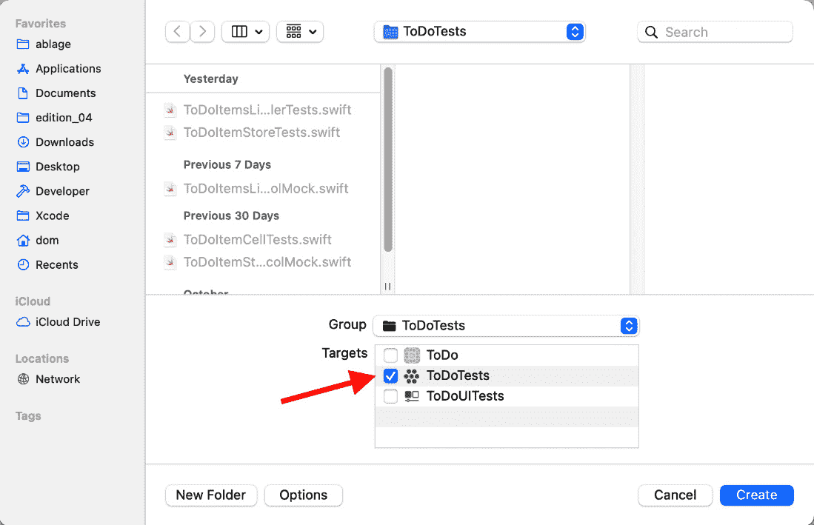
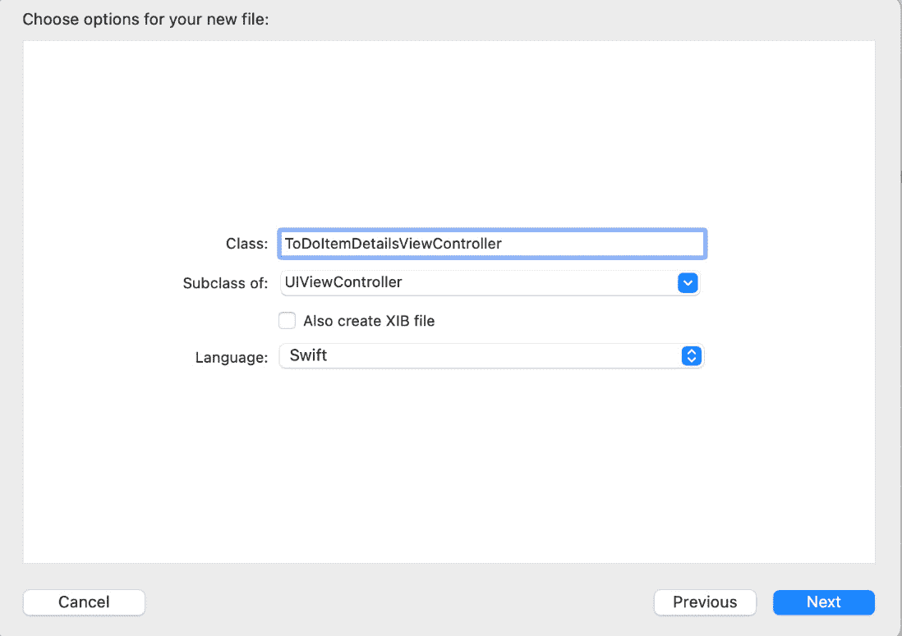
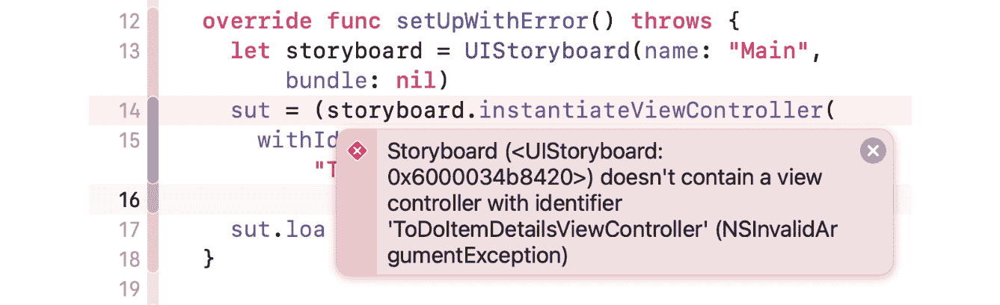
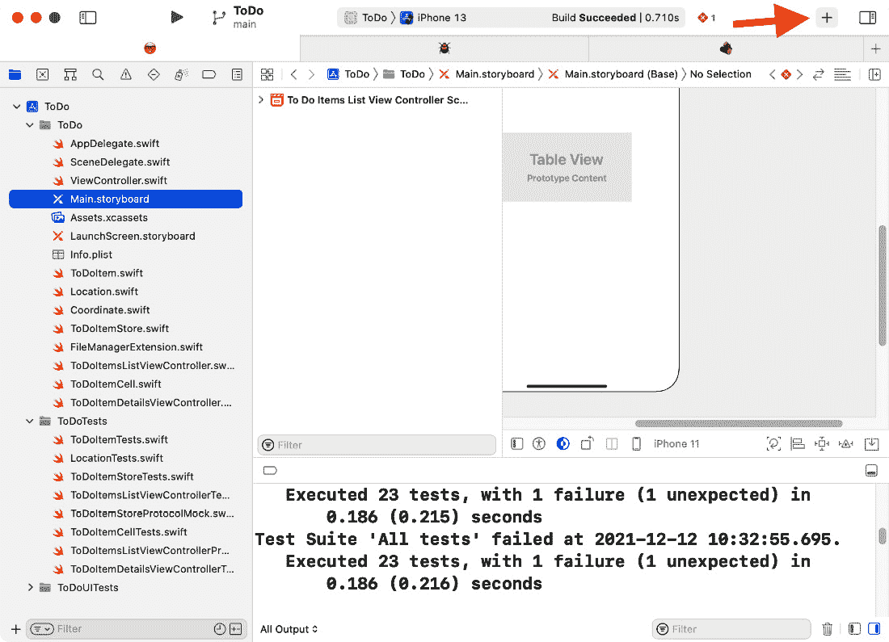
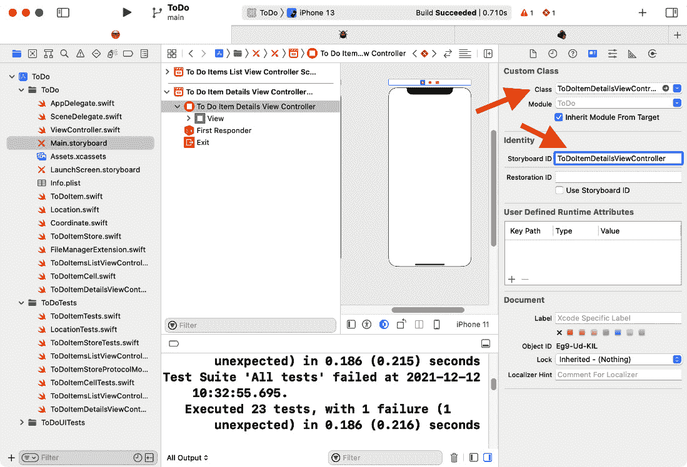
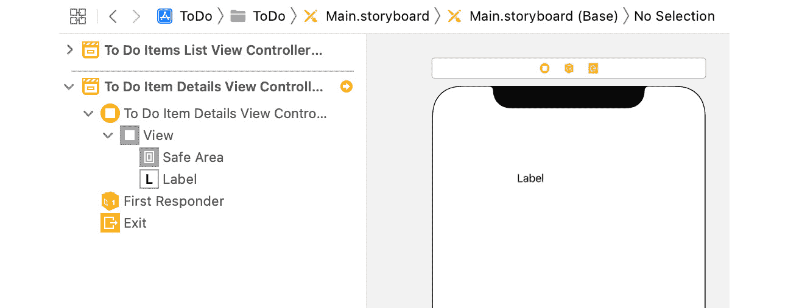
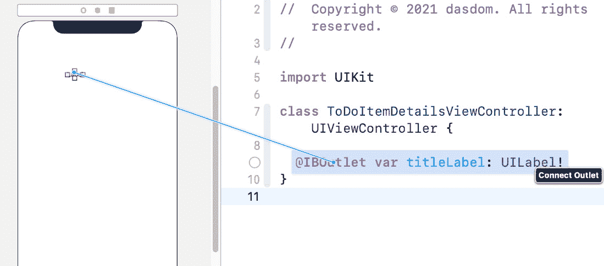
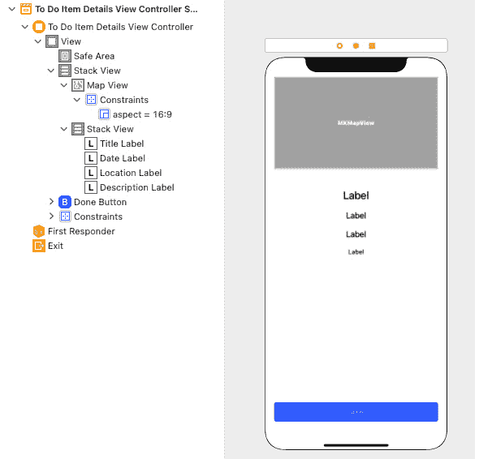
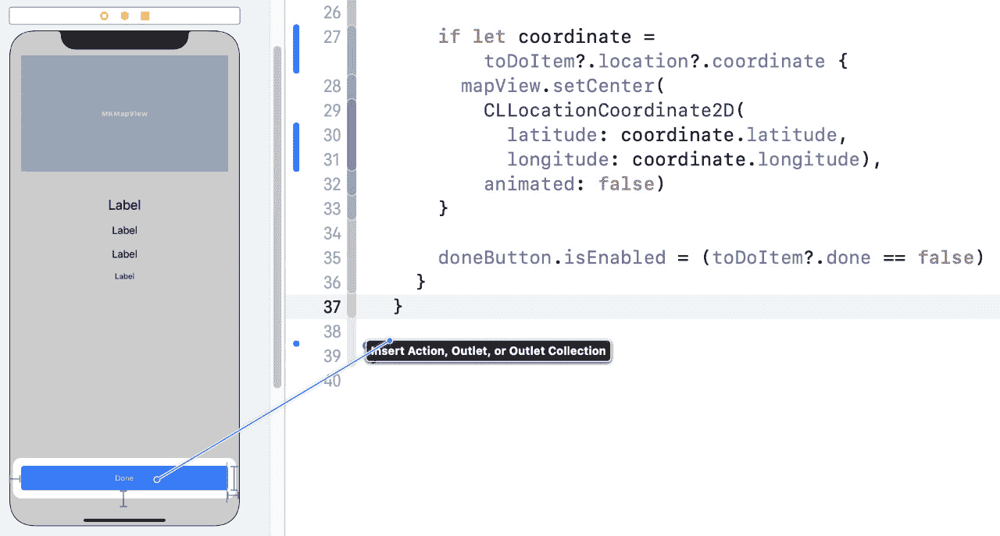
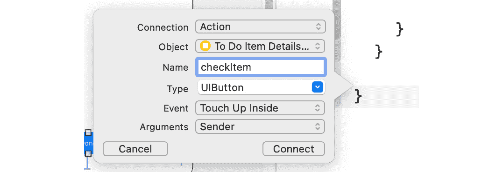

# *第八章*: 构建简单的详情视图

在 iOS 开发中，表格视图或集合视图通常只提供所展示项目的简要总结。为了了解所展示项目的所有详细信息，用户必须选择一个项目，以便它们可以重定向到详情视图。在详情视图中，用户通常可以与所展示的项目进行交互。

例如，在邮件应用中，摘要只显示发件人、主题和邮件的前几行。为了阅读完整的邮件并回复它，用户必须在详情视图中打开它。

在本章中，我们将构建待办事项的详情视图。本章结构如下：

+   添加标签、按钮和地图

+   填充数据

+   检查待办事项

我们首先将用户界面元素添加到视图中。

# 技术要求

本章的源代码在此处可用：

[`github.com/PacktPublishing/Test-Driven-iOS-Development-with-Swift-Fourth-Edition/tree/main/chapter08`](https://github.com/PacktPublishing/Test-Driven-iOS-Development-with-Swift-Fourth-Edition/tree/main/chapter08)

# 添加标签、按钮和地图

我们已经做了很多次，你可能已经猜到我们首先需要做什么。没错，我们需要一个测试用例类来对我们的测试进行测试。选择`ToDoItemDetailsViewControllerTests`。确保它已添加到单元测试目标：



图 8.1 – 测试用例需要添加到单元测试目标

在创建的测试用例类中移除两个模板测试，并在现有的导入语句下方添加`@testable import ToDo`：

```swift
// ToDoItemDetailsViewControllerTests.swift
import XCTest
@testable import ToDo 
class ToDoItemDetailsViewControllerTests: XCTestCase { 
  override func setUpWithError() throws {
  } 
  override func tearDownWithError() throws {
  }
}
```

详情视图需要一些标签来显示待办事项的信息。让我们从标题的标签开始。按照以下步骤操作：

1.  为待测试的系统添加以下属性：

    ```swift
    // ToDoItemDetailsViewControllerTests.swift
    var sut: ToDoItemDetailsViewController!
    ```

Xcode 抱怨它**在作用域中找不到类型'ToDoItemDetailsViewController'**。

1.  选择`ToDoItemDetailsViewController`。将其设置为**UIViewController**的子类：



图 8.2 – 视图控制器类的选项

1.  移除创建的类中的模板代码。返回`ToDoItemDetailsViewControllerTests`。Xcode 应在几秒钟后移除错误。如果它没有移除，请选择**产品** | **构建**菜单项来编译项目。

1.  现在我们有两个选择。一是，我们可以像上一章中为表格视图单元格所做的那样，在代码中构建用户界面。二是，我们可以使用故事板来构建用户界面。为了在本书中提供一个更全面的视角，我们将在本章中使用故事板来构建用户界面。

将`setUpWithError()`和`tearDownWithError()`方法替换为以下实现：

```swift
// ToDoItemDetailsViewControllerTests.swift
override func setUpWithError() throws {
  let storyboard = UIStoryboard(name: "Main", bundle:
    nil)
  sut = (storyboard.instantiateViewController(
    withIdentifier: "ToDoItemDetailsViewController")
    as! ToDoItemDetailsViewController)
  sut.loadViewIfNeeded()
}
override func tearDownWithError() throws {
  sut = nil
}
```

`(storyboard.instantiateViewController(withIdentifier: "ToDoItemDetailsViewController") as! ToDoItemDetailsViewController)` 两边的括号是必要的，以消除 Xcode 生成的警告。尝试并看看当你省略它们时 Xcode 会告诉你什么。

1.  在设置和清理方法就绪后，我们可以编写该测试用例类的第一个测试：

    ```swift
    // ToDoItemDetailsViewControllerTests.swift
    func test_view_shouldHaveTitleLabel() throws {
      let subview = try XCTUnwrap(sut.titleLabel)
    }
    ```

这个测试尚未完成，但我们必须在这里暂停，因为 `titleLabel` 属性缺失。

1.  将属性添加到 `ToDoItemDetailsViewController`：

    ```swift
    // ToDoItemDetailsViewController.swift
    class ToDoItemDetailsViewController: UIViewController { 
      @IBOutlet var titleLabel: UILabel!
    }
    ```

1.  现在我们可以完成测试方法：

    ```swift
    // ToDoItemDetailsViewControllerTests.swift
    func test_view_shouldHaveTitleLabel() throws {
      let subview = try XCTUnwrap(sut.titleLabel)
      XCTAssertTrue(subview.isDescendant(of: sut.view))
    }
    ```

1.  运行所有测试以确认新的测试失败。这个测试在 `setUpWithError()` 中失败。点击失败消息中的红色菱形以查看问题：



图 8.3 – 故事板中没有标识为 'ToDoItemDetailsViewController' 的视图控制器

观察图 8.3 中显示的问题，我们需要在故事板中为该视图控制器添加一个新的场景。

1.  在 Xcode 的 Interface Builder 中打开 `Main.storyboard` 文件，并点击工具栏中的加号 (**+**) 按钮：



图 8.4 – 打开库

1.  搜索 `view controller` 并将一个 **View Controller** 对象拖放到故事板中。通过选择 **View** | **Inspectors** | **Identity** 菜单项打开 **Identity** 检查器。将 **Class** 和 **Storyboard ID** 更改为 **ToDoItemDetailsViewController**：



图 8.5 – 更改场景的类和故事板 ID

再次运行测试。新的测试仍然失败，因为 `titleLabel` 属性是 `nil`。

1.  我们需要在故事板场景中添加一个标签，并将其与 `IBOutlet` 连接。通过选择 `ToDoItemDetailsViewController` 打开库：



图 8.6 – 在待办事项详情视图控制器场景中添加的标签

1.  在 **Assistant** 编辑器中打开 `ToDoItemsDetailsViewController`。如果它打开了另一个文件，请关闭 Xcode 并重新启动。

按住 *Ctrl* 键，从故事板中的标签拖动一个连接到代码中的 `IBOutlet` 属性：



图 8.7 – 将场景中的标签与 IBOutlet 属性连接

再次运行测试。所有测试都通过。

由于我们几乎没有编写任何代码，没有东西可以重构。

以同样的方式，你可以添加日期、位置和待办事项描述的标签。这里我们不会展示，因为它与添加标题标签的工作方式完全相同。使用不同的属性名再次按照步骤进行。为了帮助你开始，这里是为这三个新标签提供的三个测试：

```swift
// ToDoItemDetailsViewControllerTests.swift
func test_view_shouldHaveDateLabel() throws {
  let subview = try XCTUnwrap(sut.dateLabel)
  XCTAssertTrue(subview.isDescendant(of: sut.view))
}
func test_view_shouldHaveLocationLabel() throws {
  let subview = try XCTUnwrap(sut.locationLabel)
  XCTAssertTrue(subview.isDescendant(of: sut.view))
}
func test_view_shouldHaveDescriptionLabel() throws {
  let subview = try XCTUnwrap(sut.descriptionLabel)
  XCTAssertTrue(subview.isDescendant(of: sut.view))
}
```

逐个添加这些测试并使它们通过。但请确保任何时候只有一个失败的测试。

接下来，我们需要一个地图视图来显示待办事项的位置，如果设置了位置。按照以下步骤将其添加到视图中：

1.  将以下测试添加到`ToDoItemDetailsViewControllerTests`中：

    ```swift
    // ToDoItemDetailsViewControllerTests.swift
    func test_view_shouldHaveMapView() throws {
      let subview = try XCTUnwrap(sut.mapView)
      XCTAssertTrue(subview.isDescendant(of: sut.view))
    }
    ```

运行测试以确认这个新测试失败。

1.  将`MapKit`导入添加到`ToDoItemDetailsViewController`中，并为`mapView`视图添加一个出口：

    ```swift
    // ToDoItemDetailsViewController.swift
    import UIKit
    import MapKit

    class ToDoItemDetailsViewController: UIViewController {
      @IBOutlet var titleLabel: UILabel!
      @IBOutlet var dateLabel: UILabel!
      @IBOutlet var locationLabel: UILabel!
      @IBOutlet var descriptionLabel: UILabel!
      @IBOutlet var mapView: MKMapView!
    }
    ```

再次运行测试。这次仍然失败，但这次是因为`mapView`属性是`nil`。

1.  打开`Main.storyboard`并将地图视图的`IBOutlet`属性拖动出来。

运行测试以确认所有测试现在都通过。

我们最后要添加到视图中的 UI 元素是标记项目为**完成**的按钮。这与之前添加标签的方式相同。所以，这又是一个留给你的练习。以下是一个帮助你开始的测试：

```swift
// ToDoItemDetailsViewControllerTests.swift
func test_view_shouldHaveDoneButton() throws {
  let subview = try XCTUnwrap(sut.doneButton)
  XCTAssertTrue(subview.isDescendant(of: sut.view))
}
```

通过向视图控制器添加一个`UIButton`实例来使这个测试通过。

在我们继续之前，你应该花些时间使这个用户界面更好。移动元素并添加布局约束，使用户界面更吸引人。当你完成时，你的结果可能看起来类似于以下图示：



图 8.8 – 详情视图的用户界面

现在我们有了详情视图的用户界面，当详情被推送到屏幕上时，我们可以展示待办事项的数据。这就是我们在下一节将要实现的内容。

# 填充数据

按照以下步骤更新用户界面，使用待办事项的数据：

1.  我们从一个新的测试开始。将以下测试方法添加到`ToDoItemDetailsViewControllerTests`中：

    ```swift
    // TodoItemDetailsViewControllerTests.swift
    func test_settingToDoItem_shouldUpdateTitleLabel() {
      let title = "dummy title"
      let toDoItem = ToDoItem(title: title)
      sut.toDoItem = toDoItem
    }
    ```

在这一点上，我们从 Xcode 得到一个错误，**类型为'TodoItemDetailsViewController'的值没有成员'toDoItem'**。

1.  前往`ToDoItemDetailsViewController`并添加`toDoItem`属性：

    ```swift
    // ToDoItemDetailsViewController.swift
    class ToDoItemDetailsViewController: UIViewController {
      @IBOutlet var titleLabel: UILabel!
      @IBOutlet var dateLabel: UILabel!
      @IBOutlet var locationLabel: UILabel!
      @IBOutlet var descriptionLabel: UILabel!
      @IBOutlet var mapView: MKMapView!
      @IBOutlet var doneButton: UIButton!
      var toDoItem: ToDoItem?
    }
    ```

1.  现在我们可以通过添加`Assert`调用来完成测试的编写：

    ```swift
    // ToDoItemDetailsViewControllerTests.swift
    func test_settingToDoItem_shouldUpdateTitleLabel() {
      let title = "dummy title"
      let toDoItem = ToDoItem(title: title) 
      sut.toDoItem = toDoItem  
      XCTAssertEqual(sut.titleLabel.text, title)
    }
    ```

运行测试以确认这个新测试失败。

1.  返回实现代码并将属性声明替换为以下内容：

    ```swift
    // ToDoItemDetailsViewController.swift
    var toDoItem: ToDoItem? {
      didSet {
        titleLabel.text = toDoItem?.title
      }
    }
    ```

再次运行测试以确认所有测试现在都通过。

测试和其他标签的实现方式类似，留给你们作为练习。为了帮助你开始，这里有一些测试：

```swift
// ToDoItemDetailsViewControllerTests.swift
func test_settingToDoItem_shouldUpdateDateLabel() {
  let date = Date()
  let toDoItem = ToDoItem(
    title: "dummy title",
    timestamp: date.timeIntervalSince1970)

  sut.toDoItem = toDoItem

  XCTAssertEqual(sut.dateLabel.text,
                 sut.dateFormatter.string(from: date))
}
func test_settingToDoItem_shouldUpdateDescriptionLabel() {
  let description = "dummy discription"
  let toDoItem = ToDoItem(
    title: "dummy title",
    itemDescription: description)

  sut.toDoItem = toDoItem

  XCTAssertEqual(sut.descriptionLabel.text, description)
}
func test_settingToDoItem_shouldUpdateLocationLabel() {
  let location = "dummy location"
  let toDoItem = ToDoItem(
    title: "dummy title",
    location: Location(name: location))

  sut.toDoItem = toDoItem

  XCTAssertEqual(sut.locationLabel.text, location)
}
```

逐个使这些测试通过。确保你永远不会同时有一个失败的测试。

当待办事项包含一个坐标的位置时，地图视图应该显示待办事项的位置地图。按照以下步骤添加此功能：

1.  将以下测试添加到`ToDoItemDetailsViewControllerTests`中：

    ```swift
    // ToDoItemDetailsViewControllerTests.swift
    func test_settingToDoItem_shouldUpdateMapView() {
      let latitude = 51.225556
      let longitude = 6.782778
      let toDoItem = ToDoItem(
        title: "dummy title",
        location: Location(
          name: "dummy location",
          coordinate: Coordinate(latitude: latitude,
            longitude: longitude)))

      sut.toDoItem = toDoItem

      let center = sut.mapView.centerCoordinate
      XCTAssertEqual(center.latitude,
        latitude,
        accuracy: 0.000_01)
      XCTAssertEqual(center.longitude,
        longitude,
        accuracy: 0.000_01)
    }
    ```

通过这个测试，我们测试地图视图的中心坐标是否设置为待办事项位置坐标。

运行所有测试以确认这个新测试失败。

1.  要使此测试通过，请将以下代码添加到`ToDoItemDetailsViewController`中`toDoItem`属性的`didSet`处理程序：

    ```swift
    // ToDoItemDetailsViewController.swift
    if let coordinate = toDoItem?.location?.coordinate {
      mapView.setCenter(
        CLLocationCoordinate2D(
          latitude: coordinate.latitude,
          longitude: coordinate.longitude),
        animated: false)
    }
    ```

再次运行测试以确认所有测试现在都通过。

当展示的任务项已经完成时，**完成**按钮应该被禁用。按照以下步骤实现此功能：

1.  将以下测试添加到`ToDoItemDetailsViewControllerTests`：

    ```swift
    // ToDoItemDetailsViewControllerTests.swift
    func test_settingToDoItem_shouldUpdateButtonState() {
      var toDoItem = ToDoItem(title: "dummy title")
      toDoItem.done = true

      sut.toDoItem = toDoItem

      XCTAssertFalse(sut.doneButton.isEnabled)
    }
    ```

运行测试以确认这个新测试失败。

1.  要使这个新测试通过，请将以下代码添加到`toDoItem`属性的`didSet`处理程序：

    ```swift
    // ToDoItemDetailsViewController.swift
    doneButton.isEnabled = false
    ```

此代码使测试通过。通过运行所有测试来尝试它。但这一行代码显然是错误的，因为它禁用了所有待办事项的**完成**按钮，甚至对于那些尚未完成的待办事项也是如此。为了修复这个错误，我们需要另一个测试。

1.  将以下测试添加到`ToDoItemDetailsViewControllerTests`：

    ```swift
    // ToDoItemDetailsViewControllerTests.swift
    func test_settingToDoItem_whenItemNotDone_
     shouldUpdateButtonState() {
      let toDoItem = ToDoItem(title: "dummy title")

      sut.toDoItem = toDoItem

      XCTAssertTrue(sut.doneButton.isEnabled)
    }
    ```

运行测试。这个新测试失败了。

1.  要使其通过，将`doneButton.isEnabled = false`行替换为以下代码：

    ```swift
    // ToDoItemDetailsViewController.swift
    doneButton.isEnabled = (toDoItem?.done == false)
    ```

再次运行所有测试以确认此代码修复了错误。

太好了！我们已经完成了使用任务项的信息更新用户界面。在下一节中，我们将实现**完成**按钮的功能。

# 检查任务项

当用户点击**完成**按钮时，我们的应用程序必须告诉待办事项存储库将项目状态更改为**完成**。按照以下步骤实现此功能：

1.  将以下测试方法添加到`ToDoItemDetailsViewControllerTests`：

    ```swift
    // ToDoItemDetailsViewControllerTest.swift
    func test_sendingButtonAction_shouldCheckItem() {
      let toDoItem = ToDoItem(title: "dummy title")
      sut.toDoItem = toDoItem
      let storeMock = ToDoItemStoreProtocolMock()
      sut.toDoItemStore = storeMock
    }
    ```

`ToDoItemDetailsViewController`没有`toDoItemStore`属性。这意味着我们必须暂停编写此测试，并首先添加此属性。

1.  前往`ToDoItemDetailsViewController`并添加`toDoItemStore`属性：

    ```swift
    // ToDoItemDetailsViewController.swift
    var toDoItemStore: ToDoItemStoreProtocol?
    ```

1.  现在我们可以完成测试：

    ```swift
    // ToDoItemDetailsViewControllerTests.swift
    func test_sendingButtonAction_shouldCheckItem() {
      let toDoItem = ToDoItem(title: "dummy title")
      sut.toDoItem = toDoItem
      let storeMock = ToDoItemStoreProtocolMock()
      sut.toDoItemStore = storeMock

      sut.doneButton.sendActions(for: .touchUpInside)

      XCTAssertEqual(storeMock.checkLastCallArgument,
        toDoItem)
    }
    ```

通过`sut.doneButton.sendActions(for: .touchUpInside)`调用，我们向`toDoItemStore`的目标发送了`.touchUpInside`动作，该动作与系统正在测试的`toDoItem`变量一起调用。

1.  要将动作添加到`Main.storyboard`文件和`ToDoItemDetailsViewController.swift`文件旁边。按住*Ctrl*键，从**完成**按钮拖动连接到代码：



Figure 8.9 – 从完成按钮拖动连接到代码

1.  将**名称**字段中的`checkItem`更改为，并将**类型**更改为**UIButton**。然后点击**连接**：



Figure 8.10 – 按钮动作选项

1.  接下来，将动作代码更改为以下内容：

    ```swift
    // ToDoItemDetailsViewController.swift
    @IBAction func checkItem(_ sender: UIButton) {
      if let toDoItem = toDoItem {
        toDoItemStore?.check(toDoItem)
      }
    }
    ```

运行所有测试以确认这使所有测试再次通过。

当项目被标记为**完成**时，**完成**按钮应该被禁用以向用户显示此任务已完成。你将在本章的练习中实现此功能。

# 摘要

在本章中，我们遵循测试驱动开发（TDD）的原则构建了一个简单的详情视图控制器。我们学习了如何测试使用 Storyboard 设置的视图控制器。最后，我们弄清楚了测试按钮动作需要做什么。

本章中获得的技能将帮助你在编写各种用户界面的测试时有所帮助，即使是那些更复杂的界面。你现在能够测试用户界面元素的存在及其与代码其他部分的交互。

在下一章中，我们将为使用 SwiftUI 创建的视图编写测试。为此任务，我们需要将 GitHub 上的第三方库添加到我们的测试目标中。

# 练习

1.  当用户选择**完成**按钮以显示任务已完成时，**完成**按钮应被禁用，以向用户显示此操作已成功执行。实现此功能。

1.  修改代码，以便在待办事项中没有设置坐标时隐藏地图视图。
