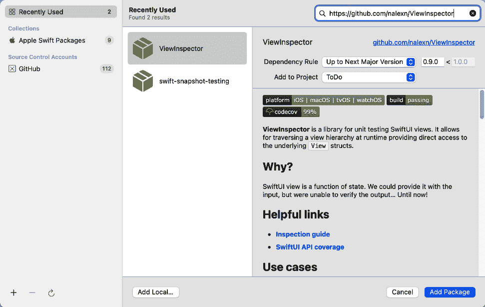
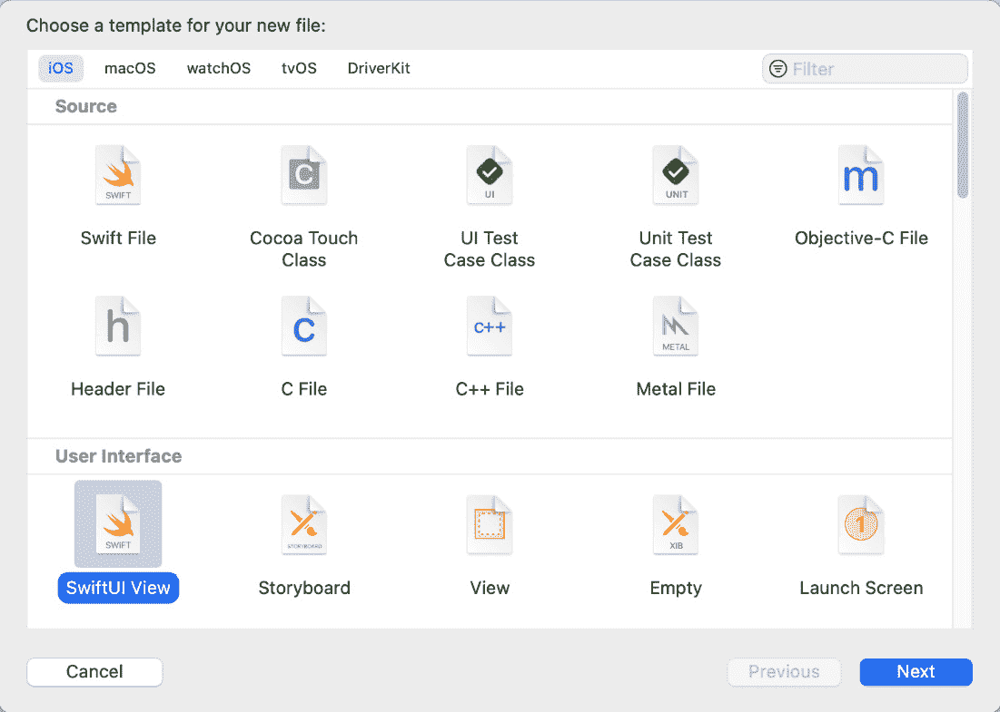
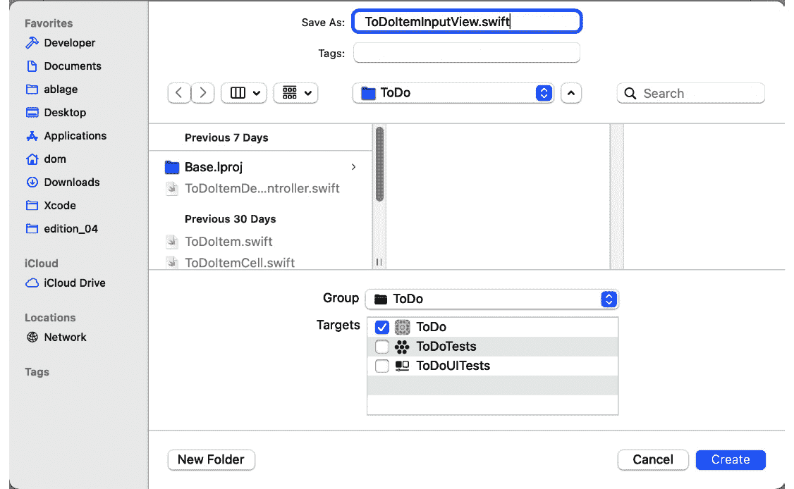
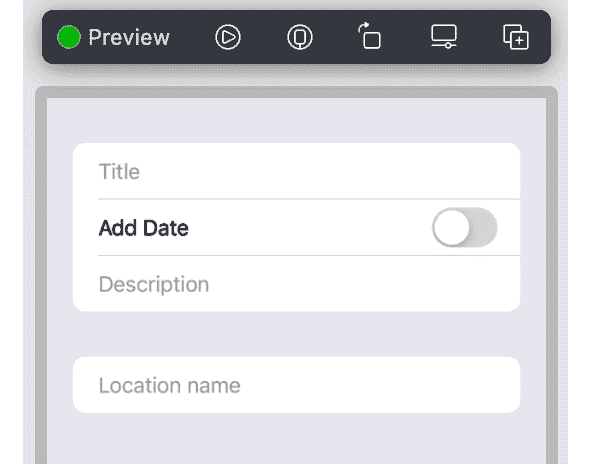

# *第九章*: SwiftUI 中的测试驱动输入视图

2019 年，苹果公司推出了**SwiftUI**作为在苹果平台上构建应用用户界面的新方法。与使用 UIKit 构建的用户界面相比，SwiftUI 视图是某种状态的功能。因此，测试此类视图可以非常简单。在测试中，我们必须设置状态并断言预期的用户界面元素是否存在。

不幸的是，负责苹果公司的工程师们认为测试用户界面没有价值。他们认为，为了证明用户界面看起来和预期一样，运行应用并检查眼睛就足够了。这可能适用于我们在这本书中构建的如此简单的应用。但是，如果你看看 App Store，你会发现大多数应用（如果不是所有应用）都要复杂得多。通常，应用由许多视图组成，其中一些只在某些罕见情况下可见。确保这些视图对所有输入值和环境参数都有效是一项大量工作。

此外，还要考虑重构。应用永远不会完成。我们总是需要改变和添加功能。工程师们如何确保所有以前的功能仍然有效？

由计算机执行的自动测试比人工测试快几个数量级。在我看来，不使用自动测试的工程师，即使是对于用户界面，也是在浪费时间和金钱。

那么，当我们想使用 SwiftUI 构建用户界面并仍然依赖测试驱动开发的优势时，我们该怎么办呢？幸运的是，GitHub 上有一个名为**ViewInspector**的第三方库，可以填补这一空白。在本章中，我们将把这个库添加到我们的项目中，并探讨我们如何为 SwiftUI 代码编写单元测试。

本章分为以下几部分：

+   添加 ViewInspector 包

+   使用 ViewInspector 测试简单视图

+   使用 ViewInspector 测试按钮动作

让我们先从将 ViewInspector 添加到我们的测试目标开始。

# 技术要求

本章的源代码在此处可用：[`github.com/PacktPublishing/Test-Driven-iOS-Development-with-Swift-Fourth-Edition/tree/main/chapter09`](https://github.com/PacktPublishing/Test-Driven-iOS-Development-with-Swift-Fourth-Edition/tree/main/chapter09)。

# 添加 ViewInspector 包

ViewInspector 是一个开源库，你可以在 GitHub 上找到它：[`github.com/nalexn/ViewInspector`](https://github.com/nalexn/ViewInspector)。要将它添加到我们的项目中，请按照以下步骤操作：

1.  在 Xcode 中选择**文件** | **添加包**菜单项。

1.  在搜索字段中输入包的 URL，`https://github.com/nalexn/ViewInspector`：



图 9.1 – 添加 ViewInspector 包

点击**添加包**。

1.  Xcode 打开一个新窗口，我们可以设置要添加包的目标。选择**ToDoTests**目标。然后再次点击**添加包**。

现在包已添加到 **ToDoTests** 目标中，我们可以在单元测试中使用它。

# 使用 ViewInspector 测试一个简单的视图

我们将要构建的视图将用于向项目列表添加新的待办事项。这意味着它需要所有待办事项可以包含的信息的输入字段。因此，让我们在下一小节中查看这个方面。

## 添加标题文本字段

和往常一样，我们从测试开始。按照以下步骤向输入视图添加一个用于待办事项标题的文本字段：

1.  选择 `ToDoItemInputViewTests`。删除两个模板测试方法。

1.  导入 `ViewInspector` 库和主要目标（`ToDo`），以便它是可测试的（`@testable`）：

    ```swift
    // ToDoItemInputViewTests.swift
    import XCTest
    @testable import ToDo
    import ViewInspector
    ```

1.  在我们可以为 SwiftUI 视图编写测试之前，我们首先需要使用来自 `ViewInspector` 库的 `Inspectable` 协议扩展它。在测试用例类上方添加以下行：

    ```swift
    // ToDoItemInputViewTests.swift
    extension ToDoItemInputView: Inspectable {}
    ```

在这一点上，Xcode 抱怨它 **在作用域中找不到类型 'ToDoItemInputView'**。这是预期的，因为我们还没有添加这个类型。

1.  在项目导航器中选择 **ToDo** 组并添加一个 SwiftUI 文件：



图 9.2 – 选择 SwiftUI 模板

1.  将 `ToDoItemInputView.swift` 放入 **另存为** 字段：



图 9.3 – 新文件的名称是 ToDoItemInputView.swift

现在，测试代码中的错误已经消失，我们可以继续进行测试。

1.  为待测系统和包含新待办事项信息的数据对象添加一个属性：

    ```swift
    // ToDoItemInputViewTests.swift
    var sut: ToDoItemInputView!
    var toDoItemData: ToDoItemData!
    ```

我们将用用户输入到视图中的数据填充 `toDoitemData`，当他们完成时，我们将从该数据创建一个 `ToDoItem` 实例。

再次，Xcode 告诉我们某些东西缺失。

1.  选择 `ToDoItemData` 作为名称。

1.  用以下代码替换此文件的内容：

    ```swift
    // ToDoItemData.swift
    import Foundation 

    class ToDoItemData: ObservableObject {
    }
    ```

这个新类型需要是 `ObservableObject` 类型，因为我们想将其用作我们 SwiftUI 视图的状态。

1.  返回到 `ToDoItemInputViewTests` 类，将 `setUpWithError()` 和 `tearDownWithError()` 替换为以下代码：

    ```swift
    // ToDoItemInputViewTests .swift
    override func setUpWithError() throws {
      toDoItemData = ToDoItemData()
      sut = ToDoItemInputView(data: toDoItemData)
    }

    override func tearDownWithError() throws {
      sut = nil
      toDoItemData = nil
    }
    ```

1.  前面的代码无法编译，因为 `ToDoItemInputView` 的初始化器不接受任何参数。为了修复编译错误，向 `ToDoItemInputView` 添加以下属性：

    ```swift
    // ToDoItemInputView.swift
    @ObservedObject var data: ToDoItemData
    ```

1.  现在，Xcode 在 `ToDoItemInputView_Previews` 结构中显示了一个错误，因为 `ToDoItemInputView` 的初始化器中缺少新属性。用以下代码替换 `ToDoItemInputView_Previews` 结构的内容以修复此错误：

    ```swift
    // ToDoItemInputView.swift
    static var previews: some View {
      ToDoItemInputView(data: ToDoItemData())
    }
    ```

1.  现在，让我们回到测试用例类。将以下测试方法的片段添加到 `ToDoItemInputViewTests` 中：

    ```swift
    // ToDoItemInputViewTests.swift
    func test_titleInput_shouldSetValueInData() throws {
      let expected = "dummy title"
      try sut
        .inspect()
        .find(ViewType.TextField.self)
        .setInput(expected)

      let input = toDoItemData.title
    }
    ```

`toDoItemData` 类型没有 `title` 属性。我们将在下一步修复它。但首先，让我们尝试理解这里发生了什么。

首先，我们在待测试的系统（`sut`）上调用 `inspect()`。这是因为我们扩展了 `ToDoItemInputView` 的调用以符合 `Inspectable` 协议。在返回的类型上，我们可以调用 `find` 方法，该方法返回给定类型的第一个实例，在这种情况下，是 `TextField` 类型。在 `find` 调用返回的值上，我们调用 `setInput(_:)` 来模拟用户对该文本框的输入。

1.  向 `ToDoItemData` 添加以下 `title` 属性：

    ```swift
    // ToDoItemData.swift
    @Published var title = ""
    ```

1.  使用以下 `Assert` 函数调用完成测试：

    ```swift
    // ToDoItemInputViewTests.swift
    func test_shouldAllowTitleInput() throws {
      let expected = "dummy title"
      try sut
        .inspect()
        .find(ViewType.TextField.self)
        .setInput(expected)

      let input = toDoItemData.title

      XCTAssertEqual(input, expected)
    }
    ```

运行测试以确认这个新测试失败。测试在尝试找到 `TextField` 元素的行中失败。

1.  将 `ToDoItemInputView` 中的 `body` 属性的内容替换为以下代码：

    ```swift
    // ToDoItemInputView.swift
    TextField("Title", text: $data.title)
    ```

再次运行测试。现在所有测试都通过了，但我们还没有看到断言失败。之前的测试失败是因为它无法在视图的主体中找到 `TextField` 元素。这是问题吗？可能是的。如果我们不小心，我们可能会编写一个总是通过的断言。因此，改变代码以使断言失败但其余测试通过是一个好主意。

1.  将 `ToDoItemInputView` 结构替换为以下代码：

    ```swift
    // ToDoItemInputView.swift
    struct ToDoItemInputView: View { 
      @ObservedObject var data: ToDoItemData
      @State var dummy: String = ""

      var body: some View {
        TextField("Title", text: $dummy)
      }
    }
    ```

在这里，我们添加了一个虚拟变量来作为 `TextField` 文本的绑定。运行测试以确认最后添加的测试现在在断言处失败。因为我们已经检查了断言可以失败，所以我们可以更改代码，使测试再次通过。

这很简单。在 `ViewInspector` 的帮助下，我们能够为待办事项标题的输入文本字段编写测试。

在下一节中，我们将添加一个 `DatePicker` 结构，以允许用户为待办事项添加截止日期。

## 添加日期选择器

标题是待办事项的唯一必需数据。日期是可选的。在输入视图的用户界面中，我们希望使用 `DatePicker` 结构来输入日期值。当用户想要为该待办事项添加日期时，我们将使用切换按钮来显示 `DatePicker` 结构。

这意味着我们首先需要一个测试来断言视图最初不显示日期选择器。向 `ToDoItemInputView` 添加以下测试方法：

```swift
// ToDoItemInputViewTests.swift
func test_whenWithoutDate_shouldNotShowDateInput() {
  XCTAssertThrowsError(try sut
    .inspect()
    .find(ViewType.DatePicker.self))
}
```

使用此代码，我们断言 `XCTAssertThrowsError` 函数的参数中的代码抛出错误。这意味着我们测试视图中没有 `DatePicker`。如果 `find` 方法找到一个 `DatePicker`，则测试失败。

我们不需要做任何事情来使这个测试通过。它已经通过了。我们可以添加一个 `DatePicker` 来看看它是否会失败。实际上，我们将在下一步做这件事。

用于显示和隐藏日期选择器的切换元素将绑定到一个`@State`属性，该属性在`ToDoItemInputView`中定义了`withDate`属性。因此，切换元素的状态将反映在`withDate`属性的值中。从单元测试中与`@State`属性交互需要更改一些视图代码。我们将从以下更改开始实现日期输入：

1.  用以下代码替换`ToDoItemInputView`结构：

    ```swift
    // ToDoItemInputView.swift
    struct ToDoItemInputView: View { 
      @ObservedObject var data: ToDoItemData
      var didAppear: ((Self) -> Void)?

      var body: some View {
        VStack {
          TextField("Title", text: $data.title)
        }
        .onAppear { self.didAppear?(self) }
      }
    }
    ```

我们在这里添加了一个名为`didAppear`的闭包，它在`VStack`结构的`onAppear`修改器中被调用。我们需要一个`VStack`结构或类似的东西，因为在这些步骤的后面，我们将向视图的主体添加更多元素。

1.  通过这次准备，我们可以添加测试的第一个片段：

    ```swift
    // ToDoItemInputViewTests.swift
    func test_whenWithDate_shouldAllowDateInput() throws {
      let exp = sut.on(\.didAppear) { view in
        try view.find(ViewType.Toggle.self).tap()
        let expected = Date(timeIntervalSinceNow:
          1_000_000)
        try view
          .find(ViewType.DatePicker.self)
          .select(date: expected)

        let input = self.toDoItemData.date
      }

      ViewHosting.host(view: sut)
      wait(for: [exp], timeout: 0.1)
    }
    ```

我们以一个期望值开始测试方法。在这里，这是必要的，以便在测试中使`@State`属性的可更新性变得可行。原因在于 SwiftUI 中视图更新的实现细节。

与被测试系统进行的所有通信都必须放入我们使用`sut.on(\.didAppear) {}`定义的期望值的闭包中。

在关闭状态下，我们首先切换开关以使日期选择器出现。接下来，我们搜索`DatePicker`并尝试设置其日期。然后我们访问`toDoItemDate`属性的日期。测试尚未完成，但我们必须在这里暂停，因为`Date`属性缺失。

在闭包下方，我们要求`ViewInspector`库托管被测试系统。这触发了`onAppear`闭包，使得与`@State`属性一起工作成为可能。最后，我们必须等待期望得到满足。我们不必自己调用`fulfill()`在期望上。这是由`ViewInspector`库管理的。

1.  前往`ToDoItemData`并添加`Date`属性：

    ```swift
    // ToDoItemData.swift
    @Published var date = Date()
    ```

1.  现在，我们可以通过添加`Assert`函数调用来完成测试：

    ```swift
    // ToDoItemInputView.swift
    func test_whenWithDate_shouldAllowDateInput() throws {
      let exp = sut.on(\.didAppear) { view in
        try view.find(ViewType.Toggle.self).tap()

        let expected = Date(timeIntervalSinceNow:
          1_000_000)
        try view
          .find(ViewType.DatePicker.self)
          .select(date: expected)

        let input = self.toDoItemData.date
        XCTAssertEqual(input, expected)
      }

      ViewHosting.host(view: sut)
      wait(for: [exp], timeout: 0.1)
    }
    ```

运行所有测试以确认这个新测试失败。它失败了，因为它找不到开关。让我们在下一步添加开关。

1.  为我们即将添加的切换状态添加以下属性：

    ```swift
    // ToDoItemInputView.swift
    @State var withDate = false
    ```

1.  接下来，用以下代码替换计算属性`body`的内容：

    ```swift
    // ToDoItemInputView.swift
    VStack {
      TextField("Title", text: $data.title)
      Toggle("Add Date", isOn: $withDate)
    }
    .onAppear { self.didAppear?(self) }
    ```

现在测试失败了，因为它找不到日期选择器。

1.  按如下方式添加日期选择器：

    ```swift
    // ToDoItemInputView.swift
    VStack {
      TextField("Title", text: $data.title)
      Toggle("Add Date", isOn: $withDate)
      DatePicker("Date", selection: $data.date)
    }
    .onAppear { self.didAppear?(self) }
    ```

现在，`test_whenWithDate_shouldAllowDateInput`通过了，但`test_whenWithoutDate_shouldNotShowDateInput`失败了。这是好事，因为我们之前从未看到这个测试失败。

1.  为了使两个测试都通过，用以下代码替换计算属性`body`的代码：

    ```swift
    // ToDoItemInputView.swift
    var body: some View {
      VStack {
        TextField("Title", text: $data.title)
        Toggle("Add Date", isOn: $withDate)
        if withDate {
          DatePicker("Date", selection: $data.date)
        }
      }
      .onAppear { self.didAppear?(self) }
    }
    ```

运行所有测试以确认所有测试再次通过。

在使最后一个测试通过的过程中，我们了解了在涉及`@State`属性更改时我们必须做什么。这是因为当你开始为 SwiftUI 视图编写测试时，你需要知道这一点。

现在我们已经看到了如何测试`@State`属性的更改，让我们重构测试代码和实现，以便两者更容易理解。

## 改进测试代码和实现

对于我们的应用，如果我们把 `withDate` 属性移动到 `ToDoItemData` 中会更好，因为当我们尝试创建待办事项时需要这个信息。按照以下步骤将这个属性移动到 `ToDoItemData`：

1.  前往 `ToDoItemInputTests` 并将 `test_whenWithDate_shouldAllowDateInput()` 替换为以下实现：

    ```swift
    // ToDoItemInputTests.swift
    func test_whenWithDate_shouldAllowDateInput() throws {
      let expected = Date()
      try sut.inspect().find(ViewType.Toggle.self).tap()
      try sut
        .inspect()
        .find(ViewType.DatePicker.self)
        .select(date: expected)

      let input = toDoItemData.date

      XCTAssertEqual(input, expected)
    }
    ```

运行所有测试。现在这个测试失败了，因为我们不能以这种方式与 `@State` 属性交互。

1.  从 `ToDoItemInputView` 中删除 `@State var withDate = false` 这一行。

1.  前往 `ToDoItemData` 并添加以下属性：

    ```swift
    // ToDoItemData.swift
    @Published var withDate = false
    ```

1.  现在，在 `ToDoItemInputView` 中，将所有 `withDate` 的出现替换为 `data.withDate`：

    ```swift
    // ToDoItemInputView.swift
    var body: some View {
      VStack {
        TextField("Title", text: $data.title)
        Toggle("Add Date", isOn: $data.withDate)
        if data.withDate {
          DatePicker("Date", selection: $data.date)
        }
      }
    }
    ```

注意，我们已经从 `VStack` 的闭合大括号下方移除了 `.onAppear` 调用。由于它不再需要，你也可以从 `ToDoItemInputView` 中移除 `didAppear` 属性。

运行所有测试以确认所有测试现在又都通过了。

我们现在有一个用于待办事项标题和日期的输入视图。接下来，我们需要一个用于项目描述的文本字段。

## 添加另一个文本字段

按照以下步骤向输入视图添加另一个文本字段：

1.  前往 `ToDoItemInputViewTests` 并添加以下不完整的测试方法：

    ```swift
    // ToDoItemInputViewTests.swift
    func test_shouldAllowDescriptionInput() throws {
      let expected = "dummy description"
      try sut
        .inspect()
        .find(ViewType.TextField.self,
          where: { view in
          let label = try view
            .labelView()
            .text()
            .string()
          return label == "Description"
        })
        .setInput(expected)
      let input = toDoItemData.itemDescription
    }
    ```

这看起来与为我们编写的 `title` 属性的测试相似，但这次我们必须指定我们正在搜索哪个 `TextField`。我们添加了一个 `where` 闭包来找到带有 `Description` 标签文本的文本字段。在 `where` 闭包中，我们使用 `ViewInspector` 的检查功能来找到 `TextField` 的 `labelView` 的文本字符串。

1.  测试无法编译，因为 `ToDoItemData` 中缺少 `itemDescription` 属性。按照以下代码添加该属性：

    ```swift
    // ToDoItemData.swift
    class ToDoItemData: ObservableObject {
      @Published var title = ""
      @Published var date = Date()
      @Published var withDate = false
      @Published var itemDescription = ""
    }
    ```

1.  现在我们可以完成测试。向测试中添加以下断言：

    ```swift
    // ToDoItemInputViewTests.swift
    XCTAssertEqual(input, expected)
    ```

运行测试以确认这个新测试失败了。

1.  前往 `ToDoItemInputView` 并更改 `body` 属性，使其看起来如下：

    ```swift
    // ToDoItemInputView.swift
    var body: some View {
      VStack {
        TextField("Title", text: $data.title)
        Toggle("Add Date", isOn: $data.withDate)
        if data.withDate {
          DatePicker("Date", selection: $data.date)
        }
        TextField("Description",
          text: $data.itemDescription)
      }
    }
    ```

运行测试以确认所有测试都通过了。

在这里，我们可以再次修改代码以查看测试断言失败，就像我们对 `title` 属性的测试那样。由于代码和测试代码看起来很相似，我对没有这样做就进行测试很有信心。如果你希望看到断言失败，请自己思考。

为了使对 `title` 属性的测试更加健壮，以抵御用户界面变化，向 `test_shouldAllowTitleInput` 添加一个类似的 `where` 闭包。

待办事项还可以有一个与之关联的位置。这意味着我们需要为位置名称添加另一个文本字段。你已经看到了如何向输入视图添加文本字段，所以这个练习留给你。使用 `ToDoItemData` 中的 `locationName` 属性和 `"Location name"` 作为 `TextField` 的标题。

在我们继续之前，让我们让用户界面看起来更美观一些。

## 改进用户界面

目前，文本字段和日期选择器使用的是 `VStack` 结构。这是最简单的方法，但不是最漂亮的方法。输入视图的用户界面目前看起来如下：



](img/Figure_9.04_B18127.jpg)

图 9.4 – 使用 VStack 时输入视图的用户界面

我们可以通过使用 `Form` 和 `Section` 结构来改进用户界面。将 `ToDoItemInput` 的 `body` 属性代码替换为以下内容：

```swift
// ToDoItemInput.swift
var body: some View {
  Form {
    SwiftUI.Section {
      TextField("Title", text: $data.title)
      Toggle("Add Date", isOn: $data.withDate)
      if data.withDate {
        DatePicker("Date", selection: $data.date)
      }
      TextField("Description",
        text: $data.itemDescription)
    }
    SwiftUI.Section {
      TextField("Location name",
        text: $data.locationName)
    }
  }
}
```

在此代码中，我们必须指定我们想要在 SwiftUI 中定义 `Section`，因为我们已经定义了一个部分类型。使用此代码，用户界面看起来如下：


](img/Figure_9.05_B18127.jpg)

图 9.5 – 使用 Form 和 Section 改进的用户界面

这看起来好多了。运行测试以确认我们没有破坏任何东西。

在下一节中，我们将添加另一个文本字段和按钮。

## 添加地址文本字段和按钮

我们需要一个用于待办事项地址的另一个文本字段。利用你获得的经验，将其添加到输入表单的位置部分。为了使你的代码与 GitHub 上书籍的代码保持一致，在 `ToDoItemData` 中将属性命名为 `addressString`，并在 `TextField` 类型中使用标签 `地址`。

在输入待办事项的数据后，用户可以将它添加到列表中。为此任务，我们需要用户界面中的一个按钮。按照以下步骤添加按钮：

1.  将以下测试添加到 `ToDoItemInputViewTests`：

    ```swift
    // ToDoItemInputViewTests.swift
    func test_shouldHaveASaveButton() throws {
      XCTAssertNoThrow(try sut
        .inspect()
        .find(ViewType.Button.self,
          where: { view in
          let label = try view
            .labelView()
            .text()
            .string()
          return label == "Save"
        }))
    }
    ```

运行测试以查看这个新测试失败。

1.  在 `ToDoItemInputView` 的 `body` 属性的表单中添加以下代码：

    ```swift
    // ToDoItemInputView.swift
    SwiftUI.Section {
      Button(action: addToDoItem,
        label: {
        Text("Save")
      })
    }
    ```

1.  为了使此代码编译，我们需要添加操作。在 `ToDoItemInputView` 中 `body` 属性下方添加以下方法：

    ```swift
    // ToDoItemInputView.swift
    func addToDoItem() {
    }
    ```

运行所有测试以确认现在所有测试都通过。

现在我们已经有了所有需要的用户界面元素，可以继续到下一节实现将待办事项添加到项目列表中。

# 使用 ViewInspector 测试按钮动作

用户输入待办事项的地址。在项目的详细信息视图中，应用程序显示该位置的地图。这意味着在将项目添加到列表之前，我们需要将项目的地址转换为坐标。Apple 提供了一个 `GeoCoder` 类来完成这项任务。我们将在 *第十章*，*测试网络代码* 中编写从 `GeoCoder` 类获取地址的测试。

在本章中，我们假设我们已经有了一个名为 `APIClient` 的类，该类使用 `GeoCoder`（或类似的服务）将地址转换为坐标。在测试中，我们将使用该 `APIClient` 类的模拟对象。按照以下步骤添加 `APIClient` 类的协议和一个符合该协议的模拟：

1.  选择 `APIClient.swift`。

1.  将以下协议定义添加到新文件中：

    ```swift
    // APIClient.swift
    protocol APIClientProtocol {
      func coordinate(
        for: String,
        completion: (Coordinate?) -> Void)
    }
    ```

本协议定义了一个函数，该函数接受一个`String`实例，并使用一个`Coordinate`实例调用`completion`处理程序。

1.  选择`APIClientMock.swift`。

1.  用以下代码替换该文件的内容：

    ```swift
    // APIClientMock.swift
    import Foundation
    @testable import ToDo

    class APIClientMock: APIClientProtocol { 
      var coordinateAddress: String?
      var coordinateReturnValue: Coordinate?

      func coordinate(
        for address: String,
        completion: (Coordinate?) -> Void) { 
          coordinateAddress = address
          completion(coordinateReturnValue)
      }
    }
    ```

由于有了这个模拟，我们可以编写一个测试，断言当用户点击**保存**按钮时，会获取`coordinate`实例。按照以下步骤添加该测试和使测试通过的实现：

1.  在`ToDoItemInputViewTests`类中添加一个新的属性（`apiClientMock`）：

    ```swift
    // ToDoItemInputViewTests.swift
    var apiClientMock: APIClientMock!
    ```

1.  在`setUpWithError`中，初始化一个 API 客户端模拟，并将其传递给`ToDoItemInputView`的初始化器：

    ```swift
    // ToDoItemInputViewTests.swift
    override func setUpWithError() throws {
      toDoItemData = ToDoItemData()
      apiClientMock = APIClientMock()
      sut = ToDoItemInputView(
        data: toDoItemData,
        apiClient: apiClientMock)
    }
    ```

1.  不要忘记在`tearDownWithError`中将此属性设置为`nil`：

    ```swift
    // ToDoItemInputViewTests.swift
    override func tearDownWithError() throws {
      sut = nil
      toDoItemData = nil
      apiClientMock = nil
    }
    ```

`ToDoItemInputView`没有 API 客户端的属性。我们需要在继续测试之前添加它。

1.  将`apiClient`属性添加到`ToDoItemInputView`中：

    ```swift
    // ToDoItemInputView.swift:
    let apiClient: APIClientProtocol
    ```

由于`ToDoItemInputView`是一个结构体，这个新属性改变了自动生成的初始化器。我们在同一文件中的`ToDoItemInputView_Previews`中使用这个初始化器。

1.  用以下实现替换`ToDoItemInputView_Previews`结构：

    ```swift
    // ToDoItemInputView.swift
    struct ToDoItemInputView_Previews: PreviewProvider {
      static var previews: some View {
        ToDoItemInputView(data: ToDoItemData(),
          apiClient: APIClient())
          .previewLayout(.sizeThatFits)
      }
    }
    ```

使用此代码，我们用另一个错误替换了错误。缺少`APIClient`的实现。

1.  将以下最小实现添加到`APIClient.swift`中：

    ```swift
    // APIClient.swift
    class APIClient: APIClientProtocol {
      func coordinate(
        for: String,
        completion: (Coordinate?) -> Void) {
      }
    }
    ```

1.  现在我们可以添加测试方法：

    ```swift
    // ToDoItemInputViewTests.swift
    func test_saveButton_shouldFetchCoordinate() throws {
      toDoItemData.title = "dummy title"
      let expected = "dummy address"
      toDoItemData.addressString = expected
      try sut
        .inspect()
        .find(ViewType.Button.self,
              where: { view in
          let label = try view
            .labelView()
            .text()
            .string()
          return label == "Save"
        })
        .tap()

      XCTAssertEqual(apiClientMock.coordinateAddress,
        expected)
    }
    ```

在此测试中，我们设置了输入数据的标题和地址，并点击了地址的`coordinate`实例。

运行测试以确认这个新测试失败。

1.  将`ToDoItemInputView`中的`addToDoItem()`方法替换为以下实现：

    ```swift
    // ToDoItemInputView.swift
    func addToDoItem() {
      apiClient.coordinate(
        for: data.addressString,
           completion: { coordinate in         
      })
    }
    ```

在此实现中，我们调用了在`APIClientProtocol`中定义的`coordinate(for:completion:)`方法。

运行测试以确认所有测试现在都通过。

1.  但如果用户没有在输入表单中添加地址怎么办？在这种情况下，不应调用`coordinate(for:completion:)`方法，因为没有要获取的坐标。我们需要为此情况添加一个测试。将以下测试添加到`ToDoInputViewTests.swift`中：

    ```swift
    // ToDoInputViewTests.swift
    func test_save_whenAddressEmpty_
      shouldNotFetchCoordinate() throws {
      toDoItemData.title = "dummy title"
      try sut
        .inspect()
        .find(ViewType.Button.self,
              where: { view in
          let label = try view
            .labelView()
            .text()
            .string()
          return label == "Save"
        })
        .tap()

      XCTAssertNil(apiClientMock.coordinateAddress)
    }
    ```

运行所有测试以确认这个新测试失败。

1.  为了使其通过，更改`addToDoItem()`中的代码，使其看起来像这样：

    ```swift
    // ToDoItemInputView.swift
    func addToDoItem() {
      if false == data.addressString.isEmpty {
        apiClient.coordinate(
          for: data.addressString,
             completion: { coordinate in
             })
      }
    }
    ```

运行所有测试以确认所有测试都通过。

在获取`coordinate`之后，`addToDoItem()`方法应调用一个代理方法来通知它输入数据已完整，可以构造项目。再次，我们将添加一个`delegate`协议来定义代理对象的接口。这有助于我们在测试中创建模拟对象。

按照以下步骤添加测试和调用带有待办事项数据的`delegate`协议的实现：

1.  在`ToDoItemInputView.swift`中`ToDoItemInputView`结构外部添加以下协议定义：

    ```swift
    // ToDoItemInputView.swift
    protocol ToDoItemInputViewDelegate {
      func addToDoItem(with: ToDoItemData,
        coordinate: Coordinate?)
    }
    ```

1.  由于有了这个协议，我们可以在测试目标中添加一个模拟对象。在项目导航器中选择`ToDoTests`组，并添加一个名为`ToDoItemInputViewDelegateMock.swift`的 Swift 文件。将以下代码添加到这个新文件中：

    ```swift
    // ToDoItemInputViewDelegateMock.swift
    import Foundation
    @testable import ToDo 

    class ToDoItemInputViewDelegateMock:
      ToDoItemInputViewDelegate { 

      var lastToDoItemData: ToDoItemData?
      var lastCoordinate: Coordinate? 

      func addToDoItem(with data: ToDoItemData,
        coordinate: Coordinate?) { 

        lastToDoItemData = data
        lastCoordinate = coordinate
      }
    }
    ```

1.  现在我们可以开始测试了。将以下测试片段添加到 `ToDoItemInputViewTests`：

    ```swift
    // ToDoItemInputViewTests.swift
    func test_save_shouldCallDelegate() throws {
      toDoItemData.title = "dummy title"
      toDoItemData.addressString = "dummy address"
      apiClientMock.coordinateReturnValue =
      Coordinate(latitude: 1, longitude: 2)
      let delegateMock = ToDoItemInputViewDelegateMock()
      sut.delegate = delegateMock
    }
    ```

在这里，我们设置了 `apiClientMock` 属性，当调用 `coordinate(for:completion:)` 时返回一个虚拟坐标，并创建一个 `ToDoItemInputViewDelegateMock` 实例，并将其设置为正在测试的系统中的 `delegate` 属性。这个属性仍然缺失，因此，我们必须暂停编写测试，首先将其添加到 `ToDoItemInputView`。

1.  将以下 `delegate` 属性添加到 `ToDoItemInputView`：

    ```swift
    // ToDoItemInputView.swift
    var delegate: ToDoItemInputViewDelegate?
    ```

这次更改使得测试可以编译，我们可以继续编写测试。

1.  完成测试方法，使其看起来如下：

    ```swift
    // ToDoItemInputViewTests.swift
    func test_save_shouldCallDelegate() throws {
      toDoItemData.title = "dummy title"
      toDoItemData.addressString = "dummy address"
      apiClientMock.coordinateReturnValue =
      Coordinate(latitude: 1, longitude: 2)
      let delegateMock = ToDoItemInputViewDelegateMock()
      sut.delegate = delegateMock
      try sut
        .inspect()
        .find(ViewType.Button.self,
              where: { view in
          let label = try view
            .labelView()
            .text()
            .string()
          return label == "Save"
        })
        .tap()

      XCTAssertEqual(delegateMock.lastToDoItemData?.title,
        "dummy title")
      XCTAssertEqual(delegateMock.lastCoordinate?
        .latitude, 1)
      XCTAssertEqual(delegateMock.lastCoordinate?
        .longitude, 2)
    }
    ```

通常，我尽量将所有相关代码放在测试中。但在这个例子中，测试方法有点杂乱。作为一个例子，让我们将检查器代码移动到一个方法中。

1.  在 `ToDoItemInputViewTests.swift` 中 `ToDoItemInputViewTests` 类下方添加以下扩展：

    ```swift
    // ToDoItemInputViewTests.swift
    extension ToDoItemInputView {
      func tapButtonWith(name: String) throws {
        try inspect()
          .find(ViewType.Button.self,
            where: { view in
            let label = try view
              .labelView()
              .text()
              .string()
            return label == name
          })
          .tap()
      }
    }
    ```

1.  通过这个扩展，我们可以将最后一个测试编写如下：

    ```swift
    // ToDoItemInputViewTests.swift
    func test_save_shouldCallDelegate() throws {
      toDoItemData.title = "dummy title"
      toDoItemData.addressString = "dummy address"
      apiClientMock.coordinateReturnValue =
      Coordinate(latitude: 1, longitude: 2)
      let delegateMock = ToDoItemInputViewDelegateMock()
      sut.delegate = delegateMock
      try sut.tapButtonWith(name: "Save")

      XCTAssertEqual(delegateMock.lastToDoItemData?.title,
        "dummy title")
      XCTAssertEqual(delegateMock.lastCoordinate?
        .latitude, 1)
      XCTAssertEqual(delegateMock.lastCoordinate?
        .longitude, 2)
    }
    ```

在这种情况下，这比原始版本好一些。

1.  要使这个测试通过，将 `addToDoItem()` 的实现替换为以下代码：

    ```swift
    // ToDoItemInputView.swift
    func addToDoItem() {
      if false == data.addressString.isEmpty {
        apiClient.coordinate(
          for: data.addressString,
             completion: { coordinate in
               self.delegate?.addToDoItem(
                with: data,
                coordinate: coordinate)
             })
      }
    }
    ```

在完成闭包中，我们现在调用 `addToDoItem(with:coordinate:)` 方法。

运行测试以确认这次更改使所有测试通过。

1.  但如果用户没有为待办事项添加地址怎么办？添加以下测试以确保在这种情况下，`delegate` 方法也会被调用：

    ```swift
    // ToDoItemInputViewTests.swift
    func test_save_whenAddressEmpty_
      shouldCallDelegate() throws {
      toDoItemData.title = "dummy title"
      apiClientMock.coordinateReturnValue =
      Coordinate(latitude: 1, longitude: 2)
      let delegateMock = ToDoItemInputViewDelegateMock()
      sut.delegate = delegateMock

      try sut.tapButtonWith(name: "Save")

      XCTAssertEqual(delegateMock.lastToDoItemData?.title,
        "dummy title")
    }
    ```

运行所有测试以确认这个新测试失败。

1.  要使这个测试通过，将 `ToDoItemInputView` 中的 `addToDoItem()` 替换为以下代码：

    ```swift
    // ToDoItemInputView.swift
    func addToDoItem() {
      if false == data.addressString.isEmpty {
        apiClient.coordinate(
          for: data.addressString,
             completion: { coordinate in
               self.delegate?.addToDoItem(
                with: data,
                coordinate: coordinate)
             })
      } else {
        delegate?.addToDoItem(with: data,
          coordinate: nil)
      }
    }
    ```

如果 `address` 字符串为空，我们调用 `delegate` 方法而不传递 `coordinate` 实例。

运行所有测试。所有测试再次通过。

输入视图现在已完成，我们可以继续实现一些网络代码。

# 摘要

测试 SwiftUI 代码的方式与测试 UIKit 代码略有不同。其中一个原因是 SwiftUI 本身的工作方式完全不同。此外，苹果没有为 SwiftUI 代码提供测试框架，因为他们认为用户界面代码应该使用 UITest 进行测试。

我认为这不是真的。UITest 解决了不同的问题。我相信你应该能够访问这两种测试，并且你应该为手头的问题选择合适的工具。

幸运的是，有了 ViewInspector，我们有一个强大的第三方解决方案来填补这个空白。在本章中，我们将它作为 SwiftUI 包添加到单元测试目标中。我们使用这个包为 SwiftUI 代码编写单元测试，并按照测试驱动开发构建了一个待办事项的输入视图。

这样，我们就学会了如何将 SwiftUI 包添加到测试目标中，以及如何使用这个特定的 SwiftUI 包来测试那些没有它难以测试的内容。

在下一章中，我们将学习如何编写网络代码的单元测试。

# 练习

1.  在`ToDoItemInputViewTests.swift`中`ToDoItemInputView`的扩展中添加更多方便的方法，使测试更容易阅读，就像我们对`test_save_shouldCallDelegate()`所做的那样。这些辅助方法的优势是什么？它们的缺点是什么？

1.  当用户提供一个地址，但`GeoCoder`无法找到该地址的坐标时，应用应显示一个警告并询问用户是否仍想保存该项目。前往`ViewInspector`的 GitHub 仓库([`github.com/nalexn/ViewInspector`](https://github.com/nalexn/ViewInspector))，了解如何测试警告的展示。然后编写断言警告已展示的测试，并实现该功能。
