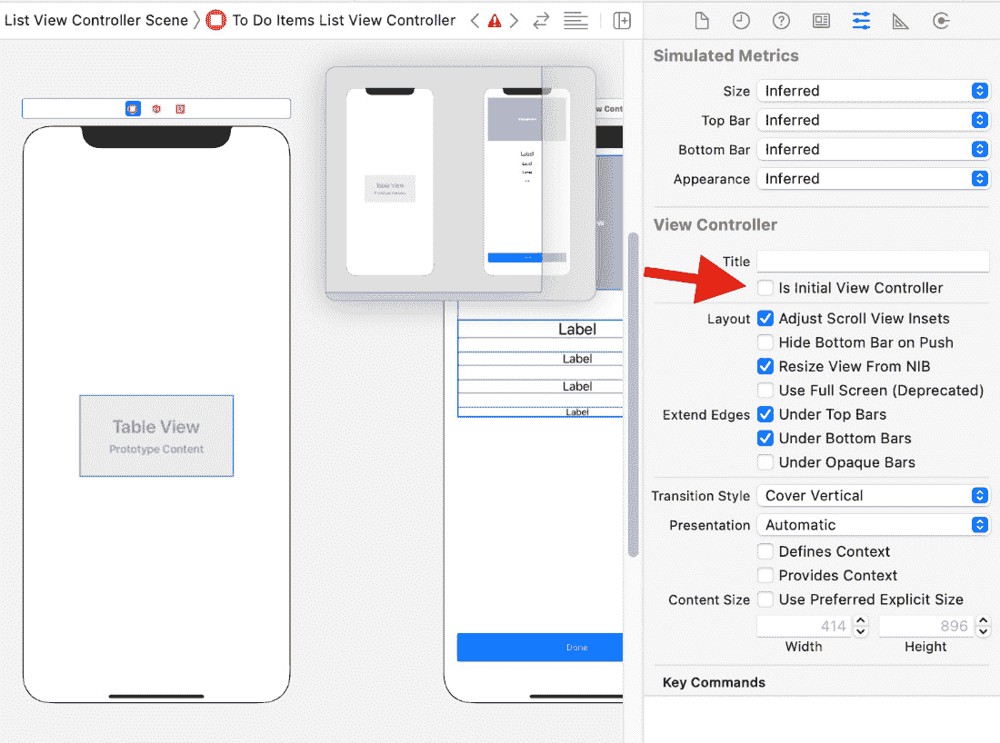
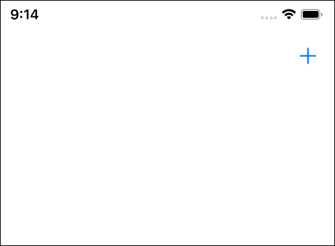
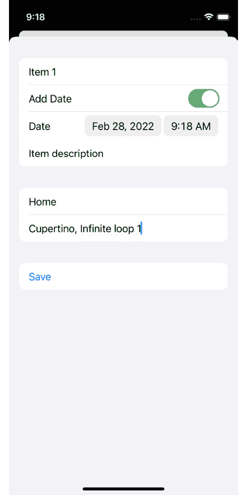
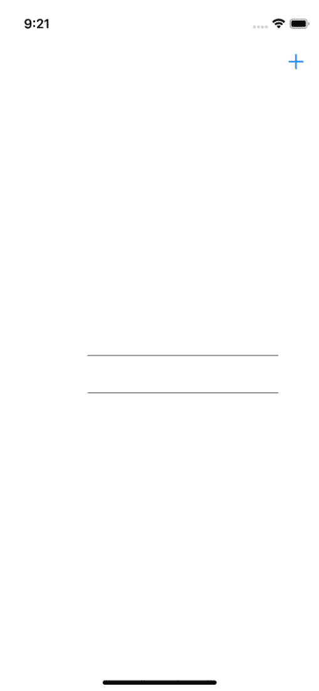
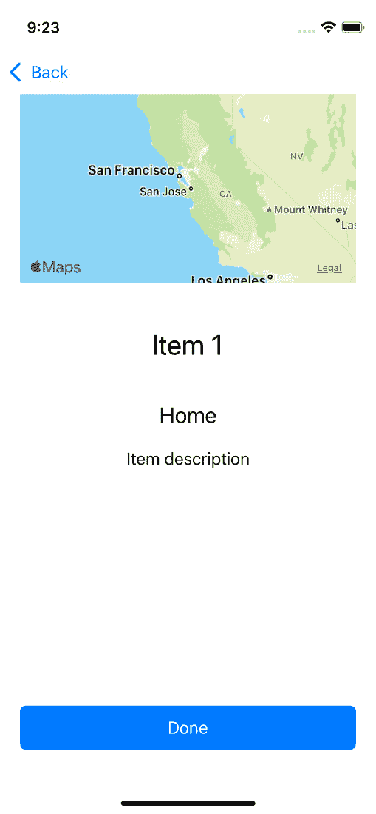
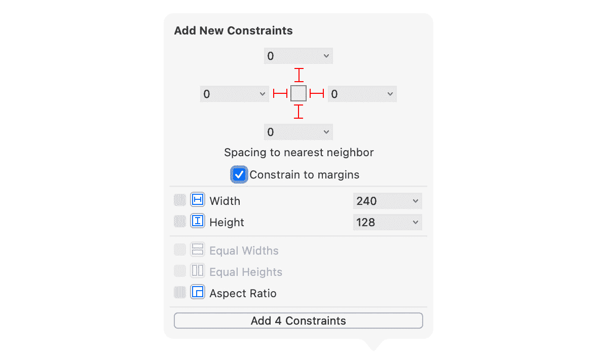

# 第十一章：*第十一章*：使用协调器轻松导航

一个 iOS 应用通常是一组以某种方式相互连接的单个屏幕。不经验丰富的开发者通常会从一个视图控制器中展示一个视图控制器，因为这很容易实现，并且在教程和演示代码中通常也是这样展示的。但是，对于需要长期维护的应用，我们需要一个更容易理解和更改的模式。

**协调器模式**非常容易实现，同时还能将应用视图之间的导航与信息展示解耦。在协调器模式中，一个称为协调器的结构负责在视图之间导航。视图控制器告诉协调器用户与应用进行了交互，协调器决定哪个视图控制器应该负责下一个屏幕。

作为额外的好处，协调器模式使测试导航代码更加简单和健壮，因此，这种模式非常适合**测试驱动开发**（**TDD**）。

在本书中构建的应用是一个只有三个屏幕的小应用。这三个屏幕之间的导航可以捆绑到一个协调器中。在更复杂的应用中，你通常会使用多个协调器。要了解更多关于协调器模式的信息，互联网上有大量关于该主题的博客文章。你不需要了解任何关于该模式的知识，就可以跟随本章中的代码。

在本章中，你将学习如何使用协调器模式测试和实现应用不同视图之间的导航。

本章的结构如下：

+   测试应用的设置

+   导航到详细信息

+   导航到模态视图

+   添加缺失的部分

让我们从使用协调器模式重构应用设置开始。

# 技术要求

本章的源代码可以在以下位置找到：[`github.com/PacktPublishing/Test-Driven-iOS-Development-with-Swift-Fourth-Edition/tree/main/chapter11`](https://github.com/PacktPublishing/Test-Driven-iOS-Development-with-Swift-Fourth-Edition/tree/main/chapter11)。

# 测试应用的设置

当我们的应用启动时，应该实例化并启动一个协调器。这应该导致我们应用初始视图的展示。按照以下步骤从使用故事板重构设置到使用协调器：

1.  在我们可以重构应用设置之前，我们需要一个测试来告诉我们何时破坏了某些东西。选择`AppSetupTests`。

1.  将新类的内容替换为以下内容：

    ```swift
    // AppSetupTests.swift
    import XCTest
    @testable import ToDo
    class AppSetupTests: XCTestCase {
      func test_application_shouldSetupRoot() {
        let application = UIApplication.shared
        let scene = application.connectedScenes.first
        as? UIWindowScene
        let root =
          scene?.windows.first?.rootViewController
        XCTAssert(root is ToDoItemsListViewController)
      }
    }
    ```

在这个测试中，我们获取我们应用第一个窗口的`rootViewController`属性，并检查它是否为`ToDoItemsListViewController`类型。

1.  运行测试以确认所有测试现在都通过。这个测试通过是因为故事板被设置为应用以`ToDoItemsListViewController`类的实例启动。

1.  前往`Main.storyboard`，并在属性检查器中取消勾选`ToDoItemsListViewController`场景的复选框。




图 11.1 – 从故事板中移除初始视图控制器设置

1.  切换到`ToDoItemsListViewController`。通过这个更改，我们可以在代码中使用此 ID 实例化这个视图控制器。

1.  运行测试以确认现在我们添加的最后一个测试失败了。哦，还有一个测试也失败了。在`ToDoItemsListViewControllerTests`中，所有测试都失败了，因为在`setUpWithError`中的设置抛出了一个错误。在我们继续设置应用之前，让我们先修复这个错误。`ToDoItemsListViewController`不再是故事板中的初始视图控制器。这意味着我们需要使用其 ID 来加载它。将`setUpWithError()`替换为以下实现：

    ```swift
    // ToDoItemsListViewControllerTests.swift
    override func setUpWithError() throws {
      let storyboard = UIStoryboard(name: "Main", bundle:
        nil)
      sut = try XCTUnwrap(
        storyboard.instantiateViewController(
          withIdentifier: "ToDoItemsListViewController")
        as? ToDoItemsListViewController
      )
      toDoItemStoreMock = ToDoItemStoreProtocolMock()
      sut.toDoItemStore = toDoItemStoreMock
      sut.loadViewIfNeeded()
    }
    ```

1.  再次运行所有测试。现在，只有我们的应用设置测试失败了。很好。让我们继续到实现部分。

1.  选择`AppCoordinator.swift`。用以下代码替换新文件的内容：

    ```swift
    // AppCoordinator.swift
    import UIKit

    protocol Coordinator {
      func start()
    }
    ```

这段代码定义了`Coordinator`协议。这就是我实现协调器模式的方式。在其他开发者的博客和书籍中，你可能会找到其他实现。不用担心，它们只是在细节上有所不同。当你对协调器模式有了一些了解后，你可能会开发出自己的实现。

这个协议的实现告诉我们，协调器有一个`start`方法。

1.  在同一文件中添加我们`AppCoordinator`的以下实现：

    ```swift
    // AppCoordinator.swift
    class AppCoordinator: Coordinator {
      private let window: UIWindow?
      private let viewController: UIViewController
      init(window: UIWindow?) {
        self.window = window
        let storyboard = UIStoryboard(name: "Main",
          bundle: nil)
        viewController =
          storyboard.instantiateViewController(
          withIdentifier: "ToDoItemsListViewController")
      }
      func start() {
        window?.rootViewController = viewController
      }
    }
    ```

在`AppCoordinator`的初始化器中，我们存储了作为参数传递的窗口，并设置了初始视图控制器的视图。在`start`方法中，我们设置了窗口的`rootViewController`属性。

1.  前往`SceneDelegate`并添加以下属性：

    ```swift
    // SceneDelegate.swift
    var appCoordinator: AppCoordinator?
    ```

1.  接下来，将`scene(_:willConnectTo:options:)`方法替换为以下代码：

    ```swift
    // SceneDelegate.swift
    func scene(_ scene: UIScene,
      willConnectTo session: UISceneSession,
      options connectionOptions:
      UIScene.ConnectionOptions) {
      guard let scene = (scene as? UIWindowScene) else {
        return
      }
      window = UIWindow(windowScene: scene)
      let coordinator = AppCoordinator(
        window: window)
      coordinator.start()
      appCoordinator = coordinator
      window?.makeKeyAndVisible()
    }
    ```

在这段代码中，我们首先设置了一个`UIWindow`类的实例。接下来，我们实例化了`AppCoordinator`实例并调用了它的`start`方法。最后，我们在窗口上调用`makeKeyAndVisible`来告诉`UIKit`这个窗口应该显示在屏幕上。

1.  运行所有测试以确认我们的重构是成功的。

现在，应用的工作方式与之前相同。当应用启动时，会创建并显示一个`ToDoItemsListViewController`实例。但是，这并不是最终应用应该工作的方式。待办事项列表需要在`UINavigationController`实例上显示，以便以后能够导航到待办事项的详细信息。

按照以下步骤进行此更改：

1.  将`test_application_shouldSetupRoot()`测试方法替换为以下实现：

    ```swift
    // AppSetupTests.swift
    func test_application_shouldSetupRoot() throws {
      let application = UIApplication.shared
      let scene = application.connectedScenes.first
      as? UIWindowScene
      let root = scene?.windows.first?.rootViewController
      let nav = try XCTUnwrap(root as?
        UINavigationController)
      XCTAssert(nav.topViewController
        is ToDoItemsListViewController)
    }
    ```

1.  运行测试以查看现在在`XCTAssert`调用之前的行中这个测试失败了。

1.  为了让这个测试再次通过，我们首先需要在`AppCoordinator`类中为导航控制器添加一个属性：

    ```swift
    // AppCoordinator.swift
    private let navigationController:
      UINavigationController
    ```

1.  接下来，我们在`init`方法中设置导航控制器：

    ```swift
    // AppCoordinator.swift
    init(window: UIWindow?,
      navigationController: UINavigationController =
      UINavigationController()) {
      self.window = window
      self.navigationController = navigationController
      let storyboard = UIStoryboard(name: "Main", bundle:
        nil)
      viewController =
        storyboard.instantiateViewController(
        withIdentifier: "ToDoItemsListViewController")
    }
    ```

我们已将导航控制器作为具有默认值的参数添加到`init`调用中。这将在我们添加导航到待办事项详细信息的测试时派上用场。

1.  现在，我们可以将`ToDoItemsListViewController`的实例添加到导航控制器的导航堆栈中，以更改`start`方法：

    ```swift
    // AppCoordinator.swift
    func start() {
      navigationController.pushViewController
       (viewController,
        animated: false)
      window?.rootViewController = navigationController
    }
    ```

运行测试以确认所有测试现在都再次通过。

我们还没有完成设置列表视图控制器。记住，列表视图控制器通过用户与遵循我们在*第七章*中定义的`ToDoItemsListViewControllerProtocol`协议的代理对象进行交互，*构建待办事项的表视图控制器*。按照以下步骤实现这一部分的设置：

1.  选择`AppCoordinatorTests`。删除两个模板测试方法，并添加`@testable import ToDo`导入语句。

1.  现在，我们将使`AppCoordinator`类遵循`ToDoItemsListViewControllerProtocol`协议。将以下代码添加到`AppCoordinator.swift`中：

    ```swift
    // AppCoordinator.swift 
    extension AppCoordinator:  
      ToDoItemsListViewControllerProtocol { 

      func selectToDoItem(_ viewController:
        UIViewController, 
        item: ToDoItem) { 
      } 
    }  
    ```

此实现目前什么也不做。我们将在下一节中实现此方法。

1.  要为分配列表视图控制器代理属性编写测试，我们需要在`test`方法中访问列表视图控制器。`AppCoordinator`类的视图控制器属性是私有的。这意味着我们无法在测试中访问它。我们可以更改视图控制器属性的访问级别。

但出于教育目的，我们将做些其他事情。我们将一个导航控制器模拟传递给`AppCoordinator`类的`init`方法，并从该模拟中获取初始视图控制器。

1.  向`NavigationControllerMock`添加一个新的 Swift 类。用以下代码替换新文件的内容：

    ```swift
    // NavigationControllerMock.swift 
    import UIKit 

    class NavigationControllerMock: UINavigationController { 
      var lastPushedViewController: UIViewController? 

      override func pushViewController( 
        _ viewController: UIViewController, 
        animated: Bool) {   
          lastPushedViewController = viewController 
          super.pushViewController(viewController, 
            animated: animated) 
        } 
    } 
    ```

这个`UINavigationController`类的子类存储了最后推入的视图控制器以供后续检查，然后调用`super`类的实现。

1.  现在，我们可以在`AppCoordinator`测试中使用这个类。将以下属性添加到`AppCoordinatorTests`中：

    ```swift
    // AppCoordinatorTests.swift 
    var sut: AppCoordinator! 
    var navigationControllerMock: 
    NavigationControllerMock! 
    var window: UIWindow!
    ```

1.  将`setUpWithError`方法替换为以下代码：

    ```swift
    // AppCoordinatorTests.swift 
    override func setUpWithError() throws { 
      window = UIWindow(frame: CGRect(x: 0, 
        y: 0, 
        width: 200, 
        height: 200)) 
      navigationControllerMock =
        NavigationControllerMock() 
      sut = AppCoordinator( 
        window: window, 
        navigationController: navigationControllerMock) 
    } 
    ```

在此代码中，我们创建了一个模拟窗口和一个`NavigationControllerMock`实例，并使用这两个实例初始化一个`AppCoordinator`实例。

1.  对于测试所设置的内容，测试完成后必须清理。将`tearDownWithError`方法替换为以下代码：

    ```swift
    // AppCoordinatorTests.swift 
    override func tearDownWithError() throws { 
      sut = nil 
      navigationControllerMock = nil 
      window = nil 
    }
    ```

1.  准备就绪后，我们可以添加一个测试来确认`start`方法将`AppCoordinator`的实例分配给列表视图控制器的代理：

    ```swift
    // AppCoordinatorTests.swift
    func test_start_shouldSetDelegate() throws {
      sut.start()
      let listViewController = try XCTUnwrap(
        navigationControllerMock.lastPushedViewController
        as? ToDoItemsListViewController)
      XCTAssertIdentical(
        listViewController.delegate as? AppCoordinator,
        sut)
    }
    ```

在这个测试中，我们调用`AppCoordinator`实例的`start`方法，然后断言`sut`被分配到列表视图控制器的代理属性。我们在这里使用`XCTAssertIdentical(_:_:)`断言函数。由于`AppCoordinator`是一个类，我们可以在测试中检查代理是否与`sut`相同。这个断言函数比较两个项目的指针地址，当两个引用相同时测试通过。这不适用于值类型，因为它们在分配（或更确切地说，在更改时）时被复制。

运行测试以确认这个新测试失败。

1.  要使这个测试通过，请将以下代码添加到`AppCoordinator`中的`start`方法末尾：

    ```swift
    // AppCoordinator.swift
    if let listViewController =
      viewController as? ToDoItemsListViewController {
      listViewController.delegate = self
    }
    ```

运行测试以确认这个添加使测试通过。

`ToDoItemsListViewController`显示从`ToDoItemStore`实例获取的待办事项。我们需要在设置时向列表视图控制器提供一个项目存储。按照以下步骤将项目存储添加到列表视图控制器：

1.  将以下测试添加到`AppCoordinatorTests`：

    ```swift
    // AppCoordinatorTests.swift
    func test_start_shouldAssignItemStore() throws {
      sut.start()
      let listViewController = try XCTUnwrap(
        navigationControllerMock.lastPushedViewController
        as? ToDoItemsListViewController)
      XCTAssertNotNil(listViewController.toDoItemStore)
    }
    ```

在这个测试中，我们断言列表视图控制器的`toDoItemStore`属性不为空。运行测试以确认这个测试失败。

1.  让这个测试通过。将以下属性添加到`AppCoordinator`：

    ```swift
    // AppCoordinator.swift
    let toDoItemStore: ToDoItemStore
    ```

1.  在`init`方法中分配这个属性一个新的实例：

    ```swift
    // AppCoordinator.swift
    toDoItemStore = ToDoItemStore()
    ```

1.  现在，在`start`方法的`if let`语句中将这个属性分配给列表视图控制器的属性：

    ```swift
    // AppCoordinator.swift
    func start() {
      navigationController.pushViewController
        (viewController,
         animated: false)
      window?.rootViewController = navigationController
      if let listViewController =
          viewController as? ToDoItemsListViewController {
        listViewController.delegate = self
        listViewController.toDoItemStore = toDoItemStore
      }
    }
    ```

运行测试以确认所有测试现在通过。

协调器和初始视图控制器的设置现在已完成。我们可以继续实现列表视图控制器与应用程序协调器的交互。

当用户点击带有待办事项的表格视图单元格时，应用应该导航到该事项的详细信息。在以下部分，我们将实现这个功能。

# 导航到详细信息

我们将在应用中使用`AppCoordinator`类实现导航。按照以下步骤实现导航到待办事项的详细信息：

1.  将以下测试方法添加到`AppCoordinatorTests`：

    ```swift
    // AppCoordinatorTests.swift
    func test_selectToDoItem_pushesDetails() throws {
      let dummyViewController = UIViewController()
      let item = ToDoItem(title: "dummy title")
      sut.selectToDoItem(dummyViewController, item: item)
      let detail = try XCTUnwrap(
        navigationControllerMock.lastPushedViewController
        as? ToDoItemDetailsViewController)
      XCTAssertEqual(detail.toDoItem, item)
    }
    ```

在这个测试中，我们执行`delegate`方法并断言`ToDoItemDetailsViewController`的实例被推送到导航堆栈中，并且它的`toDoItem`是我们用于`delegate`方法调用中的项目。

运行测试以确认这个新测试失败。

1.  用以下实现替换`selectToDoItem(_:item:)`的实现：

    ```swift
    // AppCoordinator.swift 
    func selectToDoItem(_ viewController:
      UIViewController, 
      item: ToDoItem) { 

      let storyboard = UIStoryboard(name: "Main", bundle:
        nil) 
      guard let next =
        storyboard.instantiateViewController( 
        withIdentifier: "ToDoItemDetailsViewController") 
          as? ToDoItemDetailsViewController else { 
                return 
              } 

      next.loadViewIfNeeded() 
      next.toDoItem = item 

      navigationController.pushViewController(next, 
        animated: true) 
    } 
    ```

在此代码中，我们从 Storyboard 中实例化一个`ToDoItemDetailsViewController`实例，并使用传递给方法的项目进行设置。然后我们将新的视图控制器推送到导航堆栈。

运行测试以确认所有测试现在再次通过。

1.  详细视图控制器需要一个对`toDoItemStore`的引用，因为用户可以在详细视图中更改事项的状态为`完成`。将以下测试添加到`AppCoordinatorTests`：

    ```swift
    // AppCoordinatorTests.swift
    func test_selectToDoItem_shouldSetItemStore() throws {
      let dummyViewController = UIViewController()
      let item = ToDoItem(title: "dummy title")
      sut.selectToDoItem(dummyViewController, item: item)
      let detail = try XCTUnwrap(
        navigationControllerMock.lastPushedViewController
        as? ToDoItemDetailsViewController)
      XCTAssertIdentical(
        detail.toDoItemStore as? ToDoItemStore,
        sut.toDoItemStore)
    }
    ```

这个测试看起来和上一个一样。我们只是将断言函数调用更改为检查 `toDoItemStore` 属性是否与 `sut` 属性相同。

运行测试以查看这个测试失败。

1.  为了使这个测试通过，在分配 `toDoItem` 属性的下一行分配 `toDoItemStore` 属性：

    ```swift
    // AppCoordinator.swift
    next.loadViewIfNeeded()
    next.toDoItem = item
    next.toDoItemStore = toDoItemStore
    ```

运行测试以确认所有测试通过。

当用户选择一个带有待办事项的单元格时，我们的应用现在会在屏幕上显示该事项的详细信息。还有一个功能缺失。应用需要允许输入新的待办事项。我们将在下一节中实现从列表视图到输入视图的展示。

# 导航到模态视图

通常，测试模态视图控制器的展示相当复杂。如果你在网上搜索如何做，你会找到常见的解决方案是通过重写 `UIViewController` 类中定义的 `present(_:animated:completion:)` 方法。重写相当复杂，我不会在这本书中展示如何进行。

但是，因为我们正在使用协调器模式进行我们的应用导航，所以我们可以测试展示，而无需对任何方法进行重写。尽管如此，你应该查找如何重写方法，因为有时你无法使用协调器模式；例如，当已经实现了所有导航代码，并且不允许你更改它时。

按照以下步骤实现当用户选择添加新待办事项时输入视图的展示：

1.  应用需要在用户界面中添加一个按钮，用户可以点击以添加待办事项。当用户点击该按钮时，列表视图控制器应该通知其代理。向 `ToDoItemsListViewControllerProtocol` 添加以下方法定义：

    ```swift
    // ToDoItemsListViewController.swift
    func addToDoItem(
      _ viewController: UIViewController)
    ```

1.  为了让编译器满意，向 `AppCoordinator` 添加以下空方法实现：

    ```swift
    // AppCoordinator.swift
    func addToDoItem(_ viewController: UIViewController) {
    }
    ```

1.  我们还有一个符合 `ToDoItemsListViewControllerProtocol` 协议的类。将以下代码添加到 `ToDoItemsListViewControllerProtocolMock` 类的末尾：

    ```swift
    // ToDoItemsListViewControllerProtocolMock.swift
    var addToDoItemCallCount = 0
    func addToDoItem(_ viewController: UIViewController) {
      addToDoItemCallCount += 1
    }
    ```

模拟对象计算 `addToDoItem(_:)` 方法的调用次数。

1.  接下来，我们需要一个视图控制器模拟，它可以捕获最后展示的视图控制器。选择 `ViewControllerMock.swift` 文件。用以下代码替换其内容：

    ```swift
    // ViewControllerMock.swift
    import UIKit
    class ViewControllerMock: UIViewController {
      var lastPresented: UIViewController?
      override func present(
        _ viewControllerToPresent: UIViewController,
        animated flag: Bool,
        completion: (() -> Void)? = nil) {
        lastPresented = viewControllerToPresent
        super.present(viewControllerToPresent,
          animated: flag,
          completion: completion)
      }
    }
    ```

这个模拟将展示的视图控制器存储在一个属性中，以便稍后检查。

1.  现在，我们可以编写测试了。将 `SwiftUI` 导入到 `AppCoordinatorTests.swift` 文件中，并在 `AppCoordinatorTests` 中添加以下测试方法：

    ```swift
    // AppCoordinatorTests.swift
    func test_addToDoItem_shouldPresentInputView() throws
     {
      let viewControllerMock = ViewControllerMock()
      sut.addToDoItem(viewControllerMock)
      let lastPresented = try XCTUnwrap(
        viewControllerMock.lastPresented
        as? UIHostingController<ToDoItemInputView>)
      XCTAssertIdentical(
        lastPresented.rootView.delegate as?
        AppCoordinator,
        sut)
    }
    ```

这个测试调用 `addToDoItem(_:)` 并断言 `sut` 变量被分配为展示的 `ToDoItemInputView` 实例的代理。

运行测试以确认这个新测试失败。

1.  为了使这个测试通过，将 `SwiftUI` 导入到 `AppCoordinator.swift` 文件中，并用以下代码替换 `addToDoItem(_:)` 的实现：

    ```swift
    // AppCoordinator.swift
    func addToDoItem(_ viewController: UIViewController) {
      let data = ToDoItemData()
      let next = UIHostingController(
        rootView: ToDoItemInputView(data: data,
          apiClient: APIClient(),
          delegate: self))
      viewController.present(next, animated: true)
    }
    ```

Xcode 显示了一个错误；我们将在下一步修复此错误。此代码使用`ToDoItemInputView`作为根视图实例化一个`UIHostingController`。这就是我们从`UIKit`环境呈现`SwiftUI`视图的方法。

1.  为了使此代码编译，请将以下扩展添加到`AppCoordinator.swift`：

    ```swift
    // AppCoordinator.swift
    extension AppCoordinator: ToDoItemInputViewDelegate {
      func addToDoItem(with: ToDoItemData,
        coordinate: Coordinate?) {
      }
    }
    ```

运行测试以确认所有测试现在都通过。

此功能的其中一部分已完成。接下来，我们需要在`ToDoItemsListViewController`类中实现其他部分。

1.  将以下测试方法添加到`ToDoItemsListViewControllerTests`：

    ```swift
    // ToDoItemsListViewControllerTests.swift
    func test_navigationBarButton_shouldCallDelegate()
     throws {
      let delegateMock =
      ToDoItemsListViewControllerProtocolMock()
      sut.delegate = delegateMock
      let addButton =
        sut.navigationItem.rightBarButtonItem
      let target = try XCTUnwrap(addButton?.target)
      let action = try XCTUnwrap(addButton?.action)
      _ = target.perform(action, with: addButton)
      XCTAssertEqual(delegateMock.addToDoItemCallCount, 1)
    }
    ```

在此测试中，我们获取`sut`变量的正确工具栏按钮项并调用其目标上的操作。这应该导致调用代理的`addToDoItem(_:)`方法。

运行测试并确认此新测试失败。

1.  将以下代码添加到`ToDoItemsListViewController`的`viewDidLoad()`末尾：

    ```swift
    // ToDoItemsListViewController.swift
    let addItem = UIBarButtonItem(barButtonSystemItem:
      .add,
      target: self,
      action: #selector(add(_:)))
    navigationItem.rightBarButtonItem = addItem
    ```

使用此代码，我们在`ToDoItemsListViewController`实例的导航项中添加了一个工具栏按钮。这导致添加到托管`ToDoItemsListViewController`的导航控制器导航栏中的工具栏按钮。

1.  现在，将以下方法添加到`ToDoItemsListViewController`：

    ```swift
    // ToDoItemsListViewController.swift
    @objc func add(_ sender: UIBarButtonItem) {
    }
    ```

目前，我们让此方法的实现为空，因为我们想看到在断言函数调用中测试失败。运行测试并确认我们最后添加的测试在断言调用中失败。

1.  为了使测试通过，请在`add(_:)`中添加缺失的代码：

    ```swift
    // ToDoItemsListViewController.swift
    @objc func add(_ sender: UIBarButtonItem) {
      delegate?.addToDoItem(self)
    } 
    ```

运行测试以确认所有测试现在都通过。

我们已经知道`ToDoItemInputView`在用户选择`ToDoItemStore`的`add(_:)`方法时会调用其代理。采取以下步骤来实现此功能。

1.  将以下测试添加到`AppCoordinatorTests`：

    ```swift
    // AppCoordinatorTests.swift
    func test_addToDoItemWith_shouldCallToDoItemStore()
     throws {
      let toDoItemData = ToDoItemData()
      toDoItemData.title = "dummy title"
      let receivedItems =
      try wait(for: sut.toDoItemStore.itemPublisher,
        afterChange: {
        sut.addToDoItem(with: toDoItemData, coordinate:
          nil)
      })
      XCTAssertEqual(receivedItems.first?.title, 
        toDoItemData.title)
    }
    ```

此测试断言，在调用`addToDoItem(with:coordinate:)`之后，现在`toDoItemStore`属性的`itemPublisher`发布了存储项的变化。

1.  由于我们正在向项目存储添加待办事项，我们需要将`AppCoordinator`中的`doToItemStore`替换为测试存储。否则，由于其他测试或我们在模拟器上测试应用程序时添加到存储中的项，测试可能会失败。

1.  将`AppCoordinator`类的`init`方法替换为以下实现：

    ```swift
    // AppCoordinator.swift
    init(window: UIWindow?,
     navigationController: UINavigationController =
         UINavigationController(),
         toDoItemStore: ToDoItemStore = ToDoItemStore()) {
      self.window = window
      self.navigationController = navigationController
      self.toDoItemStore = toDoItemStore
      let storyboard = UIStoryboard(name: "Main", bundle:
        nil)
      viewController = 
        storyboard.instantiateViewController(
        withIdentifier: "ToDoItemsListViewController")
    }
    ```

在这里，我们已将`toDoItemStore`参数添加到方法中，并使用该参数设置`AppCoordinator`类中使用的`toDoItemStore`属性。

1.  因此，我们可以在`setUpWithError`中设置`sut`时使用测试存储。

    ```swift
    // AppCoordinatorTests.swift
    override func setUpWithError() throws {
      window = UIWindow(frame: CGRect(x: 0,
        y: 0,
        width: 200,
        height: 200))
      navigationControllerMock =
        NavigationControllerMock()
      sut = AppCoordinator(
        window: window,
        navigationController: navigationControllerMock,
        toDoItemStore: ToDoItemStore(fileName:
          "dummy_store"))
    }
    ```

1.  要在测试完成后删除项目存储，请将以下代码添加到`AppCoordinatorTests`的`tearDownWithError`末尾：

    ```swift
    // AppCoordinatorTests.swift
    let url = FileManager.default
      .documentsURL(name: "dummy_store")
    try? FileManager.default.removeItem(at: url)
    ```

此代码看起来很熟悉，因为我们已经在`ToDoItemStoreTests`中使用过它。

运行测试以确认新的测试失败。

1.  使用以下`addToDoItem(with:coordinate:)`的实现使测试通过：

    ```swift
    // AppCoordinator.swift
    func addToDoItem(with item: ToDoItemData,
      coordinate: Coordinate?) {
      let location = Location(name: item.locationName,
        coordinate: coordinate)
      let toDoItem = ToDoItem(
        title: item.title,
        itemDescription: item.itemDescription,
        timestamp: item.date.timeIntervalSince1970,
        location: location)
      toDoItemStore.add(toDoItem)
    }
    ```

注意，我们为该方法的第一个参数添加了一个内部参数名`item`。

在此代码中，我们从`ToDoItemData`结构创建了一个`ToDoItem`实例。然后，我们调用`toDoItemStore`的`add(_:)`方法。

运行测试以确认这个更改使所有测试再次通过。

目前，我们已经完成了实现。让我们在模拟器中运行应用，看看我们是否遗漏了什么。

# 添加缺失的部分

首先，让我们运行这个应用第一次，看看我们现在在哪里。

应用从只有一个加号（**+**）按钮的空白屏幕开始，位于右上角。




图 11.2 – 我们应用的初始视图

因此，这里有一些工作要做。但是，让我们继续并点击加号（**+**）按钮。我们看到了输入视图。我们可以为项目添加数据并点击**保存**按钮。




图 11.3 – 我们应用的输入视图

但是，当我们点击**保存**按钮时，没有任何反应。通过向下滑动来关闭视图，看看项目是否已添加。有些东西改变了。屏幕中间出现了一个空白表格视图单元格。




图 11.4 – 一个空白表格视图单元格。待办事项在哪里？

当你点击空白表格视图单元格时，详细视图会被推送到屏幕上。




图 11.5 – 待办事项项的详细信息。但是，截止日期在哪里？

好的，我们有一些工作要做。让我们回到 Xcode 并修复一些问题。

## 使单元格可见

表格视图没有显示待办事项的信息。原因是，我们在添加标签时没有为视图添加约束。这是故意的，因为我相信你不应该编写单元测试来测试界面元素的定位和大小。UI 快照测试是这些类型测试的更好工具。

按照以下步骤修复单元格和表格视图的布局：

1.  在`0`中打开`Main.storyboard`并点击**添加 4 个约束**。




图 11.6 – 表格视图的约束

1.  接下来，转到`ToDoItemCell`，并用以下实现替换`init`方法：

    ```swift
    // ToDoItemCell.swift
    override init(style: UITableViewCell.CellStyle,
      reuseIdentifier: String?) {
      titleLabel = UILabel()
      dateLabel = UILabel()
      dateLabel.textAlignment = .right
      locationLabel = UILabel()
      let titleLocation = UIStackView(
        arrangedSubviews: [titleLabel, locationLabel])
      titleLocation.axis = .vertical
      let stackView = UIStackView(
        arrangedSubviews: [titleLocation, dateLabel])
      stackView
        .translatesAutoresizingMaskIntoConstraints = false
      super.init(style: style,
        reuseIdentifier: reuseIdentifier)
      contentView.addSubview(stackView)
      NSLayoutConstraint.activate([
       stackView.topAnchor.constraint(
          equalTo: contentView.topAnchor, constant: 5),
       stackView.leadingAnchor.constraint(
        equalTo: contentView.leadingAnchor, constant: 16),
       stackView.bottomAnchor.constraint(
        equalTo: contentView.bottomAnchor, constant: -5),
       stackView.trailingAnchor.constraint(
        equalTo: contentView.trailingAnchor, constant: -
        16),
      ])
    }
    ```

我们使用`UIStackView`实例来布局元素。运行测试以确认我们没有破坏任何东西。然后，在模拟器上再次运行应用。

它看起来更好，但表格视图单元格中仍然缺少截止日期。原因是我们没有设置当前的`dateFormatter`实例。我们找到了一个错误。每次我们找到错误时，我们都应该尝试编写一个因为该错误而失败的测试。然后，我们应该通过修复错误来使测试通过。

1.  将以下测试方法添加到`ToDoItemsListViewControllerTests`：

    ```swift
    // ToDoItemsListViewControllerTests.swift
    func test_dateFormatter_shouldNotBeNone() {
      XCTAssertNotEqual(sut.dateFormatter.dateStyle,
        .none)
    }
    ```

注意，`XCTAssertNotEqual`断言函数与`XCTAssertEqual`函数相反。当两个值不相等时，它通过。

运行测试以查看此测试失败。

1.  要使此测试通过并消除错误，请将这些行添加到`viewDidLoad`中`super.viewDidLoad()`行下方：

    ```swift
    // ToDoItemsListViewController.swift
    super.viewDidLoad()
    dateFormatter.dateStyle = .short
    ```

1.  运行测试以确认这使测试通过。然后，在模拟器上运行应用。哇哦！我们用 TDD 帮助修复了第一个错误。这是一个里程碑。我们现在确信，只要定期运行这个测试，这个错误就不会再出现。

接下来，我们需要修复当用户点击**保存**按钮时，输入视图没有关闭的错误。

## 忽略输入视图

再次，我们有一个错误。让我们看看我们是否可以为这个错误编写一个测试。按照以下步骤修复错误：

1.  导航控制器模拟应该注册`dismiss(animated:completion:)`是否被调用。这样，我们可以确保在添加新项目时调用它。将以下代码添加到`NavigationControllerMock`：

    ```swift
    // NavigationControllerMock.swift
    var dismissCallCount = 0
    override func dismiss(animated flag: Bool,
      completion: (() -> Void)? = nil) {
      dismissCallCount += 1
      super.dismiss(animated: flag,
         completion: completion)
    }
    ```

此代码计算`dismiss(animated:completion:)`被调用的次数。

1.  将以下测试方法添加到`AppCoordinatorTests`：

    ```swift
    // AppCoordinatorTests.swift
    func test_addToDoItemWith_shouldDismissInput() {
      let toDoItemData = ToDoItemData()
      toDoItemData.title = "dummy title"
      sut.addToDoItem(with: toDoItemData,
        coordinate: nil)
      XCTAssertEqual(
        navigationControllerMock.dismissCallCount, 1)
    }
    ```

运行测试以查看此测试失败。

1.  将以下代码添加到`addToDoItem(with:coordinate:)`的末尾：

    ```swift
    // AppCoordinatorTests.swift
    navigationController.dismiss(animated: true)
    ```

运行测试以确认此代码使所有测试再次通过。然后，运行应用并添加一个新的待办事项。

我们使用 TDD 修复了另一个错误。

接下来，让我们修复详情中未显示截止日期的错误。

## 在详情中使截止日期可见

日期未在详情中显示的原因与表格视图单元格相同。日期格式化器设置不正确。你已经知道如何编写这个测试。编写测试并确保测试失败。

要使测试通过并修复错误，你可以使用以下`dateFormatter`属性的`definition`：

```swift
// ToDoItemDetailsViewController.swift
let dateFormatter: DateFormatter = {
  let formatter = DateFormatter()
  formatter.dateStyle = .short
  return formatter
}()
```

这应该会使你的测试通过。

再次运行应用，并与之互动。你可能会意识到更多错误。以下是我发现的内容：

+   当用户在详情中点击**完成**按钮时，应用应该返回待办事项列表。

+   表格视图中的部分标题缺失。已完成的项目已正确移动到第二个部分，但在用户界面中看不到有多个部分。

+   当用户标记第一个项目为已完成时，表格视图中的顺序会改变。如果用户随后选择表格视图中的第一个项目，将显示其他项目的详情。

+   即使用户从详情返回，单元格仍然保持选中状态。

+   调试控制台显示一个警告，即当表格视图不可见时，被要求布局单元格。

我们确实发现了更多错误。

在以下部分，我们将只修复此列表中的第三个和第五个错误。其他错误留作你的练习。如果你卡住了，可以查看 GitHub 上本章的代码。

## 修复错误的项目被选中

再次，在我们尝试修复这个错误之前，让我们尝试编写一个测试。按照以下步骤修复这个错误：

1.  问题在于我们在为可差分数据源创建快照时设置了部分，但在用户选择表格视图行时忽略了部分。我们可以将`test_didSelectCellAt_shouldCallDelegate`方法更改为检查这个错误。将那个测试方法的实现替换为以下代码：

    ```swift
    // ToDoItemsListViewControllerTests.swift
    func test_didSelectCellAt_shouldCallDelegate() throws
     {
      let delegateMock =
        ToDoItemsListViewControllerProtocolMock()
      sut.delegate = delegateMock
      var doneItem = ToDoItem(title: "done item")
      doneItem.done = true
      let toDoItem = ToDoItem(title: "to-do item")
      toDoItemStoreMock.itemPublisher
        .send([doneItem, toDoItem])
      let tableView = try XCTUnwrap(sut.tableView)
      let indexPath = IndexPath(row: 0, section: 0)
      tableView.delegate?.tableView?(
        tableView,
        didSelectRowAt: indexPath)
      XCTAssertEqual(
       delegateMock.selectToDoItemReceivedArguments?.item,
        toDoItem)
    }
    ```

我们将测试更改为使用两个项目，一个是已完成的项目，另一个是尚未完成的项目。

运行测试以查看这个测试失败。

1.  为了使测试通过并修复错误，将`tableView(_:didSelectRowAt:)`的实现替换为以下代码：

    ```swift
    // ToDoItemsListViewController.swift
    func tableView(_ tableView: UITableView,
      didSelectRowAt indexPath: IndexPath) {
      let item: ToDoItem
      switch indexPath.section {
        case 0:
          let filteredItems = items.filter({ false ==
            $0.done })
          item = filteredItems[indexPath.row]
        default:
          let filteredItems = items.filter({ true ==
            $0.done })
          item = filteredItems[indexPath.row]
      }
      delegate?.selectToDoItem(self, item: item)
    }
    ```

在这个实现中，我们尊重两个部分，并相应地选择要显示的项目。

运行所有测试以确认现在所有测试都通过。

并且，随着最后一个错误的修复，我们完成了使用 TDD 创建的我们的小应用的第一简单版本。

## 修复表格视图的布局

这里的问题是，我们使用`Combine`框架来更新表格视图。当用户点击`doToItemStore`时，它会更新项目并通知表格视图。这导致表格视图在屏幕不可见时更新。这很容易修复，我们甚至不需要为这个错误编写测试。将以下代码添加到`ToDoItemsListViewController`中：

```swift
// ToDoItemsListViewController.swift
override func viewDidAppear(_ animated: Bool) {
  super.viewDidAppear(animated)
  token = toDoItemStore?.itemPublisher
    .sink(receiveValue: { [weak self] items in
      self?.items = items
      self?.update(with: items)
    })
}
override func viewWillDisappear(_ animated: Bool) {
  super.viewWillDisappear(animated)
  token?.cancel()
}
```

当带有表格视图的视图消失时，我们取消订阅`itemsPublisher`。当视图出现在屏幕上时，我们再次订阅。在模拟器中再次运行应用，查看控制台以查看消息是否已消失。

# 摘要

在本章的最后一章中，我们实现了应用中不同视图之间的导航。我们学习了如何测试将视图控制器推入导航堆栈，以及如何测试一个视图是否以模态方式呈现。

在实现导航后，我们在模拟器上启动了应用，找到了并修复了错误。我们发现 TDD 甚至有助于修复错误。通过首先编写一个针对该错误的失败测试，然后使测试通过，我们确保这个错误不会在未来影响我们的应用。

通过本章获得的知识，你将能够使用协调器模式实现和测试应用的导航。现在，你也能够编写测试来查找错误，并通过使测试通过来修复错误。

恭喜你，你到达了这本书的结尾！我希望这本书是你成为测试驱动开发者的旅程的开始。你学习了如何测试`Combine`代码，并为视图控制器、视图、表格视图甚至 SwiftUI 代码编写测试。我相信这是你下一步的好基础。尝试给你的现有项目添加测试，并与你的同事讨论单元测试和 TDD 的优缺点。找到你自己的测试风格。

最重要的是，享受乐趣！

# 练习

1.  修复在模拟器上测试应用时发现的错误。

1.  添加一个功能，让用户可以在所有待办事项列表中勾选待办事项。

1.  在亚马逊上为这本书写一篇评论。
