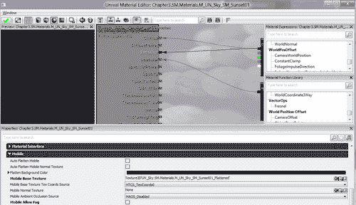

# 第三章。提升至下一个层次：内容丰富化

> 在这个阶段，我们有一个带有纹理的房间和一些围绕它的桶。这很好，但是为了给玩家在玩游戏时想要达到的不怀疑的沉浸感，我们需要添加一些其他的东西来使我们的世界看起来更可信。

在本章中，我们将：

+   将我们的当前关卡放在网格上并创建一个外部区域

+   创建一个可用于移动设备的自定义天空穹顶

+   了解光照及其在 iOS 平台上的应用

+   使用移动预览选项来显示我们的关卡在 iOS 设备上的外观

+   添加粒子来使我们的世界充满生机

+   使用雾来隐藏远处的对象以提高效率

话虽如此，让我们开始吧！

# 外部世界

游戏关卡发生在各种不同的地方。在太空站内、史诗般的奇幻城镇、森林中，甚至是某人的后院。所有这些地方共同之处在于，我们使用相同的基本工具来制作我们所能想象到的每一种环境！你将看到我们如何轻松地扩展我们在这里所做的工作，然后在第六章“整合一切”中，我们将探讨几何模式如何使区域遮挡变得非常容易，但就目前而言，让我们创建一个门。

# 行动时间——创建外部区域

目前，我们有一个单间房间，它有纹理和一些对象。这很好，但我们可以采取一些步骤来扩展这个世界，创造出更好的东西！首先，让我们重新分组，确保我们都在同一页上。

1.  从顶部菜单中选择**视图** | **视口配置** | **2x1 分割**。

    ### 注意

    在确定 UDK 如何显示和为你工作方面，你有许多不同的选项可以使用，我鼓励你花时间找出你喜欢和不喜欢的东西。虽然有一个**前视**视口是不错的，但我更喜欢有一个更大的屏幕空间用于**透视**视图，这样我就能更好地了解我创建的区域看起来像什么。这更多的是我个人的偏好，但这就是我从现在开始要使用的方法。

1.  从**顶视**视图中，按住*Ctrl* + *Alt*，从稍高一点的左上角拖动到我们创建的房间的右下角。

    当你按住*Ctrl* + *Alt*并拖动鼠标时，你会注意到一个红色矩形正在被创建。当你松开鼠标右键时，该区域内的所有对象都将被选中。这在选择区域内的多个对象时非常有用。

    如果你无法在视口中看到整个房间，请使用鼠标滚轮向后移动。要移动到视口中，你首先需要在其中点击。要拖动屏幕，请按住鼠标右键并拖动到你想要移动的方向。

1.  将视图缩放到房间的左上角，并在左侧上方的顶点上右键点击。你应该注意到房间正在对齐到网格。如果你没有看到任何变化发生，要么你完全对齐了，要么你关闭了网格锁定。要再次启用它，有一个带有左半边网格的数字右侧的复选框。确保该复选框被勾选。在**侧面**视图中右键点击，并在左侧上方的顶点上右键点击。

    ### 小贴士

    到目前为止，我们的房间已经与网格对齐。我们希望按照网格来建造，这样会更容易确保一切无缝对接，并且我们的几何形状内部没有空洞，这是我在人们刚开始使用 UDK 时常见的问题。此外，请注意，右键点击一个顶点会将工具移动到该顶点。如果你想要通过某个顶点旋转一个对象，这就是你可以这样做的方式。

    

1.  保存你的关卡并点击**构建全部**。完成后，你会注意到关卡看起来没有变化，尽管它可能略有移动。

1.  接下来确认网格间距大小为**16**。如果数字小于**16**，按住*]*键直到它变为**16**。如果数字大于**16**，按住[*]键。你应该会看到关卡上的网格根据按下的键而改变。

1.  在**顶部**视图中，左键点击左侧的刷子。右键点击进入**透视**视图中，调整你的视角以便可以看到墙的中间部分。

    记住，你可以按住左侧按钮左右查看，按住右侧按钮平移，同时按住两个按钮向前或向后移动。要在视图中缩放，只需使用鼠标滚轮。另一种移动方式是按住鼠标右键，并使用*W*、*A*、*S*和*D*键移动，就像在第一人称射击游戏中一样。

1.  在**侧面**视图中，点击看起来像 3D 立方体的按钮进入**几何模式**。在刷子的左侧上方的顶点上右键点击，并确保你处于平移模式，要么点击看起来像四个箭头交叉的菜单图标，要么按住*Space*键直到你看到平移的箭头。

1.  按住*Alt*键，在**顶部**视图中使用红色箭头向下拖动刷子，直到它达到刷子略少于一半的位置。

    你应该注意到物体在移动，但是当你松开时，你会看到两个刷子在其位置。我们已经有效地复制了之前的墙，以便我们用它来创建一扇门。

    

1.  按住，右键单击并将**顶视图**向下拖动到我们新创建的刷子的底部。按住*Ctrl* + *Alt*，选择墙底部的两个顶点。你应该看到两个蓝色方块变为红色。将这些顶点向上拖动，直到它们接近刷子的另一端，留出足够的空间创建一个门。

1.  在**几何模式**中使用*Ctrl* + *Alt*将仅选择所选对象的顶点，这对于仅更改较大对象的小部分而不用担心其他事物非常有用。

1.  在**侧视图**中，按住*Ctrl* + *Alt*并选择我们门的底部，然后将对象拖动到与之前创建的地面相同的高度。接下来，选择最后两个顶点，将其向下拖动，使其高于一个人通过的高度，但为门的上方区域留出空间。我的是 12 个方块高（每个方块 16 个单位）。

1.  切换回**相机模式**（点击**几何模式**图标旁边的**相机**图标）并按*F4*键以访问门刷子的属性。在**CSR Oper**选项下，选择**CSG_Subtract**。

1.  你应该注意到门的颜色变成了金色。现在，如果您使用**建造几何体**，您将看到墙上有一个开口。这是因为**减法**刷子所做的就是移除本应添加到关卡中的任何内容，因此得名**减法**。

    ### 注意

    注意，您也可以通过使用**建造刷子**并选择**刷子工具栏**中**CSG_Add**按钮左侧的按钮来创建一个减法刷子。两者都是完全有效的，但因为我们现在正在构建到网格，确保形状在正确的位置是至关重要的。

    

1.  在**透视视图**中，左键单击墙壁并选择**在内容浏览器中查找**。你将注意到在内容浏览器中我们之前使用的材质已被选中。左键单击门的侧面。之后，右键单击同一侧面并选择**选择表面** | **匹配刷子**。注意，现在门的所有侧面都被突出显示了。有了这个，再次右键单击并选择**应用材质：NEC_Walls_BSP_Brick1**以应用材质。

1.  在**侧视图**中，点击地面。在**顶视图**中右键单击以更改视图，然后使用**平移**工具将地面移到门的前面。

1.  重建地图，你应该会在门的周围看到一些新的地面。

    你可能会注意到现在构建照明需要更多的时间。这是因为现在房间是开放的，它正在尝试在整个世界中绘制点光源的影响。然而，我们只关心房间和房间外部的区域，这不会花费很长时间。在 UDK 中，我们使用一种称为**光量重要性体积**的东西来让关卡知道哪些区域是重要的，哪些不是。

1.  再次复制地面，但在**侧视图**中以向下方向复制。进入**几何**模式，并将盒子的每一侧延伸，直到盒子完全填充我们的两个房间。右键单击刷子，选择**转换** | **转换为体积** | **光量重要性体积**。现在盒子的颜色应该呈黄色。

1.  保存并重新构建地图。你应该会注意到现在构建所需的时间少得多。

1.  按*Alt* + *3*进入**不发光**模式，以便我们更容易看到我们在做什么。进入**内容浏览器**，选择用于我们外部区域地面的材质，**Material'UN_Terrain.Dirt.M_UN_Terrain_Dirt_04'**，它位于**UN_Terrain**包中。一旦你点击了想要使用的材质，在**透视**视图中右键单击选定的墙面，并选择**添加材质 : M_UN_Terrain_Dirt_04**。你也可以在**内容浏览器**的搜索栏中直接输入**Dirt**。

1.  在内容浏览器中，你会找到我们建筑的室外**NEC_Walls.BSP.Materials.M_NEC_Walls_BSP_Ceramic2**，你可以在**NEC_Walls**内部找到它，或者如果你在**内容浏览器**中输入**Walls**，它就会出现。

1.  材质添加后，通过转到**视图** | **表面属性**打开服务属性。在**简单**下的下拉菜单中选择**2.0**，然后点击**应用**按钮。你应该会注意到材质与建筑完美匹配。

1.  进入**内容浏览器**，在**对象类型**部分选择以找到**静态网格**，并输入**Sky**以找到我们使用的天空穹顶**StaticMesh'UN_Sky.SM.Mesh.S_UN_Sky_SM_SkyDome03'**。右键单击你创建的地面，并选择**添加静态网格 : S_UN_Sky_SM_SkyDome03'**。

1.  选择天空穹顶后，移动它，使我们所创建的房间成为物体的中心。将天空穹顶旋转 180 度，以便让太阳面对我们的门。

    天空穹顶应该相当大，以便创造出天空的错觉；如果它太小，我们会注意到天空随着我们移动，而我们移动的速度，这看起来相当不合逻辑。

    

1.  选择天空穹顶后按*F4*，进入其属性。在**静态网格演员**部分，转到**静态网格组件**，然后转到**照明**并取消勾选**接受光照**和**投射阴影**。在**碰撞**中，将**碰撞类型**设置为**COLLIDE_NoCollision**。现在我们有了天空，让我们给世界添加一些光照。按*Alt* + *4*返回到**照明**模式。

    接下来，进入**内容浏览器**，找到用于天空盒的纹理，它是**Material'UN_Sky.SM.Materials.M_UN_Sky_SM_Sunset01'**。右键单击它，选择**创建副本**。从弹出的菜单中，将**包名**改为唯一的名称，例如`Chapter3`，然后点击**确定**。

    

1.  弹出的新页面是你的新包。双击你添加的新材质以进入**材质编辑器**。在**材质编辑器**中，找到底部的**Properties**窗口，直到找到**Mobile Allow Fog**属性并取消勾选。

1.  从**材质编辑器**登出（保存材质时选择**是**）。右键单击你创建的新包，并将其保存到包含你的地图的目录中。

1.  再次通过按*F4*进入天空穹顶的对象属性。在**搜索**框中输入**材质**，并在你看到的第一个部分上点击**+**符号。在**内容浏览器**中选中我们创建的新材质，点击指向左侧的小绿色箭头。

1.  我们正在用我们自己的材质替换之前的材质。遗憾的是，Unreal 默认设置没有考虑到移动用户，所以如果创建级别时没有勾选那个复选框，它将看起来像一个大型的单色屏幕。

1.  通过选择**视图** | **浏览器窗口** | **演员类**进入**演员类**面板。从那里，在**灯光** | **DirectionalLights** | **DirectionalLight**中左键单击位于**Lights**的**Directional Light**演员。

1.  对于熟悉 UDK 的用户，可能想要使用**主方向光**，但与 PC 不同，iOS 不支持它，因此为了使用方向光，请使用简单的**DirectionalLight**类。

1.  选择**DirectionalLight**后，按*空格键*直到到达旋转工具，这意味着工具变成了圆形。旋转你创建的**Directional Light**，使其箭头指向你的级别中太阳所指的方向。

1.  完成后，按*F4*键进入**对象属性**菜单。在对象的**光照组件**中选择**光照颜色**属性，并将其设置为反映该区域的颜色。我使用了滴管工具并选择了一种较浅的颜色，使该区域看起来像日出/日落。

1.  将**亮度**设置为`1.4`。

    ### 小贴士

    使用**亮度**时，重要的是不要让值过高，我建议不要超过`2.5`。在 PC 上，完全有可能超过`2.5`，但由于 iOS 设备的限制，可能会出现绿色过饱和的情况，这意味着如果光线太亮，由于绿色通道中可用内存更多，它看起来会更绿。

1.  创建您创建的光照的副本，并将其旋转到与当前光照相反的方向。将光照的**亮度**更改为`0.25`，并将颜色更改为之前使用的颜色的相反。为此，打开调色板。您将在轮盘上看到当前颜色的位置。在 X 和 Y 轴的相反方向，您将找到所谓的颜色的补色。一般来说，红色的补色是绿色，蓝色的补色是黄色。这如下面的截图所示：

1.  通过选择**构建** | **构建全部**来构建我们的游戏，完成后点击**关闭**。

1.  保存您的项目，通过点击主工具栏上的**开始移动预览器**按钮开始您的游戏。当它询问您保存包时，请点击**是**。它看起来如下截图所示：

## 刚才发生了什么？

现在我们已经在虚幻引擎中创建了第一个户外环境，并建立了一些基本知识，这将在我们开始制作游戏《城市战士》时对我们大有裨益！

# 预览移动编辑器

在顶部栏中有一个看起来像一部带有棕色屏幕的小手机的按钮，当它被高亮显示时，会显示**模拟移动功能**。点击它后，您的显示将更接近 iOS 设备上的外观，并且在打光时是一个更好的工具。根据我的经验，虚幻引擎往往会使事物要么太暗要么太亮，因此找到在 iOS 设备和 PC 上都能很好地工作的东西可能是一个挑战。如果您正在尝试为这两个系统创建游戏，您可能想要有两种不同的照明形式，并在实际设备上进行测试，直到您对其满意为止。

## 粒子使一切变得更好

我们生活的世界非常复杂，某些事物，如爆炸和火灾，由于多种因素，尤其是由于每秒 60/30 帧（fps）的限制，很难在游戏引擎中复制。以较小的成本做到这一点最好的方法是使用一种称为**粒子系统**的东西。你可以做的许多事情包括创建烟雾、电火花、落叶、雪、灰尘以及像魔法咒语这样的幻想元素。在游戏中，粒子通常很微妙，但往往是这些小事情对我们产生了最大的影响，使我们能够在游戏中创造出我们追求的不真实感。

### 注意

值得注意的是，虽然粒子是向移动设备添加特殊效果的一种相对简单的方法，但它们也可能是添加到你的层级中成本较高的东西之一。这可能是由于许多因素造成的；基于精灵的粒子系统引起的 alpha 混合会极大地消耗 GPU 的填充率，而具有高粒子计数的粒子系统由于每帧需要更新的对象数量增加，会极大地消耗 CPU。在这方面，在移动设备上找到合适的平衡是很重要的，而正确的平衡将严重依赖于游戏中其他正在发生的事情。在你的目标设备上测试你的游戏是查看你的游戏可以处理多少内容的最佳方式。有关优化和调试游戏的更多信息，请参阅第七章，*为城市战士创建高级内容*。

# 添加粒子系统的时间行动

首先，让我们将发射器放置在我们模拟的树叶从树上落下的层级。这样一来，我们也在我们的层级中添加一棵树。

1.  打开**内容浏览器**，找到**StaticMesh'GenericFoliage01.Trees.Mesh.SM_GEN_Foliage01_LargeTree01_Opt'**。左键单击它，然后退出**内容浏览器**。右键点击地板，选择**添加演员** | **加载 StaticMesh'GenericFoliage01.Trees.Mesh.SM_GEN_Foliage01_LargeTree01_Opt'**。加载树后，右键点击地板并选择**添加 StaticMesh: GenericFoliage01.Trees.Mesh.SM_GEN_Foliage01_LargeTree01_Opt'**。

1.  选择树后，按住**空格键**直到进入**缩放模式**（小部件的箭头被大红色框所取代）。点击并向下拖动，直到树缩小到可管理的尺寸。

1.  在内容浏览器中，切换**对象类型**中的**粒子系统**，你应该会看到**ParticleSystem'Envy_Level_Effects_2.CTF_Crisis_Energy.Falling_Leaf'**。

1.  选择对象后，返回到**视角**视口，右键点击地板，加载粒子系统，然后将其添加到层级中。这将创建一个看起来像五个不同颜色圆圈的图标。

1.  它会太大，所以你需要将其按之前讨论的方法缩小。我将发射器移动到树的中间，以便树叶从那里落下。

1.  通过选择**构建** | **构建全部**来构建我们的游戏，完成后点击**关闭**。

1.  保存您的项目并开始游戏，通过在主工具栏上点击**开始移动预览器**按钮，当它询问您保存包时说**是**。您将看到以下截图所示的屏幕：

## 刚才发生了什么？

通过几个简单的步骤，我们现在已经将一个简单的粒子系统添加到我们的世界级别中。在创建我们的游戏后，添加这样的小功能将极大地帮助游戏变得更加沉浸式。您可能已经注意到，树叶有一个黑色背景。我们将在下一章讨论导入我们自己的纹理时修复这个问题。

## 雾天

在移动设备上工作的一个主要问题是，没有一些巧妙的方法，将无法渲染一个广阔的世界，特别是拥有大范围景观的世界。虚幻引擎使我们能够拥有大型级别的其中一种方法就是创建雾的功能。

### 注意

就像在移动设备上遇到的大多数事情一样，这需要相当平衡。在移动设备上，雾应该仅在极端情况下考虑，例如，当大视距会导致显著的视觉突显，或者当雾的距离足够低，以至于大量级别将被裁剪。测试确实是这里唯一可以用来确定这是否值得的方法。

# 添加雾效果

为移动设备添加雾非常简单；然而，请注意，你将无法在 PC 版本中看到这个雾，因为它使用自己的系统来实现。

1.  复制上一节中创建的树，并将其移动到离我们其他树一些距离的地方。

    我们将使用这棵树来测试在游戏中启用雾时，远处的物体看起来会是什么样子。

    

1.  通过选择**视图** | **世界属性**来打开**世界属性**菜单。

1.  在**移动**部分，勾选**启用雾**选项。

1.  将**雾色**设置为与我们的天空盒相融合的颜色。以下截图显示了所使用的值：

1.  将**雾起始**设置为高数值，这样就不会看到事物迅速消失。

    ### 注意

    注意，可以设置**使用伽玛校正**，当设置时，将尝试使光照更接近 PC 上的效果，但这会有性能成本。您必须评估是否认为在您的标题中使用它是值得的。

    

1.  通过选择**构建** | **构建全部**来构建我们的游戏，完成后点击**关闭**。

1.  通过在主工具栏上点击**开始移动预览器**按钮保存您的项目并开始游戏，当它询问您保存包时，请回答**是**。您将看到以下截图所示的屏幕：

## 发生了什么？

我们现在已经在游戏中添加了雾，这不仅增加了我们在运行时将体验到的效率，还增加了一个可以用来在游戏中营造氛围的工具。调整这些值以了解变化意味着什么，并看看哪种感觉最舒适使用。

# 摘要

我们现在已经学到了很多将在创建我们的游戏《都市战士》时派上用场的方面。我们特别学习了：

+   如何将我们的当前关卡放置在网格上并创建外部区域

+   天穹在移动设备上的使用

+   灯光及其在 iOS 平台上的应用

+   如何使用移动预览选项来展示我们的关卡在 iOS 设备上的外观

+   如何让粒子为我们的世界注入生命

+   如何使用雾来隐藏远处的物体以提高效率

现在我们有了这个坚实的基础来构建关卡，我们将学习 Unreal Engine 内置的视觉脚本语言 Kismet，以及它如何帮助我们对我们关卡做更多令人惊叹的事情！
