# 第五章.城市战士的动作序列

> 在上一章中，我们建立了对可爱的 Kismet 和 Matinee 工具的基本理解以及它们如何在一些简单示例中协同工作。但现在我们已经了解了基础知识，我们不能再做更多了吗？哦，是的，我们当然可以。
> 
> 在本章中，我们将创建一系列序列和预制件，为下一章中轻松创建我们的关卡打下基础。

在本章中，我们将：

+   讨论序列是什么以及我们如何使用它们

+   将敌人生成到我们的关卡中

+   开发一个基本的 AI 系统，如果我们在附近，它会向我们射击

+   通过添加追逐和撤退行为来扩展该系统。

+   导入/导出子序列以轻松创建额外的敌人。

+   使用远程事件实现健康恢复

+   讨论预制件及其在我们项目中的使用

+   制作一个门预制件

+   讨论创建战斗场景时的流程和注意事项

因此，让我们看看我们可以用序列做什么。

# 序列与您

序列是 UDK 帮助我们组织代码以及将所有希望在特定区域发生的动作分区的途径。您将重新使用的事件及其相关动作也是放置在序列中的理想候选者。

任何使用过 Kismet 的人之前都使用过序列。您已经在不知不觉中使用了序列。UDK 在 Kismet 编辑器中为我们提供了一个**LevelName**序列，我们在上一章中使用过。

## 生命，或者类似的东西

现在我们已经了解了序列是什么，让我们创建一个自己的序列！这将使我们能够使角色栩栩如生，如本节中解释的敌人。

# 行动时间——将 AI 实体生成到我们的关卡中

由于我们正在创建游戏的基础模块，如果没有敌人来战斗，制作第三人称射击游戏有点困难。幸运的是，UDK 帮助我们并使添加敌人到我们的关卡变得极其简单！

1.  进入**演员类**浏览器**视图** | **浏览器窗口** | **演员类**。从那里您将看到我们可以放置在我们关卡中的类列表。在**搜索**栏中输入`Path`，然后左键单击**PathNode**选择。以下截图解释了这一点：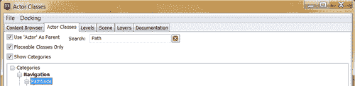

1.  关闭**演员类**浏览器，并在您的关卡中任何地方右键单击。从弹出的菜单中选择**在此处添加 PathNode**。这将创建一个在您点击的位置地面的演员。我已经将我的**PathNode**放置在玩家附近，但仍然在摄像机视图中可见，以便我们的开场序列。

1.  通过点击 UDK 界面主工具栏顶部的**K**图标来打开 Kismet 编辑器。

1.  左键单击并拖动工作空间的背景以移动图形平面，为我们提供一些可以工作的开放空间。

1.  右键点击在背景中的某个位置，并选择 **创建新序列：0 Objs**。应该会弹出一个窗口询问你序列的名称。输入 `EnemyAI` 并按 *Enter*。在右键点击的位置应该会创建一个带有该名称的小框。

1.  双击 **EnemyAI** 序列。你会注意到我们现在已经进入了这个序列，里面没有任何内容，而且我们底部的右侧序列面板中高亮显示的是 **EnemyAI** 序列。这如图所示：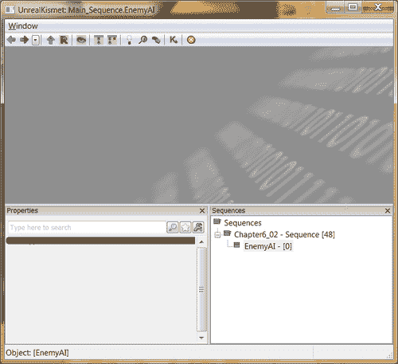

1.  右键点击并在背景中创建一个 **Sequence Activated** 事件，通过菜单选择 **新建事件** | **Sequence Activated**。

1.  通过右键点击并从菜单中选择 **新建动作** | **演员** | **演员工厂** 来创建一个 **演员工厂** 动作。进入属性面板，点击 **工厂** 变量右侧的蓝色三角形，并从弹出的菜单中选择 **UTActorFactoryAI** 以创建一个新的 **演员工厂** 来使用。在我们新工厂的属性中设置 **Pawn 类** 为 **UTPawn**，并勾选 **给予默认库存** 选项。最后，将 **团队索引** 更改为 **1**。

1.  在 **出生点** 变量下，通过右键点击并从菜单中选择 **新建变量** | **外部变量** 来创建一个外部对象变量。左键点击该变量，并在其属性中设置 **期望类型** 为 **SeqVar_Object**，**变量标签** 为 **Spawn Point**。

1.  通过右键点击并选择 **新建动作** | **杂项** | **完成序列** 来创建一个 **完成序列** 动作。在 **输出标签** 属性下输入 `Spawned`。

1.  将 **Sequence Activated "In"** 事件的 **Out** 连接到演员工厂动作的 **Spawn Actor** 输入。将 **Spawn Point** 链接连接到我们创建的外部对象变量。最后，将 **Actor Factory** 的 **Finished** 输出连接到 **Finish Sequence "Spawned"** 动作。此时，我们的序列应该如图所示：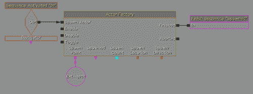

1.  在 Kismet 编辑器的右下角点击 **LevelName** 序列以返回主关卡序列。现在我们应该看到序列看起来类似于一个带有输入、输出和变量链的 Kismet 节点，如图所示：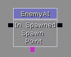

1.  右键点击并在背景中创建一个 **Level Loaded** 事件，通过菜单选择 **新建事件** | **Level Loaded**。

1.  进入我们的关卡，左键点击之前创建的 PathNode，然后返回 Kismet。右键点击我们的出生点链接，并选择 **从 PathNode_0 创建新变量**。这如图所示：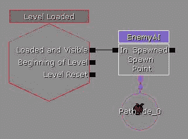

1.  通过选择**构建** | **构建全部**并完成时按关闭来构建我们的游戏。

1.  保存你的项目。现在，如以下截图所示，通过点击主工具栏上的**开始移动预览器**按钮来开始你的游戏：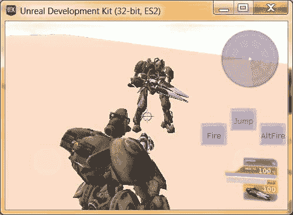

## 刚才发生了什么？

当关卡加载完毕（通过**关卡加载**事件）时，我们调用我们的**EnemyAI**序列，通过**演员工厂**生成一个敌人，并将其放置在我们**PathNode**所在的关卡中。将这些事件和动作放入一个序列中，将使我们能够将与我们 AI 相关的代码放在一个地方，使创建我们未来关卡中的新 AI 尽可能简单。

## 它活过来了！但是...

如你现在所知，我们的演员已经在关卡中，但它实际上并没有做什么。这是因为它缺少**人工智能**（**AI**）。当然，我们可以强制演员使用 UDK 中包含的**Deathmatch** AI，但如果我们有多个 AI，它们会互相战斗。经验丰富的 UDK 开发者可能会意识到，当为 iOS 制作游戏时，你会失去很多功能。例如，如果我们是在 PC 上创建游戏，我可以使用`UTTeamGame`类型，它会处理不攻击玩家以外的演员，但如果使用 iOS 构建，这个功能就会损坏。不要担心，亲爱的读者；我确实有一个解决方案，你将在学习序列和高级 Kismet 的过程中了解到它！

# 行动时间——基础敌人 AI

现在，我们将创建一个基本的 AI，使用 Kismet，并通过我们的序列，我们将能够将此行为附加到我们使用的每个 AI 上。

1.  通过点击 UDK 界面主工具栏顶部的**K**图标来打开 Kismet 编辑器。

1.  通过在**Graph**面板中双击序列或在**Sequences**面板中点击**EnemyAI**文本来进入**EnemyAI**序列。

1.  在**Actor Factory**中的**Spawned**变量下方创建一个外部对象变量，通过右键单击并从菜单中选择**新建变量** | **外部变量**。左键单击变量，在其属性中设置**期望类型**为**SeqVar_Object**，**变量标签**为**Spawned**。

1.  通过右键单击并选择**新建条件** | **是否存活**来创建一个**Is Alive**条件。将**Spawned**变量链接连接到条件下方的**Players**链接。

1.  通过右键单击并选择**新建动作** | **杂项** | **完成序列**来创建一个**Finish Sequence**动作。在**输出标签**属性中输入`Dead`。将**Is Alive**条件的**False**输出连接到**Finish**序列的**In**。

1.  通过右键点击并选择 **New Action** | **Misc** | **Trace** 创建一个 **Trace** 动作。将 **Is Alive** 条件的 **True** 输出连接到 **Trace** 的 **In**。将追踪底部的 **Start** 变量链接设置为之前使用的 **Spawned** 变量。将 **End** 变量链接设置为 **Player 0** 变量（**New Variable** | **Player** | **Player**，不勾选 **All Players**）。在 **Distance** 变量链接下方右键点击并创建一个新的 Float 变量。这如图所示：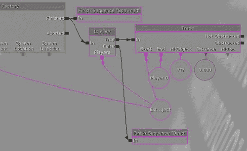

1.  通过右键点击并选择 **New Condition** | **Comparison** | **Compare Float** 创建一个 **Compare Float** 条件。在 **A** 变量链接下方连接我们追踪中的距离变量。在 **B** 下创建一个新的 Float 变量并输入值 `600.`。

1.  通过右键点击并选择 **New Action** | **AI** | **Start Firing At** 创建一个 **Start Firing At** 动作。将 **Target** 变量设置为 Spawned 对象变量，并将 **Fire At** 链接到一个 **Player 0** 对象。将 **Compare Float** 条件的 **A < B** 连接到 **Start Firing At** 动作的 **In**。

1.  通过右键点击并选择 **New Action** | **AI** | **Stop Firing** 创建一个 **Stop Firing** 动作。将 **Target** 变量设置为 Spawned 对象变量。将 **Compare Float** 条件的 **A >= B** 连接到 **Start Firing At** 动作的 **In**。我们将看到如图所示的输出：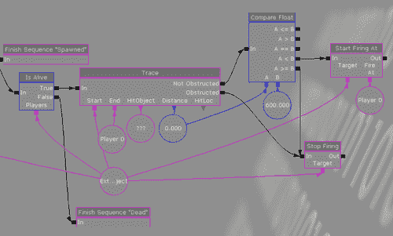

    现在，如果我们的敌人是活着的，我们将在屏幕上执行一个追踪，这将创建一个从演员到玩家的线条，并查看他们之间是否有任何东西会阻断 **视线**（**LOS**）。如果 AI 能看到玩家并且他距离玩家一定距离内，他将开始向他射击。如果有什么东西挡在路上，他将停止射击。当然，现在这只会调用一次。所以一旦发生一次，就不会再次调用。如果玩家从战斗中逃跑怎么办？我们希望敌人追逐玩家。

1.  通过右键点击并选择 **New Condition** | **Comparison** | **Compare Bool** 创建一个 **Compare Bool** 条件。在布尔变量链接下方创建一个具有 **False** 值的 **Bool** 变量。

1.  通过右键点击并选择 **New Action** | **AI** | **Move To Actor** 创建一个 **Move To Actor** 动作。在 **Target** 变量链接下方连接 Spawned 对象。在 **Destination** 下创建一个 Player 变量并将其连接。将 **Compare Bool** 条件的 **True** 输出连接到 **Move To Actor** 动作的 **In** 输入。

1.  通过右键单击并选择 **新建动作** | **切换** | **切换** 来创建一个 **切换** 动作。在 **布尔** 变量链接下，将我们之前创建的布尔变量与值为 `False` 的变量连接起来。将 **Start Firing At** 动作的 **Out** 输出连接到这个 **切换** 动作的 **Turn On** 输入。

1.  通过右键单击并选择 **新建动作** | **杂项** | **延迟** 来创建一个 **延迟** 动作。在 **属性** 面板中，将 **持续时间** 修改为 `0.20`。将 **Toggle** 和 **移动到演员** 动作的 **Out** 以及比较布尔条件输出的 **False** 连接到我们的 **延迟** 动作的 **Start** 输入。将我们的 **延迟** 动作的 **Finished** 输出连接到我们在本节开头创建的 **Is Alive** 条件输入的 **In**。

1.  通过选择 **构建** | **构建全部** 并在完成后按 **关闭** 来构建我们的游戏。

1.  保存你的项目并开始游戏，通过单击主工具栏上的 **开始移动预览器** 按钮如图所示：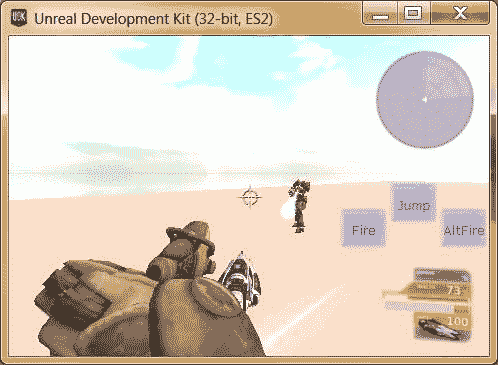

## 刚才发生了什么？

我们现在的敌人会对我们在世界中的行为做出反应！如果我们进入距离敌人 `600` 或更近的位置，并且有清晰的视线，它将开始向我们开火。如果玩家跑得足够远或躲在某个掩护物后面，它将尝试向我们移动。然而，还有很多工作要做。

## 需要改进的地方

与直接跑向玩家位置不同，我们生成的敌人会朝向出生点，或者说最初创建角色的位置，而不是他们当前所在的位置。它将继续跟随我们，直到它可以再次向我们开火。它不应该在一段时间后放弃吗？如果我们从远处开始攻击敌人，玩家将不会做出反应，只会挨打。有了这个基础，我们现在可以扩展我们的 AI，使其更加健壮。

# 是时候进行基础敌人 AI 的操作了

现在，我们将使用 Kismet 创建一个基本的 AI，并使用我们的序列，我们将能够将此行为附加到我们使用的每个 AI 上。

1.  进入 **演员类** 浏览器 **视图** | **浏览器窗口** | **演员类**。从那里，您将看到我们可以放置在我们关卡中的类列表。在 **搜索** 框中输入 `Path` 并左键单击 **PathNode_Dynamic** 选择项。以下截图显示了这一点：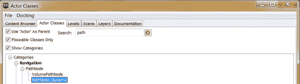

1.  关闭 **演员类** 浏览器，并在你的关卡中任何地方右键单击。从弹出的菜单中选择 **在此处添加 PathNode_Dynamic**。这将创建一个在点击位置地面的演员。将其放置在玩家出生点附近。

1.  通过单击 UDK 界面主工具栏顶部的 **K** 图标来打开 Kismet 编辑器。

1.  通过在 **图** 面板中双击序列或单击 **序列** 面板中的 **EnemyAI** 文本来进入 **EnemyAI** 序列。

1.  通过按住*Alt*并点击黑色方块来删除连接到**延迟**动作的**开始**输入的连接。左键点击**延迟**动作，按住*Shift*并将其拖到右侧，为我们新增的内容腾出空间。

1.  选择**移动到演员**动作及其附加变量，通过按住*Ctrl* + *Alt*并左键点击**移动到演员**动作稍上方和左侧，然后拖动直到你创建的框覆盖所有我们想要移动的项目。或者，按住*Ctrl*并点击每个项目。将对象移动到**延迟**位置旁边。删除**移动到演员**动作的**输入**连接，并将**移动到演员**动作的**输出**连接到**延迟**动作的**开始**。将我们的**切换**动作的**输出**连接到**延迟**动作的**开始**。

1.  通过右键点击并选择**新建条件** | **条件** | **比较浮点数**，在**比较布尔值**动作旁边创建一个**比较浮点数**条件。将**比较布尔值**条件的**真**连接到这个**比较浮点数**的**输入**。将**比较布尔值**的**假**输出连接到**延迟**动作的**开始**输入。在我们的**比较浮点数**动作的**A**和**B**部分都创建一个浮点变量。在**A**浮点变量内，创建一个注释说**timeSinceCaught**，值为`0.0`。将**B**变量设置为`2.0`。我在这个部分试图实现的是，如果 AI 追逐玩家并且经过一段时间后，它会放弃并停在原地。

1.  通过右键点击并选择**新建动作** | **数学** | **添加浮点数**来创建一个**添加浮点数**动作。将**添加浮点数**动作的**A**和**浮点结果**变量连接到我们放置注释说**timeSinceCaught**的浮点变量，该变量连接到我们的**比较浮点数**的**A**链接。将我们的**比较浮点数**的**A < B**输出连接到我们的**添加浮点数**动作的**输入**。在**B**下方创建一个值为`0.2`的浮点变量。以下截图显示了这一点：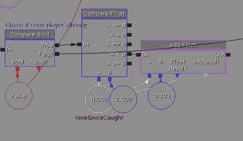

    由于这个动作每 0.2 秒被调用一次（由于我们的延迟），如果自我们第一次看到玩家后开始追逐玩家已经不到 2 秒，我们就将 0.2 加到计数器上。如果我们已经等待了 2 秒或更长时间，我们该怎么办？这就是我们接下来要做的。

1.  在我们刚刚创建的**添加浮点数**动作下方添加一个**设置浮点数**动作，使用**新建动作** | **设置变量** | **浮点数**。创建一个新的浮点变量，值为`0.0`，并将其连接到**目标**变量和**timeSinceCaught**浮点变量。将**比较浮点数**条件的**A >= B**输出连接到我们的**设置浮点数**动作的**输入**。

1.  通过右键点击并选择**新建动作** | **切换** | **切换**来创建一个**切换**动作。在**布尔**变量链接下方连接我们之前创建的**布尔**变量与**False**值。将**设置浮点数**动作的**输出**连接到这个**切换**动作的**关闭**输入。

1.  通过使用**新建动作** | **对象属性** | **修改属性**来创建一个**修改属性**动作。转到**属性**面板，在**属性**变量旁边的绿色**+**符号上左键点击，以创建一个新属性进行更改。点击左侧的黑三角以展开选项。在**属性名称**属性中输入`bLockLocation`。点击**修改属性**复选框。最后，在**属性值**部分输入`1`。这如图所示：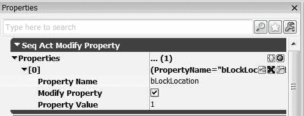

    **bLockLocation**变量是我们**演员**类中的一个**布尔值**，它将阻止演员被移动。当值不为 0 时，**布尔值**将值视为真，这将冻结我们的 AI，直到我们将值设置回 0。请注意，UDK 将给我们一个关于使用**修改属性**动作的警告，但因为我们不会在我们的项目中使用 UnrealScript，所以这将是可以的。

1.  将**切换**动作的**输出**连接到我们的**修改属性**动作的**输入**。将**目标**连接到**已生成**外部变量。将**修改属性**动作的**输出**连接到最右侧的**延迟**动作的**开始**上。

1.  在步骤 8 中创建的**添加浮点数**旁边创建一个**修改属性**动作，使用**新建动作** | **对象属性** | **修改属性**。转到**属性**面板，在**属性**变量旁边的绿色**+**符号上左键点击以创建一个新属性进行更改。点击左侧的黑三角以展开选项。在**属性名称**属性中输入`bLockLocation`。点击**修改属性**复选框。最后，在**属性值**部分输入`0`。将**添加浮点数**动作的**输出**连接到我们新的**修改属性**动作的**输入**。

1.  返回到编辑器并确认已选择**PathNode_Dynamic_0**。

1.  在 Kismet 中创建一个**获取位置和旋转**动作，**新建动作** | **演员** | **获取位置和旋转**。通过创建一个玩家对象变量将**目标**变量设置为**玩家 0**。在**位置**链接下方右键点击并选择**创建新向量变量**。

1.  在**移动到演员**动作下删除**玩家**变量，并在**目的地**变量下右键点击，选择**使用路径节点 _Dynamic_0 新建对象变量**。创建一个**设置演员位置**动作**新建动作** | **演员** | **设置演员位置**。将**位置**变量链接连接到我们在上一步创建的位置。将**设置演员位置**动作的**目标**连接到**移动到演员**的**目的地**变量链接。

1.  在**Trace**动作上方，通过右键点击并选择**新建事件** | **演员** | **受到伤害**创建一个**受到伤害**事件。在**属性**面板中将**最大触发次数**设置为`0`。将**发起者**连接到**已生成**对象。将**输出**连接到**开始射击**动作的**输入**。

    这样做将使得如果玩家决定从远处攻击某人，敌人将以某种方式追逐玩家做出反应。最后我们会看到以下类似的截图：

    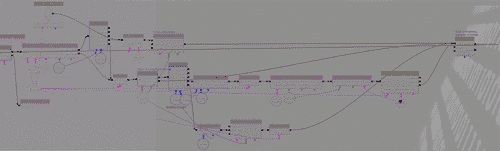

1.  返回到编辑器窗口，点击上一章中创建的**门**。通过按*F4*键打开其属性，并在搜索框中输入`path`。你会看到一个值为**路径碰撞**的复选框被选中。取消选中它。取消选中**路径碰撞**值让编辑器知道 AI 可以穿过门，因为它会将该区域视为开放，即使我们那里有门。如果你打算不允许敌人使用门，那么你需要确保这个选项被选中。

1.  通过选择**构建** | **构建全部**并完成时按**关闭**来构建我们的游戏。

1.  保存您的项目并开始游戏，通过在主工具栏上点击**开始移动预览器**按钮，如图所示：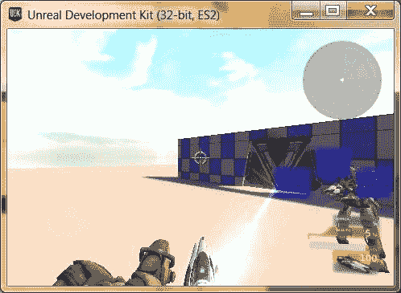

## 刚才发生了什么？

我们为 AI 的常规程序注入了更多的活力；现在它们以更可信的方式对我们做出反应，并且对于我们在项目中的工作来说已经足够好了。现在敌人会追逐你一段时间，然后放弃，如果你从任何地方攻击他们，他们会对你做出反应。我们还接触到了更高级的 Kismet 脚本，展示了我们如何根据世界中的事件来操纵游戏环境。

## 英雄尝试——将你的 AI 进一步发展

你可以为你的 AI 添加很多其他东西，比如根据玩家与它们之间的距离（在*基础敌人 AI*部分讨论了**Trace**动作的距离），设置不同的状态。目前，只要**timeSinceCaught**变量小于 2.0，`PathNode_Dynamic`就设置为你的实际位置。你可以让它只知道你在那个点的位置（只设置一次位置）。你可以使用**Bool**（真/假语句）变量红色作为检查它是否已经设置的一种方式。

你还可以做的一件事是使用**Timer**（**Action** | **Misc** | **Timer**）而不是使用浮点比较和加法，根据需要切换定时器的开关，为你的工具箱添加一个额外的工具。

## 导出子序列

在设置了一个有用的子序列，例如我们创建的**EnemyAI**事件之后，我们可能希望在不同关卡之间共享它。做到这一点的一种方法就是复制/粘贴；但如果我们想与其他开发者/设计师或在不同电脑上共享我们的序列呢？我们可以对序列做的酷炫事情之一就是导出它们，这样我们就可以像放置网格或**Actor Classes**一样将它们放置在我们的关卡中。但需要注意的是，当序列被导入时，它将删除对创建的关卡内对象的全部引用，因此为了这个原因，为项目使用外部变量是至关重要的，以确保序列按我们希望的方式执行。

# 执行动作——创建第二个敌人

在这一点上，保存我们的**EnemyAI**子序列是一个好主意，因为我们将在最终关卡中使用它。由于这是我们第一次将内容导出到内容编辑器，我会非常仔细。

1.  进入**Actor Classes**浏览器，选择**View** | **Browser Windows** | **Actor Classes**。从那里，你将看到我们可以放置在我们关卡中的类列表。在**Search**栏中输入`Path`，然后左键单击**PathNode**选择。

1.  关闭**Actor Classes**浏览器，在上一章创建的门前面右键单击。从弹出的菜单中选择**Add PathNode Here**。选择**PathNode**，按住**Option**并拖动对象到门后面，创建一个副本。

1.  通过点击 UDK 界面主工具栏顶部的**K**图标打开 Kismet 编辑器。

1.  右键单击我们的**EnemyAI**子序列，并选择**Export Sequence to Package**。这将在以下屏幕截图中显示：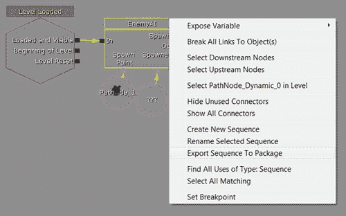

1.  将会出现一个提示，要求输入你的对象的包、组和名称。在**Package**中输入`UrbanWarrior`，在**Group**中输入`Sequences`，在**Name**中输入`EnemyAI`。

1.  打开**Content Browser**，在**Packages**下方的**Search**栏中输入`urban`。你应该会看到你的包出现在顶部，你的序列作为第一个选中的项目。

1.  右键单击包（它旁边应该有一个*****），然后单击**保存**。如图所示：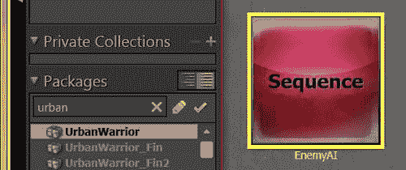

1.  在玩家所在位置的**EnemyAI**序列上左键单击并打开 Kismet 编辑器。移动到**EnemyAI**序列的左侧，右键单击并选择**导入 EnemyAI 序列**。

    你可能看不到任何变化，但这是有充分理由的。

1.  在**EnemyAI**子序列上左键单击，并按住*Alt*键将其拖动到左侧。你会注意到我们导入的新子序列与导出时的位置相同。

1.  在玩家所在位置的**PathNode**上左键单击并返回 Kismet。在**Spawn Point**下方，右键单击并选择**使用 PathNode_2 Here 创建新对象变量**。为**Spawned**变量链接创建一个新的**Object**变量。将第一个**EnemyAI**序列的**Dead**输出连接到这个**EnemyAI**的**In**输入。

1.  通过右键单击并选择**新建动作** | **AI** | **移动到演员**创建一个**Move To Actor**动作。在**Target**变量链接下连接**Spawned**对象。在**Destination**下将其连接到门前的**PathNode**。将**EnemyAI**子序列的**Spawned**输出连接到**Move To Actor**动作的**In**输入。我们将看到如图所示的输出：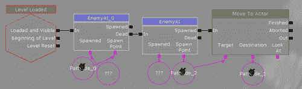

1.  通过选择**构建** | **构建全部**并完成时按**关闭**来构建我们的游戏。

1.  通过在主工具栏上单击**开始移动预览器**按钮保存你的项目并开始游戏，如图所示：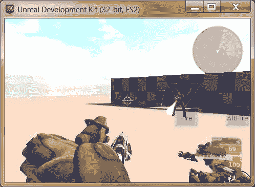

## 刚才发生了什么？

世界正变得越来越动态。通过使用导入的子序列，我们使得如果我们的第一个敌人死亡，第二个敌人会孵化并冲进门去看看发生了什么。

## 远程事件

如前一个我们创建的序列所示，Kismet 可能会变得相当复杂，随着时间的推移可能会变得相当混乱。一个可能的解决方案是使用**远程事件**来停止连接四处蔓延。类似于我们的**Level Loaded**或**Player Spawned**事件，每次我们通过**激活远程事件**Kismet 动作激活远程事件时，都会调用与之连接的动作和条件。

### 当我们可以使用远程事件时

远程事件听起来相当神奇，但并不总是可以使用。每个远程事件都需要一个特定的名称，如果存在多个相同远程事件的版本，UDK 会感到困惑。这也是为什么我们不能有同名变量。如果你打算为多个对象重复使用相同的序列，则不能使用它们。

### 创建远程事件

要创建**远程事件**，你可以在 Kismet 的**图形**面板中右键单击，然后选择**新建事件**|**远程事件**。创建事件后，进入其**属性**，在**事件名称**变量中输入一个唯一的标识符。当你想要调用与远程事件关联的动作时，只需创建一个**激活远程事件**动作：**新建动作**|**事件**|**激活远程事件**，然后在**属性**面板中找到变量**事件名称**并将其设置为相同的标识符。这如下面的截图所示：

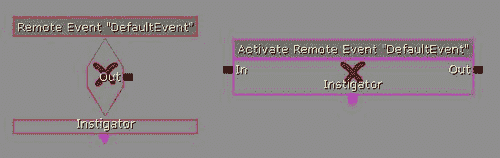

## 命名变量

在编程中，存在全局变量的概念。**全局变量**是你在游戏中的所有时间都希望拥有的东西；例如，玩家的金币或当前生成的敌人数量。如果这是一些你经常使用的数据，这会非常有用。**命名变量**基本上是 Kismet 的全局变量版本；然而，它们仅在当前加载的水平面上是全局的。

### 我们何时可以使用命名变量

**命名变量**，就像远程事件一样，需要具有唯一的名称，这就是为什么我们在**EnemyAI**序列中用注释代替变量名来命名**timeSinceCaught**变量的原因。拥有命名变量的好处是，我们不必每次都创建到单个变量的链接，就像我们在**EnemyAI**序列中使用的**Spawned**外部变量那样，我们只需创建新的命名变量来连接它，从而使我们的脚本更加有序。

### 创建命名变量

要创建一个命名变量，你可以在 Kismet 的**图形**面板中右键单击，然后选择**新建变量**|**命名变量**。创建变量并进入其属性后，你可以设置期望的类型，并在**查找变量名**属性下填写变量名。

如果一切顺利，你将看到其位置上有一个绿色的勾选标记，如下面的截图所示：

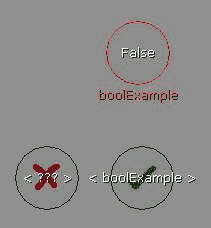

## 操作玩家

我们已经以这种方式创建了一些动作，这些动作将与我们将要放置在游戏世界中的 AI 一起工作，但游戏中还有一件事比这更重要，我们还没有着手处理：玩家！在用 UnrealScript 编写之前，通常会在 Kismet 中测试添加新的游戏类型或新的机制，这使得迭代变得容易得多。确保机制是**有趣且引人入胜的**。现在我们有了可以射击的目标和一些智慧，让我们给玩家添加一个新的机制。

# 行动时间——随时间恢复玩家生命值

在*Halo*中流行起来，并在*Gears of War*和*Batman: Arkham City*等热门游戏中出现，恢复生命值是现代游戏中的一个主要元素，出现在许多*游戏中*，并且会一直存在。令人惊讶的是，在 Kismet 中实现它并不困难，你可能会注意到我们在这里使用的行为与我们之前所做的一些重叠。

1.  打开 Kismet 编辑器并输入我们的主序列，拖动屏幕直到你有大量的空白空间。

1.  通过选择**New Event** | **Remote Event**来创建一个远程事件。在**Properties**面板中，将**Event Name**变量设置为`RegenHealth`。

1.  在远程事件上方，通过右键点击并选择**New Event** | **Level Loaded**来创建一个**Level Loaded**事件。

1.  在**Level Loaded**事件的右侧，通过右键点击并选择**New Action** | **Event** | **Activate Remote Event**来创建一个**Activate Remote Event**动作。在**Properties**面板中找到变量**Event Name**并将其设置为`RegenHealth`。

    注意，**Activate Remote Event**和远程事件**RegenHealth**可能仍然有一个大红色的**X**。这可能是因为拼写错误，或者序列没有被刷新。如果你退出并再次进入 Kismet，你将看到这两个对象旁边都有一个绿色的勾号，如图所示：

    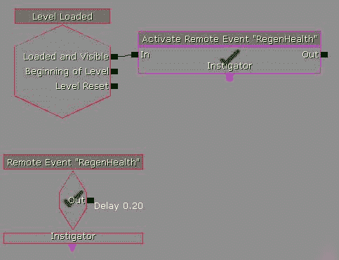

1.  在远程事件**RegenHealth**的右侧，通过右键点击并选择**New Action** | **Object Property** | **Get Property**来创建一个**Get Property**动作。在**Properties**面板中，将**Property Name**变量设置为`Health`。在**Target**变量链接下方创建一个**Player 0**对象变量。在**Int**变量链接下方，通过右键点击并选择**Create New Int Variable**来创建一个新的**Int**变量。

    在**Pawn Class**中的**Player**的 UnrealScript 文件内部存在一个名为**Health**的整数，它存储玩家的生命值。**Get Property**动作允许我们查看我们的目标中包含的值，如果它包含该变量。

1.  通过右键点击并选择**New Condition** | **Comparison** | **Compare Int**来创建一个**Compare Int**条件。在**A**变量链接下方连接我们**Get Property**中的**Int**变量。在**B**下方创建一个新的**Int**变量并设置值为`100`。将**Get Property**动作的**Out**连接到**Compare Int**条件的**In**输入。

    基本上，我们将比较我们的**Health**是否低于**100**（目前它能达到的最大值）。

1.  通过使用 **新建动作** | **对象属性** | **修改属性** 来创建一个 **修改属性** 动作。转到 **属性** 面板，在 **属性** 变量旁边的绿色 **+** 符号上左键单击以创建一个新属性进行更改。单击左侧的黑三角以展开选项。在 **属性名称** 属性中输入 `Health`。单击 **修改属性** 复选框。最后，在 **属性值** 部分输入 `100`。在 **目标** 变量链接处放置一个 **Player 0** 对象。将 **Compare Int** 条件的 **A >= B** 连接到我们刚刚创建的 **修改属性** 的 **In** 输入。

1.  通过右键点击并选择 **新建条件** | **比较** | **比较浮点数** 来创建一个 **比较浮点数** 条件。在 **A** 变量链接下创建一个新的 **浮点数** 变量，并赋予其值为 `0.0`，**变量名** 为 **TimeSinceDamaged**。在 **B** 下创建一个新的 **浮点数** 变量，其浮点值为 `2.0`，**对象注释** 为 **TimeSinceLastDamaged**。将 **Compare Int** 条件的 **A < B** 输出连接到这个 **比较浮点数** 条件的 **In** 输入。

1.  通过使用 **新建动作** | **设置变量** | **浮点数** 来添加一个 **Set Float** 动作。为 **值** 链接创建一个新的浮点数，其值为 `0.0`。

1.  创建一个具有 **预期类型为 SeqVar_Float** 和 **查找变量名为 TimeSinceDamaged** 的命名变量，并将 **Set Float** 动作的 **Target** 变量链接连接到它。将 **Modify Property** （**健康**）的 **Out** 连接到我们的 **Set Float** 动作的 **In** 输入。

1.  创建一个 **激活远程事件** 动作 **新建动作** | **事件** | **激活远程事件**，并在 **属性** 面板中找到变量 **事件名称** 并将其设置为 **RegenHealth**。将我们的 **Set Float** 动作的 **Out** 输出连接到我们的 **激活远程事件** 变量 **RegenHealth**。这如图所示：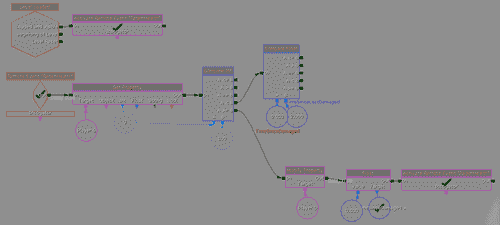

1.  创建一个 **修改健康** 动作 **新建动作** | **演员** | **修改健康**。在 **目标** 变量链接下创建一个 **Player 0** 对象变量。在数量创建一个 **浮点数** 变量，其值为 `1.0`。在 **属性** 面板中勾选 **治疗** 复选框，并将我们的 **Compare Float** 条件的 **A >= B** 连接到这个动作的 **In**。

    你可能会注意到我们没有使用 **修改属性**，就像我们在上一个例子中做的那样；这只是为了向你展示在 Kismet 中经常有多种方式做完全相同的事情，通过实验你可以发现所有 sorts of things 你可以做到。

1.  复制 (*Ctrl* + *C*) 并粘贴我们之前创建的 **激活远程事件** 变量 **RegenHealth**。将动作拖动到刚刚创建的 **修改生命值** 动作的旁边。通过按住 *Alt* 键并左键单击删除此动作与其 **In** 输入的连接。复制并粘贴另一个移除了 **In** 的动作，并将其放在这个动作的上方。将我们的 **修改生命值** 的 **Out** 连接到旁边的动作。

1.  通过右键单击并选择 **新建动作** | **数学** | **添加浮点数** 来创建一个 **添加浮点数** 动作。将 **添加浮点数** 的 **A** 和 **浮点结果** 变量连接到具有 **TimeSinceDamaged** 值的命名变量，就像我们在第 10 步中做的那样。将我们的 **比较浮点数** 的 **A < B** 输出连接到我们的 **添加浮点数** 动作的 **In**。在 **B** 下方创建一个值为 `0.2` 的 **浮点数** 变量。最后，将此 **添加浮点数** 的 **Out** 输出连接到我们在上一步中创建的额外 **激活远程事件** 变量 **RegenHealth**。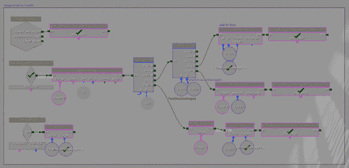

1.  保存你的项目，并点击主工具栏上的 **开始移动预览器** 按钮来开始你的游戏，如图所示：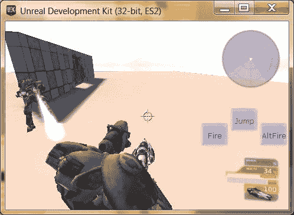

## 刚才发生了什么？

通过静态图像你可能看不出来，但我们又迈出一步，离拥有一个功能齐全的游戏更近了，这得益于一个令人惊叹的恢复生命值系统的加入。当我们的生命值不是最大值时，我们会等待一段时间，如果我们在这段时间内没有被击中，我们的生命值会随着时间的推移慢慢增加。我们还获得了如何使用命名变量、在 Kismet 中获取和设置对象属性以及使用远程事件的经验。

## 英雄试炼——随时间恢复玩家生命值

使用这个基础系统，你可以做很多事情来扩展其功能。通过将恢复速度设置得比你的低生命值更快，可以轻松地做类似 *Halo* 的护盾恢复，在 **修改生命值** 动作下更改浮点值。你也可以通过一些修改使用相同的序列，使其变成一个如果你在其中花费太多时间就会对你造成伤害的东西，就像在 *Sonic: The Hedgehog* 中的水一样。

## 预制件

在构建关卡时，你通常会创建一些演员和相关的 Kismet 安排，然后在同一关卡或其他关卡中重用这个集合，就像我们创建的门一样。预制件允许你创建一个对象一次，然后将其保存为预制件包。你可以在关卡中多次选择 **预制件** 并添加它。

注意，预制件可能会在 UDK 中引起问题，并且可能在没有明显原因的情况下损坏和/或停止工作，所以请确保一切正常后经常保存。

# 行动时间——门预制件

目前我们只有一个门，虽然它是一个很棒的门，但我们可能希望在游戏中有多于一个。为了使其更容易在新区域的游戏中使用和放置，让我们制作一个门预制对象！

1.  在 Kismet 中，转到我们在上一章中编写的门行为。按住 *Alt+Ctrl* 并从对象的左上角拖动到底部，以选择用于创建的所有项目。右键单击并选择 **创建新序列**。在以下菜单中命名序列为 `Door`。这如图所示：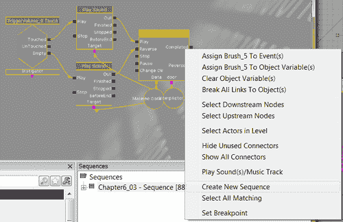

1.  类似地，在常规编辑器窗口中，选择用于创建我们的门的所有对象，包括围绕它的墙壁和用于其创建的触发体积。右键单击并选择 **创建预制对象**。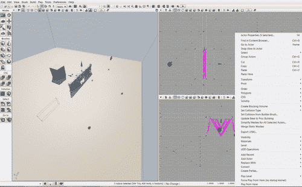

1.  在 **包** 下创建的弹出窗口中，使用名称 `UrbanWarrior`，并在 **名称** 中使用 `Door.`。

1.  另一个弹出窗口将出现，告诉你它检测到一个使用此预制对象项目的 Kismet 序列，并询问我们是否希望它成为预制对象的一部分。点击 **是**。

    注意，一个预制对象只能关联一个序列，你不能使用主序列作为使用该预制对象的序列。与之前导出/导入的子序列不同，这些对象在序列中将具有与预制对象内新创建的副本相对应的变量链接，这是一件非常巧妙的事情。

1.  最后，弹出窗口将询问你是否想将你的门转换为预制对象的实例；这是一个好主意，所以点击 **是**。你现在会注意到门旁边有一个红色的 **P** 符号，这让我们知道它是一个预制对象。

1.  左键单击预制对象，并在沿轴拖动时按住 *Alt* 键，以在基点外一定距离处创建门的副本。当你拖动时，你应该会看到第二个预制对象被创建并移动，同时在这个过程中制作了另一扇门。

1.  由于在运行时无法渲染 BSP 的更改，墙壁在透视视图中不会显示，直到你构建游戏。

1.  通过选择 **构建** | **构建所有** 并在完成后按 **关闭** 来构建我们的游戏。

1.  保存你的项目并开始你的游戏，通过在主工具栏上单击 **开始移动预览器** 按钮，当它询问你保存包时说 **是**。以下截图显示了修改后的视图：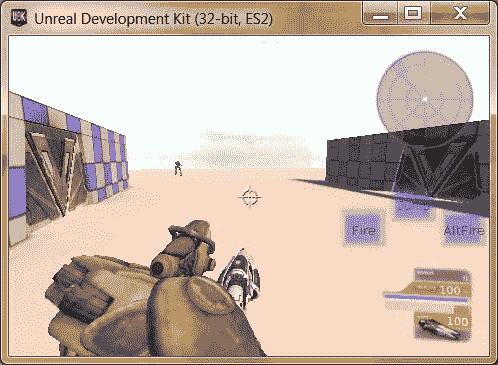

## 发生了什么？

我们现在已经快速简单地在我们关卡内创建了一个第二个门。我们之前门中包含的功能仍然存在，允许我们通过它们中的任何一个相当容易地进入和退出，包括声音效果等。使用预制对象，制作新门将变得非常简单，而且由于它们不必相同（如 Unity），我们可以更改每个预制对象的任何内容，而不用担心它将如何影响其他对象。

## 构建战斗序列

作为一个喜欢玩游戏的人可以证明，在游戏过程中总有一些时刻会脱颖而出。我们也玩过一些游戏，感觉就像是在走廊里一个接一个地走，几乎没有令人兴奋的事情发生，游戏变得无聊。制作一个令人满意的战斗体验是每个设计师都力求做到的事情，以下是我提出的一些关于如何做到这一点的建议。

## 布局

> 没有准备，就是准备失败。 —— 本杰明·富兰克林

一个好的布局是你创建关卡坚实基础的基石，因此，在开始创建关卡时，这可能是最重要的考虑因素之一。这也是为什么游戏项目的前期制作如此重要的众多原因之一。虽然这可能与你最初的思考相反，但直接进入编辑器尝试制作东西并不是一个好主意。虽然偶尔你可能会偶然发现一些东西，但如果你事先规划，最终生成的关卡会好得多。这并不是说你在前期制作的计划会与你计划的一模一样。在规划布局时，要确保它一眼就能看懂。在创建动作时，保持动作在玩家的**视野**（**FOV**）内。

你可能已经注意到，在我们当前的布局版本中，当门生成时，它不在玩家的视野中，这使得玩家不清楚在游戏中应该继续往哪里走。这发出了混乱的信号，这从来都不是好事。

## 生成和敌人放置

当然，拥有一个出色的布局是好事，但如果环境中没有可做的事情，玩家很快就会感到无聊，因此我们生成对手来面对他们。敌人必须在玩家视线之外生成，这一点非常重要，因为如果玩家突然看到敌人从无到有地出现，会突然打破他们应该感受到的不信感，除非当然，这是敌人的一种能力，比如《生化奇兵》中的 Houdini 拼接者。

当然，我们也不总是想让我们的敌人保持静止；这就是为什么我们经常让敌人沿着路径行走，或者从一个区域进入。这种移动应该给我们的玩家一个视觉提示，就像现实世界一样，通常有理由解释为什么某物会出现在某个地方。如果你的游戏有潜行元素，玩家可能会等待看到敌人路径中出现的模式，以避免冲突。如果你的游戏是动作射击游戏，玩家很可能会前往他们看到事物出现的地方。另一个需要注意的事情是了解你引擎的限制，尤其是在移动游戏空间中工作，因为移动平台在生成敌人时对硬件的要求更高。

## 环境

精美的艺术作品固然美丽，但它无法弥补糟糕的设计。对于像我这样的艺术人士来说，在完成作品之前就开始打磨某个区域，很容易陷入这种陷阱。在进行预生产并设计布局后，首先使用 BSP 添加式刷子构建你的关卡。在这个阶段，关卡的重点是创建一个有趣的环境，并且与我们要关卡发生的环境有某种相似之处。重要的是尽我们所能，利用我们想要的玩法类型。例如，我们可以给玩家提供躲避敌人的地方，让他们能够进行射击，这样玩家就会觉得自己很聪明，因为他们比敌人更聪明。

作为设计师，你可以做的最重要的事情之一是赋予玩家权力，因为他们不是你的敌人，他们是你的最好的朋友，最终是给你发薪水的人，所以尊重他们是重要的。除了实际的物理环境之外，环境的光照可以以多种方式影响玩家。主要来说，光线将注意力引向事物，并引导玩家向其移动。黑暗和未知是玩家感到不舒服的区域，而且不如其他区域明亮的光线增加了该区域可能具有的威胁感。*单碑*的《恐惧》就做得相当不错，它将一个普通的日常办公室变成了一个充满紧张和危险的地方，即使你全副武装，装备齐全，可以应对任何可能发生的事情。

## 脚本

敌人的放置和生成与敌人本身的行为一样重要，如果敌人不做任何事情，游戏很快就会变得乏味。我们已经为敌人可能对敌人做的事情创建了一个基本的 AI，并且有很多方法可以在此基础上扩展，并基于游戏中的情况创造独特的情况。在开阔的大区域中，只要玩家做出类似智能的行为，事情似乎就会顺利进行，尽管我们的 AI 有限，但可以很好地发挥作用。一般来说，环境越紧凑，你就越想手动编写敌人的行为。

侧翼包抄是一种行为，敌人能够从目标两侧或后方接近，使其措手不及。在游戏中，侧翼包抄既有好的一面也有不好的一面。如果做得好，它可以促使玩家即兴发挥，感受到一阵兴奋。然而，如果做得不好，会让玩家认为 AI 在作弊，并导致玩家对这次遭遇产生反感。如果你决定实施侧翼包抄，请等待并让玩家进入区域后再尝试侧翼包抄，并让第一枪打偏，让玩家注意到枪声的来源，以便他们调整。

设计师可以利用的另一项工具是环境中的波浪概念，在不同的时间点生成不同的敌人，以延长游戏时间和特定区域的时间。然而，每一波都应该独特，否则玩家会很快感到无聊。“地牢守护者”通过随着时间的推移逐渐增加难度，确保事情不会变得无聊，做得很好。

请记住你波浪和遭遇的难度，并修改你可以修改的元素，以便在每个遭遇中调整难度，同时也给玩家一个机会偶尔休息一下，反思自己变得多么强大。

## 测试

在我看来，游戏设计师是玩家的代言人，在这个角色中，他们的主要责任是制作出目标受众会喜爱的游戏。正因为如此，测试玩家是游戏设计师最好的朋友。他们是普通人将如何对你的游戏做出反应的代言人，因此，认真对待他们的话是非常重要的。他们也是那些会找到并利用他们能触及到你游戏世界中的任何东西的人，你也会发现你从未想过可能在你游戏中出现的事情。他们会提出建议，而是否采纳这些建议将由你决定，这些改变是否真的值得拥有。

在没有你的输入的情况下，让其他人玩你的游戏也非常重要。大多数设计师认为他们已经涵盖了玩家可能做的每一件事，但几乎可以肯定的是，有些事情已经被遗忘了。在关卡设计中，重要的是要看到玩家会走向哪个方向，以及他们是否被正确引导。

# 摘要

我们现在已经拥有了创建游戏所需的所有部件，并在过程中学到了很多东西。通过使用本章给出的相同原则，我们可以扩展并创建许多不同类型的敌人和行为。

在这个短暂的时间内，我们设法覆盖了很多内容。我们特别学习了以下主题：

+   顺序是什么以及我们如何使用它们

+   如何在我们的关卡中生成敌人

+   我们可以做什么来开发一个基本的 AI 系统，如果我们在它附近，它会向我们射击

+   如何通过添加追逐和撤退行为来扩展该系统

+   如何使用导入/导出子序列创建额外的敌人

+   如何使用远程事件实现恢复生命值

+   预制件是什么以及我们如何在项目中使用它们

+   如何制作门预制件

+   创建战斗场景时需要考虑的事项

现在我们已经学会了如何构建我们将需要实现游戏的所有基础元素。

在下一章中，我们将把这些部件组合起来，通过讨论使用**几何模式**创建关卡的工作流程，如何使用模块化部件快速创建我们的关卡，以及关于在
