# 第八章：发布和盈利你的游戏

> 我们现在已经完成了游戏的状态，拥有一个功能齐全的关卡，并且我们在电脑上进行了测试和改进，但总有一天你会想要将游戏放到你的 iOS 设备上。本章将全部关于这一点：首先在我们的 iOS 设备上运行游戏，然后一直发布到 App Store。

在本章中，我们将：

+   了解将你的游戏放到 iOS 设备上的流程

+   在你的 iOS 设备上部署游戏的流程

+   当从我们的设备或 App Store 查看时，自定义我们的游戏图标

+   讨论测试流程，并学习如何进行自己的测试会话

+   讨论 Epic Games 为 UDK 开发的 iOS 游戏所实施的当前版税模式

+   学习如何将 Game Center 链接到我们的游戏中，以获得更丰富的社交体验

+   探索使用游戏内广告进行盈利

+   通过 iTunes 商店上传游戏的流程

这需要处理很多东西，所以至少我会给你一个概述，介绍最常用的选项以及 UDK 如何使事情发生。所以，让我们开始吧！

# 在魔法发生之前

很快我们将在你的设备上运行你的游戏，这将非常棒，但在我们达到那个点之前，我们首先需要确保几件事情。首先，你需要拥有一台 iOS 设备（我们假设你已经有），以便首先进行测试。你需要为你的游戏设置配置，我们将在后面讨论，最后，你还需要有一个开发者账户，我们首先会讨论这一点。

## 注册为 iOS 开发者

为了使用 UDK 将游戏放入 App Store，你必须首先注册为 iOS 开发者。这个过程相对简单，然而，在撰写本文时，苹果对开发者身份的特权每年收费 99 美元。如果你在任何时候让你的订阅结束，你创建的所有应用也将被删除。如果你还不是开发者，你需要注册[`developer.apple.com/programs/ios/`](http://https://developer.apple.com/programs/ios/)。

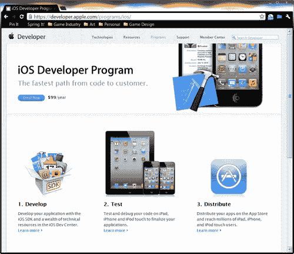

在那个页面上，你会看到一个写着**立即注册**的按钮。从那里开始，苹果已经做得很好，通过填写信息和遵循菜单，使其尽可能简单。完成之后，你将拥有一个开发者账户。

## 设置配置

为了在 iOS 设备上测试游戏，您需要拥有正确的密钥、证书和移动配置文件生成，这被称为 **配置**。苹果要求运行任何应用的任何设备都必须设置配置文件。**Unreal iOS 配置向导**使设置配置过程变得更容易，尽管它仍然需要使用苹果开发者网站上 iOS 配置门户的某些方面。

# 开始行动时间——创建新的配置

为了将我们的游戏安装到我们自己的 iOS 设备上，我们需要创建一个配置文件。考虑到这一点，让我们开始吧！

1.  通过 USB 将您的 iOS 设备连接到您的计算机。确保您的设备上有足够的空间安装游戏。

1.  在 **移动预览器** 按钮的左侧，您应该看到一个看起来像带有向上红色箭头的移动设备的图标。如果您是第一次这样做，**Unreal iOS 配置向导** 应该会弹出。

    如果由于任何原因它没有出现，您也可以在 UDK 安装目录中的 `\Binaries\IPhone` 文件夹内找到它，文件名为 `IPhonePackager.exe`。您也可以从 **Unreal 前端** 运行它，但这将在本章的后面讨论。这在上面的屏幕截图中显示：

    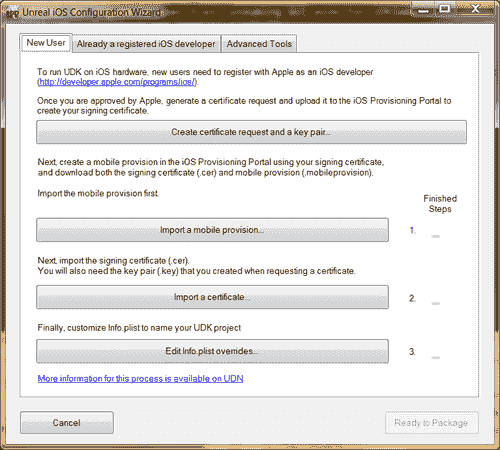

1.  从菜单中点击 **创建证书请求和密钥对...** 按钮，以打开一个新菜单。填写所需的信息，确保在 **电子邮件地址** 字段中使用您注册为 iOS 开发者的电子邮件，并在 **通用名称** 字段中使用您的名字和姓氏或公司名称。当您完成时，您会注意到绿色勾选标记出现，如下面的屏幕截图所示：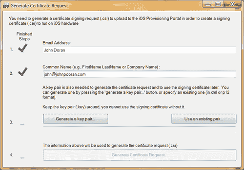

1.  点击 **生成密钥对...** 按钮，以创建密钥对文件。这将打开一个文件保存对话框，允许您在已知文件夹中保存文件。由于这对于您所有的项目都是相同的，所以将其放置在您的 UDK 安装文件夹中，例如 `C:\UDK\Developer Files` 是一个好主意。

1.  之后点击 **生成证书请求** 按钮，这将为您创建一个文件以保存。将其保存在您之前创建的同一目录中。

    虽然这种方法现在可以让我们在自己的 iOS 设备上运行游戏，但当我们想要在 App Store 上发布应用时，我们需要将证书文件导入到 Mac 计算机的密钥链中。

    ### 小贴士

    以下步骤假设您使用 Firefox 或 Safari 作为您的网络浏览器。虽然使用其他浏览器可能也能正常工作，但如果您遇到问题，我会使用这两种选项之一。

1.  打开您的网页浏览器，访问苹果开发者网站[`developer.apple.com/`](http://https://developer.apple.com/)，并点击**iOS Dev Center**选项。以下截图显示了这一点：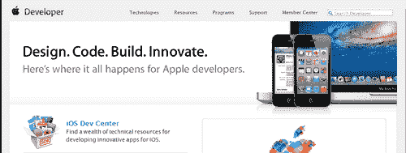

1.  点击**登录**按钮并输入您的凭据。当**iOS Dev Center**出现时，点击右侧工具栏上的**iOS 配置文件门户**链接，如图所示：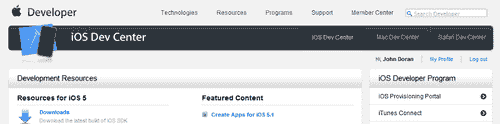

1.  在**iOS 配置文件门户**页面，将有一个 iPhone 的图片和一些带有其下按钮的文本，按钮上写着**启动助手**。点击该按钮。以下屏幕将出现：

1.  应该开始一个新的设置。点击**继续**按钮开始。

1.  在此阶段，您需要创建一个**App ID**，这是一个标识符，将允许 iOS 与您的应用通信，例如用于推送通知。您还需要为应用选择一个显示名称，这是将在各个地方使用的可读名称。一旦您输入了**App ID**，点击**继续**。

1.  接下来，您需要指定您将在哪个设备上玩游戏。为该设备输入一个描述，例如`iPad`。下面您将看到一个输入您的**设备 ID**的地方。虽然您可以使用 Mac 上的 Xcode 来获取**设备 ID**，但在此阶段直接打开**iTunes**并找到 ID 可能更简单。

1.  打开**iTunes**。点击您的设备以显示其菜单。从那里点击**序列号**选项以更改值以显示其标识符（UDID）。显示后，点击**编辑** | **复制标识符**（UDID）。参见图表：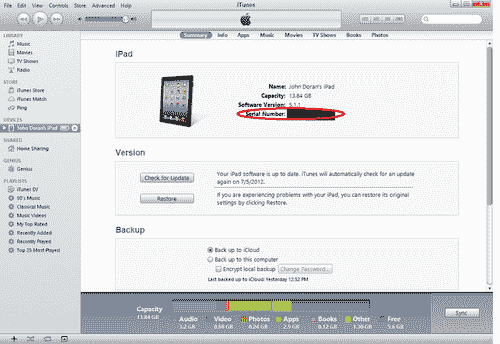

1.  将代码粘贴到上一菜单中的**设备 ID**属性中，然后按**继续**。

1.  您现在应该被带到**生成证书签名请求**步骤。点击继续以跳过此页面，因为我们已经在步骤 5 中的配置向导内创建了**证书请求**。

1.  在**提交证书签名请求**步骤中，点击**浏览**按钮并定位到文件夹中的证书（`.csr`文件），您在步骤 5 中将其放置在那里，然后点击**继续**。

1.  在此阶段，您将被要求输入**配置文件描述**。这是一个将用于识别特定配置文件的名字，例如如果您有一部 iPhone 和一部 iPad，并想在两者上尝试游戏。完成这些后，点击**生成**按钮。以下截图显示了这一点：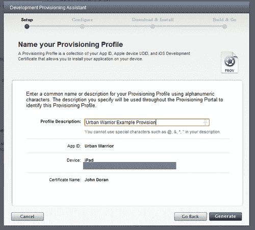

1.  当下一页完全加载时，您的配置文件将完成。一旦底部步骤出现大绿色勾选标记，点击**继续**。

1.  在下一屏点击**下载**按钮，并将文件保存到放置我们本章创建的其他两个文件的同一位置。

1.  下载完成后，点击**继续**按钮。再次点击**继续**以跳过**下载并安装您的配置文件**，因为我们现在不需要它，但当我们想要将游戏提交到 App Store 时，我们会需要它。

1.  在此步骤中，您应该看到**下载并安装您的开发证书**。我们同样需要它，所以将其保存到我们的重要文件文件夹中。

1.  一旦文件完成，点击**继续**。再次点击**继续**以跳过**下载并安装您的开发证书**，因为我们现在不需要它，但当我们想要将游戏提交到**App Store**时，我们会需要它。

1.  继续跳过**使用 Xcode 安装您的 iOS 应用程序**页面，因为我们不会在用 UDK 创建游戏时使用它。

1.  到目前为止，您应该已经完成了**配置助手**，我们可以在下一页点击**完成**以退出助手。这如图所示：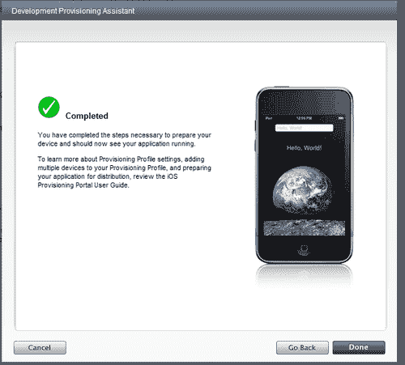

1.  返回到**Unreal iOS 配置向导**，转到**新用户**标签页。点击**导入一个移动配置文件...**按钮以导入保存在我们重要文档文件夹中的配置文件。它应该是文件夹中唯一类型的文件。这如图所示：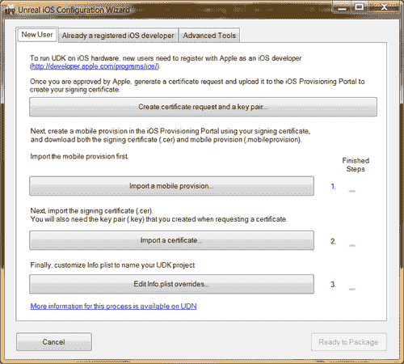

1.  接下来，点击**导入证书...**以导入开发者证书。一旦选择，它将要求您导入在生成证书请求时制作的密钥对文件。点击**确定**并选择密钥对文件。此时，我们应该在右侧看到两个绿色的勾选标记。

1.  点击**编辑 Info.plist 覆盖...**按钮以打开**自定义 Info.plist**窗口。在**包显示名称**下，输入您希望在 iOS 设备上显示的游戏名称。您可能想使用一个短名称以确保它将适合操作系统提供的空间，例如`Urban Warrior`将是一个不错的选择。在**包名称**中输入名称的简短版本。这是 iOS 用来识别应用的内容，我使用了`Urban Warrior`。在**包标识符**中输入与配置文件中相同的内容，如打包对话框中所述。点击**保存更改**。这如图所示：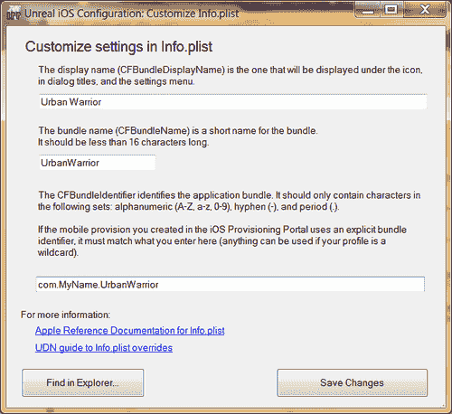

1.  在所有复选框都完成的情况下，点击 **Ready to Package** 按钮。如果你是通过点击我之前提到的图标进入此页面的，游戏应在一段时间后推送至你的设备。否则，点击 **Install on iOS device** 按钮。一段时间后，你应该会看到一个弹出窗口告诉你游戏已被部署。这可以在以下截图中看到：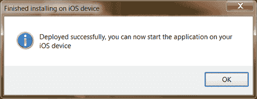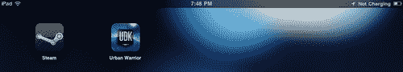

1.  游戏推送至你的设备后，打开你的 iPad，触摸之前截图所示的你的游戏图标 **Urban Warrior**。你会看到以下截图：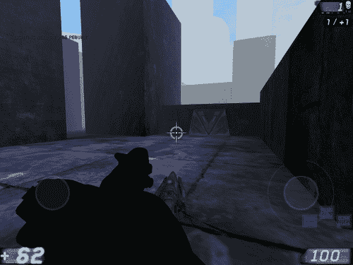

## 刚才发生了什么？

我们的游戏现在已经在我们的 iOS 设备上了。要到达这里需要很多步骤，但我们终于做到了！每次我能在新控制台上玩到自己创作的游戏时，我都会感到一种成就感的温暖，我希望你也有同样的感觉。恭喜你走到这一步，你现在正式成为了一名 iOS 开发者！

## 自定义图形

虽然 Epic 为在 iOS 上运行的游戏提供了图形，但我们为了使我们的游戏更具个性，可以做的简单事情之一就是自定义游戏 iOS 版本中显示的图形。iOS 应用使用一组不同尺寸的图标图像，以支持我们支持的大量项目。用你自己的自定义图像替换这些图像，这样当你在使用 **Unreal Frontend** 或 **Install on iOS Device** 命令打包游戏时，它将使用这些资源。包含这些资源的文件夹位于 `UDKGame/Build/IPhone/Resources/Graphics/`。截至写作时，如果你正在创建 **Universal App**，以下是你可以使用或应该使用的图形：

| 图像大小（像素） | 文件名 | 用于 |
| --- | --- | --- |
| 512x512 | `iTunesArtwork` | Ad Hoc iTunes |
| 57x57 | `Icon.png` | iPhone/iPod touch 的 App Store 和主屏幕 |
| 114x114 | `Icon@2x.png` | iPhone 4 高分辨率的主屏幕 |
| 72x72 | `Icon-72.png` | iPad 的 App Store 和主屏幕 |
| 50x50 | `Icon-Small-50.png` | iPad 的 Spotlight |
| 29x29 | `Icon-Small.png` | iPad 和 iPhone 的设置，以及 iPhone 的 Spotlight |
| 58x58 | `Icon-Small@2x.png` | iPhone 4 高分辨率的 Spotlight 和设置 |

### 小贴士

要获取有关所需或需要用于不同设备的图标尺寸的最新知识，请访问 [`developer.apple.com/library/ios/#qa/qa2010/qa1686.html`](https://developer.apple.com/library/ios/#qa/qa2010/qa1686.html)。

在创建图标时，我发现从大尺寸开始，然后逐渐减小尺寸更容易，这样可以避免我的艺术作品中出现像素化。我自由地制作了一些示例图标，你可以自由地在你自己的项目中使用。以下是一个示例：

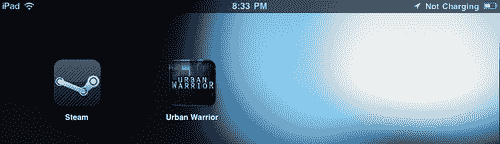

## 在设备上测试

到目前为止，我们已经使用移动预览器和 UDK 远程工具玩过我们的游戏，但实际在自己的设备上玩游戏完全是另一回事。首先，你的手现在在屏幕上，所以你可能看不到你创建的**HUD**元素，比如我们创建的按钮。同时，让其他人测试你的游戏并给出反馈也是一个非常好的主意。

### 为什么进行测试？

**测试**是决定视频游戏成功与否的最重要的事情之一。然而，在游戏制作过程中，这个领域往往被严重忽视，所以我想要强调进行测试的重要性。测试者代表了普通人将如何对你的游戏做出反应的声音。你必须认真对待他们所说的。他们也是那些会找到并利用他们能接触到你的世界中的任何东西的人，你也会发现游戏中你从未想过可能存在的事情。

在构建你的项目时，尽早进行原型设计并且了解你正在开发的内容是否真的对你的目标受众来说有趣，这一点非常重要。创造乐趣（幸运的是，没有秘密公式，否则游戏设计师就会失业）没有秘密公式，但你可以将从其他产品中学到的原则以及你自己的创造力应用到其中，看看它是否有效。话虽如此，在你将游戏摆在你游戏小组面前之前，你应该比任何人都更多地测试你的游戏。毕竟，如果你的游戏小组不喜欢你所做的一切，那么你的 App Store 评论可能不会像你想象的那样精彩。

### 如何进行测试

大型公司会投入大量资源进行测试，创建带有摄像头的实验室，从许多不同角度记录测试者，以及记录输入和玩家行为，试图将其变成一门科学。但是，与这些公司不同，我知道我负担不起这样做，所以我选择了下一个最好的选择。有很多不同的方式进行测试。

当我自己进行测试时，我通常会有一个问卷，让玩家在玩游戏后填写。很多问题都是围绕从 1 到 10 的数字，讨论游戏是否太难，目标是否难以理解，以及其他你想要弄清楚的事情。我还在最后留了一个大空白，以便那些投入很多的人无疑会有很多话要对你说。

对于还在学校的学生来说，我发现一个很简单的方法就是订购几块披萨，并给玩游戏的人一块作为奖励。你可以创建自己的网站，让访客在玩游戏后填写问卷。还有许多在线社区的人总是渴望尝试新游戏并给出反馈，例如 ModDB/IndieDB，在[`www.moddb.com/`](http://www.moddb.com/)和[`www.indiedb.com/`](http://www.indiedb.com/)，尽管这可能是一个获取 iOS 特定反馈的问题。至少，与朋友交谈并将你的 iPad 交给他们也是让别人玩你的游戏的一种方法，尽管你的朋友和家人可能在他们的评论中带有偏见。

另一个非常重要的事情是，让人们在没有你的输入的情况下玩你的游戏。大多数设计师认为他们已经涵盖了规则手册中所有可能的事情，但几乎可以肯定的是，有些事情被遗忘了。在关卡设计中，重要的是要看到玩家会走向哪个方向，以及他们是否被正确引导。在任何游戏中，玩家都不应该感到愚蠢。拥有不完整游戏是让玩家感到他们只是浪费了金钱在一件不完整产品上的一个可靠方法。我曾经玩过一个游戏，如果你遵循规则，实际上是没有办法赢得游戏的。

尝试保持坚韧的皮肤，并对所有人的反馈表示感谢；并不是每个人都喜欢你的游戏，但如果看到形成趋势，你可能会想要调整游戏。测试玩家会提出建议，而是否采纳这些变化将取决于你。有时候，为了玩家的利益或平衡起见，事情就是这样。还有一点很重要，那就是要经常进行测试，因为你需要看到你所做的改变是否有所帮助，然后重复这个过程，直到你满意地发布。

## 商业化

当你的项目基本完成时，可能是考虑你游戏商业化可能性的时候了。由于这本书是面向初学者的，我将不会深入探讨实现这些服务所有可能功能的细节；这足以写成一整本书，但我将概述可以做什么，并为任何想要在游戏中实现*x*功能的初出茅庐的开发者提供一些资源。

### 注意

注意，大多数这些功能将需要在你的游戏中输入某种类型的 UnrealScript 才能实现，而由于这本书没有涵盖 UnrealScript，你将不得不自己进行大量研究，但我在这里提供的链接是我用来学习它的，所以我非常确信你也可以做到同样的事情。

### 许可 UDK

UDK 可以免费用于非商业或教育目的。如果你打算将 UDK 用于任何商业目的，或者你的游戏中包含任何类型的广告，你必须向 Epic Games 申请许可证，申请地址为[`www.udk.com/licensing`](http://www.udk.com/licensing)。截至撰写本文时，许可证条款为预付 99 美元，公司前 50000 美元的收入免收版税，剩余收入的版税为 25%。由于我们将在 iOS 上发布我们的游戏，苹果会从中抽取 30%的费用，剩下 70%的利润归你所有。如果你的应用销售额达到 100 美元，但你只收到了 70%，版税是根据你实际收到的 70 美元计算的。而且虽然 25%可能看起来很多，但如果你以 1 美元的价格出售你的应用，你需要卖出 71,428 个应用才能达到这个标准。

### 游戏内广告

想要让自己的游戏免费下载同时又能盈利的人，可以在游戏中添加内联广告。苹果有一个名为**iAd**的整个网络，只需几行代码就可以将其添加到你的游戏中。需要注意的是，你必须购买 UDK 的许可证才能带有广告发行你的游戏，并且通过这些广告产生的收入是收入。有关将广告添加到你的游戏的更多信息，请访问[`udn.epicgames.com/Three/InGameAds.html`](http://udn.epicgames.com/Three/InGameAds.html)。

### 游戏内购买

在你的游戏中赚钱的另一种方式是通过解锁某些内容，在购买游戏后进行购买。一个例子可能是访问某些关卡和/或功能。需要注意的一点是，人们可能会因为这种方式没有得到完整版的游戏而抱怨。一个可能的解决方案是为纯粹的外观事物提供内购，例如不同的角色或服装。

### 注意

有关将微交易系统集成到你的游戏的更多信息，请访问[`udn.epicgames.com/Three/MicroTransactions.html`](http://udn.epicgames.com/Three/MicroTransactions.html)。

### 通过游戏中心将大家聚集在一起

**游戏中心**是苹果的在线游戏网络。iOS 设备上的玩家可以使用这项服务来相互竞争成就、进行多人游戏，甚至进行语音聊天。

要将游戏中心添加到你的游戏中，只需转到 UDK 文件夹中的`IPhoneEngine.ini`文件，该文件位于`\UDKGame\Config\IPhone\`，并将`bDisableGameCenter`的值设置为 false，如下所示：

```swift
[OnlineSubsystemGameCenter.OnlineSubsystemGameCenter]
bDisableGameCenter=false

```

然而，如果你计划使用排行榜或成就，这会稍微复杂一些，因为你需要深入研究 UnrealScript，以实现游戏中获得成就的能力。

### 注意

有关更多信息，请访问[`udn.epicgames.com/Three/GameCenter.html`](http://udn.epicgames.com/Three/GameCenter.html)。

### iCloud 集成

苹果的**iCloud**是一种存储形式，可以保存可以从个人拥有的任何 iOS 设备访问的数据。这可能是一种为您的游戏创建存档文件、保存玩家进度的绝佳方式。

### 注意

更多信息请访问[`udn.epicgames.com/Three/CloudDocumentStorage.html`](http://udn.epicgames.com/Three/CloudDocumentStorage.html)。

### Facebook/Twitter 集成

UDK 的 iOS 版本还具有一项功能，即能够发推文或在您的 Facebook 页面上发布。它能够充分利用 Facebook 的 API，能够检索您的朋友列表和其他许多内容。要了解更多关于这两者的信息，请访问[`udn.epicgames.com/Three/TwitterIntegration.html`](http://udn.epicgames.com/Three/TwitterIntegration.html)或[`udn.epicgames.com/Three/FacebookIntegration.html`](http://udn.epicgames.com/Three/FacebookIntegration.html)。

## 将我们的游戏推向全球

现在我们的游戏已经处于最佳状态，并且将成为下一个大型的 iOS 热门应用，让我们将其发布，让全世界都能看到；或者至少让苹果的审批人员看到。在此阶段，您需要一台 Mac 电脑才能完成此过程。

# 行动时间——请求分发证书

首先要采取的行动是创建一个分发配置文件。这与我们之前创建的不同，因为它将被用于多个设备上的放置。

1.  前往苹果开发者网站的**iOS 配置文件门户**页面，而不是使用启动器，点击左侧工具栏上的**证书**，如图所示：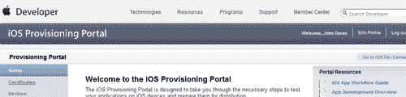

1.  点击**分发**选项卡，然后在该页面的右侧点击**请求证书**按钮来请求一个新的分发证书。

1.  滚动到页面底部，找到我们之前创建的`.csr`文件，然后点击**提交**按钮。然后我们将返回到之前的**分发**选项卡，经过一段时间后，您将看到证书显示为**已颁发**。这如图所示：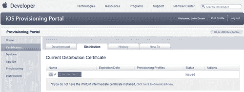

1.  切换到**开发**选项卡，然后返回到**分发**选项卡。返回后，您会注意到**操作**选项卡有一个下载按钮。点击它并将文件保存到与我们的其他文件相同的目录。

1.  接下来我们需要创建一个**分发配置文件**。点击**iOS 配置文件门户**的**配置文件**部分和**分发**选项卡，与之前的方式类似。点击**新建配置文件**按钮，将我们带到**创建 iOS 分发配置文件**页面。

1.  将**分发**方法保留在**App Store**。如果您试图自行分发应用程序，例如创建企业内部应用程序，则可以选择**Ad Hoc**选项。

1.  在**配置文件名称**下输入一个名称，以便在**iOS 配置文件**中识别该配置文件，例如`Urban Warrior Provision`。

1.  **分发证书**应列出我们之前创建的证书。在**App ID**下选择我们的应用，并留空设备，因为它仅在**Ad Hoc**分发中使用。

1.  点击**提交**按钮，它将带您回到**配置文件**主页的**分发**选项卡。这如图所示：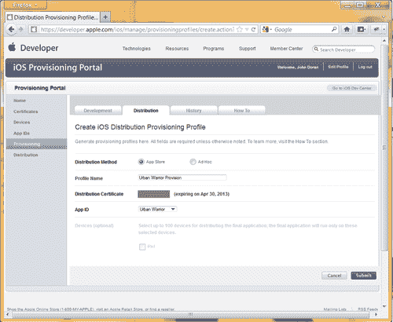

1.  在该页面上，您将看到状态为**挂起**的**配置**。切换到**开发**选项卡然后回到**分发**，您会注意到它现在将显示为**活动**。将文件下载到我们的项目文件夹。这如图所示：

1.  通过双击位于 UDK 安装目录下的`Binaries\IPhone`文件夹中的`IPhonePackager.exe`文件来打开**iPhonePackager**工具。这如图所示：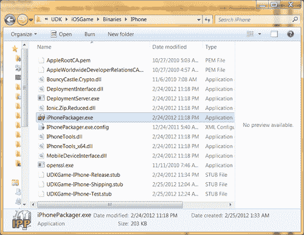

1.  程序应该以**高级工具**选项卡高亮开始。点击**配置和证书工具...**以显示**签名工具**。

1.  然后，点击**导入一个移动配置文件...**，使用文件对话框导入分发文件。

1.  接下来点击**导入证书...**，并使用文件对话框定位您的分发证书（可能命名为`ios_distribution.cer`）。之后，一个消息框将要求您提供密钥文件。点击**确定**然后选择您的密钥对文件。点击**刷新列表**以查看要显示的证书。这如图所示：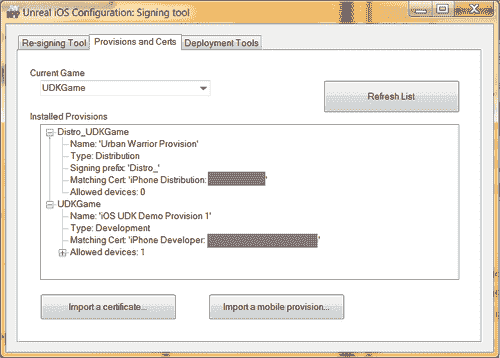

1.  确保 UDK 已关闭，并通过访问 UDK 安装目录下的**Binaries**文件夹并双击`UnrealFrontend.exe`应用程序来打开**Unreal Frontend**。同时确保编辑程序也已关闭，因为如果不关闭，那么在接下来的几个步骤中你几乎可以肯定会遇到错误。

1.  点击**前端**右侧的大按钮，按钮上显示的内容类似于**UDKGame on PC(Shipping 32)** | **Cook/Make/Sync with ...**。从菜单选项中选择**IPhone**作为**平台**，**Shipping_32**作为**游戏配置**，**ReleaseScript**作为**脚本配置**，以及**Shipping_32**作为**Cook/Make 配置**。点击**确定**以保存您的设置。

    当你完全完成你的游戏后，使用**FinalReleaseScript**选项是个好主意，因为它会由于移除断言检查和日志信息而运行得更好。请参考以下截图：

    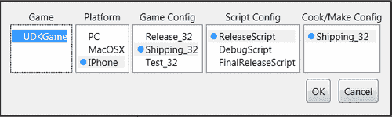

1.  在大按钮下方的 **移动** 部分，将 **打包模式** 更改为 **分发**。

1.  点击 **添加...** 按钮，并输入你希望在游戏中拥有的所有关卡名称，点击 **添加选中地图** 将地图添加到游戏中。这在上面的屏幕截图中显示：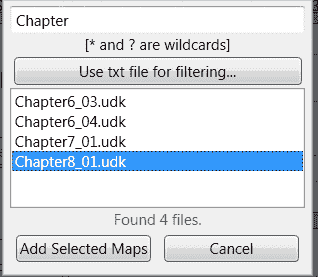

1.  确保选中 **覆盖默认** 选项，并选择您想要作为第一个关卡进行游玩的第一个关卡。这在上面的屏幕截图中显示：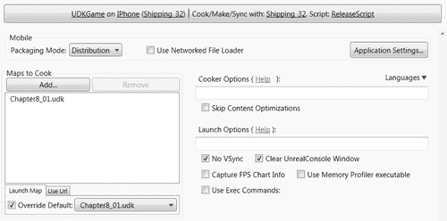

    如果你不想使用 **覆盖默认** 选项，你还可以在 `DefaultEngine.ini` 文件中设置默认关卡。

1.  点击 **部署** 按钮下方，并选择 **启用步骤** 以跳过部署到您的设备，因为分发构建不能放在您的正常设备上。如果您想在您的设备上有一个完整的构建，请将 **打包模式** 更改为 **默认**。这在上面的屏幕截图中显示：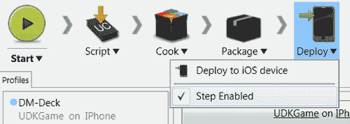

1.  在设置好所有选项后，点击单词旁边的箭头，选择 **清理和完整重新构建** 并等待所有命令执行完成。这在上面的屏幕截图中显示：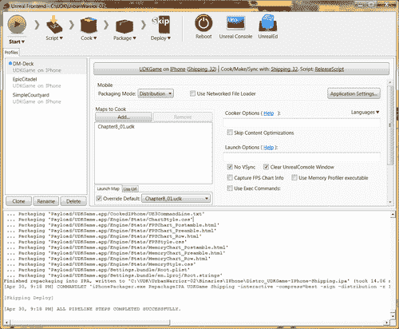

1.  如果一切顺利，你应该在你的 `\Binaries\IPhone\Shipping-iphoneos\UDKGame` 文件夹中找到一个名为 `Distro_UDKGame` 的 `.ipa` 文件，你需要将其保存到闪存驱动器或类似设备上，因为我们移动到本教程的 Mac 计算机部分时需要它。

1.  在 Firefox/Safari 中，我们接下来需要转到 **iOS 开发中心** 的 **iTunes Connect** 部分，它位于我们之前使用的 **iOS 配置文件门户** 下方。这在上面的屏幕截图中显示：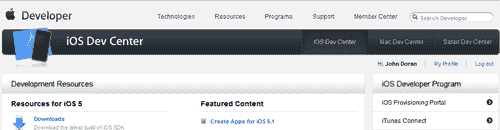

1.  使用您的凭据登录，如果需要的话，并同意 **服务条款**。在主页上点击屏幕右侧的第一个按钮 **管理您的应用** 选择，这在上面的屏幕截图中显示：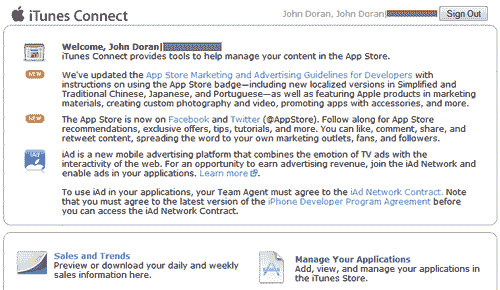

1.  点击左侧上方的 **添加新应用** 按钮。如果是你的第一个应用，你将被带到 **新应用** 页面，在那里你需要想出一个公司名称，所以请小心，一旦创建，你就无法更改，确保它符合你的需求。

1.  接下来，您将需要填写多项不同的内容。在**默认语言**下将其设置为英语。在**应用名称**中输入您希望的应用名称，例如`Urban Warrior`。在**SKU 编号**中输入任何数字，但请记住，您创建的每个游戏都必须有一个与之关联的不同编号。在**捆绑 ID**中选择我们之前创建的**捆绑 ID**，并在**捆绑 ID 后缀**中输入与您之前在`IPhonePackager`的**编辑 Info.plist 覆盖...**部分中设置的`info.plist`文件相匹配的值。完成后，点击**继续**。这如图所示：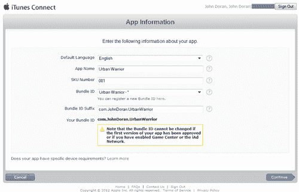

1.  现在，选择您应用的日期和价格层，以及如果您希望的话，教育购买者的折扣。您还可以选择您希望销售应用的特定应用商店。请记住，如果您没有将价格层设置为免费，您将不得不支付 UDK 的许可费。完成后，点击**继续**。

1.  在下一部分，有许多特定于您正在工作的游戏的元数据选项可供填写，因此请根据您的最佳判断填写它们。

1.  您需要上传您游戏的图片和截图，包括 iPhone/iPod Touch 和 iPad，以及一个 512(x)512 的大图标。

    ### 注意

    一个小贴士是，从您的实际设备中截取截图，通过同时按住电源键和主页键一段时间然后释放。您应该看到屏幕闪烁，在**照片**应用中您应该看到您正在做的事情的图片。您可以在上传此部分之前提前将这张图片通过电子邮件发送给自己。

1.  完成后，点击**保存**按钮保存应用信息。这将带您到应用的**应用摘要**页面。这如图所示：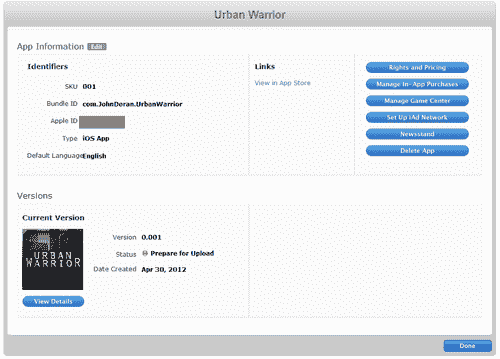

1.  点击**查看详情**按钮进入**应用详情**页面，然后从那里点击**准备上传二进制文件**。菜单将询问您是否使用了加密来使用您的产品，您将回答否，然后点击**保存**。菜单现在将显示您已准备好使用**应用程序加载器**上传二进制文件；点击**继续**，您将被带回到主屏幕。点击左上角的**应用摘要**文本，然后在应用摘要页面点击右下角的**完成**。

1.  前往您的 Mac 电脑，在那里我们将完成教程的其余部分。

1.  如果您还没有安装，请通过 App Store 安装 Xcode。您将看到下一张截图：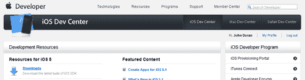

1.  **下载并安装 Application Loader**程序，通过访问网站上的**iTunes Connect**部分，并在底部工具栏上点击**下载 Application Loader**。这如图所示：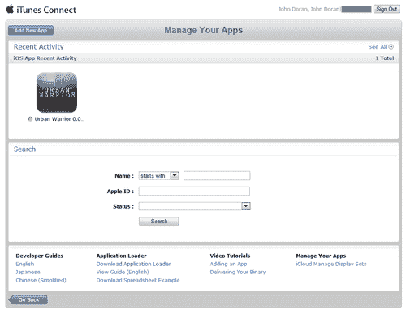

1.  在安装**Application Loader**之后，通过按**Command** + *Space*打开**Spotlight**，并输入程序名称，直到它显示出来，然后点击它。这如图所示：

1.  在打开**Application Loader**后，输入您的凭据并按**下一步**。这如图所示：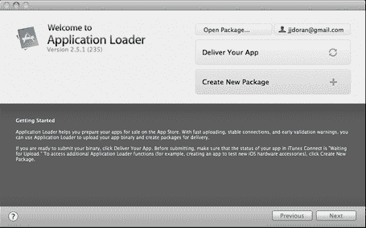

1.  点击**提交您的应用程序**按钮。在出现的菜单中，选择您的应用程序并选择**下一步**按钮。在**应用程序信息**部分，点击**选择...**按钮并选择您的`.ipa`文件，等待其完成。

1.  当上传完成时，点击**下一步**然后**完成**。您可以随时登录到**iTunes Connect**并转到**管理您的应用程序**页面，以确认应用程序已上传。

## 刚才发生了什么？

我们现在已将我们的应用程序提交给苹果进行审查！当应用程序通过自动检查的各个阶段时，您将收到进度电子邮件，最终达到**等待审查**状态，这意味着它现在正在苹果的审查过程中。如果发生任何情况，您将收到电子邮件，但状态也会在**iTunes Connect**网站上更新。每次出现错误时，您都必须在**Application Loader**再次使用之前，在**iTunes Connect**网站上点击**准备上传**。

# 摘要

在掌握了如何将我们的游戏推送到 App Store 之后，我们现在已经涵盖了我在本书范围内向您展示如何做的所有内容。我们具体学习了：

+   关于将您的游戏上传到 iOS 设备的过程

+   在您自己的 iOS 设备上部署游戏的过程

+   如何自定义从我们的设备以及 App Store 查看时的游戏图标

+   游戏测试过程以及如何进行自己的游戏测试会话

+   Epic Games 为 UDK 开发的 iOS 游戏实施的当前版税模式

+   如何将 Game Center 链接到我们的游戏中以获得更丰富的社交体验

+   关于在游戏中使用广告进行货币化的使用方法

+   将您的游戏上传到 iTunes Store 的过程

真难以相信在这么短的时间内，你已经成功完成了这么多不同的事情！凭借从这本书中获得的知识，你拥有了所有工具和知识来创造一些真正伟大的项目。UDK 是一个非常惊人的引擎，我亲身体验过它能带来多少可能性。所以未来的应用开发者，祝你好运，我会在 App Store 上见到你！
