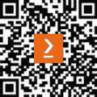

# 前言

自从苹果公司推出其首个 iPhone 开发 SDK（那时 iOS 就是用这个名字）以来，已经过去了许多年，iOS 生态系统已经成为世界上最具影响力的生态系统之一。为了支持数十亿台设备并使用最新的技术，对 iOS 开发者的需求始终很高。

然而，事情已经变得更加复杂。在 2009 年，添加一个简单的表格视图或按钮就足以获得一份工作。然而，如今，这些任务甚至不会在面试中被问到。今天的知识范围如此广泛，以至于面试官关注的不仅仅是基础知识。

今天 iOS 开发世界的复杂性，加上激烈的竞争，已经形成了一个多样化的招聘流程，这个流程不仅需要构建一个简单的屏幕。因此，我们迫切需要在专业和广泛的基础上做好准备。

*《终极 iOS 面试宝典》* 是一本全面的书，它指导你从面试准备的早期基础知识到 Swift、不同的框架，甚至设计、架构和编码任务。

# 这本书面向的对象

所有级别的 iOS 开发者都会发现这本书吸引人且有用。然而，有三类开发者会发现它更有价值：

+   **寻找第一份工作的初级开发者**：作为一名 iOS 开发者找到第一份工作可能具有挑战性。虽然工作场所理解初级开发者可能没有丰富的经验，但他们仍然期望他们具备该职位所需的最基本技能和知识。《终极 iOS 面试宝典》可以帮助缺乏经验的开发者成功应对这一艰巨的任务。

+   **那些在职业生涯中感到停滞不前的经验丰富的开发者**：在同一个工作场所或角色中度过几年有其好处，但也可能导致面试技能的下降，阻碍在新的开发领域中的成长。此外，对于经验丰富的开发者来说，他们完成学业已经很久了，这是一个重新审视基础的好机会。

+   **希望提升职业发展的开发者**：那些将他们的专业视为长期职业道路的人需要采取下一步来进步。寻找新的角色并非易事，尤其是在全职工作和试图建立个人品牌的同时。

总结来说，这本书面向广泛的 iOS 开发者，但以下这些特定群体可以从《终极 iOS》*面试宝典*中受益匪浅。

# 这本书涵盖的内容

*第一章*，*面试前准备*，描述了面试本身之前我们需要采取的行动，包括公司研究、简历撰写和面试准备。

*第二章*，*面试流程概述*，提供了面试流程的概述，包括其不同的步骤和目标。

*第三章*, *开发者品牌建设*，介绍了如何利用我们的品牌作为开发者，例如创建令人印象深刻的 GitHub 和 Stack Overflow 账户，从事个人项目，以及编写。

*第四章*, *数据结构和算法*，探讨了 Swift 和通用编程的基础构建块。它深入探讨了诸如结构体、类、数组、Codable、字典和集合等主题。本章包括常见的面试问题和示例。

*第五章*, *Swift 编程语言*，提供了 Swift 语言基础的重要概述。它涵盖了诸如可选类型、访问控制、闭包、协议、内存管理和泛型等主题。本章包括代码示例和面试问题。

*第六章*, *管理你的代码*，涵盖了 iOS 开发者角色的不同方面，并有助于培养其他重要技能，如规划、测试、调试和文档编写。

*第七章*, *使用 UIKit 构建优秀用户体验*，检查了 iOS 开发中最重要的框架之一——UIKit。它包括 Auto Layout、`UIView`、`UIViewController`、`UITableView`、导航和动画等主题。本章提供了带有代码示例和面试问题的全面解释。

*第八章*, *SwiftUI 与声明式编程*，通过关注 SwiftUI 和声明式编程来探讨 iOS 开发的未来。即使你在这个领域没有经验，这一章也是至关重要的。它涵盖了声明式编程、状态和可观察对象、导航、SwiftUI 生命周期和 Combine。

*第九章*, *理解持久化内存*，涵盖了一个较少见的面试话题。它提供了对 Core Data、`UserDefaults`、`Keychain`和 Files 的简要了解。本章的主要目标是让我们为高级阶段，如设计和架构面试做好准备。

*第十章*, *库管理*，概述了将第三方库集成到我们的项目中（这是当今开发者的一项关键技能）以及模块化我们的项目。本章包括面试问题和代码示例。

*第十一章*, *解决复杂问题的设计模式*，涵盖了在项目中实现有效设计所需的工具集。它概述了 iOS 开发中最常见的模式，如 MVC、MVVM、依赖注入、委托、单例和并发。

*第十二章*, *深入探究应用架构*，探讨了应用架构的含义以及构建优秀架构的基本概念。它包括关注点分离原则、应用层、协议使用和网络。

*第十三章*，*通过编码评估*，探讨了面试中的编码部分，包括白板和远程任务。本章解释了如何优先处理我们的工作，如何应对编码面试，以及如何避免暴露红旗。

# 为了充分利用本书

本书提供了许多简短示例，仅用于演示目的，您无需直接执行它们即可理解。然而，建议您使用 Xcode 和 Mac 实践本书中讨论的一些主题。

| **本书涵盖的软件/硬件** | **操作系统要求** |
| --- | --- |
| Xcode | macOS |
| CocoaPods |  |

# 使用的约定

本书中使用了多种文本约定。

`文本中的代码`：表示文本中的代码单词、数据库表名、文件夹名、文件名、文件扩展名、路径名、虚拟 URL、用户输入和推特用户名。以下是一个示例：“让我们看看一旦将其提取到`Person`结构体中，函数接口看起来会是什么样子。”

代码块设置如下：

```swift
struct A {    var name: String
}
let a = A(name: "Avi")
a.name = "John"
```

当我们希望将您的注意力引向代码块中的特定部分时，相关的行或项目将以粗体显示：

```swift
platform :ios, '14.0'target 'MyApp' do
  use_frameworks!
  pod 'MyFramework', :path => '../MyFramework'
end
```

**粗体**：表示新术语、重要单词或屏幕上看到的单词。例如，菜单或对话框中的单词以**粗体**显示。以下是一个示例：“从菜单栏中选择**文件** | **新建** | **包**以打开 Xcode。”

小贴士或重要注意事项

如此显示。

# 联系我们

我们读者的反馈始终受到欢迎。

`customercare@packtpub.com` 并在邮件主题中提及书名。

**勘误表**：尽管我们已经尽最大努力确保内容的准确性，但错误仍然可能发生。如果您在本书中发现错误，我们将非常感激您向我们报告。请访问 [www.packtpub.com/support/errata](http://www.packtpub.com/support/errata) 并填写表格。

`copyright@packt.com` 并附上材料链接。

**如果您有兴趣成为作者**：如果您在某个主题上具有专业知识，并且您有兴趣撰写或为本书做出贡献，请访问 [authors.packtpub.com](http://authors.packtpub.com)。

# 下载本书的免费 PDF 版本

感谢您购买本书！

您喜欢在路上阅读，但无法携带您的印刷书籍到处走？

您的电子书购买是否与您选择的设备不兼容？

不要担心，现在，随着每本 Packt 书籍，您都可以免费获得该书的 DRM-free PDF 版本。

在任何地方、任何设备上阅读。直接从您最喜欢的技术书籍中搜索、复制和粘贴代码到您的应用程序中。

优惠不会就此结束，您还可以获得独家折扣、时事通讯和每日免费内容的每日电子邮件。

按照以下简单步骤获取好处：

1.  扫描二维码或访问以下链接



[`packt.link/free-ebook/9781803246314`](https://packt.link/free-ebook/9781803246314)

1.  提交您的购买证明

1.  就这样！我们将直接将您的免费 PDF 和其他福利发送到您的邮箱
