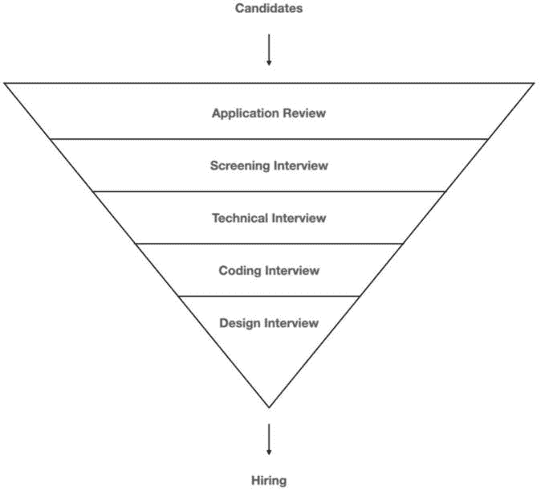
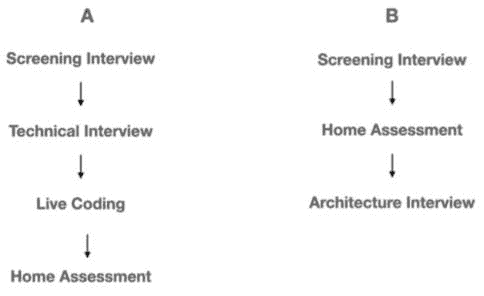

# 第二章：通过面试流程

许多候选人（甚至雇主）将 iOS 开发总结为主要是“Swift”。但将 iOS 开发者角色仅限于编程语言是非常简单化的看法。iOS 开发者（实际上，任何开发者）都有一系列的能力，即使我们并不这样认为。我们必须在 Swift 之外，还要在计算机科学方面展示知识。一些 iOS 开发的基本知识也是必不可少的，例如 UIKit 或 Foundation。

成为 iOS 开发者不仅仅是编码技能。高级 iOS 开发者必须设计一个健壮的应用程序，具有清晰的架构，编写单元测试，管理 CI/CD 流程，部署 beta/alpha 版本，管理证书和配置文件。

那么关于一些软技能呢？沟通和时间管理是当今动态市场中的基本要素。

从我们刚才讨论的线索中可以看出，成为一名 iOS 开发者意味着一系列的能力，远远超出了 Swift 本身。招聘流程的目标是涵盖我们所有的能力，从硬技能到软技能。

在本章中，我们将了解标准 iOS 开发者招聘流程的不同阶段。到本章结束时，我们将处于一个位置，这个过程对我们来说就像我们真的在那里一样熟悉！

为了这个目的，我们将涵盖以下内容：

+   理解招聘流程

+   准备筛选面试

+   关于 iOS 技术面试的所有内容

+   通过编码面试

+   通过架构面试

正如我说的，让我们从理解招聘流程的工作方式开始。

# 理解招聘流程

招聘流程的一个目标是在尽可能多的范围内获得候选人的技能的完整画面。

软技能和硬技能

如果你忘记了软技能和硬技能是什么，**硬技能**是特定于角色的，例如 iOS 编码、GitHub 知识等。**软技能**是与许多工作相关的技能。沟通和领导力是软技能的例子。请参阅*第一章*以获取更多信息。

想象我们的候选人画面就像一个巨大的拼图。

当我们开始招聘流程时，每个阶段都会拼凑出拼图的一部分，这个过程帮助我们的招聘经理在我们提供之前看到我们的技能集。

每个阶段都会检查我们作为 iOS 候选人的不同部分，就像一场淘汰赛，决定新揭示的画面部分是否足够好，可以进入下一阶段。

## 学习招聘漏斗

我提到淘汰赛只是为了吸引你的注意。现实是招聘流程看起来更像是一个漏斗。漏斗的每个阶段都会深入下去，揭示更多高级技能。

这里有一个这样的漏斗的例子：

图 2.1 – 标准漏斗

它被称为“漏斗”，因为它在我们向下移动时变窄，并且更多的候选人退出。

但我们面试的具体工作场所的漏斗是什么样的呢？

## 区分不同公司

我们在**图 2.1**中看到的漏斗只是一个例子。每个公司的招聘流程都不同，这个领域没有固定的规则。

这种差异有几个原因：

+   **不同角色**需要不同的阶段和不同的主题来检查。不同的角色不仅仅是开发者和设计师之间的区别，还包括开发者和团队领导之间的区别。

+   每家公司都有自己的**看法**，认为这样的漏斗应该是什么样子。有些公司侧重于个性，而有些公司侧重于编码。每家公司都有自己的 DNA（记得在*第一章*中，我们将公司比作人类），因此寻找特定类型的候选人。这种候选人类型可以从招聘过程中快速了解。看看以下两个例子（**图 2.2**）：

**图 2.2** – 不同角色的不同漏斗

我们可以看到角色**A**非常注重编码技能，而角色**B**则更多地关注设计和架构。这可能代表不同的角色（开发者和技术领导），但也可能显示公司或团队如何看待开发者职位。在小公司或团队中，开发者更为核心，责任更大。在这种情况下，角色**B**似乎更适合初创公司而不是企业。

最后可能影响漏斗的因素是**产品**。面向用户的产品可能需要高 UI 技能。将屏幕设计和 UIKit/SwiftUI 作为招聘流程的一部分听起来是个不错的想法。

因此，这里还有一个（免费）小贴士：我们在*第一章*中看到，我们只需通过查看职位发布，就能了解很多关于团队和角色的信息。现在，我们可以看到招聘流程也能让我们了解很多关于工作和工作场所的期望。

现在，让我们从一次简短但至关重要的面试开始我们的漏斗之旅：筛选面试。

# 准备筛选面试

在大多数情况下，招聘流程的第一步不会是深入和高级的技术面试。

我们成功通过了简历筛选步骤并获得了面试机会，但在这个阶段，我们和其他许多幸运的候选人一样。然而，由于候选人众多，工作场所必须在进入下一阶段之前尽可能以最小的努力进行筛选。这就是筛选面试的全部内容。

将筛选面试想象成招聘漏斗中一个超大的、粗略的过滤器，它需要在短时间内处理大量候选人。这也意味着我们在回答几个重要问题的同时，大约有 30 分钟的时间给面试官留下深刻印象，以便继续漏斗的下一阶段。

## 筛选面试包括什么？

大多数筛选面试都围绕三个主题展开——公司、候选人的背景和软/硬技能。

### 让我们谈谈公司

通常，面试官会以关于公司和产品的**电梯演讲**开始面试。我想澄清一下什么是电梯演讲，因为我们很快就会需要它。

让我们想象一下，我们和另一个人一起乘坐电梯。我们想要向那个人展示一个想法，甚至是我们自己，但我们有大约 30 秒的时间到达电梯的目的地。这个简短的演讲被称为电梯演讲。

在筛选面试中，有两个电梯演讲。第一个是面试官谈论公司和产品。第二个是我们的，我们很快就会讨论这一点。

面试官的电梯演讲可能持续超过 30 秒。我们需要做的是仔细聆听公司和产品的描述。这里有几个原因：

+   记得我们在*第一章*中提到要确保工作场所适合我们吗？现在是我们**验证我们的假设**的时候了。在*第一章*中，我们投入了宝贵的时间进行研究。现在是我们找出真相的时候了。这是否是我们想要工作的公司？开发团队是否真的达到了我们预期的规模？我们是否听到了令我们烦恼的事情？我们应该利用这个机会。

+   “这会在考试中吗？”嗯，有点。在筛选面试结束时，面试官会问我们是否有问题，并期望我们提出一些问题。我们将讨论这一点，但我们需要确保我们理解面试官的演讲，这样我们才能提出**相关的问题**。问一些在演讲中已经回答过的问题不是一个好主意。

+   面试官的演讲可以帮助我们**调整我们的回答**以符合工作场所的需求。我们需要利用我们刚刚获得的额外和宝贵的信息，并利用我们作为 iOS 开发者的提供。

但面试官并不是这个对话中唯一说话的人，也不是唯一有电梯演讲的人——我们也是面试的一部分！

### 构建我们的电梯演讲

在某个时候，面试官会说，“请告诉我关于你的情况。”那将是我们展示电梯演讲的时刻。

他们说我们每个人都需要有点销售员的特质，这是真的。尽管我们的专业是 iOS 开发，但我们有显著的优势，我们需要销售一些东西——作为 iOS 开发者的我们的技能和专业知识。

因此，提前**规划我们的电梯演讲**并为此时刻做好充分准备是极其重要的。建议写下我们的演讲稿，大声朗读，对着镜子练习，甚至可以向亲密的朋友朗读。面试官需要记住我们。这就是它为什么如此重要的原因！

#### 我们希望面试官记住关于我们的哪些信息？

那么，我们如何构建我们的推销？首先，我们需要记住，没有必要展开我们的整个简历。面试官可能已经阅读过了。即使他们没有，用 40-50 秒列出我们的专业知识也是无效的。

我们需要解释**为什么我们适合这份工作**，有两种简单的推销公式：现在、过去和未来，以及过去、现在和未来：

+   在“现在、过去和未来”中，我们首先解释我们的当前角色，然后转向我们的专业知识，然后讨论我们认为我们为什么有资格做这份工作。

+   在“过去、现在和未来”中，我们首先从我们的专业知识开始，然后转向我们的当前角色，最后解释为什么我们认为我们有资格做这份工作。

这两种公式都很棒——两者都内置了智能逻辑，并且都能完成工作。但我们可以更好地调整我们的推销。

如果我们的当前角色与职位发布有关，那么以我们的当前角色开始我们的推销可能是个好主意。然而，如果我们的过往专业知识与工作要求更为相关，我们应该从我们的专业知识开始，然后才转向我们现在正在做的事情。

现在我们有了公式，我们需要记住，我们有很短的时间来展示我们的个人简介。正确的方法是将我们的专业知识和当前角色提炼成成就和影响力。我们必须推销自己，而不是让面试官充满枯燥的工作历史细节。

在“未来”部分，我们需要包括我们对招聘流程和求职的期望。将我们的抱负和工作场所要求混合在一起会导致“未来”部分内容显著增加。

既然我们已经有了公式，让我们现在尝试用点击诱饵来增加一些趣味性。

#### 包含点击诱饵

我们都可能熟悉“点击诱饵”这个术语。如果你不知道它的意思，点击诱饵是为了**吸引听众**或读者消费更多内容而设计的文本或图片。它在推文、帖子文章中是一种常见的做法。

是的，我知道电梯推销不是推文或帖子，但人的大脑工作方式是一样的。点击诱饵/预告创造了一个“好奇心差距”并利用它。在我们的推销中，我们也需要这样做！

我们的目标是植入一条使我们独一无二的信息，这将驱使审阅者深入挖掘并倾听更多。这条信息也将帮助我们留下深刻印象。

这里有一些预告的例子：

+   “我经常在会议上发表演讲”

+   “我在应用商店有一个拥有许多活跃用户的项目”

+   “我是两个大型开源项目的参与者”

当然，不言而喻的是，你植入的预告必须准确可靠。当你的审阅者开始深入挖掘时，扭曲真相看起来并不好。

#### 在你的推销中不要包含的内容

关于在推销中**不**要包含的内容的答案可能因国家和文化而异。但我想最好的做法是不包含个人信仰、宗教以及任何与成为一名优秀的 iOS 开发者无关的内容。这甚至可能伤害我们继续推进流程的机会。

说我们以前工作场所的坏话也不是一个好主意。最好是说尽管我们过去可能有过问题和冲突，但我们仍然感激在那里工作的时光。

记住，在这些情况下我们永远不应该情绪化。在求职面试中，聪明是非常重要的。

现在让我们谈谈一些真正深思熟虑的问题，比如为什么我们想要换工作。

### 准备回答“你为什么想换工作？”的问题

如果我们的电梯演讲遵循我之前提到的公式之一，它也应该在“未来”部分涵盖这个问题。

然而，面试官仍然可以就我们改变当前工作场所的动机提问我们。可能是因为他们没有仔细听，或者因为我们只有 30-40 秒的时间，这根本不够。

有很多原因会让求职者想要换工作。以下是一些原因：

+   我不喜欢我的公司

+   我想要更高的薪水

+   我在寻找机会

+   我是因为个人原因

+   我想要灵活性

+   我被解雇了

+   我不喜欢我公司的文化

+   我没有得到及时的培训和开发

每一个原因都是完全合法的。但我们可以以不同的方式向面试官展示我们的理由。

让我们以“我想* *更高的薪水。”*这个原因为例。

我们可以简单地回答以下内容：

*我的当前薪水太低，我的工作场所不会给我* *加薪。*

嗯，这听起来不太好，不是吗？这不仅听起来很抱怨，还可能引起一些人的怀疑——也许这就是我们没有加薪的原因。

另一方面，我们可以传达不同的信息：

*我喜欢接受挑战，得到奖励激励我更加努力工作。对我来说，经济支持是我* *辛勤工作* *的奖励。*

将薪水和动力联系起来，而不是将薪水和自我联系起来，这会给“我想更高的薪水”这个声明增添深度。

当我们选择正确的原因时，我们应该考虑如何以积极的态度表达它，并将其与工作场所所需的价值联系起来。

### 准备技能测试

正如我说的，筛选面试就像一个巨大的粗筛子。除了专业知识和个人期望之外，面试官还可能检查我们的另一个标准：技能测试。

技能测试比高级流程阶段要窄得多。记住，面试官可能不是我们的招聘经理或 iOS 开发者。此外，我们只有有限的时间——毕竟，这只是筛选面试。

然而，技能测试是我们应该准备的重要部分，我们将从讨论我们的软技能开始。

#### 发现软技能问题

软技能测试很棘手！没有人会告诉我们，“*现在我们将检查你的软技能。”*我们的软技能在整个面试过程中在各种地方被检验。我们的电梯演讲可能是展示我们软技能的地方之一，但不是唯一的地方。

如果我们面试迟到，这可能表明**时间管理不善**或个人成熟度问题，这是一个例子。**沟通技巧**可能在讨论作为团队一员或远程工作时出现。

我们应该把面试的每一个部分或每一个方面都看作是我们正在接受的一项软技能测试的一部分。

即使在回答硬技能问题时，软技能也存在于其中。还记得吗？让我们谈谈它们。

#### 回答硬技能问题

与软技能不同，硬技能测试更加明确。并非每个筛选面试都包含硬技能，这取决于我们正在面试的工作场所。

硬技能测试可能包含关于 Swift 和 UIKit 的基本问题。它们的主要目的不是检查我们的 Swift 编程技能水平，而是确保我们达到继续过程的最低标准。

我们需要记住，在这个阶段，面试官可能甚至不是 iOS 开发者，他们可能有一系列的问题和答案列表。

一个典型的基本问题可能是：

*什么是 let 和 var 的区别？*

对于一个标准的 iOS 开发者来说，前面的问题可能看起来非常基础。然而，我们必须记住，面试官在这个阶段并不知道我们的**实际**经验和知识。iOS 开发者或招聘人员可以提出那个问题，因为像“我不记得”这样的回答是一个强烈的信号，表明候选人可能在 Swift 语言的知识上存在令人担忧的差距。

在筛选面试中，可能会有一系列的多选题，以便非开发者面试官可以提问和分析答案。

本书第二部分“Swift 语言和编码”讨论了 Swift 语言，仔细复习其章节将极大地为我们准备大多数筛选面试问题。

现在，让我们转到面试中另一个隐藏的软技能：提问的能力。

### 提问，“你有什么问题要问我吗？”

面试官并不是唯一提问的人。我们也会提问。

这不会是我们第一次在招聘过程中向面试官提问。实际上，向面试官提问是筛选面试中的另一项任务，也许在其他所有讨论中也是如此。

换句话说，对“你有什么问题要问我吗？”这个问题的回答总是，总是“是”。对这个问题的否定回答将大大降低我们在过程结束时获得工作机会的机会，我必须说——这是合理的。没有问题的候选人被认为对他正在面试的工作场所不感兴趣。

就像任何其他阶段一样，我们应该做好准备。在这种情况下——通过问题库。

#### 创建问题库

当然，我们可以在面试前准备一个问题。但如果那个问题的答案已经在谈话中涵盖了怎么办？技巧是准备一个问题列表，这个列表不仅对筛选面试很有用，对其他面试也是如此。

每个不同的问题都展示了我们个性的另一面。听起来很奇怪，对吧？让我们看看一些例子以及它们是如何工作的：

+   *你能告诉我更多关于这个角色的日常职责吗？* 我们展示了我们满足雇主期望的愿望。

+   *我如何在头三个月给你留下深刻印象？* 这表明我们思考如何做出积极的贡献。

+   *在这个角色/公司内部有培训和发展机会吗？* 我们对职业认真负责，并致力于公司的未来。

+   *你认为公司在未来五年将走向何方？* 我们展示了对公司感兴趣和长期承诺的态度。

+   *你能描述一下公司的企业文化吗？* 我们展示了成熟和适应它的动力。

+   *你能告诉我更多关于我将要加入的团队的信息吗？* 我们展示了我们对团队合作和沟通的兴趣。

你想强调哪一方面？只需选择正确的问题——就像餐厅菜单！我们可以看到，即使是一个问题（而不是答案）也能向面试官发送信号，并利用我们的机会。

## 发送感谢邮件

这里有一个与面试、会议以及我们可能进行的任何有意义的沟通相关的优秀建议——在面试后立即发送感谢邮件，如果做得恰当，可以带来显著的优势。

现在，为什么还要发送邮件？面试官已经有了我们的电子邮件地址和其他沟通方式吗？我们不是在他的名单上吗？

因此，我们需要记住，面试官看待我们不仅仅作为 iOS 开发者，而是作为人类。发送感谢邮件表明我们是一个珍惜面试官时间并具有良好礼仪的人。

但感谢邮件还提供了两个额外的优势：能够添加我们在面试中未能展示的更多信息，以及附上我们希望他们看到的包含重要链接的签名。

记住，感谢邮件不仅仅是两个词，而是更多。但究竟要多多少？

### 学习如何撰写

感谢邮件应该简短且专注。写超过两段内容对面试官来说太多，毕竟我们是在谈论一个筛选面试。

邮件应该从对面试官时间的感谢开始，并重申对职位的兴趣。然后，我们需要通过**突出我们的专业知识和技能**来提醒面试官我们对该职位的资格。

现在，对于我们的签名，它应该包含**链接到我们的 LinkedIn 个人资料**和可能拥有的个人博客。

我们需要将感谢邮件视为一个个人印记，在完成筛选面试后应与你同行。只要它做得得体，它就会影响我们在流程中前进的机会。

接下来，让我们准备主菜：iOS 技术面试。

# 所有关于 iOS 技术面试的内容

我认为“技术面试”这个术语太宽泛了。它是否意味着用 Swift 进行编码？关于 UIKit 的问题？设计？

当我们收到技术面试的邀请时，这通常意味着我们被期望展示我们对 iOS 开发的总体知识。

不，这并不意味着不会有关于设计模式或计算机科学的问题，但我们应该带着我们对 iOS 相关问题的所有专业知识来。

换句话说，预期在这次面试中会遇到所有情况！

### 那次面试中发生了什么？

尽管 iOS 技术面试中可能发生任何事情，但我认为我们可以将其缩小到几种可能的表现方式。

注意，面试官会混合一些这些选项并将它们包括在内，因此我们应该为任何情况做好准备。

其中一个选项是面试官像在射击场一样向我们提问！

### 问题的范围

“问题范围”可能是最常见的面试类型，因为它是最简单的。这种类型对面试官和应聘者来说都很简单，因为没有什么比提出简短且答案明确的短问题更容易了。

我们应该将这种类型视为驾驶理论考试——问题众多，我们需要验证我们几乎知道所有答案。

但我们确实需要确保我们了解答案背后的内容，而不仅仅是记住它。因为这种测试非常通用，我们预计会回答我们不太了解且从未遇到过的问题。

这里有一些这类问题的例子：

+   *“UIKit 视图控制器生命周期是什么？”*

+   *“GCD 和 NSOperationQueue 之间的区别是什么？”*

+   *“你能解释原子属性和非原子属性之间的区别吗？”*

我们将从*第四章*开始讨论面试问题，这是为我们准备这一过程部分的另一个优秀资源。

## 完成的工作项目

当我们开始技术面试时，我们的专业知识是我们身份的一部分。我们知道什么，我们在短暂（或漫长）的工作历史中做了什么，这是我们工作申请的一部分。我们面试官的一个目标是要了解**现实与我们的故事之间的差距**。

展示我们完成的项目是面试官弥合我们故事和我们自己之间的差距的一种方式。但弥合这个差距不仅是面试的目标，也是我们的目标。我们希望他们看到我们真正的自己！

因此，带着我们过去完成的项目来参加这种面试是一个很好的主意。带着我们过去开发的应用程序充满的 iPhone 可能很重要。但更好的是，我们可以带着已经启动的 Xcode 项目的 MacBook 来。

这就引出了我的下一个观点。在面试前，我们需要回顾我们过去所做的一切，以便我们的解释流畅且令人信服。

在他们的开发过程中选择一个或两个我们参与过的特性，并在大声说话的同时解释其设计，这是一种出色的准备，将使我们处于面试的有利位置。

记住，我们不需要假装。我们是非常优秀的开发者，如果我们为我们所做的事情感到自豪，我们只需要展示出来。相信我，兴奋是会传染的。

## 回答 Swift 和算法问题

Swift 可能是我们作为 iOS 开发者拥有的主要工具。但当一个开发者说“Swift”时，许多人会想到比仅仅是一种语言更广泛的东西。

在这种情况下，Swift 远不止“可选解包”。数据结构、闭包和内存管理也是 Swift 的一部分。有时，Swift 只是构建更重大基础设施的基础：设计模式和算法。

在 iOS 技术面试中，问题可以从简单的解包到递归函数，再到委托与响应式编程的辩论。这个巨大的范围使得这种类型的面试成为招聘过程中最具挑战性的部分，从专业角度来看。

在这本书中，我们将涵盖与面试相关的 Swift 的许多方面，并解释为什么每个方面对我们日常工作和面试都是重要的。记住，Swift 和算法只是第一层楼。我们还有更多的楼层，比如 UIKit 或 SwiftUI。

## 解决关于 UIKit 和 SwiftUI 的基本问题

除了 Foundation，UIKit 和 SwiftUI 是唯一可能成为标准面试部分的框架。原因很明显——UI 几乎是任何我们将要工作的 iOS 项目的主要部分。

我并不是没有原因地提到“标准面试”和“几乎”。有些情况下，UI 可能不起主要作用，甚至不起任何作用。例如，一个我们完全没有 UI 功能的 SDK，或者我们虽然有 UI，但使用 SceneKit 或 Unity 而不是 UIKit 或 SwiftUI 来构建游戏。

但对于大多数应用来说，在较高层次上学习 UIKit 或 SwiftUI 是强制性的。许多 iOS 开发者今天的一个缺点是，他们非常熟悉一个框架（例如，SwiftUI），但没有其他框架（UIKit）的任何经验。

如果我们遇到的情况是这样的，我们需要在另一个框架上获得经验，并在面试中解释这个差距。即使是一点点知识也表明我们没有脱离现实，并且有强大的能力填补我们可能拥有的信息空白。

记住，许多应用都使用这两个框架，因此学习新框架的能力至关重要。

## 精通开发工具

如果框架是我们代码所骑的汽车，那么 Xcode 就是构建和修复这辆汽车的工具。那么，如果我们不精通我们的工具，我们怎么能成为优秀的 iOS 工程师呢？

精通 Xcode 有助于 iOS 开发者调试、更高效地编写代码、配置环境和项目、分析应用，并在工作中更快地推进。

我必须承认，询问关于 Xcode 的问题并不像我所提到的其他部分那样常见。也许 Xcode 并不被视为核心主题或必要的内容。关于 Xcode 问题的特点是，尽管它们很罕见，但在这些方面失败在面试官眼中被视为一个红旗。我们绝对不能在可能破坏我们进步的小问题上失败。

Xcode 不仅仅是 IDE 本身，还包括所有其他工具，如 Instruments 应用程序，这是每个 iOS 开发者都必须使用的，UI 调试等。

技术面试测试 iOS 开发的背后理论。现在让我们转到实际部分：编码面试。

# 破解编程面试

我们知道世界是如何旋转的——有些人面试非常出色。他们在准备考试方面很擅长，并且是强大的面试者。我们从学校或大学了解他们，他们总是取得好成绩。但是，当涉及到实际任务时，理论并不一定意味着成功。

正因如此，有时我们在过程中会有另一个阶段：编码面试。

编码面试的目标是尽可能接近地看到我们如何处理**现实生活中的情况**。在这些测试中，结果并不总是关键的——面试官想看到我们如何思考、规划、编写以及如何应对变化和困境。

即使编码面试可能持续 15-20 分钟，它也可能是一个需要一两天才能完成的家庭评估。这听起来不仅对我们自己，也对面试官来说都是一项相当大的努力！

正因如此，大多数时候，编码面试阶段将在技术面试之后。招聘经理想确保他们对值得的候选人付出额外的努力！

工作场所可以通过几种方式看到我们的编码，这取决于工作场所本身及其文化。行业在考虑测试候选人的最佳方式上并不一致，因为对此有长期的争论。例如，家庭评估允许候选人在舒适的环境中根据自己的节奏完成编码测试，而现场编码测试则为公司提供了观察候选人在实时观察其解决问题的能力和沟通技巧的机会。

首先，让我们回顾一下不同的方法。我们将从现场编码面试开始。

## 现场编码面试

在现场编码面试中，面试官会给我们一个编码挑战。这可能是一个类，一个算法问题，甚至是一个小型项目的开发。

现场编码的主要目标是看到我们的编码实际操作。面试官想看到我们编写、规划和思考。

虽然这可能对一些候选人来说是一次压力很大的经历，但我们可以利用以下一些事情来应对这种情况：

+   一个优点是能够展示**我们如何思考和应对任务中可能遇到的持续困境**。面试官期望我们大声思考。即使我们遇到了难题，良好的思考方向也能在面试中为我们赢得分数。这是在非现场编码任务中无法获得的。

+   我们可能拥有的第二个优势是在考试期间**提问**，这可以给我们提供解决方案的线索。

如我们所见，应对现场编码测试的最佳方法是将之视为展示个人知识和技能的绝佳机会。另一种不同方向的选项是家庭评估。

## 进行家庭评估

现场编码有其缺点——它压力山大且耗时，这也使得它具有时效性。因此，它涵盖的主题和领域较少。

为了在编码测试中涵盖更多内容，一个标准选项是异步执行（是的，就像在 Swift 中为重任务打开新的后台线程一样）。

家庭评估有效地涵盖了 iOS 编程的基本主题——设计模式、架构、API 调用以及一些具有数据源的 UI。我们不应该期望复杂的任务——家庭评估的主要目标是观察我们如何处理和接近整个项目，如何将代码和责任分离到类和层中，进行网络和 UI 操作，以及总体上，作为 iOS 开发者，如何展示真实任务的结果。

家庭评估有明显的优势。它们成本低廉，因为不需要占用面试官的时间。实际上，时间（几乎）不是一个因素。另一方面，一些工作场所不喜欢家庭评估，因为它们不能测试我们在有限时间内解决复杂问题的能力。此外，家庭评估不能展示我们在工作中如何思考和面对困境。为了获取这些信息，面试官需要提问并与我们一起审查代码，这使得我之前提到的优势变得微不足道。

但别担心！我们将在*第十三章**.*中涵盖现场编码和家庭评估。

接下来，我们将讨论复杂架构问题的架构面试。

# 通过架构面试

架构面试旨在测试复杂的架构问题。其一方面是观察我们如何规划、如何解决问题以及提出相关问题。与处理简单或较小问题的编码面试不同，架构面试要求我们具有更广阔的视角，了解 iOS 应用是如何构建的。这也是为什么面试官很可能是资深开发者、技术专家或团队领导的原因之一。

面试涵盖了设计模式、计算机科学原理和架构决策。这是我们可以展示自己作为 iOS 开发者最佳状态的机会。我们必须引导讨论，传达我们的担忧，并展示我们的想法。

我们已经涵盖了第十一章和第十二章，涉及**应用架构**和**设计模式**（我们也会讨论它们之间的区别，不用担心！）。

在大多数招聘过程中，架构面试是我们进入人力资源面试和获得工作机会之前的最后一个阶段。

# 摘要

在本章中，我们学习了招聘过程及其各个阶段。我们深入探讨了筛选面试，因为它是流程中的第一个面试。我们还讨论了其他面试——技术面试、编码面试和架构面试。

招聘过程现在是不是更清晰了？但在我们进入面试本身之前，在下一章中，让我们谈谈我们职业发展过程中缺失的一环，这是我们所有人都应该拥有的：一个出色的品牌！
