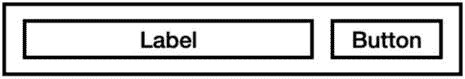
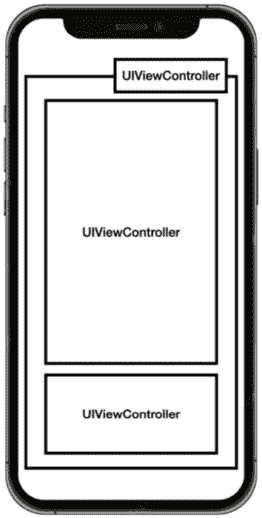
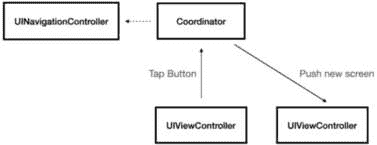
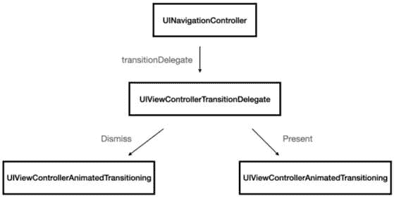

# 第七章：使用 UIKit 构建出色的用户体验

在*第六章*中，我们暂时放下了编码，讨论了那些使我们的代码演化的主题，如测试、调试等。现在，是时候回到我们热爱的事情上，而在 iOS 开发中，还有什么比构建一个出色的 UI 体验更令人喜爱呢？

对于大多数 iOS 开发者来说，UIKit 被认为是继 Foundation 之后最重要的框架，在 iOS 面试中，它是一个必考话题。

尽管 UIKit 是一个庞大的框架，但本章将涵盖 iOS 开发者所需的必要主题：

+   我们将回顾**自动** **布局**系统

+   我们将讨论不同的**UIView**功能

+   我们将确保对**UITableViews**有深入的理解

+   我们将讨论**UIViewController**及其在我们应用中的作用

+   我们将深入导航的世界

+   我们将学习动画的基本概念

正如我所说——UIKit 是一个巨大的主题，还有很多其他内容，但我们专注于必须面试的问题。

我们将从驱动我们布局的东西开始，那就是自动布局系统。

# 回答关于自动布局的问题

UIKit 是一个庞大的主题，多年来，它已经变得更为重要，获得了越来越多的功能。

驱动屏幕上元素布局的引擎，苹果称之为自动布局（Auto Layout），这就是为什么我选择以这个主题为起点来开始 UIKit 章节。

自动布局是苹果技术，它定义了屏幕上不同元素之间的*关系*，极大地影响了我们快速进行 UI 开发的能力。我们可以这样说，掌握自动布局使我们能够在合理的时间内提供出色的 UI。

但这不仅仅是时间效率——自动布局可以帮助我们*适应不同的屏幕尺寸*或甚至平台（**iPad**与**iPhone**），它还可以帮助我们根据当前的本地化自动设置 UI 方向。

现在，我们将回顾一些最常见的自动布局问题。这不是 UIKit 章节的一个极好的开始吗？

## “你能解释一下在自动布局中内容吸附和压缩抵抗是什么，以及它们是如何用来控制 UI 元素布局的吗？”

*为什么这个问题很重要*？

**压缩抵抗**和**内容吸附**是自动布局中的两个基本概念，它们定义了当视图的大小和布局发生变化时视图的行为。在这个阶段，面试官假设我们已经了解了自动布局的基础知识，并想看看我们如何处理更复杂的情况，即两个不同的视图在有限的区域内“争夺”空间以满足所有约束。

*什么是* *答案*？

压缩抵抗和内容吸附是 UIView 的属性，当没有足够的空间来满足所有约束时，它们定义了布局行为。

让我们来看看这些术语对约束的含义：

+   **内容紧缩**：当内容紧缩被设置为高优先级时，视图希望沿着特定轴尽可能小。

+   **压缩阻力**：当压缩阻力属性被设置为高时，视图希望沿着特定轴尽可能大。

一个很好的例子来展示两个视图之间可能存在的冲突是一个 UIView（比如说`UITableViewCell`）有两个子视图——一个引导标签和一个按钮（见图 7.1*）：



图 7.1 – 带有标签和按钮的视图

查看图 7.1。1，我们可以看到一个可能的用例——标签和按钮都可以有简短的文字，因此它们的固有内容大小很小。如果这两个视图尝试根据其内容设置宽度，其中一个将不得不“放弃”并填充剩余的空间。为了确保按钮会尝试尽可能小，而标签会填充剩余的空间，我们需要相应地设置它们的内容紧缩和压缩阻力。让我们看看如何在代码中做到这一点：

```swift
class MyTableViewCell: UITableViewCell {    @IBOutlet weak var label: UILabel!
    @IBOutlet weak var button: UIButton!
    override func awakeFromNib() {
        super.awakeFromNib()
        label.setCompressionResistancePriority (.defaultHigh, for: .horizontal)
        button.setContentHuggingPriority (.defaultHigh, for: .horizontal)
    }
}
```

为`label`调用`setCompressionResistancePriority`意味着当单元格水平调整大小时，自动布局系统将尝试保持标签的固有内容大小并*防止其*被压缩。

然而，为按钮调用`setContentHuggingPriority`意味着当单元格水平调整大小并且有额外空间可用时，自动布局系统将*尝试扩展*`button`以填充可用空间并防止其过度拉伸。

我们可以在代码和 Interface Builder 中非常容易地设置这些优先级。

有许多其他例子需要这种解决方案，例如页面标题的宽度与其对齐方式冲突，或者具有动态字体大小的复杂屏幕。

## “你能解释一下如何在 Interface Builder 中使用尺寸类别来适应不同屏幕尺寸和方向的布局吗？”

*这个问题为什么重要？*

这个问题很重要，因为它通过使用自动布局并尝试将我们的布局适应于*不同的大小*和*方向*来测试我们的理解。

注意，我没有提到 iPad 或 iPhone——在讨论自动布局时，这些术语是不相关的。我们必须根据不同的尺寸级别全面考虑我们的布局，也就是所谓的尺寸类别。

*答案是什么？*

**尺寸类别**是一个功能，允许我们为各种屏幕尺寸创建一个 UI。屏幕尺寸可以是 iPhone 或 iPad，也可以是正在分割屏幕上展示的 iPad 应用，因此需要将其布局更改为 iPhone 应用。

我们今天有的类是**紧凑型**和**常规型**。紧凑型通常意味着在分割屏幕上的 iPhone 或 iPad 应用，而常规型意味着 iPad 应用。如前所述，我们不应该将这些类别视为 iPhone 与 iPad 之间的对比。尺寸类别允许我们无论应用设备如何都能以响应式的方式思考。

要在 Interface Builder 中使用尺寸类别，我们首先需要打开我们想要工作的故事板。然后，在 `w Any h Any` 类的右下角，这意味着布局将适用于所有设备和方向。我们可以从控制面板中选择另一个尺寸类别来为特定屏幕尺寸或方向创建不同的布局。例如，我们可以选择 `w Compact h Regular` 类来为竖屏方向的 iPhone 创建布局。

一个很好的用例是登录屏幕，在小型屏幕上，我们希望用户名和密码文本字段垂直布局，而在大屏幕上，我们可能希望它们水平布局。可以根据尺寸管理文本字段的布局。

不同尺寸类别中的不同值示例包括字体、Auto Layout 和固定大小。

## “Auto Layout 中的安全区域有什么作用？你如何确保你的视图在安全区域内正确定位？”

*这个* *问题为什么重要？*

当在不同设备上处理布局时，**安全区域**是一个重要的话题。每个 iOS 开发者都必须知道如何处理安全区域，它包含状态栏、传感器和现代 iPhone 的圆角。这个问题测试了我们与不同设备工作的经验，以及创建与设备类型无关的布局的能力。

*答案是什么？*

安全区域是 Auto Layout 中的一个功能，它提供了一个 **布局指南**，帮助我们定位屏幕上为传感器、圆角以及用户不应触摸的一般区域预留的区域上方和下方。

然而，我们可以在安全区域区域内定位非交互视图，例如视频或背景。尽管如此，我们必须考虑到 iOS 元素、传感器和屏幕圆角可能会部分覆盖这些视图。

为了确保我们将视图定位在安全区域之外，我们可以使用一个名为 `safeAreaLayoutGuide` 的属性。以下是一个使用 `safeAreaLayoutGuide` 将标签定位在顶部安全区域下方的示例：

```swift
    NSLayoutConstraint.activate(      myLabel.leadingAnchor.constraint(equalTo:
          view.safeAreaLayoutGuide.leadingAnchor),
      myLabel.trailingAnchor.constraint(equalTo:
          view.safeAreaLayoutGuide.trailingAnchor),
      myLabel.topAnchor.constraint(equalTo:
         view.safeAreaLayoutGuide.topAnchor, constant: 30),
      myLabel.heightAnchor.constraint(equalToConstant: 20)
```

我们可以看到 `view`，即 UIViewController 的主视图，有一个名为 `safeAreaLayoutGuide` 的属性，而这个指南代表安全区域区的末端。这个指南相当于旧设备上的屏幕边缘，但在现代设备上，它意味着显示器的交互部分。

最佳实践是使用不同的设备检查你的布局，以确保它在所有显示设备上可用。

Auto Layout 是 UIKit 和 iOS 开发中的基本主题。没有与 Auto Layout 亲密合作就无法进入 UI 开发，UI 是 iOS 中的一个重要主题。如果你以 SwiftUI 开始你的 iOS 开发生涯，确保你熟悉 Auto Layout，至少是基本术语。

# 解决 UIView 问题

UIView 是 iOS UIKit 中用户交互的基本构建块。在本质上，它代表屏幕上的一个矩形，可以显示图形并处理用户交互和动画。

在我们讨论任何面试问题之前，理解 UIView 在 UIKit 中的作用及其与 CALayer 的关系至关重要。

让我们回顾一下 UIView 的主要功能：

+   **管理子视图**：UIView 可以包含额外的 UIView，称为**子视图**，这些子视图可以包含它们自己的子视图。这种能力使我们能够构建复杂的 UI 和可重用组件。UIView 还负责使用我们在上一章中讨论的自动布局系统处理其子视图的布局。

+   **响应用户交互**：UIView 另一个重要的角色是响应用户交互，这并非一个微不足道的话题。准备面试涉及学习**响应者链**，它处理与 UIView 层次结构的用户交互。

+   **绘制图形**：UIView 可以绘制图形：线条、形状、图像和文本。UIView 使用另一个名为**Core Graphics**的框架来完成这项工作，该框架负责使用**CPU**绘制基本图形。

那么，CALayer 呢？好吧，我们已经知道 UIView 可以使用 Core Graphics 进行绘制，但这并不是一个高效的方法。因此，它有一个 CALayer。CALayer 负责绘制 UIView 内部的内容，它使用**Core Animation**和设备的**GPU**。每个 UIView 都有一个主要的 CALayer，它可以有自己的子层。

CALayer 负责内容绘制，而 UIView 负责布局和用户交互。

## “你能解释一下在 iOS 中响应者链是如何工作的吗？”

*为什么这个问题很重要？*

响应者链是 iOS UI 开发中的一个关键概念。这个概念讨论了多层屏幕中用户交互的管理。

这个问题至关重要，因为用户交互是 UI 开发中的一个关键主题，响应者链并不是一个一开始就能简单理解的概念。

*答案是什么？*

“响应者链”这个术语指的是用户触摸屏幕时的一种机制，每个 UIView 将触摸传递给其对应的子视图，直到其中一个视图做出响应。

让我们在*图 7.2*中探索这个问题：

![图 7.2 – iOS 中响应者链的示例图 7.2 – iOS 中响应者链的示例如*图 7.2*所示，触摸从`UIApplication`开始，向下传递，直到它达到第一个响应触摸的视图，在这种情况下，是`UITextField`。响应链“询问”每个视图是否是第一个响应者，通过调用`becomeFirstResponder()`函数。这就是为什么直接在文本字段上调用`becomeFirstResponder()`会弹出键盘，并使文本字段成为当前活动输入字段的原因。简而言之，响应者链是我们控制哪个视图在视图重叠时捕获用户交互的能力。还有更多情况下这很有用，比如透明视图或滚动视图。## “你如何在 UIView 中响应设备方向变化？”*为什么这个问题很重要？*在许多应用程序中，响应设备方向至关重要，因为它通过旋转设备为用户提供了一个可选的布局。但这并不是正确理解这个问题的真正原因。我们应该知道如何构建我们的 UI 以支持不同的屏幕比例，并根据新的方向调整布局和控制。这个问题测试了我们的灵活性和对激进布局变化的准备情况。*答案是什么？*处理设备方向变化需要从不同的角度来解决问题。让我们列出我们可以做的事情：+   **验证我们的 Auto Layout 约束**：Auto Layout 是一种确保在更改屏幕边界后布局仍然可用的优秀技术。我们可以定义约束关系并限制视图大小或边距，以确保布局能够随着方向的变化正确更新。+   **动画变化**：如果可能的话，我们应该对视图的变化进行动画处理，以向用户提供无缝且平滑的变化体验。+   **重写 willTransition(to:with)方法**：在视图过渡到新大小或特性集合之前，**willTransition(to:with)**方法会被调用。这就是我们可以在 Auto Layout 已经更改的基础上修改视图外观的地方。例如，我们可以显示或隐藏子视图，更改文本或修改约束值。+   **更新布局**：定位或重新排列视图，并在一般情况下，根据我们的设计和产品要求对布局进行更改。当然，这是根据我们的设计和产品要求来进行的。并非所有应用程序开发者都支持他们的产品中的横屏和竖屏状态，因为这更多的是一个设计决策而不是一个工程决策。但考虑到方向变化来构建我们的视图是一个好的实践。## “为什么 UIView 没有像 UIViewController 那样的‘viewDidAppear’方法？”*这个问题为什么重要？*我们还没有讨论视图控制器，但这是一个许多候选人难以回答的问题。这个问题旨在了解我们是否理解 UIView 与其视图控制器之间的关系。许多初级开发者会问自己这个问题，因为理解 UIView 的角色并不直观。更有经验的开发者应该更容易回答这个问题。*答案是什么？*UIView 没有像**UIViewController**那样的`viewDidAppear`方法，因为 UIView 的主要角色是作为一个视觉组件，而不是处理生命周期事件。当我们回顾`viewDidLoad`、`viewWillAppear`和`viewDidAppear`时。如果我们需要在生命周期事件中执行任务，例如执行网络请求、加载数据或设置状态，我们应该在视图控制器中执行这些操作并相应地更新视图。执行这些操作中的任何一项都不是 UIView 的角色。MVC 将在*第十一章*中详细讨论。## “你能解释一下 setNeedsLayout、layoutSubviews 和 layoutIfNeeded 在 UIView 中的区别吗？你会在什么情况下使用这些方法，它们如何影响布局过程？”*为什么这个问题很重要？*这三个 UIView 方法（`setNeedsLayout`、`layoutSubviews`和`layoutIfNeeded`）讲述了 UIView 渲染周期优化的故事。这不仅仅是一个是/否的问题，更像是一个加分问题。在我的职业生涯中，我面试了数百名 iOS 开发者，其中大多数人无法完全回答这个问题，因为他们并不完全理解布局系统是如何工作的。正确回答这个问题将有助于我们在面试场合。*什么是* *答案？*首先，让我们了解布局系统是如何工作的——UIView 在每次屏幕刷新率时刷新其子视图的布局（在 60Hz 中，它每 16.67 毫秒刷新一次），只有当它需要时。这意味着什么？例如，如果视图改变了它的 frame，它必须刷新其子视图的布局。它每 16.67 毫秒发生一次的原因是效率。如果我们在这 16.67 毫秒内多次更改 UIView 的 frame，它将只刷新一次其子视图的布局。现在，"刷新其子视图的布局"是什么意思？这意味着系统会运行`layoutSubviews()`方法，我们可以覆盖它并执行我们喜欢的额外更改。我们现在明白，改变 UIView 的 frame 会将视图标记为“脏”，因此在下一次运行循环中，它将运行`layoutSubviews()`。但我们不必改变它的 frame 或相关的约束来标记视图为脏。我们只需调用`setNeedsLayout()`来确保视图将在下一个运行循环中更新其子视图。有时候，我们需要视图立即运行`layoutSubviews`，而不必等待下一个运行循环。一个很好的例子是动画和约束变化。在这种情况下，我们可以调用`layoutIfNeeded()`，这只会调用`layoutSubviews()`，如果 UIView 被标记为脏。现在很清楚为什么我们从不直接调用`layoutSubviews()`——系统会为我们更高效地完成这项工作，并且坚持自然过程会更好。正如我在本节开头所说——UIView 是我们的 UI 构建块，也是 MVC 和**MVVM**的基本组成部分之一。理解它如何工作，而不仅仅是添加和删除子视图，对我们 iOS 开发者来说至关重要，并且可以帮助我们影响我们的应用性能和体验。此外，本节中讨论的一些问题将在面试中被问到。现在，让我们转向 MVC 模式另一个重要的方面：UIViewController。## “frame 和 bounds 属性之间的区别是什么？”*为什么这个问题很重要？*尽管`bounds`和`frame`非常相似，但它们之间的区别对于理解布局系统的工作方式至关重要。这种区别在处理动画、定位和转换时尤为重要。*答案是什么？*简而言之，`frame`属性表示 UIView 相对于其父视图坐标系统的位置和尺寸，而`bounds`属性表示 UIView 相对于其自身坐标系统的位置和尺寸。以下是一个关于相同视图的`bounds`和`frame`属性的示例，该视图位于*x*:50 和*y*:100：+   帧大小：    +   原点：(*x*: 50，*y*: 100)    +   尺寸：(宽度：200，高度：150)+   边界：    +   原点：(*x*: 0，*y*: 0)    +   尺寸：(宽度：200，高度：150)我们可以看到原点不同，但尺寸相同。这是因为帧中的原点是相对于其父视图的。然而，需要注意的是，在某些情况下，帧和边界的大小可能不同。与表示视图在其自身坐标系统中的尺寸的`bounds`属性不同，帧大小是在动画过程中计算和可能改变的。因此，在`frame`和`bounds`属性之间可能会观察到不同的尺寸值。虽然边界尺寸属性保持不变，但帧尺寸属性可以在动画或转换期间反映当前尺寸值。# 理解关于 UIControler 的一切在 iOS 开发中，UIControler 是一个核心类，它作为使用 UIKit 的大多数 iOS 应用的构建块。在 iOS 开发中，UIViewController 扮演着多个角色：+   **它是 MVC 模式中的 C**：如果 UIView 是 V（视图）而我们的模型是 M，那么 UIViewController 就是协调表示层和业务层之间的那个。这个角色影响了许多与 UIViewController 相关的功能，例如生命周期事件和内存管理功能。+   **处理生命周期事件**：我们在上一节中解释了 UIViewController 的这个角色。UIViewController 还有一个功能：管理屏幕上的各种生命周期事件。通过创建 UIViewController 的子类，我们可以利用其不同的方法来处理屏幕生命周期的所有阶段。+   **导航系统中的领先者**：我们可以将 UIViewController 显示在另一个 UIViewController 之上，或者将其推入和从导航堆栈中弹出。因此，通过代表项目中的“屏幕”（注意——一个 UIViewController 并不等同于“屏幕”，但一个屏幕始终有一个根视图控制器），UIControler 在 iOS 应用导航中发挥着重要作用。+   **加载和卸载视图**：通常，我们不会在没有处理它们的 UIViewController 的情况下在屏幕上显示视图。我们确实可以向应用程序窗口添加 UIView，但这只是一个特殊情况。将视图添加到窗口会带来许多问题，如生命周期管理、模型和数据链接等，这些都不被认为是理想的。我不确定作为 iOS 候选人，我们是否会遇到一个不涉及 UIViewController 问题的面试。## “你能按发生的顺序列出所有 UIControler 的生命周期事件或方法吗？”*为什么这个问题很重要？*这可能是面试官最常问的问题之一。这个问题并不难，而且也容易学习和完成。这个问题通常被认为是面试过程中的一个关键因素，因为表现不佳可能会引起大多数面试官的担忧。让我们理解一下原因——我们对 UIViewController 生命周期事件的了解会影响我们关于在哪里加载数据和释放数据、如何构建我们的 UI、执行动画以及为用户提供良好用户体验的决定。熟悉 UIViewController 生命周期对于处理用户交互和视图更新也很重要。我们需要确保我们的答案对此问题的回答没有遗漏。*答案是什么？*让我们按调用时间顺序列出生命周期事件：+   **loadView()**: 这是在视图层次结构创建之前被调用的。UIKit 在调用 **loadView()** 之前不会创建视图，因此当我们访问 UIViewController 的 **view** 属性时，会得到 nil。+   **viewDidLoad()**: 这是在视图加载之后被调用的。在那里我们可以对视图进行额外的设置，例如添加子视图和观察者。与许多其他生命周期方法不同，**viewDidLoad** 只会被调用一次。+   **viewWillLayoutSubviews()**: 这是在视图布局其子视图之前被调用的。我们可以在此时对约束进行额外的修改。+   **viewDidLayoutSubviews()**: 这是在视图布局其子视图之后被调用的。我们可以执行需要最终布局的任务。例如，定位视图、滚动视图内容大小和动画。+   **viewWillAppear()**: 这是在视图在屏幕上呈现之前被调用的。UIKit 会调用该方法一次或多次。如果需要，那是一个加载数据的好地方。+   **viewDidAppear()**: 这是在视图已经在屏幕上呈现之后被调用的。UIKit 会调用该方法一次或多次。通常，那是一个展示开始动画的好地方。+   **viewWillDisappear()**: 这是在视图即将从父视图控制器中移除或被模态视图控制器隐藏之前被调用的。我们可以在那里执行一些清理任务，例如停止计时器和动画、执行保存操作或停止媒体播放。+   **viewDidDisappear()**: 这是在视图从父视图控制器中移除之后被调用的。我们通常执行不会影响用户体验的任务——例如，记录日志、保存状态、清理临时文件和重置数据。强调一点，列表中的某些方法在不同的用例中可能会被多次调用。例如，当主视图的大小改变时，如方向改变，`viewWillLayoutSubviews` 可能会被调用。`viewWillDisappear` 方法可能在模型在视图控制器之上呈现时被调用。我们应该提供每个生命周期事件的示例来展示我们的理解。## “你能解释一下 UIViewController 容纳的概念吗？你如何在你的应用中实现它？”*为什么这个问题重要？*与前一个问题相比，这个问题更高级，需要了解设计模式和架构知识。**`UIViewController`包含**功能创建模块化和可重用的 UI 界面，并增加了我们的项目灵活性。*什么是* *答案？*使用`UIViewController`包含，我们可以将一个视图控制器添加到另一个视图控制器中，并使其成为子视图控制器。这与添加子视图不同，因为`UIViewController`代表一个独立的 MVC 单元，并有其自己的职责。看看*图 7**.3*：

图 7.3 – 将屏幕划分为不同的视图控制器

*图 7**.3*显示，由`UIViewContoller`表示的屏幕被划分为两个额外的视图控制器。

添加视图控制器子控制器主要有两种方式：

+   **在故事板中拖动一个新的视图控制器**：我们可以使用 Xcode **Storyboard**将一个新的视图控制器拖动到一个现有的视图控制器上。这会创建一个容器视图，它与另一个视图控制器相关联。因为单个**XIB 文件**代表一个视图控制器或视图，所以我们只能在故事板中这样做，而不能在标准的 XIB 文件中这样做。

+   **使用代码添加子控制器**：我们可以使用`**addChild(UIViewController:)**`方法轻松地在代码中添加一个新的子视图控制器。让我们看看一个例子：

    ```swift
    // Add child view controllerparentViewController.addChild(childViewController)parentViewController.view.addSubview (childViewController.view)childViewController.view.frame = parentViewController.view.boundschildViewController.didMove(toParent: parentViewController)
    ```

我们需要执行四个步骤：

1.  调用`**addChild**`方法以确保新的`UIViewController`被添加到视图控制器层次结构中作为子控制器。

1.  将新的视图控制器主视图*作为子视图*添加到父视图控制器。视图层次结构需要与视图控制器层次结构相对应。

1.  设置子视图控制器的*视图框架或约束*。它可以是我们需要的任何东西。

1.  *通知系统*子视图控制器已被移动到父控制器。

按照指南添加新的视图控制器“根据指南”的一个优点是，我们可以同步我们在前一个问题中讨论的生命周期事件。当在父视图控制器上调用`viewWillAppear`方法时，只要它们被正确添加，也会在子视图控制器上调用。当将视图控制器作为不同屏幕上的子视图控制器重用时，生命周期事件的同步至关重要。

我们已经在我们的应用中使用`UIViewController`包含功能了！

如果你之前没有尝试过，你可能会觉得`UIViewController`包含很奇怪。但——很可能是，你已经在你的应用中使用了一些形式的子视图控制器实现。让我们看看两个好的例子：

**UINavigationController**: 在 UIKit 中导航是通过父视图控制器（UINavigationController）和子视图控制器，即顶部视图控制器来完成的。想象一下你自己实现自己的导航控制器——你会怎么做？你将如何实现推入和弹出视图控制器的动作？这是一个很好的思考练习，可以帮助你为这个问题做好准备。

**UISplitViewController**: 苹果为在 iPad 上运行的应用程序提供了一个分割视图控制器。在 UISplitViewController 中，我们有两个额外的子视图控制器——主视图控制器和详细视图控制器。两者都将屏幕分为两个不同的区域，每个区域都是一个独立的视图控制器。现在你知道了如何添加子视图控制器，这很简单。

## “如何在 iOS 中在视图控制器之间传递数据？”

*为什么这个问题很重要？*

在 iOS 开发中，在视图控制器之间传递数据是一个重要的任务。应用程序动态呈现相同 UI 但包含不同信息的特点要求我们不断更新视图控制器以包含新信息。这个问题测试了我们对于在对象之间，尤其是视图控制器之间传递数据的各种设计模式的知识。

*答案是什么？*

在视图控制器之间传递数据有许多方法！问题是所有这些方法都使得回答问题变得极其容易。因此，我们需要解释我们向面试官展示的每一种方法的用例和原因。让我们看看一些例子：

+   **使用代理**: 如果我们有一个子-父关系，我们使用代理来通知子视图控制器和父视图控制器之间的事件和数据。代理是一个简单的基于协议的模式，当我们想要实现一个具有明确定义接口的简单更新时使用。然而，随着今天有更多高级模式，代理模式被认为有点过时了。

+   **使用依赖注入**: 在呈现或推入堆栈时将数据传递给新的视图控制器的一种方法是通过依赖注入。这可以通过使用**init**函数或设置其属性之一来实现。一个例子可以是一个显示联系信息的屏幕。在**init**函数中，我们可以传递需要显示的联系实体。需要注意的是，这种方法创建了一个单向数据流，并且可以在需要显示新的视图控制器时使用。

+   **使用闭包**: 如果我们只向一个方向传递信息，闭包是一个很好的方法。我们可以在目标视图控制器上定义一个闭包，并将其设置在源视图控制器上。每当我们要从源传递信息到其父控制器时，源只需要运行带有相关参数的闭包。这是一个简单的方法，以最小的耦合传递数据。

+   **使用 Combine**: Combine 是闭包的高级和响应式版本。它允许我们从一个对象向另一个对象流式传输数据更新，包括错误处理、异步操作和数据操作。

+   **发布通知**：如果两个视图控制器没有相互引用，通知可能是一个好的解决方案。尽管我们可以将数据附加到通知上，但许多开发者认为发布通知是一种反模式。通知没有直接的接口；所有活动对象都可以观察它并做出响应。仅仅这两个原因就使得它不如其他方法推荐。

你已经了解了我刚刚展示的所有方法，但列出它们可以帮助你回答那个问题，并帮助你完成设计模式任务和家庭作业。这是本书的一个目标之一——组织你的思想。

# 确保我们准备好使用 UITableView

UITableView，随后是 UICollectionView，是 UIKit 中最古老的 UI 组件之一。事实上，UITableView 从一开始就存在，而 UICollectionView 是在四年后被添加的。

为什么 UITableView 被认为是一个基本组件？原因很明显。

两者，UITableView 和 UICollectionView，都擅长高效且直接地显示大量数据。

UITableView 不仅于此 – 它提供了一个界面，用于以适合 *小屏幕* 的方式显示项目，包括多选、编辑、头部和尾部等特性。它成为许多应用程序显示菜单和数据的主要方式。

Apple 确保了从第一天起将组件样式 UITableView 带到 SwiftUI 中，以保持这种能力。

## “如何在 UITableView 中实现队列机制，以及有哪些最佳实践可以优化其性能？”

*为什么这个问题很重要？*

就像我们之前讨论的几个问题（例如 – UIViewController 生命周期）一样，这也是一个你可能会想要确保准备好的去或不去的问题。这个问题测试了我们对于使 UITableView 高效和性能良好的主要机制的理解。

UITableView 的队列机制是许多顶部特性和我们可能遇到的问题的基础，例如滚动时的异步操作、优化和状态管理。

那个机制也是 UICollectionView 和 MKMapView 等附加控件的基础。

*这个答案是什么？*

UITableView 机制确保在滚动大量数据时效率和性能高。

显示大量项目的主要问题是 *内存*。分配如此多的视图，其中大多数在屏幕之外，会导致内存过载，最终导致应用程序终止。

我们想要做的是只分配屏幕上看到的视图，并在滚动列表时释放屏幕外的视图。

但每次分配新视图都会引发性能问题。如果用户滚动速度快，分配和创建新视图需要几毫秒，这即使在强大的设备上运行也会造成延迟。

这种延迟是队列解决方案开始实施的地方。当视图离开屏幕时，UITableView 不会将其销毁，而是将其放入 deque 池，并在需要显示列表中的新视图时从池中取出。

队列机制使得 UITableView 滚动快速且平滑。但 dequeuing 单元格也带来了新的问题，其中一些问题在此详细说明：

+   **处理现有单元格**：在我们显示单元格之前，我们必须记住它可能已经存在信息。我们需要在单元格从池中移出后通过调用**prepareForReuse**方法或在我们显示它之前覆盖其属性来清除单元格。

+   **验证异步操作响应**：在 UITableView 中，一个常见问题是异步从后端服务加载图片。我们在单元格显示时开始请求，但当我们得到响应时，单元格已经被 dequeued 并连接到另一个实体。在这种情况下，我们需要确保我们得到的响应数据与单元格应该表示的当前实体相匹配。

+   **与多个池一起工作**：有些情况下，我们拥有多种类型的单元格，可能基于不同的类和 UI。在这种情况下，我们需要创建多个 deque 池，我们还需要处理并确保它们。

总结来说，UITableView 提供了一个出色的机制来显示大量信息，但也带来了我们必须处理的新问题。

## “UITableView 中的分页是什么，你将如何实现它以高效地加载和显示大量数据，同时保持良好的性能和用户体验？”

*为什么这个问题很重要？*

当我们想到 UITableView 时，我们会想象联系人列表或披萨食谱。但有时它可能需要时间来加载数据，或者列表太大，以至于造成内存过载。例如——社交媒体帖子、图片和后端的数据。从我们的角度来看——无限数量的项目。

面试官想看到我们如何处理比仅显示一个关闭的项目列表更复杂的情况。

*这个答案是什么？*

**UITableView 中的分页**是一种技术，它涉及根据表格视图的滚动位置分批加载和显示数据。

当我们拥有大量数据时，我们使用分页，同时加载所有数据是不高效的。例如，如果我们有来自后端的数据或存储在我们持久存储中的大图片和视频。

使用分页，我们加载屏幕上要显示的数据（以及一点点更多），当用户继续滚动时，我们加载“另一页”的数据。这种按需加载数据的技术对于初始加载来说要快得多，不会造成内存过载，并且总体上更高效。

然而，分页创建了一些我们需要解决的挑战，这些挑战在此详细说明：

+   **决定页面加载触发器**：为了执行额外的加载操作，我们需要决定加载触发器。例如，当用户达到最后一个可见行或滚动偏移量时加载数据。此外，我们需要确保我们不会同时发送多个请求，因为触发器可能会在滚动过程中多次发生。

+   **显示加载指示器**：向用户提供一个指示还有更多数据可以查看并且正在加载是很重要的。在列表底部最后一行显示指示是常见的做法。

+   **在后台加载数据**：为了提供平滑的滚动而不会阻塞 UI 和产生延迟，我们应该使用异步函数、GCD 或**NSOperation**在后台线程中加载数据。

+   **处理“没有更多数据”的情况**：这听起来可能像是一个奇怪的问题，但开发者有时会忘记处理它。当用户滚动到列表的最后一项时，加载更多数据的触发器被激活。如果请求返回空数据，触发器可能会再次被激活，因为我们的列表满足了触发条件。在这种情况下，列表将进入一个无限循环，试图获取数据但没有结果。解决方案可能是使用一些临时标志来避免持续获取。

分页是一种既有优点也有缺点的技术，需要仔细考虑。它涉及到后端和客户端，可以提供高性能和良好的用户体验，但需要我们处理更复杂的获取模式。

## “在 UITableView 中调整单元格大小的不同方法有哪些，以及你是如何根据它们将要显示的内容确定单元格的最佳大小的？”

*为什么这个问题很重要？*

在 UITableView 中，单元格大小一直是 iOS 开发者的问题，尤其是在需要可访问性和动态字体大小随时间演变的年份。

这个问题测试了我们对 UITableView 代理的了解，我们使用 Auto Layout 与单元格的能力，以及我们在性能和简单性之间需要做出的权衡。

*答案是什么？*

调整单元格大小有两种方法：

+   **为每一行设置自定义高度**：实现返回每行不同高度的**tableView(_:heightForRowAt:)**代理方法。这样，我们就需要自己计算每行的大小。它可以是固定大小或根据单元格内容。如果做得不正确，自己计算单元格大小可能会不准确，但在处理大量数据集时，它可能更快、更高效。以下是一个这样的实现示例：

    ```swift
    func tableView(_ tableView: UITableView, heightForRowAt indexPath: IndexPath) -> CGFloat {    let cellData = dataSource[indexPath.row]    let height = cellData.text.height        (withConstrainedWidth:         tableView.frame.width - 32, font:          UIFont.systemFont(ofSize: 14))    return height + 16}
    ```

在这个代码示例中，我们根据单元格的行索引获取单元格数据，并根据 UITableView 的大小计算大小。我们可以看到这个代码片段有多容易出错，因为它需要非常精确。但是——因为我们没有使用 Auto Layout 系统，所以它要快得多。

+   **使用自适应单元格**: 另一个选项是使用自适应单元格。在自适应单元格中，单元格的高度会自动根据其内容通过自动布局约束来设置。以下是一些需要注意的事项：

    +   我们必须确保单元格从上到下有一个连续的约束序列，以便获得有效的固有内容大小。

    +   我们需要确保 `UITableView` 的 `rowHeight` 属性设置为 `automaticDimension`。

    +   我们提到自适应单元格在性能方面效率较低。为了“帮助” `UITableView` 测量其大小，我们可以使用 `estimatedRowHeight` 属性或实现相应的 `tableView(_:estimatedHeightForRow:)` 代理方法来提供行高估计，直到单元格显示在屏幕上。

自适应单元格对于大多数情况来说应该足够好，除非我们遇到需要为单元格设置自定义高度的性能问题，否则它应该是我们的首选方法。

`UITableView` 是 iOS 开发和面试中的一个核心主题。编码或家庭评估可能包括 `UITableView` 作为主要组件。确保这个控件没有错误！

# 进行良好的导航

导航是 UIKit 和 iOS 开发中的一个关键组件。导航允许我们直观且简单地让用户从一个 `UIViewController` 跳转到另一个。

有两种方式将用户导航到另一个屏幕：

+   **显示模态视图控制器**: 如果我们需要显示一个需要完成任务或做出决定的屏幕，一个视图控制器可以在其上方显示另一个视图控制器。

+   **推送另一个视图控制器**: 如果我们想要将用户导航到应用层次结构的下一阶段，我们可以将新的视图控制器推入堆栈。这种技术需要一个 `UINavigationController` 来处理推送和弹出操作，并提供一个导航栏以简化过渡。

面试官通常不会问关于推送和显示的问题，因为这些操作相对简单易懂且易于实现。大多数问题和挑战都与过渡、导航栏、生命周期方法和设计模式相关。

## “视图控制器中 `navigationItem` 属性的目的是什么？你如何使用它来定制 iOS 开发中导航栏的行为和外观？”

*为什么这个问题很重要？*

`navigationItem` 属性就是这样，一个属性。为什么会有关于特定属性的问题？

嗯，这是因为 `navigationItem` 背后有一个完整的概念。这个问题测试了我们理解导航控制器工作方式和赋予视图控制器影响导航栏外观设计概念的能力。

通常，`navigationItem` 和视图控制器的工作方式是一个有趣的设计模式，可以在其他情况下使用，并且值得学习。

*答案是什么？*

每个 UIViewController 都有一个名为 `navigationItem` 的属性。该属性包含几个属性和方法，用于使用与视图控制器本身相关联的数据来自定义导航栏的行为。

例如，`navigationItem` 包含 `title` 属性，该属性用于设置在导航栏中显示的 *当前标题* 值。

可以在 `navigationItem` 中设置的其它重要信息项包括 *左右按钮*。让我们看看视图控制器如何使用 `navigationItem` 属性修改导航栏的示例：

```swift
class MyViewController: UIViewController {    override func viewDidLoad(_ animated: Bool) {
        super. viewDidLoad (animated)
        navigationItem.title = "My Title"
        let button = UIBarButtonItem(title: "Button", style: .plain, 
            target: self, action:#selector(buttonTapped))
            navigationItem.rightBarButtonItem = button
    }
    @objc func buttonTapped() {}
}
```

在我们的代码示例中，`navigationItem` 属性包含一个标题和一个带有 `"按钮"` 标题的右侧栏按钮。当用户从该屏幕导航时，导航控制器将从下一个控制器获取新的 `navigationItem` 属性并更新其导航栏属性。

这是一种使导航控制器能够根据可见视图控制器的上下文来更新其导航栏的技术。进一步思考，我们还可以在其他情况下使用这项技术。

## “iOS 中展示 UIViewController 的预设选项有哪些，为什么理解这些选项很重要？”

*为什么这个问题很重要*？

使用另一个视图控制器来展示视图控制器是 iOS 开发者经常进行的一项熟悉且直接的任务。

然而，有几种方式可以展示视图控制器。每个选项都适合不同的用例，并且可以影响展示者的视图控制器生命周期事件。

我们的职责是向产品团队解释不同的选项，并选择适合我们用例的选项。

*答案是什么*？

我们有几种预设选项可供选择。每个选项都会影响所展示的视图控制器的外观和感觉。

让我们列举一些：

+   **全屏**：所展示的视图控制器占据整个屏幕。

+   **页面视图**：所展示的视图控制器不会填满整个屏幕，可以通过简单的滑动手势向下拉动屏幕。

+   **覆盖当前上下文**：视图控制器被展示并隐藏了当前视图控制器上下文。

显然，不同类型的展示需要适合我们希望提供给用户的用户体验。但我们还必须考虑这些类型对正在触发不同生命周期事件的影响。

例如 - 如果我们使用展示视图控制器的 `viewWillDisappear` 和 `viewDidDisappear` 没有被调用。在页面视图中，我们假设底层视图控制器仍然可见。因此，一些与外观相关的生命周期事件也没有被调用。

在这种情况下，我们必须改变我们展示模态视图控制器的方式，或者使用代理模式或 Combine 来传达任何更改或更新。

规则很简单 – 我们需要调整预设选项以提供我们希望提供给用户的用户体验。我们是否隐藏了底层的屏幕？这是一个很好的起始问题。

## “你将如何设计一个使用协调器模式的 iOS 应用的导航系统，其中视图控制器不决定下一步去哪里，而是由协调器对象负责管理导航流程？”

*为什么这个问题很重要？*

这是一个关于 iOS 应用导航的高级问题，它与如何技术实现 UINavigationController 或以模态方式显示视图控制器没有直接关系。

这个问题涉及到关注点分离原则和设计模式，我们可以在项目中使用它们来提供更多的灵活性和模块化。

这是一些没有现成答案的问题之一，你可以在面试期间思考你的答案，并与面试官讨论。更重要的是，要开发一套原则和想法，以应对这个挑战。

*答案是什么？*

**协调器模式**是一种流行的设计模式，它将导航逻辑与 UI 分离。

那么，让我们来讨论如何解决这个问题，并确定我们想要保留的基本原则：

+   视图控制器（或其视图模型，无论如何）*不决定导航到哪里*，只是发送触摸事件

+   我们将导航*逻辑放在另一个名为**协调器**的类中*

+   我们可以为每个视图控制器创建一个**协调器**，或者为单个流程创建一个**协调器**。

+   **协调器**有一个对导航控制器的引用，并且可以根据需要推送或弹出视图控制器

+   **协调器**需要*观察当前显示的视图控制器中发生的事件*

基于这些假设，我们可以想象以下模式（*图 7.4*）：



图 7.4 – 协调器模式（建议）

注意，这只是一个建议，因为这个模式并不是一成不变的。

根据不同项目的需求，这里有一些我们可以提出的修改建议：

+   如果项目变得更加突出，我们可以有*多个协调器*，有时甚至是一个协调器的层次结构。

+   我们可以决定协调器*观察视图模型的状态变化*。

+   我们也不必使用观察者进行导航，而是为视图控制器提供一个*协调器的引用*。视图控制器可以向协调器发送发生了什么，协调器可以决定接下来做什么。

如果我们保持基本的设计原则并解释我们做了什么，我们可以对这个模式进行一些调整。

# 通过动画赋予用户体验力量

与许多人认为的不同，iOS 中的动画不是为了“娱乐”- 它在我们应用中提供了流畅和顺滑体验的重要作用。因此，它们是我们开发者工具集的一部分。

iOS 中的动画依赖于一个名为**Core Animation**的框架，这是 UIKit 的依赖之一。因此，尽管本章讨论的是 UIKit，我们可以在 UIKit 的许多类和方法中找到 Core Animation。

## 回顾 UIKit 中动画的核心概念

那么，在准备面试时，我们需要了解哪些关于动画的知识呢？

我们需要了解几个类、术语、方法和技巧。在我们继续讨论高级面试问题之前，让我们回顾一下它们。

### 执行 UIView 动画

UIView 动画可能是 UIKit 中最简单的动画之一。在 UIView 动画中，我们提供一个包含最终状态的闭包，UIKit 会自动运行动画。让我们看看一个代码示例，它接受一个视图并通过改变其`alpha`值来将其淡出：

```swift
UIView.animate(withDuration: 0.3) {    myView.alpha = 0.0
}
```

我们看到一段简单的代码，它接收一个持续时间和一个闭包，并在闭包内部动画化变化，在这种情况下，改变`myView`的 alpha 属性为`0.0`。注意，Core Animation 并不动画化所有 UIView 属性。以下是可动画化的 UIView 属性列表：`frame`、`bounds`、`center`、`transform`、`alpha`、`backgroundColor`和`tintcolor`。

### 动画化自动布局约束变化

我们需要理解如何动画化约束变化，因为这不像我们修改的其他属性那样直接。约束是自动布局的一部分，UIKit 在每次运行循环（每 16.67 毫秒）时都会执行自动布局变化。这意味着我们需要通过调用`layoutIfNeeded`方法“强制”自动布局在动画闭包内执行这些变化。以下是一个视图约束变化的示例：

```swift
UIView.animate(withDuration: 0.5) {    myView.topAnchor.constraint(equalTo: superview.
        topAnchor, constant: 100).isActive = true
    superview?.layoutIfNeeded()
}
```

我们可以看到，仅仅在动画闭包内创建或修改约束是不够的。我们还需要“强制”这些变化按时发生；因此，我们调用`layoutIfNeeded`方法。

### 玩转时序和缓动

我们可以通过调整动画的时序和缓动来创建用户想要感知的效果。时序意味着不同的持续时间和延迟，因此我们可以有一个更长或更短的动画。`springWithDamping`和`initialSpringVelocity`可以帮助我们实现更定制的动画缓动。让我们看看一个示例：

```swift
UIView.animate(withDuration: 1.0,               delay: 0.0,
               usingSpringWithDamping: 0.5,
               initialSpringVelocity: 10.0,
               options: .curveEaseInOut,
               animations: {
                myView.transform = CGAffineTransform
                    (scaleX: 1.5, y: 1.5)
               },
               completion: nil)
```

我们通过修改`myView`的`transform`属性并动画化这个过程来缩放`myView`的大小。我们还可以看到我们传递了这两个重要的参数：

+   **使用 springWithDamping**：这控制了弹簧效果的阻尼程度，更高的值会导致更少的振荡和更快的稳定时间

+   **initialSpringVelocity**：这控制了动画的初始速度，更高的值会导致更快的开始和更显著的效果

重要的是要调整这些值以实现期望的结果。

### 构建关键帧动画

对于更复杂的动画，我们可以使用关键帧动画。关键帧动画允许我们分阶段或序列地创建动画。我们可以定义不同的阶段，并为每个阶段提供相对持续时间和起始时间。以下是一个关键帧动画的示例：

```swift
UIView.animateKeyframes(withDuration: 3.0, delay: 0.0,    options: [], animations: {
    UIView.addKeyframe(withRelativeStartTime: 0.0,
        relativeDuration: 0.5, animations: {
        view.transform = CGAffineTransform (rotationAngle: .pi / 2)
    })
    UIView.addKeyframe(withRelativeStartTime: 0.5,
        relativeDuration: 0.5, animations: {
        view.transform = CGAffineTransform.identity
    })
}, completion: nil)
```

我们如何阅读这个代码块？很简单。整个动画的持续时间是 3 秒，并且分为两个序列。

第一个序列从开始（相对时间 0）开始并持续总时间的一半（相对持续时间 0.5，意味着 1.5 秒）。

第二个序列在总动画时间的中点开始（相对时间 0.5，意味着 1.5 秒）并持续动画时间的一半（相对持续时间 0.5，意味着 1.5 秒）。

序列不必相互同步，如果需要，由我们来同步它们。

### 在屏幕之间执行过渡

UIKit 允许我们在屏幕之间执行过渡，或者更准确地说，在 UIViewControllers 之间。我们可以选择内置的过渡之一，甚至创建自己的过渡。

这就是我们如何使用溶解动画来展示 UIViewController：

```swift
let viewController = MyViewController()viewController.modalTransitionStyle = .crossDissolve
present(viewController, animated: true, completion: nil)
```

UIKit 提供了一小部分内置动画，在很多情况下，这些动画是不够的。因此，我们有创建自定义动画甚至交互式动画的选项。

现在，在面试的背景下——就像许多其他主题一样，理解自定义过渡的工作方式很重要。我们不需要记住每个 API 的细节，但我们需要知道我们能够做什么，它打开了哪些可能性，以及如何构建它，以便在整个项目中重用。

### 操作 CALayers

我们在讨论 UIView 时提到了 CALayer，但还没有讨论它对我们作为 iOS 开发者的重要性。

我们已经知道 iOS 图形是通过层构建的——UIView（由 CALayers 支持）以及其下是 Core Animation，它是建立在**Metal**之上的。

CALayers 提供了硬件加速渲染组件，这使得我们可以操纵图形并执行复杂的动画和图像处理。我们还可以混合层并添加视觉效果。总的来说，CALayers 帮助我们深入图形架构，更接近硬件和 GPU，以实现更多功能和效率。

理解动画技术的核心概念可以帮助我们实现更好的用户体验。作为 iOS 开发者，我们预计应该熟悉提供所需动画的基本工具和类。

现在，让我们回顾一个与 UIKit 中动画相关有趣的面试问题。

## “如何在 iOS 应用中创建 UIViewControllers 之间的自定义过渡？”

*为什么这个问题很重要？*

我们在介绍动画核心概念时简要讨论了自定义过渡，这个问题测试了我们对自定义过渡 API 的经验。自定义 UIViewController 过渡 API 要求我们处理可重用性，深入理解动画的工作原理，视图控制器如何相互协作，如何执行高级技术，如快照，以及如何实现相对复杂的 UIKit API。

自定义动画被认为是一个高级主题，我们至少应该了解其基本概念。

*答案是什么？*

要在 UIViewControllers 之间创建自定义过渡，我们必须实现 `UIViewControllerAnimatedTransitioning` 协议（任何对象都可以遵守该协议）。

此协议包含两个函数：`animateTransition(using:)` 和 `transitionDuration(using:)`。

在 `animateTransition(using:)` 中，我们处理视图层次结构、约束更改和动画。

在 `transitionDuration(using:)` 中，我们返回 `TimeInterval` 中的持续时间。

`UIViewControllerAnimatedTransitioning` 定义了一个过渡，展示或消失。为了精确确定每个场景中发生的事情，我们必须实现 `UIViewControllerTransitionDelegate` 来指定哪个对象处理每个用例。

一旦我们这样做，为了使用我们的自定义过渡，我们需要将 UIViewController 的 `modalPresentationStyle` 属性设置为自定义，并将 `transitionDelegate` 属性设置为符合 `UIViewControllerAnimatedTransitioning` 的对象。

由于我们有两个不同的协议需要实现，这里的事情变得有些复杂，让我们看看 *图 7.5* 来理解所有这些是如何相互关联的：



图 7.5 – 自定义 UIViewController 过渡代理

我们可以看到，`UIViewControllerTransitionDelegate` 的主要作用是在展示或消失展示视图控制器时决定哪个对象将处理动画。值得一提的是，这三个组件可以是同一个对象，这就是可重用性概念所在。如果我们希望能够在整个项目中重用我们的过渡，我们需要做两件事：

1.  将不同对象的 *不同组件* 分离。

1.  在动画过程中，应通过协议而不是直接引用原始视图控制器类来减少展示/展示视图控制器与过渡对象之间的耦合，使用协议。例如，假设我们正在将一个视图从一个控制器动画到另一个控制器。在这种情况下，我们不应直接使用视图的引用，而应使用具有 **getView()** 方法的协议，这样我们就可以与另一个视图控制器重用它。

正如我们所见，视图控制器之间的过渡是一个涉及不同技术的高级 iOS 开发者需要完成的任务。然而，这个概念至少需要做一次，才能完全理解它。

# 概述

在这一章中，我们讨论了许多与 UIKit 相关的重要主题，例如 UIView、UIViewController、UITableView、导航和动画。UIKit 在 iOS 开发者日常工作中占有巨大比重，并对用户体验产生了重大影响。

但——UIKit 也被认为是“旧”的 UI 框架。iOS 开发界正在向一个新、更现代的声明式编程时代过渡。

我们接下来的章节将专门处理这个问题——SwiftUI 和声明式编程。
