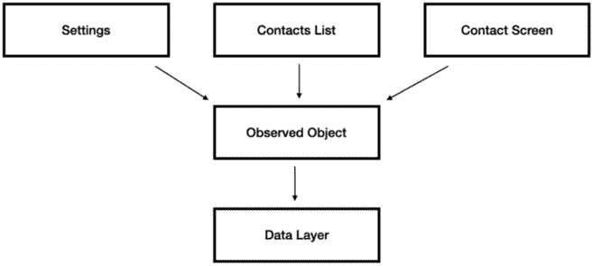

# SwiftUI 和声明式编程

前一章内容非常密集。我们讨论了 iOS 开发中最关键的框架，除了**Foundation**之外。

本章不仅仅讨论一个框架——我们将讨论一个理念，一个**编程范式**。

现在要在 iOS 领域参加面试，如果没有对声明式编程的基本了解，那几乎是不可能的，而几年前这个话题还只是“锦上添花”。

如果你知识体系中有空白或经验有限，在开始面试之前，请仔细阅读本章，以填补这些知识空白。

本章涵盖了声明式编程中的这些令人兴奋的话题：

+   探索开发新时代

+   理解声明式编程

+   学习状态和可观察对象

+   导航 SwiftUI 视图

+   精通 SwiftUI 的生命周期

+   精通 Combine

让我们从声明式编程的简要背景开始。

# 进入一个新开发时代

SwiftUI 和 Combine 不仅是有趣的框架，而且象征着苹果引领我们走向的新方向。这个方向并非与当前行业标准脱节，正如我们从许多开发者的日常工作中观察到的**React**、**Flutter**和**RxJava**的存在。

我选择将整整一章内容献给这两个尚未被广泛使用的框架的原因是，这两个框架标志着 iOS 项目在未来十年将呈现出的样子。

如果你到目前为止还没有任何关于 SwiftUI 和 Combine 的经验，你应该至少做到理解基本术语和概念，这些都是本章目标的一部分。

首先，让我们回顾最重要的概念——声明式编程。

# 理解声明式编程

声明式编程是一种全新的编程范式，它为我们提供了更易读和更健壮的代码。实际上，声明式编程根本不是什么新概念——事实上，我们可以在 30-40 年前找到声明式编程的根源。但只有在过去十年中，声明式编程才变得流行起来。

让我们通过回答我们可能在面试中遇到的一些问题，来更详细地了解声明式编程。

## “声明式编程与‘经典’编程范式（也称为命令式编程）有什么区别？”

*为什么这个问题很重要？*

如果我们面试的公司在其项目中使用 Combine 或 SwiftUI，我们可能不得不回答这个问题的某个变体。原因是我们在处理代码的方式上的差异如此之大，以至于我们无法避免重组我们的思维来回答这个问题。

*答案是什么？*

在声明式编程中，我们**关注代码的输出和结果**。我们观察变化，并精确地定义其他对象的结果以及数据如何被操作。

在命令式编程中，我们**关注导致我们结果的一系列步骤**。

初看起来，这种差异并不明显。什么是“关注结果而不是步骤”？ 

让我们尝试用代码示例来解释。

我们有一个带有按钮（`UIButton`）和文本字段（`UITextField`）的屏幕，我们希望根据文本字段输入启用或禁用按钮。让我们看看我们如何在命令式编程中做到这一点：

```swift
import UIKitclass ViewController: UIViewController {
    @IBOutlet weak var textField: UITextField!
    @IBOutlet weak var button: UIButton!
    override func viewDidLoad() {
        super.viewDidLoad()
        textField.addTarget(self, action: #selector
            (textFieldDidChange(_:)), for: .editingChanged)
        button.isEnabled = false
    }
    @objc private func textFieldDidChange(_ textField: UITextField) {
        button.isEnabled = textField.text?.isEmpty == false
    }
}
```

代码应该是直接的，因为我们与命令式编程一起编写了这个模式数百次。在 iOS 开发中，将委托连接到文本字段是常见的。但看看它有多不清楚——当我们设置文本字段时，我们定义的是当用户更改文本时将调用哪个函数，而不是会发生什么。这意味着我们关注的是步骤和实现，而不是最终结果。

在文本字段委托函数中，我们确实更新了按钮的`isEnabled`属性，但这段代码是在另一个函数的另一个地方调用的，可能甚至在另一个文件中。

让我们看看对这个问题的声明式方法：

```swift
import Combineimport UIKit
class ViewController: UIViewController {
    @IBOutlet weak var textField: UITextField!
    @IBOutlet weak var button: UIButton!
    private var subscriptions = Set<AnyCancellable>()
    override func viewDidLoad() {
        super.viewDidLoad()
textField.publisher(for: \.text)
         .map { $0?.isEmpty == false }
         .assign(to: \.isEnabled, on: button)
      .store(in: &subscriptions)
}
}
```

在前面的代码中，我们可以看到一个更清晰的解决方案，可以根据文本字段输入启用按钮。我们观察文本字段的“编辑改变”事件，将`isEmpty`属性映射到另一个布尔值，并将其分配给按钮的`isEnabled`属性。

这意味着我们声明当特定值更改时会发生什么，而不涉及任何控制流或委托。

当处理更复杂的流程时，这两种编程范式之间的差异非常明显。

## “如何使用声明式编程帮助处理 iOS 应用中的状态管理？”

*为什么这个问题很重要？*

声明式编程和状态管理之间存在紧密的关系。在我们回答这个问题之前，了解什么是状态以及您如何在您的应用中使用状态是至关重要的。

通常，状态是我们应用、屏幕或视图的条件。

例如，一个状态可以是一个布尔变量，表示用户是否已登录到您的应用。另一个状态示例是按钮是否应该可见。

很明显，状态是我们都在我们的应用中使用过的东西，在声明式编程中，状态是一个主要话题。

*答案是什么？*

看看我的最后一个例子——“按钮是否应该可见。”为按钮可见性设置状态似乎是个好主意。问题是每次我们更改状态值时，我们必须确保按钮也被更新。

一种选择是使用`didSet`属性观察者：

```swift
var isTextEmpty: Bool = true {        didSet {
            // Disable the button if the text is empty,
               enable it otherwise
            button.isEnabled = !isTextEmpty
        }
    }
```

尽管使用`didSet`属性观察者将状态绑定到按钮可见性是一种简单的方法，但它并不是一个理想的解决方案，原因有几个：

+   **关注点分离**：一个变量只能有一个属性观察者，这意味着我们无法分离不同的关注点或责任。例如，我们不能为分析有一个`didSet`块，为 UI 更新有另一个`didSet`块。

+   **不可测试性**: 这与前面的观点相关。因为**didSet**块包含多个动作，包括可能的 UI 更改，测试它可能具有挑战性，因为它可能有额外的可能副作用。

+   **无法观察多个变量**: 观察一个属性是很好的，但如果我们想观察多个属性的变化并根据这些变化执行一个动作怎么办？**didSet**不适合这种情况。

现在，这里有一个 Combine 示例版本：

```swift
    private var cancellables = Set<AnyCancellable>()    private var buttonVisible = PassthroughSubject<Bool,
        Never>()
    override func viewDidLoad() {
        super.viewDidLoad()
        buttonVisible
            .assign(to: \.isEnabled, on: button)
            .store(in: &cancellables)
}
```

Combine 版本是处理状态的一种更加优雅的方式。我们就像在`didSet`示例中那样将状态绑定到按钮启用。但这次，我们还获得了更多的好处，例如以下内容：

+   我们可以在*多个地方*观察**buttonVisible**变量，用于不同的目的

+   我们可以使用多个**buttonVisible**实例以及*更多变量*

+   我们可以更高效地执行异步操作，并向流中添加复杂的操作符

声明式编程适合处理状态，因为它让我们精确地说明每次状态更改时应该做什么，这对于状态管理来说是非常理想的。

说到状态 – 让我们深入探讨 SwiftUI 中的状态，因为它们在屏幕更新和布局中起着重要作用。

# 学习状态和可观察对象

“状态”是 SwiftUI 和声明式编程的一个主要主题。与我们可以直接在屏幕上更新 UI 元素的命令式编程不同，声明式编程*以相反的方式工作* – 我们更新状态，UI 会根据我们的更改进行更新。

事实上，使用状态是创建 SwiftUI 中动态视图的唯一方法。

SwiftUI 使用一种称为属性包装器的机制来标记某些变量为状态。

这里有一些例子：

+   **@State**: 用于管理简单的 UI 状态

+   **@Binding**: 允许视图与其子视图之间进行双向更新

+   **@ObservedObject**: 用于在视图之间共享数据

+   **@EnvironmentObject**: 用于在应用程序中跨视图共享数据

当被问及 SwiftUI 时，这些不同的属性包装器在理解 SwiftUI 的工作原理以及使用 SwiftUI 构建功能齐全的应用程序中起着重要作用。

如果你想了解更多关于在 SwiftUI 中管理用户界面状态的信息，你可以访问[`developer.apple.com/documentation/swiftui/managing-user-interface-state`](https://developer.apple.com/documentation/swiftui/managing-user-interface-state)。有关属性包装器的概述，请查看[`www.swift.org/blog/property-wrappers/`](https://www.swift.org/blog/property-wrappers/)上的链接。

现在，让我们看看关于这个主题的两个关键问题。

## “你能解释@State 和@Binding 属性包装器在 SwiftUI 中的区别和使用场景吗？”

*为什么这个问题很重要？*

这两个属性包装器对于理解 SwiftUI 的工作方式至关重要。回到**理解声明式编程**部分，`@State` 和 `@Binding` 是声明式编程概念的纯实现。

`@State` 和 `@Binding` 是创建复杂和可重用视图的基本包装器。

**答案是什么**？

`@State` 是一个属性包装器，用于在视图内部管理本地状态。它用于由单个视图管理的简单值，例如开关或表单数据。当 `@State` 属性的值发生变化时，SwiftUI 会自动更新视图以反映新的状态。以下是一个示例：

```swift
struct MyView: View {    @State var toggleIsOn = false
    var body: some View {
        Toggle(isOn: $toggleIsOn) {
            Text("Toggle is on: \(toggleIsOn.description)")
        }
    }
}
```

`toggleIsOn` 变量被 `@State` 包装，允许 SwiftUI 在需要时观察和更新 `MyView`。在视图内部，有一个与 `toggleIsOn` 状态链接的 `Toggle`。随着状态值的改变，相应的文本也会更新。

`@Binding` 是一个属性包装器，它为子视图和父视图之间提供双向连接。它用于将状态向下传递到视图层次结构，允许子视图修改存储在父视图中的值。当 `@Binding` 属性的值发生变化时，子视图和父视图都会更新以反映新的状态。以下是一个示例：

```swift
struct MyParentView: View {    @State var toggleIsOn = false
    var body: some View {
        VStack {
            MyChildView(toggleIsOn: $toggleIsOn)
            Text("Toggle is on: \(toggleIsOn.description)")
        }
    }
}
struct MyChildView: View {
    @Binding var toggleIsOn: Bool
    var body: some View {
        Toggle(isOn: $toggleIsOn) {
            Text("Toggle is on: \(toggleIsOn.description)")
        }
    }
}
```

在这个例子中，`MyParentView` 管理着 `toggleIsOn` 状态，并通过一个 `@Binding` 属性将其传递给 `MyChildView`。`MyChildView` 可以通过更新 `toggleIsOn` 属性来修改状态。当发生这种情况时，两个视图都会自动更新以反映新的状态。

我们可以看到 `@State` 和 `@Binding` 之间有着紧密的联系。`@State` 是其子视图的 `@Binding`。如果我们将其与 UIKit 的命令式编程进行比较，`@Binding` 功能类似于我们熟悉和喜爱的代理模式，但更强大、更简单，主要是声明式的。

## “在 SwiftUI 中，@ObservedObject 的作用是什么？在什么情况下你会用它来代替 @State 或 @Binding？”

**这个问题为什么重要**？

现在我们已经知道了 `@State` 和 `@Binding` 在 SwiftUI 中的作用，我们必须了解 `@ObservedObject` 如何融入我们的应用架构，以及它与其他视图属性包装器的区别。

**答案是什么**？

`@ObservedObject` 属性包装器在 `@ObservedObject` 中也会自动更新。

观察对象可以是单例吗？当然可以。更重要的是，它应该是我们注入到不同视图中的相同实例。

让我们看看**图 8**.1*：



图 8.1：观察对象在我们应用架构中的作用

**图 8**.1* 展示了使用观察对象时的不同依赖关系。在应用中添加更多层来管理持久数据和网络等，并保持观察对象在视图之间共享数据是一种很好的实践。

让我们看看一个使用观察对象的 SwiftUI 代码示例，展示联系人列表。

首先，是联系人列表视图：

```swift
import SwiftUIstruct ContactListView: View {
    @ObservedObject var viewModel : ContactViewModel
    var body: some View {
        List(viewModel.contacts) { contact in Text(contact.name ?? "")
        }
    }
}
```

我们可以看到联系人列表使用了一个名为 `viewModel` 的观察对象，它可以注入到视图中或用作 `@ObservedObject`，因为 SwiftUI 在需要刷新视图时不会重新创建它，所以它可以安全地存储数据。

现在，让我们看看 `ContactViewModel` 类的样子：

```swift
class ContactViewModel: ObservableObject {    @Published var contacts = [Contact]()
    private let dataLayer: ContactDataLayer
    init(dataLayer: ContactDataLayer) {
        self.dataLayer = dataLayer
        loadContacts()
    }
    func loadContacts() {
        contacts = dataLayer.loadContacts()
    }
}
```

在这个代码示例中有三个重要的事项需要注意：

+   **遵循** **ObservableObject** **协议**：如果我们想让类成为观察对象，我们需要它遵循 **ObservableObject** 协议。

+   **使用** **@Published** **为联系人列表**：联系人列表变量有一个 **@Published** 属性包装器，它允许视图观察联系人列表的变化。

+   **数据层作为依赖项**：为了遵循关注点分离原则，我们将实际的获取和存储与共享类分开。**ContactViewModel** 类的唯一责任是在视图之间共享数据。**ContactDataLayer** 类执行持久操作。

总结来说，`ObservedObject` 是一种促进视图之间数据共享的机制。它易于理解和整合，可以帮助将项目的结构划分为不同的层。

# 在 SwiftUI 视图中导航

在移动应用中，导航一直是关键问题。UIKit 从一开始就支持导航，而 SwiftUI 伴随着 `NavigationView` 的基本支持推出。

在 SwiftUI 中，导航与 UIKit 非常不同。在 UIKit 中，我们必须创建一个新的视图控制器，并使用 `UINavigationController` 将其推送到堆栈中，而在 SwiftUI 中，它的工作方式略有不同。

记得我们在这章前面讨论了声明式编程吗？这就是 SwiftUI 中导航的工作方式。我们不是创建和推送一个新的视图，而是使用状态来呈现表单、模态和链接以导航到新视图。

让我们看看如何在 SwiftUI 中使用状态修改来呈现模态视图：

```swift
struct ContentView: View {    @State var isModalPresented = false
    var body: some View {
        VStack {
            Button("Present Modal") {
                isModalPresented = true
            }
        }
        .sheet(isPresented: $isModalPresented) {
            ModalView()
        }
    }
}
```

在这个例子中，我们有一个名为 `isModalPresented` 的状态变量。当用户点击“呈现模态”按钮时，我们将 `isModalPresented` 设置为 `true`，这会触发视图修改器 `ModalView`。

对于那些多年来一直使用命令式编程的开发者来说，使用状态来呈现模态可能感觉有些奇怪，但这种模式自然地融入了声明式编程。

现在，让我们继续探讨一些关于 SwiftUI 导航的有趣问题。

## “你如何使用 SwiftUI 导航系统在视图之间传递数据？”

*为什么这个问题很重要？*

在视图之间传递数据对于实现有效的导航模式至关重要。

这不是一个简单的问题——其他模式使我们能够在不传递数据的情况下导航到新视图。我们可以使用我们在上一节中回顾的观察对象模式，或者我们可以使用一些全局状态管理器来了解要呈现哪些数据。

然而，将数据传递给新屏幕被认为是最佳实践，以实现更好的分离和模块化。

*答案是什么？*

答案是这里没有我们不知道的 UIKit 中其他模式中的技巧。

在视图之间传递数据最好的方式是在初始化**新视图**时注入数据。

让我们创建一个包含国家列表的屏幕：

```swift
struct Country {    let name: String
}
class DataStore {
    let countries = [
        Country(name: "USA"),
        Country(name: "Canada"),
        Country(name: "Mexico")
    ]
}
struct CountryListView: View {
    let dataStore = DataStore()
    var body: some View {
        NavigationView {
            List(dataStore.countries, id: \.name)
                { country in
                NavigationLink(destination:
                    CountryDetailView(country: country)) {
                    Text(country.name)
                }
            }
            .navigationTitle("Countries")
        }
    }
}
```

现在，让我们创建具有 `country` 属性的 `CountryDetailView`：

```swift
struct CountryDetailView: View {    let country: Country
    var body: some View {
        Text("Selected country: \(country.name)")
            .navigationTitle("Country Detail")
    }
}
```

`CountryDetailView` 结构体有一个名为 `country` 的属性。在 Swift 中，编译器会自动为它们的属性生成成员初始化器。我们使用它来在初始化 `CountryDetailView` 时传递 `country` 对象。

如我们所见，仅通过依赖注入就可以轻松地在视图之间传递数据。我们还可以评估该模式，并在一个视图传递状态，在下一个视图传递绑定，以在两个视图之间创建双向更新，例如 UIKit 中的代理模式。

## “你能解释一下如何在 SwiftUI 导航中使用 @Environment(\.presentationMode) 来关闭展示视图吗？”

*为什么这个问题很重要？*

使用 `NavigationLink` 移动到新位置很容易，但我们是怎样关闭或导航回的呢？

这个问题测试了我们对于导航和名为 `@Environment` 的属性包装器的理解，它可以暴露环境变量，提供更多功能。

*这个答案是什么？*

`@Environment(\.presentationMode)` 是一个属性包装器，它提供了对视图的展示模式的访问权限，允许我们在 SwiftUI 导航中关闭展示的视图。

下面是一个如何使用 `@Environment(\.presentationMode)` 来关闭展示视图的例子：

```swift
struct DetailView: View {    @Environment(\.presentationMode) var presentationMode
    var body: some View {
        VStack {
            Text("Detail View")
            Button("Dismiss") {
                presentationMode.wrappedValue.dismiss()
            }
        }
        .navigationTitle("Detail View")
    }
}
```

在这个例子中，我们当前在屏幕上展示的是 `DetailView`。我们使用 `@Environment(\.presentationMode)` 属性包装器来访问视图的展示模式。

当用户点击 `presentationMode` 来关闭函数时，它会带我们回到上一个屏幕。

注意，如果视图当前没有展示，尝试这样做将会导致运行时错误。因此，如果我们不确定在关闭视图之前视图是否展示，我们可以使用相同的展示模式进行检查：

```swift
if presentationMode.wrappedValue.isPresented {    Button("Dismiss") {
        presentationMode.wrappedValue.dismiss()
    }
}
```

在这个代码示例中，**关闭**按钮仅在视图展示时出现，由于它是声明式的，所以当它不展示时将会被隐藏。

导航是任何移动应用的关键组件，在某种程度上，它通过 SwiftUI 变得更加简单。前两个问题应该足以让我们为这个面试部分做好准备。

# 熟悉 SwiftUI 生命周期

如果我们不完全理解 UI 生命周期，我们就无法构建 UI 屏幕。状态和 `onChange`、`onAppear` 等修改器是 SwiftUI 生命周期的核心，对于构建一个功能性的应用程序至关重要。

我们在前面几节中已经讨论了一些与 SwiftUI 生命周期相关的内容——例如，观察对象和状态是 SwiftUI 生命周期的一部分。现在，我们必须了解当视图需要重新加载、更改或移动到新屏幕时，它们是如何工作的。

## “SwiftUI 如何处理视图生命周期中的状态变化？”

*为什么这个问题很重要？*

SwiftUI 的状态管理方法与传统 UIKit 或 AppKit 方法不同，理解 SwiftUI 如何处理状态变化和更新对于避免我们应用中的意外行为至关重要。

*答案是什么？*

SwiftUI 根据当前状态生成视图层次结构。每当状态发生变化时，SwiftUI 都会生成一个新的视图层次结构，并将其与当前显示的层次结构进行比较。

这意味着每次都会重新生成所有变量，除了像 `@State` 和 `@Binding` 这样的属性包装器。将当前视图与比较，告诉 SwiftUI 需要更新哪些视图以反映新状态。SwiftUI 通过添加、删除或更新当前视图来将更改应用于用户界面。

这个过程非常高效，因为 SwiftUI 只更新需要更改的用户界面部分。

看看下面的代码：

```swift
struct ContentView: View {    @State var labelText = "Hello, World!"
    var body: some View {
        VStack {
            Text(labelText)
                .padding()
            Button("Change Label Text") {
                labelText = "New Label Text"
            }
        }
    }
}
```

当用户点击按钮时，它改变了 `labelText` 状态。在这种情况下，SwiftUI 生成一个新的视图，其中标签（`Text`）的新值，并将其与当前视图层次结构进行比较。由于只有 `Text` 发生了变化，而按钮保持不变，SwiftUI 将只更新 `Text`，而不会渲染整个屏幕，以保持其效率更高。

## “如何在 SwiftUI 中使用 `onChange` 修饰符，它响应哪些状态变化？”

*为什么这个问题很重要？*

这个问题很重要，因为它评估了我们对于在 SwiftUI 中响应状态变化的理解。响应状态变化是构建 SwiftUI 用户界面的基本方面，而 `onChange` 修饰符是实现这一任务的关键工具。

*答案是什么？*

我们使用 `onChange` 修饰符来响应特定状态变量的变化。当应用于视图时，`onChange` 修饰符将在指定的状态变量发生变化时执行一个闭包。

看看下面的语法：

```swift
.onChange(of: stateVariable) { newValue in    // Execute code here
}
```

在这个语法中，`stateVariable` 是我们想要观察的状态的名称，而 `newValue` 是该变量的新值。

这里是一些我们可以考虑的前一个用例：

+   根据用户输入的变化更新视图的布局

+   当按钮被点击时，改变按钮的颜色

+   根据环境变化更新布局

+   响应数据模型的变化并显示横幅

+   当网络加载完成时导航到新屏幕

这里是一个最后一个用例的示例——在网络加载完成和模型更新后导航到新屏幕：

```swift
struct ContentView: View {    @StateObject var viewModel = ViewModel()
    @State private var navigateToDetail = false
    var body: some View {
        NavigationView {
            VStack {
                if viewModel.isLoading {
                    ProgressView("Loading...")
                } else {
                    Button("View Detail") {
                        viewModel.loadDetail()
                    }
                }
            }
            .onChange(of: viewModel.detail) { detail in
                if detail != nil {
                    navigateToDetail = true
                }
            }
            .sheet(isPresented: $navigateToDetail) {
                DetailView(detail: viewModel.detail!)
            }
            .navigationBarTitle("Content")
        }
    }
}
```

我们可以看到代码观察了 `viewModel` 的详细属性，一旦它被填充，它就会导航到新的视图。

# Combine 的专业知识

我们在本章中已经讨论了声明式编程，所以现在，让我们专注于 Combine 框架一段时间。

苹果在 2019 年的 WWDC 上作为 iOS 13 版本的一部分引入了 Combine。Combine 是苹果对其他流行响应式框架，如 React 和 **RxSwift** 的回应。

Combine 框架帮助开发者构建具有强大异步操作和数据更新的响应式应用程序。

Combine 有三个主要组件：

+   **发布者**：发布者是一个对象，它会在一段时间内发出一系列值。发布者可以被视为数据源，数据可以来自各种来源，例如用户输入、网络请求或计时器。发布者可以发出不同类型的值，如整数、字符串或自定义数据类型，并且可以发出无限数量的值或有限数量的值。

+   **操作符**：操作符是一类函数，可以用来转换、过滤或组合由发布者发出的值流。操作符可以接受一个或多个发布者作为输入，并返回一个新的发布者，该发布者会发出转换后的值。一些操作符的例子包括 **map**、**filter**、**flatMap** 和 **zip**。

+   **订阅者**：订阅者是一个接收并处理发布者发出的值的对象。订阅者可以被视为数据消费者，可以以各种方式处理发布者发出的值，例如打印到控制台、更新用户界面或存储到数据库中。订阅者可以接收不同类型的值，请求一定数量的值或接收无限数量的值。

通过组合发布者、操作符和订阅者，我们可以在我们应用程序的不同部分之间创建强大的数据流。

让我们看看 Combine 的一个使用例子：

```swift
import Combinelet numbersPublisher = PassthroughSubject<Int, Never>()
let lettersPublisher = PassthroughSubject<String, Never>()
let cancellable = Publishers
    .combineLatest(numbersPublisher, lettersPublisher)
    .map { (number, letter) -> String in
        return "Number: \(number), Letter: \(letter)"
    }
    .filter { value in
        return value.count > 10
    }
    .sink { value in
        print(value)
    }
numbersPublisher.send(1)
lettersPublisher.send("A")
numbersPublisher.send(2)
lettersPublisher.send("B")
```

在这个例子中，我们将演示 Combine 中不同的组件，正如之前所描述的：

1.  我们有两个不同的发布者（**numbersPublisher** 和 **lettersPublisher**），它们在一段时间内发送不同的值。

1.  我们使用 **combineLatest** 操作符将这两个发布者 *组合* 在一起，每次其中一个发布者更新时，它都会返回两个最新值。

1.  我们然后使用 **map** 操作符将值 *映射* 到一个字符串，接着是一个过滤操作符，它只返回超过 10 个字符的字符串。

1.  **sink** 方法有助于 *订阅 Combine 流* 并打印输出。

这个复杂而有趣的 Combine 流有效地展示了所有不同的 Combine 组件。

如果你想了解更多关于 Combine 基本和原则的信息，你可以访问 [`developer.apple.com/documentation/combine#`](https://developer.apple.com/documentation/combine#)。

现在，让我们继续讨论一些关于 Combine 的问题。

## “你能提供一个在 iOS 应用中使用 Combine 的例子吗？”

*这个问题为什么重要？*

我刚才展示的复杂 Combine 示例很好，但并不实用，它只是为了解释 Combine 框架的原则。

真正的挑战是理解在现实世界的用例中，如何在我们的应用程序架构中实现 Combine。

*答案是什么？*

Combine 有许多实际应用场景。让我们列举一些：

+   执行 *网络请求* 并处理数据或错误

+   使用 *数据绑定* 或状态变化更新 UI 元素

+   验证 *用户输入* 并显示反馈

+   实现 *MVVM* 或其他架构模式

+   与定时器、通知、*键值观察* 等一起工作

由于我们被要求提供一个我们会在应用中使用 Combine 的示例，这里有一个将数据绑定到 UI 的示例。

在以下示例中，我们观察通知的数量并使用相关图像更新通知按钮：

```swift
import UIKitimport Combine
class ViewController: UIViewController {
    @IBOutlet weak var notificationsButton: UIButton!
    private var cancellables = Set<AnyCancellable>()
    override func viewDidLoad() {
        super.viewDidLoad()
        let notificationsPublisher = NotificationsManager.
            shared.getNotificationsPublisher()
        notificationsPublisher
            .map { count -> UIImage? in
                if count > 0 {
                    return UIImage(systemName: "bell.
                        fill")?.withTintColor(.red)
                } else {
                    return UIImage(systemName: "bell")
                }
            }
            .assign(to: \.image, on: notificationsButton)
            .store(in: &cancellables)
}
```

在我们的代码示例中，我们可以看到数据与特定 UI 元素之间出色的绑定。这个示例也可以用于其他示例——标题更新、颜色更改、按钮可见性等。

将数据作为 UI 元素绑定是 *MVVM 设计模式* 中的优秀技术，其中我们可以在视图模型和视图之间绑定状态。

现在，让我们看看如何使用 Combine 的一个更复杂的示例——从网络请求中获取数据并使用 MVVM 设计模式更新表格视图：

```swift
import UIKitimport Combine
struct Article: Codable {
    let title: String
    let description: String
    let url: URL
}
class ArticlesViewModel {
    private let url = URL(string: "https://api.example.com/articles")!
    private let decoder = JSONDecoder()
    @Published private(set) var articles: [Article] = []
    init() {
        fetchArticles()
    }
    private func fetchArticles() {
        URLSession.shared.dataTaskPublisher(for: url)
            .map { $0.data }
            .decode(type: [Article].self, decoder: decoder)
            .replaceError(with: [])
            .receive(on: DispatchQueue.main)
            .assign(to: &$articles)
    }
}
```

`fetchArticles()` 函数在请求数据、映射它、将其解码到 `articles` 数组、移动到主线程并将数据分配给 `articles` 的 `published` 变量时做了大部分工作。

现在，让我们看看视图控制器：

```swift
class ArticlesTableViewController: UITableViewController {    private let viewModel = ArticlesViewModel()
    private var cancellables = Set<AnyCancellable>()
    override func viewDidLoad() {
        super.viewDidLoad()
        viewModel.$articles
            .receive(on: DispatchQueue.main)
            .sink(receiveValue: { [weak self] _ in
                self?.tableView.reloadData()
            })
            .store(in: &cancellables)
    }
    override func tableView(_ tableView: UITableView,
        numberOfRowsInSection section: Int) -> Int {
        return viewModel.articles.count
    }
    override func tableView(_ tableView: UITableView,
        cellForRowAt indexPath: IndexPath) ->
            UITableViewCell {
        let cell = tableView.dequeueReusableCell
            (withIdentifier: "ArticleCell", for: indexPath)
        let article = viewModel.articles[indexPath.row]
        cell.textLabel?.text = article.title
        cell.detailTextLabel?.text = article.description
        return cell
    }
}
```

在视图控制器中，我们通过观察变化并在每次收到更新时重新加载数据，将 `articles` 数组绑定到表格视图。

最后一个示例展示了如何使用 Combine 在几行代码中链式调用不同的操作符来执行网络请求、解析、移动到主线程和处理错误。

我认为这两个示例代表了使用 Combine 的许多常见用例。我们应该彻底学习它们，这将帮助我们高效地回答这个问题。

## “你如何调试一个 Combine 流？”

*为什么这个问题很重要？*

我们已经知道，调试对于开发者来说至关重要，而不仅仅是 iOS 开发者。

我们作为 iOS 开发者的调试经验大多围绕命令式编程和标准代码流程。另一方面，Combine 在调试领域带来了不同的东西，带来了新的挑战。

在这个问题中，面试官想了解我们如何处理我们在工作中可能遇到的 Combine 问题。

*答案是什么？*

我们可以使用 Xcode 内置的调试工具来调试 Combine 流，例如设置断点、检查变量和单步执行代码执行。

然而，Combine 框架提供了额外的工具来帮助我们调试。让我们列出其中的两个。

### 使用 `print()` 和 `handleEvents()` 读取控制台

`print` 操作符是一个调试工具，它允许我们打印通过 Combine 管道流动的事件。我们可以使用它来可视化数据转换并识别意外的行为或错误。`print` 操作符可以放置在管道的任何位置，并将打印所有在其下游发生的事件。

下面是一个演示如何使用 `print` 操作符的例子：

```swift
import Combinelet numbers = [1, 2, 3, 4, 5]
let publisher = numbers.publisher
let pipeline = publisher
    .map { $0 * 2 }
    .print("Debug:")
    .filter { $0 % 3 == 0 }
let subscriber = Subscribers.Sink<Int, Never>(
    receiveCompletion: { completion in
        print("Completion: \(completion)")
    },
    receiveValue: { value in
        print("Value: \(value)")
    }
)
```

在这个例子中，我们使用 `print` 操作符用 `"Debug:"` 标记调试输出。这将帮助我们区分控制台中的调试日志和其他任何输出。当我们运行此代码时，我们将在控制台看到以下输出：

```swift
Debug: receive subscription: (Sequence)Debug: request unlimited
Debug: receive value: (2)
Debug: receive value: (6)
Debug: receive value: (10)
Completion: finished
```

`handleEvents` 操作符类似于 `print` 操作符，但它不是打印事件，而是允许我们在管道的特定点触发副作用。

我们可以使用它来执行诸如记录日志、更新 UI 元素或触发通知等操作。`handleEvents` 操作符可以放置在管道的任何位置，并且它将触发所有在其下游发生的事件的副作用。

下面是一个演示如何使用 `handleEvents` 操作符的例子：

```swift
let pipeline = publisher    .map { $0 * 2 }
    .handleEvents(
        receiveSubscription: { subscription in
            print("Subscription: \(subscription)")
        },
        receiveOutput: { output in
            print("Output: \(output)")
        },
        receiveCompletion: { completion in
            print("Completion: \(completion)")
        },
        receiveCancel: {
            print("Cancelled")
        }
    )
    .filter { $0 % 3 == 0 }
```

使用 `handleEvents` 操作符，我们可以单独打印每个事件，并对我们的打印操作有完全的控制。

### 在我们的流中包含断点

Combine 框架提供了额外的操作符来生成流中的断点。

第一个也是主要的操作符是 `breakpoint()`，它可以帮助我们在特定事件暂停程序，类似于 `handleEvents()`：

```swift
let pipeline = publisher    .map { $0 * 2 }
    .breakpoint(
        receiveSubscription: { subscription in
            return false
        },
        receiveOutput: { output in
            print("Output: \(output)")
            return output > 8
        },
        receiveCompletion: { completion in
            return true
        }
    )
    .filter { $0 % 3 == 0 }
```

在这段代码中，我们通过在相应位置返回 `true` 来在程序完成或输出大于八时暂停程序。

第二个断点操作符是 `breakpointOnError()`，当任何上游发布者抛出错误时，它会暂停程序：

```swift
let pipeline = publisher    .tryMap { value -> Int in
        if value == 4 {
            throw ExampleError.example
        }
        return value * 2
    }
    .breakpointOnError()
    .filter { $0 % 3 == 0 }
```

这个例子很简单——`tryMap` 操作符抛出一个错误。因此，程序将暂停，多亏了 `breakpointOnError()` 命令。

`breakpoint()` 和 `breakpointOnError()` 都是我们在需要执行深入的 Combine 问题调查时暂停程序的好方法。

# 摘要

在本章中，我们讨论了声明式编程、SwiftUI 和 Combine 的关键主题。我们讨论了 SwiftUI 生命周期、调试 Combine、现实世界的例子、导航和状态。到现在为止，当我们被问到 SwiftUI 和 Combine 时，我们应该已经完全准备好了。

下一章将有所不同。我们将讨论我们架构中的一个关键层——数据层，特别是持久化数据层。
