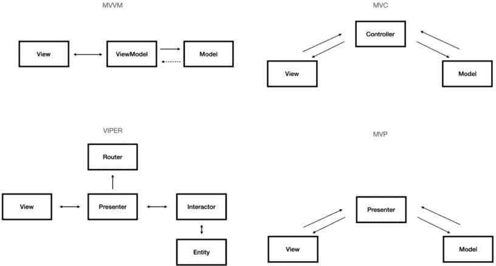
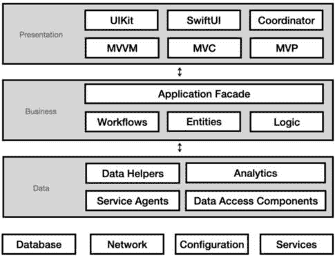
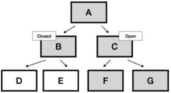
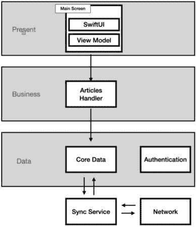
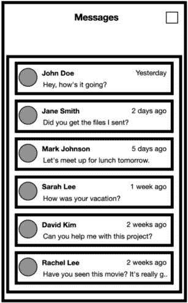
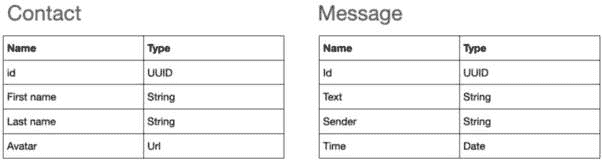

# 深入探讨应用程序架构

在最后一章，我们讨论了一个重要的话题——设计模式。我们说，设计模式是可重复的解决方案，用于解决常见问题。我们也可以说，设计模式是代码的构建块。在我们这本书中查看设计模式之前，我们先学习了 Swift，然后在此基础上应用设计模式。现在我们处于最高层次——应用程序架构。

**应用程序架构**是面试中的一个关键话题，不仅是在架构设计面试中。架构讨论可以发生得更早，甚至在第一阶段。例如，面试官可以询问我们的先前项目以及我们是如何构建它们的。理解基本术语并具备在面试中使用这些术语的技能是至关重要的。

但别担心，因为在这一章中，我们将介绍移动架构的最基本原理：

+   我们将回顾**关注点分离（Separation of Concerns）**（**SoC**）原则

+   我们将介绍一些关于代码分离的*优秀技巧*

+   我们将学习如何*将我们的应用程序分层*以及数据如何在它们之间流动

+   我们将讨论*设计面试*，如何应对它，以及如何与面试官沟通

我们几乎到达了本书的结尾，正如你现在所学的，我喜欢从基础开始，因为这有助于我更好地解释复杂话题。应用程序架构的基础是 SoC 原则。

# 所有关于关注点分离（Separation of Concerns）原则的内容

我在书中多次提到了**SoC 原则**。事实上，我在我之前的多本书和文章中也多次提到了这个原则。从某种意义上说，SoC 原则位于许多设计模式和架构决策的核心，而且有很好的理由。在我们深入理解为什么之前，让我们先尝试理解 SoC 的含义。

## 定义关注点分离（Separation of Concerns）原则

我们将从定义什么是 SoC 开始。SoC 指的是将代码组织起来，将不同的功能分离到不同的对象和所有者中。这意味着一个类或模块必须只有一个且仅有一个责任。

看看以下例子：

```swift
func processUserData(userData: [String: Any]) {        // Responsibility 1: Validate the data
        guard let name = userData["name"] as? String,
            !name.isEmpty,
              let age = userData["age"] as? Int, age > 0,
              let email = userData["email"] as? String,
                  !email.isEmpty else {
            print("Invalid user data")
            return
        }
        // Responsibility 2: Save the data to a file
        let documentsDirectory = FileManager.
            default.urls(for: .documentDirectory, in:
                .userDomainMask).first!
        let fileURL = documentsDirectory.
            appendingPathComponent("userData.txt")
        let userDataString = "Name: \(name)\nAge:
            \(age)\nEmail: \(email)\n"
        do {
            try userDataString.write(to: fileURL,
                atomically: true, encoding: .utf8)
            print("User data saved to file.")
        } catch {
            print("Error saving user data to file: \(error)")
        }
        // Responsibility 3: Send a welcome email
        print("Sending welcome email to: \(email)")
    }
}
```

在我们的代码示例中，我们可以看到`processUserData`函数有三个不同的责任：

+   *验证*用户数据

+   *保存*用户数据到文件

+   *发送*欢迎邮件给用户

注意，问题开始得更早——名称`processUserData`表明该函数有一个不明确的责任。

将功能分为三个不同的函数——`validateUserData`、`saveUserDataToFile`和`sendWelcomeEmail`——将是解决不明确性问题的一个优秀解决方案。

SoC 原则适用于函数和变量——一个变量应该有自己的责任，就像函数和类一样。

以下是一个例子：

```swift
class BadSoCExample {    var name: String
    init(name: String) {
        self.name = name
    }
    func printFullName(firstName: String, lastName: String) {
        name = firstName
        print("First name: \(name)")
        name = lastName
        print("Last name: \(name)")
        print("Full name: \(firstName) \(name)")
    }
}
let example = BadSoCExample(name: "John Doe")
example.printFullName(firstName: "John", lastName: "Doe")
```

在这个例子中，我们使用`name`来存储名和姓，而不是创建两个专门的变量——`firstName`和`lastName`。这些不良做法通常发生在试图节省时间时，但它们容易出错，可能导致问题。

我们可以看到，SoC 原则是开发所有级别的相关因素，从变量、函数和类到模块。

但是……为什么它如此重要呢？让我们看看。

## 解释 SoC 的重要性

现在我们已经知道了 SoC 原则是什么，是时候了解为什么在设计编写代码时它很重要了。

有几个原因让我们希望我们的应用程序的每个部分和每个变量都有单一的责任。让我们列举一些：

+   *使代码更明确*：当每个部分都专注于单一任务时，我们（以及其他人）更容易理解正在发生的事情。清晰度在调试和代码调查中也非常关键——这里有一句来自 Brian Kernighan 的名言：“*调试代码比最初编写代码难两倍。因此，如果你尽可能聪明地编写代码，那么按照定义，你不够聪明来调试它*。”减少编写和调试之间的差距的唯一方法是清晰度。

+   *使代码维护更容易*：我们都知道编写代码比维护代码容易。其中一个原因是，我们进行的每一次代码修改都可能创建一个新的错误。此外，修改通常改变代码结构，使其与我们编写代码时没有计划的结构不同。当我们将任务隔离到特定的函数或类时，我们正在减少这两种风险。

+   *提高代码的可重用性*：这是 SoC 原则的另一个重要好处。当一个视图、控制器或模块有一个特定的任务和责任时，它使得重用变得更加容易。让我们以一个处理文本操作的库为例。向该库添加更多功能和能力可能会增加其依赖性和副作用。这也使得它更大，更容易出错，因为它现在处理了更多与我们需求无关的责任，并且可能与我们要链接的另一个库冲突。将库的一部分与另一部分分离更明智，并允许我们像乐高积木一样使用不同的库。

+   *提高代码的可测试性*：测试的一个关键方面是确保结果可预测。当一个方法负责多个任务时，它可能会随着时间的推移降低其可预测性。想象一个返回计算值并更新用户默认值的函数。测试函数返回值可能会在我们的测试用例中产生我们不希望出现的副作用。将这个计算分离到另一个函数中并单独测试它更好。

这些好处是我们做出任何设计模式或架构决策的基础。此外，SoC 是在面试中处理架构任务时必须遵循的基本原则。它是我们面试期间可能进行的任何专业讨论的基础。

现在，让我们深入一点，看看一些关于 SoC 原则的实际技巧。

## 基于关注点分离原则的实践

本章旨在为我们准备架构面试，其中可能包含白板任务和专业讨论。我们理解 SoC 原则的重要性，但如何将其转化为实际工具呢？

好消息是我们在前面的章节中已经回顾了这些工具。现在让我们列出它们，并添加一些更多内容。

### 对使用 UI 设计模式有清晰的理解

我不怀疑 MVVM 或 MVC 这个话题将在你的面试中占据核心位置。这里重要的是真正理解不同的组件及其职责。如果我们决定为我们的屏幕使用 MVVM，我们必须确保我们这样做是因为我们需要管理复杂的状态，而不是因为“这是今天做事的方式。”我们必须确保我们使用正确的工具来完成正确的工作，并且每个组件都发挥其作用。

为了帮助理解这一点，请查看*图 12.1*：



图 12.1 – iOS 中最流行的 UI 设计模式

在*图 12.1*中，我们可以看到我们选择的设计模式不仅限于 MVC 和 MVVM。此外，这里没有规则，只有最佳实践。在考虑不同的职责和分离的情况下选择正确的设计模式对于实现 SoC 原则至关重要。

例如，VIPER 对于处理许多服务和数据实体的屏幕来说可能非常出色，而 MVP 适合于专注于格式化和展示调整的 UI。

VIPER 和 MVP？

我不会过多介绍 VIPER 和 MVP，因为它们在 iOS 开发中不如 MVC 和 MVVM 常见。我建议阅读有关这些模式的内容，了解它们的优缺点，以便你在面试中拥有更广泛的知识。

这里有一些关于 VIPER 和 MVP 的精彩阅读材料：

- VIPER: [`www.kodeco.com/8440907-getting-started-with-the-viper-architecture-pattern`](https://www.kodeco.com/8440907-getting-started-with-the-viper-architecture-pattern)

- MVP: [`www.javatpoint.com/ios-model-view-presenter`](https://www.javatpoint.com/ios-model-view-presenter)

### 使用 Clean Architecture

在*设计应用架构*部分，我们将讨论应用架构，但到目前为止，我们只是在打下基础，**Clean Architecture**是一个很好的基础。那么，什么是 Clean Architecture 呢？

清洁架构是一种在开发完整应用程序时强调 SoC（单一职责原则）的架构方法。它涉及将我们的项目划分为层——数据层、表示层、业务逻辑层和网络层——并推动不同层和组件之间的清洁 SoC。如果我们更进一步，我们就是在讨论为项目的其他部分创建各种库，并试图让我们的应用程序感觉像是一个巨大的拼图。请注意，将我们的应用程序拆分为模块是有代价的——维护不同的模块可能很困难，需要规划，有时还需要做出复杂的接口决策。我们必须始终考虑稳定结构和复杂接口之间的权衡。

### 编写小型函数

这是一个我们大多数人之前都听过几次的建议。他们说函数长度应该是“小于屏幕”，但如果我们想走极端，我们可以说函数应该是*尽可能小*。将一个长函数拆分成两个/三个函数是一个好主意，可以使我们的代码更干净、更少出错、更容易维护。

看看下面的代码示例：

```swift
func calculateTotalPrice(itemPrices: [Double],    itemQuantities: [Int]) -> Double {
    var totalPrice = 0.0
    for i in 0..<itemPrices.count {
        totalPrice += itemPrices[i] * Double (itemQuantities[i])
    }
    return totalPrice
}
```

虽然这个函数能正常工作，但它有多个职责——它遍历项目列表并计算它们的价格。为了提高 SoC（单一职责原则），我们可以将这段代码分离成另一个函数，用于计算单个项目的价格：

```swift
func calculateItemPrice(price: Double, quantity: Int) -> Double {    return price * Double(quantity)
}
func calculateTotalPrice(itemPrices: [Double],
    itemQuantities: [Int]) -> Double {
    var totalPrice = 0.0
    for i in 0..<itemPrices.count {
        totalPrice += calculateItemPrice(price:
            itemPrices[i], quantity: itemQuantities[i])
    }
    return totalPrice
}
```

现在我们有一个专门的函数来计算特定项目的价格，并在原始的 `calculateTotalPrice()` 函数中使用它。这是一个小修改吗？好吧，从代码设计的角度来看，这是一个巨大的变化——我们可以单独测试计算，并在代码的其他地方重用它。此外，代码的可读性更高，`calculateItemPrice()` 函数的名称也使我们免于解释 `price*Double(quantity)` 做了什么，甚至避免了不必要的注释。

很有趣的是，即使原始函数很小且工作良好，我们仍然可以将其拆分，并在多个方面改进我们的代码。这就是为什么“尽可能小”这个说法更加准确。

### 使用描述性名称

描述性名称总是一个好主意，但命名如何帮助我们拥有良好、清洁和分离的代码？

命名具有一种神秘的力量——它迫使我们思考函数的职责，并精确描述其功能。我们给予它的关注可以帮助我们做出正确的设计决策。

这里有一个例子——看看下一个函数接口：

```swift
func getProducts() -> [Product] {}
```

很明显，`getProducts()` 函数是用来获取并返回产品的。但它具体做了什么？它是从本地数据存储中加载产品还是使用网络请求？

让我们改进函数的名称：

```swift
func retrieveProductsFromServer() -> [Product] {}
```

现在，事情变得更加清晰。我们确切地知道这个函数的作用。但问题仍然不明确——我们对函数工作的疑问帮助我们深入思考其职责。也许最初，我们提出了以下名称：

```swift
func retrieveProductsFromServerAndSaveThemToDB() -> [Proudct] {}
```

这是一个很好的迹象，我们需要打破函数，因为描述其责任变得冗长而繁琐。

这里有一些好的命名示例：

```swift
fetchData() -> fetchUserDataFromServer()calculate() -> calculateAvrageSalary()
validate() -> validatePasswordStrength()
add() -> addItemToCart()
load() -> loadDataFromCache()
```

在面试过程中考虑到命名规范是个好主意。你知道吗？你一生中（如果不是更多的话）已经编写了数百（如果不是更多）个函数。你只需要回顾并反思它们。也许我们可以通过我们的代码学到一些东西。

这里有一个免责声明！

我知道这里的一些提示不是关于“架构”的。但这些原则和建议在任何级别都是相关的。

因此，SoC 为设计可扩展、模块化和可维护的应用架构奠定了基础。现在我们明白了这一点，我们可以继续设计应用架构。

# 设计应用架构

当被问到应用架构时，应聘者最常见的错误之一是回答，“当然是 MVVM！”

所以，我想提醒你——MVVM 是一种设计模式，而不是架构，我想强调这一点。

设计模式是对常见问题的一种可重用解决方案。依赖注入、单例和 MVVM 是设计模式的例子。另一方面，架构是我们项目的总体结构，它代表了我们的应用理念。

一个优秀的现实世界例子是建筑物。在这种情况下，架构描述了楼层数量、停车场和入口门的位置，或者我们有什么类型的屋顶。设计模式描述了*每个公寓是如何建造的*——每个公寓的房间数量、厨房的位置和电气布线。

我们可以说每个公寓和楼层都可以设计得不同——这意味着我们可以为各种问题和需求使用不同的设计模式。

通过与建筑行业进行类比，我们可以获得有价值的见解，因为构建应用程序和构建结构之间有许多相似之处。

我们没有公寓，而是有应用程序屏幕；我们没有屋顶和大厅，而是有应用程序层。

那么，让我们先谈谈应用层。

## 将架构分解为应用层

应用程序的不同层可以作为描述应用架构的起点。但什么是层呢？

层是具有不同关注点和应用责任的不同组件或组件集合。大多数应用程序使用三个主要层：

+   **表示层**：负责使用 UI 展示信息。在这里我们可以找到不同的屏幕和 UI 组件。

+   **业务逻辑层**：负责应用程序逻辑、规则和计算。

+   **数据层**：负责从本地数据库或其他来源存储和检索数据。

层或层？

当讨论层时，人们常犯的一个错误是将它们称为“层”。术语“层”指的是应用的物理组件，而“层”指的是软件组件。例如，一个层可以是一个负责特定关注点的不同计算机或服务器。在 iOS 应用架构的情况下，除非包括后端部分，否则“层”这个术语是不相关的。

为了快速提醒，我们将回顾设计模式 – MVVM 是作为表示层一部分实现屏幕的一个例子。单例（Singleton）是一种设计模式，可以帮助我们将 Core Data 处理器作为数据层的一部分实现。

让我们看看一个典型应用架构（*图 12.2*）：



图 12.2 – 一个典型的 iOS 应用架构

不要被*图 12.2*中的图表吓倒 – 记住，*我们已经知道*我们需要在脑海中重新组织这些信息。

我们可以看到，*图 12.2*中的架构被划分为我们在本节前面讨论的三个不同层：

+   我们可以看到，*表示层*有各种技术和设计模式。

+   在*业务逻辑*层，我们还有另一个设计模式 – 门面模式（Façade），这是一种提供对复杂和大型代码块简化接口的设计模式。这是我们进入应用逻辑的入口点。我们还可以看到我们在业务层中处理的不同实体，工作流程的逻辑，以及一般的应用逻辑。

+   在*数据层*，我们可以看到不同的服务代理（连接器），它们可以帮助我们连接到各种服务。我们还可以看到分析和辅助服务。

在图表下方，我们有外部服务，如数据库、网络和配置。这些服务是数据层的数据源。

架构图还说明了另一个方面：数据在不同层之间的流动，我们将在下一节中看到。

## 了解数据流

我们理解，如果表示层需要向用户展示信息，我们需要它从业务层一直获取信息到数据层和数据库。有些情况下，我们可以有一个具有更多层的应用，例如通知、安全和持久化层。在这种情况下，数据流会变得稍微复杂一些。

可能出现的一个有趣问题是，在检索数据时，一个层是否可以绕过另一个层。

让我们简要回答一下。

当设计分层系统时，有两个术语我们需要了解 – 封闭层和开放层：

+   **封闭层**：封闭层意味着给定的层不能绕过它下面的任何层

+   **开放层**：开放层意味着给定的层可以被传递到它下面的任何层

被认为是一个系统完全封闭或开放的最好实践，但在大多数情况下，系统都有开放和封闭层的混合。

那么，拥有关闭或开放层有什么好处呢？

看看 *图 12*.*3*：



图 12.3 – 开放和关闭层

在 *图 12*.*3* 中，我们可以看到一个包含不同层及其依赖关系的系统架构。层 B 是关闭的，这意味着层 A 无法访问层 D 和 E。另一方面，层 C 是开放的，这意味着层 A 可以访问层 F 和 G。

灰色填充的层是层 A 可以访问的层，但也意味着这些都是依赖项。

开放层通过将顶层暴露给更多层来增加耦合。另一方面，关闭层更难维护，需要提前设计一个优秀且灵活的接口。我们已经知道，减少依赖项可以创建一个松散且灵活的系统，但这并不意味着我们需要创建一个过于复杂的设计。这是一个简单性和灵活性之间权衡的绝佳例子。

更重要的是，在设计架构和做出决策时理解这些术语。完全不思考就构建分层系统可能是我们能做的最糟糕的事情。

架构概念与设计模式相结合，是我们为项目设计良好架构的基础。

让我们用一个现实世界的例子来一起回顾其设计。

## 设计离线优先的系统架构

**离线优先**的系统架构是许多面试官喜欢讨论的典型设计。原因是这个用例涉及到处理不同的数据源和设计模式，以实现似乎是在移动原生应用而不是网页应用中拥有的一项重要优势。

离线优先系统的工作方式是通过拥有两个数据源——一个 *持久存储* 和 *网络* 通信。在此基础上，我们有一个 *同步服务* 负责将网络数据更新到持久存储。连接 UI 和数据层的业务逻辑层直接与持久存储工作，而不考虑网络状态。

让我们看看这样一个系统的图示 (*图 12*.*4*):



图 12.4：离线优先的系统架构

查看 *图 12*.*4*，我们可以看到业务层上的 **Articles Handler** 直接与 Core Data *无意识* 地工作，而不考虑网络层。同步服务是唯一连接 Core Data 存储和网络层的组件。

通过添加离线加载，我们为用户提供了一个卓越的用户体验。除此之外，我们还实现了卓越的 SoC 原则，通过解耦的系统使得其组件完全独立。

在面试中，候选人喜欢回答的一个典型实现选项是在业务逻辑或甚至作为视图模型的一部分进行所有同步工作。当然，这个选项可以工作得很好，但在设计一个可以扩展并随时间维护的系统时，这是一个非常狭隘的观点。拥有一个专门的服务来处理同步逻辑并单独维护它是完全可行的。

总是提醒自己系统中每个组件的责任以及它们如何与其他组件通信，这可以引导我们设计出更好、更清晰的设计。

# 架构设计面试

架构设计面试是我们提案的关键步骤，它需要的是更多软技能和沟通技巧。

与 Swift、Combine 和 Core Data 的问题不同，架构设计面试要求我们向前迈出一步，提出一个更全面的视角——产品需求、后端、扩展性、分析和用户体验都是我们在尝试设计一个完整系统时需要考虑的因素。

架构面试，可能比招聘流程中的其他步骤更注重沟通和满足期望。因此，我们将从理解面试官的视角开始。

## 进入面试官的头脑

那么，我们的面试官希望我们从他们那里得到什么？他们的期望是什么？

在这里需要理解的最重要的一点是，面试官并不关心你的答案是否是最优解，甚至不关心它是对是错。架构设计面试绝对属于另一个领域，面试官在寻找的是其他东西——他们想看看我们是怎样**思考**的，如何**处理问题**，**权衡利弊**，以及根据产品需求找到一条通向合理解决方案的路径。

让我们以以下面试问题为例：

“设计随 iOS 附带的消息应用程序。”

显然，顶级应用程序功能将是消息屏幕（“聊天”）。以下是我们接近该问题时需要解决的问题列表：

+   我们将使用哪些 UI 组件？

+   数据模型是什么？每条消息的属性将是什么？

+   我们需要哪些端点？我们将实现分页吗？如果不实现，我们将如何处理无限数量的消息？

+   我们是否支持离线使用？我们将如何实现？

+   我们是否支持附件？它将如何工作？

+   如果我们想要进行群聊怎么办？

+   我们将支持实时更新吗？

这些只是当接近这个任务时出现的一些问题，而且都不是直接的。我们的任务是找到答案。

那么，我们如何开始？

## 接近任务

我一生中面试过数百名候选人，其中许多人挣扎于理解如何应对架构面试。

他们并不是不知道如何设计应用程序或解释他们的想法——他们不知道两件事：

+   任务开始的起点

+   他们的边界是什么

这两个主题对于面试预热并朝着伟大解决方案的方向前进至关重要。

让我们从起点开始——理解问题和范围。

### 理解问题和范围

当我们接近设计问题时，我们首先需要做的是停下来，深呼吸，并试图理解面试官期望我们从我们这里得到什么。大多数候选人在这一点上失败，因为他们知道他们回答问题的时间有限，所以他们急忙在白板上画盒子。

但设计面试代表了一个现实生活中的任务。面试官期望我们在描述我们做什么之前理解问题。

让我们回到我们的问题——设计一个类似于 iOS 自带的消息应用。我们可以向面试官提出以下问题：

+   我们有 UI 线框图，还是必须我们自己制作？

+   我们有多少个屏幕？

+   设计是否需要包含后端服务？

+   它是跨平台（包括 Android 或 Web）还是仅限 iOS？

+   我们有一个既定的数据库模式，还是需要我们自己规划？

这些只是几个例子，但它们可以帮助我们理解我们必须做什么。

一旦我们理解了问题和要做什么，我们就可以检索产品需求。

### 获取产品需求

与传统开发任务不同，在架构设计面试中，我们没有**产品需求文档**（**PRD**）或与产品经理的开场会议。相反，我们必须理解产品需求并向我们的面试官询问更多信息。事实上——这正是面试官所寻找的！

想象一下面试就像一个黑暗的迷宫，我们用手电筒导航并揭示更多区域、房间和路径。有时甚至面试官也不知道我们会把面试引向何方！

回到消息应用的任务，在设计应用时我们可以考虑一些问题。以下是一些例子：

+   我们支持离线阅读和写入吗？

+   我们是否与设备联系人集成了？

+   我们需要支持通知和实时聊天吗？

+   用户可以编辑或删除消息吗？

+   我们需要支持横幅模式吗？

这些问题并非出于好奇。它们会影响我们需要做出的设计和技术决策。例如，离线支持对于理解我们的数据源行为和同步机制至关重要。与设备联系人的集成影响我们的数据模型。实时聊天定义了我们的网络方法，而编辑和删除功能会影响我们同步信息回后端的方式。

在面试开始时，不问所有问题完全可以接受——有时我们只需要开始设计来了解我们需要问什么，但有一个好的开始是个好主意。

但我们如何开始设计？从线框图开始？还是从实体开始？这是一个好问题，让我们看看。

## 开始设计

设计部分是动态的。没有人期望我们在开始绘图时就拥有最终答案，我们应该预料到在面试过程中根据新的发现和结论，事情会发生变化。清晰地详细地展示事物可以帮助我们更好地与面试官沟通，并更好地表达我们的想法。

### 前往白板 – 线框

我们不是产品设计师，没有人期望我们成为。但知道如何在白板上展示我们的想法对于这个过程至关重要。我们已经在*第一章*中讨论了技术准备时讨论过这一点，现在我们完全理解为什么。

那么，我们如何开始？一些开发者喜欢从描述不同实体或类的基本 UML 开始。但在我看来，当涉及到应用程序架构时，最好从绘制不同屏幕的线框开始。让我们从消息屏幕（*图 12.5*）开始：



图 12.5 – 消息屏幕

看看*图 12.5*，我们可以理解为什么从 UI 开始更好。忽略字体大小和布局（我知道我不是一个好的设计师），看起来我们可以从这个线框中学习到很多东西。让我们列出它们：

+   我们开始理解*不同的实体*。例如，我们看到一个全名和一个头像——这描述了**联系人**实体。我们还可以看到列表显示了联系人的最后一条消息，其中包含文本属性，因此我们在这里还有一个**消息**实体。

+   我们看到列表是按时间排序的。这可能是一个深入挖掘的地方——我们是否希望根据每个联系人的最新消息进行排序，或者我们是否希望为**联系人**实体添加一个**updatedTime**属性？这是一个经典的*性能与简单性之间的权衡*；我们应该与我们的面试官讨论这个问题。

+   关于*UI*呢？我们知道我们在这里应该有一些**UITableView**。但我们是否希望将所有消息加载到表格视图中，或者我们是否希望支持分页？我们将使用哪种设计模式，MVC 还是 MVVM？我们应该根据应用程序的规模、首次体验和常见用户使用来做出决定。

在我们继续之前，我想让你注意一点——没有明确的答案，只有考虑和权衡。我提出了问题，但还没有给你任何答案，因为我们所提出的问题和面试官的问题是过程的一部分。这就是我们展示我们理解存在灰色区域，我们需要在这里做出决策的地方。

那么，我们只是在用白板绘制 UI 吗？不一定——让我们继续。

### 添加实体和后端服务

这是*第十二章*，我们知道一个应用程序不仅仅是 UI。但一个屏幕就足够开始设计其他部分了吗？当然，是的！

让我们添加实体（*图 12.6*）：



图 12.6 – 消息应用程序的初始实体

在白板上写下实体听起来像是一项技术任务，但与线框图类似，它可以帮助我们发现关于我们应用程序的更多有趣之处。

例如，我们提到了联系人头像的 URL——这意味着我们需要基于该 URL 创建某种类型的图像下载服务和一个缓存机制。结果，*图像下载器*可以添加到我们在白板上的绘制中。

看看我们基于单个实体属性所取得的成就！

但实际绘制实体的价值在于我们开始思考它们之间的关系。我们有`Contact`和`Message`。但什么描述了与联系人的对话？也许我们需要创建另一个名为`MessagesThread`的实体。如果我们有一个`MessagesThread`实体，它的属性会是什么？

在这个阶段，事情变得稍微复杂一些，因为思考连接会引发更多问题——例如，我们是否支持群组消息？答案确定了`MessageThread`和`Contact`之间的关系类型。

在我们的线框图旁边绘制实体创建了一个来回的过程，这有助于我们塑造设计并使其更加完整。每个决策都会引发更多问题，进而导致更多设计决策。它还为我们下一个任务设定了路径：设计与后端交互。

### 添加网络调用

现在我们有了基本的 UI 线框和实体，规划我们将如何与后端服务合作应该更容易。记住，UI 和实体仍然是我们的应用程序学习阶段的一部分——现在我们更好地理解了我们需要做什么。不同的端点定义了用户体验和我们将使用的设计模式，这正是我们可以真正着手构建应用程序架构的地方，正如我们在本章中学到的。

让我们看看我们需要为主屏幕提供哪些端点：

+   **GET/threads**：检索所有线程的列表

+   **POST/thread**：创建新的消息线程

通常，当处理信息列表时，将这两个端点作为我们设计的一部分是很常见的。但这里还有更多需要考虑的事情：

+   线程是如何排序的？我们是直接从服务器获取排序好的线程，还是根据特定的属性进行排序？

+   我们是否有分页机制？或者我们获取所有线程并使用增量更新同步？

+   我们在这个阶段需要**POST**请求吗？或者我们只能在发送第一条消息之后才能这样做？

端点也帮助我们定义应用程序架构。它们回答有关 UI 层及其设计模式（MVC/MVVM）的重要问题。但它们也帮助我们理解我们的数据层和我们将需要的不同服务。以下是一些示例：

+   核心数据处理器

+   图片下载器

+   同步服务

+   网络服务和实时管理

如果我们继续向其他屏幕添加更多端点，我们将了解更多关于我们的应用，并获得更多答案。

设计应用架构是一个发现过程。一开始没有什么事情是清晰的，向面试官传达寻找答案的过程是至关重要的。这就是为什么我们的下一个主题极其重要——我们与面试官的沟通。

## 与面试官沟通

如本节前面所述，许多候选人认为他们在架构设计面试中的主要目标是提供他们刚刚收到的最优化解决方案。但事实是，目标是让面试官看到我们的思考方式，并为可能出现的难题提供一个合理的解决方案。

因此，与面试官的有效沟通对于在这种面试中取得成功至关重要。我们的一些最重要的软技能在这里被测试！

让我们回顾一些有助于我们关注重要事项的建议：

+   *倾听面试官*：这显然是显而易见的，对吧？当然，我们会倾听面试官！但我意思是，*真正地*倾听他们。首先，因为任务要求和范围非常重要，我们需要精确地了解我们在做什么。此外，我们的面试官会给出一些宝贵的建议，这可以帮助我们实现目标。

+   *澄清疑问*：如果你对自己的决定不确定，你必须向面试官传达这一点。面试官需要看到候选人看到的是灰色而不是黑白，这也是一种获取线索或与面试官讨论事情的方式。

+   *自信*：我知道这听起来似乎与前面的观点相矛盾，但它并不矛盾。当我们有疑问时，我们需要传达它们，但当我们对某事有信心时，我们必须表现出来。自信是这些面试中的一个关键因素。

+   *大声思考*：我们知道我们想要通过我们的设计实现什么目标，我们甚至已经在白板上画出了它。但对我们来说明显的事情，并不总是对房间里其他人明显。大声思考可以帮助我们更清楚地解释我们在做什么，并帮助面试官理解我们刚刚设计的出色架构。

+   *使用正确的术语*：在这本书中，我对所使用的不同术语非常严格——方法与函数、设计模式与架构等等。在这些面试中使用正确的术语至关重要，这不仅是为了显得专业；这也使得我们的解释对面试官来说更加清晰。并非所有面试官都对此很严格——但这并不意味着我们不应该这样做。

+   *开放接受反馈*：面试官可能在面试过程中提供反馈或建议。有时这可能是我们可采取方向的线索，有时则是因为我们超出了范围。在这种情况下，许多时候，候选人会失去自信并封闭自己，难以接受反馈。当我们进入设计面试时（实际上，我们应该始终放下自我），应该利用面试官的反馈来改进我们的回答。面试过程中的反馈并不意味着我们失败了——这意味着我们有提供更好解决方案的机会。

看起来我们正在接受如何沟通和表达自己的测试，但这正是现实！面试官想了解与我们合作、讨论设计问题和进行架构辩论的情况。这就是我们个性凸显的地方。

# 摘要

架构设计面试是招聘过程中的亮点。它融合了广泛的设计模式、架构、iOS 用户体验以及关键的软技能，如规划、沟通和演示。

然而，到目前为止，我们应该处于一个知道如何通过几个主要步骤通过面试的位置。

在本章中，我们学习了 SoC 及其在 iOS 架构中的应用，包括功能大小和命名。我们了解了应用层和数据流，甚至讨论了一个关于离线工作架构的优秀示例。最后，我们讨论了架构设计面试——如何应对以及与面试官沟通。

在下一章（也是最后一章）中，我们将讨论面试中最实用的步骤：现场编码面试和家庭评估。现在所有的招聘流程都包括这一步骤，我们的任务是准备好应对未知。
