# 1

# 构建你的游戏

当我们开始使用 Unity 游戏引擎构建移动游戏时，在深入探讨移动平台构建细节之前，熟悉引擎本身是很重要的。虽然有可能你已经构建了一个游戏并希望将其迁移到移动平台，但也会有那些之前从未接触过 **Unity** 或许很久没有使用过它的人。本章将为新来者提供一个介绍，并为回归者提供一个复习，同时为已经熟悉 Unity 的人提供一些最佳实践。虽然如果你已经熟悉 Unity，可以跳过这一章，但我认为了解项目背后的思考过程也很重要，这样你就可以在未来的作品中记住这些思考，以便为你的未来作品做好准备。

在本章中，我们将构建一个类似于 *Imangi Studios LLC 的 *Temple Run* 系列的 3D 无尽跑酷游戏。在我们的案例中，玩家将连续向某个方向奔跑并躲避挡在他们路上的障碍物。我们还可以轻松地为游戏添加额外功能，因为游戏将不断添加新内容。

本章将分为几个主题。它将包含简单的、逐步的过程供你遵循。以下是我们的任务概述：

+   设置项目

+   创建玩家

+   使用 C# 脚本移动玩家

+   使用属性和 XML 注释改进脚本

+   Update 函数与 FixedUpdate 函数

+   让摄像机跟随我们的玩家

+   创建基本瓦片

+   使游戏无限

+   创建障碍物

# 技术要求

本书使用 *Unity 2022.1.0b14* 和 *Unity Hub 3.3.1*，但步骤应该在未来版本的编辑器中只需做最小改动即可。如果你想要下载本书中使用的确切版本，并且有新版本发布，你可以访问 Unity 的下载存档 [`unity3d.com/get-unity/download/archive`](https://unity3d.com/get-unity/download/archive)。

你也可以在 *Unity 编辑器系统* *要求* 部分的 [`docs.unity3d.com/2022.1/Documentation/Manual/system-requirements.html`](https://docs.unity3d.com/2022.1/Documentation/Manual/system-requirements.html) 找到 Unity 的系统要求。

你可以在 GitHub 上找到本章的代码文件，地址为 [`github.com/PacktPublishing/Unity-2022-Mobile-Game-Development-3rd-Edition/tree/main/Chapter01`](https://github.com/PacktPublishing/Unity-2022-Mobile-Game-Development-3rd-Edition/tree/main/Chapter01)。

# 设置项目

现在我们已经明确了目标，让我们开始构建我们的项目：

1.  要开始，请在你的电脑上打开 Unity Hub。

1.  从启动开始，我们将通过点击 **新建** 按钮来创建一个新的项目。

1.  接下来，在 `MobileDev` 下，并在 **模板** 中，确保 **3D** 已被选中。之后，点击 **创建** 并等待 Unity 加载：

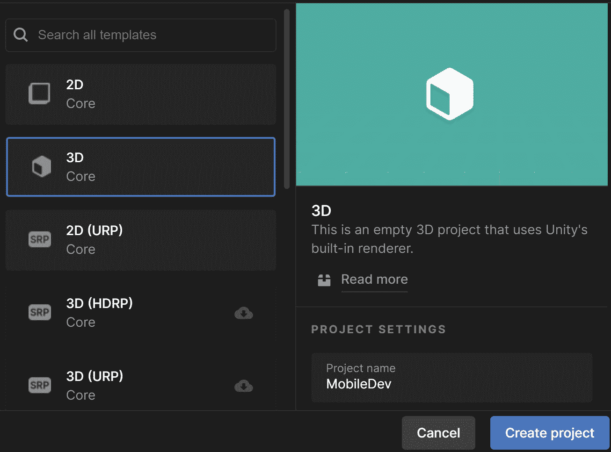

图 1.1 – 创建 3D 项目

1.  完成后，你将看到 Unity 编辑器首次弹出：

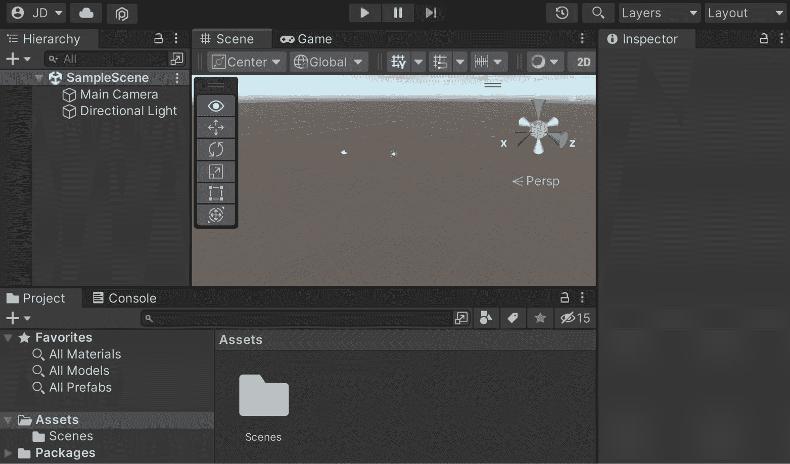

图 1.2 – Unity 编辑器

1.  如果你的布局看起来与前面的截图不同，请转到工具栏的右上角部分，并选择那里的下拉菜单，该菜单显示为 **Layout**。从那里，从提供的选项中选择 **Default**：

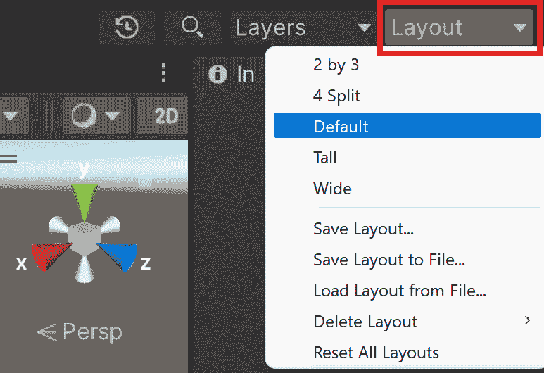

图 1.3 – 布局按钮

现在我们已经首次打开 Unity，并显示了默认布局！

小贴士

如果这是你第一次使用 Unity，那么我强烈建议你阅读 *Unity 用户手册* 中的 *Unity 的界面* 部分，你可以通过 [`docs.unity3d.com/Manual/UsingTheEditor.html`](https://docs.unity3d.com/Manual/UsingTheEditor.html) 访问。

现在我们已经打开了 Unity，我们实际上可以开始构建我们的项目了。

# 创建玩家

要开始，我们将构建一个始终向前移动的玩家。现在让我们开始吧：

1.  要开始，我们将为玩家创建一些可以行走的地面。为此，转到顶部菜单并选择 **GameObject** | **3D Object** | **Cube**。

1.  从那里，我们将移动到 `Floor`。然后，对于 `0`, `0`, `0`)。这可以通过输入值或右键单击 **Transform** 组件然后选择 **Reset** **Position** 选项来完成。

1.  然后，我们将设置 `7`, `0.1`, `10`):

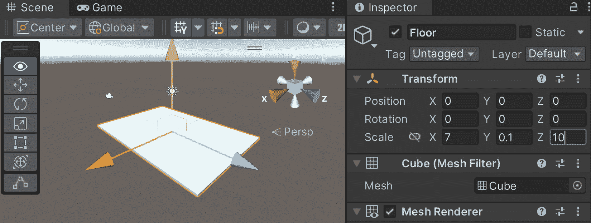

图 1.4 – 创建地面

在 Unity 中，默认情况下，`1` 单位空间代表现实生活中的 `1` 米。因此，我们的 **Scale** 值将使地面比它宽（**X** 和 **Z**）更长，我们在地面上有一些大小（**Y**），所以玩家会与之碰撞并落在上面，因为我们默认附加了一个 **Box Collider** 组件。

注意

当创建 **Cube** 对象时，会自动添加 **Box Collider** 组件，并且需要将其附加到对象上以进行碰撞。有关 **Box Collider** 组件的更多信息，请参阅 [`docs.unity3d.com/Manual/class-BoxCollider.html`](https://docs.unity3d.com/Manual/class-BoxCollider.html)。

1.  接下来，我们将创建我们的玩家，它将是一个球体。为此，我们将转到 **GameObject** | **3D Object** | **Sphere**。

1.  将球体重命名为 `Player` 并设置 `0`, `1`, `-4`):

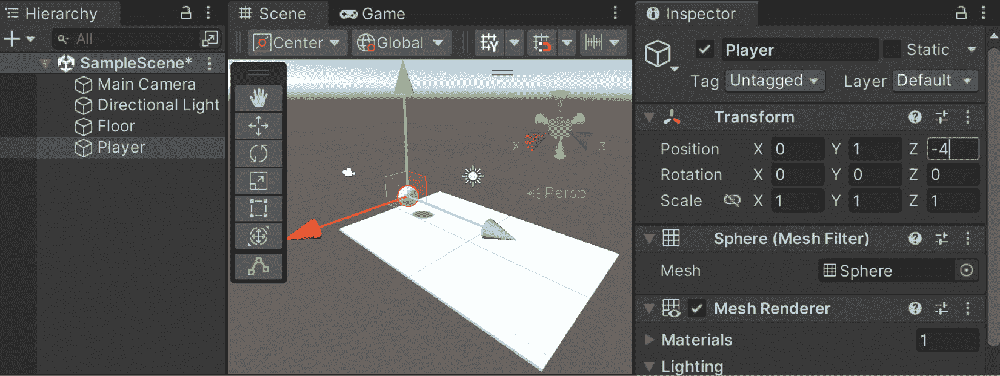

图 1.5 – 定位玩家

这将球体略微抬离地面并将其移回到接近起点。注意，相机对象（见相机图标）默认指向球体，因为它位于 (`0`, `1`, `-10`）的位置。

1.  我们希望球体移动，因此需要通知物理引擎我们希望这个物体对力做出反应，所以我们需要添加一个**Rigidbody**组件。要做到这一点，在**Player**对象被选中时，进入菜单并选择**Component** | **Physics** | **Rigidbody**。为了查看现在会发生什么，让我们点击中间第一个工具栏上的**Play**按钮：

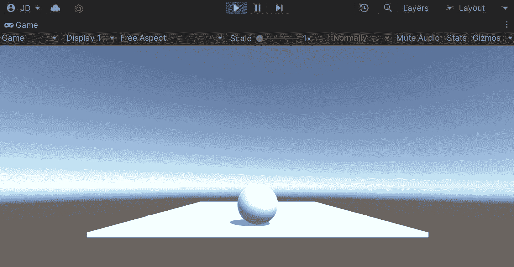

图 1.6 – 游戏当前状态

如前一张截图所示，当我们在游戏中播放时，应该看到球体掉到地面上。

小贴士

您可以通过单击顶部的**Maximize On Play**按钮或右键单击**Game**标签并选择**Maximize**来启用/禁用在播放时占用整个屏幕的**Game**标签。

1.  再次点击**Play**按钮以关闭游戏并返回到**Scene**标签，如果它没有自动发生。

现在我们已经在游戏中有了地板和玩家的对象，并且已经告诉玩家要响应物理！接下来，我们将通过代码的使用为玩家添加交互性。

# 通过 C#脚本移动玩家

我们希望玩家能够移动，因此为了实现这一点，我们将在脚本中创建我们自己的功能，实际上在这个过程中创建我们自己的自定义组件：

1.  要创建一个脚本，我们将进入**Project**窗口，并单击菜单左上角的**Create**按钮，点击**+**图标，然后选择**Folder**：

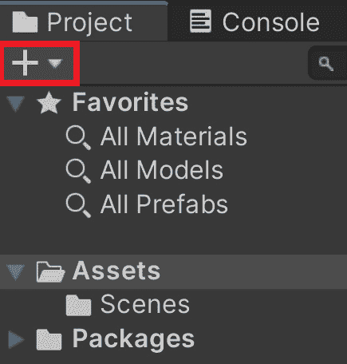

图 1.7 – + 图标的定位

小贴士

您也可以通过在**Project**窗口的右侧单击右键来访问**Create**菜单。使用此方法，您可以右键单击并选择**Create** | **Folder**。

1.  从那里，我们将这个文件夹命名为`Scripts`。始终组织我们的项目是个好主意，这样有助于项目组织。

小贴士

如果你在**Project**窗口中不小心拼错了某个项目的名称，你可以通过右键单击并选择**Rename**选项，或者选择对象然后单击名称来重命名它。

1.  双击文件夹进入，在`PlayerBehaviour`（没有空格）处创建一个脚本。

注意

我之所以使用*behaviour*而不是*behavior*，是因为 Unity 中的所有组件都是另一个名为`MonoBehaviour`的类的子类，我在这方面遵循 Unity 的指导。

1.  双击脚本以打开您选择的脚本编辑器（IDE），并向其中添加以下代码：

    ```kt
    using UnityEngine;
    public class PlayerBehaviour : MonoBehaviour
    {
        // A reference to the Rigidbody component
        private Rigidbody rb;
        // How fast the ball moves left/right
        public float dodgeSpeed = 5;
        // How fast the ball moves forward  automatically
        public float rollSpeed = 5;
        // Start is called before the first frame update
        void Start()
        {
            // Get access to our Rigidbody component
            rb = GetComponent<Rigidbody>();
        }
        // Update is called once per frame
        void Update()
        {
            // Check if we're moving to the side
            var horizontalSpeed =
                Input.GetAxis("Horizontal") * dodgeSpeed;
            rb.AddForce(horizontalSpeed, 0, rollSpeed);
        }
    }
    ```

在前面的代码中，我们有一些将要使用的变量。`rb`变量是对我们之前添加的 GameObject 的`Rigidbody`组件的引用。它使我们能够使对象移动，我们将在`Update`函数中使用它。我们还有两个变量，`dodgeSpeed`和`rollSpeed`，分别决定了玩家在左右移动或向前移动时移动的速度。

由于我们的对象只有一个`Rigidbody`组件，我们在`Start`函数中将其分配一次，该函数在游戏开始时将 GameObject 加载到场景中时被调用。

然后，我们使用`Update`函数来检查我们的玩家是否按下了按键以根据 Unity 的`Input.GetAxis`函数返回的负值来移动左右。如果我们按下“A”键或左箭头，它将返回`-1`。如果我们按下右箭头或“D”键，我们将得到一个返回的正值，直到`1`，如果没有按键，输入将移动到`0`。然后我们将其乘以`dodgeSpeed`以增加速度，以便更容易看到对象的移动。

注意

有关输入管理器的更多信息，请参阅[`docs.unity3d.com/Manual/class-InputManager.html`](https://docs.unity3d.com/Manual/class-InputManager.html)。

最后，一旦我们有了这个值，我们将对球在 X 轴上的`horizontalSpeed`单位以及 Z 轴上的`rollSpeed`应用一个力。

1.  保存你的脚本并返回到 Unity 编辑器。

1.  现在，我们需要通过从`Player`对象中选择`PlayerBehaviour`脚本中的`Player`对象来将此脚本分配给我们的玩家。

注意

注意，当编写脚本时，如果我们将一个变量声明为`public`，它将在我们希望设计师为了游戏玩法目的调整值时显示在`public`中，但它也允许其他脚本在代码中访问该属性。默认情况下，变量和方法是`private`的，这意味着它们只能在类内部使用。有关访问修饰符的更多信息，请参阅[`docs.microsoft.com/en-us/dotnet/csharp/language-reference/keywords/access-modifiers`](https://docs.microsoft.com/en-us/dotnet/csharp/language-reference/keywords/access-modifiers)。

如果一切顺利，我们应该在我们的对象上看到脚本，如下所示：

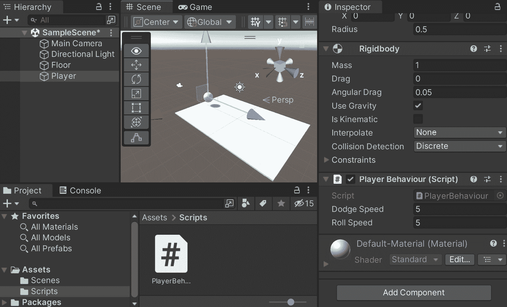

图 1.8 – 添加的 PlayerBehaviour 组件

1.  通过转到**文件** | **保存**来保存你的场景。之后，玩游戏并使用左右箭头查看玩家根据你的输入移动，但无论如何，默认情况下向前移动：

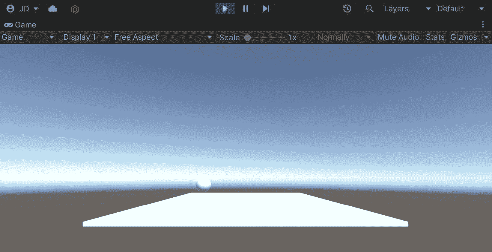

图 1.9 – 游戏当前状态

现在，你可以看到球会自动移动，并且我们的输入被正确接收！

# 使用属性和 XML 注释改进我们的脚本

我们可以停止使用 `PlayerBehaviour` 类脚本，但我想要提及一些我们可以用来提高代码质量和风格的事情。当你开始以团队形式构建项目时，这变得特别有用。因为你将与其他人一起工作，其中一些人将与你一起编写代码。然后，将会有设计师和艺术家，他们不会与你一起编写代码，但仍然需要使用你编写的程序。

在编写脚本时，我们希望它们尽可能没有错误。将 `rb` 变量设置为 `private` 开始了这个过程，因为现在用户将无法在这个类之外修改它。我们希望我们的队友修改 `dodgeSpeed` 和 `rollSpeed`，但我们可能希望给他们一些关于它是什么以及/或如何使用的建议。要在 **检查器** 窗口中这样做，我们可以使用一种称为 **属性** 的东西。

## 使用属性

属性是我们可以在变量、类或函数声明开头添加的东西，它允许我们附加额外的功能。Unity 中存在许多这样的属性，你也可以编写你自己的属性，但现在是时候谈谈我使用最频繁的属性了。

### 工具提示属性

如果你已经使用 Unity 一段时间了，你可能已经注意到 `Rigidbody` 中的一些组件有一个很好的功能——如果你将鼠标移到变量名上，你会看到变量是什么以及如何使用它们的描述。你首先会学到的是，我们可以通过使用 `Tooltip` 属性在我们的组件中实现相同的效果。如果我们对 `dodgeSpeed` 和 `rollSpeed` 变量这样做，它看起来可能就像这样：

```kt
[Tooltip("How fast the ball moves left/right")]
public float dodgeSpeed = 5;
[Tooltip("How fast the ball moves forward  automatically")]
public float rollSpeed = 5;
```

保存前面的脚本并返回到编辑器：

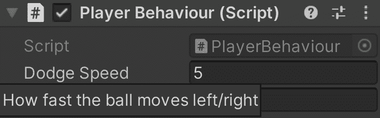

图 1.10 – 工具提示属性示例

现在，当我们使用鼠标突出显示变量并保持在那里时，我们将显示放置的文本。这是一个非常好的习惯，因为你的队友可以始终知道你的变量被用于什么，而无需实际查看脚本本身。

注意

更多关于 `Tooltip` 属性的信息，请查看 [`docs.unity3d.com/ScriptReference/TooltipAttribute.html`](https://docs.unity3d.com/ScriptReference/TooltipAttribute.html)。

### 范围属性

我们还可以用来保护我们的代码的是 `Range` 属性。这将允许我们为变量指定一个最小值和最大值。由于我们希望玩家始终向前移动，我们可能希望限制玩家向后移动。为此，我们可以添加以下突出显示的代码行：

```kt
[Tooltip("How fast the ball moves forward  automatically")]
[Range(0, 10)]
public float rollSpeed = 5;
```

保存你的脚本，并返回到编辑器：

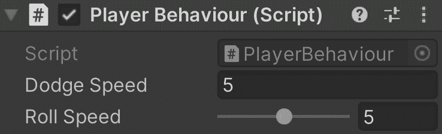

图 1.11 – 范围属性示例

我们现在在我们的值旁边添加了一个滑动条，我们可以拖动它来调整我们的最小值和最大值之间。这不仅保护我们的变量不被改变为无效状态，还使得我们的设计师可以通过简单地拖动它们来轻松调整事物。

### `RequireComponent` 属性

目前，我们正在使用 `Rigidbody` 组件来创建我们的脚本。当作为团队成员工作时，其他人可能不会阅读你的脚本，但仍然期望他们在创建游戏玩法时使用它们。不幸的是，这意味着他们可能会做一些意想不到的事情，例如移除 `Rigidbody` 组件，这将在我们的脚本运行时导致错误。幸运的是，我们还有 `RequireComponent` 属性，我们可以用它来解决这个问题。

看起来像这样：

```kt
using UnityEngine;
[RequireComponent(typeof(Rigidbody))]
public class PlayerBehaviour : MonoBehaviour
```

通过添加此属性，我们声明，当我们将此组件包含在 GameObject 中且其 GameObject 没有附加 `Rigidbody` 组件时，组件将被自动添加。这也使得如果我们尝试从该对象中移除 `Rigidbody` 组件，编辑器将警告我们无法这样做，除非我们首先移除 `PlayerBehaviour` 组件。请注意，这适用于从 `MonoBehaviour` 扩展的任何类；只需将 `Rigidbody` 替换为你希望保留的内容即可。

现在，如果我们进入 Unity 编辑器，并尝试通过在 **检查器** 中右键单击它并选择 **移除组件** 来移除 `Rigidbody` 组件，将会看到以下消息：

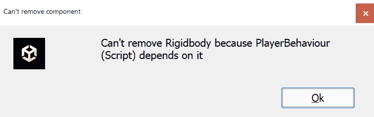

图 1.12 – 无法移除组件窗口

这正是我们想要的，这确保了组件将存在，使我们不必每次想要使用组件时都包含 `if` 检查。

注意，之前我们没有在私有变量 `rb` 上使用 `Tooltip` 属性。由于它不会在编辑器中显示，所以实际上并不需要。然而，我们也可以通过使用 XML 注释来增强这一点：使用 XML 注释。

## XML 注释

我们可以通过 XML 注释实现一些我们之前使用传统注释无法实现的好事情。当我们在 Visual Studio 中使用变量/函数而不是代码时，现在我们将看到关于它的注释。这将帮助团队中的其他开发者通过额外的信息和细节确保他们正确地使用你的代码。

XML 注释看起来像这样：

```kt
/// <summary>
/// A reference to the Rigidbody component
/// </summary> 
private Rigidbody rb;
```

可能看起来需要更多的写作才能使用这种格式，但实际上我并没有全部打出来。XML 注释是 C# 的一个相当标准的特性，所以如果你使用 MonoDevelop 或 Visual Studio 并输入 `///`，动作将自动为你生成摘要块（以及如果需要参数，如函数所需的 `param` 标签）。

那么，我们为什么要这样做呢？好吧，如果你在 IntelliSense 中选择变量，它将显示以下信息给我们：

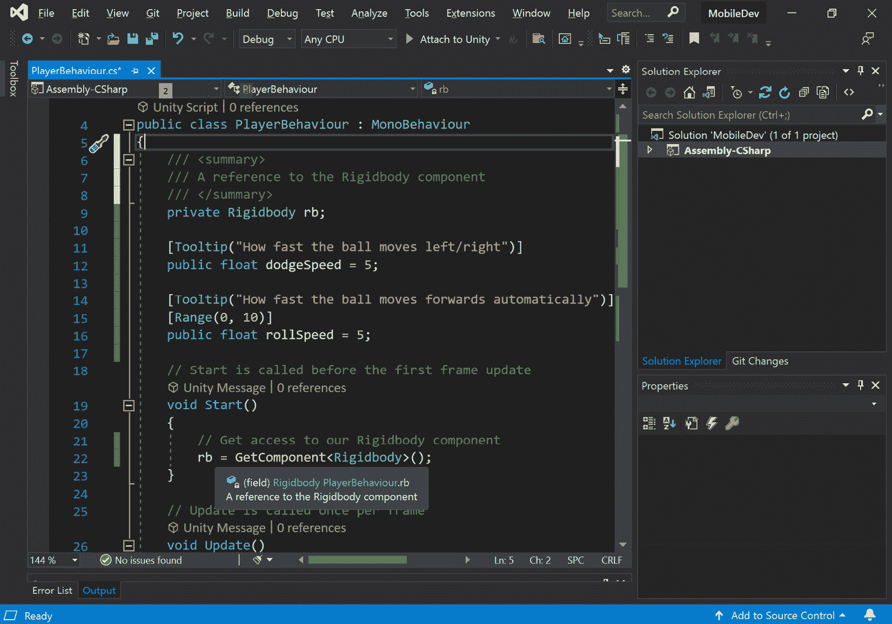

图 1.13 – XML 注释中的工具提示示例

当其他人试图使用你的代码时，这是一个很大的帮助，这也是 Unity 员工编写代码的方式。我们还可以将此扩展到函数和类，以确保我们的代码更具自文档化。

不幸的是，XML 注释在检查器中不会显示，并且 `Tooltip` 属性不能用于项目的一些方面，如函数。考虑到这一点，我使用 `Tooltip` 用于公共说明和/或将在 **检查器** 窗口中显示的内容，而将 XML 注释用于其他所有内容。

注意

如果你想要更深入地了解 XML 注释，请随时查看 [`msdn.microsoft.com/en-us/library/b2s063f7.aspx`](https://msdn.microsoft.com/en-us/library/b2s063f7.aspx)。

现在我们已经探讨了改进代码格式的几种方法；让我们看看如何通过查看 Unity 提供的一些不同的 `Update` 函数来提高性能。

# Update 函数与 FixedUpdate 函数

接下来要查看的是我们的移动代码。你可能已经注意到，我们目前正在使用 `Update` 函数来移动我们的玩家。正如上面的注释所述，`Update` 函数在游戏运行时每帧被调用一次。需要考虑的一点是，`Update` 被调用的频率是可变的，这意味着它可能会随时间变化。这取决于许多因素，包括所使用的硬件。这意味着 `Update` 函数被调用得越多，计算机的性能就越好。我们希望所有玩家都能获得一致的经验，而我们可以通过使用 `FixedUpdate` 函数来实现这一点。

`FixedUpdate` 与 `Update` 类似，但有一些关键区别。首先，它是在固定时间步长被调用，这意味着调用之间的时间相同。还重要的是要注意，在调用 `FixedUpdate` 之后才会进行物理计算。这意味着通常应该在 `FixedUpdate` 函数中执行基于物理的对象代码修改，除了像跳跃这样的单次事件：

```kt
/// <summary>
/// FixedUpdate is a prime place to put physics
/// calculations happening over a period of time.
/// </summary>
void FixedUpdate()
{
    // Check if we're moving to the side
    var horizontalSpeed = Input.GetAxis("Horizontal") *
                           dodgeSpeed;
    rb.AddForce(horizontalSpeed, 0, rollSpeed);
}
```

通过调整代码以使用 `FixedUpdate`，球的运动速度应该更加一致。

注意

更多关于 `FixedUpdate` 的信息，请查看 [`docs.unity3d.com/ScriptReference/MonoBehaviour.FixedUpdate.html`](https://docs.unity3d.com/ScriptReference/MonoBehaviour.FixedUpdate.html)。

## 将所有内容整合在一起

在讨论了所有这些内容之后，我们现在可以拥有脚本的最终版本，其外观如下：

```kt
using UnityEngine;
/// <summary>
/// Responsible for moving the player automatically and
/// receiving input.
/// </summary>
[RequireComponent(typeof(Rigidbody))]
public class PlayerBehaviour : MonoBehaviour
{
    /// <summary>
    /// A reference to the Rigidbody component
    /// </summary>
    private Rigidbody rb;
    [Tooltip("How fast the ball moves left/right")]
    public float dodgeSpeed = 5;
    [Tooltip("How fast the ball moves
        forward  automatically")]
    [Range(0, 10)]
    public float rollSpeed = 5;
    // Start is called before the first frame update
    public void Start()
    {
        // Get access to our Rigidbody component
        rb = GetComponent<Rigidbody>();
    }
    /// <summary>
    /// FixedUpdate is a prime place to put physics
    /// calculations happening over a period of time.
    /// </summary>
    void FixedUpdate()
    {
        // Check if we're moving to the side
        var horizontalSpeed = Input.GetAxis("Horizontal") *
                              dodgeSpeed;
        rb.AddForce(horizontalSpeed, 0, rollSpeed);
    }
}
```

我希望你们也同意，这样做可以使代码更容易理解，并且更容易使用。现在，我们可以继续探讨游戏中的其他功能！

# 让摄像机跟随我们的玩家

目前，我们的摄像机在游戏进行时保持同一位置。这对这个游戏来说效果不佳，因为玩家在游戏进行时会移动。我们可以通过两种主要方式移动我们的摄像机。我们可以直接移动摄像机并使其成为玩家的子对象，但这不会起作用，因为摄像机将具有与球相同的旋转，这会导致摄像机不断旋转，可能会让玩家感到头晕目眩。因此，我们可能希望使用脚本来移动它。幸运的是，我们可以相当容易地修改摄像机观察事物的方式，所以让我们继续修复它：

1.  前往项目窗口并创建一个新的 C# 脚本，命名为 `CameraBehaviour`。从那里，使用以下代码：

    ```kt
    using UnityEngine;
    /// <summary>
    /// Will adjust the camera to follow and face a target
    /// </summary>
    public class CameraBehaviour : MonoBehaviour
    {
        [Tooltip("What object should the camera be looking
            at")]
        public Transform target;
        [Tooltip("How offset will the camera be to the
            target")]
        public Vector3 offset = new Vector3(0, 3, -6);
        /// <summary>
        /// Update is called once per frame
        /// </summary>
        private void Update()
        {
            // Check if target is a valid object
            if (target != null)
            {
                // Set our position to an offset of our
                // target
                transform.position = target.position +
                    offset;
                // Change the rotation to face target
                transform.LookAt(target);
            }
        }
    }
    ```

此脚本将设置附加到其上的对象的位置为目标位置加上偏移量。之后，它将改变对象的方向以面对目标。这两个参数都被标记为 `public`，因此可以在 **检查器** 窗口中进行调整。

1.  保存脚本并返回 Unity 编辑器。选择 `CameraBehaviour` 组件。您可以通过将脚本从 **项目** 窗口拖放到 GameObject 上，或者通过在 **检查器** 窗口的底部点击 **添加组件** 按钮来实现，输入我们组件的名称，然后点击 *Enter* 确认。

1.  之后，将 `Player` 对象从 **层次结构** 窗口拖放到 **检查器** 窗口中脚本的 **目标** 属性：

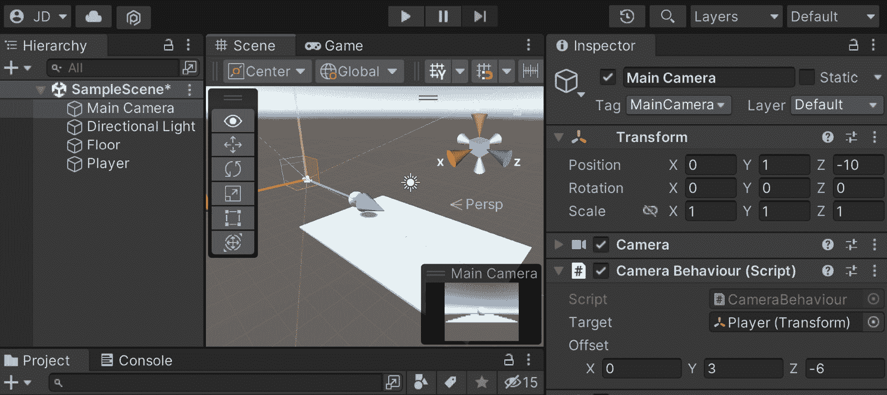

图 1.14 – CameraBehaviour 组件设置

1.  保存场景并播放游戏：

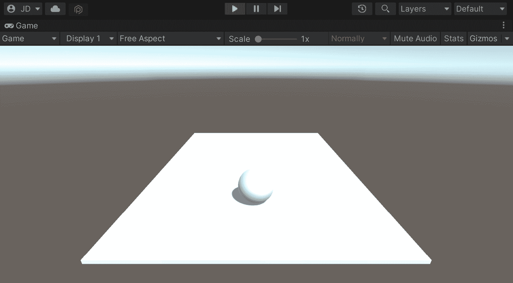

图 1.15 – 游戏当前状态

现在摄像机跟随玩家移动。您可以随意调整变量，看看它如何影响摄像机的视觉效果，以获得您最喜欢的项目感觉。在此之后，我们可以为球设置一个移动的目标，我们将在下一节中介绍。

# 创建基本瓦片

我们希望我们的游戏是无限的，但为了实现这一点，我们需要有可以生成来构建我们环境的部件；让我们现在就做吧：

1.  要开始，我们首先需要为我们的跑步游戏创建一个可重复的单个部件。为此，我们将在已有的地板上添加一些墙壁。从 `Left Wall`。

1.  修改 `1`、`2`、`10`）。从那里，通过点击工具覆盖层上的带有箭头的按钮或按 *W* 键来选择 **移动** 工具。

注意

Unity 最近的添加是 **叠加层** 的概念，它已经取代了原始的工具栏。有关它们的信息以及如何使用它们，请查看 [`docs.unity3d.com/2022.1/Documentation/Manual/overlays.html`](https://docs.unity3d.com/2022.1/Documentation/Manual/overlays.html)。

关于 Unity 内置快捷键的更多信息，请查看[`docs.unity3d.com/Manual/UnityHotkeys.html`](https://docs.unity3d.com/Manual/UnityHotkeys.html)。

1.  我们希望这堵墙与地板匹配，所以按住 *V* 键进入 *顶点吸附* 模式。在顶点吸附模式下，我们可以选择网格上的任何顶点，并将其移动到另一个对象上的另一个顶点的相同位置。这对于确保物体之间没有空洞非常有用。

1.  在开启顶点吸附模式的情况下，选择内边缘并拖动，直到它碰到地板的边缘。或者，你可以设置（`3`，`0.95`，`0`）：

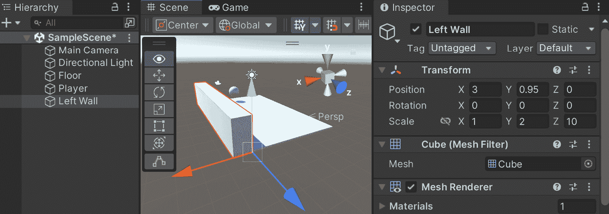

图 1.16 – 左墙设置

注意

关于在场景中移动对象的信息，包括更多关于顶点吸附模式的细节，请查看[`docs.unity3d.com/Manual/PositioningGameObjects.html`](https://docs.unity3d.com/Manual/PositioningGameObjects.html)。

1.  然后，复制这个墙壁，并将另一个对象放在另一边（`-3`，`0.95`，`0`），命名为`Right Wall`：

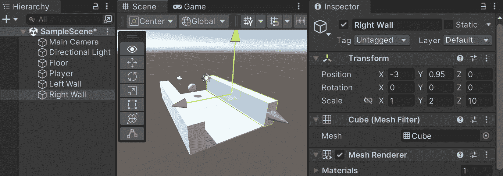

图 1.17 – 右墙设置

如前一张截图所示，我们现在保护玩家不会从游戏区域的左右边缘掉落。由于墙壁的设置方式，如果我们移动`Floor`对象，墙壁也会移动。

注意

关于移动 Unity 相机或导航到**场景视图**的信息，请查看[`docs.unity3d.com/Manual/SceneViewNavigation.html`](https://docs.unity3d.com/Manual/SceneViewNavigation.html)。

游戏设计的方式是，球滚过单个瓦片后，我们就不再需要它在那里了。如果我们只是让它留在那里，由于游戏环境中使用了这么多需要内存的东西，游戏的速度会随着时间的推移而变慢，所以移除不再使用的资源是个好主意。我们还需要有某种方法来确定何时生成新的瓦片以继续玩家可以走的路径。

1.  现在，我们还想知道这个部分在哪里结束，所以我们将添加一个带有触发碰撞器的对象。选择`Tile End`。

1.  然后，我们将添加一个（`7`，`2`，`1`）以适应玩家可以行走的区域的大小。注意，有一个绿色框围绕该空间，显示碰撞可以发生的位置。将（`0`，`1`，`10`）设置为超过瓦片的末端。最后，检查**触发器**属性，以便碰撞引擎将碰撞器转换为触发器，这样当它被击中时可以运行代码事件，但不会阻止玩家通过它：

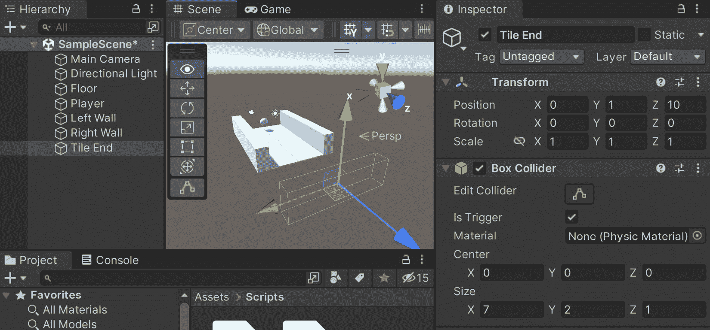

图 1.18 – 标题

如我之前简要提到的，这个触发器将被用来告诉游戏我们的玩家已经走过了这个方块。由于我们希望在玩家通过摄像机所能看到的范围之前仍然能看到方块，所以这个触发器被放置在方块之后。我们将告诉引擎从游戏中移除这个方块，但关于这一点我们将在本章后面详细讨论。

1.  现在我们已经创建了所有对象，我们希望将我们的对象组合在一起作为一个可以创建副本的整体。为此，让我们通过访问`Basic Tile`创建一个空的 GameObject 实例。设置`0`、`0`、`0`）。

1.  然后，转到**层次结构**窗口，将**地板**、**方块末端**、**左墙**和**右墙**对象拖放到其上方，使它们成为**基本** **方块**对象的子对象。

1.  目前，摄像机可以看到方块的开始，为了解决这个问题，让我们将`0`、`0`、`-5`）设置为。如您在下面的屏幕截图中所见，现在整个方块将移回：

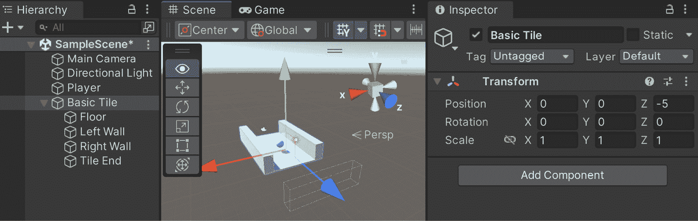

图 1.19 – 将方块移回

1.  最后，我们需要知道应该在什么位置生成下一个部件，因此通过访问`Next Spawn Point`创建另一个空的 GameObject，并设置其`0`、`0`、`5`）。

注意

注意，当我们修改一个有父对象的对象时，位置是相对于父对象，而不是其世界位置。

如您所见，生成点位置现在将在我们当前标题的边缘：

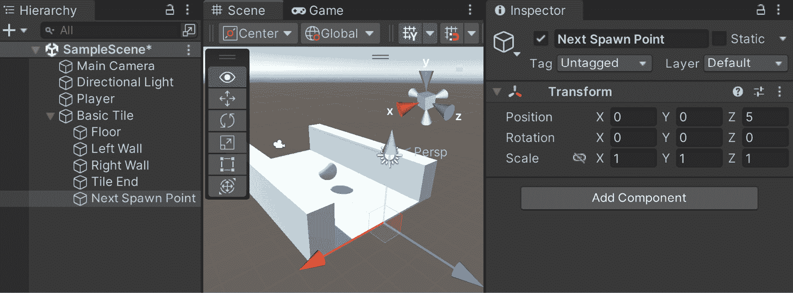

图 1.20 – 下一个生成点位置

1.  现在我们有一个完全完成的单个方块。而不是手动多次复制它，我们将利用 Unity 的**预制件**概念。预制件，或预制对象，是 GameObject 和组件的蓝图，我们可以将其转换为文件，从而可以复制。预制件还有其他一些有趣的功能，但我们将随着使用它们来讨论它们。

从**预制件**。然后，将**基本方块**对象从**层次结构**窗口拖放到**预制件**文件夹内的**项目**窗口中。如果**基本方块**名称在**层次结构**窗口中的文本变为蓝色，我们将知道它已经被正确创建：

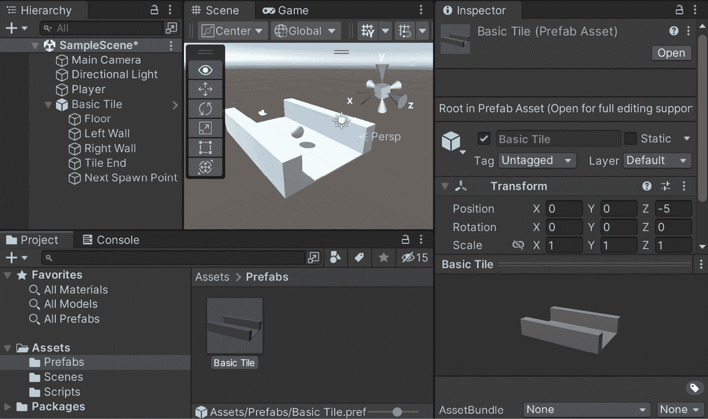

图 1.21 – 基本方块预制件创建

我们现在有一个可以创建副本以扩展我们的环境的方块预制件。

# 使其无限

现在我们已经打下基础，让我们这样设置，以便我们可以继续运行而不是在短时间内停止，通过在彼此前面生成这个基本方块的副本：

1.  首先，我们有我们的预制件，因此我们可以通过选择它并按*删除*键来删除**基本方块**在**层次结构**窗口中的原始**基本方块**。

1.  我们需要一个地方来创建所有这些地砖，并可能管理游戏的信息，例如玩家的分数。在 Unity 中，这通常被称为 `GameManager`。从 `GameManager`。

1.  在你的 IDE 中打开脚本并使用以下代码：

    ```kt
    using UnityEngine;
    /// <summary>
    /// Manages the main gameplay of the game
    /// </summary>
    public class GameManager : MonoBehaviour
    {
        [Tooltip("A reference to the tile we want to
            spawn")]
        public Transform tile;
        [Tooltip("Where the first tile should be placed
            at")]
        public Vector3 startPoint = new Vector3(0, 0, -5);
        [Tooltip("How many tiles should we create in
            advance")]
        [Range(1, 15)]
        public int initSpawnNum = 10;
        /// <summary>
        /// Where the next tile should be spawned at.
        /// </summary>
        private Vector3 nextTileLocation;
        /// <summary>
        /// How should the next tile be rotated?
        /// </summary>
        private Quaternion nextTileRotation;
        /// <summary>
        /// Start is called before the first frame update
        /// </summary>
        private void Start()
        {
            // Set our starting point
            nextTileLocation = startPoint;
            nextTileRotation = Quaternion.identity;
            for (int i = 0; i < initSpawnNum; ++i)
            {
                SpawnNextTile();
            }
        }
        /// <summary>
        /// Will spawn a tile at a certain location and
        /// setup the next position
        /// </summary>
        public void SpawnNextTile()
        {
            var newTile = Instantiate(tile,
                nextTileLocation, nextTileRotation);
            // Figure out where and at what rotation we
            /// should spawn the next item
            var nextTile = newTile.Find("Next Spawn
                Point");
            nextTileLocation = nextTile.position;
            nextTileRotation = nextTile.rotation;
        }
    }
    ```

此脚本将根据 `tile` 和 `initSpawnNum` 属性生成一系列地砖。

1.  保存你的脚本并回到 Unity。从那里，创建一个新的空 GameObject 并命名为 `Game Controller`，如果需要的话，为了组织目的可以重置位置。将其拖放到 **Hierarchy** 窗口的顶部。为了清晰起见，如果你想的话，可以重置位置。然后，将 **Game Manager** 脚本附加到对象上，并通过拖放从 **Project** 窗口中的 **Basic Tile** 预制件到 **Tile** 槽来设置 **Tile** 属性：

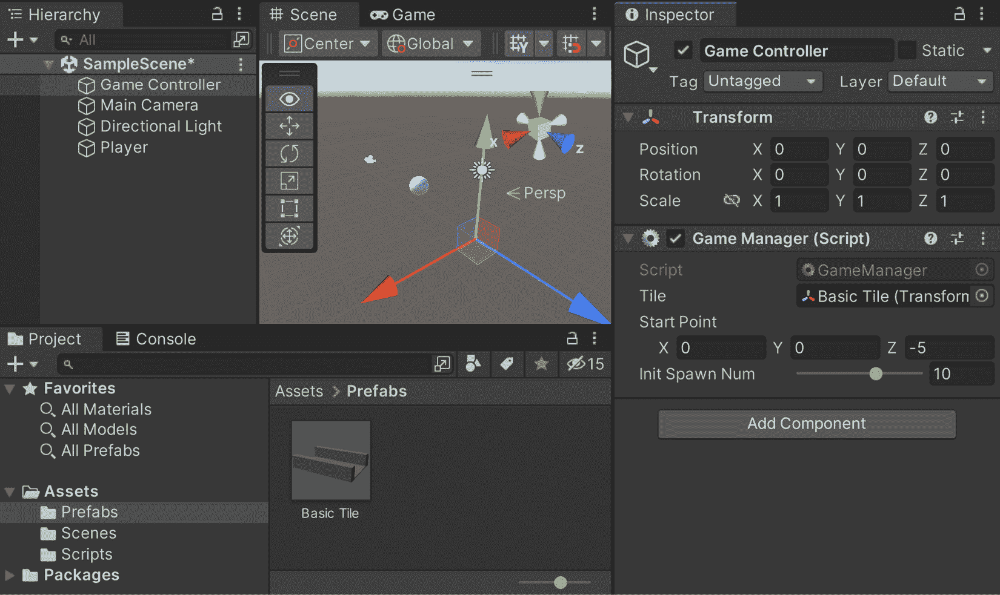

图 1.22 – 分配 Tile 属性

1.  保存你的场景并运行项目：

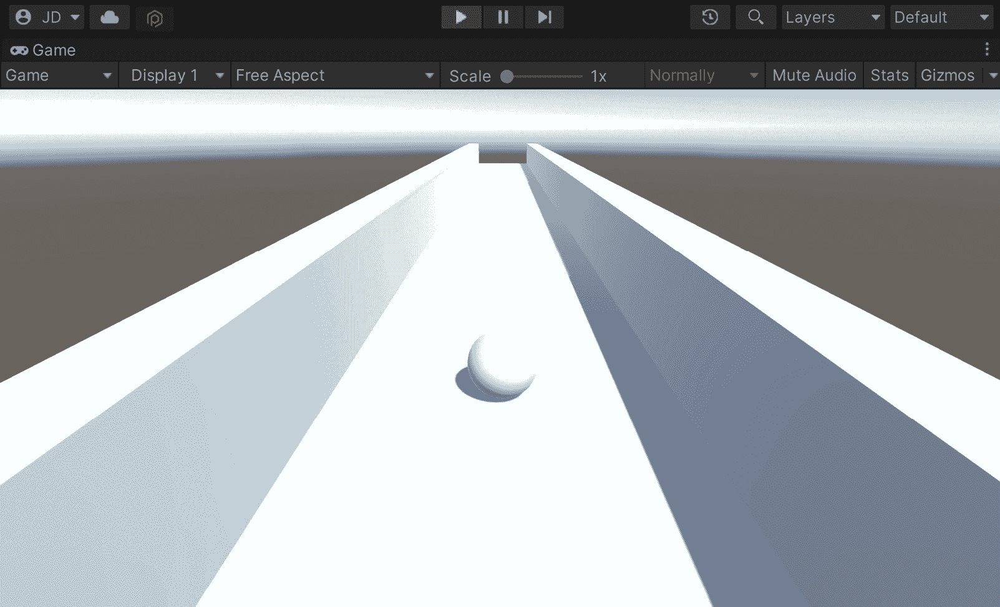

图 1.23 – 游戏的当前状态

太好了，但现在我们将在这些之后创建新的对象，我们不想一次性创建大量的这些对象。一旦我们到达地砖的尽头，最好是创建一个新的地砖并移除它。我们稍后会进一步优化这一点，但这样，在任何给定时间内，游戏中总是有大约相同数量的地砖。

1.  进入 `TileEndBehaviour`，使用以下代码：

    ```kt
    using UnityEngine;
    /// <summary>
    /// Handles spawning a new tile and destroying this
    /// one upon the player reaching the end
    /// </summary>
    public class TileEndBehaviour : MonoBehaviour
    {
        [Tooltip("How much time to wait before destroying
            " + "the tile after reaching the end")]
        public float destroyTime = 1.5f;
        private void OnTriggerEnter(Collider other)
        {
            // First check if we collided with the player
            if(other.gameObject.GetComponent
            <PlayerBehaviour>())
            {
                // If we did, spawn a new tile
                var gm = GameObject.FindObjectOfType
                    <GameManager>();
                gm.SpawnNextTile();
                // And destroy this entire tile after a
                // short delay
                Destroy(transform.parent.gameObject,
                    destroyTime);
            }
        }
    }
    ```

1.  现在，为了将其分配给预制件，我们可以转到 **Project** 窗口，然后进入 **Prefabs** 文件夹。从那里，双击 **Basic Tile** 对象以打开其编辑器。从 **Hierarchy** 选项卡，选择 **Tile End** 对象，然后向其添加一个 **Tile End Behaviour** 组件：

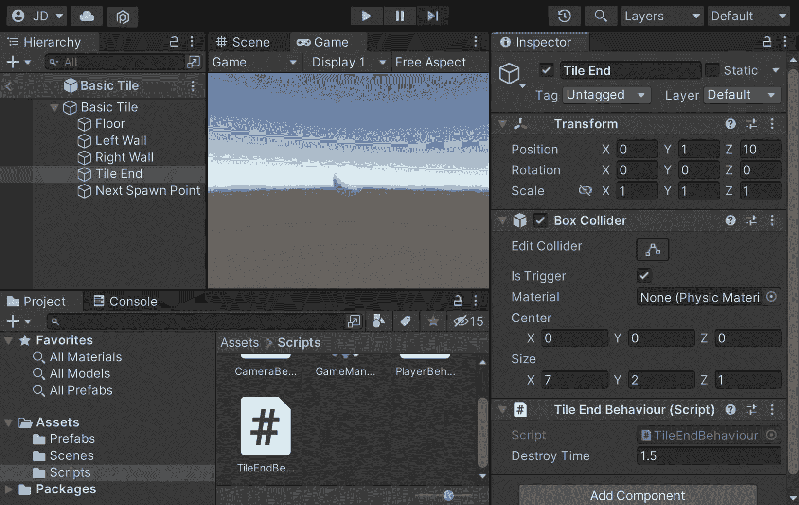

图 1.24 – 添加 Tile End Behaviour

1.  点击预制件名称旁边的左箭头以返回基本场景：

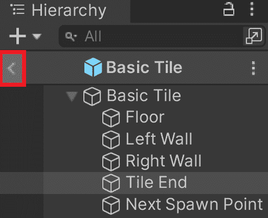

图 1.25 – 左箭头位置

提示

你也可以通过从 **Project** 窗口选择预制件对象，转到 **Inspector** 选项卡，并点击 **Open** **Prefab** 按钮来打开预制件编辑器。

1.  保存你的场景并播放。现在你会注意到，随着玩家继续移动，新的地砖会随着你的移动而生成；如果你在播放时切换到 **Scene** 选项卡，你会看到球通过地砖时，它们会自行销毁：

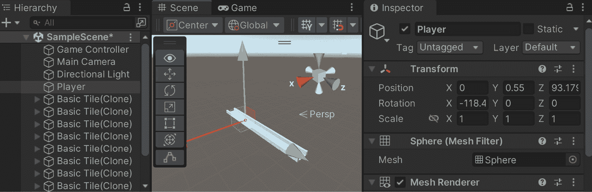

图 1.26 – 地砖自动被销毁

这样可以确保玩家面前有地砖可以访问！但当然，这只是一个无休止的直线。在下一节中，我们将看到如何使游戏变得更加有趣。

# 创建障碍物

我们有一些基本的瓦片是很好的，但给玩家一些事情做，或者在我们的案例中，一些需要避免的事情是个好主意。这将给玩家提供某种挑战和基本的游戏目标，即避免这里的障碍物。在本节中，你将学习如何自定义你的瓦片，为玩家添加需要避免的障碍物。所以，让我们看看步骤：

1.  就像我们为基本瓦片创建预制体一样，我们将通过代码创建一个单独的障碍物。我想让它容易看到障碍物在世界上看起来是什么样子，并确保它不是太大，所以我将再次将**基本瓦片**预制体拖回到世界中。

1.  接下来，我们将通过访问`Obstacle`来创建一个立方体。将`2`改为`1`，并将其放置在平台上方（`0`，`1`，`0.25`）：

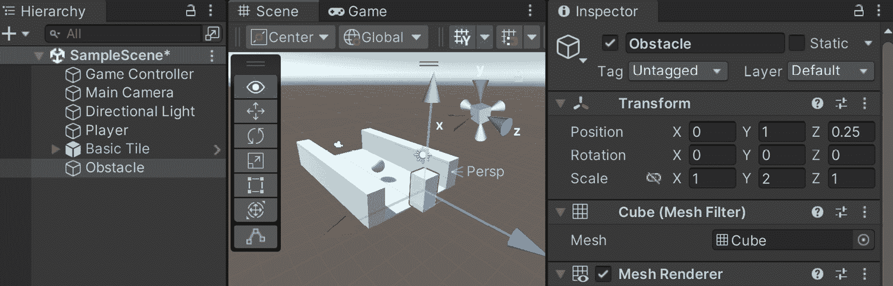

图 1.27 – 添加障碍物

1.  然后，我们可以玩游戏来查看它的工作方式：

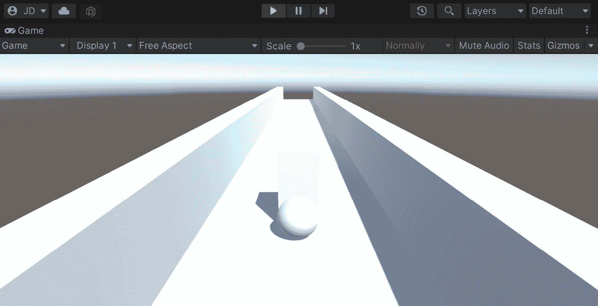

图 1.28 – 障碍物阻止玩家

1.  如前一个屏幕截图所示，玩家被阻止，但并没有真正发生什么。在这种情况下，我们希望玩家在碰到这个障碍物时失去游戏，然后重新开始游戏；为此，我们需要编写一个脚本。从`ObstacleBehaviour`中，我们将使用以下代码：

    ```kt
    using UnityEngine;
    using UnityEngine.SceneManagement; // LoadScene
    public class ObstacleBehaviour : MonoBehaviour
    {
        [Tooltip("How long to wait before restarting the
            game")]
        public float waitTime = 2.0f;
        private void OnCollisionEnter(Collision collision)
        {
            // First check if we collided with the player
            if (collision.gameObject.GetComponent
            <PlayerBehaviour>())
            {
                // Destroy the player
                Destroy(collision.gameObject);
                // Call the function ResetGame after
                // waitTime has passed
                Invoke("ResetGame", waitTime);
            }
        }
        /// <summary>
        /// Will restart the currently loaded level
        /// </summary>
        private void ResetGame()
        {
            // Get the current level's name
            string sceneName =
                SceneManager.GetActiveScene().name;
            // Restarts the current level
            SceneManager.LoadScene(sceneName);
        }
    }
    ```

1.  保存脚本并返回到编辑器，将脚本附加到我们刚刚创建的`Obstacle`游戏对象。

1.  保存你的场景并尝试游戏：

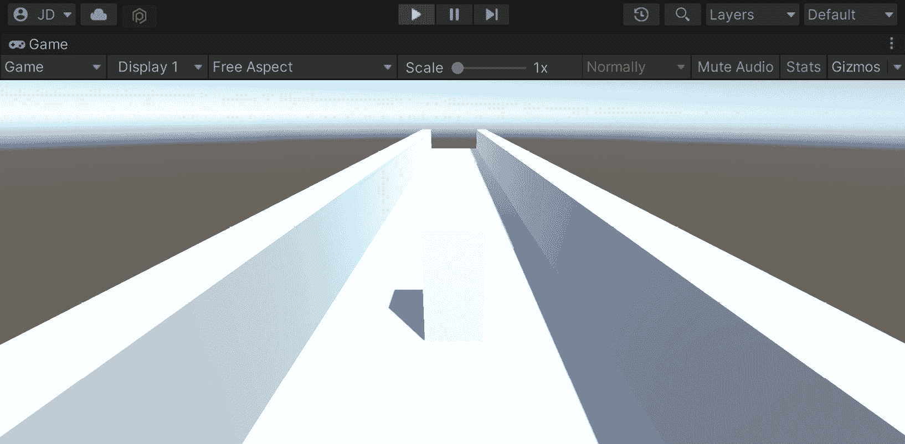

图 1.29 – 障碍物摧毁玩家

如前一个屏幕截图所示，一旦我们碰到障碍物，玩家就会被摧毁，然后几秒钟后，游戏重新开始。你将学习如何使用粒子系统和其他东西来完善它，但到目前为止，它已经可以正常工作，这正是我们想要的。

1.  现在我们知道它工作得很好，我们可以将其制作成一个预制体。就像我们最初创建瓦片一样，将**障碍物**对象从**层次结构**拖放到**项目**选项卡中的**预制体**文件夹：

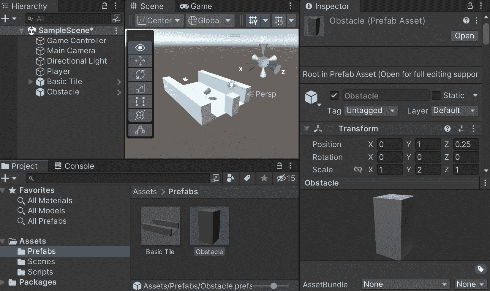

图 1.30 – 创建障碍物预制体

1.  接下来，我们将移除**障碍物**对象，因为我们将在创建瓦片时生成它。为此，在**层次结构**窗口中选择**障碍物**对象，然后按*删除*键。

1.  我们将制作标记来指示我们可能希望生成障碍物的地方。展开`Next Spawn Point`（`0`，`1`，`4`）。然后我们将对象重命名为`Center`。

1.  之后，为了帮助在**场景**窗口中看到对象，转到**检查器**窗口，点击*灰色立方体*图标，然后在**选择图标**菜单中，选择你想要的任何颜色选项（我选择了蓝色）。完成此操作后，你会发现如果我们靠近对象，我们可以在编辑器中看到文本（但默认情况下它不会在**游戏**选项卡中显示）：

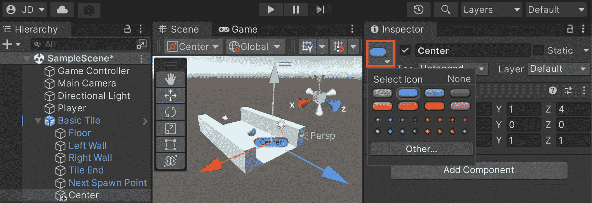

图 1.31 – 创建中心标记

1.  我们希望有一种方法来获取我们将来可能需要的所有潜在生成点，以防我们决定扩展项目，因此我们将分配一个标签作为引用，以便更容易找到这些对象。为此，在`ObstacleSpawn`的顶部：

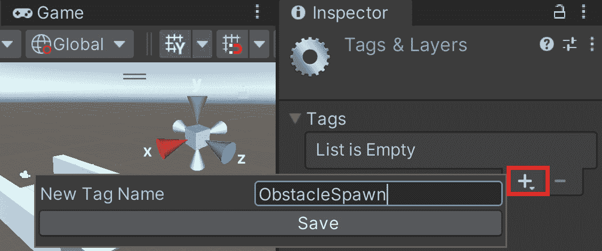

图 1.32 – 创建障碍物生成标签

1.  返回并选择**中心**对象，将**标签**属性分配给**障碍物生成**：

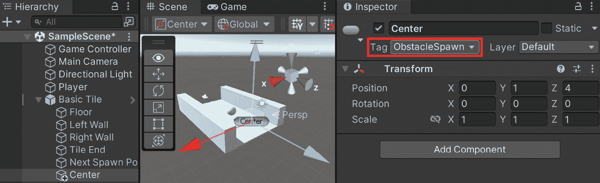

图 1.33 – 为中心对象分配标签

注意

有关标签及其使用原因的更多信息，请参阅[`docs.unity3d.com/Manual/Tags.html`](https://docs.unity3d.com/Manual/Tags.html)。

1.  继续复制两次，并将其他名称分别改为`Left`和`Right`，将它们移动到中心左侧和右侧两个单位，以成为其他可能的障碍物点：

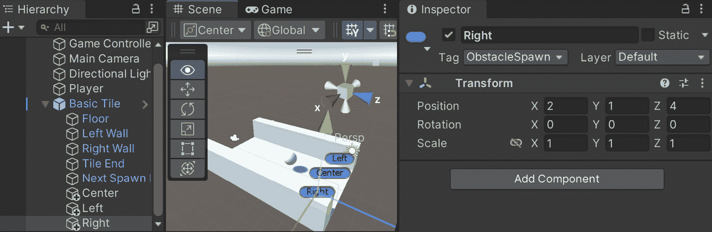

图 1.34 – 创建左右标记

1.  注意，默认情况下，这些更改不会影响原始预制件；这就是为什么对象目前显示为黑色文本。要实现这一点，请选择**基本瓦片**，然后在**检查器**窗口下的**预制件**部分，点击**覆盖**并选择**应用全部**：

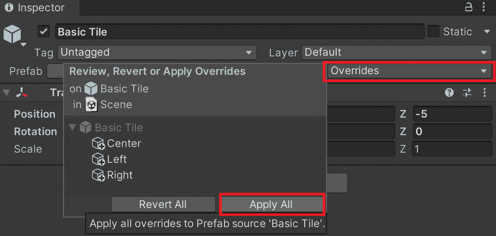

图 1.35 – 应用预制件更改

1.  现在预制件设置正确后，我们可以通过在**层次**窗口中选择它并按下*Delete*键来继续移除它。

1.  然后，我们需要进入`GameManager`脚本并做一些修改。首先，我们需要引入一些新变量：

    ```kt
    /// <summary>
    /// Manages the main gameplay of the game
    /// </summary>
    public class GameManager : MonoBehaviour
    {
        [Tooltip("A reference to the tile we want to
            spawn")]
        public Transform tile;
        [Tooltip("A reference to the obstacle we want to
            spawn")]
        public Transform obstacle;
        [Tooltip("Where the first tile should be placed
            at")]
        public Vector3 startPoint = new Vector3(0, 0, -5);
        [Tooltip("How many tiles should we create in
            advance")]
        [Range(1, 15)]
        public int initSpawnNum = 10;
        [Tooltip("How many tiles to spawn with no
            obstacles")]
        public int initNoObstacles = 4;
    ```

这些变量中的第一个是我们将要创建副本的障碍物的引用。第二个是生成障碍物前应该生成多少个瓦片的参数。这是为了确保玩家在需要躲避之前可以看到障碍物。

1.  然后，我们需要修改`SpawnNextTile`函数以生成障碍物：

    ```kt
    /// <summary>
    /// Will spawn a tile at a certain location and setup
    /// the next position
    /// </summary>
    /// <param name="spawnObstacles">If we should spawn an
    /// obstacle</param>
    public void SpawnNextTile(bool spawnObstacles = true)
    {
        var newTile = Instantiate(tile, nextTileLocation,
                                  nextTileRotation);
        // Figure out where and at what rotation we should
        // spawn the next item
        var nextTile = newTile.Find("Next Spawn Point");
        nextTileLocation = nextTile.position;
        nextTileRotation = nextTile.rotation;
        if (spawnObstacles)
        {
            SpawnObstacle(newTile);
        }
    }
    ```

注意，我们修改了`SpawnNextTile`函数，现在它有一个默认参数设置为`true`，这将告诉我们是否想要生成障碍物。在游戏开始时，我们可能不希望玩家立即开始躲避，但我们可以调整这个值来增加或减少我们使用的数量。因为它有一个默认值`true`，所以在`Start`函数中调用它的原始版本仍然可以正常工作而不会出错，但稍后我们将对其进行修改。

1.  在这里，我们询问值是否为`true`以调用名为`SpawnObstacle`的函数，但这个函数还没有编写。我们将在下一部分添加它，但首先，我们将使用`List`类，并确保编译器知道我们指的是哪个`List`类，因此需要在文件顶部添加一个`using`语句：

    ```kt
    using UnityEngine;
    using System.Collections.Generic; // List
    ```

1.  现在我们可以编写`SpawnObstacle`函数。将以下函数添加到脚本中：

    ```kt
    private void SpawnObstacle(Transform newTile)
    {
        // Now we need to get all of the possible places
        // to spawn the obstacle
        var obstacleSpawnPoints = new List<GameObject>();
        // Go through each of the child game objects in
        // our tile
        foreach (Transform child in newTile)
        {
            // If it has the ObstacleSpawn tag
            if (child.CompareTag("ObstacleSpawn"))
            {
                // We add it as a possibility
                obstacleSpawnPoints.Add(child.gameObject);
            }
        }
        // Make sure there is at least one
        if (obstacleSpawnPoints.Count > 0)
        {
            // Get a random spawn point from the ones we
            // have
            int index = Random.Range(0,
                obstacleSpawnPoints.Count);
            var spawnPoint = obstacleSpawnPoints[index];
            // Store its position for us to use
            var spawnPos = spawnPoint.transform.position;
            // Create our obstacle
            var newObstacle = Instantiate(obstacle,
                spawnPos, Quaternion.identity);
            // Have it parented to the tile
            newObstacle.SetParent(spawnPoint.transform);
        }
    }
    ```

1.  最后，让我们更新`Start`函数：

    ```kt
    /// <summary>
    /// Start is called before the first frame update
    /// </summary>
    private void Start()
    {
        // Set our starting point
        nextTileLocation = startPoint;
        nextTileRotation = Quaternion.identity;
        for (int i = 0; i < initSpawnNum; ++i)
        {
            SpawnNextTile(i >= initNoObstacles);
        }
    }
    ```

现在，只要`i`小于`initNoObstacles`变量的值，就不会生成变量，实际上为我们提供了一个可以调整四个格子的缓冲区，通过更改`initNoObstacles`变量来调整。

1.  保存脚本并返回 Unity 编辑器。然后，在**检查器**窗口中将**游戏管理器（脚本）**组件的`Obstacle`变量分配为我们之前创建的**障碍物**预制件：

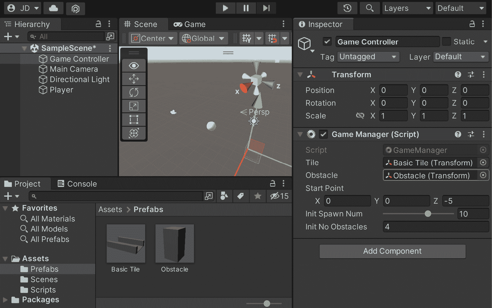

图 1.36 – 分配障碍物属性

1.  由于默认的光照设置，目前很难看清东西，所以让我们转到**层次结构**窗口并选择**方向光**对象。方向光的作用类似于地球上的太阳，从某个位置向四面八方发光。

1.  使用默认设置时，灯光有点太亮，阴影默认太暗，所以先调整到`0.5`，然后再次调整到`0.5`：

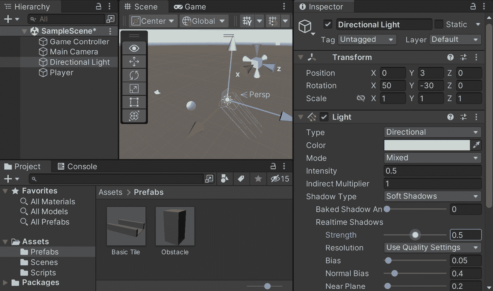

图 1.37 – 调整方向光

1.  保存你的场景并玩游戏：

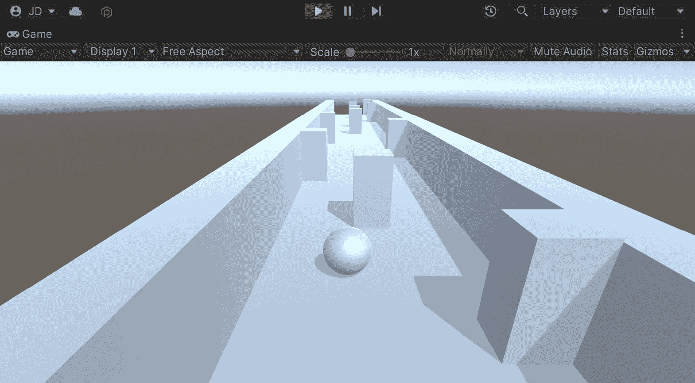

图 1.38 – 游戏当前状态

如前一个截图所示，我们现在有了一些玩家需要避免的障碍物！

注意

关于方向光和 Unity 拥有的其他光照类型的信息，请查看[`unity3d.com/learn/tutorials/topics/graphics/light-types?playlist=17102`](https://unity3d.com/learn/tutorials/topics/graphics/light-types?playlist=17102)。

# 摘要

那就是了！一个坚实的基础——但仅仅是基础。然而，话虽如此，我们在本章中讨论了大量的内容。我们讨论了如何在 Unity 中创建新项目，并构建了一个可以持续移动并接受水平移动输入的玩家。然后，我们讨论了如何使用 Unity 的属性和 XML 注释来提高我们的代码质量并帮助我们团队合作。我们还介绍了如何拥有移动的摄像头。我们创建了一个基于瓦片的关卡设计系统，在游戏进行中创建新的瓦片，随机生成玩家需要避免的障碍物。

在整本书中，我们将探讨更多可以用来改进这个项目并使其更加完善的方法，同时将其改为在移动平台上提供最佳体验。然而，在我们到达那里之前，我们实际上需要弄清楚如何部署我们的项目，这就是我们在下一章将要工作的内容。
