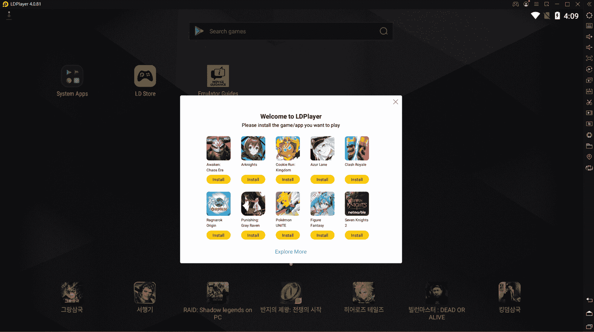
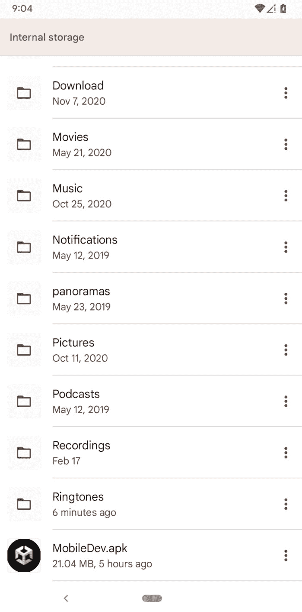

# Android 和 iOS 开发项目设置

我们现在有一个项目可以开始，但当前，它是针对在 PC 上玩而构建的。然而，由于本书是关于移动开发的，在我们进一步深入之前，让游戏在设备本身上运行非常重要。

在本章中，我们将介绍我们需要执行的所有设置，以便将项目部署到我们的移动设备。在撰写本书时，移动开发通常是针对 Android 或 iOS 进行的，因此我们将涵盖这两个平台。

本章将分为几个主题。整个章节本身将是一个从开始到结束的简单步骤过程。以下是我们将执行的任务列表：

+   介绍**构建** **设置**菜单

+   为 PC 构建项目

+   将您的项目导出到 Android

+   使用模拟器运行 Android APK

+   将项目放在您的 Android 设备上

+   Unity iOS 安装和 Xcode 设置

+   为 iOS 构建项目

+   通过 iOS 模拟器运行项目

# 技术要求

本书使用 Unity 2022.1.0b16 和 Unity Hub 3.3.1，但步骤应该在未来版本的编辑器中只需做最小改动即可。如果您想下载本书中使用的确切版本，并且有新版本发布，您可以访问 Unity 的下载存档[`unity3d.com/get-unity/download/archive`](https://unity3d.com/get-unity/download/archive)。您也可以在*Unity 编辑器系统* *要求*部分找到 Unity 的系统要求[`docs.unity3d.com/2022.1/Documentation/Manual/system-requirements.html`](https://docs.unity3d.com/2022.1/Documentation/Manual/system-requirements.html)。

如果您想部署到 Android 设备，您可以使用 macOS、Linux 或 Windows，并且根据您希望使用的功能，您可以将游戏以某种方式导出，以便在 Android 5.1 Lollipop 及以上版本上运行应用程序。

注意

更多关于支持的不同类型 Android 版本的信息，请查看[`docs.unity3d.com/ScriptReference/AndroidSdkVersions.html`](https://docs.unity3d.com/ScriptReference/AndroidSdkVersions.html)。

要为 iOS 设备开发，除了设备本身运行 iOS 12 或更高版本外，您还需要在运行 OS X 10.13 High Sierra 或更高版本的 Intel Macintosh 和运行 Apple 硅的 Macintosh 上做一些工作。我将使用 12.3.1 macOS Monterey。如果您没有，您可以使用 Windows 开发您的游戏，当您想发布游戏时，将您的项目带到 Macintosh 上进行最终导出。

注意

使用 Windows 构建 iOS 应用还有一些其他潜在的方法，但它们不在这个书籍的范围内。一个可能的选择是使用 Unity 的 CI/CD 云构建自动化与部署工具服务，该服务会自动创建你游戏的不同版本。有关更多信息，请查看[`unity.com/solutions/ci-cd`](https://unity.com/solutions/ci-cd).

另一个潜在的选择可能是通过云服务租用一台 Macintosh 电脑来自行构建。有关该选项和其他潜在选项的更多信息，请查看[`mindster.com/how-develop-ios-apps-windows/`](https://mindster.com/how-develop-ios-apps-windows/).

你可以在 GitHub 上找到本章的代码文件[`github.com/PacktPublishing/Unity-2022-Mobile-Game-Development-3rd-Edition/tree/main/Chapter02`](https://github.com/PacktPublishing/Unity-2022-Mobile-Game-Development-3rd-Edition/tree/main/Chapter02).

# 介绍构建设置菜单

在开发过程中，有时你可能想看看你的游戏在编辑器外部的样子。这可以给你一种成就感。我知道我第一次将构建版本推送到控制台开发工具包时就有这种感觉。无论是 PC、Macintosh、Linux、网络玩家、移动设备还是控制台，我们都必须通过相同的菜单——**构建设置**菜单：

1.  首先，打开我们在*第一章*“构建你的游戏”中创建的项目。此外，打开我们创建的场景（`SampleScene.unity`，位于`Scenes`文件夹中）：

图 2.1 – SampleScene 文件

1.  由于场景是我们的游戏玩法，让我们首先在`SampleScene`对象中的`Scenes`文件夹中打开文件，选择`Gameplay`，然后按*Enter*键提交更改。Unity 将询问你是否想要重新加载场景。通过点击**重新加载**来完成此操作。

1.  从这里，我们将通过选择**文件** | **构建设置**来打开**构建设置**菜单：

小贴士

你也可以通过按*Ctrl* + Shift + *B*或*Command* + Shift + *B*来打开菜单。

图 2.2 – 构建设置菜单

在前面的屏幕截图中，你会注意到**构建设置**菜单已经出现。此菜单包含三个部分：

+   **构建中的场景**（顶部）：此窗口包含我们希望在构建项目时包含的场景。这确保了除非指定，否则测试级别等事物不会被包含。

+   **平台**（左下角）：这是一个你可以导出游戏的平台列表。Unity 标志出现在你正在编译的当前平台上。要更改平台，你需要从列表中选择它，然后点击列表下方的**切换平台**按钮。

+   **选项**（右下角）：在 **平台** 部分的右侧，你会看到一些可以根据你想要构建的方式进行调整的设置，某些选项会根据你将要工作的平台而改变。

1.  默认情况下，我们的构建中没有场景，所以让我们继续更改它。点击列表中索引为 **0** 的 `Scenes/Gameplay` 级别，这意味着当你的游戏运行时，这个级别将是第一个加载的：

图 2.3 – 将游戏玩法场景添加到构建中的场景

现在我们已经了解了构建设置的工作原理，让我们看看如何为 PC 构建项目，以便在继续构建我们的移动游戏之前了解一般情况。

注意

你还可以通过从 **项目** 窗口拖放场景到 **构建中的场景** 部分添加场景。你也可以拖动场景以按你希望的顺序重新排列它们。

# 为 PC 构建项目

默认情况下，我们的平台设置为 **Windows, Mac, Linux**。为了验证一切是否正常工作，让我们先在我们的平台上运行游戏，然后再转向移动设备：

1.  要开始，我们将选择 **构建** 选项。在我的情况下，我将把项目导出到 Windows，但这个过程对于 macOS 和 Linux 也是类似的。

1.  完成此操作后，将弹出一个窗口，要求输入游戏名称和放置游戏的位置。我将创建一个新 `Export` 文件夹，位于包含 `Assets` 和 `Library` 的同一文件夹中，因此它不会显示在 **项目** 窗口中，但将位于我的项目文件夹中：

图 2.4 – 导出文件夹

1.  点击 **选择文件夹** 并等待其完成。一旦完成，应该会出现以下窗口：

图 2.5 – 创建的文件夹

我们有可执行文件，但还有一个包含我们应用程序所有资源的数据文件夹（目前称为 `MobileDev_Data`）。你必须包含数据文件夹以及与你的游戏一起创建的其他文件，否则它将无法运行。

如果你为 Mac 构建项目，它将捆绑应用程序和数据，所以一旦你导出游戏，你只需要提供应用程序即可。

1.  如果你双击 `.exe` 文件来运行游戏，你将被带到正确的游戏屏幕，如下面的截图所示：

图 2.6 – 运行游戏

这样一来，我们应该能够像平时一样控制和玩游戏。这真是太好了！

小贴士

你将需要使用 *Alt* + *F4*（在 Macintosh 上为 *Command* + *Q*）来退出游戏，并且你可以通过按 *Alt* + *Enter* 切换到窗口模式。

现在我们已经讨论了构建项目的通用方法，让我们深入了解不同平台的具体情况。在下一节中，我们将讨论如何将我们的项目上传到 Android 设备。

# 为 Android 导出项目

现在我们已经完成了所有设置，我们可以用我们的项目打开 Unity 并将其导出为 Android 设备。在本节中，我们首先检查是否已安装 Android 构建支持，然后我们将更新构建和玩家设置以导出我们的项目。那么，让我们开始吧。

## 为 Unity 安装 Android 构建支持

首先，如果你还没有这样做，你需要在安装 Unity 时选择将**Android 构建支持**作为选项。如果你已经安装了它，你可以跳过这一部分。如果你在初始安装时没有安装它，我们将在以下步骤中介绍安装过程：

1.  关闭 Unity 编辑器，打开 Unity Hub 并选择**安装**部分。

1.  从那里，点击你当前 Unity 版本右侧的齿轮图标，并选择**添加模块**选项：

图 2.7 – 选择添加模块选项

1.  选择**Android 构建支持**选项，这也应该选中**Android SDK 和 NDK 工具**和**OpenJDK**选项。之后，点击**继续**按钮：

图 2.8 – 检查 Android 构建支持选项

1.  你将被带到许可条款页面。阅读它，如果你同意，勾选协议框并点击**安装**按钮：

图 2.9 – 来自谷歌的 Android SDK 和 NDK 许可条款

等待安装完成。一旦完成，你应该会在安装底部的位置看到 Android 标志：

图 2.10 – 新增的平台

这意味着 Android 构建支持现在已添加到我们的 Unity 版本中，我们可以在那里构建项目。接下来，我们将了解如何为 Android 构建项目以及所需的设置。

## 更新 Android 项目的构建和玩家设置

现在我们有了 Android 支持，让我们再次打开我们的项目并更改我们正在开发的平台：

1.  在这一点上，我们将深入 Unity，并通过转到**文件** | **构建设置**来再次进入我们的**构建设置**菜单。

1.  从**平台**列表中选择**Android**选项，然后点击**切换平台**按钮进行更改：

图 2.11 – 切换平台按钮的位置

注意，这将使 Unity 重新导入我们游戏中的所有资产，因此在开始构建较大的项目时可能会耗时较长。一旦完成，你应该会注意到 Unity 标志现在位于**Android**选项旁边，表示这是要构建的平台：

图 2.12 – 切换到 Android 平台

1.  现在，为了能够构建我们的项目，我们必须为我们的游戏设置捆绑标识符，这是一个标识应用的字符串。它写法类似于反向的 URL，例如，`com.yourCompanyName.yourGameName`。要修改这个，我们需要打开**玩家设置**菜单，我们可以通过点击**构建设置**菜单左下角的**玩家设置…**按钮或通过进入**编辑** | **项目设置** | **玩家**来访问它。你会注意到菜单作为一个新窗口出现：

图 2.13 – 玩家设置菜单

现在我们处于**Android**模式（注意 Unity 编辑器标题栏上的文本），我们可以更改这些属性：

图 2.14 – Android 模式

1.  我们将在后面的章节中讨论更多这些内容，但现在，将你的`JohnPDoran`更改。

1.  然后向下滚动，直到你到达**其他设置**选项。从那里，你会看到**包名**属性正在使用我们为**公司名称**和**产品名称**属性设置的任何内容，但如果我们想通过勾选**覆盖默认包名**属性来自定义它，我们必须确保它与默认值不同。

此外，还有一个**最小 API 级别**选项；确保你的选项设置为与你的手机相同的版本或更早的版本，具体取决于你想要支持什么。注意，你越早使用，可访问的功能就越少，但你的项目将能够支持更多的手机：

图 2.15 – 玩家设置调整

1.  关闭我们之前创建的`Export`文件夹。它将询问你希望文件具有的名称。我将使用`MobileDev`，因为我们之前这样做过，因为它将创建一个`.apk`文件而不是`.exe`文件：

图 2.16 – 创建的 Android APK

稍等片刻，一旦完成，你应该会在文件夹中找到一个新的`.apk`文件。当然，如果我们不能将其放在我们的实际手机上，那么仅仅拥有 APK 文件并没有什么作用，所以在下一个小节中，我们将使我们的手机能够在我们设备上测试游戏。

# 使用模拟器运行 Android APK

虽然测试 Android 游戏的最佳方式是在实际的 Android 设备上，但也可以在模拟器上测试游戏，这是一种我们可以让计算机运行为 Android 设备创建的软件的中介。在撰写本文时，有几个 Android 模拟器适用于 Windows，但我最有成功经验的是名为*LDPlayer*的一个轻量级且快速的 Android 模拟器；然而，由于它是免费的，所以包含广告。对于使用英特尔处理器的 Macintosh 用户，您可以使用*BlueStacks* ([`www.bluestacks.com/download.html`](https://www.bluestacks.com/download.html))，但在撰写本文时，在由 Apple 硅芯片驱动的 Macintosh 上没有可用的 Android 模拟器。本节完全可选；如果您更愿意在实际设备上测试，请跳到*将项目放在您的 Android 设备上*或*Unity for iOS 设置和 Xcode 安装*部分。

要在模拟器上测试游戏，请按照以下步骤操作：

1.  从您的网页浏览器，访问[`www.ldplayer.net/`](https://www.ldplayer.net/)。从那里，点击**下载 LDPlayer** **9** 按钮：

图 2.17 – LDPlayer 网站

1.  下载程序后，打开安装程序，完成标准安装过程，并在安装完成后点击**立即尝试**按钮：

图 2.18 – 欢迎使用 LDPlayer 菜单

1.  从欢迎屏幕，点击**欢迎使用 LDPlayer**菜单右上角的**X**。

1.  将您的`Export`文件夹中的`MobileDev.apk`文件拖放到 LDPlayer 菜单。如果一切顺利，您应该在屏幕上看到**MobileDev**图标：

图 2.19 – 游戏已添加到主屏幕

1.  从那里，您可以点击图标开始游戏！

图 2.20 – 游戏正在模拟设备上运行

如您所见，游戏在模拟设备上运行得非常完美！我们可以在完成游戏后，从**MobileDev**标签页点击**X**来退出。现在我们已经看到了在模拟器上运行游戏是多么简单，让我们看看如何在实际设备上操作！

# 将项目放在您的 Android 设备上

以下步骤可能因您的 Android 版本和具体手机而异，但这里有一套通用的步骤，以便能够将我们的 Android 应用到设备上：

1.  在您的 Android 设备上，您需要进入您的**设置**应用。从那里选择**应用**部分：

图 2.21 – 设置 | 应用位置

1.  从那里，向下滚动直到到达**特殊应用访问**部分或类似部分，然后点击它进入菜单：

图 2.22 – 特殊应用访问选项

1.  在里面，你会看到一个名为 **安装未知应用** 的部分。选择此选项：

图 2.23 – 安装未知应用选项

1.  我们将把我们的应用到设备的文件中上传，因此我们希望从 **文件** 应用中启用 **安装未知应用**。选择它，然后从菜单中启用它：

图 2.24 – 启用安装未知应用选项

启用此功能后，你的设备现在可以安装 `.apk` 文件，但你现在需要将你的游戏移动到设备上以安装它。最简单的方法是通过 USB 将其传输到设备；我们现在就这样做。

小贴士

对于那些不愿意使用 USB 的用户，我建议使用云存储应用，如 Dropbox，上传 `.apk` 文件，然后从应用中下载并以此方式安装。还有一个名为 ADB 的工具，可以通过 USB 或 Wi-Fi 将文件发送到你的手机。有关该工具以及 Android 构建过程的更多信息，请参阅 [`docs.unity3d.com/Manual/android-BuildProcess.html`](https://docs.unity3d.com/Manual/android-BuildProcess.html)。

1.  通过 USB 将你的手机连接到电脑。连接后，你的手机将显示一个通知，表明它通过 USB 连接进行充电。点击该通知，将选项更改为 **文件传输**：

图 2\. 25 – USB 设置

1.  之后，回到你的电脑，进入 **Windows 资源管理器/Finder**，然后转到 **设备和驱动器** 部分；你应该在那里看到你的设备：

图 2.26 – 选择我们的 Android 设备

1.  双击你的设备并访问内部共享存储部分。然后，将我们之前制作的 `.apk` 文件拖入此文件夹：

图 2.27 – 将 APK 文件放置在 Android 设备上

1.  现在，回到你的手机，打开 **文件/文件资源管理器** 应用。从那里，向下滚动到菜单底部并选择 **内部** **存储** 选项：

图 2.28 – 内部存储位置

1.  从那里，从列出的文件中选择你的 `.apk` 文件：

图 2.29 – 选择应用程序

1.  你将需要确认安装。点击 **安装** 按钮：

图 2.30 – 安装应用

1.  您可能会看到一个弹出窗口，提示 Play Protect 无法识别开发者。我们将在*第十四章*“提交游戏到 App Store”中介绍如何解决这个问题，但现在，请点击**安装即可**并等待安装完成：

图 2.31 – 安装即可

您的手机可能还会询问您是否希望通过 Play Protect 扫描应用。由于我们在阅读本书的过程中将创建多个项目版本，因此这很可能不是必需的，所以我将选择**不发送**。

小贴士

当然，我无法为所有设备列出步骤，因为一些设备需要不同的驱动程序或需要执行额外的步骤才能在设备上打开文件。如果这些步骤不起作用，并且您不知道如何将文件传输到您的设备上以及如何访问和添加新文件，请使用您选择的互联网搜索引擎搜索**手机名称文件传输**，将手机名称替换为您的手机名称。

1.  完成后，请点击**打开**按钮来打开我们的游戏：

图 2.32 – 在 Android 设备上运行的游戏

如您所见，游戏已经安装并正在运行。当然，您目前还不能控制它，还有很多新功能您还不能使用，但这表明您已正确设置了 Android 设备。当然，现在您的游戏已经安装到 Android 设备上，您现在需要将其在 iOS 上运行，我们将在下一节中介绍。

# iOS Unity 设置和 Xcode 安装

使用 Android 系统，需要做大量的设置工作，但将游戏构建并安装到设备上则相对轻松，而使用 iOS 系统，设置工作较少，但需要更多精力将游戏实际安装到设备上。

以前，您需要付费的 Apple 开发者许可证才能将游戏安装到 iOS 设备上。尽管将游戏上传到 App Store 仍然需要这个许可证，但您不再需要它来进行测试。请注意，免费选项并不提供所有功能，最显著的是**应用内购买**（**IAPs**）和游戏中心；然而，游戏应该在您的设备上运行得很好。当我们在*第十三章*“构建游戏发布版本”中介绍将项目上传到 App Store 时，我们将介绍如何调整您的项目以反映在 Apple 开发者门户中。

要为 iOS 设备开发，除了设备本身运行 iOS 12 或更高版本外，您还需要在运行 OS X 10.13 High Sierra 或更高版本的 Macintosh 计算机上做一些工作，对于使用 Apple 硅的 Macintosh，则需要 Big Sur 11.0。我将使用 12.3.1 macOS Monterey。就像与 Android 一样，我们还需要在真正进行导出之前做一些设置。现在我们就开始吧：

1.  首先，如果你还没有这样做，在安装 Unity 时，你需要将 **iOS 构建支持 (*)** 作为选项添加。如果你在初始安装时没有安装它，你可以打开 Unity Hub 并选择 **安装** 部分。

1.  从那里，点击你当前 Unity 版本右侧的三个点，并选择 **添加** **模块** 选项：

1.  从弹出的菜单中，勾选 **iOS 构建** **支持** 选项：

1.  点击 **安装** 按钮，等待安装完成。一旦完成，你应该会在平台列表中看到一些关于 iOS 支持的文本：

此模块允许你能够导出你的项目到 iOS。由于我主要使用我的 Windows 机器，所以我只添加了 iOS 支持，但你也可以从你的 Macintosh 电脑导出 iOS 和 Android 应用。

1.  你还需要安装 `Xcode` 并按 *Enter*。

1.  从那里，你将在页面右上角看到 **Xcode** 程序。点击它，然后点击 **安装/更新** 按钮（在我的情况下，是一个云图标）并完成安装过程：

1.  你可能需要输入你的 Apple ID 信息；请继续并完成输入，然后等待其完成。

注意

如果你没有 Apple ID，你可以从 [`appleid.apple.com/`](https://appleid.apple.com/) 获取一个。

1.  一旦安装了 Xcode，请打开它。你将看到 Xcode 和 iOS SDK 的许可协议；请继续点击 **同意**。然后它将开始安装它运行所需的组件。

1.  当你打开 Xcode 时，你将被带到欢迎屏幕，但我们首先需要做一些设置。从顶部菜单栏，请选择 **Xcode** | **首选项**（或按 *Command* + ，）。从那里，点击 **账户** 按钮。这将显示你想要在 Xcode 中使用的所有 Apple ID：

图 2.37 – 账户窗口

1.  点击屏幕左下角的 **+** 图标，然后在询问创建哪种账户时选择 **Apple ID**：

图 2.38 – 添加 Apple ID 账户

1.  从弹出的菜单中，添加你的 Apple ID 信息，你应该会在屏幕上看到它。

如果你选择名称，你将在右侧看到额外的信息，例如你所在的团队。如果你没有加入 Apple 开发者计划，它将只是一个个人团队，但如果你为其付费，你应该也会看到那里有额外的团队。

现在我们已经完成了 iOS 和 Xcode 的设置和安装，让我们继续构建我们的项目。

# 构建 iOS 项目

虽然与 Android 的工作有一些相似之处，但也有一些非常重要的差异需要注意，所以在阅读本节时请记住。让我们按照以下步骤为 iOS 设备构建项目：

1.  在这一点上，我们将进入 Unity（如果需要，将 **目标** 切换到 **MacStandalone**）并再次通过转到 **文件** | **构建** **设置** 来进入 **构建设置** 菜单。

1.  从 **平台** 列表中选择 **iOS** 选项，然后点击 **切换平台** 按钮进行更改：

图 2.39 – 从平台列表中选择 iOS 选项

注意，这将使 Unity 重新导入我们游戏中的所有资产，随着项目的不断增大，这可能会消耗更多时间。这也意味着当我们构建项目时，它将创建一个 Xcode 项目而不是一个简单的应用，构建完成后我们需要打开并与之工作。

1.  如果我们在为 Android 构建时没有这样做，我们必须修改修改游戏捆绑标识符所需的属性。为此，我们需要打开 **玩家设置** 菜单，我们可以通过点击 **构建设置** 菜单中的 **玩家设置...** 按钮，或者通过转到 **编辑** | **项目设置** | **玩家** 来访问它。

1.  从菜单顶部更改 `JohnPDoran`。然后向下滚动，直到找到 **其他设置** 选项，然后您会看到 **包名** 属性正在使用我们为 **公司名称** 和 **产品名称** 属性设置的值，但如果我们想自定义它，可以通过勾选 **覆盖默认包名** 属性来实现。

注意

如果您在为 Android 构建时已经更改了此属性，它已经完成；无需再次执行此操作。

1.  现在，我们可以通过点击我们之前创建的 `Export` 文件夹来尝试构建项目——在这种情况下，我在其中创建了一个新的文件夹，并将其命名为 `MobileDev_iOS`：

图 2.40 – 选择构建位置

小贴士

您可以按向下箭头按钮在弹出的查找器窗口中搜索文件夹。

1.  一旦项目构建完成，我们将被带到创建项目的 Finder 窗口位置。从那里，我们可以双击 `.xcodeproj` 文件，在 Xcode 中打开项目：

图 2.41 – 构建项目的 Xcode 项目位置

1.  在 Xcode 中，等待所有内容加载完成后，您会在顶部中央控制台中注意到一个带有 **!** 的黄色三角形。如果您点击它，您会在左侧看到一些信息。

1.  双击屏幕左侧的**更新到推荐设置**选项，然后在弹出的窗口中点击**执行更改**按钮：

图 2.42 – 执行更改

1.  然后，转到窗口的中间部分，在**TARGETS**下选择**Unity-iPhone**选项：

图 2.43 – 选择 Unity-iPhone 选项

1.  之后，在**签名与能力**部分，勾选**自动管理签名**选项，当弹出窗口出现时点击**启用自动**。然后，在弹出的窗口中将你的团队分配到你的配置文件中。

1.  完成所有前面的步骤后，通过 USB 连接你的手机，当你解锁它时，可能会询问你是否信任此设备；点击**信任**按钮。在加载所有需要的符号（等待直到顶部中间部分显示**就绪**）后，在右上角，将**通用 iOS 设备**更改为你已连接的设备。你可能需要在安装符号后拔掉并重新插入你的手机，以便它能够识别设备。

1.  当你点击**播放**按钮时，会出现一个窗口，显示它将要构建到的设备。一旦你确认所有细节都正确无误，点击**运行**按钮：

图 2.44 – 播放设置窗口

1.  你的手机可能正忙，所以在你能够构建到设备之前可能需要等待一会儿。你可能会得到一个窗口要求你访问你的钥匙链中的密钥访问权限。请点击**允许**，如果需要的话，输入你的设备密码。你还需要在某个时候解锁你的手机，以便它能够进行安装。

如果一切顺利，你应该会看到你的应用自动开始在设备上播放：

图 2.45 – 在 iOS 设备上播放我们的游戏

这样，我们也在 iOS 端运行了游戏。

1.  如果你转到主屏幕，你应该会注意到应用现在已经在你的 iOS 设备上了，如下面的截图所示：

图 2.46 – iOS 应用的定位

注意

以以下方式构建时，应用只能运行有限的时间，可能最多一周，如果没有付费许可。如果你的游戏立即崩溃，而之前运行正确，这很可能是原因。在修改你的实际项目之前，重新部署设备以检查是否是这个问题。

# 通过 iOS 模拟器运行项目

就像我们能够在 PC 上使用 Android 模拟器来播放我们游戏项目的模拟版本一样，通过使用 iOS 模拟器，在 iOS 上也可以做同样的事情：

1.  在 Unity 编辑器中，转到**玩家**设置。从那里，转到**其他设置**部分，将**目标 SDK**属性从**设备 SDK**更改为**模拟器 SDK**：

图 2.47 – 设置目标 SDK 为模拟器 SDK

1.  重新构建项目。这次我创建了一个新文件夹来指定这次构建是为了 iOS 模拟器：

图 2.48 – 选择构建文件夹

1.  打开新项目，然后从那里，在上面的部分，你现在会看到一个模拟器设备被选中，而不是之前构建中给出的**任何 iOS 设备**选项。你还可以点击选项以打开一个下拉列表，你可以从中选择你想要构建的特定设备：

图 2.49 – 选择模拟器设备

1.  一旦你选择了设备，按下**播放**按钮，等待项目构建完成。如果一切顺利，你应该能看到模拟器打开，然后你可以玩游戏：

图 2.50 – 在模拟器上玩游戏

有了这些，我们已经看到了在需要时在模拟器中构建我们的项目是多么容易；只需确保在为实际设备构建时将**目标 SDK**属性切换回**设备 SDK**。

# 摘要

我们现在已经在 Android 和 iOS 设备上运行我们的游戏，并且我们已经学会了每次我们想要在这些设备上部署我们的游戏时需要采取的步骤。

虽然我将在我们到达*第十三章**，构建我们的游戏发布副本*之前不再写关于将内容导出到这两种设备的内容，但了解我们将要做的更改如何与这两个平台一起工作，并在每个平台上继续测试，以确保你的项目正确运行，并且帧率是你可接受的，这是一个好主意。

这一点特别需要注意，因为通过编辑器或模拟器在你的 PC 上运行项目并不总是能准确地代表游戏在不同设备上的运行情况。因此，你可能会发现，在移动设备上运行良好的游戏在你的电脑上可能会出现卡顿。问题是，除非你总是检查设备上的游戏，否则你不会知道，所以我强烈建议你这样做。

我们的游戏现在在移动设备上运行，但由于我们编写的输入代码，它不会对我们在设备上所做的任何事情做出反应。在下一章中，我们将探讨我们如何向我们的项目添加输入，以及我们需要考虑的不同形式的输入如何改变我们的游戏的设计。

# 第二部分：移动特定功能

本书本部分将专注于在 Unity 项目中开发特定于移动的功能。到本部分结束时，你将拥有创建一个功能丰富、用户界面精美、集成了货币化和社交媒体功能的移动游戏的全部知识。

本部分包含以下章节：

+   *第三章*, *移动输入/触摸控制*

+   *第四章*, *分辨率无关的用户界面*

+   *第五章*, *高级移动用户界面*

+   *第六章*, *实现应用内购买*

+   *第七章*, *使用 Unity Ads 进行广告投放*

+   *第八章*, *将社交媒体整合到我们的项目中*
