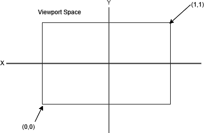
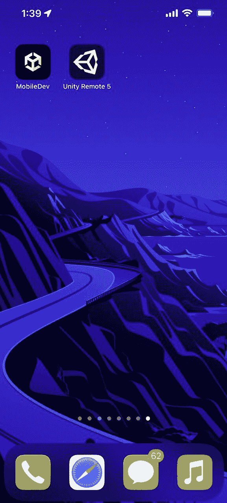

# 3

# 移动输入/触摸控制

玩家如何与你的项目互动可能是其中最重要的正确做法之一。虽然所有项目都会添加玩家输入，无论你使用什么平台，但这是一个可以使你的移动游戏成功或失败的区域。

如果实施的控制不适合你正在制作的游戏，或者如果控制感觉笨拙，玩家不会长时间地玩你的游戏。虽然许多人认为 Rockstar 的**《侠盗猎车手》**系列游戏在游戏机和 PC 上表现良好，但在移动设备上玩游戏由于屏幕上的所有按钮以及摇杆被虚拟版本取代（这些虚拟版本在提供触觉反馈方面与其他平台不同），因此会提供更大的入门障碍。

通常表现良好的移动和桌面游戏通常具有简单易用的控制，尽可能多地找到简化游戏玩法的方法。许多流行的游戏只需要单一输入，例如 Dong Nguyen 的*Flappy Bird*和 Ketchapp 的*Ballz*。

与传统游戏（如手势和捏合）相比，游戏与移动设备交互的方式有很多不同，我们将在本章中探讨其中的一些。

在本章中，我们将介绍移动设备上输入的不同工作方式。我们将从已经内置到我们项目中的输入开始，使用鼠标，然后转向触摸事件、手势、使用加速度计以及通过`Touch`类访问信息。

本章将分为多个主题。它将包含从开始到结束的简单、分步的过程。以下是我们的任务大纲：

+   使用鼠标输入

+   通过触摸移动

+   使用 Unity Remote

+   实现手势

+   使用捏合缩放玩家

+   使用加速度计

+   检测游戏对象上的触摸

# 技术要求

本书使用*Unity 2022.1.0b16*和*Unity Hub 3.3.1*，但步骤应该在未来版本的编辑器中只需进行最小改动即可工作。如果你想要下载本书中使用的确切版本（并且有新版本发布），你可以访问 Unity 的下载存档[`unity3d.com/get-unity/download/archive`](https://unity3d.com/get-unity/download/archive)。

你也可以在**Unity 编辑器系统** **要求**部分找到 Unity 的系统要求[`docs.unity3d.com/2022.1/Documentation/Manual/system-requirements.html`](https://docs.unity3d.com/2022.1/Documentation/Manual/system-requirements.html)。

你可以在 GitHub 上找到本章中存在的代码文件[`github.com/PacktPublishing/Unity-2022-Mobile-Game-Development-3rd-Edition/tree/main/Chapter03`](https://github.com/PacktPublishing/Unity-2022-Mobile-Game-Development-3rd-Edition/tree/main/Chapter03)。

# 使用鼠标输入

在我们深入探讨仅适用于移动设备的解决方案之前，我想指出，通过使用鼠标控制，可以编写既适用于移动设备又适用于 PC 的输入。移动设备支持使用鼠标点击作为屏幕上的轻触，轻触/点击的位置是手指按下的地方。这种输入形式仅提供触摸发生的位置，并指示发生了按下；它不提供移动设备独有选项的所有功能。我们将在本章后面讨论使用移动特定输入时你可以使用的所有功能，但我认为重要的是要注意在桌面上也有点击事件。我个人经常使用桌面进行测试，以便在 PC 和我的设备上轻松测试，因此我无需将每个项目中的每个更改部署到移动设备上进行测试。

要使用基于桌面的鼠标点击事件来移动玩家，首先，在 Unity 中，打开你的`PlayerBehaviour`脚本，并将`FixedUpdate`函数更新为以下内容：

```kt
/// <summary>
/// FixedUpdate is a prime place to put physics
/// calculations happening over a period of time.
/// </summary>
void FixedUpdate()
{
    // Check if we're moving to the side
    var horizontalSpeed = Input.GetAxis("Horizontal") *
        dodgeSpeed;
    /* If the mouse is held down (or the screen is pressed
     * on Mobile) */
    if (Input.GetMouseButton(0))
    {
        /* Get a reference to the camera for converting
         * between spaces */
        var cam = Camera.main;
        /* Converts mouse position to a 0 to 1 range */
        var screenPos = Input.mousePosition;
        var viewPos = cam.ScreenToViewportPoint(screenPos);
        float xMove = 0;
        /* If we press the right side of the screen */
        if (viewPos.x < 0.5f)
        {
            xMove = -1;
        }
        else
        {
            /* Otherwise we're on the left */
            xMove = 1;
        }
        /* Replace horizontalSpeed with our own value */
        horizontalSpeed = xMove * dodgeSpeed;
    }
    rb.AddForce(horizontalSpeed, 0, rollSpeed);
}
```

我们在先前的脚本中添加了一些内容。首先，我们通过使用`Input.GetMouseButton`函数来检查鼠标按钮是否被按下。如果鼠标被按下，该函数将返回`true`，如果没有，则返回`false`。该函数接受一个参数，用于指定我们想要检查哪个鼠标按钮，`0`代表左键，`1`代表右键，`2`代表中键。然而，对于移动设备，只有`0`会被识别为点击。

注意

关于`Input.GetMouseButton`函数的更多信息，请参阅[`docs.unity3d.com/ScriptReference/Input.GetMouseButton.html`](https://docs.unity3d.com/ScriptReference/Input.GetMouseButton.html)。

我们可以通过使用`Input.mousePosition`属性来获取鼠标所在的位置。然而，这个值是以屏幕空间给出的。什么是屏幕空间？好吧，让我们先谈谈我们如何通过使用世界空间来在 Unity 中传统地处理位置。

## 屏幕空间与世界空间

当通过**检查器**窗口在 Unity 中处理位置时，我们有一个位于游戏世界中心的**(0,0,0)**点，我们称之为原点，然后我们根据从这个点开始的偏移来引用其他所有内容。我们通常将这种定位方法称为**世界空间**。假设我们的摄像机指向原点，世界空间看起来是这样的：


图 3.1 – 世界空间的一个示例

这些线代表我们世界的**x**、**y**和**z**轴。如果我要将一个物体向右或向左移动，它将沿着**x**轴正方向或负方向移动。在学校时，你可能已经学过使用图表和点，而世界空间的工作方式与此非常相似。

注意

在 **检查器** 窗口中，父对象的子对象使用不同的系统，即它们被给予相对于其父对象的位置。这个系统被称为 *局部空间*。

当使用鼠标输入时，Unity 以另一个空间提供这些信息，**屏幕空间**。在这个空间中，位置基于相机位置，并不涉及实际的游戏世界。这个空间也是二维的，所以只有 *x* 和 *y* 位置，*z* 总是固定在 **0**：


图 3.2 – 屏幕空间示例

在前一个案例中，屏幕的左下角是 **(0,0)**，右上角是 **(Screen.width, Screen.height)**。*Screen.width* 和 *Screen.height* 是 Unity 中的值，将给出屏幕窗口的屏幕大小（以像素为单位）。

我们可以使用这些值作为提供的内容，然后比较玩家按下的屏幕哪一侧，但在我看来，将位置转换为更容易处理的空间会更好。这样一个空间就是 **视口空间**，它从 **(0,0)** 到 **(1,1)**：



图 3.3 – 视口空间示例

而不是搜索我们的 *x* 位置是否小于屏幕宽度的一半，我可以选择直接检查 `viewPos.x` 的值是否小于 `0.5`，这正是我们在前面的代码中所做的。如果值小于 `0.5`，它就在屏幕的左侧，所以我们返回 `-1`；否则，它就在右侧，所以我们返回 `1`。

注意

注意，Unity 的一些函数将使用 *Vector3* 而不是 *Vector2* 来处理三维空间。

一旦我们知道这一点，我们就可以将水平速度变量设置为根据我们的移动向左或向右移动。

保存脚本并返回 Unity，你将看到以下内容：


图 3.4 – 游戏当前状态

如前一个屏幕截图所示，我们现在可以使用鼠标（通过 `Input.GetMouseButton` 函数和 `Input.mousePosition` 变量）或我们的键盘（通过 `GetAxis` 函数），如前所述，来移动我们的玩家。

这种输入方式对我们目前所做的事情来说已经足够好了，但我假设你将想知道如何使用移动设备自己的移动方式，因此我们将继续学习如何使用触摸来复制相同的功能。

# 使用触摸控制移动

Unity 的输入引擎有一个名为 `Input.touches` 的属性，它是一个 `Touch` 对象的数组。`Touch` 结构包含有关发生的触摸的信息，例如触摸的压力量和屏幕点击的次数。它还包含位置属性，如 `Input.mousePosition`，它将告诉你在像素中触摸发生的位置。

注意

关于 Touch 结构体的更多信息，请查看 [`docs.unity3d.com/ScriptReference/Touch.html`](https://docs.unity3d.com/ScriptReference/Touch.html)。

让我们看看使用触摸代替鼠标输入的步骤：

1.  调整我们前面的代码，使其看起来像以下这样：

    ```kt
    /// <summary>
    /// FixedUpdate is a prime place to put physics
    /// calculations happening over a period of time.
    /// </summary>
    void FixedUpdate()
    {
        // Check if we're moving to the side
        var horizontalSpeed = Input.GetAxis("Horizontal")
            * dodgeSpeed;
        /* Check if Input has registered more than 0
           touches */
        if (Input.touchCount > 0)
        {
            /* Get a reference to the camera for
               converting between spaces */
            var cam = Camera.main;
            /* Store the first touch detected */
            var firstTouch = Input.touches[0];
            /* Converts mouse position to a 0 to 1 range
            */
            var screenPos = firstTouch.position;
            var viewPos =
                cam.ScreenToViewportPoint(screenPos);
            float xMove = 0;
            /* If we press the right side of the screen */
            if (viewPos.x < 0.5f)
            {
                xMove = -1;
            }
            else
            {
                /* Otherwise we're on the left */
                xMove = 1;
            }
            /* Replace horizontalSpeed with our own value
            */
            horizontalSpeed = xMove * dodgeSpeed;
        }
        rb.AddForce(horizontalSpeed, 0, rollSpeed);
    }
    ```

现在，请注意，这段代码看起来与我们前面章节中编写的代码非常相似。考虑到这一点，我们不需要复制和粘贴适当的代码两次并做出更改，就像许多初学者程序员会做的那样，我们可以利用相似之处来创建一个函数。对于差异，我们可以使用参数来更改值。

1.  考虑到这一点，让我们将以下函数添加到 `PlayerBehaviour` 类中：

    ```kt
    /// <summary>
    /// Will figure out where to move the player
    /// horizontally
    /// </summary>
    /// <param name="screenPos">The position the player
    /// has touched/clicked on in screen space</param>
    /// <returns>The direction to move in the x
        axis</returns>
    private float CalculateMovement(Vector3 screenPos)
    {
        /* Get a reference to the camera for converting
         * between spaces */
        var cam = Camera.main;
        /* Converts mouse position to a 0 to 1 range */
        var viewPos =
            cam.ScreenToViewportPoint(screenPos);
        float xMove = 0;
        /* If we press the right side of the screen */
        if (viewPos.x < 0.5f)
        {
            xMove = -1;
        }
        else
        {
            /* Otherwise we're on the left */
            xMove = 1;
        }
        /* Replace horizontalSpeed with our own value */
        return xMove * dodgeSpeed;
    }
    ```

在前面的代码中，我们不是使用 `Input.mousePosition` 或触摸位置，而是使用函数的参数。而且，与之前编写的函数不同，这个函数将实际使用返回值；在这种情况下，它将给我们一个浮点数值。我们将在 `Update` 函数中使用这个值，当调用此函数时将 `horiztonalSpeed` 设置为新值。现在函数已经存在，我们可以在适当的时候调用它。

1.  现在，更新 `Update` 函数，如下所示：

    ```kt
    /// <summary>
    /// FixedUpdate is a prime place to put physics
    /// calculations happening over a period of time.
    /// </summary>
    void FixedUpdate()
    {
        // Check if we're moving to the side
        var horizontalSpeed = Input.GetAxis("Horizontal")
            * dodgeSpeed;
        /* Check if we are running either in the Unity
           editor or in a * standalone build.*/
        #if UNITY_STANDALONE || UNITY_WEBPLAYER ||
            UNITY_EDITOR
            /* If the mouse is held down (or the screen is
               tapped * on Mobile */
            if (Input.GetMouseButton(0))
            {
                var screenPos = Input.mousePosition;
                horizontalSpeed =
                    CalculateMovement(screenPos);
            }
        /* Check if we are running on a mobile device */
        #elif UNITY_IOS || UNITY_ANDROID
            // Check if Input has registered more than
            // zero touches
            if (Input.touchCount > 0)
            {
                /* Store the first touch detected */
                var firstTouch = Input.touches[0];
                var screenPos = firstTouch.position;
                horizontalSpeed =
                    CalculateMovement(screenPos);
            }
        #endif
        rb.AddForce(horizontalSpeed, 0, rollSpeed);
    }
    ```

在前面的示例中，我使用了一个基于所选平台的 `#if` 指令。Unity 会根据我们部署的平台自动创建 `#define`。这个 `#if` 指令，连同 `#elif` 和 `#endif`，允许我们根据这些指令在我们的项目中包含或排除代码。

在 Visual Studio 中，请注意，如果您正在为 iOS 或 Android 构建项目，`UNITY_IOS || UNITY_ANDROID` 部分的代码会被灰色显示，这意味着当前不会调用这部分代码，因为我们正在使用 *Unity 编辑器* 运行游戏。然而，当我们导出代码到我们的平台时，将使用适当的代码。

注意

要查看所有其他平台相关的 `#define` 指令，请查看 [`docs.unity3d.com/Manual/PlatformDependentCompilation.html`](https://docs.unity3d.com/Manual/PlatformDependentCompilation.html)。

利用上述指令，我们可以指定我们项目不同版本的代码，这对于处理多平台开发至关重要。

注意

除了 Unity 内置的 `#define` 指令外，您可以通过转到 **编辑** | **项目设置** | **玩家**，在 **检查器** 窗口中向下滚动到 **其他设置**，并更改 **脚本** **定义符号** 来创建自己的。

这对于针对特定设备或显示某些调试信息非常有用，还有其他许多用途。

1.  保存脚本并返回 Unity。

当我们将游戏导出到您的 Android 设备上时，请注意，现在控制台使用我们新创建的触摸代码可以正常工作。这使我们能够在移动设备和 PC 上都使用相同的功能。

我们已经知道我们可以将我们的游戏导出到 Android 设备，但还有一种方法可以在不进行完整导出的情况下测试我们的游戏。这可以通过下载一个特殊的应用程序来完成，该应用程序将允许我们从计算机流式传输我们的游戏到我们的移动设备，这是我们将在下一节讨论的内容。

# 使用 Unity Remote

另一种通过移动设备检查我们的游戏如何工作的方法是使用 Unity 创建的应用程序，称为**Unity Remote**。该应用程序是用 Unity 5 创建的，自从应用程序更新以来已经有一段时间了，但它仍然与当前版本的 Unity 兼容；然而，它要求我们做一些额外的操作和设置。

## Unity Remote 的 Android 设置

为了设置手机使用 Unity Remote，我们需要下载应用程序并学习如何启用调试模式，因此在本节中，我们将看到如何进行操作：

1.  首先，打开*Google Play*应用程序，然后在搜索栏中输入`unity remote`：


图 3.5 – 搜索 Unity Remote 应用程序

1.  选择**Unity Remote 5**应用程序。之后，您将被带到安装界面，因此点击**安装**按钮并等待其下载完成。


图 3.6 – Google Play 上的 Unity Remote 5 应用程序页面

1.  完成后，您应该会在手机上看到它显示出来，准备打开。


图 3.7 – 设备上的应用程序

1.  点击应用程序，您将被带到询问应用程序是否允许拍照和录制视频的屏幕。这是由于您的游戏可能使用的功能，因此请随意选择您的游戏是否可以使用这些功能。


图 3.8 – 权限屏幕

1.  之后，您应该会看到一个类似这样的屏幕：


图 3.9 – 运行 Unity Remote 5 应用程序

这是您在玩游戏之前应该看到的设置屏幕，但如果您现在尝试运行您的项目，什么都不会发生；因此，我们还需要做一些准备工作。

## 启用开发者模式和调试

首先，我们需要将我们的手机设置为开发者模式，以便我们可以启用调试：

1.  首先，在 Unity 编辑器中，转到**项目设置**菜单并打开**编辑器**部分。从那里，在**Unity Remote**选项下，将**设备**从**无**更改为**任何****Android 设备**。


图 3.10 – 设置 Unity Remote 设备

1.  如果您还没有这样做，请通过 USB 将手机连接到您的电脑。从**设置**菜单中，您需要选择通知中的**USB 已连接的附件**选项。


图 3.11 – 将手机插入电脑时的通知窗口

1.  从弹出的菜单中选择**USB** **网络共享**选项。


图 3.12 – 将模式更改为 USB 网络共享

如果您在设备上没有看到这个选项，您可以在手机的**移动热点和网络共享**部分查找，或者使用您选择的互联网搜索引擎查找如何为您的设备启用 USB 网络共享。

1.  然后，在设备上，转到**设置** | **关于手机**。

1.  点击**构建号**属性七次以启用**开发者模式**。


图 3.13 – 我手机上的“关于手机”菜单

1.  从那里，转到**开发者选项**部分。我使用了**设置**窗口的搜索功能来找到确切的位置。


图 3.14 – 开发者选项菜单

1.  从那里，向下滚动并选择**USB 调试**选项。您可能会看到一个窗口解释 USB 调试的作用。点击**确定**按钮。


图 3.15 – 启用 USB 调试

1.  接下来，您将弹出一个窗口，提示**允许 USB 调试？**点击**允许**按钮。

1.  现在，您应该能够返回到**Unity Remote 5**应用程序。回到您的电脑上，点击**播放**按钮，您可能会看到电脑似乎冻结了一段时间，但经过短暂的时间，您应该看到手机上的画面反映了 PC 上的游戏：


图 3.16 – Unity Remote 游戏画面

当您使用 Unity Remote 在设备上玩游戏时，可能会看到一些模糊或图形问题。这是因为 Unity 正在将游戏的外观图像发送到设备以进行交互；游戏实际上并没有在设备上运行。画质远不如实际设备上的游戏，但它确实允许我们检查实际设备上游戏的当前状态！

启用开发者模式和调试还有好处，允许我们通过构建菜单直接将游戏部署到我们的设备上，而无需手动安装。要这样做，请转到**构建设置**菜单，并在**运行设备**选项下选择您的手机。


图 3.17 – 设置运行设备

现在，如果游戏结束后选择**构建和运行**，您应该看到的是手机打开时直接运行的游戏：


图 3.18 – 直接在设备上安装的游戏

现在我们已经学会了如何在 Android 设备上使用 Unity Remote，我们现在可以看看如何在 iOS 设备上设置 Unity Remote。

## iOS 的 Unity Remote 设置

在 iOS 上设置 Unity Remote 可以在装有*iTunes*的 Mac 电脑或 Windows 电脑上完成。然而，步骤将与 Android 相似，除了不需要启用调试。为了本节的目的，我将使用 Mac：

1.  首先，在 Unity 编辑器中，转到**项目设置**菜单并打开**编辑器**部分。从那里，在**Unity Remote**选项下，将**设备**从**无**更改为**任何****iOS 设备**。


图 3.19 – 选择“任何 iOS 设备”选项

1.  然后，从您的 iOS 设备上打开 App Store 并搜索`unity remote`。


图 3.20 – 搜索 Unity Remote 应用程序

1.  选择 Unity Remote 5 应用程序并在您的设备上安装它。一旦安装完成，它应该位于您的手机上：



图 3.21 – 安装好的 Unity Remote

1.  打开应用程序，您应该会看到以下类似内容，询问您是否想信任此计算机。请点击**信任**按钮：


图 3.22 – “信任此计算机”选项

1.  从您的电脑上，开始玩游戏。可能需要一点时间，但您应该会看到游戏正在流式传输到您的设备，您可以像往常一样玩游戏：


图 3.23 – Unity Remote 流式传输我们的游戏画面

如同我们在构建 Android 版本时提到的，您可能会在 Unity Remote 上玩游戏时看到一些模糊或图形问题。这是因为 Unity 正在向设备发送游戏外观的图像以进行交互；游戏实际上并不在设备上。质量远不及实际设备上的游戏，但它确实允许我们检查实际设备上的游戏当前状态！

有了这些，我们现在可以在各自的设备上玩游戏，而无需进行构建！这可以是一个快速检查设备上是否正确工作的好方法，而无需每次都进行构建。现在，让我们看看一些我们可以用来解释输入的移动特定方法。

# 实现手势

在移动游戏中，你还会发现另一种输入类型，即滑动，例如在 Kiloo 的 *Subway Surfers* 中。这允许我们使用触摸的一般移动来为我们指定移动的方向。这通常用于让我们的玩家 *跳跃* 到另一个位置或快速移动到某个方向。因此，我们将继续使用以下步骤来实现，而不是我们之前的移动系统：

1.  在 `PlayerBehaviour` 脚本中，继续添加一些新的变量供我们使用：

    ```kt
    [Header("Swipe Properties")]
    [Tooltip("How far will the player move upon swiping")]
    public float swipeMove = 2f;
    [Tooltip("How far must the player swipe before we will
        execute the action (in inches)")]
    public float minSwipeDistance = 0.25f;
    /// <summary>
    /// Used to hold the value that converts
    /// minSwipeDistance to pixels
    /// </summary>
    private float minSwipeDistancePixels;
    /// <summary>
    /// Stores the starting position of mobile touch
    /// events
    /// </summary>
    private Vector2 touchStart;
    ```

为了确定我们是否在滑动，我们首先需要检查我们的移动的起始和结束位置。我们将起始位置存储在 `touchStart`、`swipeMove`、`minSwipeDistance` 变量中，这将确保在玩家实际跳跃之前，玩家已经在 *x* 轴上移动了一小段距离——在这种情况下，我们希望用户至少移动四分之一英寸，以便输入被计为一次滑动。

还要注意，`Header` 属性已被添加到第一个变量的顶部。这将向 **Inspector** 选项卡添加标题，使拆分脚本的不同部分更容易。如果你保存脚本并进入 Unity，你应该会在选择玩家时看到这个新属性已被添加：


图 3.24 – 在“滑动属性”下新添加的移动输入/触摸控制

我们下一步是将 `MinSwipeDistance` 值从英寸转换为像素等效值，这可以用来查看用户的滑动动作移动了玩家角色的多远。

1.  返回到 `PlayerBehaviour` 的 `Start` 函数，添加以下突出显示的代码：

    ```kt
    // Start is called before the first frame update
    public void Start()
    {
        // Get access to our Rigidbody component
        rb = GetComponent<Rigidbody>();
        minSwipeDistancePixels = minSwipeDistance *
            Screen.dpi;
    }
    ```

通过 `Screen.dpi` 的 `minSwipeDistance`，我们知道移动在像素上的长度需要多长才能被计为一次滑动。

注意

关于 `Screen.dpi` 变量的更多信息，请参阅 [`docs.unity3d.com/ScriptReference/Screen-dpi.html`](https://docs.unity3d.com/ScriptReference/Screen-dpi.html)。

现在我们知道了滑动长度，我们需要添加触发一次滑动的能力。正如我们之前提到的，我们一直在使用 `FixedUpdate`，它通常比 `Update` 函数调用得少。

我们使用 `Input.GetAxis` 和 `Input.GetMouseButton` 函数，这些函数在每个按钮被按下的帧返回 `true`，并且会在 `FixedUpdate` 期间继续响应，而 `FixedUpdate` 可能会错过输入事件发生的起始和结束帧，这对于滑动事件和某些动作（如跳跃）在游戏中是必需的。如果你想在输入开始或结束时立即发生某些事情，你可能会想利用 `Update` 函数，这正是我们将要对我们手势所做的事情。

1.  现在，回到 `PlayerBehaviour` 脚本中，为项目添加以下函数：

    ```kt
    /// <summary>
    /// Update is called once per frame
    /// </summary>
    private void Update()
    {
        /* Check if we are running on a mobile device */
        #if UNITY_IOS || UNITY_ANDROID
            /* Check if Input has registered more than
               zero touches */
            if (Input.touchCount > 0)
            {
                /* Store the first touch detected */
                Touch touch = Input.touches[0];
                SwipeTeleport(touch);
            }
        #endif
    }
    ```

在前面的代码中，我们添加了一个名为 `SwipeTeleport` 的新行为，并使用其属性在发生滑动时移动玩家。

然后，我们将创建一个函数来处理这种新的滑动行为，如下所示：

```kt
/// <summary>
/// Will teleport the player if swiped to the left or
/// right
/// </summary>
/// <param name="touch">Current touch event</param>
private void SwipeTeleport(Touch touch)
{
    /* Check if the touch just started */
    if (touch.phase == TouchPhase.Began)
    {
        /* If so, set touchStart */
        touchStart = touch.position;
    }
    /* If the touch has ended */
    else if (touch.phase == TouchPhase.Ended)
    {
        /* Get the position the touch ended at */
        Vector2 touchEnd = touch.position;
        /* Calculate the difference between the
           beginning and end of the touch on the x
           axis. */
        float x = touchEnd.x - touchStart.x;
        /* If not moving far enough, don't do the
           teleport */
        if (Mathf.Abs(x) < minSwipeDistancePixels)
        {
            return;
        }
        Vector3 moveDirection;
        /* If moved negatively in the x axis, move
           left */
        if (x < 0)
        {
            moveDirection = Vector3.left;
        }
        else
        {
            /* Otherwise player is on the right */
            moveDirection = Vector3.right;
        }
        RaycastHit hit;
        /* Only move if player wouldn't hit something
        */
        if (!rb.SweepTest(moveDirection, out hit,
        swipeMove))
        {
            /* Move the player */
            var movement = moveDirection * swipeMove;
            var newPos = rb.position + movement;
            rb.MovePosition(newPos);
        }
    }
}
```

在这个函数中，我们不是只使用当前的触摸位置，而是存储触摸开始时的起始位置。当玩家抬起手指时，我们也会获取位置。然后我们获取该移动的方向，并将其应用到球体上，在实际上造成移动之前检查我们是否会与某物发生碰撞。

1.  保存你的脚本并回到 Unity 中，将你的项目导出到你的移动设备或模拟器。


图 3.25 – 执行滑动操作后的游戏视觉

现在，无论我们向左或向右滑动，玩家都会相应地移动。让我们在下一节学习在玩游戏时可以使用的一种其他动作。

# 使用捏合缩放玩家

使用触摸事件在游戏中修改事物的概念也可以应用于其他触摸交互方法，例如使用手指捏合来缩放。为了了解如何做到这一点，让我们调整 `PlayerBehaviour` 脚本，以便我们可以通过捏合或拉伸视图来改变玩家的缩放比例：

1.  打开 `PlayerBehaviour` 脚本并添加以下属性：

    ```kt
    [Header("Scaling Properties")]
    [Tooltip("The minimum size (in Unity units) that the
        player should be")]
    public float minScale = 0.5f;
    [Tooltip("The maximum size (in Unity units) that the
        player should be")]
    public float maxScale = 3.0f;
    /// <summary>
    /// The current scale of the player
    /// </summary>
    private float currentScale = 1;
    ```

1.  接下来，添加以下函数：

    ```kt
    /// <summary>
    /// Will change the player's scale via pinching and
    /// stretching two touch events
    /// </summary>
    private void ScalePlayer()
    {
        /* We must have two touches to check if we are
         * scaling the object */
        if (Input.touchCount != 2)
        {
            return;
        }
        else
        {
            /* Store the touches detected. */
            Touch touch0 = Input.touches[0];
            Touch touch1 = Input.touches[1];
            Vector2 t0Pos = touch0.position;
            Vector2 t0Delta = touch0.deltaPosition;
            Vector2 t1Pos = touch1.position;
            Vector2 t1Delta = touch1.deltaPosition;
            /* Find the previous frame position of each
               touch. */
            Vector2 t0Prev = t0Pos - t0Delta;
            Vector2 t1Prev = t1Pos - t1Delta;
            /* Find the the distance (or magnitude)
               between the * touches in each frame. */
            float prevTDeltaMag =
                (t0Prev - t1Prev).magnitude;
            float tDeltaMag = (t0Pos - t1Pos).magnitude;
            /* Find the difference in the distances
             * between each frame. */
            float deltaMagDiff =
                prevTDeltaMag - tDeltaMag;
            /* Keep the change consistent no matter what
             * the framerate is */
            float newScale = currentScale;
            newScale -= (deltaMagDiff * Time.deltaTime);
            // Ensure that the new value is valid
            newScale = Mathf.Clamp(newScale, minScale,
                maxScale);
            /* Update the player's scale */
            transform.localScale = Vector3.one * newScale;
            /* Set our current scale for the next frame */
            currentScale = newScale;
        }
    }
    ```

与使用单个触摸事件不同，在这个例子中，我们使用了两个。使用这两个触摸事件，我们可以看到触摸在上一帧（delta）中的变化。然后我们使用这个差异来修改玩家的缩放比例。为了确保球体始终有一个有效的值，我们使用 `Mathf.Clamp` 函数来保持值在 `minScale` 和 `maxScale` 中设置的范围之间。

1.  接下来，我们需要通过更新 `Update` 函数来调用该函数：

    ```kt
    /// <summary>
    /// Update is called once per frame
    /// </summary>
    private void Update()
    {
        /* Check if we are running on a mobile device */
        #if UNITY_IOS || UNITY_ANDROID
            /* Check if Input has registered more than
               zero touches */
            if (Input.touchCount > 0)
            {
                /* Store the first touch detected */
                Touch touch = Input.touches[0];
                SwipeTeleport(touch);
                ScalePlayer();
            }
        #endif
    }
    ```

1.  保存你的脚本并返回到 Unity 编辑器。导出你的游戏，你应该能够看到玩家缩放的效果——通过分开两根手指，你会看到球体膨胀，反之亦然：


图 3.26 – 游戏当前状态下捏合手势的结果

注意

对于使用 LDPlayer 的用户，可以通过按下 *Ctrl* 然后滚动鼠标滚轮来复制捏合/缩放效果。

希望这展示了能够使用多触控和利用触摸事件的一些优势所赋予的力量，而不仅仅是单次鼠标点击。接下来，我们将探索另一种 PC 所没有的输入方法。

# 使用加速度计

移动设备有的一种输入类型，而 PC 没有，就是加速度计。这允许你通过倾斜手机的物理位置在游戏中移动。最流行的例子可能是 Lima Sky 的*Doodle Jump*和 Gameloft 的*Asphalt*系列游戏中玩家的移动。为了做类似的事情，我们可以使用`Input.acceleration`属性获取我们设备的加速度，并使用它来移动玩家。让我们看看完成这一点的步骤：

1.  我们可能希望允许我们的设计师设置他们是否想要使用`加速度计`模式或`ScreenTouch`，这是我们之前使用的。考虑到这一点，让我们在**滑动****属性**标题上方创建一个新的`enum`类型`PlayerBehaviour`脚本：

    ```kt
    [Tooltip("How fast the ball moves forwards
        automatically")]
    [Range(0, 10)]
    public float rollSpeed = 5;
    public enum MobileHorizMovement
    {
        Accelerometer,
        ScreenTouch
    }
    [Tooltip("What horizontal movement type should be
        used")]
    public MobileHorizMovement horizMovement =
        MobileHorizMovement.Accelerometer;
    [Header("Swipe Properties")]
    [Tooltip("How far will the player move upon swiping")]
    public float swipeMove = 2f;
    ```

之前的脚本使用`enum`定义了一个名为`MobileHorizMovement`的自定义类型，它可以有两个值之一，`Accelerometer`或`ScreenTouch`。然后我们创建了一个名为`horizMovement`的新变量。

现在，如果你保存`PlayerBehaviour`脚本并返回到**检查器**标签页，你会看到我们可以选择这两个选项之一（**加速度计**或**屏幕触摸**）。通过使用这个下拉菜单，项目中的游戏设计师可以轻松选择我们想要使用哪个选项，并且如果将来想要的话，我们还可以扩展更多（我们将在下一章中这样做）：


图 3.27 – 从检查器调整水平移动属性

1.  接下来，让我们更新`Update`#elif UNITY_IOS || UNITY_ANDROID`代码块：

    ```kt
    /* Check if we are running on a mobile device */
    #elif UNITY_IOS || UNITY_ANDROID
        switch (horizMovement)
        {
            case MobileHorizMovement.Accelerometer:
                /* Move player based on accelerometer
                   direction */
                horizontalSpeed = Input.acceleration.x *
                    dodgeSpeed;
                break;
            case MobileHorizMovement.ScreenTouch:
                /* Check if Input registered more than
                   zero touches */
                if (Input.touchCount > 0)
                {
                    /* Store the first touch detected */
                    var firstTouch = Input.touches[0];
                    var screenPos = firstTouch.position;
                    horizontalSpeed =
                        CalculateMovement(screenPos);
                }
                break;
        }
    #endif
    // Check if we are running on a mobile device
    #elif UNITY_IOS || UNITY_ANDROID
    if(horizMovement == MobileHorizMovement.Accelerometer)
    {
    // Move player based on direction of the accelerometer
    horizontalSpeed = Input.acceleration.x * dodgeSpeed;
    }
    //Check if Input has registered more than zero touches if (Input.touchCount > 0)
    {
        if (horizMovement ==
        MobileHorizMovement.ScreenTouch)
        {
            //Store the first touch detected.
            Touch touch = Input.touches[0];
            horizontalSpeed =
                CalculateMovement(touch.position);
        }
    }
    #endif
    ```

如果将`horizMovement`变量设置为**加速度计**，这段新代码将使用我们设备的加速度，而不是屏幕上检测到的触摸。

1.  保存你的脚本并导出项目。


图 3.28 – 通过加速度计移动玩家

有了这个，你会注意到我们现在可以倾斜屏幕向右或向左，玩家将向相应的方向移动。

在 Unity 中，加速度以*重力加速度*值来衡量，1 代表 1 g 的力。如果你将设备竖直握在面前（主按钮在底部），则*x*轴沿右侧为正，*y*轴向上为正，*z*轴指向你时为正。

注意

更多关于加速度计的信息，请查看[`docs.unity3d.com/Manual/MobileInput.html`](https://docs.unity3d.com/Manual/MobileInput.html)。

知道我们的常规输入正在工作是很不错的，但你可能还想检查场景中的游戏对象是否被触摸，以便游戏可以对其做出反应。让我们接下来做这件事。

# 检测游戏对象上的触摸

为了让我们的玩家做些其他事情，以及展示一些额外的输入功能，我们将确保如果玩家点击障碍物，它将被销毁。我们将使用以下步骤修改我们现有的代码以添加此新功能，利用**射线投射**的概念：

1.  在`PlayerBehaviour`脚本中，添加以下新函数：

    ```kt
    /// <summary>
    /// Will determine if we are touching a game object
    /// and if so call events for it
    /// </summary>
    /// <param name="screenPos">The position of the touch
    /// in screen space</param>
    private static void TouchObjects(Vector2 screenPos)
    {
        /* Convert the position into a ray */
        Ray touchRay =
            Camera.main.ScreenPointToRay(screenPos);
        RaycastHit hit;
        /* Create a LayerMask that will collide with all
         * possible channels */
        int layerMask = ~0;
        /* Are we touching an object with a collider? */
        if (Physics.Raycast(touchRay, out hit,
        Mathf.Infinity, layerMask,
        QueryTriggerInteraction.Ignore))
        {
            /* Call the PlayerTouch function if it exists
             * on a component attached to this object */
            hit.transform.SendMessage("PlayerTouch",
            SendMessageOptions.DontRequireReceiver);
        }
    }
    /// <summary>
    /// Will determine if we are touching a game object
    /// and if so call events for it
    /// </summary>
    /// <param name="touch">Our touch event</param> private static void TouchObjects(Touch touch)
    {
    // Convert the position into a ray
    Ray touchRay =
        Camera.main.ScreenPointToRay(touch.position);
    RaycastHit hit;
    // Create a LayerMask that will collide with all
    // possible channels
    int layerMask = ~0;
    // Are we touching an object with a collider?
    if (Physics.Raycast(touchRay, out hit, Mathf.Infinity, layerMask, QueryTriggerInteraction.Ignore))
    {
        // Call the PlayerTouch function if it exists on a
        // component attached to this object
        hit.transform.SendMessage("PlayerTouch",
            SendMessageOptions.DontRequireReceiver);
    }
    }
    ```

在这里，我们使用不同的版本来确定碰撞——一个`raycast`。这基本上是一个指向给定方向的不可见向量，我们将用它来检查它是否与场景中的任何对象发生碰撞。这通常用于游戏，如第一人称射击游戏，以确定玩家是否击中了敌人，而无需生成并移动一个项目。

我们在这里使用的`Physics.Raycast`版本接受五个参数：

+   第一个指定了要使用哪个射线。

+   第二个是`hit`，它包含有关是否发生碰撞的信息。

+   第三个参数指定了检查碰撞的距离。

+   第四个是层掩码，它决定了你可以与哪些对象发生碰撞。在我们的例子中，我们希望与所有碰撞体发生碰撞，因此我们使用位运算符（`~`）将`0`转换为通过翻转创建该数字所使用的所有位得到的数字。

+   最后，我们有一个名为`QueryTriggerInteraction`的枚举，我们将其设置为`Ignore`。这意味着我们创建的带有触发器的`Tile End`对象不会阻止我们的触摸事件，这在默认情况下会发生，即使我们看不到它们。

注意

关于位运算符（`~`）的更多信息，请查看[`docs.microsoft.com/en-us/dotnet/csharp/language-reference/operators/bitwise-and-shift-operators#bitwise-complement-operator-`](https://docs.microsoft.com/en-us/dotnet/csharp/language-reference/operators/bitwise-and-shift-operators#bitwise-complement-operator-)。

关于*射线投射*的更多信息，请查看[`docs.unity3d.com/ScriptReference/Physics.Raycast.html`](https://docs.unity3d.com/ScriptReference/Physics.Raycast.html)。

如果我们击中了某个东西，我们将在我们与之碰撞的对象上调用名为`SendMessage`的函数。如果该函数存在于游戏对象的任何组件上，该函数将尝试调用具有相同名称的第一个参数的函数。第二个参数让我们知道如果它不存在，是否应该显示错误。

注意

关于`SendMessage`函数的更多信息，请查看[`docs.unity3d.com/ScriptReference/GameObject.SendMessage.html`](https://docs.unity3d.com/ScriptReference/GameObject.SendMessage.html)。

1.  现在，在`UpdateTouchObjects`函数中调整代码，以便我们可以在 Unity 编辑器中测试功能：

    ```kt
    /// <summary>
    /// Update is called once per frame
    /// </summary>
    private void Update()
    {
        /* Check if we are running either in the Unity
           editor or in a
         * standalone build.*/
        #if UNITY_STANDALONE || UNITY_WEBPLAYER ||
            UNITY_EDITOR
        /* If the mouse is tapped */
        if (Input.GetMouseButtonDown(0))
        {
            Vector2 screenPos = new Vector2(
                Input.mousePosition.x,
                    Input.mousePosition.y);
            TouchObjects(screenPos);
        }
        /* Check if we are running on a mobile device */
        #elif UNITY_IOS || UNITY_ANDROID
            /* Check if Input has registered more than
               zero touches */
            if (Input.touchCount > 0)
            {
                /* Store the first touch detected */
                Touch touch = Input.touches[0];
                TouchObjects(touch.position);
                SwipeTeleport(touch);
                ScalePlayer();
            }
        #endif
    }
    ```

1.  在此点保存`PlayerBehaviour`脚本。

1.  最后，我们调用`PlayerTouchObstacleBehaviour`脚本并添加以下代码：

    ```kt
    [Tooltip("Explosion effect to play when tapped")]
    public GameObject explosion;
    /// <summary>
    /// If the object is tapped, we spawn an explosion and
    /// destroy this object
    /// </summary>
    private void PlayerTouch()
    {
        if (explosion != null)
        {
            var particles = Instantiate(explosion,
                transform.position,
                    Quaternion.identity);
            Destroy(particles, 1.0f);
        }
        Destroy(this.gameObject);
    }
    public GameObject explosion;
    /// <summary>
    /// If the object is tapped, we spawn an explosion and
    /// destroy this object
    /// </summary>
    private void PlayerTouch()
    {
        if (explosion != null)
        {
            var particles = Instantiate(explosion,
                transform.position, Quaternion.identity);
            Destroy(particles, 1.0f);
        }
        Destroy(this.gameObject);
    }
    ```

此功能基本上将销毁它附加到的游戏对象，并在 1 秒后创建一个也会销毁自己的爆炸。

注意

通过使用 Unity 的`OnMouseDown`函数，我们可以得到类似我们正在编写的结果。正如我们已经讨论过的，在为移动设备开发时可以使用鼠标事件。然而，请注意，该函数的计算成本比我在这里建议的方法要高。

这是因为当你轻触屏幕时，每个具有`OnMouseDown`方法的对象都会执行`raycast`和 100 次，因此在处理移动设备开发时，保持性能很重要。有关更多信息，请参阅[`answers.unity3d.com/questions/1064394/onmousedown-and-mobile.html`](http://answers.unity3d.com/questions/1064394/onmousedown-and-mobile.html)。

1.  保存脚本并返回 Unity。

我们还没有创建爆炸粒子效果。为了创建这种效果，我们将使用一个**粒子系统**。我们将在*第十二章*“改进游戏感觉”中更深入地探讨粒子系统，但现在，我们可以将粒子系统视为一个尽可能简单的游戏对象，这样我们就可以同时将许多它们放在屏幕上，而不会使游戏速度减慢太多。这主要用于像烟雾或火焰这样的东西，但在这个例子中，我们的障碍物将会爆炸。

使用以下步骤创建爆炸粒子效果：

1.  通过进入`Explosion`并按*Enter*键来创建一个粒子系统。

1.  在**层次结构**窗口中选择游戏对象，然后在**检查器**选项卡中打开**粒子系统**组件。在那里，点击**渲染器**部分以展开它，并通过点击名称旁边的圆圈并将菜单中选择**默认材质**来将**RenderMode**更改为**网格**和**材质**为**默认材质**：


图 3.29 – 选择默认材质

这将使粒子看起来像我们已经创建的障碍物，即一个带有默认材质的盒子。


图 3.30 – 盒子的视觉效果

1.  接下来，在顶部的**粒子系统**部分，将**重力修改器**属性更改为**1**。这确保了对象将逐渐下落，就像具有刚体的正常对象一样，但计算量更少。

1.  然后，在**开始速度**下，移动到右侧并点击向下箭头，从该菜单中选择**随机介于** **两个常量**：


图 3.31 – 使用两个常量之间的随机值

1.  这将使单个窗口变为两个，表示可以用于此属性的最低和最高值。从那里，将两个值设置为`0``8`。这使得生成的对象以*0*到*8*之间的速度开始。

1.  然后，将**开始大小**更改为**0**到**0.25**之间的某个值。这将确保我们创建的一堆立方体比我们计划替换的那个要小。

1.  将`1`改为取消选中**循环**选项。这确保粒子系统只会持续*1*秒，取消选中循环意味着粒子系统默认只激活一次。

注意

您可以通过在**场景**窗口的右下角菜单中点击**播放**按钮，并选择**粒子系统**对象来查看所做的每个更改的效果。

1.  最后，将**开始生命周期**属性更改为**1**，以确保所有粒子在游戏对象被销毁之前都死亡。

1.  在**发射**部分，将**随时间变化速率**更改为**0**。然后，在**爆发**部分，点击**+**按钮并将**计数**设置为**50**：


图 3.32 – 创建创建时的单个爆发

这意味着在粒子系统创建的最初时刻将生成 50 个粒子，就像爆炸一样。

1.  然后，检查**生命周期大小**并点击复选框旁边的文本以显示更多详细信息。从那里，通过选择一个逐渐减少的曲线来更改**大小**属性，以便在最后，它们都将变为**0.0**。这可以通过首先选择曲线本身，然后转到**检查器**窗口底部的**粒子系统曲线**部分来完成。如果您看不到以下截图所示的內容，您可以点击并拖动名称向上使其突出显示。从那里，您可以点击具有向下曲线的选项：


图 3.33 – 设置生命周期大小曲线

这会使粒子逐渐变小，并且它们只有在变得不可见（缩放为**0.0**）后才会自我销毁。

1.  最后，检查**碰撞**属性并打开它，将**类型**属性设置为**世界**。这将导致粒子击中地面。

1.  然后，通过将对象从**层次结构**选项卡拖放到**资产** | **预制体**文件夹中的**项目**选项卡来使您的对象成为一个预制体。一旦预制体创建完成（您应该在层次结构中看到对象的文本变为蓝色），通过选择它并按*删除*键来从场景中删除原始对象。

1.  接下来，在**障碍物**预制体中分配**障碍物行为（脚本）**的**爆炸**属性：


图 3.34 – 在障碍物预制体中分配爆炸属性

1.  保存您的项目并运行游戏：


图 3.35 – 触摸时爆炸的障碍物

现在，当我们点击其中一个障碍物时，我们可以看到物体被摧毁，并且播放了爆炸效果！

如果你将游戏导出到你的移动设备上，你应该看到相同的功能：


图 3.36 – 游戏的当前状态

从现在开始，无论何时我们在移动设备上点击障碍物，它们都会被摧毁。

# 摘要

在本章中，我们学习了在移动设备上工作时控制游戏的主要方式。我们还学习了如何使用鼠标输入、触摸事件、手势和加速度计来允许玩家与我们的游戏互动。

在下一章中，我们将通过深入用户界面世界并创建可享受的菜单，来探索玩家与游戏互动的另一种主要方式，无论用户在什么设备上玩游戏。
