# 第四章：分辨率无关的 UI

当在移动设备上工作时，你需要花费相当一部分时间处理的事情之一是**用户界面**（**UI**）。与为 PC 开发项目不同，那时你只需要关心一个分辨率或纵横比，但在为移动设备构建时，有许多不同分辨率和纵横比的不同设备。例如，我们有一些可以放入我们口袋中的手机，还有平板电脑，它们非常大。不仅如此，移动游戏还可以水平或垂直玩游戏。一些新的手机甚至允许你折叠它们，以动态地增加或减少屏幕大小。

**图形用户界面**（**GUI**）是玩家与游戏互动的方式。实际上，你在所有前面的章节（Unity 编辑器）以及与你的操作系统交互时都使用了 GUI。如果没有某种形式的 GUI，你与计算机的唯一交互方式将是**命令行界面**（**CLI**）——即在 Windows 中的命令提示符和在 Linux 和 macOS 中的终端。

当处理图形用户界面（GUIs）时，我们希望它们只包含对玩家在任何给定时间都重要的信息，同时也要简单直观。有些人主要的工作是编程和/或设计用户界面（UIs），而且这个领域也有大学学位。因此，虽然我们不会讨论与使用 GUIs 相关的所有内容，但我确实想谈谈在将来进行自己的项目时应该相当有帮助的方面。

当为移动设备构建时，设计你的 UI 以实现分辨率无关性——也就是说，确保 UI 将缩放并调整自身以适应给定的任何屏幕大小——这一点非常重要。如果你游戏的 UI 是分辨率无关的或响应式的，作为游戏开发者，你将能够针对大量设备。

本章将分为几个主题。本章是一个从头到尾的简单步骤过程。以下是我们任务的概述：

+   创建标题屏幕

+   向屏幕添加 UI 元素

+   添加屏幕控制

+   实现暂停菜单

+   暂停游戏

# 技术要求

本书使用 Unity 2022.1.0b16 和 Unity Hub 3.3.1，但步骤应该在未来版本的编辑器中只需进行最小更改即可。如果你想下载本书中使用的确切版本，并且有新版本发布，你可以访问 Unity 的下载存档[`unity3d.com/get-unity/download/archive`](https://unity3d.com/get-unity/download/archive)。你还可以在**Unity 编辑器系统** **要求**部分找到 Unity 的系统要求[`docs.unity3d.com/2022.1/Documentation/Manual/system-requirements.html`](https://docs.unity3d.com/2022.1/Documentation/Manual/system-requirements.html)。

您可以在 GitHub 上找到本章中提供的代码文件，链接为[`github.com/PacktPublishing/Unity-2022-Mobile-Game-Development-3rd-Edition/tree/main/Chapter04`](https://github.com/PacktPublishing/Unity-2022-Mobile-Game-Development-3rd-Edition/tree/main/Chapter04)。

# 创建标题屏幕

在我们开始向游戏添加 UI 元素之前，让我们首先通过创建我们无论如何都需要的东西来设置一些基础和基础知识 – 一个标题屏幕：

1.  首先，我们将创建一个新的场景供我们使用，方法是转到**文件** | **新建场景**。会出现一个窗口询问应使用哪个模板。在这种情况下，我们将选择**基本（内置）**，然后点击**创建**按钮。

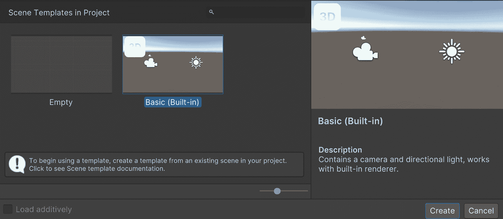

图 4.1 – 创建基本场景

在处理 UI 时，我们通常会想要看到屏幕上将要绘制的视觉表示，因此我们将想要使用 2D 模式以更好地表示我们的 UI 在游戏最终版本中的外观。

1.  要做到这一点，请转到**场景**视图标签 – 您将看到带有下面带有**2D**按钮的控制栏菜单。点击它，您应该会看到摄像机自动移动到类似于以下截图的视图：

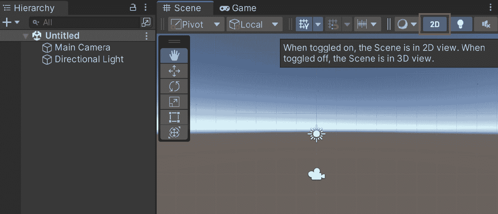

图 4.2 – 选择 2D 模式

由于唯一的选择是垂直于*XY*平面（*x*轴指向右侧，*y*轴向上）查看，并且我们的摄像机已更改为正交视图，因此**Gizmos**消失了。

1.  我们需要创建一个名为我们游戏的**Text**对象。转到菜单并选择**游戏对象** | **UI** | **Text – Text** **Mesh Pro**。

1.  如果这是您第一次使用**TextMeshPro**，可能会弹出一个**TMP 导入器**窗口。如果是这样，请点击**导入 TMP** **Essentials**按钮。

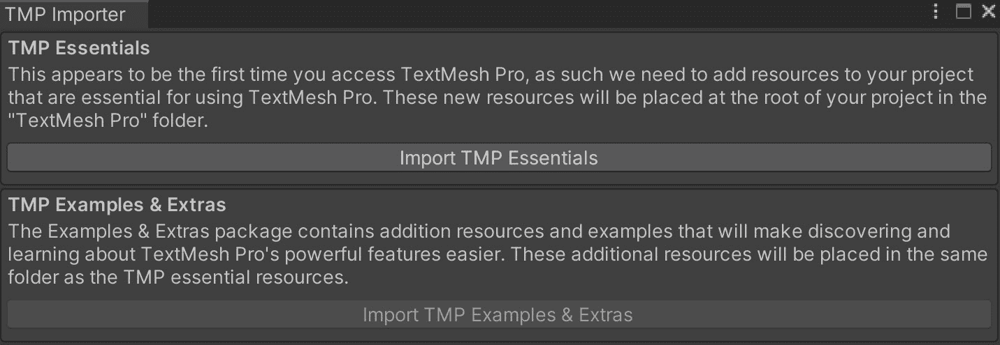

图 4.3 – TMP 导入器窗口

小贴士

注意，虽然这本书使用**TextMesh Pro**来绘制文本，但以下脚本部分的步骤也适用于传统的 Unity UI 系统和**Text**对象，并且本章中的所有概念在这两种系统中都是相同的。

1.  您将在**层次**视图中看到三个新对象，**Canvas**、**Text (TMP**)和**EventSystem**：

    +   **画布**：这是所有 UI 元素将驻留的区域，如果您尝试创建一个没有已经存在的 UI 元素，Unity 会像刚才那样为您创建一个。从**场景**视图标签，它将围绕自身绘制一个白色矩形以显示其大小，并根据**游戏**视图的大小进行调整：

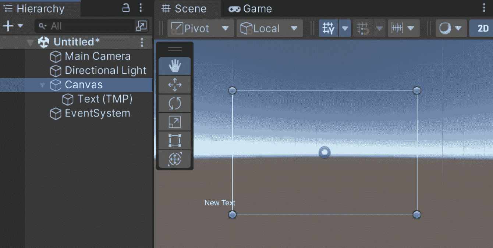

图 4.4 – 缩放以显示画布

注意

如果您在**层次结构**窗口中双击一个对象，摄像机将自动移动和缩放，以便您可以在**场景**窗口中看到该对象。GameObject 包含一个**Canvas**组件，它允许您指定图像的渲染方式（以及一个**Canvas Scaler**组件，根据游戏运行设备的分辨率调整您的艺术作品大小，以及一个**Graphic Raycaster**组件，它确定**Canvas**上的任何对象是否被击中。我们将在本节稍后深入了解**Canvas Scaler**组件）。

重要提示

想要了解更多关于**Canvas**对象的信息，请查看[`docs.unity3d.com/Manual/UICanvas.html`](http://docs.unity3d.com/Manual/UICanvas.html)。特别是关于渲染模式的讨论对于理解 UI 元素如何渲染到屏幕上的方式非常有用。

+   **Text (TMP)**：此对象是我们实际文本对象，它具有所有允许我们在**画布**对象上的任何位置定位对象以及更改将显示的文本、颜色、大小等属性。

注意

想要了解更多关于 TextMesh Pro 的信息，请查看[`docs.unity3d.com/Packages/com.unity.textmeshpro@3.0/manual/index.html`](https://docs.unity3d.com/Packages/com.unity.textmeshpro@3.0/manual/index.html)**。**

+   **EventSystem**：此对象允许用户根据各种输入类型（如键盘按键、触摸事件或游戏手柄）向游戏中的对象发送事件。此对象中存在一些属性，允许您指定用户如何与您的 UI 交互，如果您尝试创建一个没有存在的 UI 元素，Unity 将为您创建一个，就像这里所做的那样。如果您想在您的关卡中使用 Unity 的 UI 系统创建任何类型的交互式材料，例如按钮、滑块等，您必须在关卡中附加带有**EventSystem**组件的对象，否则事件将不会触发。

注意

想要了解更多关于**EventSystem**对象的信息，请查看[`docs.unity3d.com/Manual/EventSystem.html`](http://docs.unity3d.com/Manual/EventSystem.html)。

1.  默认情况下，您可能看不到我们的文本框创建的位置。如果您看不到它，可以转到**层次结构**窗口，然后双击**Text (TMP)**对象。如果一切顺利，我们应该会有如下所示的内容：

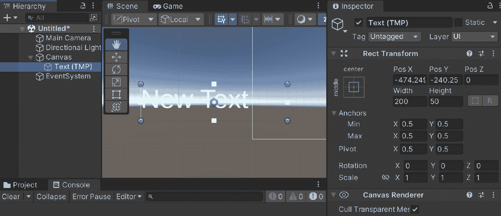

图 4.5 – 放大查看 Text (TMP) 对象

1.  下一步我们将做的是让识别这个对象变得更加容易。因此，考虑到这一点，滚动到`标题文本`的顶部。为了使其更易于查看，在选中对象后，转到**检查器**选项卡，并向下滚动到**TextMeshPro – 文本 (UI)**组件，然后将**顶点颜色**属性更改为**黑色**。

我们可以通过查看对象是否在为**画布**创建的白色框内来判断对象是否将在游戏中可见。需要注意的是，与迄今为止我们看到的所有游戏对象使用的默认**变换**组件不同，我们的**文本**对象在相同位置有一个**矩形变换**组件。

## 矩形变换组件

`矩形` `变换`与常规`变换`不同，因为变换组件代表一个点或对象的中心，而矩形变换代表一个矩形，其中 UI 元素将驻留。如果一个具有矩形变换的对象有一个父对象，该父对象也有矩形变换，那么子对象将指定对象相对于父对象的位置。

注意

有关对象定位和**矩形变换**的信息，请参阅[`docs.unity3d.com/Manual/UIBasicLayout.html`](http://docs.unity3d.com/Manual/UIBasicLayout.html)**。**

为了更好地了解`0`的属性，这些属性将围绕对象的锚点中心化我们的对象；然后你可以双击**层次结构**标签页中的对象，将相机定位到其新位置，并使用鼠标滚轮进行缩放/缩小：

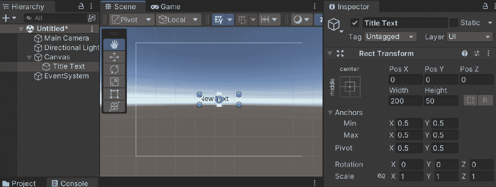

图 4.6 – 画布上居中的标题文本

如果你选择了**标题文本**对象（双击以在屏幕上居中对象），我们的对象的锚点可以通过**场景**标签页中的四个小矩形看到，在**场景**标签页的中心形成一个 X 形状。

重要提示

如我之前所述，请注意，这里显示的用于**画布**的白色框根据你在**游戏**标签页视图（我的设置为**自由宽高比**，因此根据此比例填充空间）中设置的宽高比可能看起来与你的屏幕不同。如果你转到**游戏**标签页，你可以从左侧的下拉菜单中选择它们。

接下来，我们将查看在**矩形变换**组件中工作方式不同的两个主要元素：锚点和轴点。

### 锚点

在`0`中找到的 UI 元素会粘附到其父元素的左侧边缘。

锚点之上的属性是相对于已设置的锚点的位置。这在支持多个分辨率而不缩放创建的艺术资源时非常有用。在我们的例子中，我们希望标题相对于相机的顶部定位。让我们看看使用锚点时的步骤：

1.  点击**锚点预设**菜单（位于**矩形变换**组件的左上角，即**X 轴位置**和**宽度**值左侧的框）。从那里，它显示了一些在游戏中常用的最常见锚点位置，以便于选择。在我们的例子中，我们将想要选择顶部居中选项：

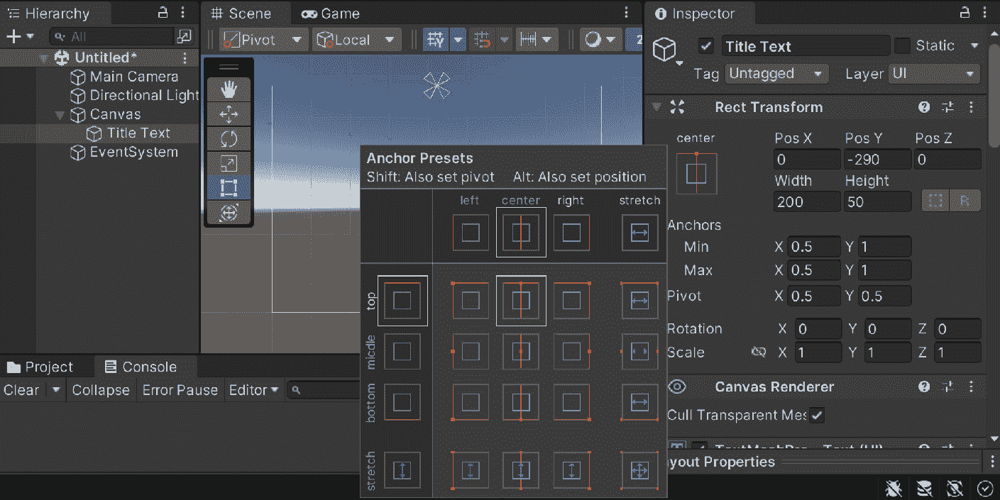

图 4.7 – 在锚点预设菜单中选择顶部居中选项

1.  注意在选中后，`-290`)。这意味着我们的对象位置为 `0`，对象将沿着 *y* **轴** 的锚点居中，这将使对象的一半位于屏幕之外，这并不好，如以下示例所示：

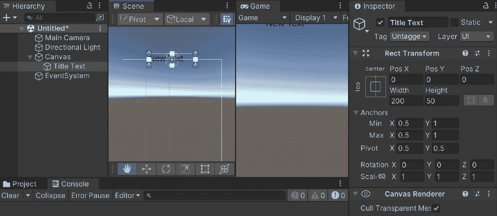

图 4.8 – 将 Pos Y 更改为 0

我放置了标签以更容易看到问题；您可以通过将标签拖放到屏幕边缘来完成此操作。

小贴士

要重置任何布局更改，您可以在屏幕右上角选择 **布局** 菜单并选择 **默认**。

如果我们将对象的值更改为 `-25`（减去其一半值），它将被正确放置。然而，如果我们决定稍后更改此值，硬编码此值将是一个问题，因为我们必须记得再次调整它。如果我们可以使地图相对于我们的高度边缘在 `0` 处，那就好多了，幸运的是，我们有这样的属性来解决这个问题。

1.  接下来，更改 `1`，然后如果之前更改了 `0`，则更改 `0`：

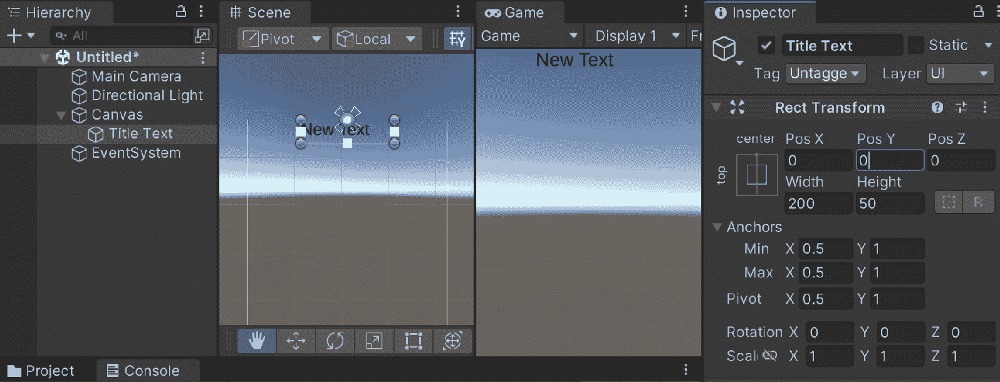

图 4.9 – 调整枢轴和 Pos Y 值

如您所见，由于枢轴设置已更改，文本现在紧贴顶部。

### 枢轴

`0`、`0.5` 和 `1`，并注意旋转的不同之处。

重要提示

注意，如果您在单击对象时按住 *Alt* **+** *Shift* 键，可以通过我之前提到的 **锚点预设** 菜单设置对象的 **枢轴**、**位置** 和 **锚点** 设置。这样，我们讨论的所有步骤都会同时发生，但在直接使用快捷键之前，了解每一步的含义是一个好主意。

现在我们已经基本了解了如何在 m 空间中工作，让我们开始最终确定我们的 **标题** **文本** 对象。

## 调整和调整标题文本大小

现在我们已经正确放置了对象，让我们使用以下步骤给标题文本添加一些视觉效果：

1.  选择 `Endless Roller` 并设置 `40`。注意现在文本显示为两行，并且不在我们定义的 **矩形** **变换** 组件的大小范围内。

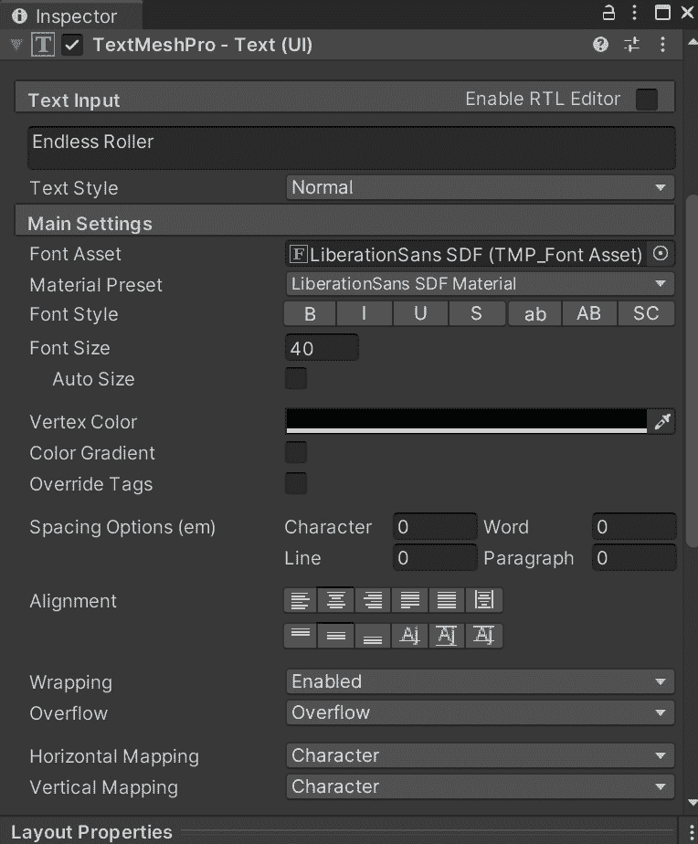

图 4.10 – 用于 TextMeshPro - 文本 (UI) 组件的设置

1.  考虑到这一点，向上滚动到 `300``50`。我们还想让它从世界顶部偏移，所以让我们将 `-30` 更改为给它一点偏移：

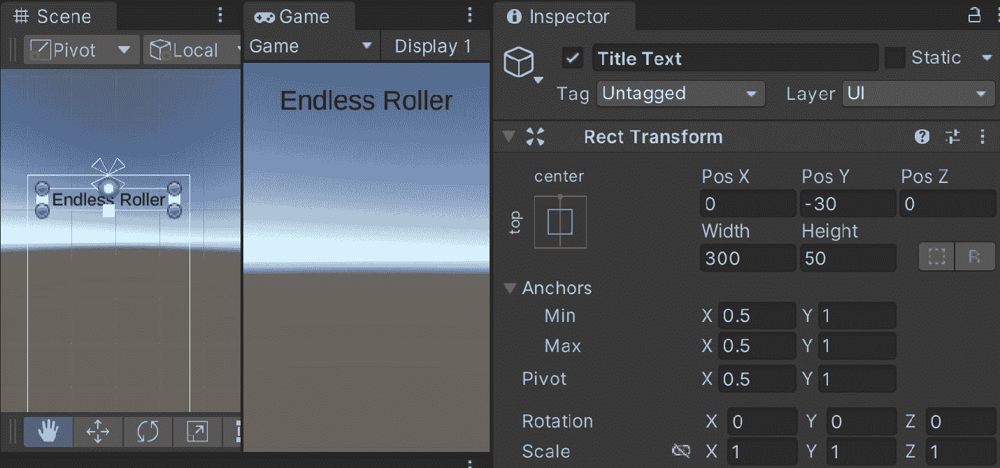

图 4.11 – 调整标题文本的偏移

对于这个分辨率来说，这看起来很棒；然而，如果我们以更高的分辨率玩游戏，它可能看起来像这样：

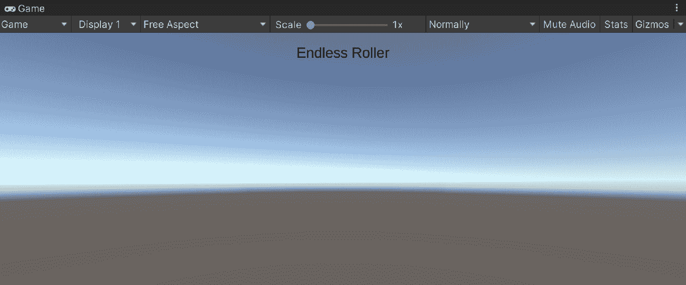

图 4.12 – 标题屏幕当前状态

如果您尝试调整屏幕如何根据我们提供的分辨率变化（组件以调整屏幕变化）的 UI，那么 UI 不缩放可能是个好主意。

1.  从**层次结构**组件中选择**画布**对象，然后从**检查器**窗口中转到**画布缩放器**组件。从那里，将**UI 缩放模式**更改为**与屏幕大小缩放**。

这里关键的性质是**参考分辨率**。这是我们想要基于我们的菜单的分辨率——如果分辨率变大，它将放大；如果它变小，它将缩小。您可能已经根据您的原型或您制作的图像文件有了分辨率的概念；然而，为了参考，以下是在撰写本书时的一些最常见的屏幕分辨率。

这里有一些示例 Apple 设备分辨率：

| **设备名称** | **分辨率** |
| --- | --- |
| iPhone 12 Pro Max/13 Pro Max | 2778 x 1284 |
| iPhone 12/12 Pro/13 Pro | 2532 x 1170 |
| iPhone 12/13 | 2532 x 1170 |
| iPhone 12 mini/13 mini | 2340 x 1080 |
| iPhone 11 Pro Max | 2688 x 1242 |
| iPhone 11 Pro | 2436 x 1125 |
| iPhone 11 | 1792 x 828 |
| iPhone 14 Pro Max | 2796 x 1290 |
| iPhone 14 Pro | 2556 x 1179 |
| iPhone 14 | 2532 x 1170 (与 12/13 相同) |
| iPhone 14 Plus | 2778 x 1284 (与 Phone 12 Pro Max/13 Pro Max 相同) |
| iPhone SE (2020) | 1334 x 750 |
| iPhone XS Max | 1242 x 2688 |
| iPhone XS | 1125 x 2436 |
| iPhone XR | 828 x 1792 |
| iPhone X | 2436 x 1125 |
| iPhone 7 Plus/8 Plus | 1080 x 1920 |
| iPhone 7/8 | 750 x 1334 |
| iPhone 6S Plus | 1080 x 1920 |
| iPhone 6S | 750 x 1334 |
| iPad Pro (第 1-5 代 12.9 英寸) | 2048 x 2732 |
| iPad 第 9 代 | 2160 x 1620 |
| iPad Air 第 4 代 | 2388 x 1668 |
| iPad Mini (第 6 代) | 2266 x 1488 |

这里是一些示例 Android 设备分辨率：

| **设备名称** | **分辨率** |
| --- | --- |
| 三星 Galaxy S22 Ultra | 3080 x 1440 |
| 三星 Galaxy S22 | 2340 x 1080 |
| 三星 Galaxy Z Fold3 | 2208 x 1768 |
| 三星 Galaxy S20 Ultra/S21 Ultra | 3200 x 1440 |
| 三星 Galaxy S20/S21 | 2400 x 1080 |
| 三星 Note 10+ | 2280 x1080 |
| Google Pixel 5 XL | 2960 x 1440 |
| Google Pixel 5 | 2340 x 1080 |
| Google Pixel 4 XL | 1440 x 2960 |
| Google Pixel 4 | 2280 x 1080 |
| 三星 Galaxy S10/S10+ | 3040 x 1440 |
| Google Pixel 3 XL | 2960 x 1440 |
| Google Pixel 3/3a XL | 2160 x 1080 |
| Google Pixel 3a | 2220 x 1080 |
| 三星 Galaxy S8/S8+ | 2960 x 1440 |
| Google Pixel 2 XL | 2560 x 1312 |
| Nexus 6P | 1440 x 2560 |
| Nexus 5X | 1080 x 1920 |
| Google Pixel/Pixel 2 | 1080 x 1920 |
| Google Pixel XL/Pixel 2 XL | 1440 x 2560 |
| 三星 Galaxy Note 5 | 1440 x 2560 |
| LG G5 | 1440 x 2560 |
| 一加 3 | 1080 x 1920 |
| 三星 Galaxy S7 | 1440 x 2560 |
| 三星 Galaxy S7 Edge | 1440 x 2560 |
| Nexus 7 (2013) | 1200 x 1920 |
| Nexus 9 | 1536 x 2048 |
| 三星 Galaxy Tab 10 | 800 x 1280 |
| Chromebook Pixel | 2560 x 1700 |

注意

要查看流行的手机屏幕分辨率列表，请查看[`screensiz.es/phone`](http://screensiz.es/phone)或[`www.ios-resolution.com/`](https://www.ios-resolution.com/)。

我使用的是 Google Pixel 3a XL，分辨率为 2160 x 1080，以及 iPhone 13 Pro Max，分辨率为 2778 x 1284，因此我认为这是一个不错的起点。然而，如果你正在创建艺术资产，最好在计划支持的最高分辨率上创建 UI，然后从那里构建其他分辨率。

Unity 内置了一些最常见的分辨率，这些分辨率可以从之前提到的窗口视图中下拉菜单中查看/更改。

4. 如果在`1920 x 1080`中还没有的话。

5. 接下来，在**匹配**下，将其全部移动到**高度**。这将确保当屏幕的高度发生变化时，我们将修改 UI 的缩放比例。

6. 接下来，让我们将文本放大一些。选择`1000`和`200`，然后更改`130`：

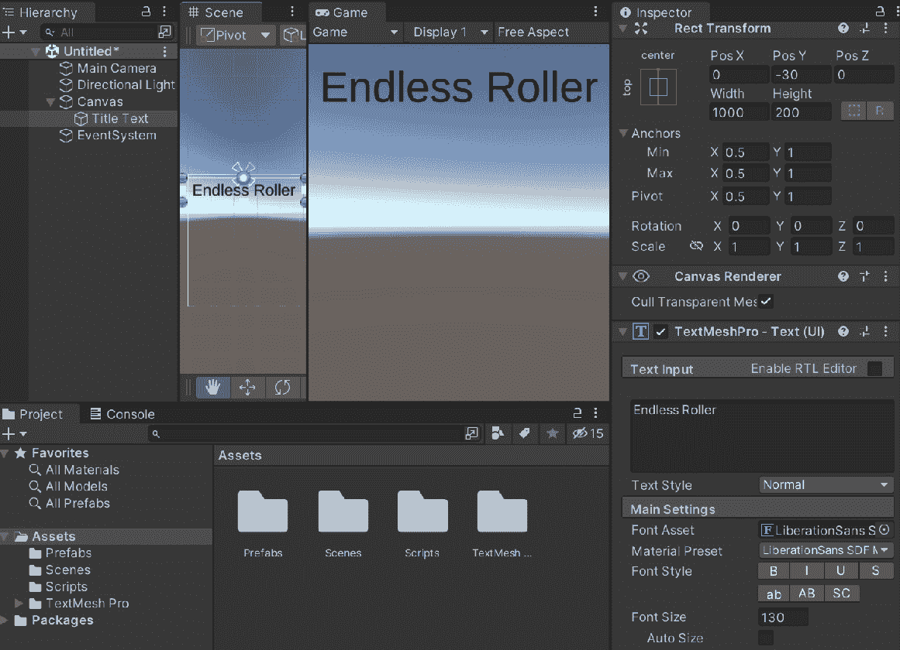

图 4.13 – 调整标题文本以放大

7. 现在，如果我们以更高的分辨率玩游戏，它将很好地显示我们的标题，并放大以适应更大的尺寸：

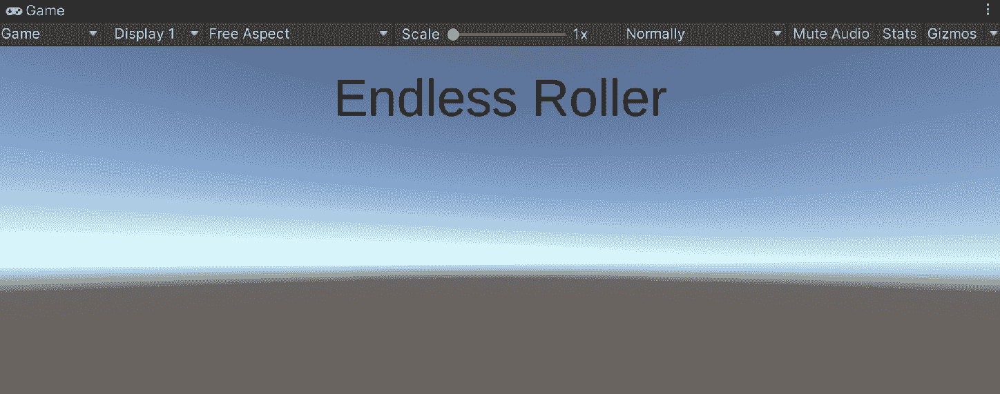

图 4.14 – 调整标题屏幕

8. 前往**游戏**视图控制栏并选择一个较小的分辨率，例如**800x480 横向（800x480）**，你会注意到文本会缩小以很好地适应：

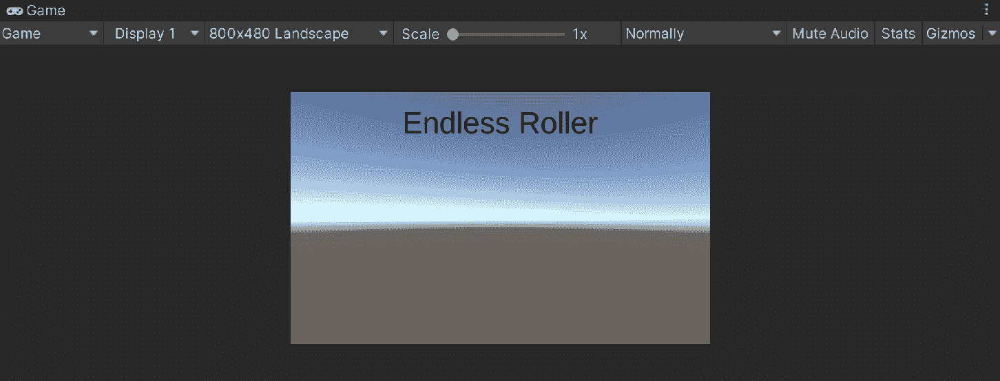

图 4.15 – 较小分辨率的标题屏幕

如你所见，**画布缩放器**组件会根据设备的分辨率调整文本的大小。接下来，我们将看到如何快速测试不同的分辨率。

注意

更多关于**画布缩放器**组件的信息，请查看[`docs.unity3d.com/Manual/script-CanvasScaler.html`](https://docs.unity3d.com/Manual/script-CanvasScaler.html)。

## 选择不同的宽高比

如我之前提到的，在**游戏**视图中，如果我们进入控制栏并选择第一个选项，会出现一个下拉菜单，我们可以从中选择不同的分辨率来测试我们的游戏，这样我们就可以在导出到我们的设备之前找到潜在的问题：

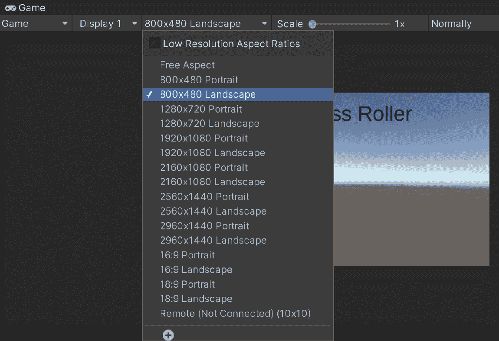

图 4.16 – 不同分辨率选项

默认情况下，已经为我们内置了多种分辨率，但我们也可以使用底部的**+**按钮创建自己的分辨率。我建议您为您的手机创建两个新的选择，用于横屏模式和竖屏模式，如果您默认情况下没有包含（在我的情况下，1920 x 1080，1080 x 1920，2778 x 1284，和 1284 x 2778）：

因此，到目前为止，我们可以看到在横屏比例下，它工作得相当好，但让我们尝试一个竖屏的：

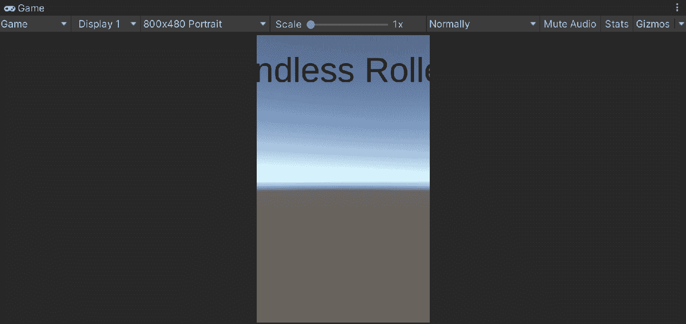

图 4.17 – 当前竖屏视图

哎呀！目前，文本已经溢出了屏幕的边界。看起来我们需要修复这个问题：

1.  选择`200`。

1.  现在，转到`0.25`和`0.75`：

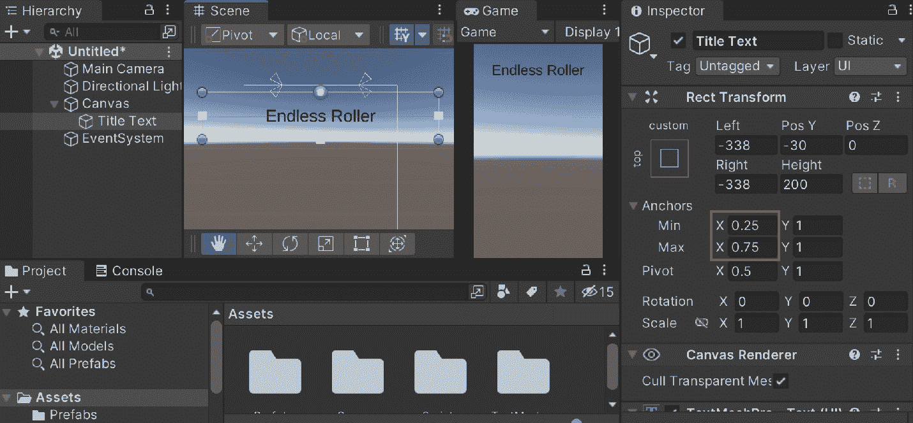

图 4.18 – 设置锚点值

注意到和值。它们现在已经被和属性所取代，这些属性目前设置为`-338`和`-338`。这意味着这个区域距离我们的锚点 25%处`-338`个单位，并且距离我们的最大锚点 75%处`-338`个单位。我们希望屏幕调整大小以适应这些锚点，因此我们将两个和值都更改为`0`。

1.  将我们的场景保存为`Scenes`文件夹中的新文件，命名为`MainMenu`，然后玩游戏：

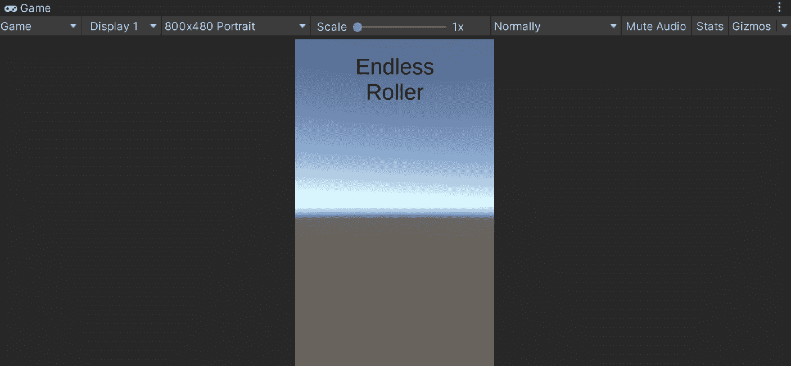

图 4.19 – 标题文本自动调整以适应屏幕

如您在前面的截图中所见，文本现在更适合。您也会注意到，无论我们使用什么分辨率，这段文本所占的空间都适合游戏的标题。现在我们已经正确显示了文本，让我们添加从主菜单正确进入游戏的功能。

# 与按钮一起工作

与我们的标题不同，对于我们希望玩家触摸的东西，使按钮在每个设备中具有相同的大小是个好主意，因为无论我们使用什么设备，我们的手指大小都是一样的。为了展示一个可能的解决方案，我们将使用不同的缩放技术创建一个新的 Canvas：

1.  如果游戏正在运行，请停止游戏。我们首先将当前的`Canvas - Scale w/Screen`重命名。这样，我们可以很容易地判断我们是否正在使用正确的 Canvas。

1.  现在我们已经准备好了这个，我们可以创建新的一个。转到顶部菜单栏，然后选择`Canvas - Scale Physical`。然后，在**Canvas Scaler**组件下，将**UI Scale Mode**更改为**Constant Physical Size**：

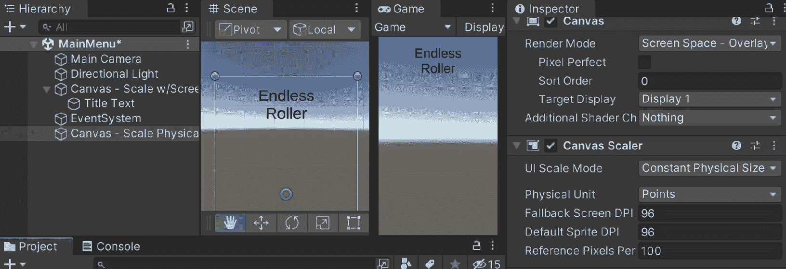

图 4.20 – 创建物理 Canvas

使用这种方法，Unity 将尝试调整 Canvas 的大小，以便每个元素都具有相同的物理大小，而不管分辨率如何。由于我们打算制作可以用手指按下的按钮，这很有意义。

1.  现在，在**层次结构**视图中选择此 Canvas（**Canvas - Scale Physical**），然后转到菜单并选择**GameObject** | **UI** | **Button - TextMeshPro**以在此 Canvas 内创建一个新按钮。

注意

你也可以通过在**层次结构**窗口中右键单击`Canvas - Scale Physical`对象并选择**UI | Button -** **TextMeshPro**来做到这一点。

在这一点上，你将看到一个名为 child 的新子对象：

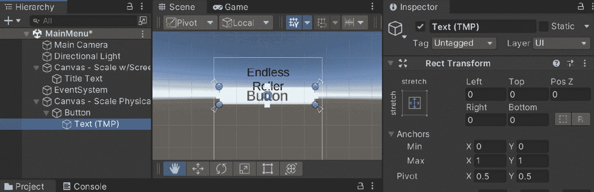

图 4.21 – 展示 Text (TMP)对象

下一个问题是什么尺寸的按钮才合适？谷歌在其为 Android 提供的材料指南中建议至少为 48 x 48（短），而苹果在其（**WWDC**）上推荐至少 44 x 44 dp。无论如何，这大约是 8mm x 8mm，或者 0.3 英寸 x 0.3 英寸。

注意

要阅读材料指南，请查看[`material.io/design/layout/spacing-methods.html#touch-click-targets`](https://material.io/design/layout/spacing-methods.html#touch-click-targets)。或者，要查看 Material 3 的指南，请查看[`m3.material.io/components/buttons/specs#85e63496-f905-4978-ae35-69ab83b70536`](https://m3.material.io/components/buttons/specs#85e63496-f905-4978-ae35-69ab83b70536)

如果你现在查看游戏并检查一些不同的分辨率选项，你可能会因为按钮的大小而有点害怕，这取决于分辨率：

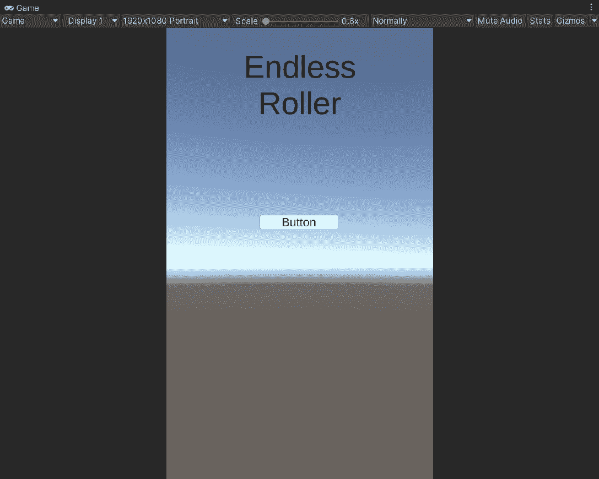

图 4.22 – 小按钮

这是因为我们的按钮大小假设的是（值）在玩游戏时，我们将在设备上看到的东西更接近：

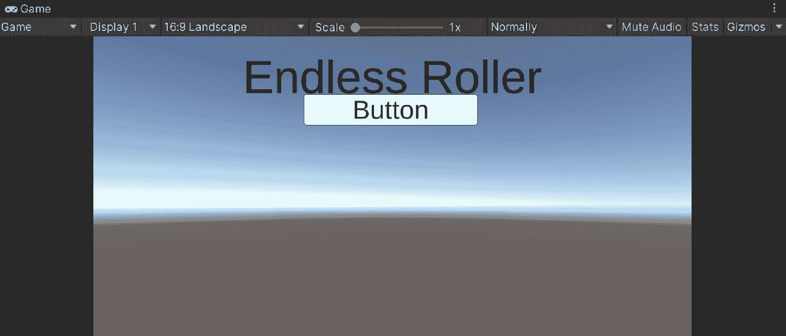

图 4.23 – 16:9 宽高比的游戏

1.  如果游戏正在运行，请停止游戏。之后，从`Play`。

注意

如果你感兴趣，想了解你的设备的 DPI 是多少，请查看[`dpi.lv/`](http://dpi.lv/)。

1.  接下来，让我们对**按钮**对象本身做一些调整。

从**检查器**窗口顶部的`Play Button`，使其清楚对象是什么。

1.  接下来，转到`0`以将按钮居中于屏幕中间。之后，按钮的大小相当大，所以让我们将`75``35`更改为：

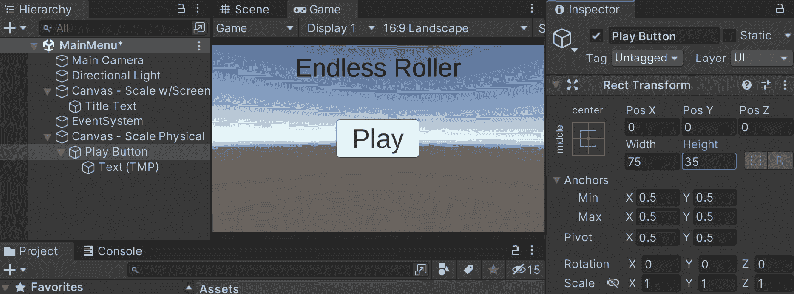

图 4.24 – 调整按钮的大小

我们现在有一个按钮，但它实际上还没有做任何事情。让我们现在修复它。

1.  让我们创建一个脚本来包含我们想要的功能。从`Scripts``MainMenuBehaviour`。

1.  一旦你的 IDE 已经打开，使用以下代码：

    ```kt
    using UnityEngine;
    using UnityEngine.SceneManagement; // LoadScene
    public class MainMenuBehaviour : MonoBehaviour
    {
        /// <summary>
        /// Will load a new scene upon being called
        /// </summary>
        /// <param name="levelName">The name of the level
        /// we want to go to</param>
        public void LoadLevel(string levelName)
        {
            SceneManager.LoadScene(levelName);
        }
    }
    ```

`LoadLevel`函数将根据我们提供的名称加载一个级别，利用 Unity 的场景管理器，我们通过在代码顶部添加一个语句来添加它，以便我们可以访问该命名空间。

1.  保存脚本并返回到 Unity 编辑器。要从编辑器调用 Unity 的 UI 事件，我们需要有一个附加了 `MainMenuBehaviour` 组件的游戏对象来调用此函数。我们可以使用当前现有的对象之一，但我们将创建一个新的对象，这样在未来更容易找到它。

1.  考虑到这一点，创建一个空的游戏对象（`Main Menu`），然后将其添加到 `MainMenuBehaviour` 脚本中。然后，将其拖放到 **Hierarchy** 选项卡顶部，以便将来更容易访问，并为了整洁重置其位置：

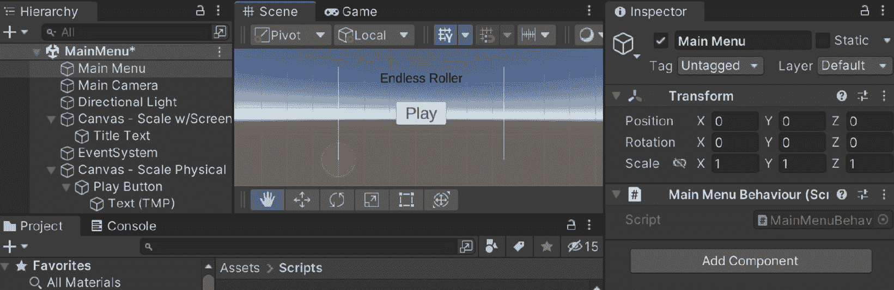

图 4.25 – 创建主菜单对象

1.  从 **Hierarchy** 中选择你的 **Play Button** 对象，转到 **Inspector** 选项卡，并从那里向下滚动到 **Button** 组件。然后，在 **On Click ()** 部分，点击 **+** 图标为我们的按钮添加一些操作。

1.  然后，将 **Hierarchy** 选项卡中的 **Main Menu** 对象拖放到当前显示为 **None (Object)** 的区域，该区域已添加到列表中。

1.  点击当前显示为 `Gameplay` 的下拉菜单：

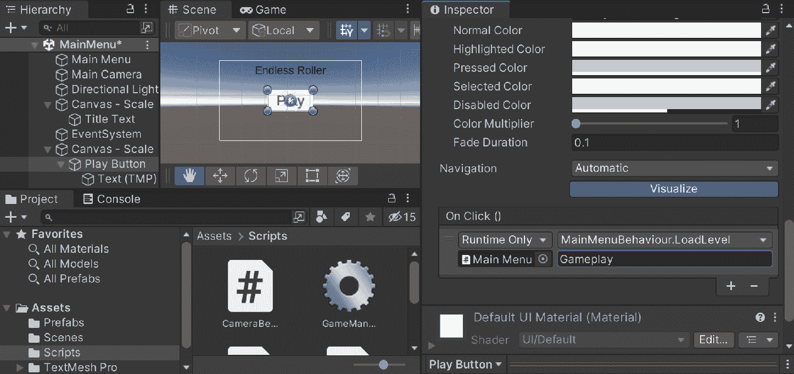

图 4.26 – 为按钮添加功能

1.  通过访问 **文件 | 保存** 来保存你的场景。最后，像之前一样，通过访问 **文件** | **构建设置** 打开 **构建设置**，并将我们的 **MainMenu** 场景添加到索引 **0** 的列表中，通过选择 **添加打开的场景** 并将 **MainMenu** 级别拖到顶部，这样主菜单级别将成为我们开始游戏时启动的场景：

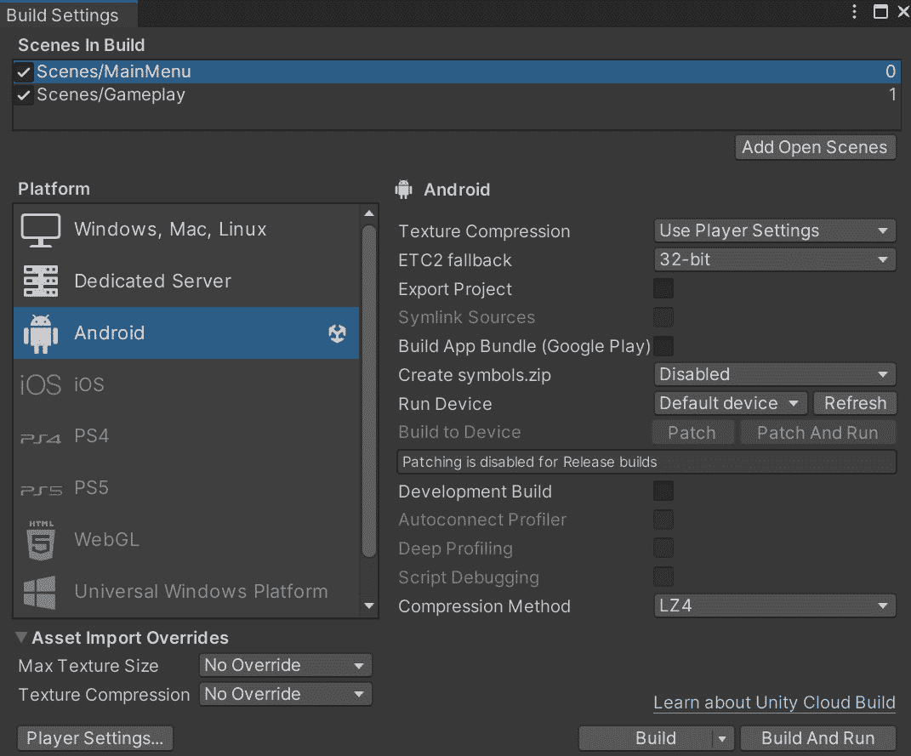

图 4.27 – 使用主菜单开始游戏

1.  保存你的项目和场景，然后点击 **播放** 按钮：

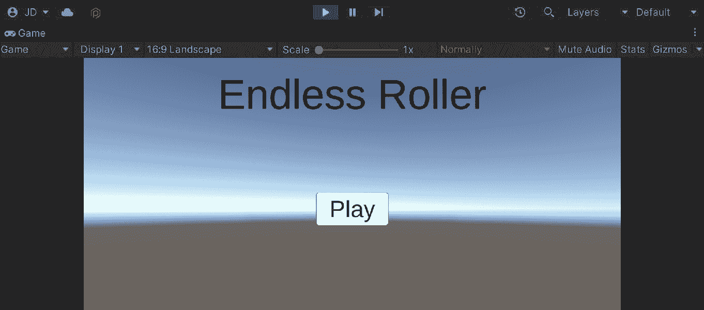

图 4.28 – 主菜单当前状态

到目前为止，我们的主菜单运行良好，我们可以通过点击 **Play** 按钮来无问题地进入游戏：

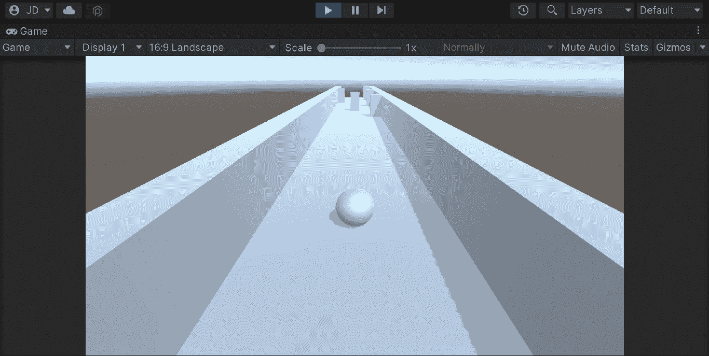

图 4.29 – 游戏场景当前状态

现在我们已经对 UI 系统有了基础的了解，并且我们有标题屏幕，我们将继续构建大多数游戏都需要的东西：暂停菜单。

# 添加暂停菜单

在玩游戏时，尤其是移动游戏，可能会有需要随时停止游戏的时候。拥有一个暂停菜单将允许我们的玩家方便地决定何时停止当前游戏状态，并在对他们来说方便的时间重新开始游戏。这还将使我们能够深入探讨使用 Unity 的 UI 系统的一些额外概念，因此，考虑到这一点，让我们开始构建一个：

1.  打开 `Assets/Scenes` 文件夹，双击 **Gameplay**，如果你还没有这样做，保存 **MainMenu** 级别：

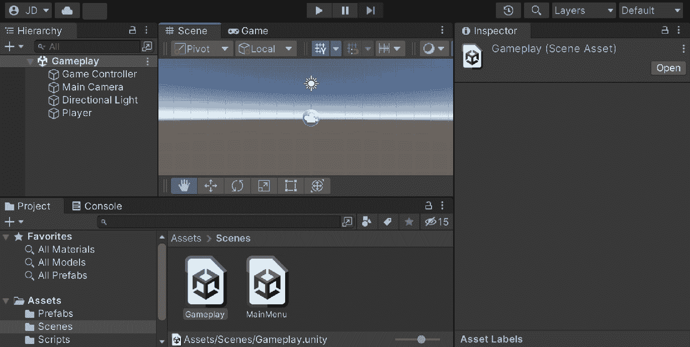

图 4.30 – 打开游戏玩法场景

在我们担心如何打开暂停菜单之前，让我们先创建我们将首先打开的暂停菜单。

1.  我们首先要做的是在我们进入暂停菜单时降低屏幕亮度。一个简单的方法是让一个图像缩放以覆盖整个屏幕，这就是**面板**对象默认所做的。我们可以通过选择**游戏对象** | **UI** | **面板**来创建它。请注意，这除了创建**面板**对象外，还会创建一个**Canvas**对象和一个**EventSystem**对象，因为在这个场景中已经不存在**面板**对象了。

1.  将`Pause` `Menu`重命名。然后，从`178`选择对象：

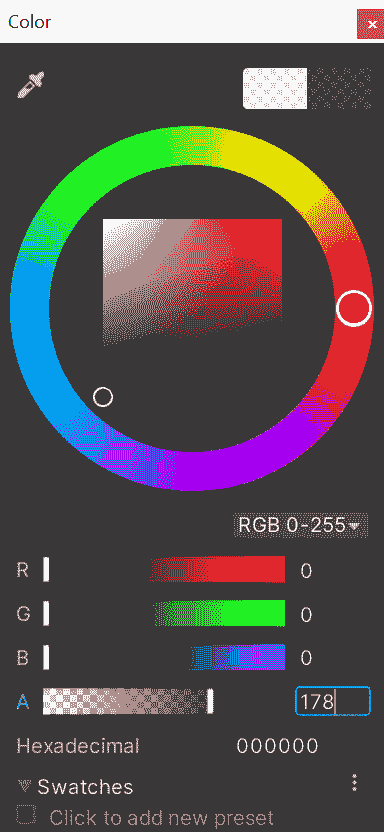

图 4.31 – 设置面板的颜色

该组件的工作方式与 2D 游戏类似，包括要绘制的图像上的信息和用于它的颜色。

1.  切换到**游戏**窗口以更好地查看**面板**对象对屏幕所做的工作。当前图像有一个细边框，在这种情况下我不太喜欢。如果你愿意，你可以保留它，但我会将其移除，并将**源图像**值更改为**无（精灵**）通过选择当前项并按*Delete*键：

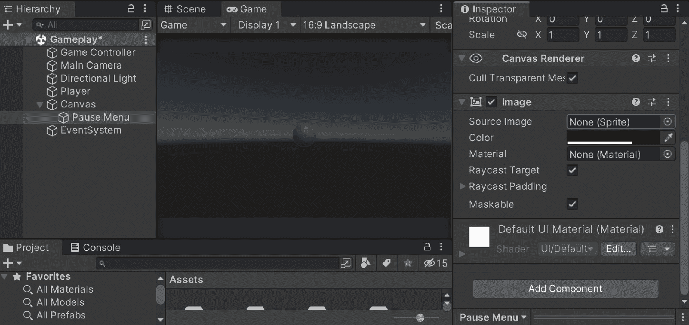

图 4.32 – 创建背景

现在我们有了这个，我们需要用内容填充菜单。在这种情况下，我们将有一个对象表示游戏已暂停，以及一些按钮允许玩家继续、重新开始或返回主菜单。

1.  让我们再创建一个面板来存放我们的暂停菜单内容。我们希望这个面板是**暂停菜单**对象的子对象，因此我们可以通过转到**层次结构**窗口，右键单击**暂停菜单**，然后选择**UI** | **面板**来轻松完成此操作：

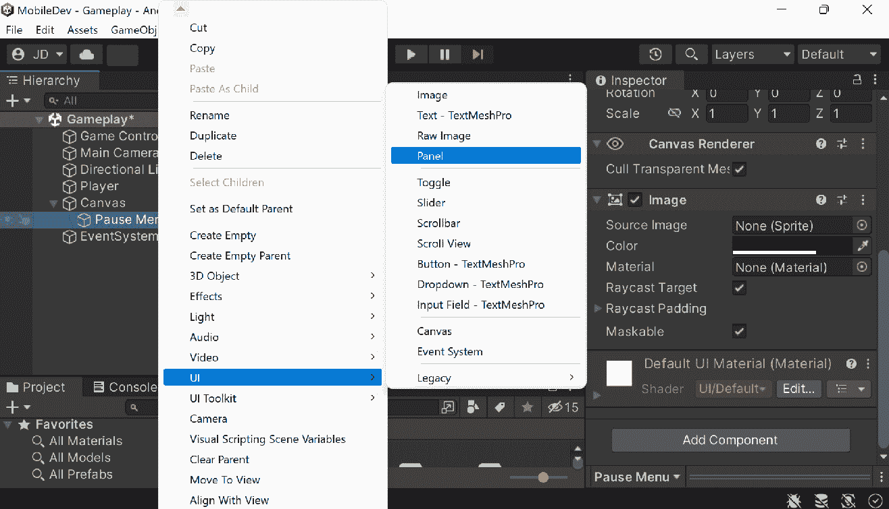

图 4.33 – 通过层次结构窗口创建子对象

现在，对于这个面板，我不想让它占据整个屏幕，所以我将使用另一个组件根据我们收到的分辨率来修改其大小。在这种情况下，我将使用**纵横比** **适配器**组件。

1.  在`Aspect`中。从那里，选择**纵横比适配器**然后按*Enter*键。

1.  之后，转到我们新添加的组件，并将值更改为`Fit In Parent`以确保面板始终适合屏幕，并设置为`0.5`。这意味着面板的高度将是宽度的两倍（宽度超过高度，即`½`或`0.5`）。

如果你进入**游戏**窗口并切换纵横比，你会注意到菜单将保持相似的形状。

注意

有关**纵横比适配器**组件的更多信息，请参阅[`docs.unity3d.com/Manual/script-AspectRatioFitter.html`](https://docs.unity3d.com/Manual/script-AspectRatioFitter.html)。

1.  这很好，但我不想让面板直接粘附到屏幕边缘，所以我们将通过点击 **图像** 组件旁边的勾选标记使此对象不可见。这将禁用组件并停止组件的功能。

1.  然后，右键单击 `暂停菜单内容` 并将 `10` 改为在屏幕周围添加边框。

1.  我们将使用和上次一样的物理按钮，所以让我们转到 **画布** 对象，并在 **画布缩放器** 组件下，将 **UI 缩放模式** 更改为 **常量** **物理大小**：

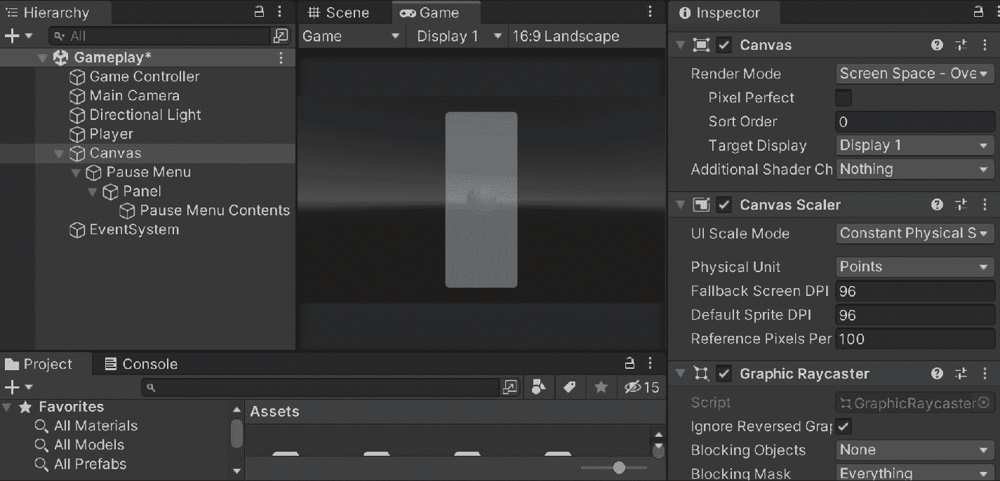

图 4.34 – 暂停菜单内容设置

我们可以像之前一样手动放置所有内容，但在这个情况下，我们可能想使用 Unity UI 系统的另一个功能：布局组。

将调整对象的子项大小，以便组件可以自动适应父项的区域。有几种不同的布局组，包括基于网格的、水平和垂直布局组。在我们的情况下，菜单可能将是垂直的。

重要提示

更多关于 Unity 自动创建布局的信息，请参阅 [`docs.unity3d.com/Manual/UIAutoLayout.html`](https://docs.unity3d.com/Manual/UIAutoLayout.html)。

1.  选择 `垂直布局组` 并按 *Enter* 键选择 **垂直布局组**。

1.  让我们创建一些子项以适应我们的菜单。从 **层次结构** 窗口，右键单击 **暂停菜单内容** 对象，并选择 **UI** | **按钮 -** **TextMeshPro**。

1.  这将创建一个按钮，但你会注意到它看起来几乎和普通按钮一样。让我们打开它的子项 `Resume`。然后，我们检查 `0`。为了使所有按钮文本都在一行上，我们也可以更改 `5`。

1.  之后，选择 **暂停菜单内容** 对象，在 **检查器** 窗口中，转到 **垂直布局组（脚本）** 组件，并将 **子项对齐** 值更改为 **居中**。然后，将 **子项控制大小** 值更改为 **宽度** 开关。

1.  然后，在 `5`：

这将在布局组的所有子项的每个方向添加五个像素的填充。

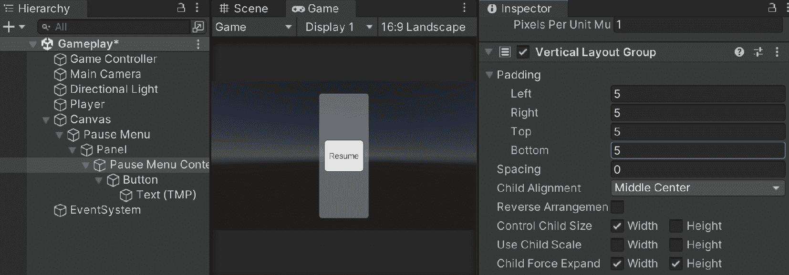

图 4.35 – 添加填充

1.  现在，复制这个按钮两次，并将文本更改为 `Restart` 和 `Main Menu`。然后，为了容易区分它们，让我们将对象的名称更改为 `Resume Button`、`Restart Button` 和 `Main Menu Button`。

1.  接下来，右键单击 `Paused` `0` `30`。注意子项在层次结构中的放置顺序会改变它们显示的顺序。考虑到这一点，将 **文本** 对象拖到顶部：

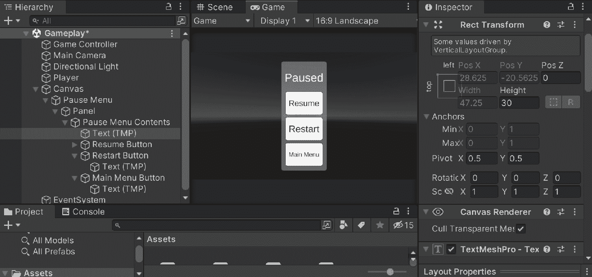

图 4.36 – 暂停菜单设置

这看起来不错，但这里也有很多间距。所以，如果我们想的话，我们可以将菜单的内容压缩到只适合我们那里。

1.  要做到这一点，我们可以转到**层次**并选择**暂停菜单内容**对象，然后添加一个**内容大小适配器**组件。一旦添加，我们将更改**垂直适配**为**首选大小**。

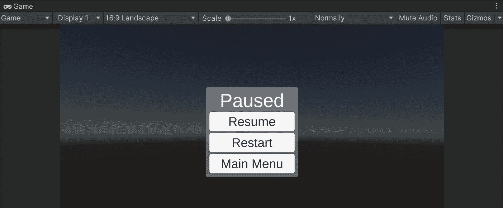

图 4.37 – 预设大小选项的影响

1.  这会将所有按钮挤在一起，因此我们可以更改`5`并在按钮之间添加一些空间：

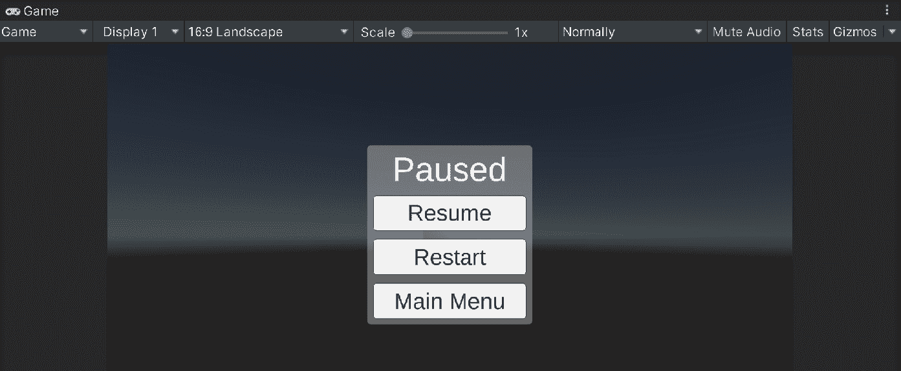

图 4.38 – 暂停菜单的当前视图

1.  现在我们已经有了按钮本身，让我们实际上让它们做些事情。在`Scripts`文件夹中创建一个新的 C# 脚本，命名为`PauseScreenBehaviour`**，**并双击它以打开您选择的 IDE。

1.  一旦打开，使用以下代码：

    ```kt
    using UnityEngine;
    using UnityEngine.SceneManagement; // SceneManager
    public class PauseScreenBehaviour : MainMenuBehaviour
    {
        /// <summary>
        /// If our game is currently paused
        /// </summary>
        public static bool paused;
        [Tooltip("Reference to the pause menu object to
            turn on/off")]
        public GameObject pauseMenu;
        /// <summary>
        /// Reloads our current level, effectively
        /// "restarting" the game
        /// </summary>
        public void Restart()
        {
            SceneManager.LoadScene(SceneManager
                .GetActiveScene().name);
        }
        /// <summary>
        /// Will turn our pause menu on or off
        /// </summary>
        /// <param name="isPaused"></param>
        public void SetPauseMenu(bool isPaused)
        {
            paused = isPaused;
            /* If the game is paused, timeScale is 0,
               otherwise 1 */
            Time.timeScale = (paused) ? 0 : 1;
            pauseMenu.SetActive(paused);
        }
        void Start()
        {
            /* Must be reset in Start or else game will be
               paused upon restart */
            paused = false;
        }
    }
    ```

在这个脚本中，我们首先使用一个`static`变量，它被称为`paused`。当我们声明一个`static`变量时，我们确保在这个类内部只有一个这样的变量，所有实例都将共享。这个优点之一是我们可以使用类名后跟一个点然后是属性名（在这种情况下，`PauseScreenBehaviour.paused`）来访问属性。我们将在稍后想要通过代码打开菜单时使用这个概念。

然后，我们有两个公共函数，我们将通过 UI 元素来调用它们。首先，我们有一个`Restart`函数，它将使用 Unity 的场景管理器带我们回到当前加载的水平，从而有效地重新启动游戏。需要注意的是，在 Unity 中重新启动时，`static`变量不会重置，这就是为什么我在`Start`函数中将`paused`设置为`false`，以确保当我们到达水平时，它是未暂停的。

最后，我们有一个`SetPauseMenu`函数，它将根据`isPaused`的值打开或关闭暂停菜单。它还设置`Time.timeScale`属性，其中`0`表示不会发生任何事情，而`1`表示正常时间。这个属性将修改`Time.deltaTime`变量，实际上取消我们在使用它时所有的移动。

1.  保存您的脚本，然后回到 Unity。

1.  然后，我们将在“暂停屏幕处理程序”中创建一个新的空游戏对象，并将其**暂停屏幕行为（脚本）**组件附加到它上面。

1.  接下来，在“层次”选项卡中将**暂停菜单**变量分配给**暂停菜单**游戏对象：

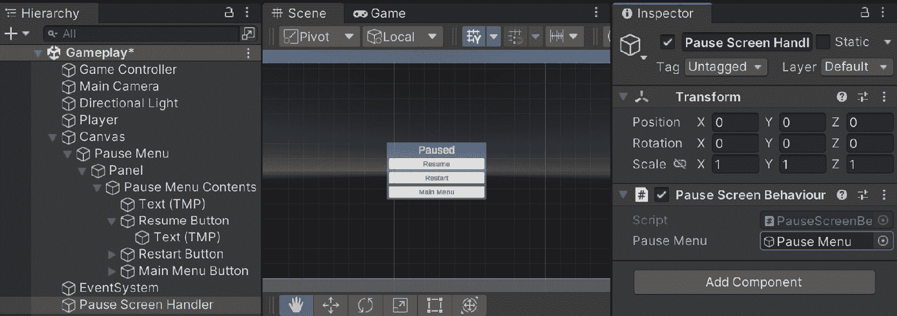

图 4.39 – 分配暂停菜单属性

1.  现在我们有了脚本，我们就可以更改按钮以实际执行某些操作了。选择**Resume Button**对象，转到**检查器**窗口，然后转到**按钮**组件的**On Click ()**部分，点击**+**按钮以添加要执行的操作。

1.  由于未勾选，因此将`false`拖放到此处，这应该对我们适用：

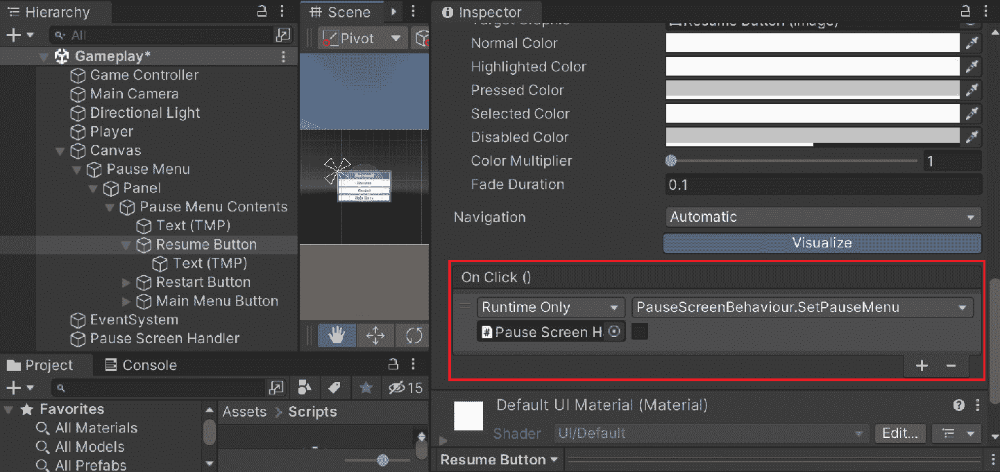

图 4.40 – 从**继续**按钮调用 SetPauseMenu 函数

1.  同样，对`Restart`函数也进行相同的操作。

1.  接下来，对`LoadLevel`也进行相同的操作，并将我们主菜单级别的名称放在字符串位置（在我的例子中是`MainMenu`）。

注意

`PauseScreenHandler`脚本已经包含了`LoadLevel`和`MainMenuBehaviour`类。

1.  保存游戏并运行它：

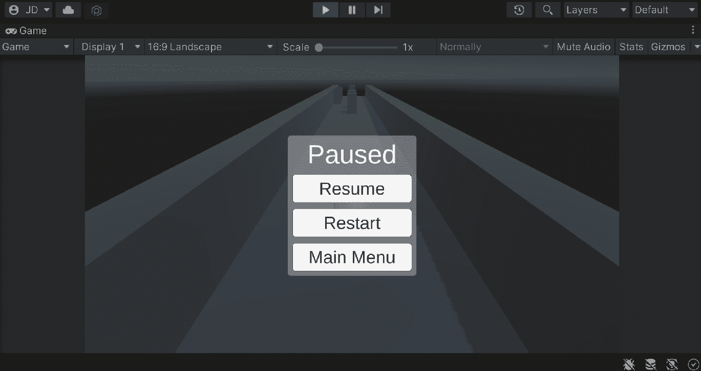

图 4.41 – 游戏当前状态

如前一个屏幕截图所示，如果我们开始游戏，菜单会正确显示——我们可以点击**主菜单**按钮进入主菜单，**继续**会继续游戏。

到目前为止，我们有一些问题：一旦菜单消失，就没有办法再恢复它；游戏应该从未暂停的状态开始，实际上游戏应该暂停。让我们接下来解决这些问题。

# 暂停游戏

要正确暂停游戏，我们将使用以下步骤调整我们之前编写的一些脚本：

1.  打开`PlayerBehaviour`脚本，并将以下加粗代码添加到`FixedUpdate`函数中：

    ```kt
    /// <summary>
    /// FixedUpdate is a prime place to put physics
    /// calculations happening over a period of time.
    /// </summary>
    void FixedUpdate()
    {
        /* If the game is paused, don't do anything */
        if (PauseScreenBehaviour.paused)
        {
            return;
        }
        // Check if we're moving to the side
        var horizontalSpeed = Input.GetAxis("Horizontal")
            * dodgeSpeed;
        // Rest of the FixedUpdate function...
    ```

添加的代码使得如果游戏被暂停，我们将在函数内不执行任何操作。

1.  然后，我们还需要将相同的脚本添加到`Update`函数的顶部：

    ```kt
    /// <summary>
    /// Update is called once per frame
    /// </summary>
    private void Update()
    {
        /* Using Keyboard/Controller to toggle pause menu
        */
        if (Input.GetButtonDown("Cancel"))
        {
            // Get the pause menu
            var pauseBehaviour =
                GameObject.FindObjectOfType
                    <PauseScreenBehaviour>();
    // Toggle the value
            pauseBehaviour.SetPauseMenu
                (!PauseScreenBehaviour.paused);
        }
        /* If the game is paused, don't do anything */
        if (PauseScreenBehaviour.paused)
        {
            return;
        }
        /* Check if we are running either in the Unity
           editor or in a standalone build.*/
        #if UNITY_STANDALONE || UNITY_WEBPLAYER ||
            UNITY_EDITOR
        // Rest of the Update function…
    ```

1.  保存你的脚本并返回到 Unity 编辑器。现在，游戏默认应该是未暂停的，所以让我们继续在**层次结构**视图中选择**暂停菜单**对象，然后在**检查器**视图中点击活动按钮来禁用它：

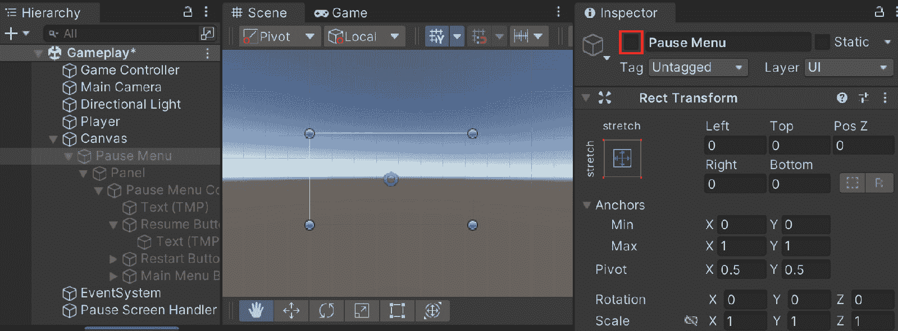

图 4.42 – 禁用暂停菜单

1.  保存你的场景，然后继续玩游戏。在游戏过程中，按*Esc*键，你应该会看到暂停菜单出现，游戏被暂停！我们也可以使用**继续**或再次按*Esc*来恢复游戏。

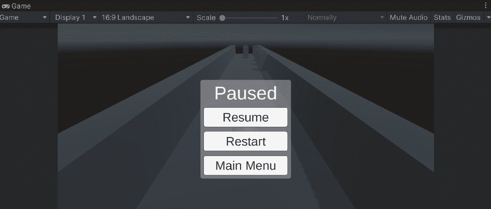

图 4.43 – 游戏当前状态

这很好，但这只会在我们的玩家连接了键盘或控制器时才起作用。在下一章中，我们将看到如何有一个玩家可以点击以打开菜单的按钮。此外，我们可能还希望能够通过一些屏幕上的视觉 UI 菜单来移动玩家。这就是我们接下来要解决的问题。

# 摘要

这样，我们就为创建移动游戏的 UI 元素打下了良好的基础。我们首先介绍了如何创建标题屏幕，利用按钮和**文本**对象。然后，我们介绍了如何使用面板、按钮、文本和布局组来使你的菜单适应元素的大小。我们还简要介绍了布局组如何以令人愉悦的方式排列我们的对象。

在下一章中，我们将继续探索游戏用户界面（UIs），通过了解如何添加暂停屏幕按钮和屏幕上的摇杆，以及调整我们的 GUI 以适应刘海屏设备。
