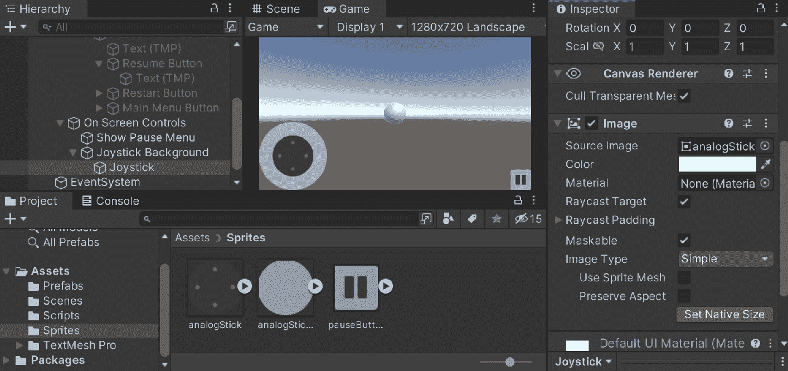

# 5

# 高级移动 UI

在上一章中，我们介绍了 Unity UI 系统以及如何构建分辨率无关的 UI 元素，这对于利用不同宽高比和分辨率的所有游戏项目都很有用。在本章中，我们将探讨一些与 UI 相关的特定于移动的方面，例如需要屏幕控制以及将我们的 UI 适配到带有刘海的设备。

本章将分为多个主题。本章是一个从开始到结束的简单步骤过程。以下是我们任务的概述：

+   添加暂停屏幕按钮

+   实现屏幕摇杆

+   适配带刘海的设备的 GUI

在本章的整个过程中，我们将把我们在上一章中实现的暂停屏幕适配到移动设备上。然后，我们将实现一个屏幕上的摇杆作为额外的移动选项，最后，让我们的 UI 自动适应带有刘海的移动设备。

# 技术要求

本书使用 Unity 2022.1.0b16 和 Unity Hub 3.3.1，但步骤应该在未来版本的编辑器中只需进行最小更改即可。如果您想下载本书中使用的确切版本，并且有新版本发布，您可以在 Unity 的下载存档中找到它，地址为[`unity3d.com/get-unity/download/archive`](https://unity3d.com/get-unity/download/archive)。您还可以在**Unity 编辑器系统** **要求**部分找到 Unity 的系统要求[`docs.unity3d.com/2022.1/Documentation/Manual/system-requirements.html`](https://docs.unity3d.com/2022.1/Documentation/Manual/system-requirements.html)。

您可以在 GitHub 上找到本章中存在的代码文件，地址为[`github.com/PacktPublishing/Unity-2022-Mobile-Game-Development-3rd-Edition/tree/main/Chapter05`](https://github.com/PacktPublishing/Unity-2022-Mobile-Game-Development-3rd-Edition/tree/main/Chapter05)。

# 添加暂停屏幕按钮

虽然许多移动游戏都支持通过蓝牙控制器，但其中大多数，如果不是全部，都允许用户仅通过设备来控制游戏。越来越多的移动游戏将包括屏幕按钮或模拟摇杆，玩家可以使用它们来控制他们的角色。在本节中，我们将看到如果我们希望，我们如何实现这一点。

首先，让我们构建一个暂停菜单按钮：

1.  由于我们将要创建多种类型的屏幕控制，让我们创建一个面板来容纳它们。从“屏幕控制”中，从**检查器**视图中移除或禁用**图像**组件，因为我们不需要看到图像。

对于我们控制版本的这一版，我们将使用一些 2D 精灵来使识别各种 UI 元素更容易。如果您想使用与我使用的完全相同的精灵，这些精灵包含在本书的示例代码中。

1.  从 `Sprites` 中拖放图像文件到新添加的文件夹中。由于我们的项目是 3D 的，Unity 假设我们想要它们作为纹理，但我们想使用 Unity 的 UI 系统。考虑到这一点，选择所有三个精灵。从 **Inspector** 中，将 **Texture Type** 改为 **Sprite (2D and UI)**，然后滚动到最底部，然后点击 **Apply** 按钮。

备注

这里使用的精灵来自 *Kenney 的 Onscreen Controls* 套件。您还可以使用其他七种可能的样式，这些样式可在[`kenney.nl/assets/onscreen-controls`](https://kenney.nl/assets/onscreen-controls)找到。

1.  现在我们有了精灵，让我们构建我们的第一个 UI 元素，一个暂停按钮。从 **Hierarchy** 视图中，右键单击 **On Screen Controls** 对象，然后选择 **UI** | **Button -** **TextMeshPro**。

1.  将新对象 `Show Pause Button` 重命名，并使用 **Anchor Presets** 菜单将对象放置在屏幕的右下角（使用 *Alt*+ *Shift* 设置 **Pivot** 和 **Position**）。


图 5.1 – 右下角选项

1.  然后，从 **Image** 组件中，将我们的 **pauseButton** 精灵拖放到 **Source Image** 属性中。您会注意到它被拉伸了，所以点击 **Set Native Size** 按钮让精灵自动调整大小。

1.  我们实际上不需要包含文本对象，所以选择 **Text (TMP)** 对象并按 *Delete* 键。


图 5.2 – 创建暂停按钮

1.  返回并选择 `pause`。

1.  返回到 **Resume Button** 并为其按钮添加另一个事件，当离开时重新开启 **Show Pause Menu** 按钮。


图 5.3 – 创建恢复按钮点击动作

现在，我们希望在暂停游戏时移除我们的屏幕控制。这可以通过 **Inspector** 完成，但也可以通过代码完成。

1.  打开 `PauseScreenBehaviour` 脚本，并将以下属性添加到脚本中：

    ```kt
    [Tooltip("Reference to the on screen controls menu")]
    public GameObject onScreenControls;
    ```

1.  之后，更新 **SetPauseMenu** 函数以包含以下新行：

    ```kt
    /// <summary>
    /// Will turn our pause menu on or off
    /// </summary>
    /// <param name="isPaused">is the game currently
        paused</param>
    public void SetPauseMenu(bool isPaused)
    {
        paused = isPaused;
        /* If the game is paused, timeScale is 0,
           otherwise 1 */
        Time.timeScale = (paused) ? 0 : 1;
        pauseMenu.SetActive(paused);
        onScreenControls.SetActive(!paused);
    }
    ```

注意，我们使用的是 `!paused` 而不是上一行中的 `paused`。`!` 操作符会将 `true` 的值转换为 `false`，反之亦然。这将导致当游戏未暂停时 `onScreenControls` 窗口打开，当游戏暂停时关闭。

由于我们已经在代码编辑器中，我们也可以利用这个时间修复将来可能出现的问题：如前所述，一个现在不明显的问题（除非你重新启动关卡）是 `static` 变量会在每次重新加载游戏时保持其值。在我们的例子中，我们设置了 `paused`，它将 `Time.timeScale` 设置为 `0`。幸运的是，我们可以相当容易地修复这个问题。

1.  打开 `PauseScreenBehaviour` 脚本，并更新 `Start` 函数，替换原始行：

    ```kt
    void Start()
    {
        /* Must be reset in Start or else game will be
            paused upon
         * restart */
        SetPauseMenu(false);
    }
    ```

1.  返回到 Unity 并转到 **Pause Screen Handler** 对象。从 **Pause Screen Behaviour** 脚本中，将 **On Screen Controls** 属性设置为我们的 **On Screen** **Controls** 对象。


图 5.4 – 更新暂停屏幕行为

1.  保存你的脚本和场景，然后玩游戏：


图 5.5 – 游戏当前状态

暂停菜单现在工作正常。这是一种简单的方法将屏幕控制添加到屏幕上。更高级的版本将是一个我们可以用来控制玩家移动的模拟摇杆。让我们接下来处理这个问题。

# 实现屏幕摇杆

为了实现这个屏幕摇杆，我们将利用两个图像：一个背景图像，然后是一个放置在背景图像上的摇杆图像。然后我们将编写代码，允许玩家模拟他们正在物理移动摇杆。稍后，我们将学习如何让模拟摇杆正确地影响游戏：

1.  右键点击 `Joystick Background`。

1.  从 `analogStickBackground` 精灵处点击**设置原生** **大小**按钮。

1.  从 **Rect Transform** 组件中，按住 *Alt* **+** *Shift* 并使用 **Anchor Presets** 菜单将 **Joystick Background** 移动到底部左选项。

1.  接下来，右键点击 `Joystick`。

1.  从 `analogStick` 精灵处点击**设置原生** **大小**按钮。



图 5.6 – 创建摇杆 UI

1.  我们希望这个摇杆可以移动，因此为了做到这一点，我们将创建一个新的脚本。从 `Scripts` 文件夹中创建一个新的 C# 脚本，命名为 `MobileJoystick`。然后，将 `MobileJoystick` 脚本附加到 `Joystick` 对象上。

1.  打开代码编辑器，定位到 `MobileJoystick` 脚本，并在 `Start` 函数中添加以下属性及其初始化：

    ```kt
    /// <summary>
    /// A reference to this object's RectTransform
    /// component
    /// </summary>
    RectTransform rt;
    /// <summary>
    /// The original position of the stick used to
    /// calculate the offset of movement
    /// </summary>
    Vector2 originalAnchored;
    // Start is called before the first frame update
    void Start()
    {
        rt = GetComponent<RectTransform>();
        originalAnchored = rt.anchoredPosition;
    }
    ```

1.  要在拖动摇杆时让摇杆执行某些操作，我们可以在脚本中添加一个接口，用于拖动和停止拖动时。为此，我们需要在脚本顶部添加以下 `using` 语句：

    ```kt
    using UnityEngine.EventSystems; /* IDragHandler, IEndDragHandler */
    ```

1.  之后，我们在类定义中添加以下加粗代码：

    ```kt
    public class MobileJoystick : MonoBehaviour, IDragHandler, IEndDragHandler
    ```

1.  现在，我们会得到一些错误，因为我们还没有实际定义接口中给出的函数，让我们现在就定义它们：

    ```kt
       /// <summary>
       /// Will allow the user to move the joystick
       /// </summary>
       /// <param name="eventData">Information about the
       /// movement, we are only
       /// using the position</param>
       public void OnDrag(PointerEventData eventData)
       {
           /* We use our parent's info since the joystick
              moves */
           var parent =
               rt.parent.GetComponent<RectTransform>();
           var parentSize = parent.rect.size;
           var parentPoint =
               eventData.position - parentSize;
           /* Calculate the point relative to the
              parent's local space */
           Vector2 localPoint =
               parent.InverseTransformPoint(parentPoint);
           /* Calculates what the new anchor point should
              be */
           Vector2 newAnchorPos =
               localPoint - originalAnchored;
           /* Prevent the analog stick from moving too
              far */
           newAnchorPos = Vector2.ClampMagnitude(
               newAnchorPos, parentSize.x/2);
           rt.anchoredPosition = newAnchorPos;
       }
       /// <summary>
       /// Will be called when the player lets go of the
       /// stick
       /// </summary>
       /// <param name="eventData">Information about the
       /// movement, unused</param>
       public void OnEndDrag(PointerEventData eventData)
       {
           /* Reset the stick to it's original position
           */
           rt.anchoredPosition = Vector3.zero;
       }
    ```

1.  保存你的脚本并返回到 Unity 编辑器。玩游戏并尝试点击并拖动模拟摇杆：


图 5.7 – 摇杆现在可以移动

1.  现在它们功能上已经工作，让我们让它们真正影响游戏。我们需要有一种方式来传达 `MobileJoystick` 的信息。为此，让我们添加一个新的属性：

    ```kt
        /// <summary>
        /// Gets the value of the joystick in a -1 to 1
        /// manner in the same way that Input.GetAxis does
        /// </summary>
        public Vector2 axisValue;
    ```

1.  接下来，将以下行添加到 `OnDrag` 函数中：

    ```kt
    // Update the axis value to the new position
    axisValue = newAnchorPos / (parentSize.x / 2);
    ```

1.  然后，将以下行添加到 `OnEndDrag` 函数中：

    ```kt
    axisValue = Vector2.zero;
    ```

1.  现在我们需要进入`PlayerBehaviour`脚本。从那里，我们将添加一个新变量来告诉我们是否有`MobileJoystick`：

    ```kt
        private MobileJoystick joystick;
        // Start is called before the first frame update
        public void Start()
        {
            // Get access to our Rigidbody component
            rb = GetComponent<Rigidbody>();
            minSwipeDistancePixels = minSwipeDistance *
                Screen.dpi;
            joystick = GameObject.FindObjectOfType
                <MobileJoystick>();
        }
    ```

1.  这样，如果玩家已经关闭了`MobileJoystick`，我们仍然希望游戏能够运行。

1.  接下来，我们需要更新`FixedUpdate`函数，进行以下更改：

    ```kt
    /// <summary>
    /// FixedUpdate is a prime place to put physics
    /// calculations
    /// happening over a period of time.
    /// </summary>
    void FixedUpdate()
    {
        /* If the game is paused, don't do anything */
        if (PauseScreenBehaviour.paused)
        {
            return;
        }
        // Check if we're moving to the side
        var horizontalSpeed = Input.GetAxis("Horizontal")
            * dodgeSpeed;
        /* If the joystick is active and the player is
           moving the joystick, override the value */
        if (joystick && joystick.axisValue.x != 0)
        {
            horizontalSpeed = joystick.axisValue.x *
                dodgeSpeed;
        }
        /* Check if we are running either in the Unity
           editor or in a standalone build.*/
        #if UNITY_STANDALONE || UNITY_WEBPLAYER ||
            UNITY_EDITOR
            /* If the mouse is held down (or the screen is
               tapped on Mobile */
            if (Input.GetMouseButton(0))
            {
                if(!joystick)
                {
                    var screenPos = Input.mousePosition;
                    horizontalSpeed =
                        CalculateMovement(screenPos);
                }
            }
        /* Check if we are running on a mobile device */
        #elif UNITY_IOS || UNITY_ANDROID
            switch (horizMovement)
            {
                case MobileHorizMovement.Accelerometer:
                    /* Move player based on accelerometer
                       direction */
                    horizontalSpeed = Input.acceleration.x
                        * dodgeSpeed;
                    break;
                case MobileHorizMovement.ScreenTouch:
                    /* Check if Input registered more than
                       zero touches */
                    if (!joystick && Input.touchCount > 0)
                    {
                        /* Store the first touch detected
                        */
                        var firstTouch = Input.touches[0];
                        var screenPos =
                            firstTouch.position;
                        horizontalSpeed =
                            CalculateMovement(screenPos);
                    }
                    break;
            }
        #endif
        rb.AddForce(horizontalSpeed, 0, rollSpeed);
    }
    ```

1.  保存你的脚本并返回到 Unity 编辑器。保存你的场景然后玩游戏：


图 5.8 – 操纵杆移动玩家

这样，如果我们游戏开始时启用了操纵杆，游戏将使用它来移动玩家。或者，你也可以禁用操纵杆，你的游戏将和之前一样工作。

在这个阶段，我们的用户界面应该适用于绝大多数手机。然而，有一些手机含有“刘海”。我们将在下一节中看到如何调整我们的用户界面以适应这种情况。

# 适应刘海设备 GUI

自从这本书的第一版以来，已经有许多手机推出了传感器外壳，更常见的是“刘海”。随着 iPhone X 的流行，这已经成为现在许多手机的一部分。尽管有些人在线上声称全面屏显示是未来，但 iOS 设备、运行 9.0 及以上版本的 Android 设备和 Unity 都添加了对设备内置刘海的支持，我们可以在 Unity 中使用`Screen.safeArea`属性来确保所有内容都可见。

要开始，我们将首先进入主菜单来调整菜单文本：

1.  前往`Scenes`文件夹中的`MainMenu`场景。在*添加暂停菜单*部分，我们看到了如何使用**Panel**对象来包含我们想要显示的内容。我们将使用这个概念来处理安全区域。

1.  在打开关卡后，转到**层次**视图，通过右键单击**Canvas - Scale w/Screen**对象并选择**UI |** **Panel**来为我们的标题屏幕创建一个子面板。

1.  之后，通过拖放对象到新创建的**Panel**对象上，将**Title Text**设置为新创建面板的子项：


图 5.9 – 安全区域设置

1.  从`Scripts``UISafeAreaHandler`。双击它以打开你的代码编辑器并使用以下代码：

    ```kt
    using UnityEngine;
    public class UISafeAreaHandler : MonoBehaviour
    {
        RectTransform panel;
        // Start is called before the first frame update
        void Start()
        {
            panel = GetComponent<RectTransform>();
        }
        // Update is called once per frame
        void Update()
        {
            Rect area = Screen.safeArea;
            /* Pixel size in screen space of the whole
               screen */
            Vector2 screenSize = new Vector2(Screen.width,
                Screen.height);
            /* Set anchors to percentages of the screen
               used. */
            panel.anchorMin = area.position / screenSize;
            panel.anchorMax = (area.position + area.size)
                / screenSize;
        }
    }
    ```

`Screen.safeArea`属性返回一个`Rect`类型的变量，它包含 X 和 Y 位置以及宽度和高度，就像`Screen.safeArea`将只返回`Rect(0, 0, Screen.width, Screen.height)`，由于没有刘海，这将有效。

使用`Screen.safeArea``Update`函数进行修改。

我们之前看到锚点可以用来指定面板的大小。锚点在视口空间中工作，也就是说，值从`(0, 0)`到`(1, 1)`。由于`Rect``Screen.safeArea`在屏幕（像素）空间中，我们通过像素屏幕大小来除以转换为视口空间的点。

保存脚本并返回 Unity 编辑器。然后，将 **UI 安全区域处理器** 组件附加到我们刚刚创建的 **Panel** 对象上。

1.  返回 Unity 编辑器并切换到 `Screen.safeArea` 属性，你应该会注意到面板会相应地调整其大小以适应我们的屏幕：


图 5.10 – 调整缺口值

**设备模拟器** 是一个旨在让开发者看到他们的游戏在许多设备上看起来如何的工具。有关更多信息，请参阅 [`docs.unity3d.com/Manual/device-simulator-view.html`](https://docs.unity3d.com/Manual/device-simulator-view.html)。

在竖屏模式下，屏幕顶部被切断以适应缺口，底部被切断以适应主页按钮。我们还可以点击 **Rotate** 文字旁边的按钮，看看我们的游戏在另一侧面对的设备上的样子：


图 5.11 – 横屏模式

切换到横屏模式，我们失去了缺口左右两侧的空间，在 iOS 上，它还会切断另一侧。就像在竖屏模式下一样，顶部会被切断以适应主页按钮。

通过这种方式，我们可以看到菜单正确地调整了自己！然而，有可能 **Play** 按钮不再工作。这是因为我们的两个 **Canvas** 对象都绘制在相同的排序顺序中，这意味着它们可以相互覆盖，类似于如果你过去在 2D 游戏中工作过的 Z-fighting 概念。幸运的是，我们可以很容易地解决这个问题。

1.  选择 `-1`。带有 `0` 的按钮将始终位于此 Canvas 内容的顶部。

虽然半透明的白色面板在说明概念时很有用，但我们不希望用户在游戏进行时看到它。考虑到这一点，让我们关闭图像。

1.  选择 **Panel** 对象。从 **Image** 组件中，取消勾选组件名称左侧的复选框以禁用它。

小贴士

如果你仍然希望图像可见并且按钮仍然可以工作，你可以取消勾选 **Raycast** **Target** 属性。

现在第一个 Canvas 已经完成，我们也可以对另一个 Canvas 执行相同的操作：

1.  前往 **Canvas - Scale Physical** 组件，并创建另一个带有 **UI 安全区域处理器** 组件的 **Panel** 对象，确保禁用 **Image** 组件。接下来，将 **Play** 按钮设置为它的子对象：


图 5.12 – 调整安全区域处理器

1.  保存你的场景。现在我们已经完成了主菜单，我们也可以调整 `Gameplay` 场景。

1.  打开 `Gameplay` 场景，选择 **On Screen Controls** 对象，然后只需将其 **UI 安全区域处理器** 组件添加到它上：


图 5.13 – 使屏幕控制使用 UI 安全区域

1.  要调整**暂停菜单**，我们不想改变**暂停菜单**对象，因为我们希望在缺口区域也有黑色屏幕。我们之前创建了一个面板来存放暂停菜单的内容，但该对象正在使用**宽高比适配器**，这将会覆盖我们在代码中做出的任何锚点更改。为了保持这种功能以及子对象中的**内容大小适配器**，我们只需创建一个父面板来充当容器。

1.  通过在**层次结构**窗口中选择它并然后在**检查器**窗口中点击其名称旁边的复选框来使**暂停菜单**对象再次激活。在**面板**对象上右键单击，并通过右键单击并选择**UI | 面板**来创建一个新的**面板**对象。在新面板中，添加**UI 安全区域处理器**组件并禁用**图像**组件：


图 5.14 – 调整暂停菜单以适应缺口

1.  最后，由于我们不再与**暂停菜单**对象一起工作，请从**层次结构**窗口中选择**暂停菜单**对象，然后在**检查器**窗口中，取消选中该名称旁边的复选框以禁用对象。

1.  保存您的场景并播放游戏：


图 5.15 – UI 现在正确响应缺口

如您所见，如果我们按住空格键，我们可以看到两个菜单都在正确工作！

# 摘要

在本章中，我们将暂停菜单整合到我们的游戏本身中，并使其与我们的项目中的所有内容协同工作。然后我们看到了如何创建屏幕控制，以便玩家可以使用移动设备以另一种方式与游戏互动。最后，我们看到了如何让我们的游戏自动适应以适应分配的安全区域，以处理手机上的缺口。我们将在后面的章节中更深入地探讨这些概念，所以请记住这些解释。

在下一章中，我们将深入探讨盈利模式，并看看我们如何将 Unity 广告添加到我们的项目中。
