# 第六章：实现应用内购买

如*第七章*中所述，*使用 Unity Ads 进行广告宣传*，当涉及到在移动平台上销售您的游戏时，有许多选择。如果您决定采用免费游玩模式，除了显示广告外，还可以通过使用**应用内购买**（**IAPs**）来向人们销售额外的内容和/或优势。这可以是一种吸引您的游戏用户并将他们从免费玩家转变为付费客户的方式。

通常，这些可以是移除广告或向玩家提供主题等选项，但您也可以做一些事情，比如解锁新关卡和添加额外内容，这样沉迷于您游戏的人们就会争相给您更多的时间。或者，您也可以将您的 IAPs 视为玩家想要购买以增强他们的游戏体验的项目，例如增强和升级。

在本章中，我们将 Unity 的 IAP 系统集成到我们的项目中，并查看如何创建一个既适用于消耗性内容又可永久解锁功能的 IAP。到本章结束时，我们将看到如何设置 Unity 的 IAP 系统并创建我们的第一个可能的购买项目，然后我们将看到如何在某些设备上恢复购买，在查看各种应用商店的额外资源之前。

本章分为多个主题。它包含了一个从开始到结束的简单分步过程。以下是我们任务的概述：

+   设置 Unity IAP

+   创建我们的第一个购买

+   添加一个按钮以恢复购买

+   配置您选择的商店的购买

# 技术要求

本书使用 Unity 2022.1.0b16 和 Unity Hub 3.3.1，但步骤应该在未来版本的编辑器中只需进行最小更改即可。如果您想下载本书中使用的确切版本，并且有新版本发布，您可以访问 Unity 的下载存档[`unity3d.com/get-unity/download/archive`](https://unity3d.com/get-unity/download/archive)。您还可以在*Unity 编辑器系统* *要求*部分找到 Unity 的系统要求[`docs.unity3d.com/2022.1/Documentation/Manual/system-requirements.html`](https://docs.unity3d.com/2022.1/Documentation/Manual/system-requirements.html)。

您可以在 GitHub 上找到本章的代码文件，网址为[`github.com/PacktPublishing/Unity-2022-Mobile-Game-Development-3rd-Edition/tree/main/Chapter06%20and%2007`](https://github.com/PacktPublishing/Unity-2022-Mobile-Game-Development-3rd-Edition/tree/main/Chapter06%20and%2007)。

# 设置 Unity IAP

Unity IAP 是一项服务，允许我们在游戏项目中向玩家销售各种不同的物品，并且默认支持 iOS 应用商店、Mac 应用商店、Google Play、Windows 商店、Amazon Appstore 等。因此，使用这项服务，我们可以轻松地在许多不同的地方销售我们的物品。我们已经在 *第七章* 中设置了 Unity 服务，*使用 Unity Ads 进行广告宣传*，所以这将更容易开始。执行以下步骤以添加 Unity IAP：

1.  通过访问 **窗口** | **包管理器** 来打开 **服务** 窗口，然后在顶部工具栏上点击 **服务** 按钮。

1.  从那里，向下滚动到 **应用内购买** 项，然后点击 **安装** 按钮。

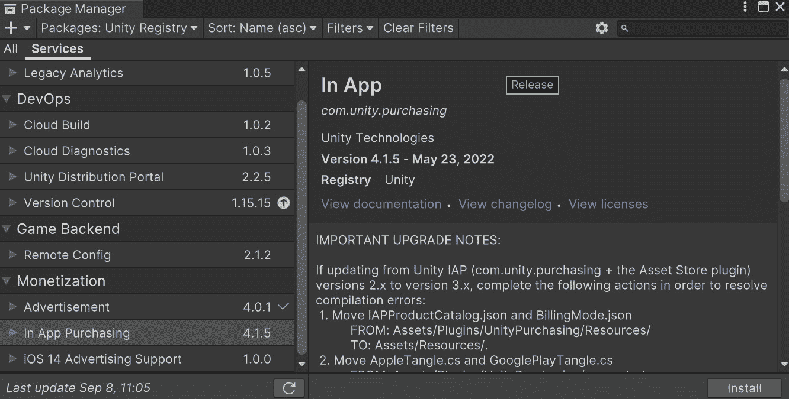

图 6.1：包管理器中的应用内购买选项

1.  将会弹出一个窗口，询问你是否确认要激活 **购买** 服务包。点击 **确定** 按钮。

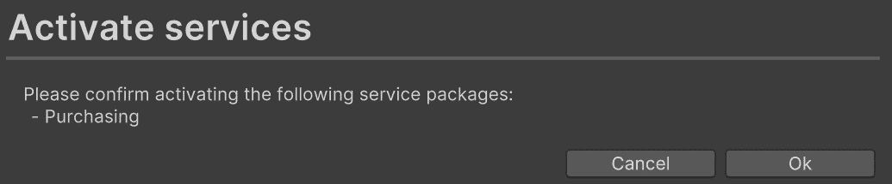

图 6.2：激活购买服务

1.  完成后，您可以关闭 **包管理器**，然后通过访问 **编辑** | **项目设置** 并进入 **服务** 部分来进入 **项目设置** 菜单。如果一切顺利，您应该看到一个 **应用内购买** 菜单部分。选择它，您应该会注意到它已被切换为开启状态。

重要提示

IAP 包是从主引擎外部创建的，因为代码旨在非常灵活，可以更新以适应任何需要的政策。然后我们只需更新包，而不是更新到 Unity 的最新版本，这在处理大型项目时可能非常重要。

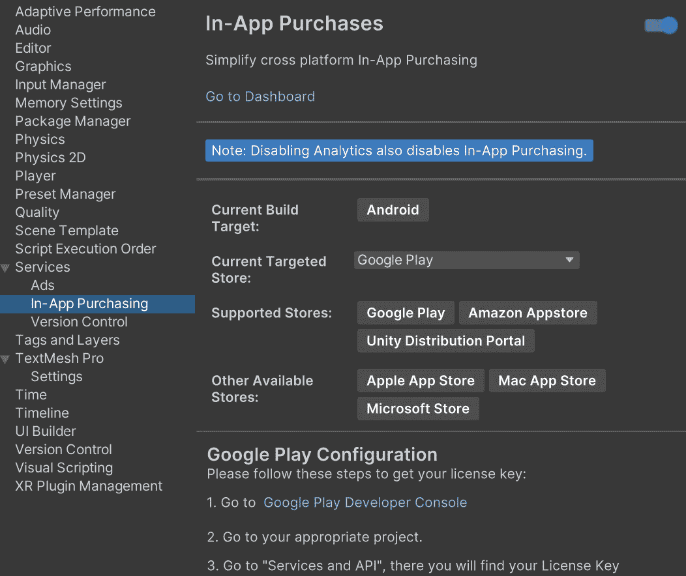

图 6.3：应用内购买已启用

现在我们已经将 IAP 系统引入到我们的项目中，我们可以利用它来为玩家创建第一个可购买对象。

## 创建我们的第一个购买

要创建我们的第一个应用内购买，我们将利用 Unity 项目中刚刚添加的一个功能，即无代码 IAP。它被称为无代码 IAP，因为您不需要为实际的 IAP 交易编写任何代码，只需编写定义用户在购买时获得什么的脚本。这是将 IAP 集成到 Unity 游戏中迄今为止最简单的方法，也是在我们项目中尝试 IAP 的好方法。

最常见的 IAP 之一是能够在移动游戏中禁用广告。使用以下步骤，让我们通过创建一个按钮来添加这个功能，当点击该按钮时，将禁用广告：

1.  通过访问 `Assets/Scenes` 文件夹，并双击 `MainMenu` 文件来打开主菜单层级。

1.  从那里，如果尚未在**场景**窗口中，请返回，然后单击**2D**按钮进入 2D 模式，因为我们将处理 UI。

1.  我们首先需要有一些东西可以出售，为此，我们将使用 IAP 目录，我们可以通过转到**服务** | **内购** | **IAP 目录…**来访问它：

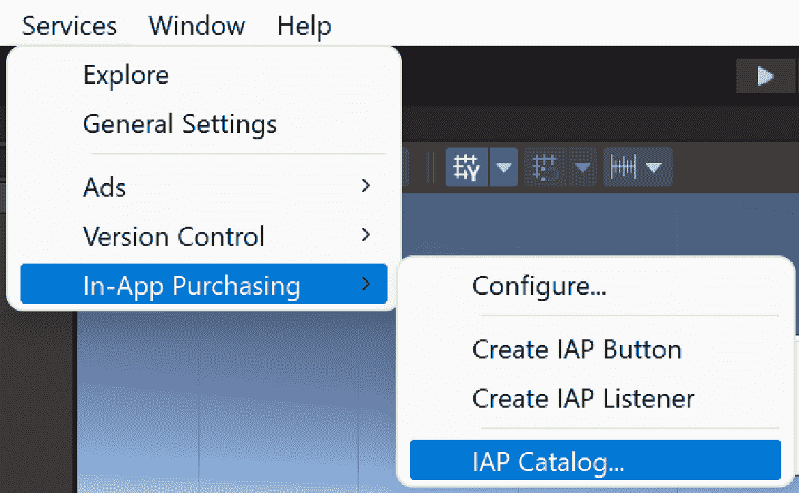

图 6.4：打开 IAP 目录

一旦到达菜单，它应该看起来像这样：

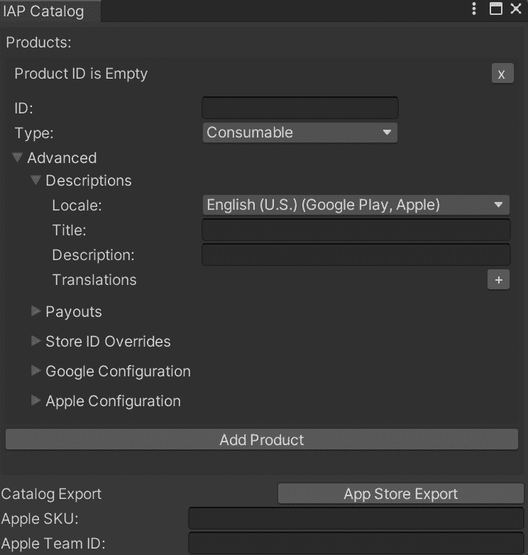

图 6.5：IAP 目录

现在，我们首先需要为我们的产品创建一个 ID，这是我们将在不同的应用商店中识别我们的产品的方式。在我们的例子中，让我们使用`removeAds`。然后，在**类型**下，将其更改为**非消耗品**：

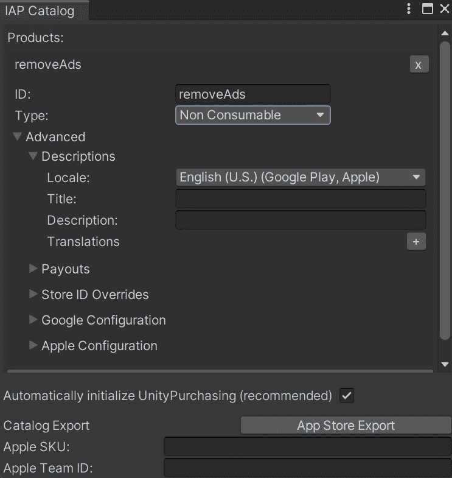

图 6.6：创建 IAP

我们所说的非消耗品是指玩家只需购买一次，游戏会记住这一点以备后用。其他的是消耗品，这意味着它们用于可以重复购买的东西，例如特殊增强和订阅。这些提供了一定时间内的内容访问权限，可能直到用户取消为止。

4. 接下来，我们可以通过单击窗口右上角的**X**来关闭**IAP 目录**。

5. 在**层次结构**窗口中选择**Canvas - Scale Physical**对象。从那里，选择**服务** | **内购** | **创建 IAP 按钮**，我们应该在我们的场景中看到一个新按钮被创建：

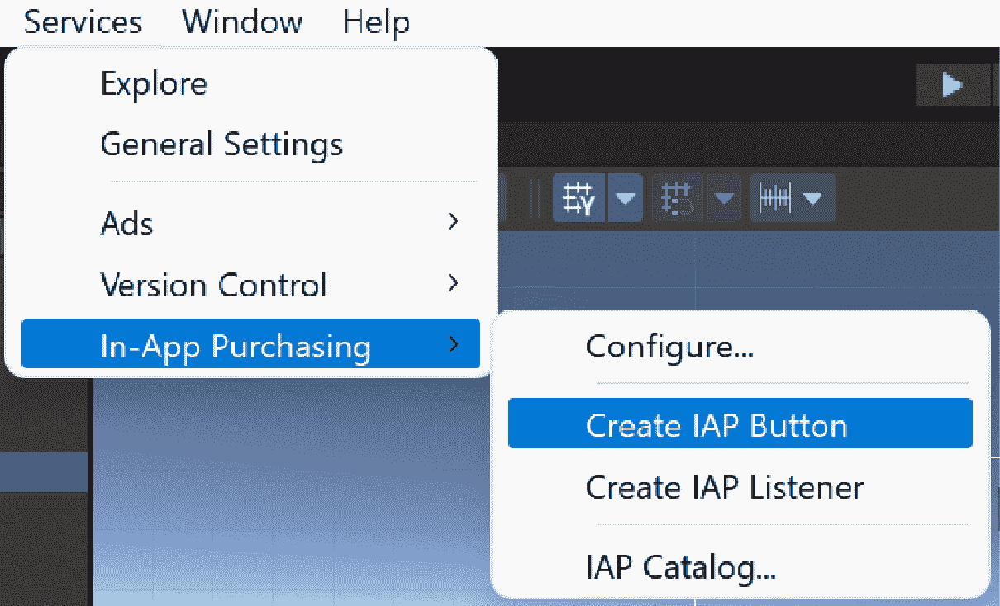

图 6.7：创建 IAP 按钮

此按钮将用于执行内购以移除游戏中的广告。当前按钮使用 Unity 的旧版文本系统，但可以轻松调整以使用`TextMeshPro`。

为了确保**开始**和**移除广告**按钮都能正确显示在屏幕上，我们将创建一个可以容纳这两个按钮的菜单。这意味着我们需要为我们的安全区域面板创建另一个面板作为子面板。

从`SafeAreaHolder`。

6. 之后，创建一个子`SafeAreaHolder`，并让它像之前一样填充整个屏幕。添加一个`10`。

7. 然后，添加一个**内容大小适配器**组件，并将**垂直适配**和**水平适配**字段设置为**首选大小**。

8. 将新添加的按钮重命名为`Remove Ads Button`，然后在`Remove` `Ads`处添加一个`10`。

小贴士

关于这些说明的含义以及每个步骤的作用的提醒，请参阅*第四章*，*分辨率无关 UI*。

1.  最后，将两个按钮拖放到**面板**对象上，**播放**按钮在上半部分，**移除广告**按钮在其下方，如下所示：

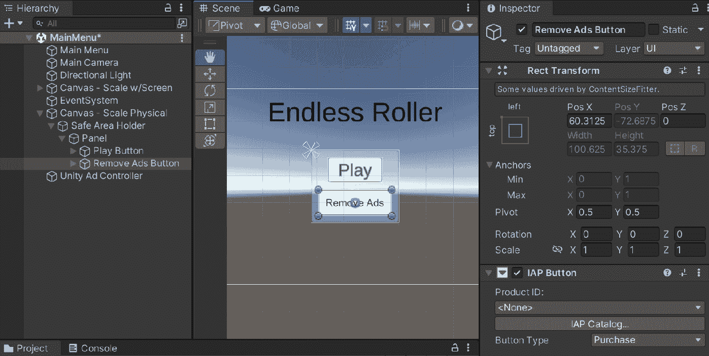

图 6.8：将移除广告按钮添加到场景中

1.  接下来，`IAP Button`类有一个**购买完成（产品）**函数，它的工作方式与我们在过去使用**Button**组件时使用的**On Click**类似。考虑到这一点，我们需要创建一个当玩家按下按钮时我们希望调用的函数。

在*第七章**，*使用 Unity Ads 进行广告投放*中，我们在`UnityAdController`类内部创建了一个名为`showAds`的`static`变量。我们将使用这个变量来检查是否应该显示广告。

我们需要打开`MainMenuBehaviour`脚本，并将以下函数添加到类中：

```kt
public void DisableAds()
{
    UnityAdController.showAds = false;
    /* Used to store that we shouldn't show ads */
    PlayerPrefs.SetInt("Show Ads", 0);
}
protected virtual void Start()
{
    /* Initialize the showAds variable */
    bool showAds = (PlayerPrefs.GetInt("Show Ads", 1)
        == 1);
    UnityAdController.showAds = showAds;
}
```

在这里，我们正在使用 Unity 的`PlayerPrefs`系统来保存是否应该向玩家显示广告。`PlayerPrefs`很酷，因为它可以在游戏的多次游玩之间保存信息，并且常用于如高分和玩家偏好设置（因此得名）。为了测试重置属性，你可以进入`PlayerPrefs`，如果应用被卸载或应用数据被清除，它可能会被移除，因此我们稍后会添加一个**恢复购买**按钮，允许玩家在允许的平台恢复他们的购买。对于不允许的平台，你需要向服务器发起 API 调用以检查当前用户是否已经购买了不可消耗的内购项目。更多细节将在本章的**添加恢复购买按钮**部分中介绍。

注意

关于`PlayerPrefs`的更多信息，请查看[`docs.unity3d.com/ScriptReference/PlayerPrefs.html`](https://docs.unity3d.com/ScriptReference/PlayerPrefs.html)。

注意，我将`Start`函数设置为`virtual`，这意味着继承的类也可以将其用作自己脚本的基石。我们还标记了该函数为`protected`，它与`private`函数的作用相同，但它也可以在子类中访问。

1.  考虑到这一点，我们还需要更新`PauseScreenBehaviour`的`Start`函数，如下所示：

    ```kt
    protected override void Start()
    {
        /* Initialize Ads if needed */
        base.Start();
        if (!UnityAdController.showAds)
        {
            /* If not showing ads, just start the game */
            SetPauseMenu(false);
        }
    }
    ```

`override`关键字将替换`Start`的默认行为。然而，当我们调用`base.Start()`时，我们确保了`MainMenuBehaviour`中的先前内容将被调用——在这种情况下，我们确保`UnityAdController`设置了正确的值。

1.  最后，我们需要调整`ObstacleBehaviour`脚本以处理不播放广告的情况。更新`ShowContinue`函数如下：

    ```kt
        // Other code above...
        /* Come back after 1 second and check again */
        yield return new WaitForSeconds(1f);
    }
    else if (!UnityAdController.showAds)
    {
        /* It's valid to click the button now */
        contButton.interactable = true;
        /* If player clicks on button we want to just
           continue */
        contButton.onClick.AddListener(Continue);
        UnityAdController.obstacle = this;
        /* Change text to allow continue */
        btnText.text = "Free Continue";
        /* We can now leave the coroutine */
        break;
    }
    else
    {
        /* It's valid to click the button now */
        contButton.interactable = true;
        // More code below...
    ```

1.  我们还需要对`ResetGame`方法进行轻微调整，通过删除或注释以下行：

    ```kt
    /*If we find the button, we can use it */
    if (continueButton)
    {
        //if (UnityAdController.showAds)
        //{
            // If a player clicks on a button, we want to
               play an ad
            // and then continue
            StartCoroutine(ShowContinue(continueButton));
        //}
        //else
        //{
            /* If we can't play an ad, no need for the
               continue button */
        //    continueButton.gameObject.SetActive(false);
        //}
    }
    ```

1.  保存你的脚本并进入 Unity。

1.  从`Main Menu`对象到**Runtime Only**下拉菜单下的小框。然后，从右侧下拉菜单中选择**Main Menu Behaviour** | **DisableAds**：

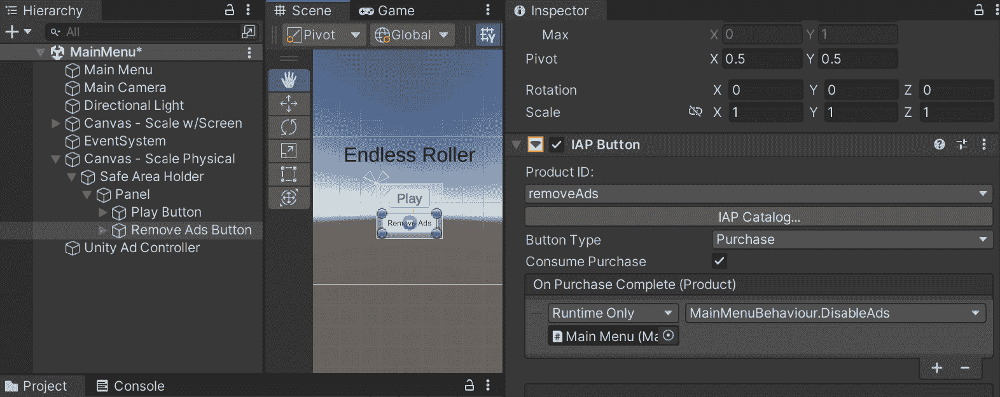

图 6.9：将 DisableAds 函数调用添加到购买

1.  现在，保存我们的场景并开始游戏：

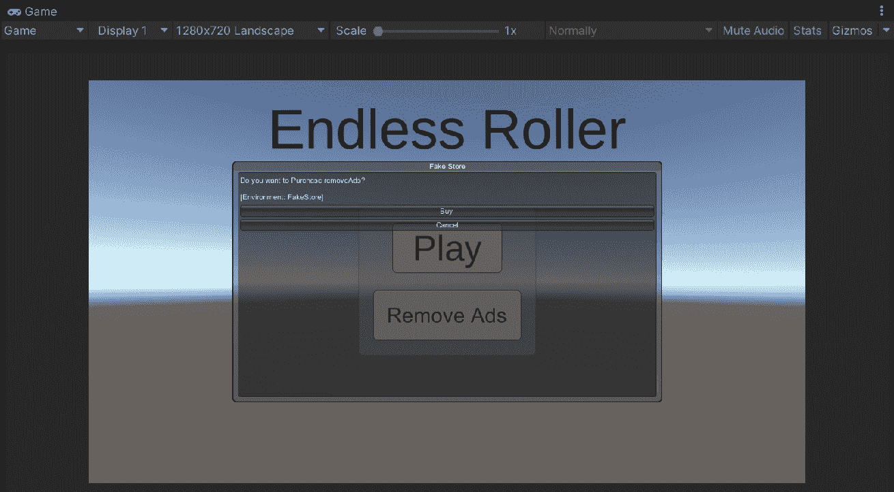

图 6.10：购买菜单看起来工作正常

现在，如果我们点击**移除广告**按钮，它会询问我们是否想要进行购买。如果我们这样做，它将确保当我们进入游戏时，没有广告。同样，现在当我们死亡时，它将显示一个**免费** **继续**按钮：

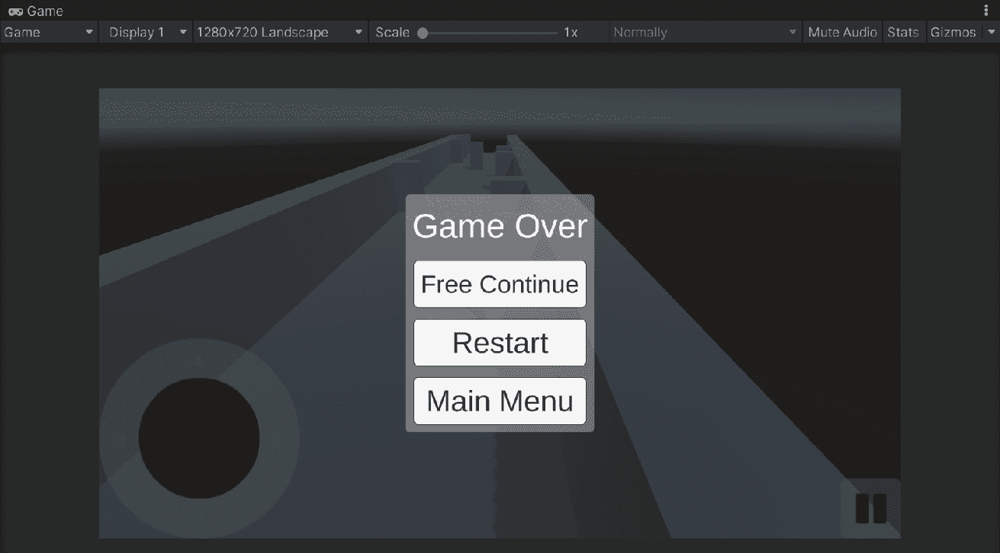

图 6.11：确保购买工作正常

有了这个，我们现在已经在 Unity 中创建了一个简单的购买。

注意

如果你想要了解更多关于无代码 IAP 的信息，请查看[`docs.unity3d.com/Manual/UnityIAPCodelessIAP.html`](https://docs.unity3d.com/Manual/UnityIAPCodelessIAP.html)。

有了这个，你现在可以构建你想要在游戏中拥有的任何产品。然而，某些平台对恢复先前购买的功能也有要求。在下一节中，我们将看到如何做到这一点。

# 添加一个恢复购买的按钮

在支持它的平台上（特别是 Google Play 和通用 Windows 应用程序），如果你购买了某个产品，卸载，然后使用 Unity IAP 重新安装游戏，它将自动恢复用户在重新安装后的第一次初始化期间拥有的任何产品。

对于 iOS 用户，由于苹果要求他们在之前重新验证密码，因此用户必须能够通过按钮恢复他们的购买。如果不这样做，将阻止我们的游戏在 iOS 应用商店被接受，所以如果我们希望在那里部署，包含这个功能是个好主意。让我们看看如何做到这一点：

1.  前往**层次结构**窗口并选择**移除广告按钮**对象。一旦选中，通过按*Ctrl +* *D*来复制它。

1.  通过选择它并在**检查器**窗口中将名称更改为`Restore Button`来更改副本的名称。

1.  从`恢复购买`也是如此。

1.  现在，选择**恢复**对象，然后在**IAP 按钮**组件中，转到**按钮类型**并选择**恢复**：

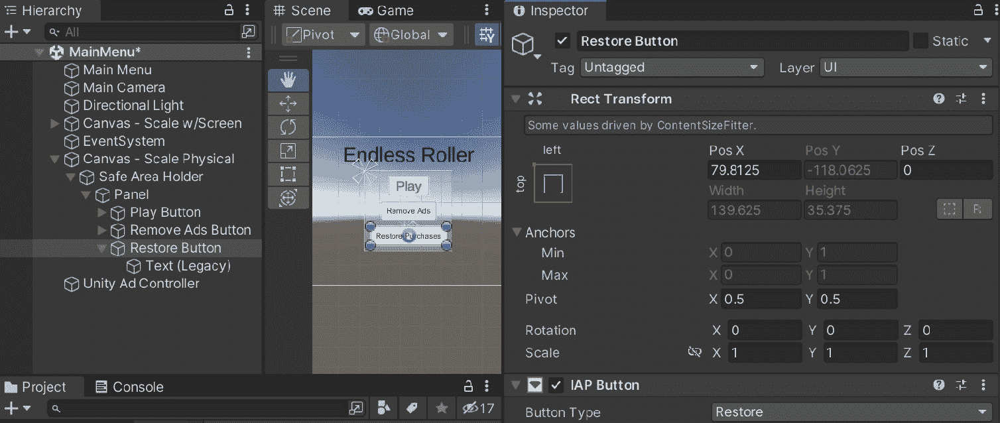

图 6.12：添加恢复按钮

你应该注意，**IAP 按钮**组件的属性已经更改，现在只能设置**按钮类型**，因为没有其他可以自定义的内容。

1.  保存你的场景并跳入 Unity。

1.  当你开始游戏并尝试点击**恢复**时，你会在**控制台**窗口看到一个警告，指出这不是一个受支持的平台：

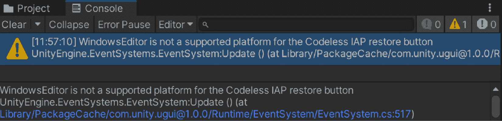

图 6.13：尝试在 Windows 上恢复时的警告

因此，考虑到这一点，我们可以调整我们的游戏，使得按钮只有在当前运行在受支持的平台上时才会显示。

1.  前往`脚本`文件夹，创建一个名为`RestoreAdsChecker`的 C#脚本。一旦打开，使用以下脚本：

    ```kt
    using UnityEngine;
    /// <summary>
    /// Will show or remove a button depending on whether
    /// we can restore ads or not
    /// </summary>
    public class RestoreAdsChecker : MonoBehaviour
    {
        // Use this for initialization
        void Start()
        {
            bool canRestore = false;
            switch (Application.platform)
            {
                // Windows Store
                case RuntimePlatform.WSAPlayerX86:
                case RuntimePlatform.WSAPlayerX64:
                case RuntimePlatform.WSAPlayerARM:
                // iOS, OSX, tvOS
                case RuntimePlatform.IPhonePlayer:
                case RuntimePlatform.OSXPlayer:
                case RuntimePlatform.tvOS:
                    canRestore = true;
                    break;
            }
            gameObject.SetActive(canRestore);
        }
    }
    ```

此脚本遍历 Unity 的`IAPButton`类中列出的所有商店，如果它们是可以恢复的，我们将`canRestore`设置为`true`；否则，它将保持`false`。最后，如果我们无法恢复它，我们将删除对象，而无需为不同的构建创建特定的事物。

1.  保存脚本并返回 Unity。

1.  将我们新创建的`RestoreAdsChecker`组件附加到**恢复****按钮**对象：

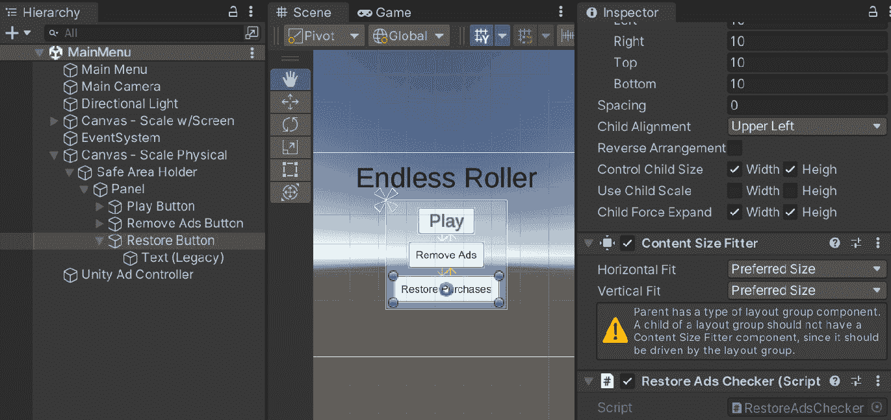

图 6.14：添加 Restore Ads Checker 组件

1.  保存您的项目并启动游戏：

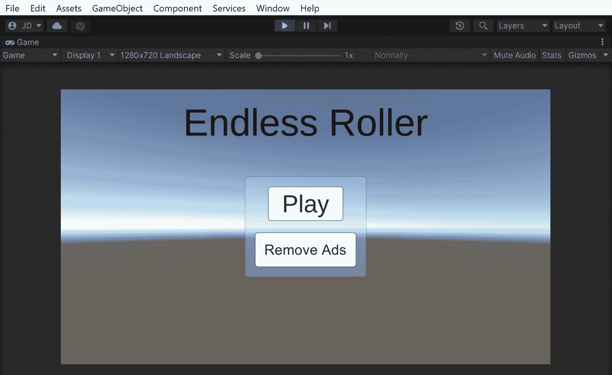

图 6.15：RestoreAdsChecker 组件的结果

现在，由于我们在游戏的 PC 构建中添加了**RestoreAdsChecker**组件，**恢复**按钮不会显示，但如果我们导出为 iOS，它将显示在我们的设备上！

注意

关于恢复交易和该功能如何工作的更多信息，请查看[`docs.unity3d.com/Manual/UnityIAPRestoringTransactions.html`](https://docs.unity3d.com/Manual/UnityIAPRestoringTransactions.html)。

这样可以确保我们的游戏在每个支持该特性的不同平台上都有这个特定的功能。考虑到这一点，我们将接下来查看一些具体的商店和位置，您可能希望在游戏中添加对 IAP 的支持。

## 配置您选择的商店的购买

很遗憾，书中没有足够的空间一步一步地介绍每个商店的过程，但我有一些页面可以供您参考，以了解以下商店的整个流程：

+   苹果应用商店和 Mac 应用商店：[`docs.unity3d.com/Manual/UnityIAPAppleConfiguration.html`](https://docs.unity3d.com/Manual/UnityIAPAppleConfiguration.html)

+   Google Play 商店：[`docs.unity3d.com/Manual/UnityIAPGoogleConfiguration.html`](https://docs.unity3d.com/Manual/UnityIAPGoogleConfiguration.html)

+   Windows 商店：[`docs.unity3d.com/Manual/UnityIAPWindowsConfiguration.html`](https://docs.unity3d.com/Manual/UnityIAPWindowsConfiguration.html)

+   亚马逊应用商店：[`docs.unity3d.com/Manual/UnityIAPAmazonConfiguration.html`](https://docs.unity3d.com/Manual/UnityIAPAmazonConfiguration.html)

当尝试使用相同的构建发布到多个 Android IAP 商店（如三星和谷歌）时，可能会遇到一些潜在问题。您可以在[`docs.unity3d.com/Manual/UnityIAPCrossStoreInstallationIssues.html`](https://docs.unity3d.com/Manual/UnityIAPCrossStoreInstallationIssues.html)找到解决这些问题的信息。

# 摘要

在本章中，我们介绍了如何通过在项目中使用 Unity 来创建内购项目。我们首先讲解了如何设置 Unity 的内购系统，然后深入探讨了如何使用无代码内购轻松添加可购买项目到游戏中。接着，我们创建了在卸载和重新安装游戏时恢复购买的功能，并讨论了根据我们想要的目标商店，我们可以去哪里设置我们的购买。这些新技能使您能够从游戏中获得额外收入，同时允许您针对多个商店和平台，使更多的人能够看到它。

当然，拥有所有这些赚钱的方式，如果没有人玩我们的游戏，那也是无济于事的。在下一章中，我们将学习如何利用社交媒体分享我们的得分，并吸引其他玩家对我们游戏标题的兴趣。

进一步阅读

想要了解更多关于提升免费增值策略的小技巧，我建议您阅读 Pepe Agell 在[`www.chartboost.com/blog/inapp-purchases-for-indie-mobile-games-freemium-strategy`](https://www.chartboost.com/blog/inapp-purchases-for-indie-mobile-games-freemium-strategy)上发表的文章。
