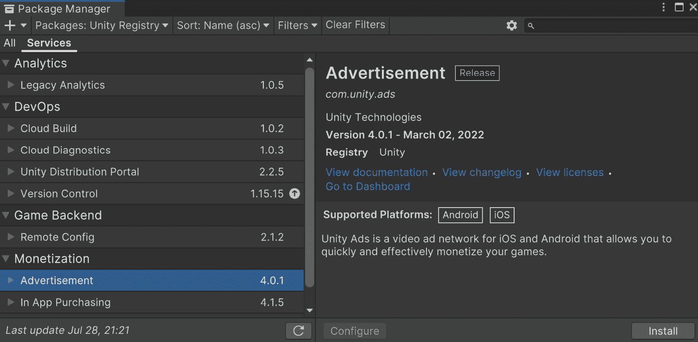
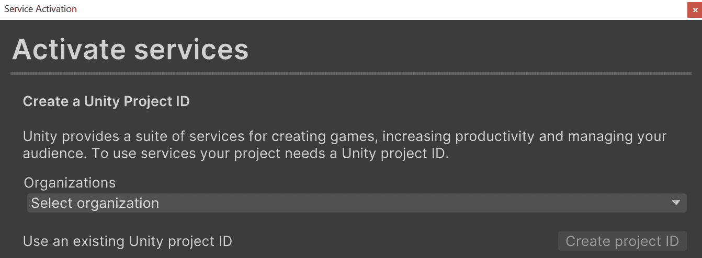
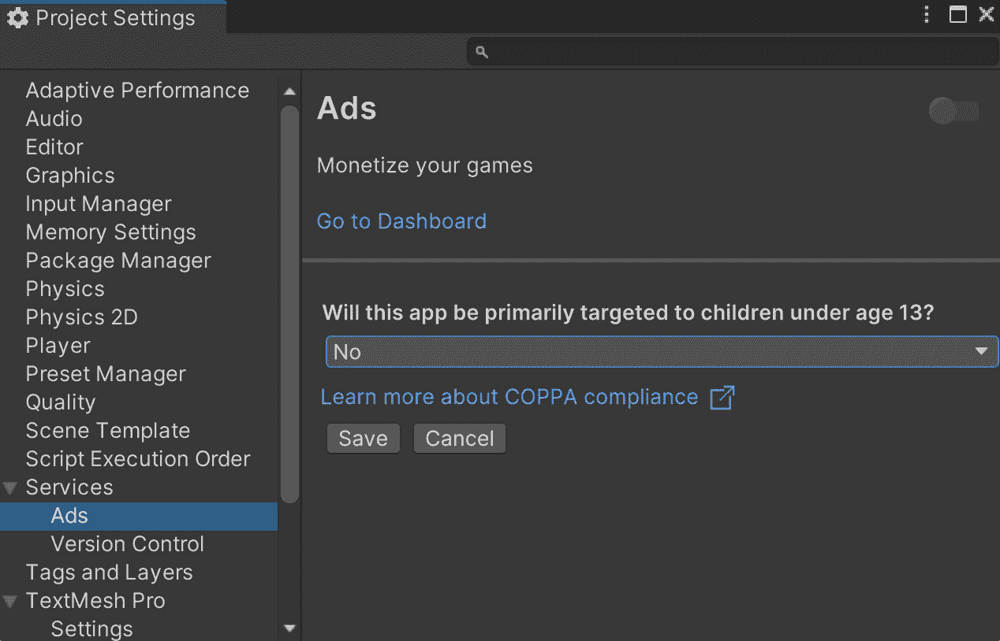
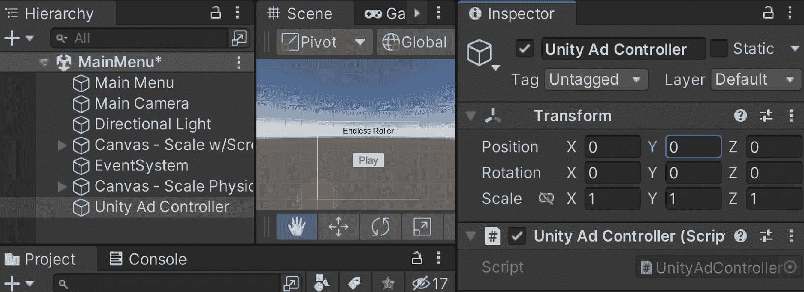
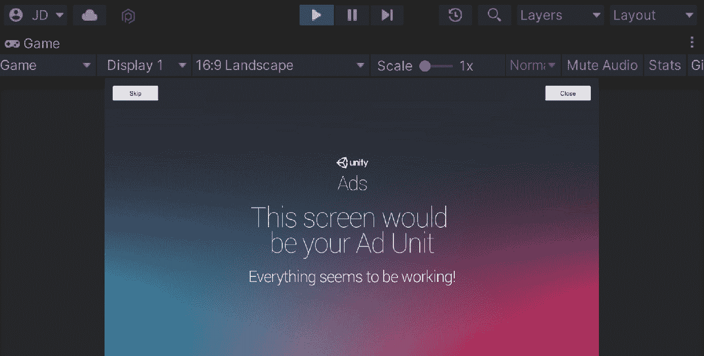
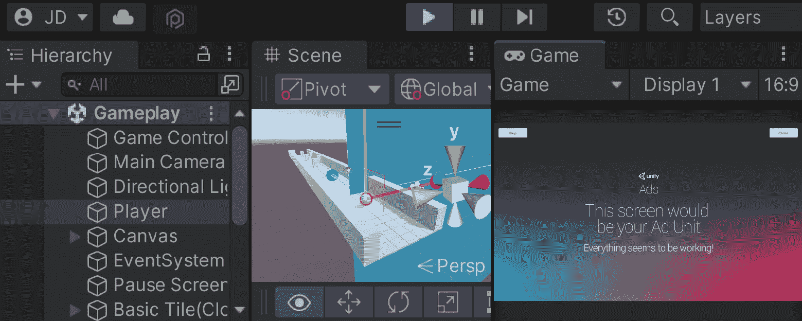
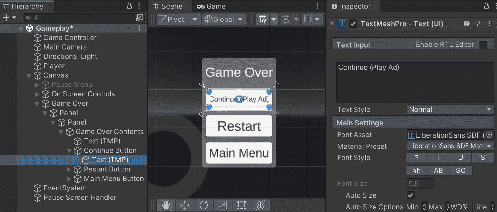
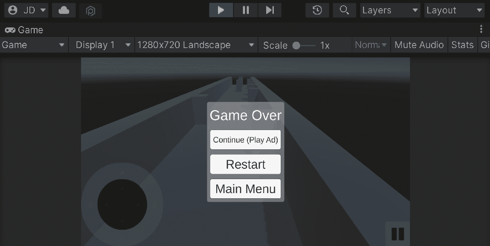
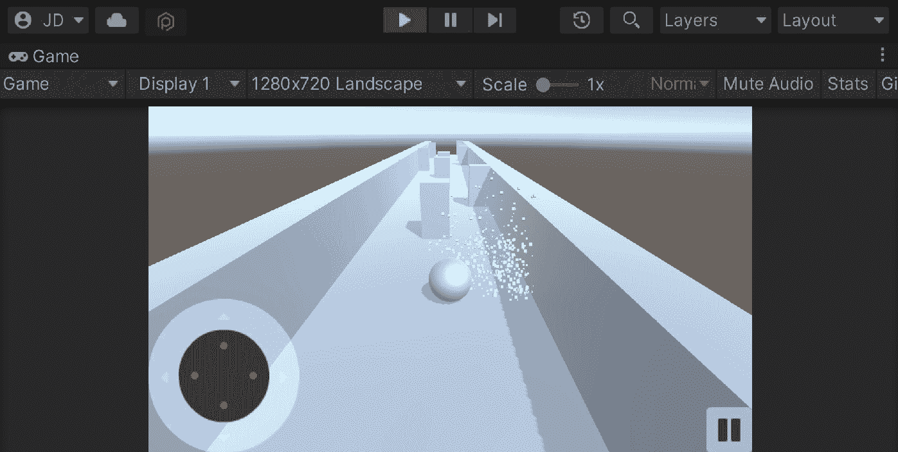
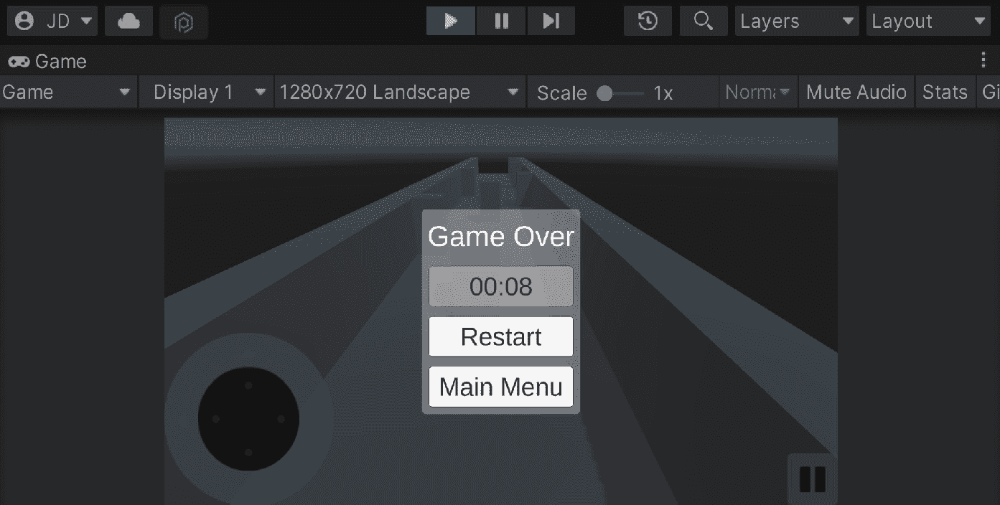

# 7

# 使用 Unity Ads 进行广告

当您在制作移动游戏时，您需要考虑您将如何销售您的游戏。决定如何最好地销售游戏可能很困难。当然，您可以以价格出售您的游戏，并且有可能成功，但您将限制您的受众数量到一个非常低的水平。这可能对细分市场游戏很有用，但如果您试图制作一款具有广泛吸引力的游戏，您希望尽可能多的玩家玩您的游戏，您可能会遇到一些问题。

游戏定价可能成为吸引初始顾客的主要障碍，这些顾客将通过口碑分享游戏并帮助更多人玩您的游戏。为了解决这个潜在问题，您确实有选择将您的游戏免费化的选项。

之后，您可以在玩家玩游戏时给他们提供购买物品或展示广告的机会。

这并不是说在免费游戏中放很多广告就是最好的选择。广告过多，甚至是不合适的广告，可能会驱使用户离开，这可能会更糟。许多开发者都有自己的观点，关于是否使用广告是个好主意，但这不是本章的目的。在本章中，我们将探讨我们在游戏过程中可用的不同广告选项，并展示如何实现它们，如果您选择将此内容添加到您的游戏中。

本章分为几个主题。它包含一个从开始到结束的简单分步过程。以下是我们任务的概述：

+   设置 Unity Ads

+   创建一个简单的广告

+   添加内联回调方法

+   带有奖励的选择加入广告

+   集成冷却计时器

在本章中，我们将 Unity Ads 框架集成到我们的项目中，并学习如何创建简单和复杂的广告版本。这是通过首先设置 Unity 的 Ads 系统，然后创建一个简单的广告，在添加额外的回调选项之前完成。然后我们将看到如何通过利用选择加入奖励和添加冷却计时器来防止玩家观看过多的广告，从而为观看广告提供额外的激励。

# 技术要求

本书使用 Unity 2022.1.0b16 和 Unity Hub 3.3.1，但步骤应该在未来编辑器版本中只需做最小改动即可。如果您想下载本书中使用的确切版本，并且有新版本发布，您可以访问 Unity 的下载存档[`unity3d.com/get-unity/download/archive`](https://unity3d.com/get-unity/download/archive)。您也可以在**Unity 编辑器系统** **要求**部分找到 Unity 的系统要求[`docs.unity3d.com/2022.1/Documentation/Manual/system-requirements.html`](https://docs.unity3d.com/2022.1/Documentation/Manual/system-requirements.html)。

您可以在 GitHub 上找到本章中存在的代码文件，地址为[`github.com/PacktPublishing/Unity-2022-Mobile-Game-Development-3rd-Edition/tree/main/Chapter06%20and%2007`](https://github.com/PacktPublishing/Unity-2022-Mobile-Game-Development-3rd-Edition/tree/main/Chapter06%20and%2007)。

# 设置 Unity 广告

Unity Ads 是一个针对 iOS 和 Android 的视频广告网络，可以通过展示广告来货币化您现有的玩家基础。Unity Ads 提供可以以奖励或非奖励形式展示的视频广告。正如其名所示，奖励广告将给用户带来奖励或激励，这有助于他们在玩游戏时。在我们能够启用 Unity Ads 之前，我们必须首先启用 Unity 的服务套件。要激活 Unity 服务，您必须将项目链接到 Unity 服务项目 ID，这是 Unity 区分您创建的不同项目的方式。那么，让我们看看如何操作：

1.  通过访问**窗口 | 通用 | 服务**或按*Ctrl* + *0*打开**服务**窗口。这将打开 Unity 包管理器，并自动选择**广告**选项：



图 7.1 – Unity 包管理器中的广告选项

1.  点击**安装**按钮并等待其完成安装。安装完成后，您应该看到一个看起来像以下窗口的窗口：



图 7.2 – 服务激活窗口

您也可以在安装包后通过访问**服务 | 广告 | 配置**来访问此菜单。

假设您之前没有使用过 Unity 服务，您将需要创建**组织**和**项目名称**详情。

1.  点击下拉菜单，选择您的用户名，然后点击**创建项目 ID**按钮。项目名称在您首次创建项目时自动根据项目名称创建，但您可以在**服务**窗口的**设置**部分更改此名称。

重要提示

Unity 会自动使用您的账户用户名创建一个组织；然而，如果您需要创建另一个组织，您可以在[`id.unity.com/organizations`](https://id.unity.com/organizations)进行操作。

1.  您将被问到关于您游戏的问题。如果您的游戏不是针对儿童的，请从下拉菜单中选择**否**，然后点击**保存**按钮。否则，选择**是**，然后点击**保存**。

重要提示

当你表明你的游戏是为 13 岁以下的儿童设计的，广告将不会对你的游戏中的用户进行行为定位。行为定位可以通过展示与用户更相关的广告来提高**每千次展示的有效成本**（**eCPM**），但由于**儿童在线隐私保护规则法案（COPPA）**的规定，其使用在 13 岁以下的用户中是被禁止的。有关更多信息，请查看[`forum.unity.com/threads/age-designation.326930/`](https://forum.unity.com/threads/age-designation.326930/)。



图 7.3 – 回答 COPPA 合规性问题

1.  然后，当切换到**广告**菜单时，点击右上角的切换按钮来开启它。此时应该已经开启了广告。

1.  如果你向下滚动，你会看到一个名为**游戏 ID**的属性；记下这些值，因为我们将在游戏开始时初始化 Unity Ads 时需要它们。

1.  为了开始，一个好的做法是将所有与广告相关的行为共享到一个脚本中，因此我们将通过访问`Assets/Scripts`文件夹，并选择**创建** | **C# 脚本**来创建一个新的类，名为`UnityAd Controller`。

1.  打开你选择的 IDE 中的文件，并使用以下代码：

    ```kt
    using UnityEngine;
    using UnityEngine.Advertisements; /* Advertisement class */
    public class UnityAdController : MonoBehaviour
    {
        /// <summary>
        /// If we should show ads or not
        /// </summary>
        public static bool showAds = true;
        /// <summary>
        /// Replace with your actual gameId
        /// </summary>
        private string gameId = "1234567";
        /// <summary>
        /// If the game is in test mode or not
        /// </summary>
        private bool testMode = true;
        /// <summary>
        /// Unity Ads must be initialized or else ads will
        /// not work properly
        /// </summary>
        private void Start()
        {
            /* No need to initialize if it already is done
            */
            if (!Advertisement.isInitialized)
            {
                Advertisement.Initialize(gameId,
                    testMode);
            }
        }
    }
    ```

之前的代码执行了多项操作。我们首先声明我们正在使用`UnityEngine.Advertisments`命名空间来获取对`Advertisement`类的访问权限。如果你只想实现视频、横幅和插屏广告来作为你的盈利策略，这是 Unity 建议使用的 API。除此之外，为了使用 Unity Ads，你必须调用`Advertisement.Initialize`函数，我在这个对象的`Start`函数中进行了调用。

1.  从`GameObject`（`Unity Ad Controller`）。一旦创建，将**Unity Ad Controller**脚本附加到它上：



图 7.4 – 创建 Unity Ad Controller 对象

1.  由于此对象是在**主菜单**级别生成的，它会在游戏开始时加载，这对于我们打算使用的功能来说非常合适。

到目前为止，我们已经完成了利用 Unity Ads 所需的设置过程，通过启用 Unity Analytics 然后开启**广告**菜单。设置完成后，我们现在可以继续向我们的项目中添加一个简单的广告。

# 显示一个简单的广告

广告是玩家玩游戏时可能产生收入的一种方式。如前所述，Unity Ads 有两种不同的广告类型我们可以展示：简单广告和奖励广告。简单广告易于使用，因此得名，并允许用户拥有简单的全屏插屏广告。这在玩家在关卡之间移动或玩家想要重新开始游戏时非常有用。现在让我们看看我们如何实现这个功能。执行以下步骤：

1.  要开始，我们需要向`UnityAdController`类中添加一个新函数：

    ```kt
    /// <summary>
    /// Will get the appropriate Ad ID for the platform we
    /// are on
    /// </summary>
    /// <returns>A usable Ad ID</returns>
    private static string GetAdID()
    {
        string adID = "Interstitial_";
        if (Application.platform ==
            RuntimePlatform.IPhonePlayer)
        {
            adID += "iOS";
        }
        else
        {
            adID += "Android";
        }
        return adID;
    }
    /// <summary>
    /// Will load and display an ad on the screen
    /// </summary>
    public static void ShowAd()
    {
        // Load an Ad to play
        Advertisement.Load(GetAdID());
        // Display it after it is loaded
        Advertisement.Show(GetAdID());
    }
    ```

在这里，我们创建了一个名为`ShowAd`的静态方法。我们将其设置为静态，这样我们就可以在不实际创建这个类的实例的情况下调用该函数。该函数将广告加载到内存中，然后，当它准备好时，我们将调用`Show()`函数来在屏幕上显示它。我们还创建了一个名为`GetAdID`的辅助函数，以便根据我们部署的平台提供正确的广告类型。

1.  保存你的脚本，然后打开`MainMenuBehaviour`文件，并添加以下高亮代码：

    ```kt
    /// <summary>
    /// Will load a new scene upon being called
    /// </summary>
    /// <param name="levelName">The name of the level we
    /// want to go to</param>
    public void LoadLevel(string levelName)
    {
        if (UnityAdController.showAds)
        {
            /* Show an ad */
            UnityAdController.ShowAd();
        }
        SceneManager.LoadScene(levelName);
    }
    ```

如果支持，每次我们调用`LoadLevel`函数时，都会播放一条广告。我们还添加了一个具有默认值的新参数。这个功能的好处是我们可以选择性地决定何时显示广告。

例如，我们可能希望当游戏重新启动时，不要播放广告。

1.  现在我们来看看实际操作。玩完游戏后，点击**播放**按钮：



图 7.5 – 显示的广告示例

如前一个截图所示，广告工作正常。这是在编辑器中玩游戏时显示的屏幕。它有按钮，允许我们测试玩家是否跳过或完整观看视频。当我们禁用测试模式时，我们将看到实时的视频广告。

如果你进入游戏后打开暂停菜单并点击**主菜单**按钮，你也会看到这种情况发生。

重要提示

如果这不起作用或没有显示，请检查你之前学到的**玩家设置**菜单，并确保你的当前平台设置为 Android 或 iOS。

这为我们提供了在游戏中显示广告的最简单方法，但为了确保我们的广告能够正常工作，我们还需要做很多事情，我们将在下一部分讨论。

重要提示

可以使用的另一种广告类型是横幅广告。这些广告与默认广告类似，但在调用`GetAdID`时，你会使用`Banner`而不是`Interstitial`。

更多信息请参阅[`docs.unity.com/monetization-dashboard/AdUnits.html`](https://docs.unity.com/monetization-dashboard/AdUnits.html)。

# 利用广告回调方法

我们为`LoadLevel`函数编写的代码在进入游戏主菜单时运行得很好；然而，如果我们从主菜单直接进入游戏本身，游戏仍然会在后台运行，广告会阻止玩家玩游戏。

当你在实际移动设备上运行你的应用时，Unity 项目会在显示 Unity Ads 时暂停。然而，如果你在 Unity 编辑器中进行测试，游戏在显示占位符广告时不会暂停。但是，我们可以使用`Advertisement.ShowOptions`类来模拟这种行为。

当广告显示时，我们将暂停游戏，一旦广告结束，我们将恢复游戏。为此，请执行以下步骤：

1.  让我们先打开`UnityAdController`类，并添加以下变量，然后将`Start`函数更新为以下内容：

    ```kt
    /// <summary>
    /// A static reference to this object
    /// </summary>
    public static UnityAdController instance;
    /// <summary>
    /// Unity Ads must be initialized or else ads will not
    /// work properly
    /// </summary>
    private void Start()
    {
        /* No need to initialize if it already is done */
        if (!Advertisement.isInitialized)
        {
            instance = this;
            // Use the functions provided by this to allow
            // custom
            Advertisement.Initialize(gameId, testMode);
        }
    }
    ```

`instance`变量将被用来给`Advertisement.Show`函数提供一个第二个参数来引用运行代码的对象。

1.  更新`ShowAd`函数以添加第二个参数到我们的函数中：

    ```kt
        /// <summary>
        /// Will load and display an ad on the screen
        /// </summary>
        public static void ShowAd()
        {
            // Load an Ad to play
            Advertisement.Load(GetAdID());
            // Display it after it is loaded
            Advertisement.Show(GetAdID(), instance);
        }
    ```

对于第二个参数，`Advertisement.Show`函数接受一个`IUnityAdsShowListener`对象。名称开头的`I`表示这是一个接口。这是 C#中的一个关键字，表示一种合同，承诺提供给此函数的内容包含接口所需的功能。

1.  现在更新类定义如下：

    ```kt
    public class UnityAdController : MonoBehaviour, IUnityAdsShowListener
    ```

通过添加逗号然后`IUnityAdsShowListener`，我们声明我们将实现`IUnityAdsShowListener`接口提供的方法。

在 C#中，每当我们在类定义中添加一个接口时，我们都在承诺将包含接口内部声明的所有方法的实现，如果我们不这样做，我们的代码将无法编译。这是必要的，因为稍后我们将传递一个类型为`IUnityAdsShowListener`的对象给 Unity 的代码，它将在适当的时候使用这些方法。

要查看这些方法，从您的 IDE 中，您可能可以右键单击`IUnityAdsShowListener`选项并选择**转到定义**。从那里，您可能看到以下内容：

```kt
namespace UnityEngine.Advertisements
{
    public interface IUnityAdsShowListener
    {
        void OnUnityAdsShowClick(string placementId);
        void OnUnityAdsShowComplete(
            string placementId,
                UnityAdsShowCompletionState
                    showCompletionState);
        void OnUnityAdsShowFailure(string placementId,
            UnityAdsShowError error, string message);
        void OnUnityAdsShowStart(string placementId);
    }
}
```

我们需要在我们的类中创建四个方法，具有完全相同的名称、参数和返回类型。

重要注意事项

关于接口及其在 C#中的工作方式，请查看[`www.tutorialsteacher.com/csharp/csharp-interface`](https://www.tutorialsteacher.com/csharp/csharp-interface)。

1.  完成此操作后，我们需要实现接口中使用的函数：

    ```kt
    #region IUnityAdsShowListener Methods
    /// <summary>
    /// This callback method handles logic for the ad
    /// starting to play.
    /// </summary>
    /// <param name="placementId">The identifier for the
        Ad Unit showing the content.</param>
    public void OnUnityAdsShowStart(string placementId)
    {
        /* Pause game while ad is shown */
        PauseScreenBehaviour.paused = true;
        Time.timeScale = 0f;
    }
    /// <summary>
    /// This callback method handles logic for the ad
    /// finishing.
    /// </summary>
    /// <param name="placementId">The identifier for the
    /// Ad Unit showing the content</param>
    /// <param name="showCompletionState">Indicates the
    /// final state of the ad (whether the ad was skipped
    /// or completed).</param>
    public void OnUnityAdsShowComplete(string placementId,
    UnityAdsShowCompletionState showCompletionState)
    {
        /* Unpause game when ad is over */
        PauseScreenBehaviour.paused = false;
        Time.timeScale = 1f;
    }
    /* This callback method handles logic for the user clicking on the ad. */
    public void OnUnityAdsShowClick(string placementId) { }
    /* This callback method handles logic for the Ad Unit failing to show. */
    public void OnUnityAdsShowFailure(string placementId, UnityAdsShowError error, string message) { }
    #endregion
    ```

在创建广告时，这四个函数中的每一个都会执行一些操作。值得注意的是`OnUnityAdsShowStart`方法，其中我们暂停游戏，然后是`OnUnityAdsShowComplete`方法，其中我们取消暂停。我们在这里使用区域是为了使代码的模块化更容易。

重要注意事项

关于`#region`块的更多信息，请查看[`docs.microsoft.com/en-us/dotnet/csharp/language-reference/preprocessor-directives/preprocessor-region`](https://docs.microsoft.com/en-us/dotnet/csharp/language-reference/preprocessor-directives/preprocessor-region)。

1.  接下来，我们将确保`PauseScreenBehaviour`不会覆盖这个新的更改。因此，我们将用以下内容替换`Start()`函数：

    ```kt
    void Start()
    {
        if (!UnityAdController.showAds)
        {
            /* If not showing ads, just start the game */
            SetPauseMenu(false);
        }
    }
    ```

前面的代码片段很重要，否则当我们在`Start`函数中告诉游戏暂停后，游戏将在关卡加载时立即关闭。这是游戏 PC 版本所需要的，因为没有其他方法可以取消暂停静态值。

1.  保存我们的脚本并重新启动游戏：



图 7.6 – 游戏暂停，直到玩家结束广告

这样，当我们从主菜单过渡到游戏时，我们将暂停游戏，直到我们准备好加入。现在我们已经了解了如何处理基本且非可选的广告，让我们给玩家提供观看广告以获得某种利益的机会。

# 奖励式广告

根据 AdColony 的数据，58%的移动开发者推荐的最合适的移动游戏广告形式是奖励视频广告。也就是说，我们将广告设置为一种可选体验，玩家可以选择观看广告并为此获得某种形式的奖励。这样，用户会感觉到是否观看广告是他们自己的选择，而且他们会更有动力观看，因为他们会从中获得一些东西。

奖励广告的位置通常会产生更高的**每千次展示有效成本（eCPM）**，因为它们通过允许用户在观看广告之前选择加入以换取一些游戏内奖励，从而提供了更多用户参与度。

注意

如果您想了解更多关于为什么推荐奖励广告的原因，请查看[`www-staging.adcolony.com/blog/2016/04/26/the-top-ads-recommended-by-mobile-game-developers/`](https://www-staging.adcolony.com/blog/2016/04/26/the-top-ads-recommended-by-mobile-game-developers/)。

在我们的游戏中，我们可以添加重新开始游戏或观看广告以继续游戏的选项。这意味着我们需要创建某种类型的菜单，以便玩家可以选择是否观看广告，所以让我们添加它：

1.  如果您还没有停止游戏，请先停止游戏，然后打开**游戏玩法**

1.  场景。之后，让我们创建一个`Game Over`菜单，然后关闭**暂停菜单**，以便我们可以清楚地看到**游戏结束**对象。为了更容易看到，您可以自由切换到我们之前在创建游戏 UI 元素时使用的 2D 模式。

1.  接下来，展开`Game Over Contents`并更改子`Game` `Over`。

1.  现在，将`Continue (Play Ad)`改为`Continue Button`并更改按钮对象的名称：



图 7.7 – 游戏结束菜单设置

1.  我们首先需要更新`ObstacleBehaviour`脚本以处理它；添加以下高亮代码：

    ```kt
    using UnityEngine;
    using UnityEngine.UI; // Button
    public class ObstacleBehaviour : MonoBehaviour
    {
    [Tooltip("How long to wait before restarting the game")] 
    public float waitTime = 2.0f;
    public GameObject explosion;
    private GameObject player;
    private void OnCollisionEnter(Collision collision)
    {
        // First check if we collided with the player
        if (collision.gameObject.GetComponent
            <PlayerBehaviour>())
        {
            // Destroy (Hide) the player
    collision.gameObject.SetActive(false);
            player = collision.gameObject;
            // Call the function ResetGame after waitTime
           // has passed 
           Invoke("ResetGame", waitTime);
        }
    }
    /// <summary>
    /// Will restart the currently loaded level
    /// </summary>
    private void ResetGame()
    {
        //Bring up restart menu
        var go = GetGameOverMenu();
        go.SetActive(true);
        // Get our continue button
        var buttons =
        go.transform.GetComponentsInChildren<Button> ();
        Button continueButton = null;
        foreach (var button in buttons)
        {
            if (button.gameObject.name == "Continue
                Button")
            {
                continueButton = button;
                break;
            }
        }
        // If we found the button we can use it
        if (continueButton)
        {
            if (UnityAdController.showAds)
            {
                // If player clicks on button we want to
                // play ad and then continue
                continueButton.onClick.AddListener
    (UnityAdController.ShowAd);
                UnityAdController.obstacle = this;
            }
            else
            {
                // If can't play an ad, no need for
                // continue button
               continueButton.gameObject.SetActive(false);
            }
        }
    }
    /// <summary>
    /// If the object is tapped, we spawn an explosion and
    /// destroy this object
    /// </summary>
    private void PlayerTouch()
    {
        if (explosion != null)
        {
            var particles = Instantiate(explosion,
                transform.position, Quaternion.identity);
            Destroy(particles, 1.0f);
        }
            Destroy(this.gameObject);
    }
    /// <summary>
    /// Retrieves the Game Over menu game object
    /// </summary>
    /// <returns>The Game Over menu object</returns>
    GameObject GetGameOverMenu()
    {
        var canvas = GameObject.Find("Canvas").transform;
        return canvas.Find("Game Over").gameObject;
    }
    /// <summary>
    /// Handles resetting the game if needed
    /// </summary>
    public void Continue()
    {
        var go = GetGameOverMenu();
        go.SetActive(false);
        player.SetActive(true);
        // Explode this as well (So if we respawn player
    // can continue) 
        PlayerTouch();
    }
    }
    ```

1.  首先，添加以下变量并更新`OnCollisionEnter`函数如下：

    ```kt
        /// <summary>
        /// A reference to the player object
        /// </summary>
        private GameObject player;
        private void OnCollisionEnter(Collision collision)
        {
            // First check if we collided with the player
            if (collision.gameObject.GetComponent
                <PlayerBehaviour>())
            {
                // Destroy the player
                //Destroy(collision.gameObject);
                // Destroy (Hide) the player
                player = collision.gameObject;
                player.SetActive(false);
                // Call the function ResetGame after
                // waitTime has passed
                Invoke("ResetGame", waitTime);
            }
        }
    ```

在这种情况下，我们移除了摧毁`player`对象的代码，并将其隐藏起来。我们这样做的原因是，如果玩家决定播放广告，我们就可以将其取消隐藏并正常继续游戏。

1.  接下来，我们将使用`Button`类，所以我们需要在`ObstacleBehaviour`脚本的顶部添加以下内容：

    ```kt
    using UnityEngine.UI;
    ```

1.  完成这些后，我们将更新`ResetGame`函数如下：

    ```kt
    /// <summary>
    /// Will restart the currently loaded level
    /// </summary>
    private void ResetGame()
    {
        //Bring up restart menu
        var go = GetGameOverMenu();
        go.SetActive(true);
        // Get our continue button
        var buttons =
           go.transform.GetComponentsInChildren<Button>();
        Button continueButton = null;
        foreach (var button in buttons)
        {
            if (button.gameObject.name == "Continue
                Button")
            {
                continueButton = button;
                break;
            }
        }
        /*If we found the button we can use it */
        if (continueButton)
        {
            if (UnityAdController.showAds)
            {
                // If player clicks on button we want to
                // play ad and then continue
                continueButton.onClick.AddListener(
                    UnityAdController.ShowAd);
                UnityAdController.obstacle = this;
            }
            else
            {
                /* If can't play an ad, no need for
                   continue button */
               continueButton.gameObject.SetActive(false);
            }
        }
    }
    ```

我们还会摧毁玩家所击中的物体。因此，如果我们重新启动游戏，那么玩家将能够从他们最初开始的地方重新开始。

1.  接下来，添加以下两个辅助函数：

    ```kt
    /// <summary>
    /// Retrieves the Game Over menu game object
    /// </summary>
    /// <returns>The Game Over menu object</returns>
    GameObject GetGameOverMenu()
    {
        var canvas = GameObject.Find("Canvas").transform;
        return canvas.Find("Game Over").gameObject;
    }
    /// <summary>
    /// Handles resetting the game if needed
    /// </summary>
    public void Continue()
    {
        var go = GetGameOverMenu();
        go.SetActive(false);
        player.SetActive(true);
        /* Explode this as well (So if we respawn player
           can continue) */
        PlayerTouch();
    }
    ```

考虑到这一点，我们还创建了一个`Continue`函数，这样我们就可以在需要时设置游戏继续。

1.  打开`UnityAdController`脚本，并在文件顶部添加以下变量声明：

    ```kt
    /// <summary>
    /// For holding the obstacle for continuing the game
    /// </summary>
    public static ObstacleBehaviour obstacle;
    ```

1.  之后，继续在`UnityAdController`脚本中，更新`OnUnityAdsShowComplete`函数如下：

    ```kt
    /// <summary>
    /// This callback method handles logic for the ad
    /// finishing.
    /// </summary>
    /// <param name="placementId">The identifier for the Ad Unit showing the content</param>
    /// <param name="showCompletionState">Indicates the final state of the ad (whether the ad was skipped or completed).</param>
    public void OnUnityAdsShowComplete(string placementId, UnityAdsShowCompletionState showCompletionState)
    {
        /* If there is an obstacle, we can remove it to
           continue the game */
        if (obstacle != null && showCompletionState ==
            UnityAdsShowCompletionState.COMPLETED)
        {
            obstacle.Continue();
        }
        /* Unpause game when ad is over */
        PauseScreenBehaviour.paused = false;
        Time.timeScale = 1f;
    }
    ```

我们首先检查是否有玩家撞击的障碍物。如果有，我们接着检查由函数提供的`showCompletionState`变量的值。我们使用`UnityAdsShowCompletionState`枚举来验证玩家实际上完成了广告，并且没有点击**跳过**按钮。

1.  我们想要确保 Unity 的广告系统在两个场景中都能正常工作，因此我们可以复制粘贴`GameManager`脚本，并将以下高亮代码添加到`Start`函数中：

    ```kt
    /// <summary>
    /// Start is called before the first frame update
    /// </summary>
    private void Start()
    {
        /* If there is no UnityAdController, we can add it
           through code */
        if (!GameObject.FindObjectOfType
            <UnityAdController>())
        {
           var adController = new GameObject("Unity Ad
               Controller");
           adController.AddComponent<UnityAdController>();
        }
        // Set our starting point
        nextTileLocation = startPoint;
        nextTileRotation = Quaternion.identity;
        for (int i = 0; i < initSpawnNum; ++i)
        {
            SpawnNextTile(i >= initNoObstacles);
        }
    }
    ```

1.  保存你的脚本并返回到 Unity 编辑器。

1.  点击**游戏结束**对象并禁用它，保存我们的场景，然后打开**主菜单**场景并进入游戏。

提示

如果你没有在那里看到广告，可能是因为 Unity Ads 没有被初始化。这是在**主菜单**场景中完成的，所以你需要在看到广告之前先去那里。

在这个阶段，当我们游戏中死亡时，我们会看到一个**游戏结束**屏幕：



图 7.8 – 游戏结束屏幕

如果我们点击**继续（播放广告）**，将播放一个广告。如果玩家跳过它，则不会发生任何事情，但如果他们看完整个广告，应该会像什么都没发生一样带他们回到游戏中：



图 7.9 – 继续游戏

这样，我们的广告系统就正常工作了。我们现在已经看到了如何将广告的使用集成到我们的游戏玩法中，并为玩家提供观看此内容的原因。

# 添加冷却计时器

广告对开发者来说很棒；然而，根据 Unity 的货币化常见问题解答，每个用户每天只能观看 25 个广告。考虑到这一点，我们可能希望让玩家只能偶尔触发广告。这也具有让玩家在一段时间后想回到我们游戏中的好处。

重要提示

关于 Unity 的货币化常见问题解答，请查看[`docs.unity.com/ads/FAQ.html`](https://docs.unity.com/ads/FAQ.html)。

我们现在将实现一个功能，我们的**继续**选项将偶尔工作一次，并带有我们可以轻松定制的短延迟：

1.  要开始，回到`UnityAdController`脚本，并向其中添加以下新的变量，如高亮代码所示：

    ```kt
    using System; // DateTime
    using UnityEngine;
    using UnityEngine.Advertisements; /* Advertisement class */
    public class UnityAdController : MonoBehaviour, IUnityAdsShowListener
    {
        /// <summary>
        /// A static reference to this object
        /// </summary>
        public static UnityAdController instance;
        /// <summary>
        /// If we should show ads or not
        /// </summary>
        public static bool showAds = true;
        // Nullable type
        public static DateTime? nextRewardTime = null;
        /// <summary>
        /// For holding the obstacle for continuing the
        /// game
        /// </summary>
        public static ObstacleBehaviour obstacle;
    // Rest of UnityAdController...
    ```

`nextRewardTime`变量是`DateTime`类型，我们之前没有讨论过。基本上，它是一个表示时间点的结构，我们可以将其与其他时间点进行比较，并且是.NET Framework 内置的。我们将使用它来存储玩家在需要的情况下能够再次播放广告之前需要过去的时间。请注意，`DateTime`是`System`命名空间的一部分。这就是为什么我们在前面的代码中也添加了`using System;`行。

重要提示

关于`DateTime`类的更多信息，请查看[`msdn.microsoft.com/en-us/library/system.datetime(v=vs.110).aspx`](https://msdn.microsoft.com/en-us/library/system.datetime(v=vs.110).aspx)。

你可能会注意到这个变量的类型旁边有一个`?`符号。当我们这样做时，我们创建了一个被称为可空类型的结构。使用它们的优点是它们可以除了具有正常值之外还可以是`null`。我们这样做是为了我们不必仅仅为了有一个默认值而填写一个默认值。

重要提示

关于可空类型的更多信息，请查看[`www.tutorialspoint.com/csharp/csharp_nullables.htm`](https://www.tutorialspoint.com/csharp/csharp_nullables.htm)。

1.  为了在广告之间添加时间延迟，我们将为此创建一个新的函数：

    ```kt
    public static void ShowRewardAd()
    {
        nextRewardTime = DateTime.Now.AddSeconds(15);
        ShowAd();
    }
    ```

现在我们展示奖励广告时，将`nextRewardTime`设置为从函数调用时的 15 秒。当然，我们也可以使用`AddMinutes`和`AddHours`函数将其设置为分钟或小时。

1.  保存您的脚本，然后打开`ObstacleBehaviour`脚本。在脚本顶部，添加以下新的`using`语句：

    ```kt
    using System; // DateTime
    using System.Collections; // IEnumerator
    ```

1.  之后，我们需要修改`ResetGame()`函数的底部部分，以包含以下代码：

    ```kt
    // Rest of ResetGame above...
            /*If we found the button we can use it */
            if (continueButton)
            {
                if (UnityAdController.showAds)
                {
                    // If player clicks on button we want
                    // to play ad and then continue
                    StartCoroutine(ShowContinue(
                        continueButton));
                }
                else
                {
                    /* If can't play an ad, no need for
                       continue button */
                    continueButton.gameObject.SetActive(
                        false);
                }
            }
        }
    ```

现在，我们不再只是为这个按钮添加一个监听器，而是用对`StartCoroutine`函数的调用替换了它，该函数接受我们尚未编写的函数。我认为在我们实际编写一个之前，先简单谈谈协程可能是个好主意。

协程就像一个具有暂停执行并在一段时间后继续执行的能力的函数。默认情况下，协程在开始使用`yield`之后的帧上恢复，但也可以使用`WaitForSeconds`函数引入时间延迟，以指定在再次调用之前需要等待多长时间。

1.  接下来，使用以下脚本为`ShowContinue`函数：

    ```kt
        public IEnumerator ShowContinue(Button contButton)
        {
            while (true)
            {
                var btnText =
                    contButton.GetComponentInChildren
                        < TMPPro.TMP_Text>();
                /* Check if we haven't reached the next
                   reward time yet (if one exists) */
                var rewardTime =
                    UnityAdController.nextRewardTime;
                bool validTime = rewardTime.HasValue;
                bool timePassed = true;
                if (validTime)
                {
                    timePassed =
                        DateTime.Now > rewardTime.Value;
                }
                if (!timePassed)
                {
                    /* Unable to click on the button */
                    contButton.interactable = false;
                    /* Get the time remaining until we get
                       to the next reward time */
                    TimeSpan remaining =
                        rewardTime.Value - DateTime.Now;
                    /* Get the time left in the following
                       format 99:99 */
                    var countdownText =
                        string.Format("{0:D2}:{1:D2}",
                            remaining.Minutes,
                                remaining.Seconds);
                    /* Set our button's text to reflect
                       the new time */
                    btnText.text = countdownText;
                    /* Come back after 1 second and check
                       again */
                    yield return new WaitForSeconds(1f);
                }
                else
                {
                    /* It's valid to click the button now
                    */
                    contButton.interactable = true;
                    /* If player clicks on button we want
                       to play ad and then continue */
                    contButton.onClick.AddListener(
                        UnityAdController.ShowRewardAd);
                    UnityAdController.obstacle = this;
                    /* Change text to its original version
                    */
                    btnText.text = "Continue (Play Ad)";
                    /* We can now leave the coroutine */
                    break;
                }
            }
        }
    ```

这个协程将执行多项操作，首先是通过进入一个 `while (true)` 循环。现在，这通常是一个非常糟糕的事情，因为它会导致无限循环，但如果没有设置奖励时间或者已经超过了 `nextRewardTime` 变量中设置的时间，我们会跳出循环。如果没有，我们将计算出在时间到达之前还有多少时间，并将按钮的文本更改为显示它。然后我们使用 `WaitForSeconds` 函数暂停执行，并在 1 秒后返回。

重要提示

如果你感兴趣，想了解更多关于协程幕后工作原理的细节，Oliver Booth 在 [`blog.oliverbooth.dev/2021/04/27/how-do-unitys-coroutines-actually-work/`](https://blog.oliverbooth.dev/2021/04/27/how-do-unitys-coroutines-actually-work/) 上写了一篇不错的文章。

1.  保存所有脚本并返回 Unity 中玩游戏：



图 7.10 – 延迟屏幕正常工作

重新启动游戏一次后，你会看到如果我们再次尝试这样做，我们会被带到延迟屏幕。当时间降到 0 时，玩家将再次能够继续。

重要提示

关于此类奖励广告的最佳实践等信息，请参阅 [`docs.unity.com/ads/MonetizationStrategy.html`](https://docs.unity.com/ads/MonetizationStrategy.html)。

# 摘要

通过这些，我们已经建立了如何在游戏中添加广告的良好基础。希望你能看到实现起来有多简单，并能想到新的方法来吸引玩家，以获得最佳体验。在本章的整个过程中，我们发现了如何设置 Unity Ads。然后我们看到我们可以创建简单的广告，并学习了如何通过实现 `IUnityAdsShowListener` 接口来响应玩家的操作。之后，我们看到我们可以通过在游戏中使用可选广告为玩家添加奖励，并为系统添加了冷却时间，以使游戏对玩家来说不那么令人烦恼。凭借这些新获得的能力，你应该能够添加广告，并从你未来创建的游戏中获得额外的收入。

重要提示

默认情况下，广告应处于测试模式。向测试者分发实时广告违反了 Unity Ads 的服务条款。如果他们点击或安装任何广告中的游戏，他们的活动将被货币化，自动欺诈系统将标记该游戏为欺诈并禁用它。

要禁用测试模式，你可以通过访问 **服务 | 广告 | 配置** 并点击 **转到仪表板** 来进入分析货币化仪表板。（如果你需要，请选择 **设置冥想伙伴** 和 **我只计划使用** **Unity 广告**。）

从你的项目中选择 **设置**。向下滚动到 **测试模式** 部分，并根据需要修改 **Apple App Store** 或 **Google Play Store** 属性。

虽然这是我们游戏盈利的有效方式，但我们将在下一章深入探讨另一种更受欢迎的游戏内盈利形式：应用内购买。
