# 8

# 将社交媒体整合到我们的项目中

我们现在已经拥有了将我们的游戏推向世界所需的所有基础要素；它在机械上运作良好，并且我们已经设置了所有盈利方式。我们为项目添加的所有功能都很好，但如果没有人玩你的游戏，就没有理由保留它们。

口碑营销是让其他人尝试您的游戏最可靠的方式。为人们提供分享游戏的机会有助于其他人发现项目，这是我们真的应该尝试去做的事情，因为作为独立开发者，营销和推广您的游戏是最难做的事情之一。

在本章中，您将学习一些将社交媒体整合到您项目中的不同方法。我们将从添加一些可以分享的内容开始——一个分数。之后，我们将看到如何将分数分享到 Twitter。然后，我们将看到如何将我们的游戏与 Facebook 连接，并在游戏本身中使用 Facebook 的内容。

本章将分为多个主题。它将包含从开始到结束的简单分步过程。以下是我们任务的概述：

+   添加评分系统

+   通过 Twitter 分享高分

+   下载和安装 Facebook 的 SDK

+   通过 Facebook 登录我们的游戏

+   显示 Facebook 的名称和头像

# 技术要求

本书使用 Unity 2022.1.0b16 和 Unity Hub 3.3.1，但步骤应该在未来版本的编辑器中只需进行最小改动即可。如果您想下载本书中使用的确切版本，并且有新版本发布，您可以访问 Unity 的下载存档[`unity3d.com/get-unity/download/archive`](https://unity3d.com/get-unity/download/archive)。您还可以在**Unity 编辑器系统要求**部分找到 Unity 的系统要求[`docs.unity3d.com/2022.1/Documentation/Manual/system-requirements.html`](https://docs.unity3d.com/2022.1/Documentation/Manual/system-requirements.html)。要部署您的项目，您需要一个 Android 或 iOS 设备。

与前几章不同，使用 Facebook SDK 需要为您的 Unity 版本安装 iOS 和 Android 构建支持，所以在导入包之前，请确保两者都已添加，否则您将遇到错误。

您可以在 GitHub 上找到本章中提供的代码文件[`github.com/PacktPublishing/Unity-2022-Mobile-Game-Development-3rd-Edition/tree/main/Chapter08`](https://github.com/PacktPublishing/Unity-2022-Mobile-Game-Development-3rd-Edition/tree/main/Chapter08)。

# 添加评分系统

为了给玩家提供与他人分享我们游戏的动力，我们需要提供一个令人信服的理由。有些人非常具有竞争性，希望成为游戏中的最佳玩家，挑战他人做得更好。为了帮助这一点，我们可以允许玩家通过社交媒体分享得分值。然而，为了做到这一点，我们首先需要一个评分系统。幸运的是，这并不太难，所以让我们快速添加以下步骤：

1.  首先，打开位于项目`Assets/Scenes`文件夹中的`Gameplay.scene`文件。为了显示玩家的得分，我们需要一种方法在屏幕上显示它。在我们的例子中，最简单的方法是使用文本对象。

1.  从**层次结构**窗口中选择**On Screen Controls**对象，它是**Canvas**对象的子对象。之后，右键单击**On Screen Controls**对象，选择**UI** | **Text – Text Mesh Pro**，如图下所示：

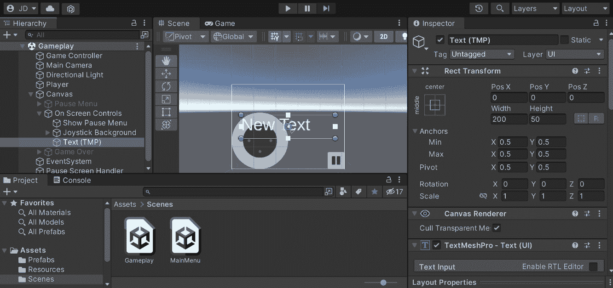

图 8.1– 在屏幕上添加文本对象

这将使**Text**对象成为**Panel**对象的子对象，从而在设备中如果有凹槽的情况下，它会自动调整大小以适应凹槽。

1.  将此对象重命名为`Score Text`，并使用顶部的**锚点预设**菜单，按住*Shift + Alt*来设置中心点和位置。

1.  之后，让我们将`60`设置为确保我们有空间容纳增加的大小。

1.  接下来，在`0`处设置`45`，以便更容易看到。

1.  为了提高其可读性，将**材质预设**更改为**LiberationSans SDF – Outline**，并将**顶点颜色**更改为黑色。

之后，滚动到文本材质部分（`1`）。注意它似乎填充了文本的内外部。为了修复这个问题，在`1`。

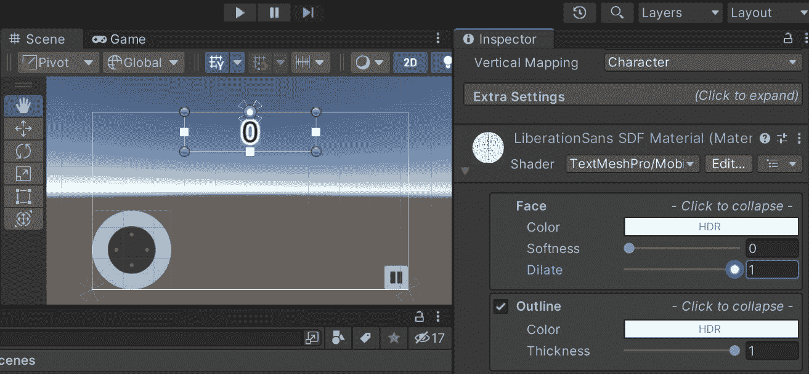

图 8.2：调整文本轮廓的属性

1.  接下来，打开`PlayerBehaviour`脚本，并在文件顶部添加以下行：

    ```kt
    using TMPro; //TextMeshProUGUI
    ```

1.  接下来，在类内部添加以下代码：

    ```kt
    [Header("Object References")]
    public TextMeshProUGUI scoreText;
    private float score = 0;
    public float Score
    {
        get
        {
            return score;
        }
        set
        {
            score = value;
            /* Check if scoreText has been assigned */
            if (scoreText == null)
            {
                Debug.LogError("Score Text is not set. " +
                    "Please go to the Inspector and assign
                        it");
                /* If not assigned, don't try to update
                   it. */
                return;
            }
            /* Update the text to display the whole number
               portion of the score */
            scoreText.text = string.Format("{0:0}",
                score);
        }
    }
    ```

我们首先有一个对`scoreText`对象的引用，我们将在`TextMeshProUGUI`类中设置它，该类包含与对象上显示的文本相关的属性。

这利用了 C#的`get`/`set`函数，它们是隐式获取器和设置器。基本上，每次我们获取或设置`Score`变量时，都会执行`{}`之间所包含的内容。在我们的例子中，每次我们设置`Score`变量时，它都会自动更新我们的文本。

小贴士

想要了解更多关于 TextMeshPro 的信息，请查看[`docs.unity3d.com/Packages/com.unity.textmeshpro@3.0/manual/index.html#support--api-documentation`](https://docs.unity3d.com/Packages/com.unity.textmeshpro@3.0/manual/index.html#support--api-documentation)。

这比我的许多学生所做的方法有优势，他们是在每一帧更新文本的值，这其实是不必要的。我们只需要在值改变时更新文本，这使得它非常适合我们在这个情况下使用。

注意

关于`get`/`set`访问器的更多信息，请查看[`docs.microsoft.com/en-us/dotnet/csharp/programming-guide/classes-and-structs/using-properties`](https://docs.microsoft.com/en-us/dotnet/csharp/programming-guide/classes-and-structs/using-properties)。

1.  然后，更新`PlayerBehaviour`类，使其具有以下突出显示的更改：

    ```kt
    // Start is called before the first frame update
    public void Start()
    {
        // Get access to our Rigidbody component
        rb = GetComponent<Rigidbody>();
        minSwipeDistancePixels = minSwipeDistance *
            Screen.dpi;
        joystick =
            GameObject.FindObjectOfType<MobileJoystick>();
        Score = 0;
    }
    /// <summary>
    /// FixedUpdate is a prime place to put physics calculations
    /// happening over a period of time.
    /// </summary>
    void FixedUpdate()
    {
        /* If the game is paused, don't do anything */
        if (PauseScreenBehaviour.paused)
        {
            return;
        }
        Score += Time.deltaTime;
    // Rest of Update here...
    ```

我们在这里做的是在玩家创建时重置分数，在游戏未暂停时增加值。

1.  保存脚本并返回 Unity。

1.  选择**Player**对象，将我们的**Score Text**对象拖放到**Player** **组件**上的**Score Text**变量：

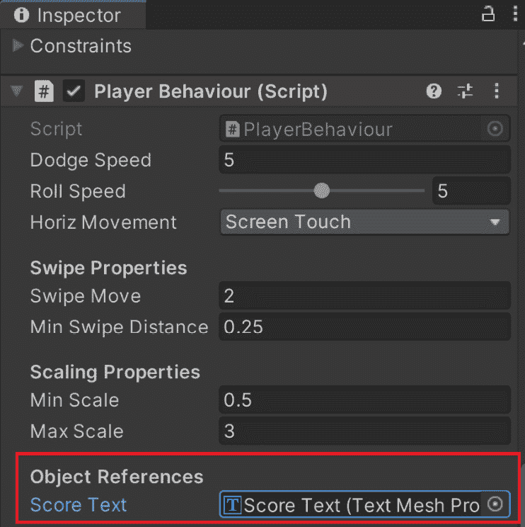

图 8.3：分配分数文本属性

1.  一旦变量已被分配，继续玩游戏。游戏界面如下截图所示：

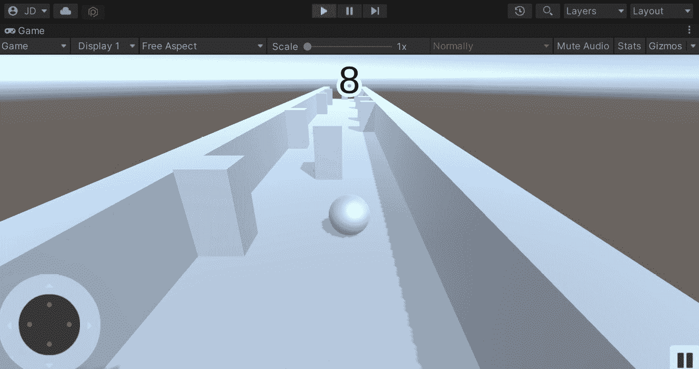

图 8.4：游戏中添加的分数

现在，正如你所看到的，我们的游戏有了分数，并且在我们玩游戏时更新。这将使玩家能够轻松了解他们对游戏的掌握程度，并给他们一些可以与他人分享的信息。现在我们有了评分系统，让我们看看我们如何使用 Twitter 分享高分。

# 通过 Twitter 分享高分

Twitter 是一个在线新闻和社交网络服务，用户通过称为*tweets*的消息进行互动，这些消息限制在 280 个字符以内。许多独立游戏开发者使用 Twitter 作为吸引他人玩他们游戏的方式。

Twitter 是一个很好的起点，因为我们可以通过简单地打开一个特定的 URL 非常容易地将它添加到我们的项目中。让我们看看如何做到这一点：

1.  打开`PauseScreenBehaviour`脚本。一旦进入，我们将在`PlayerScreenBehaviour`类中添加以下代码：

    ```kt
    #region Share Score via Twitter
    /// <summary>
    /// Web address in order to create a tweet
    /// </summary>
    private const string tweetTextAddress = "http://twitter.com/intent/tweet?text=";
    /// <summary>
    /// Where we want players to visit
    /// </summary>
    private string appStoreLink = "http://johnpdoran.com/";
    [Tooltip("Reference to the player for the score")]
    public PlayerBehaviour player;
    /// <summary>
    /// Will open Twitter with a prebuilt tweet. When called on iOS
    /// or Android will open up Twitter app if installed
    /// </summary>
    public void TweetScore()
    {
        /* Create contents of the tweet */
        string tweet = "I got " + string.Format("{0:0}",
            player.Score) + " points in Endless Roller!
                Can you do better?";
        /* Create the entire message */
        string message = tweet + "\n" + appStoreLink;
        /* Ensures string is URL friendly */
        string url =
            UnityEngine.Networking.UnityWebRequest
                .EscapeURL(message);
        /* Open the URL to create the tweet */
        Application.OpenURL(tweetTextAddress + url);
    }
    #endregion
    ```

首先，我们将使用一些新事物。你会注意到前面的代码块以`#region`开始，以`#endregion`结束。这样做的作用是允许我们在 Visual Studio 中展开和折叠这部分代码。当我们引入较长的代码文件时，能够折叠或隐藏脚本中的某些部分，以便我们只关注正在工作的文件部分，这会非常方便。由于这部分代码与脚本的其他部分无关，这是一个我们使用它的好地方。

在 Unity 中打开 URL，我们需要使用`Application.OpenURL`函数和`UnityWebRequest`类。

注意

关于 Twitter 的 Web Intents 及其使用方式，请查看[`dev.twitter.com/web/intents`](https://dev.twitter.com/web/intents)。

`UnityWebRequest`类通常用于在运行时加载内容，但它也有`EscapeURL`函数，该函数将字符串转换为网络浏览器舒适的格式。例如，换行符将不会单独显示。

注意

关于`EscapeURL`函数的更多信息，请查看[`docs.unity3d.com/ScriptReference/Networking.UnityWebRequest.EscapeURL.html`](https://docs.unity3d.com/ScriptReference/Networking.UnityWebRequest.EscapeURL.html)。

保存脚本并返回 Unity。通过将**层次结构**窗口中的**Player**游戏对象拖放到**检查器**窗口中的**Player**属性上：

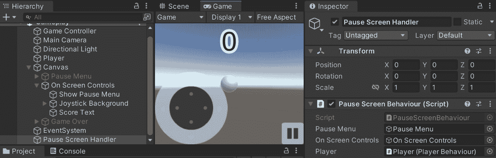

图 8.5：分配 Player 属性

1.  现在，我们需要在我们的**Game Over**屏幕上有一个按钮，以便我们可以分享我们的分数。

1.  打开**画布**对象，通过在**检查器**窗口中点击其名称旁边的勾选标记来切换**Game Over**对象为**开启**。

1.  从那里，展开两个**Tweet Score Button**，并更新子对象中的文本以显示`Tweet Score`。

1.  之后，选择**Tweet Score**按钮对象，并滚动到**按钮**组件。从那里，将我们调用的函数更改为**PauseScreenBehaviour** | **TweetScore**函数：

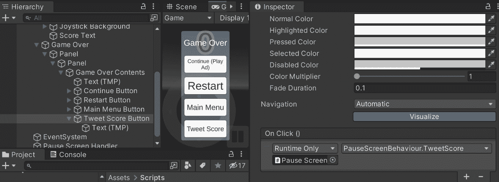

图 8.6：调用 TweetScore 函数

1.  在**层次结构**中选择**Game Over**对象，并再次禁用它。接下来，保存你的场景并开始游戏。

1.  现在我们失败游戏时，我们可以点击**Tweet Score**按钮，我们的浏览器将在我们的 PC 上打开：

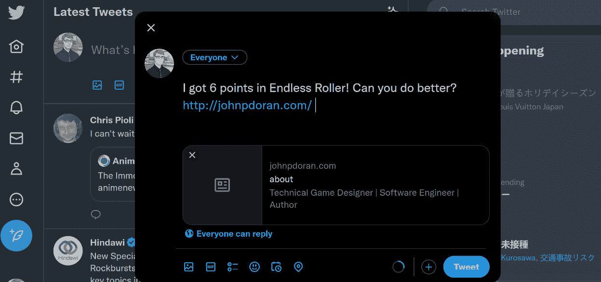

图 8.7：PC 上的结果

然而，在我们的移动设备上，如果已安装，它将打开 Twitter 应用：

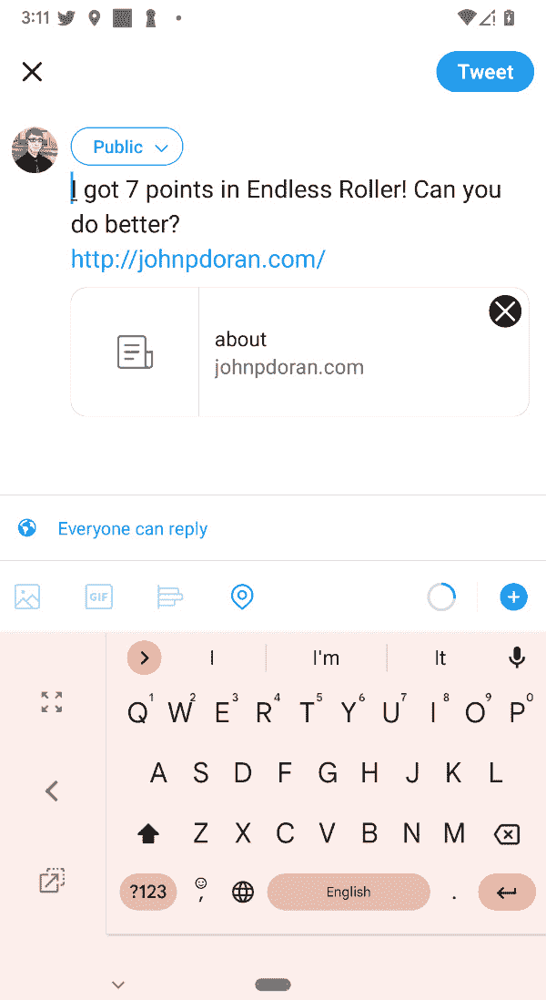

图 8.8：通过 Twitter 移动应用发布我们的分数

通过这样，你学会了如何轻松地使用 Twitter 分享东西。

注意

对于那些对 Twitter 有更多兴趣的人来说，它确实有自己的 Unity API，这允许你让用户使用 Twitter 登录到你的游戏，如果你愿意这样做而不是 Facebook，我们稍后会这样做。如果你对此感兴趣，你可以在[`dev.twitter.com/twitterkit/unity/overview`](https://dev.twitter.com/twitterkit/unity/overview)找到更多信息。

当然，还有其他社交网络存在，其中一些有自己的**软件开发工具包**（**SDK**），这允许你访问它们拥有的信息。在下一节中，我们将探讨如何利用这一点。

# 下载并安装 Facebook 的 SDK

在没有提到 Facebook 的情况下讨论社交网络章节是不可能的。Facebook 有自己的 SDK，可以与 Unity 一起使用。这可以让我们在我们的游戏体验中使用 Facebook 已经拥有的信息，包括用户的姓名和头像。让我们看看如何整合这些步骤：

1.  打开你的网络浏览器并访问 [`developers.facebook.com/docs/unity/`](https://developers.facebook.com/docs/unity/)：

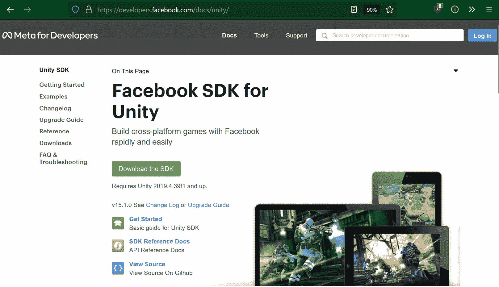

图 8.9：Unity 的 Facebook SDK 页面

1.  点击 `facebook-unity-sdk-15.1.0` 文件夹。然后，打开 `FacebookSDK` 文件夹，你会看到一个单独的文件，`facebook-unity-sdk-15.1.0.unitypackage`。

与前面的章节不同，使用 Facebook SDK 需要为安装的 Unity 版本添加 iOS 和 Android 构建支持，所以在导入包之前确保两者都已添加，否则你会遇到错误。要做到这一点，在 Unity Hub 中，转到 **安装** 部分，从齿轮图标中选择 **添加模块** 并添加之前未包含的相关项目（如果有）。

1.  双击 `unitypackage` 文件，你应该会弹出一个窗口，如图所示：

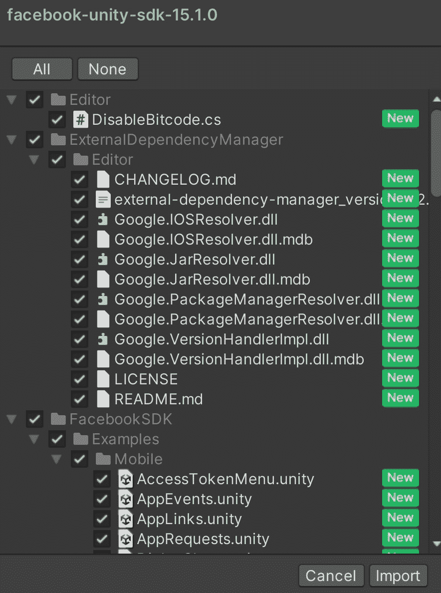

图 8.10：Unity 包导入对话框

如果这不起作用，你也可以转到 **资产** | **导入包** | **自定义包**，然后找到你解压文件的文件夹，并以此方式打开它。

1.  点击 **导入** 按钮，等待它加载完成。从这里，你会看到一个弹出窗口提示项目可能包含过时的 API。继续点击 **我已经备份，继续** 按钮，等待它完成。

1.  现在，为了使用 Facebook API，我们首先需要一个 Facebook App ID，所以让我们接下来做这件事。

1.  返回你的网络浏览器并转到 [`developers.facebook.com/`](https://developers.facebook.com/)，点击屏幕右上角的 **登录** 按钮。一旦你登录到你的 Facebook 账户，你应该会看到以下截图类似的内容：

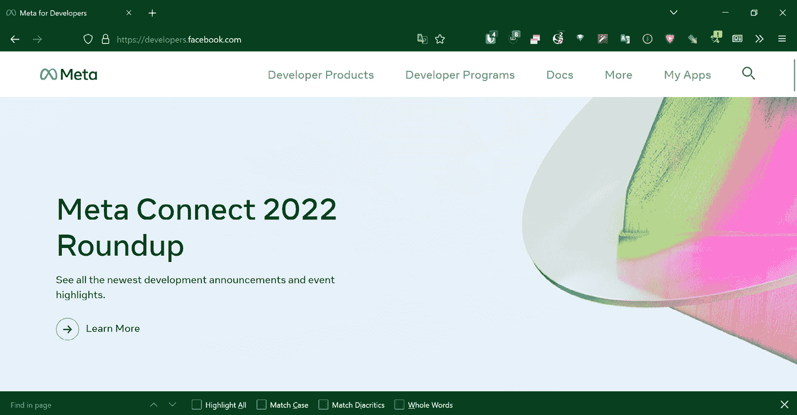

图 8.11：开发者 Meta 菜单

1.  从前面的页面，点击屏幕右上角的 **开始** 按钮。从那里，你会被带到需要点击 **下一步** 的屏幕，然后你会被要求选择你的角色。点击 **开发者**，然后在下一个屏幕上点击 **创建第一个** **应用** 按钮。

1.  之后，添加 `Endless Roller`) 和你的 **联系邮箱**，然后选择 **创建** **应用** **ID**。

1.  一旦你被带到你的应用页面，点击左侧默认游戏信息的 **仪表板** 选项。注意 **App ID** 并通过点击它或突出显示它然后按 *Ctrl + C* 来复制它。

1.  如果你看到的是 `Endless Roller`) 和你的联系邮箱，然后选择 **创建应用**。

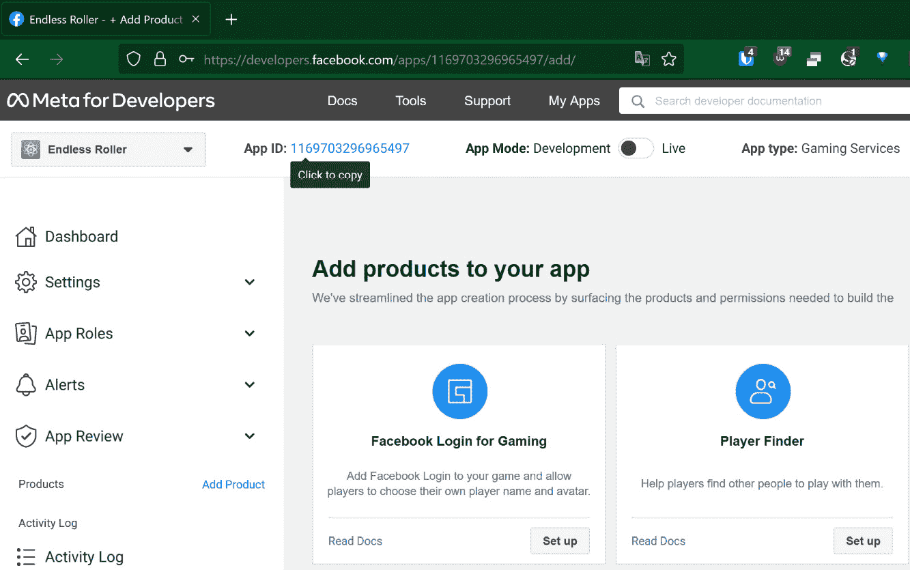

图 8.12：获取应用 ID

1.  返回 Unity，您可能需要与 Google 分享一些信息。按您的意愿回答。然后，您将可以选择启用 Android 自动解析。我设置了**启用**并等待它解析 Android 依赖项。

1.  之后，您会在顶部栏注意到一个新的 Facebook 选项。选择它，然后选择**编辑设置**。一旦到了那里，如果您需要，点击**检查器**，您将看到几个选项。将**Facebook App Id**设置为创建的应用的 ID，然后将名称设置为游戏名称：


图 8.13：将应用 ID 添加到 Facebook 设置

小贴士

有可能您在尝试将游戏导出到 Android 时可能会因为更改 SDK 位置而遇到错误。如果是这种情况，请关闭您的 Unity 项目，然后转到项目文件夹并删除`Temp`文件夹。重新启动项目后，错误应该会消失。

1.  通过访问**Facebook** | **编辑设置...**返回 Facebook 设置菜单。

现在，您会注意到在**Android 构建 Facebook 设置**下出现了一个新的错误，指出未找到 OpenSSL。

1.  为了解决这个问题，我们首先需要通过访问[`slproweb.com/products/Win32OpenSSL.html`](http://slproweb.com/products/Win32OpenSSL.html)下载 OpenSSL。从那里，选择**Win64 OpenSSL v1.1.1u**选项下的**EXE**链接，如图所示：

重要提示

对于使用 Mac 的用户，您可以按照以下说明安装 OpenSSL 并将其添加到您的路径：[`developers.facebook.com/docs/facebook-login/android/advanced`](https://developers.facebook.com/docs/facebook-login/android/advanced)。

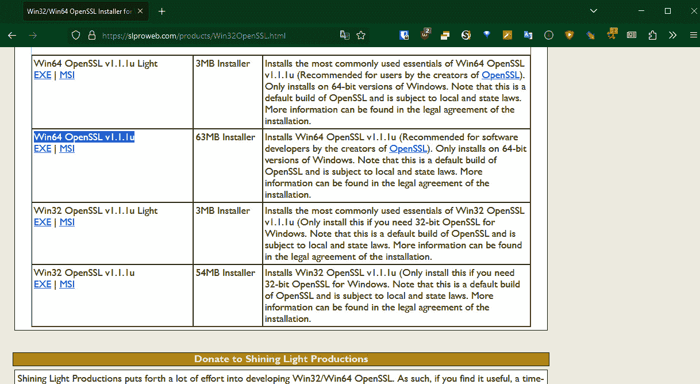

图 8.14：OpenSSL 下载链接

下载完成后，使用默认选项安装程序，如图所示：

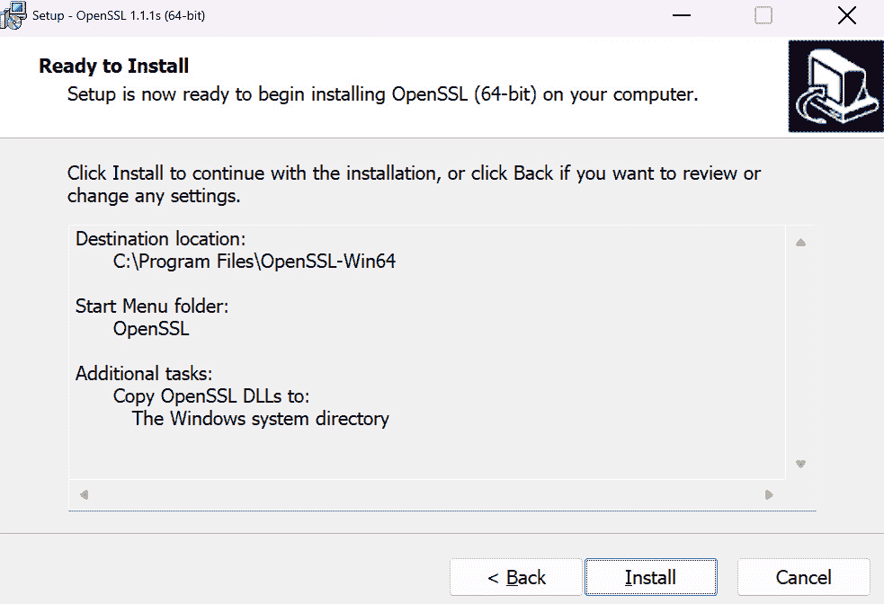

图 8.15：安装 OpenSSL

1.  安装完成后，您可以取消勾选捐赠选项，然后点击**完成**按钮。

1.  我们接下来需要将 OpenSSL 的位置添加到路径中。为此，按下您的 Windows 键：

1.  按下键盘并开始输入`env`，然后选择**编辑系统环境变量**

1.  选项，如图所示：

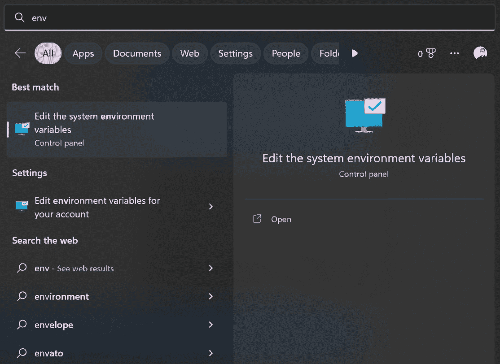

图 8.16：选择编辑系统环境变量选项

1.  在弹出的窗口中，点击`C:\Program Files\OpenSSL-Win64\bin`：

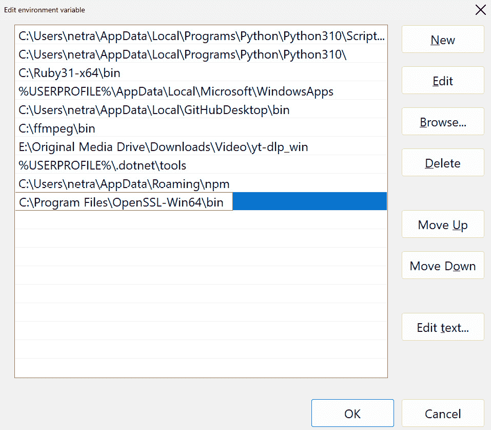

图 8.17：编辑路径的环境变量

1.  然后，点击`C:\Program Files\Unity\Hub\Editor\2022.1.0b16\Editor\Data\PlaybackEngines\AndroidPlayer\OpenJDK\bin`。

1.  点击**确定**按钮，然后在**环境变量**窗口中的**确定**按钮。

1.  一旦添加了这两个选项，请关闭您的 Unity 项目并重新启动计算机。Unity 重新打开后，您可能需要等待**解决 Android 依赖项**菜单完成，但一旦完成，您应该能够正确看到**Facebook 设置**（**Facebook | 编辑设置**）菜单，并在**调试 Android 密钥** **哈希** **[?]**下获得值：

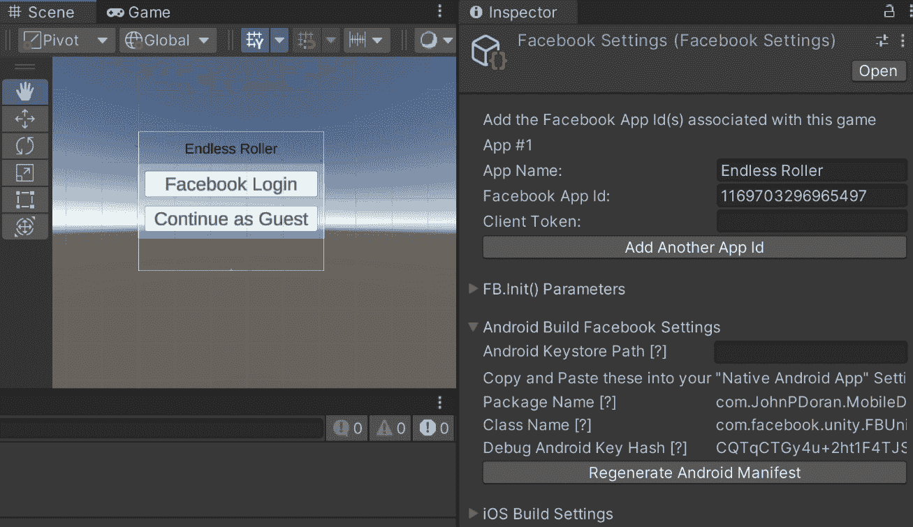

图 8.18：调试 Android 密钥哈希

1.  对于某些 API 的调用，也需要使用客户端令牌，因此我们也将获取一个。为此，请通过转到**Facebook | 开发者页面**返回您项目的仪表板。

1.  一旦仪表板加载完成，转到**设置 | 高级 | 安全 | 客户端令牌**。复制**客户端令牌**值，然后返回 Unity 编辑器，将其粘贴到**检查器**中的**Facebook 设置**。

这意味着我们的 Facebook SDK 设置已经完成！

1.  根据您希望部署的平台，访问以下网站并完成列出的任务：

    +   对于 Android，请参阅[`developers.facebook.com/docs/unity/getting-started/android`](https://developers.facebook.com/docs/unity/getting-started/android)

    +   对于 iOS，请参阅[`developers.facebook.com/docs/unity/getting-started/ios`](https://developers.facebook.com/docs/unity/getting-started/ios)

现在我们已经设置了这些，我们可以通过首先允许我们的游戏通过 Facebook 登录来添加内容。

# 通过 Facebook 登录到我们的游戏

当使用 Facebook API 时，我们可以做的一件事是允许我们的用户使用他们的 Facebook 账户登录到游戏。然后，我们可以在项目中自动使用他们的姓名和图像。以下步骤展示了我们如何实现这一点：

1.  让我们先打开`Assets/Scenes`文件夹，然后双击`MainMenu`文件。

1.  从那里，让我们点击**2D**按钮进入 2D 模式，如果您之前还没有这样做。我们将替换原始菜单，并为玩家提供一个通过 Facebook 登录或游戏开始时作为访客游玩的按钮。

1.  前往**菜单选项**。

1.  然后，选择`Facebook 登录`对象。再次选择**菜单选项**游戏对象，然后通过转到**检查器**选项卡并点击其名称旁边的勾选标记来禁用它：

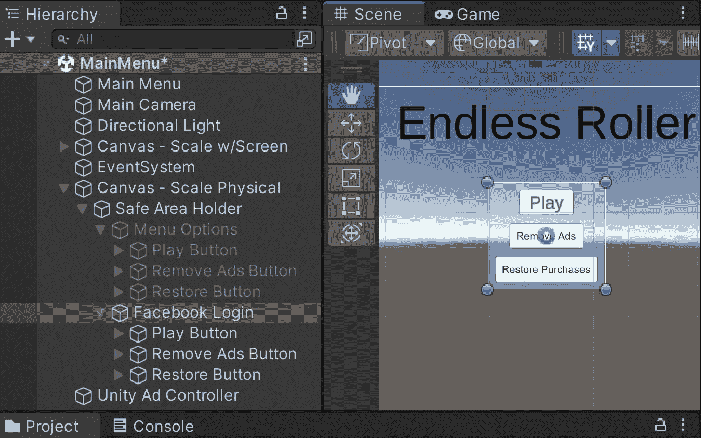

图 8.19：创建 Facebook 登录菜单

我们将使**Facebook 登录**对象在需要时打开菜单。

1.  接下来，打开`225`，然后右键单击**按钮**组件，并选择**重置**选项以移除其原始的**On Click ()**功能。

1.  复制`Facebook 登录按钮`和`继续作为访客按钮`。同时，更改`Facebook 登录`和`继续作为访客`：

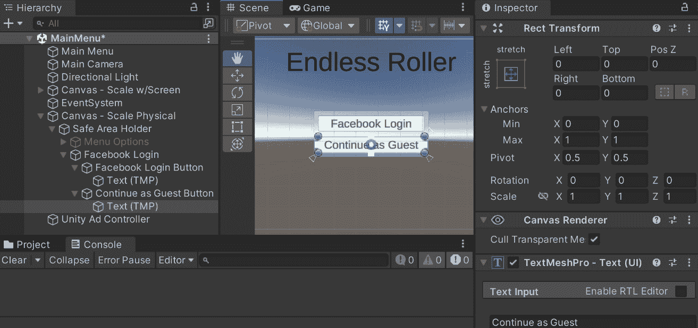

图 8.20：Facebook 登录按钮设置

1.  现在我们已经正确地使按钮工作，我们需要编写一个脚本，以便我们可以登录。转到`Scripts`文件夹并打开我们的`MainMenuBehaviour`脚本。我们将使用`List`类来保存我们想要访问 Facebook 和 Facebook SDK 中`FB`类内容的权限。

1.  因此，为了做到这一点，我们首先将在`MainMenuBehaviour`脚本顶部添加以下内容：

    ```kt
    using UnityEngine;
    using UnityEngine.SceneManagement; // LoadScene
    using System.Collections.Generic; // List using Facebook.Unity; // FB
    ```

1.  然后，将以下变量添加到`MainMenuBehaviour`类中：

    ```kt
    [Header("Object References")] 
    public GameObject mainMenu; 
    public GameObject facebookLogin;
    ```

1.  现在，在`MainMenuBehaviour`类中添加以下代码：

    ```kt
    #region Facebook
    #endregion
    ```

在这个区域内，我们将添加几个不同的方法，首先是处理初始化 Facebook API 的一些方法：

```kt
    public void Awake()
    {
        /* We only call FB Init once, so check if it
        /* has been called already */
        if (!FB.IsInitialized)
        {
            FB.Init(OnInitComplete, OnHideUnity);
        }
    }
```

在这种情况下，`Awake`方法调用`FB.Init`函数，它接受两个参数，这两个参数都是委托，或者是在初始化完成以及应用隐藏或不再当前焦点时调用的函数。这两个函数的定义如下：

```kt
/// <summary>
/// Once initialized, will inform if logged in on Facebook
/// </summary>
private void OnInitComplete()
{
    if(FB.IsInitialized)
    {
        if (FB.IsLoggedIn)
        {
            print("Logged into Facebook");
            /* Close Login and open Main Menu */
            ShowMainMenu();
        }
    }
    else
    {
        print("Failed to init Facebook SDK; open as
            guest");
        ShowMainMenu();
    }
}
    /// <summary>
    /// Called whenever Unity loses focus
    /// </summary>
    /// <param name="active">If the game is currently
        active</param>
    private void OnHideUnity(bool active)
    {
        /* Set TimeScale based on if the game is
           paused */
        Time.timeScale = (active) ? 1 : 0;
    }
```

在这种情况下，如果我们登录到 Facebook，我们将向屏幕打印一条消息，并显示主菜单。同样，如果我们失去 Unity 的焦点，我们将暂停游戏。

我们还需要添加一些其他最终函数来完成我们的最终实现，我们将在下面添加：

```kt
/// <summary>
/// Attempts to log in on Facebook
/// </summary>
public void FacebookLogin()
{
    List<string> permissions = new List<string>();
    /* Add permissions we want to have here */
    permissions.Add("public_profile");
    FB.LogInWithReadPermissions(permissions,
        FacebookCallback);
}
/// <summary>
/// Called once facebook has logged in, or not
/// </summary>
/// <param name="result">The result of our login request</param>
private void FacebookCallback(IResult result)
{
    if (result.Error == null)
    {
        OnInitComplete();
    }
    else
    {
        print(result.Error);
    }
}
public void ShowMainMenu()
{
    if (facebookLogin != null && mainMenu != null)
    {
        facebookLogin.SetActive(false);
        mainMenu.SetActive(true);
    }
}
```

在这种情况下，我们正在访问玩家的公共资料，其中包含诸如他们的姓名和他们的个人资料图片等信息。

注意

对于我们可以访问的所有属性，请查看[`developers.facebook.com/docs/facebook-login/permissions#reference-public_profile`](https://developers.facebook.com/docs/facebook-login/permissions#reference-public_profile)。

1.  保存你的脚本，转到**Facebook 登录**按钮，并将按钮的**OnClick()**动作更改为现在通过点击+按钮并将**主菜单**对象拖放到其中，然后选择**主菜单行为** | **Facebook** **登录**来调用你的函数：

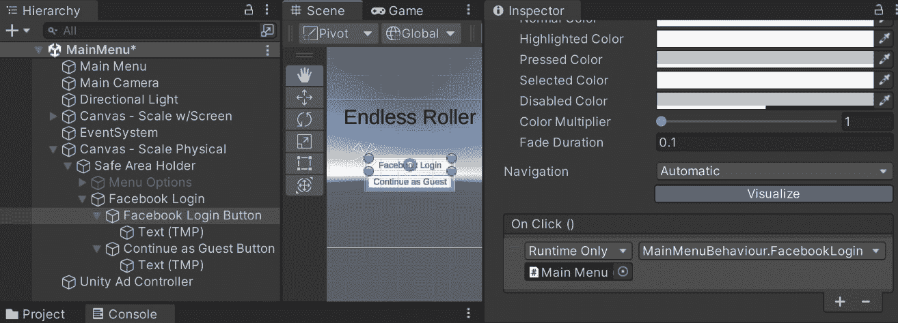

图 8.21：调用 FacebookLogin 函数

1.  然后，在`MainMenuBehaviour.ShowMainMenu`函数中。

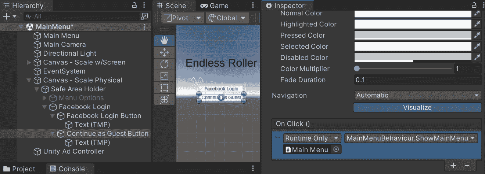

图 8.22：设置“继续作为访客”按钮的界面

1.  最后，我们需要设置我们创建的变量。在**层次结构**窗口中选择**主菜单**对象，然后设置**主菜单**和**Facebook** **登录**属性：

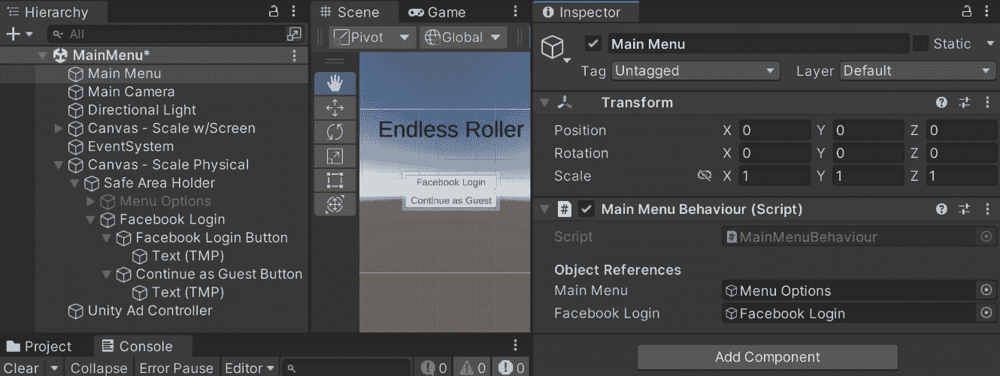

图 8.23：设置主菜单行为属性

确保将**Facebook 登录**设置为包含两个按钮的**面板**对象。

1.  保存你的场景，开始游戏，然后点击**Facebook** **登录**按钮：

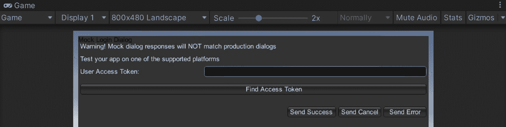

图 8.24：用户访问令牌请求屏幕

重要提示

为了在编辑器中正确查看所有内容，最好最大化**游戏**标签页，您可以通过右键点击**游戏**标签页并选择**最大化**，或者通过在工具栏上勾选**播放时最大化**选项来实现。

现在，您应该会看到一个要求用户访问令牌的菜单，这是一个每个资料都有的值，我们可以将其关联起来。我们需要去 Facebook 获取这个令牌，所以这就是我们接下来要做的。

1.  点击**查找访问令牌**页面，浏览器将打开一个新页面：

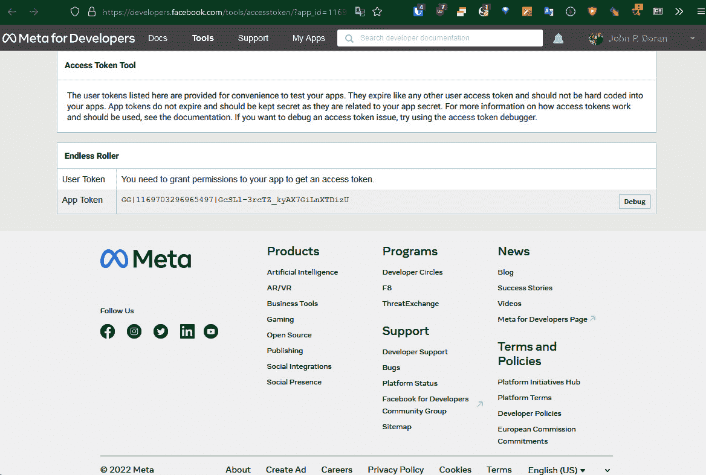

图 8.25：访问令牌工具页面

1.  然后，您需要点击**需要授予权限**链接，然后，在**生成访问令牌**中点击**继续**，您将在**用户令牌**下看到一个字符序列。复制该字符串，将其粘贴到 Unity 中的**用户访问令牌**属性中，然后点击**发送****成功**按钮。

注意

如果在授予权限时出现错误，提示**此应用的未来 Facebook 活动已关闭**，这意味着您的 Facebook 设置不允许您的 Facebook 资料在 Facebook 之外使用。为了使用 Facebook 进行登录，您的账户必须启用 Off-Facebook 跟踪。为此，您可以访问[`www.facebook.com/off_facebook_activity`](https://www.facebook.com/off_facebook_activity)，并确保**未来的 Off-Facebook 活动**值设置为开启，以便能够登录。如果您不想被跟踪，我们将允许用户以访客身份登录。

现在，您会注意到控制台已经打印出我们已登录 Facebook，并且当我们发送密钥时菜单会关闭：

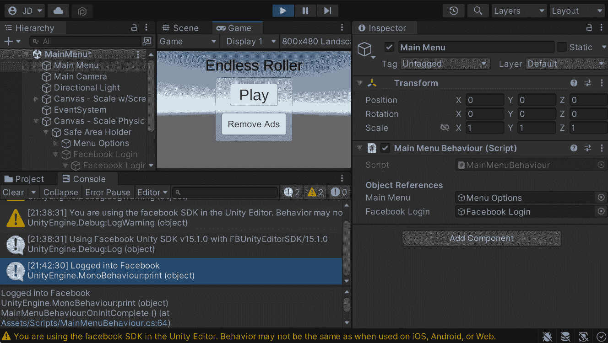

图 8.26：已登录 Facebook

注意

有关用户访问令牌的更多信息，请参阅[`developers.facebook.com/docs/facebook-login/access-tokens/#usertokens`](https://developers.facebook.com/docs/facebook-login/access-tokens/#usertokens)。

现在我们有了登录 Facebook 的能力，我们可以使用从 Facebook 获取的信息来定制我们的游戏，这就是我们接下来要做的。

# 显示 Facebook 名称和资料图片

做一件好事就是让我们的游戏适应我们的玩家。因此，一旦玩家登录，我们将欢迎他们，并按照以下步骤在屏幕上显示他们的图像：

1.  再次前往`MainMenuBehaviour`脚本。从那里，我们需要添加一个新的`using`语句来显示图像，并更改我们需要更改的文本，以便使用 Unity 的 UI 系统和 TextMeshPro：

    ```kt
    using UnityEngine.UI; // Image
    using TMPro; //TextMeshProUGUI
    ```

1.  然后，我们需要添加两个新的变量：

    ```kt
    [Tooltip("Will display the user's Facebook profile pic")] 
    public Image profilePic;
    [Tooltip("The text object used to display the greeting")] 
    public TextMeshProUGUI greeting;
    ```

这些变量将保存我们从 Facebook 获取的信息，以便我们显示。

1.  之后，我们将更新`ShowMainMenu`函数并添加一些新函数来使用：

    ```kt
    public void ShowMainMenu()
    {
        if (facebookLogin != null && mainMenu != null)
        {
            facebookLogin.SetActive(false);
            mainMenu.SetActive(true);
            if (FB.IsLoggedIn)
            {
    /* Get information from Facebook profile
                */
                FB.API("/me?fields=name",
                        HttpMethod.GET,
                        SetName);
                FB.API("/me/picture?width=256&height=256",
                        HttpMethod.GET,
                        SetProfilePic);
            }
        }
    }
    ```

`FB.API`函数调用 Facebook 的 Graph API 以获取数据或代表用户执行操作，并允许我们获取之前定义的我们有权限获取的信息。在我们的案例中，我们正在寻找用户的姓名和头像，并在获取到这些数据后分别调用`SetName`和`SetProfilePic`函数。

然而，我们目前没有`SetName`和`SetProfilePic`函数，所以我们将继续添加它们。

1.  在脚本的`Facebook`区域添加以下附加代码：

    ```kt
    private void SetName(IResult result)
    {
        if (result.Error != null)
        {
            print(result.Error); return;
        }
        string playerName =
            result.ResultDictionary["name"].ToString();
        if (greeting != null)
        {
            greeting.text = "Hello, " + playerName + "!";
            greeting.gameObject.SetActive(true);
        }
    }
    private void SetProfilePic(IGraphResult result)
    {
        if (result.Error != null)
        {
            print(result.Error); return;
        }
        // Variable setup
        int texWidth = result.Texture.width;
        int texHeight = result.Texture.height;
        Rect rect = new Rect(0, 0, texWidth, texHeight);
        Vector2 pivot = Vector2.zero;
        Texture2D texture = result.Texture;
        // Create the profile pic
        Sprite fbImage = Sprite.Create(texture, rect,
            pivot);
        if (profilePic != null)
        {
            profilePic.sprite = fbImage;
            profilePic.gameObject.SetActive(true);
        }
    }
    ```

获取数据后，我们将修改图像或字符串以显示我们检索的新数据。

重要提示

更多关于`FB.API`函数的信息，请查看[`developers.facebook.com/docs/unity/reference/current/FB.API`](https://developers.facebook.com/docs/unity/reference/current/FB.API)。

1.  现在，我们需要实际创建我们想要显示的文本和图像。打开`Safe Area Holder`。然后，在`Welcome Profile`上右键点击：

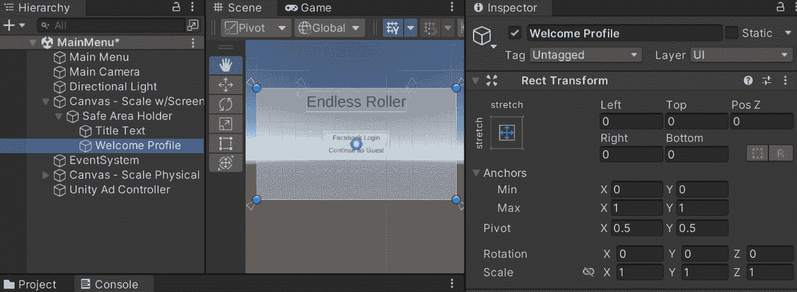

图 8.27：创建欢迎配置文件

这将作为玩家所有信息的容器。

1.  使用`10`。从那里，将**子对齐**更改为**底部居中**，然后在**控制子大小**属性下检查**宽度**和**高度**。然后，添加一个**内容大小适配器**组件，并将**水平适配**和**垂直适配**大小更改为**首选大小**。最后，在**锚点预设**菜单中，按住*Alt + Shift*并选择**底部居中**。

1.  现在，在**层次结构**选项卡中选择**Welcome Profile**对象，右键点击它，然后选择**UI** | **Text -** **TextMeshPro**。

1.  重命名下一个`Greeting`。

1.  然后，调整`Welcome`的大小到更大一些，例如`50`，将**顶点颜色**更改为黑色，然后调整**对齐**使其垂直和水平居中：

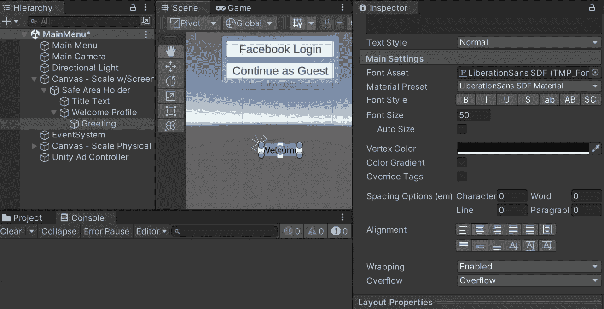

图 8.28：问候文本设置

1.  同样，接下来我们右键点击`256`。之后，也要检查`256`，因为 Facebook 可能会给我们提供比这更大的图片，这将保持图片的大小。**布局元素（脚本）**组件非常适合允许你覆盖**布局组**默认执行的操作，如果你没有从默认行为中获得你想要的结果，这可能很有用。

注意

更多关于**布局元素（脚本）**组件的信息，请查看[`developers.facebook.com/docs/unity/`](https://developers.facebook.com/docs/unity/)，或[`docs.unity3d.com/Manual/script-LayoutElement.html`](https://docs.unity3d.com/Manual/script-LayoutElement.html)。

1.  接下来，更改`Profile Pic`的名称，然后重新排列它，使其在**层次结构**中位于**Greeting**对象之上：

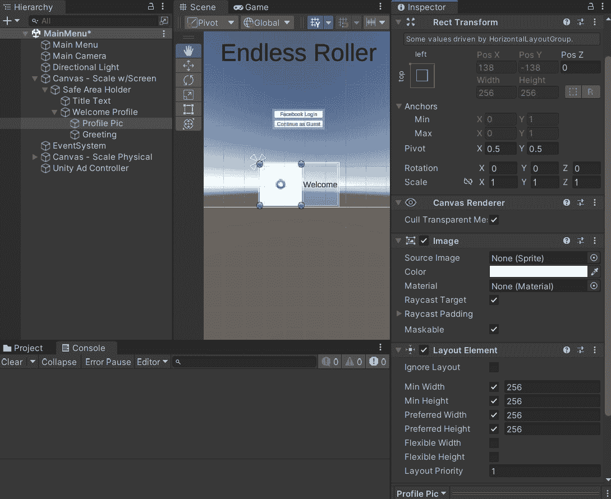

图 8.29：头像设置

使用**水平布局组**重新排列对象会改变它们的放置顺序。

如果你将分辨率更改为一个非常小的尺寸，图像将绘制在我们的菜单上方。这是由于两个画布都被告知它们在绘制时的优先级相同，类似于 2D 游戏中的 Z 冲突工作方式。为了解决未来可能的问题，我们将把缩放画布作为背景元素。

1.  要这样做，我们将选择`1`。

1.  现在，回到**主菜单**对象，并在**MainMenuBehaviour**组件中设置**问候语**和**个人资料图片**属性。

1.  最后，由于我们不想在游戏开始时显示它们，让我们关闭**问候语**以及我们的**个人资料图片**对象。

1.  保存我们的游戏，然后通过适当的登录信息再次启动它：

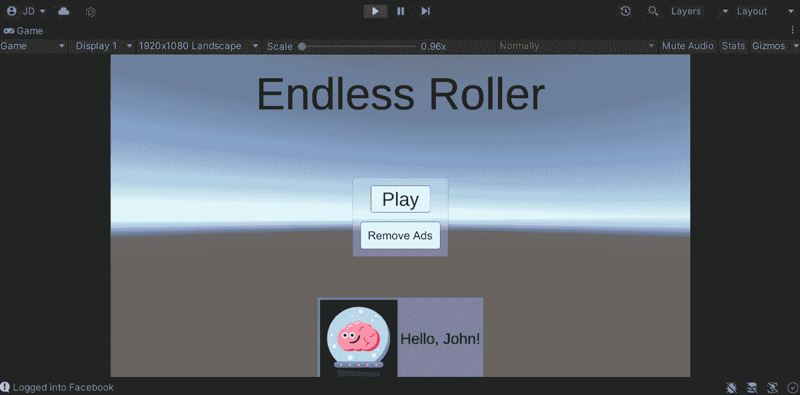

图 8.30：登录到 Facebook

如你所见，我们已经登录，你可以看到我的名字，但我有一个并非我实际个人资料的图片。这是因为它正在使用我的游戏资料。如果我们想使用我的实际 Facebook 个人资料图片，我们必须向我们的应用程序添加另一个权限：

1.  在 Graph API 探索器中，回到**权限**部分，在**添加权限**下，点击下拉菜单并选择**gaming_user_picture**。

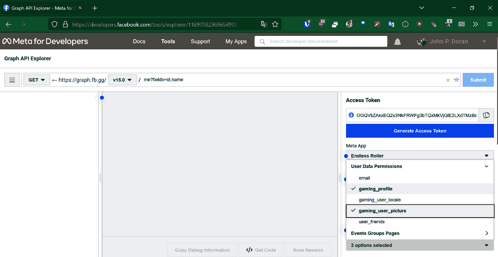

图 8.31：添加用户图片选项

1.  从那里，再次点击**生成访问令牌**并获取一个新的访问令牌，该令牌会共享你的实际配置文件信息。请注意，用户必须选择是否与你共享此信息。

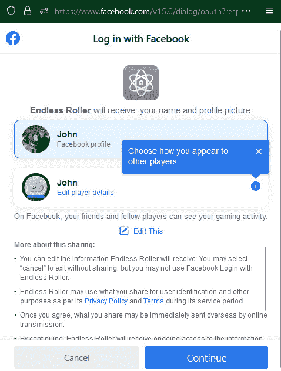

图 8.32：选择如何登录 Facebook

现在使用你的新访问令牌尝试运行游戏。

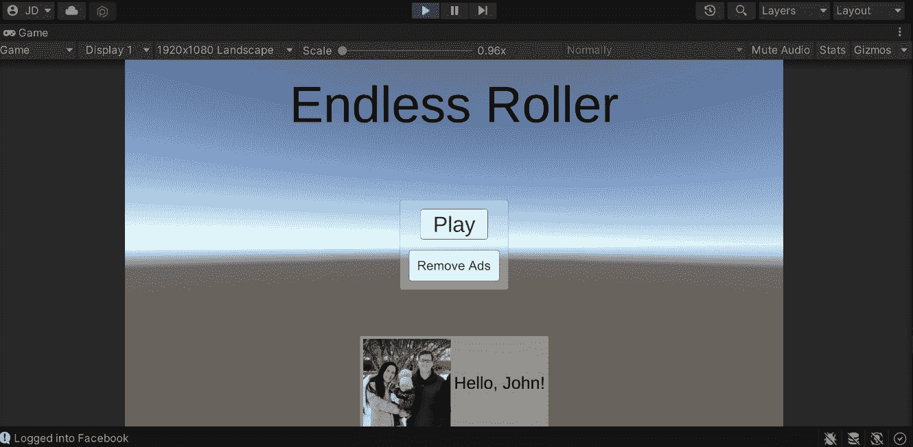

图 8.33：登录到实际 Facebook 账户

如前述截图所示，我登录后检索了我的实际 Facebook 信息。

Facebook 仍然是一个对游戏开发者来说极其有用的平台，可以帮助个性化用户的游戏体验。这可以很容易地扩展到利用 Facebook 拥有的其他数据，并与所有用户的亲朋好友分享内容。

对于那些只想拥有登录游戏以验证特定平台玩家的能力的人来说，还有其他几个可用的选项供你使用。有关详细信息，请参阅[`docs.unity.com/authentication/SettingUpExternalIdentityProviders.html`](https://docs.unity.com/authentication/SettingUpExternalIdentityProviders.html)。

# 摘要

在本章中，我们介绍了一些我们可以与他人分享我们的游戏的方法，以及个性化我们的游戏体验和利用社交媒体为我们提供的功能。我们首先添加了一个简单的评分系统，然后允许用户通过 Twitter 分享他们的分数。然后我们设置了 Facebook SDK，使得我们可以登录并玩游戏，同时检索有关我们用户的信息，我们可以使用这些信息来定制他们的游戏体验。

既然我们的游戏有人玩，我们就希望他们能够持续回来并长时间地玩。实现这一目标的最简单方法之一是通过使用通知，我们将在下一章中探讨这一点。

# 第三部分：游戏感觉/润色

在本书的这一部分，我们将专注于为您的游戏添加润色，以增强整体玩家体验。到本部分结束时，您将拥有所有必要的工具和知识，通过润色游戏和玩家体验，将您的游戏提升到下一个水平。

本部分包含以下章节：

+   *第九章*, *通过通知保持玩家参与度*

+   *第十章*, *使用 Unity 分析工具*

+   *第十一章*, *远程配置*

+   *第十二章*, *提升游戏感觉*

+   *第十三章*, *构建我们的游戏发布版本*

+   *第十四章*, *将游戏提交到应用商店*

+   *第十五章*, *增强现实*
