# 第九章：使用通知保持玩家参与

让用户不断回到你的游戏中的最佳方式之一是通过使用推送通知。这允许你在用户不使用你的游戏时与他们保持联系。如果使用得当，这可以让用户长时间玩你的游戏。过于频繁或不当使用通知会导致用户静音你的应用通知，这并不是一个理想的情况。

在本章中，我们将探讨如何为 Android 和 iOS 设备创建通知。然后我们将学习如何安排通知，以便玩家在之后返回游戏，以及我们可以自定义它们的方式。

本章分为多个主题。它包含从开始到结束的简单、分步的过程。以下是我们的任务大纲：

+   设置通知

+   提前安排通知

+   自定义通知展示

+   取消通知

# 技术要求

本书使用 Unity 2022.1.0b16 和 Unity Hub 3.3.1，但步骤应该在未来版本的编辑器中只需做最小改动即可。如果你想要下载本书中使用的确切版本，并且有新版本发布，你可以访问 Unity 的下载存档[`unity3d.com/get-unity/download/archive`](https://unity3d.com/get-unity/download/archive)。你还可以在 *Unity 编辑器系统要求* 部分找到 Unity 的系统要求[`docs.unity3d.com/2022.1/Documentation/Manual/system-requirements.html`](https://docs.unity3d.com/2022.1/Documentation/Manual/system-requirements.html)。为了部署你的项目，你需要一个 Android 或 iOS 设备。

你可以在 GitHub 上找到本章中存在的代码文件[`github.com/PacktPublishing/Unity-2022-Mobile-Game-Development-3rd-Edition/tree/main/Chapter09`](https://github.com/PacktPublishing/Unity-2022-Mobile-Game-Development-3rd-Edition/tree/main/Chapter09)。

# 设置通知

在我们开始向我们的项目添加通知之前，我们需要添加一个 Unity 提供的特殊预览包。按照这里给出的步骤操作：

1.  从 Unity 编辑器中，转到 **窗口** | **包管理器**。

1.  从那里，如果左上角部分没有显示 **包：Unity 注册表**，请从 **包** 菜单的工具栏中选择 **项目** 下拉菜单，并选择 **Unity 注册表**。

1.  滚动到可用的选项，直到你到达**移动通知**并选择它。一旦到达那里，点击它旁边的箭头并选择**查看所有版本**，然后选择最新版本（在我的情况下，是**版本 2.0.2**）。从那里，点击**安装**按钮，你将看到以下截图：

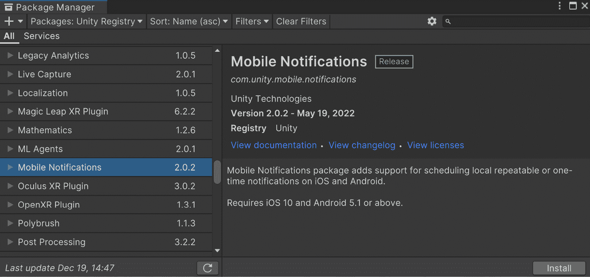

图 9.1：安装移动通知包

注意

重要的是要注意，此包要求你的游戏使用 Android 5.1（API 级别 22）和 iOS 10 或更高版本才能正常工作。

我们还将使用由 Unity 编写的另一个跨平台包装器，以便快速实现通知功能并消除编写平台特定代码的需求。

1.  然后，打开 **Samples** 部分，然后点击 **Notification Samples** 按钮旁边的 **Import** 按钮。

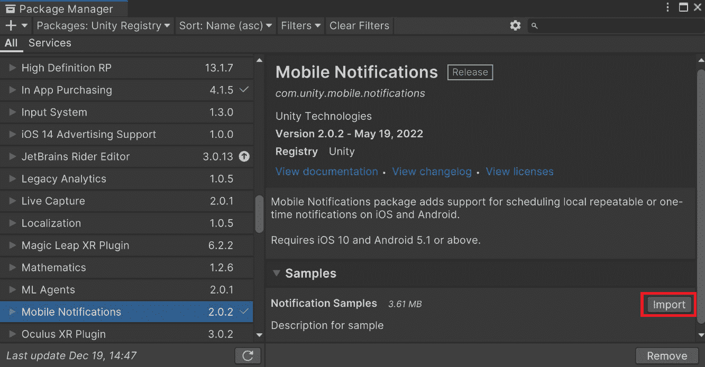

图 9.2：导入通知样本

这个由 Unity 创建的项目用于展示如何在一些实际示例中使用 Unity 的移动通知 API。我们正在使用它作为跨平台包装器，这将允许我们创建一次通知，它将在 Android 和 iOS 上工作，而无需我们进行任何额外的工作。

1.  安装完成后，你可以关闭 **Package Manager** 窗口。为了确保我们可以导出我们的项目，我们需要确保我们的项目具有正确的最小 API 级别。

1.  接下来，通过访问 **Edit** | **Project Settings** 菜单进入 **Project Settings**。从那里，转到 **Player** 选项，并在 **Other Settings** 下滚动到 **Minimum API Level** 并确认它设置为与移动通知包中指定的版本（在本例中为 **Android 5.1 ‘Lollipop’（API 级别 22）**）或更高版本。之后，你可以关闭 **Project Settings** 窗口：

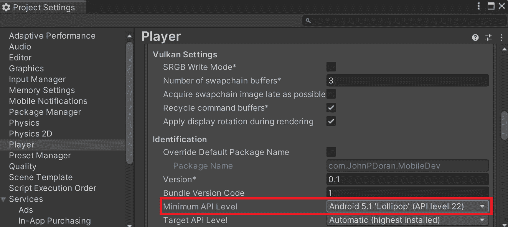

图 9.3：确保设置正确的最小 API 级别

你应该能看到有几个文件夹是项目的一部分。我们关心的文件位于 `Assets\Samples\Mobile Notifications\2.0.2\Notification Samples\Scripts` 文件夹中。请看以下截图：

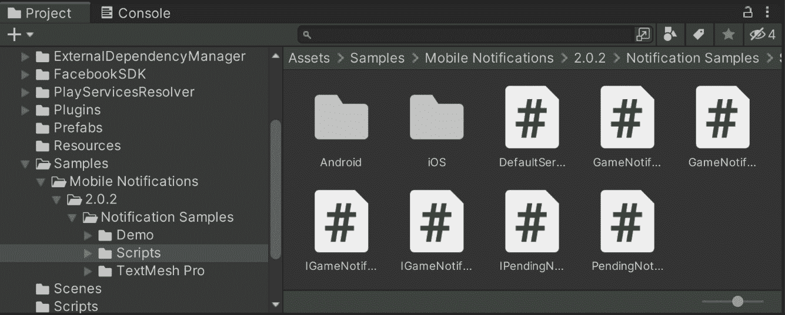

图 9.4：通知样本脚本文件夹

这为我们提供了所需的代码——特别是 `GameNotificationManager` 类——可以添加到我们的脚本中。在这个时候，我们可以将这些脚本移动到我们的 `Scripts` 文件夹的子文件夹中，并删除其他文件，或者保持文件在当前位置。

要开始在屏幕上显示通知，我们首先需要在我们的级别中添加一个新的对象，该对象将包含游戏通知管理器：

1.  如果还没有打开，请打开 **MainMenu** 场景。从那里，通过访问 **GameObject** | **Create Empty** 创建一个新的游戏对象。

1.  从 `Notifications Manager` 中，为了整洁，通过右键点击 **Transform** 组件并选择 **Reset Position** 选项来重置 **Transform** 组件的 **Position** 属性。

1.  之后，附加 `gamen`，然后从列表中选择 **Game Notifications Manager**。它应该看起来像以下截图：

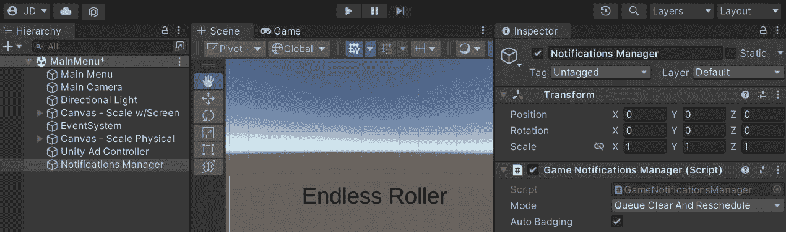

图 9.5：添加游戏通知管理器

在组件放置完毕后，我们可以进行创建第一个通知所需的设置。由于 `GameNotificationsManager` 类的实现，我们需要另一个脚本来发送通知，我们将称之为 `NotificationsController`。

1.  从 `Assets/Scripts` 文件夹创建一个新的 C# 脚本，命名为 `NotificationsController`。双击新创建的文件以打开你选择的代码编辑器。

1.  接下来，为该类添加以下代码：

```kt
using UnityEngine;
using NotificationSamples; /* GameNotificationManager */
public class NotificationsController : MonoBehaviour
{
    private GameNotificationsManager notificationsManager;
    // Start is called before the first frame update
    private void Start()
    {
        /* Get access to the notifications manager */
        notificationsManager =
            GetComponent<GameNotificationsManager>();
        /* Create a channel to use (required for Android)
        */
        var channel = new
            GameNotificationChannel("channel0",
                "Default Channel",
                    "Generic Notifications");
        /* Initialize the manager so it can be used. */
        notificationsManager.Initialize(channel);
    }
}
```

在前面的代码中，我们首先通过组件获取对 `GameNotificationsManager` 类的访问权限。由于我们将此脚本附加到包含此脚本的同一游戏对象上，我们可以使用 `GetComponent` 函数。之后，我们创建一个频道来发布我们的通知。最后，我们使用该频道初始化 `GameNotificationsManager` 组件。

1.  保存你的脚本并返回到 Unity 编辑器。在 **检查器** 窗口中，将 **通知控制器** 脚本附加到 **通知管理器** 对象上，如图下所示：

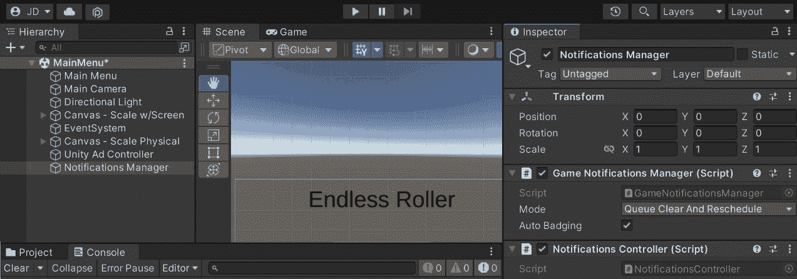

图 9.6：添加通知管理器

现在我们已经完成了设置，让我们看看我们如何实际安排一个通知发生。

# 提前安排通知

创建通知的最常见形式之一是要求玩家在以后的时间回来玩游戏。这鼓励用户继续玩我们的游戏，并多次回来。我们可以通过以下步骤设置未来的交付时间来实现这一点：

1.  打开 `NotificationsController` 脚本，并向其中添加以下函数：

    ```kt
    public void ShowNotification(string title, string body,
    DateTime deliveryTime)
    {
        IGameNotification notification =
            notificationsManager.CreateNotification();
        if (notification != null)
        {
            notification.Title = title;
            notification.Body = body;
            notification.DeliveryTime = deliveryTime;
        notificationsManager.ScheduleNotification(
            notification);
        }
    }
    ```

此函数接受三个参数——标题、正文和发送通知的时间。

1.  此函数需要使用 `System` 命名空间中的 `DateTime` 类，因此请在 `NotificationsController` 文件顶部添加以下行：

    ```kt
    using System; /* DateTime */
    ```

1.  在测试中调用函数，以确保一切设置正确，让我们在 `Start` 函数中调用该函数，添加以下突出显示的代码：

    ```kt
    // Start is called before the first frame update
    private void Start()
    {
        /* Get access to the notifications manager */
        notificationsManager =
            GetComponent<GameNotificationsManager>();
        /* Create a channel to use for it (required for
           Android) */
        var channel = new
            GameNotificationChannel("channel0",
                "Default Channel",
                    "Generic Notifications");
        /* Initialize the manager so it can be used. */
        notificationsManager.Initialize(channel);
        /* Create sample notification to happen in 5
           seconds */
        var notifText = "Come back and try to beat your
            score!!";
        var notifTime = DateTime.Now.AddSeconds(5);
    ShowNotification("Endless Runner", notifText,
            notifTime);
    }
    ```

在此示例中，我们将 `"Endless Runner"` 作为标题，将 `"Come back!"` 作为正文，对于第三个参数，我们通过使用 `DateTime.Now` 获取当前时间，然后使用 `AddSeconds` 方法添加 5 秒，传递 `5`。

1.  保存脚本并返回到 Unity 编辑器。

1.  不幸的是，你无法在您的电脑上测试通知是否工作。我们必须导出游戏以查看它是否正确工作。

1.  将你的游戏导出到你的设备上并开始游戏。正如你所看到的，我们的通知正在正常工作！

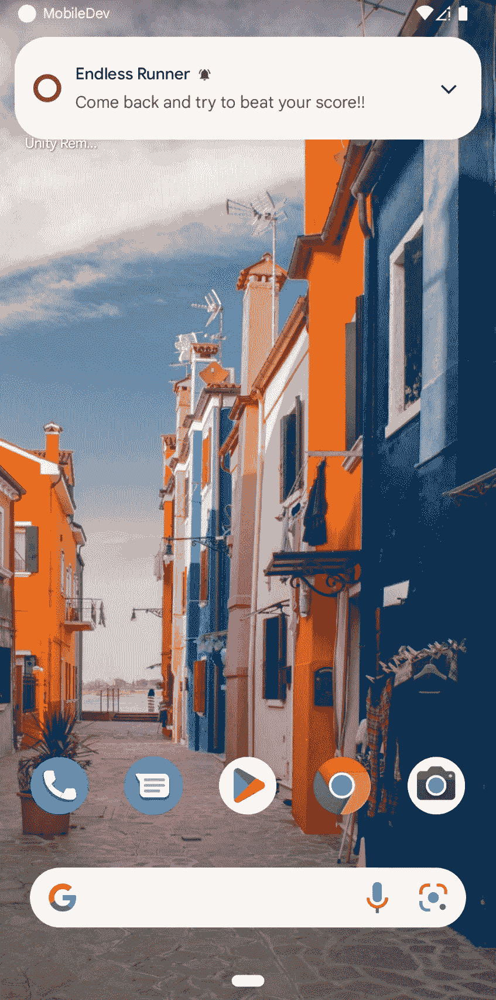

图 9.7：我们的默认通知正常工作

重要提示

默认情况下，**游戏通知管理器**组件的**模式**设置为**队列清除和重新安排**，这将导致如果你打开游戏，将无法看到通知。如果你希望始终看到通知，请将模式更改为**无队列**。

1.  通常情况下，这类通知应该在玩家上次玩完游戏后的一天发送。我们可以通过修改函数来实现这一点：

    ```kt
        // Start is called before the first frame update
        private void Start()
        {
            /* Get access to the notifications manager */
            notificationsManager =
            GetComponent<GameNotificationsManager>();
            /* Create a channel to use (required for
               Android) */
            var channel = new
                GameNotificationChannel("channel0",
                    "Default Channel",
                        "Generic Notifications");
            /* Initialize the manager so it can be used.
            */
            notificationsManager.Initialize(channel);
            /* Create sample notification to happen in 5
               seconds */
            var notifText = "Come back and try to beat
                your score!!";
            var notifTime = DateTime.Now.AddDays(1);
            ShowNotification("Endless Runner", notifText,
                notifTime);
        }
    ```

这样，当我们达到某个等级时，通知将在一天后显示，但每次我们进入主菜单时也会发生这种情况。为了防止这种情况，我们可以添加一个`static bool`变量，在添加通知时将其打开。在 Unity 中，当一个变量被标记为`static`时，它将在整个程序运行过程中保持一致。要添加此变量，请按照以下步骤操作：

1.  更新脚本，添加以下加粗显示的代码：

    ```kt
    private static bool addedReminder = false;
        // Start is called before the first frame update
        private void Start()
        {
            /* Get access to the notifications manager */
            notificationsManager =
            GetComponent<GameNotificationsManager>();
            /* Create a channel to use (required for
               Android) */
            var channel = new
                GameNotificationChannel("channel0",
                    "Default Channel",
                        "Generic Notifications");
            /* Initialize the manager so it can be used.
            */
            notificationsManager.Initialize(channel);
            /* Check if the notification hasn't been added
               yet */
            if (!addedReminder)
            {
                /* Create sample notification to happen
                   later */
                var notifText = "Come back and try to beat
                    your score!!";
                var notifTime = DateTime.Now.AddDays(1);
                ShowNotification("Endless Runner",
                    notifText, notifTime);
                /* Cannot be added again until the user
                   quits game */
                addedReminder = true;
            }
        }
    ```

1.  保存你的脚本。现在，每次我们玩游戏时，我们只会看到一次通知！

这展示了我们如何在脚本中创建通知，但到目前为止，通知看起来有点简单。幸运的是，我们可以自定义通知，这是我们接下来要做的。

注意

如果你想要了解如何通过 Google Firebase 等工具从 Unity 外部发送通知到你的应用，请查看[`firebase.google.com/products/cloud-messaging`](https://firebase.google.com/products/cloud-messaging)。

# 自定义通知

Unity 包含一些默认的视觉效果，用于与通知一起使用，但通常，用我们自己的内容替换可以帮助我们的游戏脱颖而出，并使玩家更具视觉吸引力。为了为 Android 通知提供自定义图标，你需要有一个至少 48 x 48 像素的小图标，并且只有白色像素和透明的背景。大图标至少需要 192 x 192 像素，可以有任何我们想要的颜色。你可以创建自己的图像，或者使用示例代码中提供的`Hi-ResIcon.png`和`Small-ResIcon.png`图像，这些图像位于 GitHub 仓库的`Chapter 08/Assets/Sprites`文件夹中。按照以下步骤进行自定义：

1.  从**项目**窗口中选择你计划用于小图标和大图标的图像。

1.  在选择图像后，转到**检查器**窗口并检查**Alpha Is Transparency**属性。

1.  最后，打开**高级**选项并检查**读写**属性。点击**应用**按钮以使更改生效。

你可以在以下截图中的**检查器**窗口中看到选项：

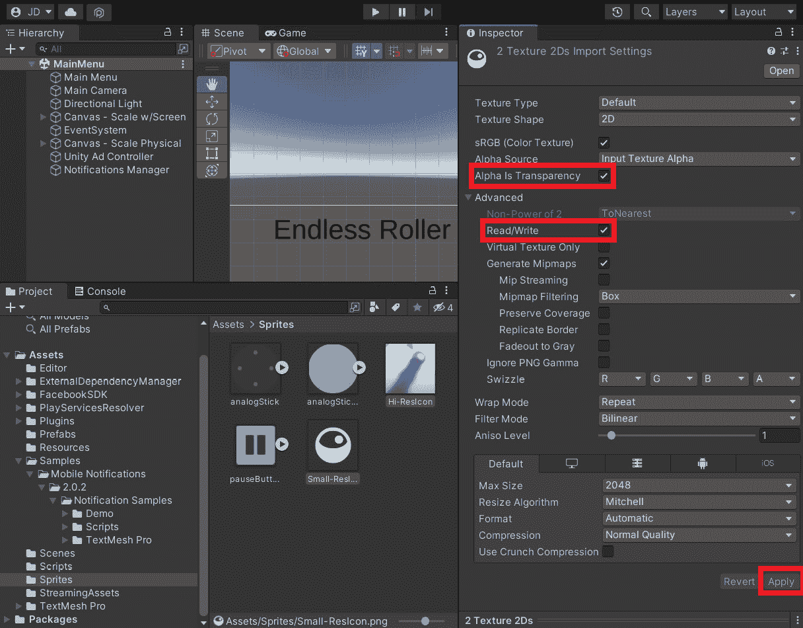

图 9.8：设置通知图标所需的属性

到目前为止，我们的图片已经准备好了，我们可以开始将它们放入通知中。为此，我们需要进入**项目设置**菜单：

1.  通过访问**编辑** | **项目设置**来打开**项目设置**菜单。

1.  从那里，转到**移动通知**设置选项。

1.  从菜单中，您将看到两个选项——iOS 和 Android。我们希望使用 iOS 选项的默认属性，因此如果尚未选择，我们首先选择**Android**。

1.  检查**设备重启时重新安排通知**选项。这将使得如果有人再次玩游戏，他们将不再收到我们之前创建的通知。这有助于用户不会因为频繁收到垃圾信息而感到烦恼。

1.  接下来，在**通知图标**下，点击加号（**+**）图标。将小图标图像拖放到第一个**2D 纹理**选项中。然后，再次点击加号（**+**）图标，并将**类型**更改为**大号**。之后，将您的大图标分配到 2D 纹理位置：

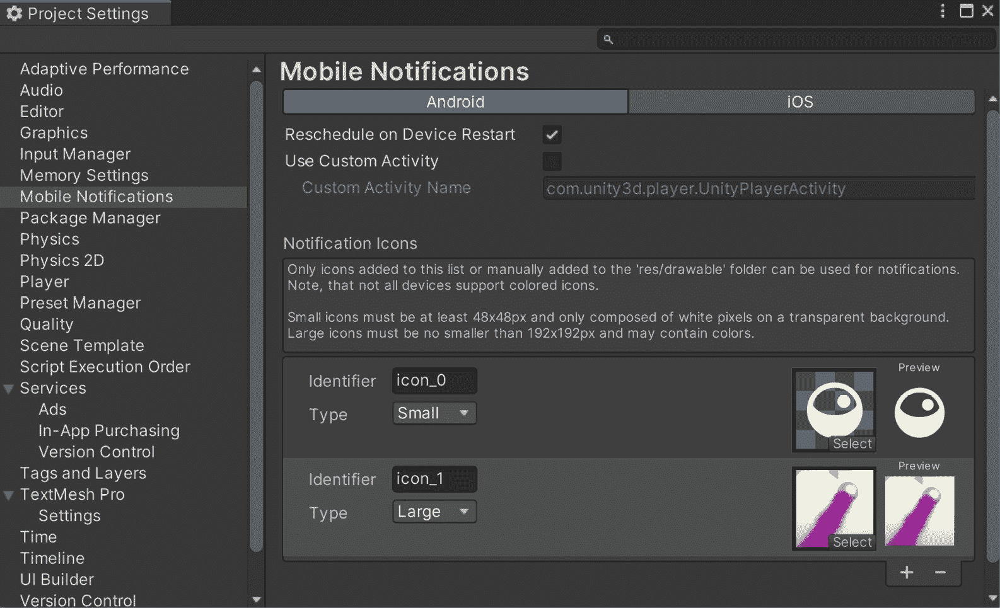

图 9.9：设置移动通知图标

1.  然后，返回到`NotificationsController`脚本并更新`ShowNotification`函数以使用我们新的图标：

    ```kt
    public void ShowNotification(string title, string body, DateTime deliveryTime)
    {
        IGameNotification notification =
        notificationsManager.CreateNotification();
        if (notification != null)
        {
            notification.Title = title;
            notification.Body = body;
            notification.DeliveryTime = deliveryTime;
            notification.SmallIcon = "icon_0";
            notification.LargeIcon = "icon_1";
            notificationsManager.ScheduleNotification(
                notification);
        }
    }
    ```

1.  保存您的脚本并返回到 Unity 编辑器。将您的游戏导出为 Android，您应该会看到图标已更新。现在，通知将显示工具栏中的小图标，如图下所示：

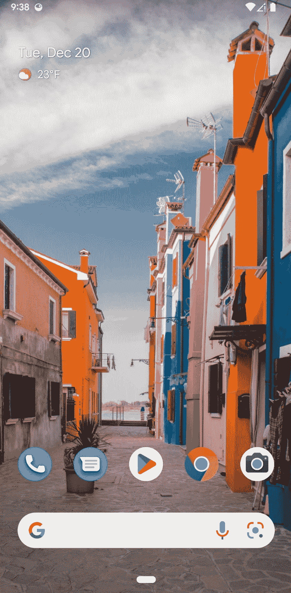

图 9.10：显示小通知图标

当访问通知本身时，它将使用两个图标！这可以在以下屏幕截图中看到：

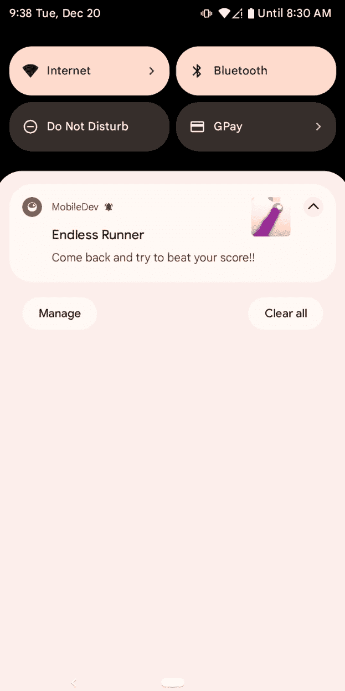

图 9.11：从通知栏中查看带有两个图标的通知

您还可以通过使用如下类似的行来修改其他属性，例如 iOS 中使用的徽章数字：

```kt
notification.BadgeNumber = 5;
```

重要提示

想要了解更多关于如何自定义通知的信息，请查看[`docs.unity3d.com/Packages/com.unity.mobile.notifications@1.0/manual/index.html`](https://docs.unity3d.com/Packages/com.unity.mobile.notifications@1.0/manual/index.html)。

这允许我们的通知看起来就像我们想要的那样，具有我们希望拥有的尽可能多的光泽。现在我们已经将通知自定义成我们想要的样子，讨论如何取消我们不再希望发生的通知可能是有意义的。

# 取消通知

我们可能想要取消通知的几个原因。这可能是由于在游戏过程中，玩家做出了一个决定，导致某些内容不再相关。

对于这个示例，让我们创建一个示例通知，在我们有机会取消它之前取消它。但为了取消一个通知，我们必须有一种方法来知道哪个通知是哪个。幸运的是，通知管理器有一个名为`Id`的属性，每个通知都有一个。我们可以手动设置通知，或者 Unity 会为我们生成它。在我们的情况下，我们将使用自动生成的：

1.  打开`NotificationsController`脚本并转到`ShowNotification`函数。更新如下：

    ```kt
    public int? ShowNotification(string title, string body, DateTime deliveryTime)
    {
        IGameNotification notification =
        notificationsManager.CreateNotification();
        if (notification != null)
        {
            notification.Title = title;
            notification.Body = body;
            notification.DeliveryTime = deliveryTime;
            notification.SmallIcon = "icon_0";
            notification.LargeIcon = "icon_1";
            var pendingNotif =
                notificationsManager.ScheduleNotification(
                    notification);
            return pendingNotif.Notification.Id;
        }
        return null;
    }
    ```

注意，这个函数的返回类型已从`void`更改为`int?`，问号不是笔误。这被称为`System.Nullable`结构体，它基本上是一种特殊类型，允许我们有一个变量，它可以包含与其关联的类型的任何值，也可以被分配为`null`。这意味着这个值可以设置也可以不设置。一些平台，如 PC，没有对系统通知的支持，因此在这些情况下，他们选择使用`null`而不是类似*负一*的东西。

1.  现在我们已经更新了脚本，让我们现在展示一个示例，说明我们如何取消一个通知。转到`Start`函数并更新如下：

    ```kt
    // Start is called before the first frame update
    private void Start()
    {
        /* Get access to the notifications manager */
        notificationsManager =
        GetComponent<GameNotificationsManager>();
        /* Create a channel to use (required for Android)
        */
        var channel = new
            GameNotificationChannel("channel0",
                "Default Channel",
                    "Generic Notifications");
        /* Initialize the manager so it can be used. */
        notificationsManager.Initialize(channel);
        /* Check if the notification hasn't been added yet
        */
        if (!addedReminder)
        {
            /* Create sample notification to happen in 5
               seconds */
            var notifText = "Come back and try to beat
                your score!!";
            // After 5 seconds
            var notifTime = DateTime.Now.AddSeconds(5);
            // After 1 day
            //notifTime = DateTime.Now.AddDays(1);
            ShowNotification("Endless Runner", notifText,
                notifTime);
            // Example of canceling a notification
            var id = ShowNotification("Test", "Should Not
                Happen", notifTime);
            if(id.HasValue)
            {
                notificationsManager.CancelNotification(
                    id.Value);
            }
            /* Cannot be added again until the user quits
               game */
            addedReminder = true;
        }
    }
    ```

1.  保存你的脚本并构建你的游戏。如果你在你的 Android 或 IOS 设备上打开项目，你应该能够看到我们设置为不可取消的验证正常播放。但被取消的那个没有发生。

小贴士

你也可以通过简单地从`GameNotificationManager`类中调用`CancelAllNotifications`函数一次性取消所有通知。有关取消通知的更多信息，请参阅[`docs.unity3d.com/Packages/com.unity.mobile.notifications@1.0/manual/index.html`](https://docs.unity3d.com/Packages/com.unity.mobile.notifications@1.0/manual/index.html)。

# 摘要

到目前为止，我们已经看到了如何利用 Unity 的移动通知包为我们的玩家创建通知。我们学习了如何安排它们在未来发生，以及如何自定义这些通知以拥有我们独特的视觉风格！

我们现在已经为玩家提供了所有必要的条件来玩游戏并返回我们的游戏，但我们只依赖于我们创建的内容。除此之外，我们可能还想了解玩家在玩游戏时的行为。然后，我们可以利用这些信息来改进和/或调整我们的游戏。

在下一章中，我们将探讨如何使用 Unity Analytics 的工具来实现这一点。
