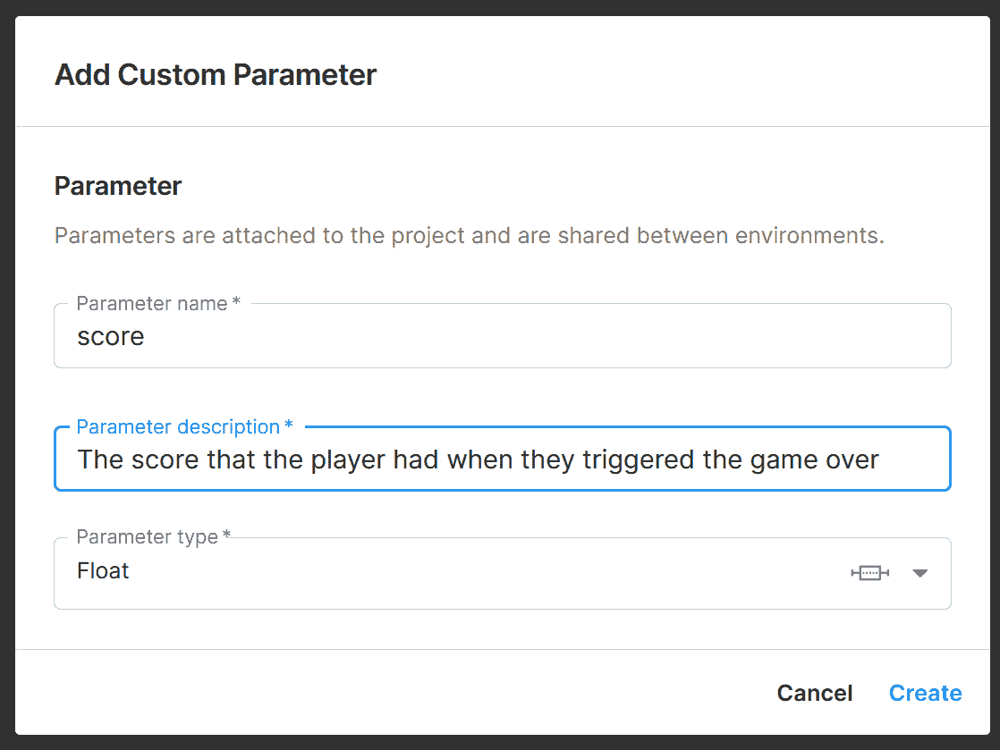
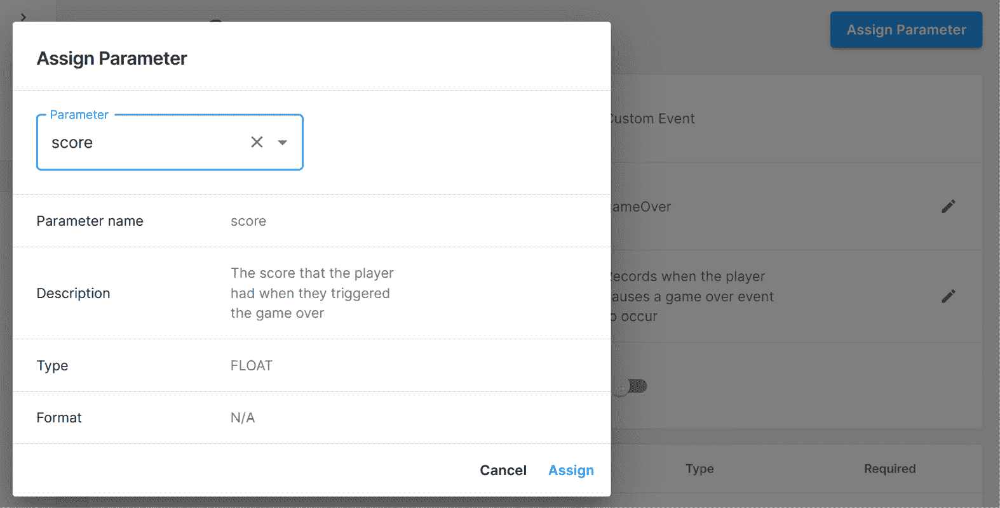

# 使用 Unity 分析

制作游戏是一次美妙的体验，也是大量的辛勤工作，但在设计项目时，您必须依靠您的经验和直觉来使其尽可能出色。在游戏行业中，我们通常会使用测试游戏——一个选择的人玩游戏并给出反馈的过程，然后我们使用收到的反馈来改进项目。

这种测试游戏通常是在现场进行的；然而，通过为移动设备创建游戏，发布后会有很多人玩游戏，并且他们中的大多数都有互联网连接。有了这种玩游戏和在线的组合，我们可以将有关游戏如何被玩的数据发送给我们自己。这仍然允许我们进行针对大量不同人群的测试游戏。能够查看我们的数据将使我们能够检查做出改变游戏的选择是否正确，并且我们能够即时调整我们的游戏。

这些数据可能关于玩家在游戏中倾向于在哪里死亡这样简单的事情，或者像他们多久回来玩一次、每天平均玩游戏的时间、同时有多少用户、人们在停止游戏前玩了多久以及他们做出的选择这样的事情。在本章的整个过程中，我们将学习如何通过使用 Unity 的 Gaming Services 平台和内置分析系统来了解用户的行为。

本章将涵盖多个主题。本章本身是一个从开始到结束的简单步骤过程。以下是我们的任务概述：

+   设置 Unity 分析

+   跟踪自定义事件

+   使用漏斗分析器

+   使用远程配置调整属性

# 技术要求

本书使用 Unity 2022.1.0b16 和 Unity Hub 3.3.1，但步骤应该在未来编辑器的版本中只需进行最小改动即可。如果您想下载本书中使用的确切版本，并且有新版本发布，您可以访问 Unity 的下载存档[`unity3d.com/get-unity/download/archive`](https://unity3d.com/get-unity/download/archive)。您还可以在*Unity 编辑器系统要求*部分找到 Unity 的系统要求[`docs.unity3d.com/2022.1/Documentation/Manual/system-requirements.html`](https://docs.unity3d.com/2022.1/Documentation/Manual/system-requirements.html)。要部署您的项目，您需要一个 Android 或 iOS 设备。

您可以在 GitHub 上找到本章中提供的代码文件[`github.com/PacktPublishing/Unity-2022-Mobile-Game-Development-3rd-Edition/tree/main/Chapter10`](https://github.com/PacktPublishing/Unity-2022-Mobile-Game-Development-3rd-Edition/tree/main/Chapter10)。

# 设置分析

尽管我们已从 Unity 游戏服务中激活了 Analytics 选项，以便在 *第七章* *使用 Unity Ads 进行广告* 中使用 Unity 的广告系统，但我们并没有真正深入到该系统本身。现在让我们按照以下步骤完成该设置的设置：

1.  首先，我们需要在我们的项目中安装 Unity Analytics 包。我们可以通过返回 Unity 编辑器并打开包管理器来实现，方法是转到 **窗口** | **包管理器**。

1.  这本书所使用的 Unity 版本存在一个错误，Analytics 包默认不会显示；相反，Unity 会显示遗留的 Analytics 库包。然而，可以通过点击 `com.unity.services.analytics` 来添加新包。如果一切顺利，你应该能够通过检查 **包** **管理器** 窗口来确认 Analytics 包已正确安装：


图 10.1：附加了 Analytics

下一步是初始化 SDK 并确保我们的用户同意记录他们引起的事件。为此，我们需要编写一些代码。

1.  从 `Assets/Scripts` 文件夹创建一个新的 C# 脚本，命名为 `AnalyticsManager`。

1.  双击新添加的脚本，使用您选择的代码编辑器打开它，并使用以下代码：

    ```kt
    using System.Collections.Generic; /* List */
    using Unity.Services.Analytics; /* AnalyticsService, ConsentCheckException */
    using Unity.Services.Core; /* UnityServices */
    using UnityEngine;
    public class AnalyticsManager : MonoBehaviour
    {
        // Start is called before the first frame update
        async void Start()
        {
            try
            {
                await UnityServices.InitializeAsync();
                List<string> consentIdentifiers = await
                    AnalyticsService.Instance
                        .CheckForRequiredConsents();
            }
            catch (ConsentCheckException)
            {
                /* Something went wrong */
            }
        }
    }
    ```

1.  保存脚本并返回到 Unity 编辑器。

这是初始化 SDK 以及向 Unity 游戏服务发送事件所需的最少代码量。

注意，这里有几个关键词之前尚未使用过。例如，我们的 `Start` 函数在返回类型前有 `async`。同样，在两个函数调用之前也有 `await`。在这里，我们正在使用一种称为异步编程的东西。`await` 关键字允许我们在 `async` 方法返回值之前等待。因此，主应用程序线程在那里停止，直到它收到返回值。如果我们没有使用 `await` 关键字，下一个函数将立即调用，由于我们需要在继续之前计算出结果，这就是为什么我们使用它的原因。`async` 关键字启用了 `await` 关键字。因此，任何使用 `await` 的方法都必须标记为 `async`。

注意

有关 `async` 和 `await` 的更多信息，请查看官方 MSDN 文档，网址为 [`learn.microsoft.com/en-us/dotnet/csharp/programming-guide/concepts/async/`](https://learn.microsoft.com/en-us/dotnet/csharp/programming-guide/concepts/async/)。

此外，请注意我们有一个`try`和`catch`块。当我们使用`try`然后是一段代码块时，我们是在指出我们放在那里的代码有可能失败。例如，可能抛出一个异常。如果在执行`try`块期间捕获到类型为`ConsentCheckException`的异常，这意味着同意检查出了问题。

如果这种情况正常发生，Unity 会向控制台抛出错误。`catch`块中的代码处理这种异常情况。`catch`块是，而不是向控制台抛出错误并导致游戏中的问题，这是我们尝试解决问题的方法。在我们的情况下，我们希望处理不使用 Unity 服务运行游戏的方式，这可能会意味着我们根本不会记录事件。

注意

更多关于`try`和`catch`的信息，请查看官方 MSDN 文档：[`learn.microsoft.com/en-us/dotnet/csharp/language-reference/keywords/try-catch`](https://learn.microsoft.com/en-us/dotnet/csharp/language-reference/keywords/try-catch)。

当然，仅仅有这段代码是没有用的。我们必须实际运行它。所以为了做到这一点，我们需要将脚本添加到一个对象上。为了方便使用，我们将创建一个新的对象来附加这个脚本。

1.  在 Unity 编辑器中，通过转到`Analytics Manager`创建一个空的游戏对象，重置其位置，然后将 Analytics Manager 脚本添加到该对象上。


图 10.2：Analytics Manager 设置

只要**Analytics**被启用，当我们按下**播放**按钮开始游戏时，编辑器就会向 Analytics 服务发送 App Start 事件：

这个好处在于我们可以确保这个功能能够正确工作，而无需导出我们的游戏。然而，这个消息默认情况下不会显示给我们。我们可以启用编辑器控制台日志记录，通过启用脚本定义符号来允许我们在实验时获得额外的可见性。

1.  前往`UNITY_ANALYTICS_EVENT_LOGS`。完成后，点击**应用**按钮并等待它完成编译脚本。

提示

如果由于某种原因，你的脚本定义符号在 Android 平台上消失了，切换到 PC 设置并将值放入其中似乎可以纠正这个问题。

1.  保存项目并运行游戏。如果一切顺利，你应该会在**控制台**窗口中看到事件出现：


图 10.3：控制台接收我们的默认事件

现在我们已经使这个功能工作，我们可以检查游戏侧是否发生了事件。

1.  从 Unity 的顶部栏进入 **服务** | **常规设置**。从那里进入 **分析 – 游戏服务**，然后点击 **转到仪表板**。一旦进入，点击 **事件浏览器** 按钮，你应该能看到 Unity 收到的最新 100 个事件：


图 10.4：事件浏览器页面

现在我们已经设置了 Unity Analytics，让我们开始创建自己的自定义事件以进行跟踪！

# 跟踪自定义事件

Unity Analytics 自动执行多项不同操作以简化使用。然而，作为一名游戏设计师，你可能经常想要检查游戏的一些方面是否被使用，或者玩家是否到达了某些内容。为了跟踪这些信息，我们可以利用**自定义** **事件**系统。

自定义事件是用户在玩游戏时发送到云端的片段数据。每个自定义事件都可以有自己的参数，这将允许我们在数据生成时过滤发送的数据。我们将讨论如何通过代码使用云传输信息。

## 发送基本的自定义事件

我们将要发送的第一种事件只是一个事件名称。这可以用于跟踪人们访问某个地方的次数，或者检查是否出现了无效的情况。为了便于触发和测试跟踪，我们将使每次游戏暂停时发生一个事件。让我们看看步骤：

1.  打开 `PauseScreenBehaviour` 脚本，并在脚本顶部添加以下 `using` 语句：

    ```kt
    using Unity.Services.Analytics; /* AnalyticsService */
    ```

此命名空间包含 Unity 分析系统使用的所有函数。

1.  更新 `SetPauseMenu` 函数以包含以下突出显示的代码：

    ```kt
    /// <summary>
    /// Will turn our pause menu on or off
    /// </summary>
    /// <param name="isPaused">is the game currently paused</param>
    public void SetPauseMenu(bool isPaused)
    {
        paused = isPaused;
        /* If the game is paused, timeScale is 0,
           otherwise 1 */
        Time.timeScale = (paused) ? 0 : 1;
        pauseMenu.SetActive(paused);
        onScreenControls.SetActive(!paused);
        /* Send custom gamePaused event */
        if (paused && (AnalyticsService.Instance != null))
        {
            AnalyticsService.Instance.CustomData(
                "gamePaused");
            AnalyticsService.Instance.Flush();
        }
    }
    ```

当 `pauseMenu` 被激活时，此代码将调用 `AnalyticsService.Instance.CustomData` 函数。`AnalyticsService.Instance.CustomData` 的第一个参数是一个字符串，这是你希望事件拥有的名称。这个名称将在 Unity Analytics 中使用。如果可用网络连接，事件会自动每 60 秒发送一次。然而，如果你想立即上传所有记录的事件到服务器，也有 `AnalyticsService.Instance.Flush` 函数，它会在调用时立即上传事件。

1.  保存脚本，然后返回到 Unity 编辑器。一旦进入，开始玩游戏然后暂停。正如你所见，事件已成功通过云端发送！


图 10.5：暂停事件成功上传

以前，Unity Analytics 会接受你发送的任何事件。但是，使用这个新系统，你必须提前在仪表板上定义事件，否则它将忽略这些信息。因此，在我们开始在事件管理器中看到事件触发之前，我们需要去仪表板定义这个事件。

如前所述，信息在 Unity 仪表板上显示可能需要一些时间，但在这个时候查看这些信息将来可以在哪里接收是个好主意。

1.  从**仪表板**进入**分析**，然后选择**事件管理器**。

这是你可以看到从游戏中接收到的自定义事件和参数的地方。

1.  从那里，选择**添加新项**，然后选择**自定义事件**。


图 10.6：添加新的自定义事件

1.  将自定义事件命名为`gamePaused`，与我们在这里做的完全一样，用于传递到`SetPauseMenu`函数中的`CustomData`函数的字符串。我们还将为事件添加一个事件描述，供我们未来参考。之后，点击**创建**按钮，事件应该就准备好供我们使用了。


图 10.7：设置自定义事件详细信息

1.  最后，向下滚动到事件，并再次确认**启用**选项是开启的；否则，事件将只显示在事件浏览器的**无效事件**区域。


图 10.8：启用事件

1.  返回 Unity 编辑器并再次播放你的游戏，触发`gamePaused`事件，以确保它正确显示。

1.  等待大约 15 分钟，返回事件浏览器，并点击那里的`gamePaused`事件！为了更容易看到，你还可以点击`gamePaused`，然后点击**应用**按钮，以便仅将事件浏览器隔离出来以显示这些事件。

如果不是，事件浏览器中的事件更新可能需要一些时间，但它们最终会显示出来。


图 10.9：事件浏览器中的简单自定义事件

1.  接下来，点击**数据****探索器**选项。

在`gamePaused`事件被调用时。

小贴士

如果你刚刚创建了事件，可能需要长达 12 小时才能接收到信息。如果那样的话，稍后再检查。过去，我不得不等待长达 48 小时才能得到数据，所以如果它需要一段时间才显示出来，请不要担心，尽管我在 Unity 游戏服务的最新版本中还没有遇到这个问题。

1.  点击**添加事件**左侧的**+**按钮，将自定义事件添加到这个图表中。然后，选择**添加事件**下拉菜单，然后选择**gamePaused**。由于我们刚刚创建了事件，我们不会在分析中的先前日期看到它，但如果我们点击**柱状图**按钮来更改数据的显示方式，我们可以更容易地看到它：


图 10.10：添加事件

现在，当我们向下滚动时，我们可以看到`gamePaused`事件已经被调用了！

## 发送带属性的定制事件

我们还可能想要跟踪的是玩家在失败前能走多远。现在让我们看看如何做到这一点：

1.  在仪表板上，首先，转到事件管理器。点击`gameOver`，然后在**事件描述**字段中填写类似“记录玩家触发游戏结束事件时”的内容。之后，点击**创建**按钮。

1.  从那里，你将被带到事件页面。点击**分配参数**按钮，然后从**参数**下拉菜单中选择**添加****新参数**。


图 10.11：添加新参数

1.  对于参数名称，输入`score`，然后为参数填写一个描述。对于参数类型，选择**Float**，然后点击**创建**按钮。



图 10.12：添加自定义参数

1.  创建一个名为`gameOver`的新事件和一个自定义参数，我们将称之为`score`，它将是一个浮点数。然后点击`score`，然后点击**分配**。



图 10.13：分配分数参数

1.  最后，点击`gameOver`事件将在发生时被保存。Unity 将询问你是否确定要启用此事件；点击**启用**按钮以确保它会发生。


图 10.14：启用事件

1.  现在，返回 Unity 编辑器。首先，我们需要打开`ObstacleBehaviour`脚本以修改游戏结束时发生的行为。

1.  要使用参数利用 Unity Analytics，在文件顶部添加以下`using`声明：

    ```kt
    using Unity.Services.Analytics; /* AnalyticsService */
    using System.Collections.Generic; /* Dictionary */
    ```

顶部选项很明显，但我们还添加了`System.Collections.Generic`以便访问`Dictionary`类，我们将在下一部分代码中使用它。

1.  接下来，我们将更新`OnCollisionEnter`函数到以下内容：

    ```kt
    private void OnCollisionEnter(Collision collision)
    {
        var go = collision.gameObject;
        var playerBehaviour =
            go.GetComponent<PlayerBehaviour>();
        // First check if we collided with the player
        if (playerBehaviour)
        {
            // Destroy the player
            //Destroy(collision.gameObject);
            // Destroy (Hide) the player
            player = go;
            player.SetActive(false);
            /* If Unity Analytics doesn't exist will throw
               an exception */
            try
            {
                /* Define Custom Parameters */
                var eventData = new Dictionary<string,
                    object>
                {
                    { "score", playerBehaviour.Score }
                };
                AnalyticsService.Instance.CustomData("game
                    Over", eventData);
                AnalyticsService.Instance.Flush();
            }
            catch(ServicesInitializationException e)
            {
                /* Displays the exception but doesn't
                   break * the game */
                Debug.LogWarning(e.Message);
            }
            /* Call the function ResetGame after waitTime
               has passed */
            Invoke("ResetGame", waitTime);
        }
    }
    ```

在这个脚本中我们做了很多事情。首先，我们重写了检查玩家使用组件作为变量的代码，这样我们就不必再次调用`GetComponent`了。除此之外，主要新增的是调用`AnalyticsService.Instance.CustomData`函数时带有第二个参数。第二个参数（这是可选的）是一个字典，我们还没有讨论过。

使用`string`类作为键类型，以便你可以引用其他数据类型。

注意

关于字典的更多信息，请查看[`csharp.net-informations.com/collection/dictionary.htm`](http://csharp.net-informations.com/collection/dictionary.htm)。

我们将此代码包裹在`try`和`catch`块中，因为如果调用`AnalyticsService.Instance`并且它是`null`，Unity 编写的代码将抛出异常。这将导致游戏崩溃并停止工作。如果从标题屏幕开始游戏，游戏目前运行良好，但如果从游戏场景开始游戏，它将不再正确工作，因为 Analytics 尚未初始化。这次，与上一个示例不同，我添加了一行来实际打印出错误给出的消息作为警告。让我们的代码尽可能健壮总是一个好主意，这就是为什么我们添加了这个检查。

1.  保存脚本并返回到 Unity 编辑器。

1.  玩游戏并输掉。注意在`gameOver`事件中：


图 10.15：正在派发游戏结束事件

你也可以进入仪表板查看信息，但 Unity 表示可能需要 6 小时才能变得可见，尽管我通常在 15 分钟左右就能看到。你将立即在**控制台**窗口中看到消息，但由于它接收到的所有事件，它们在 Analytics 中不会立即填充，直到 Unity 端的后端计算完成。

1.  在等待之后，转到`gameOver`事件。

1.  为了能够看到我们在最右侧创建的`score`参数的值，点击看起来像**<>**的按钮来访问特定事件的 JSON 事件内容。请注意，我们可以在这里看到我们的分数值：


图 10.16：事件内容中的分数值

有了这些，我们现在知道如何访问事件了！

此信息以 JSON 文件的方式格式化。我们之前使用的`Dictionary`类。

事件浏览器的局限性之一是我们只能看到最近的 100 个事件。随着我们的项目越来越受欢迎，我们可能会遇到越来越多的活动。考虑到这一点，我们可能需要一种方法来解释这些信息。我们可以用来实现这一目标的方法之一是通过 SQL 数据探索器。这使我们能够访问创建的所有事件，但我们必须利用**结构化查询语言**（**SQL**），这是一种为管理数据库中存储的数据而创建的特定领域语言。

1.  点击**SQL 数据探索器**按钮打开菜单。请注意，**查询**字段包含一些默认文本。


图 10.17：SQL 数据探索器

1.  点击**运行**按钮以查看默认结果及其工作方式。一旦查询完成，你将能够使用从该查询中解释的数据创建图表。

1.  在 **图表设置** 下，将 **X 轴列** 设置为 **EVENT_DATE**，将 **Y 轴 1 列** 设置为 **COUNT(DISTINCT USER_ID)**，然后点击 **应用** 按钮。


图 10.18：图表设置

这将允许您以类似于我们在数据探索器中看到的方式创建图表，但如果我们要使用 SQL 的强大功能，这将给我们提供更精细的控制。

对于那些对进一步探索 SQL 感兴趣的人来说，市面上有关于 SQL 的整本书，但在这个案例中，我们想要从我们的自定义事件中提取分数值。因此，我们不想创建图表，而是想创建一个表格，这样我们除了编写一些自定义查询外，还可以看到如何导出数据。

1.  在 **查询** 字段中，将代码替换为以下内容：

    ```kt
    SELECT EVENT_JSON:score::FLOAT
    FROM EVENTS
    WHERE EVENT_NAME = 'gameOver'
    ```

此代码将遍历每个事件并检查事件名称是否为 `gameOver`。如果是，它将从中隔离 `score` 属性。这将允许我们创建整个项目中所有 `score` 属性的列表。

1.  点击 **运行** 按钮并等待其执行。一旦完成，您将看到顶部的 **共享** 按钮变为蓝色，您可以按下它。一旦选择，点击 **导出为 CSV 文件** 选项。

**CSV** 代表 **逗号分隔值**。这是一种使用逗号分隔文件中指定值的文件类型，但如果您使用 Google Sheets 或 Excel 打开文件，程序将能够解析文件以类似于漂亮的表格的形式。


图 10.19：Microsoft Excel 中的分数值表

这为我们提供了一种查看玩家在玩游戏过程中所达到的所有不同分数值的方法。这可以帮助我们看到人们是否表现良好或真的很差，并允许我们根据需要调整游戏。

使用以下类似的片段：

```kt
SELECT EVENT_JSON
FROM EVENTS
WHERE EVENT_NAME = 'gameOver'
```

之前的代码将确保，而不是第一个事件只显示 6.5199995，我们会有每个槽位都包含我们之前讨论过的全部 JSON 数据——在这种情况下，以下内容：

```kt
"{
  ""clientVersion"": ""0.1"",
  ""collectInsertedTimestamp"": ""2022-12-23
    05:36:22.379"",
  ""eventDate"": ""2022-12-23 00:00:00.000"",
  ""eventID"": 3072590187314819072,
  ""eventLevel"": 0,
  ""eventName"": ""gameOver"",
  ""eventTimestamp"": ""2022-12-23 14:36:19.072"",
  ""eventUUID"": ""0d924683-5667-4455-b899-722bfeae93cd"",
  ""gaUserAcquisitionChannel"": ""None"",
  ""gaUserAgeGroup"": ""UNKNOWN"",
  ""gaUserCountry"": ""KR"",
  ""gaUserGender"": ""UNKNOWN"",
  ""gaUserStartDate"": ""2022-07-28 00:00:00.000"",
  ""mainEventID"": 3072590187314819072,
  ""msSinceLastEvent"": 12124,
  ""platform"": ""PC_CLIENT"",
  ""score"": 6.51999473571777,
  ""sessionID"": ""0ce65df8-9696-40e8-ae44-924417e0d406"",
  ""timezoneOffset"": ""+0900"",
  ""userCountry"": ""KR"",
  ""userID"": ""21328f4689677b24baf59487ae951228""
}"
```

通过添加 `:score::FLOAT`，我们从 JSON 数据中获取 `score` 变量，并告诉计算机将其解释为浮点值。

对于那些对探索 SQL 更感兴趣的人，我建议查看 Unity 游戏服务的示例食谱 [`github.com/Unity-Technologies/UGS-SQL-Cookbook`](https://github.com/Unity-Technologies/UGS-SQL-Cookbook)，其中包含了一组常见的 SQL 查询和与 Unity 分析一起使用的最佳实践。

当然，这只是一个简单的例子，所以我建议您为用户达到重要里程碑时创建自定义事件——例如，当用户升级或进行 **内购**（**IAP**）时。

现在我们知道了如何创建不同类型的事件，让我们看看我们如何实际上跟踪事件并利用漏斗分析器工具了解更多关于玩家在做什么。

# 与漏斗一起工作

我们想了解关于玩家们的许多事情之一是他们在实际玩游戏的方式——例如，用户是否跳过了我们的教程？为了跟踪玩家如何通过一系列事件，我们使用了漏斗。漏斗帮助我们确定玩家在游戏中的流失点。

如果你看到很多人没有到达某个步骤，你可以假设在前面步骤中发生的事情导致人们停止玩我们的游戏。

注意

关于漏斗如何工作以及为什么你想使用它们的信息，请查看[`data36.com/funnel-analysis/`](https://data36.com/funnel-analysis/)。

漏斗基于自定义事件的概念，我们在本章的*使用属性发送自定义事件*部分使用了它。我们可以使用漏斗工具（之前称为漏斗分析器）来查看通过这些漏斗发送的数据，然后我们可以使用这些数据来做出明智的决定，关于应该对游戏做出哪些更改。按照以下步骤添加工具：

1.  从仪表板转到**分析**并选择**漏斗**：


图 10.20：漏斗页面

目前，还没有设置漏斗，因此我们应该创建一个。

1.  点击**+ 新建漏斗**按钮并填写以下截图中的详细信息。然后，滚动到最底部并点击**应用**按钮：


图 10.21：漏斗设置

如果你已经玩过游戏，你可以看到已经触发的事件的结果：


图 10.22：事件触发结果

在我们的案例中，我们已经玩游戏并失败了，所以我们目前有 100%的完成率。

1.  滚动到顶部页面并点击**保存漏斗**按钮。给漏斗起一个名字，描述你正在创建的内容，然后点击**保存**按钮。


图 10.23：漏斗设置

你应该能够选择该漏斗，并且它将提供有关它被调用的所有时间的信息。

这里使用的概念也可以很容易地以其他方式扩展，例如跟踪用户观看广告或进行游戏内购买的频率以及是什么原因导致他们这样做。

注意

当游戏运行正常时，漏斗分析非常出色，但如果游戏崩溃，也可以从 Unity Cloud Diagnostics 中获取相关的分析信息。有关该信息以及如何设置的信息，请参阅[`docs.unity.com/cloud-diagnostics/en/manual/CrashandExceptionReporting/SettingupCrashandExceptionReporting`](https://docs.unity.com/cloud-diagnostics/en/manual/CrashandExceptionReporting/SettingupCrashandExceptionReporting)。

# 摘要

在本章中，我们探讨了多种利用 Unity 的 Analytics 工具来提升游戏的方法，从理解玩家行为到根据这些反馈调整游戏，而无需用户下载我们游戏的新版本。

具体来说，我们学习了如何设置 Unity 编辑器中的 Unity Analytics 部分，然后我们看到了如何利用代码创建事件并将其发送到云端供我们查看。有了这些数据，我们学习了如何利用漏斗和漏斗分析器来更深入地了解我们的玩家。

现在我们已经了解了如何创建事件，接下来让我们看看利用 Unity Gaming Services 的另一个主要好处——使用远程配置功能更改项目，我们将在下一章中了解更多相关信息。
