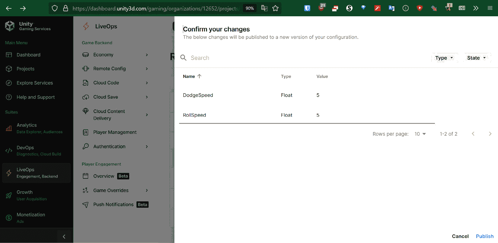

# 11

# 远程配置

获取您游戏的新构建版本并导出可能需要相当长的时间。实际上在 Unity 编辑器中进行更改需要时间，然后您必须导出游戏并在您针对的每个应用商店上上传新版本。然后，您必须花费时间等待它们批准应用，以及让每个人实际下载它。

我和学生讨论的其中一件事是创建可以轻松更改而无需打开 Unity 编辑器的项目。这可以通过使用数据驱动开发实践来实现，例如使用文本文件、AssetBundles 或 Unity 的**远程配置**（之前称为**远程设置**）菜单来构建关卡或遭遇，使我们能够即时修改已发布的游戏副本中的变量。

在本章中，我们将看到设置 Unity 的远程配置系统有多简单，以及我们如何通过改变玩家移动的速度来改变游戏难度来利用它进行一个简单的示例。

本章本身是一个从头到尾的简单步骤过程。以下是我们的任务概述：

+   远程配置设置

+   将游戏覆盖集成到游戏中

# 技术要求

本书使用 Unity 2022.1.0b16 和 Unity Hub 3.3.1，但步骤应该在未来版本的编辑器中只需进行最小更改即可。如果您想下载本书中使用的确切版本，您可以访问 Unity 的下载存档[`unity3d.com/get-unity/download/archive`](https://unity3d.com/get-unity/download/archive)。您还可以在**Unity 编辑器系统要求**部分找到 Unity 的系统要求[`docs.unity3d.com/2022.1/Documentation/Manual/system-requirements.html`](https://docs.unity3d.com/2022.1/Documentation/Manual/system-requirements.html)。要部署您的项目，您需要一个 Android 或 iOS 设备。

您可以在 GitHub 上找到本章中包含的代码文件，网址为[`github.com/PacktPublishing/Unity-2022-Mobile-Game-Development-3rd-Edition/tree/main/Chapter11`](https://github.com/PacktPublishing/Unity-2022-Mobile-Game-Development-3rd-Edition/tree/main/Chapter11)。

# 远程配置设置

为了让我们使用远程配置，我们首先需要做的是将远程配置包添加到我们的项目中。因此，让我们看看如何通过以下步骤来完成：

1.  从 Unity 编辑器中，通过点击屏幕左上角的云按钮或转到**窗口** | **通用** | **服务**来打开包管理器的**服务**窗口（如图 11.1 所示）。


图 11.1：服务按钮的位置

如果一切顺利，你应该会看到以下截图中的内容：


图 11.2：包管理器 | 服务

1.  从那里，向下滚动并点击**远程配置**包，然后点击右下角的**安装**按钮。如果一切顺利，您应该会看到以下截图类似的内容：


图 11.3：已安装的远程配置包

1.  关闭包管理器，通过转到**窗口** | **远程配置**来打开**远程配置**窗口。这将打开一个独立的窗口，然后我会将其拖放到控制台旁边以便于使用。如果一切顺利，您的编辑器应该看起来类似于以下截图：


图 11.4：添加了远程配置窗口

并且，就这样，远程配置包被正确安装了！

就像在前一章中我们需要创建 Unity 游戏服务和我们的项目之间的连接以便使用 Unity 分析一样，我们还需要做同样的事情来调整远程配置值。

## 创建键值对

我们首先需要做的是创建我们想要更改的变量：

1.  从 Unity 编辑器，如果**远程配置**窗口是打开的，点击**在仪表板中查看**选项。


图 11.5：远程配置页面

或者，对于在 Unity 仪表盘网站上的人，您可以点击**LiveOps**。一旦进入，在左侧，打开**远程配置**部分，然后点击位于其下的**配置**标签页。

这个部分是我们设置和修改值的位置。就像使用字典一样，设置是键值对，尽管目前只有一个配置`production`，但可以创建许多其他环境。通常，可以使用两种配置 - 来自**构建设置**窗口的`True`。

1.  点击`RollSpeed`。在**选择类型**下拉菜单中，选择**浮点数**。最后，在**浮点数值**字段中输入**5**。最后，点击**添加**按钮：


图 11.6：添加键

然后，让我们为`DodgeSpeed`变量（值为**5**）做同样的事情：


图 11.7：添加了 DodgeSpeed 和 RollSpeed 键

1.  重要的是要注意，这实际上并没有做出任何改变。事实上，您会在值上方看到一个说明，指出有未发布的更改。注意那里有一个大蓝色按钮，上面写着**发布**。点击它以部署更改。它将弹出一个窗口询问您是否要确认更改：



图 11.8：确认我们的更改

1.  现在我们有一些值可以获取，让我们看看我们实际上如何做到这一点。回到 Unity 编辑器。

1.  在**远程配置**窗口中，点击**拉取**按钮。如果一切顺利，你应该能看到添加到我们项目中的值：


图 11.9：拉取后添加到我们的远程配置中的值

每次你准备从项目中更改远程配置时，拉取是一个好习惯，确保你总是拥有可能的最新的属性版本。并且，我们已经看到了如何创建不同的键值对添加到我们的项目中。

# 将游戏覆盖集成到游戏玩法中

现在我们已经看到了如何获取这些值以及系统是如何工作的，让我们看看我们如何将其集成到我们的项目中并使其影响游戏玩法：

1.  如果游戏玩法场景尚未打开，请打开它，并通过转到`Remote Config Manager`并重置其位置来创建一个新的 GameObject。

1.  然后，从`Assets\Scripts`文件夹中创建一个新的 C#脚本，命名为`RemoteConfigManager`。

1.  将新创建的`RemoteConfigManager`组件附加到我们在*步骤 1*中创建的`RemoteConfigManager`对象上。如果一切顺利，你的项目应该看起来类似于以下截图。


图 11.10：添加 RemoteConfigManager

1.  在`RemoteConfigManager`脚本中打开它，并用你选择的脚本编辑器替换其脚本，如下所示：

    ```kt
    using UnityEngine;
    using Unity.RemoteConfig; /* ConfigManager */
    public class RemoteConfigManager : MonoBehaviour
    {
        public PlayerBehaviour playerBehaviour;
        public struct userAttributes { }
        public struct appAttributes { }
        private void Awake()
        {
            ConfigManager.FetchCompleted +=
                ApplyRemoteSettings;
            ConfigManager.FetchConfigs<userAttributes,
                appAttributes>(new userAttributes(),
                    new appAttributes());
        }
        private void ApplyRemoteSettings(ConfigResponse
            configResponse)
        {
            /* Check if new settings have been loaded */
            if (configResponse.requestOrigin ==
                ConfigOrigin.Remote)
            {
                /* There are, so values should be updated
                */
               playerBehaviour.UpdateRemoteConfigValues();
            }
        }
    }
    ```

在`Awake`函数中，我们使用`ConfigManager.FetchConfigs`方法从远程服务器获取应用程序配置设置。在成功完成获取操作后，将触发`ConfigManager.FetchCompleted`事件。在这种情况下，我们添加了一个`ApplyRemoteSettings`函数，当该事件触发时也应该调用它，然后我们实现它。

该方法接受一个`ConfigResponse`结构体，它表示`RemoteConfig`获取的响应。值得注意的是`requestOrigin`属性，它是一个枚举，表示最后检索到的配置设置的来源点。它可以是三个选项之一：

+   `缓存`：我们当前会话中加载的配置设置是从之前的会话缓存的，因此没有加载新的配置设置

+   `默认`：当前会话中没有加载任何配置设置

+   `远程`：当前会话中从远程服务器加载了新的配置设置

在我们的情况下，只有当值是`远程`时，我们才需要做些事情。如果是这种情况，这意味着已经加载了新的设置，这意味着我们需要更新当前加载的值。

1.  然后，我们需要转到`PlayerBehaviour`脚本，并将以下内容添加到顶部部分，与其余的`using`语句一起：

    ```kt
      using Unity.RemoteConfig; /* ConfigManager */
    ```

1.  之后，我们需要将`UpdateRemoteConfigValues`函数添加到`PlayerBehaviour`类中，因为它目前不存在；否则，我们将得到编译器错误：

    ```kt
    /// <summary>
    /// Will update each value for this component we are using with /// Remote Config
    /// </summary>
    public void UpdateRemoteConfigValues()
    {
        /* Get the value from the cloud and set the value
           to use */
        float newRollSpeed =
            ConfigManager.appConfig.GetFloat("RollSpeed");
        Debug.Log("Update RollSpeed to: " + newRollSpeed);
        rollSpeed = newRollSpeed;
        /* Get the value from the cloud and set the value
           to use */
        float newDodgeSpeed =
           ConfigManager.appConfig.GetFloat("DodgeSpeed");
        Debug.Log("Update DodgeSpeed to: " +
            newRollSpeed);
        dodgeSpeed = newDodgeSpeed;
    }
    ```

在这种情况下，我们使用`ConfigManager`的`appConfig`属性，即`RuntimeConfig`对象，允许我们访问从云中获取的当前值，这些值是我们环境（s）当前设置的。然后，我们将`rollSpeed`和`dodgeSpeed`变量的当前值设置为从云中检索到的值。

关于`ConfigManager`类的更多信息，请查看以下内容：[`docs.unity3d.com/Packages/com.unity.remote-config@0.3/api/Unity.RemoteConfig.ConfigManager.htm`](https://docs.unity3d.com/Packages/com.unity.remote-config@0.3/api/Unity.RemoteConfig.ConfigManager.html)

1.  保存两个脚本并返回到 Unity 编辑器。然后，转到**层次结构**窗口，选择**远程配置管理器**，并在**检查器**窗口中，将**玩家行为**值分配给**玩家**对象。


图 11.11：添加玩家行为

1.  在游戏开始后，你应该能在`Debug.Log`语句中看到，它告诉我们值正在更新为我们在**远程配置**中放置的内容：


图 11.12：值更新正确

1.  由于`dodgeSpeed`和`rollSpeed`变量现在是通过`UpdateRemoteConfigValues`函数设置的，因此我们现在可以将它们从`PlayerBehaviour`脚本中隐藏起来，使类看起来如下所示：

    ```kt
    /// <summary>
    /// How fast the ball moves left/right
    /// </summary>
    [HideInInspector]
    public float dodgeSpeed = 5;
    /// <summary>
    /// How fast the ball moves forwards automatically
    /// </summary>
    [HideInInspector]
    public float rollSpeed = 5;
    ```

在这里，我们修改了两个属性，添加了`[HideInInspector]`标签，这将隐藏项目在**检查器**窗口中。我们还更改了变量，使用 XML 注释而不是工具提示，因为它们不再在**检查器**窗口中显示。

1.  保存脚本并选择**玩家**对象。从那里，转到**检查器**窗口，注意属性在**PlayerBehaviour**组件中不再可见：


图 11.13：值在检查器窗口中隐藏

现在，值将通过**远程配置**组件设置，用户不会对为什么他们的值被**玩家行为**中的内容所替换感到困惑。

在游戏运行时调整这些值可以非常实用，并允许你分享游戏更改，而无需要求用户下载新版本！

# 摘要

在本章中，我们学习了如何使用**远程配置**来实时调整我们的游戏。

重要提示

你可以用远程设置做更多的事情。你可以了解更多关于**远程配置**以及如何使用它来处理非默认参数的信息，请参阅[`docs.unity3d.com/Manual/UnityAnalyticsRemoteSettingsComponent.html`](https://docs.unity3d.com/Manual/UnityAnalyticsRemoteSettingsComponent.html)。

有了这些，我们游戏的所有实现细节都已经完成，但现在的游戏相当简陋。在下一章中，我们将探讨使用粒子系统、屏幕震动等特性来使我们的游戏更加精致的方法。
