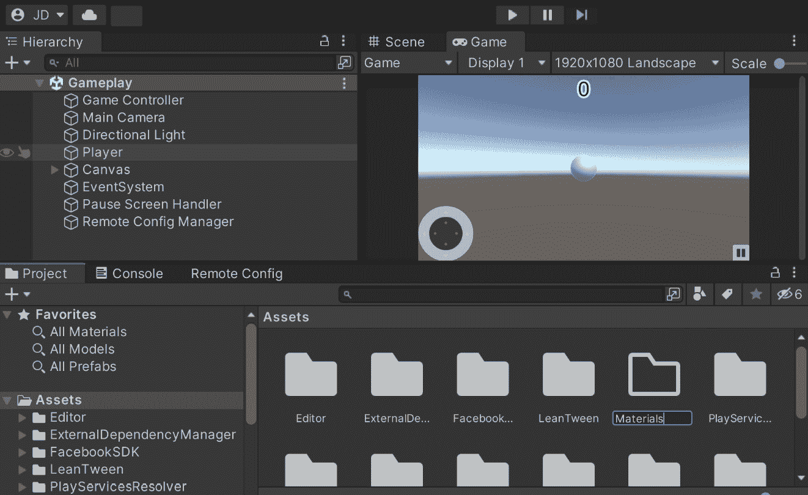
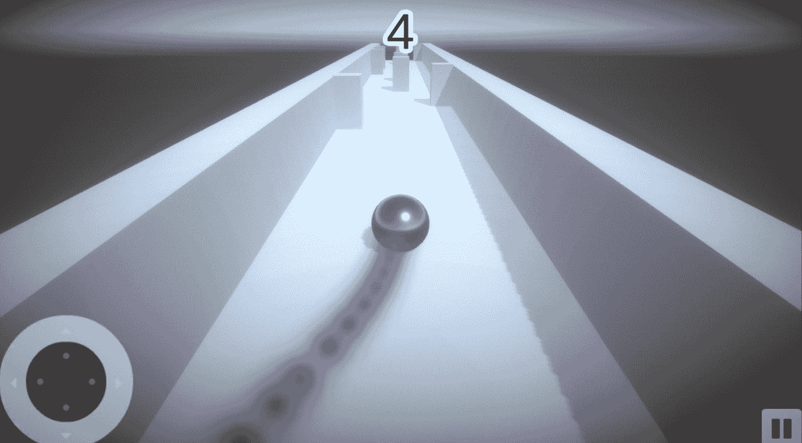
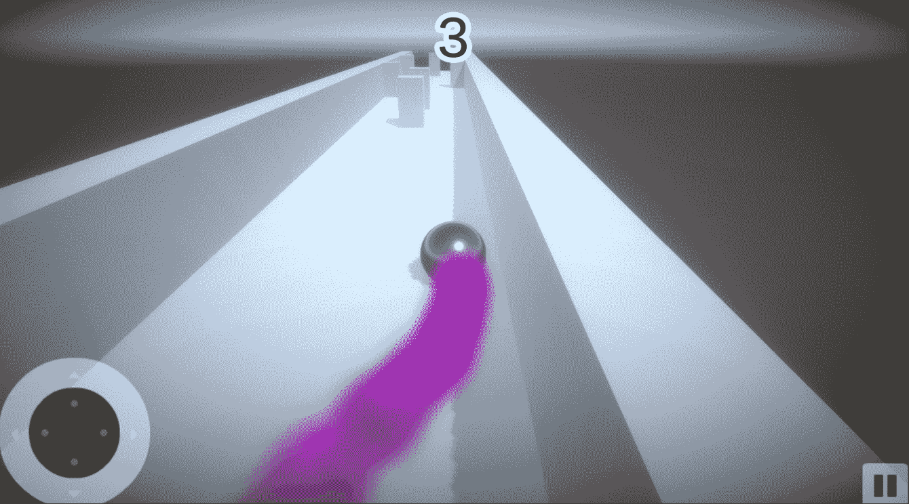

# 改善游戏感觉

我们现在有一个基本的游戏，但仅仅是...基本。在本章中，你将学习游戏开发者的一些秘密，将他们游戏的基本原型转变为一个经过大量打磨、令人满意的游戏体验，这被称为改善项目的游戏感觉。

也被称为*juiciness*，或者让我们的游戏更有“汁感”，在游戏行业的某些角落，**游戏感觉**是一个总称，用于描述我们在游戏中做的所有事情，以使用户的交互体验更加愉悦。这是现在大多数移动游戏都会做的事情，缺乏这种交互性会让其他人认为我们的项目缺乏打磨。

在本章中，你将学习如何将一些这些功能集成到你的项目中的一些不同方法。我们将从学习如何使用动画开始。然后，我们将看到如何使用 Unity 的材料系统来为我们的对象添加视觉吸引力。接着，我们将通过使用后处理效果来提高我们游戏的整体视觉质量。最后，我们将使用游戏开发者工具箱中最强大的工具之一，粒子系统，来改善玩家在环境中移动时的反馈。

本章涵盖了多个主题。它从开始到结束提供了一个简单的逐步过程。以下是我们将涵盖的任务概述：

+   使用 LeanTween 进行动画

+   将缓动添加到暂停菜单

+   与材料一起工作

+   使用后处理效果

+   添加粒子效果

# 技术要求

本书使用 Unity 2022.1.0b16 和 Unity Hub 3.3.1，但步骤应该在未来版本的编辑器中只需进行最小改动即可。如果你想下载本书中使用的确切版本，并且有新版本发布，你可以访问 Unity 的下载存档[`unity3d.com/get-unity/download/archive`](https://unity3d.com/get-unity/download/archive)。你还可以在**Unity 编辑器系统要求**部分找到 Unity 的系统要求[`docs.unity3d.com/2022.1/Documentation/Manual/system-requirements.html`](https://docs.unity3d.com/2022.1/Documentation/Manual/system-requirements.html)。为了部署你的项目，你需要一个 Android 或 iOS 设备。

你可以在 GitHub 上找到本章中提供的代码文件[`github.com/PacktPublishing/Unity-2022-Mobile-Game-Development-3rd-Edition/tree/main/Chapter12`](https://github.com/PacktPublishing/Unity-2022-Mobile-Game-Development-3rd-Edition/tree/main/Chapter12)。

# 使用 LeanTween 进行动画

目前，我们游戏的菜单完全静态。这虽然功能齐全，但并不能让玩家对我们的游戏产生兴趣。为了让游戏看起来更有活力，我们应该对菜单进行动画处理。能够使用 Unity 内置的动画系统是很好的，如果你想要同时修改许多不同的属性，它非常有用。如果你不需要精确控制，比如说，如果你只修改一个属性或者你想要通过代码纯动画化某个东西，你还可以使用一个插值库。

Tweening，简称“插值”，是动画和游戏开发中常用的一种技术，用于在指定的时间内，在两个状态或值之间创建平滑的过渡。它涉及将属性或一组属性从某个值逐渐过渡到另一个值。

如果给出了开始和结束点，库将负责中间的所有工作，以确保属性在指定的时间和速度内到达终点。通过使用 tween，开发者可以轻松地为他们的应用程序添加流畅且视觉上吸引人的动画，而无需手动处理插值计算和动画循环。插值库提供了方便的 API 和功能，以简单高效的方式创建和控制 tween。

我最喜欢的插值库之一是 Dented Pixel 的*LeanTween*，这是一个开源库，可以免费用于商业和非商业项目，针对移动设备进行了优化，并被许多游戏使用，包括《精灵宝可梦 GO》。在接下来的章节中，我们将首先安装和设置 LeanTween，然后看看我们如何使用它来动画化我们的标题屏幕 UI 菜单。

## LeanTween 设置

LeanTween 允许我们以仅一行代码的方式对对象进行旋转、震动、打击、移动、淡入淡出和调整，以多种不同的方式。它还允许我们在动画的开始、中间和结束时触发自定义事件，使我们能够有效地完成任何想要创建动画的事情，一旦熟悉了它，这种方式将变得非常强大。

既然我们知道我们想要在我们的项目中添加 tween，那么让我们首先将 LeanTween 引擎添加到我们的项目中。执行以下步骤：

1.  打开`LeanTween`然后按*Enter*。

1.  从那里，你将看到一个项目列表，第一个是**LeanTween**；选择它，你将被带到 LeanTween 的产品页面：


图 12.1：资产商店搜索

1.  一旦进入项目页面，点击按钮，如果有的话，按钮上会写着**添加到我的资产**或**在 Unity 中打开**，这取决于你是否已经有了这个包。此时你可能需要登录你的 Unity 账户。一旦添加，从**包管理器**中，继续从资产页面点击**导入**按钮。


图 12.2：包管理器

重要提示

这里包管理器中的包可能看起来与你的不同，因为它们是我个人从资源商店购买的。

1.  你应该在这里看到一个 `Framework` 文件夹；然而，其他的可能对你也有用，所以请随意使用它们。

1.  一旦你完成了选择，点击**导入**按钮：


图 12.3：导入 Unity 包对话框

1.  我们不再需要包管理器了，所以请继续关闭它。你会注意到现在我们已经在我们的 `Assets/LeanTween/Framework` 文件夹中选择了文件：


图 12.4：导入 LeanTween

有了这些，我们已经设置了 LeanTween。

重要提示

你可能还想考虑其他缓动库，例如 iTween 和 DOTween。有关更多信息以及它们的比较，请查看[`dotween.demigiant.com/#enginesComparison`](http://dotween.demigiant.com/#enginesComparison)。

现在我们已经建立了一个缓动系统，让我们看看我们如何实际使用它！

## 创建一个简单的缓动

在过渡到游戏开发之前，缓动（或*中间插值*）在动画中变得流行，这个过程是给定起始值和结束值时，计算机将在两个状态之间生成中间帧，使得起始值看起来平滑地演变到第二个值。缓动是我们必须提供的信息，以便开始缓动过程。

现在我们已经将 LeanTween 包含到我们的项目中，我们可以在代码中使用它。为此，执行以下步骤：

1.  从 Unity 编辑器中，通过转到**项目**窗口并双击**MainMenu**场景来打开**MainMenu**级别。

1.  现在，转到 `Scripts` 文件夹，通过双击它来打开 `MainMenuBehaviour`。

1.  我们将添加以下新函数，我们将使用它来使对象从屏幕左侧移动到中心：

    ```kt
    /// <summary>
    /// Will move an object from the left side of the screen
    /// to the center
    /// </summary>
    /// <param name="obj">The UI element we would like to
    /// move</param>
    public void SlideMenuIn(GameObject obj)
    {
        obj.SetActive(true);
        var rt = obj.GetComponent<RectTransform>();
        if (rt)
        {
            /* Set the object's position offscreen */
            var pos = rt.position;
            pos.x = -Screen.width / 2;
            rt.position = pos;
            /* Move the object to the center of the screen
               (x of 0 is centered) */
            LeanTween.moveX(rt, 0, 1.5f);
        }
    }
    ```

在我们使用 LeanTween 移动任何东西之前，我们首先将我们的对象（`obj`参数）的位置设置在屏幕之外，通过设置`x`位置。需要注意的是，在处理 Unity 中的 UI 元素时，默认情况下我们处理的是屏幕空间，正如你从*第三章*中回忆的，*移动输入/触摸控制*，这意味着我们是按像素移动的。

从这里，我们可以看到我们正在从 LeanTween 调用 `moveX` 函数。我们使用的版本接受三个参数，第一个是我们希望移动的 `RectTransform` 对象，第二个是我们希望移动到的 `x` 位置。根据我们设置的锚点和中心点，*x* 轴上的 0 位置实际上是居中的，所以我们传递 `0`。最后，我们有我们希望过渡发生的时间（以秒为单位）。

1.  现在我们有了这个函数，让我们实际调用它。更改`MainMenuBehaviour`脚本的`Start`函数，使其看起来如下：

    ```kt
    protected virtual void Start()
    {
        /* Initialize the showAds variable */
        bool showAds =
            (PlayerPrefs.GetInt("Show Ads", 1) == 1);
        UnityAdController.showAds = showAds;
        /* Slide in the login menu if it exists */
        if (facebookLogin != null)
    {
            SlideMenuIn(facebookLogin);
        }
        /* Unpause the game if needed */
        Time.timeScale = 1;
    }
    ```

我们首先通过调用`SlideMenuIn`函数将 Facebook 登录菜单显示到屏幕上，该函数会将菜单移动到屏幕中央。LeanTween 默认使用游戏的`Time.timeScale`属性来缩放移动。当我们从暂停菜单离开游戏并返回主菜单时，游戏仍然处于暂停状态。这确保了在我们想要滑动这个菜单时，游戏不会被暂停。当我们开始构建暂停菜单时，我们将看到如何在游戏暂停时使我们的缓动效果仍然工作。

如果你现在玩游戏，你会注意到 Facebook 登录屏幕现在会从屏幕外移动到屏幕中央。

目前，对象以相当静态的方式移动。我们可以通过添加一些额外的功能，例如`easeType`，来给这个缓动效果增加活力。

1.  将以下高亮代码添加到`SlideMenuIn`函数中：

    ```kt
    /// <summary>
    /// Will move an object from the left side of the screen
    /// to the center
    /// </summary>
    /// <param name="obj">The UI element we would like to
    /// move</param>
    public void SlideMenuIn(GameObject obj)
    {
        obj.SetActive(true);
        var rt = obj.GetComponent<RectTransform>();
        if (rt)
        {
            /* Set the object's position offscreen */
            var pos = rt.position;
            pos.x = -Screen.width / 2;
            rt.position = pos;
            /* Move the object to the center of the screen
               (x of 0 is centered) */
            LeanTween.moveX(rt, 0,
               1.5f).setEase(LeanTweenType.easeInOutExpo);
        }
    }
    ```

这里发生的情况是，`LeanTween.moveX`函数返回一个`LTDescr`类型的对象，这实际上是创建的缓动的引用。我们可以通过在缓动上调用额外的函数来添加额外的参数。实际上，编写这个的另一种方式如下：

```kt
// Move the object to the center of the screen (x of 0 is 
// centered) 
var tween = LeanTween.moveX(rt, 0, 1.5f); 
tween.setEase(LeanTweenType.easeInOutExpo);
```

然而，LeanTween 文档中的大多数示例都使用了前一种方法，即同时链式调用多个不同的事件发生。

重要提示

要查看除了`easeType`之外 LeanTween 中常用的其他方法，请参阅[`tedliou.com/archives/leantween-ui-animation/`](https://tedliou.com/archives/leantween-ui-animation/)。

1.  最后，我们将添加当前菜单在选中按钮跳转到另一个菜单时能够滑出屏幕的功能：

    ```kt
    /// <summary>
    /// Will move an object to the right offscreen
    /// </summary>
    /// <param name="obj">The UI element we would like to
    /// move </param>
    public void SlideMenuOut(GameObject obj)
    {
        var rt = obj.GetComponent<RectTransform>();
        if (rt)
        {
            var tween = LeanTween.moveX(rt,
                Screen.width / 2, 0.5f);
            tween.setEase(LeanTweenType.easeOutQuad);
            tween.setOnComplete(() =>
            {
                obj.SetActive(false);
            });
        }
    }
    ```

注意，这与之前编写的函数类似，但现在我们还在使用另一个名为`setOnComplete`的函数，它可以接受一个函数或表达式 lambda，它基本上是一个没有名称的函数，常用于`obj`中，我使用了 lambda。这将做的就是在对象离开屏幕后，它会自动关闭；但我们有做任何事的潜力。这可以非常强大，因为我们可以通过代码做任何我们通常能做的事情。

重要提示

关于 lambda 表达式的更多信息，请参阅[`docs.microsoft.com/en-us/dotnet/csharp/programming-guide/statements-expressions-operators/lambda-expressions`](https://docs.microsoft.com/en-us/dotnet/csharp/programming-guide/statements-expressions-operators/lambda-expressions)。

1.  然后，我们需要更新`ShowMainMenu`函数以实际显示菜单：

    ```kt
    public void ShowMainMenu()
    {
        if (facebookLogin != null && mainMenu != null)
        {
            SlideMenuIn(mainMenu);
            SlideMenuOut(facebookLogin);
            // No longer needed as menus will be animating
            //facebookLogin.SetActive(false);
            //mainMenu.SetActive(true);
            if (FB.IsLoggedIn)
            {
                /* Get information from Facebook profile
                */
                FB.API("/me?fields=name",
                        HttpMethod.GET,
                        SetName);
                FB.API("/me/picture?width=256&height=256",
                        HttpMethod.GET,
                        SetProfilePic);
            }
        }
    }
    ```

1.  保存脚本并重新进入游戏：


图 12.5：菜单的滑动进出

如你所见，当在主菜单上时，菜单现在会飞入和飞出。

通过前面的示例，你应该能够看到将运动添加到我们的项目中是多么容易，以及它如何提高游戏的整体质量，使其更具互动性。

# 添加暂停菜单的补间动画

现在我们已经完成了主菜单，让我们继续为暂停菜单添加补间动画：

1.  继续打开我们的`PauseScreenBehaviour`脚本，以实现以下`SetPauseMenu`的实现：

    ```kt
    /// <summary>
        /// Will turn our pause menu on or off
        /// </summary>
        /// <param name="isPaused">is the game currently
        /// paused</param>
        public void SetPauseMenu(bool isPaused)
        {
            paused = isPaused;
            /* If the game is paused, timeScale is 0,
               otherwise 1 */
            Time.timeScale = (paused) ? 0 : 1;
            // No longer needed
            //pauseMenu.SetActive(paused);
            if (paused)
            {
                SlideMenuIn(pauseMenu);
            }
            else
            {
                SlideMenuOut(pauseMenu);
            }
            onScreenControls.SetActive(!paused);
            /* Send custom gamePaused event */
            if (paused && (AnalyticsService.Instance != null))
            {
                AnalyticsService.Instance.CustomData(
                    "game Paused");
                AnalyticsService.Instance.Flush();
            }
        }
    ```

注意，因为`PauseMenuBehaviour`继承自`MainMenuBehaviour`，它也可以调用`SlideMenuIn`和`SlideMenuOut`函数，只要它们被标记为`protected`或`public`。

现在，如果我们运行游戏，当我们点击暂停菜单时，看起来没有任何事情发生。这是因为——正如我之前提到的——补间动画是由`Time.timeScale`缩放的，我们刚刚改变了它。为了解决这个问题，我们可以使用另一个 LeanTween 函数，称为`setIgnoreTimeScale`，我们将它设置为`true`在我们在`MainMenuBehaviour`脚本中编写的两个函数中。回到`MainMenuBehaviour`脚本，并将以下高亮代码添加到`SlideMenuIn`方法中：

```kt
/// <summary>
/// Will move an object from the left side of the screen
/// to the center
/// </summary>
/// <param name="obj">The UI element we would like to
/// move</param>
public void SlideMenuIn(GameObject obj)
{
    obj.SetActive(true);
    var rt = obj.GetComponent<RectTransform>();
    if (rt)
    {
        /* Set the object's position offscreen */
        var pos = rt.position;
        pos.x = -Screen.width / 2;
        rt.position = pos;
        /* Move the object to the center of the screen
           (x of 0 is centered) */
        var tween = LeanTween.moveX(rt, 0, 1.5f);
        tween.setEase(LeanTweenType.easeInOutExpo);
        tween.setIgnoreTimeScale(true);
    }
}
```

1.  将高亮代码添加到`SlideMenuOut`方法中：

    ```kt
    /// <summary>
    /// Will move an object to the right offscreen
    /// </summary>
    /// <param name="obj">The UI element we would like to
    /// move </param>
    public void SlideMenuOut(GameObject obj)
    {
        var rt = obj.GetComponent<RectTransform>();
        if (rt)
        {
            var tween = LeanTween.moveX(rt,
                Screen.width / 2, 0.5f);
            tween.setEase(LeanTweenType.easeOutQuad);
            tween.setIgnoreTimeScale(true);
            tween.setOnComplete(() =>
            {
                obj.SetActive(false);
            });
        }
    }
    ```

1.  保存这两个脚本，并进入编辑器尝试一下：


图 12.6：屏幕飞入

完美！我们现在已经实现了屏幕飞入的效果，就像我们想要的那样。

在前两个部分中，我们学习了如何创建补间事件以及如何将它们应用于不同的场景。在下一部分，我们将看到另一种方法，我们可以通过使用材质来改善我们项目的视觉效果。

# 与材质一起工作

之前，我们一直在我们的项目中使用默认材质。这对我们来说效果很好，但也许我们应该谈谈创建自定义材质来改善玩家视觉效果的想法。材质是在 Unity 中绘制 3D 对象的指令。它们由一个着色器和着色器使用的属性组成。**着色器**是一个脚本，它指导材质如何在对象上绘制东西。

着色器是一个很大的主题，已经有整本书被写出来，所以我们在这里不能深入探讨，但我们可以谈谈如何与 Unity 中包含的**标准着色器**一起工作。执行以下步骤：

1.  首先，打开`Materials`：



图 12.7：添加材质

1.  打开我们刚刚创建的`Materials`文件夹，然后一旦进入其中，通过在文件夹内右键单击并选择**创建** | **材质**来创建一个新的材质：


图 12.8：创建材质

1.  将这个新材质命名为`Ball`。在`0.9`和`0.8`。

1.  现在，转到**场景**视图，并将**球体**材质拖放到我们的玩家对象上。


图 12.9：设置材质属性

阿尔贝多属性充当漫反射贴图设置对象的基础颜色，尽管您也可以应用纹理，使用图像文件来改变其外观。材质的**金属度**参数决定了表面有多像金属。表面越像金属，它反射的环境就越多。**平滑度**属性决定了表面的平滑程度；更高的平滑度会使光线均匀地反射，使反射更清晰。

重要提示

有关标准着色器和其参数的更多信息，请参阅[`docs.unity3d.com/Manual/StandardShaderMaterialParameters.html`](https://docs.unity3d.com/Manual/StandardShaderMaterialParameters.html)。

使用材质只是我们提高项目视觉质量的一种方式。实际上，我们可以通过使用后处理效果来大幅度修改项目的视觉效果，这是我们接下来将要探讨的。后处理效果是指在屏幕上显示之前，对相机将要绘制的图像（图像缓冲区）应用滤镜和其他效果的流程。

# 使用后处理效果

我们可以通过使用后处理效果（之前称为**图像效果**）以最小的努力提高游戏视觉质量。后处理是在屏幕上显示之前，对相机将要绘制的图像（图像缓冲区）应用滤镜和其他效果的流程。

Unity 在其免费提供的后处理堆栈中包含了许多效果。Unity 的后处理堆栈是一组可以应用于游戏或应用程序中渲染图像的视觉效果，以增强整体视觉质量。这些效果可能包括色彩分级、景深、运动模糊、环境遮挡等。通过使用后处理堆栈，开发者可以轻松地将这些效果添加到他们的游戏中，而无需从头开始创建。

术语“堆叠”用于强调这些效果旨在一起使用，以分层的方式实现所需的视觉风格或美学。通过提供作为堆叠的预构建效果集合，Unity 简化了开发者实现高级视觉效果的流程，使他们能够更多地关注项目创意方面。因此，让我们按照以下步骤继续添加：

1.  通过前往**窗口** | **包管理器**再次打开包管理器。从那里，点击左上角的**包**下拉菜单并将其设置为**Unity 注册表**。之后，向下滚动直到您看到**后处理**选项并选择它：


图 12.10：后处理

1.  选择后，点击**安装**按钮并等待其完成。

1.  切换到`后处理`。然后，将鼠标移至**后处理层**选择项上并点击，将脚本添加到您的项目中。

**后处理层**组件处理后处理体积的混合以及后处理应基于什么。

1.  在**后处理层**组件下，将**层**更改为**所有层**。这将使得场景中的所有内容在体积混合方面都会被使用。

1.  接下来，我们需要将**后处理体积**组件添加到我们的**主摄像机**游戏对象中。通过点击**添加组件**按钮，然后选择**后处理** **体积**选项来完成此操作。


图 12.11：添加体积

注意，此组件需要一个配置文件。我们可以继续添加该配置文件。

1.  我们可以通过在`Assets`文件夹上右键单击，选择`MobilePostProcessing`来创建一个新的后处理配置文件：


图像 12.12：添加后处理配置文件

1.  返回到**主摄像机**对象，并将此对象附加到**后处理体积**组件的**配置文件**属性。之后，转到**后处理体积**组件，并勾选**全局**属性框。

这将使得我们创建的体积无论玩家的摄像机在世界中的位置如何，都会始终显示在玩家的屏幕上。

1.  由于`后处理配置文件`是一个单独的文件，我们可以在玩游戏时对其进行更改，而不用担心丢失更改。考虑到这一点，开始游戏，一旦游戏开始，就暂停它。

现在，有大量可能的效果可以添加，以修改游戏的外观。

重要提示

注意，对于我们在配置文件中添加的每个元素，我们尝试运行游戏时设备的帧率将会降低。请使用这些选项测试您的设备，并注意其效果。

1.  接下来，在`0.45`下：


图 12.13：添加暗角

注意现在似乎游戏周围出现了一个变黑的边缘或边框。

小贴士

如果 UI 菜单消失，从**场景**视图切换回**游戏**视图似乎可以解决这个问题。

1.  接下来，启用`0.35`，通过点击该部分的右上角来使其变得更暗：


图 12.14：启用平滑度

暗角是指与中心相比，图像边缘变暗和/或去饱和的术语。当我想要让玩家专注于屏幕中心时，我喜欢使用这个效果。

1.  再次点击**添加效果...**按钮，这次选择**Unity** | **颗粒**。

检查并设置`0.15`，你会注意到屏幕已经变得模糊。虽然如果设置得太大不是什么好主意，但请注意，减小`0.3`并取消选中**彩色**将有助于改善事物的外观：


图 12.15：颗粒

如果你曾经去过仍然使用胶片的电影院，你可能会注意到胶片上在电影过程中可见的小颗粒。Unity 中的**颗粒**效果模拟了这种胶片颗粒，使效果在电影播放次数越多时越明显。这通常用于恐怖游戏，以模糊玩家的视线。

1.  另一个要添加的属性是`10`。从那里，将`0.6`设置为帮助使事物更亮：


图 12.16：Bloom 效果

**Bloom**效果试图模仿现实世界中相机的成像伪影，在光线较亮区域的物体沿着边缘发光，从而压倒相机。

1.  最后，停止游戏，然后回到**后处理层**组件，在**抗锯齿**下，将**模式**更改为**快速近似抗锯齿（FXAA）**，然后检查**快速****模式**：


图 12.17：抗锯齿

锯齿效应是屏幕上线条看起来参差不齐的效果。如果我们尝试在设备上玩游戏，而该设备的屏幕分辨率不足以正确显示，就会发生这种情况。

抗锯齿尝试通过将这些线条附近的颜色组合起来以减少其突出度，但这会使图像看起来更模糊。

重要提示

有关 Unity 中后处理的更多信息，请参阅[`docs.unity3d.com/Packages/com.unity.postprocessing@3.2/manual/index.html`](https://docs.unity3d.com/Packages/com.unity.postprocessing@3.2/manual/index.html)。

有许多其他属性需要考虑和适应，以使你的项目看起来正是你想要的。探索它们，找到适合你想要实现愿景的方法！

游戏本身目前可以运行，但可以做一些润色。我们可以增加游戏润色的一种方法就是使用粒子系统，这是我们接下来要看的。

# 添加粒子效果

通常用于自然或有机效果，如火焰、烟雾和火花，粒子系统创建的对象设计为尽可能低廉的成本，称为粒子。因此，我们可以一次生成许多粒子，而性能成本最小。最容易创建的粒子系统类型之一是追踪玩家的轨迹，所以现在让我们按照以下步骤添加一个：

1.  在**层次结构**窗口中选择**Player**，然后右键单击并选择**效果**|**粒子系统**。

这样会使这个系统成为玩家的子系统，这对我们即将要做的事情是有好处的。

1.  在`0`和**模拟空间**到**世界**。然后，将**起始颜色**更改为一个突出的颜色，例如紫色。

1.  打开`0`（它将自动更改为`0.0001`）。

这是一个正确的步骤。紫色粒子现在正跟随玩家，如截图所示：



图 12.18：粒子轨迹

然而，我们仍然可以做很多事情来改进这一点。我们不仅可以改变颜色，还可以让它随机在两种颜色之间交替。

1.  要这样做，请转到**开始颜色**的右侧，你会看到一个向下的小箭头。点击它，然后选择**在两种颜色之间随机选择**。然后，将颜色更改为两种紫色颜色之一，以增加一些随机性。

1.  然后，在`0.5`和`1.2`旁边。

1.  使用这个设置，将`0`设置为`0.2`。

1.  然后，打开`100`：


图 12.19：粒子设置

1.  保存游戏并播放：



图 12.20：最终粒子轨迹

小贴士

如果你想要探索更多关于如何润色项目的细节，你可以查看我的另一本 Unity 书籍，*Unity 5.x 游戏开发蓝图*，也由 Packt 出版，它也深入探讨了游戏润色。

如你所见，粒子系统在我们的 PC 和移动设备上看起来都很棒。

当然，还有许多其他领域可以通过使用粒子系统来改进。也许每次玩家碰到墙壁时，我们可以显示一些火花；当我们滑动时，我们可以播放另一个效果；当玩家暂停游戏时，我们可以在屏幕上显示一些东西落下。可能性是无限的！

# 摘要

我们现在通过仅做几件简单的事情就大幅提高了我们的游戏。我们首先使用 LeanTween 的 tweens 通过几行代码动画化我们的菜单，并看到几行代码如何以多种方式提高我们 UI 的视觉质量。接下来，我们看到了如何创建材质来提高我们的球体视觉质量，然后使用一些后处理效果来润色屏幕内容。最后，我们讨论了如何使用粒子效果为玩家创建一条漂亮的轨迹。

通过这些概念，你现在拥有了大幅提高你的游戏项目感觉的技能，让玩家真正享受与你的游戏互动。

到目前为止，我们的游戏终于准备好进入主流市场。在下一章中，我们将探讨如何构建我们的游戏，以便将我们的游戏发布到苹果 App Store 和谷歌 Play。
