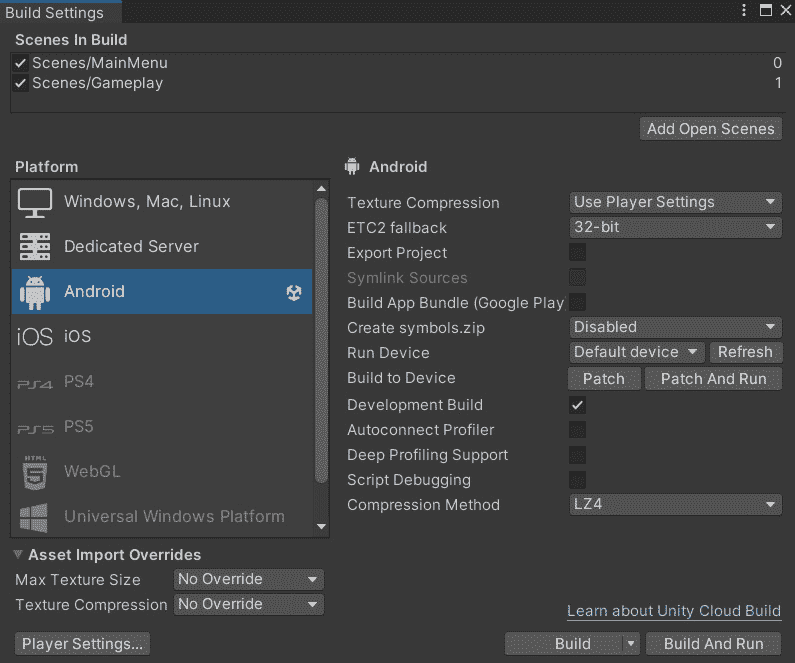
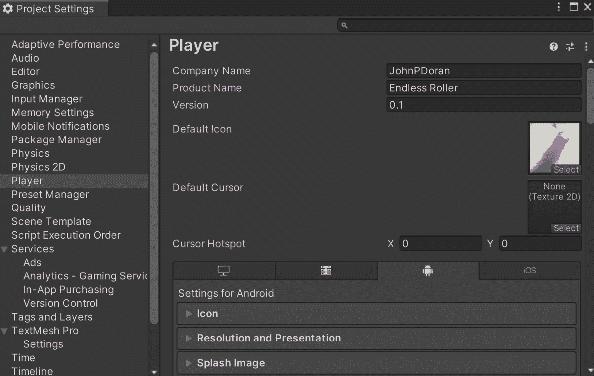
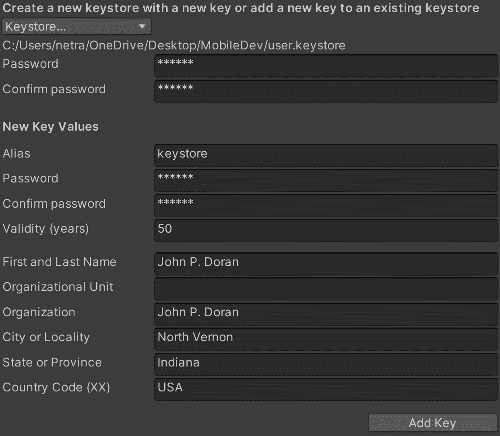
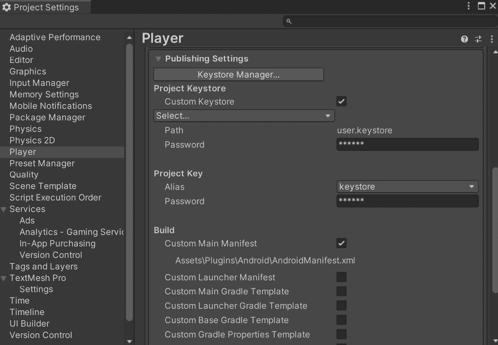
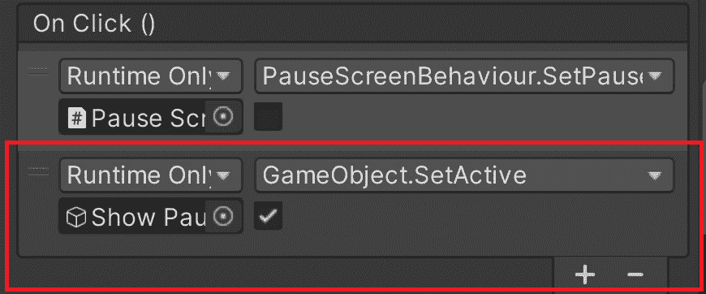
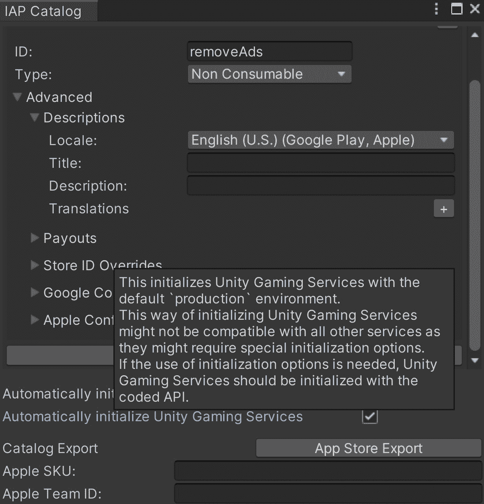

# 第十三章：构建我们游戏的发布副本

构建我们游戏的发布副本是提交我们的游戏到应用商店过程中的关键步骤。这一步骤涉及创建一个稳定且准备向公众发布的游戏版本。

在本章中，我们将指导你完成为 iOS 和 Android 设备构建游戏发布副本所需的步骤。我们将涵盖一些必须按顺序执行的额外步骤，以确保我们的项目能够正常工作。我们还将提供一些技巧和最佳实践，以确保你的发布副本质量最高，且无错误和其他问题。因此，让我们开始创建游戏发布副本。本章将分为多个主题。它将包含从开始到结束的简单分步过程。以下是我们的任务大纲：

+   为应用商店生成发布版本

# 技术要求

本书使用 Unity 2022.1.0b16 和 Unity Hub 3.3.1，但步骤应该在未来版本的编辑器中只需进行最小改动即可工作。如果你想要下载本书中使用的确切版本，并且有新版本发布，你可以访问 Unity 的下载存档 [`unity3d.com/get-unity/download/archive`](https://unity3d.com/get-unity/download/archive)。你还可以在**Unity 编辑器系统要求**部分找到 Unity 的系统要求 [`docs.unity3d.com/2022.1/Documentation/Manual/system-requirements.html`](https://docs.unity3d.com/2022.1/Documentation/Manual/system-requirements.html)。为了部署你的项目，你需要一个 Android 或 iOS 设备。

你可以在 GitHub 上找到本章中存在的代码文件，链接为 [`github.com/PacktPublishing/Unity-2022-Mobile-Game-Development-3rd-Edition/tree/main/Chapter13%20and%2014`](https://github.com/PacktPublishing/Unity-2022-Mobile-Game-Development-3rd-Edition/tree/main/Chapter13%20and%2014)。

# 为应用商店生成发布版本

我们在*第二章*，“Android 和 iOS 开发项目设置”中之前导出了我们游戏的副本，但发布游戏到应用商店之前，我们还需要执行一些额外的步骤：

1.  第一步将是确认你目前是否已经准备好将你的项目部署到所选的移动平台。你可以通过导航到**文件** | **构建设置**来进入**构建设置**菜单进行检查。

1.  从那里，你应该能看到根据你希望构建的平台，在**Android**或**iOS**选择项右侧的 Unity 标志。如果它不在正确的平台上，请选择你想要构建的平台，然后点击**切换平台**按钮，等待它完成项目资源的重新导入：



图 13.1 – 构建设置菜单

1.  在确认我们是为 **Android** 或 **iOS** 构建后，通过点击菜单中的 **Player Settings...** 按钮，或通过转到 **编辑** | **项目设置** | **Player** 来打开 **Player** 设置菜单。

1.  如果你还没有这样做，请分别设置 `JohnPDoran` 和 `Endless` `Roller`。

1.  然后，你将看到来自 `Assets` 文件夹的 `Hi-ResIcon` 图像，然后将其拖放到 **默认图标** 槽中。这将导致 Android 设置中的 **图标** 部分自动调整图像以适应你正在针对的任何设备：



图 13.2 – 设置默认图标图像

当然，你也可以使用你自己的图像，并且如果你愿意，可以使用透明度。

1.  在 **分辨率和展示** 部分中，你可以根据需要启用或禁用不同的旋转和宽高比。我们调整了游戏以适应这些设置，但当你自己在项目上工作或希望限制用户体验时，了解这一点可能很有用。

1.  如果你拥有 Unity Personal，可以使用 **Splash Image** 选项显示你的自有标志，除了 Unity 的标志。如果你拥有 Unity Pro 许可证，你可以通过取消选择 **显示启动屏幕** **选项** 来完全禁用它。

1.  在 `com.CompanyName.GameName` 下进行确认。

1.  接下来，打开 **发布设置**。这是我们将输入有关游戏发行者信息的地方（在这种情况下，我假设是你）。无论何时为 Android 构建游戏，你都需要一个 **密钥库**，它允许你签署游戏，批准构建过程。点击 **密钥库管理器** 按钮。从那里，你将被带到菜单。

1.  从菜单中，点击 **密钥库…** 下拉菜单，然后选择 **创建新** **|** **任何地方…**，并选择此文件的位置。

1.  请记住这个位置，因为你将来将使用它来创建游戏的新版本。

1.  然后，你需要在 **密码** 字段中设置一个值，你将需要知道，因为你将反复使用它。之后，在 **确认密码** 文本框中，你应该输入之前输入的内容。

1.  从那里，在 **新密钥值** 部分中，你需要添加之前相同的信息——密码及确认，然后是你的名字和其他信息。你可以在下面的屏幕截图中看到我填写的内容。完成后，点击 **添加** **密钥** 按钮：



图 13.3 – 创建密钥库

1.  你将看到一个弹出窗口询问你是否想将新的密钥库设置为你的 **项目密钥库** 和 **项目密钥** 值。点击 **是**。


图 13.4 – 确认窗口

你应该会看到这个屏幕：



图 13.5 – 分配的密钥库

到此为止，为 iOS 工作的人员应该已经完成，但对于希望针对 Google Play 的人来说，还有一些额外的任务需要完成。

Google Play 需要使用更新的版本其计费库，因此我们需要更新 Unity 的 **In App Purchase** （**IAP**）包。

1.  从 Unity 编辑器，转到 `Assets` 文件夹，右键单击，选择 `Packages` 文件夹，并在您选择的文本编辑器中打开 `manifest.json` 文件。接下来，找到以下行：

    ```kt
    "com.unity.purchasing": "4.1.5",
    ```

1.  更新为 `"``com.unity.purchasing": "4.4.1",`.

1.  保存文件并返回到 Unity 编辑器，它应该会更新包。然而，这也会引入一个到我们之前代码的漏洞，导致广告在我们的设备上无法正确显示。因此，考虑到这一点，打开 `UnityAdController` 脚本并向类中添加以下代码：

    ```kt
     public bool rewardCalled = false;
    // To account for a bug in Unity Advertisements 4.0.1
    // with Google
    // Play we have to add a way for UnityAdsShowComplete
    // to be
    // called by ourselves as well if it isn't called by
    // Unity
    IEnumerator RewardRoutine(string placementId)
    {
        rewardCalled = false;
        yield return new WaitForSecondsRealtime(0.25f);
        while (Advertisement.isShowing)
        {
            yield return null;
        }
        Debug.Log("Done");
        // If reward wasn't called yet, call it
        if(!rewardCalled)
        {
            OnUnityAdsShowComplete(placementId,
                UnityAdsShowCompletionState.COMPLETED);
        }
    }
    ```

1.  然后，将 `ShowAd` 函数更新为以下内容：

    ```kt
    /// <summary>
    /// Will load and display an ad on the screen
    /// </summary>
    public void ShowAd()
    {
        // Add fix for Unity Ads bug
        StartCoroutine(RewardRoutine(GetAdID()));
        // Display it after it is loaded
        Advertisement.Show(GetAdID(), instance);
    }
    ```

1.  我们现在还必须提前加载我们的广告，因此更新 `Start` 函数为以下内容：

    ```kt
    /// <summary>
    /// Unity Ads must be initialized, or else ads will
    /// not work properly
    /// </summary>
    private void Start()
    {
        /* No need to initialize if it already is done */
        if (!Advertisement.isInitialized || instance ==
            null)
        {
            instance = this;
            // Use the functions provided by this to allow
            // custom
            Advertisement.Initialize(gameId, testMode);
            // Load an Ad to play
            Advertisement.Load(GetAdID());
        }
    }
    ```

1.  按照同样的思路，`OnUnityAdsShowComplete` 现在需要只发生一次，因此我们添加了一个检查以查看奖励是否已经发放。广告完成后，我们加载一个新的广告：

    ```kt
    /// <summary>
    /// This callback method handles logic for the ad
    /// finishing.
    /// </summary>
    /// <param name="placementId">The identifier for
    /// the Ad Unit showing the content</param>
    /// <param name="showCompletionState">Indicates
    /// the final state of the ad (whether the ad was
        /// skipped or completed).</param>
        public void OnUnityAdsShowComplete(string
            placementId, UnityAdsShowCompletionState
                showCompletionState)
        {
            if(!rewardCalled)
            {
                if (obstacle != null &&
                    showCompletionState ==
                    UnityAdsShowCompletionState.COMPLETED)
                {
                    obstacle.Continue();
                }
                /* Unpause game when ad is over */
                PauseScreenBehaviour.paused = false;
                Time.timeScale = 1f;
                rewardCalled = true;
                // Load an Ad to play
    Advertisement.Load(GetAdID());
            }
        }
    ```

Google Play 还规定，广告不能在关卡开始时播放，因此我们需要调整我们的脚本以适应这一点。打开 `PauseScreenBehaviour.cs` 文件并调整 `Start` 函数：

```kt
protected override void Start()
{
    /* Initialize Ads if needed */
    base.Start();
    //if (!UnityAdController.showAds)
    //{
    //    /* If not showing ads, just start the game
    //    */
    //    SetPauseMenu(false);
    //}
    // Can no longer show ads at the Start of the game
    SetPauseMenu(false);
}
```

1.  接着，转到 `MainMenuBehaviour` 并更新 `LoadLevel` 脚本：

    ```kt
    /// <summary>
    /// Will load a new scene upon being called
    /// </summary>
    /// <param name="levelName">The name of the level we
    /// want to go to</param>
    public void LoadLevel(string levelName)
    {
        /* Can no longer show an ad upon starting gameplay
        */
        try
        {
            if (UnityAdController.showAds && levelName !=
                "Gameplay")
            {
                /* Show an ad */
                UnityAdController.instance.ShowAd();
            }
            else
            {
                Time.timeScale = 1f;
            }
        }
        catch { }
        SceneManager.LoadScene(levelName);
    }
    ```

1.  保存我们已工作的所有脚本并返回到 Unity 编辑器。

在编辑器中，返回到 **Gameplay** 级别并选择 **Resume** 按钮。从那里，转到 **On Click** 事件并确保 **Show Pause** 按钮有一个 **Set Active** 为 true 的事件。这样，当我们点击 **Resume** 按钮时，我们就能再次暂停游戏：



图 13.6 – 打开暂停菜单

1.  我们还希望确保 Unity 游戏服务始终初始化。一种方法是通过转到 **服务** | **内联购买** | **IAP 目录** 并检查 **自动初始化 Unity 游戏服务** 属性。否则，我们可能会遇到我们之前添加的无代码 IAP 的错误：



图 13.7 – 自动初始化 Unity 游戏服务

Google Play 商店现在还要求新应用必须是 **Android App Bundle** （**AAB**）而不是 **Android 应用程序包** （**APK**），因此我们需要将应用程序配置为 AAB。

注意

关于为什么进行此更改的更多信息，请查看 [`android-developers.googleblog.com/2021/06/the-future-of-android-app-bundles-is.html.`](https://android-developers.googleblog.com/2021/06/the-future-of-android-app-bundles-is.html

)

1.  在 **发布设置** 下，启用 **分割** **应用程序二进制**。

1.  我还将 `API 级别 31` 设置为当前 Google Play 要求应用程序的目标，尽管未来可能是一个更大的数字。这可能会导致在构建时 Unity 要求您下载 Android **软件开发工具包**（**SDK**）的更新。

1.  此外，Google Play 要求我们支持 ARM64，因此为了实现这一点，在 **配置** 下，将 **脚本后端** 改为 **IL2CPP** 以启用选项，之后检查 **ARM64** 选项。

1.  接下来，转到 **文件** | **构建设置** 并启用 **构建应用包（Google Play）**。同时，如果已勾选，请确保取消勾选 **开发构建**；目前 Google Play 不支持开发构建：


图 13.8 – 构建应用包

1.  最后，我们还需要从 `AndroidManifest` 文件中禁用调试。从 Unity 编辑器中，转到 `Plugins\Android` 文件夹，并打开 `AndroidManifest.xml` 文件。从那里，搜索 `android:debuggable="true"` 行，将其更改为 `"false"` 并保存文件。

应用程序清单是每个 Android 项目都必须拥有的东西，它告诉 Android 应用程序的所有不同组件以及应用程序需要拥有的所有权限，以便项目能够工作。出于安全原因，在应用程序可以发布到 Google Play 之前，您需要禁用调试。

1.  返回到 **构建设置** 菜单，然后点击 **构建** 按钮，并为您的项目命名。

1.  如果一切顺利，你应该会看到文件以 `.aab` 文件的形式创建，然后可以将其上传到 Google Play 商店！

## 摘要

看到所有辛勤工作汇聚成成品，准备好与世界分享，这令人兴奋。构建游戏发布副本和更新构建设置的过程是使您的游戏准备好分发的重要步骤。

然而，任何游戏开发项目的最终目标是将游戏发布给公众，让尽可能多的人玩到它。这就是将您的游戏提交到应用商店的过程发挥作用的地方。在下一章中，我们将深入探讨如何成功将您的游戏提交到 Google Play 商店和 iOS 应用商店的细节。
