# 14

# 将游戏提交到应用商店

在本书的整个过程中，我们已经讨论了为移动设备构建游戏的多方面内容。我们游戏开发之旅的最后一步实际上是发布游戏，让人们真正地玩它。所有那些长时间的努力工作现在都汇聚成了一种大众都能享受的东西。

在进行这一操作时，有许多需要注意的事项，这正是我们接下来将要讨论的内容。

在本章中，我们将介绍将您的游戏提交到 Google Play Store 或 iOS App Store 的过程，并提供一些技巧和建议，以帮助使这个过程更加顺利。到本章结束时，您将确切了解如何为两家商店创建开发者账户，以及如何将您的游戏提交到相应的商店。

本章将分为多个主题。它将包含从开始到结束的简单分步过程。以下是我们的任务大纲：

+   将您的游戏发布到 Google Play Store

+   将您的游戏发布到 Apple iOS App Store

# 技术要求

本书使用 Unity 2022.1.0b16 和 Unity Hub 3.3.1，但步骤应该在未来版本的编辑器中只需进行最小改动即可。如果您想下载本书中使用的确切版本，并且有新版本发布，您可以在 Unity 的下载存档中找到它，地址为[`unity3d.com/get-unity/download/archive`](https://unity3d.com/get-unity/download/archive)。您还可以在**Unity 编辑器系统要求**部分找到 Unity 的系统要求，地址为[`docs.unity3d.com/2022.1/Documentation/Manual/system-requirements.html`](https://docs.unity3d.com/2022.1/Documentation/Manual/system-requirements.html)。要部署您的项目，您需要一个 Android 或 iOS 设备。

您可以在 GitHub 上找到本章中存在的代码文件，地址为[`github.com/PacktPublishing/Unity-2022-Mobile-Game-Development-3rd-Edition/tree/main/Chapter13%20and%2014`](https://github.com/PacktPublishing/Unity-2022-Mobile-Game-Development-3rd-Edition/tree/main/Chapter13%20and%2014)。

# 将您的游戏发布到 Google Play Store

现在您的游戏已经制作完成，您需要将其实际发布到 Google 的 Play Store。要将游戏发布到 Google Play Store，您需要支付一次性 25 美元的费用。这可能或可能不是一大笔钱，但它比 iOS App Store 便宜得多，并且是一次性费用，因此对于那些预算较为紧张的人来说，您可能希望先在 Google 上尝试并赚取一些利润，然后再转向 Apple 的商店。我们首先将查看 Google Play Console，然后再填写提交游戏所需的所有详细信息。我们还将讨论如何将我们的游戏标记为测试版，以便在最终提交之前从他人那里获取反馈。

## 设置 Google Play Console

第一步是获取访问 Google Play 控制台的权利。这允许您在 Google Play 上发布 Android 应用程序，如果您愿意，还可以发布 Google Play 游戏服务。请执行以下步骤：

1.  打开您的网络浏览器并访问[`play.google.com/console/about/`](https://play.google.com/console/about/)。这是**Google Play 控制台**页面，允许您将应用程序添加到 Google Play 商店。

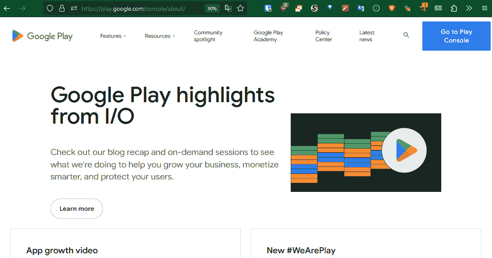

图 14.1 –– Google Play 控制台页面

1.  如果您尚未登录到您的 Google 账户，您需要登录；否则，您需要作为开发者注册：

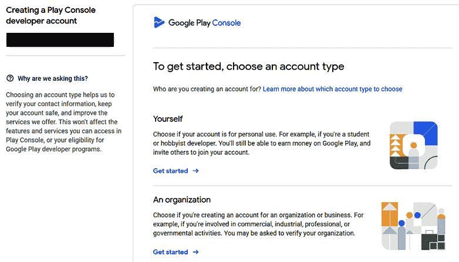

14.2 – 创建 Play 控制台开发者账户

1.  您需要选择一个账户类型，然后需要填写与您的开发者账户相关的信息，以及您将要发布的应用程序相关的信息。

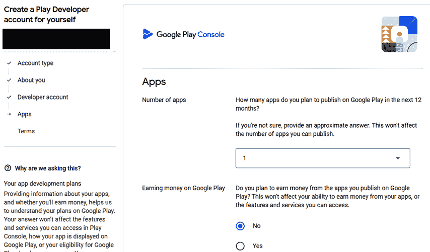

图 14.3 – 添加有关您的应用程序的信息

1.  接下来将出现一个页面，您需要接受条款并点击**创建账户并支付**。之后，您需要输入您的信用卡或借记卡信息以完成购买。

图 14.4 – 完成开发者注册费用的支付

1.  如果一切顺利，您将被带到 Google Play 控制台。

一旦您有了账户，现在您可以开始将游戏发布到 Google Play 商店的过程。要开始这个过程，我们需要将一个项目添加到我们的账户中，这就是我们接下来要做的。

# 在 Google Play 上发布应用程序

将应用程序发布到 Google Play 的过程涉及填写多个不同的字段，包括有关您游戏的信息，以及截图的艺术资源。为此，请执行以下步骤：

1.  从**所有应用程序**页面，点击**创建****应用程序**按钮。

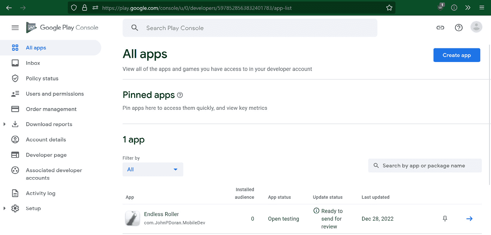

图 14.5 – 所有应用程序页面

1.  您将被带到一页，您需要选择您游戏的应用名称和默认语言。然后您需要选择它是应用程序还是游戏。我们将选择**游戏**。

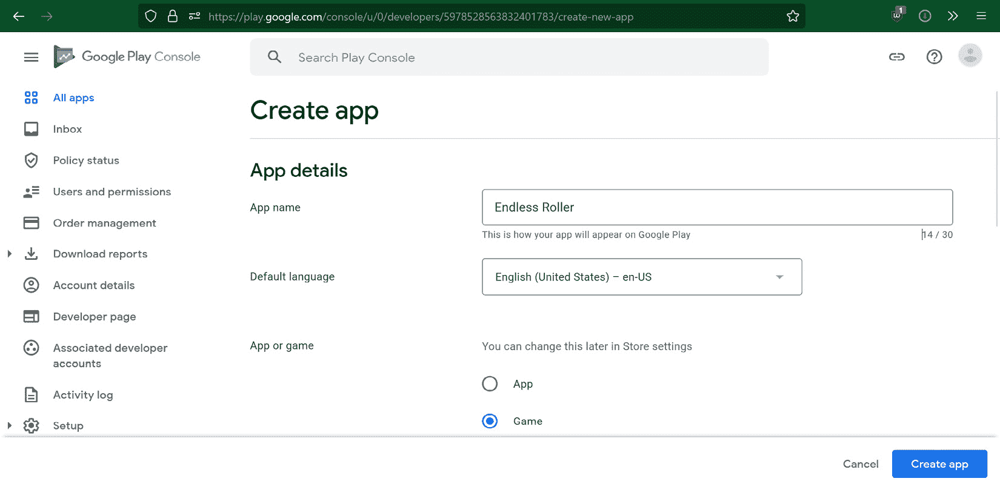

图 14.6 – 创建应用程序菜单

1.  滚动到页面底部，您将看到三个声明，您需要阅读并检查它们是否相关，然后点击**创建****应用程序**按钮：

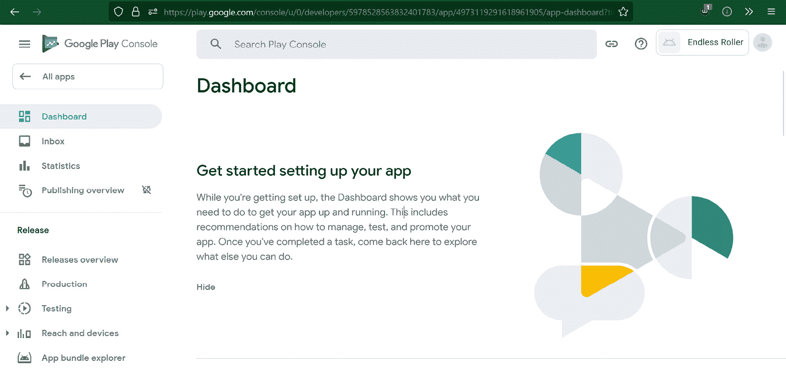

图 14.7 – 应用程序仪表板

仪表板页面显示了为了使您的应用程序上线所需的所有最新步骤的详细信息。第一部分包括构建游戏的测试版本，以便在最终发布之前其他人可以给您提供反馈。

滚动到**立即开始测试**部分。从那里，选择**选择****测试人员**选项。

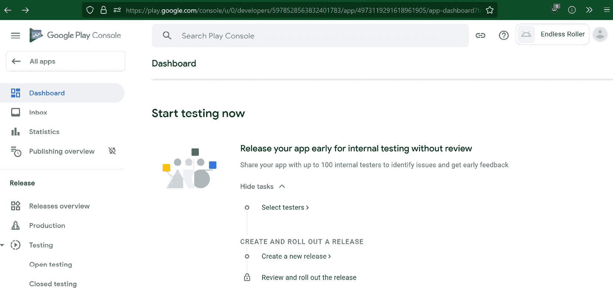

图 14.8 – 现在开始测试

1.  这将打开内部测试页面，您也可以通过仪表板的**发布**部分进入**测试** | **内部测试**来访问。从那里向下滚动，在**测试者**下，您将看到一个选项，通过点击**创建电子邮件** **列表**按钮为您游戏创建测试者电子邮件列表。

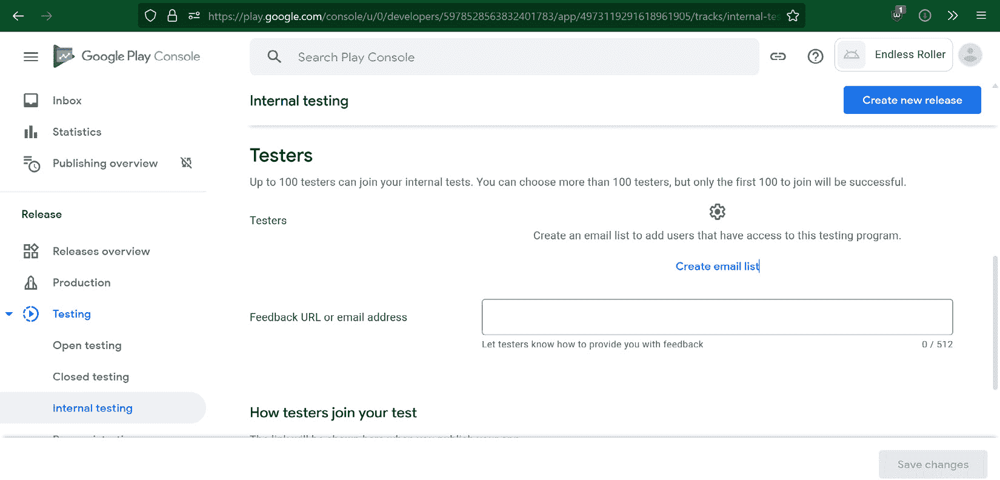

图 14.9 – 内部测试菜单

这将弹出一个窗口，您可以在其中填写一个列表名称，然后通过手动输入值（以逗号分隔）或使用我们之前讨论的 CSV 文件来添加您想要测试游戏的人的电子邮件地址。

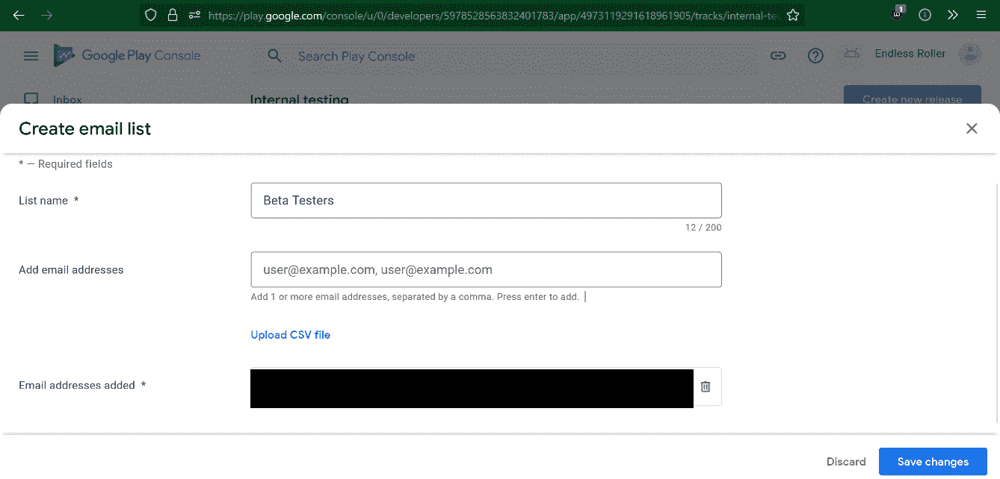

图 14.10 – 创建电子邮件列表

1.  完成后，点击**保存更改**按钮，您将需要确认保存的更改。请注意，此电子邮件列表将在您的开发者账户中的所有应用中使用。点击**创建**，然后应该返回到上一个部分。

1.  从那里，对于**反馈 URL 或电子邮件地址**，填写您的电子邮件地址或网站。之后，点击**保存更改**按钮。请注意，**测试者如何加入您的测试**部分当前**复制链接**按钮为灰色。这是因为我们目前尚未发布应用；然而，一旦我们创建发布，这将是我们的下一步行动。

1.  在右上角，将`.aab`文件拖入**拖放应用包以上传**区域。

1.  在下面，您将能够提供发布名称和关于这个特定版本游戏的发布说明。完成这些细节后，点击**保存为草稿**按钮，然后点击**下一步**。

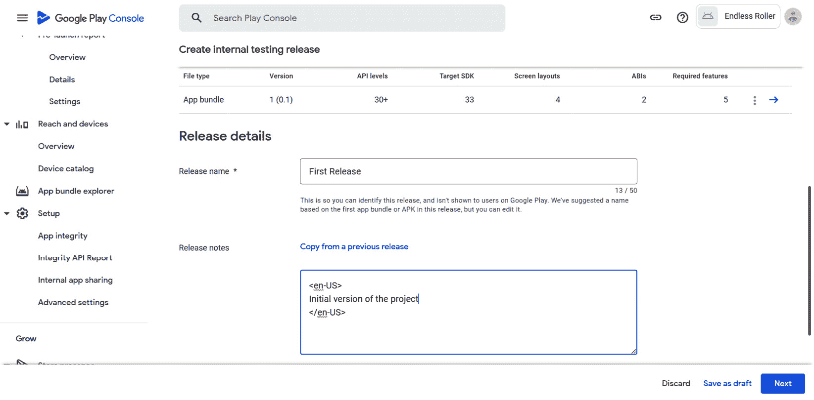

图 14.11 – 填写发布详情

您将看到一些信息和关于您项目的任何错误、警告和消息。如有需要，请阅读它们，假设没有错误，您应该能够点击**保存**按钮，允许其他人尝试您的项目！

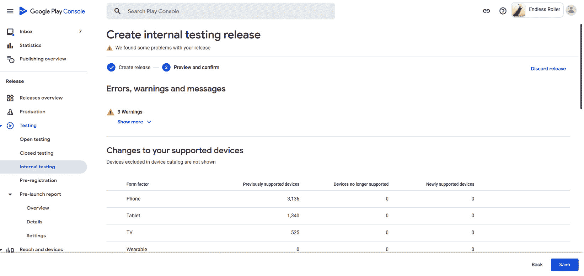

图 14.12 – 审查发布

1.  通过点击**仪表板**按钮返回仪表板。返回主页面后，您将看到下一个部分是**设置** **您的应用**：

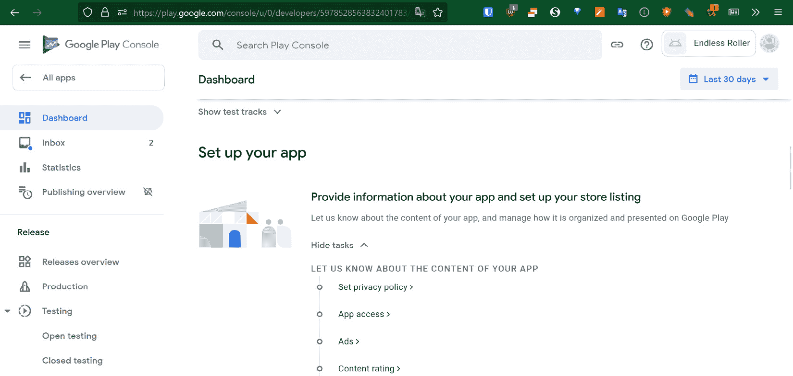

图 14.13 – 设置您的应用

我们需要逐个完成这些部分，以便设置商店列表。

1.  首先，点击**设置隐私政策**选项，并提供您想要使用的隐私政策的链接。过去，人们使用 Unity 自己为使用 Unity Analytics 和广告的用户推荐的链接([`unity3d.com/legal/privacy-policy`](https://unity3d.com/legal/privacy-policy))，但谷歌最近更改了其政策，现在您的组织或应用程序的名称需要包含在政策中。

最安全的选项是雇佣一名律师为您的应用程序起草隐私政策，但如果您希望自行创建隐私政策，本网站可以帮助您创建相关材料：[`letsmakeagame.net/game-privacy-policy-generator/`](https://letsmakeagame.net/game-privacy-policy-generator/)。在我的情况下，我检查了包含在“第三方服务”部分隐私政策的链接中的**Facebook**和**Unity**选项，然后填写了所需的数据。完成之后，点击**生成**按钮，您将获得用于在您的网页上托管的自定义隐私政策所需的模板数据。

1.  接下来，转到**应用程序访问**，然后选择**所有功能均无需特殊访问即可使用**，并按**保存**。

1.  在**广告**下，选择**是，我的应用程序包含广告**，并选择**保存**。

1.  前往**内容评级**，选择**开始新问卷**，并根据您的游戏回答问题。

图 14.14 – 内容评级

1.  接下来，您将回答有关您的目标受众和内容的问题。请注意，如果您表示您的受众包含 13 岁及以下的儿童，您将需要回答几个其他问题。之前我们说游戏不是，所以我选择了其他年龄。

在下一部分，您将确认您的游戏不是新闻应用程序或 COVID-19 接触者追踪或状态应用程序。

1.  接下来，在**数据安全**部分，您需要逐页浏览并回答给出的问题。

对于 Unity 游戏服务不同区域的数据安全要求，您可以使用以下链接：[`docs.unity.com/ugs-overview/GoogleDataSafety.html`](https://docs.unity.com/ugs-overview/GoogleDataSafety.html)。在我们的项目中，我们使用应用内购买、广告变现、远程配置和分析。我们需要逐一检查这三个选项，并确保我们为每个选项选择正确的选项。请注意，尽管某个产品以一种方式共享某些内容，但这并不意味着另一个产品将以另一种方式共享。

1.  在**数据收集和安全**部分，我回答了**是**、**是**、**我的应用程序不允许用户创建账户**和**否**。

1.  在**数据类型**下，选择**近似** **位置**选项。

1.  在**个人信息**下，选择**用户 ID**。分析可以跟踪更多，但我们不会启用它们。

1.  在**财务信息**下，选择**购买历史**。

1.  最后，在**设备或其他 ID**下，选择**设备或其他 ID**。然后，点击**下一步**按钮。

1.  对于这些值中的每一个，我们需要点击箭头来回答有关它们的问题。对于**用户 ID**，标记属性为**已收集**和**已共享**，它**不会被临时处理**，**需要数据收集**，并且收集和共享的目的用于**应用功能**。然后，点击**保存**按钮。

1.  对于**购买历史**，请确保它是**已收集**和**已共享**，它**不会被临时处理**，**需要数据收集**，并且收集和共享的目的用于**应用功能**。然后，点击**保存**按钮。

1.  对于**大致位置**，请确保它是**已收集**和**已共享**，它**不会被临时处理**，**需要数据收集**，并且收集和共享的目的用于**应用功能**。然后点击**保存**按钮。

1.  对于**设备或其他 ID**，请确保它是**已收集**，选择**是，此收集的数据会被临时处理**和**需要数据收集（用户无法关闭此数据收集）**选项，并确认数据是为了**应用功能**而收集的。之后，点击**保存**按钮。然后，您应该能够点击**下一步**按钮。

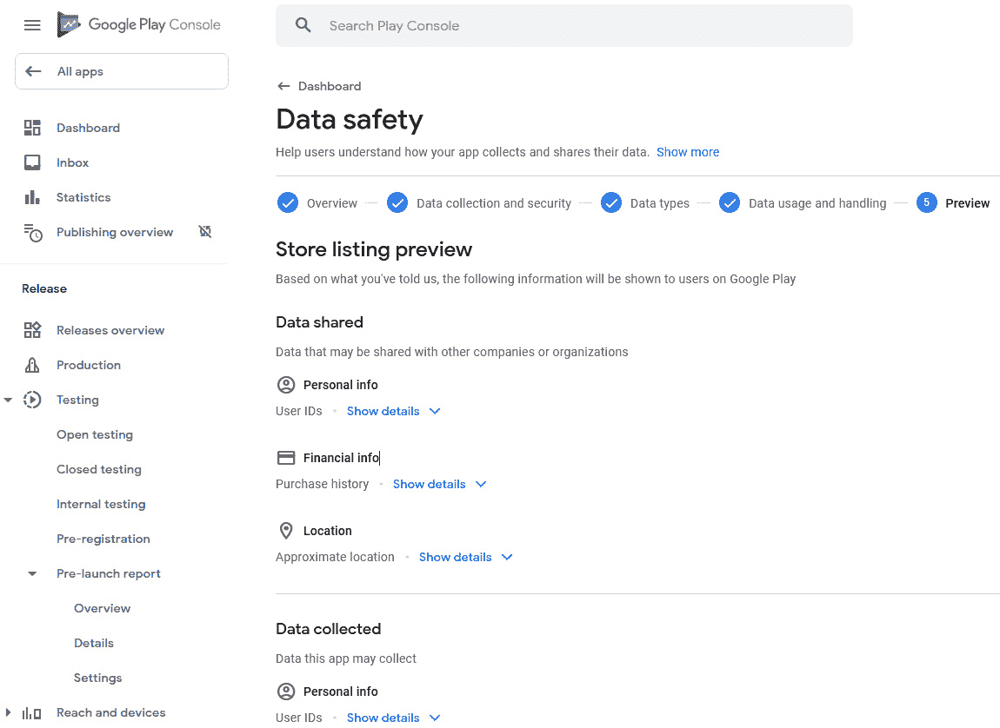

图 14.15 – 数据安全

1.  如果一切看起来都很好，请继续点击**保存**按钮，然后您就可以返回仪表板。

1.  接下来，选择**政府应用**部分，回答**否**，然后点击**保存**。

1.  然后，在**管理应用的组织和展示方式**部分，点击**选择应用类别并提供联系** **详细信息**选项。

1.  从这里，您可以选择游戏是应用还是游戏；`Arcade`）。然后，您可以使用标签来帮助描述您游戏的内容。这是帮助人们定义您的应用的一种方式，也是帮助人们通过某些关键词发现项目的一种方式，所以请考虑使您的游戏独特的事物，并确保将它们包含在这里。在每个标签下，都有一个您可以点击以获取有关它们的信息的问号，这可以帮助您在不确定它们是什么时。最后，我选择了`Arcade, Casual, Hyper-casual, Runner`。当您完成时，点击**应用**。

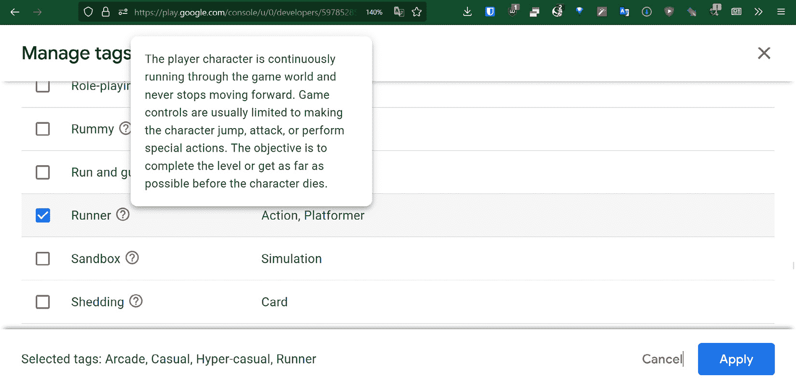

图 14.16 – 管理标签

1.  然后，填写您的商店列表联系详细信息。请注意，这些信息将显示在 Google Play 上，所以我不建议添加您的个人电话号码。完成后，点击**保存**按钮并返回仪表板**仪表板**。

1.  最后，点击**设置您的商店列表**选项。向下滚动，您将被带到需要填写有关您的游戏信息的部分，从简短描述开始，然后是更详细的完整描述：

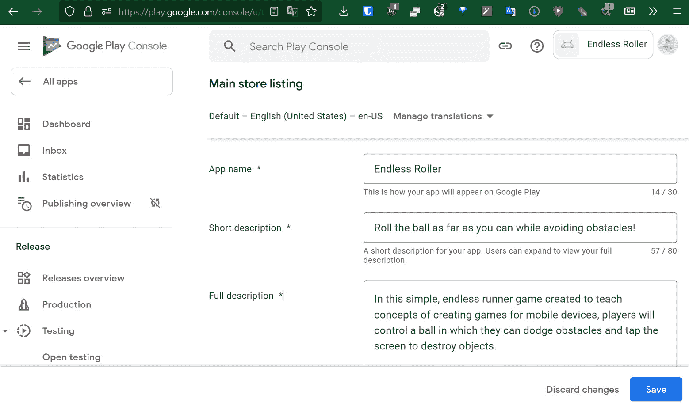

图 14.17 – 创建主要商店列表

1.  然后，您需要提供用于显示游戏的图形资产。您至少需要两张截图，以及一些额外的图标和图形：

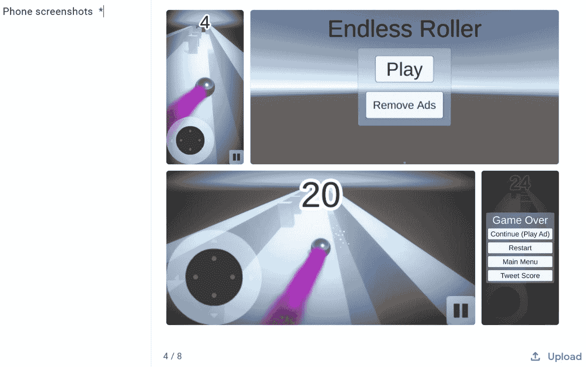

图 14.18 – 添加手机截图

1.  您还需要为图标和其他特色图形添加更多图片。带有星号（****）的是必需的。您可以在本书的示例代码中找到一些预先创建的，但我建议您在将此游戏定制到您喜欢的样子后创建自己的：

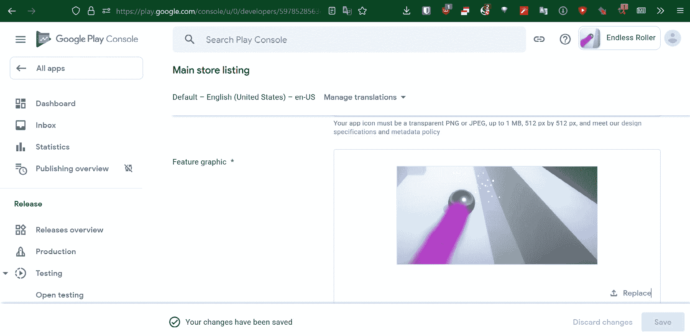

图 14.19 – 完成主要商店列表

1.  当您完成时，点击 **Save** 按钮，然后返回仪表板。

1.  到目前为止，您已经通过了 Google Play 开发流程的大部分障碍。现在您可以选择进入 **发布您的应用** 部分，跳转到 **在 Google Play 上发布您的应用** 部分，创建一个新的构建版本并将发布推向世界，或者首先通过项目的 alpha 和 beta 阶段来获取宝贵的反馈，并迭代您的项目以留下更好的第一印象。无论如何，过程将与您之前所做的一样，除了选择您希望项目可用的国家和地区以及您希望为游戏收费的内容。

完成这些步骤后，我们现在可以开始发布到苹果的 iOS App Store 的过程，这是我们接下来要做的。

# 将您的游戏发布到苹果 iOS App Store

就像 Google Play 商店一样，将您的游戏发布到 App Store 需要额外付费。与 Google Play 商店不同，费用是每年 99 美元加税。然而，很多人认为在 iOS 设备上拥有他们的标题是值得额外费用的。在本节中，我们将介绍将我们的游戏发布到 App Store 的过程。我们将首先设置您的苹果开发者账户并创建一个配置文件。之后，我们将利用 iTunes Connect 工具将应用添加到商店，并使用 Xcode 创建一个存档，这样我们就可以将项目上传到 App Store，以便最终进行提交审查。

## 苹果开发者设置和创建配置文件

为了将应用部署到 iOS 设备上，您需要使用 Mac 计算机，但在我们继续到 iTunes 商店之前，我们首先需要提前弄清楚所有的证书和权限。

实施以下步骤：

1.  在 Mac 计算机上，访问 [developer.apple.com](http://developer.apple.com):

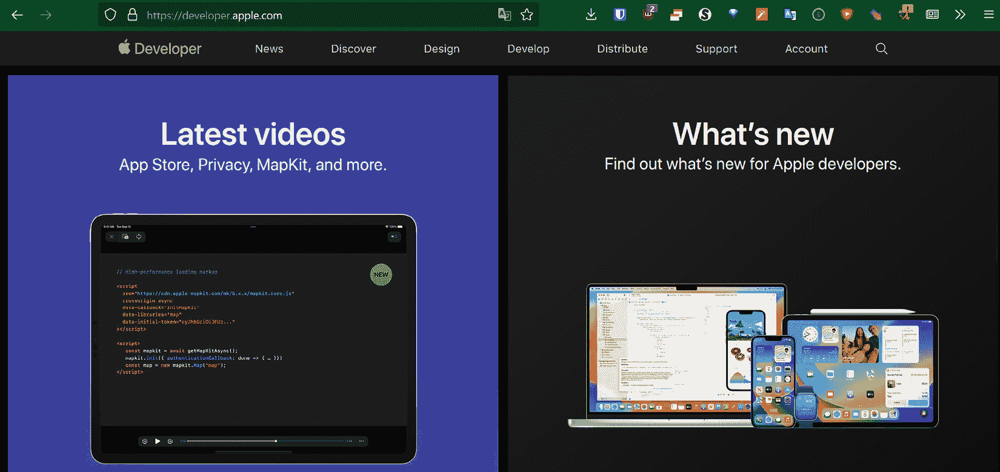

图 14.20 – 苹果开发者网站

1.  从那里，点击屏幕右上角的 **Account** 按钮，填写您的 Apple ID 和密码，然后按 *Enter* 登录：

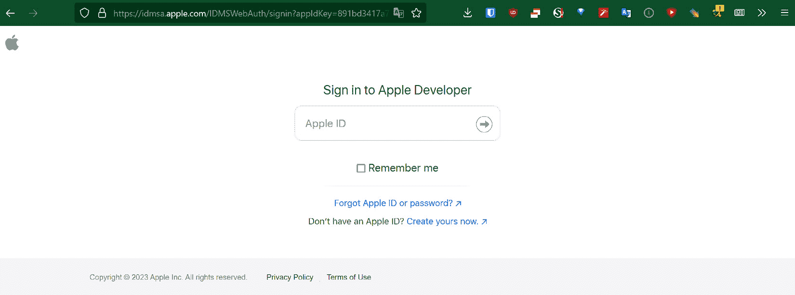

图 14.21 – 登录苹果开发者

如果你设置了双因素身份验证方法，你可能需要验证你确实是你自己。

1.  从那里，点击**账户**。现在，在这个时候，你需要支付 99 美元的年度费用。这个过程应该是相当直接的，一旦完成，你将到达一个类似于以下页面的页面：

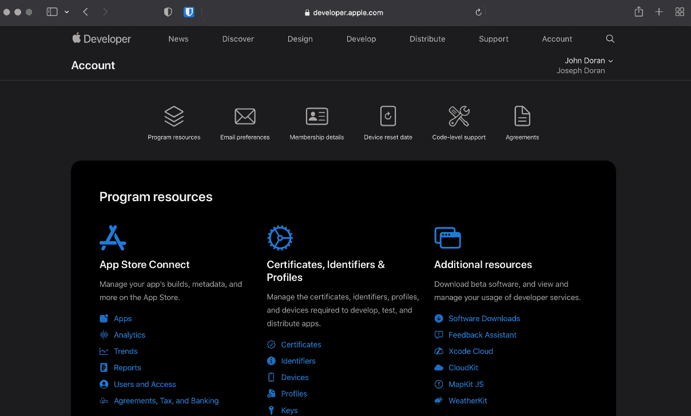

图 14.22 – 苹果开发者账户页面

4. 在**证书、标识符和配置文件**部分，选择**证书**部分以开始创建应用的流程。如果你刚刚支付了 99 美元的费用，你可能会看到一个错误，表明**所选团队没有符合** **此功能** **的会员资格**。

别担心——这仅仅意味着支付尚未在苹果端处理。大约 30 分钟到 1 小时后再次尝试，屏幕应该可以正常工作。

5. 我们需要设置一些证书，以便我们可以导出到 iOS 应用商店。从**证书**页面，点击**证书**右侧的**+**按钮：

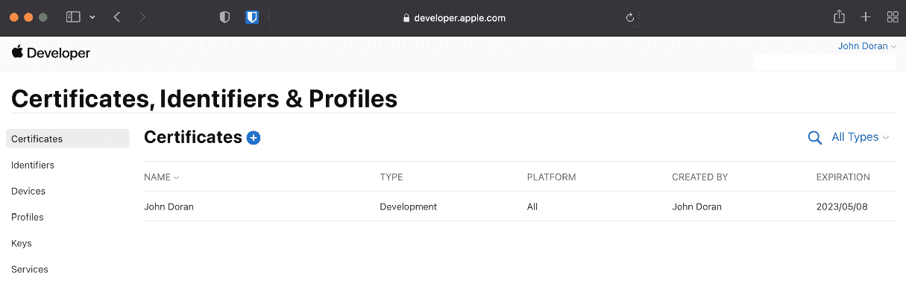

图 14.23 – 证书页面

6. 当页面询问我们需要哪种证书时，在**软件**部分下选择**苹果分发**选项，然后点击**继续**：

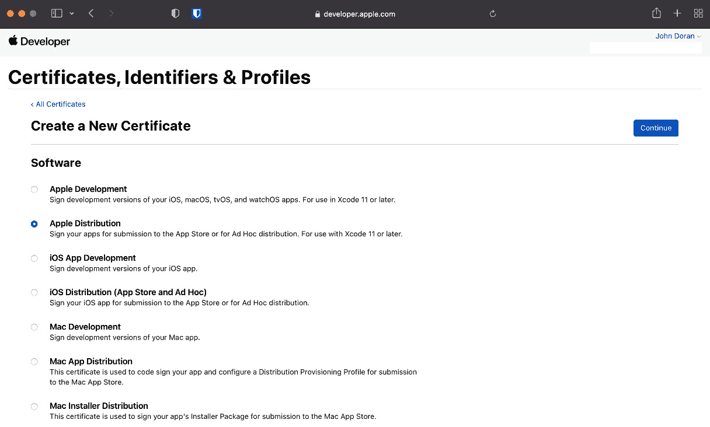

图 14.24 – 选择证书类型

你可能会注意到这里还有一种类型，也声称有 iOS 分发类型。你可能想知道为什么我们不选择那个。截至 Xcode 11，这是苹果希望开发者用于旨在进入应用商店的设备的证书的新类型。

在撰写本文时，如果你只计划为 iOS 开发，你可以选择**iOS 分发**。然而，由于苹果未来可能会停止提供它，我选择**苹果分发**。

7. 接下来，我们需要在我们的 Mac 上创建一个`Applications\Utilities`文件夹，并打开**钥匙串访问**程序。

8. 从那里，转到**钥匙串访问** | **证书助理** | **从证书颁发机构请求证书...**：

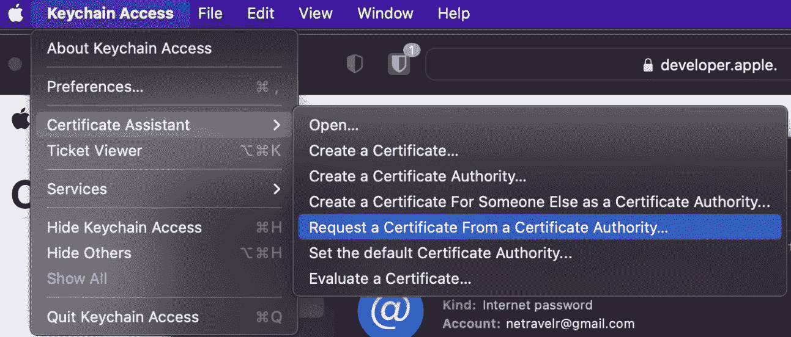

图 14.25 – 请求证书

9. 一旦进入，请在**用户电子邮件地址**属性中填写您的电子邮件地址。然后，对于**通用名称**，输入一个名称，并保留**CA 电子邮件地址**字段为空。然后，对于**请求是**选项，选择**保存到磁盘**：

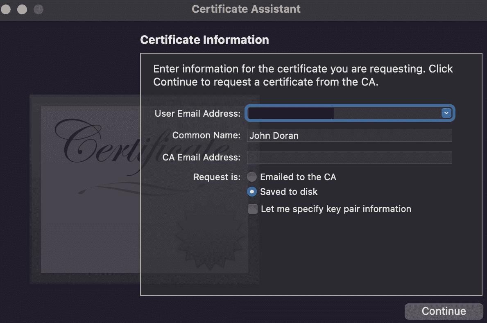

图 14.26 – 填写我们的证书信息

1.  然后，点击**继续**按钮并选择保存证书的位置。我个人使用了我的桌面，但你可以使用任何你喜欢的位置，只要你能记住稍后在哪里：

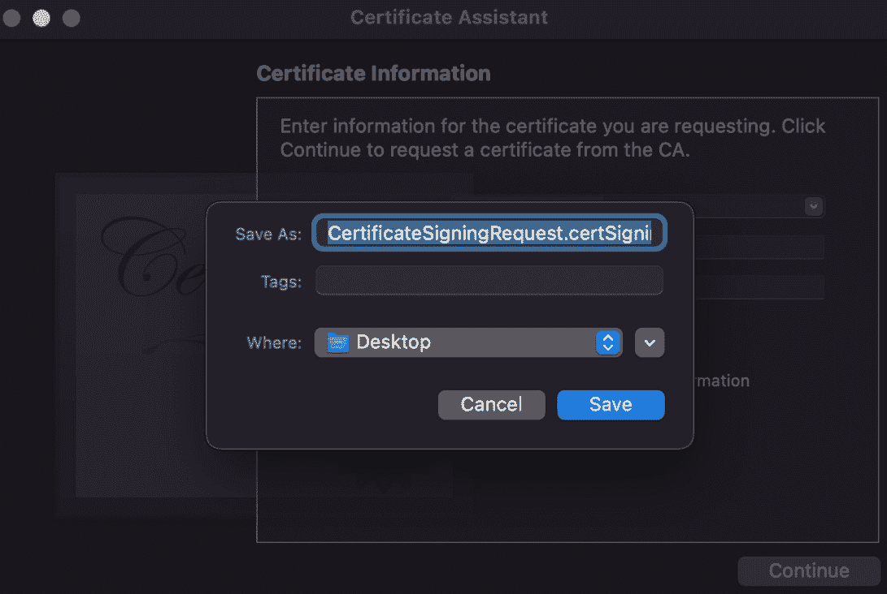

图 14.27 – 保存证书

1.  之后，屏幕将显示请求已在磁盘上创建。请继续点击**完成**，然后返回您的网页浏览器。

1.  滚动到页面底部然后点击**继续**按钮。从那里，您将被带到**生成您的证书**页面。点击**选择文件**按钮然后选择我们刚刚创建的文件。然后，点击**继续**按钮：

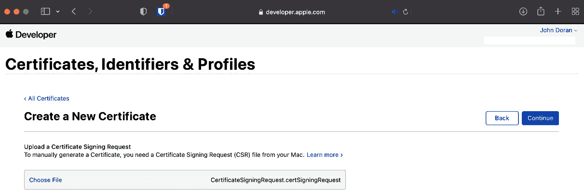

图 14.28 – 上传证书

1.  然后，您将被带到显示您的证书已准备好的屏幕。请继续点击**下载**按钮，并将证书保存到您的磁盘。如果您使用 Safari，可能会被询问是否允许下载；请点击**允许**：

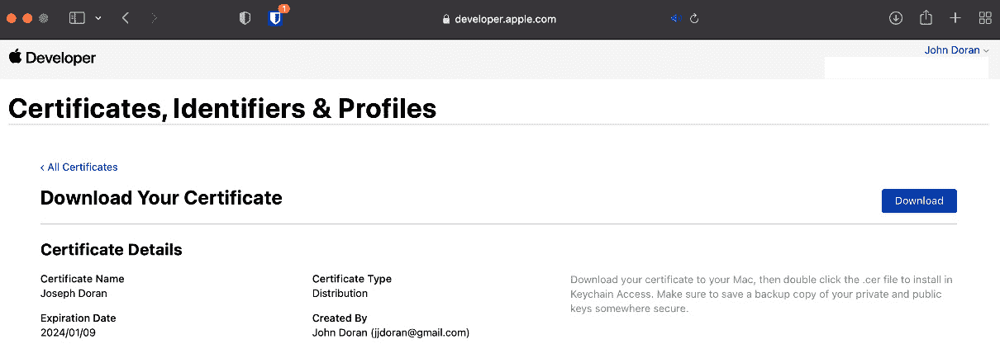

图 14.29 – 下载您的证书

1.  之后，双击`.cer`文件以将数据访问权限赋予**密钥链**。在**密钥链**下，将值更改为**login**。您将被询问是否要添加证书；请继续点击**添加**：

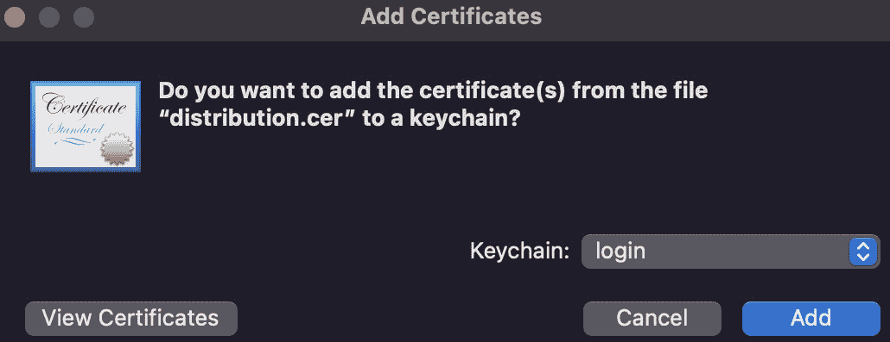

图 14.30 – 向密钥链添加证书

1.  下一步是创建一个 App ID。为此，转到左侧边栏并点击`Endless Roller`项目，我们可以通过点击**编辑**按钮来自定义它。然而，如果您之前没有这样做并且拥有不同的捆绑 ID，让我们接下来详细了解一下：

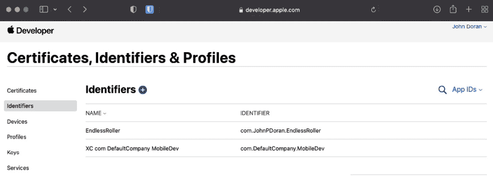

图 14.31 – 标识符列表

1.  我们可以通过点击屏幕右上角的**+**按钮来创建一个新的 ID。

1.  从那里，选择`Endless Roller`。然后在`com.JohnPDoran.EndlessRoller`下。在**应用服务**下，您可以选择想要使用的选项，但在这个案例中，我们不需要担心这些，所以我们可以直接滚动到页面底部然后点击**继续**按钮。

在这种情况下，我之前提到的捆绑包将不会工作，因为已经存在具有此特定捆绑包的 ID，并且您需要具有唯一的 ID。考虑到这一点，我只是将原始 App ID 重命名为 Endless Roller，然后完成了这一部分。

我们在这里需要设置的最后一个方面是配置文件。苹果公司将配置文件定义为“一组数字实体，将开发者和设备唯一地绑定到授权的 iPhone 开发团队，并允许设备用于测试。”这意味着它是设备与开发者账户之间的链接，该账户使项目得以实现。

重要提示

想了解更多关于配置文件的信息，请查看[`medium.com/@alexi.schreier/wtf-is-a-provisioning-profile-on-ios-a9b65d79221f`](https://medium.com/@alexi.schreier/wtf-is-a-provisioning-profile-on-ios-a9b65d79221f)。

1.  要这样做，点击菜单左侧的**配置文件**部分。从那里，点击**配置文件**右侧的蓝色**+**图标。在**分发**下选择**App Store**，然后点击**继续**：

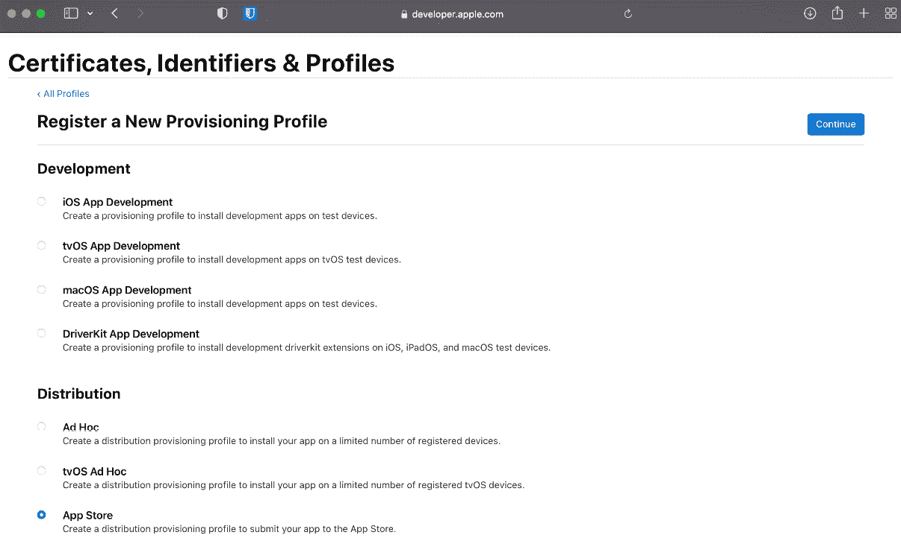

图 14.32 – 为 App Store 创建配置文件

1.  从那里，您需要选择您的 App ID。`Endless Roller`可能已经选中；否则，在下拉列表中搜索它并选择它，然后点击**继续**。

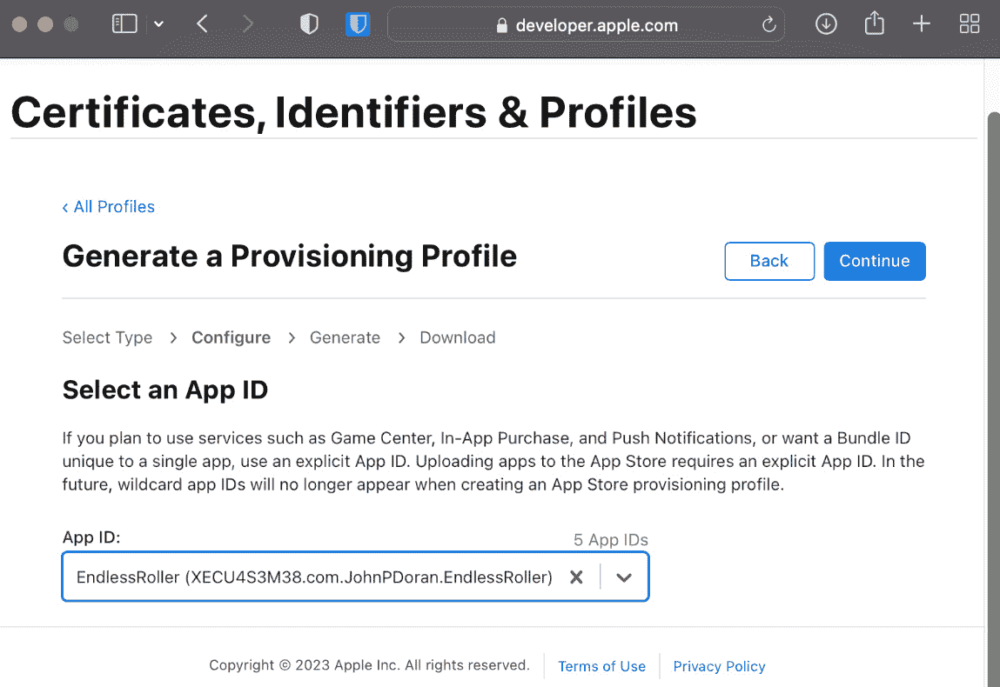

图 14.33 – 选择 App ID

1.  然后，选择您的证书并点击**继续**。

1.  然后，选择您想要使用的证书并点击`Endless Roller` – 然后点击**生成**：

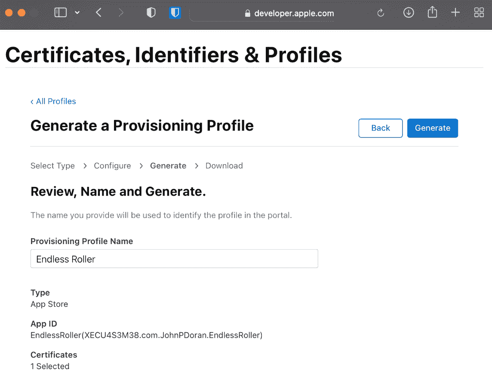

图 14.34 – 生成配置文件

1.  按钮将变为**下载**。继续下载配置文件，并妥善保管，因为我们稍后会用到它：

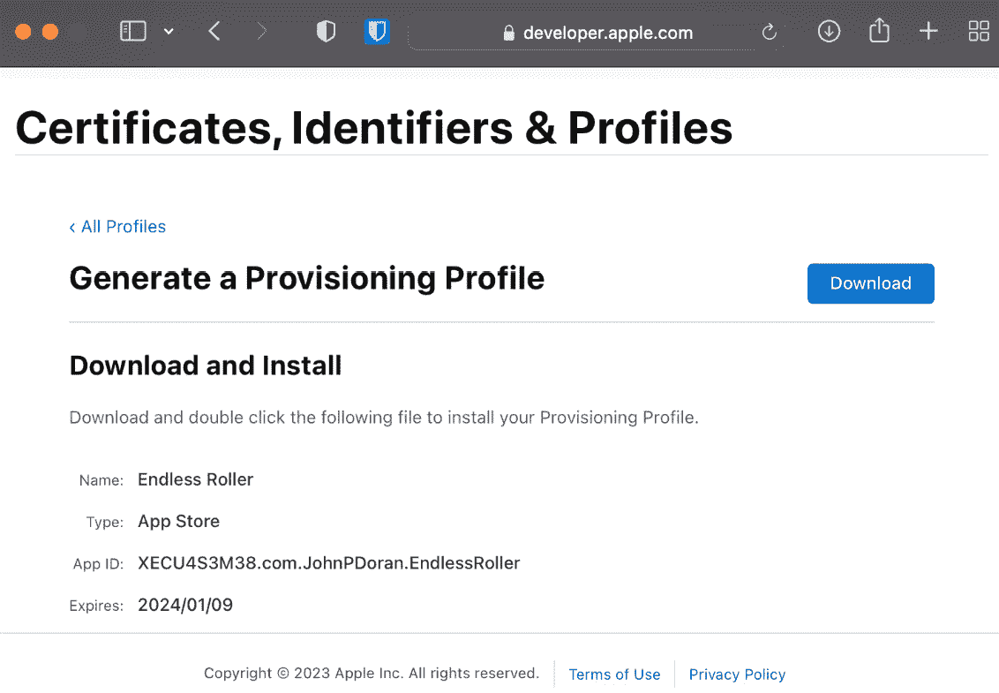

图 14.35 – 配置文件已准备好

这样，我们的配置文件就准备好了。

## 将应用程序添加到 App Store Connect

现在我们有了配置文件，我们实际上可以将我们的应用程序放到商店。为此，执行以下步骤：

1.  在您的网络浏览器中，访问[`appstoreconnect.apple.com`](http://appstoreconnect.apple.com)并点击**我的应用程序**按钮：

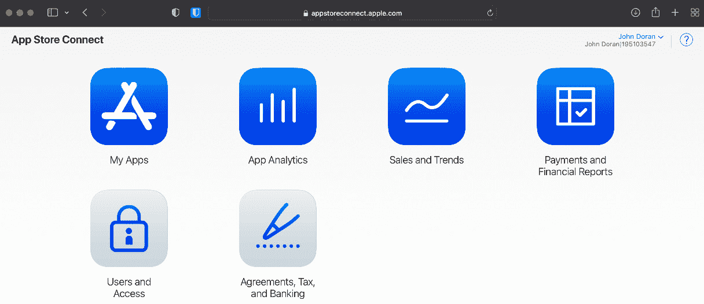

图 14.36 – App Store Connect

如果您打算销售应用程序，您还必须前往**协议、税务和银行**部分并输入您的银行信息。

1.  从**应用程序**页面，前往左上角，点击**+**图标，通过选择**新应用程序**来将新应用程序添加到我们的配置文件中：

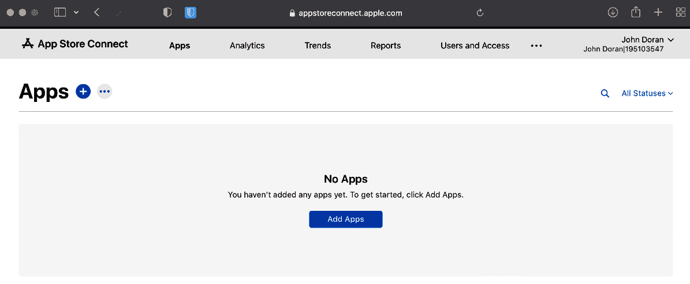

图 14.37 – 应用程序页面

1.  在此菜单中，再次选择`Endless Roller`。在`EndlessRoller)`下，在**用户访问**下选择**完全访问**。然后，点击**创建**按钮：

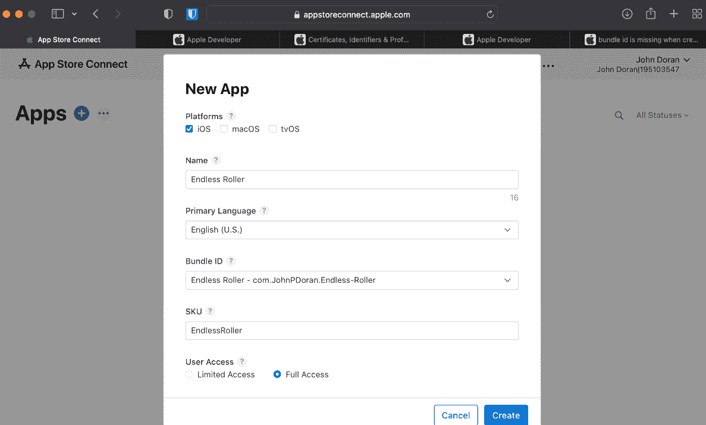

图 14.38 – 创建新应用程序

1.  然后，您将被带到**1.0 准备提交**屏幕。开始填写标题信息。首先，在**描述**文本框中填写您之前为 Google Play 使用的相关信息。然后，在**关键词**下输入人们可能搜索以找到您的游戏的可能术语，在**版权**下输入您的名字。

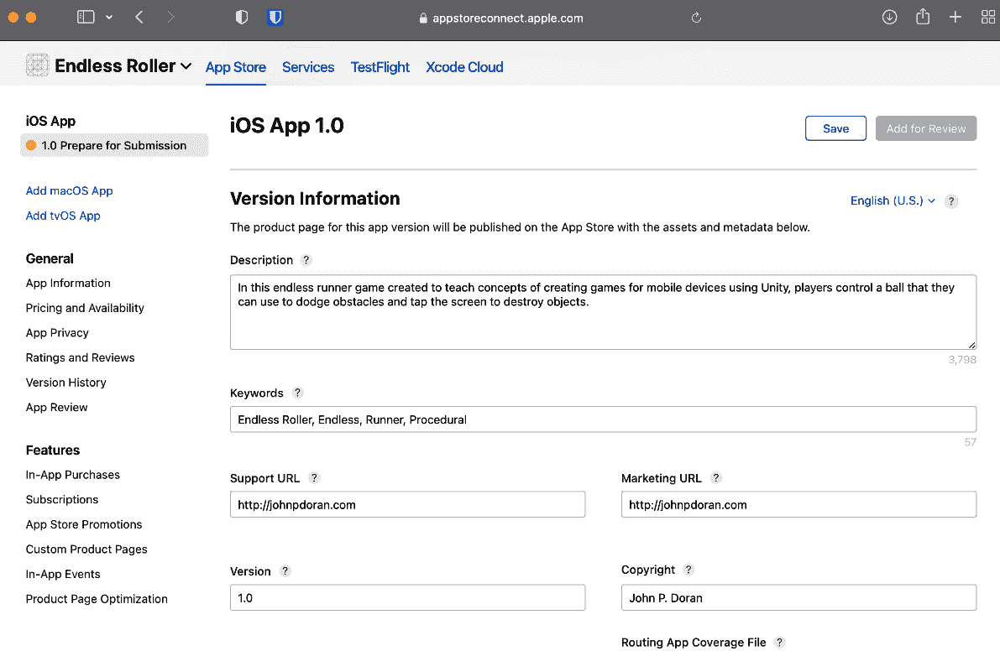

图 14.39 – 填写版本信息

1.  最后，您需要提供一些游戏截图以供使用。如果您点击**iOS 截图属性**页面，您将看到有关如何创建截图的详细信息（特别是图像的大小）。本章中使用的图像是为 6.5”的 iPhone 显示屏设计的，但您也可以选择可选的 6.7”版本以支持 iPhone 14 Pro：

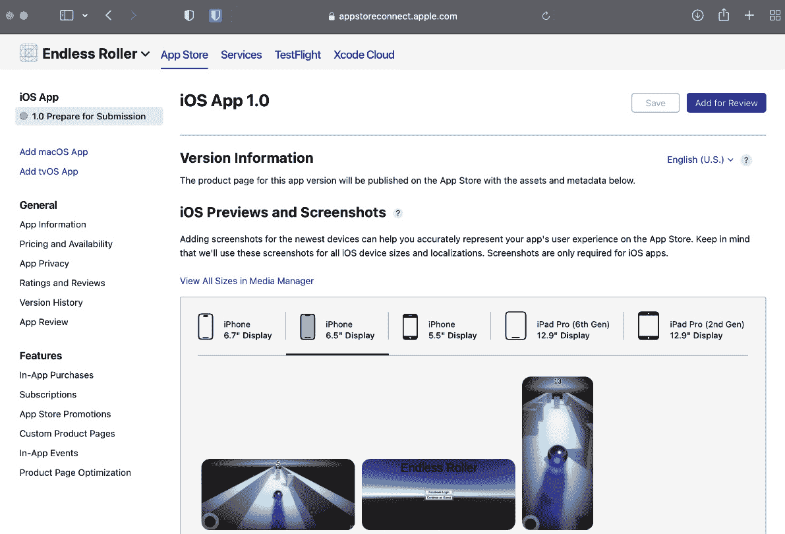

图 14.40 – 提交应用截图

1.  注意，在**构建**部分，它指出您需要使用几种工具之一提交您的构建。我们将在完成此处剩余步骤后进行。

1.  从**构建**部分进入**应用信息**屏幕。从那里，将类别更改为**游戏**，然后在**子类别**下选择**休闲**。然后，点击**保存**：

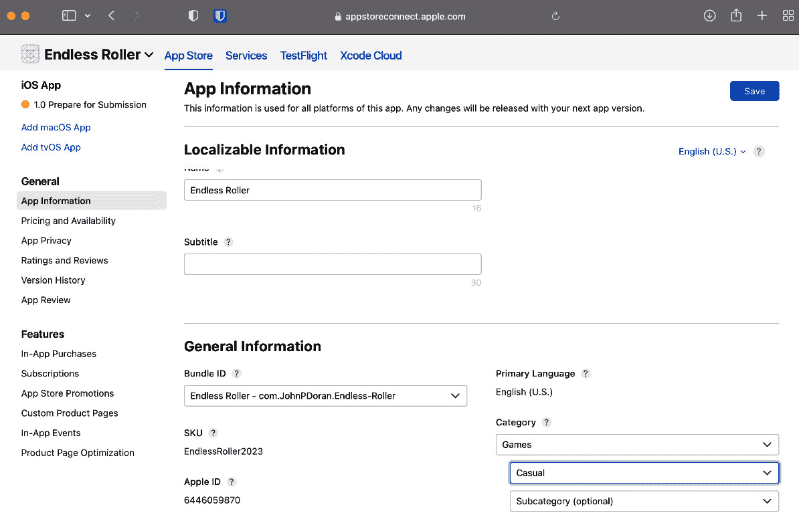

图 14.41 – 设置应用类别

1.  前往**定价和可用性**部分并选择一个价格。在我的情况下，我将使用**$0.00（免费）**，但像往常一样，您可以挑选您想要的。完成此处选项后，点击**保存**选项：

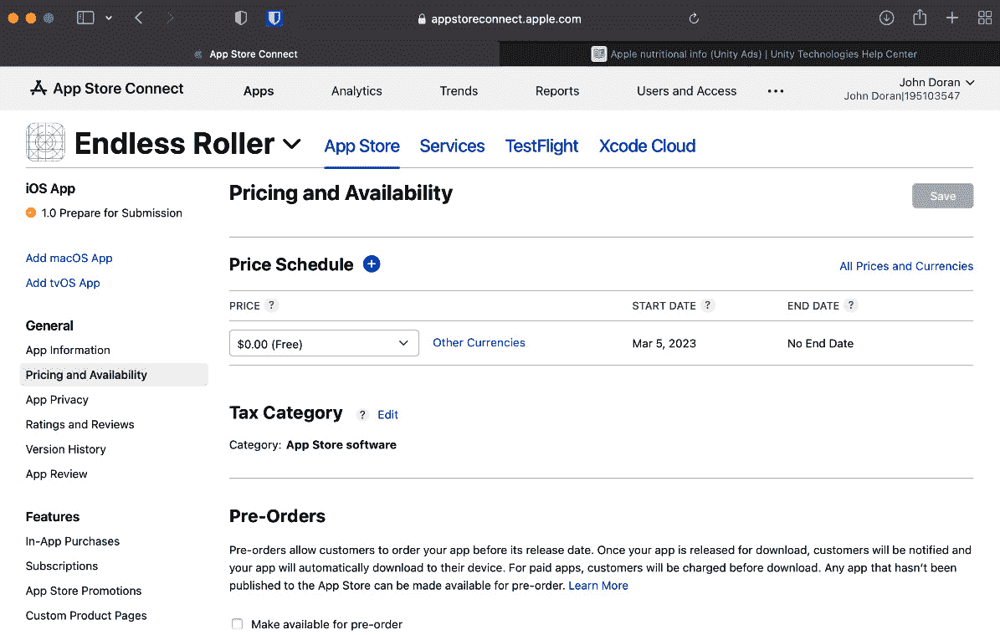

图 14.42 – 设置定价和可用性

1.  接下来，进入**隐私政策**部分。正如在 Google Play 部分所述，过去人们使用 Unity 本身推荐的链接为使用 Unity Analytics 和 Ads 的人提供链接（[`unity3d.com/legal/privacy-policy`](https://unity3d.com/legal/privacy-policy)），但最安全的选项是雇佣一名律师为您的应用起草隐私政策。如果您想自己创建隐私政策，本站可以帮助您创建相关材料：[`letsmakeagame.net/game-privacy-policy-generator/`](https://letsmakeagame.net/game-privacy-policy-generator/)。在我的情况下，我在**第三方服务**部分的隐私政策链接中选择了**Facebook**和**Unity**选项，并填写了必要的数据。完成后，点击**生成**按钮，您将获得用于自己隐私政策的模板数据，然后进行托管。

1.  填写**隐私政策 URL**部分，然后点击**开始**按钮。

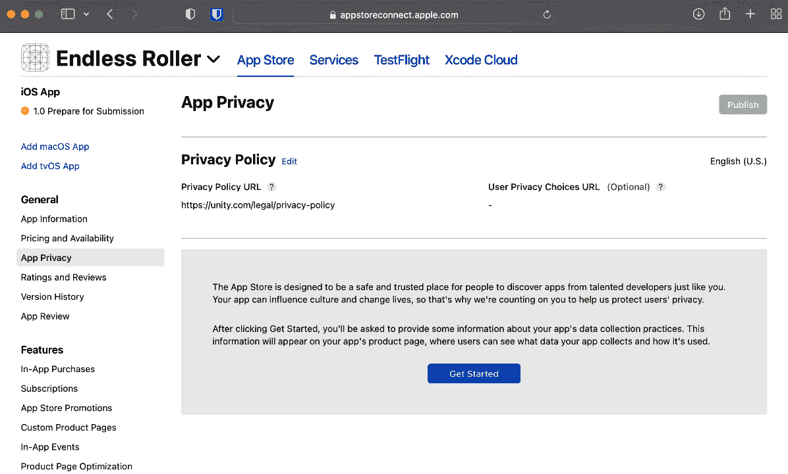

图 14.43 – 设置应用隐私

1.  根据您的应用使用的内容类型填写适当的答案。在我们的案例中，由于我们使用 Unity Ads、Analytics 和 IAPs（应用内购买），我们需要浏览它们的每个页面并确保我们使用了它们的所有信息。以下是我用来填写细节的信息：[`documentation.cloud.unity3d.com/en/collections/2654776-apple-privacy-surveys#engage-nutritional-labels`](http://documentation.cloud.unity3d.com/en/collections/2654776-apple-privacy-surveys#engage-nutritional-labels)。

1.  完成这些信息后，您的 **产品页面预览** 屏幕应该看起来像这样：

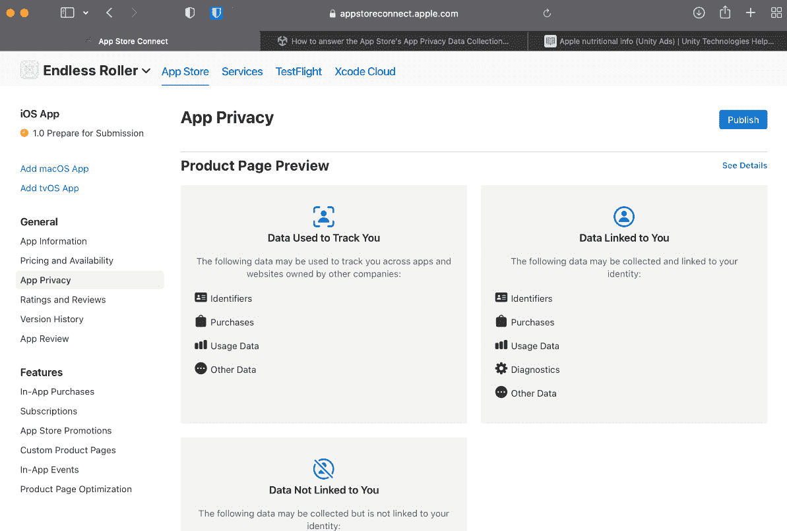

图 14.44 – 应用隐私完成

1.  完成后，点击 **发布** 按钮。

1.  一旦所有信息都填写完毕，请再次打开 Xcode 并您的导出项目（遵循 *第二章*，*Android 和 iOS 开发项目设置*）中的相同步骤。

1.  Facebook SDK 的添加为我们项目添加了一些必须添加的内容，以便在 iOS 上编译。在切换回 iOS 平台后，我得到了一个错误，说 CocoaPods 无法正确安装。考虑到这一点，我必须对项目进行以下更改。

1.  切换回 PC、Mac 和 Linux 独立构建。从您的 Mac 桌面打开一个终端窗口，并输入以下代码 – `sudo gem install cocoapods -v 1.10.2`。这将安装一个与这个版本的 Unity 兼容的稳定版本的 CocoaPods。之后，回到 Unity 中，将平台切换回 iOS，你应该会看到错误消失。

1.  此外，我还通过访问 [`github.com/googlesamples/unity-jar-resolver`](https://github.com/googlesamples/unity-jar-resolver) 并下载最新版本来更新了 Unity JAR 解析器，在我这个案例中，是 `external-dependency-manager-1.2.175.unitypackage` 文件。

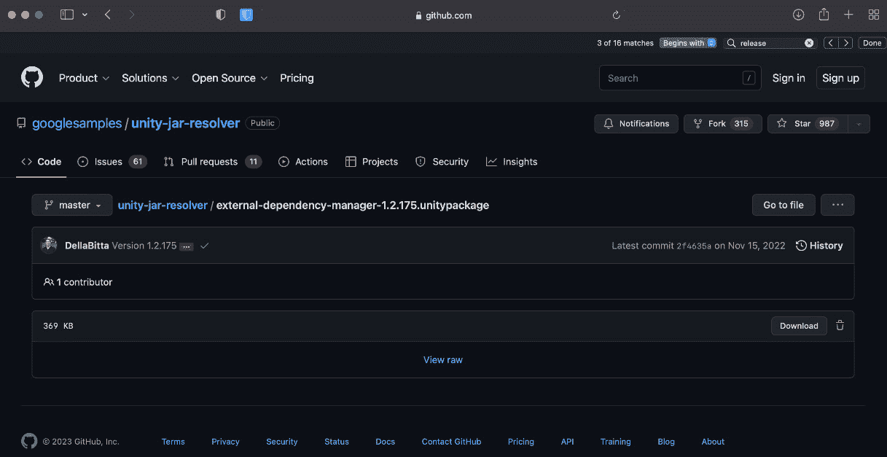

图 14.45 – 更新的 unity-jar-resolver

1.  打开文件并导入文件后，Unity 会询问我是否想要替换过时的库，我通过点击 **应用** 按钮接受了。

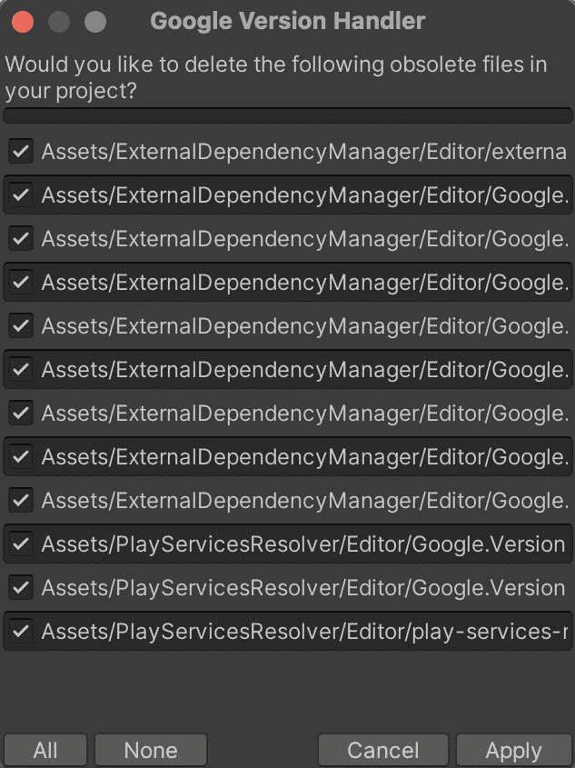

图 14.46 – 更新文件

1.  更新完成后，转到 **Assets** | **外部依赖管理器** | **iOS 解析器** | **设置**。在 **Cocaopods 集成** 下，将值更改为 **Xcode 项目**。

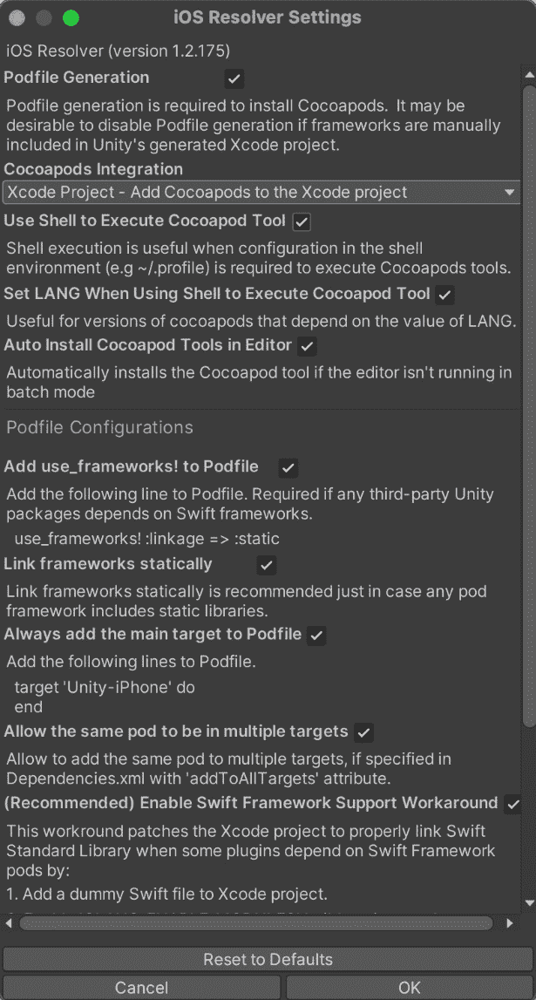

图 14.47 – 更改 Cocoapods 集成

使用 Facebook SDK，我们将无法再使用 Unity 为我们提供的基项目打开我们的项目，因此我们需要使用终端为我们生成一个工作空间文件。

1.  然后，在构建项目后，在项目位置打开一个终端窗口。然后，根据您的处理器，您可能需要输入不同的命令。

1.  如果您的 Mac 处理器使用 ARM 处理器（如 M1），请输入以下命令 – `sudo arch -x86_64 gem install ffi`。

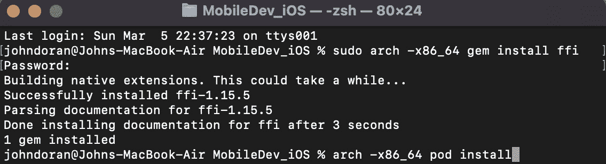

图 14.48 – 执行 gem 安装

1.  此命令只需使用一次。任务完成后，输入以下命令 – `arch -x86_64 pod install`。此命令只需在您创建项目的新构建时执行一次。

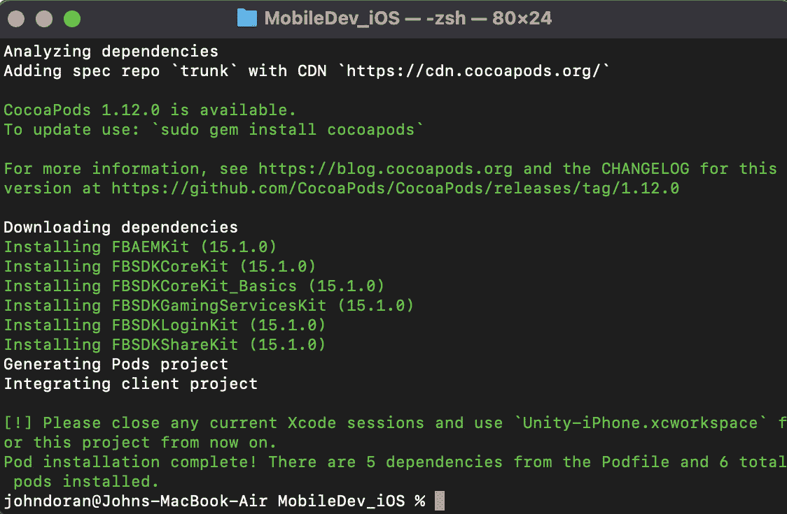

图 14.49 – 完成的宝石安装

1.  如果你的 Mac 处理器使用 x86 处理器（如 Intel），请输入以下命令代替 – `pod install`。

1.  一旦 Pod 安装成功，双击项目目录中新建的 `Unity-iPhone.xcworkspace` 以在 Xcode 中打开工作区。

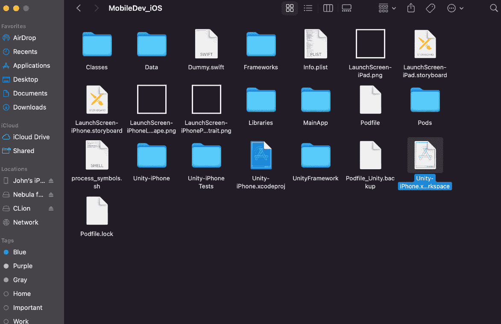

图 14.50 – 新工作区文件

如果你现在尝试运行游戏，它将给出关于目标之间依赖循环的错误。幸运的是，一旦我们进入 Xcode，我们就可以解决这个问题。

1.  进入 Xcode 后，在左侧菜单的最远端，选择 **Unity-iPhone 项目**，然后在右侧的相应部分下，在 **TARGETS** 下选择 **UnityFramework** 选项。从屏幕顶部显示的选项卡中，点击 **构建阶段**。从那里，你应该会看到一系列选项。将 **头文件** 部分拖到 **编译源文件** 部分之上。如果一切顺利，它应该看起来像这样。

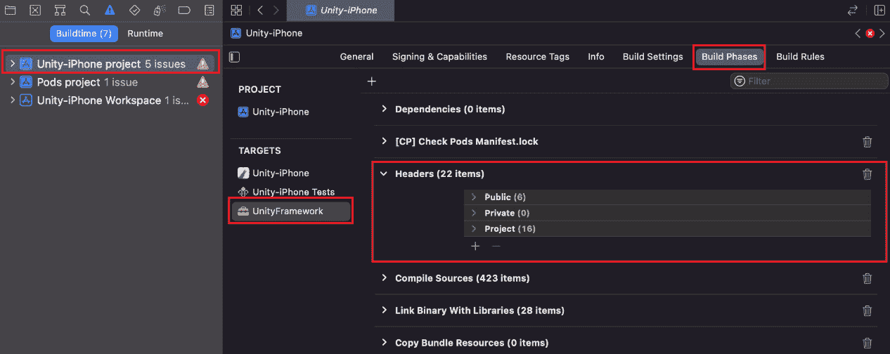

图 14.51 – 调整头文件顺序

1.  苹果公司还禁止包含框架文件，因此我们还需要阻止它们被嵌入。要做到这一点，请转到 **构建阶段**，然后在 **构建选项** 下，将 **始终嵌入 Swift 标准库** 选项更改为 **否**。

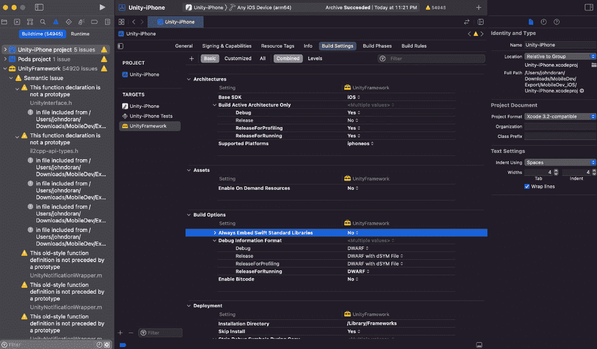

图 14.52 – 构建选项

1.  一旦项目在 Xcode 中打开并成功导出，请转到 **产品** | **归档** 并等待其完成：

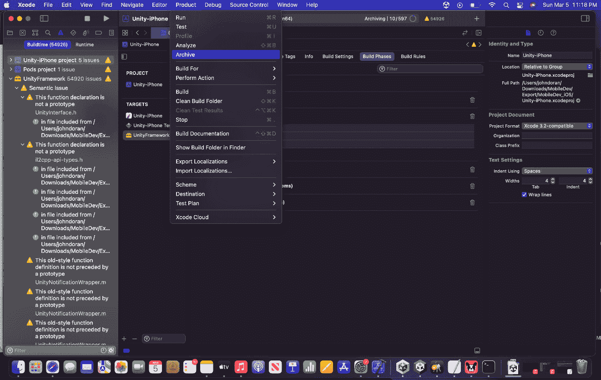

图 14.53 – 创建归档

1.  这通常需要一段时间，所以请等待其完成。你可能需要使用访问密钥。点击 **允许** 按钮。

1.  完成后，你应该会被带到以下菜单。点击 **分发应用** 按钮，将项目上传到 App Store：

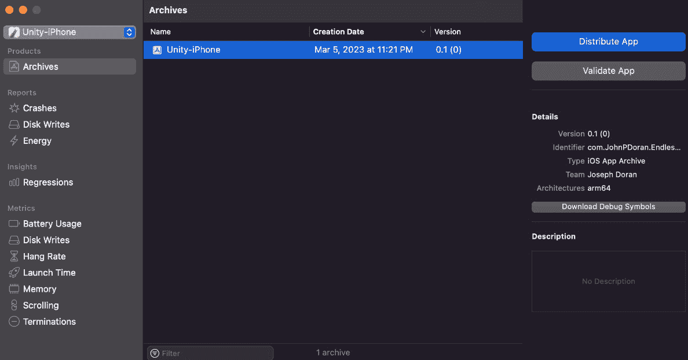

图 14.54 – 分发应用归档

1.  你将被要求选择一些选项。通常，使用默认选项，之后，它将显示已上传到商店的 `.ipa` 文件。在上传之前，它将给你一个最后查看项目每个方面的信息的机会。点击 **上传** 按钮，并等待其完成：

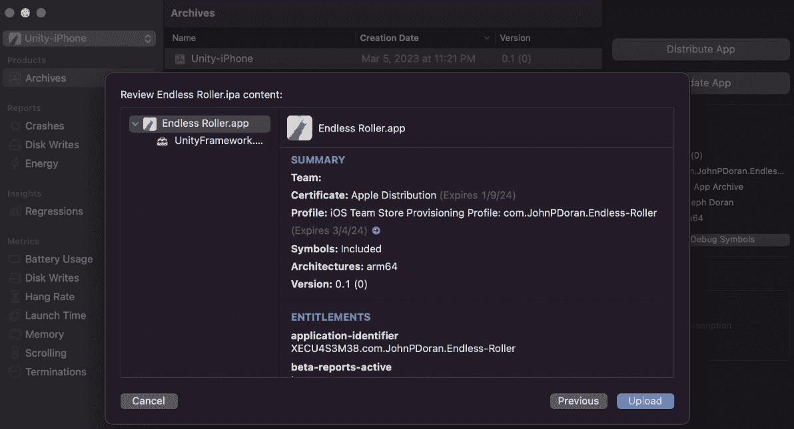

图 14.55 – 查看 ipa 内容

当你的应用上传后，你会看到以下屏幕：

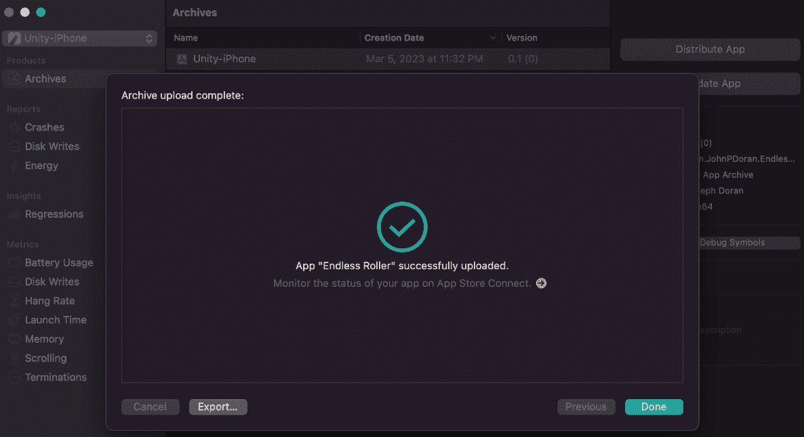

图 14.56 – 归档上传完成

然而，这不会立即显示在 **App Store Connect** 上；你可能需要等待片刻（或几个小时）才能更新。然而，一旦准备好，你将在我们之前提到的构建部分看到它。

1.  上传完成后，您应该在提交应用之前能够点击**选择构建**按钮。

1.  从那里，选择我们创建的构建，然后点击**完成**按钮：

图 14.57 – 添加构建

1.  注意有一个部分说缺少合规信息。点击 `https` 调用。我使用了标准的加密算法，并表示不会在法国提供应用。

关于 Unity 对此立场的更多信息，您可以查看 [`forum.unity.com/threads/unity-iap-and-export-compliance.742898/`](https://forum.unity.com/threads/unity-iap-and-export-compliance.742898/) 和 [`forum.unity.com/threads/how-to-answer-apples-app-store-new-export-compliance-information-dialogue.1363785/`](https://forum.unity.com/threads/how-to-answer-apples-app-store-new-export-compliance-information-dialogue.1363785/).

1.  然后，点击**保存**按钮。完成所有操作并确认所有信息无误后，您可以点击**添加以供审查**按钮，等待苹果的反馈。

通常，首次开发者收到反馈需要 3-4 周，尽管这可能会更长或更短，具体取决于季节性需求。随着您发布越来越多的标题，每次所需的时间会越来越少。如果获得批准，您将收到一封电子邮件，告知您应用已上传，或者他们可能会提供需要修改以获得商店上架批准的详细信息。

# 摘要

在本章中，您学习了如何在 Google Play 和 Apple iOS 应用商店发布您的游戏。您学习了如何通过设置 Google Play 控制台将游戏上传到 Google Play，最后如何将应用发布到商店。然后您学习了如何将游戏的 iOS 版本上传到应用商店，以及所有相关的设置。

希望您喜欢对这个功能探索的旅程，并且继续探索这个领域的可能性。在下一章中，我们将发现移动游戏开发中最新的添加之一——增强现实。
