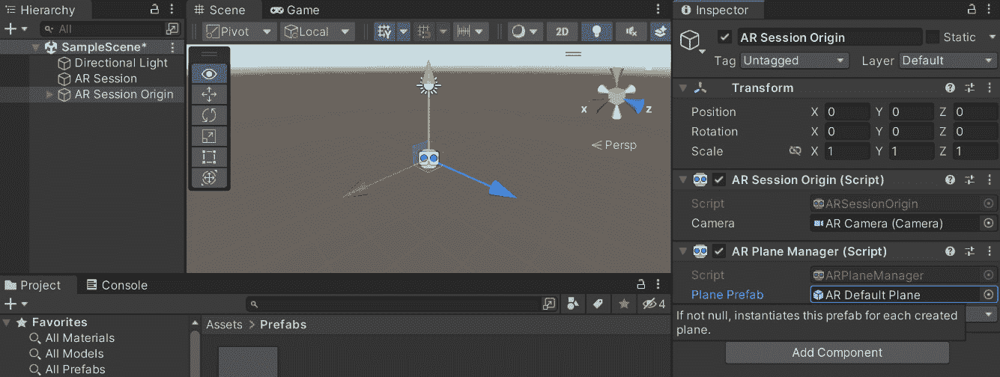

# 15

# 增强现实

随着《精灵宝可梦 GO》和 Snapchat 滤镜的流行，**增强现实**（**AR**）是将数字元素与真实世界融合的一种方式。具体来说，它是一种将计算机生成的图像叠加到用户对真实世界的视图上的技术，因此提供了一种组合视图，这意味着真实世界和叠加在其上的数字元素都显示给玩家。

在本章中，我们将探讨如何设置我们的项目以利用 AR 为 Android 和 iOS 设备服务，以及我们如何自定义它们。这个项目将是一个简单的 AR 项目，玩家可以在游戏环境中查看各种表面并在其上生成对象。本章的目标将是探索 AR 的基本概念，并了解它们如何在项目中使用。

本章将分为几个主题。它将包含从开始到结束的简单、逐步过程。以下是我们的任务大纲：

+   为 AR 设置项目

+   检测表面

+   与 AR 环境交互

+   在 AR 中生成对象

到本章结束时，你将很好地理解 AR 技术以及如何创建一个基本的 AR 项目。无论你是初学者还是有经验的开发者，本章都将为你提供一个坚实的基础，以便进一步探索和实验 AR，这不仅对移动开发有用，对于那些希望获得与 Meta 的耳机以及苹果的 Vision Pro 中使用的相同技术经验的人来说也很有用。

# 技术要求

本书使用 Unity 2022.1.0b16 和 Unity Hub 3.3.1，但步骤应该在未来版本的编辑器中只需进行最小更改即可。如果你想下载本书中使用的确切版本，并且有新版本发布，你可以访问 Unity 的下载存档[`unity3d.com/get-unity/download/archive`](https://unity3d.com/get-unity/download/archive)。你还可以在**Unity 编辑器系统要求**部分找到 Unity 的系统要求[`docs.unity3d.com/2022.1/Documentation/Manual/system-requirements.html`](https://docs.unity3d.com/2022.1/Documentation/Manual/system-requirements.html)。要部署你的项目，你需要一个 Android 或 iOS 设备。

你可以在 GitHub 上找到本章中提供的代码文件，链接为[`github.com/PacktPublishing/Unity-2022-Mobile-Game-Development-3rd-Edition/tree/main/Chapter15`](https://github.com/PacktPublishing/Unity-2022-Mobile-Game-Development-3rd-Edition/tree/main/Chapter15)。

# 为 AR 设置项目

在我们开始向我们的项目添加通知之前，我们需要添加三个 Unity 提供的包，以使 iOS 和 Android 设备都支持 AR。在我们的案例中，我们将利用 ARCore 和 ARKit 来创建我们的项目，并使用 AR Foundation 包作为中介，以便我们可以在使用类似连接的同时使用 ARCore 和 ARKit。由于这是一种全新的创建项目的方式，我们将实际创建一个新的 Unity 项目来演示如何使用它。请按照以下步骤操作：

1.  要开始，请在您的计算机上打开 Unity Hub。

1.  从启动开始，我们将通过点击**新建**按钮来创建一个新的项目。

1.  接下来，在`Mobile AR`下，并在**模板**下，确保**3D**被选中：


图 15.1 – 创建 3D 项目

1.  之后，点击**创建项目**并等待 Unity 加载。

1.  从 Unity 编辑器，转到**窗口** | **包管理器**。

1.  如果尚未设置，请从**包**菜单的工具栏中点击**项目内**下拉菜单，并选择**Unity 注册表**。

1.  从这里，转到右上角的搜索栏，并输入`XR`。从那里，您需要选择**ARKit XR 插件**以支持 iOS 设备，或选择**ARCore XR 插件**以支持 Android，然后点击**安装**。之后，向下滚动可用的选项，直到找到**AR Foundation**并选择它。一旦到达那里，点击**安装**按钮：


图 15.2 – 安装包

我们现在已经拥有了所有需要的包，因此我们可以退出**包管理器**。

注意

虽然 AR Foundation 可以完成您想要在 AR 中做的几乎所有事情，但还有一些事情是仅适用于 iOS 或 Android 的。有关 AR Foundation 能做什么以及 ARCore 和 ARKit 各自提供的内容的更多信息，请查看[`docs.unity3d.com/Packages/com.unity.xr.arfoundation@5.0/manual/index.html#platform-support`](https://docs.unity3d.com/Packages/com.unity.xr.arfoundation@5.0/manual/index.html#platform-support)。

1.  接下来，通过访问**文件** | **构建设置**打开**构建设置**菜单。从那里，将您的平台更改为**iOS**或**Android**，然后点击**切换平台**按钮。之后，点击**玩家设置...**选项。

1.  接下来，如果您计划使用 iOS，请完成*步骤 10*；如果您计划使用 Android，请完成*步骤 11*；如果您计划同时使用 iOS 和 Android，请完成这两个步骤。

1.  如果您正在使用 iOS，请确保在 iOS 的**平台设置**部分中，**需要 ARKit 支持**选项也被选中。

1.  对于使用安卓的用户，转到安卓**玩家设置...**，在**其他设置**下，转到**渲染**并取消勾选**自动图形 API**选项。然后，在**图形 API**部分，选择**Vulkan**选项并按**–**按钮将其从列表中删除。然后，向下滚动并取消勾选**多线程****渲染**选项。


图 15.3 – 安卓玩家设置配置

1.  我们必须禁用此功能的原因是，截至写作时，它与 ARCore 不兼容。您还希望将**最小 API 级别**设置为**Android 7.0‘Nougat’（API 级别 24）**或更高。

当在 Unity 中处理 ARCore 项目时，建议您启用 ARM64 目标架构。如果您的应用程序仅支持 32 位 ARMv7 架构，它可能在 64 位设备上无法正常工作，并且可能无法从 Google Play Store 下载。这是因为一些 64 位设备不支持 32 位 ARCore 库。因此，为了避免任何问题，最好在 Unity 项目中启用 ARM64 目标架构。

在**配置**下，将**脚本后端**设置为**IL2CPP**。接下来，在**目标架构**下，启用**ARM64**选项。


图 15.4 – 更改目标架构

1.  现在，从**玩家设置...**菜单中选择**XR 插件管理**选项，然后，在**插件提供者**下，勾选**ARCore**字段，对于 iOS，勾选**ARKit**选项。


图 15.5 – 启用 ARCore

通过这样，我们已经处理了所有支持我们的项目并正确导出的设置！

现在我们已经包含了 AR Foundation，我们现在可以为 VR 项目创建一个基本场景。

# 基本设置

由于玩家在游戏开始时可能位于任何位置，我们无法使用传统意义上的摄像机，因此我们将首先删除原始的摄像机。按照以下步骤操作：

1.  从**层次结构**面板中选择**主摄像机**对象，通过右键点击并选择**删除**或按*Delete*键来删除它。

在我们开始实现自己的功能之前，我们需要创建两个关键对象：**AR 会话**和**AR 会话原点**。

1.  在**层次结构**面板中右键点击并选择**XR** | **AR 会话**：


图 15.6 – 创建 AR 会话

**AR 会话**是控制任何 AR 体验生命周期的，这允许我们根据我们正在工作的平台启用或禁用 AR 功能。

注意

**AR Session**还负责告诉你你的设备是否支持 AR。有关处理此问题的信息，请参阅[`docs.unity3d.com/Packages/com.unity.xr.arfoundation@4.2/manual/index.html#checking-for-device-support`](https://docs.unity3d.com/Packages/com.unity.xr.arfoundation@4.2/manual/index.html#checking-for-device-support)。

1.  通过右键单击并选择**XR** | **AR Session Origin**来创建一个**AR Session Origin**对象。

**AR Session Origin**用于在游戏本身播放时缩放和偏移虚拟内容。你可能注意到对象有一个子对象，**AR Camera**，这是在游戏运行时跟随游戏的相机。

在我们将设备部署以确保一切正常工作之前，让我们在我们的场景中添加一个立方体，这样我们就可以看到它是否正常工作。

1.  如果还没有切换到**场景**视图，请从顶部菜单点击**GameObject** | **3D Object** | **Cube**：


图 15.7 – 创建一个立方体

1.  现在，构建你的项目，并将游戏以与*第二章*中讨论的相同方式部署到设备上，*Android 和 iOS 开发的项目设置*。

小贴士

对于 iOS 用户，当你构建项目时，可能会告诉你项目缺少`.xml`文件。如果出现这种情况，当被提示时，请点击**是，修复并构建**选项。

对于 Android 用户，如果尚未安装，你可能需要安装 Google Play Services for AR。

1.  运行你的项目后，如果需要，请授予相机访问权限并打开游戏。一旦项目显示你的环境，当游戏开始时向后退：


图 15.8 – 我们的第一项 AR 结果

我们必须后退以看到立方体的原因是因为所有对象的位置都是基于游戏开始时手机物理所在的位置。立方体也相当大，因为在默认的 1,1,1 缩放下，这意味着它每边相对于真实尺寸的对象有 1 米（或大约 3.3 英尺）宽。显然，我们不希望用户在游戏开始时后退，因此我们需要跟踪我们环境中可用的表面位置，这正是我们将要做的下一件事。

为了检测我们真实世界环境中的表面，我们需要使用一个新的组件，**AR Plane Manager**。这个组件允许我们根据真实世界环境中的表面创建、删除或更新场景中的 GameObject。以下步骤将自动创建不可见的带有碰撞器的平面，我们可能可以用作游戏玩法的原因：

1.  我们不再需要我们创建的原始立方体，因此我们可以通过右键单击它并选择**删除**，或者通过选择它并按*Delete*键来从场景中删除它。

1.  从 **层次** 面板中选择 **AR 会话原点** 对象。从那里，通过在 **检查器** 窗口的底部点击 **添加组件** 按钮并输入组件名称然后按 *Enter* 键，将其添加到 **AR 平面管理器** 组件中。

到这一点，我们将在运行时生成场景中的表面，但对于像调试这样的东西，能够直观地看到正在生成的平面会是个好主意。所以，我们将使用以下步骤来做这件事：

1.  从顶部菜单，转到 **游戏对象** | **XR** | **AR 默认平面**。

此对象有几个不同的组件，用于创建视觉平面；值得注意的是，**AR 平面** 和 **AR 平面网格可视化器** 组件。**AR 平面** 代表由 AR 设备检测到的平面，而 **AR 平面网格可视化器** 负责使用 **AR 平面** 的数据来修改 **MeshFilter** 和 **MeshCollider** 组件，以叠加检测到的墙壁，并使用 **线条渲染器** 组件显示边界。**网格渲染器** 组件将绘制这些修改后显示的信息。

1.  从 `预制件`。

1.  将 `预制件` 文件夹拖动以将其转换为预制件。如果操作正确，你应该会注意到 **层次** 窗口中 GameObject 的文本现在变成了蓝色：


图 15.9 – 创建预制件

1.  一旦创建，你可以在 **层次** 窗口中删除 **AR 默认平面** 对象。

1.  选择 **AR 会话原点** 对象。点击 **添加组件** 按钮，并添加一个 **AR 平面管理器** 组件。之后，将 **AR 默认平面** 预制件拖放到 **AR 平面** **管理器** 组件的 **平面预制件** 属性中：



图 15.10 – 分配平面预制件

这将告诉 **平面管理器**，每次它检测到场景中的新平面时，它都应该生成一个平面预制件，并为其绘制细节。

1.  保存你的项目并再次构建你的游戏。一旦它在你的设备上运行，你就可以在房间里四处走动，同时移动相机：


图 15.11 – AR 中创建平面

你在一个有移动的区域停留的时间越长，手机就需要更长时间来构建你环境中表面的更逼真的描绘。

随意打开我们创建的预制件，并修改你的平面如何被可视化！

现在我们可以看到游戏环境中的事情发生，这很好，但我们目前还没有实际与世界交互的方法——这就是我们将在下一节中探讨的内容。

# 与 AR 环境交互

我们可以让玩家与世界交互的一种方法是通过允许他们在场景中生成对象，以帮助玩家看到物品将生成在哪里。我们可以创建一个指示器来显示它们实际生成的地方。让我们看看完成这一点的步骤：

1.  使用**GameObject** | **3D Object** | **Quad**创建一个四边形。

四边形代表一个平面，这是最简单的几何类型。在我们的情况下，我们将使用四边形作为指示器，告诉玩家如果他们在屏幕上点击，他们将生成对象的位置。

1.  选择四边形后，前往`(0,0,0)`，`90`，和`(0.2,0.2,1)`。

我们将四边形缩小到 20 厘米长，并旋转它以更好地代表地板。我们不希望这些值改变，但最终我们希望移动和旋转这个对象以跟随玩家移动摄像头。为了保护这些数据，我们可以为它创建一个父对象。这样，每当父对象移动或旋转时，子对象也会以相同的方式移动和旋转。

1.  通过选择`放置指示器`创建一个空的游戏对象。然后，前往`(0,0,0)`。

1.  从**层次结构**窗口中，将**Quad**游戏对象拖放到**放置指示器**对象上，使其成为子对象：


图 15.12 – 创建放置指示器对象

现在我们有一个可以工作的对象，我们需要一种方法来确定玩家的摄像头朝向，以便我们可以移动该对象。我们可以通过使用一个新的组件，**AR** **射线投射管理器**来实现这一点。

1.  从**层次结构**窗口中选择**AR 会话起源**对象。从那里，向其添加**AR 射线投射管理器**组件。

**AR 射线投射管理器**组件提供了向 AR Foundation 进行射线投射的能力。这将允许我们在我们所在的物理环境中执行射线投射。射线投射，也称为碰撞检测，允许我们创建一条射线，这是一条无形的线，可以用来检查是否从其起点和方向有物体与之碰撞。这在游戏中经常用于检查子弹是否会击中玩家。

现在我们已经完成了这个设置，让我们看看我们如何在代码中与这些组件一起工作，以及我们如何使用以下步骤的信息在现实世界空间中放置 AR 对象：

1.  前往`Assets`文件夹。从那里，创建一个名为`Scripts`的新文件夹。

1.  进入`Scripts`文件夹，创建一个名为`PlaceARObject`的新 C#脚本。

1.  在文件顶部添加以下`using`语句：

    ```kt
    using UnityEngine.XR.ARFoundation; /* ARRaycastManager */
    using UnityEngine.XR.ARSubsystems; /* TrackableType */
    ```

1.  将以下属性添加到类中：

    ```kt
    /// <summary>
    /// A reference to the Raycast Manager for being able
    /// to perform raycasts
    /// </summary>
    ARRaycastManager raycastManager;
    /// <summary>
    /// A reference to the AR camera to know where to draw
    /// raycasts from
    /// </summary> Camera arCamera;
    ```

1.  然后，我们需要在`Start`函数中初始化属性：

    ```kt
    /// <summary>
    /// Start is called before the first frame update.
    /// Initialize our private variables
    /// </summary>
    void Start()
    {
        raycastManager = GameObject.FindObjectOfType
            <ARRaycastManager>();
        arCamera = GameObject.FindObjectOfType<Camera>();
    }
    ```

1.  最后，我们需要替换我们的`Update`函数并使用`LateUpdate`代替：

    ```kt
    /// <summary>
    /// LateUpdate is called once per frame after all
    /// Update functions have been called
    /// </summary>
    private void LateUpdate()
    {
        /* Figure out where the center of the screen is */
        var viewportCenter = new Vector2(0.5f, 0.5f);
        var screenCenter =
           arCamera.ViewportToScreenPoint(viewportCenter);
        /* Check if there is something in front of the
           center of the screen and update the placement
           indicator if needed */
        UpdateIndicator(screenCenter);
    }
    ```

1.  在前面的代码片段中，我们使用了一个当前不存在的`UpdateIndicator`函数，所以让我们添加它：

    ```kt
    /// <summary>
    /// Will update the placement indicator's position and
    /// rotation to be on the floor of any plane surface
    /// </summary>
    /// <param name="screenPosition">A position in screen
    /// space</param>
    private void UpdateIndicator(Vector2 screenPosition)
    {
        var hits = new List<ARRaycastHit>();
        raycastManager.Raycast(screenPosition,
            hits, TrackableType.Planes);
        /* If there is at least one hit position */
        if (hits.Count > 0)
        {
            // Get the pose data
            var placementPose = hits[0].pose;
            var camForward = arCamera.transform.forward;
            /* We want the object to be flat */
            camForward.y = 0;
            /* Scale the vector be have a size of 1 */
            camForward = camForward.normalized;
            /* Rotate to face in front of the camera */
            placementPose.rotation =
                Quaternion.LookRotation(camForward);
            transform.SetPositionAndRotation
                (placementPose.position,
                    placementPose.rotation);
        }
    }
    ```

1.  保存脚本并返回到 Unity 编辑器。将`PlaceARObject`脚本附加到**放置指示器**GameObject。

1.  将游戏导出到您选择的设备上并验证它是否正常工作：


图 15.13 – AR 中的放置指示器

如您所见，现在平面将移动并旋转，始终面向我们！您可能会注意到飞机有一个闪烁的纹理。这是由于我们之前在*第四章*中讨论的 z-fighting 概念，*分辨率无关 UI*。基本上，两个对象具有相同的坐标，所以 Unity 需要决定它们的绘制顺序。我们可以通过将四边形稍微放置在平面的位置上方来解决这个问题，我们现在就这样做。

1.  更新`UpdateIndicator`函数，在末尾使用以下代码：

    ```kt
            /* Rotate to face in front of the camera */
            placementPose.rotation =
                Quaternion.LookRotation(camForward);
            /* Move the quad slightly above the floor to
               avoid z-fighting */
            var newPosition = placementPose.position;
            newPosition.y += 0.001f;
            transform.SetPositionAndRotation(newPosition,
                placementPose.rotation);
        }
    }
    ```

1.  保存脚本并再次导出游戏。如您所见，现在四边形干净地放置在给定的表面上方：


图 15.14 – 调整后的放置指示器

现在我们有一种指示器，让我们实际在 AR 中生成一个对象。

# 在 AR 中生成对象

在 AR 中创建对象的简单方法就是让玩家在屏幕上点击时，在**放置指示器**对象所在的位置生成对象。但在我们这样做之前，我们首先需要创建一个我们希望在场景中创建的对象。

按照这里给出的步骤进行：

1.  通过转到**GameObject** | **3D Object** | **Sphere**创建一个球体。

1.  从`(0,0,0)`设置到`(0.2,0.2,0.2)`。

1.  通过转到**Component** | **Physics** | **Rigidbody**为球体添加一个**Rigidbody**组件。

通过添加**Rigidbody**组件，我们让 Unity 知道我们希望这个对象受到重力、碰撞事件和施加到它上的力的作用。在这个阶段，您可以按需自定义对象，更改网格和碰撞器等。

1.  前往`Prefabs`文件夹。通过从**Hierarchy**窗口拖放到**Project**窗口创建我们的球体的 Prefab：


图 15.15 – 创建用于生成的 3D 对象

1.  现在这个对象是一个 Prefab，我们可以从**Hierarchy**窗口中删除它。

1.  打开`PlaceARObject`脚本，并向其中添加以下属性：

    ```kt
    [Tooltip("The object to spawn when the screen is tapped")] public GameObject objectToSpawn;
    ```

1.  然后，更新`LateUpdate`函数为以下内容：

    ```kt
        /// <summary>
        /// LateUpdate is called once per frame after all
        /// Update functions have been called
        /// </summary>
        private void LateUpdate()
        {
            /* Figure out where the center of the screen
               is */
            var viewportCenter = new Vector2(0.5f, 0.5f);
            var screenCenter =
                arCamera.ViewportToScreenPoint(
                    viewportCenter);
            /* Check if there is something in front of the
               center of the screen and update the
               placement indicator if needed */
            UpdateIndicator(screenCenter);
            /* If we tap on the screen, spawn an object */
            if (Input.GetMouseButtonDown(0))
            {
                /* Spawn the object above the floor to see
                   it fall */
                Vector3 objPos = transform.position +
    Vector3.up;
                if (objectToSpawn)
                {
                    Instantiate(objectToSpawn, objPos,
                        transform.rotation);
                }
            }
        }
    ```

1.  保存脚本并返回到 Unity 编辑器。

1.  从**Hierarchy**窗口中选择**放置指示器**对象。从**Inspector**窗口中，将**要生成的对象**属性设置为我们的**Sphere**Prefab：


图 15.16 – 设置要生成的对象

1.  保存您的项目并构建到您的设备上，然后点击屏幕以在屏幕上生成球体：


图 15.17 – 在我们的 AR 环境中生成对象

如您所见，我们现在可以将对象生成到场景中，并且可以看到它们正确地相互交互！更进一步，您可以创建任何类型的游戏体验！

# 摘要

在本章中，您已经学习了如何利用 Unity 的 AR 工具集，通过将人工计算机生成的对象添加到现实世界中来增强现实。这项新兴且不断发展的技术仍在开发中，从这项工作中获得的技能在未来可能会变得更加重要，因为像**虚拟现实**（**VR**）、**混合现实**（**MR**）和其他形式的**扩展现实**（**XR**）变得越来越普遍。

在本章中，您学习了如何为 iOS 安装 ARKit、为 Android 安装 ARCore 以及为多平台 AR 解决方案安装 AR Foundation。安装完成后，您学习了如何设置 iOS 和 Android AR 开发的平台设置。之后，我们进行了基本设置，让 Unity 使用其 AR 工具，使用户能够将简单的网格添加到环境中。然后，我们在此基础上使用 AR Plane Manager 检测现实世界中的表面，并学习了如何使用 AR Default Plane 对象来可视化它。然后，我们学习了如何使用 AR Raycast Manager 与 AR 环境交互，以检测我们何时击中现实世界中的网格，并让计算机生成的世界中的对象对其做出反应。最后，我们看到了如何使用这些信息在 AR 中生成对象。

小贴士

除了 AR Foundation、ARCore 和 ARKit 之外，还有几个其他框架和插件可用于将 AR 添加到 Unity 应用程序中。

如果您的项目需要 Unity 提供之外的具体功能，替代框架可以提供必要的工具或为您的特定用例提供更好的支持和性能。例如，Vuforia（[`www.ptc.com/en/products/vuforia`](https://www.ptc.com/en/products/vuforia)）以其强大的基于标记的跟踪而闻名，而 Wikitude（[`www.wikitude.com/download-wikitude-sdk-for-unity/`](https://www.wikitude.com/download-wikitude-sdk-for-unity/)）则专注于基于位置的 AR 体验。

最终，选择 AR 框架取决于平台支持、所需功能、开发者专业知识以及项目特定需求等因素。评估每个框架的优势和局限性，选择与您的目标和需求最匹配的框架是至关重要的。

这应该为您提供所有您需要的信息，以便开始自己进行实验，看看您是否可以创建自己的移动设备游戏和 AR 环境中的游戏。所以，勇敢地前进，利用这本书中的知识来使您的游戏达到最佳状态，我期待着玩它们！
