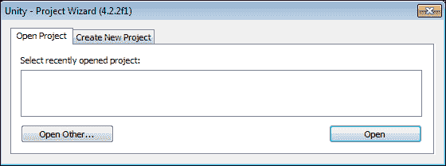

# 第一章. 与 Unity 和 Android 问候

*欢迎来到移动游戏开发的奇妙世界。无论你仍在寻找合适的发展套件，还是已经选择了其中一个，这一章都将非常重要。在本章中，我们将探讨选择 **Unity** 作为开发环境和 **Android** 作为目标平台所带来的各种功能。通过与主要竞争对手的比较，我们将发现为什么 Unity 和 Android 能站在最前沿。随后，我们将研究 Unity 和 Android 如何协同工作。最后，我们将设置开发环境，并创建一个简单的 Hello World 应用程序来测试一切是否设置正确。为了本书的目的，我们假设你在一个基于 Windows 的环境中工作。*

在本章中，我们将涵盖以下主题：

+   主要的 Unity 功能

+   主要的 Android 功能

+   Unity 许可证选项

+   安装 JDK

+   安装 Android SDK

+   安装 Unity 3D

+   安装 Unity Remote

# 理解使 Unity 伟大的原因

也许 Unity 最伟大的功能就是它的开放性。目前市场上的几乎所有游戏引擎在可构建的内容上都有所限制。这虽然合乎逻辑，但可能会限制团队的能力。平均游戏引擎已经高度优化以创建特定类型的游戏。如果你计划反复制作相同的游戏，这当然很好。当一个人灵感迸发，想要制作下一个大热门游戏，却发现游戏引擎无法处理，每个人都必须重新学习一个新的引擎或加倍开发时间来使其具备这种能力时，这可能会非常令人沮丧。Unity 并没有这个问题。Unity 的开发者们非常努力地优化了引擎的每一个方面，而没有限制可以制作的游戏类型。从简单的 2D 平台游戏到庞大的在线角色扮演游戏，在 Unity 中都是可能的。一个刚刚完成超真实第一人称射击游戏的开发团队可以立即转向制作 2D 格斗游戏，而无需学习全新的系统。

然而，这种开放性也带来了一些缺点。没有默认的工具是针对构建完美游戏进行优化的。为了解决这个问题，Unity 允许创建任何可以想象到的工具，使用与创建游戏相同的脚本。除此之外，还有一个强大的用户社区，他们提供了大量工具和组件，既有免费的也有付费的，可以快速插入并使用。这导致了大量可用内容的出现，可以帮助你快速启动下一个伟大的游戏项目。

当许多潜在用户看到 Unity 时，他们可能会认为因为它非常便宜，所以它不如昂贵的 AAA 游戏引擎好。这根本不是真的。往游戏引擎上投入更多的钱并不能让游戏变得更好。Unity 支持所有你想要的复杂着色器、法线贴图和粒子效果。最好的部分是，几乎所有你想要的复杂功能都包含在 Unity 的免费版本中，而且 90%的时间，甚至不需要使用 Pro 版本特有的功能。

在选择游戏引擎时，尤其是针对移动市场，最大的担忧之一是它会给最终构建大小增加多少体积。大多数引擎都相当庞大。使用 Unity 的代码剥离功能，它变得相当小。代码剥离是 Unity 从编译库中移除所有额外代码的过程。一个为 Android 编译且利用了完整代码剥离的空白项目最终大约为 7 兆字节。

Unity 最酷的特性之一可能是其多平台兼容性。使用单一项目，人们可以为几个不同的平台构建应用。这包括同时针对移动设备、PC 和游戏机的功能。这允许人们专注于真正的问题，例如处理输入、分辨率和性能。

在过去，如果一家公司希望在其产品部署到多个平台，他们必须几乎将开发成本翻倍，以便重新编程游戏。每个平台都，并且仍然，按照自己的逻辑和语言运行。多亏了 Unity，游戏开发从未如此简单。我们可以使用简单快速的脚本开发游戏，让 Unity 处理每个平台的复杂转换。

当然，还有许多其他游戏引擎选项。两个主要的选择是**cocos2d**和**Unreal Engine**。虽然两者都是优秀的选择，但我们总能找到它们在某些方面的不足。

《愤怒的小鸟》所使用的 cocos2d 引擎可能是你下一个移动应用的绝佳选择。然而，正如其名所示，它基本上仅限于 2D 游戏。一个游戏可以在其中看起来很棒，但如果你想要第三维度，添加起来可能会很棘手。cocos2d 的第二个主要问题是它非常基础。任何用于构建或导入资源的工具都需要从头开始创建，或者需要找到它们。除非你有时间和经验，否则这可能会严重减缓开发进度。

然后是主要游戏开发的核心，虚幻引擎。这个游戏引擎多年来一直被开发者成功使用，为世界带来了许多优秀的游戏；其中，虚幻竞技场和战争机器无疑是佼佼者。然而，这两个都是家用游戏机和电脑游戏，这是引擎的根本问题。虚幻引擎是一个非常庞大且强大的引擎。在移动平台上，只能进行有限的优化。它一直存在同样的问题；它会给项目及其最终构建增加很多负担。虚幻引擎的另一个主要问题是其在第一人称射击引擎方面的僵化。虽然技术上可以在其中创建其他类型的游戏，但这样的任务既漫长又复杂。在实现这样的成就之前，必须对底层系统有深入的了解。

总的来说，Unity 在众多引擎中确实表现强劲。也许你已经发现了这一点，这就是你阅读这本书的原因。但选择 Unity 进行游戏开发仍然有很好的理由。项目可以看起来和 AAA 级游戏一样出色。在最终构建中的开销和负担很小，这在移动平台上非常重要。系统的潜力足够开放，允许你创建任何你想要的游戏类型，而其他引擎往往只限于创建单一类型的游戏。而且，如果在项目的生命周期中的任何时刻你的需求发生变化，很容易添加、删除或更改你的目标平台选择。

# 理解什么让 Android 如此出色

在用户手中拥有超过 3000 万部设备的 Android 平台，为什么你不会选择它作为你下一个移动成功的平台呢？苹果可能凭借其 iPhone 的轰动效应第一个进入市场，但 Android 在智能手机技术方面无疑走在了前面。其最佳特性之一是它明显的能力，可以打开它，让你查看手机的工作原理，无论是物理上还是技术上。如果需要，可以更换电池和升级 micro SD 卡。将手机连接到电脑不必成为一项巨大的任务；它可以简单地作为可移动存储介质使用。

从开发成本的角度来看，Android 市场也更为优越。其他移动应用商店要求支付大约 100 美元的年度注册费。一些还限制了同时可以注册用于开发的设备数量。Google Play 市场只需一次性注册费，而且无需担心你使用多少或什么类型的 Android 设备进行开发。

一些其他移动开发套件的缺点之一是，在获得 SDK 访问权限之前，你必须支付年度注册费。对于其中一些，在查看他们的文档之前，你需要注册和支付。Android 则更加开放和易于访问。任何人都可以免费下载 Android SDK。文档和论坛可以完全查看，无需支付任何费用。这意味着 Android 的开发可以更早开始，设备测试从一开始就是其中的一部分。

# 理解 Unity 和 Android 如何协同工作

由于 Unity 以通用方式处理项目和资产，因此无需为多个目标平台创建多个项目。这意味着你可以轻松地使用 Unity 的免费版本开始开发，并针对个人电脑。然后，在未来的某个时间点，你可以通过点击按钮切换到 Android 平台。也许，在你游戏发布后不久，它迅速占领市场，并有人强烈要求将其带到其他移动平台。只需再次点击按钮，你就可以轻松地将 iOS 作为目标，而无需对项目进行任何更改。

大多数系统需要经过一个漫长且复杂的步骤序列，才能在设备上运行你的项目。对于本书中的第一个应用，我们将要经历这个过程，因为它很重要。然而，一旦你的设备设置完成并被 Android SDK 识别，单次点击按钮就能让 Unity 构建你的应用，将其推送到设备并开始运行。没有任何事情比试图在设备上运行应用更让一些开发者头疼的了。Unity 让这一切变得简单。

通过添加免费的 Android 应用程序 Unity Remote，测试移动输入变得简单且容易，无需经历整个构建过程。在开发过程中，每次需要测试微调时，等待 5 分钟进行构建是最令人烦恼的事情，尤其是在控制和界面方面。经过第一次十几处小的调整后，构建时间开始累积。Unity Remote 让测试变得简单且容易，无需按下构建按钮。

这三大亮点：通用项目、一键构建过程和 Unity Remote。当然，我们可以想出更多 Unity 和 Android 可以协同工作的优秀方式。但这三个是节省时间和金钱的主要途径。你可能有世界上最好的游戏，但如果构建和测试需要 10 倍的时间，那还有什么意义呢？

# Pro 版与基础版的区别

Unity 提供两种许可选项，Pro 和 Basic，可在 [`store.unity3d.com`](https://store.unity3d.com) 找到。为了跟随本书的大部分内容，Unity Basic 就足够了。然而，第四章 中的实时阴影、“设置场景 – 摄像机效果和照明”，第五章 中的全部内容、“移动 – 寻路和 AI”，以及 第九章 中讨论的一些优化功能，“优化”，将需要 Unity Pro。如果您还没有准备好花费 3,000 美元购买带有 Android 扩展的完整 Unity Pro 许可证，还有其他选择。Unity Basic 是免费的，并附带 30 天的 Unity Pro 免费试用。这个试用是完整和完整的，就像购买了 Unity Pro 一样。您还可以在以后升级您的许可证。Unity Basic 提供免费移动选项，而 Unity Pro 需要为每个移动平台购买 Pro 扩展。

## 许可证比较概述

[许可证比较](http://unity3d.com/unity/licenses) 可以在此处找到。本节将涵盖 Unity Android Pro 和 Unity Android Basic 之间的具体差异。我们将探讨该功能是什么以及它有多有用。

+   **NavMeshes, Pathfinding, and crowd Simulation**: This feature is Unity's built-in pathfinding system. It allows characters to find their way from point to point around your game. Just bake your navigation data in the editor and let Unity take over at runtime. This feature is great if you don't have the ability or inclination to program a pathfinding system yourself. There is a whole slew of tutorials online about how to program pathfinding and do crowd simulation. It is completely possible to do all of this in Unity Basic; you just need to provide the tools yourself.

+   **LOD 支持**: **LOD**（**细节级别**）允许您根据网格与摄像机的距离来控制网格的复杂程度。当摄像机靠近一个对象时，渲染一个包含许多细节的复杂网格。当摄像机远离该对象时，渲染一个简单的网格，因为所有这些细节无论如何都看不到。Unity Pro 提供了一个内置的系统来管理这一点。然而，这也是在 Unity Basic 中可以创建的另一个系统。无论是否使用 Pro，这都是提高游戏效率的重要功能。通过在远处渲染更简单的网格，可以更快地渲染一切，为精彩的游戏留下更多空间。

+   **音频过滤器**：音频过滤器允许你在运行时对音频剪辑添加效果。也许你为你的角色创建了砾石脚步声。当你的角色在跑动时，我们可以清楚地听到脚步声，但突然他们进入了一个隧道，太阳耀斑击中，导致时间扭曲，一切变慢。音频过滤器将允许我们将砾石脚步声扭曲，使其听起来就像是从隧道内部传来，并且被时间扭曲所减慢。当然，你也可以让音频人员为时间扭曲声音创建一套新的隧道砾石脚步声。但这可能会使你的游戏中的音频数量翻倍，并限制我们在运行时对其动态性的使用。我们要么播放时间扭曲的脚步声，要么不播放。音频过滤器将允许我们控制时间扭曲对我们声音的影响程度。

+   **视频播放和流媒体**：当处理复杂或高清的剪辑场景时，能够播放视频变得非常重要。特别是在移动目标上，将视频包含在构建中可能需要大量的空间。这就是这个特性的流媒体部分发挥作用的地方。这个特性不仅让我们能够播放视频，还允许我们从互联网上流式传输视频。然而，这个特性也有一个缺点。在移动平台上，视频必须通过设备的内置视频播放系统来播放。这意味着视频只能全屏播放，不能用作纹理。理论上，你可以将视频分解成每一帧的单独图片，并在运行时翻页，但这不建议用于构建大小和视频质量的原因。

+   **使用资源包的完整流媒体**：资源包是 Unity Pro 提供的一个优秀特性。它允许你创建额外的内容并将其流式传输给用户，而无需更新游戏。你可以添加新角色、关卡或几乎所有你能想到的其他内容。它们的唯一缺点是不能添加更多代码。功能不能改变，但内容可以。这是 Unity Pro 最好的特性之一。

+   **10 万美元的营业额**：这与其说是一个特性，不如说是一个指导方针。根据 Unity 的最终用户许可协议，Unity 的基本版本不能被任何在前一年财政年度收入达到 10 万美元的团体或个人所许可。这基本上意味着，如果你赚了很多钱，你就必须购买 Unity Pro。当然，如果你赚了那么多钱，你可能根本不会遇到问题。至少这是 Unity 的看法，这也是为什么会有这个规定。

+   **Mecanim: IK Rigs**: Unity 的新动画系统 Mecanim 支持许多令人兴奋的新特性，其中之一就是逆运动学（IK）。如果你对这个术语不熟悉，IK 允许你定义动画的目标点，并让系统找出如何到达那里。想象一下，你有一个杯子放在桌子上，而一个角色想要拿起它。你可以让角色弯腰去拿起杯子，但如果角色稍微偏离一点呢？或者玩家可能造成的任何其他轻微偏移，这可能会完全破坏你的动画。为每一种可能性进行动画制作显然是不切实际的。有了 IK，角色稍微偏离一点几乎无关紧要。我们只需定义手的终点，然后让手臂由 IK 系统来处理。它为我们计算出手臂需要如何移动才能将手伸到杯子那里。另一个有趣的用途是让角色在房间里走动时看向有趣的事物。一个守卫可以追踪最近的人，玩家角色可以看向他们可以与之交互的事物，或者一个触手怪物可以在不进行所有复杂动画的情况下攻击玩家。这将是一个令人兴奋的可以玩弄的特性。

+   **Mecanim: 同步层与额外曲线**

    +   在 Mecanim 中，同步层允许我们保持多组动画状态之间的同步。比如说，你有一个士兵，你想要根据他的健康状况不同来对他进行不同的动画处理。当健康状况良好时，他快步走动。受到一点伤害后，他的步伐变得沉重。当健康状况低于一半时，他的走路会变得蹒跚。而当几乎要死时，他会沿着地面爬行。通过同步层，我们可以创建一个动画状态机，并将其复制到多个层。通过更改动画并同步层，我们可以在保持状态机的同时轻松地在不同的动画之间进行转换。

    +   额外的曲线仅仅是向你的动画中添加曲线的能力。这意味着我们可以通过动画来控制各种值。例如，在游戏世界中，当一个角色抬起脚进行跳跃时，重力会几乎立即将其拉下来。通过向那个动画添加额外的曲线，在 Unity 中，我们可以控制重力对角色的影响程度，使得角色在跳跃时实际上能够进入空中。这是一个在动画旁边控制此类值的有用特性，但也可以轻松创建一个脚本，该脚本可以保存和控制曲线。

+   **自定义启动画面**: 虽然这个功能相当直观，但如果之前没有使用过 Unity，可能并不立即明显为什么这个特性被指定。当一个在 Unity 中构建的应用程序在任何平台上初始化时，它会显示一个启动画面。在 Unity Basic 中，这始终是 Unity 的标志。通过购买 Unity Pro，你可以用任何你想要的图片替换 Unity 的标志。

+   **构建大小剥离**: 这是移动平台的一个重要特性。构建大小剥离会从最终构建中移除所有多余的内容。Unity 在仅包含用于最终构建的资产方面做得非常好。通过剥离，它还会仅包含游戏本身使用的引擎部分。这在您必须低于从蜂窝塔下载的限制时非常有用。另一方面，您也可以创建类似于资产包的东西。只需让用户购买框架，然后稍后下载资产即可。

+   **实时方向阴影**: 光线和阴影可以为场景增添许多氛围。此功能使我们能够超越模糊阴影，并使用看起来更真实的阴影。如果你有足够的处理空间，这当然很好。但大多数移动设备都没有。此功能也不应用于静态场景。相反，应使用静态光照贴图，这正是它们的作用。但如果能在简单需求和品质之间找到良好的平衡，这可能是区分一般游戏和优秀游戏的特性。

+   **HDR，色调映射**: **HDR**（**高动态范围**）和色调映射使我们能够创建更逼真的光照效果。标准渲染使用从零到一的值来表示像素中每种颜色的量。这不允许探索完整的照明选项范围。HDR 允许系统使用超出此范围的值，并通过色调映射处理它们以创建更好的效果，例如明亮的早晨房间或汽车窗户反射的阳光造成的泛光。此功能的缺点在于处理器。设备仍然只能处理零到一的值，因此转换它们需要时间。此外，效果越复杂，渲染它所需的时间就越长。在手持设备上，即使是简单的游戏，看到这种效果被很好地使用也会令人惊讶。也许现代平板电脑可以处理它。

+   **光照探针**: 光照探针是一个有趣的小特性。当放置在世界中时，光照探针会确定一个物体应该如何被照亮。然后，当角色四处走动时，它会告诉角色如何进行阴影处理。角色当然是由场景中的灯光照亮的，但一次只能有有限数量的灯光为物体提供阴影。光照探针在运行时进行所有复杂的计算，从而允许更好的阴影效果。然而，再次强调，处理能力仍然是一个问题。处理能力不足，您将无法获得良好的效果；处理能力过多，将没有剩余的处理能力来玩游戏。

+   **使用全局光照和区域光照进行光照贴图**: Unity 的所有版本都支持光照贴图，允许烘焙复杂的静态阴影和光照效果。随着全局光照和区域光照的加入，你可以为场景增添更多真实感。然而，Unity 的每个版本也允许你导入自己的光照贴图。这意味着，你可以使用其他程序渲染光照贴图，并单独导入。

+   **静态批处理**: 这个功能可以加快渲染过程。而不是在每一帧上花费时间对对象进行分组以实现更快的渲染，这个功能允许系统保存事先生成的组。减少绘制调用次数是使游戏运行更快的一个强大步骤。这正是这个功能所做的事情。

+   **渲染到纹理效果**: 这是一个有趣的功能，但用途有限。它仅仅允许你将摄像机的渲染从屏幕重定向到纹理。这个纹理在最简单的形式下，可以被放置在网格上，并像监控摄像头一样工作。你也可以进行一些自定义的后处理，例如当玩家失去健康时从世界中移除颜色。然而，这个选项可能会非常消耗处理器资源。

+   **全屏后处理效果**: 这是另一个处理器密集型功能，可能不会出现在你的移动游戏中。但你可以在场景中添加一些非常酷的效果。例如，当玩家移动非常快时添加运动模糊，或者当飞船穿过扭曲的空间区域时添加漩涡效果来扭曲场景。其中最好的是使用辉光效果给事物带来类似霓虹的光芒。

+   **遮挡剔除**: 这是另一个优秀的优化功能。标准的摄像机系统渲染摄像机视锥体内的所有内容，即视空间。遮挡剔除允许我们在摄像机可以进入的空间中设置体积。这些体积用于计算摄像机从这些位置实际可以看到的内容。如果前方有墙壁，渲染其后的所有内容有什么意义呢？遮挡剔除会计算这一点，并阻止摄像机渲染墙壁后面的任何内容。

+   **导航网格：动态障碍和优先级**: 这个功能与路径查找系统协同工作。在脚本中，我们可以动态设置障碍，角色将绕过它们找到路径。能够设置优先级意味着不同类型的角色在寻找路径时可以考虑到不同类型的对象。士兵必须绕过路障才能到达目标。然而，坦克如果愿意，可以直接冲过去。

+   **.Net Socket 支持**: 这个功能只有在您计划在用户的网络上进行一些复杂操作时才有用。多玩家网络在 Unity 的每个版本中都已经支持。不过，可用的多玩家功能确实需要一个主服务器。使用套接字，可以在本地创建与其他设备的连接。

+   **性能分析器和 GPU 性能分析**: 这是一个非常有用的功能。性能分析器提供了大量关于您的游戏对处理器造成多少负载的信息。有了这些信息，我们可以深入了解细节，并确定脚本处理的确切时间。然而，在本书的结尾，我们还将创建一个工具，用于确定代码特定部分的处理时间。

+   **脚本访问资产管道**: 这是一个不错的功能。有了对管道的完全访问权限，可以对资产和构建进行大量的自定义处理。所有可能性的范围超出了本书的范围。但可以想象成能够将所有导入的纹理稍微染成蓝色。

+   **深色皮肤**: 这是一个完全的视觉功能。它的目的和意义值得怀疑。但如果您想要一个平滑的深色皮肤外观，这就是您想要的功能。编辑器中有一个选项可以将其更改为 Unity Basic 中使用的颜色方案。对于这个功能，任何让您满意的颜色都可以。

# 设置开发环境

在我们能够为 Android 创建下一个伟大的游戏之前，我们需要安装一些程序。为了使 Android SDK 能够工作，我们首先安装 JDK。然后，我们将安装 Android SDK。接下来是 Unity 的安装。然后，我们必须安装一个可选的代码编辑器。为了确保一切设置正确，我们将连接到我们的设备，并查看一些特殊策略，如果设备比较棘手的话。最后，我们将安装 Unity Remote，这是一个在您的移动开发中将变得非常有价值的程序。

# 行动时间 - 安装 JDK

Android 的首选开发语言是 Java，因此为了开发它，我们需要在我们的计算机上安装一份 Java SE 开发工具包，即 JDK。安装 JDK 的过程在以下步骤中给出：

1.  可以从 [`www.oracle.com/technetwork/java/javase/downloads/index.html`](http://www.oracle.com/technetwork/java/javase/downloads/index.html) 下载 JDK 的最新版本。因此，在网页浏览器中打开该网站。

1.  从可用版本中选择 **Java 平台 (JDK**)，您将进入一个包含许可协议和类型选择页面的组合页面。

1.  接受许可协议，并从列表底部选择您适当的 Windows 版本。如果您不确定选择哪个，那么 **Windows x86** 通常是一个安全的选择。

1.  下载完成后，运行新的安装程序。

1.  扫描、两次点击**下一步**按钮、初始化和再次点击一个**下一步**按钮，将 JDK 安装到默认位置。它在那里和任何其他地方一样好，所以安装完成后，点击**关闭**。

## **发生了什么？**

我们安装了**JDK**（**Java 开发工具包**）。我们需要这个，以便我们的 Android 开发工具包能够工作。幸运的是，这个基石的安装过程既简短又甜蜜。

# 安装 Android SDK 的行动时间

为了真正开发和连接到我们的设备，我们需要安装 Android SDK。拥有它满足两个主要要求。首先，它确保我们有识别设备的大部分最新驱动程序。其次，我们能够使用**ADB**（**Android 调试桥**）。ADB 是用于实际连接和与设备交互的系统。安装 Android SDK 的过程如下所述：

1.  最新版本的 Android SDK 可以在[`developer.android.com/sdk/index.html`](http://developer.android.com/sdk/index.html)找到，所以打开一个网页浏览器并访问该网站。

1.  一旦到达那里，滚动到页面底部并选择**使用现有 IDE**。

1.  然后点击**下载 Windows SDK 工具**按钮。

1.  然后，您将被发送到一项条款和条件协议。如果您愿意，可以阅读它，但为了继续并点击下载按钮开始下载安装程序，您需要同意它。

1.  下载完成后，启动它。

1.  点击第一个**下一步**按钮，安装程序将尝试找到合适的 JDK 版本。如果您没有安装它，您将看到一个抱怨的页面。

1.  如果您跳过了前面的步骤并且没有安装 JDK，请点击页面中间的**访问 java.oracle.com**按钮，然后返回到前面的部分以获取安装它的指导。如果您已经有了它，请继续进行此过程。

1.  再次点击**下一步**将带我们到一个关于选择为谁安装 SDK 的页面。

1.  选择**为使用此计算机的任何人安装**，因为默认的安装位置更容易在以后使用。

1.  点击**下一步**两次，然后点击**安装**以将安装程序安装到默认位置。

1.  完成后，点击**下一步**和**完成**以完成 Android SDK 管理器的安装。

1.  如果 Android SDK 管理器没有立即启动，请启动它。无论如何，给它一点时间来初始化。SDK 管理器确保我们有用于在 Android 平台上开发的最新驱动程序、系统和工具。但首先，我们必须实际安装它们。

1.  默认情况下，它应该选择安装一些选项。如果不是，请选择最新的 Android API，即写作此书时的 4.3（API 18），**Android 支持库**和位于**附加组件**中的**Google USB 驱动器**。务必确保**Android SDK 平台工具**被选中。这一点非常重要。它实际上包括了连接到我们的设备所需的工具。

1.  一切都选择完毕后，点击右下角的**安装包**。

1.  下一屏是另一组许可协议。每次通过 SDK 管理器安装或更新组件时，你都必须同意许可条款，然后才能安装。接受所有许可并点击**安装**以开始过程。

1.  现在，你可以坐下来放松一下。组件下载和安装需要一段时间。一旦完成，你可以关闭它。我们已经完成了这个过程，但你应该偶尔回来检查一下。定期检查 SDK 管理器以更新将确保你使用的是最新的工具和 API。

## *发生了什么？*

我们已安装了 Android SDK。没有它，我们将完全无法对 Android 平台进行任何操作。除了下载和安装组件的漫长等待外，这是一个相当简单的安装过程。

# 安装 Unity 3D 的行动时间

或许这本书最重要的部分，没有它，其余部分都没有意义，就是安装 Unity。

1.  Unity 的最新版本可以在[`www.unity3d.com/unity/download`](http://www.unity3d.com/unity/download)找到。截至写作此书时，当前版本是 4.2.2。

1.  下载完成后，启动安装程序，点击**下一步**，直到到达**选择组件**页面。

1.  在这里，我们可以选择 Unity 安装的特征。这些选项中没有任何一个是继续阅读本书其余部分所必需的，但它们值得一看，因为每次更新或重新安装 Unity 时，它都会要求你查看。

    +   **示例项目**是 Unity 当前构建的项目，用于展示其一些最新功能。如果你想早点跳进去看看一个完整的 Unity 游戏是什么样子，请保留这个选项。

    +   如果你计划使用 Unity 开发浏览器应用程序，则需要**Unity 开发网络播放器**。由于本书专注于 Android 开发，这是可选的。然而，检查它是个好主意。你永远不知道何时可能需要网络演示，而且使用 Unity 进行网络开发完全是免费的，所以拥有它没有坏处。

    +   最后一个选项是**MonoDevelop**。明智的选择是不要勾选这个选项。下一节将有更多细节，但现在只需说，它只是增加了一个额外的脚本编辑程序，而这个程序并不像它应该的那样有用。

1.  一旦你选择了或取消选择了你想要的操作选项，点击**下一步**。如果你希望完全按照书籍进行，我们将取消选择**MonoDevelop**，其余选项保持选中。

1.  接下来是安装位置。默认位置效果很好，所以点击**安装**并等待。这需要几分钟，所以请坐下来，放松，享受你最喜欢的饮料。

1.  安装完成后，将显示运行 Unity 的选项。保持选中并点击**完成**。如果你之前从未安装过 Unity，你将看到一个许可证激活页面。

1.  虽然 Unity 提供了一个功能丰富的免费版本，但要完整地跟随这本书的内容，需要使用一些 Unity Pro 的功能。在[`store.unity3d.com`](https://store.unity3d.com)你可以购买各种许可证。为了完整地阅读这本书，你至少需要购买 Unity Pro 和 Android Pro 许可证。购买后，你将收到一封包含你的新许可证密钥的电子邮件。在提供的文本字段中输入该密钥。

1.  如果你还没有准备好购买，你有两种选择。我们将在本章后面的**构建简单应用程序**部分介绍如何重置你的许可证。

    +   第一种选择是你可以勾选**激活 Unity 免费版本**的复选框。这将允许你使用 Unity 的免费版本。如前所述，有许多理由选择这个选项。目前最显著的理由是成本。

    +   或者，你可以选择**激活 Unity Pro 30 天免费试用版**的选项。Unity 提供了一次性安装的完整功能版本和免费的 Unity Pro 30 天试用版。这个试用版也包括 Android Pro 附加组件。在这 30 天内产生的任何内容都是完全属于你的，就像你购买了一个完整的 Unity Pro 许可证一样。他们希望你能看到它有多好，这样你才会回来购买。缺点是试用版本的水印将始终显示在游戏的角落。30 天后，Unity 将恢复到免费版本。这是一个很好的选择，如果你选择在购买前等待的话。

1.  无论你的选择是什么，一旦做出决定，就点击**确定**。

1.  下一页只是要求你使用 Unity 账户登录。这将是你用来购买账户的同一账户。只需填写字段并点击**确定**。

1.  如果你还没有购买，你可以点击**创建账户**，以便在购买时一切准备就绪。

1.  下一页是对你的开发兴趣的简短调查。填写并点击**确定**或直接滚动到页面底部并点击**现在不是时候**。

1.  最后有一个感谢页面。点击**开始使用 Unity**。

1.  经过短暂的初始化后，项目向导将打开，我们可以开始创建下一个伟大的游戏。然而，还有很多工作要做：连接开发设备。所以，现在，点击右上角的**X**按钮关闭项目向导。我们将在后面的*构建简单应用程序*部分介绍如何创建新项目。

## *发生了什么？*

我们刚刚安装了 Unity 3D。整本书都依赖于这一步。我们还必须做出关于许可证的选择。如果你选择购买专业版，你将能够无障碍地跟随本书中的所有内容。然而，其他选择将有一些不足之处。你可能无法完全访问所有功能，或者被限制在试用期的长度内。

# 可选的代码编辑器

现在必须做出关于代码编辑器的选择。Unity 附带一个名为**MonoDevelop**的系统。它在许多方面与 Visual Studio 相似。而且，就像 Visual Studio 一样，它为项目添加了许多额外的文件和体积，这些都是它运行所必需的。所有这些额外的体积使得它在启动时需要花费令人烦恼的时间，才能真正进入代码编写。

从技术上讲，你可以使用纯文本编辑器，因为 Unity 并不真正关心。本书建议使用 Notepad++，可以在[`notepad-plus-plus.org/download`](http://notepad-plus-plus.org/download)找到。它是免费的，本质上是一个带有代码高亮的记事本。Notepad++有几个花哨的小工具和插件，可以增加更多的功能，但它们对于跟随本书不是必需的。如果你选择这个替代方案，将 Notepad++安装到默认位置将工作得很好。

# 连接到设备

在与 Android 设备一起工作时，最令人烦恼的步骤可能是设置与电脑的连接。因为设备种类繁多，有时仅仅为了让电脑识别设备，就会变得有些棘手。

# 行动时间 - 简单设备连接

简单的设备连接方法涉及更改一些设置和在命令提示符中做一些工作。这可能会有些可怕，但如果一切顺利，你很快就会连接到你的设备。

1.  我们需要做的第一件事是在手机上开启一些开发者设置。在设置页面的顶部，应该有一个**开发者**选项；选择它。如果你没有这个选项，请寻找**应用程序**选项。

1.  找到**未知来源**复选框并勾选它。这让我们能够在设备上安装我们的开发应用程序。

1.  下一个需要勾选的复选框是**USB 调试**。这允许我们从开发环境中实际检测到我们的设备。

1.  如果你使用 Kindle，请确保进入**安全**设置并开启**启用 ADB**。

    ### 小贴士

    与开启这些各种选项相关联有几个警告弹窗。它们本质上等同于与您的计算机相关的恶意软件警告。有不良意图的应用程序可能会干扰您的系统并获取您的私人信息。如果您的设备仅用于开发，所有这些设置都需要开启。但是，正如警告所建议的，如果担心恶意应用程序，在不开发时关闭它们。

1.  接下来，启动一个命令提示符。这通常可以通过按 Windows 键，输入`cmd.exe`，然后按*Enter*键来完成。

1.  现在我们需要导航到 ADB 命令。如果您没有安装到默认位置，请在以下命令中将路径替换为您安装的路径。

    +   如果您正在运行 32 位版本的 Windows 并且安装到默认位置，请在命令提示符中输入以下内容：

        ```java
        cd c:\program files\android\android-sdk\platform-tools

        ```

    +   如果您正在运行 64 位版本，请在命令提示符中输入以下内容：

        ```java
        cd c:\program files (x86)\android\android-sdk\platform-tools

        ```

1.  现在将您的设备连接到计算机，最好使用随设备附带的 USB 线。

1.  等待您的计算机完成设备识别。完成时，应该会有一个“设备驱动程序已安装”类型的消息弹窗。

1.  以下命令让我们可以看到哪些设备目前被 ADB 系统连接和识别。仿真设备也会显示出来。在命令提示符中输入：

    ```java
    adb devices

    ```

1.  在短暂的等待处理后，命令提示符将显示一个列表，其中包含连接的设备及其所有连接设备的唯一 ID。如果这个列表现在包含您的设备，恭喜您，您有一个对开发者友好的设备。如果没有，事情会变得有点复杂。

## *发生了什么？*

我们第一次尝试连接到我们的 Android 设备。对于大多数人来说，这应该就足够连接到您的设备了。对于一些人来说，这个过程还不够。接下来的小节将介绍解决这个问题的方法。

# 行动时间 - 连接更复杂的设备

对于更复杂的设备，我们可以尝试一些通用方法。如果这些步骤无法连接您的设备，您可能需要进行一些特殊研究。

1.  首先输入以下命令。这些命令将重新启动连接系统并再次显示设备列表。

    ```java
    adb kill-server
    adb start-server
    adb devices

    ```

1.  如果您仍然没有成功，尝试以下命令。这些命令强制更新并重新启动连接系统。

    ```java
    cd ../tools
    android update adb
    cd ../platform-tools
    adb kill-server
    adb start-server
    adb devices

    ```

1.  如果您的设备仍然没有显示，您可能有一个最令人烦恼和复杂的设备。检查制造商的网站以获取数据同步和管理程序。如果您已经使用了一段时间，您可能已经多次被提示安装此程序。如果您尚未安装，请安装最新版本，即使您从未打算使用它。目的是获取您设备的最新驱动程序，这是最简单的方法。

1.  再次使用第一组命令重新启动连接系统，并交叉手指。

1.  如果你仍然无法连接，最好的、专业的建议就是去谷歌搜索。在设备品牌后面加上`adb`进行搜索应该会在前几个结果中找到针对你设备的逐步教程。[`www.xda-developers.com/`](http://www.xda-developers.com/)也是了解 Android 设备细节的一个极好资源。

## *发生了什么？*

在开发过程中，你可能会遇到一些不易连接的设备。我们刚刚介绍了一些快速步骤并成功连接了这些设备。如果我们能涵盖每个设备的流程，我们会这样做。然而，设备的种类实在太多了，而且它们还在不断制造新的设备。

# Unity Remote

Unity Remote 是由 Unity 团队创建的一个优秀应用程序。它允许开发者将他们的 Android 设备连接到 Unity 编辑器，并提供移动输入以进行测试。这对于任何有志于 Unity 和 Android 开发的开发者来说都是必不可少的。如果你使用的是非亚马逊设备，获取 Unity Remote 相当简单。在撰写本书时，它可以在 Google Play 上找到，地址为[`play.google.com/store/apps/details?id=com.unity3d.androidremote`](https://play.google.com/store/apps/details?id=com.unity3d.androidremote)。它是免费的，只做连接到 Unity 编辑器的事情，所以权限可以忽略不计。

然而，如果你像不断增长的亚马逊市场一样，或者想要针对亚马逊的 Android 设备系列，添加 Unity Remote 会变得稍微复杂一些。首先，你需要下载 APK。它可以在以下位置找到：[`files.unity3d.com/ricardo/AndroidRemote.apk`](http://files.unity3d.com/ricardo/AndroidRemote.apk)。请确保将文件下载到你可以轻松获取整个文件路径的位置。在下一节中，我们将构建一个简单的应用程序并将其放在我们的设备上。从**开始控制台**步骤开始，用下载的 APK 替换简单应用程序。

# 构建一个简单的应用程序

现在，我们将创建一个简单的 Hello World 应用程序。这将使你熟悉 Unity 界面以及如何实际上将应用程序放在你的设备上。

# 行动时间 – Hello World

为了确保一切设置正确，我们需要一个简单的应用程序来测试，还有什么比 Hello World 应用程序更好的呢？

1.  第一步相当直接和简单；启动 Unity。

1.  如果你一直跟随着，一旦完成，你应该会看到一个类似于下一张截图的屏幕。正如标签所暗示的，这是我们打开各种项目的屏幕。然而，目前我们的兴趣在于创建一个新项目，所以从顶部的第二个标签中选择**创建新项目**，我们将这样做。

1.  使用**浏览**按钮选择一个空文件夹来保存您的项目。请确保文件夹为空，因为 Unity 在创建新项目之前将删除其中的所有内容。"Ch1_HelloWorld_CS"是一个很好的项目名称。

1.  目前我们可以忽略这些包。这些是由 Unity 提供的资产和功能片段。它们对您在项目中的使用是免费的。

1.  点击**创建**按钮，Unity 将为我们创建一个全新的项目。

1.  Unity 的默认布局包含创建游戏所需的窗口。

    +   从左侧开始，**层次结构**包含场景中当前存在的所有对象的列表。它们按字母顺序组织，如果有父对象，则分组。

    +   那边是**场景**视图。这个窗口允许我们在 3D 空间中编辑和排列对象。在左上角，有两个按钮组。这些按钮影响您与**场景**视图的交互方式。

    +   最左侧看起来像手的按钮，让您在点击并拖动鼠标左键时可以平移。

    +   下一个按钮是带有交叉箭头的按钮，允许您移动对象。如果您使用过任何建模程序，它的行为和提供的 gizmo 将很熟悉。

    +   第三个按钮将 gizmo 更改为旋转。它允许您旋转对象。

    +   第四个按钮用于缩放。它也会改变 gizmo。

    +   第二个到最后一个按钮在**枢轴**和**中心**之间切换。这将改变最后三个按钮使用的 gizmo 的位置，要么是所选对象的枢轴点，要么是所有选定对象的平均位置点。

    +   最后一个按钮在**本地**和**中心**之间切换。这会改变是否将 gizmo 与世界原点平行或与选定的对象旋转。

    +   在**场景**视图下方是**游戏**视图。这是场景中任何相机正在渲染的内容。玩家在玩游戏时会看到它，并用于测试您的游戏。在窗口的上中部分有三个按钮控制**游戏**视图的播放。

    +   第一个是**播放**按钮。它切换游戏的播放。如果您想测试游戏，请按此按钮。

    +   第二个是**暂停**按钮。在游戏进行时，按下此按钮将暂停整个游戏，让您可以查看游戏当前的状态。

    +   第三个是**步骤**按钮。当游戏暂停时，此按钮将允许您逐帧前进游戏。

    +   在右侧是**检查器**窗口。它显示当前选定的任何对象的信息。

    +   在左下角是**项目**窗口。它显示项目中当前存储的所有资产。

    +   在它后面是 **控制台**。它将显示调试信息、编译错误、警告和运行时错误。

1.  在顶部，**帮助** 下方有一个名为 **管理许可证...** 的选项。通过选择此选项，我们将获得控制许可证的选项。按钮描述很好地说明了它们的功能，所以我们在此不会详细说明。

1.  接下来我们需要做的是连接我们的可选代码编辑器。在顶部，转到 **编辑**，然后是 **首选项...**，这将打开以下窗口：

1.  通过在左侧选择 **外部工具**，我们可以选择用于管理资产编辑的其他软件。

1.  如果你不想使用 MonoDevelop，请选择 **外部脚本编辑器** 右侧的下拉列表，导航到 **Notepad++** 的可执行文件或其他你选择的代码编辑器。

1.  你也可以在这里更改你的 **图像应用程序** 为 **Adobe Photoshop CS3** 或你喜欢的任何其他图像编辑程序，就像脚本编辑器一样。

1.  如果你将 Android SDK 安装在默认位置，无需担心。否则，单击 **浏览...** 并找到 `android-sdk` 文件夹。

1.  现在，对于实际创建此应用程序，请在 **项目** 窗口内部右键单击。

1.  从弹出的新窗口中，从菜单中选择 **创建** 和 **C# 脚本**。

1.  输入新脚本的名称，`HelloWorld` 将是一个不错的选择，然后按两次 *Enter* 键：一次确认名称，一次打开它。

    ### 小贴士

    因为这是第一章，所以它将是一个简单的 Hello World 应用程序。Unity 支持使用 C#、JavaScript 和 Boo 作为脚本语言。为了保持一致性，本书将使用 C#。如果你希望使用 JavaScript 编写脚本，所有项目都可以在本书的其他资源中找到，并且带有 `_JS` 后缀表示 JavaScript。

1.  每个将要附加到对象的脚本都继承自 MonoBehaviour。JavaScript 会自动这样做，但 C# 脚本必须显式定义它。然而，正如你在脚本中的默认代码所看到的，我们不需要担心最初设置它；这是自动完成的。从 MonoBehaviour 继承让我们的脚本可以访问游戏对象的各个值，例如位置，并允许系统在游戏中的特定事件期间自动调用某些函数，例如更新周期和 GUI 渲染。

1.  现在，我们将删除 Unity 强制包含在每一个新脚本中的 `Start` 和 `Update` 函数。用一段简单的代码替换它们，在屏幕的左上角渲染文字 **Hello World**。你现在可以关闭脚本并返回 Unity。

    ```java
    public void OnGUI() {
      GUILayout.Label("Hello World");
    }
    ```

1.  将 `HelloWorld` 脚本从 **项目** 窗口拖动到 **层次结构** 窗口中的 **主摄像机** 对象上。恭喜你，你刚刚在 Unity 中为一个对象添加了你的第一个功能。

1.  如果您在**层次结构**中选择**主相机**，那么**检查器**将显示附加到其上的所有组件。列表底部是您全新的`HelloWorld`脚本。

1.  在我们可以测试它之前，我们需要保存场景。为此，转到顶部的**文件**，并选择**保存场景**。给它命名为`HelloWorld`，然后点击**保存**。

1.  现在，您可以在编辑器的上中部自由点击**播放**按钮，见证 Hello World 的魔法。

1.  我们现在可以构建应用程序了。在顶部，选择**文件**，然后选择**构建设置...**。

1.  默认目标平台是**PC**。在**平台**下，选择**Android**，然后在“**构建设置**”窗口的左下角点击**切换平台**。

1.  在“**构建场景**”框下方，有一个标有“**添加当前**”的按钮。点击它，将我们当前打开的场景添加到构建中。只有列在此列表并勾选的场景将被添加到游戏的最终构建中。旁边带有数字零的场景将在游戏开始时首先加载。

1.  在我们可以点击“**构建**”按钮之前，还有最后一件事需要更改。在“**构建设置**”窗口的底部选择**玩家设置...**。

1.  **检查器**窗口将打开应用程序的**玩家设置**。从这里我们可以更改启动画面、图标、屏幕方向以及其他一些技术选项。

1.  目前，我们只关心几个选项。在顶部，**公司名称**是将在应用程序信息下显示的名称。**产品名称**是将在您的 Android 设备上的图标下显示的名称。您可以将这些设置为您想要的任何内容，但它们需要立即设置。

1.  在“**其他设置**”下，重要的设置是“**包标识符**”。这是区分设备上所有其他应用程序的唯一标识符。格式为`com.公司名.产品名`，在所有产品中使用相同的公司名是一种良好的做法。对于这本书，我们将使用`com.TomPacktAndBegin.Ch1.HelloWorld`作为**包标识符**，选择使用额外的点进行组织。

1.  上到**文件**并再次点击**保存**。

1.  现在，您可以在“**构建设置**”窗口中点击“**构建**”按钮。

1.  选择一个保存位置和文件名；`Ch1_HelloWorld.apk`是一个不错的选择。务必记住它的位置，然后点击**保存**。

1.  如果在构建过程中，Unity 抱怨 Android SDK 的位置，请选择安装位置中的`android-sdk`文件夹。对于 32 位 Windows，默认位置为`C:\Program Files\Android\android-sdk`，对于 64 位 Windows，默认位置为`C:\Program Files (x86)\Android\android-sdk`。

1.  一旦加载条完成，这应该不会花很长时间，您的`apk`已经制作完成，我们准备继续。

1.  我们已经完成了本章的 Unity。您可以关闭它并启动一个命令提示符。

1.  就像我们连接设备时做的那样，我们需要导航到`platform tools`文件夹，以便连接到我们的设备。如果您将其安装到默认位置，请使用：

    1.  对于 32 位 Windows：

        ```java
        cd c:\program files\android\android-sdk\platform-tools

        ```

    1.  对于 64 位 Windows：

        ```java
        cd c:\program files (x86)\android\android-sdk\platform-tools

        ```

1.  使用以下方法检查设备是否已连接并被识别：

    ```java
    adb devices

    ```

1.  现在我们来安装应用程序。此命令告诉系统在连接的设备上安装一个应用程序。`-r`表示如果发现与我们要安装的应用程序具有相同包标识符的应用程序，则应覆盖它。这样，您就可以在开发过程中直接更新游戏，而无需每次更新前都卸载旧版本。您要安装的`.apk`文件的路径如下所示，并用引号括起来：

    ```java
    adb install -r "c:\users\tom\desktop\packt\book\ch1_helloworld.apk"

    ```

1.  用您的 apk 文件路径替换它；大写字母不重要，但请确保所有正确的间隔和标点符号都正确无误。

1.  如果一切顺利，控制台将在将您的应用程序推送到设备后显示上传速度，并在安装完成后显示成功消息。在此阶段出现错误的最常见原因是在执行命令时不在`platform-tools`文件夹中，以及没有正确路径的`.apk`文件，且文件名被引号包围。

1.  一旦您收到成功消息，请在您的手机上找到该应用程序并启动它。

1.  现在，带着惊奇的目光看看您使用 Unity 创建 Android 应用程序的能力。

## *发生了什么？*

我们创建了我们的第一个 Unity 和 Android 应用程序。诚然，它只是一个简单的 Hello World 应用程序，但一切都是从这里开始的。此外，它对于检查设备连接以及学习构建过程（而不受游戏杂乱无章的影响）非常有用。

## 挑战英雄 - 提前工作

尝试更改应用程序的图标。这是一个相当简单的流程，您无疑会在游戏开发过程中想要执行。如何做到这一点在本节中已经提到。但作为提醒，请查看**玩家设置**。此外，您还需要导入一个图像。在菜单栏下查看**资产**，了解如何进行此操作。

# 摘要

本章有很多技术内容。首先，我们讨论了使用 Unity 和 Android 时的好处和可能性。然后是一系列的安装；JDK、Android SDK、Unity 3D 和 Unity Remote。然后我们找到了通过命令提示符连接到我们设备的方法。我们的第一个应用程序制作起来既快又简单。最后，我们构建了它并将其放置在设备上。

下一章我们将创建一个交互性显著更强的游戏——井字棋。我们将探索图形用户界面的奇妙世界。因此，我们不仅会制作游戏，还会让它看起来很棒。
