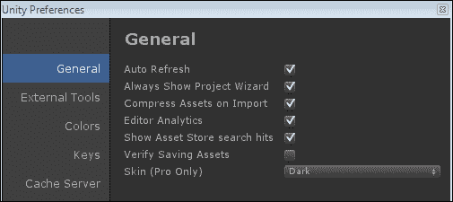
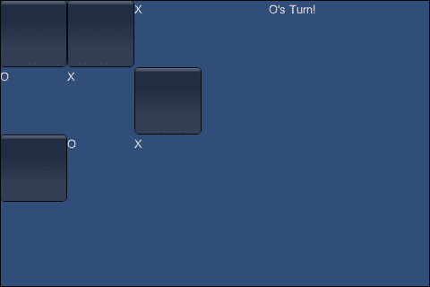
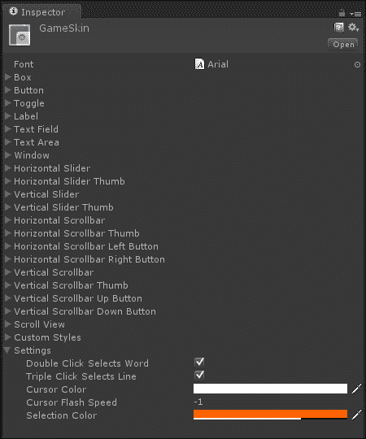
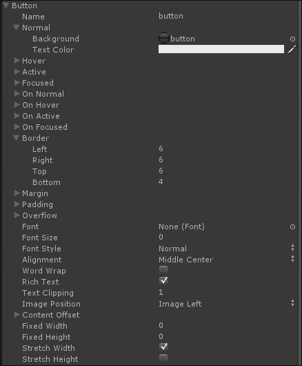
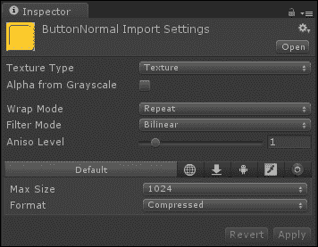
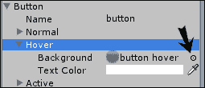
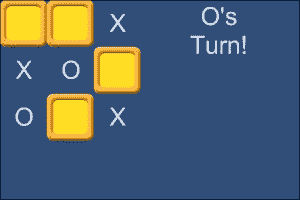
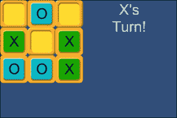
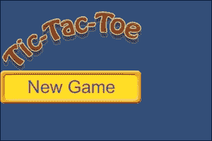
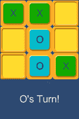

# 第二章. 看起来不错 – 图形界面

*在前一章中，我们介绍了 Unity 和 Android 的功能。我们还讨论了将它们结合使用的优点。在安装了大量软件并设置好我们的设备后，我们创建了一个简单的 Hello World 应用程序来确认一切连接正确。*

*本章全部关于**图形用户界面**（**GUI**）。我们将从创建一个简单的井字棋游戏开始，使用 Unity 提供的 GUI 基本组件。之后，我们将讨论 Unity 的 GUI 样式和 GUI 皮肤。利用我们所学，我们将改善游戏的外观。此外，我们将探索处理不同屏幕尺寸的 Android 设备的技巧和窍门。最后，我们将了解一种更快地将游戏上传到设备的方法，这在上一章中已经介绍过。话虽如此，让我们开始吧。*

在本章中，我们将涵盖以下主题：

+   用户偏好

+   按钮和标签

+   GUI 皮肤和 GUI 样式

+   动态 GUI 定位

+   构建和运行

在本章中，我们将在 Unity 中创建一个新的项目。本节将指导你完成其创建和设置。

# 创建井字棋游戏

本章的项目是一个简单的井字棋风格游戏，类似于我们中任何一个人可能在纸上玩的游戏。与其他任何事物一样，你可以用几种不同的方式制作这个游戏。我们将使用 Unity 的 GUI 系统，以便更好地了解如何为我们的其他游戏创建 GUI。

# 行动时间 – 创建井字棋

基本的井字棋游戏涉及两名玩家和一个 3 x 3 的网格。玩家轮流填写 X 和 O。首先填满一行三个方格的玩家获胜。如果所有方格都填满，但没有玩家填满一行三个，则游戏平局。让我们按照以下步骤创建我们的游戏：

1.  首先要做的事情是为本章创建一个项目。因此，启动 Unity，我们将这样做。

1.  如果你一直跟随着，Unity 应该会启动到最后一个打开的项目。这不是一个坏特性，但它可能会变得非常令人烦恼。想想看：你已经在一项项目中工作了一段时间，它已经变得很大。现在你需要快速打开其他东西，但 Unity 默认打开你的大型项目。如果你在开始工作之前等待它打开，可能会浪费很多时间。要更改此功能，请转到 Unity 窗口的顶部，点击**编辑**然后点击**首选项**。这是我们更改脚本编辑器首选项的地方。不过，这次我们将更改**常规**选项卡中的设置。以下截图显示了**常规**选项卡下的选项：

1.  目前，主要关注的是**始终显示项目向导**选项；然而，我们仍将逐一介绍所有选项。以下是对**常规**选项卡下所有选项的详细解释：

    +   **自动刷新**：这是 Unity 的最好特性之一。当资产在 Unity 外部被更改时，此选项允许 Unity 自动检测更改并刷新项目中的资产。

    +   **始终显示项目向导**：这是安装 Unity 时每次都应检查的绝佳首选选项。Unity 不会打开最后一个项目，而是打开**项目向导**。从那里，你可以打开任何你选择的项目或创建一个新的项目。这是一个始终开启的好选项。

    +   **导入时压缩资产**：这是一个复选框，用于在首次将游戏资产导入 Unity 时自动压缩它们。

    +   **编辑器分析**：这是 Unity 匿名使用统计信息的复选框。保持勾选状态，Unity 编辑器会偶尔向 Unity 源发送信息。保持开启不会影响任何东西，并有助于 Unity 团队使 Unity 编辑器变得更好。但这最终还是取决于个人喜好。

    +   **显示资产商店搜索结果**：此设置仅在计划使用资产商店时相关。资产商店可以为任何游戏提供资产和工具的绝佳来源；然而，由于我们不会使用它，此书的相关性相当有限。它做的是名字所暗示的事情。当你从 Unity 编辑器内部搜索资产商店中的内容时，结果的数量会根据此复选框显示。

    +   **验证保存资产**：这是一个很好的选项，可以不开启。如果开启此选项，每次你在 Unity 中点击**保存**时，都会弹出一个对话框，以便你可以确保保存自上次保存以来更改的任何资产。这不仅仅关乎你的模型和纹理，还涉及到 Unity 的内部文件、材质和预制体。目前最好将其关闭。

    +   **皮肤（仅限专业版）**：此选项仅适用于 Unity 的专业用户。它提供了在 Unity 编辑器的浅色和深色版本之间切换的选项。这完全是外观上的，所以根据你的直觉来选择。

1.  设置好你的偏好后，现在转到**文件**菜单，然后选择**打开项目**。

1.  选择**创建新项目**选项卡，然后点击**浏览...**按钮来选择新项目的位置和名称。

1.  我们将不会使用任何包含的包，因此点击**创建**，我们可以继续进行。

1.  一旦 Unity 完成新项目的初始化，在**项目**面板中创建两个新的脚本，就像我们在上一章的*Hello World*项目中做的那样。将新脚本命名为`TicTacToeControl`和`SquareState`。打开它们并清除默认函数；再次，就像我们在第一章中做的那样，*向 Unity 和 Android 问好*。

1.  `SquareState` 脚本将保存我们游戏板每个方块的可能的州。为此，清空脚本中的所有内容，并用一个简单的枚举来替换。枚举只是潜在值的列表。这个枚举关注的是控制该方块的玩家。是 X 控制它，O 控制它，还是因为它默认情况下是清晰的（游戏板传统上是默认清晰的）。`Clear` 成为第一个，因此是默认状态。

    ```java
    public enum SquareState {
      Clear,
      XControl,
      OControl
    }
    ```

1.  在我们的另一个脚本 `TicTacToeControl` 中，我们开始于两个将很大程度上控制游戏流程的变量。第一个定义了我们的游戏板。传统上游戏是在一个 3x3 的网格上进行的，因此有九个方块。第二行指定了轮到谁。它将如何改变将在稍后变得清楚，但就现在而言，如果轮到 X，值将是 true。如果不是 X 的回合，值将是 false。

    ```java
    public SquareState[] board = new SquareState[9];
    public bool xTurn = true;
    ```

    ### 小贴士

    在 Unity 中，每个脚本默认继承自 `MonoBehaviour` 类。这给我们的脚本带来了两个主要好处。

    首先，它允许我们将脚本作为组件添加到对象中。如果计划将脚本添加到对象中，脚本文件的名称也需要与脚本内部的类名完全相同。

    `MonoBehaviour` 类的第二个好处是它附带的各种变量和函数。变量让我们可以访问组成 Unity 中对象的各个部分。函数提供了一系列自动功能和访问游戏初始化和循环的能力。这正是我们在这个特定时刻最感兴趣的。

1.  为了在每一帧的 GUI 中绘制任何内容，需要利用 `MonoBehaviour` 类提供的 `OnGUI` 函数。这就是我们将绘制游戏板的地方。`OnGUI` 函数让我们在每一帧绘制我们的界面。在它内部，我们首先定义我们板方块的宽度和高度。

    ```java
    public void OnGUI() {
      float width = 75;
      float height = 75;
    ```

1.  接下来是一对 for 循环。因为我们的板是一个 3x3 的网格，我们需要循环来计数三行三列的方块。

    ```java
    for(int y=0;y<3;y++) {
        for(int x=0;x<3;x++) {
    ```

1.  在循环内部，我们首先必须弄清楚我们目前正在绘制哪个方块。如果你不知道哪个方块被触摸，玩游戏会变得很困难。

    ```java
    int boardIndex = (y * 3) + x;
    ```

1.  下一行代码定义了方块是否将以 `Rect` 类的形式绘制。`Rect` 类在 GUI 空间中定义为 x 位置、y 位置、宽度和高度。在 Unity 中，GUI 空间定义为左上角为 (0,0)，右下角为 `Screen.width`、`Screen.height`。屏幕的宽度和高度是像素数。

    ```java
    Rect square = new Rect(x * width, y * height, width, height);
    ```

1.  然后我们确定谁控制着这个方块。以下代码行有点复杂，但它实际上只是一个压缩的`if`语句。基本上，它的工作方式是这样的：首先检查一个条件，如果它是真的，返回第一个值，即问号和冒号之间的值。如果条件是假的，返回冒号后面的值。这里结合了两个这样的压缩`if`语句；如果方块被 X 拥有，将我们的所有者设置为 X。否则，如果它被 O 拥有，将所有者设置为 O。如果两个条件都不成立，则没有人拥有这个方块，我们将所有者设置为空字符串。

    ```java
    string owner = board[boardIndex] == SquareState.XControl ? "X" : board[boardIndex] == SquareState.OControl ? "O" : "";
    ```

1.  现在我们已经完成了确定我们位置的所有艰苦工作，我们实际上绘制我们的游戏棋盘方块。这是通过使用 Unity 提供的一个奇妙的小函数`GUI.Button`来完成的。要使用这个函数的基本形式，我们必须告诉函数按钮应该绘制在哪里以及显示什么文本，因此是 rect 和 string。我们给它我们的方块和所有者变量，它完成所有在屏幕上绘制的实际工作，并返回一个布尔结果，表示按钮是否被按下。因此，我们用`if`语句检查它，如果为真，我们发送到一个新函数，告诉它哪个方块被按下，让它处理设置所有者的操作。另外，别忘了额外的花括号来关闭循环和函数。

    ```java
          if(GUI.Button(square, owner))
            SetControl(boardIndex);
        }
      }
    }
    ```

1.  `SetControl`函数相当简短；它只是为传递给它的任何方块设置所有者。它首先确保给定的索引确实在我们棋盘的范围内。如果不是，我们将提前退出函数。下一行代码根据轮到谁来设置棋盘方块的控件。如果是 X 的回合，将方块设置为`XControl`；否则将控件设置为`OControl`。最后我们改变轮到谁。这是通过简单地设置我们的`xTurn`布尔值为其相反的值来完成的，表示现在是另一人的回合。

    ```java
    public void SetControl(int boardIndex) {
      if(boardIndex < 0 || boardIndex >= board.Length) return;

      board[boardIndex] = xTurn ? SquareState.XControl : SquareState.OControl;
      xTurn = !xTurn;
    }
    ```

1.  我们差不多准备好玩游戏了。我们只需要设置场景。为此，首先将我们的`TicTacToeControl`脚本从 Unity 编辑器的**项目**面板拖动到**场景**面板中的**主摄像机**对象。

1.  现在保存场景，就像我们在第一章中做的那样，*向 Unity 和 Android 问好*，命名为`TicTacToe`。

1.  在这个阶段可以玩游戏。也可以在设备上玩游戏；只需遵循第一章中的相同步骤，*向 Unity 和 Android 问好*，但现在只需在 Unity 编辑器中进行测试。在本章的后面，我们将介绍一种更简单的方法来构建到我们的设备上。

    ### 小贴士

    **下载示例代码**

    你可以从你购买的所有 Packt 书籍的账户中下载示例代码文件。[`www.packtpub.com`](http://www.packtpub.com)。如果你在其他地方购买了这本书，你可以访问[`www.packtpub.com/support`](http://www.packtpub.com/support)并注册，以便将文件直接通过电子邮件发送给你。

## *刚才发生了什么？*

我们创建了玩井字棋所需的基础。我们用两个简短的脚本完成了这个任务。然而，现在你在玩游戏时，可能注意到了一些关于它的细节。首先，它看起来并不特别出色。考虑到这是本章的重点，这非常奇怪，但我们很快就会解决这个问题。其次，没有检查来确定是否有人已经控制了一个方格。

此外，没有检查来确定是否有人赢得了游戏。最后，如果你决定构建到设备，你可能已经注意到了 Unity 的 GUI 函数的一个优点。不需要特殊的编程就可以使任何 GUI 函数与触摸输入而不是鼠标一起工作。当你不必担心特殊输入时，可以节省很多时间，尤其是如果你计划多平台定位。

# 完成游戏

如果你不想经历构建应用程序并将其放在设备上的过程，你仍然可以尝试与按钮进行交互，用手指触摸它们。在第一章“向 Unity 和 Android 问好”中，我们安装了应用程序，Unity Remote。将设备连接到您的计算机并启动它；当你在 Unity 编辑器中点击**播放**时，你应该能在你的设备上看到游戏正在运行。如果你在 Unity 编辑器中看到游戏正在播放，但在设备上没有看到，只需重新启动 Unity。确保保存它；丢失所有辛勤工作将是可怕的。

毫无疑问，当你使用 Unity Remote 时，你首先会注意到游戏看起来并不好。它几乎肯定会被拉伸和像素化。如果你现在并不在意，不用担心，当项目变得更加复杂时，情况会更糟。现在，在你开始恐慌，抱怨为什么你必须安装这样一个无用的程序之前，你必须理解 Unity Remote 的目的。我们之前已经讨论过这个问题，但我们将进一步深入探讨。Unity Remote 用于测试设备输入：触摸屏、倾斜等。它的外观是释放带宽的结果，以便帧率与 Unity 编辑器中的帧率相同。

关于拉伸问题，你可以做并且应该做的是。在 Unity 编辑器的**游戏**窗口的左上角有一个下拉列表。默认情况下，它设置为**自由比例**，这意味着窗口将填充所有可用空间。如果你点击它，会显示一系列的纵横比选项。点击这些选项，你会在**游戏**窗口中看到黑色条带。这是 Unity 正在调整**游戏**窗口并屏蔽未使用的空间。选项会根据构建目标而变化。在**构建设置**窗口中，将你的平台更改为 Android。在**游戏**窗口的下拉菜单中，找到一个与你的设备匹配的纵横比。选择该选项后，使用 Unity Remote 时你的游戏将不再出现拉伸。

# 行动时间 - 完成游戏的创建

让我们通过创建一个开场屏幕来完成我们游戏的创建。然后，添加一些检查以防止玩家多次选择方格。接着检查是否有人获胜，并最终显示游戏结束屏幕。这样，游戏就准备好让我们让它看起来很棒了。

让我们执行以下步骤来完成我们的游戏：

1.  我们将通过首先创建另一个类似于我们的`SquareState`脚本来完成所有这些。创建新的`GameState`脚本并清除默认内容。添加以下代码片段，我们将得到跟踪我们游戏当前状态的所需值：

    ```java
    public enum GameState {
      Opening,
      MultiPlayer,
      GameOver
    }
    ```

1.  现在，我们需要更新我们的`TicTacToeControl`脚本。首先，因为我们想能够玩多个游戏，所以将`NewGame`函数添加到脚本中。这个函数初始化我们的控制变量，以便我们可以从一张干净的棋盘开始新游戏。如果玩家开始新游戏时棋盘已经填满，这对玩家来说效果不会很好。这个函数将由我们即将编写的菜单主界面使用。

    ```java
    public void NewGame() {
      xTurn = true;
      board = new SquareState[9];
    }
    ```

1.  但首先，我们需要更新我们的`OnGUI`函数。为此，首先将`OnGUI`中的所有当前内容移动到一个名为`DrawGameBoard`的新函数中。

1.  现在，我们需要将我们的已清除的`OnGUI`函数更改为以下代码片段，以便它能够根据当前游戏状态检查并绘制适当的屏幕。`switch`语句与一系列的`if`和`else if`语句的工作方式相同。在我们的情况下，我们检查游戏状态，并根据它是调用不同的函数。例如，如果游戏状态等于`GameState.MultiPlayer`，我们将调用`DrawGameBoard`函数，该函数现在应包含之前在`OnGUI`函数中的内容。

    ```java
    public void OnGUI() {
      switch(gameState) {
        case GameState.Opening:
          DrawOpening();
          break;
        case GameState.MultiPlayer:
          DrawGameBoard();
          break;
        case GameState.GameOver:
          DrawGameOver();
          break;
      }
    }
    ```

1.  到目前为止，你可能想知道那个游戏状态变量是从哪里来的。如果你猜它是 Unity 自动提供的，那你就错了。我们必须跟踪我们自己的游戏状态。这就是为什么我们之前创建了`GameState`脚本。将以下代码行添加到我们的`TicTacToeControl`类顶部，就在我们定义游戏板的地方上方：

    ```java
    public GameState gameState = GameState.Opening;
    ```

1.  接下来，我们需要创建另外两个游戏状态屏幕。让我们从开场屏幕开始。当我们绘制开场屏幕时，我们首先定义用于标题的`Rect`类。然后，我们快速调用`GUI.Label`。通过传递一个`Rect`类来定位文本，以及一些文本，文本就被简单地绘制在屏幕上。这个函数是绘制屏幕上文本段落的最佳方式。

    ```java
    public void DrawOpening() {
      Rect titleRect = new Rect(0, 0, 300, 75);
      GUI.Label(titleRect, "Tic-Tac-Toe");
    ```

1.  以下代码行定义了用于我们的`New Game`按钮的`Rect`类。我们想确保它位于标题下方，所以它从标题的 x 位置开始。然后，我们将标题的 y 位置与其高度相加，以找到位于其下方的位置。接下来，我们使用标题的宽度，以便我们的按钮覆盖其下的整个位置。最后，高度设置为`75`，因为这是一个适合手指的好尺寸，我们不想让它根据标题改变。我们同样可以使用标题的所有值，或者只输入数字，但我们的标题将在我们开始设计样式时改变。

    ```java
      Rect multiRect = new Rect(titleRect.x, titleRect.y + titleRect.height, titleRect.width, 75);
    ```

1.  最后，我们调用一个将绘制我们的按钮的函数。你可能还记得我们绘制游戏板时使用的`GUI.Button`函数。如果按钮被按下，游戏状态将被设置为`MultiPlayer`，这将开始我们的游戏。同时也会调用`NewGame`函数，这将重置我们的游戏板。当然，还有一个额外的花括号来结束函数。

    ```java
      if(GUI.Button(multiRect, "New Game")) {
        NewGame();
        gameState = GameState.MultiPlayer;
      }
    }
    ```

1.  我们还剩下最后一个屏幕需要绘制，那就是游戏结束屏幕。为了实现这个功能，我们将创建一个由我们的`OnGUI`函数引用的函数。然而，为了让一个游戏结束，必须有胜者，所以在我们游戏状态变量下面添加以下代码行。我们正在扩展使用`SquareState`枚举。如果胜者变量等于`Clear`，则没有人赢得游戏。如果它等于`XControl`或`OControl`，则相关玩家获胜。不用担心，当我们创建下一个游戏结束屏幕和稍后赢家检查系统时，这会更有意义。

    ```java
    public SquareState winner = SquareState.Clear;
    ```

1.  在`DrawGameOver`函数中没有什么特别新的内容。首先，我们将定义我们将要写谁赢了游戏的位置。然后，我们将使用我们的胜者变量来确定谁赢了。在绘制胜者标题后，我们使用的`Rect`类将根据其高度向下移动，以便可以重复使用。最后，我们将绘制一个按钮，将我们的游戏状态改回`Opening`，这当然是我们的主菜单。

    ```java
    public void DrawGameOver() {
      Rect winnerRect = new Rect(0, 0, 300, 75);
      string winnerTitle = winner == SquareState.XControl ? "X Wins!" : winner == SquareState.OControl ? "O Wins!" : "It's A Tie!";
      GUI.Label(winnerRect, winnerTitle);

      winnerRect.y += winnerRect.height;
      if(GUI.Button(winnerRect, "Main Menu"))
        gameState = GameState.Opening;
    }
    ```

1.  为了确保我们不覆盖别人已经控制的方块，我们需要对我们的`DrawGameBoard`函数做一些修改。首先，如果玩家可以轻松地知道谁的回合，那将很有帮助。为此，我们将在函数的末尾添加以下代码片段。这应该开始变得熟悉。我们首先定义我们想要绘制的位置。然后，我们将使用我们的`xTurn`布尔值来确定要写关于谁的回合。最后，我们使用`GUI.Label`函数在屏幕上绘制它。

    ```java
    Rect turnRect = new Rect(300, 0, 100, 100);
    string turnTitle = xTurn ? "X's Turn!" : "O's Turn!";
    GUI.Label(turnRect, turnTitle);
    ```

1.  我们现在需要更改绘制棋盘方格的部分，即`GUI.Button`函数。我们需要只在方格为空时绘制该按钮。下面的代码片段将通过将按钮移动到新的`if`语句中来完成这一任务。它检查棋盘方格是否为空。如果是，我们绘制按钮。否则，我们使用标签将所有者信息写入按钮的位置。

    ```java
    if(board[boardIndex] == SquareState.Clear) {
      if(GUI.Button(square, owner))
        SetControl(boardIndex);
    }
    else GUI.Label(square, owner);
    ```

1.  我们最后需要做的是创建一个检查胜者的系统。我们将在`MonoBehaviour`类提供的另一个函数中完成这项工作。`LateUpdate`在每个帧的末尾被调用，就在屏幕上绘制事物之前。你可能自己会想，为什么我们不创建一个在`OnGUI`末尾被调用的函数，因为`OnGUI`已经每帧被调用？原因是当绘制一些 GUI 元素时，`OnGUI`函数会变得有些奇怪。它有时会被调用多次，以便绘制所有内容。所以，大部分功能不应该由`OnGUI`控制。这就是`Update`和`LateUpdate`的作用。`Update`是正常的游戏循环，大多数游戏功能都是从这里调用的。`LateUpdate`用于需要在对象更新之后发生的事情，比如我们的游戏结束检查。

1.  将以下`LateUpdate`函数添加到我们的`TicTacToeControl`类中。我们将从一个检查开始，确保我们甚至应该检查胜者。如果游戏不在我们正在玩的状态，在这个例子中是`MultiPlayer`，在这里退出并不再继续。

    ```java
    public void LateUpdate() {
      if(gameState != GameState.MultiPlayer) return;
    ```

1.  接着是一个简短的`for`循环。在这个游戏中，胜利意味着连续三个匹配的方格。我们首先检查由循环标记的列。如果第一个方格不是`Clear`，则将其与下面的方格进行比较；如果它们匹配，则将其与下面的方格进行比较。我们的棋盘存储为一个列表，但以网格的形式绘制，因此我们需要加三才能向下移动一个方格。`else if`语句随后检查每一行。通过将循环值乘以三，我们将跳过每一循环的一行。我们再次将方格与`SquareState.Clear`进行比较，然后与它右侧的方格比较，最后与两个方格右侧的方格比较。如果任一条件组成立，我们将该组中的第一个方格发送到另一个函数以更改我们的游戏状态。

    ```java
      for(int i=0;i<3;i++) {
        if(board[i] != SquareState.Clear && board[i] == board[i + 3] && board[i] == board[i + 6]) {
          SetWinner(board[i]);
          return;
        }
        else if(board[i * 3] != SquareState.Clear && board[i * 3] == board[(i * 3) + 1] && board[i * 3] == board[(i * 3) + 2]) {
          SetWinner(board[i * 3]);
          return;
        }
      }
    ```

1.  下面的代码片段与之前我们编写的`if`语句大致相同。然而，这些代码行检查的是对角线。如果条件成立，再次调用其他函数以更改游戏状态。你可能也注意到了函数调用后的返回值。如果在任何时刻找到了胜者，就没有必要再检查棋盘上的其他位置。因此，我们将提前退出`LateUpdate`函数。

    ```java
      if(board[0] != SquareState.Clear && board[0] == board[4] && board[0] == board[8]) {
        SetWinner(board[0]);
        return;
      }
      else if(board[2] != SquareState.Clear && board[2] == board[4] && board[2] == board[6]) {
        SetWinner(board[2]);
        return;
      }
    ```

1.  这是我们的`LateUpdate`函数的最后一点。如果没有玩家获胜，如该函数的前一部分所确定的，我们必须检查是否有平局。这是通过检查游戏板上的所有方格来完成的。如果任何一个方格是`Clear`，则游戏尚未结束，我们退出函数。但是，如果我们整个循环中没有找到`Clear`方格，我们就设置赢家并宣布平局。

    ```java
      for(int i=0;i<board.Length;i++) {
        if(board[i] == SquareState.Clear)
          return;
      }
      SetWinner(SquareState.Clear);
    }
    ```

    ### 小贴士

    请务必记得关闭最后一个花括号。这是关闭`LateUpdate`函数所必需的。如果你忘记了，一些令人烦恼的错误将会出现。

1.  最后，我们将创建一个`SetWinner`函数，这个函数将在我们的`LateUpdate`函数中被反复调用。简短而直接，我们将传递给这个函数，它将决定赢家。它设置我们的赢家变量并将游戏状态改为`GameOver`。

    ```java
    public void SetWinner(SquareState toWin) {
      winner = toWin;
      gameState = GameState.GameOver;
    }
    ```

    

## *刚才发生了什么？*

就这些了。恭喜！我们现在有一个完全功能正常的井字棋游戏，并且你成功完成了这个过程。在接下来的章节中，我们终于可以把它做得更漂亮了。这是一件好事，因为，如截图所示，游戏现在看起来并不好看。

# GUI 皮肤和 GUI 风格

GUI 风格是我们改变 Unity 中 GUI 元素、按钮和标签的外观和感觉的方式。GUI 皮肤包含多个 GUI 风格，并允许我们改变整个 GUI 的外观，而无需为每个元素显式定义 GUI 风格。要创建一个 GUI 皮肤，在 Unity 编辑器的**项目**窗口中右键单击，就像创建一个新的脚本一样。转到**创建**，但不是选择**脚本**，而是到底部选择**GUI 皮肤**。选择此选项将创建新的 GUI 皮肤，并允许我们将其命名为`GameSkin`。通过在**检查器**窗口中查看我们的`GameSkin`，你可以看到我们可以使用什么。



+   在顶部是一个**字体**属性。通过将字体文件导入到你的项目中并放置在这里，你可以改变整个游戏中文本使用的默认字体。

+   在下面是一个长的 GUI 元素列表，包括我们的好朋友**按钮**和**标签**。这些都是 GUI 风格，与我们在屏幕上绘制东西所使用的 GUI 函数相对应。例如，除非有其他指定，当我们使用`Button`函数时，它将使用**按钮**GUI 风格来绘制。

+   在 GUI 元素列表之后是一个**自定义风格**属性。这就是我们可以放置任何我们想要使用的额外风格的地方。在我们的十二个按钮中，也许我们想要一个按钮显示红色文字。这种 GUI 风格就会放在这里。

+   在底部是一个**设置**属性。通过展开它，我们可以看到它相当简短。它包括是否可以使用多击进行选择、光标的颜色以及它在文本字段中闪烁的速度，以及所选单词的高亮颜色。这里的默认值已经很好了。除非有非常具体的外观或需求，否则可以忽略这些值。

现在，让我们来看看成为 GUI 样式所需具备的条件。从我们的`GameSkin`示例中扩展**按钮**GUI 样式。无论 GUI 样式用于什么，它们都是由相同的元素组成的。它看起来像有很多属性组成 GUI 样式，但其中大多数几乎是相同的，这使得它变得简单得多。



+   第一个属性相当直接，但也许是最重要的。**名称**是 Unity 用来查找 GUI 样式并将其应用于 GUI 元素的方式。它让我们知道样式应该是什么；然而，如果名称和代码之间存在拼写错误，你将永远看不到你的样式在游戏中。

+   接下来的几组值描述了 GUI 元素在特定状态下应该看起来如何。这是你将放置大部分样式的位置。任何元素的初级状态主要是**正常**、**悬停**、**激活**和**聚焦**。次要状态是**正常时**、**悬停时**、**激活时**和**聚焦时**。这些次要状态仅在 GUI 元素转移到相应的初级状态时发生。并非每个 GUI 元素都使用每个状态，并且你可以控制元素可以进入哪些状态，但我们将稍后讨论这一点。让我们详细看看这些状态是如何工作的：

    +   **正常状态**：这是任何 GUI 元素的默认状态。它始终被使用，并且当元素没有被交互时发生。

    +   **悬停状态**：这个状态主要用于按钮和其他可点击元素。当你的鼠标位于 GUI 元素上方时，如果可能，它将进入这个状态。然而，由于本书的重点是触摸屏，我们没有鼠标真正需要关心。因此，我们不会使用这个状态。

    +   **激活状态**：这可能是第二重要的状态。当元素被激活时，它会进入这个状态。例如，当按下按钮时，它就是激活状态。通过点击或触摸按钮，它进入**激活**状态。所有可以交互的 GUI 元素都使用这个状态。

    +   **聚焦状态**：这是一个很少使用的状态。在 Unity 的 GUI 中，聚焦意味着拥有键盘控制。默认使用它的唯一元素是**文本字段**。

+   如果你展开任何状态，你会看到它有两个属性，**背景** 和 **文字颜色**。**背景** 属性是一个纹理。它可以是你游戏中任何纹理。**文字颜色** 属性是 GUI 元素中出现的任何文字的颜色。除了 **正常** 状态外，如果一个状态没有背景纹理，则不会使用它。这既有好的一面也有不好的一面。如果我们不希望我们的按钮显示它们已被悬停，只需从悬停状态的 **背景** 属性中移除纹理即可。当我们想要一个没有自己背景图像的 GUI 元素，但同时又想在不同状态下改变文字颜色时，这会变得很烦人。我们如何使用活动状态，但不使用背景纹理呢？答案是，我们创建一个空白图像，但这并不像保存一个 100%透明的 PNG 文件并使用它那样简单。GUI 样式太智能了。它会检测到图像是完全空白的，这使得它与没有图像没有区别。因此，该状态仍然没有被使用。为了解决这个问题，创建一个小的空白 PNG 图像，但取一个像素并使其 90%透明白色。这看起来可能像是一种黑客解决方案，但不幸的是，这是唯一的方法。在如此低的透明度下，我们无法检测到像素；尽管它实际上并不透明。然而，Unity 会看到有一个稍微白色的像素必须被绘制，并这样做。

+   现在，你可能会想，这很愚蠢。我只是要创建所有按钮的图像，而不必担心文字。这确实很愚蠢，但对此的回应是，如果你需要稍微改变按钮的文字怎么办？或者按钮上的文字可能是基于玩家名字的动态文本。在参与的几乎所有项目中，都有创建这种不完全空白图像的需求。

+   在 GUI 元素的各个状态下面是 **边界**, **边距**, **填充**, 和 **溢出**。这些属性控制元素如何与它的背景图像和包含的文本交互。在每个属性中，你将找到 **左**, **右**, **上**, 和 **下** 的值。由于每个元素都被绘制为一个矩形，这些对应于该矩形的每一侧。它们是以像素为单位的，就像我们的 GUI 空间一样。让我们详细看看所有这些属性，如下所示：

    +   **边界**: 这允许我们定义每个边应该有多少像素不应被拉伸。在定义 GUI 元素时，背景通常均匀地拉伸到占据的空间。如果你要创建一个带有红色边缘和圆角蓝色的框，这些值将保持你的边缘和角落规则，同时仍然拉伸内部的蓝色。

    +   **边距**: 这仅由 Unity 的自动 GUI 布局系统 GUILayout 使用。它表示元素外部应该有多少额外的空间。

    +   **填充**是元素边框和包含的文本之间的空间。如果你想将按钮的文本左对齐但稍微向右偏移，你应该使用**填充**。

    +   **溢出**定义了背景图像的额外空间。在创建我们的按钮时，我们定义了一个`Rect`类来表示按钮占据的空间。如果我们使用`Overflow`，按钮本身将是`Rect`类所在的位置，但背景将根据值延伸到每个边缘。这对于周围有阴影或发光效果的按钮很有用。

+   接下来的几个值与元素中的文本有关。**字体**属性是专门由这种样式使用的字体。如果这个值留空，则使用 GUI 皮肤中的字体。**字体大小**决定了文本字母的大小。这就像你的最喜欢的文字处理器一样工作，除了零值表示使用字体对象中定义的默认字体大小。**字体样式**也像你的文字处理器一样工作。它让你可以选择**正常**、**加粗**和**斜体**文本。这只有在你的选择字体支持的情况下才有区别。

+   **对齐**定义了在 GUI 元素中放置文本的位置。想象一下将你的元素分成一个 3x3 的网格。**对齐**与网格的位置相同。

+   **自动换行**定义了文本是否应该分成多行，如果它太长。它再次遵循与你的文字处理器相同的原理。如果选中，并且文本行会超出 GUI 元素的边缘，文本将分成必要的行数以保持在其范围内。

+   **富文本**是 GUI 样式的相对较新且有趣的功能。它允许我们使用 HTML 样式标记来控制文本。你可以在标签的文本中围绕一个单词放置`<b>`和`</b>`标签，而不是编写这些标签，Unity 将使标签之间的单词加粗。我们可以使用加粗、斜体、大小和颜色标签。这允许我们选择性地使文本的某些部分加粗或斜体。我们可以使某些单词更大或更小。此外，可以使用十六进制值更改文本任何部分的颜色。

+   **文本裁剪**在最近更新中变得有些奇怪。它曾经是一个很好的值下拉列表，但现在它是一个整数字段。无论如何，它仍然履行其功能。如果文本超出 GUI 元素的边缘，这个属性决定了要做什么。零值表示不裁剪文本，让它超出边缘。任何非零值都会导致文本被裁剪。任何超出边界的文本将简单地不会被绘制。

+   **图像位置**与 GUIContent 一起使用。GUIContent 是一种将文本、图标图像和工具提示传递给 GUI 元素的方式。**图像位置**描述了图像和文本的交互方式。图像可以位于文本的左侧或上方。或者，我们可以选择只使用图像或文本。由于在触摸环境中工具提示并不真正有用，所以 GUIContent 对我们来说用途有限。因此，我们将不会广泛使用它，如果使用的话。

+   **内容偏移**通过提供的值调整 GUI 元素内部包含的任何内容。如果你的所有文本通常在按钮中居中，这将允许你将其稍微向右和向上移动。这是一个美学问题，当你需要一个非常具体的视觉效果时。

+   **固定宽度**和**固定高度**提供大约相同的功能。如果为这些属性提供了除零以外的任何值，它们将覆盖用于 GUI 元素的`Rect`类中对应的值。因此，如果你想让按钮始终宽一百像素，无论它们在游戏中的位置如何，你可以将**固定宽度**设置为 100，它们就会这样做。

+   **拉伸宽度**和**拉伸高度**也起到类似的作用。它们被 GUILayout 用于 GUI 元素的自动放置。它基本上给系统授权，使其元素可以更宽/更瘦和更高/更短，以满足其更好的布局条件。GUILayout 排列元素的方式并不总是最好的。如果你需要快速完成某事，它很好。但如果你想要更深入的控制，就会变得复杂。

# 更美观的井字棋

最后，我们可以将关于 GUI 皮肤和 GUI 样式的知识应用到实际中，使我们的游戏看起来更好。或者，至少让游戏看起来没有使用默认资源。无论你的艺术才能如何，你都需要找到或创建一些图像，以便继续学习。

# 是时候为游戏添加样式了

如果你不想找得太远，本章使用的资源可以在与书籍资源一起找到。所有需要的图像都可用，并且它们将工作得很好，直到你有机会创建一些自己的。

1.  首先，我们需要五个小纹理：`ButtonActive`、`ButtonNormal`、`ONormal`、`XNormal`和`Title`。为了创建这些，你将不得不使用一个单独的图片编辑程序或使用包含在项目中的那些。

1.  将图像放入你的 Unity 项目中最简单的方法是将它们保存到创建新项目时创建的`Assets`文件夹中。或者，你可以点击顶部并选择**资产**，然后选择**导入新资产**。这将打开一个文件浏览器，让你导航到想要导入的资源。当你找到你想要导入的资源并点击**导入**按钮时，该资源的副本将被放入你的项目中。Unity 不会移动或删除当前项目之外的文件。

    +   现在关于纹理的导入设置有一个说明。默认情况下，Unity 假设导入到项目中的任何图像文件都将用作游戏模型纹理。因此，Unity 会压缩它们，并将它们调整为适合 2 的幂。

        ### 小贴士

        如果你不知道，在计算机图形学中，渲染可以均匀分成一半的图像要快得多，直到单个单位。有更深层的原因，但简单来说，这是因为构成计算机的实际上是二进制开关。

        

    +   让我们的图像被识别为 GUI 的图像非常简单。在**纹理类型**的右侧，点击**纹理**并从下拉菜单中选择**GUI**。

    +   你会注意到我们得到了一个新的**过滤器模式**下拉菜单。这基本上是 Unity 在调整图像大小以适应各种 GUI 元素时将投入多少努力。**三线性**是最好的，**点**是最快的，**双线性**位于中间。

    +   一旦更改了导入设置，请务必点击**应用**，否则当你尝试做其他任何事情时，Unity 都会抱怨。如果你不想提交更改，点击**还原**将丢弃刚刚所做的任何更改，并将**导入设置**窗口恢复到最后一次使用的配置。

1.  因此，将所有图像的**纹理类型**设置为 GUI，我们就可以继续了。

1.  让我们从游戏开始的地方开始。打开你的`TicTacToeControl`脚本，并在开头添加以下代码行。这些代码允许我们在 Unity 编辑器内部附加对其他资源的引用。第一个将保存我们的`GameSkin`，这样我们就可以为所有的 GUI 元素设置样式。第二个，正如你在下面的代码行中可以看到的，将保存我们的精美标题图像：

    ```java
    public GUISkin guiSkin;
    public Texture2D titleImage;
    ```

1.  现在转到 Unity 编辑器，并从**层次结构**窗口中选择**主摄像机**。

    +   你在**层次结构**窗口中看到的每一个列表对象都是一个`GameObject`。通过附加到它上的各种组件，`GameObject`被赋予了目的和意义，例如我们的`TicTacToeControl`脚本。

    +   一个空的`GameObject`只是一个由`Transform`组件定义的空间点，该组件是任何`GameObject`上的第一个组件。

    +   您可以在**检查器**窗口中看到，**主摄像机**对象有一个**摄像机**组件。它为`GameObject`赋予目的，并控制**摄像机**组件的功能，就像我们底部的`TicTacToeControl`组件让我们控制我们的井字棋游戏一样。

    +   **检查器**窗口还让我们能够看到在 Unity 编辑器中可以更改的所有公共变量。如果它们被更改，这些值将在游戏播放时保存并使用。因此，通过在我们的脚本中创建一个变量，我们可以将`GameSkin`的引用添加到其中，它将在游戏中使用。要添加引用，只需将对象拖放到**检查器**窗口中所需的变量上即可。

1.  将`GameSkin`拖到**GUI 皮肤**槽位，并将我们的标题图像拖到**标题图像**槽位。

    ### 小贴士

    一定要保存。定期保存是您和过早脱发之间唯一的障碍，下次您的电脑决定死亡时。

1.  在我们的`TicTacToeControl`脚本中，在`OnGUI`函数的开始处添加以下代码行。它首先检查是否有可用的 GUI 皮肤。如果有，它将设置到`GUI.skin`变量中。这个变量控制游戏中使用的 GUI 皮肤。一旦设置，之后绘制的任何 GUI 元素都将使用新的 GUI 皮肤。这可以允许您设置一个 GUI 皮肤并绘制一半的 GUI，然后设置不同的 GUI 皮肤并在完全不同的风格中绘制另一半。

    ```java
    if(guiSkin != null) GUI.skin = guiSkin;
    ```

1.  如果您现在玩游戏，它看起来不会太多。新的 GUI 皮肤默认值与 Unity 使用的默认 GUI 皮肤完全相同。让我们通过选择我们的`GameSkin`并在**检查器**窗口中展开**按钮**和**标签**来改变它。

1.  对于**按钮**，我们创建了**按钮正常**和**按钮活动**图像。通过将它们拖到相应状态的**背景**属性中，按钮的外观将发生变化。

1.  供应的按钮图像有黄色背景，这将使白色文字难以阅读。因此，通过点击**文本颜色**属性旁边的颜色，将打开**颜色选择器**窗口，我们可以选择新的颜色。对于**正常**状态，海军蓝效果很好；对于**活动**状态，淡蓝色效果很好。

1.  此外，为了防止在 Unity 编辑器中看起来奇怪，请移除**悬停**状态。在触摸界面上，没有光标可以悬停在按钮上；因此，不需要悬停状态。要移除它，首先点击**背景**图像右侧的小圆圈。

1.  弹出的新窗口允许我们选择项目中当前任何图像。然而，由于我们希望那里没有任何内容，请选择列表中的第一个选项**无**。

1.  按钮图像的边框比默认按钮的边框大得多。因此，我们需要调整**边框**属性来适应它们。每边 15 的值效果很好。

1.  文本也太小，因此对于**字体大小**属性，选择一个值为 40 的值。这将给我们一个字体大且易于阅读的文本。

1.  对于**标签**元素，我们只会进行两项更改。首先，文本太小。因此，它的字体大小也将设置为 40。其次，我们希望文本在 GUI 元素中居中。这需要将对齐设置为中间中心。

1.  现在就玩游戏吧。它看起来已经更好或者至少不同了。然而，一眼看去很难判断谁控制着哪个方块。为了解决这个问题，我们将创建两种自定义 GUI 样式。要做到这一点，请在我们**检查器**窗口中展开`GameSkin`的**自定义样式**属性。默认情况下，已经有一个空白样式在那里。我们需要两个，但暂时不要改变数量。

1.  通过默认名为`Element 0`的扩展自定义 GUI 样式。

1.  在**名称**属性右侧点击，大约在**检查器**窗口的中间位置，将允许我们重命名样式。名称非常重要。无论我们在这里叫什么，都需要在代码中完全相同地调用它，否则它将不会被使用。给它命名为`XSquare`，因为它将被用来标记由 X 玩家控制的方块。

1.  在**正常**状态下，将**XNormal**图像添加到**背景**属性。**文本颜色**属性可以保持为黑色。我们还需要调整字体大小和对齐属性，使其与**标签**元素相同。因此，将它们设置为**40**和**MiddleCenter**。

1.  现在我们已经创建了第一个样式，创建第二个样式就变得快速且简单。折叠**XSquare**样式。

1.  将**自定义样式**属性的大小设置为**2**。在 Unity 编辑器中增加数组大小时，Unity 会将数组中最后一个项目复制到每个新的槽位。因此，我们现在应该有两个`XSquare` GUI 样式。

1.  扩展第二个 GUI 样式，并将其名称更改为`Osquare`。

1.  还要将`XNormal`的**背景**图像替换为`ONormal`图像。

    ### 小贴士

    如果你发现在**检查器**窗口中拖放有困难，可能是`GameSkin`一直在失去焦点；在**检查器**窗口的顶部有一个锁定按钮。点击它将阻止窗口在选中新对象时切换到其他任何内容。再次点击它将关闭此功能。

1.  虽然我们有了我们炫酷的新自定义 GUI 样式，但这并不意味着它们会自动工作。但是，只需一点点的编码就能让它们工作。在我们的`TicTacToeControl`脚本的`DrawGameBoard`函数内部，我们需要更改绘制标签的行，并在其末尾添加一些内容。添加第二个字符串将告诉 GUI 系统查找特定的 GUI 样式。在函数中更早的地方，我们确定谁拥有这个方块，是 X 还是 O。通过添加到`Square`中，我们创建了我们的两个自定义 GUI 样式的名称，`XSquare`和`OSquare`。

    ```java
    else GUI.Label(square, owner, owner + "Square");
    ```

1.  如果你现在玩游戏，你会看到当玩家声称控制一个方块时，我们的自定义样式就会出现。

1.  要改变井字棋游戏的外观，还有一件事要做。你还记得创建的标题图像以及我们为其添加的变量吗？现在就是放置它的时刻。在`TicTacToeControl`中进入`DrawOpening`函数。为了绘制我们的图像，我们需要用`GUI.DrawTexture`的调用替换`GUI.Label`的调用。这个函数不是使用 GUI 样式，而是简单地将在屏幕上绘制一个图像。它使用`Rect`类，就像我们所有的**按钮**和**标签**一样，来定义大小和位置。默认情况下，图像会被拉伸以填充整个`Rect`类。目前，这非常适合我们。

    ```java
    GUI.DrawTexture(titleRect, titleImage);
    ```

1.  我们可以通过更新定义标题`Rect`类的上一行代码来修复拉伸。正如以下代码片段所示，我们使用`titleImage`的宽度和高度来确定`titleRect`的宽度和高度。现在`Rect`类会根据标题图像的大小自动确定它应该有多大。如果`Rect`类与图像具有相同的大小和形状，它就不会被拉伸。此外，由于我们为**新游戏**按钮定义了`Rect`类，它仍然直接位于标题图像下方，并且与标题图像一样宽。

    ```java
    Rect titleRect = new Rect(0, 0, titleImage.width, titleImage.height);
    ```

1.  这就是为井字棋游戏设置样式的全部内容。点击**播放**按钮，看看你所有的辛勤工作。

## *发生了什么？*

我们让我们的井字棋游戏看起来很棒，至少不像默认的。我们通过使用一些图像和一些自定义 GUI 皮肤和 GUI 样式实现了这一点。通过添加一个用于在屏幕上绘制纹理的特殊函数，我们还添加了一个独特的标题图像到我们的开场屏幕。

## 尝试一下英雄 - 背景

你的挑战是在游戏后面绘制一个背景图像，并且它必须覆盖整个屏幕。默认的蓝色很好，但我们可以做得更好。作为备注，无论哪个 GUI 元素是最后绘制的，它都会在最上面，所以仔细考虑在哪里调用函数以在背景中绘制图像。此外，由于拉伸只适用于锻炼和橡皮筋，请查看是否也传递一个`ScaleMode`函数，这是一个 Unity 使用的特殊值类型，用于确定图像应该如何拉伸。查看脚本参考或在网上搜索以获取更多信息。

# 动态定位

你可能认为游戏现在样式齐全，但所有内容仍然都位于屏幕的左上角。那么，你很幸运。这正是本节的主题。仅仅调整我们`Rects`中的数字，直到我们的 GUI 居中是不够的。在处理 Android 平台和其他移动设备时，我们必须准备好应对各种可能性。不是我们游戏将在其上运行的所有设备都具有相同的屏幕尺寸。因此，你可能将 GUI 定位在平板电脑上居中，但在手机上它将远离屏幕。

# 行动时间 - 动态 GUI

我们将介绍两种动态调整 GUI 以适应任何屏幕要求的方法。开场屏幕和游戏结束屏幕都将居中。我们将拉伸游戏板以填充可用空间。回合指示文本也将根据屏幕方向自动更改位置。

1.  再次，让我们从主菜单开始。打开`TicTacToeControl`脚本并转到`DrawOpening`函数。

1.  为了使菜单居中，我们将在`DrawOpening`函数的开始处添加以下代码行，将内容包装为 GUI 组。将 GUI 的分组想象成某些电视可以做的**画中画**（**PIP**）。在屏幕上选择一个矩形区域，并在其中绘制另一个频道。所以，首先我们决定在哪里绘制我们的组。我们通过找到屏幕的中心，将`Screen.width`和`Screen.height`除以二来实现这一点。但是，由于 GUI 内容定位在左上角，我们必须减去我们内容大小的一半以找到那个角落。对于宽度，那只是我们的标题图像的宽度。但高度是图像和下面的按钮的组合。

    ```java
    Rect groupRect = new Rect((Screen.width / 2) - (titleImage.width / 2), (Screen.height / 2) - ((titleImage.height + 75) / 2), titleImage.width, titleImage.height + 75);
    ```

1.  GUI 的`BeginGroup`函数为我们提供了画中画效果。在调用此函数之后绘制的任何 GUI 元素都将限制在传递给函数的`Rect`类中。与从屏幕左上角开始的位置不同，组内的元素将从组的左上角`Rect`开始。任何超出组边缘的内容也不会绘制，就像它超出了屏幕边缘一样。

    ```java
    GUI.BeginGroup(groupRect);
    ```

1.  在我们能够看到组的作用之前，我们必须在 `DrawOpening` 函数的末尾添加一行。`EndGroup` 是 `BeginGroup` 的直接对应物。如果你使用了 `BeginGroup`，那么必须有相应的 `EndGroup` 调用。如果你没有配对函数调用，Unity 会一直抱怨，直到问题得到解决。这真的很烦人。

    ```java
    GUI.EndGroup();
    ```

1.  添加了这一行后，开始玩游戏。主菜单现在将自动居中。无论屏幕大小如何，它都会这样做。此外，无论屏幕是横屏还是竖屏模式，它都会这样做。在这种情况下，保持所有内容都在屏幕上的技巧是计划最小的屏幕尺寸，并制作相应大小的图像和 GUI 元素。

1.  快进一点，我们可以使用类似的方法来居中游戏屏幕。在 `DrawGameOver` 函数的开头添加以下代码行。你可以看到我们正在做刚才做过的事情。确定屏幕的中心，并减去内容总大小的一半。在这种情况下，我们提供了具体的数字而不是根据图像的大小来设置。此外，因为数学很简单，我们已经在计算中完成了除法，得出了 `150` 和 `75`。

    ```java
    Rect groupRect = new Rect((Screen.width / 2) - 150, (Screen.height / 2) - 75, 300, 150);
    GUI.BeginGroup(groupRect);
    ```

1.  一定要在 `DrawGameOver` 函数的末尾添加你的 `EndGroup` 函数调用。

    ```java
    GUI.EndGroup();
    ```

1.  之后，找到定义 `winnerRect` 变量类的行。我们需要修改它，使其更容易调整大小并适应内容，如果我们想要的话。由于我们设置了 **winner** 标签和 **主菜单** 按钮，这会导致每个都占用整个组的宽度。它们还会平均分割可用的高度；因此，除以二。

    ```java
    Rect winnerRect = new Rect(0, 0, groupRect.width, groupRect.height / 2);
    ```

1.  现在我们来到了一个棘手的部分。对于游戏板，我们希望它均匀扩展，以便填充最短的方向。回合指示器应该位于剩余空间的中心。因为游戏板需要动态扩展，而回合指示器需要根据方向在屏幕的右侧或底部，所以我们不能仅仅使用我们的 GUI 组函数。相反，我们首先需要确定屏幕的哪一侧更小，是宽度还是高度。这通过在 `DrawGameBoard` 函数开头添加以下几行代码来实现。你能认出这个条件语句，我们那位老朋友吗？首先，我们创建一个变量来保存屏幕宽度和高度的比较结果；我们稍后会再次使用它。如果宽度更小，显然短边是宽度；否则就是高度。

    ```java
    bool widthSmaller = Screen.width < Screen.height;
    float smallSide = widthSmaller ? Screen.width : Screen.height;
    ```

1.  接下来，我们更改宽度和高度的定义。因为游戏板是一个 3 x 3 的网格，一旦我们有了短边，就可以简单地计算出应该有多大才能填满空间。对高度的改变是为了保持游戏板的方块实际上是正方形。也许你还记得你的第一次几何课程？正方形的边长是相等的。

    ```java
    float width = smallSide / 3;
    float height = width;
    ```

1.  在这个阶段玩游戏，我们将能够体验到一个与游戏屏幕一起缩放的棋盘。试试看吧！！行动时间 – 动态 GUI

1.  记得我们连接 Unity Remote 的时候吗？使用**游戏**窗口左上角的下拉菜单选择不同的屏幕尺寸和方向。然而，这却揭示了一个小错误。回合指示器的文本有时会出现在我们的游戏板上方。有时它可能超出了屏幕的边缘。或者，也许你已经注意到了这一点？无论如何，为了使其更好，我们需要找到将覆盖剩余负空间的`Rect`类。

1.  在我们定义`turnRect`的初始定义之后，添加以下代码片段。使用我们的条件朋友，我们计算出所有需要将`Rect`类放置在负空间中的内容。如果在纵向模式下宽度较小，负空间从屏幕的左侧开始，即零。空间的位置从游戏板的结束处开始，相当于宽度；毕竟，它是一个正方形板。负空间的总宽度也相当于屏幕的宽度。高度成为高度和宽度之间差异的剩余部分。如果我们处于横向模式，高度小于宽度，定位方式大致相同。

    ```java
    turnRect.x = widthSmaller ? 0 : smallSide;
    turnRect.y = widthSmaller ? smallSide : 0;
    turnRect.width = widthSmaller ? Screen.width : Screen.width - Screen.height;
    turnRect.height = widthSmaller ? Screen.height - Screen.width : Screen.height;
    ```

1.  这一切都很不错。当回合文本实际放置在易于看到和阅读的位置时，看起来相当不错。但是，在某些屏幕尺寸下，有大量的空白空间。如果有一种方法可以调整文本以更好地适应空间就好了。恰好有一种很好的方法可以做到这一点。在我们完成对回合指示器的`Rect`的修改后，我们可以添加以下一行代码。这段代码从当前的 GUI 皮肤中获取标签 GUI 样式并创建一个副本。在代码中，如果我们创建一个新的 GUI 样式并将另一个样式作为参数传递，所有值都会复制到新的 GUI 样式中。这允许我们进行临时和动态的更改，而不会破坏正在使用的整个 GUI 皮肤。

    ```java
    GUIStyle turnStyle = new GUIStyle(GUI.skin.GetStyle("label"));
    ```

1.  在下一行代码中，我们将调整字体大小。为了做到这一点，我们必须计算出在游戏板放大后屏幕长边剩余的空间量。将屏幕的宽度和高度相加得到可用的总屏幕距离。通过减去两个边中较小的一边，即游戏板覆盖的距离乘以二，我们得到多余的负空间。将所有这些除以一百，即我们之前用于我们的回合指示器的空间量，将字体大小按比例调整以适应空间的变化。最后，通过显式转换为整数类型，因为字体大小值必须定义为整数。

    ```java
    turnStyle.fontSize *= (int)((Screen.width + Screen.height - (smallSide * 2)) / 100);
    ```

1.  要真正看到这个动态字体大小在行动中的效果，我们需要更改绘制回合指示器的行。我们将对`Label`函数的调用更改为使用临时样式。我们不再向 GUI 函数提供 GUI 样式的名称，而是可以提供一个特定的 GUI 样式。然后，该函数将使用此样式来绘制 GUI 元素。

    ```java
    GUI.Label(turnRect, turnTitle, turnStyle);
    ```

1.  尝试一下。通过点击**游戏窗口**选项卡并将其拖入**游戏**窗口，你可以取消停靠窗口并使其自由浮动。将**游戏**窗口右上角的下拉菜单（**纵横比**）更改为**自由纵横比**，我们可以自由调整窗口大小并见证我们的伟大作品在行动中的效果。

## *刚才发生了什么？*

我们让我们的游戏根据我们的设备屏幕动态变化。两个菜单屏幕都会居中。我们还让我们的游戏板根据屏幕大小增长和缩小，直到尽可能填满屏幕。然后，我们使用一点精心应用的代码魔法，使回合指示器自动定位并更改字体大小以填充剩余的空间。

## 尝试一下英雄 – 缩放菜单

第二个挑战稍微有点困难。继续使用 GUI 组，但让开场屏幕和游戏结束屏幕根据屏幕大小缩放。如果你想对这个挑战进行子挑战，看看你能否同时缩放文本。此外，别忘了用于指示游戏板方格控制的文本。

如果你想为更多设备做准备，请更改本节中我们使用的矩形（Rects）。无论我们在屏幕上使用特定数字来表示位置或大小，都要将它们改为百分比。你将需要使用百分比和屏幕大小来计算像素大小。然后，可以将计算出的数值传递给我们的矩形并使用它。

# 更好地构建到设备的方法

现在是构建过程中每个人都很想学习的一部分。有一个更快更简单的方法可以让你的游戏在 Android 设备上构建并运行。虽然长而复杂的方法仍然很好，但如果你使用这个较短的路径失败，并且它最终会失败，了解长方法将有助于调试任何错误。此外，短路径仅适用于构建到单个设备。如果你有多个设备和大项目，使用短路径将需要更多的时间来加载它们。

# 行动时间 – 构建并运行

使用这种替代构建方法，我们可以快速轻松地在我们的设备上测试游戏，如下所示：

1.  首先，打开**构建设置**窗口。记住，它可以在 Unity 编辑器的**文件**菜单中找到。

1.  点击**添加当前**按钮，将我们的当前场景（也是唯一场景）添加到**构建中的场景**列表中。如果这个列表为空，则没有游戏。

1.  确保将你的**平台**更改为**Android**，如果你还没有这样做的话。毕竟，这本书的重点就是这一点。

1.  不要忘记设置**玩家设置**。点击**玩家设置**按钮，在**检查器**窗口中打开它们。你还记得第一章中的内容吗，*向 Unity 和 Android 问好*。

1.  在顶部，设置**公司名称**和**产品名称**字段。`TomPacktAndBegin`和`Ch2 TicTacToe`的值将匹配包含的完成项目。记住，这些值会被玩游戏的人看到。

1.  在**其他设置**下的**包标识符**字段也需要设置。格式仍然是`com.CompanyName.ProductName`，所以`com.TomPactAndBegin.Ch2.TicTacToe`将很好地工作。

1.  为了让我们能在设备上看到我们酷炫的动态 GUI 的实际效果，还有一个其他设置需要更改。点击**分辨率**和**演示**以展开选项。

1.  我们对**默认方向**感兴趣。默认是**纵向**，但这意味着游戏将固定在纵向显示模式。点击下拉菜单并选择**自动旋转**。此选项告诉 Unity 自动调整游戏，使其在设备被持握的任何方向上都是竖直的。

    +   当选择**自动旋转**时出现的新的选项集允许限制支持的旋转方向。也许你正在制作一个需要更宽屏幕并横屏持握的游戏。通过取消勾选**纵向**和**纵向颠倒**，Unity 仍然会调整（但仅限于剩余的旋转方向）。在你的 Android 设备上，沿着较短的边，通常有一些控制按钮，通常是一个主页、菜单、返回和搜索按钮组。这一侧通常被认为是设备的底部，这些按钮的位置决定了每个方向。**纵向**是指这些按钮相对于屏幕向下。**横向右**是指它们在右侧。模式开始变得清晰，不是吗？

1.  现在，保留所有方向选项的勾选，我们将返回到**构建设置**。

1.  下一步（这一点非常重要）是将你的设备连接到你的电脑，并给它一点时间来被识别。如果你的设备不是首先连接到电脑，这个较短的构建路径将会失败。

1.  在**构建设置**窗口的右下角，点击**构建并运行**按钮。你将被要求为应用程序文件、APK 文件提供一个相关名称并将其保存到适当的位置。名称`Ch2_TicTacToe.apk`将很好，并且足够适合将其保存到桌面。

1.  点击**保存**并坐下来观看提供的精彩加载进度条。如果你在第一章中构建*Hello World*项目时注意到了加载进度条，*与 Unity 和 Android 打招呼*，你会注意到这次多了一个步骤。在应用程序构建完成后，会有一个推送到设备步骤。这意味着构建成功，Unity 现在正在将应用程序放到你的设备上并安装它。一旦完成，游戏将在设备上启动，加载进度条将结束。

## *发生了什么？*

我们刚刚学习了**构建和运行**按钮，它是由**构建设置**窗口提供的。快速、简单，且免受命令提示符的痛苦；短构建路径不是很好吗？但如果构建过程因任何原因失败，包括无法找到设备，应用程序文件将不会保存。如果你想再次尝试安装，你必须再次经历整个构建过程。这对我们简单的井字游戏来说不是什么大问题，但对于更大的项目可能会消耗很多时间。此外，在构建过程中，你只能将一台 Android 设备连接到你的电脑。如果连接更多，构建过程将肯定失败。Unity 在完成其余可能很长的构建过程之前，也不会检查多个设备。

除了这些警告之外，**构建和运行**选项实际上非常好。让 Unity 处理将游戏传送到设备上的困难部分。这让我们有更多时间专注于测试和制作一款优秀的游戏。

## 尝试英雄 – 单人模式

这是一个难题。创建一个单人模式。你将不得不先添加一个额外的游戏状态。对于游戏状态选择`多人`是否开始有意义？开屏将需要一个额外的按钮来选择第二种游戏模式。此外，任何关于电脑玩家的逻辑都应该放在由`MonoBehaviour`类提供的`Update`函数中。电脑需要在我们在`LateUpdate`中检查胜利之前走它的回合。`Update`函数正是做这件事的地方。此外，看看`Random.Range`用于随机选择一个方块来控制。或者，你可以做更多的工作，让电脑搜索一个可以获胜的方块或创建一条两连胜的线路。

# 摘要

到目前为止，你应该已经熟悉了 Unity 的 GUI 系统，包括 GUI 皮肤、GUI 样式以及各种 GUI 功能。

在本章中，我们通过创建井字棋游戏学习了所有关于 GUI（图形用户界面）的知识。我们首先熟悉了在 GUI 上绘制按钮等元素。在深入研究并理解了 GUI 样式和 GUI 皮肤之后，我们将这些知识应用到我们的游戏中，使其外观更加出色。当我们为 GUI 元素添加一些动态定位后，游戏继续改进。开场和结束屏幕居中，而游戏板动态缩放以填充屏幕。最后，我们探索了将我们的游戏上传到设备上的另一种构建方法。

在下一章中，我们将开始一个新的、更复杂的游戏。我们将创建的坦克大战游戏将用于理解任何游戏的基本构建块：网格、材质和动画。当一切完成时，我们将能够驾驶坦克在五彩斑斓的城市中穿梭，并射击动画目标。
