# 第三章。任何游戏的骨架——网格、材质和动画

*在前一章中，我们学习了关于 GUI 的内容。我们从一个简单的井字棋游戏开始，以了解基本元素。然后，我们对 GUI 进行样式化以改变游戏的外观。最后，我们调整了游戏，使其能够自动扩展以适应任何大小的屏幕。*

*本章是关于任何游戏的核心：网格、材质和动画。没有这些模块，通常没有什么可以展示给玩家。当然，你可以在 GUI 中使用平面图像。但那样有什么乐趣呢？如果你要选择一个 3D 游戏引擎，你最好充分利用其功能。*

*为了理解网格、材质和动画，我们将创建一个坦克战斗游戏。这个项目将在其他几个章节中使用。到本书结束时，它将是我们将创建的两个健壮游戏之一。对于本章，玩家将能够驾驶坦克在小型城市中行驶，他/她将能够射击动画目标，我们还将添加一个计数器来跟踪分数。*

本章涵盖了以下主题：

+   导入网格

+   创建材料

+   动画

+   创建预制体

+   光线追踪

我们将为本章开始一个新的项目，所以请按照第一部分的内容进行操作。

# 设置

虽然这个项目最终会变得比之前的更大，但实际的设置是相似的，并不过于复杂。你还需要为这个项目准备一些起始资产；它们将在设置过程中进行描述。由于这些资产的复杂性和特定性质，建议现在使用提供的那些。

# 行动时间——设置

正如我们在前两章中所做的那样，我们需要创建一个新的项目，这样我们才能创建我们的下一个游戏。显然，首先要做的事情是启动一个新的 Unity 项目。为了组织目的，将其命名为`Ch3_TankBattle_CS`。

1.  这个项目也将变得比我们之前的项目更大，所以我们应该创建一些文件夹以保持组织有序。首先，创建六个文件夹。顶级文件夹将是`Models`、`Scripts`和`Prefabs`文件夹。在`Models`内部创建`Environment`、`Tanks`和`Targets`。拥有这些文件夹可以使项目显著更容易管理。任何完整的模型都可以由一个网格文件、一个或多个纹理、每个纹理的材质以及可能成百上千的动画文件组成。

1.  在我们走得太远之前，如果你还没有这样做，将你的目标平台更改为 Android 是一个好主意。每次更改目标平台时，项目中的所有资产都需要重新导入。这是 Unity 自动执行的一个步骤，但随着项目的增长，所需的时间会越来越多。在我们项目没有任何内容之前设置目标平台，我们可以在以后节省大量时间。

1.  我们还将利用 Unity 的一个非常强大的部分。预制件是特殊对象，可以显著简化创建游戏的过程。这个名字的意思是预制件——事先创建并复制的。对我们来说，这意味着我们可以完全设置一个坦克射击的目标，并将其转换为预制件。然后，我们可以在游戏世界中放置该预制件的实例。如果我们需要更改目标，我们只需修改原始预制件即可。对预制件所做的任何更改也会应用到该预制件的任何实例上。不用担心；使用时会更合理。

1.  我们还需要为这个项目创建一些网格和纹理。首先，我们需要一个坦克。没有坦克的坦克战似乎有点困难。提供的坦克有一个炮塔和大炮，它们是独立的部件。我们还将使用一个技巧使坦克的履带看起来像在移动，这样每个履带都是独立的部件，并且使用单独的纹理。

1.  对于我们的战场位置，创建了一个城市的一部分。我们不会为城市应用特定的纹理，而是使用可平铺的纹理。此外，城市周围有一堵墙，以防止玩家掉出世界。

1.  最后，我们需要一个动画目标。提供的这个目标像人的手臂一样装上了，手部有一个靶心。它有四个动画。第一个从蜷缩位置开始，延伸到伸展位置。第二个是第一个的相反，从伸展位置到蜷缩位置。第三个从伸展位置开始，被猛地甩回，好像被正面击中，然后回到蜷缩位置。最后一个和第三个一样，但它向前移动，好像被从后面击中。这些动画相当简单，但它们将很好地帮助我们了解 Unity 的动画系统。

## *发生了什么？*

这里发生的事情非常少，我们只是创建了项目并添加了一些文件夹。还讨论了我们将在本章的项目中使用的资产。

# 导入网格

将资产导入 Unity 有多种方法。我们将介绍可能最简单且肯定是最适合资产组的方法。

# 行动时间 – 导入坦克

让我们开始吧。

1.  在 Unity 编辑器中，首先右键单击你的`Tanks`文件夹，从菜单中选择**在资源管理器中显示**。

1.  这将打开包含所选资产的文件夹。在这种情况下，Windows 文件夹浏览器中打开了`Models`文件夹。我们只需将我们的坦克及其纹理放入`Tanks`文件夹中。

    ### 小贴士

    为本章提供的文件是`Tank.blend`、`Tanks_Type01.png`和`TankTread.png`文件。此外，在 Unity 中使用`.blend`文件需要在你的系统上安装 Blender。Blender 是一个免费建模程序，可在[`www.blender.org`](http://www.blender.org)找到。Unity 利用它将之前提到的文件转换为它能够完全利用的文件。

1.  当我们返回 Unity 时，我们添加的文件将被检测到，并且它们将被自动导入。这是 Unity 的最好之处之一。无需明确告诉 Unity 导入。如果项目资产中有所更改，它就会自动这样做。

1.  你可能还会注意到，当 Unity 导入我们的坦克时，创建了一个额外的文件夹和一些文件。每当导入一个新的网格时，默认情况下 Unity 都会尝试将其与材质配对。我们将在下一节中更详细地介绍 Unity 中的材质是什么。现在，它是一个跟踪如何在网格上显示纹理的对象。根据网格中的信息，Unity 会在项目中查找具有正确名称的材质。如果找不到，将在网格旁边创建一个`Materials`文件夹，并在其中创建缺失的材质。在创建这些材质时，Unity 也会搜索正确的纹理。这就是为什么在将网格添加到文件夹的同时添加纹理很重要，这样它们就可以一起导入。如果你没有在添加坦克的同时添加纹理，关于创建材质的部分将描述如何将纹理添加到材质中。

## *刚才发生了什么？*

我们刚刚将坦克导入 Unity。这实际上非常简单。对项目中的任何资产或文件夹所做的更改都会被 Unity 自动检测，并且需要导入的内容都会被适当地导入。

# 坦克导入设置

当将任何资产导入 Unity 时，都是通过使用一组默认设置来完成的。这些设置中的任何一个都可以从**检查器**窗口中更改。选择你的新坦克，我们将在这里介绍模型的导入设置。

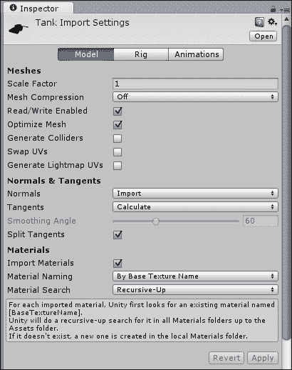

+   Unity 编辑器的顶部有三个标签页：**模型**、**绑定**和**动画**。**模型**页面处理网格本身，而**绑定**和**动画**用于导入动画。目前，我们只关心**模型**页面，所以如果尚未选择，请选择它。

+   **导入设置**窗口的**网格**部分从**缩放因子**属性开始。这是一个告诉 Unity 默认网格大小的值。从你的建模程序中，一个通用单位或一米的长度在 Unity 中对应一个单位。这个坦克是用通用单位制作的，所以坦克的缩放因子是 1。如果你在制作坦克时使用的是厘米，缩放因子将是 0.01，因为一厘米是米的百分之一。

+   下一个选项，**网格压缩**，在最后章节中当我们讨论游戏优化时将变得重要。压缩设置得越高，游戏中的文件越小。然而，这可能会开始给您的网格引入一些奇怪的现象，因为 Unity 正在努力使其变小。目前，请将其保持**关闭**。

+   **读写启用**如果您想在游戏运行时对网格进行更改，则非常有用。这可能允许您做一些非常酷的事情，例如可破坏的环境，其中您的脚本根据被射击的位置将网格分解成碎片。然而，这也意味着 Unity 需要在内存中保留网格的副本，如果它很复杂，这可能会真的开始拖慢系统。这超出了本书的范围，所以取消勾选此选项是个好主意。

+   **优化网格**是一个很好的选项，除非您正在对网格进行某些特定且复杂的工作。开启此选项，Unity 会在幕后进行一些特殊的操作。在计算机图形学，尤其是 Unity 中，每个网格最终都是一系列在屏幕上绘制的三角形。此选项允许 Unity 重新排列文件中的三角形，以便整个网格可以更快、更轻松地绘制。

+   下一个选项，**生成碰撞器**，如果进行复杂的物理操作时非常有用。Unity 有一组简单的碰撞器形状，应尽可能使用，因为它们更容易处理。然而，在某些情况下，它们可能无法完成工作，例如，对于由一系列简单形状难以构成的复杂碰撞形状，如碎石或半管道。这就是为什么 Unity 有一个**网格碰撞器**组件。勾选此选项后，每个模型中的网格都会添加一个**网格碰撞器**组件。在本章中，我们将坚持使用简单的碰撞器，所以请保持**生成碰撞器**选项关闭。

+   **交换 UV**和**生成光照贴图 UV**主要用于处理光照，尤其是光照贴图。Unity 可以处理模型上的两组 UV 坐标。通常，第一组用于纹理，第二组用于光照贴图或阴影纹理。如果顺序错误，**交换 UV**将会调整它们，使得第二组现在排在第一位。如果您需要一个光照贴图的展开图，但尚未创建，**生成光照贴图 UV**将为您创建一个。在这个项目中，我们不使用光照贴图，所以这两个选项都可以保持关闭。

+   下一部分选项，**法线与切线**，从**法线**选项开始。这定义了 Unity 将如何获取网格的法线。默认情况下，它们是从文件中导入的；但也可以选择让 Unity 根据网格的定义方式计算它们。或者，如果我们将此选项设置为**无**，Unity 将不会导入法线。如果我们希望网格受到实时光照的影响或使用法线贴图，则需要**法线**。我们将在本项目中使用实时光照，所以请将其设置为**导入**。

+   **切线**、**平滑角度**和**分割切线**在您的网格具有法线贴图时使用。切线用于确定光照如何与法线贴图表面交互。默认情况下，Unity 将为您计算这些值。仅从少数文件类型中可以导入切线。平滑角度决定了两个面之间的角度，从而决定了边缘的着色是平滑还是尖锐。**分割切线**选项用于处理一些特定的光照问题。如果光照被接缝破坏，启用此选项将修复它。法线贴图非常适合使低分辨率游戏看起来像高分辨率游戏。然而，由于使用它们需要额外的文件和信息，它们并不适合移动游戏。因此，我们在这本书中不会使用它们，并且可以关闭所有这些选项以节省内存。

+   最后一个部分，**材质**，定义了 Unity 应该如何查找材质。第一个选项，**导入材质**，是决定是否导入材质。如果关闭，将应用默认的白色材质。这个材质不会出现在您的项目中；它是一个隐藏的默认材质。对于没有纹理的模型，例如碰撞网格，可以关闭此选项。对于我们的坦克和几乎所有其他情况，应该保持开启状态。

+   最后两个选项，**材质命名**和**材质搜索**，共同用于命名和查找网格的材质。直接位于它们下方有一个文本框，描述了 Unity 将如何搜索材质。正在搜索的材质名称可以是建模程序中使用的纹理名称，建模程序中创建的材质名称，或者模型名称加上材质名称。如果找不到纹理名称，将使用材质名称代替。默认情况下，Unity 执行**递归向上**搜索。这意味着我们首先在`Materials`文件夹中查找，然后是同一文件夹中的任何材质。然后检查父文件夹中的匹配材质，接着是上一级文件夹。这个过程会一直持续，直到我们找到具有正确名称的材质或者达到根资产文件夹。或者，我们还可以选择只检查紧邻模型的`Materials`文件夹来检查整个项目。这些选项的默认设置就很好。一般来说，它们不需要更改。它们最容易通过 Unity 编辑器脚本进行更改，而这本书不会涉及。

+   接下来，我们有一对按钮：**还原**和**应用**。每次修改导入设置时，必须选择这两个按钮之一。**还原**按钮取消更改，并将导入设置切换回更改之前的状态。**应用**按钮确认更改，并使用新设置重新导入模型。如果不选择这些按钮，Unity 将通过弹出窗口抱怨，并强制你做出选择，然后才能进行其他操作。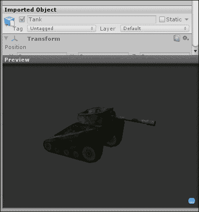

+   最后，我们有两种预览方式。**导入对象**部分是当对象被添加到**场景视图**并选中时，在**检查器**窗口中对象预览的样子。**预览**窗口显示了模型在**场景视图**中的样子。你可以在该窗口中点击并拖动来旋转对象，从不同的角度观察它。此外，在这个窗口中还有一个蓝色的按钮。点击这个按钮，你可以为对象添加标签。然后，这些标签也可以在**项目**窗口中搜索到。

## 设置坦克

现在我们已经导入了坦克，我们需要对其进行设置。我们将调整坦克的排列，并创建一些脚本。

# 行动时间 - 创建坦克

到目前为止，我们坦克的创建主要将包括创建和排列坦克的组件。

1.  首先，将坦克从**Project**窗口拖动到**Hierarchy**窗口。你会在**Hierarchy**窗口中注意到坦克的名字以蓝色显示。这是因为它是一个预制实例。你项目中的任何模型在很大程度上都像是一个预制实例。但是，我们希望我们的坦克能做更多的事情，而不仅仅是坐在这里。因此，作为一个静态网格的预制实例是没有帮助的。因此，在**Hierarchy**窗口中选择你的坦克，我们将通过移除`Animator`组件来开始使其变得有用。为此，在**Inspector**窗口中，选择`Animator`组件右侧的齿轮。从新的下拉列表中选择**移除组件**，它将被移除。

1.  如果你正在使用默认提供的坦克，选择它的不同部分将会显示所有枢轴点都在底部。这对于正确地使我们的炮塔和炮管旋转来说将没有用。解决这个问题最简单的方法是添加新的空`GameObject`作为枢轴点。

    ### 小贴士

    场景中的任何对象都是一个`GameObject`。任何空`GameObject`都只包含一个**Transform**组件。

1.  在 Unity 编辑器的顶部，**创建空对象**是位于**GameObject**按钮下的第一个选项。它创建我们需要的对象。创建两个空`GameObject`，并将一个放置在炮塔的底部，另一个放置在炮管的底部。此外，分别将它们重命名为`TurretPivot`和`CannonPivot`。这可以通过**Inspector**窗口顶部的文本框来完成，如果对象已被选中。

1.  在**Hierarchy**窗口中，将`TurretPivot`拖动到`Tank`上。这将`TurretPivot`的父对象更改为`Tank`。然后，将对象，即炮塔网格，拖动到`TurretPivot`上。在代码中，我们将旋转枢轴点，而不是直接旋转网格。当一个父对象移动或旋转时，所有子对象都会随之移动。当你进行这个更改时，Unity 会抱怨对象原始层次结构的更改；只需确认这是一个你想要进行的更改，而不是一个意外。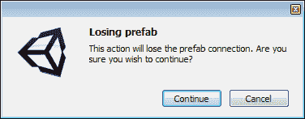

1.  由于失去与预制实例的连接可能会破坏游戏，Unity 只是想确保我们确实想要这样做。因此，点击**继续**，我们可以完成与坦克的工作，而不会收到 Unity 的其他投诉。我们还需要将`CannonPivot`设置为`TurretPivot`的子对象，并将炮管设置为`CannonPivot`的子对象。

1.  为了完成我们的层次结构更改，我们需要放置摄像机。因为我们希望它看起来像玩家实际上在坦克里，所以摄像机应该放置在坦克后面和上方，略微向下倾斜以聚焦在坦克前方几长度的位置。一旦定位好，将其也设置为`TurretPivot`的子对象。

## *刚才发生了什么？*

我们设置了坦克将使用的基本结构。通过这种方式使用多个对象，我们可以独立控制它们的移动和动作。在这个阶段，我们不再有一个只能向前指的刚性坦克，我们可以独立倾斜、旋转和瞄准每个部件。

### 小贴士

此外，坦克应该位于你想要整个物体围绕旋转的点上方。如果你的不是，你可以在 **Hierarchy** 窗口中选择位于基础坦克对象下的所有内容并移动它。

# 行动时间 - 记录得分

一个用于跟踪玩家得分的简短脚本将是本节的重点。

1.  为了使这个坦克工作，我们需要三个脚本。第一个相对简单。创建一个新的脚本并将其命名为 `ScoreCounter`。正如其名所示，它将跟踪得分。在 `Scripts` 文件夹中创建它，并清除默认函数，就像我们迄今为止创建的每个脚本一样。

1.  将以下代码行添加到新脚本中：

    ```java
    public static int score = 0;
    ```

    +   对于大部分内容，这应该看起来与上一章相似。首先我们定义一个整数计数器。因为它被定义为静态的，所以其他脚本（例如我们将为靶子创建的脚本）将能够修改这个数字并给出得分。

1.  接下来是一个 `OnGUI` 函数，它定义了一个 `Rect` 类并使用 `GUI.Box` 函数显示得分。一个框就像一个标签，但默认情况下有一个黑色背景。这将使得在移动时更容易看到。

    ```java
    public void OnGUI() {
      Rect scoreRect = new Rect(0, 0, 100, 30);
      GUI.Box(scoreRect, "" + score);
    }
    ```

## *刚才发生了什么？*

我们刚刚创建了一个非常简单的脚本。它将在整个游戏过程中跟踪我们的得分。此外，我们不会直接进行得分增加，其他脚本将更新计数器以给玩家加分。

# 行动时间 - 控制底盘

一个普通的坦克会在原地旋转，并且可以轻松地前进和后退。我们将通过创建单个脚本来实现我们的坦克这样做。

1.  第二个脚本被称为 `ChassisControls`。它将使我们的坦克移动。同样在 `Scripts` 文件夹中创建它。

1.  脚本的前三行定义了坦克移动所需的变量。我们还可以在 **Inspector** 窗口中更改它们，以防我们的坦克速度过快或过慢。第一行定义了一个变量，它包含对 `CharacterController` 组件的连接。这个组件可以轻松地移动坦克，但允许它被墙壁和其他碰撞体阻止。接下来的两行代码定义了移动和旋转的速度：

    ```java
    public CharacterController characterControl;
    public float moveSpeed = 10f;
    public float rotateSpeed = 45f;
    ```

1.  现在让我们把我们的好朋友 `OnGUI` 加入到混合中。这应该看起来很熟悉。我们正在创建四个按钮，它们将位于屏幕的左下角。当按下前两个按钮时，我们将调用一个函数来移动我们的坦克，并给它一个表示其移动速度的值。正值将使我们向前移动，而负值将使我们向后移动。最后两个按钮做的是同样的事情，只是用旋转代替了移动。正值将使坦克向右旋转，而负值将使坦克向左旋转。这些按钮也是 `RepeatButtons`。一个普通的按钮在每次按下时只会激活一次。而重复按钮在按下时一直处于激活状态。这的好处是它将允许我们的坦克在按钮被按下的每一帧移动。坏处是 `RepeatButton` 和 `OnGUI` 函数工作方式中的一个怪癖。如果这些按钮中的任何一个处于激活状态，那么在 `OnGUI` 函数中，该按钮之后的任何内容都不会被绘制。这有点烦人，但就目前而言，它符合我们的需求。

    ```java
    public void OnGUI() {
      Rect fore = new Rect(50, Screen.height – 150, 50, 50);
      if(GUI.RepeatButton(fore, "f")) {
        MoveTank(moveSpeed);
      }

      Rect back = new Rect(50, Screen.height – 50, 50, 50);
      if(GUI.RepeatButton(back, "b")) {
        MoveTank(-moveSpeed);
      }

      Rect left = new Rect(0, Screen.height – 100, 50, 50);
      if(GUI.RepeatButton(left, "l")) {
        RotateTank(-rotateSpeed);
      }

      Rect right = new Rect(100, Screen.height – 100, 50, 50);
      if(GUI.RepeatButton(right, "r")) {
        RotateTank(rotateSpeed);
      }
    }
    ```

1.  剩下只有两个函数需要完成。我们通过定义 `MoveTank` 函数开始下一行代码。它需要一个速度值来指定移动的距离和方向。之前已经提到过；正值将前进，而负值将后退。

    ```java
    public void MoveTank(float speed) {
    ```

1.  为了在三维空间中移动，我们需要一个向量——一个既有方向又有大小的值。因此，我们定义了一个移动向量，并将其设置为坦克的前进方向，乘以坦克的速度，然后再乘以自上一帧以来经过的时间。如果你还记得几何课上的内容，三维空间有三个方向：x、y 和 z。在 Unity 中，以下约定适用：x 是向右，y 是向上，z 是向前。**Transform** 组件包含一个对象的位置、旋转和缩放。我们可以通过调用 Unity 提供的 `.transform` 值来访问任何对象在 Unity 中的 **Transform** 组件。**Transform** 组件还提供了一个前进值，它将给我们一个相对于对象的指向前进的向量。此外，我们希望以均匀的速度移动，例如，每秒移动一定数量的米，因此我们使用了 `Time.deltaTime`。这是 Unity 提供的一个值，表示自游戏上一帧在屏幕上绘制以来经过的秒数。想象一下像翻书一样。为了使看起来像一个人在页面上走过，他需要在每一页上稍微移动一下。在游戏的情况下，页面不是定期翻动的。因此，我们必须根据翻到新页面所需的时间来修改我们的移动。这有助于我们保持均匀的速度。

    ```java
      Vector3 move = characterControl.transform.forward * speed * Time.deltaTime;
    ```

1.  接下来，我们想要保持在地面。一般来说，任何你想要在游戏中控制的角色都不会自动接收到像石头一样所有的物理属性，例如重力。例如，当跳跃时，你暂时移除重力，以便角色可以向上移动。这就是为什么下一行代码通过减去重力的正常速度并再次保持与帧率同步来简单地实现重力：

    ```java
      move.y -= 9.8f * Time.deltaTime;
    ```

1.  最后，对于`MoveTank`函数，我们实际上执行移动。`CharacterController`组件有一个特殊的`Move`函数，它将移动角色但通过碰撞来限制它。我们只需要告诉它我们想要在这一帧移动多远以及朝哪个方向移动，通过传递`Move`向量给它。当然，最后的那个花括号关闭了函数。

    ```java
      characterControl.Move(move);
    }
    ```

1.  `RotateTank`函数是最后一个。这个函数也需要一个速度值来指定旋转的速度和方向。我们首先定义另一个向量；但是，与定义移动方向不同，这个向量将指定旋转的方向。在这种情况下，我们将围绕我们的向上方向旋转。然后我们将其乘以我们的速度和`Time.deltaTime`，以便移动得足够快，并保持与帧率的同步。

    ```java
    public void RotateTank(float speed) {Vector3 rotate = Vector3.up * speed * Time.deltaTime;
    ```

1.  函数的最后部分实际上执行旋转。**Transform**组件提供了一个`Rotate`函数。旋转，尤其是在 3D 空间中，可以变得非常奇怪和困难。`Rotate`函数为我们处理所有这些；我们只需要提供要应用的旋转值。另外，别忘了用花括号关闭函数。

    ```java
      characterControl.transform.Rotate(rotate);
    }
    ```

## *发生了什么？*

我们创建了一个脚本来控制坦克的移动。它将在屏幕上绘制一组按钮，以便我们的坦克可以向前和向后移动。这是通过使用`CharacterController`组件的特殊`Move`函数来完成的。我们还使用了**Transform**组件提供的特殊`Rotate`函数，通过另一组按钮来旋转我们的坦克。

# 行动时间 - 控制炮塔

这个脚本将允许玩家旋转他们的炮塔并瞄准大炮。

1.  我们需要为我们的坦克创建的最后一段脚本是`TurretControls`。这个脚本将允许玩家左右旋转炮塔并上下倾斜大炮。与其他所有脚本一样，在`Scripts`文件夹中创建它。

1.  我们定义的前两个变量将持有炮塔和炮管枢轴的指针，这些是用于我们坦克的空`GameObjects`。第二个集合是我们炮塔和炮管旋转的速度。最后，我们还有一些限制值。如果我们不对炮管的旋转范围进行限制，它就会不断地旋转，穿过我们的坦克。这对坦克来说并不是最逼真的行为，因此我们必须对它进行一些限制。这些限制值在 300 的范围内，因为正前方是零度，向下是 90 度。我们希望它是向上的角度，所以它在 300 度的范围内。我们还使用 359.9，因为 Unity 会将 360 度转换为零，以便它可以继续旋转。

    ```java
    public Transform turretPivot;
    public Transform cannonPivot;

    public float turretSpeed = 45f;
    public float cannonSpeed = 20f;

    public float lowCannonLimit = 315f;
    public float highCannonLimit = 359.9f;
    ```

1.  下一步是创建`OnGUI`函数来绘制按钮并让玩家控制炮塔。这个函数几乎与为`ChassisControls`脚本制作的`OnGUI`函数相同。不同之处在于`Rects`类将移动到屏幕的右下角，并且我们正在调用`RotateCannon`和`RotateTurret`函数。当我们向`RotateCannon`发送速度时，需要一个正值来上升，一个负值来下降。`RotateTurret`将主要像`RotateTank`函数一样工作；正值将向右旋转，负值将向左旋转。

    ```java
    public void OnGUI() {
      Rect up = new Rect(Screen.width – 100, Screen.height – 150, 50, 50);
      if(GUI.RepeatButton(up, "u")) {
        RotateCannon(cannonSpeed);
      }

      Rect down = new Rect(Screen.width – 100, Screen.height – 50, 50, 50);
      if(GUI.RepeatButton(down, "d")) {
        RotateCannon(-cannonSpeed);
      }

      Rect left = new Rect(Screen.width – 150, Screen.height – 100, 50, 50);
      if(GUI.RepeatButton(left, "l")) {
        RotateTurret(-turretSpeed);
      }

      Rect right = new Rect(Screen.width – 50, Screen.height – 100, 50, 50);
      if(GUI.RepeatButton(right, "r")) {
        RotateTurret(turretSpeed);
      }
    }
    ```

1.  接下来是`RotateTurret`函数。它的工作方式与`RotateTank`函数完全相同。然而，我们不是查看`CharacterController`组件的`Transform`变量，而是作用于函数开头定义的`turretPivot`变量。

    ```java
    public void RotateTurret(float speed) {
      Vector3 rotate = Vector3.up * speed * Time.deltaTime;
      turretPivot.Rotate(rotate);
    }
    ```

1.  最后一个函数`RotateCannon`在旋转方面变得更加复杂。错误完全在于需要对炮管的旋转进行限制的需要。在打开函数后，第一步是确定我们将在这个帧中旋转多少。我们使用浮点值而不是向量，因为我们必须自己设置旋转。

    ```java
    public void RotateCannon(float speed) {
      float rotate = speed * Time.deltaTime;
    ```

1.  接下来，我们定义一个变量来保存我们的当前旋转。我们这样做是因为 Unity 不允许我们直接对旋转进行操作。实际上，Unity 将旋转作为四元数来跟踪。这是一种定义旋转的复杂方法，超出了本书的范围。幸运的是，Unity 为我们提供了一个名为`EulerAngles`的 x、y、z 方法来定义旋转。它是在 3D 空间中围绕每个轴的旋转。**Transform**组件的`localEulerAngles`值是相对于父`GameObject`的旋转。

    ```java
    Vector3 euler = cannonPivot.localEulerAngles;
    ```

    ### 小贴士

    它被称为`EulerAngles`是因为*莱昂哈德·欧拉*，一位瑞士数学家，他定义了这种定义旋转的方法。

1.  接下来，我们通过使用`Mathf.Clamp`函数一次性调整旋转并应用限制。`Mathf`是一组有用的数学函数。`Clamp`函数接受一个值，并使其不比传递给函数的其他两个值低或高。因此，我们首先发送我们的 x 轴旋转，这是从`euler`的当前 x 旋转中减去`rotate`的结果。因为正旋转是围绕轴顺时针的，所以我们必须减去我们的旋转，以便用正值向上而不是向下移动。接下来，我们将我们的下限传递给`Clamp`函数，然后是我们的上限：我们在脚本顶部定义的`lowCannonLimit`和`highCannonLimit`变量。

    ```java
    euler.x = Mathf.Clamp(euler.x – rotate, lowCannonLimit, highCannonLimit);
    ```

1.  最后，我们必须将新的旋转实际应用到炮管的旋转中心点上。这仅仅是设置**变换**组件的`localEulerAngles`值到新值。同样，务必使用花括号来关闭函数。

    ```java
      cannonPivot.localEulerAngles = euler;
    }
    ```

## *刚才发生了什么？*

我们创建了一个脚本，用来控制坦克的炮塔。通过使用屏幕上的按钮，玩家能够倾斜炮管并旋转炮塔。这个脚本与之前创建的`ChassisControls`脚本非常相似。区别在于限制了炮管可以倾斜的程度。

# 行动时间 - 组装零件

那就是最后的脚本，目前是这样。我们有了我们的坦克和我们的脚本；下一步是将它们组合起来。

1.  现在，我们需要将它们添加到我们的坦克上。记得我们在上一章中如何将我们的`Tic-tac-toe`脚本添加到相机上吗？首先，在**层次结构**窗口中选择你的坦克。在它们工作之前，我们首先需要将`CharacterController`组件添加到我们的坦克上。因此，转到 Unity 编辑器的顶部，选择**组件**，然后选择**物理**，最后点击**Character Controller**选项。

    +   你会注意到在场景视图中坦克上还出现了一个绿色的胶囊；同时新组件也被添加了。这个胶囊代表将与其他碰撞体发生碰撞和交互的空间。CharacterController 组件上的值让我们可以控制它与其它碰撞体的交互方式。在大多数情况下，前四个属性的默认值就足够好了。

        **斜坡限制**：这个属性显示了控制器可以移动的倾斜程度。

        **步高偏移量**：这个属性显示了在开始阻止移动之前，台阶可以有多高。

        **皮肤宽度**：这定义了另一个碰撞体在完全停止之前可以穿透这个控制器碰撞体的距离。这主要用于挤压在物体之间。

        **最小移动距离**：这个属性用于限制抖动。这是在帧中实际移动之前必须应用的最小移动量。

        **中心点**, **半径**和**高度**：这些属性定义了你在场景视图中看到的胶囊的大小。它们用于碰撞检测。

        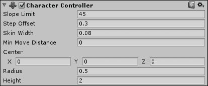

1.  最后三个值是我们现在关心的。我们需要调整这些值，尽可能匹配坦克的值。诚然，胶囊是圆形的，而我们的坦克是方形的，但`CharacterController`组件是移动带有碰撞的角色的最简单方式，并且将被最频繁使用。将**半径**属性的值设为`2.3`，以及**中心**属性的**Y**部分的值；其他所有内容都可以保留默认值。

1.  现在是时候将脚本添加到我们的坦克上了。通过在**层次结构**窗口中选择坦克，并将`ChassisControls`、`TurretControls`和`ScoreCounter`脚本拖动到**检查器**窗口中来实现。这就像我们在前面的章节中所做的那样。

1.  在坦克开始工作之前，我们需要完成在脚本中开始创建的连接。首先点击`CharacterController`组件的名称，并将其拖动到我们新的`ChassisControls`脚本组件上的**角色控制**值。Unity 允许我们在 Unity 编辑器中连接对象变量，这样它们就不需要硬编码。

1.  我们还需要连接我们的炮塔和炮塔旋转点。因此，点击并拖动**层次结构**窗口中的点，到`TurretControls`脚本组件上的相应变量。

1.  将场景保存为`TankBattle`并尝试运行。

## *发生了什么？*

我们刚刚完成了坦克的组装。除非你在使用移动控制时查看**场景**视图，否则很难看出坦克在移动。然而，在**游戏**视图中可以看到炮塔控制。除了没有我们的坦克是否在移动的参考点之外，它运行得相当好。下一步和下一节将随着我们添加城市而提供这个参考点。

## 尝试一下英雄 – 炮塔对准

你可能会注意到当第一次尝试倾斜炮塔时会有一个快速的跳跃。这种行为很烦人，并且让游戏看起来像是出了问题。尝试调整炮塔来修复它。如果你遇到困难，可以查看炮塔的初始旋转。

# 创建材质

在 Unity 中，材质是决定模型如何在屏幕上绘制的关键因素。它们可以是简单的全部蓝色，也可以是复杂的带有波浪的反射水。在本节中，我们将介绍材质控制的细节。我们还将创建我们的城市和一些简单的材质来纹理化它。

# 行动时间 – 创建城市

创建一个城市为我们的坦克和玩家提供了一个良好的游戏场所。

1.  在本节中，提供的城市没有分配特定的纹理。它只是被展开，并创建了一些可重复使用的纹理。因此，我们需要首先将城市和纹理导入到`Environment`文件夹中。就像我们导入坦克一样做。

    ### 小贴士

    文件包括 `TankBattleCity.blend`, `brick_001.png`, `brick_002.png`, `brick_003.png`, `dirt_001.png`, `dirt_003.png`, `pebbles_001.png`, `rocks_001.png`, `rubble_001.png`, 和 `water_002.png`.

1.  由于城市已经被展开，Unity 仍然为它创建了一个单独的材质。然而，在任何建模程序中从未应用过纹理。因此，材质是纯白色的。我们有一些额外的纹理，所以整个城市将需要不止一个材质。创建一个新的材质很简单；就像创建一个新的脚本一样进行。在`环境`文件夹内的`材质`文件夹上右键点击，然后选择**创建**，接着选择**材质**，这在菜单中大约是中间位置。

1.  这将在文件夹中创建一个新的材质，并立即允许我们为其命名。将材质命名为，`Pebbles`。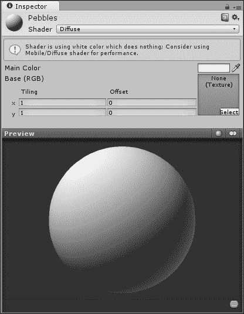

1.  在选择新的材质后，查看**检查器**窗口。当我们选择一个材质时，我们会得到改变其外观所需的选项。

    +   在**检查器**窗口的顶部，我们有材质的名称，后面跟着一个**着色器**下拉列表。着色器本质上是一个简短的脚本，告诉显卡如何在屏幕上绘制某个东西。你将最常使用**漫反射**着色器，所以它默认总是被选中。这里你可以从你的凹凸贴图着色器、高光、透明以及其他众多选项中进行选择。如果你要创建一些自定义着色器，它们也会在这里找到。

    +   下一个小块只有在 Unity 有警告信息时才会可见。在这种情况下，它建议我们出于性能原因使用不同的着色器。然而，这是一个关于第九章，*优化*的讨论，所以我们现在忽略它。

    +   然后，我们有带有旁边彩色方块的**主颜色**值。点击该方块，将打开**颜色选择器**窗口，允许我们选择任何我们想要的颜色。这个颜色值会改变材质绘制的纹理的色调。因为我们还没有纹理，所以你会注意到它只是改变了**预览**窗口中球的颜色。

    +   **基础 (RGB)** 值位于**主颜色**值之下。这是纹理。右侧的带有**无 (纹理**)和**选择**按钮的框是一个用于预览当前材质使用的纹理的预览框。要向材质添加纹理，要么从**项目**窗口拖动一个到这个框中，要么点击**选择**按钮。按钮会打开一个新窗口，其中包含项目中所有纹理的缩略图。你可以滚动浏览或使用搜索栏找到所需的纹理，然后双击以选择它。

    +   在框的左侧，我们有**平铺**和**偏移**控件。**平铺**值决定了纹理在 x 和 y 方向上在归一化 UV 空间中重复的次数。**偏移**是纹理在归一化 UV 空间中从零开始的距离。你可以选择数字字段并输入值来修改它们。这样做，并注意下方的**预览**窗口，你会看到它们如何改变纹理。平铺纹理最常用于大型表面，其中纹理在表面上的相似性足够高，以至于可以重复。

    +   我们的**预览**窗口位于**检查器**窗口的底部。它的工作方式与我们之前看到的坦克网格的预览窗口相同。然而，这个窗口特别之处在于窗口右上角的两个按钮。左边的按钮可以滚动预览形状集。通过点击它，你可以看到纹理在球体、立方体、圆柱体或环面上的样子。另一个按钮在两种光照类型之间切换。

1.  通过从**项目**窗口拖动并将其放置在**基础（RGB）**预览框上，将`pebbles_001`纹理添加到这种材料中。

1.  将材料的**平铺**值设为 30，将**主颜色**选项设为浅米色，以便纹理可以正确缩放，看起来更令人愉悦。

1.  要查看我们的新材料效果，首先将你的城市拖动到**层次结构**窗口中，使其添加到**场景**视图中。通过右键单击并拖动，你可以在你的**场景**视图中四处查看。看看城市的街道。

1.  现在，将你的新材料从**项目**窗口拖动到你的**场景**视图中。在拖动材料时，你应该看到网格发生变化，看起来就像它们正在使用这种材料。一旦你拖动到街道上，就松开你的左鼠标按钮。现在，材料已经应用到网格上了。

1.  然而，我们目前有整个城市四分之一的大小需要纹理化。因此，创建更多材料，并使用剩余的纹理来纹理化城市的其余部分。为每个额外的纹理创建一个新的材料，再加上四个额外的`brick_002`，这样我们就可以为每个建筑高度有不同的颜色。

1.  通过比较以下图示或根据你自己的艺术喜好，将你的新材料应用到城市上：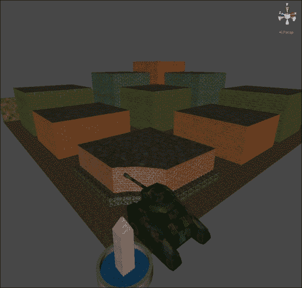

    ### 小贴士

    当试图到达中心喷泉时，如果你的坦克挡路，请在**层次结构**窗口中选择你的坦克，并在**场景**视图中使用** Gizmo**选项将其拖出障碍。

    +   如果你现在尝试玩游戏，可能会注意到我们有一些问题。首先，我们只有城市四分之一的大小；如果你自己制作了城市，可能更多。城市中仍然没有碰撞，所以我们在移动时会直接穿过它。此外，坦克对于这个城市来说有点大，而且太暗了，看不清我们想去哪里。打开灯光是解决这个问题最快的方法。

1.  在 Unity 编辑器的顶部，选择**游戏对象**，然后选择**创建其他**，最后选择**方向光**。这将创建一个以单一方向发射光线的对象。下一章将解释光线及其控制方法，所以细节将留待以后介绍。

1.  改变我们的坦克大小也很简单。在**层次结构**窗口中选择它，并在我们的**变换**组件中查找**缩放**标签。在**缩放**下更改**X**、**Y**和**Z**值将改变坦克的大小。确保均匀地更改它们，否则当我们开始旋转坦克时会出现奇怪的现象。0.5 的值可以使坦克足够小，以通过狭窄的街道。

1.  接下来是城市的碰撞问题。大部分情况下，我们可以使用处理速度较快的简单碰撞形状。然而，城市圆形中心将需要特殊处理。首先在**场景**视图中双击其中一个方形建筑的墙壁。

    ### 小贴士

    当处理预制体时，城市仍然是一个预制体，点击构成预制体的任何对象都会选择根预制体对象。一旦选择了预制体，点击其任何部分都会选择那个单独的部分。因为这种行为与非预制体对象不同，所以在**场景**视图中选择对象时需要留心这一点。

1.  在选择了一组墙壁后，转到 Unity 编辑器的顶部，选择**组件**，然后选择**物理**，最后选择**Box Collider**。

1.  由于我们正在将碰撞器添加到特定的网格，Unity 会尽力自动将碰撞器适配到形状。对我们来说，这意味着新的`BoxCollider`组件已经调整大小以适应建筑。继续添加`BoxColliders`到其余的方形建筑和外墙。我们的街道基本上是平的，所以`BoxCollider`组件对它们来说也适用。尽管尖顶指向顶部，但喷泉中央的方尖碑基本上也是一个盒子；因此，另一个`BoxCollider`也适用。

1.  我们最后要处理的是一座建筑和喷泉的环形区域。这些不是盒子、球体或胶囊。因此，我们的简单碰撞器将不起作用。选择最后一座建筑，即靠近中心喷泉的那座。在您选择**Box Collider**的选项下方几项，有一个**Mesh Collider**选项。这将为我们对象添加一个`MeshCollider`组件。这个组件的功能正如其名；它将网格转换为碰撞器。通过将其添加到特定的网格，`MeshCollider`组件会自动选择该网格以使其可碰撞。您还应该将`MeshColliders`添加到中心建筑周围的短边缘和喷泉周围的环形墙上。

1.  最后要解决的问题是我们城市四分之一的复制。首先，在您的层次结构中选择根`city`对象`TankBattleCity`，并从中移除`Animator`组件。城市不会进行动画处理，因此不需要这个组件。

1.  现在，在**层次结构**窗口中右键单击城市，并选择**复制**。这将创建所选对象的副本。

1.  将城市四分之一再复制两次，我们就会有我们城市的四个部分。唯一的问题是它们都在完全相同的位置。

1.  我们需要旋转三个部件来构建一个完整的城市。选择一个部件，在**变换**组件中设置**Y 旋转**值为`90`。这将使其围绕垂直轴旋转 90 度，从而得到城市的一半。

1.  我们将通过将一个剩余部件设置为`180`，另一个设置为`270`来完成城市。

1.  这样就剩下最后一件事要做。我们有四个中心喷泉。在四个城市部件中的三个中，选择组成中心喷泉的三个网格（`方尖碑`、`墙壁`和`水`），然后按键盘上的**删除**键。每次确认都要断开预制件连接，我们的城市就会完成。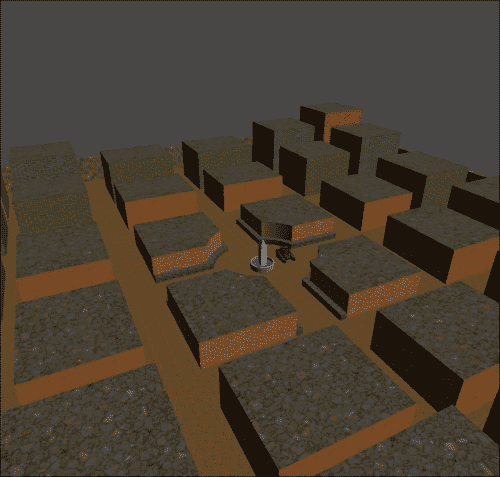

## *刚才发生了什么？*

现在尝试游戏。我们可以驾驶汽车在城市中行驶并旋转我们的炮塔。这真是太有趣了。我们创建了材质并为城市着色。在使建筑和道路能够碰撞后，我们复制了该部分，以便我们有一个完整的城市。

## 英雄试炼 – 装饰城市

现在您已经拥有了导入网格和创建材质所需的所有技能，挑战就是装饰城市。创建一些废墟和坦克陷阱，并练习将它们导入 Unity 并在场景中设置。如果您真的想做得更好，尝试自己创建一个城市。选择世界上的某个东西，或者选择您想象中的某个东西。一旦创建，我们就可以在其中释放坦克。

# 行动时间 – 移动履带

1.  只剩下最后一件事要做，然后我们就可以完成材质，并继续制作一个更有趣的游戏。还记得材质的**偏移**值吗？实际上，我们可以通过脚本来控制它。首先打开`ChassisControls`脚本。

1.  首先，我们需要在脚本的开头添加几个变量。前两个变量将保存对坦克履带渲染器的引用，这是网格对象中跟踪应用到的材质并实际进行绘制的那部分。这就像`characterControl`变量保存了对`CharacterController`组件的引用一样。

    ```java
    public Renderer rightTread;
    public Renderer leftTread;
    ```

1.  后两个变量将跟踪每个履带应用的偏移量。我们在这里存储它，因为它比在每一帧从线程的材质中查找要快。

    ```java
    private float rightOffset = 0;
    private float leftOffset = 0;
    ```

1.  为了使用新值，需要将这些行添加到`MoveTank`函数的末尾。这里的第一行根据我们的速度调整右侧履带的偏移量，并保持与我们的帧率同步。第二行利用`Renderer`组件的材料值来找到我们的坦克履带材料。材料的主纹理偏移值是材料中主纹理的偏移量。在我们的漫反射材料中，它只有一个纹理。然后，我们必须将偏移量设置为一个新的`Vector2`值，该值将包含我们的新偏移量。`Vector2`就像我们用于移动的`Vector3`一样，但在 2D 空间中工作而不是 3D 空间。纹理是平面的，因此是 2D 空间。代码的最后两行与前面的两行做相同的事情，但针对左侧坦克履带。

    ```java
    rightOffset += speed * Time.deltaTime;
    rightTread.material.mainTextureOffset = new Vector2(rightOffset, 0);
    leftOffset += speed * Time.deltaTime;
    leftTread.material.mainTextureOffset = new Vector2(leftOffset, 0);
    ```

1.  为了将连接到履带`Renderer`组件，做与我们为枢轴点所做相同的事情：将履带网格从**层次**窗口拖动到**检查器**窗口中的相应值。完成后，务必保存并尝试一下。

## *刚才发生了什么？*

我们更新了`ChassisControls`脚本以使坦克履带移动。当坦克被驾驶时，纹理在适当的方向上平移。这是用于制作水波和其他移动纹理的相同类型的功能。

## 尝试一下英雄般的旋转——用履带旋转

材料移动的速度并不完全匹配坦克的速度。找出如何为坦克的履带添加一个速度值。如果坦克旋转时它们向相反方向移动那就更酷了。真实坦克通过让一个履带向前移动，另一个向后移动来转弯。

# 动画

我们接下来要讨论的主题是动画。当我们探索 Unity 中的动画时，我们将为坦克创建一些射击目标。Unity 动画系统 Mecanim 的大部分功能都在于处理人类角色。但是，设置和动画人类类型角色本身就是一本专著，所以这里不会涵盖。然而，我们仍然可以从 Mecanim 中学到很多并做很多事情。

+   在我们继续解释动画导入设置之前，我们需要一个动画模型来工作。我们还需要导入最后一组资源到我们的项目中。将`Target.blend`和`Target.png`文件导入到我们项目的`Targets`文件夹中。一旦导入，调整目标页面的**导入设置**窗口，就像我们为坦克所做的那样。现在切换到**绑定**选项卡。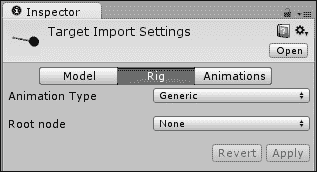

+   **动画类型**属性告诉 Unity 当前模型在动画时将使用哪种类型的骨架。

    +   **人类**选项为处理人类类型角色添加了许多更多按钮和开关到这个页面。但同样，这里过于复杂，无法涵盖。

    +   **通用**绑定仍然使用 Mecanim 及其许多功能。实际上，这只是任何不类似于人类结构的动画骨架。

    +   第三种选项，**Legacy**，使用 Unity 的旧动画系统。但是，这个系统将在 Unity 的下一个几个版本中逐步淘汰，因此也不会被涵盖。

    +   最后一个选项，**None**，表示对象将不会进行动画。您可以为坦克和城市选择此选项，因为它也会防止 Unity 添加那个`Animator`组件，并在最终项目大小中节省空间。

    +   **根节点**值是模型文件中每个对象的列表。其目的是选择动画绑定的基础对象。对于这个目标，选择**Bone_Arm_Upper**，它在第二个**绑定**选项下面。

    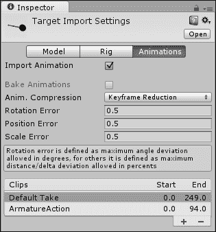

+   导入设置的最后一页，**动画**，包含了我们将动画从文件导入 Unity 所需的所有内容。在**目标导入设置**窗口的顶部，我们有**导入动画**复选框。如果一个对象不会进行动画，关闭此选项是个好主意。这样做也会在项目中节省空间。

+   下方那个选项，**烘焙动画**，仅在您的动画包含运动学和来自 3Ds Max 或 Maya 时使用。这个目标是来自 Blender 的，所以选项被灰色显示。

+   接下来的四个选项，**动画压缩**、**旋转错误**、**位置错误**和**缩放错误**，主要用于平滑抖动的动画。几乎所有的时候，默认值都适用得很好。

+   **剪辑**部分是我们真正关心的。这将是一个当前从模型中导入的每个动画剪辑的列表。在列表的左侧，我们有剪辑的名称。在右侧，我们可以看到剪辑的开始和结束帧。

    +   Unity 将为每个新模型添加**默认取用**动画剪辑。这是从建模程序的默认预览范围生成的剪辑，当文件被保存时。

    +   在 Blender 中，也可以为每个绑定创建一系列动作。默认情况下，它们被 Unity 作为动画剪辑导入。在这种情况下，会创建**ArmatureAction**剪辑。

    +   在剪辑下方和右侧，有一个带有**+**和**-**按钮的小标签。这两个按钮分别将剪辑添加到末尾和移除选定的剪辑。

    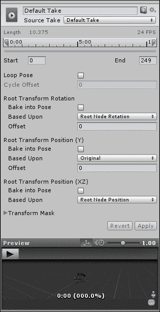

+   当选择一个剪辑时，下一个部分就会出现。它从一个用于更改剪辑名称的文本字段开始。

+   在文本字段下方，有一个**源取用**下拉列表。这个列表与默认动画相同。大多数时候，您只会使用**默认取用**；但如果您的动画看起来不正确或丢失，首先尝试更改**源取用**下拉列表。

+   然后，我们有一个小的时间轴，后面跟着动画剪辑的开始和结束帧的输入字段。在时间轴上点击并拖动两个蓝色标志将改变输入字段中的数字。

+   接下来是**循环姿态**和**循环偏移**。如果我们想让动画重复，请勾选**循环姿态**旁边的框。当动画循环时，**循环偏移**将变为可用。这个值让我们可以调整循环动画开始时的帧。

+   接下来的三个小部分，**根变换旋转**、**根变换位置（Y）**和**根变换位置（XZ）**，允许我们通过动画控制角色的运动。

    +   这三个部分都包含一个**将动画烘焙到姿态**选项。如果这些选项未被勾选，动画中根节点（我们在**绑定**页面下选中的节点）的运动将转化为整个物体的运动。可以这样理解：假设你要动画化一个向右跑的人物，在动画程序中，你实际上移动他们，而不是像通常那样原地动画化。在 Unity 旧版动画系统中，为了让角色的物理部分移动碰撞体，必须通过代码移动`GameObject`。因此，如果你使用那种动画，角色看起来像是移动了，但实际上没有碰撞。在新系统中，当播放该动画时，整个角色都会移动。然而，这需要一个不同且更复杂的设置才能完全工作。所以，我们没有选择在坦克上使用它，尽管我们可以使用它。

    +   这三个部分各自还有一个**基于**的下拉选项。这个选项的选择决定了每个部分的物体中心。如果你正在处理类人角色，会有更多选择，但目前为止我们只有两个。

        **根节点**选项意味着根节点对象的旋转中心是中心点。

        **原始**选项意味着动画程序定义的原点是物体的中心。

    +   对于这些部分的前两个，还有一个**偏移**选项，用于纠正运动中的错误。当为一个角色动画化行走循环时，如果角色稍微向一侧拉，调整**根变换旋转**下的**偏移**选项可以纠正它。

+   我们动画剪辑的最后一个选项是**变换遮罩**选项。通过点击左侧的箭头，你可以展开一个包含模型中所有对象的列表。每个对象旁边都有一个复选框。当播放此剪辑时，未勾选的对象将不会动画化。这在挥手动画的情况下很有用。这样的动画只需要移动手臂和手，因此我们会取消勾选可能构成角色身体的所有对象。然后我们可以分层动画，使我们的角色能够在站立、行走或跑步时挥手，而无需创建额外的三个动画。

+   最后，我们还有底部的**Revert**按钮、**Apply**按钮和**Preview**窗口。就像我们所有的其他导入设置一样，当进行更改时，我们必须点击其中一个按钮。这个**Preview**窗口通过右上角的速率滑块和左上角的大**play**按钮变得特别。通过点击这个按钮，我们可以预览选定的动画。这让我们能够检测到我们之前提到的运动错误，并确保动画是我们想要的。

## 目标动画

因此，现在描述都已经说完了，让我们实际做点什么。我们首先设置目标的动画。

# 行动时间 - 设置目标动画

利用我们刚刚获得的知识，我们现在可以设置目标的动画。

1.  首先，如果你之前错过了或跳过了，请确保将`Target.blend`和`Target.png`文件导入到`Targets`文件夹中。此外，在导入设置的**Rig**页面，将**Animation Type**属性设置为**Generic**，将**Root Node**属性设置为**Bone_Arm_Upper**。

1.  我们总共需要六个动画。通过点击**Clips**部分中的**+**按钮，你可以添加另外四个动画。如果你添加了太多，点击**-**按钮来删除额外的剪辑。

1.  所有这些剪辑都应该有一个**Source Take**下拉列表，选择**Default Take**，并且所有**Bake into Pose**选项都应该被勾选，因为目标不会从其起始位置移动。

1.  首先，让我们创建我们的空闲动画。选择第一个剪辑并将其重命名为`Idle_Retract`。由于它是一个机械物体，我们可以用一个非常短的动画来应付；短到我们只需要使用第一帧。将起始帧设置为`0.9`，结束帧设置为`1`。

1.  我们还需要打开**Loop Pose**，因为空闲动画当然是循环的。

1.  扩展空闲动画几乎是以相同的方式创建的。选择第二个剪辑并将其重命名为`Idle_Extend`。这里的起始帧是`14`，结束帧是`14.1`。此外，这个动画需要循环。

1.  接下来的两个动画是针对目标展开和收缩的情况。它们将被命名为`Extend`和`Retract`，所以将接下来的两个剪辑重命名。`Extend`动画将从帧`1`开始，到帧`13`结束。`Retract`动画从帧`28`开始，到帧`40`结束。这两个动画都不会循环。

1.  最后两个动画也不会循环。它们是在射击目标时使用的。有一个是正面被射击，另一个是从后面被射击。`Hit_Front`动画将从帧`57`到帧`87`。`Hit_Back`动画将从帧`98`到帧`128`。

1.  一旦所有更改都完成，请确保点击**Apply**，否则它们将不会被保存。

## *刚才发生了什么？*

我们设置了目标将使用的动画。总共有六个。现在可能看起来不多，但下一节没有它们就无法进行。

## 状态机

为了我们在 Unity 中控制这些新的动画，我们需要设置一个状态机。状态机就是一个跟踪对象能做什么以及如何在这些事物之间转换的复杂对象。从实时策略游戏中的建筑者角度来想，建筑者有一个行走状态，用于移动到下一个建筑工地。到达那里后，它会切换到构建状态。如果有敌人出现，建筑者会进入逃跑状态，直到敌人消失。最后，当建筑者无所事事时，会有一个空闲状态。在 Unity 中，这些在处理动画和 Mecanim 时被称为 Animator Controllers。

# 执行时间 – 创建目标状态机

使用状态机可以让我们更多地关注目标正在做什么，同时让 Unity 处理*如何去做*的部分。

1.  创建 Animator Controller 很简单，就像我们为脚本和材质所做的那样。选项位于**创建**菜单的倒数第二位。在`Targets`文件夹中创建一个，命名为`TargetController`。

1.  双击`TargetController`以打开一个新窗口。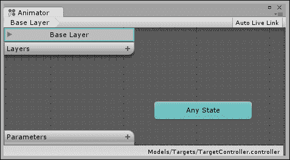

1.  **Animator**窗口是我们编辑状态机的地方。

    +   在窗口的左上角，有一个类似于网站上的面包屑导航，让我们可以一眼看出我们在状态机中的位置。

    +   右上角的**自动实时链接**按钮控制着我们是否能够实时看到状态机与游戏的更新。这对于调试角色过渡和控制非常有用。

    +   在面包屑导航下方，有一列层和添加新层的按钮。每个状态机至少会有一个**基础层**。添加额外的层可以让我们混合状态机。比如说，一个角色在健康满值时正常行走。当他的健康值低于一半时，他开始跛行。如果角色的健康值只剩下百分之十，他开始爬行。这可以通过使用层来实现。

    +   在窗口的左下角，有**参数**列表。点击**+**按钮将向列表中添加一个新参数。这些参数可以是布尔值、浮点数、向量或整数值。状态之间的转换通常是由参数的变化触发的。任何与状态机一起工作的脚本都可以修改这些值。

    +   最后，中间那个带有**任何状态**的绿色框允许角色从任何动作转换到特定的状态。当角色的健康值降至零以下时，我们希望他们进入死亡状态。**任何状态**框将包含这个转换，并且它能够将角色从任何其他状态拉出来，并将他们放入死亡状态。

1.  要创建一个新状态，右键单击**动画器**窗口内部的网格。将鼠标悬停在**创建状态**上，然后选择**空**。这为我们的状态机创建了一个新的空状态。通常新状态是灰色，但因为这个是我们机器中的第一个状态，所以它是橙色，这是默认状态的色彩。

1.  每个状态机都将从其默认状态开始。点击状态以选择它，我们可以在**检查器**窗口中查看它。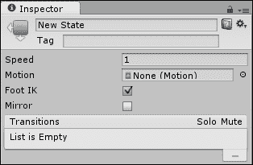

    +   在顶部，有一个文本框用于更改状态的名称。

    +   在下面，你可以添加一个标签以用于组织目的。

    +   接下来，有一个**速度**字段。这个字段控制动画的速度。

    +   **运动**字段是我们将添加到之前创建的动画剪辑的连接的地方。

    +   **脚部逆运动学（Foot IK）**选项让我们决定是否希望部分动画使用逆运动学（IK）来计算。我们没有为这些动画设置任何 IK，所以我们不需要担心这个选项。

    +   最后一个选项，**镜像**，用于翻转动画的左右（或 x 轴）。如果你创建了一个右手挥动的动画，这个选项将允许你将其更改为左手挥动的动画。

    +   在下面，是从这个状态到另一个状态的转换列表。这些是从状态中出来的转换，而不是进入状态。正如你很快就会看到的，列表中的转换会显示为当前状态的名称，右侧有一个箭头，后面跟着它连接到的状态的名称。

    +   在右侧的**独奏**和**静音**标签下也有复选框。这些用于调试状态之间的转换。一次可以有任意数量的转换被静音，但一次只能有一个被独奏。当一个转换被静音时，这意味着状态机在决定要执行哪个转换时会忽略它。勾选独奏框等同于静音除了一个以外的所有转换。这只是一个快速将其设置为唯一活动转换的方法。

1.  我们需要为每个目标动画创建一个状态。因此，创建五个更多状态，并将所有六个状态重命名为与我们之前创建的动画剪辑名称相匹配。默认状态，即橙色状态，应命名为`Idle_Retract`。

1.  在**项目**窗口中，点击**目标**模型左侧的小三角形。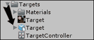

    +   这扩展了模型，因此我们可以在 Unity 中看到构成该模型的所有对象。第一个组，如每个对象旁边的小缩略图所示，是原始网格数据。接下来是一个 Avatar 对象；这是跟踪**绑定**设置的地方。在其下方，是动画剪辑对象；这是我们目前感兴趣的对象。构成模型的对象位于堆栈底部。

1.  在**Animator**窗口中选择每个状态，并通过将动画剪辑从**Project**窗口拖动到**Inspector**窗口中的**Motion**字段来与之配对。

    ### 小贴士

    动画剪辑的缩略图看起来像一个小播放按钮。

    

1.  在我们可以创建过渡之前，我们需要一些参数。单击窗口左下角的**Parameters**旁边的**+**按钮，并从出现的菜单中选择**Float**。现在列表中应该出现一个新的参数。

1.  左侧的新字段是参数的名称；将此重命名为`time`。右侧字段是此参数的当前值。在调试状态机时，我们可以在此处修改这些值以触发状态机中的变化。游戏运行期间脚本所做的任何更改也将显示在此处。

1.  我们还需要两个更多参数。创建两个布尔参数，并将它们重命名为`wasHit`和`inTheFront`。这些将触发机器改变到被击中的状态，而`time`参数将触发机器利用`extend`和`retract`状态。

1.  要创建新的过渡，右键单击一个状态，并从弹出的菜单中选择**Make Transition**。现在从状态到鼠标连接了一条过渡线。要完成过渡创建，请单击您希望连接到的状态。线上有一个箭头，指示过渡的方向。

    1.  我们需要一个从`Idle_Retract`到`Extend`的过渡。

    1.  我们还需要从`Extend`到`Idle_Extend`的过渡。

    1.  `Idle_Extend`需要三个过渡，每个分别过渡到`Retract`、`Hit_Front`和`Hit_Back`。

    1.  `Retract`、`Hit_Front`和`Hit_Back`需要过渡到`Idle_Retract`。

        ### 小贴士

        使用以下图表进行参考。如果您创建了一个不想要的过渡或状态，请选择它，然后按键盘上的*Delete*键将其删除。

        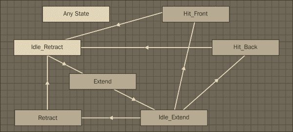

1.  如果您单击一条过渡线，那么我们可以查看其设置。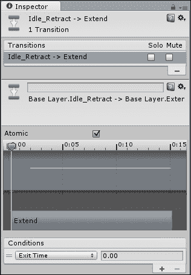

    +   在**Inspector**窗口的顶部，我们有与状态中相同的指示器，显示我们正在过渡到哪个状态，过渡开始时的状态名称后面跟着一个箭头，最后是过渡结束时的状态名称。

    +   在熟悉的**转换**列表下方，有一个文本字段，我们可以为我们的转换指定特定的名称。如果我们有几种不同类型的转换在相同两个状态之间，这将很有用。

    +   在字段直接下方，有一个更精确的基于路径的指示，显示转换涉及哪些状态。

    +   **原子**复选框允许我们决定一个转换是否可以被中断。如果勾选了**原子**，则不能被中断。

        在关于**任何状态**选项和死亡状态的例子中，也许我们在拔剑时被击中，从空闲状态转换到攻击状态。如果我们想避免在倒下之前完成拔剑的奇怪情况，这个转换就不能是原子的。

    +   接下来是一个时间线块，它让我们可以预览动画之间的转换。通过左右拖动小旗，我们可以在下面的**预览**窗口中查看转换。这个块的上半部分包含波形，表示动画中包含的运动。下半部分以框的形式显示状态，表示转换实际发生的位置。这两个框中的任何一个都可以拖动以改变转换的长度。

        ### 小贴士

        由于我们的两个空闲动画长度可以忽略不计，这在我们正常的设置中是看不到的。如果你临时在`extend`和`retract`状态之间创建一个转换，它就会变得可见。

    +   最后，我们有一个**条件**列表。使用我们设置的参数，我们可以在其中创建任何数量的条件，这些条件必须满足才能进行此转换。

        默认条件是**退出时间**。这意味着，当第一个状态达到其动画的某个百分比时（由右侧的浮点字段定义），它将开始转换到下一个状态。对于我们的转换的一半，这是我们想要的。另一半，即任何退出空闲状态的情况，需要基于我们的参数。

        ### 小贴士

        在**检查器**面板的底部还有一个另一个**预览**窗口。它的工作方式与动画导入设置页面上的窗口相同，但这个窗口播放两个相关动画之间的转换。

1.  选择`Idle_Retract`状态和`Extend`状态之间的转换。我们希望目标随机弹出。这将由一个修改`time`参数的脚本控制。

1.  点击**条件**列表下的`Exit Time`，以显示参数列表并从列表中选择时间。

1.  为了将浮点值转换为条件语句，我们需要将其与另一个值进行比较。这就是为什么当我们选择参数时，我们得到了一个新的比较选项下拉按钮。浮点值将大于或小于右侧的值。我们的时间将倒计时，因此从列表中选择**小于**，并将值保留为零。

1.  将`Idle_Extend`和`Retract`状态之间的转换条件改为相同。

1.  在`Idle_Extend`状态和`Hit_Front`状态之间的转换，我们将使用之前创建的两个布尔参数。选择转换，然后在**条件**下的**+**按钮上点击，添加第二个条件。

1.  对于第一个条件，选择**wasHit**，对于第二个条件选择**inTheFront**。

1.  布尔值要么是 true，要么是 false。在转换的情况下，它需要知道它正在等待哪个值。对于这个转换，两个都应该保持为 true。

1.  接下来，设置`Idle_Extend`和`Hit_Back`之间的转换条件，就像你为之前的转换所做的那样。区别在于，在`inTheFront`条件旁边的下拉列表中需要选择**false**。

## *刚才发生了什么？*

我们创建了一个状态机，它将被我们的目标使用。通过将每个状态链接到动画并将它们通过转换连接起来，目标将能够在动画之间切换。这种转换是通过添加条件和参数来控制的。

# 行动时间 - 编写目标脚本

在我们完成组装目标之前，我们只需要再添加一个部件。

1.  那个部件是一个脚本。在我们的`Scripts`文件夹中创建一个新的脚本，并将其命名为`Target`。

1.  首先，为了与我们的状态机交互，我们需要一个对`Animator`组件的引用。这个组件是你从坦克和城市中移除的。`Animator`组件是将所有动画片段连接在一起的关键。

    ```java
    public Animator animator;
    ```

1.  紧接着是两个浮点值，它们将决定我们的目标在空闲状态中停留的时间范围，单位是秒。

    ```java
    public float maxIdleTime = 10f;
    public float minIdleTime = 3f;
    ```

1.  接下来，我们有三个值将保存我们需要更改的参数的 ID 号。技术上讲，我们可以直接使用参数的名称来设置它们，但使用 ID 号要快得多。

    ```java
    private int timeId = -1;
    private int wasHitId = -1;
    private int inTheFrontId = -1;
    ```

1.  最后两个变量将保存两个空闲状态的 ID 号。我们需要这些来检查我们处于哪个状态。所有的 ID 最初都设置为`-1`作为占位符，我们使用以下函数将它们设置为实际值：

    ```java
    private int idleRetractId = -1;
    private int idleExtendId = -1;
    ```

1.  `Awake`函数是 Unity 中的一个特殊函数，它在游戏开始时对每个脚本进行调用。它的目的是在游戏开始之前进行初始化，非常适合最初设置我们的 ID 值。对于每个 ID，我们调用`Animator.StringToHash`函数。这个函数计算我们给出的参数或状态的 ID 号。状态名称也需要以`Base Layer`为前缀。这是因为 Unity 希望我们在可能存在具有相同名称的多个不同层的状态时，能够具体指定。此外，这里的名字必须与**Animator**窗口中的名字完全匹配。如果不匹配，ID 将不会匹配，将发生错误，脚本将无法正确运行。

    ```java
    public void Awake() {
      timeId = Animator.StringToHash("time");
      wasHitId = Animator.StringToHash("wasHit");
      inTheFrontId = Animator.StringToHash("inTheFront");
      idleRetractId = Animator.StringToHash("Base Layer.Idle_Retract");
      idleExtendId = Animator.StringToHash("Base Layer.Idle_Extend");
    }
    ```

1.  为了使用所有这些 ID，我们转向我们的好朋友——`Update`函数。在函数的开始部分，我们使用`GetCurrentAnimatorStateInfo`函数来确定当前是哪个状态。我们传递一个零，因为它想知道我们正在查询的层的索引，而我们只有一个。该函数返回一个包含当前状态信息的对象，我们立即抓取这个状态的`nameHash`值（也称为 ID 值），并将我们的变量设置为它。

    ```java
    public void Update() {
      int currentStateId = animator.GetCurrentAnimatorStateInfo(0).nameHash;
    ```

1.  下一行代码是与空闲状态 ID 的比较，以确定我们是否处于这些状态之一。如果我们处于这些状态，我们将调用`SubtractTime`函数（我们将在稍后编写）来减少`time`参数。

    ```java
      if(currentStateId == idleRetractId || currentStateId == idleExtendId) {
        SubtractTime();
      }
    ```

1.  如果目标当前不在其空闲状态之一，我们首先检查是否被击中。如果是，我们使用`ClearHit`函数清除击中，并使用`ResetTime`函数重置`time`参数。这两个函数也将很快被编写。最后，我们检查计时器是否已经低于零。如果是这种情况，我们再次重置计时器。

    ```java
      else {
        if(animator.GetBool(wasHitId)) {
          ClearHit();
          ResetTime();
        }

        if(animator.GetFloat(timeId) < 0) {
          ResetTime();
        }
      }
    }
    ```

1.  在`SubtractTime`函数中，我们使用`Animator`组件的`GetFloat`函数来检索一个浮点参数的值。通过传递我们的`timeId`变量，我们可以接收到`time`参数的当前值。就像我们对坦克所做的那样，我们接着使用`Time.deltaTime`来与我们的帧率保持同步，并从计时器中减去时间。一旦完成，我们需要将新的值提供给状态机，这是通过`SetFloat`函数完成的。我们通过给它一个 ID 值来告诉它要更改哪个参数，并通过给它我们的新时间值来告诉它更改成什么。

    ```java
    public void SubtractTime() {
      float curTime = animator.GetFloat(timeId);
      curTime -= Time.deltaTime;
      animator.SetFloat(timeId, curTime);
    }
    ```

1.  下一个要创建的函数是`ClearHit`。这个函数使用`Animator`组件的`SetBool`来设置布尔参数。它的工作方式与`SetFloat`函数相同。我们只需给它一个 ID 和一个值。在这种情况下，我们将两个布尔参数都设置为 false，这样状态机就不再认为它被击中了。

    ```java
    public void ClearHit() {
      animator.SetBool(wasHitId, false);
      animator.SetBool(inTheFrontId, false);
    }
    ```

1.  脚本中的最后一个函数是`ResetTime`。这是一个快速函数。首先，我们使用`Random.Range`函数来获取一个随机值。通过传递一个最小值和一个最大值，我们的新随机数将在这两个值之间。最后，我们使用`SetFloat`函数给状态机提供新的值。

    ```java
    public void ResetTime() {
      float newTime = Random.Range(minIdleTime, maxIdleTime);
      animator.SetFloat(timeId, newTime);
    }
    ```

## *刚才发生了什么？*

我们创建了一个脚本来控制目标的状态机。为了比较状态和设置参数，我们收集并使用了 ID。现在，不要担心击中状态何时被激活。在接下来的章节中，当我们最终让坦克射击时，将会明确说明。

## 创建预制体

现在我们已经有了模型、动画、状态机和脚本，最后是时候创建目标并将其转换为预制体了。

# 行动时间 - 创建目标

我们已经拥有了所有部件；下一步是将它们组合起来。

1.  首先，将**目标**模型从**项目**窗口拖动到**层次结构**窗口。这将在`target`对象中创建一个新的实例。

1.  通过选择新的`target`对象，我们可以看到它已经附加了一个`Animator`组件；我们只需要添加一个对`AnimatorController`的引用。这样做是通过从**项目**窗口将`TargetController`拖动到 Animator 组件的**控制器**字段，就像我们迄今为止设置的所有其他对象引用一样。

1.  此外，我们还需要将`Target`脚本添加到对象中，并将其相关字段中的`Animator`组件的引用连接起来。

1.  对目标对象进行的最后一项操作是添加一个碰撞器以实际接收我们的炮弹射击。不幸的是，因为`target`对象使用骨骼和绑定进行动画，所以直接将碰撞器添加到我们将要射击的网格并不简单。相反，我们需要创建一个新的空`GameObject`。

1.  将其重命名为`TargetCollider`，并使其成为目标对象的`Bone_Target`骨骼的子对象。

1.  向新的`GameObject`添加一个`MeshCollider`组件。

1.  现在，我们需要提供一些网格数据。在**项目**窗口中找到`Target`网格数据，位于**目标**模型下方。将其拖动到`MeshCollider`组件的**网格**值。这将在**场景**视图中出现一个绿色的圆柱体。这是我们碰撞的，但实际上它不在目标上。

    ### 小贴士

    **项目**窗口中的许多对象可以通过每个旁边的符号轻松区分。网格的符号是一个灰色和蓝色的网格。

    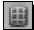

1.  使用**变换**组件将 GameObject 的位置设置为**X**值为`4`，**Y**和**Z**值都为`0`。旋转需要更改为**X**值为`0`，**Y**值为`-90`，**Z**值为`90`。

1.  在我们进行更改时，你可能已经注意到所有新或更改的内容的字体都变成了粗体。这是为了表明与原始预制件实例相比，这个预制件实例有所不同。记住，模型本质上就是预制件；它们的问题是我们不能直接进行更改，例如添加脚本。要将这个目标变成一个新的预制件，只需将其从**层次结构**窗口拖动，并将其放在**项目**窗口中的`Prefabs`文件夹上即可。

1.  使用这个新创建的预制件，用它在城市中填充。

1.  在放置所有这些目标时，你可能注意到它们有点大。我们不需要单独编辑每个目标，甚至作为一组编辑所有目标，我们只需要对原始预制进行更改。在 **Project** 窗口中选择 `Target` 预制。**Inspector** 窗口显示与场景中任何其他对象相同的信息。选择我们的预制后，其一半的缩放和场景中所有已存在的实例将自动更新以匹配。我们还可以更改最小和最大空闲时间，并使其影响整个场景。

## *发生了什么？*

我们刚刚完成了坦克的目标创建。通过使用 Unity 的预制系统，我们也能够在整个游戏中复制目标，并轻松地对它们进行影响所有实例的更改。

如果你想让其中一个目标比其他所有目标都大，你可以在场景中更改它。对预制实例所做的任何更改都会被保存，并且它们会优先于对根预制对象所做的更改。此外，当在 **Inspector** 窗口中查看实例时，窗口顶部将出现三个新按钮。**Select** 按钮在 **Project** 窗口中选择根预制对象。**Revert** 将移除对此实例所做的任何独特更改，而 **Apply** 按钮将使用在此实例中做出的所有更改更新根对象。

## 英雄试炼 - 更多目标

利用你所学的关于动画和状态机的知识，你的挑战是创建第二种目标类型。尝试不同的运动和行为。也许，创建一个从摇摆不定过渡到静止不动的目标。

# 光线追踪射击

现在开始玩游戏；这相当酷。我们有可驾驶的坦克和纹理化的城市。我们甚至还有花哨的动画目标。我们只是缺少一件事：我们如何射击？我们需要再编写一个脚本，然后我们可以尽情射击目标。

# 行动时间 - 简单射击

通过添加一个对象和单个脚本，我们可以开始射击目标。

1.  首先，我们需要在我们的坦克中添加一个空的 `GameObject`。将其重命名为 `MuzzlePoint` 并使其成为炮塔旋转点的子对象。完成后，将其放置在炮管末端，使蓝色箭头指向远离坦克的方向，与炮管方向一致。这将是我们子弹的发射点。

1.  我们还需要一些东西来指示我们射击的位置。爆炸将在未来的章节中介绍，所以从 **Create Other** 菜单中选择 **Sphere** 并将其重命名为 `TargetPoint`。

1.  将球体的缩放设置为每个轴的 `0.2` 并赋予它红色材质。这样它更容易被看到，同时又不会过于显眼。

1.  从 `TargetPoint` 中移除 `SphereCollider` 组件。必须移除 `SphereCollider` 组件，因为我们不想射击自己的目标指示器。

1.  现在，创建一个新的脚本并将其命名为 `FireControls`。

1.  这应该开始让你感到熟悉。我们首先使用变量来保存对刚刚创建的枪口和目标对象的引用。随后是一个 `OnGUI` 函数，它在屏幕的右下角绘制一个按钮，就在我们绘制炮塔控制按钮的上方。如果按钮被按下，我们将调用我们接下来要创建的 `Fire` 函数。

    ```java
    public Transform muzzlePoint;
    public Transform targetPoint;

    public void OnGUI() {
      Rect fire = new Rect(Screen.width – 70, Screen.height – 220, 50, 50);
      if(GUI.Button(fire, "Fire")) {
        Fire();
      }
    }
    ```

1.  `Fire` 函数首先定义了一个变量，该变量将保存关于射击细节的详细信息。随后是一个 `if` 语句，用于检查 `Physics.Raycast` 函数。`Raycast` 函数的工作原理就像开枪一样。我们从一个位置（枪口点的位置）开始，指向一个特定的方向（相对于枪口点的正向），然后获取被击中的物体。如果我们击中了某个物体，`if` 语句的结果为真；否则为假，我们会跳过。当我们击中某个物体时，我们首先将我们的目标点移动到被击中的点。然后我们使用 `SendMessage` 函数通知被击中的物体它已被击中。`SendMessage` 函数仅适用于 `GameObjects` 和 `MonoBehaviours`，而我们的 `Target` 脚本位于目标根对象上，因此使用 `hit.transform.root.gameObject` 来获取被击中的 `GameObject`。`SendMessage` 函数接受一个函数的名称，并尝试在发送消息的 `GameObject` 上找到该函数。我们还提供了一个值，`hit.point`，以提供给应该找到的函数。`SendMessageOptions.DontRequireReceiver` 这行代码的目的是防止函数在无法找到所需函数时抛出错误。我们 `Fire` 函数的最后一部分发生在我们没有击中任何物体的情况下。我们将目标点送回到世界原点，这样玩家就可以知道他们错过了所有物体。

    ```java
    public void Fire() {
      RaycastHit hit;
      if(Physics.Raycast(muzzlePoint.position, muzzlePoint.forward, out hit)) {
        targetPoint.position = hit.point;
        hit.transform.root.gameObject.SendMessage("Hit", hit.point, SendMessageOptions.DontRequireReceiver);
      }
      else {
        targetPoint.position = Vector3.zero;
      }
    }
    ```

1.  最后要做的事情是将 `Hit` 函数添加到我们的 `Target` 脚本末尾。我们像在脚本中之前做的那样，首先获取当前状态 ID。然而，这次我们只检查扩展的空闲 ID。如果它们不匹配，我们使用 `return` 退出函数。我们这样做是因为我们不希望让玩家射击任何倒下或处于过渡中的目标。如果我们的状态正确，我们继续通过使用 `SetBool` 函数告诉动画我们被击中。

    ```java
    public void Hit(Vector3 point) {
      int currentStateId = animator.GetCurrentAnimatorStateInfo(0).nameHash;
      if(currentStateId != idleExtendId) return;
      animator.SetBool(wasHitId, true);
    ```

1.  `Hit`函数的其余部分负责确定目标被击中的哪一侧。为此，我们首先需要将我们从世界空间收到的点转换为局部空间。我们**Transform**组件中的`InverseTransformPoint`函数很好地完成了这项工作。然后我们检查射击的来源。由于目标的结构方式，如果射击在 x 轴上是正的，那么它来自后方。否则，它来自前方。无论哪种情况，我们都将状态机中的`inTheFront`参数设置为适当的值。然后我们通过增加我们在本章开头创建的`ScoreCounter`脚本中的静态变量来给玩家一些分数。

    ```java
    Vector3 localPoint = transform.InverseTransformPoint(point);
      if(localPoint.x > 0) {
        animator.SetBool(inTheFrontId, false);
        ScoreCounter.score += 5;
      }
      else {
        animator.SetBool(inTheFrontId, true);
        ScoreCounter.score += 10;
      }
    }
    ```

1.  最后，务必将新的`FireControls`脚本添加到坦克中。同时，你需要连接到`MuzzelPoint`和`TargetPoint`对象的引用。

## *刚才发生了什么？*

我们创建了一个脚本，允许我们发射坦克的大炮。使用光线追踪的方法是最简单也是最广泛使用的。一般来说，子弹飞得太快，我们看不到它们。光线追踪就是这样，即；它是瞬间的。然而，这种方法并没有考虑到重力，或者任何可能改变子弹方向的其它因素。

## 尝试一下英雄 - 更好的 GUI

现在所有的按钮和组件都已经就位，让它们看起来更好。使用你在上一章中学到的技能来设计 GUI，使其变得出色。也许你甚至可以创建一个方向垫来控制移动。

# 摘要

就这样！这一章很长，我们学到了很多。我们导入了网格并设置了一个坦克。我们创建了材质，以便为城市添加颜色。我们还对一些目标进行了动画处理，并学习了如何击落它们。内容很多，现在是休息的时候了。玩游戏，射击目标，并收集那些分数。项目已经全部完成，准备好构建到你的设备上了。构建过程与之前的两个项目相同，所以享受乐趣吧！

下一章将介绍特殊相机效果和照明。我们将学习关于灯光及其类型的内容。我们的坦克战斗游戏将通过添加天空盒和几个灯光来扩展。我们还将查看距离雾。随着阴影和光照贴图的添加，我们将战斗的城市开始变得有趣和动态。
