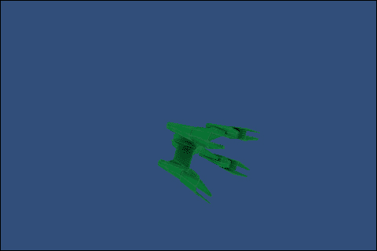
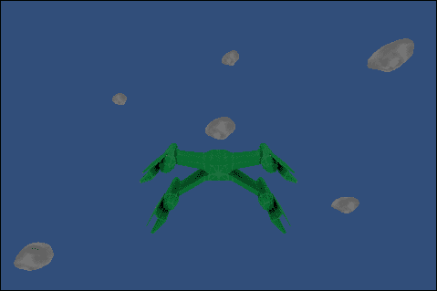
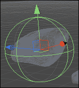
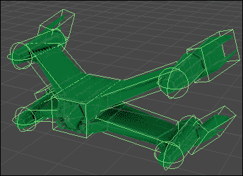
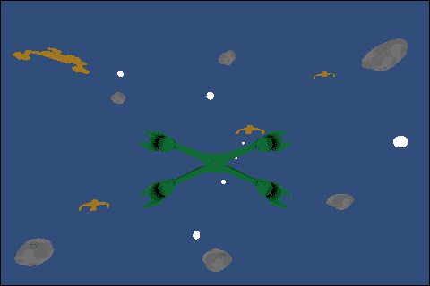
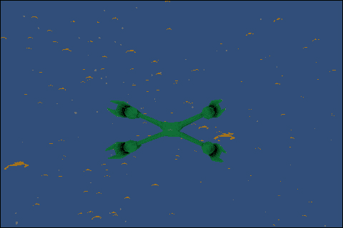

# 第六章. 移动设备的特性 - 触摸和倾斜

*在前一章中，我们学习了路径查找和人工智能。我们将坦克战斗游戏扩展到包括敌方坦克。我们为它们创建了出生点，并让它们向玩家开火。利用 Unity 的路径查找系统，我们让坦克追逐玩家。此外，玩家还被赋予了摧毁坦克的能力。一旦摧毁，玩家将获得一些分数，并生成一个新的敌方坦克。*

*在本章中，我们开始着手制作一个新游戏，同时探索移动设备的特性。我们将创建一个太空战斗机游戏。玩家将控制一艘太空船，摧毁敌方飞船、地雷和小行星以获得分数。为了控制他们的飞船，玩家必须倾斜移动设备。为了射击，玩家需要在屏幕上触摸他们希望激光束击中的位置。*

在本章中，我们将涵盖以下主题：

+   触摸控制

+   倾斜控制

我们将为本章创建一个新的项目，所以启动 Unity，我们将开始。

# 设置

与每个项目一样，我们需要做一些准备工作来准备我们的开发环境。别担心，本章的设置简单直接。

# 行动时间 - 创建项目

让我们开始吧。第一步当然是启动 Unity 并创建一个新的项目。将项目命名为`Ch6_SpaceFighter`将是一个不错的选择：

1.  一旦 Unity 完成初始化，这就是设置我们的构建设置的绝佳机会。打开**构建设置**窗口，从平台列表中选择**Android**，然后点击**切换平台**以更改目标平台。

1.  在**构建设置**窗口中，选择**玩家设置**以在**检查器**中打开玩家设置。调整**公司名称**、**产品名称**，尤其是**包标识符**。

1.  我们需要创建几个文件夹以保持项目有序。在**项目**窗口中创建`Scripts`、`Models`和`Prefabs`文件夹。

1.  我们现在需要导入这个项目的资源。我们需要一个玩家飞船、一个敌方飞船、一个爆炸性地雷和一些小行星。幸运的是，所有这些都已经准备好，并且在本章的起始资源中可用。将`PlayerShip.blend`、`PlayerShip.png`、`EnemyShip.blend`、`EnemyShip.png`、`Asteroid.blend`、`Asteroid.png`、`SpaceMine.blend`和`SpaceMine.png`导入你刚刚创建的`Models`文件夹中。

## *刚才发生了什么？*

我们刚刚完成了本章项目的设置。再次强调，在项目开始时付出一点努力将节省时间和挫折。特别是，随着项目规模的扩大，最初的组织变得最为重要。

# 倾斜控制

现代移动设备拥有广泛的各种内部传感器，用于检测和提供有关周围世界的信息。尽管你可能没有这样想过，但你肯定最熟悉用于打电话的麦克风和扬声器。有一个 Wi-Fi 接收器用于连接互联网，还有一个相机用于拍照。你的设备几乎肯定有一个磁力计，与 GPS 一起工作以提供方向。

目前我们感兴趣的是**陀螺仪**这个传感器。这个传感器可以检测设备的局部旋转。通常，它被用来确定设备的方向。我们将用它来控制我们的飞船。当用户左右倾斜设备时，他们的飞船将向侧面转动。当设备上下倾斜时，飞船将上下移动。

# 行动时间 - 控制飞船

为了控制我们的飞船，我们需要创建一个单独的脚本并将其应用到我们的飞船上：

1.  为了开始这个过程，创建一个新的脚本并将其命名为`TiltSteering`。

1.  就像我们所有的其他脚本一样，我们将从这个脚本开始，设置几个变量。前两个变量控制飞船旋转的速度，当设备倾斜时。接下来的两个变量将被用来限制飞船的旋转。这些将决定玩家飞船可以转动的圆圈有多紧。

    ```java
    public float horizRotateSpeed = 7f;
    public float vertRotateSpeed = 3f;

    public float horizMax = 60f;
    public float vertMax = 45f;
    ```

1.  接下来，我们将使用`Update`函数。我们首先创建一个变量来存储飞船当前的旋转。然后，我们必须调整旋转。当使用欧拉旋转时，Unity 会将值调整为介于 0 到 360 之间。这样，值永远不会是负数。任何小于 0 的值都会简单地绕过并从 360 开始倒数；任何大于 360 的值都会回到起点，再次从 0 开始计数。我们需要负值。所以，如果旋转的部分超过 180 度，我们就减去 360 度来确定它们的负值。此外，我们不对 z 分量进行调整，因为飞船不会围绕其前进轴旋转。

    ```java
    public void Update() {
      Vector3 rotation = transform.eulerAngles;

      if(rotation.y > 180f) rotation.y -= 360f;
      if(rotation.x > 180f) rotation.x -= 360f;
    ```

1.  接下来，我们应用加速度计的测量值。当设备水平持有时，主页按钮在右侧，屏幕朝向用户，x 分量保持设备面向用户时的旋转。z 分量保持屏幕上下倾斜时的旋转。这些分量乘以它们各自的速度并加到旋转上。y 旋转控制左右指向，而 x 分量控制上下指向。然而，z 加速度与飞船应该旋转的方向相反，所以我们取其负值。

    ```java
    rotation.y += Input.acceleration.x * horizRotateSpeed;
    rotation.x += -Input.acceleration.z * vertRotateSpeed;
    ```

1.  在应用加速度之后，我们需要限制旋转，以便飞船不会旋转得太远。我们使用`Mathf.Clamp`函数来限制旋转分量在最大值的负数和最大相关值之间。

    ```java
    rotation.y = Mathf.Clamp(rotation.y, -horizMax, horizMax);
    rotation.x = Mathf.Clamp(rotation.x, -vertMax, vertMax);
    ```

1.  最后，我们将旋转应用到飞船的变换上，并关闭脚本的函数。

    ```java
      transform.eulerAngles = rotation;
    }
    ```

1.  为了使用我们新的脚本，我们需要为玩家的飞船做一些设置。首先创建一个空的**GameObject**，并将其位置设置为零。将其重命名为`PlayerShipPivot`。这将使我们能够独立控制玩家的飞船的运动和外观。

1.  从**项目**窗口拖动你的`PlayerShip`模型，并将其放在我们刚刚创建的支点上。确保你的船体在点上居中，并旋转它使其沿 z 轴朝前。

1.  你现在可以将脚本添加到支点。

1.  这时，拥有 Unity Remote 尤为重要。将你的设备连接并运行 Unity Remote 后，你可以举起它并控制船体。随意调整旋转速度和限制，直到找到感觉自然的控制设置。

1.  我们需要能够看到船体之外，这样我们才能在飞向目标时射击。调整摄像机的位置，使船体在水平方向上居中，并且略低于中心。

1.  场景还需要稍微照亮。在太空中，光线通常非常普遍，所以我们只需调整环境光即可。点击 Unity 菜单栏中的**编辑**，然后点击**渲染设置**。通过将**环境光**设置为白色，我们的场景将足够明亮，可以看清一切。

1.  一切设置就绪后，务必保存场景。将其命名为`SpaceFighter`。

## *刚才发生了什么？*

我们利用加速度计来提供太空船的转向控制。通过测量玩家如何倾斜他们的设备，我们能够相应地旋转船体。我们没有让船体实际移动，只是在原地旋转。我们很快就会明白为什么。

## 在太空中移动物体

你可能的第一反应是直接改变船体的位置。然而，当物体离世界原点非常远时，事情会变得奇怪。在编程中，实际上变量可以持有的数字大小是有限制的。这个限制导致当顶点位置变得过大时，渲染系统开始失败，导致模型扭曲到无法识别。诚然，我们谈论的是数以万计甚至更多的位置值。然而，假设玩家一直直线飞行很长时间，最终他们可能会达到这种扭曲的距离。

作为一种可能的解决方案，我们可以强制玩家转向，或停止他们的前进，或将他们的位置包裹起来，使他们从有限空间的另一侧继续飞行。然而，在无限空间中飞行要有趣得多。我们可以通过将玩家的飞船保持在原地，并移动它周围的一切来实现这一点。当进入一个新的空间时，可以生成新的敌人和物体来填充空间。远离的旧物体和敌人可以通过在玩家看不到的地方移除它们来销毁。这将给人一种无限空间的感觉。

# 行动时间 - 飞行小行星

在我们的无限空间中，我们将首先避免的是小行星：

1.  为了让小行星工作，我们首先需要让玩家飞船的旋转和速度对小行星可用。为此，我们需要创建一个新的脚本，并将其命名为`PlayerShip`。

1.  同样，这个脚本从一组变量开始。第一个是玩家飞船的速度。空间中的小行星和其他物体将使用它来围绕玩家移动。第二个变量将保存对之前创建的`TiltSteering`脚本的引用。这将使我们能够访问飞船的旋转速度。最后一个变量是一个静态变量，它将保存对场景中存在的此脚本实例的引用。这将允许其他脚本访问此脚本存储的信息。我们使用`use`变量来指示其他脚本，这是他们应该访问的实例。

    ```java
    public float speed = 10f;
    public TiltSteering tilt;

    private static PlayerShip use;
    ```

1.  接下来，我们使用`Awake`函数。这个函数在游戏开始时自动调用，非常适合初始化。我们用它来简单地设置我们之前创建的`use`变量为脚本的当前实例。

    ```java
    public void Awake() {
      use = this;
    }
    ```

1.  下一个函数是为了提供给其他脚本玩家当前旋转信息。由于它是静态的，任何脚本都可以在任何时候调用它。该函数首先检查是否有对脚本当前实例的引用。如果找不到，则返回一个中性旋转，`Quaternion.identity`。否则，返回脚本实例附加的变换的旋转。

    ```java
    public static Quaternion GetRotation() {
      if(use == null) return Quaternion.identity;

      return use.transform.rotation;
    }
    ```

1.  这里的`Rotate`函数是用来模拟玩家移动的。这个函数接受传递给它的变换，并移动和旋转它，使其看起来像是玩家已经穿越了空间。与之前的`GetRotation`函数一样，它首先检查玩家的引用，如果没有找到，则不执行任何操作。

    ```java
    public static void Rotate(Transform other) {
      if(use == null) return;
    ```

1.  要围绕玩家的位置旋转小行星和其他任何东西，需要将当前的位置与玩家当前旋转的镜像相乘。为此，我们需要调整旋转以便正确地镜像。玩家的旋转的 Euler 角度被存储在变量中以供操作。然后我们将大于 180 的值进行移位，就像我们之前做的那样。然后旋转通过玩家飞船的旋转速度进行缩放。最后，它乘以帧速度以保持同步。

    ```java
    Vector3 euler = use.transform.eulerAngles;
    if(euler.x > 180f) euler.x -= 360f;
    if(euler.y > 180f) euler.y -= 360f;
    euler.Scale(new Vector3(use.tilt.vertRotateSpeed, use.tilt.horizRotateSpeed, 0));
    euler *= Time.deltaTime;
    ```

1.  我们将负 Euler 旋转（即镜像旋转）转换回四元数，并将其存储在变量中以供使用。

    ```java
    Quaternion mirror = Quaternion.Euler(-euler);
    ```

1.  然后将镜像旋转与传入对象的位置相乘，更新位置以使它围绕玩家旋转，就像他们正在转弯一样。然后玩家的旋转与一个面向前方的向量、玩家的速度以及最终帧速度相乘。所有这些从对象当前的位置中减去，以模仿玩家的前进运动。最后，传入对象的旋转与镜像旋转相乘以改变其方向。总的来说，这模拟了玩家的移动。

    ```java
    other.position = mirror * other.position;
    other.position -= playerRotation * Vector3.forward * use.speed * Time.deltaTime;
    other.rotation *= mirror;
    ```

1.  将脚本添加到之前创建的`PlayerShipPivot`对象上。确保连接`TiltSteering`引用。

1.  接下来，我们需要通过创建另一个脚本来使用这个脚本。将其命名为`Asteroid`。这个脚本将控制小行星在太空中飞行，并迫使玩家避开它。

1.  该脚本的变量前两个用于确定小行星在太空中飞行的随机速度。第三个变量将保存这个随机速度。最后一个变量将保存小行星在太空中飞行的随机方向。

    ```java
    public float minSpeed = 5f;
    public float maxSpeed = 10f;

    private float speed = 1f;
    private Vector3 direction = Vector3.forward;
    ```

1.  接下来，我们再次使用`Awake`函数进行初始化。任何位于半径为 1 的球面上的点本质上是一个指向随机方向的向量。因此，我们使用`Random.onUnitSphere`来为小行星找到随机方向。随后使用`Random.Range`和前两个变量来确定小行星飞行的随机速度。

    ```java
    public void Awake() {
      direction = Random.onUnitSphere;
      speed = Random.Range(minSpeed, maxSpeed);
    }
    ```

1.  该脚本的最后一个函数是`LateUpdate`。我们需要在小行星在玩家飞船更新其旋转之后移动；这就是为什么我们使用这个函数。函数的第一行使用我们为`PlayerShip`脚本创建的`GetRotation`函数，并将其存储在变量中以供使用。

    ```java
    public void LateUpdate() {
      Quaternion playerRotation = PlayerShip.GetRotation();
    ```

1.  接下来，我们调用`PlayerShip.Rotate`函数，并传入小行星的变换，这样小行星就可以被移动以模拟玩家的移动。

    ```java
    PlayerShip.Rotate(transform);
    ```

1.  下一行代码通过玩家的旋转来旋转小行星的运动方向，再次进行改变以模拟玩家的移动。位置再次通过调整方向后的小行星自身运动来更新。

    ```java
    direction = playerRotation * direction;
    transform.position += direction * speed * Time.deltaTime;
    ```

1.  函数和脚本通过检查小行星是否离玩家太远来完成。我们通过检查小行星位置的`sqrMagnitude`来实现这一点。向量的长度是其大小。对于位置向量，这是从中心点的距离。`sqrMagnitude`是向量大小的平方。这比计算速度更快，并且比较起来也很容易。我们只需要将其与所需值的平方进行比较。在这种情况下，大约 300 的最大距离，其平方为 100,000，将很好地满足我们的需求。如果你还记得数学课上的内容，1e5 与一个后面有五个零的 1 相同，即 1 百万。最后，如果小行星离得太远，它将被销毁。

    ```java
      if(transform.position.sqrMagnitude > 1e5) Destroy(gameObject);
    }
    ```

1.  为了测试这个脚本，我们需要一个小行星预制件。要创建它，首先将`Asteroid`模型添加到场景中，并删除三个网格中的两个。

1.  将脚本添加到模型中，并将其拖动到`Prefabs`文件夹中，将其转换为预制件。

## *发生了什么？*

我们创建了两个脚本和一个预制件。第一个脚本由玩家的飞船使用，用于将有关其旋转和速度的信息传递给其他脚本。第二个脚本控制游戏世界中小行星的运动。由于模型在极端距离下表现出的奇怪行为，玩家实际上从未移动。游戏世界及其中的所有对象都围绕着玩家移动。最后，我们创建了一个小行星预制件。尝试将几个预制件添加到场景中并尝试使用它们。尽管你的飞船实际上从未移动，但你仍然可以飞进、飞出并绕着它们飞行。

## 添加空间碰撞

在飞行过程中，你可能注意到你可以直接穿过小行星。为了让玩家能够击中它们，我们需要给玩家的飞船和小行星添加一些碰撞。这与坦克大战游戏中所做的是类似的。我们将在下一章中更详细地介绍碰撞的工作原理，但我们需要使用**Rigidbody**组件。它提供了对物理计算的访问权限，并允许我们将碰撞器分组以创建更复杂的碰撞形状。

# 行动时间 – 添加碰撞

我们需要给我们的太空对象添加一些碰撞能力，以便它们可以相互碰撞并被正确射击：

1.  让我们从给小行星添加碰撞开始。首先选择小行星的网格，并添加一个**MeshCollider**组件。这将使我们能够向小行星射击。

1.  接下来，选择包含我们的`Asteroid`脚本组件的相同对象。向对象添加一个**SphereCollider**组件，并将**半径**调整为略大于小行星。这个碰撞器将检测小行星是否与玩家相撞。

1.  **SphereCollider**需要勾选**Is Trigger**复选框。我们不是检查真正的碰撞，而是一个近似的碰撞。勾选此复选框后，对象将不再被碰撞体阻止，而是在对象进入碰撞体体积时在脚本中触发一个事件。当玩家进入碰撞体时，它将足够近，我们可以假设并作为它已经发生碰撞来行动。

1.  当你对更改满意时，一定要将它们应用到预制件上。否则，其他小行星将不会更新并且不可碰撞。

1.  为了检测玩家何时进入新的触发区域，我们需要在`Asteroid`脚本中添加一个简短的功能。我们在脚本的末尾添加一个`OnTriggerEnter`函数。当其中一个碰撞体进入另一个碰撞体时，物理系统会自动调用此函数。传递给它的碰撞体是与之发生碰撞的那个。然而，此函数仅在至少有一个对象附加了**Rigidbody**组件时才有效。我们将在第七章中详细讲解，*抛掷你的重量——物理和 2D 相机*，但 Rigidbody 组件实际上是连接对象到 Unity 物理引擎的，使我们的脚本能够访问`OnTrigger`和`OnCollision`函数组。我们将将其添加到玩家的飞船上。当函数被调用时，它只是简单地销毁小行星。

    ```java
    public void OnTriggerEnter(Collider other) {
      Destroy(gameObject);
    }
    ```

1.  接下来，我们需要为玩家的飞船添加碰撞。首先，将**Rigidbody**组件添加到我们之前创建的**PlayerShipPivot**GameObject 中。

1.  一定要检查新组件的**Is Kinematic**复选框。这告诉物理系统我们希望通过脚本控制对象的运动。如果没有勾选，飞船会在游戏开始时开始下落。

1.  **Rigidbody**组件的一个特性是它将**Hierarchy**中子对象的全部碰撞体视为单个碰撞形状的一部分。这样，我们能够使用几个简单且快速的碰撞体构建一个复杂的碰撞形状。通过创建一个空的**GameObject**并添加简单的碰撞体，我们将它们的大小和位置调整到覆盖玩家的飞船。务必确保将碰撞体对象设置为飞船的枢轴点的子对象。

## *刚才发生了什么？*

我们为小行星和玩家的飞船添加了碰撞。这给了玩家撞击并摧毁小行星的能力。我们利用触发碰撞体来近似小行星的碰撞。此外，我们还使用了 **Rigidbody** 组件，允许我们的飞船与其他场景中的物体相撞。此外，这还使我们能够利用 Unity 提供的简单碰撞体构建一个复杂的碰撞形状。虽然技术上可以使用 **MeshCollider** 来精确匹配飞船的形状，但这并不推荐。**Rigidbody** 和 **MeshCollider** 组件不太兼容。此外，几个简单的碰撞体比单个 **MeshCollider** 对计算机的计算要快得多。

## 尝试英雄 – 添加分数

能够让玩家飞船与小行星相撞是件好事，但从游戏的角度来看，这并没有什么意义。碰撞没有惩罚。这个挑战是让你实现一个类似于我们在上一章中使用的坦克大战游戏的计分系统。当玩家与小行星相撞时，从分数中减去一些分数。在 `OnTriggerEnter` 函数中使用其他碰撞体的 `SendMessage` 函数。不要仅仅在触发器进入时减分，因为（你稍后会发现）小行星不会只与玩家相撞。

## 创建敌船

在空间中飞来飞去，只有几颗小行星是很不错的，但这并不能构成一场战斗。这就是为什么我们要添加一个敌船，它会追逐并射击玩家。我们没有用于路径查找的网格，所以不能使用我们在上一章中学到的技术。然而，在太空中没有建筑物可以导航，所以追逐玩家将会简单得多。

# 行动时间 – 添加敌船

为了制作我们的敌船，我们需要一个脚本将敌船转换成预制体：

1.  我们需要做的第一件事是创建一个新的脚本，并将其命名为 `EnemyShip`。这个脚本将控制敌船的运动和射击。

1.  脚本开始时包含几个变量。前两个定义了飞船前进的速度和旋转的速度。

    ```java
    public float moveSpeed = 8f;
    public float turnSpeed = 0.5f;
    ```

1.  接下来的三个变量用于控制飞船的射击。首先是子弹发射的频率。其次是飞船必须处于的射程内才能射击玩家。第三个是一个用于存储自上次发射子弹以来经过时间的变量。这将与射击频率一起决定飞船何时可以再次射击。

    ```java
    public float fireRate = 1.5f;
    public float fireRange = 60f;
    private float fireTime = 0;
    ```

1.  最后两个变量将保存要发射的子弹预制体和子弹发射点的引用。这与我们在上一章中制作敌坦克射击的方式类似。区别在于太空游戏往往有很多激光束在飞行，迫使玩家躲避。

    ```java
    public GameObject bullet;
    public Transform muzzlePoint;
    ```

1.  在`Update`函数中，我们将执行实际射击的工作。它首先跟踪自上次发射子弹以来经过的时间。然后检查是否已经足够长的时间以来可以再次射击，如果不是，则退出函数。函数中的第三行代码检查范围。这完全是以我们检查小行星是否远离玩家的方式进行的。接下来，我们检查确保飞船指向玩家。这是以我们使敌舰坦克射击玩家的相同方式进行。通过比较前进方向与指向玩家的方向来检查角度。如果它足够接近地指向玩家，飞船就可以开始射击。射击是通过调用`Instantiate`函数来完成的。通过传递`muzzlePoint`变量的位置和旋转，新的子弹会自动旋转。将有一个单独的脚本处理子弹的运动。最后，将飞船上次射击的时间重置为零。

    ```java
    public void Update() {
      fireTime += Time.deltaTime;
      if(fireTime < fireRate) return;

      if(transform.position.sqrMagnitude > fireRange * fireRange) return;

      if(Vector3.Angle(transform.forward, -transform.position) > 10) return;

      Instantiate(bullet, muzzlePoint.position, muzzlePoint.rotation);
      fireTime = 0;
    }
    ```

1.  下一个函数是`LateUpdate`函数。我们将像对小行星那样使用这个函数。代码的第一行只是调用`PlayerShip`脚本以旋转和移动飞船，以模拟玩家的移动。

    ```java
    public void LateUpdate() {
      PlayerShip.Rotate(transform);
    ```

1.  下一行代码应用于飞船的运动。这个过程与我们如何在上一章中使敌舰炮塔旋转面对玩家相似。`step`变量用于指定飞船转向玩家的速度。我们使用`Slerp`函数改变飞船当前旋转以指向目标旋转。在这种情况下，旋转是朝向玩家的旋转。最后，飞船向前移动。总的来说，这会产生类似于汽车转向的运动。

    ```java
    float step = turnSpeed * Time.deltaTime;
    Quaternion toPlayer = Quaternion.LookRotation(-transform.position);
    transform.rotation = Quaternion.Slerp(transform.rotation, toPlayer, step);
    transform.position += transform.forward * moveSpeed * Time.deltaTime;
    ```

1.  函数和脚本的最后一个代码片段是检查飞船是否太远的检查。它与用于小行星的检查完全相同。

    ```java
      if(transform.position.sqrMagnitude > 1e5) Destroy(gameObject);
    }
    ```

1.  在我们可以组装我们的敌舰之前，我们需要编写一个更短的脚本。创建一个新的脚本并将其命名为`Bullet`。正如你可能猜到的，这是控制敌舰子弹运动的脚本。

1.  此脚本从单个变量开始，即子弹在空间中移动的速度。

    ```java
    public float speed = 20f;
    ```

1.  接下来，我们再次使用`LateUpdate`函数。这个函数首先使用`PlayerShip.Rotate`重新定位子弹，就像在游戏世界中所有其他对象一样。然后它以速度前进。最后，它检查是否超出范围。

    ```java
    public void LateUpdate() {
      PlayerShip.Rotate(transform);

      transform.position += transform.forward * speed * Time.deltaTime;
      if(transform.position.sqrMagnitude > 1e5) Destroy(gameObject);
    }
    ```

1.  脚本中的最后一个函数`OnTriggerEnter`与用于小行星的函数一样。如果子弹与飞船接触，它将自我销毁。

    ```java
    public void OnTriggerEnter(Collider other) {
      Destroy(gameObject);
    }
    ```

1.  现在我们有了脚本，下一步是创建敌舰和子弹预制体。要创建子弹，首先导航到**GameObject** | **Create Other** | **Sphere**。

1.  将新球体重命名为`Bullet`并将其缩放至原始大小的一半。

1.  接下来，将`Bullet`脚本添加到对象中，并确保在它的**SphereCollider**组件中勾选**Is Trigger**复选框。如果没有勾选该框，子弹将无法正常工作。

1.  最后，将对象拖动到`Prefabs`文件夹以将其转换为预制体。

1.  接下来，我们需要创建敌对飞船。首先创建一个空的**GameObject**并将其重命名为`EnemyShipPivot`。

1.  将`EnemyShip`模型的副本添加到场景中，并使其成为我们刚刚创建的枢轴点的子项。确保将其旋转以沿着 z 轴面向前方，并将其定位在枢轴点的中心。

1.  接下来，使用简单的碰撞体和空的**GameObject**为飞船创建一个碰撞形状。这与我们为玩家飞船所做的是一样的。确保将所有碰撞体作为敌对飞船的枢轴点的子项。

1.  我们需要创建一个炮口点并将其放置在敌对飞船的前面。就像我们为坦克所做的那样做。确保也将其作为船的枢轴点的子项。

1.  现在，将`EnemyShip`脚本和一个**Rigidbody**组件添加到枢轴点。

1.  几乎完成了。从**Hierarchy**窗口拖动炮口点并将其放置在**Inspector**中脚本组件的适当槽位。同时，从**Project**窗口拖动**Bullet**预制体到等待槽位。

1.  最后，将飞船拖动到**Hierarchy**窗口并将其放入`Prefabs`文件夹，使其成为一个预制体。

1.  在场景中添加几艘额外的飞船并尝试一下。

## *发生了什么？*

我们创建了一艘敌对飞船。飞船将在玩家之后飞行，并在进入射程时开始射击。就像小行星一样，它们围绕着玩家移动以模拟玩家的移动。然而，与随机方向移动不同，敌对飞船会转向玩家。通过减缓飞船转向的速度，它们以弧形移动而不是快速原地旋转。此外，由于敌对飞船附带的**Rigidbody**组件，它们可以与场景中的小行星相撞。

## 英雄试炼——天空盒和雾

现在我们有几个物体在太空中飞行，让场景看起来更好是个不错的主意。对于我们的坦克大战游戏，我们添加了一个天空盒，使场景看起来就像真的在一个星球上。然而，我们正在太空中飞行。挑战在于你找到或制作一个看起来像外太空的天空盒。此外，添加一些远处的雾气会在物体远离玩家时使其变得模糊。如果雾气是黑色的，它将看起来像物体被深空的黑暗吞噬。

# 触摸控制

现在我们已经在我们的空间场景中有几个物体在飞行，包括一些会射击玩家的物体，我们应该给玩家提供除了躲避之外的能力。现代移动设备最明显的特征之一就是触摸屏。这些设备使用用户的指尖的电导性和许多微小的接触点来确定被触摸的位置。Unity 为我们提供了访问触摸输入的便捷方式。通过将输入与射线投射相结合，就像我们为坦克射击所做的那样，我们可以确定用户在 3D 空间中触摸了哪个物体。对我们来说，这意味着我们可以给玩家提供射击并摧毁空间中物体的能力。

# 行动时间 - 触摸射击

为了利用触摸输入，我们需要在我们的玩家的飞船上添加一个单独的脚本：

1.  为了给玩家提供射击的能力，我们首先需要创建一个新的脚本，并将其命名为`TouchShoot`。

1.  这个脚本从单个变量开始。一个`LayerMask`用于选择性地用射线投射击中物体。实际上有很多层应该被击中。这个将用来确定玩家可以或不可以射击。

    ```java
    public LayerMask touchMask = -1;
    ```

1.  `Update`函数是这个脚本中唯一的函数。它从一个循环开始。`Input`类为我们提供了`touchCount`值，它只是一个计数器，用于计算当前有多少手指正在触摸设备屏幕。

    ```java
    public void Update() {
      for(int i=0;i<Input.touchCount;i++) {
    ```

1.  随着我们通过循环，我们使用`Input.GetTouch`函数来访问有关每个触摸的信息。这一行代码检查触摸的阶段。每个触摸有五个潜在的阶段：**开始**、**移动**、**静止**、**结束**和**取消**：

    ```java
    if(Input.GetTouch(i).phase == TouchPhase.Began) {
    ```

    +   **开始**：这个触摸阶段是当用户第一次触摸屏幕时。

    +   **移动**：这个触摸阶段是当用户在屏幕上移动他的/她的手指时。

    +   **静止**：这个触摸阶段是前一个阶段的相反；这是手指没有在屏幕上移动的时候。

    +   **结束**：这个触摸阶段是指手指从屏幕上抬起。这是触摸完成的正常方式。

    +   **取消**：这个触摸阶段是在跟踪触摸时发生错误时。这个阶段通常发生在手指触摸屏幕但长时间不移动的情况下。触摸系统并不完美，所以它假设它错过了手指从屏幕上抬起，并取消了这个触摸。

1.  接下来，我们创建了一对变量。第一个是一个`Ray`，它只是一个用于存储空间中的一个点和方向向量的容器。`ScreenPointToRay`函数是相机专门提供的，用于将触摸位置从屏幕的 2D 空间转换为游戏世界的 3D 空间。就像我们的坦克一样，第二个是一个用于存储我们的射线投射所击中的物体的容器。

    ```java
    Ray ray = Camera.main.ScreenPointToRay(Input.GetTouch(i).position);
    RaycastHit hit;
    ```

1.  函数的最后一步是调用`Raycast`函数。我们将射线和跟踪变量传递给函数。接下来，我们必须给它一个距离，最后是`LayerMask`。如果击中对象，它将被摧毁。此外，还需要几个花括号来关闭 if 语句、循环和函数。

    ```java
          if(Physics.Raycast(ray, out hit, Mathf.Infinity, touchMask)) {
            Destroy(hit.transform.gameObject);
          }
        }
      }
    }
    ```

1.  要尝试脚本，只需将其添加到**PlayerShipPivot**游戏对象中。小心。在此阶段，如果你在测试时触摸玩家的船，它将被摧毁。

1.  为了解决这个问题，我们需要创建一个新的层。首先，转到 Unity 的菜单栏，点击**编辑** | **项目设置** | **标签**。这是到达我们为坦克大战游戏创建层的同一位置的另一条路径。

1.  点击**用户层 8**的右侧，并在字段中输入`Player`。这将创建新的层。

1.  在**层次结构**窗口中选择**PlayerShipPivot**对象。

1.  在**检查器**窗口的右上角，从**层**下拉列表中选择我们刚刚创建的层。

1.  当 Unity 询问你是否要更改子对象时，确认你要这样做。

1.  对于`TouchShoot`脚本，从**触摸掩码**列表中取消选择新的层。这将允许玩家射击除自己之外的一切。

1.  我们还需要做最后一件事。转到 Unity 的菜单栏，点击**编辑** | **项目设置** | **物理**。这将在**检查器**窗口中打开一组新的控件，用于调整物理引擎的运行方式。

1.  目前，我们只关心**Raycasts Hit Triggers**复选框。取消选中它。如果不这样做，当玩家射击时，他们会击中围绕小行星的触发体积，而不是小行星本身。这对小行星来说不是一个大问题。但是，如果我们要创建某种东西，比如一个爆炸性地雷，触发体积会大得多。这将使射击地雷看起来非常奇怪。

## *刚才发生了什么？*

我们给了玩家在触摸屏幕时射击的能力。通过遍历触摸列表，玩家可以使用多个手指射击目标。相机提供的特殊`ScreenPointToRay`函数使我们能够将 2D 屏幕触摸转换为 3D 游戏世界交互。通过使用`LayerMask`，我们还防止玩家射击并摧毁自己。

## 尝试一下英雄 - 健康的船只

这里的挑战是给敌舰一些健康值。在我们上一章创建敌坦克时，我们让它们在被摧毁之前承受玩家的几发射击。在这里对敌舰做同样的事情。

## 空间生成

到目前为止，我们已经创建了一个允许玩家无限穿越空间的空间游戏。玩家实际上从未移动过；相反，场景中的对象围绕它移动，以模拟移动。我们有会随机在空间中飞行的陨石。我们还创建了追逐玩家并射击它们的敌舰。最后，我们有了射击并摧毁场景中对象的能力。然而，在这个阶段，我们很快就会用完可以射击的东西。要么它们离得太远，要么我们摧毁了它们。为了解决这个问题，我们现在将创建一个系统，它将在玩家周围随机生成所有这些对象。

# 行动时间 – 创建一个空间生成器

我们最后的脚本将填充我们的空间，并将附加到玩家的飞船上，因为它是游戏世界的中心：

1.  为了用对象填充我们的空间，我们需要创建另一个脚本。将其命名为 `SpaceSpawn`。

1.  我们开始时有两个变量。这两个变量定义了新对象将被生成的空间。它们将在最小范围之外但最大范围之内创建。

    ```java
    public float minRange = 200f;
    public float maxRange = 300f;
    ```

1.  接下来，我们有两个变量用于控制对象生成的频率。这些将与我们用于使敌舰向玩家射击的变量一样工作。

    ```java
    public float frequency = 0.3f;
    private float spawnTime = 0;
    ```

1.  此脚本的最后一个是数组。它只是一个可以生成的所有对象的列表。当我们返回 Unity 来设置它时，我们将稍后填充它。

    ```java
    public GameObject[] spawnList = new GameObject[0];
    ```

1.  `Update` 再次成为我们脚本的首选函数。我们首先确保列表中有要生成的东西。如果没有要生成的对象，就没有继续的必要。

    ```java
    public void Update() {
      if(spawnList.Length <= 0) return;
    ```

1.  接下来，我们追踪自上次生成以来经过的时间，并检查是否已经足够长，可以再次生成。同样，这就像射击敌舰一样工作。

    ```java
    spawnTime += Time.deltaTime;
    if(spawnTime < frequency) return;
    ```

1.  现在，我们需要确定在空间中生成下一个对象的位置。为此，我们首先使用 `Random.onUnitSphere` 来找到一个随机方向。然后，我们找到一个位于我们的最小和最大范围之间的随机距离。最后，它们被相乘，给我们一个位置。

    ```java
    Vector3 direction = Random.onUnitSphere;
    float distance = Random.Range(minRange, maxRange);
    Vector3 position = direction * distance;
    ```

1.  为了选择一个随机对象，我们使用 `Random.Range` 并将其传递给对象的列表长度。这将给我们列表中的一个槽位的索引。下一行代码确保槽位中有对象。如果没有，我们无法生成它。

    ```java
    int index = Random.Range(0, spawnList.Length);
    if(spawnList[index] == null) return;
    ```

1.  接下来，我们实际上使用我们的好朋友 `Instantiate` 函数来生成对象。我们将随机选择的对象、找到的位置以及最终的随机旋转传递给 `Instantiate` 函数。结果，对象在场景中被创建并放置到位。

    ```java
    Instantiate(spawnList[index], position, Random.rotation);
    ```

1.  最后，我们从时间跟踪器中减去 `frequency` 变量，以完成函数和脚本的编写。这将导致在每次频率滴答时发生生成，而不会丢失任何时间。

    ```java
      spawnTime -= frequency;
    }
    ```

1.  我们现在回到 Unity 中设置脚本。将其添加到`PlayerShipPivot`对象中。它在这里和其他任何地方一样都能正常工作。

1.  要填充列表，只需从**项目**窗口拖动你的预制体，并将其拖放到**检查器**窗口中的**Spawn List**上。字段左侧的小三角形将允许你展开列表并查看其中当前的内容。如果你想调整各种对象出现的概率，只需更改列表中它们的出现次数。没有任何东西阻止你将九个关于小行星预制体的引用放入列表中，而只有一个关于敌方飞船预制体的引用，这样飞船就有 10%的概率被生成。无论你选择什么，都要使用列表来设置对象概率，并至少包含我们创建的每个障碍物。

1.  最后，测试一下。按播放并飞来飞去，看看对象是如何生成并飞来飞去的。

## *刚才发生了什么？*

我们创建了一个系统，用于在太空中随机生成对象。首先，我们跟踪时间的方式与制作敌方飞船向玩家开火的方式相同。接下来，我们找到了一个随机方向和范围，以确定位置。之后，系统从列表中随机选择一个对象，并最终生成它。为了调整单个对象出现的概率，我们只需调整它在要生成的对象列表中出现的频率，相对于列表中的其他对象。

## 尝试英雄 - 更多生成和射击

本章的起始资产中还包括了两个更多的小行星网格和一个矿。使用这些，你可以创建更多要在游戏中生成的对象。矿也可以创建一个更大的触发体积。这将允许它在船只靠近时爆炸，而不仅仅是撞击它。如果你还有其他想法，至少可以让小行星在生成时随机选择一个比例。这将使小行星看起来更加多样化，尽管实际上只有几个。

此外，尝试创建另一艘或几艘船。也许其中一艘是运输船，它会逃离玩家。一个难度较高的例子是，当被摧毁时，船会分裂成两艘更小的船。或者，只需重新创建你最喜欢的科幻媒体中的宇宙飞船。在这个游戏中，宇宙是你的极限。

对于坦克战游戏，我们为玩家快速穿越城市创建了一个涡轮增压按钮。它对于逃离敌人也很有用。为太空战斗机实现它。这将有助于捕捉敌人和躲避子弹。

## 突击测验 - 理解 Android 组件

现代移动设备有许多部分，它们执行着各种各样的功能。了解它们是什么以及它们是如何协同工作的，是能够使用它们的第一步。以下陈述是真的还是假的？

Q1. 磁力计和加速度计协同工作，在地图上给出位置。

1.  真的

1.  假的

Q2. 陀螺仪检测设备的旋转和移动。

1.  真的

1.  假的

Q3. 触摸屏上的 2D 位置可以转换成游戏中的 3D 位置。

1.  真的

1.  假的

Q4. 哪一行代码能够将用户的触摸转换成游戏中的 3D 位置？

1.  `Camera.main.ScreenPointToRay(Input.GetTouch(0).position)`

1.  `Input.GetMouseButton(0)`

1.  `Camera.main.WorldToScreenPoint(Input.GetTouch(0).position)`

Q5. 哪一行代码能够给出设备的加速度？

1.  `Input.gyro`

1.  `Input.compass`

1.  `Input.acceleration`

# 摘要

在本章中，我们学习了现代移动设备的特性。我们创建了一个太空战斗机游戏来尝试这些特性。我们获得了访问设备的加速度计，以检测设备何时旋转。这使得我们的宇宙飞船能够被操控。我们还利用触摸屏，让玩家能够在游戏中射击敌人。因为我们想要无限的空间来飞行，所以我们不得不让玩家不动，而是让其他所有东西围绕玩家移动，以模拟玩家的移动。这也需要一个系统，能够持续在玩家周围生成新的敌人和障碍物，让我们能够继续飞行并找到新的东西来玩耍。

在下一章中，我们将暂时从太空战斗机游戏中休息一下。几乎可以肯定，市场上最受欢迎的移动游戏之一，愤怒的小鸟，是一种独特且不常见的游戏类型。为了学习 Unity 中的物理和 2D 风格游戏的可能性，我们将制作一个愤怒的小鸟克隆版。我们还将研究视差滚动来创建令人愉悦的背景。很快，我们将创建所有你一直希望能够玩到的愤怒的小鸟关卡。
