# 第八章. 特效 – 声音和粒子

*在前一章中，我们从我们的太空战斗机游戏中短暂休息，学习关于物理和 Unity 中的 2D 游戏。我们创建了一个愤怒的小鸟克隆版。小鸟利用物理在空中飞行并摧毁猪和它们的结构。我们使用视差滚动来制作令人愉悦的背景效果。我们还创建了一个关卡选择屏幕，从游戏中加载各种场景。*

*在本章中，我们回到太空战斗机游戏。我们将添加许多特殊效果，以完善游戏体验。我们首先学习 Unity 在处理音频时提供的控件。然后，我们添加一些背景音乐和警告声音，当任何东西太靠近时。接下来，我们学习粒子系统，为我们的飞船创建引擎尾迹。最后，我们将本章的效果结合起来，创建子弹爆炸和爆炸效果。*

在本章中，我们将涵盖以下主题：

+   导入音频剪辑

+   播放 SFX

+   理解 2D 和 3D 特效

+   创建粒子系统

打开你的太空战斗机项目，我们开始吧。

# 理解音频

与其他资产一样，Unity 团队努力使音频的使用变得简单且无痛苦。Unity 能够导入和利用广泛的音频格式，允许你保持文件格式，以便你在其他程序中编辑。

## 导入设置

音频剪辑有一系列重要的设置。它们允许你轻松控制文件的类型和压缩。

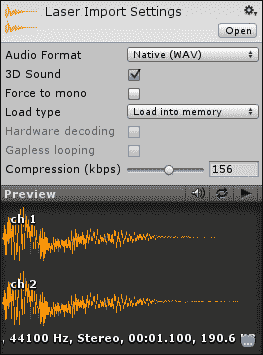

在导入音频剪辑时，以下是我们必须处理的设置：

+   **音频格式**：这控制文件是否以**原生**格式包含或是在最终游戏中**压缩**。**原生**格式虽然文件大小更大，但对于短音效来说最佳，因为它们可以快速加载和播放。**压缩**格式更适合长音效和音乐。它们在最终构建中占用的空间更小。

+   **3D 声音**：此复选框控制文件是否以 2D 或 3D 播放。2D 声音无论玩家位于何处都会以恒定音量播放——非常适合背景音乐和旁白。3D 声音的音量会根据其与玩家的距离进行调整——非常适合爆炸和枪声。

+   **强制单声道**：此复选框将导致 Unity 将立体声文件更改为单声道文件。

+   **加载类型**：这控制游戏播放时文件的加载方式。

    +   **加载到内存中**：这会将**原生**文件直接加载到内存中以便播放。

    +   **从磁盘流式传输**：这将在播放时流式传输音频，例如从网络流式传输音乐或视频。

    +   **加载时解压缩**：这会在文件首次需要时移除压缩。此选项的开销使其对于大文件来说是一个非常糟糕的选择。

    +   **内存中压缩**: 这仅在播放时解压缩文件。当它只是保存在内存中时，文件保持压缩状态。

+   **硬件解码**: 这仅用于 iOS 设备以降低处理成本。

+   **无缝循环**: 这调整压缩方法以消除某些方法可能引入到文件中的小寂静声。

+   **压缩**: 这是每秒压缩文件的数据量，从而生成一个更小的文件。最好找到一个值，在最小化文件大小的同时，损失的质量最少。

## 音频监听器

为了在游戏中真正听到任何声音，每个场景都需要一个**音频监听器**组件。默认情况下，`主相机`对象（在任何新场景中首先包含）以及您可能创建的任何新相机都附加了一个**音频监听器**组件。您的场景中一次只能有一个**音频监听器**组件。如果有多个，或者在没有**音频监听器**的情况下尝试播放声音，Unity 将会在控制台日志中填充投诉。**音频监听器**组件还提供了任何 3D 声音效果的精确位置。

## 音频源

**音频源**组件就像一个扬声器，控制播放任何声音效果的设置。如果剪辑是 3D 的，则此对象到**音频监听器**组件的位置和选择的模式决定了剪辑的音量。

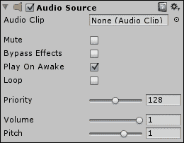

以下是一个**音频源**组件的各种设置：

+   **音频剪辑**: 这是此**音频源**组件默认播放的声音文件。

+   **静音**: 这是一种快速切换正在播放的声音音量开关的方法。

+   **绕过效果**: 这允许用户切换应用于此**音频源**组件的任何特殊过滤器。

+   **唤醒时播放**: 这将在场景加载或对象生成时立即开始播放**音频剪辑**。

+   **循环**: 这将导致播放的剪辑在播放时重复。

+   **优先级**: 这决定了正在播放的文件的相对重要性。**0**是最重要的，最适合音乐，而**256**是最不重要的。根据系统，一次只能播放这么多声音。要播放的文件列表从最重要的开始，直到达到这个限制，如果声音多于限制，则排除那些值最低的文件。

+   **音量**: 这决定了剪辑播放的响度。

+   **音调**: 这调整剪辑的播放速度。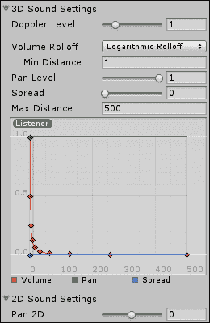

+   **3D 声音设置**: 这包含一组特定于播放 3D 音频剪辑的设置。可以使用组末尾的图表调整**音量**、**平衡**和**扩散**选项。这允许玩家在接近**音频源**组件时创建更动态的过渡。

    +   **多普勒水平**: 这决定了应用于移动声音的多普勒效应的程度。

    +   **音量衰减**：这控制了音量如何随距离衰减。

        **对数衰减**：这是在源中心短距离处声音突然且迅速衰减。

        **线性衰减**：这是一种距离上的均匀衰减，最响亮的是在**最小距离**值处，最安静的是在**最大距离**值处。

        **自定义衰减**：这允许您通过调整组末尾的图表来创建自定义衰减。当调整图表时，它也会自动选择。

    +   如果**音频监听器**组件比**最小距离**值更近，则音频将以当前音量级别播放。在此距离之外，声音将根据**衰减模式**衰减。

    +   **声像水平**：这是应用于此**音频源**组件的 3D 效果的百分比。这影响诸如衰减和多普勒效应等因素。

    +   **扩散**：这调整了声音在扬声器空间中覆盖的区域量。当与一个或两个以上的扬声器一起工作时，它变得更加重要。

    +   超过**最大距离**值，声音将停止根据组下方图表进行过渡。

+   **2D 音效设置**：这组成了特定于 2D 音频剪辑的设置。

    +   **2D 声像**：这调整了声音从每个扬声器中均匀输出的程度，偏向左或右扬声器。

## 添加背景音乐

既然我们已经了解了可用的音频设置，现在是时候将这项知识付诸实践了。我们将从添加一些背景音乐开始。这将必须是一个 2D 音效，这样无论**音频源**组件在哪里，我们都能舒适地听到它。我们还将创建一个简短的脚本，以渐入音乐来减少声音效果对玩家的突然冲击。

# 是时候添加背景音乐了

让我们从一个控制我们背景音乐的单一脚本开始。

1.  我们将首先创建一个新的脚本，并将其命名为 `FadeIn`。

1.  此脚本以三个变量开始。第一个是脚本必须达到的目标音量。第二个是过渡所需的时间（秒数）。最后一个是在过渡开始时的时间。

    ```java
    public float maxVolume = 1f;
    public float fadeLength = 1f;
    private float fadeStartTime = -1f;
    ```

1.  接下来，我们使用`Awake`函数。它首先查看由 Unity 自动提供的`audio`变量，以检查是否有附加的**音频源**组件。如果找不到，则销毁`gameObject`并退出函数。

    ```java
    public void Awake() {
      if(audio == null) {
        Destroy(gameObject);
        return;
      }
    ```

1.  `Awake`函数最后将音量设置为`0`，如果尚未播放，则播放它。

    ```java
      audio.volume = 0;

      if(!audio.isPlaying)
        audio.Play();
    }
    ```

1.  为了使过渡随时间进行，我们使用`Update`函数。它首先检查`fadeStartTime`变量是否小于零，如果是，则将其设置为当前时间。这允许我们避免场景初始化可能引起的卡顿。

    ```java
    public void Update() {
      if(fadeStartTime < 0)
        fadeStartTime = Time.time;
    ```

1.  接下来，该功能会检查过渡的时间是否结束。如果已经结束，则将**音频源**组件的音量设置为`maxVolume`，并销毁脚本以释放资源。

    ```java
    if(fadeStartTime + fadeLength < Time.time) {
      audio.volume = maxVolume;
      Destroy(this);
      return;
    }
    ```

1.  最后，通过计算从淡入开始经过的时间量并将其除以过渡的长度来计算当前进度。进度百分比乘以`maxVolume`的值，并应用于**音频源**组件的音量。

    ```java
      float progress = (Time.time – fadeStartTime) / fadeLength;
      audio.volume = maxVolume * progress;
    }
    ```

1.  在 Unity 中，我们需要创建一个新的空`GameObject`，并将其命名为`背景`。

1.  向此对象添加我们的`淡入`脚本和**音频源**组件。

1.  如果你还没有创建，请在你的**项目**面板中创建一个`音频`文件夹，并导入章节中包含的四个声音文件。

1.  选择`背景`声音文件，并在导入设置中取消选择**3D 声音**复选框。

1.  在**层次**窗口中选择你的`背景`对象，并将`背景`声音拖到**音频剪辑**槽中。

1.  确保在**音频源**组件上勾选**唤醒时播放**和**循环**复选框。**音量**选项也需要设置为**0**，这样文件就可以在整个游戏中播放，但在开始时没有声音。

## *刚才发生了什么？*

我们在我们的游戏中添加了背景音乐。为了使声音保持恒定且不具有方向性，我们利用音乐作为 2D 声音。我们还创建了一个脚本，在游戏开始时淡入音乐。这使玩家更容易过渡到游戏，防止突然的声音冲击。

## 尝试一下英雄 - 设置一些氛围

背景音乐可以为游戏体验增色不少。没有一些恐怖音乐，恐怖场景就几乎不会那么吓人。没有他们令人敬畏的音乐，Boss 就会显得不那么令人畏惧。为你的其他游戏寻找一些好的背景音乐。轻快愉快的音乐非常适合愤怒的小鸟，而更工业化和节奏更快的音乐则会让坦克大战游戏中的心跳加速。

## 创建一个警报系统

为了理解 3D 音频效果，我们将创建一个警报系统。当物体接近飞船时，警报音量会增加。3D 效果将指示物体相对于飞船的方向。这为玩家提供了当他们无法看到周围所有事物时所需的反馈。实现此效果有几种方法，但这种方法将展示我们调整**音频源**组件随时间变化的能力。

# 行动时间 - 警告玩家

在空间中的物体上附加单个脚本，当物体接近时，会警告玩家。

1.  我们首先创建了一个新的脚本，并将其命名为`Alarm`。

1.  此脚本从一个变量开始。它将保存声音开始淡入的距离值。

    ```java
    public float warningDist = 100f;
    ```

1.  接下来，我们创建`Update`函数。它首先检查是否存在**音频源**组件，如果不存在，则提前退出函数。`audio`变量持有附加的**音频源**组件的引用。

    ```java
    public void Update() {
      if(audio == null) return;
    ```

1.  函数继续通过计算玩家距离来执行。因为玩家从不移动，我们可以直接使用位置到原点的距离来简化它。我们还使用`sqrMagnitude`，即向量的长度的平方，因为它计算起来更快。如果对象超出范围，音量设置为`0`，并且函数退出。

    ```java
    float distance = transform.position.sqrMagnitude;
    if(distance > warningDist * warningDist) {
      audio.volume = 0;
      return;
    }
    ```

1.  最后，我们通过将距离除以`warningDist`值的平方并从 1 中减去结果来计算新的音量。这将导致在接近最大音量时出现一个平滑的曲线。

    ```java
    float volume = 1 – (distance / (warningDist * warningDist));
    audio.volume = volume;
    }
    ```

1.  我们现在需要将脚本添加到相关对象中。将`Alarm`脚本和**音频源**组件添加到敌舰和陨石预制体中。

1.  对于**音频剪辑**值，选择`Alarm`剪辑。同时，确保**唤醒时播放**和**循环**复选框都被勾选。

1.  接下来，我们不想让警报声压倒游戏中的其他声音，所以将**优先级**选项设置为**192**。

1.  为了防止在对象生成时产生任何噪音，将**音量**选项设置为**0**。

1.  为了让脚本完全控制**音频源**组件的音量，展开**3D 声音设置**组件。将**音量衰减**设置为**线性衰减**，将**最小距离**选项设置为**495**。

## *刚才发生了什么？*

我们创建了一个脚本，当对象过于接近玩家时警告玩家。当它们接近玩家时，它们音频源的音量会增加。当它们远离玩家时，音量会降低。通过使用 3D 音频剪辑，我们可以引导玩家确定接近的对象来自何方。

## 尝试一下英雄 - 微分

我们很高兴能够知道对象何时过于接近，但我们不能在看到它之前知道它是什么。找到一些替代警报声音。对于玩家必须应对的每种类型的对象，给它一个不同的声音。这样，玩家就会知道他们是否需要开始做一些复杂的机动来躲避子弹，或者他们是否进入了一个小行星带，需要小心飞行以避免碰撞。

# 理解粒子系统

粒子系统可以为游戏的最终外观增添很多。它们可以呈现为火焰、魔法波浪、雨，或者你可以想象出的无数其他效果。它们通常很难制作得很好，但都是值得努力的。记住，尤其是在与移动平台一起工作时，少即是多。较大的粒子比大量的粒子更有效。如果你的粒子系统在狭小的空间中包含数千个粒子，或者为了增加效果而自我复制，你需要重新思考设计并找到更有效的解决方案。

## 粒子系统设置

每个粒子系统都包含大量组件，每个组件都有自己的设置。大多数可用设置都有选项可以选择为**常量**、**曲线**、**随机**、**两个常量之间的随机**和**两个曲线之间的随机**。**常量**将是一个特定的值。**曲线**将是一个随时间沿曲线变化的固定值。两个随机设置在相应的值类型之间选择一个随机值。一开始可能会觉得有些混乱，但当我们逐一了解它们时，它们将变得更加容易理解。

正如您将在接下来的图像和描述中看到的那样，我们将逐一了解并理解粒子系统的每个部分。

正如您将在下面的屏幕截图中所看到的，我们将逐一了解并理解粒子系统的每个部分：


1.  粒子系统的第一部分，即**初始**模块，包含了 Unity 中每个发射器使用的所有设置。

    +   **持续时间**: 这是发射器持续的时间。循环系统将在这段时间后重复。非循环系统将在这段时间后停止发射。

    +   **循环**: 此复选框决定了系统是否循环。

    +   **预加热**: 如果勾选此复选框，则将启动一个循环系统，就像它已经有机会循环一段时间一样。这对于火炬已经点燃，玩家进入房间时不应该开始的情况很有用。

    +   **起始延迟**: 当最初触发时，这将停止粒子系统在给定秒数内发射。

    +   **起始寿命**: 这是单个粒子开始时的秒数。

    +   **起始速度**: 这是粒子生成时的初始移动速度。

    +   **起始大小**: 这决定了粒子生成时的大小。总是使用较大的粒子而不是更多的粒子更好。

    +   **起始旋转**: 这将旋转发射的粒子。

    +   **起始颜色**: 这是粒子生成时的颜色色调。

    +   **重力乘数**: 这给粒子提供了更多或更少的重力效果。

    +   **继承速度**: 如果它正在移动，这将使粒子获得其变换动量的一部分。

    +   **模拟空间**: 这决定了粒子是随游戏对象移动（即本地）还是保持在它们在世界中的位置。

    +   **唤醒时播放**: 如果勾选此复选框，则发射器将在生成或场景开始时立即开始发射。

    +   **最大粒子数**: 这限制了系统在单个时间点支持的粒子总数。如果粒子发射速率或其寿命足够大，以至于超过了它们的破坏速率，则此值才会发挥作用。

    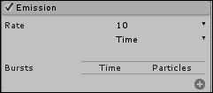

1.  **发射**模块控制粒子发射的速度。

    +   **速率**：如果设置为**时间**，这是每秒创建的粒子数。如果设置为**距离**，这是系统移动时每单位距离创建的粒子数。

    +   **爆发**：仅在**速率**选项设置为**时间**时使用。它允许你设置系统时间轴上的点，在这一点上会发射特定数量的粒子。

    

1.  **形状**模块控制系统如何发射粒子。

    +   **形状**：这决定了发射点将采取的形式。每个选项都附带一些额外的值字段，用于确定其大小。

        **球体**：这是粒子从所有方向发射的点。**半径**决定了球体的大小。**从壳体发射**指定粒子是从球体的表面还是内部发射。

        **半球**：正如其名所示，这是球体的一半。**半径**和**从壳体发射**在这里与**球体**相同。

        **圆锥**：这沿着一个方向发射粒子。**角度**决定了形状更接近圆锥还是圆柱。**半径**决定了形状发射点的尺寸。**发射位置**将确定粒子从哪里发射。**底部**从形状的底部圆盘发射。**底部壳体**从圆锥的底部但围绕形状的表面发射。**体积**将在形状内部任何地方发射，而**体积壳体**从形状的表面发射。

    +   **盒子**：这从立方体形状发射粒子。**盒子 X**、**盒子 Y**和**盒子 Z**决定了盒子的大小。

    +   **网格**：这允许你选择用作发射点的模型。系统的所有粒子都将从**网格**的表面发射。

    +   **随机方向**：这决定了粒子的方向是由所选形状的表面法线决定，还是随机选择。

    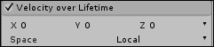

1.  **生命周期内速度**模块允许你在粒子生成后控制粒子的动量。

    +   **X**、**Y**和**Z**：这些定义了粒子动量沿每个轴每秒的单位数。

    +   **空间**：这决定了速度是应用于系统的局部变换，还是相对于世界。

    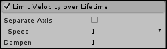

1.  **限制生命周期内速度**模块在粒子的移动超过指定值时阻尼粒子的运动。

    +   **分离轴**：这允许你为每个轴定义一个独特的值，并确定该值是局部还是相对于世界的。

    +   **速度**：这是在应用阻尼之前粒子必须移动的速度

    +   **阻尼**：这是减少粒子速度的百分比。它是一个介于零和一之间的值。

    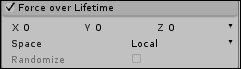

1.  **生命周期内的力**模块在粒子的生命周期过程中为每个粒子添加一个恒定的移动量。

    +   **X**、**Y**和**Z**：这些定义了沿每个轴应用多少力

    +   **空间**：这决定了力是应用于系统的变换局部还是世界空间

    +   如果**X**、**Y**和**Z**是随机值，**随机化**将导致每帧随机选择应用力的量，从而实现随机值的统计平均

    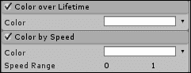

1.  **生命周期内的颜色**模块允许您在粒子生成后定义粒子过渡的颜色序列。

1.  **颜色随速度变化**模块使粒子在速度变化时过渡到定义的颜色范围。

    +   **颜色**：这是过渡的颜色集

    +   **速度范围**：这定义了粒子在**颜色**范围的最小和最大端必须达到的速度

    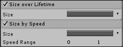

1.  **生命周期内的大小**模块在粒子的生命周期过程中改变粒子的尺寸。

1.  **速度大小**模块根据粒子移动的速度调整每个粒子的尺寸。

    +   **大小**：这是粒子过渡的调整

    +   **速度范围**：这定义了每个**大小**的最小和最大值

    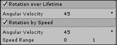

1.  **生命周期内的旋转**模块在粒子生成后随时间旋转粒子。

1.  **速度随速度旋转**模块使粒子在速度更快时旋转更多。

    +   **角速度**：这是要应用的旋转次数

    +   **速度范围**：这是如果未设置为**常数**，则**角速度**值的最大和最小范围

    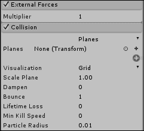

1.  **外部力**模块乘以风区对象的效果。风区模拟风对粒子系统和 Unity 树的影响。

1.  **碰撞**模块允许粒子碰撞并与其他物理游戏世界交互。

    +   如果设置为**平面**，您可以定义粒子要与之碰撞的多个平坦表面。这比世界碰撞处理得更快。

        **平面**：这是一个定义要与之碰撞的表面的变换列表。粒子只会与变换的局部、正 Y 侧碰撞。任何在点另一侧的粒子将被销毁。

        **可视化**：这提供了将平面视为**实体**表面或**网格**表面的选项。

        **缩放平面**：这调整了**可视化**选项的大小。它不会影响实际碰撞表面的实际大小。

        **粒子半径**：这是用来定义计算粒子与平面碰撞所使用的球体的大小。

    +   如果设置为**世界**，粒子将与场景中的每个碰撞器发生碰撞。这可能会对处理器造成很大负担。

        **碰撞对象**：这定义了将与哪些图层发生碰撞的图层列表。只有在此列表中检查的图层上的碰撞体才会用于碰撞计算。

        **碰撞质量**：这定义了此粒子系统的碰撞计算的精确度。**高**将精确计算每个粒子。**中**将使用近似值和每帧有限的新计算。**低**的碰撞计算频率低于**中**。

        如果**碰撞质量**设置为**中**或**低**，则**体素大小**决定了系统估计碰撞点的精确度。

    +   **减慢速度**：当粒子与表面碰撞时，此功能会从粒子中移除定义的分数速度。

    +   **弹跳**：这允许粒子保持其定义的分数速度，特别是沿着被撞击表面的法线方向。

    +   **寿命损失**：这是生命百分比。当粒子碰撞时，这部分生命百分比将从粒子中移除。当粒子的生命随时间降至零或通过碰撞移除时，它将被移除。

    +   如果碰撞后粒子的速度低于**最小杀伤速度**值，则粒子将被销毁。

    +   如果勾选了**发送碰撞消息**复选框，则每帧都会向附加到粒子系统和与之碰撞的物体的脚本发出碰撞发生的警报。每帧只发送一条消息，而不是每个粒子。

    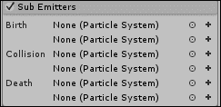

1.  **子发射器**模块允许在系统中每个粒子的生命周期中的特定点生成额外的粒子系统。

    +   **出生列表**中的任何粒子系统都会在粒子首次创建时生成并跟随粒子。这可以用来创建火球或烟雾轨迹。

    +   **碰撞列表**：当粒子撞击物体时，会生成粒子系统。这可以用来生成雨滴溅起效果。

    +   **死亡列表**：当粒子被销毁时，会生成粒子。这可以用来生成烟花爆炸。

    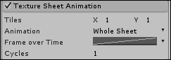

1.  **纹理图动画**模块使粒子在其生命周期内翻越多个粒子。使用的纹理在**渲染器**模块中定义。

    +   **瓦片**：这定义了图中的行数和列数。这将确定可用的总帧数。

    +   **动画**：这提供了**整个图**和**单行**的选项。如果设置为**单行**，则使用的行可以是随机选择的，也可以通过勾选**随机行**复选框和**行**值来指定。

    +   **帧随时间变化**：这定义了粒子在帧之间的转换方式。如果设置为**恒定**，系统将只使用单个帧。

    +   **循环次数**：这是粒子在其生命周期内循环动画的次数。

    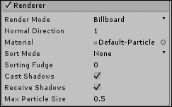

1.  **渲染器**模块决定了粒子如何在屏幕上绘制。

    +   **渲染模式**: 这定义了粒子应该使用哪种方法在游戏世界中定位自己。

        **横幅**: 这将始终朝向相机。

        **拉伸横幅**: 这将朝向相机面对粒子，但根据相机的速度、粒子的速度或特定的值拉伸它们。

        **水平横幅**: 这在游戏世界的 XZ 平面上是平的。

        **垂直横幅**: 这将始终朝向玩家，但始终沿 y 轴保持直线。

        如果设置为 **网格**, 你可以定义一个用作粒子而不是平面模型的模型。

    +   **正常方向**: 这用于通过调整每个平面的法线来对粒子进行照明和着色。值为**1**时，法线直接指向相机，而值为**0**时，法线指向屏幕中心。

    +   **材料**: 这定义了用于渲染粒子的材料。

    +   **排序模式**: 这决定了粒子应该按照距离或年龄的顺序绘制。

    +   **排序微调**: 这会导致粒子系统比正常情况下更早地绘制。值越高，它将在屏幕上越早绘制。这影响系统是否出现在其他粒子系统或半透明对象之前或之后。

    +   **投射阴影**: 这确定粒子是否会阻挡光线。

    +   **接收阴影**: 这确定粒子是否受到其他物体投射的阴影的影响。

    +   **最大粒子大小**: 这是单个粒子允许填充的屏幕空间总量。无论粒子的实际大小如何，它永远不会填充超过这个屏幕空间。

## 创建引擎尾迹

为了加强玩家对他们的船正在移动的印象，我们需要为船的引擎创建一些尾迹。这种排气将像船在移动一样拖出，即使它没有移动。通过使粒子系统成为组成船的物体组的一部分，引擎尾迹将移动并留下预期的粒子。

# 行动时间 - 添加引擎尾迹

可以仅使用粒子系统轻松添加和控制引擎尾迹。

1.  首先，我们需要创建一个新的粒子系统。通过前往 Unity 编辑器的顶部并导航到**GameObject** | **Create Other** | **Particle System**来实现这一点。

1.  将新的粒子系统重命名为 `EngineTrail`。

1.  首先，我们来看一下**初始**模块。我们需要勾选**循环**和**预加热**复选框。这将使船在整个游戏中看起来像是在移动，并消除系统在创建效果时通常需要的累积。

1.  接下来，我们需要控制粒子移动的距离。通过将**开始寿命**选项设置为**3**和**开始速度**选项设置为**1**来实现这一点。

1.  为了保持粒子在空间中的大小和位置适当，我们需要将**开始大小**选项设置为**0.8**，并将**模拟空间**选择为**世界**。

1.  现在我们转向**形状**模块。我们希望粒子从引擎中直线飞出。因此，我们将**角度**选项的值设置为**0**，将**半径**选项的值设置为**0.2**。

1.  排气通常随着时间的推移在颜色上逐渐变淡，在密度上逐渐消散。为了达到这种效果，激活**生命周期内颜色**和**生命周期内大小**模块。

1.  对于**颜色**选项，在渐变开始时将**Alpha**选项设置为**0**，在短距离内设置为**255**。至于颜色，开始时选择鲜艳的蓝色，过渡到白色，然后到灰色。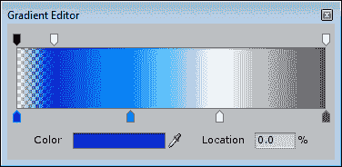

1.  对于**大小**选项，选择一个线性斜率，在开始时最大，在结束时最小。这最简单的方法是在**大小**标签右侧点击曲线，然后在**检查器**窗口底部的**粒子系统曲线**窗口中选择从底部起的第三个选项。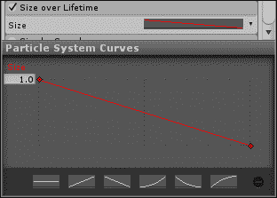

1.  现在，在**场景**窗口中，将`EngineTrail`对象复制三次，并将它们放置在飞船引擎后面。确保将它们旋转，以便粒子从飞船中发射出来。

1.  最后，将它们全部设置为玩家的飞船的子对象。如果跳过这一步，它们将不会随着飞船的移动而移动。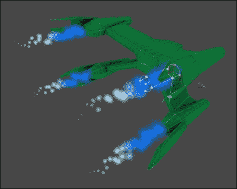

## *发生了什么？*

我们将关于粒子系统的知识付诸实践，为我们的宇宙飞船引擎创建尾迹。因为它们是船的子对象，并在世界空间中模拟，所以它们会随着船移动，并像预期的那样逐渐消失。

## 尝试英雄 - 更多尾迹

敌舰也有引擎。尝试为敌舰添加尾迹。注意选择本地空间或世界空间进行模拟。因为船只移动是为了让玩家看起来在移动，所以在世界空间中模拟可能会有一些不寻常的副作用。

如果你之前为玩家添加了涡轮增压效果，现在是时候为它添加一些额外的效果了。尝试在玩家加速时改变尾迹的长度。也许当飞船加速时，它会利用一种特殊的燃料。如果它燃烧的颜色不同，那么当玩家加速时，尾迹的颜色或颜色系列也必须不同。

# 将其组合

到目前为止，我们学习了关于音频效果和粒子系统的基础知识。它们各自可以为场景增添很多，设定氛围，并给游戏带来独特的光泽。但是，有许多效果不能单独作为一项或另一项存在。例如，爆炸如果没有视觉和听觉效果，就根本不会那么令人印象深刻。

## 爆炸

当敌人爆炸时摧毁他们要满足得多。要制造一个合适的爆炸，需要粒子效果和声音效果。我们将首先创建一个爆炸预制体。然后我们将更新玩家的射击，以便在摧毁小行星和敌舰时产生爆炸。

# 添加爆炸的时间

一个单独的粒子系统和脚本可以让我们创建一些可以在任何地方使用的漂亮的爆炸效果。

1.  我们首先需要一些新的纹理来让爆炸看起来像火焰。幸运的是，Unity 提供了多种基本的粒子纹理。要将它们包含到你的项目中，请前往 Unity 编辑器的顶部，导航到**Assets** | **Import Package** | **Particles**。

1.  在出现的窗口中，选择**导入**并等待 Unity 完成导入。这个包是一个很好的资源，包括纹理和完整的粒子系统。然而，包含的所有粒子系统都使用即将被 Unity 淘汰的旧系统。尽管如此，我们仍然可以充分利用包含的材料。

1.  创建一个新的`particleSystem`对象并将其命名为`Explosion`。

1.  首先，在**初始**模块中，我们需要让效果持续一段时间。将**持续时间**设置为**0.5**，将**开始生命周期**选项设置为**1**。

1.  为了让粒子更靠近，将**开始速度**选项的值设置为**0.5**。

    ### 小贴士

    当我们完成这个系统后，它将不会循环。然而，如果我们现在让它循环，更容易看到我们在处理什么。

1.  接下来，我们需要更多的粒子，所以前往**发射**模块。将**速率**选项设置为**120**以生成适当数量的粒子。

1.  爆炸通常是圆形的，所以我们需要调整**形状**模块。将**形状**设置选择为**球体**，并将**半径**选项设置为**0.5**。

1.  接下来是**生命周期内颜色变化**模块。爆炸开始时很亮，然后逐渐变成棕色，随后在燃烧过程中变为黑色。对于**颜色**选项，从军绿色开始，然后是淡黄色，接着是中棕色，最后在结束时变为黑色。同时，让**Alpha**在开始时逐渐出现，在结束时逐渐消失。这样可以防止粒子突然出现和消失。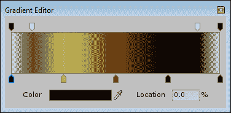

1.  接下来，我们需要为我们的粒子创建一个火焰材质。在**渲染器**模块的**材质**设置中，选择**火焰烟雾**材质。你也可以在**项目**窗口中找到它，通过导航到**Standard Assets** | **Particles** | **Sources** | **Materials**。

1.  一旦我们对系统的外观感到满意，确保在**初始**模块中勾选**在启动时播放**复选框，并且不要勾选**循环**复选框。

1.  与小行星和敌舰一样，爆炸需要随着玩家的移动而移动。它还需要在完成发射后自行销毁。因此，创建一个新的脚本并将其命名为`Explosion`。

1.  这个脚本很短，只包含两个函数。第一个函数`Update`检查`particleSystem`对象是否存在或是否已经播放完毕。如果任一条件为真，则销毁`gameObject`。

    ```java
    public void Update() {
      if(particleSystem == null || !particleSystem.isPlaying)
        Destroy(gameObject);
    }
    ```

1.  第二个函数`LateUpdate`简单地使用我们创建在第六章中，即*移动设备的特性 – 触摸和倾斜*的`PlayerShip.Rotate`函数，来移动爆炸效果以匹配玩家的移动。这与玩家移动时移动小行星和敌舰的方式相同。

    ```java
    public void LateUpdate() {
      PlayerShip.Rotate(transform);
    }
    ```

1.  返回 Unity，并将脚本添加到`Explosion`对象中。

1.  接下来，向对象添加一个**音频源**组件。

1.  对于这个组件，我们需要勾选**在激活时播放**复选框。同时，在**3D 声音设置**下选择**线性衰减**作为**音量衰减模式**，并将**最小距离**设置为**10**。

1.  当然，为源音频剪辑选择**爆炸**声音效果。这些设置将使声音在爆炸生成时立即播放。

1.  要完成爆炸效果的创建，将对象转换为预制体，并从场景中删除实例。

1.  接下来，我们需要更新`TouchShoot`脚本以利用爆炸效果。现在打开它。

1.  首先，我们在代码中添加一个变量来保存对爆炸的引用。

    ```java
    public GameObject explosion;
    ```

1.  在使用`Physics.Raycast`函数的行之后，在我们销毁射击对象之前，添加以下行。如果存在对爆炸的引用，它将使用`Instantiate`函数生成一个新的爆炸实例，并将其位置和旋转设置为被射击对象的位置和旋转。

    ```java
    if(explosion != null) Instantiate(explosion, hit.transform.position, hit.transform.rotation);
    ```

1.  回到 Unity 中，找到玩家飞船上的`TouchShoot`脚本组件实例。在新的**爆炸**槽中添加对`Explosion`预制体的引用。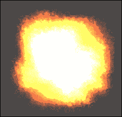

## *刚才发生了什么？*

我们引发了一场爆炸。Unity 为我们提供了一系列的粒子纹理，我们可以用它们创建出多种效果。此外，还有一些已经创建好的粒子系统，包括爆炸效果。然而，那个爆炸效果使用的是旧系统，并且很快就不会再包含在 Unity 中了。我们还更新了我们的敌舰和小行星，以便当它们被玩家摧毁时能够引发爆炸。

## 大胆尝试吧 – 更多类型的爆炸

一个爆炸是可以的，但奇怪的是，小行星的爆炸方式与飞船相同。不同的气体、燃料和岩石成分以不同的颜色和不同程度的强度燃烧。为围绕你的太空中的不同物体创建更多的爆炸。更改颜色和大小以适应爆炸物。此外，探索其他声音效果，以提供有关爆炸的不同听觉线索。最后，尝试创建一个多爆炸系统。也许玩家的射击会导致第一个爆炸，而连锁反应会导致武器库和发动机舱中的爆炸。为了实现这一点，查看使用子发射器，或者当飞船被摧毁时在飞船周围生成几个不同的粒子系统。

## 创建激光束

能够摧毁物体并看到它们爆炸是很好的。这为玩家执行简单动作提供了奖励。然而，当开枪时，无论是否击中目标，你都会期望它有反应。为此，我们将为玩家的飞船创建一种类似于枪口闪光的效果。每次他们轻触屏幕开火时，一些粒子系统都会闪烁，并播放声音效果。

# 行动时间 - 添加激光束

脸部闪光通常由两部分组成。第一部分是沿着枪管向前直射的直线冲击波。第二部分是围绕第一部分底部的扇形。

1.  首先，创建一个新的`particleSystem`对象并将其重命名为`LineBlast`；我们现在将开始制作第一部分。

1.  闪光不会持续很长时间，因此请在**初始**模块中找到**持续时间**选项并将其设置为**0.1**。

1.  接下来，我们需要将**起始寿命**选项设置为**0.1**，这样粒子就不会在屏幕上停留很长时间。

1.  闪光不会从枪口移开，因此将**起始速度**选项设置为**1**，以保持粒子靠近。

1.  粒子的大小需要与我们的飞船枪口的大小相匹配。将**起始大小**选项设置为**0.2**以保持它们较小。

1.  如果我们的激光束只是白色，那就没有乐趣了，所以将**起始颜色**值更改为适合你的激光的适当颜色。

1.  最后一个要调整的是**初始**模块，取消选中**播放唤醒**复选框，以防止系统在加载时立即触发。

1.  接下来，我们需要调整**发射**模块。闪光是突发性的，因此将**速率**选项设置为**0**。

1.  要创建爆发，点击**爆发**列表右侧的**+**号。**5**的值将工作得很好。

1.  接下来，我们调整**形状**模块以沿直线发射粒子。为此，将**角度**选项设置为**0**，将**半径**选项设置为**0.01**。

1.  最后，我们需要调整**渲染器**模块。为了拉长粒子，将**渲染模式**选项更改为**拉伸公告板**，并将**长度缩放**选项设置为**-4.5**。

1.  现在我们对系统的外观感到满意，请在**初始**模块中取消选中**循环**复选框。

1.  现在创建第二个`particleSystem`对象，并将其重命名为`SpreadBlast`。

1.  这些粒子应该持续与第一个系统一样长的时间。因此，在**Initial**模块中，将**Duration**选项设置为**0.1**，**Start Lifetime**设置为**0.1**，**Start Speed**设置为**1**，**Start Size**设置为**0.2**，并取消选中**Play On Awake**。

1.  为了使这些粒子与线条区分开来，将**Start Color**值设置为略暗的颜色。

1.  接下来，在**Emission**模块中，将**Rate**选项设置为**0**，并添加**Bursts**选项，其**Particles**值为**30**。

1.  对于**Shape**模块，将**Angle**选项设置为**60**，将**Radius**选项设置为**0.01**。这导致粒子在生成时向外扩散。

1.  对于**Renderer**模块，将**Render Mode**选项设置为**Stretched Billboard**，将**Length Scale**选项设置为**-3**。

1.  最后，一旦我们对系统的外观感到满意，再次在**Initial**模块中取消选中**Looping**复选框。

1.  在放置粒子系统之前，我们需要创建一个脚本。创建一个新的脚本并将其命名为`LaserBlast`。此脚本将触发粒子系统和音频剪辑的播放。

1.  此脚本从单个变量开始。此变量保存当脚本被指示发射时将被触发的系统列表。

    ```java
    public ParticleSystem[] particles = new ParticleSystem[0];
    ```

1.  接下来，脚本中只有一个函数，即`Fire`。它首先确保在同一个`GameObject`上有一个**Audio Source**组件。如果存在，则使用源剪辑调用`PlayOneShot`。此函数播放传入的文件一次，而不会阻止其他剪辑的播放。

    ```java
    public void Fire() {
      if(audio != null)
        audio.PlayOneShot(audio.clip);
    ```

1.  函数继续通过遍历粒子系统列表，并使用`Play`来触发它们（如果它们存在）。

    ```java
      for(int i=0;i<particles.Length;i++) {
        if(particles[i] != null)
          particles[i].Play();
      }
    }
    ```

1.  接下来，我们需要更新`TouchShoot`脚本。它需要在玩家触摸屏幕时调用`LaserBlast`脚本中的`Fire`函数。为此，我们首先添加`lasers`变量来保存需要触发的对象列表。

    ```java
    public LaserBlast[] lasers = new LaserBlast[0];
    ```

1.  在`Update`函数的开始处，我们添加`didFire boolean`值。这将防止激光在每个帧中触发多次。

    ```java
    bool didFire = false;
    ```

1.  我们接下来在检查触摸阶段值是否等于`TouchPhase.Began`的`if`语句之后将布尔值设置为真。

    ```java
    didFire = true;
    ```

1.  在`Update`函数的末尾，如果`didFire boolean`为真，我们将调用稍后要编写的`Fire`函数。

    ```java
    if(didFire) Fire();
    ```

1.  最后，对于脚本，我们添加`Fire`函数。此函数简单地遍历`lasers`数组，并在它们存在的情况下调用它们的`Fire`函数。

    ```java
    private void Fire() {
      for(int i=0;i<lasers.Length;i++) {
        if(lasers[i] != null)
          lasers[i].Fire();
      }
    }
    ```

1.  现在我们已经拥有了所有部件，我们需要将它们组合起来。首先创建一个新的空`GameObject`，并将其命名为`LaserBlast`。

1.  接下来，将`LineBlast`和`SpreadBlast`粒子系统设置为这个新对象的子对象。确保将它们的定位和旋转设置为`0`。

1.  将我们的`LaserBlast`脚本添加到同名对象中，并将两个粒子系统添加到脚本组件的**Particles**列表中。

1.  接下来，向对象添加一个**音频源**组件。将**音频剪辑**值选择为**激光**声音效果。

1.  最后，对于这个对象，展开**3D 声音设置**组，并将**音量衰减**值设置为**线性衰减**；否则，我们将无法听到它。

1.  将激光束放置在玩家飞船的炮口前方。根据需要复制，以覆盖所有点。同时，确保它们的局部 z 轴沿着炮口向前。

1.  接下来，将所有的`LaserBlast`对象设置为玩家飞船的子对象，这样它们就会随着飞船移动。

1.  最后，将对象添加到`TouchShoot`脚本组件上的**激光**列表中。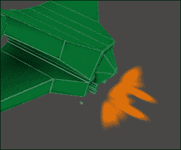

## *刚才发生了什么？*

我们为玩家创建了激光束。每次玩家触摸屏幕时，它们都会被触发。这样玩家就可以知道他们在射击，即使他们没有击中任何东西。这是一个快速而短暂的效果，但为最终体验增添了大量内容。

## 英雄试炼 – 更多类型的激光

玩家现在可以射击激光了，敌人也需要这样做。向敌舰添加一些激光束。同时，是时候用更好的东西替换他们的球形子弹了。创建一个等离子球来替换球形子弹。爆炸的小型循环版本可以用于球体。发动机尾迹的适当着色版本可以用作球体飞向玩家时的轨迹。也许给子弹添加警报也是个好主意。这样玩家就知道他们即将被从游戏中击飞出去。

# 摘要

在本章中，我们学习了 Unity 中的特效，特别是音频和粒子系统。我们从了解 Unity 如何处理音频文件开始。通过添加背景音乐和警报系统，我们将所学知识付诸实践。然后，我们转向了解粒子系统，并为玩家的飞船创建了引擎尾迹。最后，我们将两项技能结合在一起，创建了爆炸和激光束。粒子系统和音频效果为游戏的最终润色和外观增添了大量内容。

在下一章中，我们将通过查看 Unity 中的优化来共同完成我们的体验。我们将查看用于跟踪性能的工具。我们还将创建自己的工具来跟踪脚本性能的特定部分。我们还将创建自己的工具来跟踪脚本性能的特定部分。我们将探索资产压缩和其他我们可以更改以最小化应用程序大小的点。最后，我们将讨论减少延迟的关键点。
