# 第九章 优化

*在前一章中，我们学习了关于我们游戏的特效。我们在太空战斗机游戏中添加了背景音乐。我们还为我们的飞船创建了引擎尾迹。通过结合音频效果和粒子系统，我们创建了一些爆炸和枪炮声。这一切共同完善了游戏体验，使我们拥有了一个看起来非常完整的游戏。*

*在本章中，我们探讨了我们的优化选项。我们首先查看应用程序的占用空间，以及如何减少它。然后我们转向查看游戏性能。我们查看 Unity 提供的工具，并自己创建了一个。通过使用遮挡剔除，我们可以进一步提高游戏性能。最后，我们将探讨一些可能导致延迟的关键区域以及如何最小化它们的影响。*

在本章中，我们将涵盖以下主题：

+   最小化应用程序占用空间

+   跟踪性能

+   最小化延迟

+   遮挡

对于本章，我们将同时处理我们的太空战斗机和坦克大战游戏。首先打开太空战斗机项目。

# 最小化应用程序占用空间

游戏成功的关键之一是游戏本身的大小。许多用户会迅速卸载任何看起来不必要的应用程序。此外，所有移动应用商店都对根据应用程序本身的大小向用户供应游戏有大小限制。熟悉您用于最小化游戏大小的选项是控制游戏分发方式的关键。

在尝试最小化占用空间时，首先要注意的是 Unity 在构建游戏时如何处理资产。只有用于构建中某个场景的资产才会实际包含在游戏中。如果它不在场景本身中，或者没有由场景中的资产引用，它将不会被包含。这意味着您可能有资产的测试版本或不完整的版本；只要它们没有被引用，它们就不会影响您游戏最终构建的大小。

Unity 还允许您以您需要用于工作的格式保存您的资产。当最终构建完成时，所有资产都会转换为适合其类型的适当版本。这意味着您可以保持模型为建模程序的原始格式。或者保持您的图像为 Photoshop 文件，或者您工作的任何其他格式，当游戏构建时，它们将被适当地转换为`JPG`或`PNG`。

## 编辑器日志

当您最终准备好处理游戏占用空间时，您可以找出确切是什么导致您的游戏比预期要大。在**控制台**窗口的右上角有一个下拉菜单按钮。在这个菜单内部是**打开编辑器日志**。

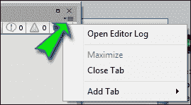

编辑器日志是 Unity 在运行时输出信息的位置。这包括有关当前版本、许可证检查以及任何资产导入的信息。在构建完成后，日志还将包含有关游戏文件大小和包含的资产的相关详细信息。

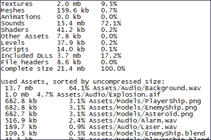

我们可以看到最终构建方面的分解。每个资产类别都有一个大小和总构建大小的百分比。我们还提供了一份实际包含在游戏中的每个资产的列表，按其文件大小排序，在添加到构建之前。当寻找可以缩小尺寸的资产时，这些信息变得非常有用。

## 资产压缩

在模型的导入设置中，包括纹理和音频，有影响导入资产大小和质量的选项。一般来说，受影响的变化是质量的降低。然而，尤其是在移动设备上工作时，资产质量可以降低到低于计算机所需的水平，而在设备上差异不明显。一旦你了解了每种类型资产可用的选项，你将能够就你游戏的质量做出最佳决策。在使用这些选项中的任何一项时，寻找一个在引入不希望出现的失真之前最小化大小的设置。

### 模型

无论你使用什么程序或方法来创建你的模型，最终它们始终是一系列顶点位置和三角形，以及一些纹理的引用。模型的大部分文件大小来自顶点位置的列表。为了确保你游戏中的模型具有最高质量，从你选择的建模程序开始。删除任何额外的顶点和面。这不仅会在构建最终游戏时导致文件更小，还会在编辑器中工作时减少导入时间。

模型的**导入设置**由三个页面组成，从而提供了更多调整质量的选项。每个页面选项卡对应于模型的相应部分，使我们能够精细调整每一个。

### 模型选项卡

在**模型**选项卡上，我们可以影响网格的导入方式。当涉及到优化模型的使用时，这里有许多关键成功的选择。一旦你的游戏看起来和玩起来是你想要的样子，我们应该仔细查看以下截图所示的设置：

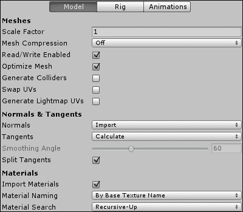

在**模型**选项卡下可用的设置解释如下：

+   **网格压缩**：此选项让我们选择应该应用于模型的多大压缩量。效果相当于合并顶点以减少存储网格所需的总细节量。此设置可能会在网格中引入不希望出现的奇异性。因此，始终选择不会引入任何失真的最高设置。

+   **读写启用**：这个选项仅在您希望在游戏运行时通过脚本操作网格时才有用。如果您永远不会用任何脚本触摸网格，请取消选中此框。虽然不会影响最终构建的大小，但这将影响运行游戏所需的内存量。

+   **优化网格**：这个选项会导致 Unity 重新排序描述模型的三角形列表。这始终是一个值得勾选的好选项。您可能想要取消勾选的唯一原因是如果您正在根据三角形的特定顺序操作游戏或网格。

+   **生成碰撞器**：这个选项几乎总是可以省略的。这个选项会将网格碰撞器组件添加到模型中的每个网格上。当在游戏中处理物理时，这些计算相对昂贵。如果可能的话，你应该始终使用一组显著更简单的盒子碰撞器和球体碰撞器。

+   **生成光照贴图 UV**：这个选项仅在处理需要静态阴影的对象时使用。如果对象不需要，它将引入多余的顶点信息并使资产膨胀。

+   **法线**：这个选项用于材料确定顶点面向哪个方向以及光照应该如何影响它。如果网格从未使用需要**法线**信息的材料，请确保将其设置为**无**。

+   **切线**：这个选项用于材料使用凹凸贴图和类似特殊效果来模拟细节。就像**法线**设置一样，如果您不需要它们，请不要导入它们。如果**法线**设置为**无**，此设置将自动变为灰色，并且不再导入。

### Rig 标签

以下是一个显示**Rig**标签的截图：

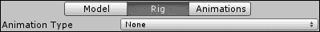

当优化动画骨架时，实际上只有两件事需要考虑。首先，如果资产没有动画，则不要导入它。通过将**动画类型**设置为**无**，Unity 将不会尝试导入骨架或任何无用的动画。其次，要考虑的是删除任何不必要的骨骼。一旦导入 Unity，删除任何对动画或角色没有实际影响的对象。

### 动画标签

就像在**Rig**标签中一样，如果模型没有动画，则不要导入动画。在首次导入资产时取消选中**导入动画**框，将避免向 Unity 中的 GameObject 添加任何额外的组件。此外，如果意外添加了任何额外的动画，它们会迅速使你的应用程序变得过大。

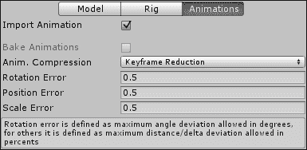

**动画**标签下的设置解释如下：

+   **动画压缩**: 此选项调整 Unity 处理动画中多余关键帧的方式。对于大多数情况，默认选项效果良好。

    +   **关闭**: 此选项仅应在需要高精度动画时使用。这是选择中最大且成本最高的设置。

    +   **关键帧减少**: 此选项将根据以下错误设置减少动画使用的关键帧数量。本质上，如果一个关键帧对动画没有明显的影响，它将被忽略。

    +   **关键帧减少和压缩**: 此选项与上一个选项相同，但还会压缩动画的文件大小。然而，在运行时，动画仍然需要与上一个选项相同数量的处理器资源来计算。

+   **旋转误差**: 此选项是在执行关键帧减少时将被忽略的关键帧之间度数差异的数量。

+   **位置误差**: 此选项是在执行关键帧减少时将被忽略的移动距离。

+   **缩放误差**: 此选项是动画中在执行关键帧减少时将被忽略的大小调整量。

### 纹理

在计算机图形学中处理纹理时，始终在**2 的幂**下工作更好。2 的幂是指任何值，其中它及其后续的一半可以均匀地除以 2，直到达到 1。这是因为它们对计算机来说计算和处理速度更快。默认情况下，Unity 会将不符合此要求的任何纹理通过缩放调整到最接近的 2 的幂。

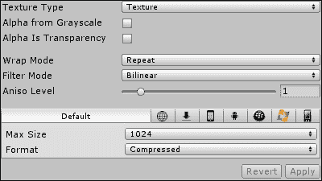

Unity 中可用的各种**纹理**设置如下所述：

+   **纹理类型**: 此选项影响此图像将被视为哪种类型的纹理。始终最好选择最适合图像预期用途的类型。

    +   **纹理**: 此选项是最常见和默认的设置。应将其用于您的普通模型纹理。

    +   **法线贴图**: 此选项用于特殊效果，如凹凸贴图。使用此类型纹理的材料还需要从模型导入设置中获取法线和切线信息。

    +   **GUI**: 如果图像将出现在 GUI 中而不是任何模型上，应使用此选项。

    +   **反射**: 这些纹理用于创建模仿真实物体反射特性的立方体贴图。

    +   **Cookie**: 这些纹理用于灯光，改变从灯光对象发出的光线。

    +   **高级**: 此选项提供了对所有与导入图像相关的设置的完全控制。您只有在纹理有特殊用途时才需要此设置。

        当**纹理类型**选项设置为**高级**时，**读写启用**框变为可用。如果计划在游戏运行时从脚本中操作纹理，则应保留勾选。如果未勾选，Unity 不会在 CPU 中维护数据副本，从而为游戏的其他部分释放内存。

+   **生成 Mip 贴图**: 此选项是另一个**高级**设置，允许您控制纹理较小版本的创建。当纹理在屏幕上较小时，这些版本将被使用，从而减少绘制屏幕上纹理及其使用对象所需的处理量。

+   **过滤模式**: 此选项适用于所有纹理类型。它影响您非常接近图像时图像的外观。"**点**"会使图像看起来像块状，而"**双线性**"和"**三线性**"会模糊像素。一般来说，"**点**"是最快的；"**三线性**"是最慢的，但提供最佳的外观效果。

+   **最大尺寸**: 此选项调整图像在游戏中使用时可以有多大。这允许您使用非常大的图像，但以适当小的尺寸导入 Unity。一般来说，大于**1024**的值是较差的选择；不仅因为增加了内存需求，而且因为大多数移动设备的显卡无法处理任何更大的纹理。选择可能的最小尺寸将对最终构建中纹理的足迹大小产生重大影响。

+   **格式**: 此选项调整图像的导入方式以及每个像素可以保留的细节程度。"**压缩**"是最小的，而"**真彩色**"提供最详细的细节。

### 音频

总是为游戏提供高质量的声音总是会增加游戏最终的大小。这是那些游戏无法没有的资产之一，但可能很难在合适的水平上包含。当在音频程序中处理它们时，尽量使它们尽可能短，以最小化其大小。音频导入设置都会对它们的构建大小或运行游戏所需的内存产生影响。

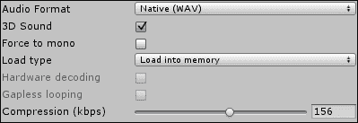

Unity 中可用的各种**音频**设置如下所述：

+   **音频格式**: 此设置更改文件在游戏中的存储方式。"**原生**"提供更高的质量，而"**压缩**"则导致文件大小更小。作为移动平台的一个特殊功能，由于移动设备中的一些特殊硬件，压缩音频可以在其他平台上相对更快地检索。

+   **3D Sound**: 此设置决定文件是否受其在游戏中的位置相对于**音频监听器**的影响。如果未勾选，可以避免一些计算，从而减少每帧游戏中所需的处理量。

+   **强制单声道**：此设置将立体声音频转换为单声道。虽然大多数设备在技术上能够播放立体声音频，但它们并不总是拥有多个扬声器以产生差异。勾选此框可以显著减小音频文件的大小，通过移除额外的音频通道。

+   **加载类型**：此设置影响游戏运行时用于处理音频文件的系统内存量。**加载时解压缩**使用最多的内存，最适合小型短声音。**内存中压缩**仅在文件播放时解压缩文件，使用中等数量的内存，最适合中等大小的文件。**从磁盘流式传输**意味着只有当前正在播放的文件部分存储在运行时内存中。这就像从互联网上流式传输视频或音乐一样。此选项最适合大型文件，但一次只能由少数人使用。

+   **压缩率（kbps）**：此设置调整音频文件中的细节量。较小的值会减小文件大小，但也会降低音质。较大的值会导致文件大小更大，音质更好。如果您的音频已经应用的压缩量小于此处设置的值，则此设置对声音没有影响。通常，在保持所需音质水平的同时，选择最小的尺寸为最佳。

## 玩家设置

通过访问 Unity 的工具栏并导航到**编辑** | **项目设置** | **玩家**来打开您的游戏**玩家设置**。在**平台设置**中，对于 Android，我们在**其他设置**下有其他一些选项，这些选项会影响我们游戏的最终大小和速度。

### 渲染

下面的截图显示了**渲染**设置：

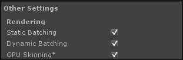

Unity 中可用的各种**渲染**设置解释如下：

+   当我们制作光照贴图时，我们必须将一些对象设置为静态。这告诉 Unity 这些对象永远不会移动，并允许它们进行光照贴图。它还允许 Unity Pro 用户利用**静态批处理**，这可以让 Unity 通过将相同对象分组来显著加快渲染时间。然后它会在多个位置渲染一个对象，而不是单独渲染每个对象。潜在地，此设置可能会增加您最终构建的大小，因为 Unity 需要保存有关您静态对象的额外信息以使其工作。

+   **动态批处理**与**静态批处理**的工作方式相同，但有两大主要区别。首先，它对 Unity Pro 和基本用户都可用。其次，它将未标记为静态的对象分组。

### 优化

**优化**设置如下截图所示：

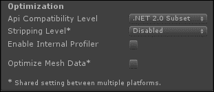

Unity 中可用的各种**优化**设置解释如下：

+   **API 兼容级别**：此设置确定最终构建中包含哪个 .Net 函数集。**.Net 2.0** 将包含所有可用函数，从而产生最大的足迹。**.Net 2.0 子集**是函数集的一个较小部分，仅包括你编程最可能使用的那些函数。除非你需要一些特殊功能，否则**.Net 2.0 子集**应该是你始终选择的选项。

+   **剥离级别**：此设置是 Unity Pro 独有的功能。它允许你在编译之前移除所有多余的代码，从而减小最终构建的大小。系统函数被分组到称为库的内容中，以便于参考。**剥离程序集**将从最终构建中移除未使用的库。**使用微型 mscorlib**选项与前面的选项执行相同的功能，但使用库的最小化形式。虽然库的大小显著减小，但可供代码使用的功能更少。然而，除非你的游戏非常复杂，否则这不应造成差异。

+   **优化网格数据**：此设置将从所有未使用任何材料应用到的网格中移除额外信息。这包括**法线**、**切线**和少量其他信息。除非你有非常特殊的情况，否则始终勾选此框是个好主意。

# 跟踪性能

Unity 为我们提供了许多工具，使我们能够确定游戏运行的好坏。我们将首先介绍的是 Unity Pro 和基本用户都 readily 可用的工具。然而，信息相当有限，尽管仍然有用。第二个工具仅适用于 Unity Pro 用户。它提供了关于性能的更多详细信息和数据。最后，我们将创建自己的工具，使我们能够详细查看脚本的性能。

## 编辑器统计信息

在 **游戏** 窗口的右上角，有一个标有 **Stats** 的按钮。点击此按钮将打开一个窗口，显示有关游戏运行情况的信息。其中有一点点关于游戏运行速度的信息。窗口中的大部分信息都关注游戏的渲染效果，主要涉及当前屏幕上的对象数量、动画对象数量以及它们占用的内存量。

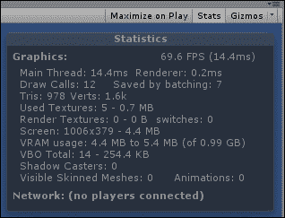

Unity 编辑器中的各种统计数据解释如下：

+   在 Unity 编辑器 **统计信息** 窗口的右上角是当前的 **FPS**（每秒帧数）和最后一帧渲染所需的时间（以毫秒计）。这些值不受 Unity 编辑器其他渲染的影响，尽管在编辑器中运行游戏会有轻微的性能损失。一般来说，如果你能保持游戏运行在 60 FPS 以上，你的游戏将在目标平台上运行得相当好。

+   **主线程**统计提供了运行帧代码并渲染到屏幕所需的时间（以毫秒为单位）。这是处理你游戏单帧所需的总时间。

+   在**主线程**的右侧，我们有**渲染器**。这个统计数字表示仅渲染帧所花费的毫秒数。这个时间已经包含在**主线程**的统计中。

+   **绘制调用**统计是必须绘制到屏幕上的唯一对象的数量。这大约等于当前相机可见的对象数量。所以，相机后面的东西不会被绘制，也不会增加这个值。

+   **批处理节省**统计与**绘制调用**的数量密切相关。我们将在稍后了解更多关于批处理的内容。但就现在而言，批处理是一种特殊的分组过程，可以减少**绘制调用**的数量，使游戏渲染更快。

+   最终，3D 图形中的每个模型都是由一系列三角形组成的。**三角形**是相机看到的和正在渲染的总三角形数。

+   模型文件中的大部分信息都与每个顶点的位置有关。**顶点**是相机看到的和渲染的总顶点数。每个模型的顶点数越少，渲染到屏幕上的速度就越快。

+   **使用纹理**的第一个数字是当前帧中使用的唯一纹理的总数。第二个是它们占用的总内存量。通过降低纹理质量或合并纹理，这个统计数字可以减少，从而使游戏运行更快。

+   **渲染纹理**统计是一种用于特殊效果的特殊纹理，如安全摄像头和实时反射。这个统计数字显示了它们的总可见数和所需的内存量。

+   **开关**统计基本上等同于**渲染纹理**统计所做的工作量。更少的**渲染纹理**和更简单的材质将减少这个数字，从而减少渲染时间。

+   **屏幕**是**游戏**窗口当前宽度和高度的像素值。它还显示了渲染该尺寸所需的内存量。较小的尺寸会导致你的游戏细节更少，但同时也使得游戏更容易渲染。

+   **VRAM 使用**统计提供了当前使用的视频内存的大致最小值和最大值。它还提供了当前可用的总视频内存量（括号内）。有了这个统计数字和了解目标设备中可用的视频内存量，你可以确定你游戏的图形是否足够简单，可以在该设备上运行。

+   **VBO 总数**统计是当前由你的游戏渲染的唯一网格的总数。你可能会使用的每个不同模型都会增加这个统计数字。

+   **阴影投射器**统计用于使用实时阴影时。实时阴影成本很高。如果可能的话，它们不应该在移动设备上使用。但是，如果你必须使用它们，请尽量减少投射这些阴影的对象数量。限制到足够大以至于用户可以看到阴影的移动对象。特别是小型静态对象不需要投射阴影。

+   **可见骨骼网格**统计是当前在摄像机视图中可见的绑定对象总数。**骨骼网格**通常会是你的角色以及几乎所有其他需要动画的对象。

+   **动画**统计提供了场景中当前正在播放的动画总数。

+   **网络**统计组仅在多人游戏中连接到其他玩家时才会可见。信息通常包括游戏连接了多少人以及这些连接的速度有多快。

## 分析器

在 Unity 的**窗口**|**分析器**工具栏下找到的**分析器**窗口是一个分析游戏运行情况的优秀工具。它为我们提供了系统每个部分的彩色分解以及它们正在做多少工作。这个工具唯一真正不幸的部分是它仅适用于 Unity Pro 用户。

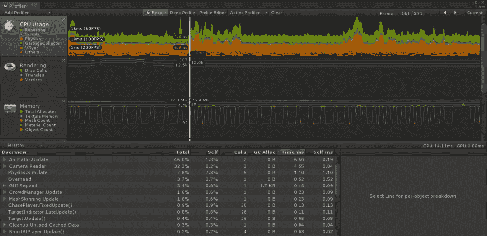

通过首先打开**分析器**窗口，我们可以在窗口中播放游戏并观察工具为我们提供一个相当详细的分解，说明正在发生什么。我们可以点击任何一点，在窗口底部查看关于该帧的详细信息。提供的信息是针对你点击的通道的，**CPU 使用率**、**渲染**、**内存**等等。

**CPU 使用率**信息在尝试找出游戏处理时间过长的部分时特别有用。处理成本的峰值很容易突出。通过点击峰值，我们可以看到导致该帧昂贵的每个游戏部分是如何分解的。对于这些部分中的大多数，我们可以深入到导致问题的确切对象或函数。然而，我们只能追溯到函数级别。仅仅因为我们知道代码中问题的一般位置，分析器也不会告诉我们该函数的哪个部分导致了问题。

为了真正工作，分析器需要钩入你游戏的每个部分。这会在你游戏的速度上引入一点额外的成本。因此，在分析提供的信息时，最好考虑相对成本，而不是将每个成本视为一个确切值。

## 跟踪脚本性能

Unity 提供的所有这些工具都很棒，但并不总是正确的解决方案。Unity 基础用户无法访问 Profiler。此外，Profiler 和编辑器统计信息相当通用。我们可以通过 Profiler 获取更多细节，但并不总是足够。在接下来的部分，我们将创建一个特殊的脚本，能够跟踪任何脚本特定部分的性能。这绝对应该成为你开发者工具包的常规部分。

# 行动时间 - 跟踪脚本

我们将在《太空战士》游戏中创建这个脚本：

1.  首先，我们需要一个特殊的类来跟踪我们的性能统计信息。创建一个新的脚本并将其命名为 `TrackerStat`。

1.  要开始这个脚本，我们首先需要更改类定义行。我们不想也不需要扩展 `MonoBehaviour` 类。所以，找到以下代码行：

    ```java
    public class TrackerStat : MonoBehaviour {
    ```

    然后，将其更改为以下内容：

    ```java
    public class TrackerStat {
    ```

1.  这个脚本开始时有四个变量。第一个将用作 ID，允许我们通过提供不同的键值来同时跟踪多个脚本。第二个将跟踪跟踪的代码片段所花费的平均时间。第三个是跟踪代码被调用的总次数。第四个是代码执行所花费的最长时间。

    ```java
    public string key = "";
    public float averageTime = 0;
    public int totalCalls = 0;
    public float longestCall = 0;
    ```

1.  接下来，我们还有两个额外的变量。这些变量将负责跟踪脚本执行所需的时间。第一个是跟踪开始的时间。第二个是一个标记，表示跟踪已经开始。

    ```java
    public float openTime = 0;
    public bool isOpen = false;
    ```

1.  这个脚本的第一个函数是 `Open`。当我们想要开始跟踪一段代码时调用这个函数。它首先检查代码是否已经在跟踪中。如果代码正在跟踪，它使用 `Debug.LogWarning` 向 **控制台** 窗口发送警告。接下来，它设置标记表示代码正在被跟踪。最后，该函数使用 `Time.realtimeSinceStartup` 跟踪代码被调用的时间，这是游戏开始以来的实际秒数。

    ```java
    public void Open() {
      if(isOpen) {
        Debug.LogWarning("Tracking is already open. Key: " + key);
      }

      isOpen = true;
      openTime = Time.realtimeSinceStartup;
    }
    ```

1.  下一个函数 `Close` 是上一个函数的相反。当达到我们想要跟踪的代码的末尾时调用它。将跟踪应该停止的时间传递给它。这样做是为了最小化执行多余代码的数量。与上一个函数一样，它检查是否正在进行跟踪，如果正在跟踪，则使用 `Debug.LogWarning` 向 **控制台** 窗口发送警告，并提前退出。接下来，将 `isOpen` 标志清除，设置为 `false`。最后，计算自跟踪开始以来经过的时间，并调用 `AddValue` 函数。

    ```java
    public void Close(float closeTime) {
      if(!isOpen) {
        Debug.LogWarning("Tracking is already closed. Key: " + key);
        return;
      }
      isOpen = false;
      AddValue(closeTime - openTime);
    }
    ```

1.  这个脚本的最后一个函数是 `AddValue`。这个函数接收 `callLength` 参数，即跟踪的代码片段所花费的时间长度。然后它使用一些数学运算将值添加到 `averageTime`。接下来，函数将当前的 `longestCall` 与新值进行比较，并选择最长的值。最后，函数增加 `totalCalls` 的值。

    ```java
    public void AddValue(float callLength) {
      float totalTime = averageTime * totalCalls;
      averageTime = (totalTime + callLength) / (totalCalls + 1);

      longestCall = longestCall < callLength ? callLength : longestCall;

      totalCalls++;
    }
    ```

1.  接下来，我们需要创建另一个新的脚本，并将其命名为 `ScriptTracker`。此脚本将允许我们进行实际性能跟踪。

1.  此脚本从单个变量开始。此变量维护所有当前正在跟踪的统计数据。注意这里使用 `static` 的用法；它允许我们轻松地从游戏的任何位置更新列表。

    ```java
    private static TrackerStat[] stats = new TrackerStat[0];
    ```

1.  此脚本的第一函数 `Open` 允许我们开始跟踪代码执行。它使用 `static` 标志，因此可以从任何脚本轻松调用此函数。函数接收一个 `key` 值，允许我们分组跟踪调用。函数首先创建一个变量来保存开始跟踪的统计数据的 `index`。接下来，它遍历当前的一组 `stats` 以查找匹配的 `key` 值。如果找到，则更新 `index` 变量并退出循环。

    ```java
    public static void Open(string key) {
      int index = -1;

      for(int i=0;i<stats.Length;i++) {
        if(stats[i].key == key) {
          index = i;
          break;
        }
      }
    ```

1.  `Open` 函数继续检查是否找到了统计数据。如果我们在当前 `stats` 的整个循环中遍历并且无法找到匹配的 `key`，则 `index` 变量将只会小于零。如果没有找到，我们调用 `AddNewStat`（稍后创建），以创建用于跟踪的新统计数据。然后，将 `index` 设置为新统计数据的索引。最后，通过使用统计数据的 `Open` 函数来触发统计数据开始跟踪。

    ```java
      if(index < 0) {
        AddNewStat(key);
        index = stats.Length – 1;
      }

      stats[index].Open();
    }
    ```

1.  `AddNewStat` 函数接收要创建的统计数据的 `key`。它首先将 `stats` 列表存储在一个临时变量中，并将 `stats` 列表的尺寸增加一个。然后，将每个值从 `temp` 列表转移到更大的 `stats` 列表中。最后，创建一个新的统计数据，将其分配给 `stats` 列表的最后一个槽位，并设置 `key`。

    ```java
    private static void AddNewStat(string key) {
      TrackerStat[] temp = stats;
      stats = new TrackerStat[temp.Length + 1];

      for(int i=0;i<temp.Length;i++) {
        stats[i] = temp[i];
      }

      stats[stats.Length – 1] = new TrackerStat();
      stats[stats.Length – 1].key = key;
    }
    ```

1.  接下来，我们有 `Close` 函数。此函数接收要关闭的统计数据的 `key` 值。它首先找到函数被调用的时刻，以最小化跟踪的额外代码量。然后，它通过遍历 `stats` 列表来查找匹配的 `key`。如果找到，调用统计数据的 `Close` 函数并退出函数。如果没有找到匹配项，调用 `Debug.LogError` 向 **控制台** 窗口发送错误消息。

    ```java
    public static void Close(string key) {
      float closeTime = Time.realtimeSinceStartup;

      for(int i=0;i<stats.Length;i++) {
        if(stats[i].key == key) {
          stats[i].Close(closeTime);
          return;
        }
      }

      Debug.LogError("Tracking stat not found. Key: " + key);
    }
    ```

1.  此脚本的最后一个静态函数是 `Clear`。它仅清空统计数据列表，使其准备好进行新的跟踪。

    ```java
    public static void Clear() {
      stats = new TrackerStat[0];
    }
    ```

1.  脚本的最后一步是 `OnGUI` 函数。这个函数将允许我们在游戏进行时查看我们的统计数据。在其中，我们大量使用 `GUILayout` 类及其函数。`GUILayout` 自动排列各种 GUI 元素，使我们能够花费更少的时间排列，更多的时间分析。我们首先使用 `BeginVertical` 开始一个元素的垂直列表。使用 `BeginHorizontal` 开始一个元素的水平列表。然后使用 `Label` 函数为我们的统计数据每一行创建标题。我们使用 `GUILayout.Width` 函数为每个标签指定一个特定的宽度，使布局看起来更加美观。接下来，调用 `EndHorizontal` 来关闭水平列表。每个 `BeginHorizontal` 的调用都必须与一个 `EndHorizontal` 相匹配，否则 Unity 将会提出许多抱怨。

    ```java
    public void OnGUI() {
      GUILayout.BeginVertical();

      GUILayout.BeginHorizontal();
      GUILayout.Label("Key", GUILayout.Width(150));
      GUILayout.Label("Average", GUILayout.Width(100));
      GUILayout.Label("Total", GUILayout.Width(50));
      GUILayout.Label("Longest", GUILayout.Width(100));
      GUILayout.EndHorizontal();
    ```

1.  接下来，我们遍历我们的统计数据列表。对于每一个，我们创建一个水平列表，并使用 `Label` 在屏幕上绘制每个统计数据。`ToString` 函数用于将数字转换为字符串，这是标签所需的。

    ```java
      for(int i=0;i<stats.Length;i++) {
        GUILayout.BeginHorizontal();

        GUILayout.Label(stats[i].key.ToString(), GUILayout.Width(150));
        GUILayout.Label(stats[i].averageTime.ToString(), GUILayout.Width(100));
        GUILayout.Label(stats[i].totalCalls.ToString(), GUILayout.Width(50));
        GUILayout.Label(stats[i].longestCall.ToString(), GUILayout.Width(100));

        GUILayout.EndHorizontal();
      }
    ```

1.  `OnGUI` 函数通过创建一个按钮结束，该按钮在被点击时调用 `Clear` 函数。最后，调用 `EndVertical` 函数来结束元素的垂直列表。每个 `BeginVertical` 的调用都必须与一个 `EndVertical` 的调用相匹配，就像水平列表一样。

    ```java
      if(GUILayout.Button("Clear"))
        Clear();

      GUILayout.EndVertical();
    }
    ```

1.  要测试这些脚本，打开你的 `PlayerShip` 脚本。在 `Rotate` 函数的开始处添加以下行以开始跟踪运行所需的时间。

    ```java
    ScriptTracker.Open("PlayerShip_Rotate");
    ```

1.  在 `Rotate` 函数的末尾，我们需要调用与相同键的 `Close` 函数。

    ```java
    ScriptTracker.Close("PlayerShip_Rotate");
    ```

1.  最后，创建一个空的游戏对象，并将你的 `ScriptTracker` 脚本添加到其中。开始游戏并查看结果。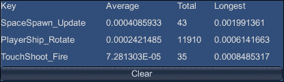

## *刚才发生了什么？*

我们创建了一个用于测试代码特定部分的工具。通过将任何代码块包裹在函数调用中并发送一个唯一的 ID，我们可以确定执行代码所需的时间。通过平均调用脚本，并包裹不同的代码部分，我们可以确定脚本中哪些部分完成得最慢。我们还可以找出代码部分是否被调用得太多。这两种情况都是开始寻找以减少处理和延迟的理想点。

在部署你的游戏之前，务必删除对这个工具的所有引用。如果留在最终关卡中，它可能会给 CPU 增加不必要的负担。这种对游戏的负面影响可能会使游戏无法玩。始终记得清除任何仅用于编辑器调试的工具的使用。

# 减少延迟

延迟是那些用来描述应用程序运行速度低于预期的不明确概念之一。作为开发者，我们不断努力提供尽可能高质量的用户体验，同时保持用户期望的速度和响应性。这本质上取决于用户设备上的处理器是否能够处理提供游戏体验的成本。你游戏中的一些简单对象会导致快速处理。几个复杂对象将消耗最多的处理资源。

# 遮挡

遮挡非常适合拥有大量对象的游戏。在其基本形式中，任何在相机两侧或后面的对象都不可见，因此不会被绘制。在 Unity Pro 中，我们能够设置遮挡剔除。这将计算相机实际上可以看到的内容，不会绘制任何被遮挡的对象。在使用这些工具时，需要达到一个平衡。计算不可见内容的成本需要低于仅绘制这些对象的成本。作为一个经验法则，如果你有很多较小的对象，它们经常被较大的对象遮挡，那么遮挡剔除是正确的选择。

# 行动时间 – 隐藏坦克

我们将向坦克大战游戏添加遮挡剔除，因为它是有足够大物体可以遮挡视线的唯一游戏：

1.  因此，现在打开坦克大战游戏。如果你完成了挑战并添加了额外的碎片和障碍物，这一部分对你尤其有效。

1.  通过访问 Unity 的工具栏并导航到**窗口** | **遮挡剔除**来打开遮挡窗口。此窗口是您修改与游戏中的遮挡相关的各种设置的主要访问点。

1.  切换到**烘焙**页面，我们可以查看与遮挡剔除相关的选项。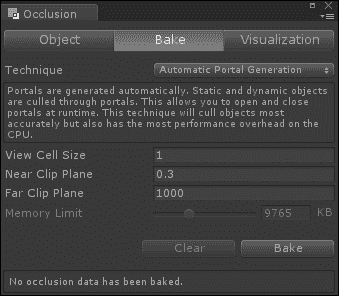

    +   **技术**: 此设置将确定在设置遮挡剔除时使用哪种方法。

        **仅 PVS**: 此设置将仅计算场景中的静态对象以应用遮挡剔除。这个选项对处理器的压力最小，但只有在场景中移动对象非常少的情况下才适用。

        **PVS 和动态对象**: 此设置将预先计算相机可以看到哪些对象。对于动态对象，系统将创建传送门。它们用于剔除位于传送门两侧且从相机视图中不可见的对象。

        **自动传送门生成**: 此设置将基于传送门剔除静态和动态对象。虽然提供了最高的准确性，但此选项对处理器的成本也最高。

        **视图单元格大小**: 此设置设置遮挡计算的详细程度。较小的值将导致更好的剔除，但会导致文件大小增加以存储额外的信息。

        **近裁剪面**和**远裁剪面**：这些设置被系统用来估计相机在任何空间点可以看到的内容。它们应该设置为游戏中所有相机中最小的**近裁剪面**和最大的**远裁剪面**。

        **内存限制**：当选择任一**PVS 技术**时，此设置会被使用。它有助于指导可以放入计算中的细节程度。

1.  选择**技术**为**PVS 和动态对象**，**视图单元格大小**为`5`。

1.  为了使遮挡系统与动态对象一起工作，我们需要设置若干遮挡区域。要创建它们，创建一个空的**GameObject**，并在 Unity 的工具栏下**组件** | **渲染** | **遮挡区域**中添加一个**遮挡区域**组件。

1.  它们需要覆盖任何动态对象将位于的区域。创建并定位足够多的区域来覆盖我们游戏中的街道。它们的大小可以像使用**盒子碰撞体**组件时一样编辑。务必使它们足够高，以覆盖所有目标。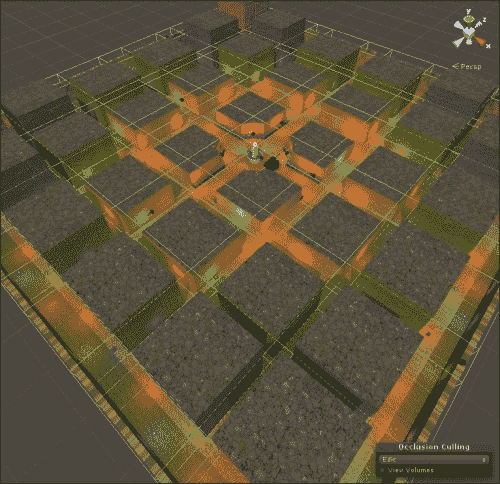

1.  在**遮挡**窗口的底部点击**烘焙**。Unity 编辑器的右下角将出现一个进度条，告诉你计算还需要多长时间。这个过程通常需要相当长的时间，尤其是当你的游戏变得越来越复杂时。

1.  当烘焙过程完成后，**遮挡**窗口应该已经切换到**可视化**选项卡，并且你的**场景**窗口中应该已经选择了相机。如果没有，请现在选择它们。在**场景**视图中，Unity 将为我们预览遮挡剔除的工作情况。只有那些可以看到的对象才会可见，其余的将被关闭。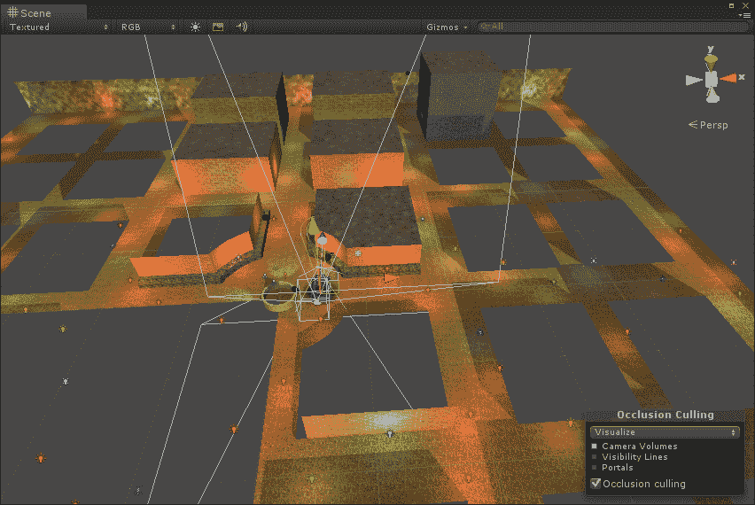

## *发生了什么事？*

我们已经了解了设置遮挡剔除的基本过程。我们查看**遮挡**窗口，并了解了那里的设置。遮挡剔除对于减少场景中的绘制调用数量非常有用。然而，这种减少需要与存储和检索遮挡计算的成本相平衡。这种平衡是通过选择适当的**技术**和合适的**视图单元格大小**来实现的。现在尝试不同的值，找到一个既提供适当细节又不过度提供信息的单元格大小。

## 需要记住的要点

以下是一份处理和避免游戏中卡顿的技巧列表。并非所有这些技巧都适用于你制作的每个游戏，但它们对于每个项目都是值得记住的：

+   在创建材质时，如果可能的话，避免使用透明着色器。它们渲染起来稍微昂贵一些。而且，如果你避免使用它们，你可以在处理深度排序时节省很多麻烦。

+   每个对象使用一种材料。你的游戏中调用绘制的次数越多，每一帧渲染所需的时间就越长。每个网格都会根据其上的材料绘制一次，即使材料看起来没有做任何事情。通过每个对象使用一种材料，尤其是在移动平台上，你可以最小化调用绘制的次数并最大化渲染速度。

+   在可能的情况下合并纹理。你制作的每个纹理并不一定会利用整个图像。每当可能时，将同一场景中对象的纹理合并在一起。这最大化了你对图像的有效使用，同时减少了最终构建的大小和利用这些纹理所需的内存量。

+   使用空 GameObject 在**层次结构**中分组对象。虽然这并不是专门用于减少延迟，但它会使你的项目更容易操作。特别是对于大型和复杂的关卡，你将能够花费更少的时间在场景中的对象中搜索，更多的时间制作出优秀的游戏。

+   **控制台**窗口是你的朋友。在担心你的游戏无法工作之前，首先查看 Unity 中的**控制台**窗口或底部的栏。两者都会显示 Unity 可能对你当前游戏设置的任何不满。这里的信息对于指出解决问题的正确方向非常有用。如果你对消息的含义感到不确定，请在 Google 上搜索该消息，你应该能够轻松地从许多其他 Unity 用户那里找到解决方案。如果你的代码似乎不起作用，而 Unity 没有对此提出抱怨，请使用`Debug.Log`函数将消息打印到**控制台**。这将让你找到代码可能意外退出的地方，或者不是应有的值。

+   设备测试很重要。在编辑器中工作很棒，但没有什么能比在目标设备上测试更接近真实情况了。你可以在设备上更好地感受到你的游戏性能。编辑器总是引入一定量的额外处理开销。此外，你正在工作的电脑总是比你可能打算部署的移动设备更强大。

# 摘要

在本章中，我们学习了在 Unity 中进行优化的选项。我们首先查看了一些设置，这些设置用于我们游戏中使用的资产，以在保持质量的同时降低文件大小。接下来，我们了解了一些影响整个游戏的设置。之后，我们探讨了跟踪游戏性能的选项。我们首先查看了一些 Unity 提供的用于跟踪性能的工具。然后，我们创建了一个用于详细跟踪脚本性能的工具。然后，我们查看了一些减少游戏延迟的选项，包括利用遮挡剔除。现在我们已经了解了所有这些工具和选项，请检查我们创建的游戏并进行优化。让它们变得尽可能好。

在这本书中，我们学到了很多。我们从学习 Unity、Android 以及如何使它们协同工作开始。我们的旅程继续通过探索 Unity 的 GUI 系统并创建一个井字棋游戏。然后，我们学习了任何游戏都需要的基本资源，同时开始创建一个坦克大战游戏。我们的坦克大战游戏通过添加一些特殊相机效果和一些光影效果而扩展。通过引入一些敌人并让他们追逐玩家，我们完成了坦克大战游戏的创建。我们的太空战斗机游戏让我们了解了可以在我游戏中利用的触摸和倾斜控制。短暂的休息后，我们创建了一个愤怒的小鸟克隆版，同时学习物理和 Unity 中 2D 游戏的可能。然后，我们回到太空战斗机游戏，通过添加声音和粒子效果来增加一些细节。最后，通过学习优化我们的游戏，我们的旅程画上了句号。感谢您阅读这本书。享受您与 Unity 一起的经历，并创建您一直梦想中的精彩游戏。
