# 第三章。你好，世界

> 在本章中，我们将从头开始构建一个新的项目，并生成第一个由读者创建的应用程序，我们可以在我们的 iOS 设备上运行。虽然我们之前已经尝试过将应用程序部署到我们的设备，但这些是预构建的应用程序。现在是时候摘掉训练轮，测试这个环境了。

在本章中，我们将：

+   编写我们的第一个场景

+   在编辑器中测试我们的应用程序

+   自定义 iOS 设置

+   将此应用程序部署到设备

这才是真正的乐趣所在...

# 编写我们的第一个场景

在我们的第一个应用程序中，我们将遵循软件开发传统，创建典型的第一个程序“Hello World”。由于我们使用 Unity 来创建游戏，创建一个 3D 世界并将其部署到我们的设备似乎是有意义的。完成之后，我们应该能在我们的设备上看到地球：

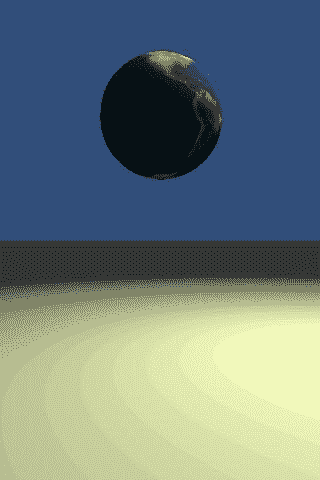

我们“Hello World”游戏的最终输出

# 从基础知识开始

对于我们的第一个游戏，我们将从基础知识开始。

1.  创建场景

1.  创建示例对象

1.  自定义示例对象

1.  控制摄像机

1.  部署到 iOS 设备

# 行动时间 — 创建场景

1.  我们的第一步是创建一个新的 Unity 项目，通过选择 **文件 | 新项目**。在项目目录中指定你希望 Unity 创建此新项目的位置，然后按 **创建项目** 按钮：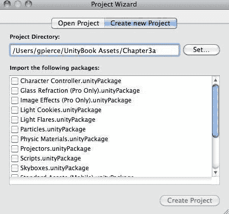

    +   Unity 将常见的脚本、资产和其他可重用功能打包成可分发文件，这些文件被称为 Unity 包。这些单个文件归档以 `.unityPackage` 扩展名结尾，并代表 Unity 中共享的主要机制。对于这些第一个应用程序，我们不会将任何包导入 Unity，所以请不要担心选择任何包。

        大多数游戏都被分成场景或级别，Unity 就是围绕这个概念设计的。在最基本的状态下，场景只是一个容器，指向所有的艺术资产、脚本、行为等等。当然，你可以把所有内容都放在一个大的场景中，但这更适合非常小的游戏或那些从互联网上流式传输所有内容的游戏。考虑到大多数 iOS 设备的约束以及即使是 3G 互联网连接的速度，这样做是不切实际的，所以我们将专注于基于级别的设计。

1.  当 Unity 创建我们的项目时，它为我们创建了一个默认场景，只需保存即可。Unity 将将所有场景放入项目的 `Assets` 文件夹中。将场景保存为 **level1**，你会在 **项目** 视图中看到新的级别表示：

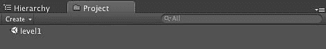

+   一旦你开始创建多个场景，你只需在 **项目** 视图中双击场景，它就会更改 **场景** 视图和 **游戏** 视图以表示新的状态。

## 刚才发生了什么？

我们刚刚为我们的游戏创建了一个简单的场景。目前它非常空旷，但已经准备好填充演员、剧本和其他功能，成为一个真正的游戏。

# 行动时间——在场景中创建对象

接下来，我们需要在我们的场景中创建一些对象，否则我们的游戏将会非常无聊。我们需要创建的第一个对象是代表地面的东西。是的，我知道太空中没有地面，但为了说明一些可用的功能，我们需要地面。

1.  在**主菜单**中，通过选择**GameObject | 创建其他 | 平面**来创建一个新的平面。

1.  我们还希望给这个平面一个独特的名称，所以请在**检查器**视图中通过选择**平面**文本并将其替换为**地面**来将对象的名称从平面更改为地面。Unity 现在也将把这个对象称为**地面**。这将在我们稍后尝试对地面平面进行操作时很有用：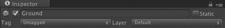

1.  在**检查器**中，通过将**缩放**更改为**(100, 1, 100**)来增加我们地面平面的尺寸。这应该给我们提供足够的空间来移动：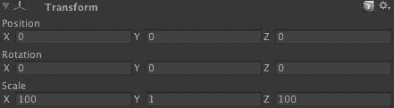

1.  Unity 3 的新特性之一是能够从摄像机的视角快速渲染出世界的样子，而无需玩游戏。在**层次结构**视图中选择**主摄像机**对象，你将在**场景**视图中看到一个**相机预览**窗口，它显示摄像机所看到的内容。这个窗口也是一个实时预览，因此当场景中的对象发生变化时，**相机预览**将更新以反映这些变化：

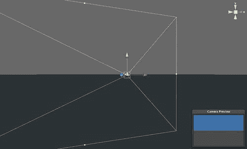

## 刚才发生了什么？

我们刚刚为我们的“Hello World”场景创建了一个简单的地面物体，并探讨了如何使用相机预览来预览世界。

# 行动时间——光之出现

在 Unity 中，你最重要的资产之一是光照。有了正确的光照效果，你的游戏可以从看起来很普通变成革命性的。Unity 拥有一个非常复杂的照明引擎，可以处理动态光照、使用 Beast 照明系统烘焙光照，以及延迟光照。

1.  目前，我们将通过选择**创建 | 点光源**来创建一个基本的光源，这将向我们的场景添加一个**点光源游戏对象**：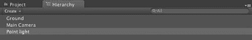

1.  现在你已经创建了一个点光源，让我们将其放置在场景上方，以便它能够反射到其他对象上。在**检查器**中，将**位置**更改为**(0,5,0**)。这应该将其放置在场景上方：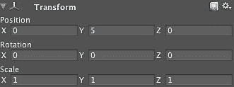

1.  通过按快捷键 F 将编辑器中心对准这个光源，让我们聚焦于这个对象：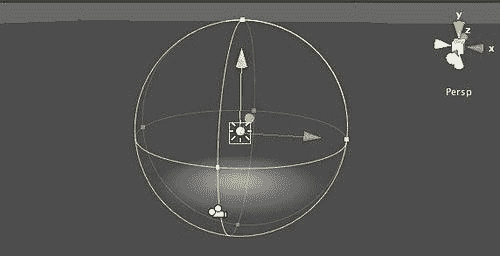

1.  为了确保我们的灯光足够亮，让我们将**强度**设置为**4**。你可以使用滑块，或者直接在滑块旁边的文本框中输入**4**：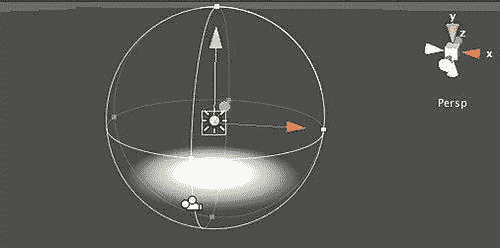

    +   你还可以看到，由于场景中现在有更多的光线，光线的强度已经增加：

    

1.  选择**主相机**，你将看到一个**相机预览**，显示光线照在地面平面上：

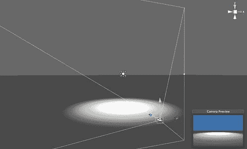

## 刚才发生了什么？

我们已经为场景添加了一些灯光，这样我们就能看到场景中发生的事情。记住，如果没有灯光，玩家将看不到太多东西。虽然我们在这里创建了一个简单的光照模型，但你将看到，光照可能是你可以添加到你的游戏中的最重要的功能之一，因为它将为你的对象提供大量的视觉保真度。

# 行动时间 — “Hello World”

如果我们没有在“Hello World”章节中实际放入世界，那么这个章节有什么用呢？

1.  在**层次视图**中，通过**创建 | 球体**创建一个**球体**。

1.  在**检查器**中将这个游戏对象重命名为**世界**。

1.  让我们将它稍微移出中心，以便我们可以看到灯光对这个球体的影响，将其**位置**设置为**(-2, 2, 0)**。虽然这很有趣，但这并不太像我们所处的世界：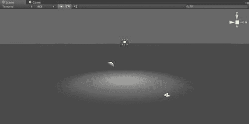

1.  在`第三章`文件夹中，你会找到一个名为`earth.jpg`的文件。选择**项目视图**，并将这个纹理直接拖动到**项目视图**中。Unity 环境可能会暂停片刻，因为 Unity 正在导入这个文件。

1.  在**项目视图**中选择地球纹理，你将看到这个纹理的详细信息：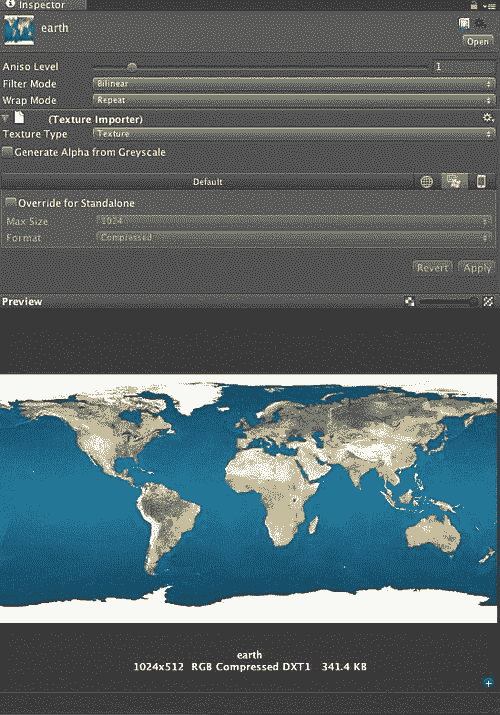

1.  如果我们能够将这个纹理直接应用到我们的球体上，并渲染出我们的世界，那将非常不错。Unity 的开发者也认为这会很好。因此，你可以将地球纹理从**项目视图**拖动到**场景视图**中的我们的球体上，它将自动为其添加纹理。

1.  选择**场景视图**并检查我们场景的渲染。我们越来越接近真正的“Hello World”：

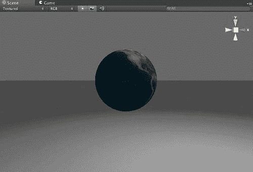

## 刚才发生了什么？

我们已经为我们游戏添加了第一个演员。在这种情况下，我们的演员是一个非常简单的带有纹理的球体模型，但我们刚刚执行了将对象放入 Unity 场景的基本步骤。

# 行动时间 — 控制相机

这一切都非常有趣，但我们离我们的创作相当远，而且我们没有移动场景的能力。通过传统的 iOS 设备，我们可以通过访问设备内的加速度计来完成这项任务：

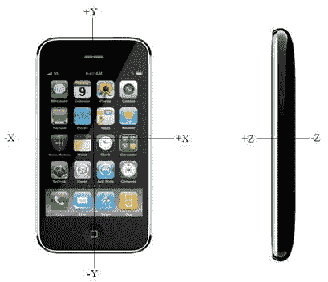

Unity 将加速度计的所有功能封装到 `Input` 类中，我们可以使用其属性和方法来连接到加速度计并确定设备上的情况。

### 小贴士

来自 Unity iPhone 的用户会注意到，所有 Unity iOS 的输入都封装在 `Input` 类中。不再需要使用 `iPhoneInput` 类。

1.  在 **项目** 视图中，通过选择 **创建 | JavaScript** 创建一个新的 JavaScript 脚本。这将创建一个名为 `NewBehaviourScript` 的新脚本。

1.  双击此脚本将在 Unity 的默认编辑器 **Unitron** 中打开脚本。当我们深入研究脚本时，我们将介绍其他 Unity 提供的用于开发脚本的工具，即 MonoDevelop。

1.  在脚本窗口中，我们只需在 `Update` 函数中输入脚本的代码：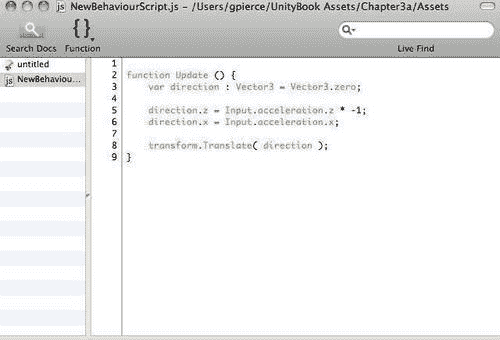

    ### 小贴士

    **下载示例代码**

    你可以从你购买的所有 Packt 书籍的账户中下载示例代码文件：[`www.packtpub.com`](http://www.packtpub.com)。如果你在其他地方购买了这本书，你可以访问 [`www.packtpub.com/support`](http://www.packtpub.com/support) 并注册以直接将文件通过电子邮件发送给你。

    +   脚本通常必须附加到游戏对象才能执行任何有用的操作。在我们的例子中，我们想要移动相机，因此需要将此脚本附加到相机上。在 Unity 中有两种方法可以实现这一点。与纹理化一样，你可以直接将脚本拖放到相机上。

1.  在 **层次结构** 视图中选择 **主相机** 对象。

1.  然后，在 **项目** 视图中，将脚本从 **项目** 视图中拖动到 **检查器** 视图中的相机或 **层次结构** 视图中的对象上。

    完成此任务的另一种方法是，在 **层次结构** 视图中选择 **主相机**，然后，在 Unity 菜单栏中选择 **组件 | 脚本 | 新行为脚本**。

    在任何情况下，你会发现 Unity 已经将你的脚本添加到了相机中：

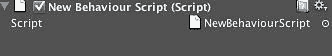

## 刚才发生了什么？

我们刚刚探讨了在 Unity 环境中如何处理脚本。你的游戏功能中的每一部分都将通过脚本实现，而你刚刚也看到了添加这些行为是多么简单。

# 行动时间 — 部署到 iOS 设备

现在我们已经创建了一个有用的应用程序，是时候将我们的新作品部署到我们的 iOS 设备上，并使用加速度计来探索我们的场景。因为我们之前已经运行过这个过程，所以我们可以从高层次上概述这些细节，但再次走一遍这个过程是很重要的，以确保过程感觉正确。

1.  我们首先需要确保我们正在部署正确的应用程序类型。当 Unity 最初创建我们的新项目时，它是为桌面部署创建的。我们需要在**构建设置**（**文件 | 构建设置**）中更改这一点：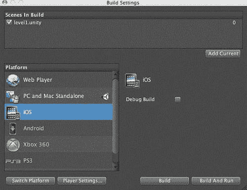

1.  在这里的一个重要步骤是确保我们想要包含在设备构建中的任何场景都包含在内。

1.  点击**添加当前**按钮，我们的 level1 场景以及该场景所需的全部资源都将包含在为设备打包的应用程序中。

1.  选择 iOS 平台作为目标平台，然后点击**切换平台**按钮。Unity 将暂停片刻，并对项目进行必要的更改，以便它可以部署到新的目标平台：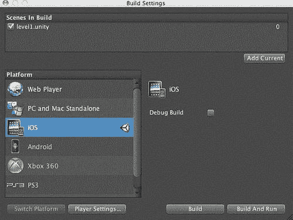

    +   完成此操作后，唯一剩下的事情就是更改项目的构建设置，以便 Unity 可以与 XCode 通信并构建用于部署的应用程序。

1.  与之前一样，我们需要创建一个**App ID**并将配置文件部署到我们的开发机器上，以便 Unity 可以完成此操作。进入**iOS 配置文件门户**并为我们的新应用程序创建一个新的**App ID**。虽然我们可以使用之前使用的相同**App ID**，但请记住，这样做会替换我们刚刚构建的应用程序：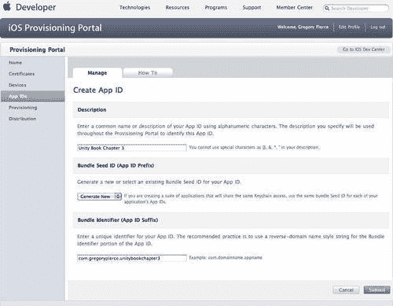

1.  接下来，我们需要创建另一个配置文件，以便我们可以将应用程序部署到设备：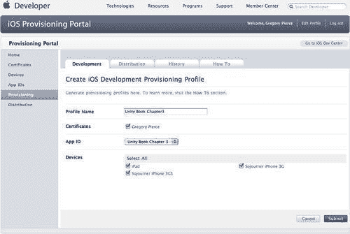

1.  一旦创建了配置文件，您需要下载配置文件，以便 XCode 可以将应用程序部署到您的 iOS 设备上：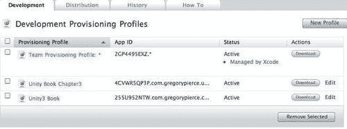

1.  双击配置文件将打开 XCode 的组织者并将配置文件部署到您的设备：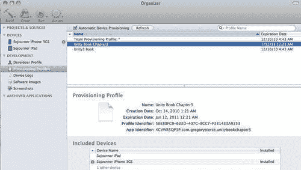

1.  完成此操作后，我们只需通知 Unity 应使用哪个**App ID**，通过在**包标识符**中输入该**App ID**即可：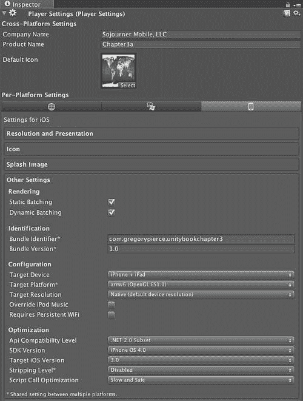

    ### 小贴士

    使用我们自己的图标而不是使用库存的 Unity 图标会更好。您使用的图标应该是您 unity 项目中的一个资源，可以是您想要的任何纹理。只需将那个纹理拖放到默认图标框中，Unity 就会完成剩余的工作。

1.  完成所有这些步骤后，我们最后需要执行的操作是调用 Unity 的构建过程，以便它可以使用 XCode 编译我们的游戏并将其安装在手机上。我们可以通过**文件 | 构建 & 运行**来完成此操作。

1.  在您完成这些步骤后不久，Unity 将开始在您的 iOS 设备上运行。

记住我们激活了加速度计，所以一旦我们的游戏开始，我们就会开始在场景中移动。

## 刚才发生了什么？

我们刚刚从头开始构建了我们的第一个游戏应用。目前它做不了太多事情，但我们已经打开了为 iOS 平台构建优秀游戏的大门。这也应该让你对如何通常与 Unity 环境交互有一个感觉。Unity 是一个沙盒，你可以添加各种资产，然后创建脚本，为这些资产赋予行为。

# 摘要

我们构建了一个实际上值得在本章向人们展示的应用。虽然它不太可能带来数百万美元的销售收入或获得名人地位，但这对于在 Unity 中开发游戏来说是一个关键的里程碑，因为我们刚刚接触到了许多游戏开发工作流程。

现在我们已经构建了第一个场景，我们需要浏览一下 Unity 的核心概念，因为没有对 Unity 工作原理的清晰理解，我们将很难真正利用这个环境。Unity 概念将成为下一章的基础。
