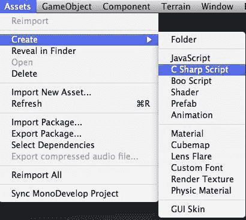
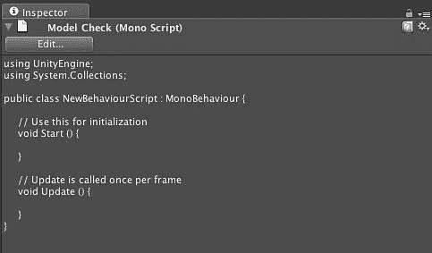

# 第五章。脚本：到底是谁的台词？

> 我们终于走过了基础阶段。如您所观察到的，我们一直在使用的任务和资产变得越来越复杂。现在我们已经触及脚本，现实将变得具体。脚本就是您赋予创作生命并使其成为实际游戏的方式。在此之前，我们最好的做法是通过脚本相机在无生命的世界上移动——现在我们可以玩游戏了。

在本章中，我们将学习：

+   Unity 如何处理脚本

+   iOS 的特定脚本限制和接口

+   Unity 提供的基本 iOS 脚本

+   将数据集成到网络服务中保存

脚本可能是您需要了解的最重要的东西，以便有效地与 Unity 交互。虽然您可以优化您的资产，高效地构建场景，并利用设备上的每一个功能——但如果您没有正确处理脚本，它将不会做任何有用的事情。

那我们就开始吧...

# 重要的预备知识

本章假设您有编程背景，并且对 JavaScript、C# 或 Boo 有所了解。由于这些是 Unity 支持的脚本语言，对这些语言的设计有一定的了解是必要的。

# Unity 脚本入门

Unity 毫无疑问是任何价格范围内最灵活和最完整的脚本系统之一。它为开发者提供了使用 Boo、JavaScript 和 C# 等语言的能力，Unity 在支持各种开发者方面覆盖了所有基础。虽然系统内没有对 Java 的具体支持，但 C# 是一种成熟的语言，它提供了与该语言近似的支持。此外，通过 .Net/Mono 框架，您可以自行支持 Java、F# 或任何受 .Net 平台支持的其它语言，包括您创建的任何新语言，尽管使用 Boo 构建**领域特定语言（DSL）**可能更容易。最重要的是，在 Unity 中，每种语言都是一等公民。在少数例外的情况下，您在 Unity 中想要做的任何事情都可以完成，无论您选择哪种语言。

Unity 脚本系统是完成 Unity 内部任务、自定义 Unity 编辑器和与运行时平台交互的核心。通过脚本，您可以访问您想要更改的每一项（我确实是指每一项），包括能够通过**抽象语法树（AST）**本身扩展 Unity 编译器。

## 哎呀！你遇到了 Mono！

当微软最初创建 .Net 平台时，它主要是为了 Windows 平台。然而，微软发布了语言规范给 ECMA，不久之后，Mono 开源项目被创建，将 .Net 平台带到了其他平台，包括 OSX 和 Linux。在核心上，Unity 脚本系统是基于 .Net 运行时构建的，并通过 Mono 项目获得了其提供的优势。虽然 Unity 脚本系统完全有可能基于 Java 或其他系统，但 .Net 提供了（开箱即用的）一个丰富的系统，使得跨语言功能实现变得非常简单。

## 常见语言基础设施

由于 .Net 的 **通用语言基础设施 (CLI)**，Unity 中可以实现多种脚本语言。通用语言基础设施 (CLI) 的目的是提供一个语言中立的平台，用于应用程序开发和执行，包括异常处理、垃圾回收、安全和互操作性等功能。通过在 CLI 范围内实现 .NET 框架的核心方面，这些功能将不会绑定到单一的语言，而是将在框架支持的许多语言中可用。微软对 CLI 的实现被称为 **通用语言运行时 (CLR**) 或 **CLR**。

## Boo- 比马里奥中的幽灵还要多

Boo 是一种面向对象的、静态类型的编程语言，旨在利用通用语言基础设施对 Unicode、国际化和网络应用程序的支持，同时使用受 Python 启发的语法和特别关注语言和编译器可扩展性。一些值得注意的功能包括类型推断、生成器、多方法、可选的鸭子类型、宏、真正的闭包、柯里化和一等函数。Boo 自 2003 年以来一直在积极开发。

Boo 是一种免费软件，采用 MIT/BSD 风格的许可证发布。它与 Microsoft .NET 和 Mono 框架都兼容。

### Boo 脚本看起来是什么样子？

```swift
import UnityEngine 
import System.Collections 
class example(MonoBehaviour): 
def Start(): 
curTransform as Transform 
curTransform = gameObject.GetComponent[of Transform]() 
curTransform = gameObject.transform 
def Update(): 
other as ScriptName = gameObject.GetComponent[of ScriptName]() 
other.DoSomething() 
other.someVariable = 5

```

### 我应该选择 Boo 吗？

如果你正在寻找一种新的、新颖的编写代码的方式，这种方式不需要太多的仪式感，也不浪费你很多时间在大量的花括号上，Boo 确实是一种你想要深入了解的语言。虽然有些人认为使用空白作为分隔符的想法令人反感，但在 Boo 中编写代码却有一种优雅。如果你使用过传统语言，那么理解它并不困难，而且 Unity（非 iOS 版本）中的一些功能只能使用 Boo 来访问。

虽然 Boo 是一种优秀的语言，但有两个原因你不应该选择它。

1.  首先，用 Boo 编写的示例非常少，在社区中关于它的讨论也很少。

1.  更重要的是，截至本文写作时，Boo 目前不支持 iOS 平台。

因此，我们在 iOS 语境下对 Boo 的讨论突然结束。

## UnityScript/JavaScript — 不仅仅局限于网页

JavaScript 是 ECMAScript 语言标准的实现，通常用于在宿主环境中启用对计算对象的程序性访问。它可以被描述为一种基于原型的面向对象脚本语言，它是动态的、弱类型的，并且具有一等函数。它也被视为一种函数式编程语言，如 Scheme 和 OCaml，因为它具有闭包并支持高阶函数。

虽然 UnityScript 在表面上与 JavaScript 的语法相似，但 Unity 使用的实现并不完全符合 ECMAScript 规范。

### 一个 JavaScript 脚本看起来是什么样子？

```swift
function Start () { 
var curTransform : Transform; 
curTransform = gameObject.GetComponent(Transform); 
// This is equivalent to: 
curTransform = gameObject.transform;
}
function Update () { 
// To access public variables and functions 
// in another script attached to the same game object. 
// (ScriptName is the name of the javascript file) 
var other : ScriptName = gameObject.GetComponent(ScriptName); 
// Call the function DoSomething on the script other.DoSomething (); // set another variable in the other script instance other.someVariable = 5; }
function Update () { // To access public variables and functions // in another script 
attached to the same game object. // (ScriptName is the name of the javascript file) var other : ScriptName = gameObject.GetComponent(ScriptName); // Call the function DoSomething on the script other.DoSomething (); 
// set another variable in the other script instance 
other.someVariable = 5; }

```

### 我应该选择 JavaScript 吗？

JavaScript 是 Unity 社区中使用的默认语言，并在整个互联网上广泛使用。许多人将 JavaScript 称为 Unityscript。世界上有很多人每天都在使用它，如果你来自 Flash 背景，这将是你可能获得的 ActionScript 移植便捷性的最接近（直到有人将 ActionScript 移植到 Unity）。JavaScript 的一个强大优势是，完成事情时没有太多的仪式感，在大多数情况下，你会发现你用 JavaScript 构建应用程序时编写的样板代码要少得多。不需要创建类结构，也没有太多直接访问对象属性并使用它们的需要。

JavaScript 可在所有平台上使用，包括 iPhone，但随着你开始使用更大团队构建更复杂的示例，你可能会发现更多的结构和类型将导致缺陷更少。此外，尽管 JavaScript 是目前社区的选择，但大多数作者和开发者正在转向 C#作为他们的主要开发语言。

## C# 微软的复仇

C#（发音为“see sharp”)[6]是一种多范式编程语言，包括命令式、声明式、函数式、泛型、面向对象（基于类）和组件式编程学科。它是在.NET 倡议下由微软开发的，后来被 Ecma（ECMA-334）和 ISO（ISO/IEC 23270）批准为标准。C#是专为通用语言基础设施设计的编程语言之一。

C#旨在成为一个简单、现代、通用、面向对象的编程语言。

### 一个 C#脚本看起来是什么样子？

```swift
using UnityEngine; using System.Collections; public class example : MonoBehaviour { void Start() { Transform curTransform; curTransform = gameObject.GetComponent<Transform>(); curTransform = gameObject.transform;
C# scriptstructure}
void Update() { ScriptName other = gameObject.GetComponent<ScriptName>(); other.DoSomething(); other.someVariable = 5;
}
}

```

### 我应该选择 C#吗？

作为一种语言，C# 对于在过去 10 年内进行过任何现代面向对象编程的人来说将会很熟悉。其语法对 Java 开发者来说非常熟悉，对于 C++开发者来说也相对容易上手。

互联网上有许多库可以直接添加到你的项目中，用于执行诸如 XML 解析、连接社交网络、加载页面等操作。此外，Unity 社区中 C#开发者数量众多，因此未来对 C#项目和文档的重视程度将进一步提高。

最后，许多已经发布了大量 iOS 项目的开发者表示，C# 是编写应用程序的一个更容易的途径。如果你来自专业的游戏开发背景，或者想要一个干净的面向对象的 Java/Pascal 语法，这是你的最佳选择。

### 注意

在本书的其余部分，我们将使用 C# 作为脚本的语言。

# 行动时间 — 创建和组织脚本

在 Unity 中创建一个新的 C# 脚本与使用 JavaScript 或其他任何脚本语言创建脚本的方法类似。

1.  选择 **资产 | 创建 | C# 脚本**。这将在一个项目中创建一个新的 C# 脚本：

    ### 注意

    虽然 Boo 脚本确实作为一个选项出现，但它不能用于 Unity iOS 项目。

    

1.  一旦创建了新的脚本，它将以 `NewBehaviorScript` 的名称出现在 **项目** 视图中，并包含 `Start()` 和 `Update()` 方法的占位符：

1.  创建一个名为 `Scripts` 的文件夹，然后将新创建的脚本拖放到脚本目录中。

## 刚才发生了什么？

脚本的一个最佳实践是将它们放在项目中的一个文件夹中。你给这个文件夹起什么名字并不重要，因为它更多的是为了你自己的组织目的，而不是为了 Unity。你可以选择将 UI 相关的脚本放在一个目录中，将 AI 脚本放在另一个目录中。无论你如何管理脚本，这取决于你，但在创建普通游戏的过程中，你会创建大量的脚本，所以你想要组织它们，以便它们不会都坐在游戏项目的根目录下。

## 将脚本附加到游戏对象

如前所述，你可以通过简单地拖动脚本到游戏对象本身来将脚本添加到 **GameObject** 中。这里重要的是，**GameObject** 是脚本的所有者，如果该游戏对象不参与场景，脚本中的方法将永远不会被调用。对于本质上是全局的脚本，一个常见的做法是在场景中创建一个空的游戏对象，并将全局脚本附加到它上。虽然人们通常将这些全局脚本与摄像机关联起来，但你应该避免这样做，因为许多复杂的游戏会有很多摄像机——这会复杂化脚本的激活以及确定场景中哪个对象拥有它们。

## 在 Unity 编辑器中公开变量

很常见的情况是，你会发现自己编写了一个脚本，为脚本中的变量提供了一些值。当你测试你的游戏时，你会发现你希望将这些变量中的某些暴露给 Unity 编辑器，这样你就可以在编辑器中修改它们，而无需编辑和重新编译脚本本身。

这尤其重要，因为很多时候你可能会在脚本中提供一个默认值，你可以根据某些特定的游戏用例来覆盖它。而不是想出一些复杂的机制来做这件事，只需将变量声明为公共变量，它就会在 Unity 编辑器中显示出来。

```swift
using UnityEngine;
using System.Collections;
public class SomeScript : MonoBehaviour {
public int testExpose = 5;
public String testStringExpose = "Test";
// Update is called once per frame
void Update () {
}
}

```

## 关键脚本方法

Unity 中的脚本编写包括将自定义脚本对象（称为行为）附加到游戏对象上。脚本对象内部的不同函数会在特定事件上被调用。最常用的有以下几种：

| 方法 | 目的 |
| --- | --- |
| `Awake` | 当脚本对象被加载时调用，但在所有游戏对象初始化之后 |
| `Start` | 当脚本附加的对象在场景中首次使用时只调用一次 |
| `Update` | 这个函数在渲染帧之前被调用。这是大多数游戏行为代码的地方，除了物理代码。 |
| `FixedUpdate` | 这个函数在每个物理时间步中都会被调用一次。这是进行基于物理的游戏行为的地方。与 Update 不同，这个方法不是每次都会被调用，而是在特定的间隔内调用。用于那些应该与帧率无关的事情。 |
| `LateUpdate` | 在调用 Update 之后调用这个函数。如果你想在场景中的所有其他对象更新之后执行某些功能，这很有用。 |
| `"其他方法"` | 当对象被加载时，会运行函数外的代码。这可以用来初始化脚本的状态。 |

# iPhoneSettings

虽然 iOS SDK 承诺为所有 iOS 设备提供一个单一的平台，但有时你可能会想要执行特定于设备的功能。例如，如果你在使用 iPhone4，你可能想要加载 Retina Display 兼容的资产；或者如果你发现自己在一个 1G、2G 或基础 3G 设备上，你可能想要提供除了 Game Center 之外的其他网络接口。此外，你可能还想要确定这个设备在世界上的位置。所有这些都可以通过访问 iPhoneSettings 来实现。

## 屏幕朝向

iPhoneSettings 提供了一个接口，用于从设备获取当前屏幕朝向，并允许你指定你想要内容显示的朝向。

如果你只想在一种模式下操作，你可以将脚本附加到相机上，并在其`Start()`方法中定义你想要的朝向。

```swift
// Start in landscape mode function Start () { iPhoneSettings.screenOrientation = iPhoneScreenOrientation.Landscape;
}

```

在本章的后面部分，我们将构建一个示例，说明如何根据用户改变设备朝向来在设备能够的多重模式之间移动。

## 睡眠模式

默认情况下，任何 iOS 便携式设备都会遵循电源管理设置，并在一段时间后变暗屏幕，以防止用户未使用时耗尽电池。每当设备上发生触摸事件时，iOS 电源管理系统都会重置其内部计时器。然而，对于游戏来说，这可能会成为一个问题，因为您可能不需要用户在游戏过程中保持与设备的接触或通过蓝牙键盘。驾驶游戏和飞行模拟器是可能受到影响的游戏类型。

在这些情况下，将设备置于不允许其进入睡眠状态的状态是有意义的。这可以通过将`iPhoneSettings`的`screenCanDarken`属性设置为`false`来实现。重要的是再次审查该声明，设备将永远不会被允许进入睡眠状态。只要您的应用程序正在运行，它就会阻止设备进入睡眠状态。因此，您有责任确保如果您将游戏状态留置在用户未触摸设备的情况下，您将`screenCanDarken`属性切换回`true`，以便 iOS 可以变暗屏幕。

## 设备信息

Unity 为开发者提供了几个有用的字段，这些字段提供了关于设备和其唯一标识的信息。

| 字段 | 描述 |
| --- | --- |
| name | 这是用户为设备指定的名称。如果您想允许用户在 wan 或本地找到彼此，这很有用 |
| model | 提供一个简单的文本型号名称 |
| systemName | 这只是设备上运行的操作系统名称 |
| generation | 这将告诉您该设备属于哪个世代。值在 iPhoneGeneration 中枚举，并提供了一种可靠的方式来确定用户具体拥有哪种类型的设备 |
| uniqueIdentifier | 这是全球唯一的标识符，用于特定地识别此设备 |

# 行动时间 — 识别 iOS 类型

假设我们已经设计好我们的应用程序，使其针对 iPhone 4 和 iPad 的高清（HD）进行了优化。

### 小贴士

如果玩家运行我们应用程序的这个版本，我们希望告诉他们，如果他们使用标准定义（SD）版本的游戏，应用程序将表现得更好。

我们将通过检测设备，立即启动应用程序或显示通知屏幕，然后启动应用程序来实现这一点。

让我们回顾一下实现此应用程序功能所需的步骤。

1.  识别我们正在使用的设备类型。

1.  根据条件逻辑显示启动屏幕。

1.  关闭启动屏幕。

## 识别我们的设备信息

我们需要做的是：

1.  在我们附加到相机的 Start()脚本中添加一些设备检测。

1.  我们要寻找的是比 iPhone 4 和 iPad 更旧的 iOS 世代。我们可以通过查看`iPhoneSettings.generation`的值来检查这一点。

1.  我们选择`iPhoneSettings.generation`而不是`iPhoneSettings.model`，因为`generation`会返回一个枚举类型，并且由于所有型号都被表示，这将比尝试比较字符串更不容易出错。

    ```swift
    void Start () {
    if ( ! ( ( iPhoneSettings.generation == iPhoneGeneration.iPhone4 ) ||
    ( iPhoneSettings.generation == iPhoneGeneration.iPad1Gen ) ) )
    {
    // this device isn't an iPad or an iPhone4 and therefore // doesn't support HD.
    }
    }

    ```

### 条件显示启动画面

现在我们知道了我们是否有“合格”的 HD 设备，我们就有了条件显示屏幕的能力。在这个例子中，我们将 SD 显示作为一个单独的级别来构建。这样做是为了能够将这部分工作单独隔离开来，而不会使游戏的其他部分变得杂乱。

1.  要加载这个 SD 购买建议级别，我们调用`Application.LoadLevel()`方法，并给它提供我们想要加载的级别的名称，在这种情况下，它将是我们的`"SDAdvisory"`级别。

    ```swift
    Application.LoadLevel("SDAdvisory");

    ```

Unity 现在将加载这个级别并在屏幕上显示它。由于我们将其背景设置为仅用于显示信息的图像，我们需要提供一个机制来关闭这个提示。

### 关闭启动画面

在我们的新场景中，我们希望能够确认我们已经看到了应该使用游戏 SD 版本的提示，但仍然继续以高清模式玩游戏。如果你没有为你的游戏构建通用二进制（你应该这样做！），你应该检查用户尝试运行的版本的内容是否合适。

要关闭这个级别并加载我们的常规游戏，我们需要在屏幕上显示一个用户可以点击的按钮，并且我们需要监听这个按钮的活动。UnityGUI 提供了一个快速完成此操作的干净机制，尽管性能不是最佳。本书后面的性能和优化部分将涵盖提高性能的方法。

```swift
using System.Collections;
using UnityEngine;
public class SplashGUI : MonoBehaviour{
void OnGUI(){
if ( GUI.Button(new Rect(10,10,100,25), "I Understand") ) {
Application.LoadLevel("MainGame");
}
}
}

```

现在当用户点击带有`I Understand`标签的按钮时，应用程序将加载`MainGame`级别，我们的游戏将继续进行，而不会受到任何进一步的干扰。

# 刚才发生了什么？

当 Unity 在我们的 iOS 设备上启动玩家时，它将`iPhoneSettings`类填充了我们的设备的设置。由于我们的脚本附加到了场景中的对象，我们的脚本能够从设备上的 Unity 玩家中读取这些设置。基于此，我们使用了一个简单的 C#条件 if 语句来确定我们是否可以开始或需要显示一个标准定义的启动画面。然后我们提供了一个简单的`UnityGUI`脚本，等待用户按下按钮以启动主游戏。

# 定位服务

定位服务提供了一个接口，用于访问设备的基站三角测量和 GPS 功能。你可以通过`iPhoneSettings`获取服务状态，位置数据将通过`iPhoneInput.lastLocation`可用。

要启动服务，访问`StartlocationServiceUpdates()`方法，并给它所需的精度，以及更新距离，两者都以米为单位。更新距离是设备必须移动的距离，在它更新`iPhoneInput.lastLocation`之前。如果你熟悉使用 CoreLocation，你就熟悉了 iOS 的位置服务，因为 Unity 在 CoreLocation API 周围提供了一个包装器，并通过`iPhoneInput.lastLocation`简单地暴露数据更新。

然而，需要注意的是，GPS 卫星获取不是瞬时的，Unity 将通过`LocationServiceStatus`属性暴露 CoreLocation 响应的状态。这将返回几个`LocationServiceStatus`状态之一，你可以轮询这些状态，直到你达到`LocationServiceStatus`。在野外运行时，此时你将在`iPhoneInput.lastLocation`中获得实际的 GPS 数据。

# 行动时间——根据玩家位置更改状态

基于位置的电子游戏是游戏开发社区中一个很大程度上未被充分利用的创新领域。假设我们想要启动一系列利用实际玩家位置信息来改变游戏状态的游戏。为了我们的目的，我们将利用玩家的位置来确定他们所在地区的天气，以及一天中的时间，以便我们的玩家游戏世界可以与外界世界相匹配。

让我们回顾一下实现此应用程序功能所需的步骤：

1.  在我们的设备上启动位置服务，

1.  轮询设备位置信息，

1.  获取此位置的温度，

## 在我们的设备上启动位置服务

由于这只是在我们的应用程序首次启动时需要做的事情，我们可以在脚本的`Start()`方法中执行所有操作。我们只需要做的是：

1.  调用`iPhoneSettings.StartLocationServiceUpdates()`方法，Unity 将开始与平台的核心位置服务进行交互。

    ```swift
    //Use this for initialization
    void Start () {
    iPhoneSettings.StartLocationServiceUpdates();
    }

    ```

1.  现在位置服务已经启动，我们需要等待它们可用。位置服务不会立即激活，如果正在使用 GPS，内部系统将不得不获取卫星以三角测量设备的位置。如果我们尝试在完成之前从设备获取信息，结果的行为是未定义的。

1.  为了等待位置服务启动，我们需要进入一个循环，在该循环中我们将检查位置服务的状态，然后在再次检查之前进入一个短暂的等待状态。我们可以通过在 Unity 编辑器中配置要等待的时间量来实现这一点。

## 将变量暴露给 Unity 编辑器

为了将变量暴露给 Unity 编辑器，我们需要以某种方式定义它，使其在我们的脚本中是公共的。这将允许 Unity 将此变量暴露给 IDE 的其余部分，我们可以在不再次编辑脚本的情况下更改此变量的值。

1.  在我们的例子中，我们想要暴露我们将在假设无法获得位置服务之前等待的最大时间。

    ```swift
    using UnityEngine;
    using System.Collections;
    public class LocationBasedGaming : MonoBehaviour {
    public int retries = 20;
    // Use this for initialization
    void Start ()
    {
    iPhoneSettings.StartLocationServiceUpdates();
    }
    // Update is called once per frame
    void Update () {
    }
    }

    ```

    当你检查这个脚本附加到的游戏对象时，这个信息将在 Unity 编辑器的检查器中显示。在我们的例子中，如果你查看我们附加了这个脚本的相机对象，你会看到变量及其当前值。如果你更改这个值，你将覆盖脚本提供的默认值：

    

    +   Unity 提供了一个重载的 `WaitForSeconds` 方法，它接受等待的时间量。为了调用这个方法，我们必须：

1.  执行一个 yield 操作来告诉 Mono 我们的代码需要在函数运行时暂停。通常人们会简单地将这作为一行代码添加，然而，C#要求执行这个 yield 的方法必须有一个不同于 `void` 的返回类型。因此，我们无法简单地在 `Start()` 函数中暴露这个。但是，通过提供一个可以处理这个的辅助函数，这个问题很容易解决。

    ```swift
    IEnumerator EnterWaitState( float time )
    {
    yield return new WaitForSeconds( time );
    }

    ```

1.  现在我们可以从 `Start()` 函数内部调用这个方法，等待一定的时间，然后检查位置服务是否可用。

    ```swift
    // Use this for initialization
    void Start ()
    {
    iPhoneSettings.StartLocationServiceUpdates();
    while( iPhoneSettings.locationServiceStatus == LocationServiceStatus.Initializing && retries > 0 )
    {
    EnterWaitState( 2.0f );
    retries --;
    }
    }

    ```

    这段代码将检查设备的状态，等待 2 秒钟然后再次检查。每次它都会减少剩余的重试次数。当这个次数达到零时，我们可以安全地假设用户选择不允许位置服务，或者有某些问题阻止位置服务正常工作（如飞行模式）。

1.  另一种可能实现的方法是将 `Start()` 方法的签名从返回 `void` 改为返回 `IEnumerator`。

    ```swift
    IEnumerator Start ()
    {
    iPhoneSettings.StartLocationServiceUpdates();
    while( iPhoneSettings.locationServiceStatus == LocationServiceStatus.Initializing && retries > 0 )
    {
    yield return new WaitForSeconds ( 2.0f );
    retries --;
    }
    }

    ```

    两种机制都是可接受的，取决于你的意图和习惯的开发风格。这里都包括在内以保持完整性。

## 轮询设备位置信息

现在我们知道设备正在给我们提供位置数据，我们只需查看 `iPhoneInput.lastLocation` 变量并提取经纬度。然后我们可以与一个网络服务集成，它可以告诉我们设备所在位置的天气情况。

```swift
if (iPhoneSettings.locationServiceStatus == LocationServiceStatus.Failed)
{
Debug.Log("Unable to activate the location services. Device reports failure");
}
else
{
// success path for location services - get information // from Google
float latitude = iPhoneInput.lastLocation.latitude;
float longitude = iPhoneInput.lastLocation.longitude;
}

```

## 获取此位置的天气

现在我们知道了设备的经纬度，我们可以获取该位置的天气信息，以便我们在游戏中使用。为了实现这一点，我们将使用谷歌的天气 API 并解析我们收到的 XML。

```swift
public class GoogleWeather : MonoBehaviour {
String city;
String conditions;
String tempC;
String tempF;
String humidity;
String wind;
// Use this for initialization
void Start () {
}
// Update is called once per frame
void Update () {
}
void forLocation( float lat, float lon )
{
String postLat = "" + lat * 1000000;
String postLon = "" + lon * 1000000;
XmlDocument responseXML = new XmlDocument();
responseXML.Load("http://www.google.com/ig/api?weather=,,," + postLat + "," + postLon );
city = responseXML.SelectSingleNode("/xml_api_reply/weather/ forecast_information/city").Attributes["data"].InnerText;
conditions = responseXML.SelectSingleNode("/xml_api_reply/weather/ current_conditions/condition").Attributes["data"].InnerText;
tempC = responseXML.SelectSingleNode("/xml_api_reply/weather/ current_conditions/temp_c").Attributes["data"].InnerText;
tempF = responseXML.SelectSingleNode("/xml_api_reply/weather/ current_conditions/temp_f").Attributes["data"].InnerText;
humidity = responseXML.SelectSingleNode("/xml_api_reply/weather/ current_conditions/humidity").Attributes["data"].InnerText;
wind = responseXML.SelectSingleNode("/xml_api_reply/weather/ current_conditions/wind_condition").Attributes["data"].InnerText;
}
}

```

代码首先定义了将存储我们天气查询结果的变量：城市、条件、温度 C、温度 F、湿度和风速。

`forLocation()` 方法接受经纬度并将它们转换为谷歌期望的格式（API 不支持十进制的经纬度版本——只支持整数表示）。

接下来，API 通过组合传递给 Google 的 URL 并告诉 C#加载这些数据，从 Google 服务器请求 XmlDocument。一旦返回，我们只需选择我们位置的`current_conditions`，我们现在就有了玩家当前玩游戏位置的天气情况。

## 刚才发生了什么？

我们在设备上激活了位置服务，并轮询设备以确定设备的位置。我们进入等待循环，以便位置服务有机会启动并提供用户与操作系统交互的机会，以便我们的应用程序获得使用收集到的数据的权限。但是，由于我们无法远程启动此应用程序，我们只是执行了与`FindMyiPhone`相同的任务。接下来，我们与一个网络服务接口，该服务提供了这个经纬度所代表的地理位置。有了这些信息，我们访问了另一个网络服务，该服务告诉我们这个位置的天气情况。通过将此数据暴露给游戏中的环境脚本，我们创建了一个使用真实位置数据来运行的游戏。

## 屏幕操作

现代智能手机的其中一个优点是它们允许设备以水平或垂直方向操作。由于这个原因，游戏能够根据设备所处的方向工作已经成为一种预期行为。幸运的是，有方法可以检测屏幕方向，并让 Unity 根据设备方向的改变更新我们的内容。

# 行动时间——旋转屏幕

一项功能，我觉得 iOS Unity 产品中遗漏了，就是“开箱即用”的旋转功能，这样当用户翻转屏幕时，游戏也会翻转方向。幸运的是，我们可以通过一个简单的旋转脚本来纠正这个问题。

让我们来看看实现此应用程序功能所需的步骤：

1.  识别屏幕方向已改变。

1.  更新玩家方向。

1.  让我们看看它是如何实现的。

## 识别屏幕方向已改变

处理方向改变的第一步是：

1.  实际上实现方向改变。

    我们有两种方法可以做到这一点：

    +   我们可以只在游戏首次启动时检查，在这种情况下，我们需要将我们的方向检测放入`Start()`方法中，因为它只被调用一次。

    +   如果我们想在用户玩游戏时检查方向改变，那么我们需要逐帧检查方向的状态。我们通过将方向代码放入`Update()`方法中来实现这一点。

    | 方法 | 描述 |
    | --- | --- |
    | `Input.deviceOrientationXE` "Input.deviceOrientation 方法" | 返回设备的物理方向 |

1.  我们将使用 `Input` 类的 `deviceOrientation` 属性来确定设备的方向。这些信息直接来自操作系统，实时更新，因此当方向改变时，我们会收到通知，并可以响应变化，而无需中断游戏。

    ```swift
    using UnityEngine;
    using System.Collections;
    public class OrientationChange : MonoBehaviour {
    // Use this for initialization
    void Start () {
    }
    // Update is called once per frame
    void FixedUpdate () {
    if ( Input.deviceOrientation == DeviceOrientation.Portrait )
    {
    }
    else if ( Input.deviceOrientation == DeviceOrientation.LandscapeLeft )
    {
    }
    else if ( Input.deviceOrientation == DeviceOrientation.LandscapeRight )
    {
    }
    else if ( Input.deviceOrientation == DeviceOrientation.PortraitUpsideDown )
    {
    }
    }
    }

    ```

### 更新播放器方向

现在我们知道方向已经改变，我们需要更新 Unity iOS 播放器，以便它以正确的方向显示我们的内容。

| 方法 | 描述 |
| --- | --- |
| `iPhoneSettings.screenOrientation` | 设置屏幕的逻辑方向。 |

```swift
void Update () {
if ( Input.deviceOrientation == DeviceOrientation.Portrait )
{
iPhoneSettings.screenOrientation = iPhoneScreenOrientation.Portrait;
}
else if ( Input.deviceOrientation == DeviceOrientation.LandscapeLeft )
{
iPhoneSettings.screenOrientation = iPhoneScreenOrientation.LandscapeLeft;
}
else if ( Input.deviceOrientation == DeviceOrientation.LandscapeRight )
{
iPhoneSettings.screenOrientation = iPhoneScreenOrientation.LandscapeRight;
}
else if ( Input.deviceOrientation == DeviceOrientation.PortraitUpsideDown )
{
iPhoneSettings.screenOrientation = iPhoneScreenOrientation.PortraitUpsideDown;
}
}

```

使用 `iPhoneSettings.screenOrientation` 我们现在可以告诉 Unity 播放器改变其方向。您可以将方向设置为 `iPhoneScreenOrientations` 中可用的任何一个方向。建议您不要做任何与 iOS 设备预期操作不符的事情，因为苹果可能会因为这种行为拒绝您的应用程序。

# 刚才发生了什么？

通过向我们的相机添加脚本，我们可以在每一帧的基础上获得 `Update()` 通知。然后我们可以查看设备的方向，并相应地调整我们的方向。通过更新 `iPhoneSettings` 属性，我们可以快速翻转场景以匹配我们发现自己所处的任何方向。

## iPhoneUtils

`iPhoneUtils` 是一组简单的实用工具，用于在 iOS 设备上执行一些基本功能。`iPhoneUtils` 中没有太多内容，但它确实提供了确定您的应用程序是否在设备上被篡改的功能，触发手机的震动，以及播放电影。

### 播放电影

在 iPhoneUtils 中播放电影有两种机制：`PlayMovie` 和 `PlayMovieURL`。`PlayMovie` 将播放手机上的 `StreamingAssets` 文件夹中的内容。鉴于您在空中（OTA）分发时可以移动的内容有限，`PlayMovie` 可能对您没有帮助。`PlayMovie` 最适合游戏过场动画和您的初始游戏介绍电影，因为这些通常不会很长。

`PlayMovieURL` 对于长时间运行的影片、希望向用户提供的动态内容（连续剧）或内容太大而无法合理地分布在您的应用程序中的内容来说更为实用。记住，这些仍然是移动设备，它们有带宽限制。如果您使您的应用程序足够大，以至于无法通过空中下载，那么您正在限制您可能的受众，并损害客户的体验。

### 我的程序是真实的吗？

虽然 `isApplicationGenuine` 并不能完全确定某人是否盗用了您的应用程序，但它提供了一个机制，通过这个机制您可以检测应用程序是否被篡改。它不会抓住所有的海盗，但这是一个有用的功能。不要仅依赖这个功能来对抗盗版！

# 行动时间——啊哈！有海盗！

现实情况是，人们会盗取你的游戏。无论他们出于什么原因这样做，你可能都想做出一些回应。假设我们想检测某人是否盗版了我们的应用程序，如果他们确实这样做了，在他们继续到应用程序的演示版本之前，从网络上向他们流式传输一个广告电影。

让我们来看看实现此应用程序功能所需的步骤：

1.  这个过程的第一个步骤是创建一个演示场景。

1.  在这个场景中放置你想要包含在这个场景中的所有资产。在我的情况下，我会创建一个简单的场景，显示一只小狗坐在一些岩石旁边。你可以控制小狗，并在场景中移动它。

1.  现在，让我们创建一个场景的演示版本。出于演示目的，我会使用同一只小狗，但我会在这个场景中只设置它进入睡眠动画循环。每当用户进入演示世界时，他们找到的所有小狗都会处于睡眠状态。

1.  根据条件逻辑，显示演示场景。

    ```swift
    void Start ()
    {
    if ( iPhoneUtils.isApplicationGenuine )
    {
    Application.LoadLevel("RegularGame");
    }
    else
    {
    Application.LoadLevel("DemoLevel");
    }
    }

    ```

我们可以通过检查`iPhoneUtils.isApplicationGenuine`属性来确定我们的应用程序是否未被苹果签名。需要注意的是，当你在本地机器上构建应用程序时，它将返回`false`。只有在它被苹果签名并即将上传到 AppStore 时，它才会返回`true`。因此，你不应该简单地检查应用程序是否为正版，如果不是就拒绝加载，因为审阅者可能会认为你的应用程序无法工作，然后相应地拒绝它。

## 刚才发生了什么？

当 Unity 播放器启动时，我们检查这是否是我们应用程序的合法版本。如果 Unity 检测到应用程序已被篡改，它将把用户发送到一个广告和一个游戏的演示版本。

但让我们暂停一下。盗版者仍然可以绕过这个限制，并且他们可以为你的应用程序编写特定的补丁。到目前为止，还没有一种万无一失的机制可以检测或防止任何 iOS 应用程序的盗版。只要 iOS 设备可以被越狱，人们就可以绕过你为防止盗版而设置的任何机制。我把这个例子放在这里，是为了让你对如何创造性地应对这种情况的现实有所了解，但不要期望这本身就能防止你的应用程序被盗版。

# 访问相机

在撰写本文时，Unity iOS 没有提供访问相机进行拍照或流式传输视频的功能。虽然确实存在这个差距，但这种功能通常在游戏中并不常用。然而，如果你确实想访问相机，你有两个选择；为相机编写原生代码插件或获取 Prime31 Etcetera 插件（[`www.prime31.com`](http://www.prime31.com)）的许可。

# 摘要

在本章中，我们以高级别了解了不同的 Unity 脚本语言，并对 C#作为脚本语言的一些见解，这些内容我们将贯穿整本书的剩余部分。此外，我们还花了一些时间研究 iPhone 特定的脚本接口，并构建了一些实际应用的示例，这些示例利用了 Unity iOS 播放器中可用的功能。

在掌握了这种特定的 iOS 脚本并更新了我们的演示项目之后，我们可以继续前进，并开始与 iOS 输入系统集成，包括键盘、触摸屏和加速度计。
