# 第六章。我们的游戏：战斗呐喊！

> 我们花了一些时间讨论了了解 Unity iOS 的基础知识，并查看了一些如何使用其基本功能的示例，但我们需要将所有这些整合起来，为 iOS 市场构建一款游戏。虽然我们可以构想出任何我们想要的任何游戏概念，但我们需要了解我们的平台和用户对该平台的期望。仅仅因为某款游戏在任天堂 DS 或带有键盘和鼠标的 PC 上表现良好，并不意味着这款游戏适合主要界面是触摸屏幕和移动设备的玩家。

在本章中，我们将：

+   漫步于构建 iOS 游戏的决策设计

+   组织我们的项目

+   确定项目资产预算

+   为我们的项目导入和优化资产

# 游戏概念

由于这是我们打算为应用商店构建的第一款游戏，我们将从一个既有趣又相对基本的概念和实现开始——一个第三人称视角的地牢探险游戏。游戏的设计灵感将来自街机经典游戏《地牢守护者》。我们将通过插件和第三方服务利用 Unity 中可用的 iOS 功能，利用移动游戏中的常用服务。

## 故事

每款游戏都需要一个故事，这款游戏也不例外。一个故事不一定要是一部宏大的史诗，但它应该向玩家解释他们为什么要做他们正在做的事情，并给他们玩游戏——及其续集的动力。对于《战斗呐喊》，这是一款相当简单的第三人称射击游戏，我们将采用一个相当简单的故事。

伏什星是你们人民的祖先家园。这个星球有一种特殊的资源——重水，伏什星的人民并不知道，这种重水在宇宙中其他智能物种中非常受欢迎，因为它被用于他们的聚变反应堆。伏什星的人民一直在将重水过滤成一种特殊的饮料，供星球上的皇室享用。

有一天，一艘外星飞船出现在伏什上空的轨道上，载着一些外星人，他们已经确定需要重水，并开始入侵这个星球。你是一名驻扎在一家过滤工厂的士兵，负责保卫设施。你的指挥官已经请求支援，因为你的武器装备有限。你所需要做的就是坚守阵地，保持设施的良好状态。

用这个简单的故事，我们可以引导玩家通过我们的场景，并轻松地融入多人游戏元素。

## 界面

这款游戏的界面可以相对简单，这很重要，因为我们的游戏玩法考虑相对直接。我们需要一种方法让我们的角色在世界中移动，一种让他们攻击敌人的方法，一个显示生命值的显示，以及一种记分的方法：

这个原型代表了我们为游戏构建所需界面的样子。游戏设计需要与设备进行触摸，到目前为止，我们没有理由处理语音、摇晃设备或其他任何事情。如果没有理由添加这些功能，就没有理由添加它们。好的游戏设计是遵循 KISS 原则（保持简单，傻瓜）的问题。

## 控制

控制是在触摸屏设备上正确实现的一件比较困难的事情，这通常是因为你正在处理一个设计用来手持的设备。考虑到这一点，你需要为设备的两种一般方向做好准备。

第一个用例是用户手持设备。在这种情况下，主要用户交互将是他们的拇指——一个相对低精度的触摸工具，并且它不适合快速移动。

第二个用例是用户将设备放在桌子上，低头看着它。在这种情况下，用户更有可能使用指向性手指，这是一个更高精度的工具，能够进行更快的移动。

你可能会问，这为什么很重要？如果用户正在使用一个精度较低的控制器和移动较慢的手指，为了减少各种游戏类型的挫败感，你需要使你的控制区域更大，并且需要使你的游戏对它的移动更加敏感，反之亦然。考虑到这一点，我们需要为用户提供两组控制，以反映不同的用户手大小，并且我们需要允许这些控制具有可变灵敏度——最好是用户可以在游戏设置中配置的。

## 音频

在游戏设计中，音频通常是一个事后考虑的问题，而当它真正应该在设计初期就详细考虑，以便它感觉像是游戏的一部分。如果你觉得你游戏的音频几乎和图形元素一样重要，我给你两个挑战：关掉声音听你最喜欢的电影，在网上搜索游戏音乐。做得好的声音和音乐会在用户中引发情感反应，并允许对游戏的其他部分有更深的情感依恋。

我们希望为各种用户交互有声音——敌人的呻吟声、城市冠军的战斗呼喊声、飞行箭矢的声音、被杀者的呼喊声等等。此外，我们希望有几套音乐，以反映游戏的不同情绪。最重要的是，我们希望所有这些声音都能实际适应设备。我们可以做出设计决定，允许用户访问他们的 iTunes 音乐库来获取音乐，但在这个上下文中这不合适。

# 行动时间——项目设置

现在是我们为游戏创建项目的时候了，这个项目将在接下来的文本中使用。虽然我们之前已经从高层次上走过一遍，但有一些特定的细节我们希望包含在这个新项目中，需要审查。

1.  创建一个新的 Unity 项目。

    我们的项目将使用 Unity 的一些内置 unitypackages 来提供一些核心功能，而无需我们编写大量代码。

1.  为项目输入一个目录名称。

1.  在 **项目向导** 中选择 **Character Controller, Skyboxes, Standard Assets (Mobile)** 和 **Terrain Assets** 软件包：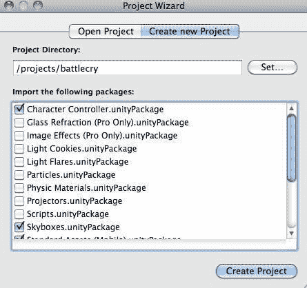

    +   **Character Controller** 将允许我们在不处理大量脚本的情况下在关卡中移动我们的角色。

    +   **Skyboxes** 对于绘制我们世界的天空非常有用。我们将能够放置一个简单的纹理来表示我们的地下城的天空或天花板。

    +   **Standard Assets (Mobile)** 将包含大量针对 iPhone 优化的界面和预制件。

    +   **Terrain Assets** 将为我们提供在不需要搜索其他资源的情况下在地面绘制的基础。

1.  正如我们之前所做的那样，我们需要在 Apple 开发者中心的配置文件门户上创建一个新的 **App ID** 和配置文件。

1.  下载并将配置文件导入到 XCode 中。

1.  在 **玩家设置** 中，将 **产品名称** 更改为 **Battlecry**。这是当应用程序安装到设备上时应用程序将显示的名称。

1.  将我们的 **包标识符** 设置为从配置文件门户获取的标识符。在这里，我已插入 `com.sojournermobile.battlecry` 以模拟配置文件中存储的内容。

1.  由于我们针对的是 iPhone 和 iPad，我们必须将 **目标设备** 设置为 **iPhone + iPad**，以便最终得到一个通用二进制文件：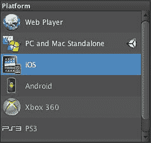

1.  为游戏提供一个图像，这样它在启动时将显示为真实的图标。在资源中有一个 "icon_57_57.png" 文件。导入该文件并将其拖动到默认图标字段中：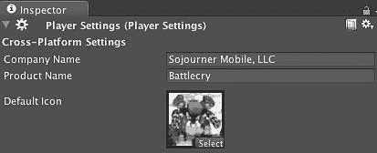

1.  为了确保我们链接到最新的 SDK，并能够访问所有可用的 iOS 功能，选择 iOS 最新版作为 SDK 版本：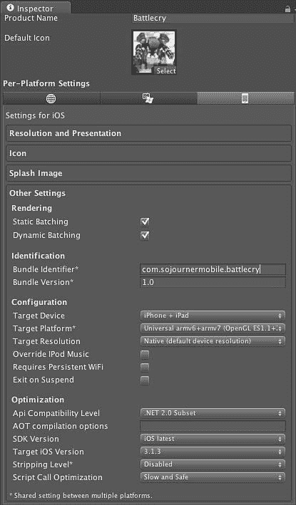

1.  在项目中保存场景。在可以将场景包含在构建中之前，你需要这样做：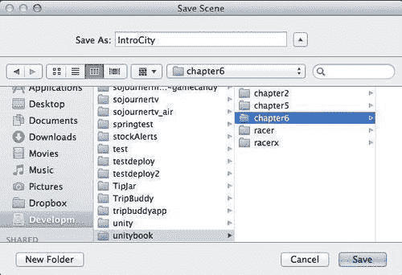

1.  打开 **构建设置** 并检查我们的场景：

    ### 注意

    如果场景没有显示出来，请确保你已经保存了它。

    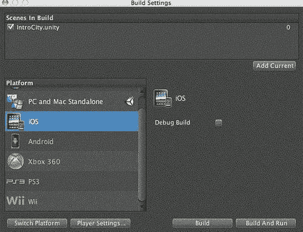

1.  从 **文件** 菜单中选择 **构建 & 运行** 功能。如果一切正常，你应该能看到你的 iOS 设备启动并显示 Unity 标志。

## 刚才发生了什么？

我们已经设置了项目结构并生成了游戏的第一版构建。完成这些后，我们可以开始将资产导入到项目中，以开始构建真实场景。

# 行动时间——构建游戏世界

我们可以访问许多网站来获取游戏资产，但截至 Unity 3.1，已经集成了商店，您可以通过该商店获取项目所需的资产。这个界面非常易于使用，值得检查以构建我们的关卡。虽然我们在这里可能找不到所有东西，但这是一个良好的开始。

一条建议是，有时资产商店中的资产可以通过其他方式以更低的价格购买，所以请务必货比三家。

## Unity Asset Store

Unity Asset Store 是直接构建在 Unity 环境中的工具，您可以通过它购买预制件并将其直接集成到项目中，而无需离开工具。资产商店中的预制件包括模型、脚本，甚至可以插入 Unity IDE 本身的功能。

1.  通过在**窗口**菜单中选择**资产商店**来打开商店：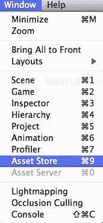

1.  如果您还没有创建账户，请通过创建账户来**资产商店**进行认证：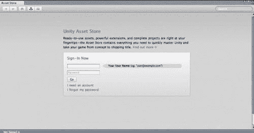

1.  接下来，您将看到商店的主菜单，您可以在其中购买各种类型的 Unity 兼容资产、声音、预制件、脚本等：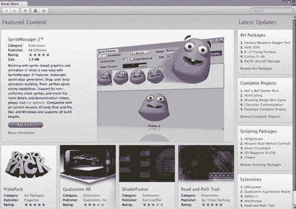

1.  使用**游戏对象 | 创建其他 | 平面**创建场景的地面平面。

1.  使用**游戏对象 | 创建其他 | 点光源**将光源插入场景中。

1.  在 Unity**资产商店**窗口中输入**Allegorithmic**并选择**18 FREE Substances**包：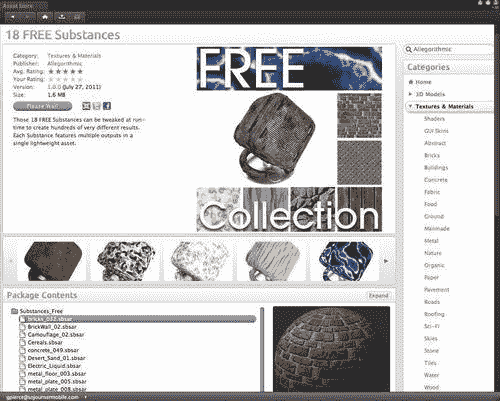

1.  下载该包并将资产导入到项目中：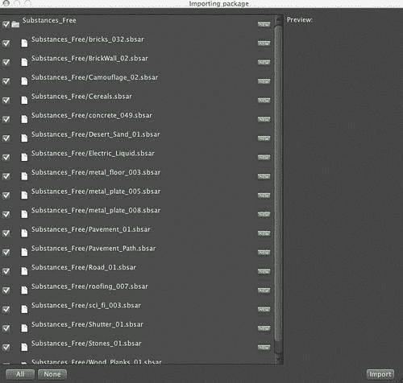

1.  在你的项目中展开`Substances_Free`目录。

1.  展开`Desert_Sand_01`包。

1.  将**Desert_Sand_01**材质拖放到平面上：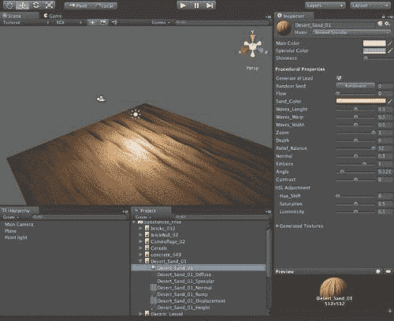

1.  在搜索区域中输入**Soldiers Pack**：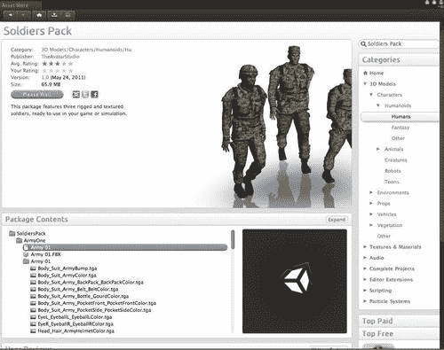

1.  将**TheAvatarStudioi**的**Soldiers Pack**导入到项目中：

1.  在**项目**视图中展开`SoldiersPack`文件夹。

1.  展开位于`SoldiersPack`下方的`ArmyOne`文件夹。

1.  将**Army 01**预制件对象拖放到场景中：

1.  在搜索框中输入**Stone**：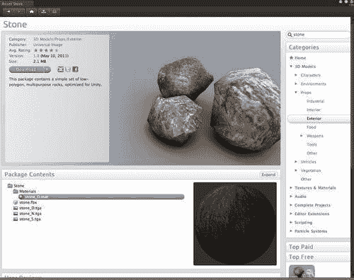

1.  将 Universal Image 中的 Stone 资产导入到项目中。

1.  在项目中展开`Stone`文件夹。

1.  将石预制件拖放到场景中。

1.  沿着每个轴将 Stone 预制件缩放到**10**个单位：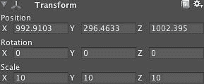

1.  将放大的石头放置在场景中，以创建一些基本景观：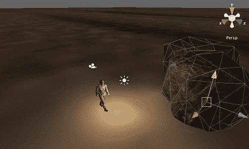

1.  保存场景。

## 刚才发生了什么？

我们通过从**Asset Store**导入资源，已经布置好了游戏中的所有动作将发生的舞台。虽然我们为场景中的演员准备好了基本的动画，但我们还没有一个可以被玩家控制的玩家角色。我们所缺少的是参与游戏的演员。我们需要为我们的玩家角色构建一个控制器，使其与我们的游戏设计相匹配。

# 摘要

在本章中，我们讨论了我们的游戏设计并设置了我们的项目。在这个过程中，我们设置了版本控制，从包括 Unity 资产商店在内的各种来源导入资源，并为我们的设备制作了第一个版本。我们现在准备好迎接第一个挑战，那就是让我们的玩家角色在场景中移动。
