# 第七章。输入：让我们开始移动吧！

> 到目前为止，我们已经进行了一些基本的场景移动，但那还远远不够，如果我们打算为 iOS 设备构建商业游戏的话。在为 iOS 编写游戏时，经常被忽视的一点是，尽管 iPad、iPhone 等设备可以执行与桌面版本相同的许多功能——但在从键盘鼠标世界转移到触摸屏和加速度计的世界时，你需要了解一些非常具体的技巧。在本章中，我们将花时间深入了解这些细节。

在本章中，我们将：

+   了解 iOS 触摸屏界面

+   了解加速度计及其工作原理

+   在触摸屏上创建一个用于在环境中移动的界面

+   学习如何处理手势

这可能听起来并不多，但在 iOS 开发中，有很多事情你可能会做错，这会导致在使用 Unity 时遇到困难。我们不会假设你一切都会做对，而是会一步一步地讲解，以确保你可以把时间花在构建游戏上，而不是试图解读神秘的错误信息。

那么，让我们继续吧…

# 输入能力

iPhone 是一个集合了广泛技术的设备，可以用来检测用户的输入。从游戏开发者的角度来看，最重要的两种技术是触摸屏和加速度计。凭借这两种输入机制，迄今为止几乎所有可用的游戏都已被构建，因此我们将深入分析它们的工作原理以及我们如何利用它们的能力来确定用户在游戏中的意图。

## 触摸技术

触摸屏是一种可以检测显示区域内一个或多个触摸存在和位置的显示设备。虽然早期的触摸设备依赖于被动工具，如笔来检测与触摸表面的交互，但现代触摸设备可以检测与设备的物理接触。

虽然看起来可能不是这样，但用于驱动设备触摸交互的技术有很多种。选择哪种技术的决定取决于众多因素，如成本、耐用性、可扩展性和多功能性。很容易有人建议某一种触摸技术比其他技术优越，但一种适用于特定应用的技术可能完全不适用于另一种应用。例如，iPhone 中使用的这项技术要求用户必须与表面进行物理接触才能注册触摸。然而，如果你正在构建一个展台，你可能希望用户能够戴着手套与设备交互。这个看似无害的选择对选择的技术以及设备本身的设计都有深远的影响。

目前设备中常见的几种触摸表面类型包括：电阻式、电容式和红外式。虽然它们的实现机制各不相同，但它们都遵循相同的的基本步骤——当你将手指或笔尖放在屏幕上时，表面状态会发生某种变化，然后被发送到处理器，处理器确定触摸发生的位置。正是这种状态变化是如何被测量的，将技术区分开来。

尽管今天所有的 iOS 设备都使用特定的表面类型——电容式，但可以预见，随着苹果将平台扩展到覆盖新类型的设备，他们可能在未来的某个时刻改变技术。此外，了解你可能在将内容移植到其他平台时遇到的其他类型的表面也很重要。

### 电阻式技术

电阻式屏幕由导电材料和电阻材料的多层组成。当施加压力到屏幕上时，手指或笔尖的压力会使导电材料和电阻材料接触——导致电场发生变化。此时，测量连接到导电材料的电路上的电阻将表示触摸的位置。

由于任何压力都可能导致接触发生，电阻式屏幕在你想使用被动工具，如笔作为可能的触摸工具时工作得很好。此外，使用这项技术，你可以戴上手套，因为戴着手套的手和裸手一样可以工作。由于电阻式技术存在的时间较长，它往往生产成本较低，是成本谱系中常见于低端的技术。

### 电容式技术

电容式屏幕使用一层能够保持电荷的电容材料。当触摸时，这种材料会在接触点表面的特定位置记录电荷量的变化。然后，这些信息被传递到处理器，处理器可以精确地确定触摸发生的位置。iOS 设备通过将电容器排列成网格来简化这一过程，使得屏幕上的每一个点在触摸时都会产生自己的信号。这带来了额外的优势，即产生非常高的分辨率触摸数据，可以被处理器处理。

由于电容式方法依赖于电容材料才能工作，它要求某种能够导电的物质进行触摸。由于人体导电，这可以很好地工作，但它排除了笔尖方法，或者更具体地说，它要求使用特殊的电容笔。

### 红外技术

红外屏幕使用一排红外或 LED 光束，将其投射在保护玻璃或更常见的亚克力表面下方。然后，摄像头会向上看这个光束网格，寻找信号中断，类似于 iOS 设备使用的网格方法——只是使用红外摄像头和光束。这种方法经过改进并在 Microsoft Surface 上部署，并带来一些意想不到的好处。由于摄像头用于确定触摸位置，因此该摄像头还可以查看该位置的对象。如果该对象是一个标记，它还可以从该标记中提取信息。这种方法在 Microsoft Surface 上得到了很好的应用。

红外方法的一个明显缺点是它需要相当大的空间来发挥作用。由于光学性质，你离表面越远，在该表面上获得的分辨率就越高。这使得这项技术在典型的 iPhone 应用中不切实际。

## 加速度计

加速度计是一种测量结构上运动加速度的设备。在 iOS 设备中，加速度计是一个三轴系统，可以确定设备各个轴（x，y，z）上的加速度。当设备静止时，加速度计会测量重力（1g）的力。当设备移动时，设备将能够根据这些轴上的加速度测量设备的运动，并确定新设备的方向。不涉及相关的数学，你真正需要知道的是，无论你将设备放在什么方向，设备都能感知到这个方向：

## 惯性仪

惯性仪是一种测量设备方向的设备。与加速度计不同，设备的方向可以在设备实际移动之前推导出来。目前，惯性仪仅适用于 iOS 设备的一部分，它使得设备中的运动检测更加精细。iOS 设备中的三轴惯性仪与内置的加速度计协同工作，产生完整的 6 轴运动手势灵敏度。在撰写本文时，Unity 中没有对惯性仪的支持，因此我们不会关注其在游戏中的应用。

## 触摸屏

我们的游戏设计需要在屏幕底部设置一套操纵杆，我们可以使用它们在世界上移动并操纵摄像头。控制方案与玩家熟悉的 Xbox 风格控制器相呼应。

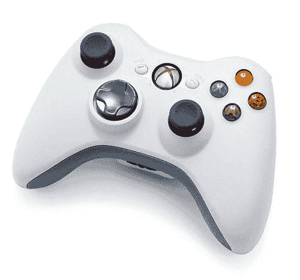

我们还需要使用右键执行操作。类似于 Xbox 控制器，我们希望能够在右操纵杆上轻触以调用动作。

我们想要计划的下一个特性是能够在表面上执行手势，这样我们就可以避免在我们的界面中填充多余的按钮。我们希望在游戏中支持几种手势。

| 手势 | 含义 |
| --- | --- |
| 向上滑动 | 投掷手榴弹 |
| 向左/右滑动 | 向左/右躲避 |
| 向下滑动 | 守护/躲避 |

## 加速度计/陀螺仪

我们的游戏设计不需要使用加速度计，但为了说明，我们将使用加速度计作为操纵相机的附加机制，并提供一个摇动命令，如果角色被击倒并需要治疗时我们将使用它。

| 动作 | 含义 |
| --- | --- |
| 摇动 | 治疗 |
| 向左/右转 | 旋转摄像头 |

# 实现摇杆

我们的游戏设计草图要求在横屏方向玩游戏，因此我们需要从横屏开始应用程序。

# 行动时间 — 获取方向

从我们之前的应用程序中我们知道，我们可以通过在我们的应用程序的`Awake()`方法中执行快速方向更改来实现这一点：

```swift
function Awake()
{
iPhoneSettings.screenOrientation = iPhoneScreenOrientation.Landscape;
}

```

在之前的例子中，我们把我们的函数放在`Start()`方法中，但我们将这个调用放在`Awake()`方法中。这样做的原因是我们希望这个脚本和方向设置在场景加载后立即处理，但在摇杆脚本尝试确定摇杆位置之前。如果我们不这样做，摇杆的位置会太靠近，因为它们的位置是从纵向方向推导出来的。

如果你现在运行你的应用程序，你会发现应用程序将保持单一屏幕方向，然而，当你旋转时，你会得到一个随着屏幕旋转的黑色轮廓。这个黑色轮廓代表 iOS 键盘界面随着设备旋转。为了防止这种情况发生，你需要锁定键盘，使其与应用程序保持相同的方向。

| 键类/方法 | 描述 |
| --- | --- |
| iPhoneSettings`.screenOrientation` | 获取/设置设备的方向 |
| `iPhoneScreenOrientation` | 可能设备方向的枚举类型 |
| `iPhoneKeyboard.autorotateXXXX` | 设置 iPhoneKeyboard 是否会在设备方向改变时旋转到特定方向 |

```swift
void Awake()
{
iPhoneSettings.screenOrientation = iPhoneScreenOrientation.Landscape;
iPhoneKeyboard.autorotateToPortrait = false;
iPhoneKeyboard.autorotateToPortraitUpsideDown = false;
}

```

## 刚才发生了什么？

我们已经配置了游戏，使其在启动时默认为横屏方向。此外，游戏将执行用户期望的操作，你不会遇到 iOS 键盘尝试调整设备方向的图形故障。

接下来，我们的设计要求有两个摇杆区域的触摸界面，左边的摇杆作为移动摇杆，右边的摇杆作为旋转摇杆。我们将使用这些来捕捉用户交互并驱动角色在游戏世界中移动。

# 行动时间 — 实现摇杆

1.  在我们的解决方案的一部分中展开最初添加到项目中的标准资产（移动）unitypackage。在`Prefabs`文件夹中有一个`Dual Joysticks`预制件：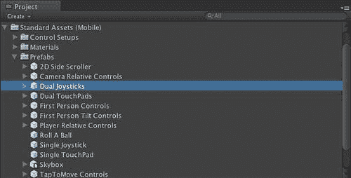

1.  由于这将随着我们相机的用户界面平面移动，我们可以简单地将其设置为相机的子项：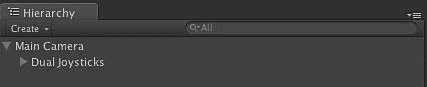

1.  将**游戏**视图设置为通过选择游戏视图右上角的下拉菜单以 iPhone 宽显示。这将更准确地展示游戏启动时的外观。现在，当我们查看游戏视图时，我们可以确切地看到我们的相机在游戏开始时将看到什么：

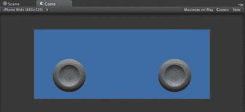

这张图展示了我们期望看到的情况——用户界面中的两个摇杆凸起，准备与用户交互。如果你在你的 iOS 设备上启动应用程序，你会看到当你将手指放在摇杆凸起上时，它们会随着你的手指在触摸过程中移动。当你从凸起上移开手指时，它将迅速回到中心位置。这个信息被预制件捕获并传递给内置的摇杆脚本。

要将输入传递到其他脚本，只需更改预制件指向的脚本。请注意，每个摇杆都可以有自己的脚本，因此你可以为每个摇杆实现两种完全不同的行为。

你还可以通过更新代表摇杆的**GUITexture**上的**纹理**字段来更改摇杆使用的纹理：

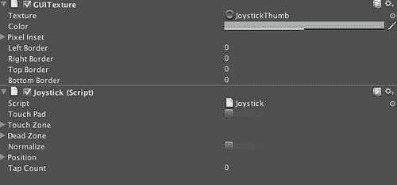

## 刚才发生了什么？

我们刚刚实现了游戏的主要输入方式——双摇杆凸起。当我们移动这些摇杆时，它们会将数据传递给摇杆脚本。虽然这很有趣，但它仍然不能让我们的角色在场景中移动。如果我们只需要一些基本的摇杆处理，我们就完成了，但我们需要控制一个角色并在场景中移动我们的相机。幸运的是，有一个预制件可以做到这一点。

# 移动

现在我们已经有一个可以接受输入的界面，我们需要处理来自该界面的触摸操作，并让我们的角色在场景中移动。我们简单的摇杆是计划的一部分，但现在我们需要处理其余的部分。

# 执行动作 — 实现相机控制

1.  我们需要做的第一件事是从上一个场景中删除我们的主相机和双摇杆。不要担心我们已经删除了主相机，因为我们将在场景中添加一个新的相机。

1.  在**项目**窗口中搜索**相机相对控制**：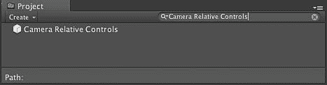

1.  将相机相对控制预制体拖动到**层次结构**视图中。当您将此预制体拖动到您的**层次结构**视图中时，您会发现它由我们之前使用的双摇杆以及称为**相机相对控制**的东西组成。在**相机相对控制**下方，您将找到相机枢轴和玩家对象。

    **相机枢轴**正如其名，是相机将围绕其旋转的空间中的点。当您移动右摇杆在 3D 空间中旋转相机时，其动作相对于这个点。

    另一个对象是玩家，它承载我们的角色控制器对象，并有一个恰如其分的子节点名称“ReplaceWithRealCharacter”。当我们有真实角色时，我们将将其插入此处：

    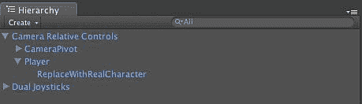

1.  切换到**游戏**视图，我们将看到在运行时这个场景代表什么：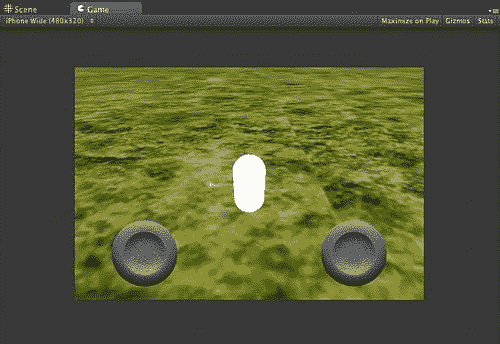

    +   如您所见，摇杆已经就位，白色胶囊代表角色控制器和玩家游戏对象。如果您现在将此项目部署到您的 iOS 设备上，您将看到您将能够使用摇杆在场景中移动，左摇杆让您在场景中移动，右摇杆旋转相机。

1.  接下来，让我们导入我们的玩家角色。打开**资产商店**，搜索**士兵角色包**：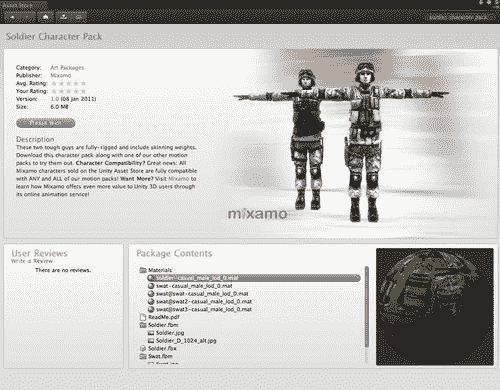

    +   此包包含一个完全装备的角色，我们可以将其用于我们的游戏。

1.  在导入角色包后，将**士兵**预制体拖动到**相机相对控制**，玩家节点作为子节点。这将断开预制体链接，但这不是问题，因为我们需要断开这个链接来为游戏添加自己的几何形状。

1.  现在，删除玩家节点的`ReplaceWithReachCharacter`子节点，您将有一个可供使用的士兵。这个士兵不是我们应用中效率最高的模型，但它可以在资产商店中免费获取，并且对我们的目的来说效果很好：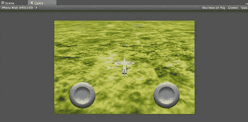

1.  将此应用程序部署到您的 iOS 设备上，并使用摇杆，您会发现，对于您有限的努力，您在世界上有一个角色，它将使用左摇杆导航世界，并且您能够使用右摇杆操纵相机。我们开始得到一些更像游戏的东西，但是玩家没有动画。如果我们想要一个真正的游戏，我们需要一种方法来给这个角色添加一些动画，让人物四处走动，进行攻击动画，受到伤害，并在必要时死亡。

## 刚才发生了什么？

我们已经扩展了现有应用程序的功能，包括移动我们世界的控制以及玩家角色的相机控制。现在我们已经为角色控制器导入了一个角色，我们需要根据用户输入来对这个角色进行动画处理。

# 行动时间 — 动画玩家角色

我们导入的角色被称为绑定角色。绑定角色是指具有所有动画骨骼的角色。这些骨骼在动画期间驱动网格本身的运动。让我们禁用网格的渲染，这样我们就可以看到骨骼本身。

1.  在**层次结构**视图中选择士兵网格。

1.  在**检查器**视图中，向下滚动到网格渲染组件并点击其复选框。这将禁用在 Unity 和游戏中的网格渲染：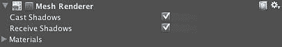

1.  打开项目的**场景**视图并选择层次结构中的网格。你应该只能看到我们导入的士兵角色的骨骼：

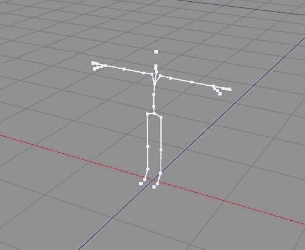

如前所述，Unity 的动画系统相当强大，并且内置了一个易于脚本化的动画混合系统。因此，我们可以处理简单的动画，如行走、奔跑、使用武器等，并且 Unity 可以在我们使用武器的同时混合这些动画。

## 导入动画

下一步是将动画与这个绑定关联起来，这样我们就可以在场景中“驾驶”我们的角色。你可以通过多种方式来动画化一个角色，例如动作捕捉或手动动画。Unity 支持两种方法将此内容导入到我们的游戏中：动画分割和多个动画文件。

### 动画分割

有时候，你会收到一个已经将多个动画烘焙到模型上的资产。在许多内容购买场景中，这是一种相当常见的做法。在这些情况下，当你导入模型时，你必须告诉 Unity 如何将单个大型动画分割成多个独立的动画。你将在将模型带入 Unity IDE 时出现的**FBXImporter**中这样做：

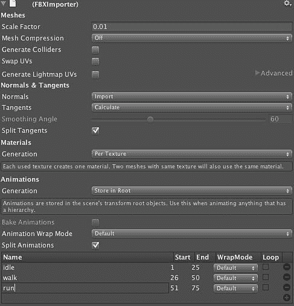

通过选择**分割动画**选项，Unity 将启用一个表格，允许你指定每个存在的动画。例如，在这个场景中，有一个名为**idle**的动画，从帧**1**运行到帧**25**，一个从帧**26**到帧**50**播放的**walk**，等等。一旦你导入了动画，你可以通过你在表格中给出的名称来引用它们，用于所有动画动作。我们将在稍后详细讨论这个问题。

### 多个文件

导入动画的首选方式是使用多个动画文件。为此，您需要为动画数据创建一个单独的模型文件，使用命名约定 'model'@'animation name'.fbx，然后将这个`.fbx`文件简单地拖入 Unity 中，就像拖入任何其他资产一样。

通过这种方式，您可以分别为每个角色明确导入动画，这使得在您的流程中修改这些动画变得更加容易，无需担心哪些帧已更改或动画数据中出现了额外的帧，以便进行潜在的变化。重要的是要注意，这些文件仅包含动画数据——不是实际模型几何形状。此外，重要的是要注意，Unity 不会尝试强制将模型名称映射到您的模型名称：

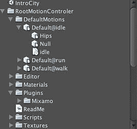

例如，这里我们导入了一些 FBX 文件中的动画。在我们的场景中没有默认模型，但由于这些动画的骨骼层级与游戏中已有的角色骨骼层级相匹配，我们仍然可以使用这些动画。

要在我们的游戏中使用此动画，我们需要选择我们的角色，并在**检查器**中展开动画设置：

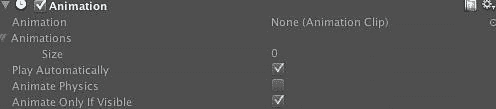

在这里，我们看到我们的角色指定了 0 个动画。此外，在**动画**元素中，我们看到没有计划播放的动画。我们可以通过将动画数量增加到**3**来轻松解决这个问题，以匹配我们导入的三个动画：

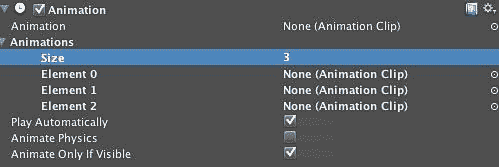

这些槽位都可以存放我们导入的动画。动画本身由一个带有时钟的文档图标表示，巧合的是，它的名称与动画本身相同。只需将动画拖到这些槽位上，您就为角色设置了动画：

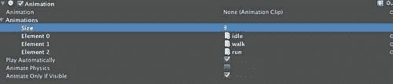

如果您想为角色设置默认动画，可以将动画拖到**动画**槽中。在这种情况下，我选择了选择空闲动画：

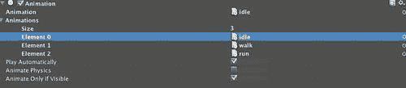

现在您的角色已经设置完毕，准备进行动画。如果您在编辑器中运行游戏，您将看到您的角色从默认的 T 位置移动到空闲动画，并播放它：

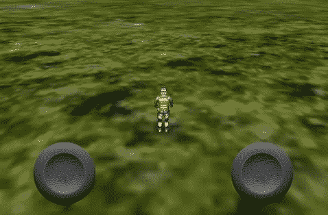

## 刚才发生了什么？

我们刚刚从资产商店中获取了我们的绑定角色，并使用动画分割和独特的 FBX 动画导入方法向其添加了动画。现在我们的角色可以通过动画数据表现出情感。

# 导入动画

有时候，你可能没有现成的动画数据，或者你只是想通过集成现有动画来减少开发时间。一个与 Unity 集成良好的服务是 Mixamo 的动画服务。Mixamo 不仅为其角色提供此功能，还为我们能找到的任何绑定角色提供此功能。

# 动作时间 — 从 Mixamo 导入

我们可以通过访问 [`www.mixamo.com/`](http://www.mixamo.com/) 网站开始（Unity 最新版本中也集成了插件）并浏览他们的动画库来开始：

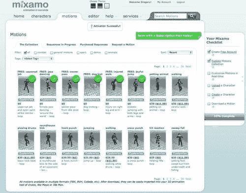

由于我们希望确保动画能够与我们的角色正确工作，我们可以将我们的角色上传到 Mixamo 并查看动画在我们角色上的播放效果：

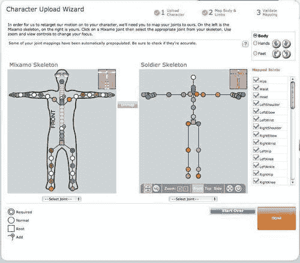

我们有机会调整角色中的任何骨骼以适应 Mixamo 在其默认骨骼中定义的骨骼。这将有助于确保我们的动画能够正确播放。在大多数情况下，Mixamo 会自动映射到正确的骨骼，但如果你因为某些特殊的映射需要帮助——所有工具都在那里：

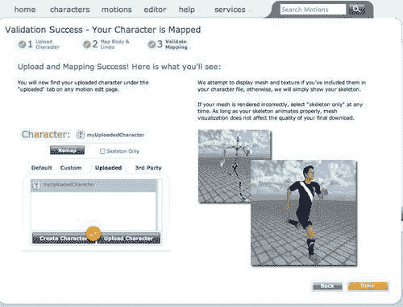

一旦映射成功，我们就可以在浏览 Mixamo 库中动画目录时引用这个已上传的角色，当我们使用该服务创建自己的自定义动画时。现在我们的模型已经准备好了，我们可以查看动画的确切表现，因为 Mixamo 网站上集成了 Unity 播放器，我们可以预览并按需自定义动画。

我们可以调整滑块以实时自定义角色动作，并精确地得到我们想要的效果。一旦我们完成，我们就可以下载我们的动画，以适当的 Unity 动画格式。

如果我们已经有了一个想要导入到 Unity 中的动画，我们也可以使用相同的方法来导入这些动画。Unity 支持两种将此内容导入游戏的方法：动画拆分和多个动画文件。

## 刚才发生了什么？

我们刚刚从资源商店中获取了我们的绑定角色，并使用 Mixamo 动画服务为其添加了动画。使用这些动画，我们能够让角色在场景中与动画同步移动。现在我们可以移动了，让我们来处理我们输入需求的其他部分——能够根据命令攻击敌人或执行其他动作。

# 控制角色

我们需要对我们角色做的最后一件事是在场景中驾驶他。这是游戏成败的关键区域，因为它需要与用户交互流畅。这很重要，因为主要角色可能是游戏中使用最频繁的东西之一，所以它应该做得很好。

当角色移动时，我们的角色需要通过动画在场景中改变位置。此外，我们还需要在角色执行的不同动画之间无缝地混合。我们不能让玩家停止行走，然后挥动，然后再开始行走。

# 行动时间 — 驾驶我们的角色

如果你在上一步之后部署了应用程序，你会观察到我们当前的控件已经可以移动角色在场景中。我们可以使用左侧操纵杆，玩家将在通过空闲动画时在地面上滑行：

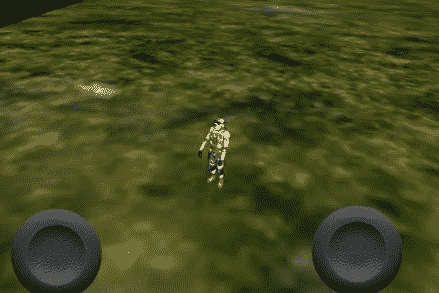

我们希望当玩家移动操纵杆时，我们的角色能够行走，因此我们需要对`CameraRelativeControl`脚本进行一个非常简单的修改来实现这一点。你可以通过查看**层次**视图中的**Player**对象来定位这个脚本：

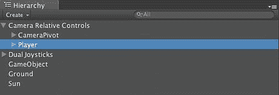

现在看看检查员，你会看到驱动这个对象的全部脚本。请记住这一点，因为我们稍后会更改其中的一些内容：

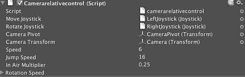

首先，让我们在脚本中添加一个变量，以便我们可以访问我们的士兵 GameObject。你会注意到在这里，我正在定义脚本中的类型，而不是仅仅声明它为 var。在 Unity iOS 中，你必须定义所有对象类型，出于性能原因不允许动态类型：

```swift
private var thisTransform : Transform;
private var character : CharacterController;
private var velocity : Vector3; //Used for continuing momentum while in air
private var canJump = true;
private var soldier : GameObject;
function Start()
{
// Cache component lookup at startup instead of doing this every frame
thisTransform = GetComponent( Transform );
character = GetComponent( CharacterController );

```

现在，我们只需要在我们的角色中寻找一些速度的变化，这由角色控制器方便地管理，并相应地更改动画。

```swift
if ( soldier )
{
if ( ( movement.x != 0 ) || ( movement.z != 0 ) )
{
soldier.animation.Play("walk");
}
else
{
soldier.animation.Play("idle");
}
}

```

现在，如果你回到应用程序并运行它，你会发现当我们将操纵杆移动到某个速度时，玩家会进入行走动画：

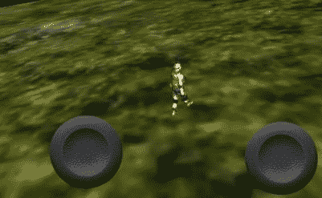

## 刚才发生了什么？

我们刚刚添加了使用操纵杆数字和 Unity 使用的标准移动系统来驾驶玩家在世界上移动的功能。然而，当我们想要使用多个动画时，我们的方法存在一些限制。

我们当然可以添加一些代码来查找玩家超过一定速度时，通过简单的条件逻辑更改让他们进入跑步动画，但如果你在应用程序中尝试，你会发现这个画面有问题。玩家从本地原点开始动画，然后在动画结束时突然回到原点。此外，当物理应用于此角色时，动画和角色层次之间将出现断开。

当然，您可以通过让动画师在现场执行动画来修复这些问题，但这样您就会失去真正看到动画外观的能力。只有在角色实际运动时，才能真正看到角色的步态、步幅和摆动。

然而，为了修复所有这些问题，我们需要另一个解决方案。我们真正需要做的是在动画过程中跟踪角色的位置，这样当动画结束时，我们就可以从该位置和方向开始重新播放动画。当我们尝试让玩家在台阶上行走或与物体碰撞时，这一点将变得越来越重要。换句话说，我们需要用动画本身来驱动角色的运动，而不仅仅是通过改变角色的位置并告诉他们播放一个动画来实现这一点。

# 行动时间——使用根运动控制器获得驾照

幸运的是，有一个预构建的解决方案，不出所料，来自 Mixamo，它将为我们解决这个问题，对我们的应用程序代码的影响非常小——那就是**根运动控制器**：

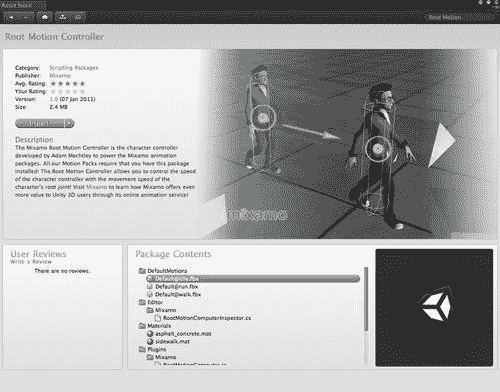

1.  首先，回到**资产商店**并搜索一个名为**根运动控制器**的包。这个由 Mixamo 提供并由 Adam Mechtley 开发的包包含了我们使用动画数据驱动角色所需的所有功能——我们只需要进行配置：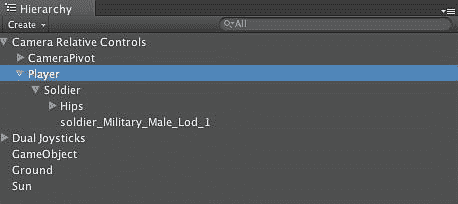

1.  接下来，我们需要从我们的层次结构中选择**玩家**模型，因为这个是我们想要用我们的新控制器控制的层次结构组件。当将此添加到类似的项目中时，请确保将其添加到包含角色控制器的相同节点，因为您希望从根运动计算机产生的运动影响层次结构此级别的所有内容：

    ### 注意

    例如，如果您将**根运动计算机**附加到士兵节点上，**相机相对控制**将不会意识到玩家实际上已经移动。

    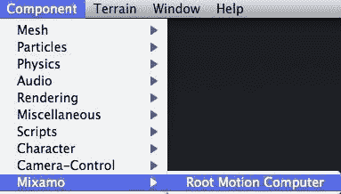

1.  现在我们已经选择了层次结构中的正确节点，我们可以通过选择**Mixamo**菜单项来添加**根运动计算机**组件：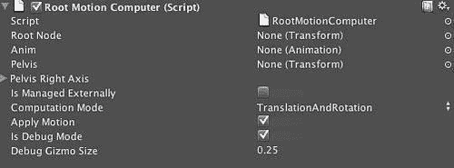

1.  在**检查器**视图中，您将看到添加到我们的游戏对象中的**根运动计算机**组件。有了这个，我们就完成了大部分需要完成的工作。那么，让我们来测试一下：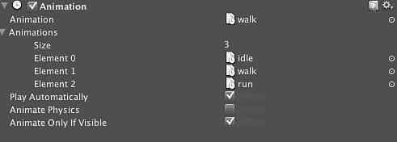

1.  更改角色的动画设置，将默认动画设置为**walk:**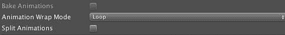

1.  接下来，将动画的**动画循环模式**设置为**Loop**，以便它将重复播放。现在当你运行应用程序时，玩家将反复向前走，直到他们走出世界。

## 发生了什么？

我们刚刚完成了一个重要的步骤！我们不仅导入了动画，而且还在使用动画来驱动角色在场景中移动。由于我们的所有动画都与场景中玩家的位置和方向同步，并且由操纵杆控制，我们可以将注意力转向游戏元素。

# 通过加速度计旋转

下一步我们需要处理的是根据用户倾斜设备来旋转相机。在我们的设计中，我们说这将代表相机的旋转，因此我们需要检测这些动作并根据用户的意图调整我们的相机。

# 行动时间——根据设备倾斜更新

如前所述，iOS 设备有一个定义的访问权限，允许我们确定设备方向的变化。我们可以在 Input.acceleration 中的 x、y 或 z 值变化中检测到这一点：

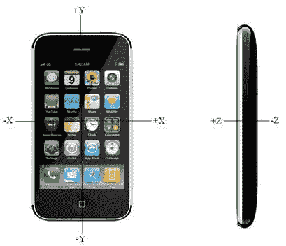

由于我们的游戏设计需要我们根据倾斜来操纵相机，我们唯一需要做的就是检查方向变化的方向，然后相应地旋转相机。为了实现这一点，我们可以在一个 GameObject 上附加一个脚本，在该 GameObject 的`Update()`方法中检查`Input.acceleration`属性，并确定设备是如何变化的。记住，我们也指定了我们的应用程序设计为在横屏模式下运行，因此我们正在寻找沿设备 Z 轴的旋转。

| 关键方法 | 描述 |
| --- | --- |
| `Input.acceleration` | 返回设备的加速度计读数 |

```swift
using UnityEngine;
using System.Collections;
public class CameraRotate : MonoBehaviour {
public float speed = 10.0f;
// Use this for initialization
void Start () {
}
// Update is called once per frame
void Update () {
Vector3 direction = Vector3.zero;
direction.x = - Input.acceleration.y;
direction.z = Input.acceleration.x;
if ( direction.sqrMagnitude > 1 )
{
direction.Normalize();
}
direction *= Time.deltaTime;
transform.Translate( direction * speed );
}
}

```

使用`iPhoneSettings.screenOrientation`，我们现在可以告诉 Unity 玩家更改其方向。你可以将方向设置为`iPhoneScreenOrientations`中可用的任何一个。建议你不要做任何不符合 iOS 设备预期操作的事情，因为苹果可能会因为这种行为拒绝你的应用程序。

## 发生了什么？

通过向我们的相机添加脚本，我们可以在每一帧获得`Update()`通知。然后我们可以查看设备的方向，并相应地调整我们的方向。通过更新`iPhoneSettings`属性，我们可以快速翻转场景以匹配我们发现自己所处的任何方向。

# 摇动设备以执行恢复动作

我们最后需要做的是检测用户是否选择了摇动设备，因为我们的设计规定我们将使用这个动作作为用户将执行恢复动作的指示。

# 行动时间 — 检测震动

1.  处理方向变化的第一步是实际上意识到方向已经改变。我们可以有两种方法来做这件事——我们可以在游戏第一次启动时检查，在这种情况下，我们需要将我们的方向检测放在`Start()`方法中，因为它只被调用一次。如果我们想在用户玩游戏时检查方向变化，那么我们需要逐帧检查方向的状态。我们通过将我们的方向代码放在`Update()`方法中来实现这一点。

| 关键方法 | 描述 |
| --- | --- |
| `Input.acceleration` | 返回设备的加速度计读数 |

我们将使用`deviceOrientation`属性来确定设备的方向。这个信息直接来自操作系统，实时更新，所以当方向改变时，我们会收到通知并可以响应变化，而无需打断游戏。

```swift
using UnityEngine;
using System.Collections;
public class DetectShake : MonoBehaviour {
public float shakeThreshold = 2.0f;
// Update is called once per frame
void Update () {
Vector3 accel = Input.acceleration;
float x = accel.x;
float y = accel.y;
float z = accel.z;
float shakeStrength = Mathf.Sqrt( x * x + y * y + z * z );
if ( shakeStrength >= shakeThreshold )
{
// do the shake action
}
}
}

```

## 医生，治愈你自己

现在我们知道设备已经发生了震动，我们可以执行与震动相关联的特定操作。

在我们的`player`类中，我们在`Player`类内部用一个整数简单地表示玩家的健康状态：

```swift
public class Player {
public static int MAX_HEALTH = 100;
private int health = 0;
public Player()
{
}
public int getHealth()
{
return health;
}
public void heal()
{
health = health + 10;
if ( health > MAX_HEALTH )
{
health = MAX_HEALTH;
}
}
}

```

在我们的`Player`类中有一个简单的治疗方法，每当检测到设备震动时，我们就调用它。

## 刚才发生了什么？

我们通过检测设备的震动实现了游戏的最后输入特征。基于这个震动，我们改变了用户的状态并采取了一个行动。虽然震动在今天的游戏中并不常见，我鼓励你们谨慎使用，但确实有某些时候它代表了最好的可用输入选项。

# 摘要

在本章中，我们讨论了 iOS 输入的主要传感器，即触摸屏、陀螺仪和加速度计。完成这个任务后，我们可以提供一个触摸屏界面，玩家可以与之交互，并从 iOS 设备的移动和方向中收集信息。

具体来说，我们涵盖了：

+   不同的触摸技术类型，它们的优缺点

+   如何为设备上的用户构建可触摸的用户界面并从中收集输入

+   如何导入现有的动画以及如何导入 Mixamo 动画

+   如何检测手势并确定用户的意图

+   如何检测设备的移动和方向变化

+   如何使用这些信息在 3D 世界中移动屏幕上的角色

+   如何从动画数据中驱动角色，而不是通过编程

现在我们有一个可以通过我们的 3D 世界控制的角色，我们可以根据用户的输入来动画化这个角色。现在我们有了实际游戏的开始，但世界非常安静，游戏缺乏魅力。在下一章，多媒体，我们将探讨如何向我们的游戏添加声音、音乐和视频，以增加它的吸引力。
