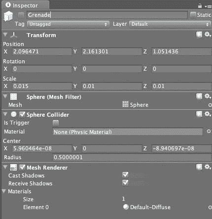

# 第十章 游戏脚本

> 在过去的几章中，我们已经走了很长的路，并创建了我们游戏的大部分内容，但我们仍然需要做一些工作来实现一些游戏玩法概念。在本章中，我们将探讨实现我们游戏玩法机制所需的一些游戏脚本。

在本章中，我们将学习：

+   如何将粒子系统添加到导入的模型中，以模拟武器

+   如何使用动画来驱动游戏中的事件

+   如何处理角色和敌人上的 ragdoll 物理

+   如何根据游戏玩法来记分和触发事件

在这些基础知识的基础上，我们将完成一个实际游戏玩法机制的核心，我们只需要将其添加到角色所在的世界中。

# 枪战作为游戏玩法

由于我们的游戏是射击游戏，我们需要提供的主要游戏玩法机制之一是枪械可以发射弹丸并击中世界中的其他物体。虽然游戏中实现枪声的方法有很多，例如模拟枪声或创建代表弹丸的游戏对象，但表示枪声的更有效机制是粒子系统。通过将粒子系统附加到我们的枪械对象上，我们可以轻松地绘制出在游戏世界中向物体发射的弹丸的表示。

Unity 中的粒子系统支持物理、碰撞和内存管理，这在移动设备上尤其高效。唯一需要注意的问题是，移动设备的填充率（屏幕被填充或绘制的速率）并不像它们的桌面版本那么高。同样，如果你执行的动作使得引擎必须重复绘制屏幕的某些区域，你将看到相同的填充率问题。所以，如果你有很多占据屏幕大块区域的粒子，你可能会遇到性能问题。我们将在优化章节中详细讨论这个问题。

# 行动时间 — 准备武器

对于这个例子，我们将创建一个名为枪场的项目，这样我们就可以轻松测试我们的游戏玩法，而无需构建和部署整个项目。每次你对游戏进行大的玩法机制更改时，通常都有必要单独进行，这样你就可以在开发中更加敏捷。大型项目可能会很快变得杂乱无章，因此最好在简单的项目中测试：

1.  创建一个名为**GunRange**的新项目。将场景保存在项目中，命名为**level_0**。

1.  导入一个静态枪械模型并将其放入名为**武器**的层级组中。

1.  接下来，我们需要确保武器指向 Z 轴。我们通过旋转模型来实现这一点，使得枪口（即，我们的弹丸将从中出来的那一端）指向正 Z 轴。


由于我们将把这个整个武器及其枪火粒子系统作为一个预制件附加到角色上，我们想要确保在这个点上定义一切相对于预制件的坐标系。这样做是为了当它附加到我们的角色或其他对象上时，它能正常工作。

## 刚才发生了什么？

我们刚刚将一个枪模型导入到场景中，并将其与 Z 轴对齐。我们这样做是相对于预制件坐标系，而不是具体到游戏坐标系。我们这样做是因为我们希望发射的子弹沿着预制件的 Z 轴发射，而不管世界坐标系中发生什么。

你将武器对齐到哪个轴实际上并不重要（只要调整你的模型和脚本），但将武器对齐到指向 Z 轴是有逻辑意义的，这样当我们发射子弹时，它们就会沿着正 Z 轴向下。为什么？在传统的 3D 图形方向中，沿着正 Z 轴的运动表示物体远离相机——所以在这里使用它是合理的。

## 发射子弹

我们可以使用两种方法将粒子系统添加到我们的武器上。我们可以直接将粒子系统添加到枪的 Game Object 中，或者我们可以添加一个子 Game Object 到枪上，该子 Game Object 执行实际的发射。你选择的方法实际上取决于你需要多少灵活性，以及你希望层次结构中有更多对象的需求。

如果你直接将粒子系统添加到枪的 Game Object 中，粒子将从 Game Object 的中心发射，这在视觉上是不正确的。更通用的做法是创建一个将作为发射点的 Game Object，并将其附加到武器上的一个点上。这是我们项目将采用的方法。

# 动作时间 — 添加粒子系统

1.  从**GameObject**菜单创建一个空的游戏对象，并选择**Create Empty**。

1.  将这个游戏对象命名为**MuzzlePoint**。

1.  在**Hierarchy**视图中选择**MuzzlePoint**游戏对象，以显示与其关联的组件。

1.  在**Component**菜单中选择**Ellipsoid Particle Emitter**，以便它关联一个粒子系统。

1.  在 Unity 中将**MuzzlePoint**游戏对象放置在枪模型上，以指定子弹应该发射的位置。

1.  接下来我们需要做的是让我们的粒子发射器实际发射粒子。由于我们设置了武器使其指向 Z 轴，因此配置我们的粒子系统使其将粒子发送到正 Z 轴是非常容易的。

    记住，由于我们已经将这个粒子发射器设置为枪的子节点，我们想要确保为它定义的坐标系相对于枪模型的原点。您可能需要从枪模型的原点进行调整以正确定位它，但请意识到**MuzzlePoint**的坐标系是相对于枪的坐标系。

    

    +   由于我们已经将其设置为枪模型的子节点，我们希望将其配置为与枪模型的原点对齐。你可能需要根据你的特定模型进行调整，但你应该确保从枪模型的原点开始。

        由于我们正在创建一个代表子弹的粒子系统，我们希望所有的弹丸都沿着相同的轴线移动。为了使用**椭球体粒子发射器**实现这一点，我们将发射器的椭球体改为只沿一个轴线发射粒子，在这种情况下是 Z 轴线。如果我们不这样做，粒子就会沿着随机的轴线喷洒。

    

1.  最后，我们需要向我们的**MuzzlePoint**游戏对象添加一个简单的脚本，命名为“枪声”，它与枪的射击按钮相关联，这样我们就完成了。

    ```swift
    using UnityEngine;
    using System.Collections;
    public class Gunfire : MonoBehaviour {
    public GameObject muzzlePoint;
    // Use this for initialization
    void Start () {
    muzzlePoint = GameObject.Find("MuzzlePoint");
    }
    void fireWeapon() {
    muzzlePoint.particleEmitter.Emit(1);
    }
    }

    ```

1.  如前所述，将士兵模型导入我们的场景中。

1.  在士兵的层级结构中调整枪的位置，使其成为手的子节点，这样士兵就能携带物品，并且会随着玩家的移动而同步移动。

1.  更新**枪声**脚本，添加一个`GUI.Button`来模拟真实游戏中的射击按钮。

    ```swift
    using UnityEngine;
    using System.Collections;
    public class Gunfire : MonoBehaviour {
    public GameObject muzzlePoint;
    // Use this for initialization
    void Start () {
    muzzlePoint = GameObject.Find("MuzzlePoint");
    }
    void fireWeapon() {
    muzzlePoint.particleEmitter.Emit(1);
    }
    // Update is called once per frame
    void OnGUI () {
    if ( GUI.Button( new Rect(0,0,50,50), "Fire" ) )
    {
    //Debug.Log("Firing the weapon");
    fireWeapon();
    }
    }
    }

    ```

1.  运行游戏并按下射击按钮。

## 刚才发生了什么？

我们刚刚赋予了我们的武器发射代表子弹的粒子的能力。我们还将其附加到我们的普通玩家上，使其成为玩家不可分割的一部分，并且会随着玩家在场景中的动画移动。我们现在拥有了涉及射击作为主要游戏机制的游戏的基本构建块之一。

目前我们的粒子具有默认的外观，但如果我们想改变外观，我们只需简单地将一个粒子渲染器组件添加到这个**MuzzlePoint**游戏对象中。然后我们可以通过提供代表子弹外观的纹理来改变粒子的外观。

# 让动画驱动

经常会有很多上下文信息包含在我们动画师给出的动画数据中。在我们的例子中，我们有一个动画，我们的角色将执行一个抛掷动画来表示抛掷手榴弹，但目前我们还没有将游戏对象放入世界中的方法来响应这个动作。当然，没有人希望硬编码表示抛掷的动画帧，因为这很可能会在整个游戏过程中发生变化。幸运的是，我们可以将动画的任意部分与 Unity 中的回调关联起来。

## 动画事件

在 Unity 的动画系统中，我们有能力将事件与动画的任意部分关联起来。Unity 将这种能力称为动画事件。通过动画事件，我们可以让动画系统执行脚本，从而驱动游戏的一些逻辑。动画事件可以添加到从你的建模环境导入的任何动画剪辑，或者使用**动画**视图创建的任何临时动画。

# 执行动作 — 添加动画事件

1.  要将事件添加到我们的士兵动画中，选择角色并检查**动画**视图。

    +   在动画数据上方有两个轨道——最上面的轨道显示为这个动画添加的所有事件。下面的轨道显示为我们的动画数据定义的所有关键帧。

    

1.  创建一个名为`GrenadeToss`的 C#脚本，并将其作为我们的士兵对象的子对象。

1.  在类中删除`Start()`和`Update()`方法，并创建一个名为`TossIt`的方法，并在其中添加一个日志语句。对于我们的目的来说，`Start()`和`Update()`方法是不必要的。

    ```swift
    using UnityEngine;
    using System.Collections;
    public class GrenadeToss : MonoBehaviour {
    // Use this for initialization
    void TossIt () {
    Debug.Log("We have arrived at the toss point of the script");
    }
    }

    ```

1.  接下来，在**动画**视图中滚动动画，直到你到达动画中你想抛掷发生的点。

1.  通过点击**添加动画事件**按钮创建一个新的动画事件。你还可以通过点击动画数据上方的事件轨道来完成此任务。一个**编辑动画事件**对话框将出现，允许你配置当达到该事件时将被调用的脚本函数。

1.  打开列表框，你会看到所有可以调用的函数列表。

1.  选择`TossIt()`函数。

1.  按下动画的播放按钮。如果一切顺利，当达到该帧时，你会看到打印出的日志消息。

1.  在项目的`Weapons`文件夹中创建一个名为`Grenade`的文件夹。

1.  创建一个新的 Prefab 对象，命名为 **Grenade**，作为一个一维拉伸的简单球体。

    +   这是我们将在角色达到 `TossIt()` 动画位置时创建的对象。

1.  更新我们的 `GrenadeToss` 脚本，当玩家达到脚本中的 `TossIt()` 函数时实例化一个游戏对象。由于我们希望这个对象由物理系统模拟，我们希望将其创建为 **Rigidbody**。通过从层次结构中选择 Grenade 对象并为其添加一个 **Rigidbody** 来实现这一点。

    +   现在每次实例化的 Grenade 对象都将由物理系统进行模拟。

1.  我们还希望在这个动画达到这一点时在手的当前位置实例化这个手榴弹。由于我们的士兵模型的所有部分都被命名了，我们可以在从层次结构中查找它之后使用该对象的 Transform。

    ```swift
    using UnityEngine;
    using System.Collections;
    public class GrenadeToss : MonoBehaviour {
    public Rigidbody grenade;
    // Use this for initialization
    void TossIt(){
    Debug.Log("We have arrived at the toss point of the script");
    Transform handLocation = GameObject.Find("LeftHandIndex1").transform;
    Instantiate( grenade, handLocation.position, handLocation.rotation );
    animation eventsadding}
    }

    ```

## 刚才发生了什么？

我们刚刚为我们的游戏增加了一些现实感，并为我们的艺术家提供了一些灵活性。通过导入我们的动画数据并将其与事件关联，我们创建了一个完全基于脚本的驱动游戏行为的路径。我们可以通过允许艺术家在动画中建模武器行为来进一步扩展这一点，当建模的子弹从枪中射出时，我们可以更新我们的弹药计数器，使其与动画完美同步。

此外，我们还提供了功能，允许玩家根据需要创建一个新的游戏对象并将其放入游戏世界，由物理引擎驱动。

# 你已经死了

现在我们有一个可以开枪的玩家，我们需要确保从那把枪发射的投射物能够与敌人碰撞，并且当敌人被击中时受到伤害并被摧毁。

为了实现这一点，我们将向我们的枪系统添加一个粒子碰撞器，并给我们的敌人添加一个伤害脚本，以便它们能够对被投射物击中做出反应。

## 世界粒子碰撞器

世界粒子碰撞器用于检测场景中粒子与其他碰撞器之间的碰撞。场景中的其他碰撞器可以是 Unity 可以分配给游戏对象的任何正常球体、盒子、胶囊、轮子或网格碰撞器。

# 动作时间 — 检测碰撞

1.  从项目资源文件夹中导入 Target Dummy 模型。

1.  为了确保你的游戏对象具有碰撞数据，请确保检查你的网格的导入设置中的 **Generate Colliders** 设置。

    ### 注意

    然而，在许多情况下，使用简单的球体或盒子碰撞器来模拟敌人更节省成本且相当准确。如果你想在特定位置造成伤害，这是在移动设备上实现该效果的一种更经济的方式。

    

1.  现在我们已经有了目标游戏对象的碰撞数据，我们需要将粒子系统中的粒子碰撞器添加到我们之前创建的粒子系统中。我们通过选择**组件 | 粒子** | **世界粒子碰撞器**菜单中的组件来完成此操作。

    +   仅凭这一点，会导致粒子与其他对象发生碰撞，但我们的真正目的是在碰撞发生时通知游戏对象，以便我们的目标能够对被击中做出反应。

1.  要做到这一点，我们在**世界粒子碰撞器**中选择**发送碰撞消息**，以便每个粒子游戏对象和参与碰撞的游戏对象都能接收到碰撞消息。

    +   我们可以在我们想要从粒子系统接收碰撞事件的对象附加的脚本中查找此事件。

1.  创建一个名为`Damage`的脚本，并将碰撞脚本附加到将处理伤害的 Test Dummy 对象上。

    ```swift
    using UnityEngine;
    using System.Collections;
    public class Damage : MonoBehaviour {
    void OnParticleCollision()
    {
    Debug.Log("Hit!");
    }
    }

    ```

1.  更新`OnParticleCollision()`方法以更新被粒子击中的对象的健康状态。当该物品的健康值达到零时，从游戏中移除测试假人。

    ```swift
    void OnParticleCollision()
    {
    HealthScript healthScript = GetComponent<HealthScript>();
    healthScript.takeHit(1);
    Debug.Log("Hit!");
    }

    ```

1.  在这里，我们将让我们的 Damage 脚本与`HealthScript`通信，该脚本将定义我们的目标假人对象的健康状态，并在它们耗尽健康时移除它们。

1.  将`HealthScript`附加到目标假人上。

    ```swift
    using UnityEngine;
    using System.Collections;
    public class HealthScript : MonoBehaviour {
    public int initialHealth;
    private int currentHealth;
    // Use this for initialization
    void Start () {
    currentHealth = initialHealth;
    }
    public void TakeHit( int damage ) {
    currentHealth = currentHealth - damage;
    if ( currentHealth <= 0 )
    {
    Destroy( this.gameObject );
    }
    }
    }

    ```

在这里，我们将简单地通过告诉附加了此脚本的游戏对象销毁自己来移除游戏对象，以便在它受到足够伤害后。如果我们想让这个对象爆炸或采取其他行为，我们可以在销毁原始对象时在游戏对象的位置实例化一个爆炸预制体。

## 刚才发生了什么？

我们现在已经处理了游戏玩法中的另一部分。玩家可以开火，弹体将通过粒子系统发射，当粒子接触到另一个对象时，可以计算伤害并将此对象从游戏中移除。

# 玩（布）娃娃

到目前为止，我们只是在我们的武器造成伤害时从游戏中移除敌人。然而，我们希望敌人能够根据伤害的物理属性对武器造成的伤害做出逼真的反应。特别是，当手榴弹击中敌人时，爆炸的力量——目前根本未进行模拟，应该将它们抛来抛去。

为了实现这一点，我们将使用 Unity 的 Rag Doll 系统并将其分配给我们的目标假人，这样当它们受到伤害时，物理将驱动它们的运动。

# 行动时间 — 添加布娃娃

1.  在项目中创建一个新的场景。

1.  创建一个地面平面并为其添加纹理。

1.  将目标假人模型导入场景。

1.  通过选择**GameObject | 创建其他 | Ragdoll**来创建一个 Ragdoll

1.  接下来，我们需要将我们的目标假人模型的骨骼映射到 rag doll 的骨骼层级。Unity 通过提供一个 rag doll 向导来简化这个过程，我们可以使用它来在两个骨骼层级之间进行映射。

1.  选择 Ragdoll 项目右侧的圆圈，以显示可以连接到它的变换列表。

1.  将**soldier (Transform)**拖放到列表中要映射的 Ragdoll 节点项的**根**上。

1.  在**层级**视图中选择 Soldier 模型的根，这样你就可以看到 Ragdoll 映射到士兵的几何形状上了。

1.  通过按**播放**按钮来检查场景。

## 刚才发生了什么？

你会注意到物理系统已经模拟了 rag doll 上的各种力，它已经坍塌了，因为重力是唯一作用在假人上的力，没有任何东西阻止它落到地面平面上。

这引出了我们必须解决的第一个问题——我们需要我们的模型在想要它受到物理世界影响之前保持刚性。我们可以通过关闭物理直到角色处于不应该控制其动作的状态，例如在爆炸的情况下，或者我们需要将角色连接到某个其他系统，以防止它倒下。

我们已经将 rag doll 和刚体物理系统附加到我们的敌人身上，这样它们在受到爆炸和其他世界内物理模拟的影响时可以正确地动画化。当我们打开 rag doll 时，Unity 使用物理而不是我们的动画数据来确定角色的状态。这导致了对世界的更真实反映。

# 摘要

在本章中，我们探讨了游戏中游戏玩法的基本要求。

具体来说，我们涵盖了：

+   如何为角色配备武器

+   如何让角色在开火动画中移动

+   如何使用粒子系统显示投射物

+   如何让武器对敌人造成影响

+   如何创建具有刚体物理的武器以及如何将 Rag Doll 分配给对象。

现在我们对游戏玩法脚本知识有了更好的理解，是时候看看如何优化我们的游戏，以便在目标设备上获得最佳性能了。虽然提供的脚本可以在任何平台上运行，正如我们将在下一章中看到的，有一些特定的技巧可以使它们在 iOS 平台上表现最佳。
