# 第十一章。调试和优化

> 现在我们几乎完成了项目，是时候开始努力让系统尽可能高效地运行了。虽然我们通常会在整个开发过程中关注性能，但我认为在项目进行到更深入的阶段时再考虑这一点很重要，这样我们就可以看到如何根据我们在项目早期可能做出的某些有疑问的决定来重新设计产品。通过这种方式，我们将能够在通常构建应用程序的上下文中看到这些决定。

在本章中，我们将：

+   了解 Unity 中的调试选项

+   学习如何分析移动应用程序

+   了解对象池及其在移动设备上的重要性

+   学习如何使用 Beast Lighting 优化光照

本章将突出 Unity 游戏和移动设备上 Unity 游戏制作的一些关键区别。这一章将使我们的应用程序成为热门产品，而不仅仅是人们启动后几小时就会卸载的漂亮展示品。

# 调试

Unity 拥有一个与其他 Unity 平台同等重要的调试器。调试器将允许你在 Unity 脚本中直接设置断点，当游戏在目标设备上运行时，允许你暂停游戏的执行，以便观察或调整变量。这是一种非常强大的方法，在为设备开发时往往缺失。在过去，最好的办法是在满足某些条件时发出声音或改变屏幕颜色。今天，你可以观察变量值的变化，修改在设备上运行的脚本，并动态地改变游戏的执行流程，而对游戏的帧率影响不大。所以，让我们看看如何实现这一魔法。

在真实硬件上调试运行中的应用程序是你需要非常熟悉的事情。虽然 Unity 可以很好地帮助你模拟内容在你的 Mac 上，但没有任何东西能比知道你的应用程序在野外如何表现更胜一筹。

断点是在游戏中你希望为了调试目的暂停应用程序执行的地方。由于 Unity 脚本环境 MonoDevelop 与 Unity IDE 以及运行时集成，我们可以在脚本中插入断点，这将触发执行暂停。

# 行动时间 — 使用断点

1.  将光标定位在你想暂停执行的那一行，并使用快捷键组合**Apple-\**来创建断点。对于许多以键盘为中心的开发者来说，这是做事的首选方式。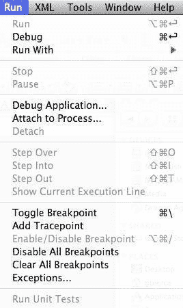

    +   另一种方法是点击代码和行号左侧的脊柱区域。如果你是一个更倾向于使用鼠标的程序员，你会发现这是一种更自然地设置断点的方式。

    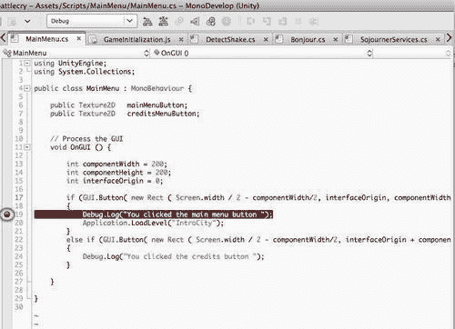

1.  注意，你创建断点的行在代码旁边的脊柱上用红色圆圈突出显示。这代表了一个活动断点。

    要禁用断点，只需点击红色圆圈或再次按**Apple-\**，断点将被移除。

    应该注意的是，如果你在不含实际代码的行上创建断点，断点实际上会在下一行可执行代码上执行。

1.  运行应用程序。

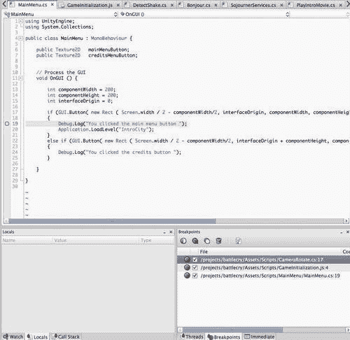

我们现在可以观察到应用程序停止在断点所在的行。这给了我们观察断点达到时应用程序状态的机会。很多时候，在某种控制结构（如`if`语句）内部放置断点是有用的，以查看是否满足触发它的条件。

## 发生了什么？

你已经在你的应用程序中创建了一个断点，并且你的应用程序停止在指定的行上。当应用程序处于这种状态时，它会暂停，这样你就可以检查和/或更改应用程序中任何变量的状态。

# 行动时间 — 调试应用程序

将调试器附加到正在运行的应用程序的过程，以便与运行的应用程序通信并提供数据给用户，被称为将调试器附加到进程。

1.  在你的 iOS 设备上部署并运行你的游戏。确保设备与将要进行调试的机器处于同一 WiFi 网络上，然后选择你想要连接的 iOS 设备。

1.  在工具栏中选择**调试**按钮：

    +   MonoDevelop 将启动 Unity 编辑器，经过一段时间后开始执行你的应用程序。你的应用程序将在玩家中开始运行，并在遇到代码中的第一个断点时停止：

    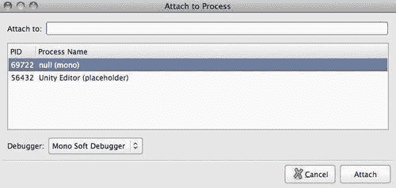

1.  选择你想让 Unity 调试器附加到的游戏。在这张图片中，我们看到 Unity 编辑器作为一个可以附加到的进程，另一个被称为“null (mono)”。这是在你的 iOS 设备上运行的游戏。选择这个游戏实例。

## 发生了什么？

我们已经将调试器附加到了在我们 iOS 设备上运行的游戏实例。这非常有用，因为我们可以从实际设备获取真实的调试信息。在测试应用程序时，这样做很重要，因为有时应用程序在 PC 上的 Unity 中运行良好，但在实际设备上却失败。

# 行动时间 — 游戏单步执行

一旦你达到了断点并检查了该点的变量值，接下来你想做的事情就是向前执行应用程序，以便你可以观察应用程序随时间的变化。根据你的意图，有几种选项可供你在应用程序中向前执行。下面的截图显示了这些选项：**Step Over, Step Into, Step Out, Pause**和**Detach Debugger**：


1.  按下**Step Into**图标，使应用程序开始运行。

1.  如下图所示，应用程序在断点处暂停。当前执行的行以黄色突出显示：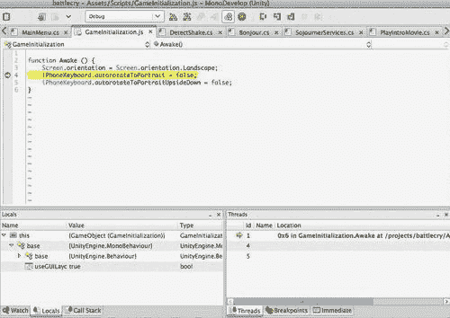

    +   如前所述，当调试器附加时，你可以获取游戏中任何变量的值。然而，如果需要不断查找每个单独的变量，尤其是当我们想要观察随时间变化的变量时，这会变得很繁琐。你可以通过为感兴趣的变量设置监视来观察其值的变化。

1.  在 MonoDevelop 中选择**监视**选项卡创建一个新的监视。在**监视**选项卡中输入单词**Screen**，MonoDevelop 将打开一个自动完成对话框，显示 **Screen** 对象的所有属性：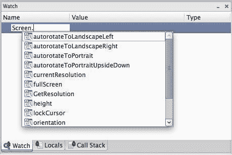

    +   我们可以看到，**Screen** 有一个附加的 **currentResolution** 属性。

1.  选择**currentResolution**以创建此变量的监视。如果你选择的变量是一个对象，你将在其左侧看到一个三角形。点击此三角形将显示对象的所有属性，如下面的截图所示：

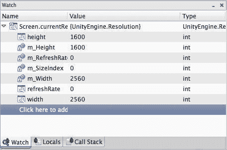

在这里，我们可以看到 **Screen.currentResolution** 对象的所有属性。

## 刚才发生了什么？

我们刚刚使用附加的调试器遍历了我们的应用程序，并添加了一个监视，以便我们可以观察变量随时间的变化。添加监视是检查游戏执行过程中变量变化的一种常见方式。当你开始编写复杂的脚本时，创建监视将帮助你确定在运行时是否发生了正确的行为。

# 性能分析

我们一直在构建我们的游戏并运行了一段时间，看起来表现良好，但为了真正确定我们的游戏表现如何，我们必须要进行性能分析。性能分析是收集有关游戏每个部分如何表现的信息的行为，以便我们可以优化导致性能瓶颈的代码或资源。

我们可以对游戏的运行方式做出一些假设，并盲目地优化代码，因为按照某种方式做应该会更快，但现实中，最大的性能提升直到您看到分析器告诉您的游戏信息时才会变得明显。要成功分析一个应用程序，必须真正客观地查看数据，因为性能不佳可能是由纹理大小、着色器、脚本、物理、绘制调用，甚至是添加雾气这样简单的事情引起的。

让我们遍历我们的当前应用程序，并了解分析它的过程。

# 操作时间——微调应用程序（专业版本）

现在，我们将对我们的应用程序进行调整，以确保它在任何环境中都能良好运行，并保持一致的行为。

1.  通过选择**窗口**菜单中的**分析器**来启动分析器：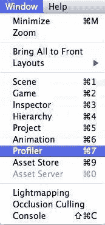

    +   分析器将启动并显示 Unity 的分析接口。如果您熟悉 XCode 工具的 Instruments，您将在 Unity 分析器中找到许多相同的设计和界面概念：

    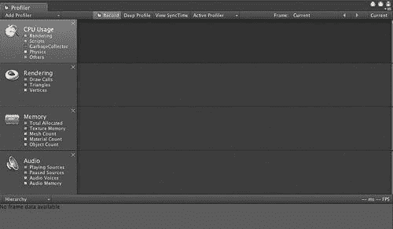

    +   **分析器**将显示一系列不同设置下的指标：**CPU 使用率、渲染、内存、音频**和**物理**。您可以通过点击**分析器**左上角的 X 来移除分析器。

1.  通过点击**分析器**左上角的 X 来移除**音频**分析器：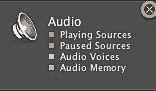

1.  通过点击**添加分析器**下拉菜单并选择**音频**分析器来将**音频**分析器添加回来：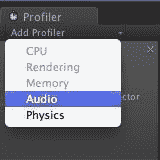

    +   已经添加的分析器将会变灰。在这个例子中，**音频**和**物理**都可以添加到**分析器**中。

1.  通过按下**播放**按钮开始游戏。立即您会看到分析器填充了来自分析会话的数据：

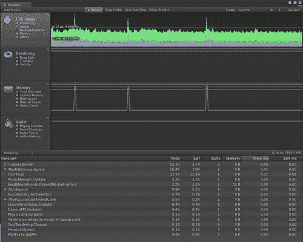

## 刚才发生了什么？

我们已经使用内置的 Unity 分析器来检查我们应用程序的性能，并探索它返回的不同指标，以便我们可以对应用程序中的瓶颈有所了解。现在我们已经做了这件事，我们可以识别一些热点，并查看一些修复我们发现的问题的方法。

# 对象池化——进入池中

从我们的分析会话中我们了解到，在移动平台上最大的性能损失之一是 GameObject 的持续创建和销毁。正如您可能之前在测试我们发射武器时注意到的，游戏中的暂停现象时有发生。让我们来看看为什么会这样发生。

当在移动设备上的 Unity 中创建`GameObject`类的实例时，设备必须为这个新的`GameObject`实例分配内存，并可能清除由某些可能不可见对象使用的内存。这个过程，称为垃圾回收，所需的时间足以导致你在游戏中体验到的暂停。这种情况发生的原因是由于目标设备上可用的内存有限以及收集旧对象所需的时间。Java 开发者，尤其是那些勇敢地编写平台游戏的开发者，非常熟悉与垃圾回收相关的问题。

通常，人们会通过使用对象池来解决与垃圾回收相关的一些问题。对象池允许你预先分配一定数量的对象，并通过它们循环使用，这样就不会创建新的对象。在我们的武器示例中，我们会在游戏对象池中分配一定数量的对象，这些对象代表我们希望一次显示的最大子弹数量。当子弹达到玩家一定距离时，我们可以移除它们，并在对象池中为新对象腾出空间，以便显示下一个可见对象。

这种对象池的实现是由 Unity3D 论坛成员创建的，并且还扩展了粒子系统和音频。

```swift
using UnityEngine;
using System;
using System.Collections;
using UnityEngine;
using System.Collections;
using System.Collections.Generic;
public class ObjectPool : MonoBehaviour
{
public static ObjectPool instance;
/// <summary>
/// The object prefabs which the pool can handle.
/// </summary>
public GameObject[] objectPrefabs;
/// <summary>
/// The pooled objects currently available.
/// </summary>
public List<GameObject>[] pooledObjects;
/// <summary>
/// The amount of objects of each type to buffer.
/// </summary>
public int[] amountToBuffer;
public int defaultBufferAmount = 3;
/// <summary>
/// The container object that we will keep unused pooled objects /// so we dont clog up the editor with objects.
/// </summary>
protected GameObject containerObject;
void Awake ()
profilingobject pooling{
instance = this;
}
// Use this for initialization
void Start ()
{
containerObject = new GameObject("ObjectPool");
//Loop through the object prefabs and make a new list for //each one.
//We do this because the pool can only support prefabs set to it //in the editor,
//so we can assume the lists of pooled objects are in the same //order as object prefabs in the array
pooledObjects = new List<GameObject>[objectPrefabs.Length];
int i = 0;
foreach ( GameObject objectPrefab in objectPrefabs )
{
pooledObjects[i] = new List<GameObject>();
int bufferAmount;
if(i < amountToBuffer.Length) bufferAmount = amountToBuffer[i];
else
bufferAmount = defaultBufferAmount;
for ( int n=0; n<bufferAmount; n++)
{
GameObject newObj = Instantiate(objectPrefab) as GameObject;
newObj.name = objectPrefab.name;
PoolObject(newObj);
}
i++;
}
}
/// <summary>
profilingobject pooling/// Gets a new object for the name type provided. If no object type /// exists or if onlypooled is true and there is no objects of that /// type in the pool
/// then null will be returned.
/// </summary>
/// <returns>
/// The object for type.
/// </returns>
/// <param name='objectType'>
/// Object type.
/// </param>
/// <param name='onlyPooled'>
/// If true, it will only return an object if there is one currently /// pooled.
/// </param>
public GameObject GetObjectForType ( string objectType , bool onlyPooled )
{
for(int i=0; i<objectPrefabs.Length; i++)
{
GameObject prefab = objectPrefabs[i];
if(prefab.name == objectType)
{
if(pooledObjects[i].Count > 0)
{
GameObject pooledObject = pooledObjects[i][0];
pooledObjects[i].RemoveAt(0);
pooledObject.transform.parent = null;
pooledObject.SetActiveRecursively(true);
return pooledObject;
}
else if(!onlyPooled) {
return Instantiate(objectPrefabs[i]) as GameObject;
}
break;
}
}
//If we have gotten here either there was no object of the specified //type or none were left in the pool with onlyPooled set to true
return null;
profilingobject pooling}
/// <summary>
/// Pools the object specified. Will not be pooled if there are no /// prefab of that type.
/// </summary>
/// <param name='obj'>
/// Object to be pooled.
/// </param>
public void PoolObject ( GameObject obj )
{
for ( int i=0; i<objectPrefabs.Length; i++)
{
if(objectPrefabs[i].name == obj.name)
{
obj.SetActiveRecursively(false);
obj.transform.parent = containerObject.transform;
pooledObjects[i].Add(obj);
return;
}
}
}
}

```

`ObjectPool`代码非常直观。它公开了一些变量，以便你可以在 Unity IDE 中直接配置它。这里实现的`ObjectPool`旨在同时池化多种类的对象。你不需要为每个想要池化的`GameObject`类型实现一个实现。**ObjectPool**将你想要池化的每种对象类型存储在`ObjectPrefabs`数组中。

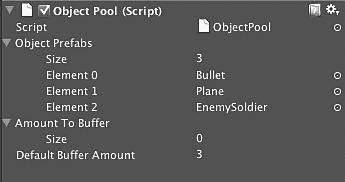

默认情况下，池将创建每种类型最多三个对象。如果你想配置单个对象可以拥有的对象数量，展开**Amount To Buffer**元素并设置该大小。

# 行动时间 — 使用对象池进行优化

现在我们有了游戏对象池和性能分析的能力，我们可以看看这种优化是如何提高我们的应用程序性能的。我们将通过替换玩家开火时创建子弹所采用的`GameObject`实例化方法来实现这一点。

1.  按照之前的*行动时间 —*连接游戏到性能分析器，并运行它，发射大量子弹：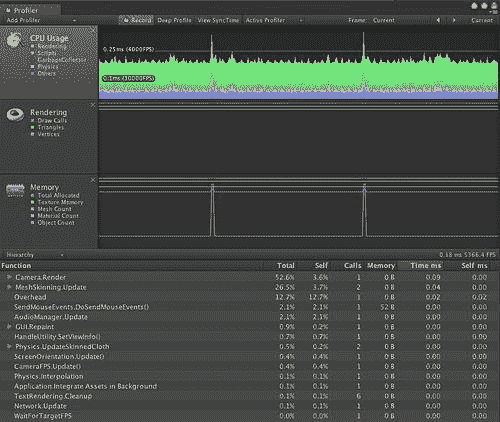

    +   从这个对象配置文件中我们可以看到，当武器发射时，性能会显著下降。原因是我们在实时创建 GameObject。我们可以看到，当这些对象从视图中移除并被收集时，应用程序的性能变得更加一致。这类问题是明显的性能瓶颈，我们可以通过优化来提高游戏性能。

1.  创建一个名为**PoolManager**的**GameObject**：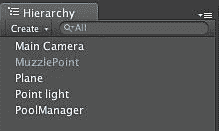

1.  将**ObjectPool**脚本添加到**PoolManager**：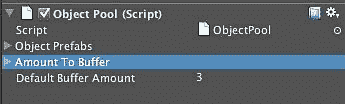

1.  将你想要池化的预制体添加到**Object Prefabs**数组中。你可以通过将预制体从**Hierarchy**视图拖动到**Object Prefabs**数组中完成此操作：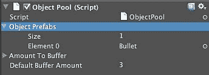

1.  用使用**Object Pool**的优化版`fireWeapon`脚本替换现有的`fireWeapon`脚本：

    ```swift
    void fireWeapon()
    {
    GameObject bullet = ObjectPool.instance.GetObjectForType( "Bullet" , true);
    bullet.transform.position = spawnPoint.transform.position;
    bullet.transform.rotation = spawnPoint.transform.rotation;
    }

    ```

    我们在这里所做的是替换了原本用于从武器中创建新子弹的`GameObject.Instantiate()`方法。

1.  再次启动游戏并查看**Profiler**配置文件。发射大量投射物并检查性能。

## 刚才发生了什么？

我们刚刚通过对象池提高了应用程序的性能。正如你所见，应用程序的性能现在是一致的。这正是我们追求的稳定帧率。

我们不是为创建和删除大量`GameObject`实例而支付惩罚，而是创建一个这些对象的池，并简单地改变它们的位置、旋转、状态和可见性。这是一个在游戏开发中经常使用的老技巧，但随着现代计算机和图形能力的兴起而失传，但正是我们在移动设备上确保最佳性能所需要的。

# 放出野兽

当你试图提高应用程序的性能时，你经常需要在应用程序的视觉表现和性能之间做出权衡。这次，我们将通过使用 Illuminate Labs 的集成 Beast 光照贴图系统来执行优化，这将提高我们应用程序的性能和视觉质量。

我们游戏中照明的目标是提供我们世界的真实描绘。通常，世界中的物体会有一些基础材质或纹理来描述它们的自然表面。引擎使用的照明算法随后会计算当物体渲染时，光线对其表面像素或 texels 的影响。

如其名所示，光照贴图是利用光照数据（发射属性、真实光源等）并从这些光源发射光线的过程，就像它们在场景中活跃一样。然后，引擎将存储这些光源的实际效果，并将其存储在将在运行时映射到纹理上的纹理图中（Unity 将此过程称为烘焙光照）。因此，你可以基于大量计算密集型光源创建一个非常复杂的光照环境。你还可以将所有这些信息烘焙到场景的纹理图中，从而在不增加场景中光源成本的情况下提高视觉效果。

由于光照是你在移动设备上可以执行的成本较高的操作之一，因此使用光照贴图代表了一次重大的性能提升。虽然光照贴图最终将被着色器中的逐像素光照所取代，但今天的移动硬件还不足以完成这项任务。

因此，让我们看看我们如何使我们的应用程序实现这一点。

# 动手实践 — 生成 Beast 光照贴图

为了说明光照贴图如何改进我们的应用程序，我们将使用我们的城市级别场景并为其添加 Beast 光照贴图。

1.  准备场景进行光照贴图的第一步是确保我们想要为光照贴图生成的任何对象都被声明为静态。Unity 使用这个声明来做出假设，即对象在场景中不会移动、缩放或以任何方式改变。记住，我们只想在静态几何体上烘焙光照贴图，因为我们正在根据场景中给定时间的光源位置生成光照。如果我们尝试在移动的对象上使用这种方法，例如，你会发现即使对象相对于光源改变了方向，光照和阴影的计算看起来就像对象在另一个地方一样：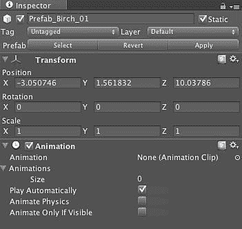

    +   在这里，我们指定了我们的白桦树预制件之一是**静态**的。同样，我们也可以将这些相同的设置添加到地形中。

1.  使用**游戏对象 | 创建其他 | 点光源**在场景中添加一个光源。将此光源放置在我们的场景中。这是我们想要将光照效果烘焙到场景中的光源。现在，由于我们的对象被定义为静态的，让我们添加一个我们想要烘焙到对象中的光源：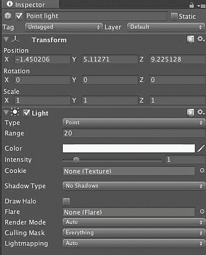

1.  观察场景，看看在光照正常渲染时一切看起来是什么样子。这将给我们一个概念，如果我们正确执行操作，光照贴图场景应该是什么样子：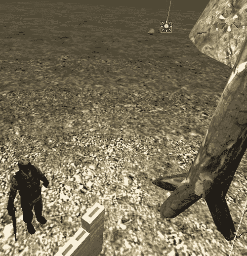

    +   现在我们已经为光照贴图提供了一些光照数据，我们可以开始烘焙过程。

1.  在**窗口**菜单中选择**光照贴图**选项，以打开 Beast 光照贴图界面：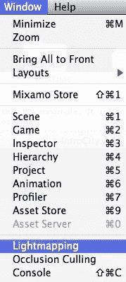

    +   这将打开 Unity 光照贴图界面，允许我们配置 Beast 光照贴图会话：

    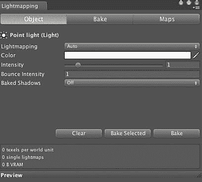

1.  当界面打开时，选择场景中添加的**点光源**，然后点击**烘焙**标签：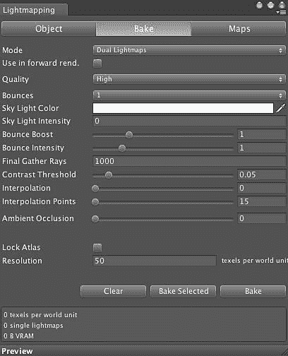

1.  我们可以将我们的简单灯光烘焙到场景的光照贴图中。按下**烘焙**按钮，并观察调试输出窗口：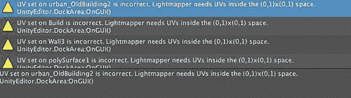

    +   输出窗口告诉我们，它无法烘焙灯光，因为场景中的几何形状没有 UV 数据。记住，我们的光照贴图是作为纹理贴图添加的，因此，如果几何形状没有正确生成 UV，则无法生成光照贴图。

1.  选择 Unity 报告没有 UV 数据的几何形状，并选择其**FBX 导入器**。点击**生成光照贴图 UV**按钮，以确保 Unity 为这块几何形状生成 UV 信息：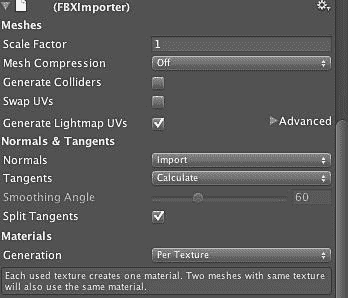

    +   现在当你烘焙场景时，Unity 将能够生成一个正确光照贴图化的场景。

1.  在**层次结构**视图中选择**点光源**，并将其从场景中删除。当你运行游戏时，你会注意到游戏看起来与之前完全一样，但现在它正在运行，没有场景中灯光的性能开销。

## 刚才发生了什么？

Unity 在幕后所做的是，从 Unity IDE 中提取所有资源和脚本，并组合成一个玩家，该玩家能够根据用户的输入回放内容及其所有场景。这是一个非常重要的概念，因为 Unity IDE 中的内容在很大程度上是平台无关的，并且可以在 Unity 环境中简单重新编译后轻松重新部署。这个玩家是实际部署到 iOS 设备上的应用程序。

# 摘要

在本章中，我们简要地学习了调试、性能分析和优化 Unity 项目的主题。然而，关于游戏优化，它本身就可以写成一本书，而且其中很多内容与特定应用程序的设计有关。

具体来说，我们涵盖了：

+   如何将 Unity 调试器附加到运行中的应用程序

+   如何分析 Unity 应用程序

+   使用对象池提高移动应用程序性能

+   使用 Beast 光照贴图提高性能和视觉效果

现在我们已经分析了我们的应用程序，并专门工作以提高其性能，现在是时候调查我们游戏的货币化和在 AppStore 上发布它了。
