# 第十二章 商业化：从您的创作中获得丰厚回报

> 根据美国市场营销协会的定义，市场营销是规划并执行想法、商品和服务的构思、定价、促销和分销的过程，以创造满足个人和组织目标的交换。虽然大多数人将市场营销等同于广告，但市场营销包括市场分析、价值主张、产品差异化、市场策略等等。虽然我们不需要所有这些来构建我们的游戏，但我们需要检查市场营销的某些部分，以确定将产品推向市场并从我们的辛勤工作中获得收益的最佳方式。我们应该收费 99 美分，还是免费并提供广告支持，或者尝试将游戏许可给第三方？这些都是本章将帮助我们解答的问题。

在本章中，我们将讨论：

+   如何将 iAds 添加到产品中

+   如何添加应用内购买

+   如何将内容发布到 Unity Asset Store

+   如何发布我们产品的最终版本

+   如何使用 iTunes Connect 跟踪成功

这是我们将高质量的应用程序推向市场，产生收入并使客户满意的关键一步——我们的首要任务。

让我们继续吧...

# 商业模式生成

在撰写本文时，有超过 2 亿台 iOS 设备掌握在消费者手中，App Store 的应用程序下载量近 150 亿次，App Store 销售中向开发者支付了超过 25 亿美元。虽然这对普通开发者来说已经足够令人垂涎，但还必须考虑到 App Store 中超过 30 万个应用程序，每月增长率为 11,000 至 15,000 个。因此，不能仅仅依靠发布一个标题并期待它赚钱。您需要一种方法来定位客户，将您的应用程序安装到他们的设备上，并从他们那里获取金钱——这种方法通常被称为商业模式。

虽然通常人们会在计划建立盈利性企业时将此作为第一个话题进行讨论，但大多数人会在第一章中感到眼花缭乱，然后他们会把书放回书架上。

随着苹果 App Store 生态系统的不断发展，四种成功的商业模式已经出现，成为利用您的创作获得收益的有效途径：纯应用销售、广告、应用内购买和 marketplace 组件销售。

## 纯应用销售

这是发布应用程序到 App Store 的传统方法。您制作一个应用程序，根据某种定价策略设定价格，然后将其发布到 App Store 并等待客户购买您的应用程序。

## 广告

广告模式通常用于免费分发的应用程序，尽管一些应用程序收费并包含广告。然而，当游戏开始或进行时，应用程序会向广告网络发出请求，在游戏中包含广告内容。当人们观看这些广告或与之互动时，广告供应商会支付应用程序创建者。

## 应用内购买

应用内购买模式正在迅速成为移动应用程序的首选商业模式。通常有两种与应用内购买一起使用的模式。在第一种模式中，开发者开发了一种货币形式，玩家使用这种货币在游戏世界中购买物品。在第二种模式中，开发者销售额外的武器、轨道、车辆等，然后将这些添加到现有的游戏中以增强玩家的体验。

## 市场组件

虽然并不是真正用于销售游戏的模式，但如果你在为游戏构建组件和预制件，并且决定它们对你不再有用，或者你想要在不发布整个游戏的情况下赚一些钱，那么在市场上销售组件是可以考虑的。此外，如果你为常见的开发问题开发了一个新颖的解决方案，你应该在 [www.gameprefabs.com](http://www.gameprefabs.com) 或 Unity 资产商店本身销售它。

没有任何东西阻止你选择这些商业模式之一，或者在一个单一的产品中实现所有这些。你需要做的就是平衡你赚钱的愿望与最终用户的体验。只要你不非常侵扰用户玩游戏，这种模式就不会让用户感到烦恼，但如果他们开始感觉你好像在欺骗他们，你将会杀死那只下金蛋的鹅。

# 准备销售应用程序的时间 - 准备你的应用程序上市

我们终于到达了我们一直等待的点。我们将为顾客准备我们的游戏进行分发，设定价格，然后发布应用程序以供销售。与到目前为止我们一直在使用的开发者门户不同，为了发布我们的内容供消费，我们需要使用位于：[`itunesconnect.apple.com`](http://itunesconnect.apple.com) 的 **iTunes Connect** 门户。

1.  使用你通常用于连接到开发者门户的凭据登录 **iTunes Connect** 门户：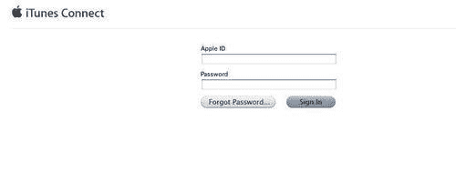

1.  选择 **管理你的应用程序** 链接以开始添加应用程序的过程：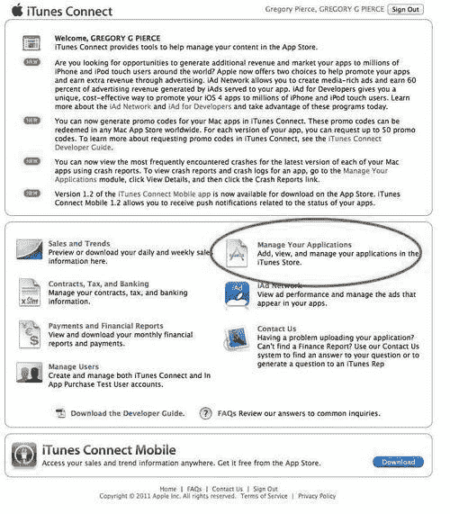

1.  选择你国家的 **主要语言** 并输入你的公司名称或你将合法经营的名字：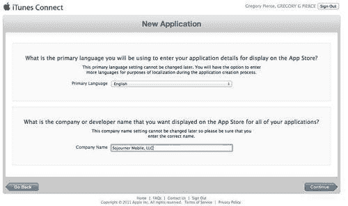

1.  接下来，您需要告诉 **iTunes Connect** 您打算创建哪种类型的应用。如果您能够创建 iOS 应用和 OSX 应用，请简单地选择 iOS 图标：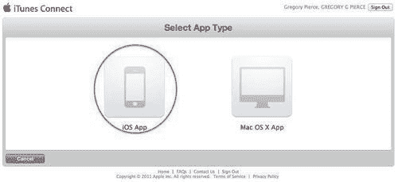

1.  现在 **iTunes Connect** 已知我们试图创建的应用类型，请输入代表您应用的 **应用名称、SKU 编号** 和 **包 ID**：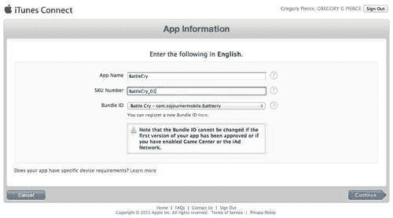

1.  输入这些信息后，就是设置价格的时候了。输入产品可用的日期。将价格设置为 **免费**。点击 **查看定价矩阵** 选项，查看您还有哪些定价选项。

    ### 注意

    如果您想通过批量购买为教育机构提供折扣，请勾选此选项的复选框。

    +   第二个选项 **自定义 B2B 应用** 是针对向企业客户提供批量购买的应用程序（[`www.apple.com/business/vpp/`](http://www.apple.com/business/vpp/)）。如果您勾选此复选框，您的游戏将不会在常规应用商店中提供。

    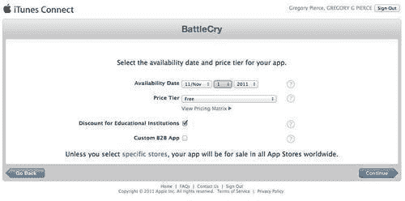

1.  接下来，输入游戏的元数据。这是用于填充 iTunes 应用商店页面的信息：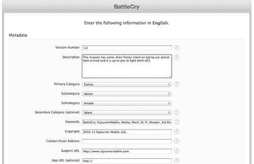

1.  为了确保应用被正确评级并针对适当的受众，请选择适当的选项。最重要的是，确保任何成熟度和暴力的评级都得到适当体现，否则您的应用将被拒绝。如果您的应用包含长期图形、虐待、色情或裸露内容，则不允许在应用商店销售此类内容：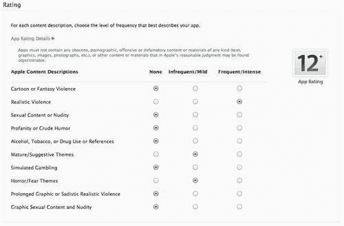

1.  最后一步是为 **iTunes Connect** 提供艺术作品，这些作品将在 iTunes 商店中使用。根据您的目标平台，您可能需要提供最多三件艺术作品。

    您应用图标的大版本是将在 App Store 中使用的版本。它必须至少为 72 DPI，且最小尺寸为 512x512 像素（不能放大）。它必须是平面艺术作品，没有圆角。

    **iPhone 和 iPod touch 截图** 必须是 `.jpeg`, `.jpg`, `.tif`, `.tiff` 或 `.png` 文件，分辨率为 960x640, 960x600, 640x960, 640x920, 480x320, 480x300, 320x480 或 320x460 像素，至少 72 DPI，并且使用 RGB 颜色空间。

    iPad 截图必须是 `.jpeg`, `.jpg`, `.tif`, `.tiff`, 或 `.png` 文件，分辨率为 1024x768, 1024x748, 768x1024, 或 768x1004 像素，至少 72 DPI，并且使用 RGB 颜色空间：

    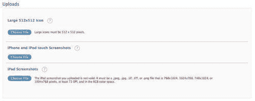

1.  现在所有应用设置都已配置完毕，应用已准备好分发。在应用的版本下，您会注意到状态是 **准备上传**，这意味着苹果正在等待我们上传游戏以供审查。

选择应用程序图标，这样我们就可以上传游戏的最终二进制版本以供审查：

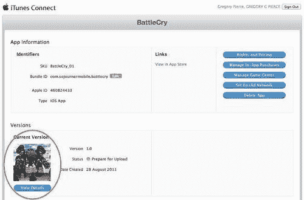

现在我们已经准备好以我们设定的价格发布我们的应用程序，如果它通过了苹果的审查，它将按照我们上面指定的可用日期上市。

## 刚才发生了什么？

我们刚刚为 iTunes 创建了所有销售我们应用程序的元数据。在最终发布之前，剩余的步骤是将最终二进制文件提交给苹果。我们将在添加了商业模式的其它组件到应用程序后讨论这一点。

# 行动时间 — 添加 iAds

从你的应用程序中产生收入的一个低风险策略是引入广告模式。你可以在应用程序的主菜单或加载屏幕中轻松显示广告，而不会对你的客户的使用体验产生负面影响，同时还能产生合理的收入。

由于 Unity 本身不提供向应用程序添加 iAds 的功能，我们将通过 Prime31 插件展示如何获取这一功能。虽然当然也可以实现自定义插件，但这超出了本书的范围。更重要的是，将时间用于构建应用程序是更好的选择：

1.  访问网站 [`www.prime31.com`](http://www.prime31.com) 并下载 iAds 插件：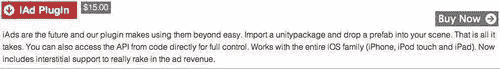

    +   虽然插件本身不是免费的，但你应该通过广告获得的收入超过插件的成本，以证明其购买是合理的。

1.  通过**资产** | **导入包** | **自定义包**菜单命令导入购买的 unitypackage：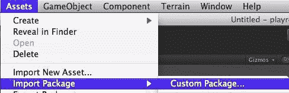

1.  在你的机器上选择 unitypackage，以便 Unity 开始导入其资源：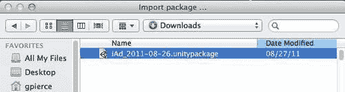

1.  Unity 现在将开始导入插件，并显示一个对话框确认你希望将包中的所有资源导入到项目中：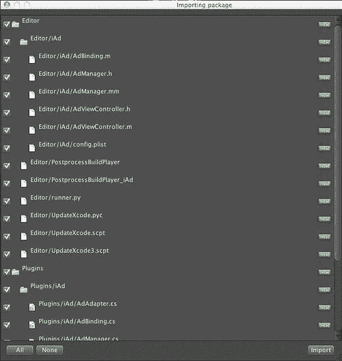

    +   确保你已经选择了所有项目，然后按下**导入**按钮。当导入过程完成后，你应该在**层次结构**视图中看到两个新的节点：

    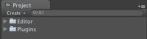

1.  iAds 系统附带一个用于显示广告的现成 Prefab，所以让我们将其拖入我们的场景中。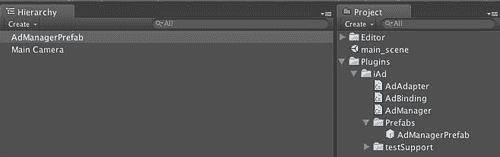

    +   现在添加了这一功能后，我们的应用程序已经准备好显示广告。

1.  在 iTunes Connect 中打开应用程序并选择**设置 iAd 网络**：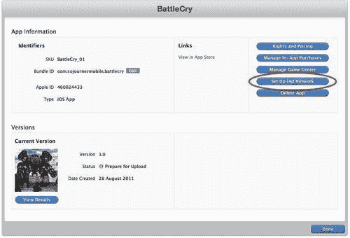

1.  通过选择**启用 iAds**按钮来为你的应用程序启用 iAd 广告网络：

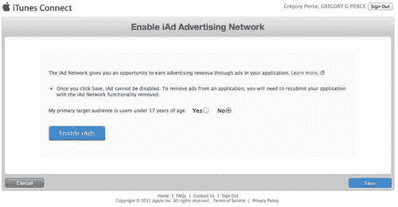

### 注意

确保适当地设置您的目标受众。这将确保您为您的目标受众适当地投放广告。

## 刚才发生了什么？

我们刚刚将 iAd 网络添加到我们的应用程序中。当运行我们的游戏时，现在我们将在应用程序的主场景中看到由苹果的受众群体和广告引擎纯粹驱动的 iAd 广告。当人们与游戏中的广告互动时，你将收到苹果的支票。

# 应用内购买

游戏中的应用内购买为用户提供通过与应用商店交易购买升级、访问级别、武器或其他内容的能力。然后应用商店将与游戏通信，通知它购买已被授权，并且内容应在游戏中解锁。所有这些都在 iOS SDK 和应用商店商业系统中进行，因此您无需处理信用卡交易或跨线的商业交易安全。苹果将处理整个流程，您将以与常规应用程序购买相同的方式收到钱。

在内部，应用内购买使用 iOS SDK Store Kit API 完成。此 API 负责与 App Store 通信并从用户那里收集付款：

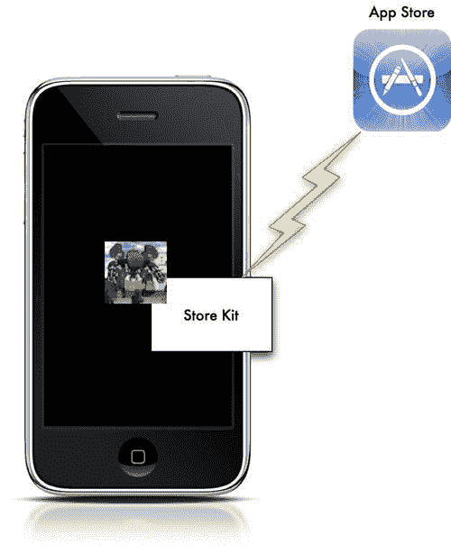

到目前为止，Unity 尚未在其 iOS 版本的 Unity 产品中为应用程序提供添加应用内购买的功能的渠道，因此，就像 iAds 一样，我们将不得不依赖第三方插件来实现此功能。就像之前一样，我们将使用 Prime31 的 StoreKit 插件。

## 订阅类型

有四种不同类型的应用内购买：非消耗品、消耗品、订阅和自动续订订阅：

+   **非消耗品** 应用内购买代表一类物品，您只需购买一次即可持续访问。这些购买可以在同一 iTunes 账户的设备之间转移。非消耗品物品的例子包括游戏关卡、武器、车辆和其他永久可用物品。

+   **消耗品** 应用内购买代表一类物品，正如其名所示，玩家购买后使用，每次玩家希望使用该物品时都需要额外购买。消耗品物品的例子包括经验值、健康包、加速器、弹药包等等。

+   **订阅** 与杂志和报纸订阅类似，持续有限的时间，然后在该时间段结束后需要用户续订。虽然这在游戏圈中并不典型，但订阅的一个例子可能是足球游戏中的防守教练，这允许玩家不必调用防守战术。教练将在订阅期间可用，并在订阅到期后，游戏将要求玩家再次调用防守战术。

+   **可自动续订的订阅**是指用户可以购买一定时间段的内购内容。在期限结束时，订阅将自动续订，除非用户选择退出。可自动续订的订阅的例子与普通订阅相同，只是玩家在取消订阅之前将继续拥有防守教练。

## 交付模型

内购可以使用两种交付模型之一与 iTunes 配合使用，即内置模型和服务器模型。

在内置产品模型中，为您的应用向客户交付内购内容所需的一切都内置到游戏中。这意味着所有可消耗和非可消耗的内购内容都已经内置到游戏中。因此，这意味着所有购买访问将通过应用标识符定义。由于单个应用将负责维护这些首选项，因此当用户在不同设备之间移动时，它们可能会丢失，所以您必须确保任何会保留该状态的偏好都存储在应用首选项中，因为它们由 iTunes 备份。另一个解决方案是使用 iCloud 或类似的服务来托管这些应用首选项：

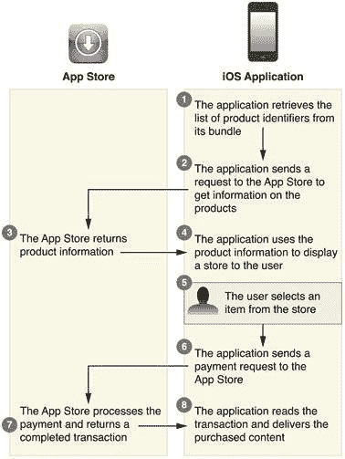

在服务器产品模型中，一个单独的服务器维护内购内容和与 App Store 的交易。然后 App Store、应用和服务器协同确认购买并向 iOS 设备交付内容。在这个模型中，游戏将直接向应用交付新关卡或其他内容。虽然这个模型很有吸引力，但目前它不适合 Unity iOS 应用，因为苹果要求所有内容都必须在 App Store 的应用中分发。这里列出是为了完整性：

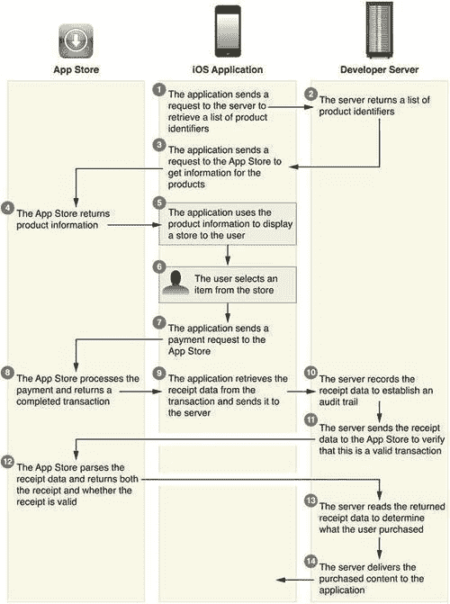

### 注意

由于内购过程不提供修补应用的能力，并且由于 Unity 不会直接加载不在应用包中的内容，因此预计您计划通过内购交付的所有内容都将通过 App Store 中的应用版本交付。

# 执行时间 — 添加内购

1.  定义内购的第一步是在**iTunes Connect**中向应用添加购买类型。在应用配置文件页面上，选择门户中的**管理内购**链接：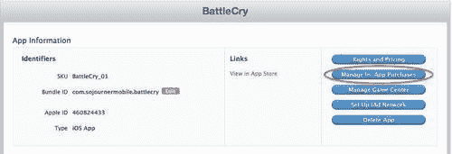

1.  在**内购**屏幕上选择**创建新**以开始过程：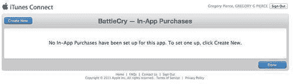

1.  接下来，我们想要设置一个代表用户新枪型的内购，因此选择**非消耗品**：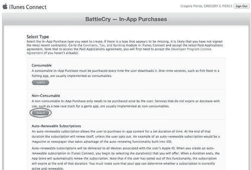

1.  在详细信息区域提供产品的**参考名称**和**产品 ID**。**产品 ID**是您稍后在 Store Kit API 中引用产品时将使用的。您可以随意命名产品 ID，它仅用于您自己的内部目的。您应该遵循与产品相同的命名约定，以确保您不会在产品、版本等之间发生名称冲突：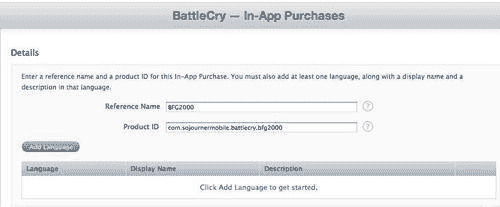

1.  由于 iOS 应用程序和 iTunes 支持本地化，您需要设置产品在商店中显示的语言。选择**添加语言**并输入产品的商店详细信息：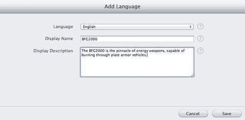

1.  接下来设置产品的定价。内购的层级与常规 iTunes App Store 购买的层级相似：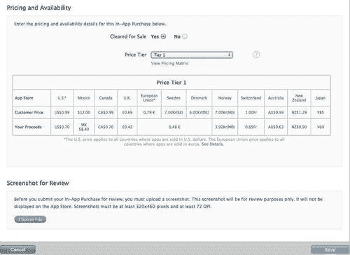

1.  接下来我们需要为 App Store 审查团队添加一个截图。目前尚不清楚这个截图是如何使用的，但您无法在没有这个 320x240 图像的情况下提交您的内购：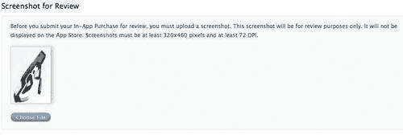

1.  完成此更新后，请检查内购列表，以确保输入的详细信息与您提交的游戏内容相匹配：

    ### 注意

    购买目前正在进行审查。

    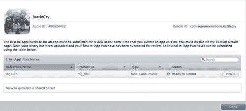

    +   完成此操作后，我们可以编写必要的插件代码，以便在 Unity 游戏中访问此内购。

1.  将 StoreKitManager 预制体从 Prime31 插件拖入场景。StoreKitManager 负责与 iOS 设备上的原生 Objective-C 库通信，以处理与 Apple StoreKit API 的集成。

1.  将 StoreKitEventListener 预制体拖入场景。随着 StoreKit 事件在 iOS 设备上发生，StoreKitEventListener 将从操作系统接收有关它们的通知。

1.  为了保持简单，我们将创建一个简单的 GUI 按钮，当点击时，将使用户购买 BFG 武器。

1.  创建一个名为 InAppPurchases 的新脚本：

    ```swift
    using UnityEngine;
    using System.Collections.Generic;
    public class InAppPurchases : MonoBehaviour
    {
    #if UNITY_IPHONE
    void OnGUI()
    {
    if( GUI.Button( new Rect( 0, 0, 50, 40 ), "Purchase BFG" ) )
    {
    bool canMakePayments = StoreKitBinding.canMakePayments();
    if ( canMakePayments )
    {
    StoreKitBinding.purchaseProduct( "bfg_001", 1 );
    }
    }
    #endif
    }

    ```

## 刚才发生了什么？

我们刚刚创建了第二个收入渠道，内购。我们刚刚创建了一个机制，通过该机制，用户可以通过在游戏界面上的按钮按下购买 BFG 武器来使用它。

# 执行时间 — 向 Unity 资产商店添加内容

在您开发游戏的过程中，您可能已经开发了一些资产，如音乐、艺术作品或插件，您希望与其他 Unity 社区的用户分享。Unity Asset Store 通过 Unity IDE 本身提供了一个渠道来分发这些作品，并与您分享 70% 的收入——即使您选择不将其提交到 Apple App Store，这也是在您的游戏中赚钱的一种方式。事实上，Unity Asset Store 上有完整的游戏项目可供开发者参考。我们将提交我们游戏项目的一部分到 Asset Store，以便人们可以在他们的开发项目中下载并从中学习：

1.  将内容发布到 Unity Asset Store 的第一步是创建一个账户。如果您一直在跟随，您已经创建了一个客户账户并可以跳过此步骤。否则，打开 Unity 编辑器并选择 **窗口** | **Asset Store**。

1.  选择 **创建账户** 并完成账户创建过程：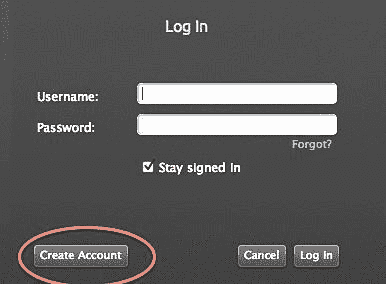

1.  从（[`download.unity3d.com/assetstore/asset-store-provider-distribution-agreement.pdf`](http://download.unity3d.com/assetstore/asset-store-provider-distribution-agreement.pdf)）下载并审查 Asset Store 提供者协议。阅读此文档以了解 Unity Technologies 与 Asset Store 提供者之间的关系。

1.  从（[`download.unity3d.com/assetstore/asset-store-submission-guidelines.pdf`](http://download.unity3d.com/assetstore/asset-store-submission-guidelines.pdf)）下载并审查 Asset Store 提交指南。这些指南概述了提交内容到 Asset Store 时所需的各项约定。

1.  在 **Asset Store** 窗口中搜索 **Asset Store Tools** 并下载它们。此图像中用 Unity 图标表示：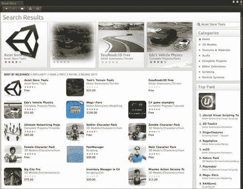

1.  下载后，就像导入任何其他 Unity 包一样导入 **Asset Store Tools** 包。这些工具具有准备内容提交到 Asset Store 所需的框架和脚本：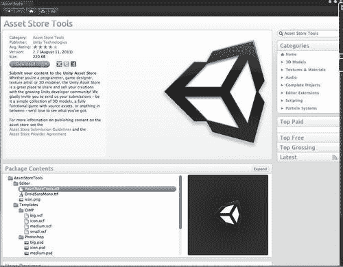

1.  在下载的插件 **AssetStoreTools** 层级下，您将找到一个 `Templates` 目录。此目录包含您希望修改以提交到 Asset Store 的所有图像模板。这些关键图像是 Asset Store 将用于创建其自身商店页面的：

    | 图像类型 | 大小 | 描述 |
    | --- | --- | --- |
    | 大 | 1010x389 | 用于在屏幕上以包为主要项目时推广包。您应该放置图片的实时区域是 550x330 |
    | 中 | 460x250 | 当需要较小的视图大小时，用于替换大图像。您应该放置图片的实时区域是 285x200。 |
    | 小型 | 200x258 | 用于在较小的框视图中推广图像。你应该放置图像的实时区域是 175x100。 |
    | 图标 | 128x128 | 用于下载和列表视图 |

1.  更新你的图片以符合 Unity Technologies 的布局建议，以确保文本正确显示，并且你的图片在商店显示时不会被裁剪：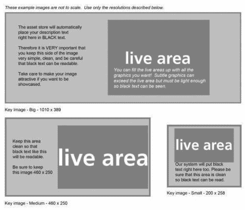

1.  在游戏项目中创建一个`AssetStore`目录。你想要分发的所有资产都放在项目的根目录下。在我们的例子中，我们正在分发整个游戏项目，所以我们不需要做任何特殊的事情，因为 Asset Store 打包器在向最终用户分发内容时将直接复制我们的文件夹结构和资产。

1.  在`AssetStore`目录中，为你的关键图像创建一个名为`Screenshots`的文件夹。这些截图应至少为 640x480。这些是客户在评估 Asset Store 中的资产时可以查看的图像：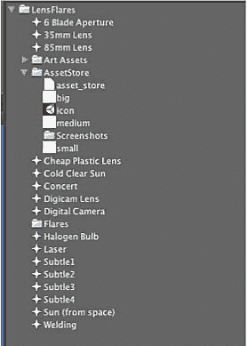

1.  启动 Unity Asset Store **包管理器**，它将生成提交给 Asset Store 所需的包：

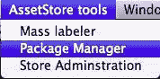

## 刚才发生了什么？

我们刚刚将我们的游戏项目发布到 Unity Asset Store，供其他开发者购买。这是我们作为内容开发者可用的最终收入来源之一，使我们能够出售像音乐、艺术品、脚本或整个游戏这样的简单产品，供其他开发者购买。

# 使用 iTunes Connect 衡量成功

一旦你的游戏产品在市场上发布，你将想要衡量成功，以便你可以确定最佳方式来增长市场机会并最大化收入。收集这些信息的渠道是 iTunes Connect。

# 行动时间 — 我们的游戏表现如何？

为了说明使用 Unity3 可能的内容类型，我们将从在设备上运行一个真实的应用程序开始。你必须执行一系列步骤才能做到这一点，特别是如果你是 iOS 平台的新开发者，所以我将花些时间确保你理解正在发生的事情。如果你没有正确地做事，iOS 开发可能会非常苛刻，但一旦你走过几次，它就会变得自然而然。

我们将逐步介绍制作可用于 Unity3 的商业内容并部署到 iOS 设备的必要步骤：

1.  在[`itunesconnect.apple.com`](http://https://itunesconnect.apple.com)上打开**iTunes Connect**门户或从正常的 iTunes 开发者门户启动它：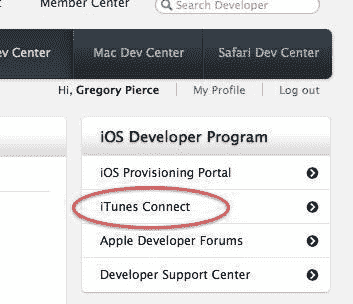

1.  一旦进入门户，请选择门户链接中的**销售和趋势**链接。这个区域包含了我们发布到 App Store 的所有内容的所有人口统计数据报告：

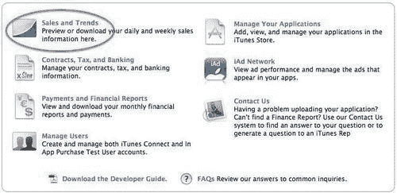

## 发生了什么？

我们刚刚探讨了如何查看 iTunes Connect 门户并确定如何衡量你发布的游戏的成功。在 iTunes Connect 中，你可以查看游戏购买者的各种不同维度的统计数据，例如时间、地理、设备等。这将帮助你衡量促销活动、广告活动或新设备发布等事物的影响。

# 摘要

你面前还有一个最后的挑战，这个挑战比我们迄今为止所做的一切都更重要，那就是真正创建并发布你自己的游戏。人们之所以止步不前，有很多原因，但请意识到，你现在已经拥有了创建游戏、发布游戏并从中赚钱所需的所有信息。你可能无法辞去日常工作，但如果你坚持下去，你很可能有一天会创造出下一个伟大的游戏品牌或游戏公司。

不要担心创造下一个最佳游戏，不要担心拥有最新和最好的图形，不要怀疑那个游戏想法是否会卖出百万份（我无法想象创造《愤怒的小鸟》的人知道它会以这种方式走红）——专注于创造一些东西，然后创造另一些东西，在你意识到之前，你将会创造出一些伟大的东西。但如果你试图将下一个《上古卷轴》、《魔兽世界》、《使命召唤》或《孤岛惊魂》作为你的第一个项目，你是无法做到的。

因此，与其说再见，我宁愿说：“我们在 App Store 上再见。”祝你好运，最重要的是……玩得开心！
