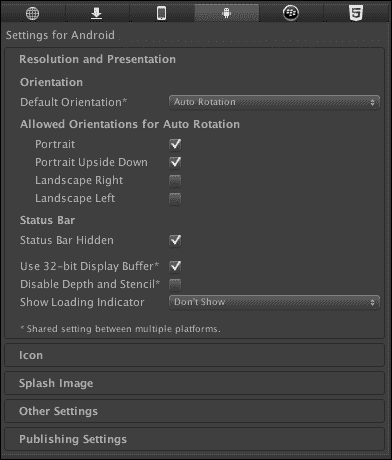
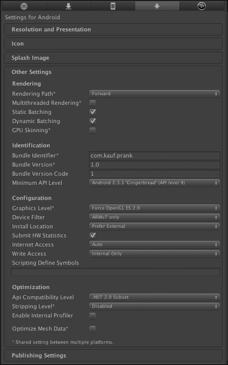
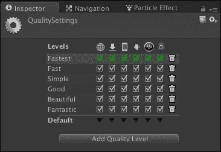
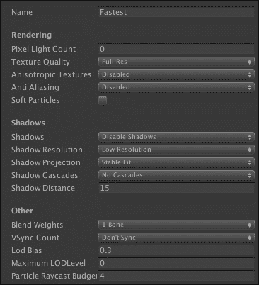
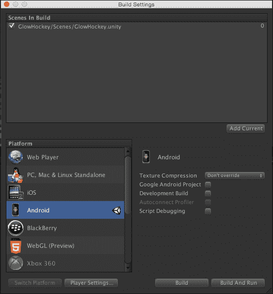
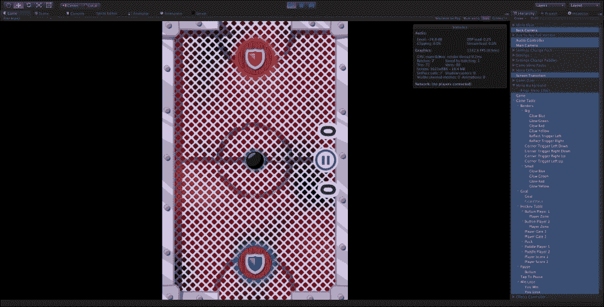

# 第一章. 设置和配置安卓平台

本章将讨论在 Windows 和 Mac OS X 平台上安装安卓 SDK。此外，读者将了解如何为安卓设备配置 Unity 5。在本章中，我们还将探索 Unity 5 中的 APK 扩展文件。在本章中，读者将在安卓设备上构建**发光曲棍球**项目（我们将在本书最后一章从头开始使用 Unity 5 创建这款游戏）。在本章结束时，读者将探索 Unity Pro 和 Unity Basic 特定功能和规则的并列比较。

本章将涵盖以下主题：

+   为安卓设备配置 Unity 5

+   Unity 5 中的 APK 扩展文件

+   为安卓设备构建

+   Unity 许可证比较概述

# 为安卓设备配置 Unity 5

一旦你安装了安卓 SDK 并设置了 Unity，你必须为你的每个安卓项目配置正确的设置。我们将从考虑以下截图所示的**分辨率和显示**选项开始我们的审查。为了在 Unity 中访问安卓平台设置，你需要导航到**编辑** | **项目设置** | **玩家**菜单，然后点击带有安卓图标的按钮。另外，获取安卓平台设置的其他方法是导航到**文件** | **构建设置**。打开窗口后，你需要点击底部的**玩家设置**按钮。

**默认方向**选项在多个移动平台之间共享。此设置是必要的，以便指示为你的游戏或应用程序设计的屏幕方向。所有设置的默认值都是**自动旋转**。例如，如果你的项目仅设计为屏幕的纵向方向，那么你需要选择**纵向**或**纵向颠倒**的值：

我们可以选择以下属性之一：**纵向**、**纵向颠倒**、**横向右**、**横向左**和**自动旋转**。它们相当简单，不言自明。你只需稍微玩一下它们，就能了解它们的真正用途。**隐藏状态栏**复选框无需解释，因为其含义很明显。

我们将要调查的下一个选项被称为**使用 32 位显示缓冲区**。你可以决定是否让**显示缓冲区**处理 16 位颜色值（如果没有启用 32 位），或者是否处理 32 位颜色值。记住，你只需要在出现某些碎片时激活此设置，因为它会极大地影响性能。**显示加载指示器**字段确保以下行为：**不显示**、**大**、**反转大**、**小**和**反转小**。

如前图所示，有很多设置；然而，除了在构建前必须调整的少数几个之外，大多数都可以使用默认值。您不配置**包标识符**选项就无法为您的 Android 设备构建 APK 文件，该选项在移动平台之间共享。**包标识符**字符串必须与您构建的游戏的配置文件相匹配。标识符的基本结构是`com.公司.产品名称`。包版本负责保存描述发布索引的数字。此外，Unity 允许我们指定您的 Android 项目将支持的最低 API 级别。您还可以设置应用程序的名称和图标。其他设置很明显，不需要额外解释。更详细的信息可以在 Unity 的官方文档中找到。

# Unity 5 中的 APK 扩展文件

Google Play 要求您的游戏和应用程序的大小不超过 50 MB。对于大多数应用程序和游戏来说，这个大小已经足够了。或者，您可能希望为您的项目提供出色的图形和其他占用大量空间的媒体文件。通过扩展 APK 文件，Google Play 使开发者的生活变得更加简单和容易。扩展文件存储在设备的一个共享文件夹存储中，您的游戏有足够的访问权限。

## 概述

每个文件的大小不能超过 2 GB，您可以为它选择任何格式。当然，最好的方式是在下载过程中仅使用压缩文件，以节省带宽。您可以为您的 APK 添加一个或两个扩展文件。每个扩展文件背后都隐藏着它的意义：

+   第一个扩展文件被称为**主文件**，应该用于游戏中需要的额外资源。这就是为什么这个扩展文件是主要的。

+   第二个扩展文件被称为**补丁**，用于更新主文件。这就是为什么它是可选的。

您应该知道，开发者控制台不允许您仅通过上传新的扩展文件来更新现有的 APK 文件。

## 格式

对于您的扩展文件，您可以使用任何所需的格式，例如 MP3、MP4、AVI、RAR、ZIP、DOC 和 PDF。JOBB 工具可以帮助您封装和加密您的资源和补丁。

## 更新过程

在大多数情况下，Google Play 会自动为您完成所有工作。因此，在用户在他们的设备上下载或上传您的扩展文件时，您通常不需要做任何事情。然而，有时您的游戏必须通过从 Google Play 的应用程序许可服务接收 URL 来自己下载这些文件。

下载游戏扩展文件的基本步骤如下：

1.  在游戏启动事件中，您应该在`Android/obb/<package-name>/`目录中查找扩展文件。

1.  在第一步中，如果您发现您的扩展文件已经在该目录中，那么您可以继续玩游戏。

1.  如果扩展文件不在该目录中，您应执行以下两个步骤。

1.  您必须接收游戏扩展文件的 URL、名称和大小。在下载任何内容之前，您应该知道下载的位置和内容。

1.  在获取所有必要的下载扩展文件的信息后，您可以获取您的文件并将它们放入与 Google Play 告诉您相同的名称的 `Android/obb/<package-name>/` 目录中。

### 注意

以下列出的注意事项是从官方 Android 开发者文档页面 [`developer.android.com/google/play/expansion-files.html`](http://developer.android.com/google/play/expansion-files.html) 中摘录的：

+   Google Play 为您的扩展文件提供的 URL 对每个下载都是唯一的，并且每个 URL 在提供给您的应用后不久就会过期。

+   无论您的应用是否免费，Google Play 只有在用户从 Google Play 购买您的应用时才会返回扩展文件 URL。

+   在请求和下载过程中可能会发生各种错误，您必须优雅地处理这些错误。

+   网络连接性在下载过程中可能会改变，因此您应该处理此类变化。如果中断，在可能的情况下继续下载。

+   在后台下载时，您应提供一个指示下载进度的通知，通知用户已完成，并在选择时将用户带回到您的应用。

## 在 Unity 5 中设置扩展文件

导航到 **Player Settings** | **Publishing Settings** 菜单，在底部您将看到一个名为 **Split Application Binary** 的选项。当此选项启用时，您的项目将分为代码的 `.apk` 文件，以及所有其他资源和数据的 `.obb` 文件。

让我们看看与扩展文件（`.obb`）加载相关的关键方面的列表：

+   扩展文件不需要上传到 Google Play 服务器。

+   如果您已决定在 Google Play 上发布 `.apk` 和 `.obb` 文件，那么您需要包含下载扩展文件的代码。

+   在 Unity Asset Store 中，您可以找到一个用于在正确位置下载和提取扩展文件的优秀插件。此插件的网址为 [`u3d.as/content/unity-technologies/google-play-obb-downloader/2Qq`](http://u3d.as/content/unity-technologies/google-play-obb-downloader/2Qq)。

+   在测试 `.obb` 文件之前，您需要登录您的 Google 账户。

# 为 Android 设备构建

在 Unity 中创建新项目后，调整全局质量设置是一个好主意，如下所示图所示。其中大部分会影响您的游戏性能。让我们更深入地了解 **QualitySettings**，因为它在为 Android 设备构建应用程序之前是必须的：

Unity 允许您为您的质量设置创建一个模板；您还可以选择 Unity 默认提供的模板之一。这些设置极大地影响了您应用程序的性能和图形质量。对于资源非常有限的移动平台来说，这尤其重要。您需要在自己的目标平台上调整设置，以找到最适合您质量和性能的最佳模板设置。要访问这些设置，您需要导航到**编辑** | **项目设置** | **质量**。您可以为 Unity 支持的所有平台分别选择不同的模板。此设置窗口分为两个主要部分。上半部分，如前一张图所示，用于管理模板，而下半部分，如以下图所示，负责实际的设置。

每个模式（甚至 Unity 内置模板）都可以按照您的意愿命名。对于 Unity 支持的所有平台，您可以选择几个可访问的设置模板，以及一个默认模板。默认设置模板以绿色突出显示。您的设置应尽可能简单，尤其是对于移动平台。Unity 允许您通过点击带有篮子图标的图标来创建新的设置模板和删除它们。

我们打算介绍的第一部分是**渲染**，如前一张截图所示。它包含影响**正向渲染**模式下仅限于**像素光计数**选项。**正向渲染**路径通过一个或多个遍历渲染每个对象，具体取决于影响该对象的光源。光源本身也根据其设置和强度被**正向渲染**以不同的方式处理。

**渲染**部分包含**纹理质量**属性，有四个现有选项：**全分辨率**、**半分辨率**、**四分之一分辨率**和**八分之一分辨率**。这让你可以选择是否以最大分辨率或其分数（较低分辨率具有更少的处理开销）显示纹理。始终记住，在任何项目中，你需要在这两个特征之间找到黄金平衡：质量和性能。下一个属性名为**各向异性纹理**，它允许你选择三个值：**禁用**、**按纹理**和**强制开启**。这描述了各向异性纹理将被如何使用。在维基百科（[`en.wikipedia.org/wiki/Anisotropic_filtering`](http://en.wikipedia.org/wiki/Anisotropic_filtering)）上，我们可以读到关于各向异性过滤的以下内容：“在 3D 计算机图形学中，**各向异性过滤**（缩写为**AF**）是一种增强计算机图形学表面纹理图像质量的方法，这些表面相对于相机以斜角观看，其中纹理的投影（而不是渲染在它上面的多边形或其他原语）看起来是非正交的（因此这个词的起源：“an”表示不是，“iso”表示相同，“tropic”来自 tropism，与方向相关；各向异性过滤不会在各个方向上过滤相同）”。

你接下来要学习的属性是**抗锯齿**。可以通过选择**禁用**选项来关闭抗锯齿，或者通过选择**2x**、**4x**和**8x 多采样**选项来开启它。下一个设置只是切换粒子的软混合，其名称为**软粒子**。这是**渲染**部分的最后一个选项。

下一个部分是**阴影**，其名称完全描述了其功能和目的。我们可以从三个开放值中选择一个：**硬阴影和软阴影**、**仅硬阴影**和**禁用阴影**。如果你选择**阴影分辨率**选项的最高分辨率，可能会产生很大的处理开销。可能的设置如下：**低**、**中**、**高**和**非常高**。在**阴影投影**选项中，有两个独立的程序用于预测来自方向光线的阴影。如果我们选择**紧密拟合**，那么它将渲染更高分辨率的阴影，如果相机移动，有时可能会略微晃动。下一个选项，也是**阴影投影**的最后一个选项，是**稳定拟合**值，它是**紧密拟合**的对立面。这意味着**稳定拟合**会渲染较低分辨率的阴影，但在相机移动时不会出现任何伪影。接下来是**阴影级联**设置，它会影响处理开销。更高的级联循环可以处理更多的处理开销。不要忘记黄金平衡。级联的可获得选项如下：**无级联**、**两级级联**和**四级级联**。

[`docs.unity3d.com/460/Documentation/Manual/DirectionalShadowDetails.html`](http://docs.unity3d.com/460/Documentation/Manual/DirectionalShadowDetails.html)

### 注意

在移动平台上，方向光的真实阴影总是使用一个阴影级联，并且是**硬阴影**。

方向光通常在户外游戏中用作主光——阳光或月光。观看距离可以非常大，尤其是在第一人称和第三人称游戏中，阴影通常需要调整以获得最佳的质量与性能平衡。

**阴影距离**的值决定了我们能看到阴影的距离。超过这个长度的阴影是可见的，其他的则不可见。

在以下文本中，我们将探讨所谓的**其他**部分。它包含五个选项，用于调整任何项目。让我们从第一个选项——**混合权重**开始。在这个设置中，我们可以选择三个非常重要的值，这些值对性能有很大影响。值越低，性能越好。这个设置表示在动画过程中可以影响给定顶点的骨骼数量。我们可以选择**1 根骨骼**、**2 根骨骼**或**4 根骨骼**；不多也不少。下一个特性对性能影响很大，但由于其几乎不可见的伪影，它不是关于质量的首要问题。这个设置的名称是**垂直同步计数**，而这个伪影被称为**撕裂**。如果我们想避免这种伪影，就需要将渲染与显示设备的刷新率同步，但不要忘记性能。同步可能会大幅降低性能，因此你应该准备好应对这种情况。对于**垂直同步计数**参数，只有三个现有的选项：第一个选项是与每个**垂直空白**（**VBlank**）同步，第二个值是与每第二个垂直空白同步，第三个选项允许我们禁用所有同步，从而加快应用程序的运行速度。我们研究的下一个设置是**LOD 偏差**。这个值只在 Unity 需要决定选择哪个 LOD 级别时才会发挥作用。例如，当有两个 LOD 级别可供选择时，**LOD 偏差**通过只选择一个值来提供帮助。这个值在零到一之间设置，作为一个分数。越接近零，选择的级别就越不详细，反之亦然。现在还有两个剩余的选项我们将考虑。第一个是**最大 LOD 级别**，它的目的是记住你可以在项目中使用的最高 LOD 级别的数字。第二个是**粒子射线投射预算**，它需要与**低**和**中**质量级别的粒子系统碰撞，这个数字描述了物理近似中射线投射的最高值。

至于**最大 LOD 级别**参数，所有值将小于此数字的模型将不会包含在构建中；Unity 将忽略它们，这可以显著减少你的应用程序或游戏消耗的内存量。此参数的初始默认值为零，这意味着无论模型的细节程度如何，每个模型都将包含在你的构建中。对于每个平台，根据其配置，Unity 将使用可能的最小 LOD 级别。

如果 Android SDK 安装和 Unity 设置成功，你可以安全地创建项目的构建版本。为此，你需要导航到**文件** | **构建设置**，在打开的窗口中，你可以创建如图所示的各个支持平台的构建版本。如果你已正确安装 Android SDK 并配置了 Android，且在 Unity 中设置了质量和玩家设置，你可以安全地点击窗口右下角的**构建**按钮或**构建并运行**按钮（如果你的 Android 设备已正确配置并通过 USB 连接），以同时导出 `.apk` 文件并将项目部署到连接的设备上。

现在，是时候构建 Glow Hockey（我们将在本书最后一章从头开始使用 Unity 5 创建这个游戏）。首先，你应在 Unity 编辑器中创建一个新项目。你可以按自己的意愿命名。要创建新项目，你应该点击窗口右下角的**创建项目**按钮。

创建新项目后，将显示 Unity 编辑器。

Glow Hockey 是 Unity 支持的各个平台上项目部署的一个很好的例子。在这个游戏中，有许多不同的效果、动画、音效、物理效果以及许多其他来自 Unity 的方面。在 Android 平台上部署此项目后，你可以测试 Unity 支持的各种功能。

打开主**Glow Hockey**场景后，你可以按自己的意愿进行任何更改或进行实验。然而，在本章中，我们的目标只是将这个游戏构建在 Android 设备上。我们不会在本章中对项目进行任何更改。

打开**构建设置**窗口后，你应该选择**Android**平台，然后你可以通过点击窗口右下角的**构建**按钮来创建一个 `.apk` 文件，以便与你的朋友分享，例如。此外，你可以按**构建并运行**按钮来导出 `.apk` 文件，就像第一种情况一样，并且同时通过 USB 线缆将此项目部署到连接的设备上。

现在，让我们在下一节中了解更多关于 Unity 许可证比较的信息。

# Unity 许可证比较概述

本节基于 Unity 许可证比较概述。链接[`unity3d.com/unity/licenses`](http://unity3d.com/unity/licenses)将向您展示 Unity Pro 和 Unity Basic 的具体功能和规则的并列比较。

## 导航网格、寻路和人群模拟

寻路是 Unity 的内置功能。该系统允许您轻松地从起点找到正确的路径，避免在路径上遇到的障碍。在使用此功能之前，您必须先在 Unity 编辑器中烘焙导航数据。在那里，您必须指定哪些楼层对象或地面可以行走，哪些对象是障碍物——所有其他问题在调用带有起点和终点参数的寻路函数后，Unity 将无需任何努力解决。如果您有强烈的愿望，您可以创建自己的寻路系统和人群模拟。Unity 中的寻路系统适用于基本和 Pro 许可证。

## 细节级别（LOD）支持

**细节级别**（**LOD**）允许您通过为您的网格提供几个不同级别的质量来非常有效地优化您的生产力。每个级别都会根据与摄像机的距离在摄像机视图中显示。也就是说，当摄像机距离太远时，显示最复杂和详细的网格并不理想，因为网格上所有这些细节的力量将完全不可见，这浪费了宝贵的资源。这对整体性能来说并不好。只有当摄像机足够近，您可以看到网格上的所有这些细节时，才应该显示细节网格。LOD 仅由 Unity Pro 许可证支持。如果您只有 Unity Basic 许可证，那么您可以非常容易地创建自己的 LOD 系统。优化思想可以很容易地由您自己实现。关键是根据网格与摄像机的距离实时（或多或少详细）更改网格以进行渲染，这反过来又会减少硬件的不必要成本。

## 音频过滤器

音频过滤器允许你在实时中通过编程创建不同的声音效果。想象一下这样的场景，在游戏中，当你的角色在沙地上行走时，你必须播放一个声音。然而，如果玩家突然进入隧道，那么声音应该与在沙地上行走的声音不同。为了解决这个问题，你可以选择可能的场景之一。解决这个问题的第一个方案在于，你可以创建或已经使用了一个适用于隧道行走等场景的现成声音。对于每种情况，你都会有各种现成的声音。或者，如果你在游戏中有很多不同的情况需要播放不同的声音，这种方法会消耗大量内存。与 Unity 软件提供的实时音频过滤器提供的第二种解决方案相比，这种方法不够灵活。音频过滤器仅由 Unity Pro 许可证支持。

## 视频播放和流式传输

现在，许多应用程序和游戏需要播放不同的视频。视频可能占用大量内存，这对于移动设备来说尤其是一个严重的问题。为了减少视频内容的额外内存成本，Unity 允许你通过互联网视频流进行广播。此功能仅适用于 Unity Pro 许可证。

## 使用资源包的完整流式传输

资源包仅由 Unity Pro 许可证支持。此功能极大地帮助优化了创建高质量游戏或应用程序的方式。此功能允许开发者通过互联网流式传输内容，例如，向游戏中添加新角色、新建筑、新武器、新纹理等等。

## 十万美元的营业额

此项并非 Unity 的功能，而应被视为 Unity 的条件或要求。该条件指出，如果在上一财年，你（个人）或你的组织，收入超过 10 万美元（含），那么你必须使用 Unity Pro 许可证；也就是说，你完全没有权利使用 Unity Basic 许可证。这可以被认为是 Unity 相当合理且逻辑的条件。毕竟，如果你或你的组织收入超过 10 万美元（或正好 10 万美元），那么你或你的组织可以毫无问题地购买 Unity Pro 许可证。

## Mecanim – IK Rigs

Unity 中的新动画系统，被称为 Mecanim，允许你使用各种不同和有用的功能，但一个特殊的机会和关键特性是**逆运动学**（**IK**）绑定。Mecanim 仅支持正确配置了 Avatar 的人形角色使用 IK 绑定。这个特性的意义在于你可以调用一个函数，并传递一个最终点，腿应该放置的位置以击中球（例如，如果你正在创建足球游戏）；之后，IK 绑定系统会为你自动完成所有剩余的工作。例如，你的角色必须拿起桌子上的杯子，但在那之前他需要从椅子上站起来，走到放有所需杯子的桌子上，只有在那之后，你的角色才能用手拿起杯子。这些动作将播放动画。所有这些艰苦的工作都将完全依赖于 IK 绑定系统，你只需要指定终点。IK 绑定仅由 Unity Pro 许可证支持。

## Mecanim – 同步层和额外曲线

Mecanim 还允许你同时使用不同的动画状态；例如，一个健康满值的角色会正常行走，但每次健康值下降约 20%，角色就会开始变得糟糕并走得更慢，然后开始跛行。当角色的健康变得非常糟糕时，他开始在地上爬行。这种方法使用同步层选项来分组不同的动画状态。这极大地简化了通过同步层的可重用性在不同情况下创建各种条件的过程。

在实时中动态修改同步层是可能的，这样你可以多次使用你的状态机，配合不同的动画，但条件保持不变。因此，开发者不需要为所有动画创建许多不同的状态机，而只需创建几个，并在播放不同动画时重复使用它们。这个功能仅由 Unity Pro 许可证支持。

额外曲线允许你在动画中添加新的曲线，以控制不同的动画参数。在 Unity 编辑器中管理你的动画曲线既简单又非常方便。这个功能仅由 Unity Pro 许可证支持。

## 自定义启动画面

这个功能有以下含义：在使用 Unity 基本许可证时，每次你的应用程序启动，你的用户都会看到 Unity 标志图像。如果你想用你的图像替换那个标志，那么你需要购买一个 Unity Pro 许可证。

## 构建大小精简

这是一个非常重要的 Unity 功能，特别是对于移动设备。使用此功能，Unity 允许您从构建中移除所有多余的内容。Unity 在这一点上极大地帮助了您，因为它只包含您游戏中使用的资产在最终构建中。此外，此功能还允许您在最终构建中仅包含 Unity 引擎中用于您游戏的那些部分。此功能仅由 Unity Pro 许可证支持。

## 带全局光照和区域光照的光照贴图

所有 Unity 许可证都支持光照贴图。Unity 允许您为静态对象烘焙光照和阴影。通过添加此功能提供的全局光照和区域光照，您可以增加游戏的现实感，但此功能仅由 Unity Pro 许可证支持。

## HDR 和色调映射

**高动态范围**（**HDR**）和色调映射功能对于提高游戏中图像质量非常有用，但它需要大量的资源投入。您必须非常小心地使用这种昂贵的操作，以及 Unity 中的许多其他昂贵功能。此功能允许您使用比通常更多的颜色，例如，您可以在房间中创建晨光。此功能仅由 Unity Pro 许可证支持。

## 遮挡剔除

此功能对于优化非常有用。Unity 会排除所有不必要的对象进行渲染，例如那些在墙后或远离摄像机的对象。否则，隐藏的对象将浪费处理器时间和内存。您可以轻松地为特定任务创建具有相同想法的系统。此功能仅由 Unity Pro 许可证支持。

## 光探针

此功能用于补充光照贴图优化方法或所谓的光照烘焙，后者仅用于静态对象，而动态对象看起来则差得多。光探针解决了动态对象的问题，但它们必须非常小心和温和地使用，以免损害您应用程序或游戏的性能。此功能仅由 Unity Pro 许可证支持。

## 静态批处理

此功能可以通过减少静态对象的大量绘制调用来优化您游戏场景中的渲染过程。此功能允许我们减少许多不必要的绘制调用。它仅适用于静态对象，且仅由 Unity Pro 许可证支持。

## 渲染到纹理效果

此 Unity 功能非常有趣且经常很有用。当您想直接将相机渲染到图像而不是屏幕上时，此功能非常有用。之后，您可以对该图像进行任何操作；例如，您可以在游戏中创建一个电视盒子。此外，您还可以使用该图像执行后期处理效果，等等。然而，此功能非常昂贵，因此请谨慎使用。此功能仅由 Unity Pro 许可证支持。

## 全屏后期处理效果

此功能还可以创建非常有趣的效果。另一方面，此功能应非常谨慎地使用，尤其是在移动平台上，因为它可能需要大量的资源来执行。在优化时，您不应忘记其高昂的成本。例如，您可以为 Formula 1 游戏（汽车以非常高的速度行驶）创建运动模糊效果。您还可以使用此功能创建光晕效果，使物体像霓虹灯一样发光。此功能仅由 Unity Pro 许可证支持。

## NavMesh – 动态障碍物和优先级

在使用寻路系统寻找正确路径的过程中，可能会有动态障碍物，您的角色应该避开。您可以在代码中将对象编程设置为一定时间的障碍物。管理优先级的能力会影响寻找正确路径。此功能仅由 Unity Pro 许可证支持。

## .NET 套接字支持

使用 .NET 套接字的能力使您能够创建各种网络游戏，以及直接连接到设备而无需服务器。此功能由 Unity Basic 和 Unity Pro 许可证支持。

## 分析器和 GPU 分析

这对于分析您的项目非常有用。优化应从查找应用程序或游戏中的瓶颈开始。为了更有效，在搜索项目中的瓶颈时，您应该拥有良好的工具。您可以自己创建这样的工具，或者可以使用现成的解决方案。Unity 提供的解决方案之一是分析器工具。此功能仅由 Unity Pro 许可证支持。只有 Unity Basic 许可证的用户必须自己创建分析器工具。这就是为什么在本书的结尾，我们将开发一个非常简单的代码分析器工具。

## 实时方向阴影

灯光和阴影是大多数游戏中的关键方面。世界各地的许多开发者都在尝试实现最逼真的灯光来创建他们的游戏。在具有逼真灯光的世界中没有阴影比有阴影还要糟糕。另一方面，要创建这样一个逼真的世界需要大量的资源，例如时间和内存。这对于移动设备尤为重要。您需要在质量和性能之间找到平衡。此功能由 Unity Basic 和 Unity Pro 许可证支持。

## 脚本访问资产管道

此功能也非常有用。使用此功能，您可以自动化大量资产或构建的处理。例如，想象一下您需要在每个纹理上添加水印。如果只有几个纹理，那么可以手动完成，但如果有很多纹理，比如几百个，那么自动化处理每个图片将非常有用。有关更多信息，您可以查看 Unity 的官方文档。Unity 提供了各种方便处理您的资产和构建的功能。此功能仅由 Unity Pro 许可证支持。

# 摘要

在本章中，我们探讨了如何在 Windows 和 Mac OS X 上安装 Android SDK。在制作第一个构建之前，我们还介绍了各种 Unity 设置。之后，我们查看了 Unity 中为 Android 设备的 APK 扩展文件。然后，我们讨论了 Android 的构建设置。我们为 Android 平台创建了一个非常简单且小巧的游戏构建。在本章的最后，我们考虑了逐步关键点和 Unity Pro 与 Unity Basic 许可证的差异。

下一章包含了许多关于 Android 平台的有趣细节。你将学习如何在 Unity 中为 Android 平台创建插件。你还将了解到如何进行反盗版检查、检测屏幕方向、处理振动支持、确定设备代系以及许多其他有用的事情。让我们继续前进！
