# 第二章 访问 Android 功能

在本章中，你将了解如何在 Unity 5 中使用 Java 和 C 语言创建 Android 平台的插件。你将实际学习如何编写简单的 Android 平台插件。此外，读者还将学习如何进行反盗版检查、检测屏幕方向、处理振动支持、确定设备型号以及其他更多有用的功能。本章将涵盖以下主题：

+   为 Android 平台创建 Java 和原生 C 插件

+   Unity 5 中的 Android 脚本 API

+   在 Unity 5 中访问 Android 传感器和功能

# 为 Android 平台创建 Java 和原生 C 插件

在 Unity 中为 Android 平台创建 Java 或原生 C 插件之前，你应该安装 Android NDK。如果你不知道如何构建共享库，那么你应该了解更多关于这个流程的信息。关于 Android NDK 的信息可以在网上找到，例如，Android 官方文档可以在 [`developer.android.com/tools/sdk/ndk/index.html`](https://developer.android.com/tools/sdk/ndk/index.html) 找到，或者在 Packt Publishing 的许多不同书籍中找到；例如，可以访问 [`www.packtpub.com/application-development/android-ndk-beginner's-guide`](https://www.packtpub.com/application-development/android-ndk-beginner's-guide)。关于 Android NDK 的信息超出了本书的范围。

你的游戏或应用的一些部分可以使用原生代码语言实现，例如 **C** 或 **C++**。**Android NDK** 是一个具有多个功能和可能性的工具集。你不需要在每一个项目中都使用 Android NDK，但在某些游戏或应用中，重用一些自定义或第三方代码库（例如 **C** 或 **C++**）将非常有帮助。还有更多可能的用例。

### 注意

在使用 Android NDK 之前，你应该记住这种方法并不总是必要的，而且几乎总是会增加代码的复杂度。

## 使用 C 语言创建插件

让我们探索一个非常简单且基本的插件示例，该示例是用 C 编程语言编写的，如下面的代码所示：

```java
extern "C" {
  float Unity5AndroidPluginNativeC() {
    return 5.5f;
  }
}
```

在将我们的简单插件示例构建为共享库之后，你应该将其放入 `Assets/Plugins/Android` 目录。现在，让我们看看如何像下面这样在 Unity C# 脚本中使用我们的原生 C 插件：

```java
[DLLImport ("NameOfYourPlugin")]
private static extern float Unity5AndroidPluginNativeC();
```

### 注意

注意，你无法在插件名称中指定库扩展名，例如 `.lib` 或 `.so`。此外，你应该用 Unity C# 代码包裹整个原生 C 代码，以便检查你的应用程序正在运行的平台以及你是否可以使用这个原生 C 插件。

你有机会在 Unity 中使用预编译的 Android 库。

让我们看看如何使用 Java 编程语言为我们的 Android 游戏和应用程序赋予 Unity 5 的能力。为了在 Unity 中使用此高级功能，你必须将 Java 代码导出为 JAR 文件。并非每个项目都需要高级功能，但这项知识仍然会对你很有用。

### 注意

Android 插件的 Unity 库位于 **Windows** 的 `C:\Program Files\Unity\Editor\Data\PlaybackEngines\androidplayer\development\bin\classes.jar` 和 `C:\Program Files\Unity\Editor\Data\PlaybackEngines\androidplayer\release\bin\classes.jar`。

Android 插件的 Unity 库位于 **Mac OS X** 的 `Unity/Contents/PlaybackEngines/AndroidPlayer/development/bin/classes.jar` 和 `Unity/Contents/PlaybackEngines/AndroidPlayer/release/bin/classes.jar`。

## 在 Java (Eclipse IDE) 中创建插件

接下来，让我们看看如何在 Eclipse IDE 中使用 Java 编程语言创建我们的自定义插件。你也可以选择任何其他你感到舒适的 IDE。首先，你需要创建一个新项目，如图所示：

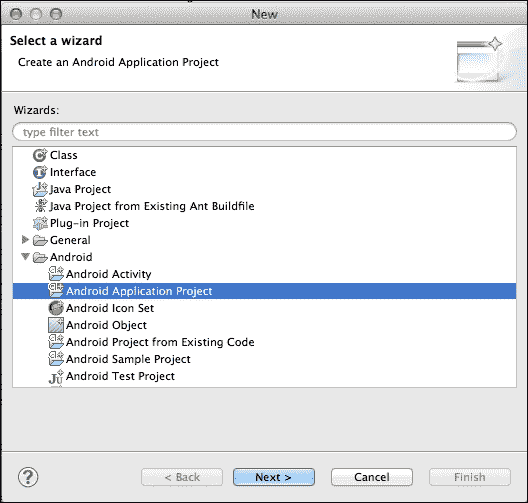

一旦选择 **Android 应用程序项目**，你应该点击窗口底部的**下一步 >**按钮。之后，你将看到如图所示的窗口：

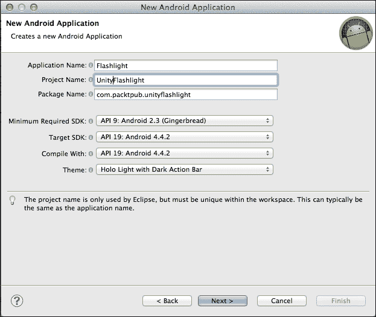

你应该设置**应用程序名称**、**项目名称**和**包名称**的值，根据你的意愿或如前图所示，用于我们的简单插件示例。此外，你还可以设置其他设置，如**最小所需 SDK**、**目标 SDK**、**编译方式**和**主题**。之后，点击窗口底部的**下一步 >**按钮，你将看到以下窗口：

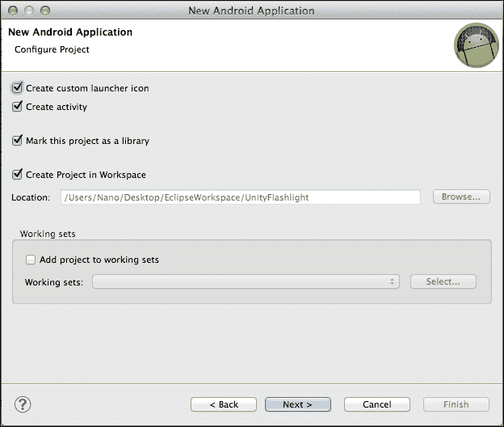

你可以使用前图所示的设置。打开此窗口后，你应该点击窗口底部的**下一步 >**按钮，之后将打开以下窗口：

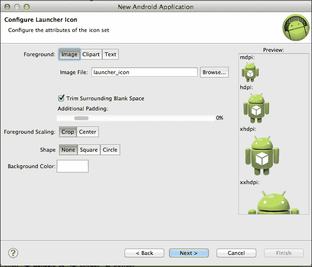

你可以使用这里显示的默认设置。此外，你可以在窗口底部点击**下一步 >**按钮，之后你将看到以下窗口：

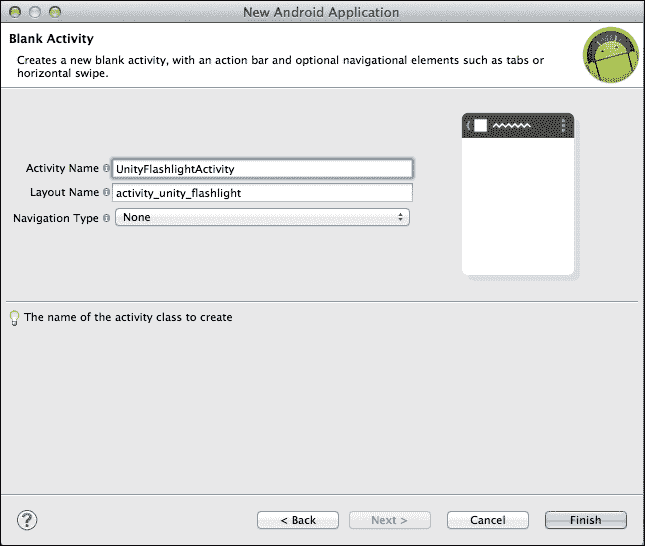

在这里，你应该根据你的意愿或如早期截图所示设置**活动名称**、**布局名称**和**导航类型**字段。然后，你可以点击底部右角的**完成**按钮，如图所示。

接下来，让我们将 Unity 的 `classes.jar` 库复制到如图所示的 `libs` 文件夹中：

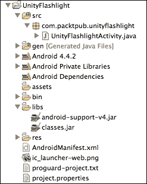

现在，打开前图所示的 `UnityFlashlightActivity.java` 文件。此文件是由 **Android 开发工具**（**ADT**，Eclipse IDE 的插件）自动生成的。

### 在插件中编写 Java 代码

现在是时候更改你的**UnityFlashlightActivity**代码，以便你可以在 Unity 脚本中使用这个 Android 功能。为此，你应该从**UnityPlayerActivity**继承`UnityFlashlightActivity`类，而不是从 Android SDK 提供的简单活动继承。新的代码如下所示：

```java
package com.packtpub.unityflashlight;
import com.unity3d.player.UnityPlayerActivity;
import android.os.Bundle;

public class UnityFlashlightActivity extends UnityPlayerActivity {

  @Override
  protected void onCreate(Bundle savedInstanceState) {
    super.onCreate(savedInstanceState);
  }
}
```

下一步是创建新的`Flashlight.java`类，如下所示：

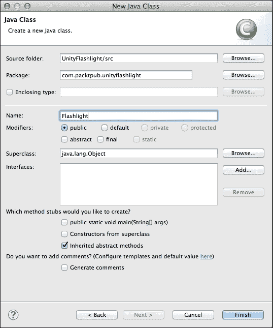

首先，我们应该声明我们的包名和需要导入的类，如下代码所示：

```java
package com.packtpub.unityflashlight;

import com.unity3d.player.UnityPlayerActivity;
import android.content.pm.PackageManager;
import android.hardware.Camera;
import android.hardware.Camera.Parameters;
```

然后，让我们声明我们的`Flashlight`类及其变量，如下所示：

```java
public class Flashlight {
public UnityPlayerActivity unityPlayerActivity;
   public boolean isActiveFlashlight;

private Camera _cameraHardware;
```

`cameraHardware`变量是 Android SDK 提供的`Camera`类的对象，用于使用硬件摄像头的不同功能。现在，是时候为这个类编写一个构造函数，如下所示：

```java
public Flashlight(UnityPlayerActivity upa) {
  // Unity Player Activity
unityPlayerActivity = upa;

  // Is Flashlight turned ON or OFF on the device
isActiveFlashlight = false;

// Receiving back hardware camera     
_cameraHardware = Camera.open();
}
```

我们将使用`unityPlayerActivity`变量来访问 Android 上下文和由 Android SDK 提供的`PackageManager`类。我们还将使用`isActiveFlashlight`变量来打开和关闭设备的闪光灯。最后一个变量`_cameraHardware`将用于访问设备上的闪光灯。现在，是时候编写一个函数来检查 Android 设备是否具有闪光灯功能。函数代码如下所示：

```java
public boolean HardwareHasFlashlight() { 
       return (
unityPlayerActivity.
getPackageManager().
hasSystemFeature(PackageManager.FEATURE_CAMERA_FLASH)
       );
}
```

下一步是描述一个函数，该函数将在 Android 设备上打开闪光灯，如果它具有这个硬件功能：

```java
public void ActivateFlashlight() {
if(HardwareHasFlashlight()) {
          isActiveFlashlight = true;

           _cameraHardware = Camera.open();     

           Parameters params = _cameraHardware.getParameters();

           params.setFlashMode(Parameters.FLASH_MODE_TORCH);

           _cameraHardware.setParameters(params);

      // Turn ON a flashlight
           _cameraHardware.startPreview();
       }
}
```

### 打开和关闭硬件闪光灯

现在，让我们编写一个函数来关闭 Android 设备上的闪光灯，如果它具有这个硬件功能：

```java
public void DeactivateFlashlight() {
if(HardwareHasFlashlight()) {
       isActiveFlashlight = false;

    // Turn OFF a flashlight
        _cameraHardware.stopPreview();

        _cameraHardware.release();
}
}
```

这个类中最简单的方法如下所示。接下来，我们应该使用以下代码关闭我们的`Flashlight`类：

```java
public boolean IsActiveFlashlight() {
       return isActiveFlashlight;
}
}
```

### 注意

如果你收到`unityPlayerActivity.getPackageManager()`函数的错误，那么你需要将`AndroidManifest.xml`文件中的最小 Android SDK 版本更改为如下代码行所示：

```java
<uses-sdk android:minSdkVersion="9"/>
```

现在，让我们稍微修改一下我们的 UnityFlashlightActivity，如下所示：

```java
package com.packtpub.unityflashlight;

import com.unity3d.player.UnityPlayerActivity;

import android.os.Bundle;

public class UnityFlashlightActivity extends UnityPlayerActivity {
  public Flashlight flashlight = new Flashlight(this);

  @Override
  protected void onCreate(Bundle savedInstanceState) {
    super.onCreate(savedInstanceState);
  }
}
```

### 在 Unity 侧

在这里，我们将在项目中为我们的 Android 插件测试创建一个新场景：

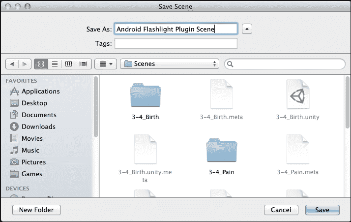

按照你的意愿命名这个新场景，然后你应该在项目中创建一个新的`Assets/Plugins/Android`文件夹。你可以在该文件夹中放入`AndroidManifest.xml`、JAR 文件和 Android 资源文件。

### 从 Eclipse 导出和导入 JAR 库到 Unity

现在，让我们回到 Eclipse 编辑器，在**Flashlight**项目上鼠标右键单击。点击**导出…**按钮，如下所示：


你将看到如下截图所示的窗口。选择**JAR 文件**，然后点击窗口底部的**Next >**按钮。

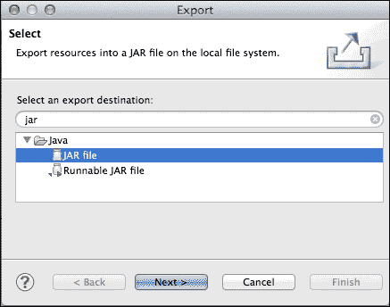

在以下窗口中，选择您希望选择的选项，或者只需像下面这样设置它们：

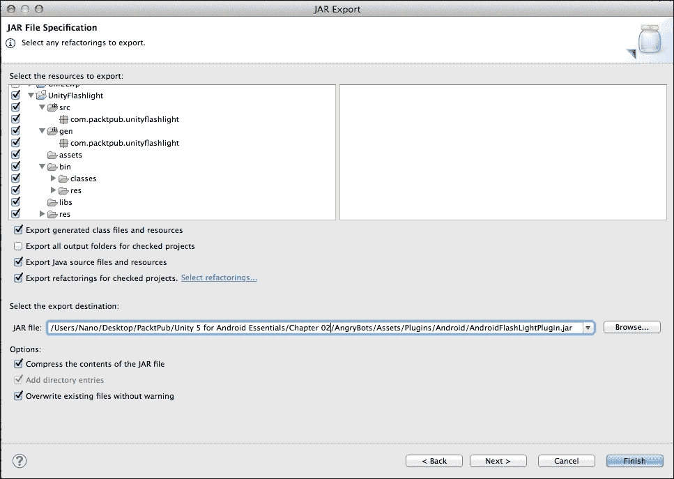

选择要作为我们新 `Asset/Plugins/Android` 文件夹目标的 JAR 文件路径。

### 导入 AndroidManifest

下一步是在 `Asset/Plugins/Android` 文件夹中创建一个新的 `AndroidManifest.xml` 文件。清单声明如下所示：

```java
<?xml version="1.0" encoding="utf-8"?>
<manifest 
    package="com.packtpub.unityflashlight"
    android:versionCode="1"
    android:versionName="1.0" >

    <uses-sdk android:minSdkVersion="9"/>

    <application
        android:icon="@drawable/app_icon"
        android:label="@string/app_name">
        <activity
            android:name="com.packtpub.unityflashlight.UnityFlashlightActivity"
            android:configChanges = "keyboardHidden|orientation"
            android:label="@string/app_name" >
            <intent-filter>
                <action android:name="android.intent.action.MAIN" />

                <category android:name="android.intent.category.LAUNCHER" />
            </intent-filter>
        </activity>
    </application>

  <uses-permission android:name="android.permission.CAMERA"/>
    <uses-permission android:name="android.permission.WRITE_SETTINGS"/>
    <uses-feature android:name="android.hardware.camera" />
    <uses-feature android:name="android.hardware.camera.autofocus" />

</manifest>
```

### 在 Unity 脚本中使用 Java 插件

在这里，我们将创建一个非常简单的 `FlashlightActivity.cs` 脚本，如下所示：

```java
using UnityEngine;

public static class FlashlightActivity
{
  #if UNITY_ANDROID && !UNITY_EDITOR
    public static AndroidJavaClass activityClass = new AndroidJavaClass("com.packtpub.unityflashlight.UnityFlashlightActivity");
    public static AndroidJavaClass unityActivityClass = new AndroidJavaClass("com.unity3d.player.UnityPlayer");
    public static AndroidJavaObject activityObj = unityActivityClass.GetStatic<AndroidJavaObject>("currentActivity");
  #else
    public static AndroidJavaClass activityClass;
    public static AndroidJavaClass unityActivityClass;
    public static AndroidJavaObject activityObj;
  #endif
}
```

然后，我们将按照以下所示实现 `Flashlight.cs`：

```java
using UnityEngine;

public static class Flashlight
{
  #if UNITY_ANDROID && !UNITY_EDITOR
    private static AndroidJavaObject flashlight = FlashlightActivity.activityObj.Get<AndroidJavaObject>("flashlight");
  #else
    private static AndroidJavaObject flashlight;
  #endif

  public static bool HardwareHasFlashlight()
  {
    if (Application.platform == RuntimePlatform.Android)
      return flashlight.Call<bool>("HardwareHasFlashlight");
    else
      return false;
  }

  public static bool IsActiveFlashlight()
  {
    if (Application.platform == RuntimePlatform.Android)
      return flashlight.Call<bool>("IsActiveFlashlight");
    else
      return false;
  }

  public static void ActivateFlashlight()
  {
    if (Application.platform == RuntimePlatform.Android)
      flashlight.Call("ActivateFlashlight");
  }

  public static void DeactivateFlashlight()
  {
    if (Application.platform == RuntimePlatform.Android)
      flashlight.Call("DeactivateFlashlight");
  }
}
```

这个类非常简单，我们不会对其进行解释。这个类只是调用 Android Java 方法。最后，让我们再创建一个非常简单的类，它应该附加在我们新场景的 **MainCamera** 上。文件名为 `FlashlightTest.cs`，其代码如下所示：

```java
using UnityEngine;

public class FlashlightTest : MonoBehaviour {
  void Start () {
    Flashlight.ActivateFlashlight();
  }

  void OnApplicationQuit() {
    Flashlight.DeactivateFlashlight();
  }
}
```

最后，我们可以为 Android 设备创建一个新的构建，只需一个场景，如下截图所示：

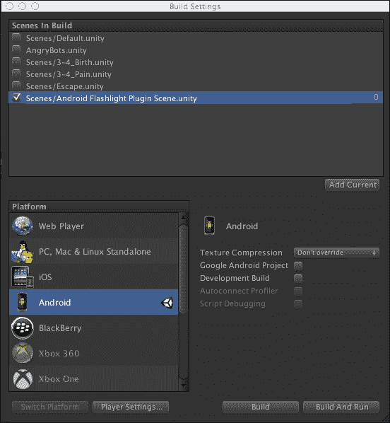

我们可以访问许多不同的 Android 属性，这些属性在 Unity 5 中可供使用。您应该使用 Unity 定义的 `UNITY_ANDROID` 常量来有条件地编译 Android 特定的 C# 代码。此外，在本章中，您将学习如何在 Unity 脚本中使用不同的 Android 功能和属性。Unity 中的大多数 Android 功能都由 **Handheld** 和 **Input** 类提供。让我们看看您将要探索的 Android 功能：

+   反盗版检查

+   震动

+   活动指示器

+   屏幕方向

+   系统信息

## 反盗版检查

让我们先探索 **反盗版** 检查。非常常见，如果不是总是如此，您应该保护您的 Android 游戏或应用程序免受黑客的侵害，他们破解游戏和应用程序以免费重新分发。借助 Unity 的帮助，我们可以进行反盗版检查，以显示我们的游戏或应用程序在构建后是否已被更改。

您应该检查 Unity 库提供的 `Application.genuine` 布尔属性。如果此属性为 `false`，则可以通知用户这是一个破解版本，或者您可以删除一些功能，也可以执行任何其他操作或它们的组合。`Application.genuine` 检查是一个非常昂贵的操作，因此最好不要频繁检查此属性，而只是在需要时检查。

## 震动

为了使 Android 设备震动，您应该调用 Unity 库提供的 `Handheld.Vibrate()` 方法。

## 活动指示器

您可以使用 **活动指示器** 来处理慢速操作。Android 内置了一个活动指示器。让我们探索一个非常简单的代码示例，如下所示：

```java
using UnityEngine;
using System.Collections;

public class ShowActivityIndicator : MonoBehaviour {
  IEnumerator ActivityIndicatorExample()
  {
    #if UNITY_ANDROID 
      Handheld.SetActivityIndicatorStyle(
        AndroidActivityIndicatorStyle.Small
      );
    #endif

    Handheld.StartActivityIndicator();
    yield return new WaitForSeconds(0);
    Application.LoadLevel(1);
  }

  void OnGUI()
  {
    if( GUI.Button(new Rect(50, 50, 300, 300), "Start") ) {
      StartCoroutine(ActivityIndicatorExample());
    }
  }
}
```

## 屏幕方向

此外，您还可以在 Unity 脚本中控制 Android 屏幕方向。您可以检测屏幕旋转或强制将屏幕旋转到特定方向。为了获取当前设备方向，您应该访问`Screen.orientation`属性。您还可以将此属性设置为任何所需的屏幕方向以强制旋转。您可以在 Unity 手册中找到有关不同屏幕方向属性和常量的更多信息。

## 系统信息

如果您需要更多关于您系统的信息，您可以使用 Unity 库提供的`SystemInfo`类的静态变量。有关这些变量的更多信息可以在官方 Unity 文档中找到，位于[`docs.unity3d.com/ScriptReference/SystemInfo.html`](http://docs.unity3d.com/ScriptReference/SystemInfo.html)。

您可以将以下脚本附加到任何场景中的任何对象上，以获取有关您的 Android 设备的信息。让我们更仔细地看看这段代码内部发生了什么。首先，我们需要声明我们的类及其属性，如下所示：

```java
using UnityEngine;

public class ShowSystemInfo : MonoBehaviour {
  public Vector2 scrollPosition;

  private Vector2 _v1, _v2;
```

之后，让我们创建我们的`OnGUI`函数，它将显示有关任何设备的信息。代码如下所示：

```java
  void OnGUI()
  {
    GUILayout.BeginVertical();

    scrollPosition = GUILayout.BeginScrollView(
      scrollPosition, 
      GUILayout.Width(Screen.width), 
      GUILayout.Height(Screen.height)
    );

    GUILayout.Label("SystemInfo.deviceModel <<<===>>> " + SystemInfo.deviceModel);
    GUILayout.Label("SystemInfo.deviceName <<<===>>> " + SystemInfo.deviceName);
    GUILayout.Label("SystemInfo.deviceType <<<===>>> " + SystemInfo.deviceType.ToString());
    GUILayout.Label("SystemInfo.deviceUniqueIdentifier <<<===>>> " + SystemInfo.deviceUniqueIdentifier);
    GUILayout.Label("SystemInfo.graphicsDeviceID <<<===>>> " + SystemInfo.graphicsDeviceID.ToString());
    GUILayout.Label("SystemInfo.graphicsDeviceName <<<===>>> " + SystemInfo.graphicsDeviceName);
    GUILayout.Label("SystemInfo.graphicsDeviceVendor <<<===>>> " + SystemInfo.graphicsDeviceVendor);
    GUILayout.Label("SystemInfo.graphicsDeviceVendorID <<<===>>> " + SystemInfo.graphicsDeviceVendorID.ToString());
    GUILayout.Label("SystemInfo.graphicsDeviceVersion <<<===>>> " + SystemInfo.graphicsDeviceVersion);
    GUILayout.Label("SystemInfo.graphicsMemorySize <<<===>>> " + SystemInfo.graphicsMemorySize.ToString());
    GUILayout.Label("SystemInfo.graphicsPixelFillrate <<<===>>> " + SystemInfo.graphicsPixelFillrate.ToString());
    GUILayout.Label("SystemInfo.graphicsShaderLevel <<<===>>> " + SystemInfo.graphicsShaderLevel.ToString());
    GUILayout.Label("SystemInfo.npotSupport <<<===>>> " + SystemInfo.npotSupport.ToString());
    GUILayout.Label("SystemInfo.operatingSystem <<<===>>> " + SystemInfo.operatingSystem);
    GUILayout.Label("SystemInfo.processorCount <<<===>>> " + SystemInfo.processorCount.ToString());
    GUILayout.Label("SystemInfo.processorType <<<===>>> " + SystemInfo.processorType);
    GUILayout.Label("SystemInfo.supportedRenderTargetCount <<<===>>> " + SystemInfo.supportedRenderTargetCount.ToString());
    GUILayout.Label("SystemInfo.supports3DTextures <<<===>>> " + SystemInfo.supports3DTextures.ToString());
    GUILayout.Label("SystemInfo.supportsAccelerometer <<<===>>> " + SystemInfo.supportsAccelerometer.ToString());
    GUILayout.Label("SystemInfo.supportsComputeShaders <<<===>>> " + SystemInfo.supportsComputeShaders.ToString());
    GUILayout.Label("SystemInfo.supportsGyroscope <<<===>>> " + SystemInfo.supportsGyroscope.ToString());
    GUILayout.Label("SystemInfo.supportsImageEffects <<<===>>> " + SystemInfo.supportsImageEffects.ToString());
    GUILayout.Label("SystemInfo.supportsInstancing <<<===>>> " + SystemInfo.supportsInstancing.ToString());
    GUILayout.Label("SystemInfo.supportsLocationService <<<===>>> " + SystemInfo.supportsLocationService.ToString());
    GUILayout.Label("SystemInfo.supportsRenderTextures <<<===>>> " + SystemInfo.supportsRenderTextures.ToString());
    GUILayout.Label("SystemInfo.supportsRenderToCubemap <<<===>>> " + SystemInfo.supportsRenderToCubemap.ToString());
    GUILayout.Label("SystemInfo.supportsShadows <<<===>>> " + SystemInfo.supportsShadows.ToString());
    GUILayout.Label("SystemInfo.supportsSparseTextures <<<===>>> " + SystemInfo.supportsSparseTextures.ToString());
    GUILayout.Label("SystemInfo.supportsStencil <<<===>>> " + SystemInfo.supportsStencil.ToString());
    GUILayout.Label("SystemInfo.supportsVibration <<<===>>> " + SystemInfo.supportsVibration.ToString());
    GUILayout.Label("SystemInfo.systemMemorySize <<<===>>> " + SystemInfo.systemMemorySize.ToString());

    GUILayout.EndScrollView();
    GUILayout.EndVertical();
  }
```

最后，我们应该创建`Update`函数，以便更改信息列表的`position Y`值，以便能够滚动信息列表：

```java
  void Update() {
    if (Input.touchCount > 0) {
      if (TouchPhase.Began == Input.GetTouch(0).phase) {
        _v1 = _v2 = Input.GetTouch(0).position;
      } else if (TouchPhase.Moved == Input.GetTouch(0).phase) {
        _v2 = _v1;

        _v1 = Input.GetTouch(0).position;

        scrollPosition.y += (_v1.y > _v2.y ? -1 : 1) * Vector2.Distance(_v1, _v2);
      }
    } else {
      if (Input.GetMouseButtonDown(0)) {
        _v1 = _v2 = new Vector2(Input.mousePosition.x, Input.mousePosition.y);
      } else if (Input.GetMouseButton(0)) {
        _v2 = _v1;

        _v1 = new Vector2(Input.mousePosition.x, Input.mousePosition.y);

        scrollPosition.y += (_v1.y > _v2.y ? -1 : 1) * Vector2.Distance(_v1, _v2);
      }
    }
  }
}
```

# 在 Unity 5 中访问 Android 传感器和功能

让我们更深入地了解一些在文本后面的简单代码示例中展示的 Android 传感器和功能。

## 加速度

您还可以在 Unity 中访问 Android 加速度。让我们升级我们之前的示例，以便我们可以看到我们 Android 设备的一个更多方面。新的代码片段如下所示：

```java
GUILayout.Label("\n\n A C C E L E R A T I O N");
    GUILayout.Label("Input.acceleration = (" + Input.acceleration.x + ", " + Input.acceleration.y + ", " + Input.acceleration.z + ")");
```

在您的 Android 设备上运行此测试后，您将看到加速度值如何实时快速变化。

## 陀螺仪

Unity 在 Android 设备上提供了**陀螺仪**访问，如新代码片段所示。在使用陀螺仪之前，您只需按照以下方式启用它：

```java
    Input.gyro.enabled = true;

GUILayout.Label("\n\n G Y R O S C O P E");
    GUILayout.Label("Input.gyro.attitude <<<===>>> " + Input.gyro.attitude.ToString());
    GUILayout.Label("Input.gyro.enabled <<<===>>> " + Input.gyro.enabled.ToString());
    GUILayout.Label("Input.gyro.gravity <<<===>>> " + Input.gyro.gravity.ToString());
    GUILayout.Label("Input.gyro.rotationRate <<<===>>> " + Input.gyro.rotationRate.ToString());
    GUILayout.Label("Input.gyro.rotationRateUnbiased <<<===>>> " + Input.gyro.rotationRateUnbiased.ToString());
    GUILayout.Label("Input.gyro.updateInterval <<<===>>> " + Input.gyro.updateInterval.ToString());
    GUILayout.Label("Input.gyro.userAcceleration <<<===>>> " + Input.gyro.userAcceleration.ToString());
```

## 指南针

Unity 在 Android 设备上提供了**指南针**访问，如新代码片段所示。在使用指南针之前，您只需按照以下方式启用它：

```java
    Input.compass.enabled = true;

    GUILayout.Label("\n\n C O M P A S S");
    GUILayout.Label("Input.compass.enabled <<<===>>> " + Input.compass.enabled.ToString());
    GUILayout.Label("Input.compass.headingAccuracy <<<===>>> " + Input.compass.headingAccuracy.ToString());
    GUILayout.Label("Input.compass.magneticHeading <<<===>>> " + Input.compass.magneticHeading.ToString());
    GUILayout.Label("Input.compass.rawVector <<<===>>> " + Input.compass.rawVector.ToString());
    GUILayout.Label("Input.compass.timestamp <<<===>>> " + Input.compass.timestamp.ToString());
    GUILayout.Label("Input.compass.trueHeading <<<===>>> " + Input.compass.trueHeading.ToString());
```

我们可以在以下屏幕截图中看到从前面的代码示例中接收到的所有值：

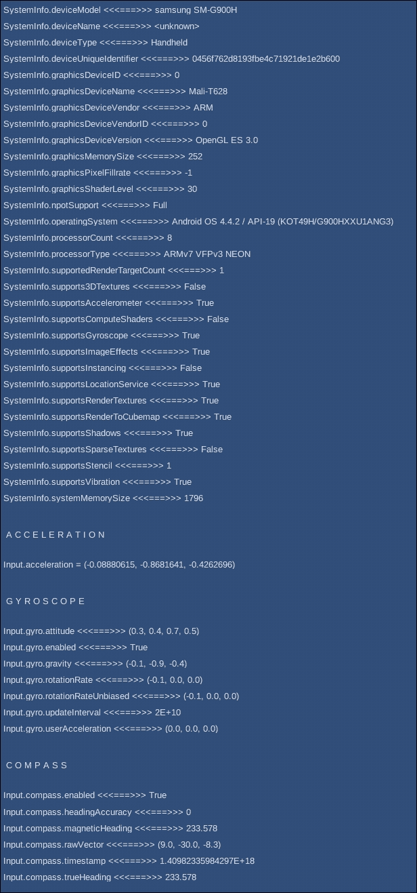

# 摘要

在本章中，我们探讨了为 Unity 编写 Java 和原生 C 插件的具体细节。我们实践了为 Android 平台开发简单插件。此外，我们还探讨了如何进行反盗版检查、检测屏幕方向、处理振动支持、获取设备名称、获取设备型号以及获取更多有用的信息。我们学习了如何在实践中访问加速度、陀螺仪****和指南针传感器及其特性和属性。

在下一章中，你将学习如何开发高端图形。你将探索如何在 Unity 中编写简单的 Cg 着色器。你还将了解全球范围内在游戏制作中广泛使用的精彩技巧、窍门和技术。你还将获取有关全局照明以及如何优化你的着色器的信息。
