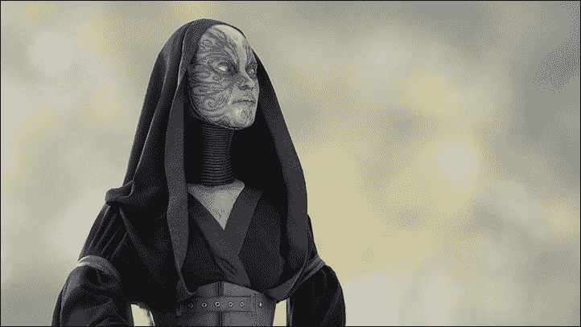
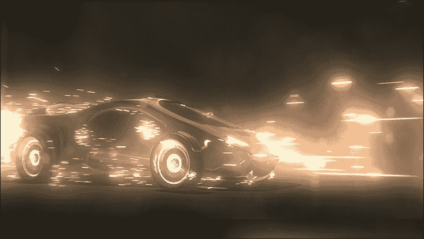
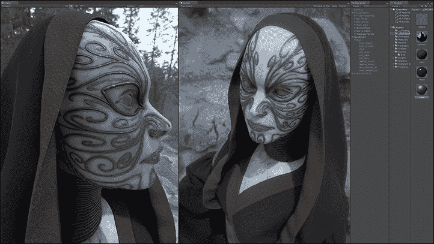
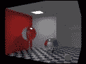
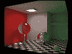

# 第三章. Android 设备的高端图形

主要来说，本章将探讨如何使用不同的技术和基于物理的着色器来提高游戏和应用程序的质量。在本章中，首先我们将检查在游戏开发和生产阶段经常使用的不同照明技术。其次，本章将描述 Unity 5 中的全局照明。在章节的结尾，读者将优化一段着色器代码。

本章将涵盖以下主题：

+   基于物理的着色器

+   全局照明

+   着色器优化实践

# 基于物理的着色器

Unity 使得使用现成的着色器或使用 Cg 语言或表面着色器框架编写自己的着色器变得非常容易。表面着色器是用 Cg 编写的，但它们执行了大量工作，你不必在每次创建新着色器时都编写。表面着色器语言使用基于组件的方法，或者说是一种更抽象的方法，它通过使用复杂的照明模型来简化复杂着色器的编写。在使用表面着色器框架时，图形程序员不需要反复处理纹理坐标和矩阵变换。在本章中，我们将详细描述编写性能友好的着色器的不同技术和方法，并展示在全世界开发的各种游戏和应用中使用的良好视觉质量效果。

首先，让我们从着色器的基本原理和概念开始。着色器是为三维图形中使用的图形管道的多个阶段之一预编译的程序，用于确定对象或图像的最终参数。它可能包括对任意复杂性的光吸收和散射、纹理映射、反射和折射、着色、表面位移和后期处理效果的描述。

## 基本着色器概念

可编程着色器灵活且有效。看似复杂的表面可以用简单的几何形状来可视化。例如，着色器可以用来在完全平坦的表面上绘制陶瓷瓷砖的三维表面。

在 Unity 中，着色器分为三种类型：**顶点**、**几何**和**片段（像素）**。

### 顶点着色器

**顶点着色器**处理映射到多边形顶点上的数据。这些数据对应于空间中顶点的坐标、纹理坐标、切线向量、双法线向量和法线向量。顶点着色器可用于透视顶点变换、生成纹理坐标、进行光照计算等。

### 几何着色器

与顶点着色器相比，**几何着色器**能够处理不仅是一个顶点，而且是一组顶点（三角形、四边形等）构成的整个原始形状。它可以被切割（两个顶点）和三角化（三个顶点），并且可以处理三角形原始形状的相邻顶点（相邻性）信息，最多可达六个顶点。此外，几何着色器可以“即时”生成原始形状，而不需要使用中央处理器。它们最初被用于*Nvidia 8*系列。

### 像素/片段着色器

**像素着色器**与位图的片段一起工作。像素着色器在图形管道的最后阶段使用，用于生成图片的片段。

## 着色语言

着色语言通常包含特殊的数据类型，如矩阵、采样器、向量和一组内置变量和常量，以便于与不同的 3D 库集成。由于计算机图形学有许多应用领域，为了满足市场的不同需求，开发者创建了大量的着色语言。

这些着色语言专注于提供最高质量的图像。在最高抽象级别描述材料属性，以便工作不需要任何特殊技能或对编程硬件的了解。这类着色器通常由艺术家创建，以确保“正确类型”的纹理映射、光源和其他艺术和科学方面的同时实现。

处理这些着色器通常是一个资源密集型任务。为此工作所需的总体计算能力可以非常高，因为它用于创建逼真的图像。这类相似计算的主要部分是通过大型计算机集群的可视化来完成的。

### Cg

由 Nvidia 与 Microsoft 共同开发的 Cg 着色语言（实际上，Microsoft 的相同语言被称为**HLSL**，并包含在 DirectX 9 中）。Cg 在 Unity 中使用，代表**C for Graphics**。该语言与 C 非常相似，并使用类似的数据类型（`int`、`float`和特殊的 16 位浮点类型—`half`）。Cg 还支持函数和结构。该语言具有独特的优化，如打包数组——类型声明如`float a [4]`和`float4 a`是不同的类型。第二个声明是**打包数组**。打包数组操作比传统操作更快。尽管该语言由 Nvidia 开发，但它与其他图形卡（例如 ATI 卡）没有问题。然而，请注意，所有着色程序都有其独特的特性，可以从专业来源获得。

### Unity 中的 Cg 着色器

此外，您应该知道 Unity 5 自带内置的着色器，这些着色器非常有用，尤其是在许多不同游戏中所需的一些基本内容方面。现在，让我们开始我们的奇妙之旅，进入 Unity 着色器的 Cg 语言世界。通常，着色器使用漫反射组件或照明模型。首先，您必须很好地理解在您的着色器中应该优化什么。基本上，您应该尽量避免复杂的计算和劳动密集型函数。在本章中，首先，我们将检查在游戏开发和生产阶段经常使用的不同照明模型技术。照明是着色器的一个基本方面。因此，程序员经常使用他们的大致计算来加速性能。

早期，计算机图形学使用的是固定功能的照明模型，这并不是一个非常灵活的解决方案，因为它只给图形程序员提供了一个单一的照明模型，而这个模型只能通过设置有限的一组参数和纹理来调整。与之前使用单一固定照明模型不同，如今，开发者使用非常灵活的可编程方法，借助 Cg 着色语言，特别是 Unity 中出色的表面着色器，来创建不同的照明模型。

着色器中的漫反射部分通常会指定光线以所有方向从表面反射的确切方式。您可能会发现这非常类似于镜子反射太阳光以不同角度和所有方向的工作。然而，事实并非如此，我们将在本章稍后尽可能详细地展示这种差异。

主要区别在于，像镜子这样的反射表面会反射周围环境的图像，而漫反射照明模型会将阳光反射回视野中。

为了创建一个简单且基本的漫反射照明模型，你需要创建一个包含发射颜色、环境颜色以及当然是从所有光源来的颜色总积累的着色器。在接下来的代码中，我们将向您展示的技术和技巧将帮助您创建自己的照明模型，以及探索各种行业技巧，帮助您理解仅使用纹理创建更复杂照明模型的基本思想，这将极大地提高您的生产力。换句话说，使用预制的纹理来创建照明模型可以大大提高您的生产力。

让我们从以下代码中显示的最简单的表面着色器示例开始。此代码由 Unity 编辑器生成：

```java
// The first line of our shader code specifies the name of the
// shader in order to further select it from a list of all 
// shaders.
Shader "PacktPub/SimpleDiffuseLighting"
{
  // Next is the properties block of parameters of the shader 
  // known as Properties, which is followed by a block of the 
  // shader code known as SubShader.
        Properties
        {
                _MainTex ("Base (RGB)", 2D) = "white" {}
        }

        SubShader
        {
                Tags {"RenderType" = "Opaque"}
                LOD 200

                CGPROGRAM
                #pragma surface surf Lambert

                sampler2D _MainTex;
                struct Input
                {
                        float2 uv_MainTex;
                };

                void surf (Input IN, inout SurfaceOutput o)
                {
                        half4 c = tex2D (_MainTex, IN.uv_MainTex);
                        o.Albedo = c.rgb;
                        o.Alpha = c.a;
                }
                ENDCG
        }

    // The shader specified as FallBack will be executed 
    // instead of our shader.
        FallBack "Diffuse"
}
```

让我们更详细地考虑`Properties`块。在编写着色器时，属性是一些非常重要的元素。属性允许艺术家设置他们自己的纹理或其他设置以自定义视觉效果。您可以通过 Unity 材质调整所选着色器的属性。

Unity 会按顺序解析每个着色器代码，以查找内置结构。`Properties`块是 Unity 正在寻找的这些内置结构之一。以下是一个`Properties`块结构的示例：

```java
Properties
{
        _YourVariableName ("Inspector GUI Name", Color) = (1,1,1,1)
}
//      Variable Name   Inspector GUI Name     Type  Default Value
```

每次你创建一个新属性时，你都需要给你的变量命名。变量名用于你的着色器代码中，而检查器 GUI 名称将在 Unity 编辑器中显示。类型可以是以下任何一个：

+   `Range (min, max)`: 这些是从`min`到`max`形式的滑块实数值

+   `Color`: 这将在 Unity 检查器中打开颜色选择器，以便选择所需的颜色值

+   `2D`: 这用于添加纹理

+   `Rect`: 这是一个非 2 的幂纹理

+   `Cube`: 这是一个立方体贴图纹理

+   `Float:` 这些是没有滑块的实数值

+   `Vector`: 这是一个包含实数的四分量向量

在`Properties`结构的末尾，我们指定了默认值。

## 一个自定义的漫反射光照模型

在你编写自己的漫反射光照模型之前，我们将考虑我们的新属性：

```java
Properties
{
        _FirstColor ("First Color", Color) = (1,1,1,1)
        _SecondColor ("Second Color", Color) = (0,0,0,0)
        _PowValue ("Pow Value", Range(0,10)) = 5.5
}
```

接下来，我们需要在我们的着色器中声明这些新属性：

```java
float4 _FirstColor;
float4 _SecondColor;
float  _PowValue;
```

在着色器代码中宣布属性之后，我们可以像以下示例中那样使用这些变量：

```java
void surf (Input IN, inout SurfaceOutput surface)
{
        float4 c = pow(_FirstColor + _SecondColor, _PowValue);
        surface.Albedo = c.rgb;
        surface.Alpha = c.a;
}
```

因此，你应该有一个如下的着色器：

```java
Shader "PacktPub/YourDiffuseLighting"
{
        Properties
        {
                _FirstColor ("First Color", Color) = (1,1,1,1)
                _SecondColor ("Second Color", Color) = (0,0,0,0)
                _PowValue ("Pow Value", Range(0,10)) = 3.5
        }

        SubShader
        {
                Tags {"RenderType" = "Opaque"}
                LOD 200

                CGPROGRAM
                #pragma surface surf Lambert

                float4 _FirstColor;
                float4 _SecondColor;
                float  _PowValue;
                float4 c;
                struct Input
                {
                        float2 uv_MainTex;
                };

                void surf (Input IN, inout SurfaceOutput surface)
                {
                        c = pow(_FirstColor + _SecondColor, _PowValue);
                        surface.Albedo = c.rgb;
                        surface.Alpha = c.a;
                }
                ENDCG
        }

        FallBack "Diffuse"
}
```

是时候创建你自己的漫反射光照模型了。在大多数情况下，内置的光照并不适合游戏或应用中的特定任务。特定的优化问题需要独特的解决方案。为了覆盖内置的光照函数，你需要注册，下一行代码中的`SubShader`块：

```java
#pragma surface surf YourName
```

现在，我们可以像以下示例中那样描述我们的自定义光照函数：

```java
inline float4 LightingYourName 
(SurfaceOutput surface, float3 lightDirection, float attenuation)
{
        float delta = max(0, dot(surface.Normal, lightDirection));
        c.rgb = (surface.Albedo * _LightColor0.rgb) * 
                                                (delta * attenuation * 2);
        c.a = surface.Alpha;
        return c;
}
```

现在，让我们系统地查看基本元素。`#pragma`指令指定了用于光照的函数名称。我们使用了在`Lighting.cginc`文件中定义的内置功能**Lambert**，现在我们指定了我们的函数名称以供将来使用。在建立这个光照函数时，有必要记住，函数的名称最终将使用`Lighting + <Your Function Name>`的第一个单词来形成，例如，如果你决定将函数命名为`SunShine`，那么你的光照函数名称将是`LightingSunShine`。有三种创建自定义光照函数的方法，它们通过输入参数的不同而不同，如下所示：

+   `float4 Lighting<YourName> (SurfaceOutput surface, float3 lightDirection, float attenuation) {}`: 当你不需要视图方向值时，你应该使用这个函数进行前向渲染

+   `float4 Lighting<YourName> (SurfaceOutput surface, float3 lightDirection, float3 viewDirection, float attenuation) {}`: 当你需要视图方向值时，你应该使用这个函数进行前向渲染

+   `float4 Lighting<YourName>_PrePass (SurfaceOutput surface, float4 light) {}`: 你应该使用这个函数进行延迟渲染

最终，您应该得到以下着色器：

```java
Shader "PacktPub/YourLightingModel"
{
        Properties
        {
                _FirstColor ("First Color", Color) = (1,1,1,1)
                _SecondColor ("Second Color", Color) = (0,0,0,0)
                _PowValue ("Pow Value", Range(0,10)) = 3.5
        }

        SubShader
        {
                Tags {"RenderType" = "Opaque"}
                LOD 200

                CGPROGRAM
                #pragma surface surf YourName

                float4 _FirstColor;
                float4 _SecondColor;
                float  _PowValue;
                float4 c;

                struct Input
                {
                        float2 uv_MainTex;
                };

                inline float4 LightingYourName (
                        SurfaceOutput surface, 
                        float3 lightDirection, 
                        float attenuation
                ){
                        float delta = max(0, dot(surface.Normal, lightDirection));
                        c.rgb = (surface.Albedo * _LightColor0.rgb) *
                                                (delta * attenuation * 2);
                        c.a = surface.Alpha;
                        return c;
                }

                void surf (Input IN, inout SurfaceOutput surface)
                {
                        c = pow(_FirstColor + _SecondColor, _PowValue);
                        surface.Albedo = c.rgb;
                        surface.Alpha = c.a;
                }
                ENDCG
        }

        FallBack "Diffuse"
}
```

### 基本反射环境

接下来，让我们看看在全世界专业圈子里广为人知的一些想法和技术，这些想法和技术被用来编写具有良好视觉效果的性能友好型着色器。以下示例基于您表面的环境反射。这个着色器的简单源代码如下：

```java
Shader "PacktPub/BasicReflectionEnvironment"
{
        Properties 
        {
                _DiffuseTint ("Diffuse Tint", Color) = (1,1,1,1)
                _MainTex ("Base (RGB)", 2D) = "white" {}
                _CubeMapTexture ("Cube Map Texture", CUBE) = ""{}
                _ReflectionCount ("Reflection Count", Range(0.01, 1)) = 0.17
        }

        SubShader 
        {
                Tags {"RenderType"="Opaque"}
                LOD 200

                CGPROGRAM
                #pragma surface surf Lambert

                sampler2D _MainTex;
                samplerCUBE _CubeMapTexture;

                float4 _DiffuseTint;
                float _ReflectionCount;

                float4 c;

                struct Input 
                {
                        float2 uv_MainTex;
                        float3 worldRefl;
                };

                void surf (Input IN, inout SurfaceOutput surface) 
                {
                        c = tex2D (_MainTex, IN.uv_MainTex) * _DiffuseTint;
                        surface.Emission = texCUBE(_CubeMapTexture, IN.worldRefl).rgb * _ReflectionCount;
                        surface.Albedo = c.rgb;
                        surface.Alpha = c.a;
                }
                ENDCG
        }

        FallBack "Diffuse"
}
```

### 遮罩纹理反射

下一个新着色器实现了一种新技术，它使用纹理来遮罩您环境的反射，如下所示：

```java
Shader "PacktPub/MaskedTextureReflection"
{
        Properties 
        {
                _DiffuseTint ("Diffuse Tint", Color) = (1,1,1,1)
                _MainTex ("Base (RGB)", 2D) = "white" {}
                _ReflectionCount ("Reflection Count", Range(0, 1)) = 1
                _CubeMapTexture ("Cube Map Texture", CUBE) = ""{}
                _MaskedTextureReflection ("Masked Texture Reflection", 2D) = ""{}
        }

        SubShader
        {
                Tags {"RenderType"="Opaque"}
                LOD 200

                CGPROGRAM
                #pragma surface surf Lambert

                sampler2D _MainTex;
                sampler2D _MaskedTextureReflection;

                samplerCUBE _CubeMapTexture;

                float4 _DiffuseTint;
                float _ReflectionCount;

                float4 c;

                struct Input 
                {
                        float2 uv_MainTex;
                        float3 worldRefl;
                };

                void surf (Input IN, inout SurfaceOutput surface) 
                {
                        c = tex2D (_MainTex, IN.uv_MainTex);
                        float3 reflectionTexCube = texCUBE(_CubeMapTexture, IN.worldRefl).rgb;
                        float4 reflectionMaskTexel = tex2D(_MaskedTextureReflection, IN.uv_MainTex);

                        surface.Albedo = c.rgb * _DiffuseTint;
                        surface.Emission = (reflectionTexCube * reflectionMaskTexel.r) * _ReflectionCount;
                        surface.Alpha = c.a;
                }
                ENDCG
        }

        FallBack "Diffuse"
}
```

## 灯光模型技术

让我们考虑各种灯光模型实现技术和方法，这些技术和方法，就像之前的着色器一样，在全球游戏产业以及电影和卡通中被广泛使用。

### 照明球体模型

首先，我们想考虑`LitSphere`灯光模型。这个想法非常简单直接——我们只需使用一个 2D 纹理来完全烘焙我们的灯光。或者，有必要考虑到并不要忘记这个技术是静态的，并且不会改变灯光，直到用于烘焙灯光的纹理被更改。这项技术提供了非常高质量的灯光，并且优化得足够好，但它不是动态的。换句话说，它不依赖于可以实时改变的角度或距离（从摄像机或观众），因为这项技术不依赖于场景中的灯光。让我们按照以下方式探索这个着色器：

```java
Shader "PacktPub/LitSphere" 
{
        Properties 
        {
                _DiffuseTint ("Diffuse Tint", Color) = (1,1,1,1)
                _MainTex ("Base (RGB)", 2D) = "white" {}
                _NormalMapTexture ("Normal Map Texture", 2D) = "bump" {}
        }

        SubShader
        {
                Tags {"RenderType"="Opaque"}
                LOD 200

                CGPROGRAM
                #pragma surface surf YourUnlit vertex:vert

                sampler2D _MainTex;
                sampler2D _NormalMapTexture;
                float4 _DiffuseTint;

                float4 c;
                float2 uv;

                inline float4 LightingYourUnlit (SurfaceOutput surface, float3 lightDirection, float attenuation)
                {
                        c.rgb = float4(1,1,1,1) * surface.Albedo;
                        c.a = surface.Alpha;

                        return c;
                }

                struct Input 
                {
                        float2 uv_MainTex;
                        float2 uv_NormalMapTexture;

                        float3 tangentOne;
                        float3 tangentTwo;
                };

void vert (inout appdata_full v, out Input inputData) 
{
        UNITY_INITIALIZE_OUTPUT(Input, inputData);

        TANGENT_SPACE_ROTATION;

        inputData.tangentOne = mul(rotation, UNITY_MATRIX_IT_MV[0].xyz);
        inputData.tangentTwo = mul(rotation, UNITY_MATRIX_IT_MV[1].xyz);          
}

                void surf (Input IN, inout SurfaceOutput surface) 
                {
                        surface.Normal = UnpackNormal(tex2D(_NormalMapTexture, IN.uv_NormalMapTexture)).rgb;

                        uv.x = dot(IN.tangentOne, surface.Normal);
                        uv.y = dot(IN.tangentTwo, surface.Normal);

                        c = tex2D (_MainTex, uv * 0.5 + 0.5);
                        surface.Albedo = c.rgb * _DiffuseTint;
                        surface.Alpha = c.a;
                }
                ENDCG
        } 

        FallBack "Diffuse"
}
```

创建灯光模型和其他视觉效果有许多不同的技术和方法；我们无法将所有想法和技术都放入这本书中，因为这超出了本书的范围。您也可以实现自己的新想法和技术；这取决于您的想象力。之前不同方法编写着色器的示例被世界各地的开发者广泛用于创建高质量的实时渲染，以及优化。此外，您还可以编写与模型顶点一起工作的着色器，这样您就可以非常简单地创建一个从原始平面播放波浪动画的着色器。

## 真实感渲染

*Solid Angle*的 Marcos Fajardo——这家公司是渲染器*Arnold*背后的公司——指出，世界上的越来越多的制作工作室要么已经到达那里，要么正在过渡到以下引言：

> *"整个行业都在进行这个过程，这是一件大事。我过去十年左右一直在做这件事，看到它最终发生我真的很高兴。"*

Fajardo 可以被称为该行业全球变革最伟大的捍卫者和活动家之一。Solid Angle 真的是大规模运动的前沿，该运动将基于物理的材质和灯光的路径追踪 GI 用于生产决策（即，当预算较小且时间框架更紧凑时）。

“诚实”方法流行的基础是希望“一石二鸟”，简化全世界艺术家的生活，并实现更逼真的画面。

使用一些较老的技术链，艺术家可以通过几百个光源（其中每个光源都需要完成其角色，一个用于材料的突出显示，另一个用于该材料的镜面反射，第三个和第四个用于第二个材料的眩光和反射，再加上十个来模拟全局照明，等等）获得场景，开发者用 C++编写了非常复杂的着色器，代码充满了技巧和调整。照明设计师通常只是坐着，依次打开和关闭灯光——很容易理解为什么他们中的一些人是如此必要的。

大多数公司并没有计算到引入自然光源和材料本身就能快速渲染的事实，但人们期望这将极大地简化艺术家的工作。实际上，一小时的这种工作比一小时的渲染要贵几十倍。

# 全局照明

在 2014 年 3 月 17 日于旧金山开始的*游戏开发者大会*期间，Unity Technologies 公司推出了其流行的游戏引擎 Unity 的第五代产品。与上一版本相比，其中一个最重要的特点是实时全局照明的新系统——Enlighten，该系统由来自英国公司*Geomerics*的专家参与实施。



Unity 5 展示了支持 WebGL 标准网络模块优化`asm.js`、物理引擎 NVIDIA PhysX 3.3、植被创建和动画系统 SpeedTree、高级着色器系统、实时预览光图功能，以及 Unity Cloud 中的跨平台音频广告网络，这有助于移动游戏的推广。此外，第五代引擎将能够在 64 位环境中运行，通过新的多线程调度器显著简化工作流程，并为你提供实时更改和改进创建游戏资源（资产列表）和直观界面的机会。



本工具包的最新版本，传统上在小型开发者团队中是最畅销的，现在设计时也考虑到了大型公司。这使得它成为了 CryEngine 和 Unreal Engine 4 等高科技新一代游戏引擎的竞争对手。随着 Epic Games 的第四代引擎，它最近还与 Mozilla 签署了另一项协议，允许浏览器和移动设备上的三维和二维游戏开发者使用 Unity 5。



在 Unity 5 中，开发者将能够使用来自公司*Imagination Technologies*的实时光线追踪 PowerVR 查看覆盖率图。这项技术减少了处理时间，从而提供了非常好的性能。开发者将能够使用 Unity 5 中新的着色器系统从现实世界中创建各种材料。

**全局照明**是用于三维图形中更真实地模拟光的一系列算法的名称。这些算法不仅考虑来自光源的直接光线（直接照明），还考虑来自各种表面的反射光线（间接照明）。

理论上，*反射*、*折射*和*阴影*是全球照明的例子，因为对于它们来说，必须考虑一个对象对另一个对象模拟的影响（与对象暴露在直接光线下的情况相比）。然而，在实践中，漫反射或全息的模拟被称为全局照明。

应用全局照明算法获得的图像通常比仅应用直接照明算法的渲染过程中的图像更真实。然而，计算全局照明需要更多的时间。

下图仅由直接照明算法处理：



下图是通过全局照明算法处理的：



# 着色器优化实践

现在，是时候讨论我们如何优化我们的着色器了。或者，是时候考虑其他方法了，例如优化内置数据类型，这可以显著减少 Unity 着色器内存的开销。我们考虑对所有支持的平台进行 Unity 着色器优化，没有任何排除。

非常常见，你需要优化着色器以实现相同的效果，但使用更少的纹理，例如。首先，当优化着色器代码时，我们希望将你的注意力引向变量的类型。如果你愿意牺牲计算的精度以降低质量来提高性能，那么你应该使用`half`或`fixed`变量类型而不是`float`。例如，你可以在你的着色器代码的任何地方使用`half`类型的变量：

```java
inline half4 LightingCarVehicle (SurfaceOutput surface, half3 lightDirection, half3 viewDirection, half attenuation)
```

你也可以在以下语句中将`float`替换为`half`：

```java
inline float4 LightingCarVehicle (SurfaceOutput surface, float3 lightDirection, float3 viewDirection, float attenuation)
```

+   `float`：这些变量具有 32 位精度

+   `half`：这些变量具有 16 位精度

+   `fixed`：这些变量具有 11 位精度

例如，让我们按照以下方式优化我们之前的着色器代码`CarVehicle.shader`：

```java
Shader "PacktPub/OptimizedCarVehicle"
{
        Properties 
        {
                _DiffuseTint ("Diffuse Tint", Color) = (1,1,1,1)
                _MainTex ("Base (RGB)", 2D) = "white" {}
                _DiffuseIntensity ("Diffuse Intensity", Range(0.01, 17)) = 7.7
                _SpecularColor ("Specular Color", Color) = (1,1,1,1)
                _SpecularIntensity ("Specular Intensity", Range(0.01, 50)) = 17
                _ReflectionCubeMap ("Reflection Cube Map", CUBE) = "" {}
                _BRDFTexture ("BRDF Texture", 2D) = "white" {}
                _ReflectionIntensity ("Reflection Intensity", Range(0.01, 11.0)) = 5.0
                _ReflectionCount ("Reflection Count", Range(0.01, 1.0)) = 0.17
                _FalloffSpread ("Falloff Spread", Range(0.01, 17)) = 5.3
        }

        SubShader 
        {
                Tags {"RenderType"="Opaque"}
                LOD 200

                CGPROGRAM
                #pragma surface surf CarVehicle

                samplerCUBE _ReflectionCubeMap;

                sampler2D _MainTex;
                sampler2D _BRDFTexture;

                fixed _SpecularIntensity;
                fixed _DiffuseIntensity;
                fixed _FalloffSpread;
                fixed _ReflectionCount;
                fixed _ReflectionIntensity;

                fixed4 _DiffuseTint;
                fixed4 _SpecularColor;

                fixed4 c;
                fixed3 halfVec;
                fixed falloff;
                fixed delta;
                fixed halfVecDotSurfaceNormal;
                fixed s;

                inline fixed4 LightingCarVehicle (SurfaceOutput surface, fixed3 lightDirection, fixed3 viewDirection, fixed attenuation)
                {
                        halfVec = normalize (lightDirection + viewDirection);
                        delta = max (0, dot (surface.Normal, lightDirection));

                        halfVecDotSurfaceNormal = 1 - dot(halfVec, normalize(surface.Normal));
                        halfVecDotSurfaceNormal = pow(clamp(halfVecDotSurfaceNormal, 0.0, 1.0), _DiffuseIntensity);
                        c = tex2D(_BRDFTexture, fixed2(delta, 1 - halfVecDotSurfaceNormal));

                        s = pow (max (0, dot (surface.Normal, halfVec)), surface.Specular * _SpecularIntensity) * surface.Gloss;

                        c.rgb = (surface.Albedo * _LightColor0.rgb * c.rgb + _LightColor0.rgb * _SpecularColor.rgb * s)* (attenuation * 2);
                        c.a = surface.Alpha + _LightColor0.a * _SpecularColor.a * s * attenuation;

                        return c;
                }

                struct Input 
                {
                        fixed2 uv_MainTex;

                        fixed3 worldRefl;

                        fixed3 viewDir;
                };

                void surf (Input IN, inout SurfaceOutput surface) 
                {
                        c = tex2D (_MainTex, IN.uv_MainTex);

                        falloff = pow(saturate(1 - dot(normalize(IN.viewDir), surface.Normal)), _FalloffSpread);

                        surface.Albedo = c.rgb * _DiffuseTint;
                        surface.Emission = pow((texCUBE(_ReflectionCubeMap, IN.worldRefl).rgb * falloff), _ReflectionIntensity) * _ReflectionCount;
                        surface.Specular = c.r;
                        surface.Gloss = 1.0;
                        surface.Alpha = c.a;
                }
                ENDCG
        }

        FallBack "Diffuse"
}
```

要了解如何更快、更好地开发着色器，你必须明白这只能通过全面优化，使用各种技术和方法来实现。让我们将我们的着色器优化过程分为以下三个类别：

+   变量内存优化

+   优化使用的纹理的数量和大小

+   计算算法优化

所提到的所有点都已经讨论过了。关于如何优化你的着色器的一些想法已经在本章前面考虑过了，我们将展示一些更有趣的方法和技术。我们希望这本书中的大多数方法、技术、方法和想法将极大地帮助你在生产中同时实现所需的质量和性能。

此外，在优化着色器时，你需要记住并知道代码应该尽可能小。这意味着你的代码中不应该有任何不必要的部分。前几章中描述的许多想法，尤其是在前面第四章中关于 C#和 JavaScript 代码优化的讨论，非常适合优化你的着色器代码。此外，我们希望你注意，你的着色器代码的执行频率极大地影响了性能。非常常见的是，着色器开发者使用非常好的技术来优化他们的着色器。他们更倾向于使用顶点着色器而不是像素着色器；这在大多数情况下会大大提高你的性能，因为像素的数量远多于顶点。因此，处理像素着色器执行频率的代码将远大于顶点。

让我们也考虑可能优化你的着色器的指令：

+   `approxview`: 在许多情况下，这种近似已经足够好了。当你需要获取每个顶点的归一化视图方向而不是每个像素的视图方向时，你应该使用这个指令。

+   `halfasview`: 这将在视图和光源方向之间（半向量）计算并归一化，并且光照函数将接收一个`half`向量作为参数而不是视图向量。

+   `noforwardadd`: 在单次渲染着色器的情况下，即使有多个光源，以及当你想要使着色器更小的时候，这个指令是你最好的选择。这个着色器将只支持前向渲染中的单一方向光。其余的光源仍然可以像顶点光或球谐函数那样产生影响。其余的光源可以用于球谐函数或顶点光效果。

+   `exclude_path:prepass`: 使用这个指令的着色器将不接受来自延迟渲染器的任何自定义光照。

+   `noambient`: 当你在着色器中禁用球谐函数和环境光时，应该使用这个指令。这可以略微提高你的性能。

+   `nolightmap`: 这个指令禁用了 Unity 的内部光照贴图系统。换句话说，它不会执行光照贴图检查。

**Alpha 测试**在移动设备上非常昂贵，因此你应该在移动设备上非常精确地使用透明着色器。你必须只在必要时使用 Alpha 测试。例如，让我们这样覆盖优化的着色器：

```java
Shader "PacktPub/OptimizedShaderExample"
{
        Properties 
        {
                _MainTex ("Base (RGB)", 2D) = "white" {}
                _SpecularWidth ("Specular Width", Range(0.01, 1)) = 0.5
                _NormalMapTexture ("Normal Map Texture", 2D) = "bump"{}
        }

        SubShader 
        {
                Tags {"RenderType"="Opaque"}
                LOD 200

                CGPROGRAM
                #pragma surface surf OptimizedBlinnPhong exclude_path:prepass nolightmap noforwardadd halfasview

                sampler2D _MainTex;
                sampler2D _NormalMapTexture;
                half _SpecularWidth;

                half4 c;
                half d;
                half s;

                struct Input 
                {
                        half2 uv_MainTex;
                };

                inline half4 LightingOptimizedBlinnPhong (SurfaceOutput surface, half3 lightDir, half3 halfDir, half atten)
                {
                        d = max(0, dot(surface.Normal, lightDir));
                        s = pow(max(0, dot(surface.Normal, halfDir)), surface.Specular * 128) * surface.Gloss;

                        c.rgb = (surface.Albedo * _LightColor0.rgb * d + _LightColor0.rgb * s) * (atten * 2);
                        c.a = 0.0;

                        return c;
                }

                void surf (Input IN, inout SurfaceOutput surface) 
                {
                        c = tex2D(_MainTex, IN.uv_MainTex);

                        surface.Albedo = c.rgb;
                        surface.Gloss = c.a;
                        surface.Alpha = 0.0;
                        surface.Specular = _SpecularWidth;
                        surface.Normal = UnpackNormal(tex2D(_NormalMapTexture, IN.uv_MainTex)).rgb;
                }
                ENDCG
        }

        FallBack "Diffuse"
}
```

## 最佳实践

在我们探索了照明计算领域中的各种想法、方法和技术之后，让我们来看看最佳实践，以便轻松维护许多不同的着色器。让我们考虑我们的着色器代码的可重用性；例如，Unity 中的各种照明函数。为了避免每次为新的着色器编写相同的照明函数代码，最好是将照明函数代码编写一次，并在必要时在任何着色器中使用它，因为程序员使用不同的框架和库。这种做法将帮助您为您的着色器创建一个框架，这将极大地促进轻松开发和轻松的着色器维护。在前面的示例中，我们使用了内置的 `CgIncludes` 文件，如 `Lambert` 和 `BlinnPhong` 照明函数。Unity 为我们创建了这些照明模型。Unity 帮助我们减少编写性能友好且质量上乘的着色器的努力。

您可以查看 Unity 内置 `CgIncludes` 文件中嵌入的代码，这些文件位于名为 `CgIncludes` 的目录中。没有这些文件，在 Unity 中编写着色器将会困难得多。这就是为什么 Unity 表面着色器如此高效。让我们按照以下方式创建自己的 `CgInclude` 文件：

```java
#ifndef YOUR_NAME_INCLUDE
#define YOUR_NAME_INCLUDE

half4 _YourColorVariable;

inline half4 LightingOptimizedLambert (SurfaceOutput surface, half3 lightDirection, half attenuation)
{
        half diffuseValue = max(0, dot(surface.Normal, lightDirection));
        diffuseValue = (diffuseValue + 0.5) * 0.5;

        half4 tmpColor;
        tmpColor.rgb = surface.Albedo * _LightColor0.rgb * ((diffuseValue * _YourColorVariable.rgb) * attenuation * 2);
        tmpColor.a = surface.Alpha;

        return tmpColor;
}

#endif
```

现在，让我们考虑下一个着色器的代码如下，您可以看到如何使用您的 `CgInclude` 文件与照明函数一起使用，以及您如何声明变量 `_YourColorVariable`：

```java
Shader "PacktPub/UsingCgIncludeOptimzedLambert"
{
        Properties 
        {
                _YourColorVariable ("Your Color Variable", Color) = (1,1,1,1)

                _DiffuseTint ("Diffuse Tint", Color) = (1,1,1,1)
                _MainTex ("Base (RGB)", 2D) = "white" {}
                _NormalMapTexture ("Normal Map Texture", 2D) = "bump" {}
                _CubeMapTexture ("Cube Map Texture", CUBE) = ""{}
                _ReflectionCount ("Reflection Count", Range(0,1)) = 0.17
        }

        SubShader
        {
                Tags {"RenderType"="Opaque"}
                LOD 200

                CGPROGRAM
                #include "YourCgIncludeOptimizedLambert.cginc"
                #pragma surface surf OptimizedLambert

                samplerCUBE _CubeMapTexture;

                sampler2D _MainTex;
                sampler2D _NormalMapTexture;

                float4 _DiffuseTint;
                float _ReflectionCount;

                float4 c;

                struct Input 
                {
                        float2 uv_MainTex;

                        float2 uv_NormalMapTexture;

                        float3 worldRefl;

                        INTERNAL_DATA
                };

                void surf (Input IN, inout SurfaceOutput surface) 
                {
                        c = tex2D (_MainTex, IN.uv_MainTex);

                        surface.Normal = UnpackNormal(tex2D(_NormalMapTexture, IN.uv_NormalMapTexture)).rgb;
                        surface.Emission = texCUBE (_CubeMapTexture, WorldReflectionVector(IN, surface.Normal)).rgb * _ReflectionCount;
                        surface.Albedo = c.rgb * _DiffuseTint;
                        surface.Alpha = c.a;
                }
                ENDCG
        }

        FallBack "Diffuse"
}
```

因此，您可以创建自己的着色器框架。您还可以使用本章中的示例，并将所有代码以 `CgIncludes` 文件的形式放置。这将极大地帮助您避免代码重复，极大地简化着色器开发，并促进它们的优化。

# 摘要

在本章中，您学习了大量关于编写着色器和它们的优化知识。我们从简单的着色器代码开始，检查了 Unity 表面着色器中的基本元素。接下来，我们编写了自己的自定义漫反射照明模型。我们还探讨了全局照明。我们通过更改着色器变量类型以及编写特定指令来探索各种优化技术。在本章的结尾，我们介绍了使用 `CgIncludes` 文件开发着色器的最佳实践，并学习了如何使用其代码。

下一章将介绍 Unity 5 中的传统和 Mecanim 动画系统。你还将开发一个简单的自定义精灵动画系统，并探索如何在 Unity 5 中导入、设置和播放音频文件。在下一章的结尾，你将了解 Unity 5 中的物理和粒子系统。
