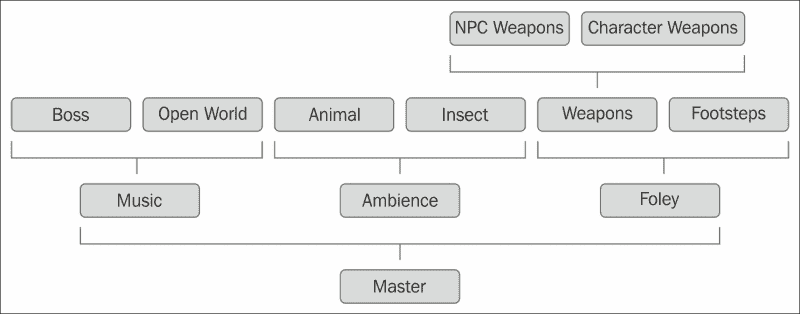
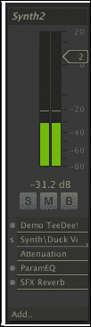
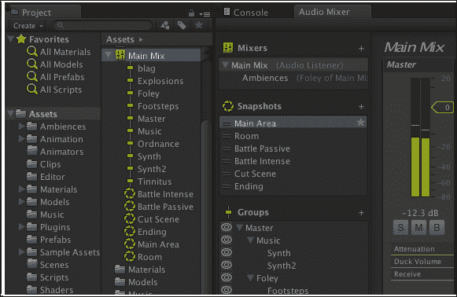
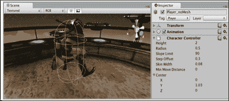

# 第四章：Unity 5 中的动画、音频、物理和粒子系统

在本章中，您将学习 Unity 5 中的新 Mecanim 动画功能和令人惊叹的新音频功能。在本章结束时，您将探索 Unity 5 中的物理和粒子系统。

本章将涵盖以下主题：

+   Unity 5 中的新 Mecanim 动画功能

+   Unity 5 中的新音频功能

+   Unity 5 中的物理和粒子系统效果

# Unity 5 中的新 Mecanim 动画功能

Unity 5 为 Mecanim 动画系统提供了一些新的令人惊叹的可能性。让我们看看在 Unity 5 中已知的新功能。

## 状态机行为

现在，您可以从 `StateMachineBehaviour` 继承您的类，以便能够将它们附加到您的 Mecanim 动画状态。此类具有以下非常重要的回调：

+   `OnStateEnter`

+   `OnStateUpdate`

+   `OnStateExit`

+   `OnStateMove`

+   `OnStateIK`

`StateMachineBehaviour` 脚本的行为类似于 `MonoBehaviour` 脚本，您可以将它们附加到您希望的对象上；对于 `StateMachineBehaviour` 也是如此。您可以使用此解决方案，无论是否有任何动画。

## 状态机转换

Unity 5 为 Mecanim 动画系统引入了一个新的令人惊叹的功能，称为状态机转换，以便构建更高的抽象级别。此外，创建了入口和退出节点。通过这两个额外的节点到 `StateMachine`，您现在可以根据您特殊条件和需求分支您的起始或结束状态。

### 注意

可能的过渡混合如下：`StateMachine` | `StateMachine`，`State` | `StateMachine`，`State` | `State`。

此外，您还可以重新排列您的层或参数。这是通过一个非常简单且实用的拖放方法实现的新的用户界面。

## 资产创建 API

在 Unity 5 中，通过在 Unity 编辑器中使用脚本引入了另一个令人惊叹的可能性，以便以编程方式创建资产，例如层、控制器、状态、`StateMachine` 和混合树。您可以使用由 Unity 引擎维护的高级 API 和低级 API，在低级 API 中，您应该手动管理所有资产。您可以在 Unity 文档页面上找到有关这两个 API 版本的信息。

## 直接混合树

新引入的 `BlendTree` 类型的新功能被称为直接映射。它为 `BlendTree` 子项的权重提供直接映射和动画器参数。

### 注意

Unity 5 的可能性通过两个用于 Mecanim 动画系统的有用功能得到了增强：

+   摄像机可以缩放、环绕和平移

+   您可以在运行时访问您的参数

## 通过 Unity 5 API 以编程方式创建资产

以下代码片段是自我解释的，相当简单，直接明了。我列出它们只是为了作为一个非常有用的提醒。

### 创建控制器

要创建控制器，您可以使用以下代码：

```java
var animatorController = UnityEditor.Animations.AnimatorController.CreateAnimatorControllerAtPath ("Assets/Your/Folder/Name/state_machine_transitions.controller");
```

### 添加参数

要向控制器添加参数，您可以使用以下代码：

```java
animatorController.AddParameter("Parameter1", UnityEditor.Animations.AnimatorControllerParameterType.Trigger);
animatorController.AddParameter("Parameter2", UnityEditor.Animations.AnimatorControllerParameterType.Trigger);
animatorController.AddParameter("Parameter3", UnityEditor.Animations.AnimatorControllerParameterType.Trigger);
```

### 添加状态机

要添加状态机，您可以使用以下代码：

```java
var sm1 = animatorController.layers[0].stateMachine;
var sm2 = sm1.AddStateMachine("sm2");
var sm3 = sm1.AddStateMachine("sm3");
```

### 添加状态

要添加状态，您可以使用这里提供的代码：

```java
var s1 = sm2.AddState("s1");
var s2 = sm3.AddState("s2");
var s3 = sm3.AddState("s3");
```

### 添加过渡

要添加过渡，您可以使用以下代码：

```java
var exitTransition = s1.AddExitTransition();
exitTransition.AddCondition(UnityEditor.Animations.AnimatorConditionMode.If, 0, "Parameter1");
exitTransition.duration = 0;

var transition1 = sm2.AddAnyStateTransition(s1);
transition.AddCondition(UnityEditor.Animations.AnimatorConditionMode.If, 0, "Parameter2");
transition.duration = 0;

var transition2 = sm3.AddEntryTransition(s2);
transition2.AddCondition(UnityEditor.Animations.AnimatorConditionMode.If, 0, "Parameter3");
sm3.AddEntryTransition(s3);
sm3.defaultState = s2;

var exitTransition = s3.AddExitTransition();
exitTransition.AddCondition(UnityEditor.Animations.AnimatorConditionMode.If, 0, "Parameter3");
exitTransition.duration = 0;

var smt = rootStateMachine.AddStateMachineTransition(sm2, sm3);
smt.AddCondition(UnityEditor.Animations.AnimatorConditionMode.If, 0, "Parameter2");
sm2.AddStateMachineTransition(sm1, sm3);
```

## 深入了解新的音频功能

让我们从新的惊人的音频混音可能性开始。

现在，您可以在 Unity 5 中实现真正的音频子混音。

在下面的图中，您可以看到一个游戏所需的不同声音类别的简单示例：



现在在 Unity 5 中，您可以在分类内混合不同的声音集合，并在一个地方调整音量控制和效果，这样可以节省大量时间和精力。Unity 5 中这个新的出色音频功能允许您为游戏创建出令人惊叹的情绪和氛围。

每个音频混音器都可以拥有一个音频组（AudioGroups）的层级结构：



音频混音器不仅可以做很多有用的事情，还可以在一个地方混合不同的声音组。不同的音频效果按顺序应用于每个音频组。

现在，您正在接近 Unity 5 音频系统中的惊人、出色和闪亮的新功能！一个回调脚本`OnAudioFilterRead`，它使得直接在脚本中处理样本成为可能，之前完全由代码处理。

Unity 现在还支持自定义插件来创建不同的效果。有了这些创新，Unity 5 的音频系统现在拥有自己的合成器应用，这使得它比以前更容易、更灵活。

## 情绪转换

如前所述，游戏的情绪可以通过声音的混合来控制。这可以通过引入新的声源和音乐或环境声音来实现。另一种常见的方法是通过移动混合状态来实现。通过改变音量部分的混合并将其转移到不同的效果参数状态，这是一种非常有效的方法，可以将情绪引导到您想要的方向。

在内部，一切都是音频混音器识别图片的能力。图片捕捉了音频混音器中所有参数的状态。从调查湿度级别到音频组音调级别的一切都可以被捕捉并在各种参数之间移动。



您甚至可以在游戏中的大量图片之间创建复杂的混合状态，创造出各种可能性和目标。

想象一下，在不向脚本中写入一行代码的情况下安装所有这些功能。

# Unity 5 中的物理和粒子系统效果

Unity 中的 2D 和 3D 物理在概念上非常相似，因为它们使用相同的概念，如刚体、关节和碰撞体。然而，Box2D 比 Unity 的 2D 物理引擎具有更多功能。在 Unity 中混合 2D 和 3D 物理引擎（内置、自定义、第三方）并不成问题。因此，Unity 为您的创新游戏和应用提供了简单易用的开发方式。

如果您需要在项目中开发一些真实的物理效果，那么您不应该编写自己的库、框架或引擎，除非有特定要求。然而，您应该尝试使用具有许多已制作功能的现有物理引擎、库或框架。

让我们开始介绍 Unity 内置的物理引擎。如果您需要将对象置于 Unity 内置的物理管理之下，只需将 Rigidbody 组件附加到该对象即可。之后，您的对象可以与其世界中的其他实体发生碰撞，重力也会对其产生影响。换句话说，Rigidbody 将进行物理模拟。在您的脚本中，您可以通过向它们添加矢量力来移动任何 Rigidbody。

不建议移动非运动学 Rigidbody 的 Transform 组件，因为它将无法正确与其他物品发生碰撞。相反，您可以向您的 Rigidbody 施加力和扭矩。

Rigidbody 也可以用来开发带有轮子碰撞体的汽车，以及使用您的脚本对其施加力。此外，Rigidbody 不仅用于车辆，您还可以用它来解决任何其他物理问题，如飞机、带有各种施加力脚本的机器人以及关节。

利用 Rigidbody 最有用的方式是将其与一些原始碰撞体（Unity 内置）如`BoxCollider`和`SphereCollider`一起使用。接下来，我们将向您介绍关于 Rigidbody 的两个需要注意的事项：

+   在您的对象层次结构中，您绝不应该同时将带有 Rigidbody 组件的子对象和父对象放在同一时间

+   不建议缩放 Rigidbody 的父对象

在 Unity 中，物理学的最重要的基本组成部分之一是 Rigidbody 组件。这个组件会在附加的对象上激活物理计算。如果你的对象需要响应碰撞（例如，在玩台球时，球会相互碰撞并向不同方向散射），那么你必须在你的 GameObject 上附加一个`Collider`组件。如果你已经为你的对象附加了 Rigidbody 组件，那么你的对象将通过物理引擎移动，我建议你不要通过更改其在`Transform`组件中的位置或旋转来移动你的对象。如果你需要某种方式来移动你的对象，你应该应用作用在对象上的各种力，这样 Unity 物理引擎就会承担计算碰撞和移动动态对象的全部责任。此外，在某些情况下，可能需要 Rigidbody 组件，但你的对象只能通过在`Transform`组件中更改其位置或旋转属性来移动。有时，有必要使用没有 Rigidbody 计算对象及其运动物理的组件。也就是说，你的对象将通过你的脚本或，例如，通过运行你的动画来移动。为了解决这个问题，你应该只激活其`IsKinematic`属性。有时，当`IsKinematic`开启和关闭时，需要使用这两种模式的组合。你可以在你的代码或动画中直接更改`IsKinematic`参数，以创造这两种模式的共生体。

### 小贴士

频繁地在你的代码或动画中更改`IsKinematic`属性可能会导致你的性能开销。因此，你应该非常小心地使用它，并且只有在真正需要的时候才使用。

动力学 Rigidbody 对象由`IsKinematic`切换选项定义。如果一个 Rigidbody 是`Kinematic`，则该对象将不会受到碰撞、重力或力的 影响。

### 注意

3D 物理引擎有一个 Rigidbody 组件，2D 物理引擎有一个类似的 Rigidbody2D 组件。

动力学 Rigidbody 可以与其他非动力学 Rigidbody 交互。在使用动力学 Rigidbody 的情况下，你应该通过你的脚本或动画来转换其`Transform`组件的位置和旋转值。当动力学和非动力学 Rigidbody 之间发生碰撞时，动力学对象将正确唤醒非动力学 Rigidbody。此外，如果第二个对象位于第一个对象之上，第一个 Rigidbody 将对其施加摩擦力。

让我们列出一些动力学 Rigidbody 的可能使用示例：

+   有时候你需要你的对象受到物理管理，但有时需要从你的脚本或动画中明确控制。例如，你可以将`Rigidbody`附加到你的动画人物的骨骼上，并通过关节将它们连接起来，以便将你的实体用作布娃娃。如果你通过 Unity 的动画系统控制你的角色，你应该勾选`IsKinematic`复选框。有时，如果你在打击英雄，你可能需要你的英雄受到 Unity 内置物理引擎的影响。在这种情况下，你应该取消勾选`IsKinematic`复选框。

+   如果你需要一个可以推动不同物品但自身不动的移动物品。如果你有一个移动平台并且需要在上面放置一些`Rigidbody`对象，你应该勾选`IsKinematic`复选框，而不是简单地附加一个没有`Rigidbody`的碰撞器。

+   你可能需要通过使用可用的一个关节来启用你的动画`Rigidbody`对象的`IsKinematic`属性，该对象具有真实的`Rigidbody`跟随者。

之前我提到了碰撞器，但现在正是详细讨论这个组件的时候。在 Unity 中，物理引擎可以计算碰撞。你必须通过附加`Collider`组件来指定你的对象的几何形状。在大多数情况下，碰撞器不需要与你的多边形网格形状相同。因此，使用简单的碰撞器是理想的，这会显著提高你的性能；否则，使用更复杂的几何形状，你可能会显著增加物理碰撞的计算时间。Unity 中的简单碰撞器被称为原始碰撞器：`BoxCollider`、`BoxCollider2D`、`SphereCollider`、`CircleCollider2D`和`CapsuleCollider`。此外，没有人禁止你组合不同的原始碰撞器来创建一个更真实的几何形状，与`MeshCollider`相比，物理引擎可以非常快速地处理这种形状。因此，为了加速你的性能，你应该尽可能使用原始碰撞器。你还可以挂载不同原始碰撞器的子对象，这将根据父`Transform`组件改变其位置和旋转。`Rigidbody`组件必须仅附加到你的实体层次结构中的 GameObject 根上。

Unity 为 3D 物理提供了一个`MeshCollider`组件，为 2D 物理提供了一个`PolygonCollider2D`组件。`MeshCollider`组件将使用你的对象的网格作为其几何形状。在`PolygonCollider2D`中，你可以在 Unity 中直接编辑并创建任何 2D 几何形状用于你的 2D 物理计算。为了在不同的网格碰撞器之间响应碰撞，你必须启用`Convex`属性。你肯定会为了更精确的物理计算而牺牲性能，但如果你在质量和性能之间找到了合适的平衡，那么你只能通过正确的方法来实现良好的性能。

当对象具有`Collider`组件但没有 Rigidbody 组件时，它们是静态的。因此，您不应该通过更改其`Transform`组件中的属性来移动或旋转它们，因为这会在物理引擎上留下沉重的印记，因为物理引擎应该重新计算各种对象的多个多边形，以进行正确的碰撞和光线投射。动态对象是具有 Rigidbody 组件的对象。静态对象（带有`Collider`组件且没有 Rigidbody 组件）可以与动态对象（带有`Collider`和 Rigidbody 组件）交互。此外，静态对象不会像动态对象那样因碰撞而移动。

此外，Rigidbodies 可以进入休眠状态以提高性能。Unity 提供直接在代码中使用以下函数来控制 Rigidbody 组件中休眠的能力：

+   `Rigidbody.IsSleeping()`

+   `Rigidbody.Sleep()`

+   `Rigidbody.WakeUp()`

在物理管理器中定义了两个变量。您可以直接从 Unity 菜单中打开物理管理器：**编辑** | **项目设置** | **物理**：

+   `Rigidbody.sleepVelocity`：默认值是`0.14`。这表示线性速度的下限（从零到无穷大）低于此值时，对象将进入休眠状态。

+   `Rigidbody.sleepAngularVelocity`：默认值是`0.14`。这表示角速度的下限（从零到无穷大）低于此值时，对象将进入休眠状态。

Rigidbodies 在以下情况下会唤醒：

+   另一个 Rigidbody 对静止的 Rigidbody 产生冲击

+   另一个 Rigidbody 通过关节连接

+   在调整 Rigidbody 属性时

+   在添加力向量时

### 注意

动力学 Rigidbody 可以唤醒其他休眠的 Rigidbodies，而静态对象（带有`Collider`组件且没有 Rigidbody 组件）不能唤醒您的休眠 Rigidbodies。

集成到 Unity 中的 PhysX 物理引擎在移动设备上运行良好，但移动设备当然比强大的桌面电脑资源要少得多。

让我们看看一些优化 Unity 中物理引擎的要点：

+   首先，请注意，您可以通过在时间管理器中调整`Fixed Timestep`参数来减少物理执行时间更新的成本。如果您增加该值，可以提高您游戏或应用程序中物理的质量和精度，但您将失去处理时间。这可能会大大降低您的生产力，换句话说，它可能会增加 CPU 开销。

+   允许的最大时间步长表示在最坏情况下物理处理将花费多少时间。

+   物理的总处理时间取决于场景中唤醒的刚体和碰撞器，以及碰撞器的复杂程度。

Unity 提供了使用物理材料设置各种属性的能力，例如摩擦力和弹性。例如，你游戏中的冰块可能具有非常低的摩擦力或等于零（最小值），而跳跃的球可能具有非常高的摩擦力或等于一（最大值），并且也具有非常高的弹性。你应该对不同对象的物理材料设置进行实验，并选择最适合你以及最佳性能的解决方案。

触发器不需要物理引擎进行大量的处理成本，并且可以极大地帮助提高你的性能。触发器在以下情况下非常有用，例如，在你的游戏中，你需要识别所有自动在傍晚或夜间打开的灯光附近的区域，如果玩家位于其触发区域或换句话说，位于其碰撞几何形状内。你可以按自己的意愿设计这些区域。Unity 触发器允许编写三个回调函数，这些函数将在你的对象进入触发器时被调用，当你的对象停留在触发器内时被调用，以及当这个对象离开触发器时被调用。因此，你可以注册这些函数中的任何一个，例如必要的指令，例如进入触发器区域时打开手电筒或退出触发器区域时关闭它。重要的是要知道，在 Unity 中，静态对象（没有 Rigidbody 组件的对象）不会使你的回调函数进入区域触发器，如果你的触发器不包含 Rigidbody 组件；换句话说，至少这些对象中必须有一个具有 Rigidbody 组件，以便不忽略你的回调。在两个触发器的情况下，至少应该有一个带有 Rigidbody 组件的对象附加到你的回调函数上，这样就不会被忽略。记住，当两个对象都附加了 Rigidbody 和 `Collider` 组件，并且至少有一个是触发器时，则将调用触发器回调而不是碰撞回调。我还想指出，你的回调函数将为碰撞或触发区域中包含的每个对象调用。此外，你可以通过在代码中将标志 `isTrigger` 的值设置为 `true` 或 `false` 来直接控制你的碰撞器是否是触发器。当然，你可以混合这两种选项以获得最佳性能。所有碰撞回调函数只有在两个交互的刚体中至少有一个不是运动学刚体时才会被调用。我建议你考虑碰撞回调函数的代码示例。

第一个示例回调函数，将在碰撞事件开始时被调用：

```java
void OnCollisionEnter (Collision collision)
```

第二个示例回调函数，将在保持碰撞状态时被调用：

```java
void OnCollisionStay (Collision collision)
```

第三个示例回调函数，将在碰撞事件结束时被调用：

```java
void OnCollisionExit (Collision collision)
```

第四个示例回调函数，将在碰撞事件开始时被调用，它进行了更多的优化，因为它避免了碰撞输入参数，从而避免了额外的计算：

```java
void OnCollisionEnter ()
```

第五个示例回调，在保持碰撞状态时被调用，因为它避免了碰撞输入参数，从而避免了额外的计算，所以更加优化：

```java
void OnCollisionStay ()
```

第六个示例回调，在碰撞事件结束时被调用，因为它避免了碰撞输入参数，从而避免了额外的计算，所以更加优化：

```java
void OnCollisionExit ()
```

第七个示例回调，将在进入触发碰撞器时被调用：

```java
void OnTriggerEnter (Collider collider)
```

第八个示例回调，将在保持触发碰撞器状态时被调用：

```java
void OnTriggerStay (Collider collider)
```

第九个示例回调，将在退出触发碰撞器时被调用：

```java
void OnTriggerExit (Collider collider)
```

第十个示例回调，将在没有碰撞器输入参数的情况下进入触发时被调用。这个回调将比带有碰撞器输入参数的回调更快：

```java
void OnTriggerEnter ()
```

第十一个示例回调，将在没有碰撞器输入参数的情况下进入触发时被调用。这个回调将比带有碰撞器输入参数的回调更快：

```java
void OnTriggerStay ()
```

第十二个示例回调，将在没有碰撞器输入参数的情况下退出触发时被调用。这个回调将比带有碰撞器输入参数的回调更快：

```java
void OnTriggerExit ()
```

现在，让我们来谈谈关节。如果你需要将一个 Rigidbody 连接到另一个 Rigidbody 以便围绕特定点进行旋转，例如一个铰链门，那么你应该使用 HingeJoint（对于 2D，合适的名称是 HingeJoint2D）。Unity 还提供了其他类型的关节；例如，弹簧关节适用于需要开发蹦床或类似物品的情况。然而，我强烈建议你不要到处都使用关节，因为这可能会破坏你的性能。只使用真正必要的东西，并且尽可能少用。提高性能最重要的方法是移除所有不必要的元素。

你还可以使用`CharacterController`组件来创建第一人称游戏。`CharacterController`组件使用其自己的物理计算，与 Rigidbody 分开。

这些对于在*y*轴周围的不同表面上行走非常方便，无需旋转，并在 Rigidbody 组件的情况下保持必要的平衡。`CharacterController`组件与 Rigidbody 相比，所需的处理时间也少得多。这就是为什么你应该尽可能使用`CharacterController`而不是 Rigidbody，但尽量像其他所有东西一样，尽可能少用。`CharacterController`组件包含`CapsuleCollider`，它沿着*y*轴向上。接下来，你将研究以下截图所示的`CharacterController`属性：



## 粒子系统性能技巧和窍门

粒子系统使用大量的小粒子，换句话说，就是大量的图形对象，以创建不同的效果，如灰尘、雨、雪、火、爆炸、烟雾、瀑布、落叶、雾、星星、星系、烟花、各种魔法效果等。通常，粒子系统发射多个粒子，这些粒子有自己的寿命，之后它们逐渐消失并被重新发射。还有一些使用粒子系统创建毛发、头发、草地的技术，其中粒子不会消失，但它们可以存活很长时间。

### 注意

粒子系统可以是 2D 或 3D。

从数学上讲，每个粒子表示为一个具有附加属性的质量点，例如外观、速度、空间中的方向、角速度等。在程序过程中，每个粒子通过一个特定的公式改变其状态，该公式对所有系统中的粒子都是通用的。例如，粒子可能受到重力的影响，改变其大小、颜色、速度等。所有计算完成后，粒子将被可视化。粒子可以通过点、三角形、精灵甚至完整的全三维模型来可视化。

目前，粒子系统没有统一的实现。在不同的游戏和应用程序中，粒子的 3D 建模属性、行为和外观可能存在根本性的不同。

在大多数实现中，新粒子是由所谓的**发射器**发射的。如果发射器是一个点，那么新粒子将出现在相同的位置。因此，可以模拟，例如，爆炸——发射器是其中心。发射器可以是一条线、线段或一个平面；例如，雨滴或雪花粒子应该出现在高水平的水平面上。发射器可以是一个任意几何对象，在这种情况下，新粒子将出现在其整个表面上。

在粒子的整个生命周期中，粒子很少处于静止状态。粒子可以移动、旋转、改变颜色和/或透明度，并且可以处理三维对象。通常，粒子设置最大寿命，之后粒子消失。

在三维、实时应用或计算机游戏中，通常认为粒子不会相互投射阴影，也不会在环境的几何形状上投射阴影，它们不会吸收和发射光线。如果没有这些，简化的粒子系统将需要更多的资源；在吸收光线的情况下，粒子需要按距离摄像机的顺序排序，而在每个粒子需要绘制几次阴影的情况下。

### 与 Unity 内置的粒子系统相比，Shuriken 模块的遗留系统

1.  Shuriken 模块的一些属性无法在您的脚本中实现。

1.  同时，在您的脚本中也可以实现遗留粒子系统的属性。

1.  您可以根据以下代码示例开启和关闭`emission`：

    ```java
      public ParticleSystem yourParticleSystemVariable;
      void YourMethodName() {
        yourParticleSystemVariable.enableEmission = false;
      }
    ```

在发射爆炸中的粒子时，你应该使用以下代码示例中的`Emit`函数：

```java
  public ParticleSystem yourParticleSystemVariable;
  void YourMethodName() {
    yourParticleSystemVariable.Emit(123); //emits 123 particles
  }
```

与激活和停用`emission`属性不同，你还可以像下面这样控制发射器中的粒子：

```java
  public ParticleSystem yourParticleSystem;
  private ParticleSystem.Particle[] 
      yourParticlesList = new ParticleSystem.Particle[1750];
  void YourMethodName() {
    int len = yourParticleSystem.GetParticles(yourParticlesList);
    for(int i=0; i < len; i++) {
          yourParticlesList[i].color = new Color(0,0,1,0.5f);
      }
    yourParticleSystem.SetParticles(yourParticlesList, len);
  }
```

让我们列出`Particle`类的可获取属性（[`docs.unity3d.com/ScriptReference/ParticleSystem.Particle.html`](http://docs.unity3d.com/ScriptReference/ParticleSystem.Particle.html)）：

+   `lifetime`

+   `startLifetime`

+   `position`

+   `rotation`

+   `color`

+   `size`

+   `velocity`

+   `randomValue`

+   `angularVelocity`

### 注意

在 Unity 中创建 Shuriken 粒子系统非常简单。你只需导航到**GameObject** | **Create Other** | **Particle Systems**。这将为你创建一个 Shuriken 粒子系统的实例，你可以对其进行操作。

要创建一个旧版粒子系统，你必须创建一个`void` GameObject 或将旧版粒子系统连接到一个可用的 GameObject。

### 粒子系统技巧

在现代游戏中，有许多事情会降低帧率，粒子几乎是最主要的原因之一。一个关键因素是粒子容易产生大量的不必要的渲染，而这些渲染并没有显示在你的不透明几何体上。

过度绘制增加的原因是，对于粒子，我们倾向于有大量的不同原语（通常是四边形）被覆盖，可能是为了复制火焰或烟雾等效果。通常，每个粒子原语都是透明的（alpha 混合），因此 z 缓冲区不会被更新，当像素被写入时，我们最终在不同的时间渲染到像素上。（有趣的是，对于模糊几何体，我们确实会写入 z 缓冲区，因此在一个可能的 z 预扫描、从前到后排序项目、GPU 上的渐进式 z 裁剪和常规深度测试之间，效果是我们几乎没有任何过度绘制。）

因此，过度绘制会导致`fillrate`（每秒可以渲染的像素数量）和`bandwidth`（每秒可以交换到/从 GPU 的信息量）的使用增加，这两者可能都是稀缺资源。

我们都认为粒子可能会引起相当多的问题。幸运的是，有许多事情能够改善粒子系统的渲染方面。

+   **使用不透明粒子**：例如，使烟雾效果真正厚重，使得（一些或全部的）分子板变得不透明，具有固定的图案 alpha。对于一些粒子，例如碎片、岩石或类似物体，使用轻量级几何粒子而不是带有 alpha 边界的精灵。

+   **使用更丰富的粒子**：给单个分子精灵增加更多活力，这样你需要的就少。使用翻书表面来制作例如火焰和烟雾的涌动，而不是堆叠精灵。

+   **粒子总数**：使用图形卡上的适配器计数器来获取已渲染的粒子像素数，并在超过某个临界点时停止释放或绘制粒子（这个临界点可能被动态设置）。

+   **减少状态变化**：在粒子之间共享着色器。例如，你可以通过丢弃远离粒子的特性（例如，在最早的机会丢弃法线贴图）来实现这一点。

+   **以前后预乘 alpha 风格制作粒子**：使用预乘 alpha（这是协作的），你可以从前向后混合粒子，而不是普通的从后向前请求。这里的想法是利用前后吸引来填充当 alpha 变得（接近）强时填充模板缓冲区，最后，完全停止绘制粒子（当它们通常不会对视觉场景有很大帮助时）。

+   **将粒子聚集成一个分子实体**：而不是分别绘制两个重叠的粒子，你可以构建一个包含两个粒子的单一（更大的）分子，并在着色器中以简单的方式混合这两个粒子。这倾向于减少我们进行的帧缓冲区理解的量，因为我们只需要混合一个分子。

# 摘要

本章介绍了 Unity 5 中的新 Mecanim 动画功能。你了解了 Unity 5 中新的出色音频功能。在本章的最后，你探索了 Unity 5 中的物理和粒子系统。在本章中，你涵盖了在 Unity 内置物理和粒子系统中进行性能时许多有用的细节。你探索了刚体及其相关的技巧和窍门。你学习了运动学刚体和休眠刚体、碰撞体、静态碰撞体、原始碰撞体、物理材质、触发器、关节、角色控制器、交互式布料以及许多其他有用的物理定义、细节、注意事项、技巧和窍门。你还学习了关于粒子系统技巧和窍门以及如何为你的任何对象创建一个简单的对象池系统。

下一章将包括 Unity 5 中资源包的概述。你还将学习如何实时为 Android 设备下载新的代码和数据。在本章的最后，你将发现资源包在实际应用中的安全性技术。
