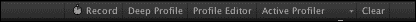
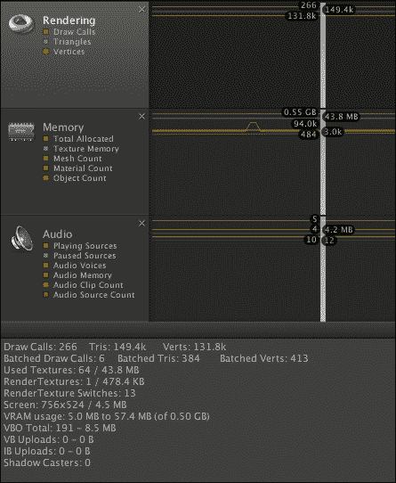
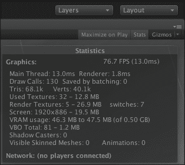
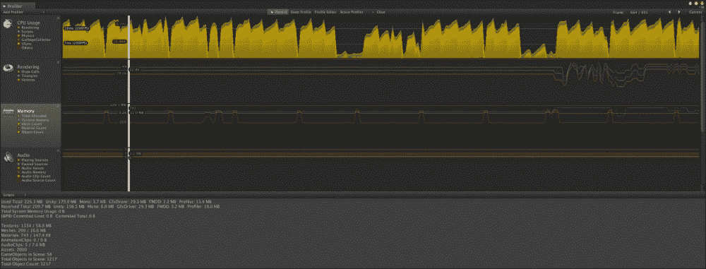
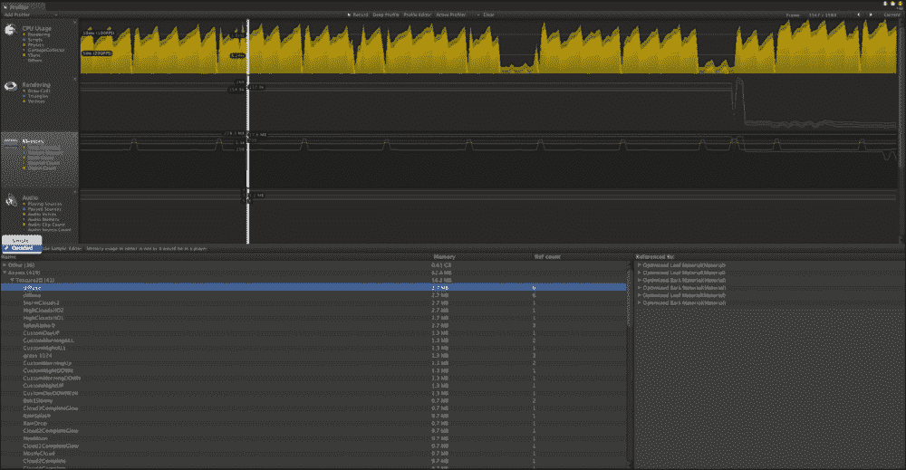
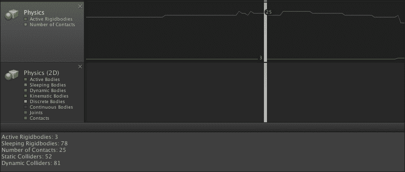

# 第七章. 故障排除和最佳实践

主要地，本章将探讨如何使用不同的技术和基于物理的着色器来提高游戏和应用程序的质量。其次，本章将描述 Unity 5 中的全局照明。在本章结束时，你将优化着色器代码。

本章将涵盖以下主题：

+   使用内置 Android 分析器测量性能

+   使用 Unity 分析器工具调试 Android 设备

+   脚本和着色器中的最佳实践

# 使用内置 Android 分析器测量性能

让我们看看我们可以从 Unity 5 的内置 Android 分析器中看到哪些信息。

## 一般 CPU 活动

接下来，我们将讨论我们可以从内置分析器中获得的信息。为了更容易理解这些消息的结构，我们将它们分为几个组。第一个组包括一般信息，换句话说，是 CPU 的整体性能统计信息。

你将看到在参数值`cpu-player`中消耗的总 CPU 时间。在 CPU 端由 OpenGLES 驱动代码消耗的时间将在名为`cpu-ogles-drv`的参数值中看到。接下来，让我们考虑以下参数，称为`cpu-waits-gpu`。对于非常小的值，此选项不会出现在内置分析器中。此值显示了在 GPU 端等待渲染结束所消耗的 CPU 时间。接下来，让我们考虑以下参数，称为`msaa-resolve`。此值显示了在抗锯齿方法上消耗的 CPU 时间。让我们考虑以下参数，称为`cpu-present`。此值显示了在执行 OpenGLES 的`presentRenderbuffer`函数上消耗的 CPU 时间。让我们也看看这个组中最后一个参数的值，称为`frametime`。此值显示了在 CPU 端执行帧所花费的时间。

### 注意

Android 硬件的刷新率锁定在大约 60 Hz，因此你将得到大约~16.7 ms 的帧时间（大约是 16.7 毫秒，我们通过计算得到——1000 毫秒除以 60 Hz）。

## 渲染统计信息

现在，让我们考虑以下基于渲染的统计信息组。这个组中只包含四个参数。第一个参数被称为`draw call`。这个值的真正含义是显示每帧的绘制调用量。这个组的第二个参数被称为`tris`。这个值表示渲染器将处理的三角形数量。这个组的第三个参数被称为`verts`。这个值显示了渲染器将处理的顶点数量。静态几何体的上限数量为 10,000 个顶点，而皮肤几何体的上限则要低得多。最后，这个组中的最后一个参数，我们将在这个组中研究，被称为`batched`。这个参数的值对你的性能有很大影响，所以尽量尽可能减少这个值。这个值展示了 Unity 引擎自动批处理的绘制调用、三角形和顶点的数量。

### 注意

为了提高 Unity 引擎的批处理效率，你应该尽可能地为所有可用的对象使用共享材质。

## 详细 Unity 玩家统计信息

现在，考虑以下更详细的统计信息组。在内置分析器的详细统计信息中，第一个参数被称为`physx`。这个值表示物理引擎执行所花费的时间。文本参数被称为`animation`。这个值表示骨骼动画所花费的时间。详细统计信息中的第三个参数被称为`culling`。这个值表示花费在对象执行剔除上的时间。内置分析器详细统计信息中的第四个参数被称为`skinning`。这个值表示将动画应用到皮肤网格所需的时间。在这个详细统计信息中的第五个参数被称为`batching`。这个值显示了在批处理几何体执行上花费的时间。

### 注意

与批处理动态几何体相比，批处理静态几何体成本较低。

在详细统计信息中的第六个参数被称为`render`。这个值代表了渲染可见对象所花费的执行时间。第七个参数被称为`fixed-update-count`。这个值显示了当前帧`FixedUpdate`执行时间的上下限值。尽量尽可能减少这个值，因为它可以降低你的性能。

## 脚本详细统计信息

只有三组可获取的参数。第一个参数被称为`update`。这个值决定了你的脚本中每个`Update`函数执行的用时。下一个参数被称为`fixedUpdate`。这个值展示了你的脚本中每个`FixedUpdate`函数执行的用时。接下来的参数被称为`coroutines`。这个值决定了你的脚本中协程执行的用时。

## 脚本分配内存的详细统计信息

让我们根据您脚本内存分配的详细统计信息来介绍以下一组统计数据。这里只有四个参数。第一个参数被称为`分配堆`。

此值表示可用于分配的内存。如果我们需要的内存超过了堆中可用的内存，垃圾回收器将被调用。然而，如果垃圾回收器无法为我们释放更多内存，那么堆的大小将会增加。下一个参数被称为`已用堆`。此值表示对象分配的堆大小。每次创建新的类实例时，它都会增加，但在垃圾回收器再次被调用之前，结构体不会增加。下一个参数被称为`最大收集次数`。此值显示了在过去 30 帧中垃圾回收器调用的数量。在这个组中的最后一个参数，也是内置分析器的最后一个参数，被称为`收集总持续时间`。此值显示了在过去 30 帧中垃圾回收器调用所使用的总毫秒数。

# 使用 Unity 分析器工具调试 Android 设备

我们可以从菜单中打开 Unity 分析器窗口，它展示了整个 Unity 分析器工具。在接下来的章节中，我们将更深入地探讨 Unity 分析器区域。

在开始之前，我们需要了解这个工具是如何工作的，以及它有多么简单易用。首先，让我们更详细地看看 Unity 分析器工具窗口的结构，并分别介绍其各个部分。正如我们可以在下一张截图中所看到的，有四个主要视觉部分：

+   分析器控件

+   使用区域

+   分析器时间线

+   信息表

接下来的章节将专注于 Unity 分析器工具的独特部分。让我们深入探讨这个工具中最有趣的部分。

关于可视化分析器，您可以连接到运行您应用程序的设备，以进一步分析您软件的性能。为了连接到其他设备，分析器必须在同一本地网络中（但这不是必要的充分条件）。**活动分析器**选项允许您从所需连接的列表中选择您的设备。除此之外，您应该通过**构建设置**中的**开发构建启用**复选框启动应用程序。在这些设置中，您还会看到**自动连接分析器**选项，这是必要的，以指示 Unity 每次启动应用程序时是否应该连接到分析器。

以下是一些 Unity 分析器按钮：

+   **记录**

+   **深度分析器**

+   **配置文件编辑器**

+   **活动分析器**

+   **清除**



如果你查看性能分析器窗口的顶部，你会看到一个工具栏，我们将在本章后面更详细地探讨它。通过工具栏上的按钮，你可以启用或禁用性能分析器记录数据。此外，你可以清除收集到的信息或在帧集中导航，还有更多功能；我们稍后会详细讨论。在工具栏中，我们可以看到**当前**按钮。点击此按钮后，我们将自动进入一个帧，并查看其实现的最后细节。如果你的游戏是在 Unity 编辑器中运行的，它将被挂起，这意味着它将被暂停。当你使用箭头按钮向前或向后切换帧时，它也会被挂起，这些箭头按钮离**当前**按钮不远。此外，请注意，性能分析器不会保留所有帧，而只保留最近的一定数量的帧。此外，如果你从左到右在工具栏的性能分析器上滑动，我们会看到一个**清除**按钮，用于清除收集到的所有数据。之后，我们会看到一个**活动性能分析器**按钮，它允许你选择设备或 Unity 编辑器进行进一步的性能分析。

接下来，我们看到一个名为**性能编辑器**的按钮；如果你点击此按钮，你将开始获取 Unity 编辑器的详细执行统计信息。在此按钮的左侧，你会看到一个**深度分析**按钮。当此按钮被激活时，它将提供关于你所有脚本和函数调用的信息。深度分析可能会显著减慢你的应用程序或游戏，因为它需要花费大部分时间进行处理，并需要大量的内存空间。请记住，非常深入的深度分析只有在用于小型项目时才会有效，否则你可能会面临 Unity 无法获取必要资源并挂起的风险，随后你将不得不重新启动 Unity 编辑器。此外，深度分析不仅适用于小型项目，对于测试游戏或应用程序的关键方面也非常有用。你可以在深度分析中使用代码，并为你脚本中的特定代码片段打开和关闭它。只有必要的代码部分将被分析。

`Profiler.BeginSample`和`Profiler.EndSample`调用是代码性能分析的起点和终点，这意味着这两个函数调用之间的代码将被分析，并在底部性能分析器窗口中显示详细统计信息。我们将在本章稍后讨论性能分析脚本。从**深度分析**按钮的左侧是一个名为**记录**的按钮，它用于启用或禁用性能分析，正如我们之前提到的。好吧，工具栏中最左侧的按钮被称为**添加性能分析器**，它用于显示不同的性能分析区域：**CPU**、**GPU**、**渲染**、**内存**、**音频**、**3D 物理**和**2D 物理**。我们将在本章稍后讨论这些性能分析区域。

如果你的游戏或应用程序以特定的帧率运行或与垂直空白同步，那么 Unity 将保持平均等待所有帧同步的时间，这被称为`Wait For Target FPS`参数，并在性能分析器中显示。默认情况下，等待时间的信息不会发布在 Unity 性能分析器中。要更改指定的默认行为，你需要启用`View SyncTime`。

## 性能分析器时间线

在性能分析器窗口的上方是一个图表，它实时显示性能分析器的负载数据。统计数据在每个帧中处理，并且只保存在最后几百帧的历史记录中。如果你选择其中一个帧进行进一步考虑，你将在底部性能分析器中看到细节，这反过来又取决于所选的时间线区域（例如，**CPU**、**GPU**或**音频**）。你可以添加和删除各种时间线区域。此外，请注意，左侧的彩色方块显示不同的时间线区域。实际上，不仅仅是彩色方块；它们是单选按钮。因此，在优化应用程序时，消除不必要的数据将会更容易。

## CPU 区域

CPU 区域清楚地显示了在 CPU 侧具体位置和总共花费了多少时间。如果你选择它，那么你就已经触发了 CPU 区域。之后，你将看到底部性能分析器仅显示关于应用程序在 CPU 上执行的足够详细的信息。此外，你可以选择两种不同的显示详细信息的模式：

+   **层次结构**模式通过分组数据来显示信息

+   **组层次结构**模式显示逻辑上分布的组信息；例如，**渲染**组、**脚本**组、**物理**组以及许多其他组

CPU 性能分析器的**其他**区域包括**加载**、**音频**、**动画**、**粒子**、**玩家循环**、**AI**和**网络**。

## 渲染区域

**渲染**区域显示了如下截图所示的渲染统计信息。时间线图示了渲染的**绘制调用**、**三角形**和**顶点**的数量。正如我们所见，以下截图的下半部分和下一张图中显示的**游戏视图渲染统计**非常相似。进一步地，我们将详细说明以下截图中的信息：



以下截图与相同的统计信息非常相似：



| 每帧时间和 FPS | 渲染一帧所花费的时间（以毫秒计）；表示每秒帧数。 |
| --- | --- |
| 绘制调用 | 渲染网格的数量。 |
| 批处理（绘制调用） | 批处理绘制调用的数量。 |
| 三角形和顶点 | 绘制的几何形状（三角形和顶点）的数量。 |
| 使用的纹理 | 这表示每帧使用了多少个纹理以及每个纹理所需的内存量。 |
| 渲染纹理 | 这显示了每帧激活的渲染纹理切换的次数；此外，它还展示了渲染纹理使用的内存量以及渲染纹理的数量。 |
| 屏幕 | 这显示了屏幕大小及其抗锯齿级别和内存使用情况。 |
| VRAM 使用量 | 这大致表示了视频内存（VRAM）的使用量；此外，还表示了你的显卡有多少内存。 |
| VBO 总数 | **顶点缓冲区对象**（**VBO**）是上传到显卡的网格数量。 |
| 可见皮肤网格 | 这显示了渲染的皮肤网格的数量。 |
| 动画 | 这表示可以播放多少个动画。 |

## 内存区域

在分析这个区域时，你可以选择两种可用的模式之一，以不同的显示模式。第一种模式是显示非常简单的统计信息，第二种模式是显示非常详细的统计信息。我们将在以下章节中更详细地介绍这两种模式：

### 简单视图

我们从最简单的显示模式统计信息开始（如下截图所示）。这以比详细统计信息更简单的方式显示了每个分析帧的内存使用情况：



Unity 性能分析器的简单视图

为了有效地使用内存，Unity 试图提前保留一定量的内存，以池的形式，或者说作为备份缓冲区，这大大提高了性能。统计内存，或者说关于内存消耗多少以及用于什么的描述方法，将在底部性能分析窗口中显示。以下是这些统计参数：

+   **Unity**：这表示在原生 Unity 代码中分配使用的内存量

+   **Mono**：这显示了堆的大小以及垃圾回收器使用的内存量

+   **Gfx Driver**：这表示驱动程序在着色器、网格、渲染目标和纹理上使用的内存量

+   **FMOD**：这显示了音频驱动器使用的内存量

+   **剖析器**：这表示 Unity 剖析器使用的内存量

内存区域显示基本类型对象和资产的信息：纹理、网格、材质、动画、音频和对象计数。

### 详细视图

在详细视图中，您可以使用 **获取样本** 按钮保存当前状态以供进一步分析。为了获得有关内存使用的如此详细的信息，Unity 剖析器需要花费时间收集所有必要的信息，这就是为什么您不应该认为您可以实时接收信息的原因。



剖析器将显示有关内存消耗位置和内容的信息。以下是一个将消耗内存的对象组列表：

+   来自原生代码的引用

+   场景对象

+   内置资源

+   标记为不保存

在您点击列表中的某个对象后，Unity 将在 **项目** 视图或 **场景** 视图中突出显示所选项目。当在 Unity 编辑器中分析您的应用程序时，统计信息将不如在特定设备上准确。与 Unity 编辑器执行相关的某些成本也会显示在平均值中，这些平均值对您的应用程序并不真实。因此，为了更精确地分析您的应用程序，连接到真实设备并在该情况下分析统计数据是最佳决定。

## 音频区域

这显示了音频区域显示的信息。

## 物理区域

以下是在物理 3D 区域显示的信息列表（如以下截图所示）：

+   **活动物体**：这表示唤醒的 Rigidbodies 的数量

+   **睡眠物体**：这显示了睡眠的 Rigidbodies 的数量

+   **接触点数量**：这显示了场景中所有碰撞体之间的总接触点数

+   **静态碰撞体**：这表示有多少碰撞体附加在非 Rigidbody 对象上

+   **动态碰撞体**：这展示了有多少碰撞体附加在 Rigidbody 对象上



Unity 剖析器的详细视图

## GPU 区域

在 GPU 区域的剖析窗口中显示的统计信息与 CPU 区域显示的统计信息非常相似。

### 注意

在 Mac 上，只有 OSX 10.7 狮子版及更高版本支持 GPU 剖析。

# 实践技巧

全世界许多专业开发者都使用两种不同的性能优化技术。

## Unity 中的高速、离屏粒子技术

下一技术是优化由 NVIDIA 在 GPU Gems 3 中引入的粒子系统。为了实现目标的第一步是将粒子渲染到`RenderTexture`或换句话说，渲染到比屏幕尺寸小的另一个渲染目标。这个想法的第二步是将粒子重新混合到屏幕上。首先，我们需要深度缓冲区。当我们渲染到另一个渲染目标时，我们需要深度缓冲区来进行 z 测试。以下代码行中，你可以在`Awake`或`Start`回调中注册，例如：

```java
this.camera.depthTextureMode = DepthTextureMode.depth;
```

让我们考虑以下代码用于高速、离屏粒子：

```java
// create the off-screen particles textureRenderTexture yourParticlesRenderTexture = RenderTexture.GetTemporary(
  Screen.width, // yourLowerResolutionIntegerValue 
  Screen.height, // yourLowerResolutionIntegerValue 
  0
);
```

`yourLowerResolutionIntegerValue`确定质量。最高值意味着最差的质量和最佳的性能，反之亦然。

第二部分非常简单，就是调整你的主相机的属性，如图所示：

```java
yourMainCamera.targetTexture = yourParticlesRenderTexture;
yourMainCamera.backgroundColor = Color.black;
yourMainCamera.cullingMask = yourLayerMask.value;
yourMainCamera.depthTextureMode = DepthTextureMode.None;
yourMainCamera.clearFlags = CameraClearFlags.SolidColor;
```

下一步骤包括将粒子渲染和混合到场景中：

```java
Shader.SetGlobalVector(
  "_Your_Camera_Depth_Texture_Size",
  Vector4(
    this.camera.pixelWidth, this.camera.pixelHeight, 0.0, 0.0
  )
);
depthCamera.RenderWithShader(
  Shader.Find("Pro/Unity/Performance/Particles/Off-Screen"), 
  "RenderType"
);
Material yourMixedMaterial = YouClassHelper.GetMaterialByShader(
  Shader.Find("Pro/Unity/Performance/Particles/Off-Screen")
);
Vector2 yourTexelOffset = Vector2.Scale(
  source.GetTexelOffset(), 
  Vector2(source.width, source.height)
);
Graphics.BlitMultiTap(
  yourParticlesRenderTexture, source, yourMixedMaterial,  yourTexelOffset
);
```

### 注意

总是释放粒子渲染纹理以获得更好的性能。

你可以将你的`RenderTexture`渲染到目的地，如图所示：

```java
RenderTexture.ReleaseTemporary(yourParticlesRenderTexture);
Graphics.Blit(source, destination);
```

## 池化技术

下一技术是一个基本的池化系统（如列表 3-1 所示），用于 Unity 以及 Shuriken 粒子。将池组件放在你的 GameObject 上，设置名称和预制体。池在实体被*创建*时调用`OnCreateEvent`策略（因此将你的初始化代码放在`Start`或`Awake`回调中），当重用项目进入池时调用`OnLiberationEvent`系统。`OnCreateEvent`策略为池提供了创建事件，以便你可以存储它并在以后重用你的**GameObject**：

```java
YourPoolClass.cs
using UnityEngine;
using System.Collections;
using System.Collections.Generic;

public class YourPoolClass : MonoBehaviour
{
      private static readonly Dictionary<string, YourPoolClass> 
      namesOfObjects = new Dictionary<string, YourPoolClass>();

      public static YourPoolClass GetPoolByName(string name) { 
    return namesOfObjects[name]; 
  }

      [SerializeField]
      private string nameOfYourPool = string.Empty;

      [SerializeField]
      private Transform yourPoolPrefab = null;

      [SerializeField]
      private int initialObjectCounter = 23;

      [SerializeField]
      private bool isParentEnabled = true;

      private readonly Stack<Transform> yourObjectsStack = new Stack<Transform>();

      void Awake()
      {
    System.Diagnostics.Debug.Assert(yourPoolPrefab);
    namesOfObjects[nameOfYourPool] = this;

          for (int i = 0; i < initialObjectCounter; i++)
          {
                var t = Instantiate(yourPoolPrefab) as Transform;
                AdjustingYourObject(t);
                LiberationObject(t);
          }
      }

      public Transform GetObject(Vector3 position = new Vector3())
      {
          Transform t = null;

          if (yourObjectsStack.Count > 0) 
    {
                t = yourObjectsStack.Pop();
          } 
    else 
    {
                Debug.LogWarning(
        nameOfYourPool + " pool error!", this
      );
                t = Instantiate(yourPoolPrefab) as Transform;
          }

          t.position = position;
          AdjustingYourObject(t);

          return t;
      }

      private void AdjustingYourObject(Transform obj)
      {
         if (isParentEnabled)
         {
                obj.parent = transform;
          }

          obj.gameObject.SetActiveRecursively(true);
          obj.BroadcastMessage(
      "OnCreateEvent", 
      this, 
      SendMessageOptions.DontRequireReceiver
    );
      }

      public void LiberationObject(Transform obj)
      {
         obj.BroadcastMessage(
      "OnLiberationEvent", 
      this, 
      SendMessageOptions.DontRequireReceiver
    );
          obj.gameObject.SetActiveRecursively(false);
          yourObjectsStack.Push(obj);
      }
}
```

这就是使用此池化系统的方法：

```java
using UnityEngine;

public class YourPoolExampleUsage : MonoBehaviour {
  void Start() {
    YourPoolClass pool = YourPoolClass.GetPoolByName("Bang");
    Transform obj = pool.GetObject(Vector3.zero);
  }
}
```

在使用`YourPoolClass`粒子系统的情况下，你应该使用以下代码：

```java
using UnityEngine;
using System.Collections;

[RequireComponent(typeof(ParticleSystem))]
public class YourPoolParticleSystem : MonoBehaviour
{
    private YourPoolClass yourPoolClass;

    void OnCreateEvent(YourPoolClass ypc)
    {
        yourPoolClass = ypc;

        particleSystem.renderer.enabled = true;
        particleSystem.time = 0;
        particleSystem.Clear(true);
        particleSystem.Play(true);
    }

    void OnLiberationEvent()
    {
        particleSystem.Stop();
        particleSystem.time = 0;
        particleSystem.Clear(true);
        particleSystem.renderer.enabled = false;
    }

    void Update()
    {
        if (!particleSystem.IsAlive(true) && particleSystem.renderer.enabled)
        {
            yourPoolClass.LiberationObject(transform);
        }
    }
}
```

# 可脚本化分析器工具

开发者可以使用 Unity 分析器来分析自己的代码或某些代码片段，这一点非常重要。为了在 Unity 分析器中显示有关某些函数或代码部分的统计信息，你只需要在两个调用`Profiler.BeginSample`和`Profiler.EndSample`之间包含你的代码。之后，你可以使用可视化的 Unity 分析器工具来搜索代码中的瓶颈和峰值。

### 注意

分析器仅在 Unity Pro 中可用。在独立游戏中，分析器可以使用`Profiler.log`和`Profiler.enabled`将所有分析信息转储。

要创建自己的工具，你可以使用以下 Unity API 调用：

+   `FindObjectsOfTypeAll`

+   `FindObjectsOfType`

+   `GetRuntimeMemorySize`

+   `GetMonoHeapSize`

+   `GetMonoUsedSize`

+   `Profiler.BeginSample`

+   `Profiler.EndSample`

+   `UnloadUnusedAssets`

+   `System.GC.GetTotalMemory`

+   `Profiler.usedHeapSize`

## Unity 分析器技巧

有能力将分析信息导出为二进制文件，稍后可以再次导入。这是通过以下方式通过脚本实现的：

```java
  function Start () {
        Profiler.logFile = "yourName.log";

        Profiler.enableBinaryLog = true; // writes to "yourName.log.data"

        Profiler.enabled = true;
  }
```

并重新导入到分析器中：

```java
Profiler.AddFramesFromFile ("yourName.log");
```

获取分析器帧信息到脚本的 API 在以下地方未公开：

```java
UnityEditorInternal.ProfilerDriver
```

尚未记录，但在`UnityEditorInternal`命名空间中完全开放。其他合适的 API：

```java
Profiler.BeginSample("Your Label Name");
Profiler.EndSample();
Profiler.GetRuntimeMemorySize(o : Object) : int
```

## 创建一个简单的分析器

现在是时候从头开始开发我们自己的简单且非常有用的分析器工具了。在未来，您将能够使用我们简单分析器中的这些脚本为您所有的项目以及本书中讨论的任何其他示例。当然，如果您有强烈的愿望或必须这样做，您可以修改所有方法以满足您特定的需求，或者如果您这项功能足够满足您的任务，您也可以以原始形式使用它们。首先，让我们看看一个非常简单的类，这是我们的简单代码分析器工具的核心类。在下面的代码中，您可以看到一个非常简单的`ExampleProfilerClass`：

列表 1-3\. ExampleProfilerClass.cs

```java
using UnityEngine;

public class ExampleProfilerClass
{
  int counter = 0;

  float startedTime = 0;
  float totalTime = 0;
  float endTime = 0;
  float elapsedTime = 0;

  bool wasStartedFlag = false;

  public string indexStr;

  public float TotalTime {
    get { 
      return totalTime; 
    }
  }

  public int Counter {
    get { 
      return counter;
    }
  }

  public ExampleProfilerClass(string indexStr)
  {
    this.indexStr = indexStr;
  }

  void ShowError() {
    Debug.LogError("ExampleProfilerClass {START / END} ERROR: [index] = [" + indexStr + "]");  
  }

  public void Start() {
    if (wasStartedFlag) { 
      ShowError(); 
    }

    counter++;

    wasStartedFlag = true;

    startedTime = Time.realtimeSinceStartup;
  }

  public void End() {
    endTime = Time.realtimeSinceStartup;

    if (false == wasStartedFlag) { 
      ShowError(); 
    }

    wasStartedFlag = false;

    elapsedTime = (endTime - startedTime);

    totalTime += elapsedTime;
  }

  public void ClearStatistics() {
    wasStartedFlag = false;

    totalTime = 0;

    counter = 0;
  }
}
```

您需要将`ExampleProfilerClass`脚本附加到场景中的某个对象上。代码非常直接和简单，正如本书中所有其他示例一样。我们的分析器代码的整个代码在列表 1-4 中展示：

列表 1-4\. SimpleProfiler.cs

```java
using UnityEngine;
using System.Collections.Generic;

public class SimpleProfiler : MonoBehaviour {
  float startedTime = 0;
  float followingTime = 1;
  float totalTimeInMilliSeconds = 0;
  float averageTimeInMilliSeconds = 0;
  float framesPerSecond = 0;
  float savedTimeInMilliSeconds = 0;
  float percentageSavedFromTotal = 0;
  float timeInMilliSecondsPerFrame = 0;
  float timeInMilliSecondsPerCall = 0;
  float callsNumberPerFrame = 0;

  int frameCount = 0;
  int colWidth = 30;

  static Dictionary<string, ExampleProfilerClass> statistics = new Dictionary<string, ExampleProfilerClass>();

  string profilerInfo = "ALREADY STARTED !";

  Rect windowRect = new Rect(25, 25, 800, 300);

  void Awake() {
    startedTime = Time.time;
  }

  void OnGUI() {
    GUI.Box(windowRect,"Simple Profiler");
    GUI.Label(windowRect, profilerInfo);
  }

  public static void Start(string indexStr) {
    if (false == statistics.ContainsKey(indexStr)) {
      statistics[indexStr] = new ExampleProfilerClass(indexStr);
    }

    statistics[indexStr].Start();
  }

  public static void End(string indexStr) {
    statistics[indexStr].End();
  }

  void Update() {
    frameCount++;

    if (Time.time > followingTime)
    {
      profilerInfo = "\n\n\n";

      totalTimeInMilliSeconds = (Time.time - startedTime) * 1000;
      averageTimeInMilliSeconds = (totalTimeInMilliSeconds / frameCount);
      framesPerSecond = (1000 / (totalTimeInMilliSeconds / frameCount));

      profilerInfo += "Frames per Second: ";
      profilerInfo += framesPerSecond.ToString("0.#") + " frames; \nAverage Frame Time: ";
      profilerInfo += averageTimeInMilliSeconds.ToString("0.#") + " ms \n\n\n";
      profilerInfo += "Time Percentages".PadRight(colWidth);
      profilerInfo += "ms per Frame".PadRight(colWidth);
      profilerInfo += "ms per Call".PadRight(colWidth);
      profilerInfo += "Calls number per Frame".PadRight(colWidth);
      profilerInfo += "NameIndex";
      profilerInfo += "\n";

      foreach(ExampleProfilerClass statisticsRecord in statistics.Values)
      {
        savedTimeInMilliSeconds = (statisticsRecord.TotalTime * 1000);
        percentageSavedFromTotal = (savedTimeInMilliSeconds * 100) / totalTimeInMilliSeconds;
        callsNumberPerFrame = statisticsRecord.Counter / (float)frameCount;
        timeInMilliSecondsPerCall = savedTimeInMilliSeconds / statisticsRecord.Counter;
        timeInMilliSecondsPerFrame = savedTimeInMilliSeconds / frameCount;

        profilerInfo += (percentageSavedFromTotal.ToString("0.000") + "%").PadRight(colWidth);
        profilerInfo += (timeInMilliSecondsPerFrame.ToString("0.000") + " ms").PadRight(colWidth);
        profilerInfo += (timeInMilliSecondsPerCall.ToString("0.0000") + " ms").PadRight(colWidth);
        profilerInfo += (callsNumberPerFrame.ToString("0.000")).PadRight(colWidth);
        profilerInfo += (statisticsRecord.indexStr);
        profilerInfo += "\n";

        statisticsRecord.ClearStatistics();
      }

      frameCount = 0;

      startedTime = Time.time;

      followingTime = Time.time + 1;
    }   
  }
}
```

以下是一个简单的测试代码，它在循环中执行数学运算。您可以将此脚本挂载到场景中的任何对象（或同时挂载到多个对象）上，仅用于测试您的`SimpleCodeProfiler`工具。

列表 1-5\. TestProfilerCode.cs

```java
using UnityEngine;

public class TestProfilerCode : MonoBehaviour {
  float tmpFloat;

  void Update () {
    SimpleProfiler.Start("YOUR_UNIQUE_LABEL_1");

    for (int i = 0; i < 10; i++) {
      for (int degree = 0; degree < 360; degree++) {
        tmpFloat = Mathf.Cos(degree * Mathf.Deg2Rad);
      }
    }

    SimpleProfiler.End("YOUR_UNIQUE_LABEL_1");

    ///////////////////////////////////////////////////

    SimpleProfiler.Start("YOUR_UNIQUE_LABEL_2");

    for (int i = 0; i < 50; i++) {
      for (int degree = 0; degree < 180; degree++) {
        tmpFloat = Mathf.Sqrt(Mathf.Cos(degree * Mathf.Deg2Rad) + Mathf.Sin(degree * Mathf.Deg2Rad));
      }
    }

    SimpleProfiler.End("YOUR_UNIQUE_LABEL_2");
  }
}
```

# 摘要

在本章中，我们研究了 Unity 中优化的选择。我们首先发现了不同的 Unity 性能区域。我们探索了内置的 Unity 分析器和它的日志信息结构。在本章中，我们特别讨论了 Unity 的分析器工具及其窗口部分。我们发现了如何将分析器附加到不同的平台和设备。在本章末尾，我们讨论了许多专业人士使用的最佳实践。我们还发现了 Unity 分析器编程区域，并创建了我们自己的非常简单的分析器工具。

在附加章节中，该章节可在网上获取，我将向您展示如何从零开始轻松开发在 Android Play Store 上最受欢迎的游戏（Glow Hockey 在[`play.google.com/store/apps/details?id=com.natenai.glowhockey&hl=en`](https://play.google.com/store/apps/details?id=com.natenai.glowhockey&hl=en)）的 Unity 5 版本，该游戏下载量约为 1 亿至 5 亿。您将看到如何为任何屏幕分辨率和任何屏幕尺寸创建相机。此外，您还将看到在实践中使用物理是多么简单。您将通过实践学习如何设计美观的效果、动画、物理行为以及其他不同真实世界的功能和技巧，用于您的 Android 游戏和应用。您将看到如何优化您的项目以及任何其他真实世界的 Android 设备项目。章节中还将涵盖更多有用的功能和特性。
