# 第一章：获取和安装 iOS SDK 开发工具

在本章中，我们将介绍：

+   下载和安装 iOS SDK

+   使用 Xcode 创建 iOS 项目

+   使用 Interface Builder 创建用户界面

+   为我们的应用程序构建用户界面

+   创建连接到 Interface Builder 对象的出口

+   创建响应用户操作的动作用户界面

+   编译您的项目

+   使用 iOS 模拟器测试您的应用程序

+   配置和使用编译器指令

+   使用 Xcode 调试您的 iOS 应用程序

+   使用 Clang 静态分析器检查您的代码

# 简介

欢迎来到使用 iOS 6 的激动人心的 iOS 编程世界。这个移动操作系统的最新版本包含了一些出色的全新功能和改进，并提供了超过 200 个新功能，以及一个更新的 SDK，其中包含超过 1,500 个新的开发 API，这些 API 可以集成到您的应用程序中。

在本章中，我们将探讨开发 iOS 平台应用程序所需的 **集成开发环境（IDE**）和**软件开发工具包（SDK**）。我们将解释每个工具在开发周期中的作用的重要性，最后开发我们的第一个应用程序。以下是开发 iOS 平台应用程序所需的工具说明：

+   **运行 Snow Leopard（10.6.*）、Lion（10.7.*）或 OS X Mountain Lion（10.8.*）操作系统的基于 Intel 的 Mac 计算机**：基本开发工具不能安装在其他计算机平台上，因此如果您正在运行其他处理器类型（如较旧的 Mac G4 或 Mac G5），那么您就没有运气了。

+   **iOS 5 SDK（或更高版本）**：为了下载 Apple iOS SDK，您必须注册为 Apple 开发者。iOS SDK 包括以下组件：

    | **组件** | **描述** |
    | --- | --- |
    | **Xcode** | 这是主要的 IDE，允许您使用 Objective-C 编程语言开发、编辑和调试 iOS 和 Mac 平台的原生应用程序。 |
    | **iOS 模拟器** | 这是一个基于 Cocoa 的应用程序，它允许您在计算机上调试 iOS 应用程序，而无需拥有 iOS 设备。在模拟器中，许多 iOS 功能根本无法工作，因此如果应用程序使用这些功能，则需要设备，即 Core Location 和 MapKit 框架。 |
    | **Instruments** | 这些是分析工具，可以帮助您优化应用程序，并在应用程序执行过程中实时监控内存泄漏。 |
    | **Dashcode** | 这允许您开发基于 Web 的 iOS 应用程序和仪表板小部件。 |

# 下载和安装 iOS SDK

这个配方包括如何注册 Apple 开发者计划的信息，以及如何下载和安装使用 Xcode 开发应用程序所需的必要工具。

## 准备工作

在您开始构建 iOS 应用程序之前，您必须首先作为 iOS 开发者计划的注册用户加入，以便将所有必要的组件下载到我们的电脑上。在撰写本文时，最新版本是 4.5.2，iOS SDK 的最新版本是 6.x。注册过程是免费的，并为您提供访问 iOS SDK 和其他对您开始开发非常有用的开发者资源的权限。

以下简短列表概述了您成为 iOS 开发者计划的成员后可以访问的一些内容：

+   有助于快速入门的实用指南

+   显示如何将您的应用程序提交到 App Store 的实用技巧

+   能够下载 iOS 软件的当前版本

+   能够测试 iOS 和 iOS SDK 的发布版本

+   访问苹果开发者论坛

    ### 注意

    无论您是为 iPhone 还是 iPad 开发应用程序，它们都使用相同的 **操作系统**（**OS**）和 iOS SDK，允许您创建适用于运行 iOS 4.3.* 及以上版本的 iPhone 和 iPad 的通用应用程序。

## 如何操作...

为了准备您的电脑进行 iOS 开发，您需要按照以下顺序下载和安装必要的组件：

1.  要注册 iOS 开发者计划，您需要访问 [`developer.apple.com/devcenter/ios/index.action`](https://developer.apple.com/devcenter/ios/index.action)，然后点击 **登录** 按钮继续，如下面的截图所示：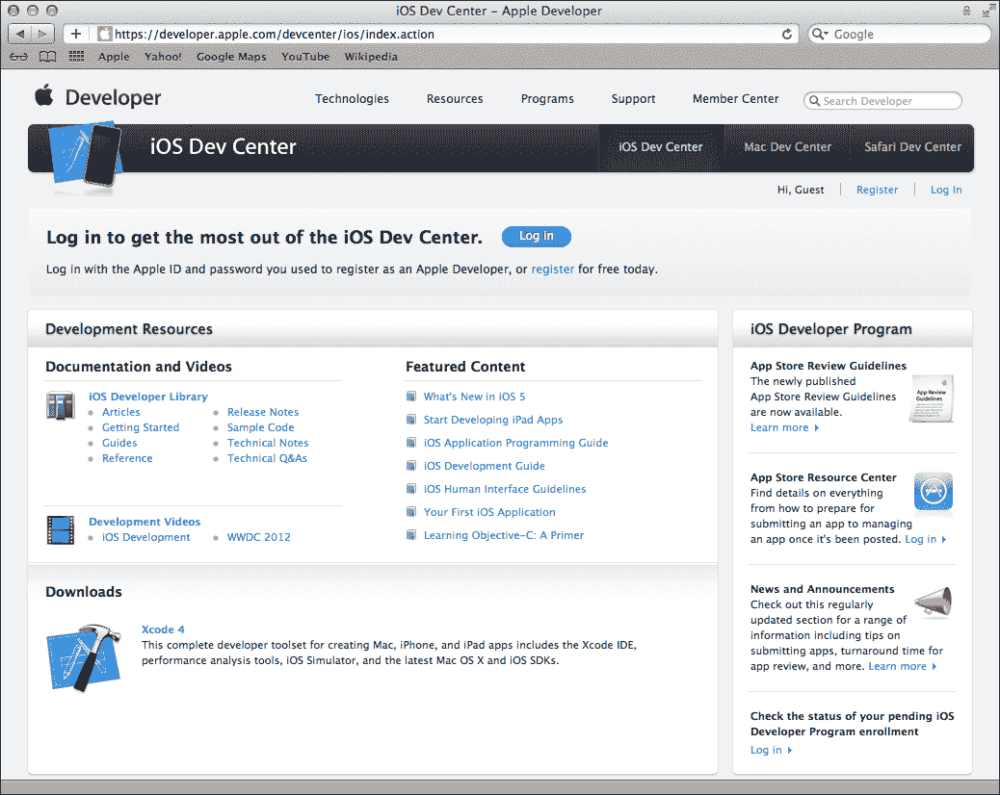

1.  注册后，您将能够下载 iOS SDK 并继续将其安装到您的电脑上。

1.  您也可以从以下链接的 Mac App Store 获取 Xcode [`itunes.apple.com/us/app/xcode/id497799835?mt=12`](http://itunes.apple.com/us/app/xcode/id497799835?mt=12)，具体取决于您是否选择了适用于 Mac OSX Lion 的版本。以下步骤中的安装过程显示了如何安装 Snow Leopard 的 iOS 开发工具。

1.  下载完 Snow Leopard 的 SDK 后，您可以继续安装它。您将需要接受一些许可协议。完成这些后，您需要做的就是选择安装的目标文件夹，然后点击 **继续** 按钮。

1.  如果您在安装阶段选择默认设置，各种工具将被安装在 `/Developer/Applications` 文件夹中。安装过程会带您通过自定义安装选项屏幕，如下面的截图所示：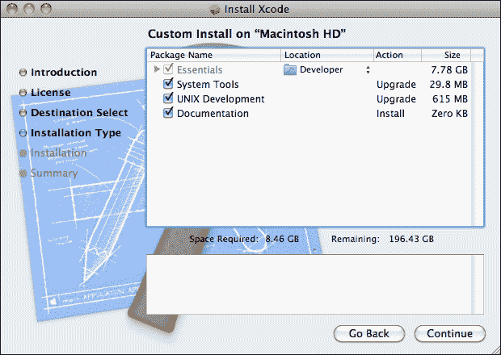

这些选项为您提供了对安装过程的一定程度的控制。例如，您可以选择您想要安装 Xcode 的文件夹位置，以及各种其他选项的设置。

## 工作原理...

现在一切都已经安装并准备就绪，我们的下一步是查看 Xcode 和 iOS SDK 中每个组件需要什么。

如本章**简介**部分所述，iOS SDK 由三个重要组件组成。主要组件是 Xcode IDE，这是苹果的 IDE，允许开发 iOS 和 Mac 平台的应用程序，并使用 Objective-C 作为默认编程语言。

此环境允许更好地集成和编辑源代码，以及构建、编译和调试您的应用程序。它包含许多可以帮助诊断您的 iOS 应用程序问题的工具。关于仪器的主题将在本书的后面部分介绍。IDE 包含一个设备信息窗口，称为**组织者 – 设备**，如下面的截图所示：

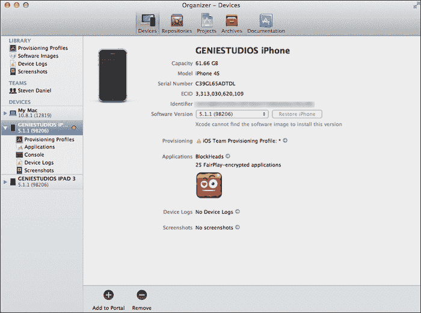

此屏幕是安装部署到设备进行测试或在苹果应用商店分发所需的各种证书和配置文件所必需的。使用**组织者 – 设备**窗口，您可以查看您应用程序的调试信息、崩溃日志，以及从设备截取屏幕截图的能力。

+   **界面构建器**：这是集成在 IDE 中的用户界面设计器。界面构建器为您提供了构建应用程序用户界面所需的所有必要功能。所有对象都存储在一个或多个资源文件中，并包含与每个对象的关联关系。您对表单设计所做的任何更改都会自动同步回您的代码。

+   **iOS 模拟器**：这是一个非常有用的工具，可以作为测试床来测试您的应用程序，而无需使用实际的设备，无论是 iPad 还是任何其他 iOS 设备。每次您构建和运行应用程序时，Xcode 都会自动将您的应用程序安装到 iOS 模拟器上并启动它。

    iOS 模拟器具有模拟不同 iOS 版本的能力，如果您的应用程序需要安装在不同的 iOS 平台上，或者测试和调试在不同 iOS 版本下运行时应用程序中报告的错误，这将变得极其有用。

## 还有更多...

以下列表提供了包含安装所需工具和信息的链接：

+   **苹果 iOS 开发者门户**：[`developer.apple.com/devcenter/ios/index.action`](https://developer.apple.com/devcenter/ios/index.action)

+   **苹果开发者工具信息**：[`developer.apple.com/technologies/tools/whats-new.html`](https://developer.apple.com/technologies/tools/whats-new.html)

## 参见

+   **编译您的项目**配方

+   **使用 Xcode 调试您的 iOS 应用程序**配方

+   在第十章*打包和部署您的应用程序*中的*使用配置文件在 iOS 设备上安装 iOS 应用程序*食谱，*打包和部署您的应用程序*，第十章。

+   在第十章*打包和部署您的应用程序*中的*使用 iTunes Connect 提交应用程序到 App Store*食谱，*打包和部署您的应用程序*，第十章。

# 使用 Xcode 创建 iOS 项目

在本食谱中，我们将看到使用 Xcode IDE 创建我们的第一个 iOS 应用程序项目是多么容易。

## 准备工作

现在我们已经安装了所有初步组件，我们将开始使用 Xcode 创建我们的第一个**HelloWorld**项目。

## 如何操作...

要开始创建新的 Xcode 项目，请执行以下简单步骤：

1.  从 `/Developer/Applications` 文件夹启动 Xcode。

1.  选择**创建新的 Xcode 项目**，或**文件** | **新建项目**。

1.  从可用模板列表中选择**单视图应用程序**，如图下所示：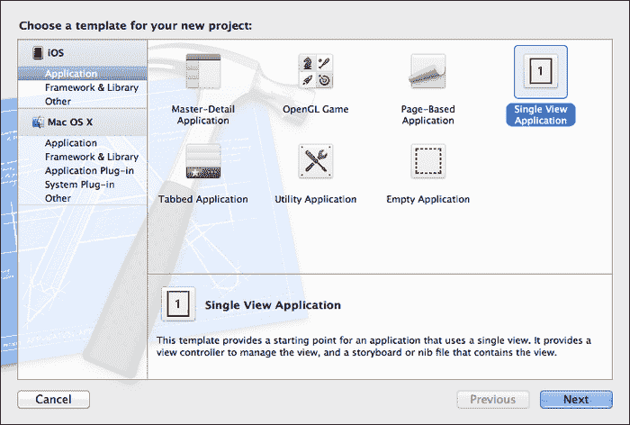

1.  点击**下一步**按钮以继续向导的下一步。

1.  接下来，将项目名称输入为 `HelloWorld`。

1.  从**设备**下拉菜单中选择**iPhone**。

1.  确保未勾选**使用 Storyboards**复选框。

1.  确保已勾选**使用自动引用计数**复选框。

1.  确保未勾选**包含单元测试**复选框。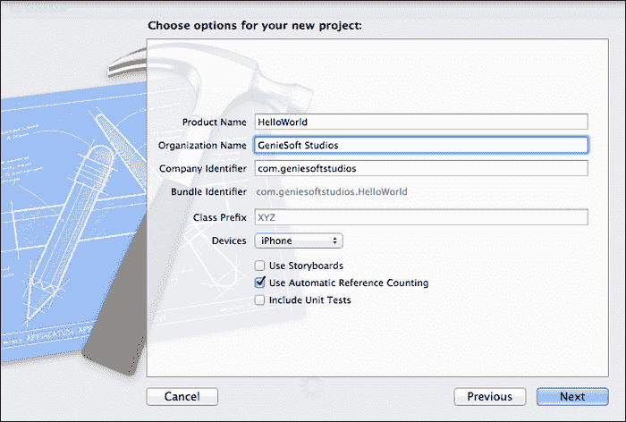

    ### 注意

    您的应用程序的公司标识符需要是唯一的。苹果建议您使用反向域名样式（例如，`com.domainName.appName`）。

1.  点击**下一步**按钮以继续向导的下一步。

1.  指定您想要保存项目的位置。

1.  然后，点击**创建**按钮以在指定位置保存您的项目。

一旦创建项目，您将看到 Xcode 开发环境以及模板为您创建的项目文件。如果您愿意，可以构建并运行应用程序。iOS 模拟器将启动并显示一个空白白色屏幕。

## 它是如何工作的...

现在我们已经创建了我们的**HelloWorld**项目，让我们花点时间看看模板向导为我们创建了什么。

当 Xcode 创建新的 iOS 项目时，它也会创建一系列文件。根据在此过程中选择哪些选项，可能会创建一些额外的文件。

以下截图显示了构成 iOS 项目一部分的基本文件列表：

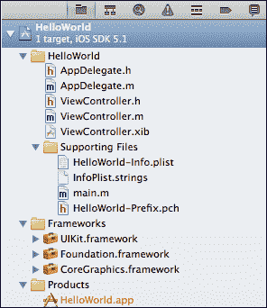

以下是需要注意的重要文件：

+   `main.m`

+   `AppDelegate.h` 和 `AppDelegate.m`

+   `ViewController.h` 和 `ViewController.m`

+   `HelloWorld-info.plist`

### main.m

主函数是程序运行时生命周期开始和结束的地方。`UIApplicationMainstarts` 函数运行循环，负责通过 `AppDelegate` 类向应用程序发送通知，并包含可以覆盖的各种事件处理器。此函数接受四个参数，并使用它们来初始化应用程序。

```swift
//  main.m
//  HelloWorld
//
//  Created by Steven F Daniel on 18/12/11.
//  Copyright (c) 2012GenieSoft Studios. All rights reserved.

#import <UIKit/UIKit.h>
#import "AppDelegate.h"

int main(int argc, char *argv[])
{
  @autoreleasepool {
  returnUIApplicationMain(argc, argv, nil, 
NSStringFromClass([AppDelegate class]));
  }
}
```

## 还有更多...

你会注意到在我们的主函数中，它包含了 `@autoreleasepool`，这是一个支持你的 iOS 设备内存管理系统的对象。接下来，我们包括了 `argc` 和 `argv[]` 参数。鉴于所有 iOS 应用都在图形界面中运行，而不是从命令行运行，这些参数只是简单地在这里，以便它们符合标准的 ANSI C 编码实践。

### 理解应用程序代理

应用程序代理实现了你的程序在应用程序生命周期中的关键点应该如何反应。代理负责在应用程序启动时初始化窗口，并在程序终止时进行清理。此类负责使主视图控制器显示，以及处理应用程序在挂起或恢复时的响应能力。

### 理解 ViewController 类

此文件实现了视图功能，包含与正在加载的视图相对应的类方法，以及可以覆盖的方法声明。在下面的表中，我们描述了此类中包含的一些方法：

| 方法名称 | 描述 |
| --- | --- |
| `viewDidLoad` | 此方法在视图控制器被加载时被调用，用于设置任何额外的对象。 |
| `viewDidUnload` | 此方法在视图从内存中卸载时被调用。 |
| `viewWillAppear` | 此方法在视图准备好在设备屏幕上出现，或者已经完全出现时被调用。 |
| `viewDidAppear` | 此方法在你想在视图完全出现在屏幕上后执行特定操作时被调用，例如执行某种过渡动画或声音。 |
| `shouldAutorotateToInterfaceOrientation` | 此方法通常在你想让你的应用程序支持多种屏幕方向时使用，即横屏或竖屏。 |

### 理解 ViewController.xib

XIB 文件是否可见取决于你在创建项目时是否选择了使用故事板。XIB 文件基本上是一个具有特定结构的 XML 文件，可以从 Interface Builder 中读取，并包含有关用户界面的各种信息，例如它包含的控件类型、它们的属性、出口等。

### 理解 HelloWorld-info.plist

此文件基本上是应用程序的设置文件，包含定义 iOS 应用程序各种设置的属性及其值。这些设置包含有关它将支持的方向、应用程序图标、支持的 iOS 版本以及应用程序可以安装的设备的信息。以下截图显示了在 Xcode 编辑器中双击此文件时的文件结构：

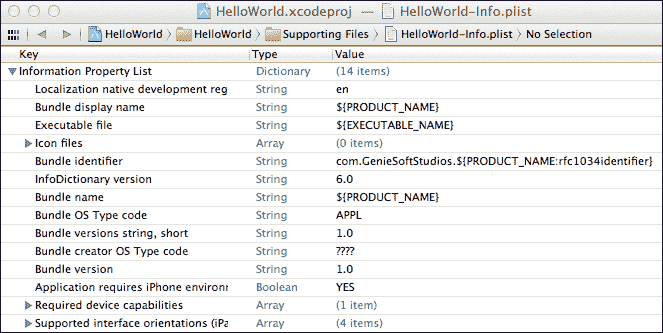

## 相关内容

+   *构建我们应用程序的用户界面*配方

+   *创建到界面构建器对象的出口*配方

+   第二章中的*添加和自定义视图*配方，*用户界面 – 创建 UI*

# 使用界面构建器创建用户界面

在这个配方中，我们将熟悉界面构建器应用程序。界面构建器是一个可视化工具，它使您能够为 iOS 应用程序设计用户界面。

使用界面构建器，您可以从库面板中将视图和对象拖放到画布区域。然后，可以使用出口和动作将它们连接起来，以便它们可以与代码进行程序性交互。

## 如何操作…

要在界面构建器和 Xcode 环境中显示我们的视图控制器，请执行以下简单步骤：

1.  从项目导航窗口中选择`ViewController.xib`文件。

1.  从 Xcode 工具栏中选择查看选项，如图下截图所示：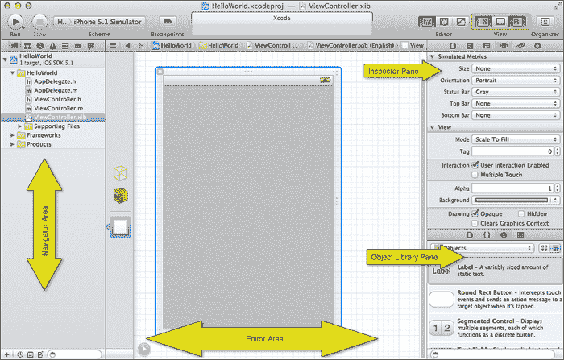

在前一个截图中，这显示了从项目导航窗口中选择 XIB 文件时界面构建器的样子。

## 工作原理…

每次您使用界面构建器设计用户界面时，从库面板中使用的任何对象都将连接到它们所属的 Xcode 项目。

如前一个截图所示，界面构建器工作区分为三个主要区域。以下表格简要说明了哪个区域用于哪些功能：

| 区域名称 | 描述 |
| --- | --- |
| 导航区域 | 这个区域显示与项目相关的所有文件。 |
| 编辑区域 | 这个区域是我们开始设计用户界面的地方。 |
| 检查器面板 | 这个区域是我们配置每个对象的地方。 |
| 库面板 | 这个区域是我们可以定位对象并将它们拖放到视图上的地方。这些对象包括`UILabel`、`UIButton`、`UITextField`等。 |

## 更多内容…

您可能已经注意到检查器面板窗口中的**模拟度量**部分，位于**属性**选项卡内。这个区域显示了我们的界面在设计师中的样子，以及最终在 iOS 设备上部署和运行时的样子。

在这里，您可以指定您的界面是否具有状态栏、工具栏，甚至导航栏。值得一提的是，如果您将**状态栏**选项设置为**无**，并不意味着我们的应用程序将没有状态栏启动。

### 注意

状态栏是出现在设备屏幕顶部的栏，向用户显示某些类型的信息，例如当前时间、电池状态、运营商名称等等。

## 参见

+   *构建我们应用程序的用户界面* 菜谱

+   *创建到 Interface Builder 对象的出口* 菜谱

+   在第二章的*添加和自定义视图*菜谱中，*用户界面 – 创建 UI*

# 构建我们应用程序的用户界面

在这个菜谱中，我们将学习如何构建我们的用户界面以及如何添加控件。

## 准备工作

现在我们已经成功创建了项目，我们可以开始使用 Interface Builder 设计器构建我们的用户界面。

## 如何操作...

使用 Interface Builder 创建我们应用程序的用户界面非常简单，可以通过执行以下简单步骤实现：

1.  从项目导航器窗口中选择**ViewController.xib**。

1.  从**对象库**中拖动一个（`Label`）控件到视图的画布上。

1.  然后，从**属性检查器**部分，修改**文本**属性为**名字**：。

1.  接下来，调整`Label`控件的尺寸，使其内容适应。

1.  然后，从**对象库**中拖动一个（`Textfield`）控件到视图中，并将其放置在**名字**标签的右侧，并调整`Textfield`控件的尺寸，使其足够宽，以适应字段内容。

1.  从**对象库**中拖动一个（`Label`）控件到视图的画布上。

1.  从**属性检查器**部分，修改**文本**属性为**姓氏**：。

1.  接下来，调整**Label**控件的尺寸，使其内容适应。

1.  然后，从**对象库**中拖动一个（`Textfield`）控件到视图中，并将其放置在**姓氏**标签的右侧，并调整`Textfield`控件的尺寸，使其足够宽，以适应字段内容。

1.  从**对象库**中拖动一个（`Label`）控件到视图的画布上，并将其放置在**姓氏**标签下方稍远的位置。

1.  从**属性检查器**部分，修改**文本**属性为**输出**：。

1.  接下来，调整`Label`控件的尺寸，使其大约与屏幕宽度相同。

1.  然后，从**对象库**中拖动一个（`Button`）控件到视图中，并将其放置在`Label`控件下方并居中。

1.  调整`Button`控件的尺寸，使其足够宽，以适应字段内容。

1.  从**属性检查器**部分，修改**标题**属性为**点击此处**。

1.  添加按钮后，通过选择菜单栏中的**文件** | **保存**来保存文档。主视图现在应该看起来像以下截图：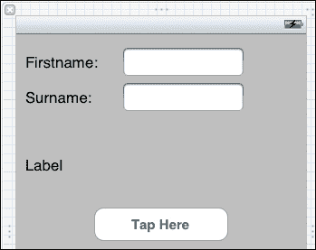

## 它是如何工作的…

如您所见，一旦习惯了，使用 Interface Builder 并不困难。每次您将对象拖放到视图中，您都会注意到光标上出现一个小绿色圆形十字，表示可以安全地将对象拖放到视图中。

从此视图，我们还可以调整控件的大小，以及修改与控件相关的属性。

## 参见

+   *构建我们应用程序的用户界面*配方

+   *创建与 Interface Builder 对象的出口*配方

+   *创建响应用户操作的响应动作*配方

# 创建与 Interface Builder 对象的出口

在本配方中，我们将更详细地研究出口以及如何使用它们与我们的 UI 进行通信。

## 准备工作

在我们前面的部分中，我们探讨了如何向我们的`ViewController`添加控件以形成用户界面的构建，以及为控件设置一些属性。在本节中，我们将探讨如何连接这些控件并在代码中访问这些控件。

## 如何操作…

创建与 Interface Builder 对象的出口是一个简单的过程，可以通过执行以下简单步骤来实现：

1.  通过选择**导航** | **在辅助编辑器中打开**或按*option* + *command* + *,*来打开辅助编辑器。

1.  确保在辅助编辑器窗口中显示`ViewController.h`接口文件。

1.  接下来，选择**姓名**（`Label`）控件，然后按住*command*键，将其拖入`ViewController.h`接口文件中，在括号和`@interface`和`@end`行之间。

1.  从**连接**下拉菜单中选择**出口**以创建连接类型。

1.  输入`lblFirstname`作为要创建的出口属性的名称。

1.  从**存储**下拉菜单中选择**强**，然后点击**连接**按钮。

1.  接下来，选择**姓名**（`Textfield`）控件，然后按住*command*键，将其拖入`ViewController.h`接口文件中。

1.  从**连接**下拉菜单中选择**出口**以创建连接类型。

1.  输入`txtFirstname`作为要创建的**出口**属性的名称。

1.  从**存储**下拉菜单中选择**强**，然后点击**连接**按钮。

1.  重复步骤 3 到 9 以添加**姓氏**、**标签**和**点击此处**按钮，并为每个提供如`lblSurname`、`txtSurname`、`lblOutput`和`btnTapHere`等名称。

    ### 注意

    每次创建出口时，都需要在花括号`{}`内创建这些。Interface Builder 设计器不会自动为您创建这些，因此您需要在创建出口之前添加这些。

    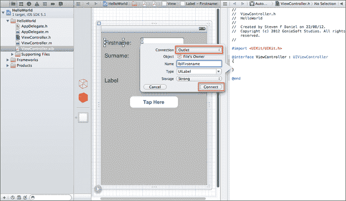

1.  一旦创建了必要的出口，最好通过选择**文件** | **保存**来保存您的项目，或者也可以按*Command* + *S*。

## 工作原理…

每当我们使用出口时，这些只是提供了一种方式，允许我们的界面构建器对象与代码进行通信。这是必要的，也是我们能够访问在界面构建器设计环境中创建的用户界面对象的唯一方式。

## 还有更多…

在声明出口时，我们还需要做另一件事，那就是为它们创建必要的属性。创建这些属性为我们提供了对这些控件访问的权限，并自动为我们的对象创建 getter 和 setter 方法。

创建接口构建器对象的属性与添加出口的过程类似，可以通过执行以下简单步骤实现：

1.  确保在辅助编辑器窗口中显示`ViewController.h`接口文件。

1.  接下来，选择**名字**（`Label`）控件，然后按住**command**键，将其拖动到`ViewController.h`接口文件末尾的闭合花括号处。

1.  从**连接**下拉菜单中选择要创建的连接类型**出口**。

1.  输入`lblFirstname`作为要创建的出口属性名称。

1.  从**存储**下拉菜单中选择**强**，然后点击**连接**按钮。

1.  接下来，选择**名字**（`Textfield`）控件，然后按住**command**键，将其拖动到`ViewController.h`接口文件中。

1.  从**连接**下拉菜单中选择要创建的连接类型**出口**。

1.  输入`txtFirstname`作为要创建的出口属性名称。

1.  从**存储**下拉菜单中选择**强**，然后点击**连接**按钮。

1.  重复步骤 3 到 9 以添加**姓氏**、**标签**和**点击此处**按钮，并为每个提供如`lblSurname`、`txtSurname`、`lblOutput`和`btnTapHere`等名称。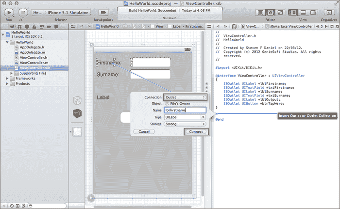

一旦创建了每个属性出口，完成的`ViewController.h`接口文件将类似于以下代码片段：

```swift
//  ViewController.h
//  HelloWorld
//
//  Created by Steven F Daniel on 22/08/12.
//  Copyright (c) 2012 GenieSoft Studios. All rights reserved.

#import <UIKit/UIKit.h>

@interface ViewController : UIViewController
{
    IBOutlet UILabel        *lblFirstname;
    IBOutlet UITextField  *txtFirstname;
    IBOutlet UILabel        *lblSurname;
    IBOutlet UITextField  *txtSurname;
    IBOutlet UILabel        *lblOutput;
    IBOutlet UIButton      *btnTapHere;
}

@property (strong, nonatomic) IBOutlet UILabel *lblFirstname;
@property (strong, nonatomic) IBOutlet UITextField *txtFirstname;
@property (strong, nonatomic) IBOutlet UILabel *lblSurname;
@property (strong, nonatomic) IBOutlet UITextField *txtSurname;
@property (strong, nonatomic) IBOutlet UILabel *lblOutput;
@property (strong, nonatomic) IBOutlet UIButton *btnTapHere;

@end
```

由于我们创建了出口，您会注意到界面构建器也为我们创建了每个出口，并在我们的`ViewController.m`实现文件中声明了这些，如下面的代码片段所示：

```swift
//  ViewController.m
//  HelloWorld
//
//  Created by Steven F Daniel on 22/08/12.
//  Copyright (c) 2012 GenieSoft Studios. All rights reserved.

#import "ViewController.h"

@interface ViewController ()

@end

@implementation ViewController
@synthesize lblFirstname;
@synthesize txtFirstname;
@synthesize lblSurname;
@synthesize txtSurname;
@synthesize lblOutput;
@synthesize btnTapHere;
```

## 参见

+   *使用界面构建器创建用户界面*菜谱

+   *构建我们应用程序的用户界面*菜谱

+   *创建响应用户动作的动作*菜谱

# 创建响应用户动作的动作

在这个菜谱中，我们将更详细地了解动作以及如何使用它们来响应用户操作。

## 准备工作

在我们之前的章节中，我们探讨了如何向我们的`ViewController`添加控件以构建用户界面，连接每个出口，以及为每个控件创建属性。在本节中，我们将探讨如何与这些出口通信，并在点击**点击此处**按钮时向用户显示消息。

## 如何做到这一点…

向界面对象添加动作的过程类似于添加出口，可以通过执行以下简单步骤来实现：

1.  通过选择**导航** | **在辅助编辑器中打开**或按*option* + *command* + *,*来打开辅助编辑器。

1.  确保在辅助编辑器窗口中显示`ViewController.h`接口文件。

1.  接下来，选择**点击此处**（按钮）控件，然后按住*command*键，将其拖动到`ViewController.h`接口文件中。

1.  从**连接**下拉菜单中选择**动作**以创建连接类型。

1.  为要创建的动作输入`btnTapHere`作为名称，并单击**连接**按钮。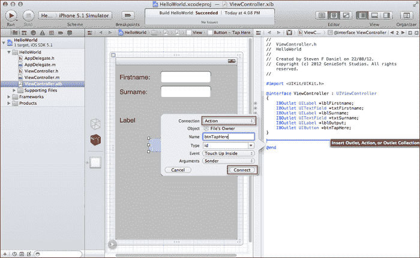

## 它是如何工作的…

每当在 Objective-C 中创建动作时，它们负责响应和执行其背后的相关代码。我们决定不将事件处理程序连接到按钮的`TouchUpInside`事件，而是将其添加到动作中，并自行处理输出。这类动作被称为实例方法。

## 更多内容…

我们下一步是向`btnTapHere`事件方法中添加代码，当此按钮被点击时，将向用户显示问候消息。执行以下步骤来完成此操作：

1.  从项目导航器打开`ViewController.m`实现文件。

1.  接下来，找到`btnTapHere`事件方法，并输入以下代码片段：

    ```swift
    - (IBAction)btnTapHere:(id)sender { 
        NSString *greeting = [NSStringstringWithFormat:@"Welcome 
                      To Xcode 4 Cookbook series %@ %@",txtFirstname.text, txtSurname.text];    
        lblOutput.text = greeting; 
        lblOutput.font = [UIFont boldSystemFontOfSize:21]; 
        lblOutput.textColor = [UIColorblueColor]; 
    }
    ```

在我们的代码片段中，我们创建了一个名为 greeting 的`NSString`对象值，然后使用`stringWithFormat`方法将我们的`firstname`和`surname`对象连接起来。接下来，我们将这个变量分配给输出标签，并应用字体大小和文本颜色。

## 参见

+   *编译您的项目*配方

+   *使用 Xcode 调试 iOS 应用程序*的配方

+   *使用 iOS 模拟器测试您的应用程序*的配方

# 编译您的项目

在本配方中，我们将查看如何使用 Xcode 编译我们的项目。

## 准备工作

Xcode 为编译您的应用程序提供了各种选项。在本节中，我们将查看这些选项。

## 如何操作...

每当您想要编译应用程序时，您可以选择让应用程序在 iOS 设备上运行，或者在每个 iPad 或 iPhone 的模拟器中运行。模拟器版本号取决于您在计算机上安装的 iOS SDK 版本。在 Xcode 4 中，每次您打开现有的 Xcode 项目或创建一个新的项目时，Xcode 都会自动为您创建一个默认方案。

此方案允许您在 iOS 模拟器中测试您的应用程序，或者将其部署到 iOS 设备。还可以创建其他方案，我们很快就会查看。

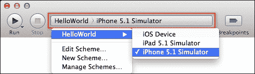

方案不是 Xcode 4 的新功能，它们自 Xcode 3 的早期版本以来就存在了。在 Xcode 的早期版本中，当设置活动目标、构建配置或甚至可执行文件时，您必须单独配置每个项目。

由于所有这些都相互关联，这引发了许多问题。这就是定义自己的方案的重要性所在。

方案可以被视为独立的配置，这意味着您可以为指定要构建的目标、要使用的配置构建以及当启动指定的产品时要使用的可执行环境创建方案（这可能是在针对特定的 iOS 版本，或者您想在 iOS 模拟器中运行应用程序时）。请执行以下步骤：

1.  要选择方案，您只需从方案弹出菜单中选择，如前一张截图所示。**HelloWorld**是我们创建项目时自动为我们创建的默认方案。

1.  为了创建一个新的方案，请选择**新建方案…**选项。或者，如果您想编辑活动方案，可以选择**编辑方案…**选项。这些选项也位于**产品**菜单下。

    每个方案都可以设置为执行特定任务。例如，您可能有一个用于设计构建的方案和一个用于处理发布或分发的方案。有各种类型的构建选项可用于构建、测试、运行、分析（使用仪器）和存档您的产品，然后可以提交到 App Store。您可以定义的方案数量没有限制。然而，一次只能有一个方案处于活动状态。

1.  您还可以通过选择**管理方案…**选项或类似地从**产品**菜单来管理方案。

您可以指定方案是否应按项目存储，如果是这样，这些方案将提供给包含该项目的每个工作区，或者您可以选择将其存储在当前工作区环境中。

以下截图显示了如何自定义活动方案。您可以指定要使用的构建配置类型、调试器类型以及要使用的当前工作目录。您还可以选择以更高的分辨率运行您的产品，这使您能够模拟应用程序在不同显示分辨率下运行。

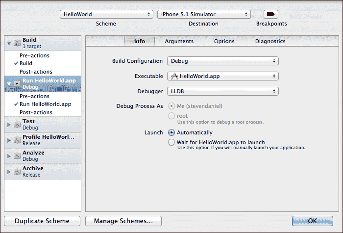

# 使用 iOS 模拟器测试您的应用程序

在本食谱中，我们将探讨如何使用 iOS 模拟器运行我们的**HelloWorld**应用程序。

## 准备工作

现在，让我们使用 iOS 模拟器运行我们的应用程序。确保项目窗口已打开，并且您已选择活动方案配置为**HelloWorld** | **iPhone Simulator**。

## 如何操作…

接下来，通过从**产品**菜单中选择**运行**或按*command* + *R*来构建和运行应用程序。

编译完成后，iOS 模拟器将自动出现，我们刚刚创建的应用程序将显示出来。填写文本字段，然后点击**点击此处**按钮查看结果。

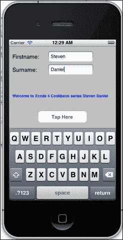

## 它是如何工作的…

iOS 模拟器是一个出色的工具，它允许开发者无需实际设备即可测试他们的应用程序。每次您在 Xcode IDE 中使用 iOS 模拟器构建和运行应用程序时，Xcode 都会自动为您在 iOS 模拟器中安装应用程序。

iOS 模拟器的另一个优点是它能够模拟不同的 iOS 版本，如果您的应用程序需要安装在不同的 iOS 平台上，以及测试和调试在不同 iOS 版本下运行时应用程序中报告的错误，这将非常有用。

值得注意的是，在 iOS 模拟器上进行测试仅适用于第一轮测试，因为它甚至没有运行 iOS 代码，并且比实际设备更宽容（例如，通常文件名不区分大小写（遵循 Mac 文件系统规则）），您可以在任何地方写入文件。在模拟器上的测试永远不能替代在设备上的测试。

最后，您只是在运行一个在 Intel 处理器上运行的 Mac OS X 应用程序中的应用程序。它与在设备上运行 iOS 相去甚远。它对于在开发过程中捕获明显错误或进行快速测试很有用，但您仍然需要进行设备测试。

## 参见

+   关于*编译您的项目*的配方

+   关于*使用 Xcode 调试 iOS 应用程序*的配方

+   在第十章中，关于*注册 iOS 设备进行测试*的配方，*打包和部署您的应用程序*

+   在第十章中，关于*创建开发配置文件*的配方，*打包和部署您的应用程序*

+   在第十章中，关于*使用配置文件在 iOS 设备上安装应用程序*的配方，*打包和部署您的应用程序*

# 配置和使用编译器指令

在 C/C++中，我们使用指令来包含应用程序需要访问的任何其他头文件。这是通过使用`#include`指令来完成的。在 Objective-C 中，我们使用`#import`指令。如果您检查`ViewController.h`文件的内容，您会注意到文件顶部有一个`#import`语句。

```swift
#import <UIKit/UIKit.h>

@interface ViewController : UIViewController
{
    IBOutlet UILabel     *lblFirstname;
    IBOutlet UITextField *txtFirstname;
    IBOutlet UILabel     *lblSurname;
    IBOutlet UITextField *txtSurname;
    IBOutlet UILabel     *lblOutput;
    IBOutlet UIButton    *btnTapHere;
}
```

`#import`语句被称为预处理器指令。如前所述，在 C/C++中，您会使用`#include`预处理器指令将文件内容包含在当前源文件中。在 Objective-C 中，您会使用`#import`指令语句来实现相同的结果，但编译器确保文件只包含一次。

要从 Xcode 框架库中导入头文件，您需要在`#import`语句中使用尖括号（`<>`）指定头文件名。

如果您想导入包含您自己的方法的自定义构建的头文件，您可以使用双引号（`""`）进行指定和使用，如下面的示例代码所示：

```swift
#import <UIKit/UIKit.h>
#import "MyClass.h" 

@interface ViewController : UIViewController {
}
```

在这个菜谱中，我们将探讨另一种方法，我们可以使用指令根据您自己定义的条件预处理器标志有条件地编译代码。这使得您能够选择性地启用应用程序的部分，而不会使您的代码看起来杂乱。

## 准备工作

在`HelloWorld-Prefix.pch`中，我们将首先声明一些宏（这样您就不需要在代码中添加`#ifdef/#endif`块）。`HelloWorld-Prefix.pch`文件具有全局作用域，因此您在那里定义的任何函数都将可用于所有类，这非常有用。

## 如何操作...

为您的应用程序声明编译器指令是一个非常简单的过程，可以通过执行以下简单步骤实现：

1.  从项目导航器中打开位于支持文件组下的`HelloWorld-Prefix.pch`实现文件。

1.  接下来，将以下高亮代码片段添加到该文件中：

    ```swift
    //
    // Prefix header for all source files of the 'HelloWorld' target in the 'HelloWorld' project
    //

    #import <Availability.h>

    #ifndef __IPHONE_4_0
    #warning "This project uses features only available in iOS SDK 4.0 and later."
    #endif

    #ifdef __OBJC__
        #import <UIKit/UIKit.h>
        #import <Foundation/Foundation.h>
    #endif

    #ifdef DISPLAY_FIRSTNAME
    #warning "This application will display the value of the First namefield."
    #else
    #warning "This application will display the values of both the First name and Surname fields."
    #endif

    ```

1.  接下来，我们需要修改我们的`btnTapHere`方法，使其被`#ifdef`语句包围，在`ViewController.m`实现文件中，如下所示：

    ```swift
    - (IBAction)btnTapHere:(id)sender { 
    #ifdef DISPLAY_FIRSTNAME 
          NSLog(@"Using the Firstname field."); 
          NSString *greeting = [NSString stringWithFormat:@"Welcome to Xcode 4 Cookbook series  %@",txtFirstname.text];
    #else
        NSLog(@"Using Firstname and Surname  fields."); 
         NSString *greeting = [NSString  stringWithFormat:@"Welcome to Xcode 4 Cookbook series %@ %@",txtFirstname.text, txtSurname.text]; 
    #endif 

    lblOutput.text = greeting;
    lblOutput.font = [UIFont boldSystemFontOfSize:21];
    lblOutput.textColor = [UIColorblueColor];
    }
    ```

每次您只想显示用户的第一个名字时，您只需通过定义条件标志将其设置为`YES`。

## 它是如何工作的…

在 Objective-C 中使用编译器指令时，它们负责响应并执行`#ifdef`和`#endif`标签封装的关联代码片段。

如果您只想在测试期间强制使用一组`NSLog`消息或值，而不在应用程序的最终发布版本中显示，这尤其方便。这些类型可以使用的其他一些场景是，如果您正在创建一个游戏，并且希望在游戏的试用版或轻量版中禁用一些功能。

## 还有更多…

为了让您的应用程序使用此编译器指令，我们需要将此预处理器标志添加到**预处理器宏**部分，如下所示：

1.  从项目导航器窗口中选择**HelloWorld**项目。

1.  接下来，选择**HelloWorld**项目，然后单击**构建设置**选项卡。

1.  然后，滚动到**Apple LLVM 编译器 4.0 – 预处理**部分。

1.  双击**调试**部分，然后添加`DISPLAY_FIRSTNAME=YES`预处理器标志。

1.  通过在项目窗口外部单击来关闭此窗口。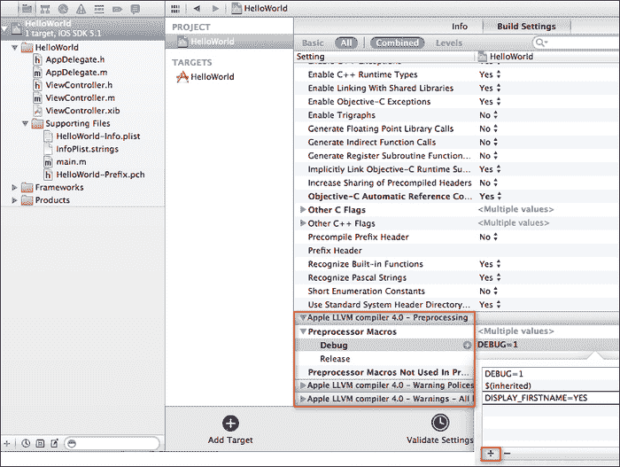

    这就是全部内容，很简单。如果您想关闭`DISPLAY_FIRSTNAME`（例如，当您准备进行最终发布构建时），只需回到这个部分并从项目首选项中移除该标志。

1.  接下来，通过从 **Product** 菜单中选择 **Run** 或通过按 *command* + *R* 并输入 **Firstname** 和 **Surname** 的值来构建并运行应用程序。您应该看到一个只显示您名字的首字母的欢迎信息。

## 参见

+   *编译您的项目* 的配方

+   *使用 Xcode 调试您的 iOS 应用程序* 的配方

+   *使用 iOS 模拟器测试您的应用程序* 的配方

# 使用 Xcode 调试您的 iOS 应用程序

在本配方中，我们将展示如何在 Xcode 和 iOS 模拟器中轻松调试应用程序。

## 准备工作

Xcode 4 为您提供了一个调试器，用于使用 iOS 模拟器或实际 iOS 设备调试您的应用程序。在本配方中，我们将看到调试 **HelloWorld** 应用程序是多么容易。

## 如何做到这一点…

使用 Xcode 开发环境调试您的应用程序是一个简单的过程，它允许您监控应用程序变量的更改，以及逐行执行源代码，可以通过执行以下简单步骤实现：

1.  从项目导航器中打开 `ViewController.m` 实现文件。

1.  接下来，定位到 `btnTapHere` 事件方法，并在如下截图所示的灰色区域中设置一个断点。

1.  您会注意到在您放置标记的行上出现了一个箭头。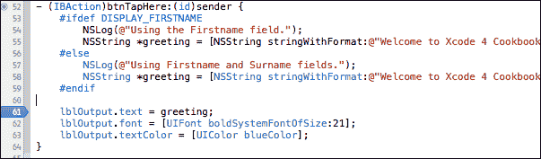

1.  接下来，通过从 **Product** 菜单中选择 **Run** 或通过按 *command* + *R* 来构建并运行应用程序。

1.  填充 **Firstname** 和 **Surname** 字段，并点击 **Tap Here** 按钮。

1.  您会注意到我们的应用程序执行已暂停，调试器已停止在我们设置断点的行。

1.  将鼠标悬停在断点行中的 `greeting` 变量上，以查看 **greeting** 标签的内容。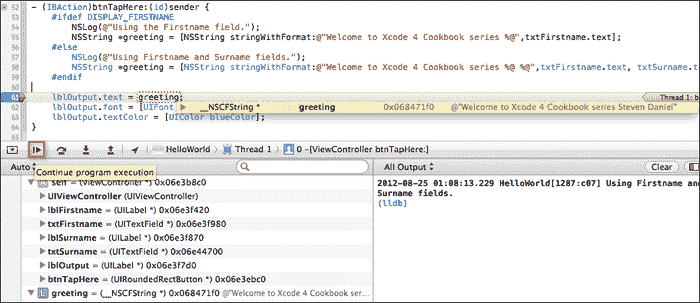

1.  要继续应用程序的执行，请点击 **继续程序执行** 按钮。

## 它是如何工作的…

虽然您可以使用调试器在任何时候暂停程序的执行并查看程序变量的状态，但在运行应用程序之前设置断点会更好。

断点基本上是一条指令，告诉应用程序在达到断点时 *停止*。在此阶段，您的代码执行暂停，等待进一步的指令以确定下一步操作。在此阶段，您有机会检查任何属性的当前值，或者逐行执行代码。

## 参见

+   如果您想了解更多关于 Xcode 调试功能的信息，您可以参考位于[`developer.apple.com/library/ios/#documentation/ToolsLanguages/Conceptual/Xcode4UserGuide/060-Debug_Your_App/debug_app.html`](http://developer.apple.com/library/ios/#documentation/ToolsLanguages/Conceptual/Xcode4UserGuide/060-Debug_Your_App/debug_app.html)`#//apple_ref/doc/uid/TP40010215-CH3-SW1.`的 Apple 开发者文档。

# 使用 Clang 静态分析器检查您的代码

在本节中，我们将探讨如何使用 Clang 静态分析器工具检查我们的代码语法中的错误。

## 准备工作

有时候您可能想检查代码语法中的错误。这就是静态分析器工具派上用场的地方。这个工具最初是在 Xcode 3.x 中引入的，并在新窗口中打开并显示构建结果。

Xcode 4 允许您在 Xcode 4 工作区环境中执行代码分析、检查结果以及将修复应用到源文件中。

## 如何操作…

要运行静态分析器，请执行以下简单步骤：

1.  从项目导航器窗口中选择**HelloWorld**项目。

1.  打开`ViewController.m`实现文件。

1.  定位到`btnTapHere`方法，并输入以下修改后的代码片段：

    ```swift
    - (IBAction)btnTapHere:(id)sender {
     UIColor *color;
     int colorIndex;

    #ifdef DISPLAY_FIRSTNAME
          NSLog(@"Using the Firstname field.");
          NSString *greeting = [NSString stringWithFormat:
    @"Welcome to Xcode 4 Cookbook series %@",
    txtFirstname.text];
    #else
          NSLog(@"Using Firstname and Surname fields.");
          NSString *greeting = [NSString stringWithFormat:
    @"Welcome to Xcode 4 Cookbook series %@ %@",
    txtFirstname.text, txtSurname.text];
     #endif

    if (colorIndex == 1) {
          lblOutput.textColor = [UIColor redColor];
    }
    else if (colorIndex == 2) {
          lblOutput.textColor = [UIColor blueColor];        
    }
    else if (colorIndex == 2) {
          lblOutput.textColor = [UIColor purpleColor];
    }
    else {
          lblOutput.textColor = [UIColor blueColor];
        }

          lblOutput.text = greeting;
          lblOutput.font = [UIFont boldSystemFontOfSize:21];
    }
    ```

1.  从**产品**菜单中选择**分析**，或者按住**Shift** + **command** + **B**键组合。

## 它是如何工作的…

当分析器完成对您的代码进行问题检查后，问题导航器会自动打开，并显示在您的项目中找到的问题列表。这可以在以下屏幕截图中看到：

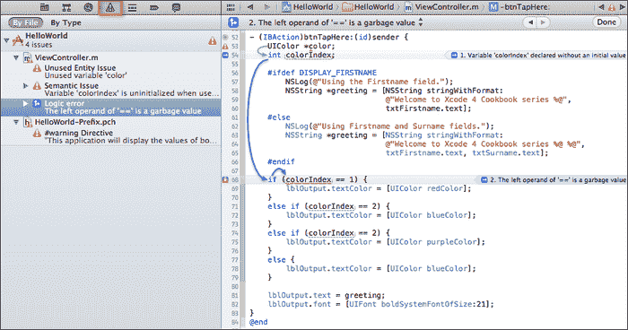

在左侧窗格中单击问题将打开相关文件，并显示用蓝色三角形标记的问题。单击此三角形将显示静态分析器识别和检测到的错误逻辑流程，如前一个屏幕截图所示。

静态分析器已标记`colorIndex`变量存在潜在错误。这是由于变量在声明时未初始化，并包含一些随机值。

您还会注意到，当您点击消息气泡时，分析器会提供更多详细信息，并显示控制流，如箭头所示。这为您提供了完整的错误诊断。静态分析器工具报告的许多问题都有这些信息，使得分析和修复这些错误变得容易得多。

### 注意

如果您想了解更多关于静态分析器的信息，您可以参考位于[`developer.apple.com/library/ios/#recipes/xcode_help-source_editor/Analyze/Analyze.html`](http://developer.apple.com/library/ios/#recipes/xcode_help-source_editor/Analyze/Analyze.html)的 Apple 开发者文档。

## 参见

+   编译您的项目食谱

+   使用 Xcode 调试您的 iOS 应用的配方

+   使用 iOS 模拟器测试您的应用的配方

+   [注册您的 iOS 设备以进行测试](https://ch10.html "第十章。打包和部署您的应用")的配方在*第十章*，*打包和部署您的应用*

+   [创建开发配置文件](https://ch10.html "第十章。打包和部署您的应用")的配方在*第十章*，*打包和部署您的应用*

+   [使用配置文件在 iOS 设备上安装应用](https://ch10.html "第十章。打包和部署您的应用")的配方在*第十章*，*打包和部署您的应用*
