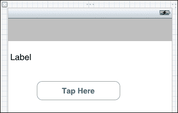
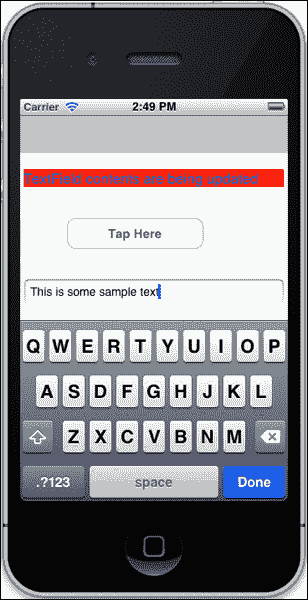
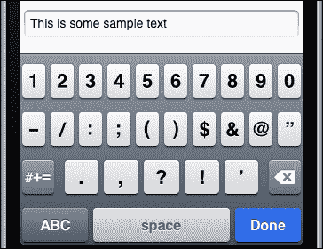
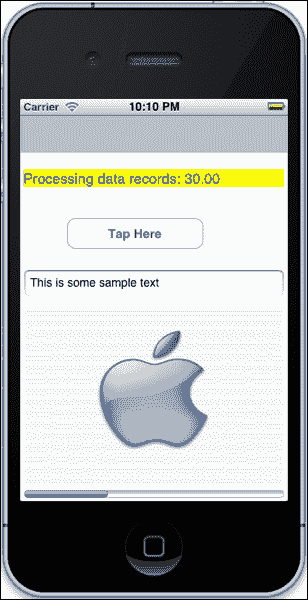
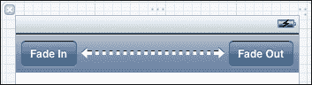
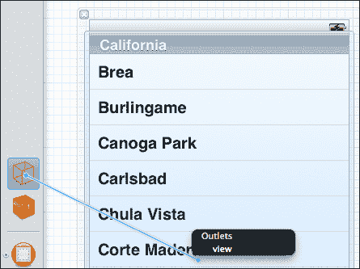
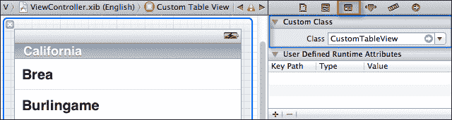
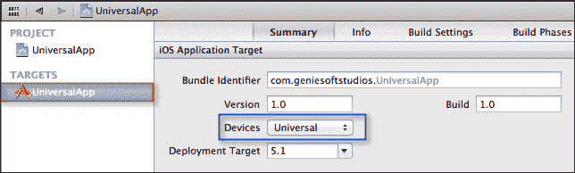
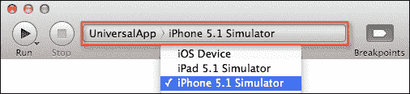

# 第二章 用户界面 – 创建 UI

在本章中，我们将涵盖：

+   添加和自定义视图

+   使用标签显示文本

+   通过按钮获取用户输入

+   在视图中显示图像

+   显示和编辑文本

+   使用 iOS 设备键盘

+   向用户显示进度

+   将工具栏对象添加到视图中

+   视图淡入淡出

+   创建自定义表格视图控制器

+   将表格视图添加到视图控制器

+   处理不同的 iOS 设备

# 简介

应用程序的用户界面由视图和其他元素组成，当用户加载您的应用程序时，这是用户首先看到的，并为他们提供了一个与您的应用程序进行通信的简单方式。

用户界面由画布组成，充当用户可以与之通信的控件占位符。在大多数实际应用中，仅视图本身是不够的。Apple 为您提供了一个名为`UIViewController`的类，该类负责管理视图。

视图控制器可以响应设备通知，例如确定设备何时旋转，或者提供不同的方式来显示和关闭多个视图或甚至其他视图控制器。

我们还将了解如何使用一些最常用的视图控制器来创建我们自己的自定义类。在本章中，我们将探讨如何添加和自定义视图，以及将这些视图应用于淡入淡出效果。我们还将查看一些设备特定的方面，以确定其当前的方向。

# 添加和自定义视图

在本食谱中，我们将探讨如何使用 Interface Builder 将新的`UIView`对象添加到现有视图中，并查看如何自定义它。

## 准备工作

我们将首先使用 Xcode 创建一个新项目，然后使用 Interface Builder 帮助我们添加一个新的`UIView`对象，让我们开始吧。

## 如何做...

要开始创建新的 Xcode 项目，请执行以下简单步骤：

1.  从`/Developer/Applications`文件夹中启动 Xcode。

1.  选择**创建新的 Xcode 项目**，或点击**文件** | **新建项目**。

1.  从可用模板列表中选择**单视图应用程序**。

1.  点击**下一步**按钮以继续向导的下一步。

1.  接下来，将项目名称输入为`ViewObjectsExample`。

1.  从**设备**下拉菜单中选择**iPhone**。

1.  确保未勾选**使用故事板**复选框。

1.  确保已勾选**使用自动引用计数**复选框。

1.  确保未勾选**包含单元测试**复选框。

1.  点击**下一步**按钮以继续向导的下一步。

1.  指定您希望保存项目的位置。

1.  然后，点击**创建**按钮以在指定位置保存您的项目。

一旦创建项目，您将看到 Xcode 开发环境以及模板为您创建的项目文件。

接下来，我们需要开始构建我们的用户界面，这可以通过执行以下简单步骤实现：

1.  从项目导航窗口中选择`ViewController.xib`文件。

1.  从**对象库**中，将一个**视图**对象拖放到主视图中。

1.  接下来，为这个视图创建必要的出口和属性，并将其命名为`subView`。

1.  接下来，选择我们刚刚添加的新视图，并从**大小检查器**选项卡中，将**Y**属性设置为**44**点，**宽度**属性设置为**320**点，**高度**属性设置为**480**点。

1.  接下来，通过选择**文件** | **保存**，或通过按*command* + *S*来保存您的项目。

1.  然后，通过从**产品**菜单中选择**产品** | **运行**来构建和运行应用程序，或通过按*command* + *R*。

当编译完成后，iOS 模拟器将显示我们刚刚创建并显示的应用程序，其中包含一个白色背景的视图。

## 它是如何工作的...

我们刚刚创建了一个包含子视图的应用程序，它不提供任何功能。在 iOS 应用程序中，视图是构成应用程序用户界面的重要组件之一，它继承自`UIView`类层次结构。

值得注意的是，使用 Interface Builder 添加视图与通过代码动态创建视图相比会发生什么，我们很快就会看到。使用 Interface Builder 添加的视图在运行时实例化，并使用在**大小检查器**窗口中手动设置的值设置`Frame`属性。`Frame`属性的类型是`CGRect`，它定义了视图在主窗口中的位置，以及其大小（以点为单位）。

## 还有更多...

`UIView`类继承自负责响应和处理事件的`UIResponder`类。当一个视图被添加到现有视图时，它成为其响应链的一部分。`UIView`类公开了`UIResponder`类的属性和相关方法。

### 注意

如果您想了解更多关于`UIResponder`类的信息，可以参考位于[`developer.apple.com/library/ios/#documentation/UIKit/Reference/UIResponder_Class/Reference/Reference.html`](http://developer.apple.com/library/ios/#documentation/UIKit/Reference/UIResponder_Class/Reference/Reference.html)`#//apple_ref/occ/cl/UIResponder`的 Apple 开发者文档。

视图也可以通过使用`UIView`类的`addSubView`方法通过代码程序化地添加。以下代码行显示了如何实现这一点：

```swift
[self.view addSubview:self.subView];
```

如前一行代码片段所示，`addSubview` 方法将添加的视图的 `Superview` 对象设置为指向调用者。视图只有在使用 `addSubview` 方法添加到主父视图后才会显示。将相同的视图添加到另一个视图会导致 `Superview` 对象更改并指向新的视图的父窗口。这是因为视图在任何给定时间只能存在于一个 `Superview` 对象中。

### 注意

值得注意的是，当使用 Interface Builder 手动添加视图时，您不需要使用 `addSubview:` 方法来显示子视图，这取决于您是否已经将其添加到您想要放置的父视图的子视图中。

当通过代码程序化添加视图时，它们也可以通过代码删除。这可以通过在视图中调用`removeFromSuperview`方法来实现。以下代码行显示了如何实现这一点：

```swift
[self.subView removeFromSuperview];
```

## 参见

+   使用标签显示文本的配方

+   在第一章的*构建我们应用程序的用户界面*配方中，第一章，*获取和安装 iOS SDK 开发工具*

+   在第一章的*创建到 Interface Builder 对象的出口*配方中，*获取和安装 iOS SDK 开发工具*

# 使用标签显示文本

在这个配方中，我们将探讨我们如何使用标签向用户显示信息性文本。

## 准备工作

`UILabel`对象是我们让用户知道正在发生什么的一种方式。这可以是在我们请求用户输入他的/她的用户名或密码时，或者如果出现问题，通知他/她。

## 如何操作……

为了看到这是如何实现的，我们需要修改我们在上一个配方中创建的**ViewObjectsExample**应用程序。执行以下步骤：

1.  打开`ViewObjectsExample.xcodeproj`项目文件。

1.  从项目导航器窗口中选择`ViewController.xib`文件。

1.  从**对象库**中，将一个**标签**对象拖放到子视图中。

1.  调整`Label`控件的大小，使其内容填充视图的宽度。

1.  接下来，为这个`Label`控件创建出口和属性，并将其命名为`lblInfo`。

1.  我们接下来的步骤是创建负责设置标签属性的代码功能，并使用一些默认值。

1.  从项目导航器打开`ViewController.m`实现文件。

1.  接下来，创建`updateLabel`方法，如下面的代码片段所示：

    ```swift
    -(void)updateLabel
    {
     lblInfo.text = @"Press button to change the background color";
     lblInfo.textColor = [UIColor blueColor];
     lblInfo.textAlignment = NSTextAlignmentLeft;
     lblInfo.adjustsFontSizeToFitWidth = TRUE;
     lblInfo.font = [UIFont fontWithName:@"Arial-Bold" size:17];
    }
    ```

1.  然后，在`theviewDidLoad`方法中添加以下代码片段，如下所示：

    ```swift
    - (void)viewDidLoad
    {
       [super viewDidLoad];

        // Do any additional setup after loading the view, 
        // typically from a nib.
        [self updateLabel];
    }
    ```

1.  然后，通过从**产品**菜单选择**产品** | **运行**，或者通过按*command* + *R*来构建和运行应用程序。

## 它是如何工作的……

我们已经成功地将一个`UILabel`对象添加到我们的视图中，并添加了一些代码来更新内容。我们首先创建了一个负责自定义标签属性的方法，然后我们将需要显示的文本分配给标签控件的文本属性。

在我们的下一步中，我们使用`UIColor`类的值将`Label`控件的`textColor`属性设置为蓝色，然后我们设置`textAlignment`属性，以便我们的标签内容将显示为左对齐。

最后，我们将标签的`adjustFontSizeToFitWidth`属性设置为`TRUE`，以指示标签自动更改字体大小，以便它能够适应标签的宽度。接下来，我们在`viewDidLoad`方法中添加对这个方法的调用，以在运行时更新标签内容。

## 更多内容…

使用标签，你可以设置你想要文本显示的字体；这是通过使用`UIFontfontWithName`方法设置`font`属性来实现的。`string`参数表示要设置的字体名称和样式，而`size`属性参数确定字体大小。如果你看看以下代码行，你可以看到如何将标签的字体设置为`Arial-Bold`和大小为`17`点，如下所示：

```swift
 [UIFont fontWithName:@"Arial-Bold" size:17];
```

如果输入的字体名称未找到，`fontWithName`方法返回 nil，这将导致异常，如果标签的`font`属性设置为 nil。

### 注意

如果你想了解更多关于`UIFont`类的信息，你可以参考位于[`developer.apple.com/library/IOs/#documentation/UIKit/Reference/UIFont_Class/Reference/Reference.html`](http://developer.apple.com/library/IOs/#documentation/UIKit/Reference/UIFont_Class/Reference/Reference.html)的 Apple 开发者文档。

## 参见

+   显示和编辑文本的配方

+   使用按钮获取用户输入的配方

+   在第一章的*构建应用程序的用户界面*配方中，*获取和安装 iOS SDK 开发工具*

+   在第一章的*创建到 Interface Builder 对象的出口*配方中，*获取和安装 iOS SDK 开发工具*

# 使用按钮获取用户输入

在这个配方中，我们将看看我们如何使用按钮来更改我们在上一个配方中定义的`UILabel`控件的内容。

## 准备工作

在这个配方中，我们将首先创建一个`UIButton`对象，该对象将用于在点击时修改标签的背景颜色。

## 如何做…

为了了解如何实现这一点，我们需要修改我们在上一个配方中创建的**ViewObjectsExample**应用程序。执行以下步骤：

1.  打开`ViewObjectsExample.xcodeproj`项目文件。

1.  从项目导航窗口中选择`ViewController.xib`文件。

1.  从 **对象库** 中拖动一个 **圆形矩形按钮** 对象到子视图中，并将其放置在我们之前添加的标签下方。

1.  在 **属性检查器** 部分中，将 **标题** 属性修改为 **点击此处**。

1.  接下来，为这个 **圆形矩形按钮** 对象创建出口和属性，并将其命名为 `btnTapHere`。

1.  接下来，为 **点击此处** 按钮创建动作方法，并将其命名为 `btnTapHere`。

1.  在添加按钮后，通过从菜单栏选择 **文件** | **保存** 或通过按 *command* + *S* 来保存文档。此时主视图应类似于以下截图：

我们的下一步是创建负责更改标签背景颜色的代码功能：

1.  从项目导航器打开 `ViewController.m` 实现文件。

1.  接下来，创建 `btnTapHere` 方法，如下面的代码片段所示：

    ```swift
    - (IBAction)btnTapHere:(UIButton *)sender {
    [self.lblInfo setBackgroundColor:[UIColor yellowColor]];
    }
    ```

1.  然后，通过从 **产品** 菜单选择 **产品** | **运行** 或通过按 *command* + *R* 来构建并运行应用程序。

## 它是如何工作的…

我们首先向用户界面添加了一个按钮，当按钮被按下时，它会改变标签的背景内容。然后我们调用 `setBackgroundColor` 方法将背景颜色应用到标签上。

### 注意

如果你想了解更多关于 `UIButton` 类的信息，可以参考位于 [`developer.apple.com/library/ios/#documentation/uikit/reference/UIButton_Class/UIButton/UIButton.html`](http://developer.apple.com/library/ios/#documentation/uikit/reference/UIButton_Class/UIButton/UIButton.html) 的 Apple 开发者文档。

## 还有更多...

`setBackgroundColor` 方法提供的功能也可以通过在 Interface Builder 中的 **属性检查器** 选项卡中设置 **背景** 字段来实现。

## 相关内容

+   *添加和自定义视图* 的配方

+   *使用标签显示文本* 的配方

+   *在视图中显示图像* 的配方

+   第一章 中的 *构建应用程序的用户界面* 配方，*获取和安装 iOS SDK 开发工具*

+   第一章 中的 *创建到 Interface Builder 对象的出口* 配方，*获取和安装 iOS SDK 开发工具*

# 在视图中显示图像

在这个配方中，我们将探讨如何使用 `UIImageView` 类在视图中显示图像。

## 准备工作

在这个配方中，我们将首先创建一个 `UIImageView` 对象，它将用作显示图像的容器。在这个例子中，我们将使用名为 `Blue-Aqua-Apple.png` 的图像文件。

## 如何操作...

为了了解如何实现这一点，我们需要修改之前配方中创建的 **ViewObjectsExample** 应用程序。执行以下步骤：

1.  打开 `ViewObjectsExample.xcodeproj` 项目文件。

1.  从项目导航器窗口中选择 `ViewController.xib` 文件。

1.  从 **对象库** 中，将一个 **UIImageView** 对象拖放到子视图中，并将其放置在我们之前添加的 `Round Rect Button` 对象下方。

1.  调整 `UIImageView` 控件的大小，使其足够大以容纳图片。

1.  接下来，为这个 `UIImageView` 创建出口和属性，并将其命名为 `imgPicture`。

1.  然后，选择 **文件** | **将文件添加到 "ViewObjectsExample"…**，或者通过按 *option* + *command* + *A* 键。

1.  选择要添加的 **Blue-Aqua-Apple.png** 图片文件，然后点击 **添加** 按钮。

我们接下来的步骤是创建负责在 `imageView` 控件中显示图片的代码功能：

1.  从项目导航器打开 `ViewController.m` 实现文件。

1.  接下来，创建 `displayImage` 方法，如下面的代码片段所示：

    ```swift
    -(void)displayImage
    {
     [self.imgPicture setImage:[UIImage imageNamed:@"Blue-Aqua-Apple.png"]];
     [self.imgPicture setContentMode:UIViewContentModeScaleAspectFit];
    }
    ```

1.  然后，在 `viewDidLoad` 方法中添加以下代码行：

    ```swift
    [self displayImage];
    ```

1.  然后，通过从 **产品** 菜单中选择 **产品** | **运行**，或者通过按 *command* + *R* 键来构建和运行应用程序。

当编译完成后，iOS 模拟器将出现，显示我们刚刚添加到项目中的图片。

## 它是如何工作的…

`UIImageView` 类基本上是一个针对显示图片而定制的视图。然后，我们将 `imageView` 类的 `contentMode` 属性设置为 `UIViewContentModeScaleAspectFit`，这将缩放并填充图片以适应整个 `UIImageView` 的内容。

### 注意

如果你想了解更多关于 `UIImageView` 类的信息，可以参考位于 [`developer.apple.com/library/ios/#documentation/UIKit/Reference/UIImageView_Class/Reference/Reference.html`](http://developer.apple.com/library/ios/#documentation/UIKit/Reference/UIImageView_Class/Reference/Reference.html) 的 Apple 开发者文档。

`contentMode` 属性接受一个名为 `UIViewContentMode` 的枚举类型。以下表格解释了这些类型中的一些：

| 内容模式 | 描述 |
| --- | --- |
| `ScaleToFill` | 这是默认值。它将内容缩放到适合视图的大小，必要时更改宽高比。 |
| `ScaleAspectFit` | 这会将内容缩放到适合视图的大小，同时保持其宽高比。视图的剩余区域变为透明。 |
| `ScaleAspectFill` | 这会将内容缩放到填充视图的大小，同时保持其宽高比。 |

## 更多内容…

`UIImage` 类是表示图像相关信息的对象。以下表格显示了它目前支持的一些文件格式：

| 文件格式 | 文件扩展名 |
| --- | --- |
| 可移植网络图形 | `.png` |
| 联合图像专家小组 | `.jpg`, `.jpeg` |
| 标签图像文件格式 | `.tiff`, `.tif` |
| GIF 图像交换格式 | `.gif` |
| Windows 位图格式 | `.bmp` |
| 窗口图标格式 | `.ico` |

## 参见

+   *添加和自定义视图*菜谱

+   在第七章的*从相册选择图片和视频*菜谱中，*多媒体资源*

+   在第七章的*使用相机捕获媒体*菜谱中，*多媒体资源*

# 显示和编辑文本

在这个菜谱中，我们将学习如何使用文本块方法来确定何时开始和结束编辑。

## 准备工作

在这个菜谱中，我们将讨论`UITextField`对象的用法以及我们如何在其中显示可编辑文本。

## 如何做到这一点…

为了了解如何实现这一点，我们需要修改我们在上一个菜谱中创建的**ViewObjectsExample**应用程序。执行以下步骤：

1.  打开`ViewObjectsExample.xcodeproj`项目文件。

1.  从项目导航器窗口中选择`ViewController.xib`文件。

1.  从**对象库**中拖动一个**TextField**对象到子视图中，并将其放置在我们之前添加的`UIButton`下方。

1.  调整`TextField`控件宽度，使其足够大，可以容纳足够的文本。

1.  接下来，为这个`TextField`创建出口和属性，并将其命名为`txtTextInput`。

我们下一步是创建代码功能，该功能将负责在我们的`TextField`控件中显示一些文本：

1.  从项目导航器打开`ViewController.m`实现文件。

1.  接下来，创建`populateTextBox`方法，如下面的代码片段所示：

    ```swift
    -(void)populateTextBox {
      self.txtTextInput.text = @"This is some sample text";
      self.txtTextInput.returnKeyType = UIReturnKeyDone;
      self.txtTextInput.delegate = self;
    }
    ```

1.  然后，在`viewDidLoad`方法中添加以下行代码：

    ```swift
    [self populateTextBox];
    ```

我们下一步是修改我们的`ViewController.h`接口文件，以便我们可以访问我们的文本框的方法。这可以通过执行以下简单步骤来实现：

1.  从项目导航器打开`ViewController.h`接口文件。

1.  接下来，输入以下代码片段：

    ```swift
    //  ViewController.h
    //  ViewObjectsExample
    //  Created by Steven F Daniel on 15/09/12.
    //  Copyright (c) 2012 GenieSoft Studios. All rights reserved.

    #import<UIKit/UIKit.h>

    @interface ViewController : UIViewController <UITextFieldDelegate>
    {
     IBOutlet UITextField *txtTextInput;
    }
    @property (weak, nonatomic) IBOutlet UITextField *txtTextInput;
    ```

接下来，我们需要修改我们的`ViewController.m`实现文件，以包括我们的文本框的方法事件。这可以通过执行以下简单步骤来实现：

1.  从项目导航器打开`ViewController.m`实现文件。

1.  接下来，输入以下代码片段：

    ```swift
    -(BOOL)textFieldShouldReturn:(UITextField *)textField {

        // Dismisses the keyboard when the "Done" button is clicked
        [textField resignFirstResponder];
        return YES;
    }
    ```

    ```swift
    -(void) textFieldDidBeginEditing:(UITextField *)textField
    {
       lblInfo.text = @"TextField contents are being updated";
       [self.lblInfo setBackgroundColor:[UIColor redColor]];
    }

    -(void)textFieldDidEndEditing:(UITextField *)textField
    {
     lblInfo.text = @"TextField contents have now been updated.";
     [self.lblInfo setBackgroundColor:[UIColor greenColor]];
    }
    ```

1.  然后，通过从**产品**菜单选择**运行**或按*command* + *R*键来构建和运行应用程序。

编译完成后，iOS 模拟器将出现并显示带有我们填充的示例文本的文本框，如下面的截图所示：



## 它是如何工作的…

在以下代码片段中，我们更新了`textField`控件的文本属性，然后将`returnKeyType`属性设置为在点击**完成**按钮时关闭键盘，并设置控件的代理为我们的视图控制器：

```swift
-(void)populateTextBox {
  self.txtTextInput.text = @"This is some sample text";
  self.txtTextInput.returnKeyType = UIReturnKeyDone;
  self.txtTextInput.delegate = self;
}
```

接下来，`UITextField` 类提供了一个显示可编辑文本的对象。为了我们能够响应文本框的事件，我们需要定义一个名为 `UITextBoxDelegate` 的协议类，它将作为文本框的代理，这样我们就可以确定文本何时被修改。

```swift
@interface ViewController : UIViewController <UITextFieldDelegate>
{
 IBOutlet UITextField *txtTextInput;
}
@property (weak, nonatomic) IBOutlet UITextField *txtTextInput;
```

在下面的代码片段中，我们声明了我们的 `TextField` 控件的 `textFieldShouldReturn:` 方法。此方法处理在按下 **完成** 按钮时关闭键盘，这是通过在 `TextField` 控件上调用 `resignFirstResponder` 方法来实现的，导致控件失去焦点。

```swift
-(BOOL)textFieldShouldReturn:(UITextField *)textField {

    // Dismisses the keyboard when the "Done" button is clicked
    [textField resignFirstResponder];
    return YES;
}
```

接下来，我们声明我们的 `TextField` 控件的 `textFieldDidBeginEditing:` 和 `textFieldDidEndEditing:` 方法。这些方法负责确定文本何时在文本字段中更新，以及何时编辑完成，这通常是在键盘关闭时完成的。

```swift
-(void) textFieldDidBeginEditing:(UITextField *)textField
{
   lblInfo.text = @"TextField contents are being updated";
   [self.lblInfo setBackgroundColor:[UIColor redColor]];
}

-(void)textFieldDidEndEditing:(UITextField *)textField
{
 lblInfo.text = @"TextField contents have now been updated.";
 [self.lblInfo setBackgroundColor:[UIColor greenColor]];
}
```

## 更多内容...

Objective-C 中的代理是一个符合特定协议的特定类型的对象。这意味着它是一个封装了一个或多个方法（以及/或其他成员）的对象，这些方法充当事件处理器。

## 相关内容

+   *使用 iOS 设备键盘* 的食谱

# 使用 iOS 设备键盘

在这个食谱中，我们将学习如何设置一些不同的虚拟键盘样式。

## 准备工作

在这个食谱中，我们将讨论 `UITextBox` 对象的用法以及我们如何在其中显示可编辑文本。

## 如何操作...

为了看到如何实现这一点，我们需要修改我们在上一个食谱中创建的 **ViewObjectsExample** 应用程序。执行以下步骤：

1.  打开 `ViewObjectsExample.xcodeproj` 项目文件。

1.  从项目导航器打开 `ViewController.m` 实现文件。

1.  接下来，修改 `populateTextBox` 方法，如以下代码片段中突出显示的行所示：

    ```swift
    -(void)populateTextBox {
      self.txtTextInput.text = @"This is some sample text";
     self.txtTextInput.keyboardType = 
     UIKeyboardTypeNumbersAndPunctuation;
      self.txtTextInput.returnKeyType = UIReturnKeyDone;
      self.txtTextInput.delegate = self;
    }
    ```

1.  然后，通过从 **产品** 菜单中选择 **产品** | **运行**，或者通过按 *command* + *R* 来构建并运行应用程序。

当编译完成后，iOS 模拟器将出现并显示带有我们填充的示例文本的文本框。点击 `TextField` 控件以显示我们指定的键盘类型。



## 工作原理…

在以下代码片段中，我们更新了 `TextField` 控件的 `keyboardType` 属性，并指定 `UIKeyboardTypeNumbersAndPunctuation` 作为要使用的键盘类型。

```swift
-(void)populateTextBox {
  self.txtTextInput.text = @"This is some sample text";
  self.txtTextInput.keyboardType = 
  UIKeyboardTypeNumbersAndPunctuation;
  self.txtTextInput.returnKeyType = UIReturnKeyDone;
  self.txtTextInput.delegate = self;
}
```

`keyboardType` 属性接受一个名为 `UIKeyboardType` 的枚举类型。以下表格解释了其中的一些类型：

| 键盘类型 | 描述 |
| --- | --- |
| `UIKeyboardTypeDefault` | 当前输入方法的默认键盘 |
| `UIKeyboardTypeASCIICapable` | 显示标准 ASCII 字符 |
| `UIKeyboardTypeNumbersAndPunctuation` | 显示数字和标点符号键盘 |
| `UIKeyboardTypeURL` | 显示针对 URL 输入优化的键盘 |
| `UIKeyboardTypeNumberPad` | 显示为 PIN 输入设计的数字键盘 |
| `UIKeyboardTypePhonePad` | 显示专为输入电话号码设计的键盘 |
| `UIKeyboardTypeNamePhonePad` | 显示专为输入人名或电话号码设计的键盘 |
| `UIKeyboardTypeEmailAddress` | 显示专为指定电子邮件地址优化的键盘 |
| `UIKeyboardTypeDecimalPad` | 显示带有数字和小数点的键盘 |
| `UIKeyboardTypeTwitter` | 显示专为 twitter 文本输入优化的键盘，易于访问`@`和`#`字符 |
| `UIKeyboardTypeAlphabet` | 这已被弃用，但使用显示标准 ASCII 字符的键盘 |

### 注意

如果您想了解更多关于`UIKeyboardType`类的信息，可以参考位于[`developer.apple.com/library/ios/#DOCUMENTATION/UIKit/Reference/UITextInputTraits_Protocol/Reference/UITextInputTraits.html`](http://developer.apple.com/library/ios/#DOCUMENTATION/UIKit/Reference/UITextInputTraits_Protocol/Reference/UITextInputTraits.html)的 Apple 开发者文档。

## 相关内容

+   *添加和自定义视图*配方

+   *通过使用按钮获取用户输入*配方

+   *显示和编辑文本*配方

# 向用户显示进度

在本配方中，我们将学习如何显示任何给定长度的进度。

## 准备工作

在本配方中，我们将讨论`UIProgressBar`对象的用法以及如何使用相关属性来显示动画进度条。

## 如何做到这一点...

为了了解如何实现这一点，我们需要修改之前在配方中创建的**ViewObjectsExample**应用程序。执行以下步骤：

1.  打开`ViewObjectsExample.xcodeproj`项目文件。

1.  从项目导航器窗口中选择`ViewController.xib`文件。

1.  从**对象库**中拖动一个**ProgressView**对象到子视图中，并将其放置在之前添加的`UIImageView`下方。

1.  调整`ProgressViewcontrol`的大小，使其宽度与视图相同。

1.  接下来，为这个`ProgressView`创建出口和属性，并将其命名为`pgbProgress`。

我们下一步是创建负责显示进度和动画条的功能代码：

1.  从项目导航器打开`ViewController.m`实现文件。

1.  在以下代码片段中输入变量声明的高亮部分：

    ```swift
    #import "ViewController.h"

    @interface ViewController ()

    @end

    @implementation ViewController

    @synthesize subView;
    @synthesize lblInfo;
    @synthesize pgbProgress;
    @synthesize imgPicture;
    @synthesize txtTextInput;

    float incrementBy = 0.0;

    ```

1.  接下来，修改`btnPressMe`方法，如下面的代码片段中高亮显示的行所示：

    ```swift
    - (IBAction)btnTapHere:(UIButton *)sender {

     [self fillProgressBar];
     [self.lblInfo setBackgroundColor:[UIColor yellowColor]];
    }
    ```

1.  接下来，输入以下代码片段：

    ```swift
    - (void)fillProgressBar {

     [self.pgbProgress setProgress:(incrementBy = 0.0f)];
     [NSTimer scheduledTimerWithTimeInterval:0.5 target:self selector:@selector(incrementBar:) userInfo:nil repeats:YES];
    }

    -(void)incrementBar:(NSTimer *)timer
    {
     incrementBy += 10.0f;
            [pgbProgress setProgress:(incrementBy / 100)];
     if (incrementBy > 100.0) {
         self.lblInfo.text = @"Processing has been Completed";
         [timer invalidate];
     }
     else
     {
         self.lblInfo.text = [NSString stringWithFormat:@"Processing data records: %3.2f",  (pgbProgress.progress * 100)];
     }
    }
    ```

1.  然后，通过从**产品**菜单选择**产品** | **运行**，或者通过按*command* + *R*来构建并运行应用程序。

编译完成后，iOS 模拟器将出现。点击**点击此处**按钮以查看进度条逐渐填充，如下面的代码片段所示：



## 它是如何工作的…

在以下代码行中，我们声明一个 `float` 变量 `incrementBy`。这个变量将由我们的方法用来逐渐增加并填充进度条。

```swift
float incrementBy = 0.0;

```

接下来，我们修改我们的 `btnTapHere:` 方法，包括对 `fillProgressBarmethod` 方法的调用，该方法将负责处理，并调用其他方法来逐渐填充条。

```swift
- (IBAction)btnTapHere:(UIButton *)sender {

 [self fillProgressBar];
 [self.lblInfo setBackgroundColor:[UIColor yellowColor]];
}
```

在我们的下一个代码片段中，`fillProgressBar` 方法将 `incrementBy` 变量初始化为 `0`，以确保条不会完全填充。然后我们使用 `scheduledTimerWithTimeInterval` 方法，这是 `NSTimer` 类的一个类方法，用于创建计时器。

`NSTimer` 是一个在运行循环中安排运行的对象，以便它可以定期检查经过的时间。当经过足够的时间后，它就会触发。如果计时器被设置为非重复的，那么它会取消安排自己，否则它会清除其经过的时间并等待再次触发。接下来，我们指定以秒为单位的持续时间来调用 `incrementBar:` 方法，如 `selector` 属性所指定，并持续调用此方法，直到计时器被无效化。

```swift
- (void)fillProgressBar {

 [self.pgbProgress setProgress:(incrementBy = 0.0f)];
 [NSTimer scheduledTimerWithTimeInterval:0.5 target:self selector:@selector(incrementBar:) userInfo:nil repeats:YES];
}
```

在我们的最终代码片段中，我们首先将 `incrementBar` 变量设置为填充进度条值所需的增量步骤数，然后更新 `ProgressView` 的 `progress` 属性。接下来，我们检查是否达到了条阈值，然后相应地更新标签，最后使 `timer` 对象无效，以防止方法被调用。

或者，如果我们还没有达到我们的阈值，我们更新 `Label` 对象以显示进度条的当前进度。

```swift
-(void)incrementBar:(NSTimer *)timer
{
 incrementBy += 10.0f;
        [pgbProgress setProgress:(incrementBy / 100)];
 if (incrementBy > 100.0) {
     self.lblInfo.text = @"Processing has been Completed";
     [timer invalidate];
 }
 else
 {
     self.lblInfo.text = [NSString
stringWithFormat:@"Processing data records: %3.2f", (pgbProgress.progress * 100)];
 }
}
```

### 注意

如果你想了解更多关于 `NSTimer` 类的信息，你可以参考位于 [`developer.apple.com/library/ios/#documentation/Cocoa/Reference/Foundation/Classes/NSTimer_Class/Reference/NSTimer.html`](https://developer.apple.com/library/ios/#documentation/Cocoa/Reference/Foundation/Classes/NSTimer_Class/Reference/NSTimer.html) 的苹果开发者文档。

## 更多...

`UIProgressView` 类支持一种额外的样式。这可以通过将 `progressViewStyle` 属性设置为 `UIProgressViewStyleBar` 来指定。这样修改后，进度条将看起来像苹果邮件应用中可以看到的那样。

## 相关内容

+   *添加和自定义视图* 的配方

+   *使用标签显示文本* 的配方

+   *通过按钮使用来获取用户输入* 的配方

# 将工具栏添加到视图中

在本配方中，我们将学习如何在我们的应用程序中添加和使用工具栏。

## 准备工作

在本配方中，我们将讨论 `Toolbar` 对象的使用以及我们如何使用关联的属性来显示动画进度条。

## 如何操作...

为了看到这是如何实现的，我们需要修改我们在前一个配方中创建的 **ViewObjectsExample** 应用程序。执行以下步骤来完成此操作：

1.  打开`ViewObjectsExample.xcodeproj`项目文件。

1.  从项目导航器窗口中选择`ViewController.xib`文件。

1.  从**对象库**中拖动一个**Toolbar**对象到主视图控制器中，并将其放置在主视图的顶部。

1.  接下来，选择默认包含的按钮，并将它的**标题**属性设置为**淡入**。

1.  接下来，在**淡入**按钮右侧的工具栏中添加一个`Flexible Space Bar Button Item`对象。

1.  然后，从**对象库**中拖动一个**UIBarButtonItem**对象到工具栏中，并将其放置在`Flexible Space Bar Button Item`对象之后。

1.  接下来，选择按钮，并将它的**标题**属性设置为**淡出**。

1.  接下来，为**淡入**和**淡出**按钮创建出口和属性，并将它们命名为`btnFadeIn`和`btnFadeOut`。

1.  接下来，为**淡入**和**淡出**按钮创建动作方法，并将它们命名为`viewFadeIn`和`viewFadeOut`。

1.  在创建按钮出口和属性后，通过从菜单栏中选择**文件** | **保存**来保存文档，或者通过按*command* + *S*键来保存。布局应类似于以下截图：

我们接下来的步骤是创建代码功能，该功能将负责更新标签以显示在工具栏中按下的按钮：

1.  从项目导航器中打开`ViewController.m`实现文件。

1.  修改`viewFadeIn`和`viewFadeOut`方法，如下面的代码片段所示：

    ```swift
    - (IBAction)viewFadeIn:(UIBarButtonItem *)sender {
    lblInfo.text = @"Fade In button clicked.";
    }

    - (IBAction)viewFadeOut:(UIBarButtonItem *)sender {
    lblInfo.text = @"Fade Out button clicked.";
    }
    ```

1.  然后，通过从**产品**菜单中选择**产品** | **运行**来构建和运行应用程序，或者通过按*command* + *R*键来运行。

当编译完成后，iOS 模拟器将出现。点击工具栏中的两个按钮，以查看标签根据哪个按钮被点击而更新。

## 工作原理...

`UIToolbar`对象用于包含与`UIBarButtonItem`对象类型相关的项。这些类型的对象是特殊的按钮和间隔符。`UIBarButtonItem`对象可以是系统定义的或自定义类型，并且可以使用在 Interface Builder 中**标识符**属性中列出的任何预定义类型，并为按钮提供特定的图标。

`UIBarButtonItem`对象还可以自定义以包含图像，使您的应用程序更加专业和直观。这可以通过在 Interface Builder 中使用**Image**属性来实现。

## 更多内容...

`UIBarButtonItem`类有一个样式属性，用于确定按钮的样式。它只能在按钮项的标识符设置为**自定义**时使用。您可以将按钮的样式属性设置为`UIBarButtonItemStyle`类型中的任何一种。

## 参见

+   *添加和自定义视图*菜谱

+   *使用标签显示文本*菜谱

# 视图淡入和淡出

在本教程中，我们将探讨如何对视图执行一些复杂的动画。这些动画非常适合构建和增强用户体验，为您的应用程序产生平滑的动画效果。

## 准备工作

`UIView`动画是构建视图当前状态和更改状态之间视觉桥梁的完美构建块。使用视图，您可以创建连接这些视图的动画。以下是一些示例：

+   在屏幕上移动视图

+   更新视图的框架和边界坐标

+   将视图的内容拉伸以填充屏幕区域

+   改变视图的 alpha 值以支持透明度

+   隐藏或显示一个视图

+   改变视图的顺序以显示哪个视图在前

+   对视图执行变换和旋转

## 如何操作...

为了看到我们的视图淡入和淡出，我们需要修改我们在上一个教程中创建的**ViewObjectsExample**应用程序。执行以下步骤来完成此操作：

1.  打开`ViewObjectsExample.xcodeproj`项目文件。

1.  从项目导航器中选择`ViewController.m`实现文件。

1.  接下来，修改`viewFadeIn`方法，如下面的代码片段所示：

    ```swift
    - (IBAction)viewFadeIn:(UIBarButtonItem *)sender {

     [UIView beginAnimations: @"Fade In" context:nil];
     [UIView setAnimationDuration:2.0];
     [self.subView setAlpha:1.0f];
     [UIView commitAnimations];

     // Disable our FadeIn Button since we are processing
     [self.btnFadeOut setEnabled:YES];
     [self.btnFadeIn  setEnabled:NO];
    }
    ```

1.  接下来，修改`viewFadeOut`方法，如下面的代码片段所示：

    ```swift
    - (IBAction)viewFadeOut:(UIBarButtonItem *)sender {

     [UIView beginAnimations: @"Fade Out" context:nil];
     [UIView setAnimationDuration:2.0];
     [self.subView setAlpha:0.0f];
     [UIView commitAnimations];

     [self.btnFadeOut setEnabled:NO];
     [self.btnFadeIn setEnabled:YES];
    }
    ```

1.  然后，将以下代码片段中高亮的代码行添加到`viewDidLoad`方法中：

    ```swift
    - (void)viewDidLoad
    {
        [super viewDidLoad];

     // Do any additional setup after loading the view, typically from a nib.
     [self updateLabel];
     [self displayImage];
     [self populateTextBox];

     [self.pgbProgress setProgress:0.0 animated:YES];
     [self.btnFadeOut setEnabled:YES];
     [self.btnFadeIn setEnabled:NO];
    }
    ```

1.  然后，通过从**产品**菜单中选择**产品** | **运行**，或者通过按*command* + *R*来构建和运行应用程序。

当编译完成后，iOS 模拟器将出现。点击工具栏上的两个按钮，可以看到子视图开始淡入或淡出。

## 工作原理…

在下面的代码片段中，我们使用`beginAnimations`方法标记动画块的开始，并指定`Fade In`动画类型，在将图形上下文设置为 nil 之前。然后，我们使用`setAnimationDuration`指定动画的长度（以秒为单位），并通过将`setAlpha`设置为`1.0`来设置 alpha 透明度层，使其变得可见。

最后，我们使用`commitAnimations`方法来指示所有要动画化的属性都已设置，并开始动画，然后相应地启用/禁用工具栏按钮。

```swift
- (IBAction)viewFadeIn:(UIBarButtonItem *)sender {

 [UIView beginAnimations: @"Fade In" context:nil];
 [UIView setAnimationDuration:2.0];
 [self.subView setAlpha:1.0f];
 [UIView commitAnimations];

 // Disable our FadeIn Button since we are processing
 [self.btnFadeOut setEnabled:YES];
 [self.btnFadeIn  setEnabled:NO];
}
```

接下来，我们使用`beginAnimations`方法标记动画块的开始，并指定`Fade Out`动画类型，在将图形上下文设置为 nil 之前。然后，我们使用`setAnimationDuration`指定动画的长度（以秒为单位），并通过将子视图的`setAlpha`设置为不可见来设置 alpha 透明度层，使其逐渐淡出。

最后，我们使用`commitAnimations`方法来指示所有要动画化的属性都已设置，并开始动画，并在工具栏中启用我们的**Fade In**按钮。

```swift
- (IBAction)viewFadeOut:(UIBarButtonItem *)sender {

 [UIView beginAnimations: @"Fade Out" context:nil];
 [UIView setAnimationDuration:2.0];
 [self.subView setAlpha:0.0f];
 [UIView commitAnimations];

 [self.btnFadeOut setEnabled:NO];
 [self.btnFadeIn setEnabled:YES];
}
```

### 注意

如果您想了解更多关于 `UIView` 动画的信息，可以参考位于 [`developer.apple.com/library/ios/#documentation/uikit/reference/uiview_class/UIView/UIView.html`](http://developer.apple.com/library/ios/#documentation/uikit/reference/uiview_class/UIView/UIView.html)`#//apple_ref/doc/uid/TP40006816-CH3-SW131` 的 Apple 开发者文档。

## 参见

+   *添加和自定义视图* 菜谱

+   *向视图添加工具栏* 菜谱

# 创建自定义表格视图控制器

在这个菜谱中，我们将学习如何创建 `UITableViewController` 类的子类，并使用它来填充 `UITableView` 控制器。

## 准备工作

`UITableViewController` 类提供了一个完美的方法，让您能够灵活地管理表格视图，并为我们的基本控制器添加共享其继承类的能力。为了实现这一点，我们需要将 `UITableView` 类的方法纳入其中。

## 如何操作...

首先，我们需要创建一个新的 Xcode 项目。这可以通过执行以下简单步骤来实现：

1.  创建一个新的 **单视图应用程序** 项目，并将其命名为 `TableViewExample`。

1.  接下来，选择 `TableViewExample` 文件夹，选择 **文件** | **新建** | **新建文件…** 或按 *command* + *N*。

1.  从模板列表中选择 **Objective-C 类** 模板。

1.  点击 **下一步** 按钮继续向导的下一步。

1.  将要创建的文件命名为 `TableViewController`。

1.  确保您已从 **子类** 下拉菜单中选择创建子类的类型为 **UITableViewController**。

1.  确保未选中 **针对 iPad** 复选框。

1.  确保未选中 **使用 XIB 进行用户界面** 复选框。

1.  点击 **下一步** 按钮继续向导的下一步。

1.  点击 **创建** 按钮将文件保存到指定的文件夹位置。

## 工作原理…

我们在这里所做的是向我们的 **TableViewExample** 应用程序添加一个新的 `TableViewController` 类，它为我们提供了必要的表格视图方法，我们可以使用这些方法与 `TableView` 控件进行交互。

## 参见

+   *向视图控制器添加表格视图* 菜谱

+   在 第一章 的 *使用 Xcode 创建 iOS 项目* 菜谱中，*获取和安装 iOS SDK 开发工具*

# 向视图控制器添加表格视图

在这个菜谱中，我们将学习如何向现有的视图控制器添加 `UITableView` 对象。

## 准备工作

`UITableView` 对象为您提供了以列表形式显示数据的接口。

## 如何操作...

为了向我们的视图控制器添加表格视图，我们需要修改我们在上一个菜谱中创建的 **TableViewExample** 应用程序。执行以下步骤来完成此操作：

1.  打开 `TableViewExample.xcodeproj` 项目文件。

1.  接下来，更改`ViewController`类的继承方式，如图中突出显示的代码行所示：

    ```swift
    @interface ViewController : UITableViewController

    ```

1.  接下来，从项目导航窗口中选择`ViewController.xib 文件`。

1.  然后，通过选择它并按**删除**键来删除视图控制器中的当前视图。

1.  接下来，从**对象库**中拖动一个**TableView**对象到绘图区域。

1.  按住**控制**键，从**文件所有者**对象拖动到`UITableView`，如图所示：

1.  从弹出面板中选择**视图**并释放按钮。这将我们将刚刚添加的`TableView`连接到**文件所有者**对象的视图输出。

我们的下一步是修改`ViewController`类，以使用我们在前一个食谱中创建的自定义表格视图控制器。这可以通过执行以下简单步骤实现：

1.  点击并选择视图中的**文件所有者**控制器对象。

1.  然后，选择**标识检查器**部分，并将**自定义类**属性的值更改为`CustomTableView`，如图所示：

1.  通过从菜单栏选择**文件** | **保存**或按*command* + *S*来保存文档。

1.  接下来，通过从**产品**菜单选择**产品** | **运行**或按*command* + *R*来构建和运行应用程序。

## 工作原理...

当我们使用 Interface Builder 将`UITableView`对象添加到现有视图时，其视图会显示一些预定义的数据，这些数据仅在设计时可见，而在运行时不显示。

我们然后将我们的`TableView`对象的视图连接到我们的`File's Owner`对象，最后我们修改了视图控制器的类，以使用我们创建的自己的`CustomTableView`类。关于如何在`UITableView`中填充数据的讨论将在下一章中介绍。

## 参见

+   *Creating a custom table view controller*食谱

+   在第一章的*Creating an iOS Project with Xcode*食谱中，*获取和安装 iOS SDK 开发工具*，第一章

+   在第八章的*Displaying data within the table view*食谱中，*数据管理*，第八章

# 处理不同的 iOS 设备

在本食谱中，我们将学习如何检测我们是否在 iPhone 或 iPad 设备上运行应用程序。

## 准备工作

`UIDevice`对象提供了各种方法，允许您获取有关特定设备的信息；它可以帮助您计算出设备剩余的电量，以及确定设备类型及其方向。

## 如何操作...

要开始，我们需要创建一个新的 Xcode 项目。这可以通过执行以下简单步骤实现：

1.  创建一个新的**单视图应用程序**项目，并将其命名为`UniversalApp`。

1.  接下来，从项目导航器窗口中选择`ViewController.xib`文件。

1.  接下来，从**对象库**中将一个**标签**对象拖放到主视图中。

1.  调整`标签`控件的大小，使其内容填充视图的宽度。

1.  接下来，为这个`标签`控件创建出口和属性，并将其命名为`lblMessage`。

我们接下来的步骤是创建代码功能，该功能将负责确定我们正在使用哪种 iOS 设备，以及更新标签属性。这可以通过执行以下简单步骤实现：

1.  从项目导航器打开`ViewController.m`实现文件。

1.  接下来，修改`viewDidLoad`方法，如下代码片段所示：

    ```swift
    - (void)viewDidLoad
    {
        [super viewDidLoad];

     // Do any additional setup after loading the view, typically from a nib.
     if ([[UIDevice currentDevice] userInterfaceIdiom] == UIUserInterfaceIdiomPad) {
      self.view.frame = CGRectMake(0, 0, 768, 1024);
      self.lblMessage.text = @"I'm running on the iPad";
      self.view.backgroundColor = [UIColor yellowColor];
      self.lblMessage.font = [UIFont systemFontOfSize:18.5f];
      self.lblMessage.adjustsFontSizeToFitWidth = TRUE;
     }
     else {
      self.lblMessage.text = @"I'm running on an iPhone";
      self.view.backgroundColor = [UIColor blueColor];
      self.lblMessage.font = [UIFont systemFontOfSize:18.5f];
      self.lblMessage.adjustsFontSizeToFitWidth = TRUE;
     }
    }
    ```

1.  通过从菜单栏选择**文件** | **保存**来保存文档。

1.  接下来，从项目导航器中选择**通用应用**。

1.  在**摘要**选项卡中，从**设备**下拉菜单中选择**通用**，如下截图所示：

1.  接下来，通过点击高亮部分在不同设备之间切换，如下截图所示：

1.  通过从**产品**菜单选择**产品** | **运行**来构建和运行应用程序，或者通过按*command* + *R*。

## 它是如何工作的...

在以下代码片段中，我们通过检查`UIDevicecurrentDevice`属性的`userInterfaceIdiom`属性来查看应用程序正在运行的设备：

```swift
if ([[UIDevice currentDevice] userInterfaceIdiom] == UIUserInterfaceIdiomPad) {
```

如果已经确定是 iPad，我们使用`frame`属性调整视图大小以适应 iPad 屏幕尺寸，然后更新我们的标签属性，并设置视图的背景，如下代码片段所示：

```swift
self.view.frame = CGRectMake(0, 0, 768, 1024);
self.lblMessage.text = @"I'm running on the iPad";
self.view.backgroundColor = [UIColor yellowColor];
self.lblMessage.font = [UIFont systemFontOfSize:18.5f];
self.lblMessage.adjustsFontSizeToFitWidth = TRUE;
```

或者，如果我们确定应用程序正在 iPhone 上运行，我们更新标签属性，然后设置视图的背景，如下代码片段所示：

```swift
 else {
  self.lblMessage.text = @"I'm running on an iPhone";
  self.view.backgroundColor = [UIColor blueColor];
  self.lblMessage.font = [UIFont systemFontOfSize:18.5f];
  self.lblMessage.adjustsFontSizeToFitWidth = TRUE;
 }
```

### 注意

如果你想了解更多关于`UIDevice`类的信息，可以参考位于[`developer.apple.com/library/ios/#documentation/uikit/reference/UIDevice_Class/Reference/UIDevice.html`](http://developer.apple.com/library/ios/#documentation/uikit/reference/UIDevice_Class/Reference/UIDevice.html)的 Apple 开发者文档。

## 参见

+   *添加和自定义视图* 菜谱

+   *使用标签显示文本* 菜谱

+   在第一章的*创建到 Interface Builder 对象的出口*菜谱中，*获取和安装 iOS SDK 开发工具*

+   在第一章的*使用 Xcode 创建 iOS 项目*菜谱中，*获取和安装 iOS SDK 开发工具*
