# 第四章：使用 Xcode Instruments

在本章中，我们将介绍：

+   介绍 Xcode Instruments

+   跟踪 iOS 应用程序

+   运行和配置 iOS 项目

+   检测虚拟内存故障

+   检测内存泄漏

+   处理运行时错误

+   处理编译时错误

+   添加和配置 Instruments

# 简介

在本章中，我们将专注于如何在我们的应用程序中有效使用 Xcode Instruments 来追踪可能影响整体性能的 iOS 应用程序中的区域。

这些类型的问题可能会导致应用程序运行缓慢，甚至在使用者的 iOS 设备上崩溃。我们将查看不同类型的内置 Instruments，这些 Instruments 是 Instruments 应用程序的一部分。我们还将了解如何使用系统跟踪 Instruments 来帮助追踪代码中的系统调用、内存使用和线程，这些可能影响应用程序的整体性能。

# 介绍 Xcode Instruments

在本食谱中，我们将学习如何使用 Instruments 帮助收集有关应用程序性能的重要信息。

## 准备工作

在本节中，我们将学习如何启动 Instruments 应用程序。

## 如何操作...

要开始，请按照以下简单步骤操作：

1.  从 `/Developer/Applications` 文件夹启动 Xcode。

1.  从 **Xcode** 菜单中选择 **Instruments**，位于 **打开开发者工具** 子菜单下，如以下截图所示：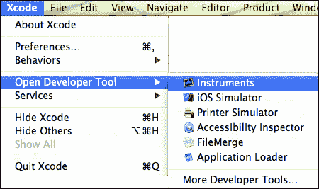

1.  从可用模板中选择 **活动监视器** 选项。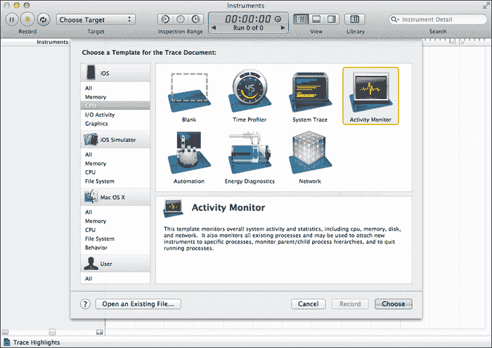

1.  点击 **选择** 按钮以继续向导的下一步。

1.  接下来，从下拉菜单中选择 **所有进程**，如以下截图中的矩形所示：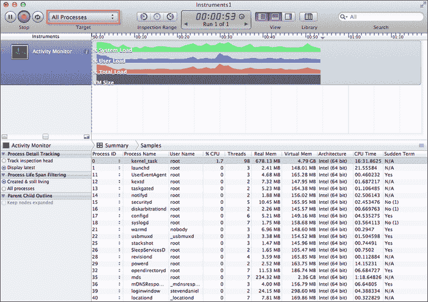

1.  点击 **记录** 按钮开始分析和监控系统进程。

## 工作原理...

在本食谱中，我们学习了如何轻松启动 Instruments 应用程序来分析应用程序。我们学习了如何使用 **活动监视器** 选项来展示我们如何使用此工具来监控当前计算机系统的整体 CPU、内存、磁盘和网络活动。

## 更多内容…

通过使用 Instruments 应用程序，您可以根据各种不同类型的数据收集信息，并同时在同一时间查看这些信息。这使得您能够发现其他情况下难以发现的趋势，并且这可以用来查看程序运行的代码以及相应的内存使用情况。

以下表格提供了 Instruments 应用程序中每个功能的简要描述：

| Instruments 功能 | 描述 |
| --- | --- |
| 仪器面板 | 此面板列出了所有已添加的仪器，供您针对要分析的项目使用。可以通过选择并从仪器库中将每个仪器拖动到该面板中添加新仪器。此面板中的项目也可以被删除。 |
| 跟踪面板 | 此面板显示当前仪器返回数据的图形摘要。每个仪器都有自己的跟踪，提供该仪器收集的数据图表。此面板中的信息为只读。 |
| 详细面板 | 此面板显示每个仪器收集的数据的详细信息。它显示收集并用于在跟踪面板内创建图形视图的事件集。根据仪器的类型，此面板表示的信息可以自定义以不同方式表示数据。 |
| 扩展详细面板 | 此面板显示当前在详细面板中选中的项目的详细信息。此面板显示完整的堆栈跟踪、时间戳以及其他为给定事件收集的特定于仪器的数据。 |
| 导航栏 | 此面板显示您当前的位置以及您到达那里的步骤。它包括两个菜单：活动仪器菜单和详细视图菜单。您可以通过点击导航栏中的条目来选择活动仪器，以及详细视图中的级别和信息类型。 |

仪器跟踪文档工具栏允许您添加和控制仪器、打开视图以及配置跟踪面板，如下面的截图所示：

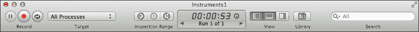

以下表格为工具栏上每个不同控制项的解释：

| 工具栏项 | 描述 |
| --- | --- |
| 暂停/继续按钮 | 此按钮在记录过程中暂停跟踪数据的收集。当在跟踪面板中按下暂停按钮时，它将在跟踪数据中显示一个间隙，以突出显示这一点。 |
| **记录**/停止按钮 | 此按钮开始或停止记录过程。您使用此按钮开始收集应用程序的跟踪数据。 |
| 循环按钮 | 此按钮允许您设置记录器在播放时是否应该循环，以连续重复记录的步骤。如果您想收集给定步骤集的多次运行，这可能很有用。 |
| **目标** | 此按钮用于选择文档的跟踪目标。这是数据收集的过程。 |
| **检查范围** | 此功能允许您在跟踪面板中选择时间范围。当设置完成后，仪器将仅显示指定时间期间收集的数据。使用此控制项的按钮可以设置检查范围的起始和结束点，并清除当前范围。 |
| 时间 / 运行控制 | 显示当前文档跟踪所经过的时间。如果跟踪文档包含与它关联的多个数据运行，您可以使用箭头控件选择您想在跟踪面板中显示的运行数据。 |
| **视图** 控制器 | 隐藏或显示 **Instruments** 面板、**详细** 面板和 **扩展** **视图** 面板。这些控件使您更容易只关注您感兴趣的区域。 |
| **库** | 隐藏或显示 Instruments 库窗口。 |
| **搜索** | 此选项根据您输入的搜索词过滤 **详细** 面板中的信息。 |

Instruments 应用程序现在位于 `/Developer/Applications` 文件夹内的 Xcode 包中，可以通过 Xcode 开发 IDE 启动。

### 注意

有关使用 Instruments 应用程序调试应用程序的更多信息，您可以参考位于以下位置的 Apple 开发者文档：

[`developer.apple.com/library/ios/#documentation/DeveloperTools/Conceptual/InstrumentsUserGuide/Introduction/Introduction.html`](https://developer.apple.com/library/ios/#documentation/DeveloperTools/Conceptual/InstrumentsUserGuide/Introduction/Introduction.html)

## 参见

+   *跟踪 iOS 应用程序* 菜谱

+   *运行和性能分析项目* 菜谱

+   *添加和自定义视图* 菜谱在 第二章，*用户界面 – 创建应用 UI*

# 跟踪 iOS 应用程序

在这个菜谱中，我们将学习如何打开一个用于性能分析的项目。

## 准备工作

在本节中，我们将首先打开我们在上一章中创建的 **TwitterExample** 应用程序。

## 如何操作...

要开始跟踪应用程序，请按照以下概述的简单步骤操作：

1.  从 `/Developer/Applications` 文件夹启动 Xcode。

1.  导航到 **文件** | **打开**，或者按 *Command* + *O*。

1.  然后，从对话框中选择 `TwitterExample.xcodeproj` 文件。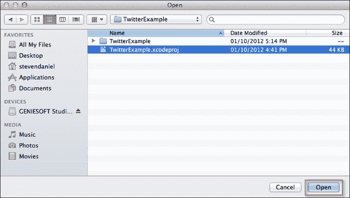

1.  点击 **打开** 按钮继续，并将您的项目加载到 Xcode 工作区环境中。

## 它是如何工作的...

在这个菜谱中，我们选择了我们在上一章中创建的 `TwitterExample` 应用程序，它将被用于使用 Instruments 应用程序来分析其性能。

在我们接下来的菜谱中，我们将探讨如何使用系统跟踪工具来性能分析我们的应用程序，以追踪可能影响您 iOS 应用程序整体性能的系统调用、内存和线程调用。

## 参见

+   *如何在第二章* 中运行和性能分析 iOS 项目 *菜谱

+   *如何检测虚拟机故障* 菜谱

# 运行和性能分析 iOS 项目

在这个菜谱中，我们将学习如何使用系统跟踪工具来监控您应用程序的性能。

## 准备工作

在本节中，我们将学习如何在 Xcode 环境中运行 Instruments 应用程序以分析我们的`TwitterExample`应用程序。

## 如何操作...

要开始分析我们的**TwitterExample**，请按照以下步骤操作：

1.  从**项目导航器**窗口中选择**TwitterExample**选项。

1.  从**产品**菜单中选择**为** | **配置文件**，或者使用键盘快捷键*Shift* + *Command* + *I*。

1.  接下来，从**产品**菜单中选择**配置文件**以启动 Instruments 应用程序。同样，您也可以使用键盘快捷键*Command* + *I*。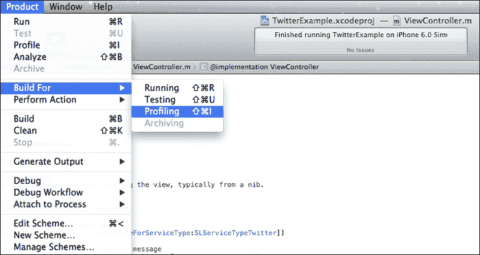

1.  一旦选择了此选项，您最终将在屏幕上看到**Instruments**应用程序窗口。以下截图显示了这一过程：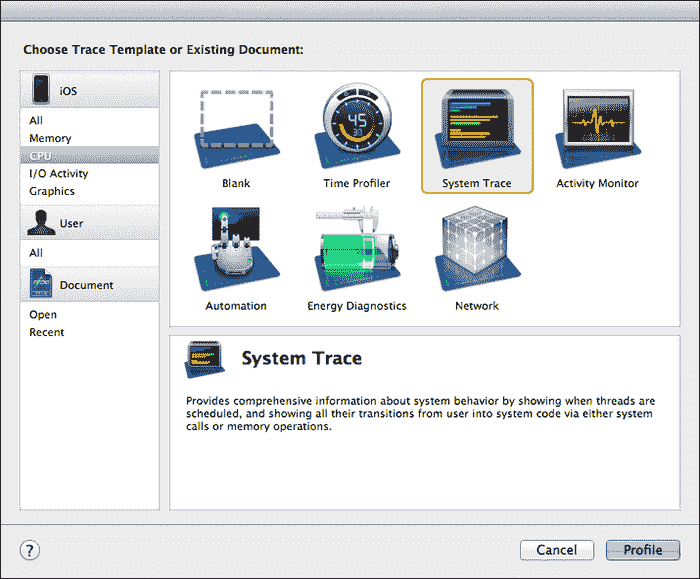

1.  接下来，从可用模板列表中选择**系统跟踪**选项。

1.  点击**配置文件**按钮以开始分析我们的`TwitterExample`应用程序。

    您的应用程序将被分析，并对所有已对内存进行的系统调用和线程进行分析。这些也包括**虚拟内存**（**VM**）操作。

    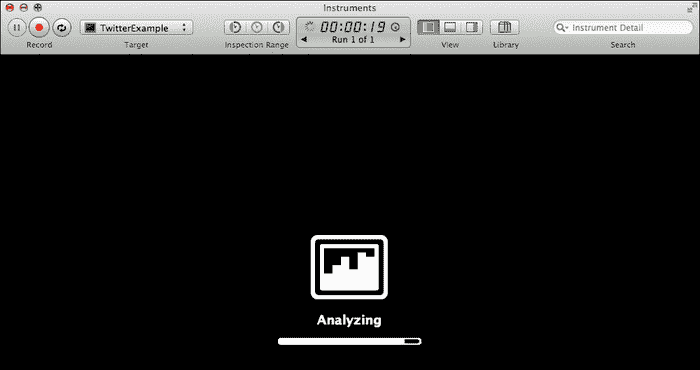

1.  经过几秒钟后，您的跟踪信息将显示出来，这将包含有关线程和系统调用及其持续时间的详细信息。其他信息，如 VM 故障，也如以下截图所示记录：

您可以选择通过点击**记录**按钮停止应用程序的分析，因为 Instruments 应用程序已经完成了全面的分析。

## 工作原理...

在本教程中，我们学习了如何在 Xcode 开发环境中直接运行 Instruments 应用程序。然后我们看到了如何使用系统跟踪工具来分析我们的应用程序，这使我们能够监控 Instruments 应用程序遇到的系统调用、线程以及虚拟内存故障。

## 还有更多...

除了系统跟踪工具外，Instruments 应用程序还包含其他模板，您可以使用这些模板来分析您的应用程序。以下表格概述了 iOS 开发中可用的每个模板：

| 模板 | 描述 |
| --- | --- |
| `空白` | 创建一个空白的跟踪文档，您可以添加自己的 Instruments 组合。 |
| `时间分析器` | 对一个或所有进程进行低开销和时间采样。 |
| `系统跟踪` | 提供您对可能影响应用程序性能的操作系统不同方面的分析能力。 |
| `活动监视器` | 监控整体 CPU、内存、磁盘和网络活动。 |
| `自动化` | 在您的应用程序内自动执行用户界面测试。 |
| `能源诊断` | 显示有关设备上用于 GPU 活动、显示亮度、睡眠/唤醒、蓝牙、Wi-Fi 和 GPS 的能耗的诊断信息。 |
| `网络连接` | 使用此工具，可以查看每个应用程序的每个连接上的数据流量，以及一些有趣的统计数据，如往返时间和重传请求。您可以使用这些信息帮助减少网络流量和能耗。 |
| `分配` | 监控程序中的内存和对象分配模式。 |
| `泄漏` | 检测应用程序中的内存泄漏。 |
| `线程` | 分析进程内线程状态转换，包括运行和终止的线程、线程状态以及相关的回溯信息。 |
| `文件活动` | 监控应用程序与文件系统的交互。 |

## 参见

+   **运行和配置 iOS 项目**食谱

+   **检测虚拟内存故障**食谱

# 检测虚拟内存故障

在本食谱中，我们将学习如何使用活动监视器工具来监控操作系统和计算机硬盘的性能。

## 准备工作

在本节中，我们将学习如何使用 Instruments 检查虚拟内存，以查看是否发生颠簸（过度分页）或虚拟内存大小过度增长，这表明过度保留的自动释放对象。

## 如何操作...

首先，按照以下概述的简单步骤操作：

1.  从**项目导航器**窗口中选择**TwitterExample**选项。

1.  通过**产品** | **构建为** | **配置**从**产品**菜单导航，或者使用键盘快捷键*Shift* + *Command* + *I*。

1.  接下来，从**产品**菜单中选择**配置**，以启动 Instruments 应用程序。同样，您也可以使用键盘快捷键*Command* + *I*。

1.  接下来，从可用模板列表中选择**活动监视器**选项。

1.  点击**配置文件**按钮开始分析我们的**TwitterExample**应用程序。

    经过几秒钟后，您的跟踪信息将显示出来，这将包含有关应用程序使用的整体 CPU、内存、磁盘和网络活动信息，如下面的截图所示：

    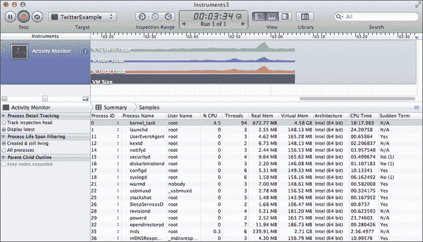

您可以通过点击**停止**按钮停止应用程序的分析，因为 Instruments 应用程序已经完成了全面的分析。

## 它是如何工作的...

在本食谱中，我们学习了如何使用活动监视器组件，该组件使我们能够检查可能导致计算机系统性能缓慢的操作系统虚拟内存。上一张截图显示了系统当前正在承受的整体负载信息，以及用户应用程序的性能和当前分配给缓存这些操作的总体虚拟内存。

## 参见

+   *运行和配置 iOS 项目*的食谱

# 检测内存泄漏

在本食谱中，我们将学习如何使用 Leak 工具检查 iOS 应用程序中的内存泄漏。

## 准备工作

在本节中，我们将学习如何快速确定在我们的应用程序中何时发生内存泄漏。

## 如何操作...

要开始创建一个新的 Xcode 项目，请按照以下简单步骤进行：

1.  从`/Developer/Applications`文件夹中启动 Xcode。

1.  选择**创建一个新的 Xcode 项目**，或者导航到**文件** | **新建项目**。

1.  从可用模板列表中选择**单视图应用程序**选项。

1.  点击**下一步**按钮以继续向导的下一步。

1.  接下来，输入`MemoryLeaks`作为你的项目名称。

1.  在**设备**下拉菜单中选择**iPhone**。

1.  确保未勾选**使用故事板**复选框。

1.  确保未勾选**使用自动引用计数**复选框。

1.  确保未勾选**包含单元测试**复选框。

1.  点击**下一步**按钮以继续向导的下一步。

1.  指定你想要保存项目的地方，然后点击**创建**按钮以在指定位置保存项目。

    我们下一步是创建负责分配我们的字符串对象的代码功能。

1.  从**项目导航器**窗口中打开`ViewController.m`文件实现文件。

1.  修改`viewDidLoad`方法，如下面的代码片段中突出显示的代码部分所示：

    ```swift
    - (void)viewDidLoad
    {
       [super viewDidLoad];
      // Do any additional setup after loading the view, 
       //typically from a nib.
     NSLog(@"Starting....");
     // Loop for 5000 times
     for (int i = 1; i <= 5000; i++){
     NSString *status = [[NSString 
     alloc]initWithString:@"Memory Leaking...."];
     NSLog(@"Value of i:%i and status:%@", i, status);
     }
     NSLog(@"Completed...");
    }
    ```

    我们下一步是开始分析我们的项目，这将帮助我们检查内存泄漏。

1.  从**产品**菜单中选择**产品** | **为...构建** | **分析**，或者使用键盘快捷键*Shift* + *Command* + *I*。

1.  然后，从**产品**菜单中选择**分析**以启动 Instruments 应用程序。同样，你也可以使用键盘快捷键*Command* + *I*。

1.  接下来，从**内存**部分标题下的可用模板列表中选择**Leak**选项。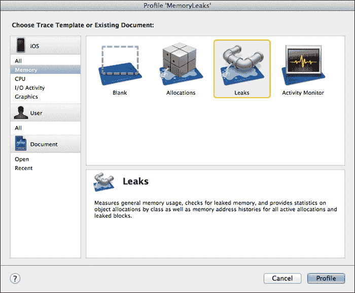

1.  点击**分析**按钮以开始分析我们的`MemoryLeaks`应用程序。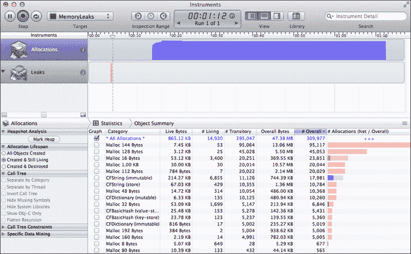

你可以选择通过点击**停止**按钮停止应用程序的分析，因为 Instruments 应用程序已经完成了全面的分析。

## 工作原理...

在本食谱中，我们创建了一个包含在循环中分配 5000 个字符串的代码片段的应用程序，以演示内存泄漏可能发生的方式。代码为每次通过循环时新创建的每个字符串`Status`分配内存，并让每个分配的字符串的指针超出作用域，永远不会被释放。

你会注意到分配的内存从未被释放，这是由于紧密的`for`循环耗尽了`run`循环的执行，导致你的应用程序运行缓慢，可能引发崩溃或简单地挂起。

截图显示了有关当前分配的内存的信息，以及用户应用程序的性能和当前正在分配的总虚拟内存。

## 参见

+   *运行和配置 IOS 项目* 的食谱

+   在 第一章 的 *构建我们应用程序的用户界面* 食谱中，*获取和安装 iOS SDK 开发工具*

# 处理运行时错误

在这个食谱中，我们将学习如何在 iOS 应用程序中处理运行时错误。

## 准备工作

在本节中，我们将学习我们如何处理运行时错误，以及我们如何使用 `@try…@catch…@finally` 子句来改进错误处理，以防止我们的应用程序崩溃。

## 如何做这件事...

要开始，请按照以下简单步骤操作：

1.  打开 `MemoryLeaks.xcodeproj` 项目文件。

1.  从 **项目导航器** 窗口中打开 `ViewController.m` 实现文件。

1.  修改 `viewDidLoad` 方法，如下面的代码片段中突出显示的代码部分所示：

    ```swift
    - (void)viewDidLoad
    {
       [super viewDidLoad];
     [self causeRuntimeError];
    }
    ```

1.  接下来，创建 `causeRuntimeError` 方法，如下面的代码片段所示：

    ```swift
    -(void)causeRuntimeError
    {
       NSLog(@"Runtime Error section started");
      NSMutableArray *myArray = [NSMutableArray   
       array];
      for (int x = 0; x < 30; x++) {
        // Add the value to our Array
        [myArray addObject:[NSNumber numberWithInt:x]];
      }
      // This will cause a Runtime error, as we don't have any
      // item at this index within the array.
      [myArray removeObjectAtIndex:30];
      NSLog(@"Runtime Error section completed.");
    }
    ```

1.  然后，通过导航到 **产品** | **运行** 从 **产品** 菜单，或按 *Command* + *R* 键来构建和运行应用程序。

    你会注意到一旦程序执行，就会抛出异常，代码执行停止。以下截图显示了 Xcode IDE 中的异常错误详细信息：

    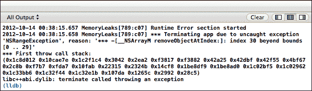

## 它是如何工作的...

在这个食谱中，我们创建了一个新的方法 `causeRuntimeError`，它分配了一个数组以容纳最大容量为 30 项。然后我们遍历循环，并将从 0 到 29 的整数值添加到这个数组中。一旦所有项目都已添加，循环退出，然后我们尝试从数组中移除第 31 个位置的项。

由于我们在数组中未存储第 31 个对象，这导致代码执行停止，如前一个截图所示，异常错误信息显示。

### 注意

如果你想要了解更多关于 `NSMutableArray` 类的信息，你可以参考以下链接中的 Apple 开发者文档：

[`developer.apple.com/library/ios/#documentation/Cocoa/Reference/Foundation/Classes/NSmutableArray_Class/Reference/Reference.html`](https://developer.apple.com/library/ios/#documentation/Cocoa/Reference/Foundation/Classes/NSmutableArray_Class/Reference/Reference.html)

## 更多...

Objective-C 提供了一个安全的方法，可以帮助你处理可能防止你的应用程序崩溃的异常错误。请记住，这仍然会导致错误，但异常错误将被你的应用程序处理，防止你的应用程序崩溃，并允许你的代码继续执行。

异常是中断程序正常执行流程的特殊条件。异常可能由硬件和软件的多种原因生成（通常说异常是被引发或抛出的）。

示例包括算术错误，如除以零、调用未定义的指令（如尝试调用未实现的方法）以及尝试访问超出范围的集合元素。

Objective-C 异常支持涉及四个编译器指令：`@try`、`@catch`、`@throw`和`@finally`，这些将在下表中解释：

| Objective-C 异常处理器 | 描述 |
| --- | --- |
| `@catch` | 这个代码块包含在`@try {}`块中抛出的异常的处理逻辑。你可以有多个`@catch {}`块来捕获不同类型的异常。 |
| `@throw` | 这个编译器指令允许你抛出一个异常，本质上是一个 Objective-C 对象。你通常使用`NSException`对象，但不是必须使用它。 |
| `@finally` | 无论是否抛出异常，此代码块都必须执行，并在捕获语句完成后执行。 |

让我们看看如何修改我们的`causeRuntimeError`方法以利用这些编译器指令，并防止我们的代码崩溃：

1.  修改`causeRuntimeError`方法，如下面的代码片段中突出显示的代码部分所示：

    ```swift
    -(void)causeRuntimeError
    {
       NSLog(@"Runtime Error section started");
      NSMutableArray *myArray = [NSMutableArray 
                      array];
      for (int x = 0; x < 30; x++) {
        // Add the value to our Array
        [myArray addObject:[NSNumber numberWithInt:x]];
      }
      // This will cause a Runtime error, as we don't have any
      // item at this index within the array.
     @try {
     [myArray removeObjectAtIndex:30];
     }
  @catch (NSException *exception) {
     NSLog(@"Error: %@", exception);
     }
     @finally {
     NSLog(@"Runtime Error section completed.");
     }
    }
    ```

1.  接下来，通过导航到**产品** | **运行**从**产品**菜单，或者按*Command* + *R*来构建和运行应用程序。

你会注意到一旦程序执行，异常就会被`@catch`代码块捕获，并将异常错误信息记录到控制台窗口，然后代码执行继续正常。

### 注意

如果你想了解更多关于 Objective-C 异常处理的信息，可以参考以下链接的 Apple 开发者文档：

[`developer.apple.com/library/ios/#documentation/cocoa/conceptual/objectivec/Chapters/ocExceptionHandling.html`](https://developer.apple.com/library/ios/#documentation/cocoa/conceptual/objectivec/Chapters/ocExceptionHandling.html)

## 参见

+   *运行和性能分析 iOS 项目*配方

+   为我们的应用程序构建用户界面中的*构建用户界面*配方，*获取和安装 iOS SDK 开发工具*

# 处理编译时错误

在这个配方中，我们将学习如何在 iOS 应用程序中处理编译时错误。

## 准备工作

在本节中，我们将了解编译时错误以及如何纠正这些错误。

## 如何做...

首先，按照以下简单步骤操作：

1.  打开`MemoryLeaks.xcodeproj`项目文件。

1.  从**项目导航器**窗口打开`ViewController.m`实现文件。

    按照以下代码片段中高亮显示的代码部分修改`viewDidLoad`方法：

    ```swift
    - (void)viewDidLoad
    {
       [super viewDidLoad];
     [self causeCompileTimeError];
    }
    ```

1.  接下来，创建`causeCompileTimeError`方法，如下面的代码片段所示：

    ```swift
    -(void)causeCompileTimeError
    {
       NSLog(@"Compile-time Error section started");
       // This will cause a Compile-time error, as we don't have
       // a color called BlueColor
       self.view.backgroundColor = [UIColor BlueColor]; 
    	NSLog(@"Compile-time Error section completed.");
    }
    ```

    你会注意到编译器通知你找不到不存在的方法。下面的截图显示了 Xcode IDE 中的编译器错误详情。

    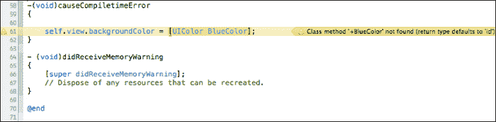

## 它是如何工作的...

在本配方中，我们创建了一个新的方法`causeCompiletimeError`，将视图的背景色设置为蓝色。我们使用`UIColor`类来设置和指定我们希望视图背景色采用的颜色。

我们收到了一个编译器警告，告知我们使用了不存在的方法。这类错误最明显，通常这些错误来自打字错误，但可以使用 Xcode 中的代码自动完成轻松修复。

Objective-C 编译器是区分大小写的，这意味着`UIcolor`和`UIColor`被处理为不同的。例如，在 Objective-C 中，编译器可以理解以下代码行：

```swift
self.view.backgroundColor = [UIColor blueColor];
```

但是，如果你像我们在方法定义中做的那样输入以下内容，编译器会警告你一个潜在的（但不是确定的）问题，因为你指定了一个它无法识别的语言特定语法，因此没有与`UIColor`类关联：

```swift
self.view.backgroundColor = [UIColor BlueColor];
```

### 注意

如果你想要了解更多关于`UIColor`类的信息，你可以参考以下链接中的 Apple 开发者文档：

[`developer.apple.com/library/ios/#documentation/uikit/reference/UIColor_Class/Reference/Reference.html`](https://developer.apple.com/library/ios/#documentation/uikit/reference/UIColor_Class/Reference/Reference.html)

## 相关内容

+   *运行和剖析 iOS 项目*的配方

+   第一章中“为我们的应用程序构建用户界面”的配方，*获取和安装 iOS SDK 开发工具*

+   第二章中“添加和自定义视图”的配方，*用户界面 – 创建 UI*

# 添加和配置 Instruments

Instruments 应用程序包含一系列内置的 Instruments，可以帮助你更轻松地工作，通过它们从一个或多个进程中收集数据。大多数这些 Instruments 使用时配置很少，只需将它们添加到你的跟踪文档中即可开始收集跟踪数据。在本配方中，我们将探讨如何将 Instruments 添加和配置到现有的跟踪文档中。

## 准备工作

在本节中，我们将学习如何添加和配置 Instruments。

## 如何做...

要了解如何添加和配置 Instruments，请按照以下步骤操作：

1.  打开`MemoryLeaks.xcodeproj`项目文件。

1.  从**项目导航器**窗口打开`ViewController.m`实现文件。

1.  按照以下代码片段修改`viewDidLoad`方法：

    ```swift
    - (void)viewDidLoad
    {
        [super viewDidLoad];
      // Do any additional setup after loading the view, 
       // typically from a nib.
      NSLog(@"Starting....");
      // Loop for 5000 times
      for (int i = 1; i <= 5000; i++){
        NSString *status = [[NSString 
                  alloc]initWithString:@"Memory Leaking...."];
        NSLog(@"Value of i: - %i and status - %@", i, status);
      }
      NSLog(@"Completed..."); 
    }
    ```

1.  从**产品**菜单导航到**产品** | **构建为** | **分析**，或者使用键盘快捷键*Shift* + *Command* + *I*。

1.  然后，从**产品**菜单中选择**分析**以启动仪器应用程序。同样，您可以使用键盘快捷键*Command* + *I*。

1.  接下来，从**内存**部分下的可用模板列表中选择**空白**选项。

1.  最后，点击**分析**按钮开始分析。

Instruments **库**列表显示您可以使用并添加到跟踪文档的所有仪器。库包含与 Xcode 4 安装一起提供的所有内置仪器，以及您已经创建的任何自定义仪器。

要打开**仪器**窗口，请按照以下简单步骤操作：

1.  在跟踪文档窗口中点击**库**按钮，或者从菜单栏导航到**窗口** | **库**。或者，您可以使用*Command* + *L*键盘快捷键。

1.  接下来，从下拉列表中选择**内存**选项，如图下截图所示：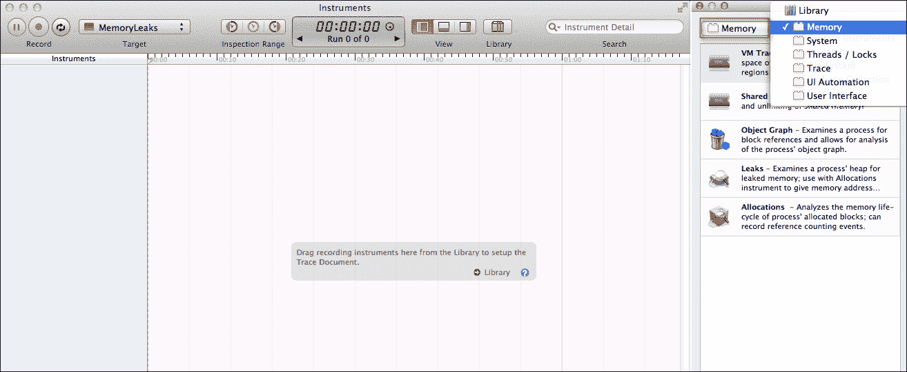

1.  要添加仪器，从仪器库列表中选择仪器，然后将其拖动到**仪器**窗格，或者直接拖动到跟踪文档的**跟踪**窗格，如图下截图所示：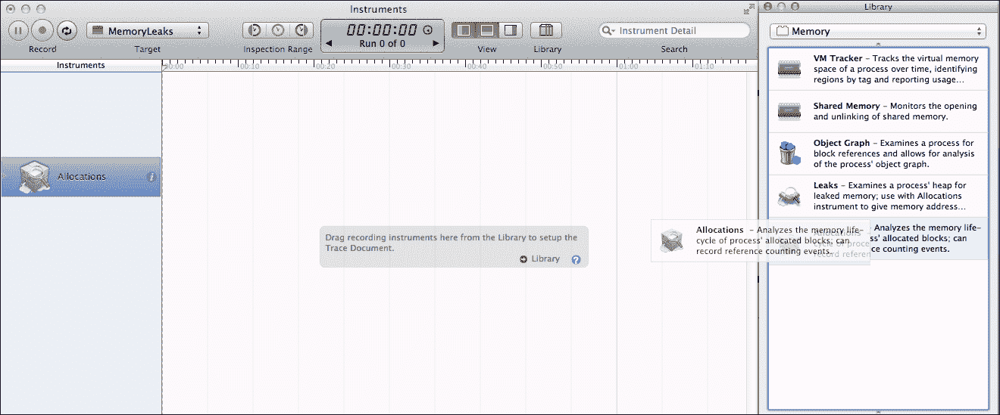

1.  然后，点击**记录**按钮开始分析**内存泄漏**应用程序。

1.  要配置仪器，从**仪器**窗格中选择仪器，然后点击位于仪器右侧的仪器检查器图标，如图下截图所示：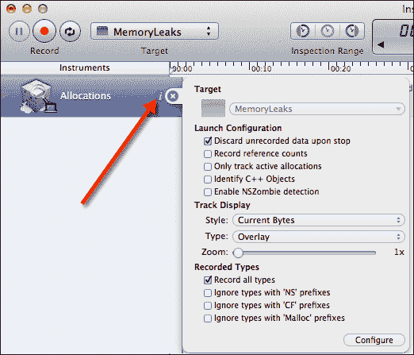

1.  要关闭检查员，点击由**X**标记的高亮关闭按钮。您同样可以使用*Command* + *I*键或导航到**文件** | **获取信息**来打开和关闭此窗口。

## 工作原理...

在本菜谱中，我们学习了如何在跟踪文档中使用仪器检查器轻松添加和配置仪器。列出的选项根据正在配置的仪器类型而有所不同。大多数仪器包含配置跟踪窗格内容的选项，而只有少数仪器包含确定仪器收集的信息类型的附加功能。

根据正在配置的仪器类型，它们可以在跟踪文档中的数据记录之前、期间或之后进行配置。**缩放**控件可以在您配置的大多数仪器检查器控件中找到。此功能控制显示在**跟踪**窗格中的跟踪数据的放大倍数，并调整仪器在**跟踪**窗格中的高度。

## 参见

+   *运行和分析 iOS 项目*菜谱
